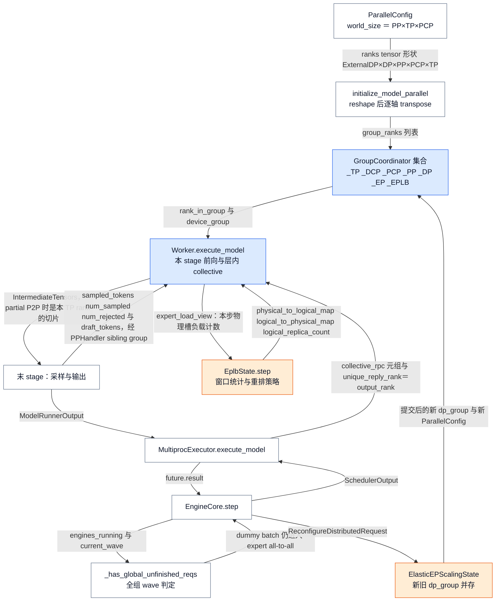
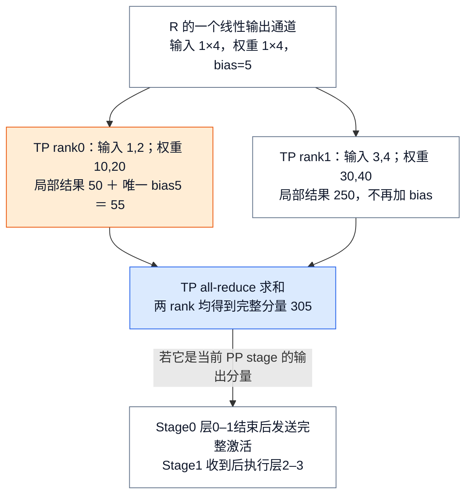
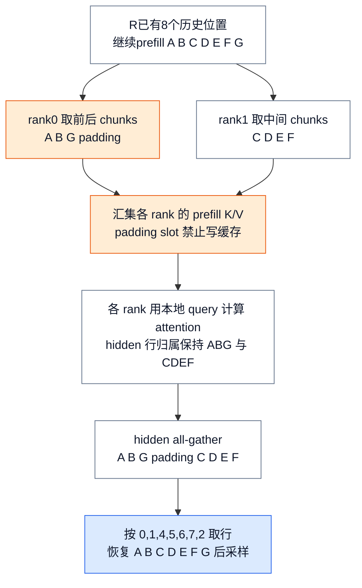
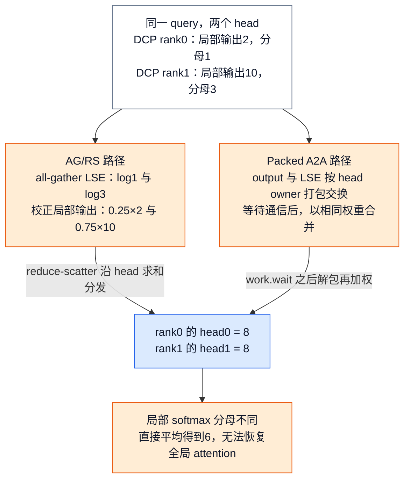
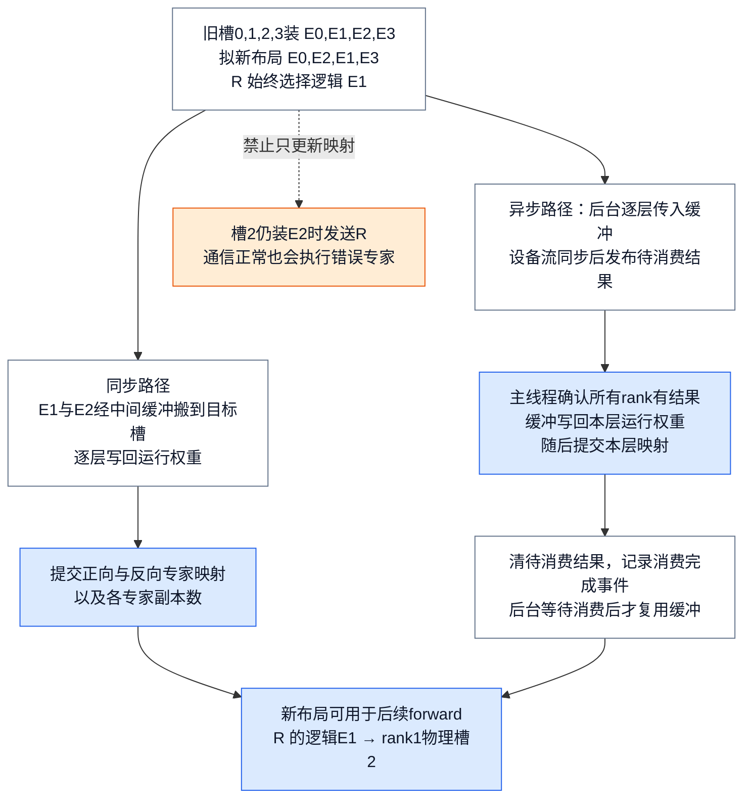
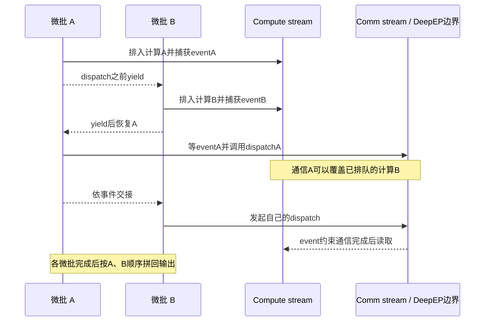

# vLLM 分布式推理：模型怎样切开，又怎样算回一个结果

> **源码基线**：`vllm-project/vllm@199cb9b964822e59ab9b58d88e7be31eb419a2ae`（`main` 快照，2026-09-07 UTC）
> **主题**：从模型容量、请求吞吐和长上下文的不同需求出发，解释 TP/PP/DP/EP/PCP/DCP 分别切什么，以及局部计算如何恢复为正确输出。随后介绍 rank/group 与 executor 的执行合同、PP 部分发送与反向采样同步、Elastic EP 重配、EPLB 权重搬迁和微批重叠的完成边界。
> **适用范围**：拥有并行轴、rank/group 构造、executor fan-out、collective 顺序、PP 正反向同步、Elastic EP 扩缩容重配、EPLB 分布式搬迁及 DBO。明确不拥有：进程启动/广播 RPC/响应 FIFO 归26，Serving 路由与 wave 通知归13，KV block 分配与生命周期归08，模型层 TP/PP 接口与权重 ABI 归09，attention backend 与 kernel 条件归10，两代 Runner 的批组装与执行归11/12，编译与 CUDA Graph 归19，设备算子归20，跨 Engine KV transfer 的 rank/group 约定归22，在线模型权重更新归25。
> **最近更新**：2026-09-13。补齐闭环位置图、十三条核心流程的触发/阶段/完成点、所有权表、配置契约与聚合成本账；新增 Elastic EP 扩缩容重配一节；修正 `get_pp_indices` 余数方向与 `Worker.execute_model` 符号名。

## 1. 同样增加两张卡，解决的可能是完全不同的问题

假设一个四层语言模型无法装进单张卡，但两张卡能容纳。请求 R 需要顺序经过这四层才能得到下一 token；请求 S 同时到达。可以把每一层的矩阵分给两张卡一起算，也可以让第一张卡负责前两层、第二张负责后两层。前者是 **TP，tensor parallel**，后者是 **PP，pipeline parallel**。两者都切开一个模型，却需要不同的通信：TP 在层内合并局部结果，PP 在层间传递中间激活。

如果一个副本已经装得下，而问题是 R、S 排队等待，则可以复制整个模型，让两个 **DP，data parallel** 副本分别处理请求。DP 增加独立 batch 容量，却不缩小单个副本。对于只激活部分 experts 的 MoE 模型，**EP，expert parallel** 则把专家分给不同设备，按每个 token 的选择发送计算任务。

长上下文又分两种问题：prefill 的新 token 太多，可以用 **PCP，prefill context parallel** 分担 query/token 计算；decode 的历史 KV 占用太大，可以用 **DCP，decode context parallel** 切历史上下文，再合并局部 attention。它们不能因为名称都含 context 就被当成同一切分。

本页的共同问题是：**设备只持有一部分数据时，哪一次通信把它恢复成正确语义？** 只有先知道这个答案，GPU 数、进程数和 group 数才有意义。下述数字均为教学输入，不是性能测量；选型收益仍需按 [[04_vllm_performance_tuning_guide|评测与调优]] 验证。

| 目标 | 候选轴与切分对象 | 恢复完整语义的动作 | 所需代价 |
|---|---|---|---|
| 单副本权重/显存不足 | TP：层内权重与通道；PP：连续 layer ranges | TP 汇总 partial sums 或拼 output shards；PP 顺序传激活 | 层内同步，或 stage 串行、bubble 与点对点传输 |
| 已能容纳模型，需要更多请求吞吐 | DP：模型副本、请求队列、KV pool | dense 请求在自己的副本完成 | 复制权重与缓存；MoE DP 可能仍处于共同通信域 |
| MoE 专家分布或负载不均 | EP：专家归属；EPLB：物理槽与副本布局 | token dispatch → expert 计算 → combine | all-to-all、负载偏斜、搬迁带宽与临时缓冲 |
| 长 prefill 首 token 太慢 | PCP：本次 query/token 分工 | 交换所需 K/V，恢复输出 token 顺序 | 新增 ranks、padding、K/V 和 hidden gather |
| Decode KV 复制太多 | DCP：已有 ranks 上的 KV token 分片 | LSE 加权合并局部 attention | 每步通信与后端限制；不新增进程 |

官方优化指南建议容量问题先在高带宽域考虑 TP、再评估 PP，吞吐扩展再考虑 DP。这里保留这一部署思路，但不把它当成自动优化公式。EP 只改变 MoE expert 的分布，并不把模型全部 dense layers 变成专家并行。

**这一页是什么。** 它是**并行几何与通信合同层**：把 `ParallelConfig` 解析出的轴数变成一组 `GroupCoordinator` 成员身份，规定每条 collective 的成员、顺序与 shape/lifetime，并说明局部结果在哪一次通信之后才恢复成完整语义。它同时拥有这一层自己的动态事务：Elastic EP 换 DP group、EPLB 换专家物理槽、DBO 在时间维再切一层微批。

**它不是什么。** 它不是进程管理层：worker 进程启动、广播 RPC 的四通道与响应 FIFO、shutdown 归 [[26_vllm_multiproc_executor_rpc_deepdive|MultiprocExecutor 专题]]。不是请求控制面：DP 请求路由、wave 通知与就绪屏障归 [[13_vllm_serving_control_plane_analysis|Serving 控制面]]。不是 KV 分配器：block 分配、`block_size` 整除约束与 KV 生命周期归 [[08_vllm_kv_cache_management_analysis|KV Cache 管理]]。不是模型库：`make_layers` / `PPMissingLayer` 怎样声明 PP 边界、权重 ABI 怎样按 TP rank 切开归 [[09_vllm_model_library_analysis|模型库与模型 ABI]]。不是 attention 实现：产出 `cp_attn_out` / `cp_attn_lse` 的 backend 与 kernel 条件归 [[10_vllm_attention_backends_analysis|Attention Backend]]。不是 Runner：`BatchExecutionDescriptor` 之后的批组装与设备执行归 [[11_vllm_model_runner_v1_analysis|Model Runner V1]] / [[12_vllm_model_runner_v2_analysis|Model Runner V2]]。不是跨 Engine 传输：EPD/PD 分离在 KV 平面的 rank 约定（实际由 `kv_transfer_params` 的 tp/dcp/pp 与 `NixlAgentMetadata` 的 DCP/PCP 字段承载；`KVTransferConfig.kv_rank` / `kv_parallel_size` 在本基线下无读取者）归 [[22_vllm_disaggregated_kv_serving_analysis|分离式 KV Serving]]。

<!-- Figure spec: closed-loop position figure for the distributed layer. Every edge carries the real object crossing the boundary, not a verb. Three return edges close the loop: PPHandler sibling-group sampled broadcast back to earlier stages, EPLB three maps back into the running weights, and Elastic EP's committed new dp_group back into the coordinator set. Not a call graph; membership edges and data edges are drawn together deliberately because both are this layer's contracts. -->


### 1.1 本页拥有的十三条核心流程

下表穷尽本页拥有的流程；每条的触发、阶段与完成点见 §1.3，代价见第10节。

| 功能 | 要解决的问题 | 设计与实现入口 | 产出的可观察变化 |
|---|---|---|---|
| ① 并行配置解析与校验 | 用户给的轴数是否构成一个存在执行路径的组合 | `ParallelConfig.__post_init__` 算 `world_size`；`_validate_parallel_config` 查 EPLB 前提与 PCP/DCP/DP 组合；`_verify_args` 查微批门槛；`VllmConfig._get_dbo_unsupported_features` | `world_size` / `data_parallel_index` 落定并冻结，或提前抛 `ValueError` / `NotImplementedError` |
| ② 分布式环境与 group 构造 | 同一批进程怎样知道自己属于哪些通信组 | `init_worker_distributed_environment` → `init_distributed_environment` → `initialize_model_parallel` 的 reshape 与逐轴 transpose | 五个模型并行 group 就位并打出 rank 分配日志，`_EP` 按「MoE 或 `model_config is None`」、`_EPLB` 按 `enable_eplb` 另行创建，否则保持 None；重复初始化被 `ensure_model_parallel_initialized` 的四条 assert 拦截 |
| ③ executor 选择与 worker 拉起 | 谁把这些 worker 叫起来，结果从哪个 rank 收 | `Executor.get_class` 的六个分支；`MultiprocExecutor._init_executor` / `_get_output_rank` | `self.output_rank` 固定为 `world_size − TP×PCP`；所有 worker 进入可接收 RPC 的状态 |
| ④ TP 层内 collective | 层内切开的权重怎样合回完整语义 | `RowParallelLinear.forward` / `ColumnParallelLinear.forward`；`tensor_model_parallel_all_reduce` | 返回张量在每个 TP rank 上都具备完整模型语义：row 求和、column 按通道拼接 |
| ⑤ PP 跨 stage 传递 | 中间激活怎样从上一 stage 到下一 stage，且不覆盖在途 buffer | `Worker.execute_model` 的 `irecv_tensor_dict` / `isend_tensor_dict`；`GroupCoordinator._should_use_all_gather` | 接收侧首次访问 tensor 时通信完成并做完 TP all-gather；发送侧的 handle 在下一 step 开头才 `wait()` 返回 |
| ⑥ PP 反向采样同步 | 靠前的 stage 怎样知道末 stage 采样、拒绝、draft 了什么 | `compute_need_sampled_mask`；`PPHandler` 在 sibling NCCL group 上广播 | step T 的结果在 step T+`pp_size` 由 `get_prev_sampled_outputs()` 取出，且 slot generation 与快照一致才交付 |
| ⑦ DP 共同推进 | 没有请求的 rank 怎样不破坏全组 collective | `run_engine_core` 分 `DPEngineCoreProc` 与 `reconfigure_for_independent_dp_rank()` 两支；`_has_global_unfinished_reqs` | `engines_running` 转 False 并让本 wave 收尾；paused 状态忽略 `START_DP_WAVE`，后续 `dist.barrier(dp_group)` 才能完成 |
| ⑧ PCP 切分—计算—gather—恢复 | 一次 prefill 的 token 分给多 rank 后怎样恢复全局顺序 | `PCPManager._iter_rank_chunks` / `_reorder_segments` / `_build_batch_layout`；`_gather_prefill_cache_inputs` | `restore_for_sampling` 返回按全局顺序排好的 hidden rows，采样器看到的批与未切分时一致 |
| ⑨ DCP KV 切分与 LSE 合并 | 两份局部 softmax 输出怎样合成一个正确 attention | `MLADCPManager._init_combine` 选路；`_correct_attn_cp_out_kernel` 加权；`cp_lse_ag_out_rs` / `cp_lse_ag_out_ar` / `dcp_a2a_lse_reduce` | 返回 `[B, H/N, D]` 的 head-scattered 输出，或 all-reduce 分支的完整 head；`return_lse` 时另给全局 LSE |
| ⑩ EP token dispatch/combine | token 选中的逻辑专家在哪个物理槽上 | `BaseRouter._select_experts`：`_compute_routing` → `capture_fn` → `_apply_eplb_mapping` → `_convert_indices_dtype` | 返回 `(topk_weights, topk_ids)`，其中 ids 已是物理 ID；combine 后每个 token 恢复原身份与路由权重 |
| ⑪ EPLB 统计—策略—搬迁—提交 | 专家负载不均时怎样换布局而不换语义 | `EplbState.step` / `rearrange`；同步 `rearrange_expert_weights_inplace`，异步 `transfer_run_periodically` + `_move_to_workspace` | 两个不同完成点：同步是 `_commit_eplb_maps` 返回；异步是逐层 `_commit_eplb_maps_for_layer` 加 `consumed_event.record()` |
| ⑫ DBO 意愿协商—切分—overlap—合并 | 通信等待窗口怎样被另一半 batch 的计算填上 | MRV1 `_synchronize_dp_ranks` / `_post_process_ubatch`；MRV2 `sync_cudagraph_and_dp_padding` + `UBatchRunner.run`；`UBatchContext` 的 yield | MRV1 按微批编号排序后 `torch.cat` 得完整输出；MRV2 全线程 join 后 `merge_ubatch_outputs` 返回单一输出 |
| ⑬ Elastic EP 扩缩容重配 | 运行中改变 DP 规模时，旧 group 怎样安全退役 | `ElasticEPScalingState` 的四张状态机；`EngineCore.reinitialize_distributed` / `commit_prepared_elastic_ep` | `_commit_new_dp_group` 销毁旧 stateless dp_group、换上新 group 并同步 wave；`_update_parallel_config` 写回新 DP 规模 |

### 1.2 哪些是基础路径，哪些要显式启用

| 流程 | 基础 / 条件 | 启用条件 | 本页小节 |
|---|---|---|---|
| ① 配置解析与校验 | 基础 | 每次启动都跑 | §8、§9 |
| ② group 构造 | 基础 | 每个 worker 都跑，单卡也建出 world size 为 1 的各 group | §4.1、§4.2 |
| ③ executor 与 output rank | 基础 | 每次启动都跑；`output_rank` 公式对 PP=1 同样成立 | §5 |
| ④ TP 层内 collective | 基础 | TP=1 时 `reduce_results and tp_size > 1` 不成立，不发 collective | §2.1 |
| ⑤ PP 跨 stage 传递 | 条件 | `pipeline_parallel_size > 1`；partial P2P 另需元素数可被 TP size 整除 | §5、§5.1 |
| ⑥ PP 反向采样同步 | 条件 | `pipeline_parallel_size > 1` | §5.2 |
| ⑦ DP 共同推进 | 条件 | `data_parallel_size > 1`；MoE 走 `DPEngineCoreProc`，dense 走独立 DP=1 重配 | §5.3 |
| ⑧ PCP | 条件 | `prefill_context_parallel_size > 1`，且 MRV2、且 MLA | §3.1 |
| ⑨ DCP | 条件 | `decode_context_parallel_size > 1` | §3.2 |
| ⑩ EP dispatch/combine | 条件 | MoE 模型且 `enable_expert_parallel` | §6.1 |
| ⑪ EPLB | 条件 | `enable_eplb`，且 CUDA-alike、`enable_expert_parallel`、`TP×PCP×DP > 1` | §6.2 |
| ⑫ DBO / 微批 | 条件 | `use_ubatching`，即 `enable_dbo` 或 `ubatch_size > 1`，再经全组一致协商 | §7～§7.3 |
| ⑬ Elastic EP 重配 | 条件 | `enable_elastic_ep`，另要求 `enable_eplb`、PP=1、非 external/hybrid LB | §4.3 |

### 1.3 每条流程的触发、阶段与完成点

“完成点”一律取一个可观察的事件或返回值，不写“处理完成”。⑤ 与 ⑪ 各有两个不同的完成点，两栏分列。

| 流程 | 触发 | 阶段：读入 → 决定 → 流向 | 完成点（可观察） |
|---|---|---|---|
| ① | `ParallelConfig` 构造（pydantic validator，早于 `VllmConfig.__post_init__`） | 读 EngineArgs → 算 `world_size = PP×TP×PCP`（`external_launcher` 再 `×DP`）→ 过 elastic EP 四条 gate、EPLB 三条前提、PCP/DCP/DP 组合 → 随后由 `VllmConfig.__post_init__` 补微批 a2a backend assert 与 `disable_cascade_attn = True` | `ParallelConfig.world_size` 与 `data_parallel_index` 落定；或抛出点名字段的 `ValueError` / `NotImplementedError` |
| ② | `Worker.init_device` | `torch.accelerator.set_device_index` → `init_worker_distributed_environment`（`set_custom_all_reduce`、按 `distributed_timeout_seconds` 造 timeout）→ `init_distributed_environment` 或 `_init_elastic_ep_world` → `initialize_model_parallel` 依次建 `_TP`、`_DCP`、`_PCP`、`_PP`、`_DP`、`_EP`、`_EPLB` | 打出 `rank %s in world size %s is assigned as DP rank %s, PP rank %s, PCP rank %s, TP rank %s, EP rank %s, EPLB rank %s`；再次进入被 `ensure_model_parallel_initialized` 的 TP/PP/PCP/DCP 四条 assert 拦截 |
| ③ | `EngineCore.__init__` | 读 `distributed_executor_backend` 与 `VLLM_USE_RAY_V2_EXECUTOR_BACKEND` → `Executor.get_class` 六分支 → `_init_executor` 建进程或 actor → 算 output rank | `self.output_rank == world_size − TP×PCP`；`get_response_mqs` 的 `unique_reply_rank` assert 从此以它为界 |
| ④ | 每个 row/column parallel 层的 `forward` | row：`input_is_parallel` 决定是否本地切分 → `bias_ = None if (tp_rank > 0 or skip_bias_add) else bias` → `quant_method.apply` → `reduce_results and tp_size > 1` 时 all-reduce；column：算本地 output shard → `gather_output` 时按通道 all-gather | 返回张量在每个 TP rank 上具备完整语义；`skip_bias_add` 时 bias 作为第二个返回值外移，由调用方自行融合 |
| ⑤ | 非首或非末 stage 的 `Worker.execute_model` | 等上一步 `self._pp_send_work` → 构造 `all_gather_tensors`（仅 PP>1 且 `pass_config.enable_sp` 且 MRV1）→ `irecv_tensor_dict` 包成 `AsyncIntermediateTensors` → runner forward → `isend_tensor_dict` 并保留 `handles[1:]` | **接收侧**：首次访问 tensor 触发 `wait_for_comm()` 并跑完 `_postprocess` 的 TP all-gather。**发送侧**：下一 step 开头 `handle.wait()` 返回，buffer 才可复用 |
| ⑥ | 末 stage 采样完成 | `compute_need_sampled_mask` 排除非最终 prefill chunk → 在 sibling NCCL group 与 `broadcast_stream` 上广播 sampled / `num_sampled` / `num_rejected` / draft → 非末 rank push `PendingRecv`，内含 slot generation 快照 | step T 的结果在 step T+`pp_size` 由 `get_prev_sampled_outputs()` 取出；generation 与快照不一致的旧 slot 结果被丢弃 |
| ⑦ | `run_engine_core` 启动 | MoE 且 DP>1 → `DPEngineCoreProc`；否则 `reconfigure_for_independent_dp_rank()` 把 DP size/local/rank 置 1/1/0 并保留 `data_parallel_index` → busy loop → 无请求 rank 跑 dummy batch → `_has_global_unfinished_reqs` 在 wave 首步及 `dp_sync_interval` 的整数倍步做 CPU all-reduce | `engines_running` 转 False，本 wave 收尾；pause 达成共识后 `ignore_start_dp_wave = True`，使后续 `dist.barrier(dp_group)` 能完成 |
| ⑧ | MRV2 且 PCP>1 的一次 step | `_iter_rank_chunks` 切 `2×pcp` 块、rank 取 `r` 与 `2p−1−r`、decode 行复制 → `_reorder_segments` 把 pure prefill 排到本地末尾 → `_build_batch_layout` 定 `padded_num_tokens = max` 并产出 `hidden_restore_idx` / `padded_gather_idx` / `gathered_kv_write_mask` → `_gather_prefill_cache_inputs` → 本地 attention → hidden all-gather | `restore_for_sampling` 返回按全局顺序排好的 hidden rows；padding 行已被写掩码挡在 KV cache 之外 |
| ⑨ | backend 交出 `cp_attn_out [B,H,D]` 与 `cp_attn_lse [B,H]` | `mask_dcp_empty_shards_` 把空 shard 置零权重 → `_init_combine` 在 direct workspace / `dcp_a2a_lse_reduce` / `cp_lse_ag_out_ar` / `cp_lse_ag_out_rs` 之间选路 → `correct_attn_out` 减最大 LSE 后按 `exp(ℓᵢ−ℓ)` 加权 → reduce-scatter、all-reduce 或 A2A 解包 | 返回 `[B, H/N, D]`（head-scattered）或 PCP 分支的完整 head；A2A 分支在 `work.wait()` 之后解包才算数 |
| ⑩ | MoE 层 forward | `_validate_eplb_state` → `_compute_routing` 得逻辑 `topk_ids` 与权重 → `capture_fn(topk_ids)` 看逻辑 ID → `_apply_eplb_mapping` 转物理，冗余专家时从副本中选一个 → `_convert_indices_dtype` → prepare/finalize dispatch → expert GEMM → combine | `_select_experts` 返回 `(topk_weights, topk_ids)`；combine 后每个 token 恢复原身份与路由权重 |
| ⑪ | 每次 forward 调 `EplbState.step`；`expert_rearrangement_step` 达到 `step_interval` 触发 rearrange | 滑动窗口记录物理槽负载（dummy step 清零但仍推进计数）→ `scatter_add` 回逻辑专家并跨 rank 汇总 → policy 出新 map（ROCm 且改善不足 5% 则 skip）→ 同步：`move_to_buffer` → `move_from_buffer` → 提交；异步：后台 `transfer_layer` → `cuda_stream.synchronize()` → 发布 `pending_result` → 主线程 `_all_ranks_result_ready` → `_move_to_workspace` | **同步**：`_commit_eplb_maps` 返回，`physical_to_logical_map` / `logical_to_physical_map` / `logical_replica_count` 三张一起换新。**异步**：逐层 `_commit_eplb_maps_for_layer` 加 `consumed_event.record()`；`rebalanced` 只在最后一层提交后才转 False |
| ⑫ | `use_ubatching` 且 `_allow_microbatching` 未否决 | MRV1：`_synchronize_dp_ranks` 经 `_run_ar` 做一次 `4×dp_size` 的 all-reduce（原始 token 数、补齐 token 数、微批意愿、cudagraph mode）→ `_post_process_ubatch` 全票制加 `is_last_ubatch_empty` 否决 → `_post_process_dp_padding` 取 max → cg mode 取 min；MRV2：`sync_cudagraph_and_dp_padding` 做一次六行 all-reduce（tokens、cg_mode、uniform_token_count、max_query_len、allow_ubatching、num_reqs），以 `num_tokens_across_dp.min()` 检门槛、以 `max()` 补齐、强制 `CUDAGraphMode.NONE` → 切片 → 每微批一线程，`UBatchContext` 在 dispatch 前 yield → workspace 按 `(ubatch, lane)` 隔离 | MRV1：`sorted(results)` 后沿 dim 0 `torch.cat`。MRV2：`UBatchRunner.run` 全线程 join 后 `merge_ubatch_outputs` 按 `IntermediateTensors` / tuple / tensor 三支返回单一输出 |
| ⑬ | `EngineCore` 收到 `ReconfigureDistributedRequest` | 深拷贝 `ParallelConfig` 改 DP 规模与 master 端口 → 建 `ElasticEPScalingState`（`worker_type ∈ {existing, new, removing}`、`scale_type ∈ {scale_up, scale_down}`）→ `_ensure_new_dp_group` 在 `ElasticEPPrepare` 线程上建新 stateless dp_group，此时新旧并存 → `_execute_async("prepare_reconfiguration", …)` → `_sync_kv_cache_memory_size` 取 MIN → `_mark_ready_for_switch` 写 TCP store → 等 `commit_requested` | `_commit_new_dp_group` 销毁旧 stateless group、换上新 dp_group/dp_rank/dp_store 并 MAX 同步 `(engines_running, current_wave, step_counter)`；`_update_parallel_config` 写回新 DP 规模，状态转 `COMPLETE`，新组 rank 0 发 `RECONFIGURE_FINISHED` |

### 1.4 所有权表：本页拥有的部分与它的邻居

| 对象 | 18 拥有 | 不拥有 → owner |
|---|---|---|
| `output_rank` | 为什么是 `world_size − TP×PCP`，即最后 PP stage 的第一个 TP worker——这是并行几何 | 这条回复怎样从共享内存队列走回父进程、四通道与响应 FIFO、shutdown → **26** |
| `SchedulerOutput` / `ModelRunnerOutput` | 它们跨 executor 边界时的 rank 归属与 `future.result()` 之前的 collective 顺序 | 计划怎样形成、结果怎样对账与释放 → **06** |
| `make_layers` / `PPMissingLayer` / 模型 `forward` 返回的 `IntermediateTensors` | PP 边界由 `get_pp_indices` 怎样定、跨 stage 实际传什么、partial P2P 怎样切 | 模型层如何声明 TP/PP 接口、权重 ABI 与 loader 按 rank 切分 → **09** |
| `cp_attn_out [B,H,D]` + `cp_attn_lse [B,H]` | 从这两个张量开始的跨 rank 合并规则：LSE 加权、reduce-scatter / all-reduce / A2A 选路 | 产出这两个张量的 backend、kernel 条件与 DCP 分支可用性 → **10** |
| `BatchExecutionDescriptor`（`num_tokens` / `num_ubatches` / `cg_mode`）与 `DPSyncState` | 跨 DP rank 的一致性协商、padding 语义与微批切分决策 | 两代 Runner 各自的批组装、稳定行取值与设备执行 → **11 / 12** |
| `cp_kv_cache_interleave_size` 与 KV token 交错 | DCP 为什么要交错存储，以及它对合并规则的影响 | block 分配、`block_size` 整除约束、KV 生命周期与回收 → **08** |
| DP wave 与 `engines_running` | 全组同步、dummy batch 与 MoE collective 的实际执行 | 请求路由、wave 通知、就绪屏障与服务故障范围 → **13** |
| `CUDAGraphMode.NONE` | 微批路径为什么必须强制它，以及 DP 各 rank 为什么必须取同一 mode | 编译区间、capture、descriptor dispatch 与失效 → **19** |
| `topk_ids`（物理 ID）+ `topk_weights` | 逻辑到物理的映射规则与 EP 分组 | token packing、expert GEMM、combine 的设备算子 → **20** |
| `kv_rank` / `kv_parallel_size` / transferable group / `NixlAgentMetadata` 的 DCP/PCP 字段 | 无 | 跨 Engine KV transfer 的 rank 与 group 约定，EPD/PD 分离的 rank 约定 → **22**。注意 `KVTransferConfig.kv_rank` / `kv_parallel_size` 在本基线下**声明但无任何 V1 connector 读取**；实际生效的 KV 平面 rank 约定是 `kv_transfer_params` 的 `tp_size` / `dcp_size` / `pp_size`、`NixlAgentMetadata.dcp_size` / `pcp_size` 与 `vllm/distributed/kv_transfer/kv_connector/v1/nixl/tp_mapping.py::compute_tp_mapping` |
| EPLB 搬迁 vs 在线换权重 | EPLB 的两个完成点与 `rebalanced` 的跨 rank 一致性 | RDT 静态计划、`update_weights` 与 `drain_pending()` → **25** |

## 2. 先算一个最小例子：TP 与 PP 怎样恢复模型输出？

### 2.1 TP 的合并是求和还是拼接，取决于切的是哪一维

为说明 `RowParallelLinear.forward`，只取一个输出通道：输入 $x=(1,2,3,4)$，权重 $w=(10,20,30,40)$，bias 为 5。TP=2 沿输入通道分开；rank 0 持有前两个输入/权重，rank 1 持有后两个。普通启用 `reduce_results` 且不延迟 bias 的路径是：

$$
\begin{aligned}
p_0 &= 1\cdot 10+2\cdot 20+5=55, \\
p_1 &= 3\cdot 30+4\cdot 40=250, \\
y &= p_0+p_1=305.
\end{aligned}
$$

每个 rank 的局部 GEMM 只算了一部分求和项，所以要 all-reduce；bias 只在 TP rank 0 加一次。如果两边都加 5，合并会错成 310。相反，`ColumnParallelLinear.forward` 按输出通道保留不同输出 shard：例如两边分别得到前两个和后两个输出通道，`gather_output=True` 时按通道 all-gather 拼起来，不能把不同通道相加。`input_is_parallel`、`reduce_results`、`gather_output`、`skip_bias_add` 决定层接口，通信并不是 executor 在所有层结束后统一补一次。

<!-- Figure spec: R's row-parallel scalar-output layer has input1x4 split into two1x2 shards. rank0 computes55 including the only bias; rank1 computes250. Both partials enter one TP all-reduce producing305 on both ranks. An auxiliary PP continuation sends the completed activation to stage1; stage1 waits for data before layers2-3. Blue highlights reconstruction, orange highlights bias-once constraint. The scalar is one selected activation component, not an entire model output. -->


### 2.2 PP 的局部完成，还不是整个模型完成

四层模型 PP=2 的普通均分为 stage 0 的层0–1、stage 1 的层2–3。`make_layers` 只构造本 stage 的真实层，其余位置放 `PPMissingLayer`；边界由 `get_pp_indices` 决定。`VLLM_PP_LAYER_PARTITION` 可覆盖划分，但数量必须等于 PP size、总和必须等于层数，否则抛错。

默认遇到余数时，源码从**倒数第二个** partition 起向前逐个补一层（`for i in range(2, remaining_layers + 2): partitions[-i] += 1`）：**末 partition 被排除**，docstring 给的理由是它常带额外 norm 层；`pp_size > 2` 且余数满足 `0 < x <= pp_size - 2` 时**首 partition 也被排除**，因为它带 input embedding。所以**余数不超过 `pp_size - 2` 时**额外层落在中间偏后的 stages 而不是最前面；**余数达到 `pp_size - 1` 时首 partition 也会分到一层**，恒不加的只有末 partition。9 层 PP=4 是个能立刻证伪散文的算例：`9 // 4 = 2` 得 `[2,2,2,2]`，`remaining = 1`，只有 `i=2` 生效，`partitions[-2] += 1` 得 **`[2,2,3,2]`**——多出的那层在**第 3 个** stage，`get_pp_indices` 依次返回 `(0,2) (2,4) (4,7) (7,9)`。再看 10 层 PP=4：`remaining = 2`，`i=2,3` 得 `[2,3,3,2]`，首尾都不加。边界例是 7 层 PP=4：`remaining = 3 = pp_size - 1`，`i=2,3,4` 中 `i=4` 的下标 `-4` 正是**下标 0**，得 **`[2,2,2,1]`**——首 stage 拿到了额外层，末 stage 没有。

> [!contradiction] 余数分配方向的旧表述已按源码更正
> 旧稿写“默认遇到余数会把额外层分配到**前面**的 partitions，避免都压到含输出处理的末 stage”。后半句的理由与 docstring 一致，前半句的方向与源码相反：索引是 `partitions[-2]`、`partitions[-3]`……，从倒数第二个向前走。按 `vllm/distributed/utils.py::get_pp_indices` 更正为“从倒数第二个起向前补，末 partition 恒被排除，余数不超过 `pp_size-2` 时首 partition 也被排除”。这是本轮回源码核对的纠正，不是版本变化。

R 的激活走完 stage 0 后必须传给 stage 1，不能把 stage 0 的返回值当作最终 token。PP+TP 可以组合：每个 stage 内先按层的 TP 合同算好激活，再跨 stage 传递。代价是 R 的各 stage 有真实数据依赖，增加 stage 并不等价于让 R 的全部层同时执行；多个工作单元的重叠仍取决于运行调度。`make_layers(num_hidden_layers, layer_fn, prefix) → (start_layer, end_layer, ModuleList)` 与 `PPMissingLayer` 是本页与 [[09_vllm_model_library_analysis|模型库与模型 ABI]] 的交接对象：18 拥有边界由谁决定和跨 stage 传什么，09 拥有模型层怎样声明这套接口与权重 ABI。

## 3. 长上下文：分 query 与分 KV 必须采用不同的重建规则

### 3.1 PCP：七个输入 token 怎样分成两份再恢复顺序？

当前 PCP 运行入口在 MRV2 `PCPManager`（MRV2 本身归 [[12_vllm_model_runner_v2_analysis|Model Runner V2]]）。以 R 已计算8个历史位置、正在继续 prefill 的七个新 token A–G、PCP=2 为例，DualChunkSwap 将序列分为四个上取整长度为 2 的 chunks：AB、CD、EF、G。rank 0 取首尾 AB+G，rank 1 取中间 CD+EF。**分析推断**：对 causal attention，后面的 query 可见更多历史，把前后配对有助于分担不均匀计算；实际负载还受缓存历史与后端影响。

rank 0 只有 3 个 token，rank 1 有 4 个；为 all-gather 使用共同长度，rank 0 补一个 padding。模型在本地 query 行上计算，所需 prefill K/V 经 gather 进入 cache；padding 对应的 slot 用写掩码排除。最终 hidden rows gather 成 ABG_ CDEF，再用 `hidden_restore_idx=(0,1,4,5,6,7,2)` 还原 ABCDEFG，采样/后处理重新看到全局 batch。这里选继续 prefill，使两个 segments 都不从位置0开始；若是全新 prefill，`_reorder_segments` 会把从位置0开始的 pure-prefill segment 移到本地末尾，rank0 会排成 GAB，恢复索引也随之重算，不能照搬本例索引。

<!-- Figure spec: PCP2 seven-token input ABCDEFG is transformed into rank0 ABG plus padding and rank1 CDEF. Prefill KV gathering is a necessary side dependency for local query attention, not hidden reconstruction. Local hidden rows gather to ABG_CDEF; restoration indices0,1,4,5,6,7,2 remove pad and restore original identity. Blue marks restore and orange pad/write mask. This is a data-transformation graph, not a spatial memory grid. -->


这不是 decode 的切法：`_iter_rank_chunks` 对 decode 行复制到各 PCP rank，`_gather_prefill_cache_inputs` 保留 decode 写入本地，只 gather 分片 prefill；不能把这张图推演成“PCP 自动消除所有 decode KV 复制”。本页跟随已打开的 MLA PCP 路径；部署文档还讨论 ring-style 方案，但没有据其设想宣称本路径运行了 ring attention。

### 3.2 DCP：不能把两份局部 softmax 输出直接平均

DCP 不增加 world size，而是在已有 TP/PCP ranks 上切 KV context。给 R 的一个 decode query、一个输出分量构造两块局部 KV：两边 attention 的局部 softmax 分母分别为 1、3，归一化局部输出分别为 2、10。每个 rank 保存局部输出及 **LSE，log-sum-exp，即局部 softmax 分母的对数**。

设局部输出为 $o_i$、LSE 为 $\ell_i$，全局输出为：

$$
o=\sum_i\frac{\exp(\ell_i)}{\sum_j\exp(\ell_j)}o_i.
$$

因此本例权重是四分之一和四分之三，结果为 8，而算术平均得到的 6 是错的。实现用减去最大 LSE 的方式稳定计算权重，并处理空 KV shard、无效 LSE；空 shard 贡献零权重，不能让其未定义输出污染结果。

**这一节的输入边界要点名清楚**：本页的所有权从 backend 交出的两个张量开始——`cp_attn_out [B,H,D]` 与 `cp_attn_lse [B,H]`。产出它们的 attention backend、kernel 条件与 DCP 分支可用性归 [[10_vllm_attention_backends_analysis|Attention Backend]]；18 拥有的是拿到这两个张量之后怎样跨 rank 合成一个正确 attention。

为展示实际 head-scatter，下面取输入形状 B=1、H=2、D=1，并让两个 head 都具有同样的局部分量2/10。两个 DCP rank 都先有对应完整 head 集的局部结果，combine 后 rank 0 留 head0，rank 1 留 head1，各值均为8。

<!-- Figure spec: two DCP ranks, each partial attention shape1x2x1, local outputs2/10 and LSE log1/log3 for both heads. AG/RS lane gathers LSE then rescales and reduce-scatters; packed A2A lane sends output+LSE to head owners then performs the same weighted combine after work.wait. Both lanes produce head0=8 at rank0 and head1=8 at rank1. Orange marks extra communications, blue exact normalization. Same input, alternative paths, no simple-average shortcut. -->


`cp_lse_ag_out_rs` 先 all-gather LSE、校正局部输出，再沿 head reduce-scatter；`dcp_a2a_lse_reduce` 将 output/LSE 打包，以一次异步 `all_to_all_single` 交换，`work.wait()` 后解包加权，同样得到 B×H/N×D。后者明确要求 H 可被 DCP size 整除。`MLADCPManager._init_combine` 依据 `dcp_comm_backend`、PCP 和 direct workspace 可用性选择实现；PCP 的非 A2A 分支用 all-reduce 保留完整 head，direct symmetric-memory 是专用实现入口，不是所有设备都经过上述通用通信函数。

DCP 的 KV token 交错存储避免每次增长都重新连续切块；`cp_kv_cache_interleave_size` 是当前共同配置，旧 `dcp_kv_cache_interleave_size` 保留迁移说明。更多 ranks 能减少 KV duplication，却增加 query/partial-output 交换：`dcp_a2a_lse_reduce` 把 output 与 LSE 打包进同一个 output-dtype buffer，`_dcp_a2a_lse_pack_dim` 决定 LSE 占几列，因此单步交换量是 `B×H×(D+若干)` 量级，而不是只有 output。block 分配与 `block_size` 整除约束归 [[08_vllm_kv_cache_management_analysis|KV Cache 管理]]。部署文档的 TP/KV-head 比例是动机说明，当前可接受组合仍须过第8节的配置与 backend 校验。

## 4. 同一批进程怎样知道自己属于哪些通信组？

### 4.1 逻辑轴、worker 和时间 lane 是三层不同对象

`ParallelConfig` 的模型并行 world size 为 PP×TP×PCP；external launcher 会再把 DP 乘入其进程 world。DCP 不增加 world，EP 复用 DP×PCP×TP ranks，DBO 则只增加时间上的 microbatch lanes。**分析推断**：backend 与切分语义分开，允许 multiprocessing、Ray actor 或外部 launcher 承载相同模型层接口；但 backend 仍必须创建正确成员并满足通信顺序。

普通 `initialize_model_parallel` 将 ranks reshape 为 ExternalDP×DP×PP×PCP×TP，然后按轴转置/展平派生各 group：`_TP` 直接 `view(-1, TP)`，`_DCP` 在 `dcp_size > 1` 时先 `transpose(-1,-2)`，`_PCP` 用 `transpose(3,4)`，`_PP` 用 `transpose(2,4)`，`_DP` 用 `transpose(1,4)`，`_EP` 用 `transpose(1,2)` 再按 DP×PCP×TP 成组。ExternalDP 是不参与模型通信、可独立 generate 的外层副本；内部 DP 的 ranks 若参与同一模型通信，必须协同推进。

以 MoE 协调域的 DP=2、PP=2、PCP=1、TP=2 为坐标例子，global rank 由 `rank = d·4 + p·2 + t` 给出。八行坐标表让每个 group 成员都能自己重放一遍，不必从三行括号列举里反推：

| global rank | DP | PP | TP | TP group | PP group | DP group | EP group | DCP group（dcp=2） |
|---|---|---|---|---|---|---|---|---|
| 0 | 0 | 0 | 0 | (0,1) | (0,2) | (0,4) | (0,1,4,5) | (0,1) |
| 1 | 0 | 0 | 1 | (0,1) | (1,3) | (1,5) | (0,1,4,5) | (0,1) |
| 2 | 0 | 1 | 0 | (2,3) | (0,2) | (2,6) | (2,3,6,7) | (2,3) |
| 3 | 0 | 1 | 1 | (2,3) | (1,3) | (3,7) | (2,3,6,7) | (2,3) |
| 4 | 1 | 0 | 0 | (4,5) | (4,6) | (0,4) | (0,1,4,5) | (4,5) |
| 5 | 1 | 0 | 1 | (4,5) | (5,7) | (1,5) | (0,1,4,5) | (4,5) |
| 6 | 1 | 1 | 0 | (6,7) | (4,6) | (2,6) | (2,3,6,7) | (6,7) |
| 7 | 1 | 1 | 1 | (6,7) | (5,7) | (3,7) | (2,3,6,7) | (6,7) |

PCP=1，所以 PCP 坐标恒为 0，列已省略。TP groups 是 (0,1)、(2,3)、(4,5)、(6,7)；PP groups 为 (0,2)、(1,3)、(4,6)、(5,7)；DP groups 的集合是 (0,4)、(1,5)、(2,6)、(3,7)，源码 `transpose(1,4).reshape(-1,DP).unbind(0)` 的实际产出顺序是 (0,4)(2,6)(1,5)(3,7)——集合相同，列举顺序不同不是缺陷。DCP=2 时复用上述 TP pairs；EP groups 则是固定 PP 的 (0,1,4,5) 与 (2,3,6,7)。这只是在八个 rank 上定义不同成员关系，不是再创建五套 workers，也不是认证任意模型都支持这组参数。第二根轴（并行轴）在这里只承载由 rank 坐标唯一确定的派生索引，不承载逐格决策，因此 markdown 表就是正确介质，不需要外部 SVG。

| Group | 固定坐标与变化坐标 | 对应本地状态 |
|---|---|---|
| TP | 固定 DP/PP/PCP，变化 TP | 当前层权重/activation shard |
| PP | 固定 DP/PCP/TP，变化 PP | 当前 stage 的 layer range |
| DP | 固定 PP/PCP/TP，变化 DP | 当前请求副本；MoE 共同推进状态 |
| PCP | 固定 DP/PP/TP，变化 PCP | 本次 query/token rows |
| DCP | 固定 DP/PP，在 PCP 后 TP 的顺序上成组 | 局部 KV shard 与 partial attention |
| EP / EPLB | 固定 PP，跨 DP/PCP/TP；EPLB另用同成员group | expert 槽位；负载统计与搬迁 |

EP group 只对 MoE 或模型配置为空的初始化场景创建；EPLB 开启时用**同一份 `group_ranks`** 另建 `group_name="eplb"` 的 group，源码注释说明这是为隔离后台搬迁通信与 forward collective、避免死锁。Elastic EP 则在 DP/EP/EPLB 三处走 `_init_stateless_group` 分支，并非所有 group 都是同一种 PyTorch ProcessGroup。全部建完后打出一行 `rank … is assigned as DP rank …, PP rank …, PCP rank …, TP rank …, EP rank …, EPLB rank …`（`_EP` / `_EPLB` 为空时写 `N/A`），这是流程 ② 的可观察完成点。

### 4.2 GroupCoordinator 持有成员身份，不在每层重新计算拓扑

`GroupCoordinator` 保存 global rank、用于设备选择的 local rank、`rank_in_group`、CPU/device group 和 device communicator。默认路径让各 rank 依相同列表调用 `torch.distributed.new_group`，只有成员保存对应组；新基线 `VLLM_DISTRIBUTED_USE_SPLIT_GROUP` 还可切换专门的 subgroup 创建路径，不能再称所有部署都只用 new_group。

`tensor_model_parallel_all_reduce` 直接转到当前 TP group 的 `all_reduce`，coordinator 再根据 size、custom-op 与 communicator 分发——`disable_custom_all_reduce` 就是通过 `init_worker_distributed_environment` 里的 `set_custom_all_reduce(not disable_custom_all_reduce)` 影响这一层分发的。vLLM 可证明的是成员列表、调用顺序和 shape 的交付；NCCL、Gloo、PyTorch、Ray 与 DeepEP 内部执行属于外部依赖，本页没有把它们当作已逐行验证的实现。

这里的关键不是“通信函数都能调用”，而是同一 group 的成员必须以兼容 shape/dtype 进入相同顺序的 collective。违例可能卡住，也可能由通信 timeout（`distributed_timeout_seconds` / `cpu_distributed_timeout_seconds`）或外部后端报错；源码不存在能在每次 collective 前验证所有远端未来分支的通用 guard。

### 4.3 Elastic EP：运行中改变 DP 规模，旧 group 怎样安全退役

前两节的 group 一经建立就不再变化。`enable_elastic_ep` 打开的是这一层唯一的**动态重配事务**：DP 规模在服务运行期间增减，而模型执行不能因此看到半新半旧的通信域。配置期先过四条 gate——必须 `enable_eplb=True`、拒绝 `pipeline_parallel_size > 1`、拒绝 `data_parallel_external_lb` / `data_parallel_hybrid_lb`（源码理由是 elastic EP 依赖单一 API server 与 core client 协调）、`eplb_config.use_async` 时要求 NIXL 可用；初始化期 `_init_elastic_ep_world` 再 assert `nnodes_within_dp == 1`，明确拒绝 multi-node TP/PP。

`EngineCore.reinitialize_distributed` 收到 `ReconfigureDistributedRequest` 后深拷贝一份 `ParallelConfig`、改写 DP 规模与 master 端口，然后建 `ElasticEPScalingState`。它按 `worker_type ∈ {existing, new, removing}` 与 `scale_type ∈ {scale_up, scale_down}` 组合出四张状态机（`ScaleUpExistingEngineState` / `ScaleUpNewEngineState` / `ScaleDownRemainingEngineState` / `ScaleDownRemovingEngineState`），每次 `progress()` 只推进一格，因此重配不阻塞 busy loop。关键在于 **prepare 阶段新旧 dp_group 同时存在**：`old_dp_group` 来自当前 engine，`new_dp_group` 由 `ElasticEPPrepare` 单线程 `ThreadPoolExecutor` 上的 `stateless_init_dp_group` 建出；`_execute_async` 把 worker 侧的 `prepare_reconfiguration` 交给 TCP coord store 的 `wait(done_keys)`，主线程只轮询 future 是否 done。scale-up 还要 `_sync_kv_cache_memory_size` 在新组上做一次 MIN all-reduce，让新旧 engine 用同一份可用显存口径。

准备就绪时 `_mark_ready_for_switch` 往 coord store 写 `eep_ready/<dp_rank>`，状态停在 `COMMIT_SCALE_UP` 或 `COMMIT_SCALE_DOWN` 等待外部放行。此时若重复发起重配，`reinitialize_distributed` 抛 `"Elastic EP reconfiguration is already active"`；若在没准备好时调用 `commit_prepared_elastic_ep`，抛 `"No prepared Elastic EP reconfiguration is ready"`——注意 `is_ready_for_switch()` 只对 `worker_type == "existing"` 成立，新加入和正在退出的 engine 不走这个放行点。放行后 `_commit_new_dp_group` 才是真正的完成点：`stateless_destroy_torch_distributed_process_group(old_dp_group)` 销毁旧组，换上新 dp_group/dp_rank/dp_store，再在新组上 MAX all-reduce `(engines_running, current_wave, step_counter)` 让新成员对齐 wave 进度；随后 `_update_parallel_config` 把新 DP 规模写回活跃的 `ParallelConfig`，状态转 `COMPLETE`，新组 rank 0 发出 `RECONFIGURE_FINISHED` 通知。

**边界要说清楚。** 这条流程改的是 DP/EP/EPLB 的成员集合，不改 TP/PP 切分——所以它才要求 PP=1。控制面怎样发起这次重配、CLI 为什么把 elastic EP 的 API 数限制到至多一，归 [[13_vllm_serving_control_plane_analysis|Serving 控制面]]；重配途中的专家权重怎样跟着搬，是第6节 EPLB 的事（`_commit_scale_down` 的日志就写作 `"[Elastic EP] EPLB reshuffle completed"`）。源码没有为重配中途失败提供事务式全局回滚。

## 5. 一次 PP+TP step：广播的是执行义务，收回的是指定输出

Executor 管理 worker 生命周期、RPC fan-out、输出汇集与故障；`WorkerBase` 保存 rank、local_rank、配置和设备状态。GPU worker 的 `Worker.init_device` 先 `torch.accelerator.set_device_index` 绑定设备，再调用 `init_worker_distributed_environment`，然后初始化 model-parallel groups 和本地 model/KV。谁切哪一块由模型配置和层接口决定，谁把这些 worker 叫起来由 `Executor.get_class` 的 backend 选择决定。

**本节的 rank 编号换了坐标系**：以下的 rank 是单个 DP 副本内的 `ParallelConfig.world_size`（= PP×TP×PCP），与 §4.1 的跨 DP 八 rank 全局编号不是同一套。TP=2、PP=2、PCP=1 时这里的 world size 是 4，不是 8。

`UniProcExecutor` 直接持有 driver worker；multiprocessing 按 local world 创建 workers 并使用广播消息队列；Ray 为 actors 分配 global/local rank 后调用同样的设备初始化接口，传统 Ray executor 还使用专门的 PP compiled DAG 路径，新基线也提供 Ray V2 选择开关。下述执行轨迹固定普通 multiprocessing、PP+TP 文本路径，Ray 图内部不在本轮展开。

1. `EngineCore.step` 从 Scheduler 获得本次 `SchedulerOutput`，非阻塞提交 `execute_model` 后可准备 grammar；到 `future.result()` 才消费本次执行结果。若返回 None，还要调用 `sample_tokens`，处理执行期间的 abort 后，才用原 snapshot `update_from_output`。完整 Engine 事务由 [[06_vllm_engine_architecture_analysis|Engine 运行]] 解释，交接对象就是进去的 `SchedulerOutput` 和回来的 `ModelRunnerOutput`。
2. `MultiprocExecutor.execute_model` 用 `collective_rpc` 广播给所有 workers。普通路径的 `unique_reply_rank` 只让约定 output rank 返回模型结果；TP=2、PP=2、PCP=1 时 `world_size - tensor_parallel_size * prefill_context_parallel_size = 4 - 2*1 = 2`，即最后 stage 的第一个 TP worker，rank 2。KV/EC connector aggregator 存在时会收集各 worker 输出并合并，不能普遍断言永远只读一份 reply。**这里划一条所有权线**：本页拥有“为什么是最后 stage 的第一个 TP worker”这一并行几何；这条回复怎样从共享内存队列走回父进程、四通道与响应 FIFO 怎样配对，归 [[26_vllm_multiproc_executor_rpc_deepdive|MultiprocExecutor 专题]]。
3. `vllm/v1/worker/gpu_worker.py::Worker.execute_model` 先等上一轮 PP device send handles，避免下一次 forward 覆盖仍在发送的 buffer。非首 stage 发起 `irecv_tensor_dict`，包装为 `AsyncIntermediateTensors`；直到首次访问 tensors 才 wait handles 并做通信后处理，发起 irecv 不是接收完成。
4. Runner 执行本 stage；遇到 row-parallel 层就按第2节合并 partial sums，遇到 DCP/EP 则履行相应恢复合同。非末 stage 返回 `IntermediateTensors`，worker 异步 `isend_tensor_dict`，保留 device handles 到下次 step 等待；末 stage 走输出/采样路径。Runner 内部拿到的 `BatchExecutionDescriptor` 之后怎样组装批与执行，归 [[11_vllm_model_runner_v1_analysis|Model Runner V1]] / [[12_vllm_model_runner_v2_analysis|Model Runner V2]]。
5. Executor 的 future 收到约定响应后返回 Engine，随后请求状态提交。它不是给所有通信组附加一个全局 barrier；collective 顺序和异步 buffer lifetime 仍由各路径维持。

三个不变量分别是 membership、order、shape/lifetime：预期成员不能漏掉，第N次 collective 必须语义相同，通信未完成的 buffer 不能被覆盖。它们分别解释“初始化 hang”“首请求或特殊 batch hang”和“不挂但数值错”。

### 5.1 PP 可以只发送本 TP rank 的切片，再在接收 stage 重建

PP 中间 tensor 通常在一个 stage 的 TP ranks 上完全复制。对满足条件的 key，`GroupCoordinator._should_use_all_gather()` 会选择 partial P2P：发送端先按 TP size 切出本 rank 负责的连续片段，只沿对应 PP lane 发送；接收端收到自己的片段后，在新 stage 的 TP group 内 all-gather，恢复原 tensor shape。于是 TP=2、PP=2 时，rank 0→2 和 rank 1→3 各发送一半，rank 2/3 再互相 all-gather；不是 rank 0 把完整 tensor 发给 rank 2、rank 1 再重复发一份。

**这里的责任归属要分清，因为它决定误用时的表现。** guard 本身只验一件事：`all_gather_group` 存在，且 `numel % all_gather_group.world_size == 0`，即元素数可按 TP size 整除。“该 tensor 在发送 stage 确实是 fully replicated”这一条**源码没有任何检查**——它是**调用方义务**，只能通过 `all_gather_tensors` 逐 key 关闭。基线里唯一设置它的调用点是 `Worker.execute_model`：仅当 `pipeline_parallel_size > 1` 且 `compilation_config.pass_config.enable_sp` 且本步是 forward pass 时才构造 `{"residual": not is_residual_scattered_for_sp(...)}`，并且带 `assert not self.use_v2_model_runner`——**这是 MRV1 独有的分支**，与 §7.1 “MRV2 拒绝 PP”的结论互为印证。因此在 sequence parallel 已把 residual 分散到各 TP rank 的情况下，只有这条路径会关掉 residual 的 partial all-gather；换成别的 key 或别的 Runner 误开时，guard 不会拦，接收端会把两个本来不同的局部片段误当成“同一完整 tensor 的分片”，**通信正常完成而数值含义已错**。

异步完成点也没有改变：非末 stage 保存 `isend_tensor_dict()` 返回的 device handles，并在下一 step 复用相关 buffer 前等待；非首 stage 的 `AsyncIntermediateTensors` 到真正访问 tensor 时才等待 irecv 和后处理。partial P2P 减少的是 PP 链路字节，代价是在接收 stage 增加 TP all-gather；是否有收益需要按互连拓扑和 tensor 大小测量，源码没有给出统一阈值。

### 5.2 sampled token 走独立的 PP 反向同步通道

hidden states 沿 PP 正向流动，但较早 stage 还需要知道末 stage 最终采样、拒绝和 draft 了什么。`PPHandler` 为此建立一条 side stream：末 stage 按 `compute_need_sampled_mask()` 只选择本步真正到达采样点的请求，非最终 prefill chunk 不进入 sampled 集合；随后广播 sampled token、每请求 `num_sampled`、`num_rejected`，以及可选 draft tokens。前面 stages 接收并通过 `get_prev_sampled_outputs()` 取回对应历史结果。

这条广播使用与 hidden-state P2P 分开的 sibling NCCL group，避免采样广播和正向 P2P 在同一 communicator 上互相串行。非末 stage 的接收队列预先填入 `pp_size` 个空项：step T 接收的结果到 T+PP size 才消费，与流水线延迟对齐。request slot 被释放并复用时，generation counter 会使旧 slot 的晚到结果失效，不能只凭当前位置把旧 token 交给新请求。

因此 PP 的完整正确性不止“中间 tensor 最终送到下一 stage”：正向数据要满足 shape/lifetime，反向采样反馈还要满足 request 身份、延迟和 generation。draft/accept/reject 的算法语义归 [[16_vllm_speculative_decoding_analysis|投机解码]]；本节只拥有跨 stage 的同步合同。

### 5.3 DP 空闲不能随意退出 MoE 通信

普通 dense DP 在 `run_engine_core` 重配成各自 DP=1，保留用于服务标识的 DP index，能够独立推进；MoE 则进入 `DPEngineCoreProc`，内部 rank offset 与 world 扩展使它们组成共同通信域。某个 rank 没有实际请求但全组仍需推进时，engine 执行 dummy batch；全局 unfinished 状态同步后才能结束 wave。sleep/pause 分支必须遵守自己的限制，不可看到“本地没 token”就进入不同 collective。

`test_dp_pause_barrier_request_deadlock` 的反例是 rank 0 在 DP barrier 等待、rank 1 因错误 wave 通知进入 EP all-to-all。两个都在通信，但等的不是同一次操作；测试要求 paused 状态忽略该启动通知（源码里就是把 `ignore_start_dp_wave` 置真），使后续 barrier 能完成。请求路由和 wave 的服务通知归 [[13_vllm_serving_control_plane_analysis|Serving 控制面]]，它们不能代替此处实际执行的 collective 顺序。

## 6. EP 与 EPLB：逻辑专家不变，物理槽位可以改变

### 6.1 Token 路由先选专家，再查放在哪里

设一个 MoE 层有逻辑专家 E0–E3，EP=2，每 rank 两个物理槽：rank0 的槽0、1装 E0、E1；rank1 的槽2、3装 E2、E3。R 的 token 选择 E1，S 的 token 选择 E3，则 dispatch 分别送到 rank0 的槽1和 rank1 的槽3，执行各专家后，combine 按原 token 身份及路由权重归并。多选专家时，一个 token 可以产生多份 expert 输入，但重建后仍对应原 token。

`BaseRouter._select_experts` 先 `_validate_eplb_state`，再由 `_compute_routing` 产生逻辑 `topk_ids` 与权重，接着 `_apply_eplb_mapping` 转成物理 ID，最后 `_convert_indices_dtype`；capture callback 在映射前看到逻辑 ID。开启冗余专家时 `logical_to_physical_map` 可为一个逻辑专家列出多个物理副本，`logical_replica_count` 给有效数；路由选一个副本，padding/无效 ID 另有掩码。函数返回的 `(topk_weights, topk_ids)` 就是本页交给 [[20_vllm_fused_ops_and_kernels_analysis|融合算子]] 的对象——ids 此时已是物理 ID；具体 top-k 实现、token packing、GEMM 与 combine 算子归 20。

EPLB 优化的是专家放置，不改变 router 选择的逻辑模型。假定负载策略提出把 E1 与 E2 对调，新的 physical-to-logical map 为 (E0,E2,E1,E3)。这只是为说明提交合同而给定的目标图，不宣称任意负载都会生成这一方案。切换后 R 仍选择 E1，却应送到 rank1 的槽2；如果只改 map 而没搬权重，它会实际执行旧 E2，数值可能错误而通信完全正常。

<!-- Figure spec: two EP ranks with two slots each, old map0,1,2,3 and proposed map0,2,1,3. Sync lane moves weights through intermediate buffers then commits all maps. Async lane transfers one layer on background stream, synchronizes before publishing pending_result, waits for all-rank readiness, copies to workspace and commits that layer, then records consumed_event before buffer reuse. Both converge on R logicalE1→physical slot2/rank1. Orange shows forbidden map-before-weight condition; blue marks commit. -->


### 6.2 同步与异步搬迁的真实完成点不同

`EplbState.step` 把 forward 的物理槽负载记录进 sliding window，rearrange 时按现有 map `scatter_add` 回逻辑专家、跨 ranks 汇总，再交策略生成布局。dummy step 不计实际 token 负载，但仍推进 rearrangement step，保证成员不因空 batch 跳过搬迁 collective。

同步路径先 `rearrange_expert_weights_inplace`：根据旧/新布局找本地可复用项和远端传输项，`move_to_buffer` 执行通信，然后 `move_from_buffer` 写回模型实际权重，最后 `_commit_eplb_maps` 更新三个映射——`physical_to_logical_map`、`logical_to_physical_map` 与 `logical_replica_count`。copy 可以是 GPU 异步操作；这里的正确性依靠执行流顺序，不能把一次 Python `copy_` 返回解释为设备立即完成。profile 分支只做通信/缓冲预留，不提交真实 map。当前 ROCm 正常重排还有收益过滤：估计负载不均衡改善不足5%时可跳过，不能把到达 interval 当作必定搬迁。

异步路径先快照统计并设置 `rebalanced`，通过 event 唤醒后台；后台逐层 transfer，**在自己的 CUDA stream 同步之后**才发布 `pending_result`。主线程的 `step` 用 `_all_ranks_result_ready` 确认所有成员有结果，再写回该层权重、提交该层 map（`_commit_eplb_maps_for_layer` 换的是同样那三张）、清 pending，并记录 `consumed_event`。后台必须等待这个事件才能覆盖共享 buffer。`rebalanced` 在最后一层提交后才清除；这不是整个模型所有层一瞬间同时换图，而是层级提交、每层保证权重与映射配对。

代价包括统计窗口、CPU策略计算与 D2H、expert buffer 和传输。后台异常或成员不一致没有事务式全局回滚；源码特别要求 `rebalanced` 在各 rank 保持一致，否则 readiness all-reduce 自身会 hang。`drain_async` 是显式排空待消费结果的路径，可只确认消费而不应用转入权重；不能把“后台 drain 了”误读成“新布局已提交”。

`ShardedRDTWeightTransferEngine.init_transfer_engine` 明确拒绝 `enable_eplb=True`：其初始化时固定的权重 replay 目的槽会被 EPLB 动态搬迁失效。这个组合限制应在部署时先验证，详见 [[25_vllm_weight_transfer_online_update_analysis|在线权重更新]]。EPLB 搬专家与在线换模型权重是两种不同事务，不能共享一条模糊的“权重已更新”完成信号。

## 7. DBO：不改模型切分，用另一份计算填通信等待

DBO 是 dual batch overlap，把同一次 forward 切成两个 microbatches，借 A 的通信窗口推进 B 的计算。`enable_dbo` 时 `num_ubatches=2`；更一般的 `ubatch_size` 也可启用微批。默认 decode/prefill thresholds 分别为32/512 tokens，是否达到门槛还要经全组一致决策；它没有新增 rank 或 process group。

### 7.1 两代 Runner 不能共用一条微批边界结论

| 决策 | MRV1 | MRV2 当前显式启用路径 |
|---|---|---|
| DP 一致性 | 同步微批意愿、原/补齐 token 数与 graph mode，任意否决则全组不切 | 读取全 rank 意愿与 token 数；以最小负载检验门槛，只有全组 uniform decode 才用 decode threshold |
| Padding | 按全组最大 token 数补齐；若最小rank的最后微批为空则全组否决 | 按最大 token 数补齐；允许末微批全为 padding，仍参加 expert collective |
| Graph 接缝 | runtime mode 同步取最小，具体 capture 由图路径管理 | 微批 descriptor、attention metadata 与 forward context 都固定 `CUDAGraphMode.NONE` |
| 重建 | wrapper 按微批编号排序、沿 batch 拼输出 | `UBatchRunner.run` join 后按编号合并 tensor、tuple 或 intermediate tensors |

两代 Runner 自身的批组装与执行归 [[11_vllm_model_runner_v1_analysis|Model Runner V1]] 与 [[12_vllm_model_runner_v2_analysis|Model Runner V2]]；18 与它们的交接对象是 `BatchExecutionDescriptor`（`num_tokens` / `num_ubatches` / `cg_mode`）和 `DPSyncState`。`CUDAGraphMode.NONE` 则是微批路径与图路径的交接常量：18 拥有“为什么微批必须强制它、DP 各 rank 为什么必须取同一 mode”，capture 与 dispatch 归 [[19_vllm_compilation_cudagraph_analysis|Compilation 与 CUDA Graph]]。

同一教学输入：DP 两 rank 分别有128、512个真实 token，已共同超过所用 threshold，切成两个256-token微批。MRV1 因 rank0 第二微批无真实 token 而否决；MRV2 让 rank0 第二微批以 padding 继续，保持每 rank 两次 expert all-to-all。这一差异有 `test_microbatching_survives_a_rank_that_cannot_fill_it` 等测试支撑，不能把旧稿的“空末微批必否决”套到 MRV2。

> [!contradiction] 旧基线的 Runner 能力结论已经变化
> 旧稿写“DBO 不受 MRV2 支持，回退 MRV1”。新基线有 MRV2 `UBatchRunner`，但默认选择仍把其视为开发中的能力，需要显式设置 `VLLM_USE_V2_MODEL_RUNNER`；它拒绝 CUDA Graph、LoRA、投机、PP、PCP/DCP、多模态及 hybrid 等组合。PCP 仍只在 MRV2 运行，因此 PCP+DBO 仍不组成受支持路径，理由已是具体兼容校验。编译接缝见 [[19_vllm_compilation_cudagraph_analysis|Compilation 与 CUDA Graph]]。

### 7.2 先交出 CPU 执行权，再让通信覆盖另一微批的计算

`UBatchContext` 用线程 event 控制当前 forward context 的唯一 CPU 持有者，用 GPU event 连接 compute/communication stream。DeepEP high-throughput prepare 先捕获当前 A 的 compute event，**在调用 dispatch 前 yield**；B 才有机会把自己的计算排入 stream。若先执行会阻塞 CPU 的 dispatch，再希望 B 补计算，就可能丢掉重叠窗口。

下图中 A、B 分别处理 R/S 所在的一半 token rows；它只说明依赖和排队次序，不按比例表示持续时间或保证加速比。

<!-- Figure spec: two microbatch halves A/B of one logical batch share ranks. Sequence shows computeA and eventA, yield to enqueue computeB, resumeA to issue DeepEP dispatch, then return to peer. Explicit dependency events protect communication/compute buffers; ordered A/B merge closes output. External DeepEP marked as library call. Not a measured overlap timeline. -->


事件必须覆盖正确的工作范围；在 yield 之后才捕获 A 的 event，可能把 B 的尾部工作也包含进去，抵消重叠。combine 也有通信到计算的事件依赖。vLLM 传给 DeepEP 的是 token、top-k、布局和 event/handle；本页检查其封装及顺序，没有验证外部库在所有设备上的实际并发进度。

### 7.3 Buffer 隔离与失败收尾同样决定能否安全重叠

`WorkspaceManager` 用 `(ubatch,lane)` 选择 workspace；两个 ubatches、两个 lanes 必须得到四份独立 buffers，这个合同由 `test_workspace_lanes_compose_with_ubatches` 覆盖。MRV2 的 query offsets/sequence length 也使用每微批独立缓冲，不能让 B 的重写污染仍在用的 A。

MRV1 `_allow_microbatching` 另检查 prefix-cache 读写依赖：如果前半 batch 的 reader 使用后半 writer 本步尚未填好的共享 blocks，微批会被否决。完整 batch 的“先写再读”顺序不能自动跨两个微批成立。

微批并发也没有完整的 sibling 异常展开协议。`UBatchRunner.run` 能在所有线程退出后报告具体失败编号；但某微批在 sibling 停在 yield 时死亡，后者可能永远等不到交接，`thread.join()` 就不能完成。代码和 `test_ubatch_runner_names_the_microbatch_that_failed` 都明确指出此缺口，MRV1 共用 handoff 也有同类问题。不能用“异常捕获了”宣称 batch 已清理、其他 lane 已取消。

## 8. 支持边界与从症状进入源码的路线

当前 `ParallelConfig` 要求 PCP=1 时 TP 可被 DCP 整除；PCP>1 时 DCP 只能取1、PCP或TP×PCP，并拒绝 PCP+DP。`PCPManager.validate_config` 当前只接受 MLA，拒绝 PP、encoder-decoder、多模态输入、LoRA、投机与 full CUDA Graph；sparse MLA PCP 还要求 graph NONE。数学上能够 reshape 不代表存在受支持的模型执行路径。

微批的 all-to-all backend 限于 `deepep_low_latency`、`deepep_high_throughput`、`nixl_ep`，配置同时禁用 cascade attention；`_verify_args` 在 `use_ubatching` 为真时另要求 `min(dbo_decode_token_threshold, dbo_prefill_token_threshold)` 不小于 `num_ubatches`，源码注释的理由是“每微批不足一个 token 的 batch 根本切不开，应由门槛挡住而不是让切分去应付”。EPLB 要求 EP 和有效的多rank规模，冗余专家配置也必须配合开启。Elastic EP 还要求 `enable_eplb`、PP=1、非 external/hybrid LB 与 `nnodes_within_dp == 1`。通信和模型能力校验失败应先解决组合错误，再讨论性能。

| 症状 | 先查哪条合同 | 可观察的验证入口 |
|---|---|---|
| 初始化 hang | world/rank offset、group创建顺序与backend | worker rank日志、`GroupCoordinator` 创建分支 |
| 首请求或 pause/barrier hang | PP接收对端、MoE dummy/wave次序 | `test_dp_pause_barrier_request_deadlock` |
| partial PP 后 shape 对但数值错 | 发送 tensor 是否 fully replicated、该 key 是否误开 all-gather | `GroupCoordinator._should_use_all_gather`；`Worker.execute_model` 的 `all_gather_tensors` |
| 前一请求的 sampled/draft 混入新请求 | PP side stream 的延迟、slot generation 与 mask | `tests/v1/worker/test_pp_utils.py` |
| 特定batch hang | 全rank微批意愿、padding、yield后异常 | `test_every_dp_rank_must_agree_to_microbatch`；`UBatchRunner.run` 的join与handoff |
| 数值错误但通信完成 | TP bias/shard；DCP LSE；EP逻辑/物理map | DCP `test_mathematically_correct`；EPLB shuffle 后权重与冗余副本一致性测试 |
| PCP采样位置错 | padding、hidden_restore_idx、slot写mask | `test_num_tokens_for_dispatch_uses_largest_pcp_rank`；`test_graph_padding_cannot_be_smaller_than_largest_pcp_rank` |
| 重叠时偶发污染 | workspace lane、PP send handle、EPLB consumed event | `test_workspace_lanes_compose_with_ubatches`；EPLB `test_producer_consumer` |
| 扩缩容卡在准备阶段或报重复重配 | `eep_ready` 键、`is_ready_for_switch` 的 worker_type 限制 | `ElasticEPScalingState.progress` 的四张状态机；两条 `RuntimeError` 文本 |

上述测试合同均已阅读，未在本轮运行 GPU、多节点或外部通信库。排查先核对成员与顺序，再记录 shape、stream/event 与真实完成，最后才比较 backend 性能；实际工具操作见 [[05_vllm_debugging_troubleshooting_guide|调试与排障]]。

## 9. 配置契约：`ParallelConfig` 的哪些字段属于本页

`ParallelConfig` 的类体共有 **61 个注解声明**，其中 4 个私有（`_data_parallel_master_port_list`、`_coord_store_port`、`_api_process_count`、`_api_process_rank`），公开 **57 个**；`EPLBConfig` 另有 8 个。下表列出本页正文点名或以等价描述覆盖的字段，**覆盖 37/57 加 8/8**。

| 字段 | 作用 | 本页哪一节用到 | 默认值 |
|---|---|---|---|
| `pipeline_parallel_size` / `tensor_parallel_size` / `prefill_context_parallel_size` | 三个进程级轴，相乘即 `world_size` | §2、§3.1、§4.1 | 1 / 1 / 1 |
| `decode_context_parallel_size` | DCP 分片数，不增加 world | §3.2、§4.1 | 1 |
| `data_parallel_size` / `data_parallel_size_local` / `data_parallel_rank` / `data_parallel_rank_local` / `data_parallel_index` | DP 规模与本 rank 身份；`reconfigure_for_independent_dp_rank` 只保留最后一个 | §5.3、§4.3 | 1 / 1 / 0 / None / 0 |
| `data_parallel_backend` / `data_parallel_external_lb` / `data_parallel_hybrid_lb` | 决定 DP 由谁负载均衡；后两者被 elastic EP 拒绝 | §4.3、§5.3 | "mp" / False / False |
| `dp_sync_interval` | `_has_global_unfinished_reqs` 在 wave 首步之后每多少步才真同步 | §5.3、§1.3 ⑦ | 16 |
| `disable_nccl_for_dp_synchronization` | DP 一致性 all-reduce 走 CPU 还是设备 | §7.1（MRV1 `_synchronize_dp_ranks` 路径） | None，由 `VllmConfig` 解析 |
| `world_size` / `rank` | 模型并行 world 与本进程 rank；`external_launcher` 时 world 再 `×DP` | §4.1、§5 | 派生 |
| `distributed_executor_backend` | `Executor.get_class` 的六分支输入 | §5、§11 | None，由 `VllmConfig` 解析 |
| `disable_custom_all_reduce` | 经 `set_custom_all_reduce` 决定 TP all-reduce 的分发实现 | §4.2 | False |
| `distributed_timeout_seconds` / `cpu_distributed_timeout_seconds` | collective 违例时靠它报错而不是无限挂起 | §4.2 | None / None |
| `nnodes` / `node_rank` | `nnodes` 与 `data_parallel_size` / `data_parallel_size_local` 共同派生 `nnodes_within_dp`（elastic EP 的 assert 查它）；`node_rank` 派生的是 `node_rank_within_dp` | §4.3 | 1 / 0 |
| `enable_expert_parallel` / `is_moe_model` | EP group 是否创建、MoE 是否走 `DPEngineCoreProc` | §4.1、§5.3、§6.1 | False / **None**（不是 False；None 表示尚未由模型配置判定） |
| `all2all_backend` | 微批路径只允许三种；已移除的 `pplx`/`naive` 带 warning 回落到默认值 | §8 | 字面默认 `"allgather_reducescatter"`（**不是由平台推导**） |
| `enable_eplb` / `eplb_config` | EPLB 总开关与其 8 个子字段 | §6.2 | False |
| `expert_placement_strategy` | 初始物理槽布局策略，EPLB 重排的起点 | §6.1 | "linear" |
| `enable_elastic_ep` | 打开 stateless group 与重配事务 | §4.3 | False |
| `enable_dbo` / `ubatch_size` | 派生 `use_ubatching = enable_dbo or ubatch_size > 1` 与 `num_ubatches` | §7 | False / **0**（不是 1；0 与 1 都不触发微批，但默认语义是「未设」而非「一个微批」） |
| `dbo_decode_token_threshold` / `dbo_prefill_token_threshold` | 微批门槛，`_verify_args` 要求不小于 `num_ubatches` | §7、§8 | 32 / 512 |
| `cp_kv_cache_interleave_size` / `dcp_kv_cache_interleave_size` / `dcp_comm_backend` / `dcp_q_replicate` | DCP 的 KV 交错与通信选路；后两者字段默认 `None`，由 `set_dcp_defaults` 成对填 | §3.2 | 1 / 1 / 由 `set_dcp_defaults` 填 "ag_rs" / False |
| `eplb_config.window_size` / `step_interval` / `num_redundant_experts` / `use_async` / `policy` / `communicator` / `log_balancedness` / `log_balancedness_interval` | 滑动窗口长度、重排间隔、冗余槽数、异步开关、策略与通信后端、均衡度日志 | §6.1、§6.2 | 1000 / 3000 / 0 / True / "default" / None / False / 1 |

**剩下 20 个公开字段为什么不写。** 它们分三类，都不改变本页的通信合同：(a) 进程与资源编排 12 个——`placement_group`、`ray_workers_use_nsight`、`ray_runtime_env`、`max_parallel_loading_workers`、`worker_cls` / `sd_worker_cls` / `worker_extension_cls`、`master_addr` / `master_port`、`data_parallel_master_ip` / `data_parallel_master_port` / `data_parallel_rpc_port`，属于 26 与 13 的领域；(b) 主机侧亲和与设备枚举 4 个——`numa_bind`、`numa_bind_nodes`、`numa_bind_cpus`、`assigned_physical_gpu_ids`；(c) 与并行几何正交的功能开关 4 个——`enable_fault_tolerance` / `fault_tolerance_config`（归 23）、`enable_batch_sharded_sampling`、`enable_ep_weight_filter`（其加载期过滤归 09）。它们出现在配置里不等于本页有断言可下，写进来只会稀释这张表的可核对性。

## 10. 成本账：每条流程支付什么

容量与通信量来自实现；延迟与吞吐影响属于**未实测的结构性分析**，不能把某个开关写成固定百分比的加速。

| 机制 | 得到什么 | 直接支付与系统影响 | 适用上限或失败边界 |
|---|---|---|---|
| ① 配置解析与校验 | 不受支持的组合在启动期就被拒绝，而不是运行时 hang | 一次性 CPU 校验；部分限制以 assert 形式存在，错误信息未必指向根因 | 只覆盖已枚举的组合；数学上能 reshape 不等于存在执行路径 |
| ② group 构造 | 每个 rank 得到七套成员身份，层内不必重算拓扑 | 每个 group 一次 `new_group`（或 split-group）与 communicator 建立；CPU/device 两份 | 成员列表不一致会在初始化期 hang；`ensure_model_parallel_initialized` 只查四条 size assert |
| ③ executor 与 output rank | 一次 fan-out 只收一份模型结果 | 广播 RPC 的进程/actor 开销；aggregator 存在时要收全量再合并 | output rank 公式假定结果只从最后 stage 首 TP worker 出；进程握手细节归 26 |
| ④ TP 层内 collective | 单卡放不下的层能切开执行 | 每个 row-parallel 层一次 all-reduce，落在延迟关键路径上；bias 只能一次 | TP 越大同步越频；跨节点 TP 通常被带宽压垮，官方指南建议先在高带宽域内用 |
| ⑤ PP 跨 stage 传递 | 模型可跨节点分段，突破单域容量 | 每 stage 边界一次 P2P；stage 串行带来 bubble；异步 handle 让 buffer 多驻留一步 | partial P2P 只减少链路字节，接收端换成 TP all-gather，源码不给统一阈值；误开时数值错而不报错 |
| ⑥ PP 反向采样同步 | 靠前 stage 能拿到末 stage 的采样结论 | 一条 sibling NCCL communicator 的额外资源；结果延迟 `pp_size` 步；每 slot 一个 generation counter | 延迟固定为 `pp_size` 步，不能靠调参消除；slot 复用需靠 generation 判废 |
| ⑦ DP 共同推进 | 多副本提高请求吞吐，MoE 仍能维持共同 collective | 权重与 KV 按副本复制；空闲 rank 要跑 dummy batch 白付算力；每 `dp_sync_interval` 一次 CPU all-reduce | 不缩小单副本；wave 语义要求全组同步，任一 rank 走岔即 hang |
| ⑧ PCP | 长 prefill 的 query 计算分给更多 rank | 新增 ranks；`padded_num_tokens` 取组内最大带来 padding 浪费；K/V 与 hidden 各一次 gather | 只接受 MLA，拒绝 PP、多模态、LoRA、投机与 full CUDA Graph；与 DP 互斥 |
| ⑨ DCP | 减少 decode 期 KV 复制，不新增进程 | 每步一次 LSE 加权合并，交换量按 `B×H×(D+若干)` 计；A2A 分支要求 H 被 DCP size 整除 | ranks 越多 KV 越省而交换越贵；可用组合受 §8 的 PCP/DCP 约束与 backend 能力限制 |
| ⑩ EP dispatch/combine | MoE 专家分布到多设备 | 每 MoE 层两次 all-to-all；负载偏斜直接变成尾延迟 | 只改 MoE 专家分布，dense 层不变；算子代价归 20 |
| ⑪ EPLB | 缓解专家负载偏斜 | 统计窗口显存、CPU 策略计算与 D2H、expert buffer 与搬迁带宽；异步路径多一份 buffer 与一个后台线程 | 无事务式全局回滚；`rebalanced` 跨 rank 不一致会让 readiness all-reduce 自身 hang；与 RDT 在线换权互斥 |
| ⑫ DBO / 微批 | 用另一半 batch 的计算填通信等待 | workspace 按 `(ubatch, lane)` 翻倍；跨 DP 的一致性 all-reduce；padding 微批照跑不产出 | 强制 `CUDAGraphMode.NONE`，与图路径互斥；无 sibling 异常展开协议，一侧死在 yield 会让 join 挂住 |
| ⑬ Elastic EP 重配 | 运行期改变 DP 规模而不重启服务 | prepare 期新旧 dp_group 并存、双份 store 与连接；一次 KV 显存 MIN all-reduce；commit 阶段阻塞 forward | 要求 `enable_eplb`、PP=1、单节点 DP；重配中途失败没有全局回滚 |

这些支付项不能简单相加成“每步固定开销”。它们分布在不同资源上：TP/PP 吃互连带宽与同步延迟，DP/EP 吃显存复制与 all-to-all，EPLB/Elastic EP 吃后台带宽与一次性阻塞，DBO 吃 buffer 与 CPU 协商。只增加某一根轴，通常只是把瓶颈从一处换到另一处。**运行包线与第8节末尾相同：本轮只做静态源码与测试合同核对，未运行 GPU、多节点或外部通信库。**

## 11. 源码阅读路线

先给调用树，再给稳定入口表。树以普通 multiprocessing、PP=2/TP=2 的文本路径为主线；同层节点按调用顺序排列，方括号内是分支条件，`...` 只省略不改变此路径语义的细节。

```text
ParallelConfig 构造（pydantic，发生在 EngineArgs.create_engine_config 里，早于 VllmConfig.__post_init__）
|-- ParallelConfig.__post_init__ -> world_size = PP*TP*PCP   [dataclass 钩子；external_launcher 时 *= DP]
|   `-- elastic EP 四条 gate      [enable_elastic_ep：要求 enable_eplb、PP==1、非 external/hybrid LB、use_async 时要 NIXL]
|-- ParallelConfig._validate_parallel_config  [@model_validator(mode="after")；EPLB 前提、PCP/DCP/DP 组合、a2a fallback]
`-- ParallelConfig._verify_args               [@model_validator(mode="after")；微批门槛 >= num_ubatches]

VllmConfig.__post_init__                                      [此时 ParallelConfig 已校验完毕]
`-- VllmConfig._get_dbo_unsupported_features / 微批 a2a backend assert / disable_cascade_attn  [use_ubatching]

EngineCore.__init__
|-- Executor.get_class  [自定义类 / ray(+VLLM_USE_RAY_V2_EXECUTOR_BACKEND) / mp / uni / external_launcher / 限定名]
`-- MultiprocExecutor._init_executor -> _get_output_rank = world_size - TP*PCP

Worker.init_device
|-- torch.accelerator.set_device_index
`-- init_worker_distributed_environment
    |-- set_custom_all_reduce(not disable_custom_all_reduce)
    |-- init_distributed_environment          [elastic 时 _init_elastic_ep_world，assert nnodes_within_dp == 1]
    `-- ensure_model_parallel_initialized -> initialize_model_parallel
        |-- reshape(-1, DP, PP, PCP, TP)
        |-- _TP   view(-1, TP)
        |-- _DCP  transpose(-1,-2)             [dcp_size > 1 才转置]
        |-- _PCP  transpose(3,4)
        |-- _PP   transpose(2,4)
        |-- _DP   transpose(1,4)               [elastic 时 _init_stateless_group]
        |-- _EP   transpose(1,2)               [model_config is None or is_moe]
        |-- _EPLB 同成员另建 group_name="eplb"  [enable_eplb]
        `-- logger.info_once("rank ... is assigned as DP rank ...")

EngineCore.step -> MultiprocExecutor.execute_model -> collective_rpc(unique_reply_rank=output_rank)
`-- Worker.execute_model
    |-- wait self._pp_send_work                          [上一步残留的 isend handles]
    |-- 构造 all_gather_tensors {"residual": ...}         [PP>1 且 pass_config.enable_sp 且 forward_pass；assert 非 MRV2]
    |-- irecv_tensor_dict -> AsyncIntermediateTensors     [非首 stage；首次访问才 wait_for_comm]
    |-- model_runner.execute_model
    |   |-- RowParallelLinear.forward -> tensor_model_parallel_all_reduce  [reduce_results and TP>1]
    |   |-- PCPManager.partition_batch / restore_hidden_states / restore_for_sampling  [PCP>1]
    |   |-- MLADCPManager.combine                        [DCP>1；输入是 cp_attn_out 与 cp_attn_lse]
    |   |-- BaseRouter._select_experts -> _apply_eplb_mapping  [MoE]
    |   |-- EplbState.step -> rearrange                  [enable_eplb 且到达 step_interval]
    |   `-- UBatchRunner.run -> merge_ubatch_outputs     [use_ubatching]
    |-- isend_tensor_dict -> self._pp_send_work = handles[1:]  [非末 stage]
    `-- PPHandler.broadcast / receive                    [PP>1；T 的结果 T+pp_size 才消费]

DPEngineCoreProc.run_busy_loop                            [MoE 且 DP>1；否则 reconfigure_for_independent_dp_rank]
|-- _has_global_unfinished_reqs                           [wave 首步及 dp_sync_interval 整数倍步]
`-- ElasticEPScalingState.progress                        [收到 ReconfigureDistributedRequest 后每步推进一格]
    |-- _ensure_new_dp_group -> stateless_init_dp_group   [ThreadPoolExecutor "ElasticEPPrepare"]
    |-- _execute_async("prepare_reconfiguration", ...)    [worker 侧异步，主线程轮询 coord_store.wait]
    |-- _sync_kv_cache_memory_size                        [scale_up；新组 MIN all-reduce]
    |-- _mark_ready_for_switch -> coord store "eep_ready/<dp_rank>"
    `-- commit_requested 之后：_commit_new_dp_group -> _update_parallel_config -> _send_reconfigure_finished
```

路径相对固定基线的 vLLM 仓库；表内同组符号表示一个证据问题，不省略中间层伪装成直接调用。

| 核验问题 | 已打开的稳定入口 |
|---|---|
| 切分与并行约束 | `vllm/config/parallel.py::ParallelConfig._validate_parallel_config / __post_init__ / _verify_args / num_ubatches / use_ubatching / set_dcp_defaults / reconfigure_for_independent_dp_rank`；`vllm/model_executor/layers/linear.py::ColumnParallelLinear.forward / RowParallelLinear.forward`；`vllm/model_executor/models/utils.py::make_layers / PPMissingLayer`；`vllm/distributed/utils.py::get_pp_indices` |
| Rank与group | `vllm/distributed/parallel_state.py::init_distributed_environment / _init_elastic_ep_world / initialize_model_parallel / ensure_model_parallel_initialized / GroupCoordinator.__init__ / all_reduce`；`vllm/distributed/communication_op.py::tensor_model_parallel_all_reduce` |
| Elastic EP 重配 | `vllm/distributed/elastic_ep/elastic_state.py::ElasticEPScalingState.progress / _prepare_workers / _ensure_new_dp_group / _execute_async / _sync_kv_cache_memory_size / _mark_ready_for_switch / _commit_new_dp_group / _update_parallel_config / is_ready_for_switch`；`vllm/v1/engine/core.py::EngineCore.reinitialize_distributed / commit_prepared_elastic_ep / _eep_scale_up_before_kv_init` |
| PCP切分与重建 | `vllm/v1/worker/gpu/pcp_manager.py::PCPManager.validate_config / _iter_rank_chunks / _reorder_segments / _build_batch_layout / restore_hidden_states / restore_for_sampling`；`vllm/v1/attention/ops/pcp.py::_gather_prefill_cache_inputs / maybe_gather_mla_latent_cache_inputs`；`tests/v1/worker/test_gpu_pcp_manager.py::test_num_tokens_for_dispatch_uses_largest_pcp_rank / test_graph_padding_cannot_be_smaller_than_largest_pcp_rank` |
| DCP数值与通信 | `vllm/v1/attention/ops/dcp.py::_correct_attn_cp_out_kernel / _cp_lse_common / mask_dcp_empty_shards_ / cp_lse_ag_out_rs / cp_lse_ag_out_ar / dcp_a2a_lse_reduce / MLADCPManager._init_combine`；`tests/distributed/test_dcp_a2a.py::TestLSEWeightedCombine.test_mathematically_correct` |
| Executor到完成输出 | `vllm/v1/executor/abstract.py::Executor.get_class`；`vllm/v1/executor/multiproc_executor.py::MultiprocExecutor._init_executor / execute_model / collective_rpc / _get_output_rank / get_response_mqs`；`vllm/v1/executor/uniproc_executor.py::UniProcExecutor._init_executor`；`vllm/v1/executor/ray_executor.py::RayDistributedExecutor._init_workers_ray`；`vllm/v1/worker/gpu_worker.py::Worker.init_device / Worker.execute_model / AsyncIntermediateTensors.wait_for_comm / init_worker_distributed_environment`；`vllm/v1/engine/core.py::EngineCore.step`；进程 RPC 深挖见 [[26_vllm_multiproc_executor_rpc_deepdive|MultiprocExecutor 专题]] |
| PP partial P2P 与采样反向同步 | `vllm/distributed/parallel_state.py::GroupCoordinator._should_use_all_gather / isend_tensor_dict / irecv_tensor_dict`；`vllm/v1/worker/gpu_worker.py::Worker.execute_model`；`vllm/v1/worker/gpu/pp_utils.py::compute_need_sampled_mask / PPHandler`；`tests/v1/worker/test_pp_utils.py` |
| DP共同推进 | `vllm/v1/engine/core.py::EngineCoreProc.run_engine_core / DPEngineCoreProc.run_busy_loop / _has_global_unfinished_reqs`；`tests/v1/distributed/test_async_llm_dp.py::test_dp_pause_barrier_request_deadlock` |
| EPLB身份与提交 | `vllm/model_executor/layers/fused_moe/router/base_router.py::BaseRouter._select_experts / _apply_eplb_mapping`；`vllm/distributed/eplb/eplb_state.py::EplbState.step / rearrange / _all_ranks_result_ready / drain_async / compute_logical_maps / _commit_eplb_maps / _commit_eplb_maps_for_layer / _move_to_workspace`；`vllm/distributed/eplb/async_worker.py::transfer_run_periodically` |
| 权重搬迁与验证 | `vllm/distributed/eplb/rebalance_execute.py::move_to_buffer / move_from_buffer / rearrange_expert_weights_inplace`；`tests/distributed/test_eplb_execute.py::_test_async_transfer_layer_without_mtp_worker / test_rearrange_expert_weights_with_redundancy`；`tests/distributed/test_eplb_events.py::test_producer_consumer`；`vllm/distributed/weight_transfer/sharded_rdt_engine.py::ShardedRDTWeightTransferEngine.init_transfer_engine` |
| 两代微批与图约束 | `vllm/v1/worker/dp_utils.py::_run_ar / _post_process_ubatch / _post_process_dp_padding / _synchronize_dp_ranks`；`vllm/v1/worker/gpu/dp_utils.py::sync_cudagraph_and_dp_padding / DPSyncState`；`vllm/v1/worker/gpu/cudagraph_utils.py::BatchExecutionDescriptor`；`vllm/v1/worker/gpu/ubatch_utils.py::UBatchRunner.prepare / run / merge_ubatch_outputs`；`vllm/config/vllm.py::VllmConfig._get_dbo_unsupported_features`；`tests/v1/worker/test_gpu_ubatch_slicing.py::test_microbatching_survives_a_rank_that_cannot_fill_it / test_ubatch_runner_overlaps_and_matches_single_batch / test_ubatch_runner_names_the_microbatch_that_failed` |
| 重叠的buffer与事件 | `vllm/v1/worker/ubatching.py::UBatchContext`；`vllm/v1/worker/workspace.py::WorkspaceManager`；`vllm/v1/worker/gpu_model_runner.py::GPUModelRunner._allow_microbatching`；`vllm/model_executor/layers/fused_moe/prepare_finalize/deepep_ht.py::DeepEPHTPrepareAndFinalize._do_dispatch`；`tests/v1/worker/test_workspace.py::test_workspace_lanes_compose_with_ubatches` |

## Related Pages

- [[26_vllm_multiproc_executor_rpc_deepdive|MultiprocExecutor 专题]] — 深挖本页只作为执行边界使用的进程启动、广播 RPC、响应 FIFO 与 shutdown；交接对象是 `collective_rpc` 元组与 `unique_reply_rank`。
- [[06_vllm_engine_architecture_analysis|Engine 运行]] — 交接对象是进去的 `SchedulerOutput` 与回来的 `ModelRunnerOutput`，以 `future.result()` 为界；本页只拥有这一界内的 collective 顺序。
- [[08_vllm_kv_cache_management_analysis|KV Cache 管理]] — 拥有 block 分配、`block_size` 整除约束与 KV 生命周期；本页只解释 DCP 为什么要 `cp_kv_cache_interleave_size` 这种交错存储。
- [[09_vllm_model_library_analysis|模型库与模型 ABI]] — 交接对象是 `make_layers(num_hidden_layers, layer_fn, prefix)`、`PPMissingLayer` 与非末 stage 返回的 `IntermediateTensors`；09 拥有模型层怎样声明 TP/PP 接口与权重 ABI。
- [[10_vllm_attention_backends_analysis|Attention Backend]] — 交接对象是 backend 产出的 `cp_attn_out [B,H,D]` 与 `cp_attn_lse [B,H]`；18 从这两个张量开始拥有合并规则，10 拥有产出它们的 kernel 与条件。
- [[13_vllm_serving_control_plane_analysis|Serving 控制面]] — 解释 DP请求选择、wave 通知、就绪屏障及服务故障范围；本页拥有它们背后实际执行的 collective 与 dummy batch。
- [[22_vllm_disaggregated_kv_serving_analysis|分离式 KV Serving]] — 拥有 `kv_rank` / `kv_parallel_size`（基线下为无读取者的遗留字段）、transferable group 与 `NixlAgentMetadata` 的 DCP/PCP 字段；EPD/PD 分离在 KV 平面的 rank 约定归 22（§11.1），不归本页。
