# vLLM 多模态执行：用双层缓存与位置合同把媒体变成模型输入

> **读者问题**：一张图片、一段音频或视频怎样经过加载、解析、processor cache、encoder budget/cache 和设备 runner，最终只替换它在 token 序列中对应的 embedding；每一层用什么 key、由谁持有状态，什么条件下会停在占位区间之前？
> **源码基线**：`vllm-project/vllm@6b110badbb22d3f66c7218b71138f13b7a6b3419`（冻结的 detached checkout，提交时间 2026-08-29T02:40:53Z）
> **中心命题**：vLLM 没有把“媒体”直接塞进一次 VLM forward，而是先把它冻结成一份同时携带 **processor key、encoder key 与 token 位置合同**的 `MultiModalFeatureSpec`。前端缓存消除重复预处理，Scheduler 只提交 encoder 计算与逻辑容量，首个 pipeline rank 再拥有实际 encoder tensor，并严格按占位位置把它们拼入本步 `inputs_embeds`。
> **所有权边界**：本页拥有 media load/parse、model-specific preprocessing、processor cache、`MultiModalFeatureSpec`、encoder compute/cache budget、Scheduler 的 encoder 接缝、设备侧 encoder cache 与 feature-to-token alignment；不拥有 OpenAI/chat 协议归一化、一般 waiting/running 与公平性策略、具体 VLM tower/connector/LLM 网络结构、attention backend 或采样分布。
> **最近更新**：2026-08-30。按 `6b110bad` 新增 owner 页。

## 1. 背景：媒体不是一种可以直接调度的 token

文本 prompt 已经有离散 token、序列位置和稳定的 batch 成本；原始媒体却可能是 HTTP 字节、
本地文件、PIL/NumPy/Tensor、预计算 embedding，视频还附带帧率等 metadata。即使两个请求
引用同一媒体，processor 输出也会随模型和 processor kwargs 改变；而 encoder 输出还可能随
tower LoRA 改变。源码因此把“读取字节”“HF processor 输出”“encoder 输出”分成三种不同
的可复用对象，而不是用一个 URL 或一个对象 identity 贯穿全链路（`vllm/multimodal/media/connector.py:366-407`；
`vllm/multimodal/processing/inputs.py:25-77`；`vllm/v1/engine/input_processor.py:210-220`）。

直观替代是每个请求都把媒体完整发送到 worker，并在当前 forward 之前同步做 processor 与
encoder。这条路容易说明，却会把网络下载、CPU preprocessing、跨进程复制和昂贵 tower
计算都放回请求关键路径，也无法在 chunked prefill 时先只推进媒体占位区间之前的 token。
当前实现选择**按阶段建立可验证的状态合同**：processor cache 用不含 LoRA 的 `mm_hash`，
encoder cache 用可能含 LoRA 前缀的 `identifier`，位置合同用 `PlaceholderRange`。这是根据
三个 key 的实际消费者重建的分析推断；源码没有把备选方案写成一张决策表，但分别明确了
processor cache 避免 IPC、encoder cache 跨请求复用和占位区间调度的行为
（`vllm/multimodal/cache.py:444-457`；`vllm/v1/core/encoder_cache_manager.py:19-47`；
`vllm/v1/core/sched/scheduler.py:1600-1610`）。

## 2. 静态责任与状态所有权

先看谁拥有状态，再看一次请求怎样流动。目录并不是边界：processor sender/receiver 横跨
frontend 与 Engine/Worker，encoder 的逻辑账本在 Scheduler，实际 tensor 则在首个 pipeline
rank 的 runner。

| 责任层 | 输入 → 输出 | 拥有的状态与 key | 明确不拥有 | 证据 |
|---|---|---|---|---|
| 媒体接入与解析 | URL、bytes、对象 → 规范化 image/audio/video/embedding item | URL 下载缓存；允许的本地根目录与域名；modality parser | 模型 token 展开、encoder tensor | `vllm/multimodal/media/connector.py:151-225`；`vllm/multimodal/parse.py:792-812` |
| 模型 processor | prompt token + 规范化 item → processed kwargs + prompt updates + placeholders | `mm_hash`，其输入含 model id、modality item 与 processor kwargs | tower 权重与 GPU tensor | `vllm/multimodal/processing/processor.py:1353-1390`；`vllm/multimodal/processing/processor.py:1707-1747` |
| Processor cache | processed kwargs 与 prompt update → 命中时复用或省略 IPC | P0 完整 LRU、P0 metadata shadow、P1 receiver 或 SHM object；key 是 `mm_hash` | encoder 输出复用 | `vllm/multimodal/cache.py:392-429`；`vllm/multimodal/cache.py:444-488`；`vllm/multimodal/cache.py:656-690` |
| Engine feature contract | modality dictionaries → 按 prompt 位置排序的 feature list | `MultiModalFeatureSpec.data/modality/identifier/mm_position/mm_hash` | 是否准入本 step | `vllm/v1/engine/input_processor.py:380-423`；`vllm/multimodal/inputs.py:328-359` |
| Scheduler encoder manager | feature + token window → scheduled input ids 与 eviction 通知 | `identifier → request refs`、per-request cached ids、freeable LRU、compute/cache budget | 实际 encoder tensor | `vllm/v1/core/encoder_cache_manager.py:75-100`；`vllm/v1/core/sched/output.py:239-253` |
| 首个 PP rank 的设备 runner | scheduled input ids → encoder outputs → `inputs_embeds` | `req_id → features` 与 `identifier → tensor`；预分配 embedding buffer | 全局 admission 与一般调度顺序 | `vllm/v1/worker/gpu/model_runner.py:237-248`；`vllm/v1/worker/gpu/mm/encoder_cache.py:8-24`；`vllm/v1/worker/gpu/mm/encoder_runner.py:58-60` |
| 模型多模态接口 | batched modality kwargs 与 token embedding → media embeddings 与混合 embedding | 模型自身 tower/connector 语义，本页只消费 ABI | cache policy、request lifecycle | `vllm/model_executor/models/interfaces.py:128-153`；`vllm/model_executor/models/interfaces.py:217-233` |

最容易混淆的是后两层都叫 encoder cache。Scheduler 的 `EncoderCacheManager` 只预留
embedding slot、跟踪引用并决定何时可逐出；它的 `can_allocate()` 明确不分配物理内存。
runner 的 `EncoderCache` 才保存 GPU tensor。Scheduler 把实际逐出的 hash 放进
`free_encoder_mm_hashes`，runner 收到下一份 `SchedulerOutput` 后才删除物理 tensor
（`vllm/v1/core/encoder_cache_manager.py:131-190`；`vllm/v1/core/encoder_cache_manager.py:263-276`；
`vllm/v1/worker/gpu/model_runner.py:986-989`）。

## 3. 一次请求的生命周期：media → processor/cache → encoder → model input

图 1 只画本页拥有的执行合同。蓝色是本页主线，橙色是两道可能阻塞或恢复的边界；它不展开
协议解析、VLM 内部 tower 结构或一般 Scheduler policy。

```mermaid
flowchart LR
    subgraph Front["媒体与前端预处理"]
        A["URL file bytes 或内存对象"] --> B["MediaConnector 加载与解码"]
        B --> C["modality parser 规范化 item"]
        C --> D["生成 processor key mm_hash"]
        D --> E{"processor cache 命中"}
        E -->|否| F["HF processor 处理缺失 item"]
        E -->|是| G["复用 kwargs 与 prompt update"]
        F --> G
        G --> H["展开 placeholder 并排序 feature"]
    end
    subgraph Core["Engine 与 Scheduler"]
        H --> I["MultiModalFeatureSpec"]
        I --> J{"位置窗口 计算预算 缓存容量允许"}
        J -->|否| K["token 只推进到媒体区间之前"]
        J -->|是| L["scheduled encoder input ids"]
    end
    subgraph Device["首个 pipeline rank"]
        L --> M["按 modality 组 batch"]
        M --> N["embed multimodal"]
        N --> O["encoder cache 按 identifier 保存"]
        O --> P["按 PlaceholderRange gather"]
        P --> Q["embed input ids 合并 media embedding"]
        Q --> R["模型输入 inputs embeds"]
    end

    classDef neutral fill:#ffffff,stroke:#64748b,color:#0f172a
    classDef acc1 fill:#dbeafe,stroke:#2563eb,color:#0f172a,stroke-width:2px
    classDef acc2 fill:#ffedd5,stroke:#ea580c,color:#0f172a,stroke-width:2px
    class A,B,C,E,F,G,K,M,N neutral
    class D,H,I,L,O,P,Q,R acc1
    class J acc2
```

动态顺序里有两个提交点。第一，processor 返回的 prompt 已经被展开为与 encoder feature
长度一致的 placeholder，并形成按 offset 排序的 feature list；此时请求拥有**逻辑位置合同**，
但还没有 GPU encoder tensor（`vllm/multimodal/processing/processor.py:1693-1705`；
`vllm/v1/engine/input_processor.py:397-415`）。第二，Scheduler 只有在当前 token window 与媒体
区间相交、输出未缓存、compute budget 和 cache slot 都足够时，才把 item index 放进
`scheduled_encoder_inputs`；runner 执行 encoder、存入 cache，再为本步 query window gather
对应切片（`vllm/v1/core/sched/scheduler.py:1615-1646`；
`vllm/v1/core/sched/scheduler.py:1672-1739`；`vllm/v1/worker/gpu/mm/encoder_runner.py:81-108`）。

## 4. 媒体加载、解析与 processor cache

### 4.1 为什么加载与模型 processor 分开

媒体来源的失败边界与模型特征语义无关：`MediaConnector` 接受 HTTP、base64 data URL 和
显式允许根目录下的 file URL，拒绝其他 scheme；HTTP 可限制域名和最大字节数，本地路径
必须 resolve 到允许目录的子路径（`vllm/multimodal/media/connector.py:313-364`；
`vllm/multimodal/media/connector.py:366-407`）。**分析推断**：本页据此把 frontend 的
`MediaConnector` 边界解释为不让 worker 拥有网络下载与本地文件访问策略；上述源码直接证明的
是 connector 执行检查和加载，并未自陈这一分层动机。下载缓存也只是 URL 字节缓存，路径 key
是 URL 的 SHA-256 前 20 个十六进制字符加原扩展名；它不能代替 processor cache，因为它不知道
模型与 processor kwargs（`vllm/multimodal/media/connector.py:204-225`；
`vllm/multimodal/media/connector.py:308-311`）。

解码后的对象再由 `MultiModalDataParser` 归一：当前 registry 只声明 audio、image、video 与
vision chunk，未知 modality 立即报错；例如 image 规范化后转 RGB，video 则保留可选 metadata，
模型要求 metadata 而输入缺失时会失败（`vllm/multimodal/parse.py:724-731`；
`vllm/multimodal/parse.py:755-774`；`vllm/multimodal/parse.py:792-812`）。这里结束的是“媒体可被
processor 消费”的合同，不是 VLM 网络已经理解媒体。

### 4.2 `mm_hash` 为什么必须覆盖 processor 语义

`ProcessorInputs.get_mm_hashes()` 默认把 model id、modality item 与 HF processor kwargs 一起
哈希。用户提供 UUID 时，只有 kwargs 为空才可直接把 UUID 当 key；一旦 kwargs 非空，仍要把
UUID 与 kwargs 一起重哈希，因为同一媒体可能产生不同 processed tensors
（`vllm/multimodal/processing/inputs.py:25-77`）。因此 processor cache 的同一性不是“同一 URL”，
而是“在这个模型和这组 preprocessing 参数下输出等价”。

processor 先只收集 cache miss 的 item，缺失数据却发生 miss 会立即报错；随后只对 miss 集合
运行 HF processor，再按原 modality/index 顺序把缓存与新结果合并。合并前先 touch 本请求所有
hash，避免处理列表前部时逐出列表后部仍要命中的项（`vllm/multimodal/processing/processor.py:1254-1289`；
`vllm/multimodal/processing/processor.py:1302-1351`；`vllm/multimodal/processing/processor.py:1392-1457`）。
这比缓存整个 prompt 的结果更细：一个多图请求只需重算未命中的 item，prompt update 则在
恢复原 item index 后重新应用。

### 4.3 P0/P1 不是一份分布式强一致缓存

配置决定 cache owner。容量为零时禁用；多 API process 或不受支持的 DP 拓扑退化成 P0-only；
受支持时 `lru` 建立 P0 sender shadow 与 Engine P1 receiver，`shm` 建立 P0 single-writer object
store 与每个 worker reader（`vllm/multimodal/registry.py:275-316`；
`vllm/multimodal/registry.py:329-354`）。LRU 命中时 P0 只发送 `data=None` 和仍需留在 P0 的 prompt
update，P1 才恢复 tensor；SHM 命中时跨进程传的是 address 与 monotonic id，而不是 tensor
本体（`vllm/multimodal/cache.py:444-488`；`vllm/multimodal/cache.py:509-585`；
`vllm/multimodal/cache.py:764-809`）。

这条优化支付显式一致性成本。P0 与 P1 更新顺序不同，shadow hit 可能遇到 P1 已逐出的 item；
receiver 必须抛出携带全部 miss hash 的 `MultiModalCacheMissError`，frontend invalidate stale
shadow 后让客户端一次重发全部数据，而不是 assert 崩溃或逐 item 重试
（`vllm/multimodal/cache.py:42-62`；`vllm/multimodal/cache.py:673-690`；
`tests/multimodal/test_cache.py:279-323`；`tests/multimodal/test_cache.py:326-362`）。单个 item 大于
LRU 容量时实现选择跳过插入并照常服务；这意味着 cache miss 不是请求失败，但重复请求会重复
preprocess（`vllm/multimodal/cache.py:269-303`；`tests/multimodal/test_cache.py:251-276`）。

## 5. Feature 合同：两个 key 与一个位置范围

`MultiModalFeatureSpec` 是跨进程和跨层的最小语义单元。五个字段必须分开理解：

| 字段 | 含义 | 不变量或边界 | 证据 |
|---|---|---|---|
| `data` | 已处理的 `MultiModalKwargsItem` | processor cache IPC hit 时可以为 `None`，P1 必须能恢复，否则走 retryable miss | `vllm/multimodal/inputs.py:338-344`；`vllm/multimodal/cache.py:712-749` |
| `modality` | image、audio、video 等 batching 标签 | runner 按 modality 分组再调用模型接口 | `vllm/multimodal/inputs.py:346-347`；`vllm/v1/worker/gpu/mm/encoder_runner.py:150-170` |
| `mm_hash` | processor output key | 不含 tower LoRA 前缀，因此不同 LoRA 可共享 preprocessing | `vllm/multimodal/inputs.py:358-359`；`tests/multimodal/test_cache.py:650-684` |
| `identifier` | encoder output key | tower connector LoRA 开启时前缀为 LoRA name，防止旧 tower 输出误命中 | `vllm/v1/engine/input_processor.py:210-220`；`vllm/v1/engine/input_processor.py:403-415` |
| `mm_position` | placeholder 的 offset、length 与可选 `is_embed` mask | 决定何时调 encoder、切哪段 output、替换 batch 中哪些 token embedding | `vllm/multimodal/inputs.py:121-180`；`vllm/v1/worker/gpu/mm/encoder_runner.py:242-286` |

因此 processor cache 和 encoder cache 故意不共用完整 key。receiver 恢复 processed data 时优先
使用 `mm_hash`，从而跨 LoRA 共享 CPU preprocessing；Scheduler 与 runner 缓存 encoder output
时使用 `identifier`，从而隔离会改变 tower/connector 输出的 LoRA
（`vllm/multimodal/cache.py:670-681`；`vllm/v1/core/encoder_cache_manager.py:117-129`；
`vllm/v1/worker/gpu/mm/encoder_runner.py:89-106`）。把两者合成一个 key 会丢掉前者的共享收益；
把二者都缩成 base hash 又会让 encoder cache 复用错误权重版本的 feature。

## 6. Encoder budget 与逻辑 cache：Scheduler 只做承诺

### 6.1 预算的真实单位

启动时 `MultiModalBudget` 从模型 processor 查询每种 modality 单 item 的最大 feature 数；无直接
实现时用 dummy input 的 placeholder `get_num_embeds()` 求和。它把 tower modality 与
embedding-only modality 分开：后者不执行 tower，但仍占 encoder cache 空间
（`vllm/multimodal/encoder_budget.py:16-42`；`vllm/multimodal/encoder_budget.py:76-127`）。
compute budget 与 cache size 都至少提升到最大单 item 的 feature 数；如果禁止 chunked MM，
单 item 又大于 batch token 上限，配置在启动时直接失败（`vllm/v1/core/encoder_cache_manager.py:282-329`）。

> [!note] 源码命名与计量说明
> `compute_mm_encoder_budget()` 的 docstring 把两个量称为 input-sequence tokens，变量名也保留
> `tokens`；但实际容量扣减调用 `PlaceholderRange.get_num_embeds()`，`EncoderCacheManager`
> 还明确排除多模态 embedding 之间的 break/text token。因此本页把它称为 **encoder embedding
> slot**，避免把 placeholder span 长度与实际 cache tensor 行数混为一谈
>（`vllm/v1/core/encoder_cache_manager.py:43-57`；`vllm/v1/core/encoder_cache_manager.py:166-180`；
> `tests/v1/core/test_encoder_cache_manager.py:214-241`）。这是代码与局部 docstring 用词不完全一致，
> 运行时计量以 `get_num_embeds()` 为准。

### 6.2 调度怎样被媒体边界截断

Scheduler 只检查本步 query window 相交的 feature。相同 `identifier` 在同一步只排一次；已经
缓存的 item 增加 request 引用后跳过计算。未缓存 item 必须同时通过剩余 compute budget 和
逻辑 cache capacity；否则 token 只能推进到该 feature 的起点，若 prefix cache 使 computed
位置已经越过起点，则本 step 对该请求排零 token（`vllm/v1/core/sched/scheduler.py:1623-1675`；
`vllm/v1/core/sched/scheduler.py:1693-1712`）。禁止 chunked MM 时，只覆盖部分媒体 span 的
计划也会回滚到 span 之前（`vllm/v1/core/sched/scheduler.py:1677-1692`）。

这正是 encoder budget 属于 multimodal execution、但一般 scheduling policy 不属于本页的边界：
本页解释媒体 feature 为什么裁剪 token window；running-first、waiting admission、公平性、
preemption victim 等仍由 Scheduler owner 页解释。实际计划通过
`scheduled_encoder_inputs: req_id → item indices` 和 `free_encoder_mm_hashes` 跨过边界
（`vllm/v1/core/sched/output.py:239-253`；`vllm/v1/core/sched/scheduler.py:1322-1344`）。

### 6.3 逻辑 eviction 与物理释放为什么分两步

逻辑 manager 按 `identifier` 维护 request 引用集。request 释放最后一个引用时，entry 只是进入
`freeable` OrderedDict；只有新 allocation 需要空间时才按最老无引用 entry 逐出，并把 hash
放入 `freed`（`vllm/v1/core/encoder_cache_manager.py:220-261`；
`vllm/v1/core/encoder_cache_manager.py:174-190`）。这保留了跨请求复用窗口，同时不驱逐仍被运行
请求引用的 tensor。测试覆盖“满 cache 时先逐出无引用旧项”和“同一 scheduling pass 逐出后又
重新分配的 hash 不得通知 worker 删除”（`tests/v1/core/test_encoder_cache_manager.py:102-119`；
`tests/v1/core/test_encoder_cache_manager.py:170-186`）。

代价是 Scheduler 账本与 GPU tensor 有短暂不同步窗口：`can_allocate()` 已经把逻辑 entry 逐出，
物理 tensor 要等 `SchedulerOutput.free_encoder_mm_hashes` 到达 runner 才删除。实现通过过滤“本 pass
已重新加入 `cached` 的 hash”守住这条边界（`vllm/v1/core/encoder_cache_manager.py:182-190`；
`vllm/v1/core/encoder_cache_manager.py:263-276`）。权重更新时两侧都必须 reset，避免旧 encoder
权重生成的 embedding 继续复用（`vllm/v1/core/encoder_cache_manager.py:89-100`；
`vllm/v1/worker/gpu/mm/encoder_cache.py:34-43`）。

## 7. 设备执行：从 scheduled item 到 `inputs_embeds`

下面以**自动选择路径满足全部前提时**使用的 MRV2 状态拆分为主：
`VLLM_USE_V2_MODEL_RUNNER` 未显式覆盖、未命中 ROCm architecture carve-out、Triton 可用且
没有 V2 unsupported feature 时才自动返回 V2；任一 fallback 条件命中则选择 V1
（`vllm/config/vllm.py:620-652`）。V1 runner 因而仍是 live capability fallback，并非已删除 legacy。
`GPUWorker` 会按 `use_v2_model_runner` 构造两个 runner 之一；V1 也消费同一份
`scheduled_encoder_inputs`，按 `identifier` 缓存输出并按 `mm_position` gather，因此本页的 key、
budget 与 alignment 合同跨两条 live path 成立（`vllm/v1/worker/gpu_worker.py:455-475`；
`vllm/v1/worker/gpu_model_runner.py:2972-3025`；`vllm/v1/worker/gpu_model_runner.py:3233-3319`）。
两者完整的默认选择与 capability 边界属于 Model Runner owner 页。

MRV2 只有 first PP rank 构造 `EncoderCache`，也只有 first PP rank 准备 `inputs_embeds`
（`vllm/v1/worker/gpu/model_runner.py:237-248`；`vllm/v1/worker/gpu/model_runner.py:1653-1682`）。
新 request 到达时 runner 把 `req_id → mm_features` 注册进 cache；finish/preempt 时
`_remove_request()` 删除 request-local feature state，而 encoder output 是否删除由前述 hash
eviction 单独控制（`vllm/v1/worker/gpu/model_runner.py:954-989`；
`vllm/v1/worker/gpu/model_runner.py:999-1035`；`vllm/v1/worker/gpu/mm/encoder_cache.py:18-24`）。

`prepare_mm_inputs()` 按 Scheduler 给出的 item index 取 feature，跳过 `data=None` 或已在 device
cache 的项。`prompt_embeds` 已经在模型 embedding space，因此直接异步 H2D 后写入 encoder cache，
不允许误送进 vision/audio tower；其他项按 modality 分组 batch，调用统一的
`model.embed_multimodal()`，并要求输出 item 数一致且每项是二维 tensor
（`vllm/v1/worker/gpu/mm/encoder_runner.py:81-108`；`vllm/v1/worker/gpu/mm/encoder_runner.py:150-172`；
`vllm/v1/worker/utils.py:486-513`）。模型接口还要求输出顺序与媒体在 prompt 中出现顺序一致；
这正是 processor 排序、scheduler item index 和 runner zip 能共享同一序列语义的 ABI
（`vllm/model_executor/models/interfaces.py:217-233`）。

encoder 输出缓存后，runner 只 gather 当前 request query window 覆盖的切片。它用
`PlaceholderRange.get_embeds_indices_in_range()` 把 placeholder-relative token 区间映射到 encoder
tensor 行区间，再在 flattened batch 的对应位置写 `is_mm_embed` mask；最后
`model.embed_input_ids()` 以 text token embedding 为底，只在 mask 位置合入 media embedding，
并复制到预分配 buffer 供 CUDA Graph 使用（`vllm/v1/worker/gpu/mm/encoder_runner.py:231-288`；
`vllm/v1/worker/gpu/mm/encoder_runner.py:290-302`；
`vllm/v1/worker/gpu/model_states/default.py:97-130`）。具体 tower、projector 或语言模型内部怎样
产生和消费这些 embedding，属于模型库 owner 页，不在这里展开。

## 8. Feature-to-token alignment 的六条不变量

1. **feature 顺序等于 prompt 位置顺序。** Engine 构造 feature 前先按所有 modality 的
   placeholder offset 排序；模型接口要求 encoder output 与 prompt 中 item 顺序一致
   （`vllm/v1/engine/input_processor.py:397-415`；`vllm/model_executor/models/interfaces.py:224-233`）。
2. **placeholder span 与 encoder feature 数共同建立。** processor 明确把 placeholder token 数
   展开到 encoder feature size，再提取 `PlaceholderRange`；若 model-specific processor 生成
   不一致的 kwargs/update/placeholders，validation 在进入 Engine 前失败
   （`vllm/multimodal/processing/processor.py:1693-1705`；
   `vllm/multimodal/processing/processor.py:1707-1747`）。
3. **`length` 不一定等于 tensor 行数。** `is_embed` 可在一个 placeholder span 内标出真正要
   替换的位置；`get_num_embeds()` 和 cumulative mapping 才决定 cache slot 与 tensor slice
   （`vllm/multimodal/inputs.py:138-180`；`tests/v1/core/test_encoder_cache_manager.py:214-241`）。
4. **本步只拼接 query window 内的行。** chunked prefill 可以分多步穿过同一媒体 span；每步
   通过相对 start/end 取 encoder output 子片段，而不是重复运行 tower
   （`vllm/v1/worker/gpu/mm/encoder_runner.py:239-277`）。
5. **已进入 target 处理范围的 cache miss 是正确性错误。** 普通 target path 缺 tensor 会抛
   `Encoder cache miss`；只有 speculative drafter 的一个 lookahead 位置恰好越过已处理边界时，
   才允许暂时回退 token embedding，随后仍由 target 验证
   （`vllm/v1/worker/gpu/mm/encoder_runner.py:263-271`；`tests/v1/worker/test_encoder_runner.py:96-149`）。
6. **重叠 feature 的 mask 必须取并集。** gather 对 `is_mm_embed` 使用 OR，而不是后写覆盖前写，
   以容纳 audio-in-video 等共享 placeholder 的情况；budget 初始化也明确过滤没有独立 placeholder
   的共享 modality（`vllm/v1/worker/gpu/mm/encoder_runner.py:279-286`；
   `vllm/multimodal/encoder_budget.py:107-120`）。

这六条把“feature 数量正确”提升成“feature 在正确请求、正确 step、正确 token 位置可见”。
只检查 encoder output shape 不足以保证 alignment；还必须保持排序、位置范围、mask 与 cache key
同步。

## 9. 约束、成本与失败边界

| 约束或成本 | 直接后果 | 证据 |
|---|---|---|
| 外部媒体是受限 I/O | 未允许的域名、本地路径或 URL scheme 会在 preprocessing 前失败；下载缓存 key 也不代表内容寻址 | `vllm/multimodal/media/connector.py:333-407` |
| processor cache 不是强一致分布式 cache | P0/P1 drift 需要 invalidate + resend；oversize item 会重复 preprocess | `vllm/multimodal/cache.py:42-62`；`vllm/multimodal/cache.py:269-303` |
| processor key 与 encoder key 不同 | tower LoRA 可共享 preprocessing，但不能共享 encoder output；错误地统一 key 会在收益与正确性之间二选一 | `vllm/multimodal/cache.py:670-681`；`vllm/v1/engine/input_processor.py:210-220` |
| encoder capacity 按 embedding 行计，不是媒体字节或完整 placeholder span | `is_embed` 稀疏 mask 可省 cache slot；配置与监控若按 span 直觉估算会偏大 | `vllm/v1/core/encoder_cache_manager.py:43-57`；`tests/v1/core/test_encoder_cache_manager.py:214-241` |
| 多模态 encoder 通常要求整 item 计算 | budget/cache 不足会把 token window 截到媒体起点；禁止 chunked MM 时单 item 必须适配 batch 上限 | `vllm/v1/core/sched/scheduler.py:1677-1712`；`vllm/v1/core/encoder_cache_manager.py:311-329` |
| GPU cache 生命周期跨请求 | 最后一个 request 释放只让 entry 可回收，不立即释放 tensor；权重更新必须双侧 reset | `vllm/v1/core/encoder_cache_manager.py:224-261`；`vllm/v1/worker/gpu/mm/encoder_cache.py:34-43` |
| 模型接口是严格 ABI | item 数或 tensor rank 不对会 assert；输出顺序错则可能通过 shape 检查却把媒体拼到错误位置 | `vllm/v1/worker/utils.py:486-513`；`vllm/model_executor/models/interfaces.py:224-233` |

## 10. 源码阅读路径

1. 从统一 feature 合同开始：`vllm/multimodal/inputs.py:121-180`、`vllm/multimodal/inputs.py:328-359`。
2. 连读 processor 的 cache miss 合并与 placeholder 展开：`vllm/multimodal/processing/processor.py:1254-1457`、`vllm/multimodal/processing/processor.py:1687-1747`。
3. 对照 P0/P1/SHM cache owner：`vllm/multimodal/registry.py:275-354`、`vllm/multimodal/cache.py:392-585`、`vllm/multimodal/cache.py:656-826`。
4. 追 Scheduler 的逻辑容量与 item admission：`vllm/v1/core/encoder_cache_manager.py:19-329`、`vllm/v1/core/sched/scheduler.py:1600-1746`。
5. 最后追首个 PP rank 的 encode/cache/gather/merge：`vllm/v1/worker/gpu/mm/encoder_cache.py:8-43`、`vllm/v1/worker/gpu/mm/encoder_runner.py:81-172`、`vllm/v1/worker/gpu/mm/encoder_runner.py:204-302`。

## Related Pages

- [[02_engineering/03_infer_frameworks/vllm/04_vllm_request_semantics_analysis|vLLM 请求语义]] — 解释 chat、render 与不同公开任务怎样产生本页接收的 prompt 和媒体对象。
- [[02_engineering/03_infer_frameworks/vllm/11_vllm_scheduler_analysis|vLLM Scheduler]] — 展开本页只覆盖 encoder 接缝的一般 admission、budget、preemption 与结果提交事务。
- [[02_engineering/03_infer_frameworks/vllm/13_vllm_model_library_analysis|vLLM 模型库]] — 拥有具体多模态模型的注册、构造、权重 ABI 与网络结构。
- [[02_engineering/03_infer_frameworks/vllm/15_vllm_model_runner_v2_analysis|vLLM Model Runner V2]] — 把 encoder state 放回 persistent row、staged write 与完整设备 step 中理解。
- [[02_engineering/03_infer_frameworks/vllm/20_vllm_speculative_decoding_analysis|vLLM 投机解码]] — 解释 drafter lookahead 为什么允许边界处暂用 token embedding，以及 target 怎样验证。
