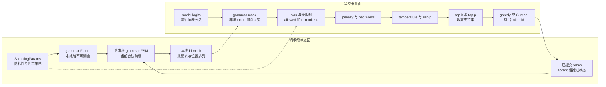

# vLLM 采样与结构化输出：把请求级状态投影成当步合法分布

> **读者问题**：模型给出一行词表 logits 后，vLLM 怎样叠加 allowed-token、logit bias、重复/频率/存在惩罚、temperature、min-p、top-k/top-p 与 grammar 约束，既不采到非法 token，又让下一步 grammar 状态只由真正提交的 token 推进？
> **源码基线**：`vllm-project/vllm@6b110badbb22d3f66c7218b71138f13b7a6b3419`（冻结的 detached checkout，提交时间 2026-08-29T02:40:53Z）
> **中心命题**：vLLM 没有把 structured output 做成“采样后在 CPU 重试”，而是把它拆成两种性质不同的状态：Engine/Scheduler 持有每请求可变的 grammar FSM，按当前前缀生成本步 bitmask；runner 只把 bitmask 与其他 per-request sampling state 投影到 batched logits，再从约束后的支持集选 token。在所有 hard constraint 的交集仍保留至少一个有限 logit 的前提下，正确性来自“先约束、后选择、提交后才推进 FSM”的顺序；若交集为空，sampler 没有通用 guard，属于 §6 明示的失败边界。
> **所有权边界**：本页拥有普通 token selection、logits 变换顺序、penalty/top-k/top-p/min-p、grammar 编译/bitmask/请求级 FSM 及其提交不变量；不拥有 token admission、KV 分配、detokenization、stop-string 与协议响应，也不拥有 speculative decoding 的 draft proposal、verify/accept 算法。后两类分别由 [[02_engineering/03_infer_frameworks/vllm/04_vllm_request_semantics_analysis|请求语义]] 与 [[02_engineering/03_infer_frameworks/vllm/20_vllm_speculative_decoding_analysis|投机解码]] 解释。
> **最近更新**：2026-08-30。按 `6b110bad` 新建 token selection 与 structured constraint 权威页。

## 1. 背景：这里同时有“数值变换”和“跨步状态”

一次 next-token 决策不只是对 logits 做 softmax。`SamplingParams` 同时携带三类策略：改变相对分数的 temperature、logit bias 与 penalties；缩小支持集的 allowed-token、bad words、min-p、top-k/top-p；以及需要随着已生成前缀改变合法集合的 structured output（`vllm/sampling_params.py:240-265`；`vllm/sampling_params.py:336-353`）。前两类可以批量张量化，grammar 却必须记住“这个请求已经走到语法的哪个状态”。

直观替代是先按普通分布采样，再在 CPU 检查 token，非法就重试。源码没有给出正式方案对比；以下是**分析推断**：这种方案会让一次 Engine step 的完成次数不确定，还可能在每次重试时跨 CPU/GPU 同步。现行实现反过来让 grammar 在采样前把非法 logits 置为负无穷；当 grammar 与后续 hard constraints 的交集至少保留一个有限 logit 时，一次 sampler 调用的选择被限制在这个交集内。runner 的顺序与 mask kernel 只证明“先 mask、后 sample”和“非法项写负无穷”，并不证明组合约束永不产生空支持集；空支持集见 §6 的失败边界（`vllm/v1/worker/gpu/model_runner.py:1403-1423`；`vllm/v1/worker/gpu/structured_outputs.py:146-163`）。

这也解释了为什么 grammar 不能只是另一个无状态 tensor processor：其 bitmask 是**请求级 FSM 当前状态的快照**，而不是整个请求期不变的白名单。`StructuredOutputGrammar` 的合同把“不推进的 validate”“推进的 accept”“rollback”和“为当前状态填 bitmask”分成四个操作（`vllm/v1/structured_output/backend_types.py:31-80`）。

## 2. 静态责任：谁拥有状态，谁只消费快照

| 责任面 | 输入 → 输出 | 拥有的状态 / 不拥有的状态 | 证据 |
|---|---|---|---|
| 请求配置 | API 参数 → 已验证的 `SamplingParams` | 拥有 per-request policy；不拥有当步 GPU row | `vllm/sampling_params.py:215-265`；`vllm/sampling_params.py:545-599` |
| Engine structured manager | structured spec → 编译中的 Future → 请求级 grammar | manager 共享 backend 与 bitmask buffer；每请求对象持有 grammar、reasoning gate 与 FSM 进度 | `vllm/v1/structured_output/request.py:21-79`；`vllm/v1/structured_output/__init__.py:36-69` |
| Scheduler | 当前 grammar 状态 + 本步 request 顺序 → `GrammarOutput` | 决定 grammar 是否 ready、何时生成 mask、提交后何时 advance；不修改 logits | `vllm/v1/core/sched/scheduler.py:1765-1787`；`vllm/v1/core/sched/scheduler.py:1963-1989` |
| Runner | logits + request/position mapping + bitmask → constrained logits | 持有 device sampling row、mask staging buffer 和当步映射；不决定语法语言 | `vllm/v1/worker/gpu/structured_outputs.py:39-64`；`vllm/v1/worker/gpu/structured_outputs.py:75-120` |
| Sampler | constrained logits + sampling state → token id | 持有 temperature、top-k/top-p/min-p、seed、penalty/bias state；不 detokenize | `vllm/v1/worker/gpu/sample/sampler.py:33-94`；`vllm/v1/worker/gpu/sample/states.py:17-68` |

### 2.1 图 1 规格：请求状态怎样闭环到 logits 流水线

本图上半是 CPU/Engine 的请求级状态闭环，下半是当步 GPU tensor 流。主路径从 model logits 经 hard/soft constraints 到 token id；回边只把**已提交 token**送回 FSM。图以 MRV2 的普通采样路径为主，V1 custom processor 的插入点在 §4 单独说明。

静态表回答“谁拥有状态”，图回答“一步怎样穿过边界”。不能把图中的回边读成 sampler 直接改 grammar：真正的 advance 发生在 Scheduler 接收并提交 runner output 之后（`vllm/v1/core/sched/scheduler.py:1939-1969`）。

## 3. 入口先保证参数可形成可采样策略

### 3.1 数值域与 greedy 不是运行时猜测

**背景。** temperature、top-p 或 repetition penalty 的非法值会在后续除法、排序或归一化阶段制造 NaN、空支持集或未定义语义。vLLM 因此在请求进入采样热路径前验证 penalty、temperature、top-p、top-k 和 min-p 的范围（`vllm/sampling_params.py:545-599`）。极小但非零的 temperature 还会被抬到阈值，以避免 tensor 中出现 NaN/inf（`vllm/sampling_params.py:483-492`）。

**为什么这样设计。** 把异常留给 batched kernel 会让一个坏请求污染整批并把客户端错误变成设备错误。现行路线先规范化策略：temperature 低于 greedy 阈值时，top-p、top-k、min-p 被重置为 no-op，再走纯 argmax 语义（`vllm/sampling_params.py:527-534`）。这是明确的单一路径，而不是“temperature 很小的随机采样”。

**约束。** `allowed_token_ids` 不能是空列表，且在 tokenizer 可用时每个 id 必须落在词表内（`vllm/sampling_params.py:944-968`）。这关闭了最直接的“白名单把整行全部 mask 掉”入口，但它不证明任意多个自定义约束叠加后一定仍有合法 token；该失败边界见 §6。

### 3.2 structured spec 先选 Engine 级 backend，再编译请求级 grammar

structured output 需要 tokenizer，当前不支持 diffusion LLM；request 也不能自行选择一个与 Engine 配置不同的 backend（`vllm/sampling_params.py:1006-1049`）。空 choice、空 grammar、空 JSON schema 与含 NUL 的 regex 会在进入 core 前失败（`vllm/sampling_params.py:1051-1089`）。`auto` backend 才允许按能力从 xgrammar 回退到 guidance 或 outlines；显式 backend 不走这套静默 fallback（`vllm/sampling_params.py:1135-1179`）。

这里的设计边界是“backend 共享、FSM 不共享”：manager 当前只支持单个 Engine-level backend，但每个 `StructuredOutputRequest` 都持有自己的 grammar 或编译 Future（`vllm/v1/structured_output/__init__.py:125-176`；`vllm/v1/structured_output/request.py:21-37`）。因此两个相同 schema 的请求即使可复用编译产物，也不能共享可变 matcher 进度。

## 4. logits 变换：先确定支持集，再按目标分布选择

### 4.1 MRV2：每请求策略变成 stable row，按本步 mapping gather

**背景。** 连续批处理下，请求集合和当步顺序会变化；若每步从 Python 对象重建 temperature、top-k 与 penalties tensor，控制开销会进入热路径。MRV2 为每个 request row 保存 temperature、top-k/top-p/min-p 与 seed，并用 staged writes 把新请求参数提交到 UVA/device state（`vllm/v1/worker/gpu/sample/states.py:17-68`）。bias、allowed ids、min-token stop ids 也按 stable row 存储（`vllm/v1/worker/gpu/sample/logit_bias.py:15-50`；`vllm/v1/worker/gpu/sample/logit_bias.py:52-107`）。

**机制与顺序。** grammar mask 在进入 sampler 前已经作用于 model logits；normal sampler 随后按以下顺序执行：必要时复制为 FP32 → allowed/min-token/logit bias → penalties → bad words → thinking budget → temperature → min-p → top-k/top-p → Gumbel/greedy token selection（`vllm/v1/worker/gpu/model_runner.py:1403-1423`；`vllm/v1/worker/gpu/sample/sampler.py:207-272`；`vllm/v1/worker/gpu/sample/sampler.py:274-321`）。没有请求需要变换时，sampler 直接保留原 logits，避免 FP32 copy 与多余 kernel（`vllm/v1/worker/gpu/sample/sampler.py:218-223`）。

allowed-token kernel 先保存允许位置的**当前值**，再把整行设为负无穷并恢复允许位置（`vllm/v1/worker/gpu/sample/logit_bias.py:172-210`）。由于“当前值”已经包含 grammar mask，两个 hard mask 做的是支持集交集：allowed list 不会把 grammar 已禁止的 token 重新放回来。penalty 只改变仍有限 token 的相对分数；presence/frequency 分别按已输出 token 的出现与计数扣分，repetition 同时看 prompt 与 output（`vllm/model_executor/layers/utils.py:72-89`）。

**为什么这样设计（分析推断）。** 顺序把“绝不能出现”与“更不想出现”分开：hard mask 先把 token 移出支持集，penalty 和 temperature 再重排剩余 token，最后 top-k/top-p 缩小随机采样集合。若把 grammar 放到采样后，非法 token 已消耗了一次选择；若把 penalty 当 hard mask，则负 penalty 促进重复的合法语义会丢失。

### 4.2 V1 runner：custom processor 需要声明会不会改变 argmax

V1 sampler 支持内建和 plugin/custom `LogitsProcessor`。processor 必须报告 `is_argmax_invariant`：会改变 greedy 结果的 min-token、logit-bias 类 processor 在 greedy argmax 前执行；像 min-p 这样不改变 argmax 的 processor 在 temperature 后、top-k/top-p 前执行（`vllm/v1/sample/logits_processor/interface.py:77-108`；`vllm/v1/sample/logits_processor/state.py:148-165`；`vllm/v1/sample/sampler.py:244-292`）。这避免为 greedy-only batch 支付本来不会改变答案的随机采样变换。

custom processor 若持有 per-request 状态，必须消费 `BatchUpdate`，并按 removed → added → moved 的顺序同步 persistent batch；其中 output token list 是持续更新的引用（`vllm/v1/sample/logits_processor/interface.py:36-57`）。runner 在 batch 变化后先调用每个 processor 的 `update_state`，再重建 `SamplingMetadata`（`vllm/v1/worker/gpu_input_batch.py:838-856`）。

这不是 MRV2 的同一扩展点。当前 capability check 把 model-config custom processor 或 `vllm.logits_processors` plugin 列为 MRV2 blocker；自动选择时因此回退 V1，显式强制 V2 则在 validation 阶段报错，而不是悄悄丢掉 processor（`vllm/config/vllm.py:620-652`；`vllm/config/vllm.py:2454-2463`；`vllm/config/vllm.py:2581-2590`）。MRV2 的 allowed ids、bias、penalties、min-p 等是专用 device-state 实现。此外 V1 builder 在 speculative decoding 下拒绝 custom processor，只保留 min-token processor；draft verify/accept 的分布合同属于页面 20（`vllm/v1/sample/logits_processor/__init__.py:201-210`）。

### 4.3 top-k/top-p 与随机选择如何保持“只在支持集内”

PyTorch 路径先升序排序 logits：top-k 把阈值以下位置设为负无穷；top-p 在累积低概率尾部做 mask，并强制最后一个最高分位置不被 mask，从而至少保留一个 token（`vllm/v1/sample/ops/topk_topp_sampler.py:367-408`）。之后 V1 native path 对处理后的 logits 做 FP32 softmax，再按该概率分布随机选择（`vllm/v1/sample/ops/topk_topp_sampler.py:131-152`）。测试不仅比较实现结果，还硬性断言任何 backend 都不能采到理论概率为零的 token（`tests/v1/sample/test_topk_topp_sampler.py:1022-1038`）。

MRV2 的 native path 不必物化完整 softmax 概率：它对处理后 logits 做 Gumbel-noised argmax；temperature 为零时退化成纯 argmax，非零时用请求 seed 与 position 定位随机流（`vllm/v1/worker/gpu/sample/gumbel.py:85-121`）。**分析推断**：按 Gumbel-max identity，这与从处理后 softmax categorical distribution 采样等价；负无穷位置加有限噪声仍不能胜出，因此不会改变前面 hard mask 定义的支持集。

## 5. grammar 生命周期：mask 是快照，accept 才是状态提交

### 5.1 编译 readiness 是 admission 前置条件

请求创建时，只要 `SamplingParams` 含非空 structured constraint，`Request` 就创建 `StructuredOutputRequest` 并进入 `WAITING_FOR_STRUCTURED_OUTPUT_GRAMMAR`（`vllm/v1/request.py:82-98`；`vllm/v1/request.py:107-115`）。Engine input thread 调用 `grammar_init`；通常把 CPU-bound 编译提交到 thread pool，Future 上的异常只归属该请求（`vllm/v1/engine/core.py:1002-1009`；`vllm/v1/structured_output/__init__.py:167-200`）。Scheduler 只有在 Future 变成 grammar 后才把请求提升回普通 WAITING；编译异常进入 per-request error 集（`vllm/v1/core/sched/scheduler.py:2846-2871`）。

**为什么这样设计。** 异步编译避免 schema/regex 编译阻塞 Engine 主循环；但 `external_launcher` 下每个 TP rank 都有 Scheduler，异步完成时刻不同会破坏各 rank 的确定性，因此 manager 在该模式关闭异步编译（`vllm/v1/structured_output/__init__.py:47-56`）。这是一条明确的性能与分布式一致性权衡，不是通用“异步总更快”。

### 5.2 每步先从当前 FSM 生成 mask，再对 runner batch 重排

Scheduler 只为当步已排进执行、使用 structured output 且不是 prefill chunk 的请求生成 `GrammarOutput`；bitmask row 的顺序以其中的 request-id list 为准（`vllm/v1/core/sched/scheduler.py:1765-1787`；`vllm/v1/core/sched/output.py:313-318`）。manager 为每个请求调用当前 grammar 的 `fill_bitmask`；不需要约束或已经 terminated 的位置填 full mask（`vllm/v1/structured_output/__init__.py:202-213`）。

Scheduler 顺序不等于 runner 当步 logits 顺序。MRV2 worker 因此按 request id 与 token position 建立 mask→logits mapping，异步复制 mask/mapping，再让当前 stream 等 copy stream；kernel 最终只对 active position 的非法词表项写负无穷（`vllm/v1/worker/gpu/structured_outputs.py:13-36`；`vllm/v1/worker/gpu/structured_outputs.py:59-120`；`vllm/v1/worker/gpu/structured_outputs.py:137-163`）。V1 runner 同样先根据 request id 和 speculative-position offset 重排 compact mask，再调用 xgrammar kernel（`vllm/v1/structured_output/utils.py:101-162`）。

### 5.3 只有 committed output 才永久推进 FSM

runner 选出的 token 返回 Scheduler 后，Scheduler 先把新 token 更新到 request，再调用 `should_advance`；需要约束时才把本步 grammar-content token 交给 `accept_tokens`（`vllm/v1/core/sched/scheduler.py:1939-1979`）。xgrammar grammar 的 `accept_tokens` 逐 token 推进 matcher、计数并记录 termination；任一 token 无法推进就返回 false（`vllm/v1/structured_output/backend_xgrammar.py:157-179`）。Scheduler 把这种“不可能发生”的拒绝视作 invariant violation，只终止该请求为 error，不让损坏的 FSM 继续生成 mask（`vllm/v1/core/sched/scheduler.py:1978-1989`）。

reasoning-aware structured output 还在请求对象中保存 `reasoning_ended`、结束 token 绝对位置与 request-local parser；reasoning marker 之前的 token 不喂给 grammar（`vllm/v1/structured_output/request.py:21-37`；`vllm/v1/structured_output/__init__.py:475-499`）。因此“输出文本看起来开始像 JSON”不是状态切换条件，parser 识别出的边界才是。

当 speculative decoding 需要多个位置的 mask 时，manager 会暂时对 draft token 执行 accept 来得到后续位置的 mask，随后 rollback 到本步开始状态（`vllm/v1/structured_output/__init__.py:230-247`；`vllm/v1/structured_output/__init__.py:298-359`）。本页只拥有这种 grammar-state preview/rollback；哪些 draft 被 target 接受、以及接受分布如何正确，仍由页面 20 拥有。

## 6. 正确性不变量与“有效分布”的真实边界

1. **hard constraint 必须先于 selection。** MRV2 与 V1 都在 sampler 前应用 grammar mask；sampler 内再叠加 allowed/min-token/bad-word/top-k/top-p（`vllm/v1/worker/gpu/model_runner.py:1403-1423`；`vllm/v1/worker/gpu_model_runner.py:4643-4650`）。任何先 sample 后 mask 的改序都会允许非法 token 离开设备。
2. **mask 只能缩小、不能复活支持集。** grammar 与 allowed-token 都用负无穷表示禁止；MRV2 allowed kernel恢复的是 grammar 处理后的值，因此串联结果是交集（`vllm/v1/worker/gpu/structured_outputs.py:146-163`；`vllm/v1/worker/gpu/sample/logit_bias.py:183-210`）。
3. **top-p 自己保证至少一项，但整个组合没有统一的 non-empty-support guard。** top-p 明确保留最高分 token，allowed-token 入口也拒绝空列表（`vllm/v1/sample/ops/topk_topp_sampler.py:398-405`；`vllm/sampling_params.py:944-954`）。然而源码没有在所有 processor 与 grammar mask 叠加后扫描“至少一个 finite logit”；**分析推断**：自定义 processor、彼此冲突的 hard constraints 或 backend bug 仍可能产生全负无穷，随后 softmax/Gumbel 行为不再构成有效 categorical distribution。这个前提属于调用方/backend 合同，不应误写成 sampler 已防御。
4. **grammar mask 与 grammar commit 使用同一前缀时序。** mask 从 step 开始的 FSM 状态生成，永久 advance 只消费 Scheduler 已提交的 token；临时 speculative advance 必须 rollback（`vllm/v1/structured_output/__init__.py:298-359`；`vllm/v1/core/sched/scheduler.py:1963-1989`）。少一次 rollback 或提前 accept 都会让下一步 mask 与真实输出前缀错位。
5. **request/position mapping 是 correctness 数据，不是性能 metadata。** compact bitmask 的行序可能与 runner batch 不同，且一个请求可有多个 draft/bonus position；worker 在 kernel 前断言 mask 数与 mapping 长度相等（`vllm/v1/worker/gpu/structured_outputs.py:75-103`）。错一行就会把请求 A 的语法强加给请求 B。
6. **返回的 logprobs 未必描述采样后的分布。** V1 默认可在 penalties、temperature 与 filters 之前保存 raw logprobs，而 processed modes 才覆盖为处理后值（`vllm/v1/sample/sampler.py:73-105`）。因此“返回 logprob 很高/低”不能脱离 `logprobs_mode` 推断 sampler 最终用的概率。

## 7. 成本、失败边界与有锚点的发展方向

| 成本 / 边界 | 机制后果 | 证据 |
|---|---|---|
| grammar 编译和 bitmask fill 是 CPU 工作 | 编译可异步，但请求在 ready 前不参与 admission；大 batch 才按阈值并行 fill | `vllm/v1/structured_output/request.py:50-69`；`vllm/v1/structured_output/__init__.py:61-78`；`vllm/v1/structured_output/__init__.py:250-279` |
| mask 要跨 Scheduler→worker 边界 | manager 转成 NumPy 以降低序列化成本，worker 再异步 H2D；每个 speculative/bonus position 都占一行 | `vllm/v1/structured_output/__init__.py:230-247`；`vllm/v1/structured_output/__init__.py:361-368` |
| top-p 的通用实现需要排序词表 | 大 batch 走 Triton，小 batch走 PyTorch sort；排序是支持集精确裁剪的代价 | `vllm/v1/sample/ops/topk_topp_sampler.py:349-376` |
| penalties 需要历史统计 | MRV2 的 output bincount tensor 是 request×vocab，源码注明可能占数 GB | `vllm/v1/worker/gpu/sample/penalties.py:31-42` |
| backend capability 不是任意组合 | structured output 需要 tokenizer、不支持 diffusion；Engine 只维持一个 backend | `vllm/sampling_params.py:1015-1049`；`vllm/v1/structured_output/__init__.py:125-165` |
| 编译可能是拒绝服务入口 | regex helper 用可配置 timeout 拒绝指数级状态空间，而不是无限等待 | `tests/v1/structured_output/test_regex_compilation_timeout.py:20-49` |

以下只记录源码暴露的迁移压力：

- **推断：MRV2 会继续吸收 custom logits processor 能力。** 当前 config 把 custom processor 明确列为 V2 blocker，而 V1 已有 processor state/update ABI；这给出了差距，不等于项目已经承诺时间表（`vllm/config/vllm.py:2454-2463`；`vllm/v1/sample/logits_processor/interface.py:36-108`）。
- **推断：penalty state 会继续压缩。** V1 实现直接注明当前 penalties 效率较低、计划重做，MRV2 又注明 request×vocab 计数可能占数 GB；这是明确的成本压力，不是已完成优化（`vllm/v1/sample/ops/penalties.py:24-29`；`vllm/v1/worker/gpu/sample/penalties.py:31-42`）。
- **推断：per-request backend 仍是未完成边界。** manager 注释明确说 V1 “for now” 只支持单 backend；当前实现不能据此宣称将来一定支持混合 backend（`vllm/v1/structured_output/__init__.py:125-132`）。

## Related Pages

- [[02_engineering/03_infer_frameworks/vllm/04_vllm_request_semantics_analysis|vLLM 请求语义]] —— 接管 token id 之后的 detokenization、stop string、流式可见性与协议对象恢复。
- [[02_engineering/03_infer_frameworks/vllm/11_vllm_scheduler_analysis|vLLM Scheduler 分析]] —— 解释 grammar readiness 所处的 waiting/running、token budget 与一次 admission 事务。
- [[02_engineering/03_infer_frameworks/vllm/15_vllm_model_runner_v1_analysis|Model Runner V1]] / [[02_engineering/03_infer_frameworks/vllm/16_vllm_model_runner_v2_analysis|Model Runner V2]] —— 对照 sampling state 如何随 compact row 迁移，或依附 stable row、staged write 与 per-step mapping。
- [[02_engineering/03_infer_frameworks/vllm/20_vllm_speculative_decoding_analysis|vLLM 投机解码]] —— 接管本页明确排除的 draft proposal、target verify 与 acceptance distribution。
- [[02_engineering/03_infer_frameworks/vllm/03_vllm_architecture_overview_analysis|vLLM 架构概览]] —— 把 sampling/grammar 放回 Engine、Scheduler 与设备运行时的全局责任图。
- [[02_engineering/03_infer_frameworks/vllm/index|vLLM 推理引擎知识地图]] —— 按能力 owner 与阅读依赖导航整个知识域。
