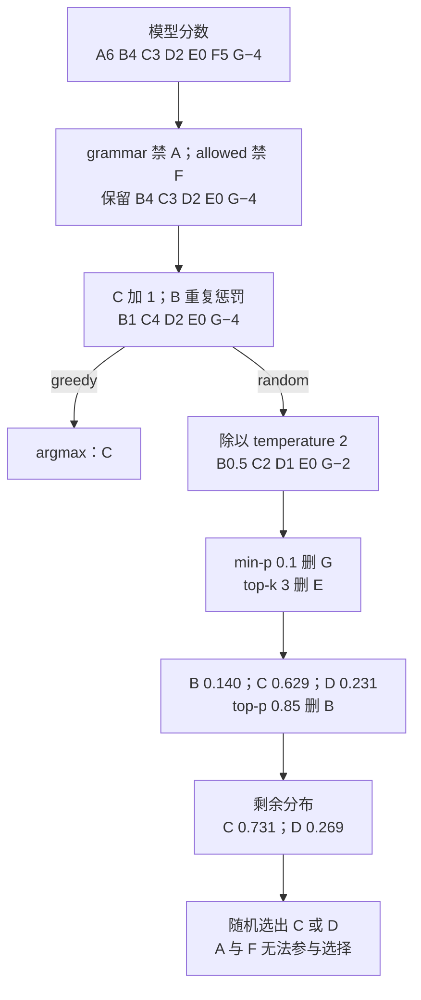
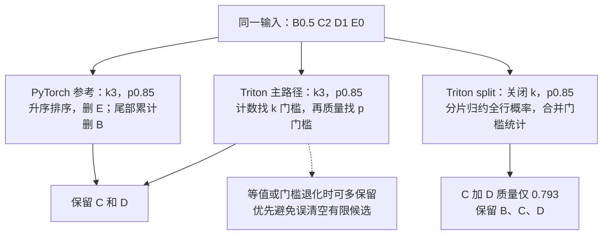
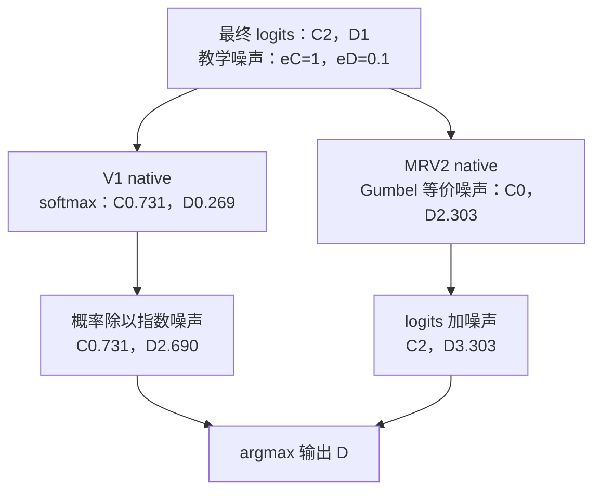
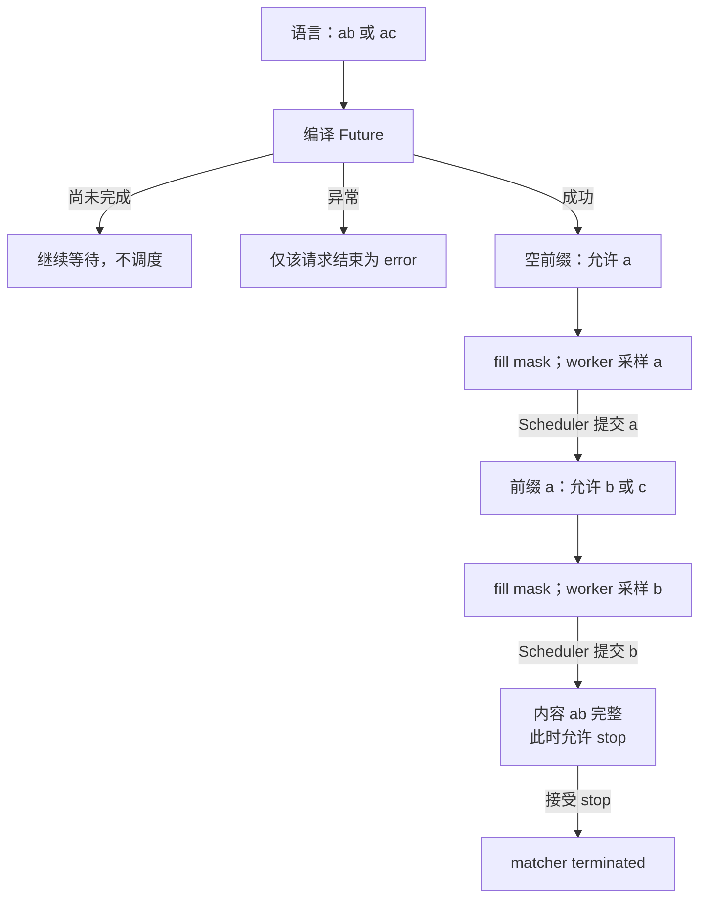

# vLLM 采样与结构化输出：一行 logits 怎样变成合法 token

> **源码基线**：`vllm-project/vllm@199cb9b964822e59ab9b58d88e7be31eb419a2ae`（`main`，2026-09-07）
> **主题**：从一行词表分数演算 hard mask、bias、penalties、temperature、min-p、top-k/top-p 与 token selection，再解释结构化 grammar 如何随已生成前缀产生下一步约束。对照 Model Runner V1/V2 的采样实现与后端选择。
> **适用范围**：普通自回归 token selection、采样参数的算法含义、grammar 编译与推进；API 字段映射归请求语义页，speculative acceptance 归投机解码页，输出发布归两篇 Runner 页。
> **最近更新**：2026-09-08。补逐步数值例子，并核对当前过滤实现与结构化约束的失败边界。

## 1. 为什么“选分数最高的词”还不够

假设模型正在补全一个 JSON 字段，分数最高的 token 却不能接在当前前缀后；次高 token 又是用户禁止输出的内容。模型 logits 只表达模型的偏好，不自动满足请求的语法、重复控制或随机性要求。vLLM 的普通路径因此先改写分数和候选集合，再选择 token；结构化输出则根据**当前已提交前缀**持续更新合法集合。

本页把这两个过程接起来：一行 logits 的数值变换回答“这一刻选谁”，请求级 grammar 回路回答“下一刻哪些 token 还合法”。只要最后仍有合法的有限分数候选，禁止项的负无穷就让其概率为零。这个保证有前提：后续处理不能任意重写禁止项，约束交集也不能为空；`min_tokens` 的恢复分支与 thinking budget 的强制覆盖将在 §5 分开讨论。

一种直观替代是先采样、再验证、非法就重试。源码没有给出正式方案比较；**分析推断**是，预先 mask 让普通 step 不必反复进行采样和 CPU 验证，也无需为每次非法选择再跨设备边界。代价是 CPU 先生成合法集合，worker 必须把它精确对齐到本步 logits。

### 1.1 从七个候选开始，完整走一次

下面是**教学值**，不是模型实测。词表有七个 token，按 `A,B,C,D,E,F,G` 排列；单请求单步 logits 形状为 $1\times7$。grammar 此刻只禁止 A；`allowed_token_ids` 只保留 B、C、D、E、G，因此 F 被白名单禁止。输出历史只有 B 出现过两次，prompt 不含其余候选。

设置 C 的 `logit_bias=+1`，`repetition_penalty=2`、`frequency_penalty=0.25`、`presence_penalty=0.5`，`temperature=2`、`min_p=0.1`、`top_k=3`、`top_p=0.85`。本步不触发 min-token、bad-word 或 thinking-budget 分支。

| 步骤 | A、B、C、D、E、F、G 的分数或候选 | 本步改变了什么 |
|---|---|---|
| 模型输出 | `6, 4, 3, 2, 0, 5, -4` | 模型原本偏爱 A，其次 F |
| grammar，再 allowed mask | `−∞, 4, 3, 2, 0, −∞, -4` | A、F 概率必须为零 |
| C 的 bias | `−∞, 4, 4, 2, 0, −∞, -4` | 有限分数加 1 |
| repetition，再 frequency/presence | `−∞, 1, 4, 2, 0, −∞, -4` | B 变成 $4/2-0.25\times2-0.5=1$ |
| temperature | `−∞, 0.5, 2, 1, 0, −∞, -2` | 每个有限分数除以 2 |
| min-p | B=0.5、C=2、D=1、E=0 | G 低于相对最高概率的门槛 |
| top-k | B=0.5、C=2、D=1 | 只保留三个最高分，E 被去掉 |
| top-p | C=2、D=1 | 三项概率约为 B=0.140、C=0.629、D=0.231；删掉 B 后仍保留约 0.860 的质量 |
| 最终随机分布 | C≈0.731、D≈0.269 | 在剩下的两个 token 上重新归一化 |

这里 min-p 与 top-p 不是同一阈值：min-p 比较单个 token 与最高概率之比；top-p 控制保留集合的累积概率。top-p 使用的是 **top-k 后重新归一化的概率**，不是模型最初的 softmax。greedy 则在影响排名的处理之后选 C，不需要先计算这组随机概率。

<!-- 图1规格：展示同一七词表例子的有序数值变换。入口是A6 B4 C3 D2 E0 F5 G-4；grammar与allowed删除A/F；bias和penalties得到B1 C4 D2 E0 G-4。由此分支到greedy输出C，以及temperature、min-p、top-k、top-p的随机分支，最终C/D。关键不变量是禁止项保持负无穷；本图不包含thinking-budget覆盖与min-token恢复。使用Mermaid表达有序变换而非二维张量布局。 -->

## 2. 分数如何变成候选分布

### 2.1 hard mask、bias 与 penalties 各做不同的事

logits 是尚未归一化的分数。对普通 softmax 分布，某项分数改为负无穷会令其指数权重为零；有限 bias 则保留该项，只改变相对权重。MRV2 的 allowed-token kernel 先保存允许位置的**当前分数**，再清空整行、恢复保存值。因此 A 即使出现在 allowed list 中，也不会被白名单从先前的 grammar mask 中复活。kernel 用 barrier 保证先保存、再覆盖、再恢复的内存顺序。

重复惩罚不是“看到一次就减固定分”：令 $z_i$ 为加完 bias 的分数，$c_i$ 为 token 在输出历史中的次数，$s_i$ 在 token 已出现于 prompt 或 output 时等于 repetition penalty，否则等于 1。MRV2 kernel 实际执行：

$$
\begin{aligned}
z_i' &= \begin{cases}z_i/s_i,&z_i>0,\\z_i s_i,&z_i\leq0,\end{cases} \\
z_i'' &= z_i'-f c_i-a\,\mathbf{1}[c_i>0].
\end{aligned}
$$

其中 $f$ 是 frequency penalty，$a$ 是 presence penalty。正分数除以大于 1 的重复惩罚会下降；负分数乘以它会更负，所以两种符号都降低重复 token 的相对偏好。frequency 看次数，presence 只看是否出现，二者只统计 output。负的 frequency/presence 值反而促进重复，不能把它们理解成 hard mask。例子里 B 的两次出现产生 0.5 的频率扣分和 0.5 的存在扣分；C 虽被加分，却没有历史惩罚。

`bad_words` 也不是把一个词拆成若干 token 后全部禁用。kernel 比较**已输出后缀**与坏词 token 序列的前缀；只有当前候选会补齐整个坏词时，才把该序列的最后一个 token 禁掉。单 token 坏词的前缀为空，因而直接禁止。这样不会因为禁止一个多 token 词就误禁其组成片段的全部其他用法。

### 2.2 temperature 与 min-p：概率比决定门槛

对正 temperature $T$，先令 $u_i=z_i''/T$，再考虑分布：

$$
q_i=\frac{\exp(u_i-m)}{\sum_j\exp(u_j-m)},\qquad m=\max_j u_j.
$$

减最大值不会改变概率比，但能避免对很大正数取指数。$T$ 不改变有限 logits 的排序，较大的 $T$ 缩小分差，较小的 $T$ 放大分差；它会改变后续 top-p 和 min-p 的结果，因为二者依赖概率。

min-p 为 $\alpha$ 时保留 $q_i\geq\alpha q_{\max}$。分母抵消，MRV2 无需先物化 softmax，直接测试：

$$
u_i\geq m+\log\alpha.
$$

例子中门槛为 $2+\log0.1\approx-0.303$，G 的 -2 被删除，E 的 0 保留；`min_p=0` 是禁用分支，不求其对数。这个推导也说明为什么 min-p 放在 temperature 后：对同一原始分差，温度不同，概率比不同。

### 2.3 top-k/top-p：一个按名次，一个按概率质量

PyTorch 参考实现先将 logits **升序排序**。top-k 找第 k 大的分数门槛，把低于门槛的项设为负无穷；再对剩余项做 softmax，从低概率端累加，删除累计质量不超过 $1-p$ 的尾部，最后 scatter 回 token 原顺序。代码显式保留最高分位置，避免过滤本身把一个正常输入行全部清空。

对例子的 B、C、D，升序概率为 0.140、0.231、0.629。$1-p=0.15$，第一项累积 0.140 可删；到第二项累积 0.371 已超过门槛，必须保留 D，最终 C、D 重新归一化为 0.731、0.269。top-p 保留质量至少达到要求，但不必恰好等于 p，因为不能保留半个 token。

**当前实际 dispatch 需要和参考算法分开读。** `apply_top_k_top_p` 在有 Triton 时直接进入 Triton 实现，没有 Triton 才调用 PyTorch 路径；旧的“小 batch 一律用 PyTorch sort”描述已不适用。Triton 仍按先 top-k、后 top-p 的语义处理，但用门槛搜索代替全词表排序：

- **有有效 top-k 的主路径**：从首块有限 logits 估计截断门槛，把高分候选收进临时 buffer；统计不足时回到整行搜索。搜索每轮计算“大于 pivot 的个数”和边界最小值及重复次数，收缩区间直到找到第 k 个位置所在的边界，再在候选内归一化并搜索 top-p 概率门槛。重复值由保留数量控制；搜索有 18 轮/区间宽度停止条件。
- **小 CUDA batch 的 p-only 路径**：batch 不超过 64，且该行没有有效 top-k 时，将同一行拆给多个 program。先归约最大值、指数和、有限项数，再以 8 个候选门槛、5 轮搜索汇总各片段的概率质量和边界重复数。找不到精确边界时，退回已评估的、仍满足质量要求的较紧门槛；没有这样的门槛就保留整行。中间合并从已保存的 partials 重建，不需要每轮主机同步。

沿用例子的 `B0.5,C2,D1,E0`：top-k 3 的有效门槛可落在 0 与 0.5 之间，保留 B/C/D；之后 top-p 门槛可落在概率 0.140 与 0.231 之间，保留 C/D。这里给的是**可验证的门槛区间**，不是声称实际 kernel 恰好探测某个教学 pivot。若关闭 top-k，只做 p-only，概率约为 B=0.129、C=0.579、D=0.213、E=0.078；p=0.85 必须保留 B/C/D，因为 C+D 只有约 0.793。split-row 归约的正是这组全行概率质量。

<!-- 图2规格：比较同一输入B0.5 C2 D1 E0的过滤算法。左路排序后k3与p0.85删除E/B；中路Triton计数找k门槛再质量找p门槛，得到同样C/D；右路关闭k的split p-only先分片归约再质量搜索，得到B/C/D。标明输出差异来自关闭k、不是并行误差。矩形为变换，不表达二维物理布局。 -->

不能将这些路径写成逐位、逐 token 完全相等。PyTorch 的 top-k 使用严格小于门槛，边界同分可能保留超过 k 个；Triton 对重复值有数量处理，但当 pivot 达到最大值、出现 NaN 或近均匀退化时可以放弃本次 mask，保留更多项。`test_equal_logits_few_valid` 明确允许超过 k，以“至少保留一个有限候选”为该场景的保证。全负无穷输入则只是保持原状；过滤没有凭空创造有效分布。

## 3. 最后一项随机性：greedy、指数竞赛与 Gumbel

### 3.1 greedy 不计算“温度为零的除法”

`SamplingParams.__post_init__` 在验证之后把 greedy 请求的 top-p、top-k、min-p 重置为 no-op。极小正 temperature 会先被抬到数值安全阈值；显式 0 才表示通常所说的 greedy。V1 在所有会影响 argmax 的处理之后先做 argmax，整批 greedy 就直接返回；混合 batch 仍可执行随机路径，再按请求 temperature 选择结果。MRV2 的温度 kernel 跳过 0 和 1，Gumbel kernel 对 0 不加噪声。

在 §1 例子里，把 temperature 改成 0，B1、C4、D2、E0、G−4 中 C 胜出。这不是把随机采样公式硬代入 $T=0$，也不能在 bias/penalty 之前就选模型原始 argmax A。

### 3.2 V1 native：用指数噪声竞赛实现 categorical sampling

V1 native 先得到最终 FP32 softmax 概率，再为每个 token 生成独立 $e_i\sim\operatorname{Exp}(1)$，返回：

$$
y=\operatorname*{argmax}_i\frac{q_i}{e_i}.
$$

**数学解释**：这等价于选 $e_i/q_i$ 最小者；它是速率为 $q_i$ 的指数竞赛，所以获胜概率为 $q_i/\sum_jq_j$。这是对源码规则的推导，不是额外执行结果。代码注明不用 `torch.multinomial` 的原因是避免它造成的 CPU–GPU 同步；显式 request generator 的行单独生成噪声。

继续用 C=0.731、D=0.269，若教学噪声为 C=1、D=0.1，则竞赛分数为 0.731 与 2.690，D 胜出。概率较低不等于不会被选中；概率为零的 A/F 则无法赢得有限正噪声竞赛。

### 3.3 MRV2 native：直接在 logits 上加 Gumbel 噪声

MRV2 已有最终 logits C=2、D=1，可以直接取 $y=\operatorname*{argmax}_i(u_i+g_i)$。Gumbel-max identity 给出与 softmax categorical 相同的理论分布，从而省掉只为选 token 而物化完整概率张量的步骤。用同一组教学指数噪声，令 $g_i=-\log e_i$，C 的分数为 2，D 为 $1-\log0.1\approx3.303$，同样选 D。

实际 FP32 实现使用 $g=-\log[-\log(1-U)]$ 的反向 uniform 变换，并在 $U=0$ 附近用 `log1p`、最小正随机值钳制保护尾部；FP64 分支使用通常的 $-\log(-\log U)$。两者理论分布相同，随机位和数值行为不同。seed、position 与 token id 共同定位请求的随机流；词表按 1024 项分块求局部赢家，最后归约各块赢家。`use_fp64_gumbel` 改变噪声和归约精度，不能据此承诺跨平台逐 token 复现。

<!-- 图3规格：在C2 D1的同一最终logits上分别画V1指数竞赛与V2Gumbel路径；两路用eC1/eD0.1教学噪声，输出均为D。V1框显示softmax与q/e，V2框显示-log e与logit加噪。输入和结果值使读者独立重建等价性；不是声称两实现实际共享RNG。 -->

### 3.4 真正跑哪一条，还由后端条件决定

| 路径 | 选择条件与交接边界 |
|---|---|
| V1 native | 通用回退；显式 generators、FP64 Gumbel 等条件可将优化路径退回此处 |
| MRV2 native | 无 top-k/top-p、含 greedy、含显式 seed，或本步返回 processed logprobs 时，不使用 FlashInfer |
| FlashInfer | CUDA 能力与 `VLLM_USE_FLASHINFER_SAMPLER` 满足条件；接收 logits 或 FP32 probabilities 及 k/p，返回 token id。MRV2 返回 sampling mask 时也禁用它 |
| V1 CPU/XPU/ROCm | CPU 分支有 compiled 指数竞赛及 native 回退；XPU 自定义 kernel 不支持 per-request generators 时回退；ROCm aiter 为延迟导入，有 seed、FP64 或导入失败等 native 回退 |

FlashInfer wrapper 的说明将其实现描述为避免排序的 rejection sampling，并承诺统计等价而非相同采样序列；这是**依赖合同**，本页未打开 FlashInfer/aiter/XPU 扩展内部来证明其算法。请求级 seed 或 processed 分布返回能力不能满足时，vLLM 的选择逻辑会回退。显式启用但设备能力不支持 FlashInfer 会报错；默认选择可警告后回退。

## 4. 同一规则怎样放进两个 Runner

MRV2 普通路径的完整顺序是：runner 先施加 grammar → sampler 必要时复制为 FP32 → allowed、bias、min-tokens → repetition/frequency/presence → bad words → thinking budget → temperature → min-p → top-k/top-p → selection。没有任何请求需要变换时跳过 FP32 copy 和相关处理 kernel。sampling state 按稳定 request row 保存，新增请求分阶段写入 temperature、k/p、seed、bias 等；本步按 mapping 取出对应行。因此连续批处理的行序改变，不应改变“这个请求使用哪组策略”。细节接 [[16_vllm_model_runner_v2_analysis|Model Runner V2 的持久状态与当步映射]]。

V1 的顺序并不完全相同：grammar → FP32 → allowed → bad words → 非 argmax-invariant processors → penalties → thinking budget → greedy 检查 → temperature → argmax-invariant processors → top-k/top-p → random。内建 min-token、bias 属于前一组，min-p 属于后一组。`is_argmax_invariant` 的意思是“不会改变 greedy argmax”，不是“不改变分布”；因此全 greedy batch 可以跳过后一组。

custom processor 持有请求状态时，必须消费 `BatchUpdate`，按 removed → added → moved 处理，加入请求时得到的 output-token list 是持续更新的引用。`InputBatch.refresh_metadata` 在构建新的 sampling metadata 前更新 processor。声明错误或行迁移处理错误，都可能让 greedy 走错分支或让请求使用别人的状态；这是扩展接口的责任。

这套 custom ABI 当前属于 V1。配置检查将 model-config custom processor 或 `vllm.logits_processors` plugin 列为 MRV2 blocker：自动选择回退 V1，强制 V2 时 validation 报错。V1 builder 在 speculative decoding 下拒绝 custom processor，只构建 min-token processor；更早的 `SamplingParams._validate_spec_decode` 也拒绝 min-p 或 logit-bias 组合。普通采样能力不能直接外推到 draft/accept 路径，后者接 [[20_vllm_speculative_decoding_analysis|投机解码的分布与接受过程]]。

## 5. “合法分布”有明确前提和两个重要例外

| 条件或配置 | 执行含义与边界 |
|---|---|
| `temperature` | 有限且在 [0,2]；0 为 greedy，默认 1；极小正值先抬高避免数值问题 |
| `top_k`、`top_p`、`min_p` | top-k 默认 0 禁用，兼容 -1，必须为整数；MRV2 将禁用或超过词表的值转为词表大小。top-p 在 (0,1]、默认 1；min-p 在 [0,1]、默认 0 |
| 三种 penalties | repetition 有限且大于 0、默认 1；frequency/presence 在 [-2,2]、默认 0；作用历史范围见 §2.1 |
| `allowed_token_ids`、`logit_bias` | allowed 不可为空，id 按模型 logits 词表大小验证，不依赖 tokenizer 是否存在；MRV2 各有 1024 项容量上限，超出在 `LogitBiasState.add_request` 抛错 |
| `min_tokens`、stop ids | min-tokens 非负且不超过 max-tokens；MRV2 该状态最多存 128 个 stop id，超出抛错；stop token 来源的协议映射见请求语义页 |
| `seed`、`logprobs_mode` | MRV2 分别保存随机 seed 与“是否显式设置”标记。raw/processed、logits/logprobs 是不同观察口径，不能仅凭返回分数还原最终采样概率 |

本表是本页算法涉及的字段子集，不是 `SamplingParams` 全字段目录；API、停止与输出选项的映射由 [[04_vllm_request_semantics_analysis|请求语义页]] 维护。

**例外一：grammar 已经只允许停止时，min-tokens 可以让步。** 假设 grammar 处理后整行只剩 EOS=1，但尚未达到 min-tokens。普通屏蔽会变成全负无穷；当前 V1 `MinTokensLogitsProcessor._mask_stop_token_logits` 与 MRV2 `_bias_kernel` 均针对 structured 请求保存 stop logits，屏蔽后扫描整行，若全为负无穷，则恢复此前有限的 stop logits。若仍有其他合法 token，继续禁止 EOS；无 structured constraint 的请求不启用恢复。恢复的是 grammar 已允许的旧值，不会恢复原本已被 grammar 禁止的 stop token。

这纠正了旧稿“没有任何空支持集防护”的说法，也不等于已有通用求解器：恢复只解决该处 stop-mask 冲突。grammar 与 allowed 交集本来为空，或之后的 bad words/custom processor 把剩余项禁尽，仍可能留下全负无穷。Triton 对全负无穷保持 no-op 的测试，只证明过滤不制造 NaN；不证明后续 sampling 得到合法 categorical distribution。

**例外二：thinking budget 是强制覆盖，不是交集过滤。** MRV2 kernel 检测到 reasoning 预算用尽后，把结束 marker 的下一 token 分数直接写为 `1.0e9`；对多 token marker，会识别输出尾部已完成的前缀，继续下一个 marker token。由于它位于前述 masks 之后，这个写入可能把负无穷位置改回有限值。因此“所有 hard mask 之后永不复活 token”只能描述保持负无穷的普通变换链，不能覆盖该强制策略。通常 reasoning gate 尚未启用 grammar，但若额外约束与 marker 冲突，本页没有组合兼容性的运行验证，不把它写成永远满足 grammar 的保证。

还有一个观察陷阱：两条普通 runner 都在 sampler 前应用 grammar；因此 sampler 所谓 raw 分数是“进入 sampler 时”，不应理解为完全未经 grammar 的原始模型头输出。raw 模式在 sampler 自身的 penalties、temperature 等之前取分，processed 模式才反映其后处理；FlashInfer 不暴露处理后 logits，是上节回退条件之一。

## 6. grammar 如何让下一步合法集合跟着前缀变化

### 6.1 编译的是语言，推进的是每个请求自己的前缀

用一个最小语言 `ab` 或 `ac` 来理解 grammar，教学 tokenizer 将 a、b、c 各编码成单 token：空前缀只允许 a；提交 a 后允许 b/c；提交 b 后内容完整，此时才允许 stop。真实 tokenizer 的一个 token 可能携带多个字符或字节，不能把这个教学字符状态机当成实际 tokenizer；vLLM 把 tokenizer 信息与 schema/grammar 交给 backend，由其判断整个 token 是否可延长合法前缀。

`StructuredOutputsParams` 可表达 JSON schema、JSON object、regex、choice、grammar、structural tag。xgrammar validator 会把 choice 转成 grammar；JSON object 编译为 object 类型 schema。`auto` 先尝试 xgrammar，遇到其验证拒绝后再按 tokenizer/schema 能力选择 guidance 或 outlines；显式 backend 没有这条自动 fallback。Manager 目前只构造并保存一个 Engine-level backend，不能把这段请求参数选择逻辑读成可自由混用多个 backend；每请求的 matcher 进度独立。`StructuredOutputGrammar` 将 fill、validate、accept、rollback 分开：fill 观察当前合法集合，validate 返回可接受前缀而不留下推进，accept 才改变进度，rollback 撤回预演。

xgrammar adapter 把 tokenizer/vocab 信息交给 `GrammarCompiler`，允许缓存编译产物，但每次返回新的 `GrammarMatcher`。当前还把请求 `all_stop_token_ids` 交为 `override_stop_tokens`：否则一个“在 tokenizer 看来是普通字符、但请求将它列为 stop”的 token，可能在 JSON 中途触发提前停止。现有 stop-token 回归测试正是验证这条边界。

**依赖范围**：本页核对了 vLLM 的编译、mask、accept、rollback 调用及其测试；没有审计 xgrammar 等库内部的 grammar lowering 与 matcher 实现。其“合法前缀”语义是 adapter 所依赖的合同，不是本页自行证明任意 JSON schema 均可满足。

### 6.2 提交编译、等待 ready、生成本步 mask

请求构造时，有有效 structured constraint 就创建 `StructuredOutputRequest`，状态为 `WAITING_FOR_STRUCTURED_OUTPUT_GRAMMAR`。Engine input processing thread 调用 `grammar_init`，通常将 `_create_grammar` 提交到线程池；请求对象持有 Future。取 `grammar` 时以 100 微秒 timeout 检查完成：尚未完成返回 None；完成错误保存为 Exception；成功才得到 grammar 实例。

Scheduler 的 blocked-waiting promotion 遇到 None 继续等待，Exception 进入该请求的编译错误集合，成功则转回普通 WAITING。**提交 Future 不等于可调度，ready 也不等于本步已执行。** `external_launcher` 模式关闭异步编译，因为每个 TP rank 都有 Scheduler，独立 Future 的完成时刻会破坏各 rank 一致的状态推进；同步编译异常仍被包装成完成失败的 Future，交给相同的请求错误路径处理。

本步 Scheduler 仅收集已排进执行、使用结构化输出且不是 prefill chunk 的请求，把 request-id 顺序与 bitmask 一起组成 `GrammarOutput`。manager 调用当前 matcher 的 `fill_bitmask`；不需要约束或 matcher 已 terminated 的位置填 full mask。bitmask 每 32 个 token 占一个 int32 字，单行大小为 $\lceil V/32\rceil$ 个字，bit=1 表示保留；这比传递完整浮点 mask 紧凑。

<!-- 图4规格：以语言ab/ac展示请求编译与跨步FSM。输入schema进入Future；未完成等待、失败只结束该请求；成功到空前缀，mask允许a，经worker采样、Scheduler提交a后才到前缀a；其mask允许b/c，提交b到内容完整，接收stop后terminated。fill不推进状态；图中所有前缀箭头标提交，强调mask不是提交。 -->

### 6.3 mask 行序不同，怎样避免给错请求

manager 将 CPU bitmask 转为 NumPy，以降低传输序列化开销；但 Scheduler 的 compact 请求顺序不保证等于 worker 的 batch 顺序。例如 mask 为 `[R2,R1]`，logits 为 `[R1,R2]`，R2 的约束必须作用到第二行。

MRV2 `_build_grammar_mapping` 将每个 mask row 编为 request index 与 position；kernel 再读取 GPU `cu_num_logits` 找到实际 logits 起点。这样 adaptive verification 改变实际位置偏移后，也无需信任已经过时的 CPU 绝对行号。kernel 只写 active position，并断言 mask 行数等于 mapping 长度。mask 与 mapping 通过 copy stream 异步上传，计算 stream 等待拷贝；使用后 copy stream 还要等待计算 stream，避免暂存区过早复用。

V1 则按请求 id 与 speculative-position offset 建出已按 logits 排序的 mask，再调用 xgrammar 的设备 mask kernel。这里的 mapping 是正确性数据：错位不会只让吞吐下降，而会让 R1 按 R2 的语言生成。mask 应用之后才进入 §2–§4 的 sampler；token 如何回传和发布接 [[15_vllm_model_runner_v1_analysis|Runner V1 输出路径]] 与 [[16_vllm_model_runner_v2_analysis|Runner V2 输出路径]]。

### 6.4 接受新 token、跨 reasoning 边界、完成与失败

Scheduler `update_from_output` 先调用 `_update_request_with_output` 更新请求并处理 stop，随后对保留下来的 `new_token_ids` 调用 `should_advance` 和 `trim_reasoning_for_advance`，最后 `grammar.accept_tokens`。xgrammar adapter 逐 token 推进 matcher、累计处理次数；一旦 terminated 就忽略之后的 token。任何一个不能接受的 token 返回 false，Scheduler 把请求标为 `FINISHED_ERROR`、不可恢复，并结束请求。

这不是失败时把整个 accept 列表原子回滚：列表中前面已接受的 token 可能已推进 matcher，请求 token 列表也已更新；当前处理是丢弃出错请求、停止继续生成，不是重试这一步。内容语法完整与 matcher terminated 也不同：stop-token 测试在关闭 JSON 字符串后仍断言 `is_terminated()` 为 false，此时停止 token 才成为合法选项。请求也可能先因长度上限或取消结束；grammar 不保证这种外部截断仍返回完整文档。

reasoning-aware 请求额外持有 request-local parser、`reasoning_ended` 和结束 token 绝对位置。默认 marker 之前不施加 grammar；`enable_in_reasoning` 可要求一直约束。若一次返回 `[推理内容, 结束marker, JSON内容]`，`should_advance` 用本次实际 `new_token_ids` 检测边界，trim 只把 marker 后面的后缀交给 grammar。这样不依赖 async/spec 尚未结清的 output-placeholder 数量，也不会把 reasoning marker 当成 JSON 内容。边界无法逐 token 定位时，helper 保守地将整个新窗口视为 reasoning。

多位置 speculative mask 只需要理解 grammar 侧的预演：先填当前位置 mask，临时接受对应 draft 得到下一位置 mask，末尾再 rollback 已成功推进的次数，恢复本步起始前缀。若 reasoning 在 draft 窗口中结束，之后的位置和 bonus row 开始受约束；这些较早生成的 draft 未必合法，此分支先 validate、只推进可接受项，而通常已受约束的 draft 无法推进会断言失败。**预演完成不算永久提交**，实际接受哪些 draft 的分布算法归投机解码页。

## 7. 支持边界、成本与验证路线

结构化输出必须有 tokenizer，diffusion LLM 在入口被拒绝：并行修订整段 canvas 不符合这里逐前缀 advance 的接口。空 choice、空白 grammar/JSON schema、`json_object=False`、含 NUL 的 regex 均在进入 core 前拒绝。后端能力还有限制，例如 xgrammar validator 会拒绝 `multipleOf`、数组 `uniqueItems/contains`、对象 `patternProperties/propertyNames`，以及字符串 `pattern/format` 与长度约束的特定组合；显式选择该 backend 会失败，`auto` 才有机会按上述能力检查回退。非 tekken Mistral tokenizer 不能用 guidance，Mistral tokenizer 不能用 lm-format-enforcer，这些由参数验证分支明确执行。

| 成本 | 为什么产生，以及能避免什么 |
|---|---|
| grammar 编译与填 mask | CPU 工作；编译可异步但请求必须等 ready。普通非 spec 批次超过 128 个 structured 请求时，manager 按 16 个一组并行 fill，并等所有 Future 完成后返回 |
| mask 传输与逐词表应用 | 每个 speculative/bonus position 都有一行 mask；CPU 压缩字传输到设备，worker 扫词表写禁止项 |
| 分数处理 | 无操作时 MRV2 跳过 copy/kernel；有操作时 FP32 临时 logits 及多轮词表读取增加带宽成本 |
| top-k/top-p | PyTorch 排序约为每行 $O(V\log V)$；Triton 用有限轮门槛扫描与候选 buffer 换取免全排序，小 batch p-only 再用 split-row 增加并行度。不能仅凭源码承诺固定倍数加速 |
| 历史惩罚 | MRV2 prompt 统计压为 bitmask，但 output 计数仍是 request×vocab 的 int32 tensor，按容量约占 $4RV$ 字节；源码 TODO 明确指出可达 GB 级 |
| regex timeout | `compile_regex_with_timeout` 用配置超时限制等待并抛错，0/负值禁用超时。取消 Future、`shutdown(wait=False)` 不等于强杀已在运行的第三方编译线程，不能宣称超时已回收所有 CPU 工作 |

发展压力只能从已存在的差距推断：custom processor 仍阻止使用 MRV2，penalty 的大计数表仍有压缩 TODO，V1 `apply_all_penalties` 也明确注明现有实现低效、待重做，manager 的单 backend 注释仍写着 “for now”。这说明实现有扩展或优化空间，不代表已承诺某个版本完成。

### 7.1 紧凑源码路线

以下路径均相对冻结的 vLLM 仓库，按问题归为十二组；锚点已实际打开。正文的计算示例是教学推导，本次没有运行 GPU、模型下载或第三方 grammar 编译，列出的 tests 是可复核的测试合同，不能当作本次实跑结果。

| 阅读问题 | 实现与验证锚点 |
|---|---|
| 参数如何规范化和拒绝无效组合 | `vllm/sampling_params.py::SamplingParams.__post_init__`、`SamplingParams._verify_args`、`SamplingParams._validate_allowed_token_ids`、`SamplingParams._validate_spec_decode`、`SamplingParams._validate_structured_outputs`；`tests/v1/structured_output/test_validation.py::test_auto_backend_falls_back_on_unsupported_schema`、`test_structured_outputs_rejected_for_diffusion_models` |
| MRV2 的调用与处理顺序 | `vllm/v1/worker/gpu/model_runner.py::GPUModelRunner.sample_tokens`、`GPUModelRunner.sample`；`vllm/v1/worker/gpu/sample/sampler.py::Sampler.apply_sampling_params`、`Sampler.sample`、`Sampler.__call__`；`vllm/v1/worker/gpu/sample/states.py::SamplingStates.add_request`、`SamplingStates.get_top_k_top_p` |
| hard mask 和历史规则 | `vllm/v1/worker/gpu/sample/logit_bias.py::LogitBiasState.add_request`、`_bias_kernel`；`vllm/v1/worker/gpu/sample/penalties.py::_penalties_kernel`；`vllm/v1/sample/ops/penalties.py::apply_all_penalties`；`vllm/v1/worker/gpu/sample/bad_words.py::_bad_words_kernel`；`vllm/v1/worker/gpu/sample/min_p.py::_min_p_kernel` |
| 特殊恢复与覆盖 | `vllm/v1/sample/logits_processor/builtin.py::MinTokensLogitsProcessor._mask_stop_token_logits`；`vllm/v1/worker/gpu/sample/thinking_budget.py::_thinking_budget_kernel`；`tests/v1/worker/test_gpu_logit_bias.py::test_v2_min_tokens_restores_stop_token_when_row_would_be_empty`、`test_v2_min_tokens_mixed_batch_gates_restore_per_request` |
| 过滤算法与退化 | `vllm/v1/sample/ops/topk_topp_sampler.py::apply_top_k_top_p`、`apply_top_k_top_p_pytorch`；`vllm/v1/sample/ops/topk_topp_triton.py::apply_top_k_top_p_triton`、`_topk_topp_kernel`、`_topp_sb_combine`、`_topp_sb_mask_kernel`；`tests/v1/sample/test_topk_topp_sampler.py::TestTritonTopkTopp.test_equal_logits_few_valid`、`TestTritonTopkTopp.test_all_neginf_logits` |
| 随机选择与后端 | `vllm/v1/sample/ops/topk_topp_sampler.py::random_sample`、`sample_with_exponential_noise`、`flashinfer_sample`、`TopKTopPSampler.__init__`、`TopKTopPSampler.forward_cuda`；`vllm/v1/worker/gpu/sample/gumbel.py::gumbel_noised_argmax`、`gumbel_sample`；`tests/v1/worker/test_gpu_gumbel_sample.py::test_greedy_temperature_zero_returns_argmax`、`test_zero_count_tokens_are_never_sampled`；`tests/v1/sample/test_topk_topp_sampler.py::TestFlashInferDistributionMatch.test_distribution_matches_theoretical` |
| V1 扩展和 greedy 分组 | `vllm/v1/sample/sampler.py::Sampler.forward`、`Sampler.apply_logits_processors`、`Sampler.sample`；`vllm/v1/sample/logits_processor/interface.py::BatchUpdate`、`LogitsProcessor`；`vllm/v1/sample/logits_processor/state.py::LogitsProcessors.__init__`；`vllm/v1/worker/gpu_input_batch.py::InputBatch.refresh_metadata`；`vllm/v1/sample/logits_processor/__init__.py::build_logitsprocs`；`vllm/config/vllm.py::VllmConfig.use_v2_model_runner`、`VllmConfig._get_v2_model_runner_unsupported_features`、`VllmConfig._validate_v2_model_runner` |
| 编译提交与 ready | `vllm/v1/request.py::Request.__init__`；`vllm/v1/engine/core.py::EngineCore.preprocess_add_request`；`vllm/v1/structured_output/request.py::StructuredOutputRequest._check_grammar_completion`；`vllm/v1/structured_output/__init__.py::StructuredOutputManager.grammar_init`、`StructuredOutputManager._create_grammar`；`tests/v1/core/test_scheduler.py::test_grammar_compile_error_finishes_only_request` |
| grammar 与 stop 语义 | `vllm/v1/structured_output/backend_types.py::StructuredOutputGrammar`；`vllm/v1/structured_output/backend_xgrammar.py::XgrammarBackend.compile_grammar`、`XgrammarGrammar.accept_tokens`、`XgrammarGrammar.validate_tokens`、`XgrammarGrammar.rollback`、`has_xgrammar_unsupported_json_features`、`validate_xgrammar_grammar`；`tests/v1/structured_output/test_backend_xgrammar_stop_tokens.py::test_request_stop_tokens_gated_to_grammar_terminal` |
| mask 创建与正确对齐 | `vllm/v1/core/sched/scheduler.py::Scheduler.get_grammar_bitmask`；`vllm/v1/structured_output/__init__.py::StructuredOutputManager.grammar_bitmask`；`vllm/v1/worker/gpu/structured_outputs.py::_build_grammar_mapping`、`StructuredOutputsWorker.apply_grammar_bitmask`、`_apply_grammar_bitmask_kernel`；`vllm/v1/structured_output/utils.py::apply_grammar_bitmask` |
| 提交、reasoning 与失败 | `vllm/v1/core/sched/scheduler.py::Scheduler.update_from_output`、`Scheduler._try_promote_blocked_waiting_request`；`vllm/v1/structured_output/__init__.py::StructuredOutputManager.should_advance`、`StructuredOutputManager.trim_reasoning_for_advance`；`tests/v1/structured_output/test_reasoning_structured_output.py::TestReasoningStructuredOutput.test_should_advance_trims_reasoning_prefix_for_json` |
| 编译超时 | `vllm/v1/structured_output/utils.py::compile_regex_with_timeout`；`tests/v1/structured_output/test_regex_compilation_timeout.py::TestCompileRegexWithTimeout.test_timeout_raises_value_error`、`TestCompileRegexWithTimeout.test_timeout_disabled_when_zero` |

## Related Pages

- [[04_vllm_request_semantics_analysis|请求语义]] —— 解释 API 字段映射、detokenization、stop string 与流式响应，不把返回分数混同于最终采样分布。
- [[11_vllm_scheduler_analysis|Scheduler]] —— 解释 grammar ready 后请求如何获得 token budget，以及 step 结果怎样更新请求状态。
- [[15_vllm_model_runner_v1_analysis|Model Runner V1]] —— 解释 compact batch、processor state 更新与输出回传。
- [[16_vllm_model_runner_v2_analysis|Model Runner V2]] —— 解释 stable row、staged writes 与 GPU/CPU 输出生效边界。
- [[20_vllm_speculative_decoding_analysis|投机解码]] —— 接管 draft proposal、target verification、acceptance 和残差采样的概率正确性。
- [[03_vllm_architecture_overview_analysis|架构概览]] —— 把 sampling、grammar、Scheduler 和 worker 放回端到端路径。
- [[02_engineering/03_infer_frameworks/vllm/index|vLLM 知识地图]] —— 提供按能力 owner 组织的领域阅读入口。
