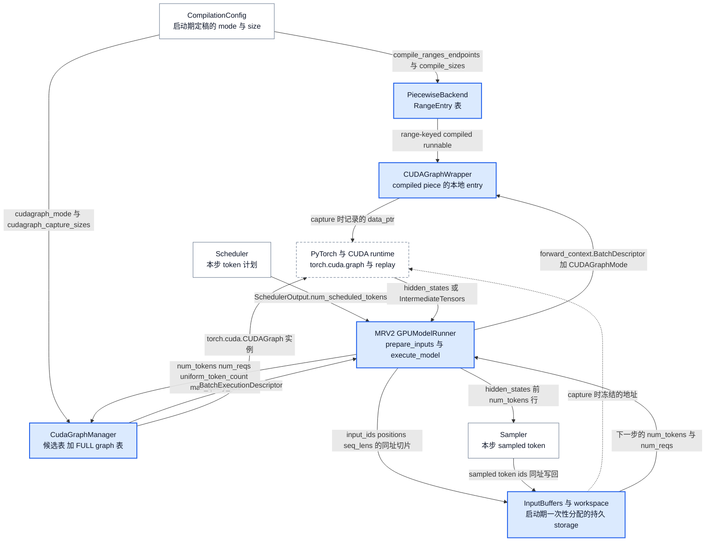
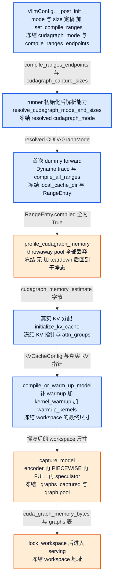
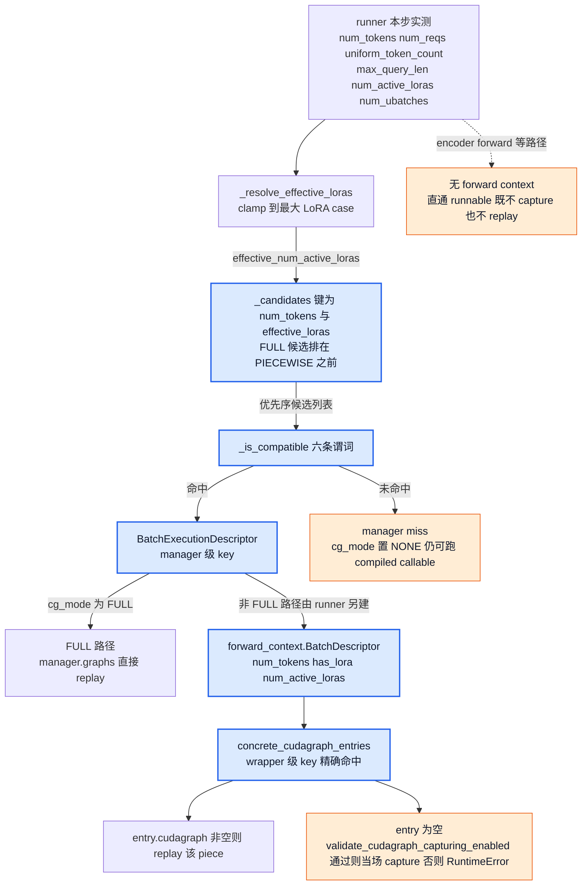

# vLLM 编译与 CUDA Graph：把动态请求收敛为可编译、可捕获、地址稳定的执行区

> **源码基线**：`vllm-project/vllm@199cb9b964822e59ab9b58d88e7be31eb419a2ae`（`main`，2026-09-08）
> **主题**：解释动态请求如何进入有限的编译区间与 CUDA Graph 容量，追踪编译缓存、预热、捕获和重放。随后讨论地址、分段边界、运行期派发与失效条件。
> **适用范围**：本页拥有 compile/graph/cache/shape/地址合同，覆盖 NVIDIA GPU 上 MRV2 与 MRV1 两套派发设计，以及模型区、encoder、speculator/DFlash 四类 capture owner；具体 IR 变换归21，Kernel计算归20，Runner异步组织归11/12，Attention Backend选择归10。
> **最近更新**：2026-09-13。补齐核心流程清单、MRV1 派发、encoder 与 speculator capture、varlen decode 图、workspace 锁定与逐流程成本账；更正官方文档冲突块的框架性表述。

## 1. 定位：本页负责哪个单元，不负责什么

**本页负责的单元是「从配置到重放的一条执行区收敛链」**：把用户的优化意图与 attention backend 的能力求交成一组合法的编译模式与 graph 模式，把无界的 token 数压成有限的 compile range 与 capture 容量，在启动期把代码与 launch 序列都固定下来，再在每一步把真实 batch 派发到其中一个已固定的执行区。它拥有四样东西：**两轴求交与降级**（第 3 节）、**shape 域分区与 compile cache**（第 4、5 节）、**capture 生命周期与地址合同**（第 6 节）、**运行期 descriptor 派发**（第 7 节）。

**它不是这几样东西**，每条都点名真正的 owner：不是 IR 变换与 pass 语义（哪些 op 必须 split、alias/functionalization/donation 怎样保持语义，归 [[21_vllm_ir_and_fusion_passes_analysis|IR 与融合 Pass]]）；不是 kernel 计算与融合收益（归 [[20_vllm_fused_ops_and_kernels_analysis|融合算子与 Kernel]]）；不是 runner 的异步组织与输入行布局（归 [[11_vllm_model_runner_v1_analysis|Model Runner V1]] / [[12_vllm_model_runner_v2_analysis|Model Runner V2]]）；不是 backend 的 graph 能力声明本身（`AttentionCGSupport` 的取值由谁给出，归 [[10_vllm_attention_backends_analysis|Attention Backend]]，本页只消费它）；不是 token 计划与 KV 准入（归 [[07_vllm_scheduler_analysis|Scheduler]] 与 [[08_vllm_kv_cache_management_analysis|KV Cache 管理]]）；不是 DP/TP 组与集合通信语义（归 [[18_vllm_distributed_inference_analysis|分布式推理]]）；不是多模态 modality 分组与 encoder 缓存键（归 [[15_vllm_multimodal_execution_analysis|多模态执行]]，本页只拥有它交来的那次捕获）；不是 draft 宽度与调度表语义（归 [[16_vllm_speculative_decoding_analysis|投机解码]]）。

一条**临时代管**要显式声明：**LoRA 的 capture 特化目前没有专页**。本页拥有 `cudagraph_specialize_lora`、`lora_capture_cases` 的产生、`_build_lora_dispatch_map` / `_resolve_effective_loras` 的 clamp、以及 descriptor 上的 `num_active_loras`；本页**不**拥有 adapter admission 上限，也不拥有 `LoRAConfig.max_loras` / `specialize_active_lora` 的语义。在 LoRA 专页建立之前，读者不应把本页的局部 helper 当作 LoRA 输入域的完整认证。

### 1.1 三个请求各生成一个 token，为什么还需要两种图？

设普通文本请求 A、B、C 都处于 decode，本步各计算一个 token，下一步 C 结束，只剩 A、B。直接执行模型当然能处理这种变化，但每一步都会再次经过框架调度算子和提交 GPU 工作；小 batch 的计算越短，这些固定开销越可能显眼。vLLM 的选择是把动态 token 数交给有限的编译区间，把可重复的设备 launch 交给按容量捕获的 CUDA Graph，而请求本身仍按步变化。

**编译产物回答“执行什么代码”，CUDA Graph 回答“使用哪些地址重放哪串设备工作”。** `torch.compile` 接收计算图并可能生成融合或 shape 特化的 callable，减少框架执行开销，也可能减少中间访存和 kernel launch；CUDA Graph 在已经确定的 callable 外记录实际 launch，重放时进一步减少 CPU 逐个提交的开销。二者都不消除必须执行的模型数学计算；具体融合收益由 [[20_vllm_fused_ops_and_kernels_analysis|融合算子与 Kernel]] 解释。

下面是依据源码规则构造的教学例子，**不是默认参数，也不是性能测量**：普通 decoder，无 LoRA、投机或微批拆分；`max_num_batched_tokens=8`、`max_model_len=8`、`max_num_seqs=4`，编译端点为 `[4]`、单点为 `[4]`，capture sizes 为 `[1,2,4]`，resolved mode 为 `FULL_AND_PIECEWISE`，且 attention 支持 uniform decode FULL。

1. **编译域**：启动期准备 `[1,4]`、`[5,8]` 两个 symbolic ranges 和更高优先级的单点 `[4,4]`。不启用 graph 时，3×H 的模型输入命中 `[1,4]`；启用 graph 并 padding 到4时，4×H 输入命中单点4。这是“在哪个代码版本上执行”的选择，单点不会把原 range 挖空。
2. **捕获域**：A、B、C 产生 `num_tokens=3`、`num_reqs=3`、`uniform_token_count=1`。manager 查候选并选容量4的 FULL descriptor；runner 在持久 input buffer 中写入三项有效值，第四项是 padding，request metadata 与 slot mapping 同步表达真实三项边界。capture 时已经为4个 token 建好的 launch 序列可重用。
3. **下一步**：只剩 A、B 时选择已捕获容量2，而不是在容量4图里临时改 launch 形状。各容量的 entry 使用 capture 时对应的持久 storage；值与请求身份可以更新，地址不能随意重分配。
4. **同为三 token 的另一批**：A 做2 token prefill、B 做1 token decode，`uniform_token_count=None`，因此不能误用 uniform decode FULL；它仍可进入容量4的 PIECEWISE。若调度出5 token，超出本例 capture ladder，manager 返回 graph `NONE`，但5×H仍可由 `[5,8]` compiled callable 执行。

这里的 H 是模型隐藏宽度；本页只画模型区的有效行数，输出图中的 A/B/C 指对应 hidden-state 行，后续选取 logits 与采样由 Runner 和 [[14_vllm_sampling_structured_output_analysis|采样页]] 负责。padding 不制造额外用户请求，也不保证没有额外 GPU 计算。

早期设计把 full graph 与整图 compilation 绑在一起，导致任一不支持 capture 的 attention 都牵动整条快路径；`docs/design/cuda_graphs.md` 的 Motivation 明确记载这种取舍。当前将代码版本和 capture case 分离：同一 symbolic range 可以覆盖多种 token 数，同一组 compiled pieces 可参与 full 或 piecewise capture。

> [!note] 分析推断与外部依赖边界
> 有限 ranges 与启动预编译把重型编译移出在线请求；padding 用额外行计算换有限 capture cases；piecewise 用残余 CPU 提交换动态边界的可执行性。这些是依据选择规则重建的成本解释，不是吞吐测量。vLLM 代码证明向 PyTorch 传入图、输入、pool与stream并调用 `torch.cuda.graph` / `replay()`，不证明未打开的 PyTorch、Inductor 或 CUDA runtime 内部实现。

### 1.2 图 1：闭环位置图

图规格：Mermaid 位置图。节点是持有状态的 owner，边标注跨越边界的**实际对象名**而不是“调用/返回”。启动侧一条汇入链把 `CompilationConfig` 的定稿值送进 `PiecewiseBackend` 与 `CudaGraphManager`；运行侧一条回边表达本页的核心不变量——**采样出的新 token 写回同一 `InputBuffers` storage，下一步以新的 `num_tokens` 重新进入 dispatch**，地址不变、值改变。标 PyTorch/CUDA 的节点是外部执行交接点，本轮未在 GPU 上实跑。



这张图不画 piecewise 的内部结构。需要预先澄清的是：piecewise 的“分段”不是指请求行被分到不同设备，而是同一批输入依次通过的模型算子区域——安全段进 graph、边界算子留在外面正常调用。安全段内部具体如何融合、是否生成不同 kernel 由编译器和 [[21_vllm_ir_and_fusion_passes_analysis|IR 与融合 Pass]] 决定，本页任何一张图都没有声称“一段等于一个 kernel”。

### 1.3 本页拥有的核心流程

下表穷尽本页拥有的 18 条流程。第四列的“可观察变化”是一个具体的返回值、字段翻转或落盘事件，不是“处理完成”。逐条的触发/阶段/完成点在对应小节展开。

| 功能 | 要解决的问题 | 设计与实现入口 | 产出的可观察变化 |
|---|---|---|---|
| ① 配置期 mode 与 size 定稿 | 用户意图与平台能力要先变成一组有限的 graph mode 与 capture size | `vllm/config/vllm.py::VllmConfig.__post_init__` → `_set_cudagraph_sizes`；`vllm/config/compilation.py::CompilationConfig.post_init_cudagraph_sizes` | `cudagraph_mode` / `cudagraph_capture_sizes` / `max_cudagraph_capture_size` 三者定稿，`cudagraph_capture_sizes[-1] == max_cudagraph_capture_size` 的 assert 成立 |
| ② compile range 端点生成 | 融合 pass 的适用阈值要变成 Inductor 可分别生成代码的区间边界 | `vllm/config/vllm.py::VllmConfig._set_compile_ranges` | `compile_ranges_endpoints` 排序写回，末元素恒为 `max_num_batched_tokens` |
| ③ 能力求交与降级/拒绝 | backend 的 capture 能力、请求形态与用户所要 mode 可能冲突 | `vllm/config/compilation.py::CompilationConfig.resolve_cudagraph_mode_and_sizes` | `self.cudagraph_mode` 被改写并返回；无合法替代时抛 `ValueError` |
| ④ dynamic 维标记与 guard 策略 | 哪些参数维是动态的、要不要保留 Dynamo guard | `vllm/compilation/decorators.py::_support_torch_compile._mark_dynamic_inputs / __call__`；`vllm/compilation/wrapper.py::TorchCompileWithNoGuardsWrapper` | `TorchCompileWithNoGuardsWrapper.first_compile` 翻为 False |
| ⑤ AOT 命中与源码校验 | 跨进程复用已编译产物，又不能用过期源码 | `vllm/compilation/decorators.py::_try_load_aot_compiled_fn`；`vllm/compilation/caching.py::_verify_source_unchanged` | `aot_compiled_fn` 非空且 `was_aot_compile_fn_loaded_from_disk=True`；源码不符抛 `RuntimeError` |
| ⑥ compile cache key 生成与失效 | 代码 artifact 何时还能复用 | `vllm/compilation/backends.py::VllmBackend.__call__` | `compilation_config.local_cache_dir` 建立在 `VLLM_CACHE_ROOT/torch_compile_cache/<key>/rank_i_j/prefix`，缓存文件落盘 |
| ⑦ shape 域分区与启动期批量编译 | 无界 token 数要压成有限个 runnable | `vllm/compilation/piecewise_backend.py::PiecewiseBackend.__init__ / compile_all_ranges / load_all_ranges` | 每个 `RangeEntry.compiled == True`，`__call__` 的区间断言才成立 |
| ⑧ op 分区 | CUDA-Graph-unsafe op 要留在 capture 区之外 | `CompilationConfig.set_splitting_ops_for_v1`；或 `use_inductor_graph_partition` 的 codegen 期 partition | `splitting_ops` 定稿；空列表分支还会回改 `cudagraph_mode` |
| ⑨ warmup 补齐 | capture 不覆盖的 compile size 与 range 端点仍需先编译 | `vllm/v1/worker/gpu_worker.py::Worker.compile_or_warm_up_model`；MRV2 另有 `warmup_kernels` | 补齐 sizes 的 `_dummy_run` 全部返回、`kernel_warmup` 结束，进入 `capture_model()` |
| ⑩ capture 计划生成 | 哪些 descriptor 值得建图、以什么优先序查表 | `vllm/v1/worker/gpu/cudagraph_utils.py::CudaGraphManager._init_candidates / _build_lora_dispatch_map` | `_capture_descs` 与 `_candidates` 建成，`needs_capture()` 为真 |
| ⑪ capture 显存 profiling 与 teardown | 真实 KV 分配前要先知道 graph 要吃多少显存 | `vllm/v1/worker/gpu/cudagraph_utils.py::profile_cudagraph_memory / _teardown_profiling_state` | 返回 bytes 估计，且 `runner.cudagraph_manager is None`、`cache_config.num_gpu_blocks is None` |
| ⑫ 模型区实际 capture | 把 launch 序列真正录下来并固定地址 | `ModelCudaGraphManager.capture` → `CudaGraphManager.capture` | `self._graphs_captured = True`；非 profile 路径随后 `lock_workspace()` |
| ⑬ encoder graph capture | ViT 侧要一套按 token budget 而非容量阶梯的图 | `vllm/v1/worker/gpu/mm/encoder_runner.py::EncoderRunner.capture` → `vllm/v1/worker/encoder_cudagraph.py::EncoderCudaGraphManager.capture` | 每个 path×budget 一张 `torch.cuda.CUDAGraph` 与 `output_buffer` 就位（**不能用 `is_captured()` 当完成点**——`capture()` 的第一条语句就赋 `self.graph_pool`，它在 capture 刚开始时即为真） |
| ⑭ speculator / DFlash graph capture | draft 前向要用自己的 attention metadata 建图 | `SpeculatorCudaGraphManager.capture`；`DFlashCudaGraphManager.capture` | 各 manager 自己的 `_graphs_captured = True` |
| ⑮ 运行期 dispatch 与 DP 协商 | 本步真实 batch 落到哪张图，且 DP 各 rank 要一致 | `vllm/v1/worker/gpu/dp_utils.py::dispatch_cg_and_sync_dp / sync_cudagraph_and_dp_padding` → `CudaGraphManager.dispatch` | 返回 `BatchExecutionDescriptor` 与可选的 `DPSyncState`；miss 时 desc 的 `cg_mode == NONE` |
| ⑯ 四条执行路径 | 同一 descriptor 交给谁执行、返回什么 | `vllm/v1/worker/gpu/model_runner.py::GPUModelRunner.execute_model` 的 FULL / ubatch / PIECEWISE / eager 分支 | FULL 返回 `[:desc.num_tokens]` 设备切片；PIECEWISE 的 `entry.cudagraph` 非空并返回 output |
| ⑰ MRV1 forward-context 派发 | MRV2 不支持的特性回落后，同一关切的另一套现役实现 | `vllm/v1/cudagraph_dispatcher.py::CudagraphDispatcher.initialize_cudagraph_keys / dispatch`，经 `set_forward_context` 下发 | 返回 `(CUDAGraphMode, BatchDescriptor)` 并写入 forward context |
| ⑱ 失效与 teardown | 什么时候必须丢弃已建立的图 | `vllm/compilation/cuda_graph.py::CUDAGraphWrapper.clear_all_graphs`；`vllm/compilation/breakable_cudagraph.py::BreakableCUDAGraphWrapper.clear_all_graphs`；runner shutdown | `concrete_cudagraph_entries` 清空 |

### 1.4 基础与条件：哪些流程普通路径也会走

“基础”指默认优化档（`optimization_level=O2`，其 `cudagraph_mode` 默认为 `FULL_AND_PIECEWISE`）下的普通文本推理也会经过；“条件”指启用某项功能后才出现。

| 类别 | 流程 | 触发条件 | 本页位置 |
|---|---|---|---|
| 基础 | ①②③ | 恒走 | 第 3 节、§4.2 |
| 基础 | ④⑥⑦⑧ | `CompilationMode.VLLM_COMPILE` 下恒走 | §4.1、§4.3、§4.4、第 5 节 |
| 基础 | ⑨⑮⑯⑱ | 恒走 | §3.4、§7.1、§7.2、第 8 节 |
| 基础（现代 torch）/ 条件（旧 torch） | ⑤ AOT | 由 `use_aot_compile()` 按 torch 版本与 compile cache 开关判定：torch ≥ 2.10 且未设 `VLLM_DISABLE_COMPILE_CACHE` 时默认走，此时 `_verify_source_unchanged` 的 `RuntimeError` 是默认可达的失败边界而非 opt-in 诊断（`VLLM_FORCE_AOT_LOAD` 另控制强制加载） | 第 5 节 |
| 条件 | ⑧ 的 codegen 期分支 | `use_inductor_graph_partition=True` | §4.4 |
| 条件 | ⑩⑫ | `cudagraph_mode != NONE`（默认档打开，`enforce_eager` 关闭） | §6.2、§6.3 |
| 条件 | ⑪ | `current_platform.is_cuda_alike()` 且 `cudagraph_mode != NONE`；扣减 KV 预算另需 `VLLM_MEMORY_PROFILER_ESTIMATE_CUDAGRAPHS`（默认 1） | §6.3 |
| 条件 | ⑬ encoder graph | `cudagraph_mm_encoder=True`、模型 `supports_encoder_cudagraph` 且非 `enforce_eager` | §6.4 |
| 条件 | ⑭ speculator graph | 存在 `speculative_config` 且对应 speculator 建了 manager | §6.4 |
| 条件 | ⑰ MRV1 派发 | `VllmConfig.use_v2_model_runner` 为 False | §7.3 |
| 条件 | breakable PIECEWISE | `VLLM_USE_BREAKABLE_CUDAGRAPH=1`（部分架构自动开启） | §3.1、§7.1 |
| 条件 | DP 协商 | `data_parallel_size > 1` | §7.4 |
| 条件 | LoRA capture 特化 | `enable_lora` 且 `cudagraph_specialize_lora=True` | §6.2 |
| 条件 | varlen decode 图 | `adaptive_verification` 非空（`CudaGraphManager(varlen_decode=True)`） | §6.2 |

## 2. 所有权：谁建立执行合同

| 责任 owner | 输入 → 输出 | 拥有的状态与不变量 | 明确不拥有 |
|---|---|---|---|
| `CompilationConfig` | 用户优化意图 + platform / attention 能力 → compile mode、splitting ops、shape ranges、graph mode / sizes | 模式求交、静态 shape 预算、合法组合与显式降级 | runtime tensor 地址、graph 实例 |
| compile wrapper / backend | 首次 dummy inputs + traced code → range-keyed callable 与磁盘 cache | dynamic dim 标记、guard policy、op partition、每个 range 的 compiled runnable、cache key | CUDA Graph dispatch key、persistent device buffers |
| generic `CUDAGraphWrapper` | matching runtime mode + descriptor + compiled piece → guard允许时 entry capture 或 replay | descriptor-keyed local entries、capture pool、capture-time pointers；miss 时受 capture guard 约束 | persistent input buffer、manager candidate compatibility |
| MRV2 `CudaGraphManager`（含 `ModelCudaGraphManager`） | graph mode + capture sizes + decode / LoRA 能力 → capture descriptors、candidate table、graph pool entries | 可捕获 descriptor 集合、共享 pool、capture 完成位、FULL graph table | request admission、输入值生产 |
| MRV2 runner | 当前 `SchedulerOutput` → padded descriptor + stable buffer values → FULL / ubatch / PIECEWISE / NONE 执行 | 每步 descriptor、persistent input storage、dispatch / DP 一致性、replay 时序 | compile pass 语义、attention backend 内部算法 |
| MRV1 `CudagraphDispatcher` | resolved graph mode + capture sizes + LoRA case → 两个 `set[BatchDescriptor]` 派发键集合 | `cudagraph_keys`、`_bs_to_padded_graph_size` 查表、`compile_sizes` 与 padding 的一致性校验 | descriptor 兼容谓词（它做集合精确命中）、graph 实例本身 |
| `EncoderCudaGraphManager` | token budget 阶梯 + 模型的 encoder capture 契约 → 每个 path×budget 一张 graph 与 `output_buffer` | budget 阶梯与 `max_batch_size <= min(token_budgets)` 不变量、input buffer 清零与 slice-copy | modality 分组与 encoder 缓存键（[[15_vllm_multimodal_execution_analysis\|多模态执行]]） |
| `SpeculatorCudaGraphManager` / `DFlashCudaGraphManager` | draft 侧 forward_fn + 每次重建的 attention metadata → draft 图 | 各自的 `graphs` 与 `_graphs_captured`；每次 warmup/capture 都重建 metadata | draft 宽度、`decode_query_lens` 的调度表语义（[[16_vllm_speculative_decoding_analysis\|投机解码]]） |
| `WorkspaceManager` | capture 完成信号 → 锁定的 workspace 尺寸 | 锁后任何增长请求抛 `AssertionError` 的地址不变量 | workspace 的具体使用者与分配尺寸来源 |

这些 owner 的边界解释了为什么 cache hit 不等于 graph hit：磁盘 cache 可恢复“某段代码在某个 shape range 上怎样执行”，而 graph entry 还绑定当前进程的 storage、pool 与 capture-time metadata，只能由当前进程中的 manager 或 wrapper 建立。

**与相邻页的交接对象**（方向标出真名，不是“调用/返回”）：

| 相邻页 | 进入本页的对象 | 离开本页的对象 |
|---|---|---|
| [[07_vllm_scheduler_analysis\|Scheduler]] / [[08_vllm_kv_cache_management_analysis\|KV Cache 管理]] | `SchedulerOutput.num_scheduled_tokens` 经 runner 变为 `BatchExecutionDescriptor.num_tokens / num_reqs` | `profile_cudagraph_memory()` 的 `cudagraph_memory_estimate` 在 `Worker.determine_available_memory` 中扣减 `available_kv_cache_memory_bytes` |
| [[10_vllm_attention_backends_analysis\|Attention Backend]] | 各组 `builder_cls.get_cudagraph_support(...)` 取最小值得到 `min_cg_support` | resolved `cudagraph_mode` 与 capture 时的 `for_cudagraph_capture=True` metadata |
| [[15_vllm_multimodal_execution_analysis\|多模态执行]] | 分组后的 `mm_kwargs_batch` | `EncoderCudaGraphManager.execute()` 返回的每 item 一行 encoder 输出（源自 `output_buffer`） |
| [[16_vllm_speculative_decoding_analysis\|投机解码]] | `uniform_decode_query_len`、`num_speculative_tokens_per_batch_size` | `BatchExecutionDescriptor.uniform_token_count` 与 `max_query_len` |
| [[18_vllm_distributed_inference_analysis\|分布式推理]] | DP group 的 `cpu_group` | 6 行 `all_reduce` 张量（`num_tokens` / `cg_mode` / `uniform_token_count` / `max_query_len` / `allow_ubatching` / `num_reqs`）与协商结果 `DPSyncState` |
| [[11_vllm_model_runner_v1_analysis\|MRV1]] / [[12_vllm_model_runner_v2_analysis\|MRV2]] | `InputBuffers` 的持久 storage、每步真实 batch 形状 | MRV1 得到 `(CUDAGraphMode, BatchDescriptor)`；MRV2 得到 `BatchExecutionDescriptor` 与 `run_fullgraph` 的输出切片 |

## 3. 模式求交：eager、compile、piecewise 与 full 是两条轴

### 3.1 编译轴与 capture 轴

`CompilationMode` 有 `NONE`、stock `torch.compile`、只 trace 一次并移除 guards、以及带 cache / piecewise / shape specialization 的 `VLLM_COMPILE` 四种选择。`CUDAGraphMode` 则把 runtime mode 定义为 `NONE`、`PIECEWISE`、`FULL`，并用 `FULL_DECODE_ONLY` 与 `FULL_AND_PIECEWISE` 表达 decode / mixed 两条 routine 的组合。

| 用户看到的执行形态 | compile 轴 | CUDA Graph 轴 | 实际含义与边界 |
|---|---|---|---|
| eager | `NONE` | `NONE` | 未启用 torch.compile 的 model forward；`enforce_eager` 会同时关闭 compile 和 CUDA Graph |
| compile-only | stock / trace-once / `VLLM_COMPILE` | `NONE` | 运行 compiled callable，但不记录 launch；适合隔离 compile 正确性与性能 |
| full graph without compile | `NONE` | `FULL` 或 `FULL_DECODE_ONLY` | 只要 backend 能 capture，满足capture约束的完整模型区可在无 compilation 时捕获；full 与 compile 在配置上正交 |
| piecewise | 通常为 `VLLM_COMPILE` | `PIECEWISE` | splitting ops 留在 graph 外，内部 compiled pieces 各自 capture；若启用 breakable CUDA Graph（`VLLM_USE_BREAKABLE_CUDAGRAPH=1`，见 `vllm/compilation/breakable_cudagraph.py::is_breakable_cudagraph_enabled`），则可不用 `torch.compile` 做分段 capture |
| full + piecewise | 通常为 `VLLM_COMPILE` | `FULL_AND_PIECEWISE` | uniform decode 优先 full，prefill / mixed 走 piecewise；覆盖最多，也支付最多 capture 时间和 graph memory |

“FULL 比 PIECEWISE 更高，所以一定更好”也是错误心智模型。`FULL` 减少模型捕获区内逐算子的 CPU launch 提交，却要求 attention、metadata、collective 和地址都可捕获；`PIECEWISE` 保留 eager boundary，少消除一些 launch，却能服务更动态的 batch。配置会把请求模式与 attention backend 的最小 graph capability 求交：mixed 不支持 full 时可改为 `FULL_AND_PIECEWISE` 或 `FULL_DECODE_ONLY`，连 decode full 都不支持时再退为 `PIECEWISE` 或 `NONE`；没有合法替代时直接报错。

### 3.2 配置期的 graph mode 改写：`resolve` 之前已经有九处

能力求交不是第一道关。`VllmConfig.__post_init__` 在见到任何 attention backend 之前，就已按平台、模型类别与外围功能改写过 `cudagraph_mode`；第九条则发生在 MRV2 runner 里、紧挨着 `resolve` 之前。这些改写全部属于本页，逐条按源码顺序：

| 触发条件 | 动作 | 日志级别 |
|---|---|---|
| `model_config.enforce_eager` | `CompilationMode.NONE` + `CUDAGraphMode.NONE` | warning |
| `profiler_config.profiler == "proton"` 且 `cudagraph_mode != NONE` | 抛 `ValueError`，要求 `--enforce-eager` 或 `cudagraph_mode=none` | 异常 |
| dynamic speculative decoding（`uses_dynamic_speculative_decoding()`）+ full graph + 非 MRV2 | 覆盖为 `PIECEWISE`（`_maybe_override_dynamic_sd_cudagraph_mode`） | warning |
| `cudagraph_mode.requires_piecewise_compilation()` 但 `mode != VLLM_COMPILE` 且未开 breakable | 覆盖为 `NONE` | info |
| pooling 模型（`pooler_config is not None`）+ `has_full_cudagraphs()` | 覆盖为 `PIECEWISE` | warning |
| encoder-decoder 模型且 mode ∉ {`NONE`, `FULL_DECODE_ONLY`} | 覆盖为 `FULL_DECODE_ONLY` | info |
| KV transfer instance + full graph + `connector_cls.requires_piecewise_for_cudagraph(...)` | 覆盖为 `PIECEWISE` | warning |
| `not current_platform.support_static_graph_mode()` | 覆盖为 `NONE`（整个 `_set_cudagraph_sizes` 分支都被跳过） | 无 |
| `adaptive_verification is not None`（**不在 `__post_init__` 里**，在 MRV2 runner 内、紧挨着 `resolve_cudagraph_mode_and_sizes` 之前） | **无条件**覆盖用户设置为 `FULL_AND_PIECEWISE` | 无 |

`set_splitting_ops_for_v1` 还会在 op 分区结果不足以支撑 piecewise 时**反向**改写 graph mode：`splitting_ops == []` 时 `PIECEWISE` → `NONE`、`FULL_AND_PIECEWISE` → `FULL`；SP/async-TP 在关闭 inductor partition 时强制清空 `splitting_ops` 并把 piecewise 图升为 `FULL`；`deepep_high_throughput` 且 DP>1 时直接 `NONE`。**因此“用户写了什么 mode”与“运行时是什么 mode”之间隔着这十余条改写**，排障时必须读 resolved 值而不是命令行值。

`enforce_eager=True` 是恢复普通执行的宽开关：如果问题消失，只能缩小到 compile 与 CUDA Graph 这两类优化及相关交互，不能单凭这个结果认定是 CUDA Graph、编译 pass 或缓存哪一个出错。只隔离 graph 时应保持原 compile 配置而令 `cudagraph_mode=NONE`；只隔离 compilation 则还必须确认 graph mode 的 resolved 结果，因为普通 PIECEWISE 依赖 `VLLM_COMPILE`，配置可能连 graph 一并关闭。`TORCH_COMPILE_DISABLE=1` 只先关闭 compile，后续兼容性规则仍会解析 graph。操作过程见 [[05_vllm_debugging_troubleshooting_guide|调试与排障]]。

### 3.3 能力求交：`resolve_cudagraph_mode_and_sizes` 的七个判定点

不是任何“不兼容”都自动回退。`CompilationConfig.resolve_cudagraph_mode_and_sizes` 在 attention backend 初始化之后被调用，其入参 `min_cg_support` 是各 KV cache group 上所有 backend 的 `get_cudagraph_support()` 取最小值。判定链按源码顺序穷尽如下：

1. `cudagraph_mode is None or == NONE` → 写回 `NONE` 并立即返回。
2. `mixed_mode() == FULL` 且 `min_cg_support != ALWAYS`：`NEVER` 时直接抛 `ValueError`（提示改 `PIECEWISE` 并确认 `VLLM_COMPILE`）；否则按 `splitting_ops_contain_attention()` 改为 `FULL_AND_PIECEWISE` 或 `FULL_DECODE_ONLY`，并 warning。
3. `decode_mode() == FULL` 且 `min_cg_support == NEVER`：按 `mode == VLLM_COMPILE and (splitting_ops_contain_attention() or use_inductor_graph_partition)` 降为 `PIECEWISE`，否则降为 `NONE`，warning。
4. **spec-decode 分支**：`decode_mode() == FULL` 且 `uniform_decode_query_len > 1` 且 `min_cg_support.value < UNIFORM_BATCH.value`：按 `splitting_ops_contain_attention()` 降为 `PIECEWISE` 或 `NONE`，warning。这条正是 [[16_vllm_speculative_decoding_analysis|投机解码]] 交接来的边——draft 宽度使 decode batch 不再是单 query，backend 必须支持 uniform batch 才能保留 full decode。
5. **降级后的二次 re-check**：若自动降级之后仍 `has_full_cudagraphs()` 而 `min_cg_support == NEVER`，抛 `ValueError`。这一步存在的理由是前三条只改写各自触发的那一半 routine，组合后仍可能剩下非法的 full。
6. **MRV1 专属**：`not use_v2_model_runner` 且 `decode_mode() == FULL` 且 `uniform_decode_query_len > 1` 时调用 `adjust_cudagraph_sizes_for_spec_decode()`，把 capture sizes 对齐到 `uniform_decode_query_len` 的倍数；同时启用 SP 且 TP>1 时还要对齐 `tensor_parallel_size`，两个倍数无法同时满足则抛 `ValueError`。MRV2 不走这条（capture 尺寸由 `cudagraph_utils.py` 侧处理）。
7. **Mamba block 检查**：`kv_cache_config` 与 `max_num_reqs` 均非空、`has_full_cudagraphs()`、非 profiling、`kv_cache_config.has_mamba_layers` 且 `max_num_reqs > kv_cache_config.num_blocks` 时抛 `ValueError`，要求把 `max_num_seqs` 降到 `num_blocks` 或提高 `gpu_memory_utilization`。理由是每个 decode 序列要占一个 Mamba cache block，而 decode 图的容量上限就是 `max_num_seqs`；这里报错而不是悄悄裁剪 capture sizes，是为了不连带限制 prefill 的 PIECEWISE 图。

**完成点**：`self.cudagraph_mode` 被写回并作为返回值交给 runner，随后 MRV2 用它构造 `ModelCudaGraphManager`、MRV1 用它调 `CudagraphDispatcher.initialize_cudagraph_keys`。能力声明与候选 backend 验证见 [[10_vllm_attention_backends_analysis|Attention Backend]]；这里拥有声明怎样改变 capture 策略。

### 3.4 warmup 与 capture 的启动顺序

GPU worker 的 `compile_or_warm_up_model` 先补齐未被 capture 覆盖的 compile size/range warmup（取 `compile_sizes` 去掉 `cudagraph_capture_sizes`，再对没有任何 size 落在其中的 compile range 追加 `range.end`），按 size 降序逐个 `_dummy_run`；再做 `kernel_warmup`；MRV2 另加一次 `warmup_kernels`（注释直言“capture 之后再 resize workspace 会释放图指向的内存”，所以 workspace 的最终尺寸必须在 capture 前定下来）；随后才 `capture_model()`。

MRV2 manager 对计划 descriptors 先以 graph `NONE` 预热，按 PIECEWISE 后 FULL 的顺序 capture，全部成功后才标记 `_graphs_captured=True`。默认 piecewise 路径进入模型内的 wrapper；breakable 路径则先初始化 `BreakableCUDAGraphWrapper`，由它串联 graph segments 与 eager breaks。不能把所有 PIECEWISE 都画成 generic wrapper。

`NONE` 在这段启动/派发协议中指**不做 CUDA Graph**，不必然是原始 eager PyTorch：warmup 或运行时 miss 仍可进入已编译模型。是否跳过编译，由 compilation mode 或 forward context 的 `skip_compiled` 独立决定。

## 4. 动态 shape 怎样被压成有限状态

### 4.1 guard policy：只 trace 一次的收益以额外证明义务为代价

被 `support_torch_compile` 标注的 model 会显式标记哪些参数维度是 dynamic；`UNBACKED` 使用 `mark_unbacked`，其他策略使用 `mark_dynamic`。除 stock compile 外，wrapper 默认丢弃 Dynamo guards，使首次调用触发一次 compilation、之后不再因 guard miss 重新 trace。**完成点**是 `TorchCompileWithNoGuardsWrapper.first_compile` 从 True 翻为 False。

这不是“所有 shape 自动安全”。`BACKED` 可能产生随后被忽略的 guard，`UNBACKED` 不会被 guard / 0-1 specialize，却可能遇到 data-dependent branch；`BACKED_SIZE_OBLIVIOUS` 只是折中且仍无无-guard 保证。因此 `evaluate_guards` 是诊断开关：保留 shape guards，在后续输入导致 recompile 时失败；它要求 `VLLM_USE_BYTECODE_HOOK=0`，不能和 `UNBACKED` 搭配（两条都是 `vllm/compilation/wrapper.py` 中的真 assert），BACKED 的 AOT 组合在当前测试中被跳过。测试覆盖普通分支与 0/1 specialization，且明确存在 BACKED 0/1 的例外；诊断通过不能证明所有 shape 与值分支安全。

### 4.2 compile range 的端点是怎么来的：每个端点都是一条融合 pass 的阈值

§4.3 会说 range 怎样变成 `RangeEntry`，但“为什么切在这里”由 `VllmConfig._set_compile_ranges` 回答，它在 `__post_init__` 中位于 `set_splitting_ops_for_v1` 之前。

**触发**：`VllmConfig.__post_init__`。
**读入**（每一项都是某个融合 pass 的适用阈值，换算成 token 数）：

- `scheduler_config.max_num_batched_tokens` —— **恒为最后一个端点**，无条件先追加；
- `pass_config.fuse_allreduce_rms` → ROCm 上取 `AiterCustomAllreduce.effective_max_size()`，否则取 `pass_config.flashinfer_max_size(tp_size)`，再换算 `max_size // (model_config.get_hidden_size() * dtype.itemsize)` 个 token；小于 `max_num_batched_tokens` 才成为端点，否则只记 debug 日志（意为该融合对全部 token 数都适用）。注意这里的 hidden size **只取目标模型**，而 CUDA 上 pass 自己的门按目标与 draft 两者的较大 hidden size 计算：draft 更宽时，端点会大于门，以该端点收尾的那段 range 反而跳过融合，见 [[21_vllm_ir_and_fusion_passes_analysis|IR 与融合 Pass]] §9.1；
- `pass_config.enable_sp` → 未显式给 `sp_min_token_num` 时由 `get_sequence_parallelism_threshold(hidden_size, tp, element_size)` 推出，端点取 `min_token_num - 1`，从而切出「阈值以下不做 SP」「阈值以上做 SP」两段；
- `pass_config.fuse_rope_kvcache` 与 `fuse_qk_norm_rope_kvcache` → 各取 `pass_config.rope_kvcache_fusion_max_token_num`；
- 用户在 `compile_ranges_endpoints` 里给的端点，只接受 `1 < x < max_num_batched_tokens`。

**决定**：range 边界不是等分或经验值，而是**让 Inductor 能对「阈值以下」与「阈值以上」生成不同代码**。若不切，一个 symbolic range 内的代码必须对阈值两侧都正确，融合就只能整段放弃。
**流向与完成点**：`compilation_config.compile_ranges_endpoints = sorted(computed)` 写回；随后 `CompilationConfig.get_compile_ranges()` 由它派生为 `[Range(s+1, e) for s, e in zip([0] + endpoints[:-1], endpoints)]`，`Range` 是**双闭区间**。

**与 21 的边**：阈值内部的 pass 语义（这些融合到底改写了什么 IR、为什么在该 token 数以下才成立）归 [[21_vllm_ir_and_fusion_passes_analysis|IR 与融合 Pass]]；端点的**产生与消费**归本页。

### 4.3 shape 域分区：range 负责覆盖，single size 负责特化

`compile_ranges_endpoints` 把 `[1, max_num_batched_tokens]` 切成若干闭区间，`compile_sizes` 再插入优先级更高的单点区间。`PiecewiseBackend` 为每个区间建立 `RangeEntry`：单点用 concrete fake inputs 编译，普通 range 保留 symbolic inputs；无论 decoder 还是 encoder，所有 entry 都在 `PiecewiseBackend.__init__` 内一次性 compile（`compile_all_ranges`）或从 cache load（`load_all_ranges`），运行期不新建 runnable。运行时先找 exact size，再找包含它的 range，越过全部计划区间则 assert，而不是在线创建新 runnable。**完成点**是每个 `RangeEntry.compiled == True`。

测试把这层语义固定得很具体：端点 `8, 32` 与 static size `16, 64, 128` 产生三个 dynamic ranges 加三个 single-size compilations；这里的第三个 range 来自 `_set_compile_ranges` 自动补上的 `max_num_batched_tokens` 端点，而不是两个端点自己变成三段。另一个测试证明 single size 已无 symbolic shape，而 range 仍保留 symbolic batch 维。encoder compilation 会把最后一个 range 的上界扩到 int32 最大值，因此不能把 decoder token预算当成所有编译模块的统一上界。

更多 static sizes 可能换来更好的 autotune，却增加首次 compile 时间和 cache 体积；它不是免费扩大覆盖面。还有一条**硬约束**：启用 graph 时 `CudagraphDispatcher._compute_bs_to_padded_graph_size` 会逐个检查 `compile_sizes`，只要某个 size 会被 capture padding 改写成别的值，就直接抛 `ValueError("compile_sizes contains N which would be padded to M ...")`，要求改用 `cudagraph_capture_sizes` 中的值。即：单点特化和 capture 阶梯必须对齐，不能各说各话。

### 4.4 op 分区：只决定 capture boundary，不在本页重写 IR 语义

`splitting_ops` 的职责是把 CUDA-Graph-unsafe op 留在 piece 外：默认路径在 Dynamo FX 图上 split（`set_splitting_ops_for_v1` 默认取 `_attention_ops`，并在非 inductor-partition 时追加 `vllm::unified_kv_cache_update` 与 `vllm::unified_mla_kv_cache_update`）；`use_inductor_graph_partition` 则等 passes / fusions 完成后才在 codegen 阶段按规则 partition。后者让 full 与 piecewise 共用一次 compilation：piecewise wrapper 包住各安全 partition，full wrapper 位于整个 call 外并忽略内部 partition。

这个设计胜过“任一 unsafe op 让整图 eager”，代价是 boundary 本身必须正确表达 alias 与副作用。哪些 op 必须 split、donation / functionalization 怎样维护语义属于 [[21_vllm_ir_and_fusion_passes_analysis|IR 与融合 Pass]]；本页只拥有由该结果产生的 compile / capture 区域与生命周期。当前配置还会因 sequence parallelism、attention fusion、KV update 或 DeepEP 兼容性改写 splitting / graph mode，并给出 warning 或关闭 graph——`fuse_rope_kvcache` 与 `fuse_qk_norm_rope_kvcache` 在 `splitting_ops is None` 且未开 inductor partition 时会被**关闭**（而不是保留融合而牺牲分段），这是同一张表上的反向裁决。

## 5. Compile lifecycle：cache 是代码状态，失效由 hash 驱动

冷启动时，wrapper 收集 trace 涉及的源文件，backend 把 environment、由 `VllmConfig.compute_hash()` 选入的配置因素、traced code content 与 compiler state 分别 hash，再组合成 `sha256(...)[:10]` 的 cache key，目录为 `VLLM_CACHE_ROOT/torch_compile_cache/<key>`；目录内继续按 `rank_{rank}_{dp_rank}/{prefix}` 隔离，其中 `prefix` 隔离的是同一进程内多个被装饰模块（例如 draft 模型）。默认生成目录时，**参与 hash 的因素**变化会换 key；用户显式给定 `cache_dir` 时不会走同一目录生成分支。动态生成的 `<string>` 源码被跳过，读文件失败会 warning 并 continue，故不能把它宣传为对任意代码或环境变化的完整失效证明。AOT 路径也把 env 与 config 放入 `aot_compile_hash_factors`，并在加载时用 `_verify_source_unchanged` 补验 traced source content，不一致抛 `RuntimeError`。

这里的 invalidation 是**选不到旧 key**，不是修改旧文件；`VLLM_DISABLE_COMPILE_CACHE=1` 是隔离缓存复用的诊断手段；重新编译并不会替代 graph 的地址前置条件。compile cache 也不能替代 graph capture：前者可跨进程复用代码 artifact，后者依赖当前进程的地址与 pool，仍必须在真实运行时状态建立后 capture。

## 6. Capture lifecycle：地址、descriptor 与 pool 同时冻结

### 6.1 地址稳定不是值静止，而且有两个来源

MRV2 在 runner 初始化时一次性分配最大容量的 `input_ids`、`positions`、`is_padding`、`query_start_loc`、`seq_lens` 与 `dcp_local_seq_lens`（最后一项 DCP 专用，同样进入地址合同）。每步不是换 tensor，而是把 prefill token、position、sampled / draft token 和 request metadata 写入这些 buffers，再向 model 传递相同 storage 的切片。所以 replay 可以看到新值，同时仍使用 capture 时记录的地址。

**稳定地址由两个来源共同保证，缺一不可**：

1. **runner 预分配的 `InputBuffers`** —— 值可变、地址不变，由 in-place 更新维持；
2. **capture 后锁定的 workspace** —— `capture_model()` 在非 profile 路径调用 `vllm/v1/worker/workspace.py::lock_workspace()`，源码注释写明「capture 之后再 resize 会释放静态 cuda graph buffer」。锁定后 `WorkspaceManager` 对任何需要增长的分配请求抛 `AssertionError`（报出请求者位置与所需字节），而不是悄悄换一块内存。因此 warmup 阶段必须先把 workspace 撑到最终尺寸——这正是 MRV2 在 capture 之前额外跑一次 `warmup_kernels` 的原因。speculator 的 capture 在 `use_workspace_lane(self._draft_workspace_lane)` 下进行，占用独立 lane。

通用 `CUDAGraphWrapper` 明确不拥有 persistent buffers；它把稳定地址责任留给 caller。capture 时 entry 记录 tensor `data_ptr`，DEBUG 模式 replay 会逐项 assert 地址未变。重要边界是：production 不能把这个 debug assert 当成正确性机制；地址稳定必须由 runner 的预分配、in-place 更新与 workspace 锁定先成立。

### 6.2 descriptor 是 graph identity，不只是 batch size

MRV2 的 `BatchExecutionDescriptor` 恰有七个字段：runtime graph mode（`cg_mode`）、token 容量（`num_tokens`）、request 容量（`num_reqs`）、`uniform_token_count`、`max_query_len`、`num_active_loras` 与 `num_ubatches`。`_is_compatible` 的六条子句彼此独立，逐条给出它挡住了什么误命中：

| 字段 | 谓词方向 | 它挡住的误命中 |
|---|---|---|
| `uniform_token_count` | `desc 为 None`（PIECEWISE 图）或必须**相等** | 2+1 的 mixed batch（真实侧 `None`）误用 uniform decode FULL 图 |
| `max_query_len` | `desc 为 None`，或真实侧非 None 且 `desc.max_query_len >= 真实值` | prefill batch（真实侧 `None`）误用 varlen decode 图；真实 query 更宽的 batch 误用更窄的图 |
| `num_reqs` | `desc 为 None`（PIECEWISE 无需 request padding）或 `>=` | 同 token 数但请求条数更多的 batch 误用 request 容量更小的 FULL 图 |
| `num_tokens` | `>=` | 超出该容量的 batch 误用小图 |
| `num_active_loras` | 必须**相等** | LoRA 状态不同的 batch 误用同一 launch 图 |
| `num_ubatches` | 必须**相等** | 微批拆分数不同的 batch 误用同一图 |

三条 `>=` 是**容量语义**（较大的 captured 容量可服务较小真实 batch），两条 `==` 是**身份语义**，`max_query_len` 属于容量语义但附加“真实侧为 `None` 时不得匹配有约束的图”这一条方向性限制。

**`max_query_len` 是为 varlen decode 图存在的。** `_init_candidates` 有一条 `capture_varlen_decode` 分支（`separate_routine() and decode_mode and self.varlen_decode`，其中 `varlen_decode` 由 `adaptive_verification is not None` 决定），它产出**不带 `uniform_token_count`、只带 `max_query_len=decode_query_len`** 的 decode 图：这类图接受每请求 1..`decode_query_len` 之间任意混合的 token 数，最坏情况 1 token 一个请求。源码注释逐字说明「Varlen decode graphs leave uniform_token_count unset, so this is what keeps a prefill batch out of one」——正是因为 uniform 那把锁没上，才必须由 query-length 上界这把锁挡住 prefill。DP 侧也为它专门同步：`max_query_len` 以 `-1` 表 `None` 参与 `all_reduce`，只有**全部 rank 都非 -1** 时才取 max 作为协商值，否则视为 `None`。

实际 LoRA 数先经 `_resolve_effective_loras` 映射到预捕获 case：`_build_lora_dispatch_map` 只为 `1..max(lora_capture_cases)` 预建映射，正数向上落到可容纳的最小 case，超过最大 case 时当前函数会 clamp，而不是在此拒绝；适配器 admission 上限需要继续核对 LoRA 上游，本页没有认证其完整输入域，不能由这个局部 helper 推出“任意 LoRA 数安全”。capture case 集合本身由 `vllm/v1/worker/gpu/lora_utils.py::get_lora_capture_cases` 给出：`cudagraph_specialize_lora=True` 时取 `[0] + get_captured_lora_counts(max_loras, specialize_active_lora)`（2 的幂加上 `max_loras+1`），否则只有 `[0, max_loras+1]`。

manager 在启动期把 capture sizes 与 decode / mixed mode、dynamic speculative query length、request 上限及 LoRA case 做笛卡尔组合，再分别为 FULL、PIECEWISE 预建按 token count 和 LoRA 索引的 priority candidates（`_candidates` 的键是二元组 `(num_tokens, num_active_loras)`，由 token 侧的 `groupby` + `current_range_start` 与 LoRA 侧的外层循环两个**独立**过程建成，查表是精确键命中）。各 mode 独立扩展 candidate 区间，避免 spec decode 向上取整产生的 decode-only token 数使 mixed batch 错失本可使用的 piecewise 图；对应回归测试见读码路线。这比“只按 batch size 查 graph”更贵，却避免同 token 数但不同 request topology、query width 或 LoRA 状态误命中同一 launch 图。`cudagraph_specialize_lora=True` 还明确以更多启动时间和显存换掉无 LoRA 时的额外 adapter 开销。

manager key 与 wrapper key 不是同一个类型。runner 在非 FULL 路径另建 `forward_context.BatchDescriptor`，只放 padded token 数、LoRA 是否启用和 active LoRA 数；generic wrapper 用这个对象索引自己的 local entries。这里是 MRV2 对该类型字段的赋值子集，不代表 `BatchDescriptor` 类型只有三个字段（它共有 `num_tokens`、`num_reqs`、`uniform`、`has_lora`、`num_active_loras` 五个）。因此 manager 的 richer descriptor 负责“当前 batch 可选择哪种执行 mode”，wrapper 在该路径的较小 key 负责“这个 compiled piece 对该 padded case 是 capture 还是 replay”；两级 map 的 hit / miss 语义不能合并，详见 §7.2 的图 3。

### 6.3 capture pool 是共享地址域，也是生命周期边界

manager 的 FULL graphs 与 piecewise wrappers 默认绑定 platform global graph pool。capture 顺序固定为 PIECEWISE 后 FULL，因为 piecewise activation 更大，后 capture 的 full graph 更可能复用 pool 已分配的 buffers；每个 descriptor 先以 graph `NONE` 做 warmup，FULL 与 breakable PIECEWISE 再通过 `create_forward_fn(desc, warmup=False)` 重建 fresh attention state 后 capture。整个 `capture_model()` 包在 `freeze_gc_for_cudagraph_capture()` 中。

pool 共享不是单纯省显存技巧，它把 entry 的存活、output storage 与后续 capture 绑在一起。wrapper 用 weak references 释放不需要长期强持有的 output，让 pool 可复用其内存。代价是不能随意清掉一组 graph、换 pool 后仍 replay 旧 entry；源码也明确警告未来多 stream 时全局 pool 可能不安全。

启动显存预算不能只考虑权重和 KV。MRV2 `profile_cudagraph_memory` 在真实 KV 分配前建立最小 KV（`num_gpu_blocks_override = min(max_num_reqs, max_cudagraph_capture_size)`），把 platform 的全局 pool 单例临时指向一个 throwaway pool，完整测量 PIECEWISE/encoder/speculator，对最大的 `_FULL_GRAPH_PROFILING_SAMPLES = 2` 张 FULL 图抽样并按 `first_capture + (total_graphs - 1) * per_graph` 外推其余开销（`per_graph` 取第二个样本，因为第一张要承担 pool baseline，并有 `_MIN_PER_GRAPH_BYTES = 1 << 20` 的下限）。返回值是容量估计，不能当作全部真实 graphs 的逐项测量。成功或 capture 异常都会执行清理：清空两类 wrapper 的图、恢复计数与 pool、丢弃 profiling managers（含 speculator 上的），并清掉 KV/attention/Mamba 临时状态。模型权重保留；异常继续向上传播，没有“capture失败自动改eager”的通用事务回滚。

通用 wrapper 在 capture 前等待 offloader 既有预取，capture 内 forward 后 join copy stream，replay 前也等待 offloader。调用 `replay()` 返回及拿到引用只说明设备工作已按相应stream提交，不等于 CPU 已经观察到数值完成；Runner 的结果消费与异步边界继续阅读 [[12_vllm_model_runner_v2_analysis|Model Runner V2]]。共享 pool 的单stream TODO 仍存在，不能据此保证任意多stream并发安全。

### 6.4 变体集合的枚举依据：四类 capture owner

前面三小节只讲了模型区那一张。**本页拥有的 capture 变体集合，其枚举依据是源码自己的类层次**：`CudaGraphManager` 在本基线恰有三个子类——`ModelCudaGraphManager`、`SpeculatorCudaGraphManager`、`DFlashCudaGraphManager`——外加一个不继承它、自成一套的 `EncoderCudaGraphManager`。四类都在 `capture_model()` 这一次启动窗口内完成捕获，但 key 的形状、metadata 的重建方式和完成点各不相同。

**encoder graph（第二套 key，不按容量阶梯）。** owner 是 `vllm/v1/worker/encoder_cudagraph.py::EncoderCudaGraphManager`，入口是 `vllm/v1/worker/gpu/mm/encoder_runner.py::EncoderRunner.has_cudagraph / capture / clear`，MRV2 的构造点在 `vllm/v1/worker/gpu/model_states/interface.py`（条件：非 `enforce_eager`、`cudagraph_mm_encoder=True`、`supports_encoder_cudagraph(model)`）。

- **触发**：`capture_model()` 中 `capture_encoder` 为真时**先于** decoder capture（MRV1 相反，见 §7.3）。
- **读入**：`CompilationConfig` 的 `encoder_cudagraph_token_budgets`、`encoder_cudagraph_max_vision_items_per_batch`、`encoder_cudagraph_max_frames_per_batch`；未给全时由 `model.get_encoder_cudagraph_budget_range(...)` 自动推断，`_generate_budgets` 生成 min→max 的 2 的幂再补上 max。
- **决定**：图的键是 `(path, token_budget)` —— path 来自 `EncoderCudaGraphConfig.paths`，budget 是 token 预算阶梯。`max_batch_size`（每批最多几个图/视频）与 `max_frames_per_batch` 是**manager 级常量**，被烤进每一张图，不参与键。不变量 `max_batch_size <= min(token_budgets)` 保证 `per_image_output = budget // max_batch_size >= 1`，违反直接 `ValueError`。这是与模型区完全不同的第二根轴：模型区按 token **容量阶梯**匹配，encoder 按**能装下这批 item 的最小 budget** 匹配（`_find_smallest_fitting_budget_given_tokens`）。
- **流向**：replay 前逐个 input buffer 先 `zero_()` 再 slice-copy（`_copy_padded_buffer`），模型可通过 `EncoderCudaGraphConfig.padding_logics` 覆盖某个 key 的填充方式；`mm_encoder_tp_mode == "data"` 且 TP>1 时另走 `_dp_shard` / `_dp_gather`。
- **完成点**：每个 `(path, budget)` 的 `BudgetGraphMetadata` 就位，含 `graph` 与 `output_buffer`。**不是** `self.graph_pool` 被赋值——那是 `capture()` 的第一条语句，`is_captured()` 在 capture 刚开始时就为真。
- **跨越对象**：进来的是 [[15_vllm_multimodal_execution_analysis|多模态执行]] 分组后的 `mm_kwargs_batch`，出去的是 `execute()` 返回的每 item 一行输出（读自 `output_buffer`），再由 15 页做 `sanity_check_mm_encoder_outputs` 与写缓存。官方另有 `docs/design/cuda_graphs_multimodal.md` 记录这条设计。

**speculator / DFlash graph（只写捕获机制这一层）。** `SpeculatorCudaGraphManager`（`vllm/v1/worker/gpu/spec_decode/autoregressive/cudagraph_utils.py`）在 autoregressive speculator 上有 prefill 与 decode 两个实例，在 multi-module MTP speculator 上另有一个；`DFlashCudaGraphManager`（`vllm/v1/worker/gpu/spec_decode/dflash/cudagraph.py`）负责 parallel drafting 的 query forward。

- **复用基类什么**：`__init__` 建候选（`_init_candidates`）、`capture` 的 PIECEWISE→FULL 顺序与 warmup/capture 两遍、`dispatch` 与 `_is_compatible`、pool 绑定，全部来自 `CudaGraphManager`。
- **各自重写什么**：只重写 `capture()` 里的 `create_forward_fn`。`SpeculatorCudaGraphManager` 通过 `prepare_inputs_to_capture(...)` 借目标模型的 builder 与 buffer 造 metadata；`DFlashCudaGraphManager` 用自己的 `_prepare_dflash_inputs_to_capture(...)`，并按 `desc.cg_mode == PIECEWISE` 决定 `skip_attn`。
- **为何每次都要重建 attention metadata**：类 docstring 说明——共享持久 buffer（`query_start_loc`、`seq_lens`、FA3 scheduler metadata）的内容必须与当前 descriptor 匹配，沿用上一次 capture 建好的 metadata 会让 kernel 读到 stale buffer。
- **mode 的窄化只落在部分 manager 上**：autoregressive 的 `init_cudagraph_manager` 把目标 mode **原样**传给 prefill manager（`decode_query_len = num_speculative_steps + 1`），窄化语句在其后、**只作用于 decode manager**（draft decode 不支持 PIECEWISE，故 `FULL` → `FULL_DECODE_ONLY`，否则 `NONE`）；multi_module_mtp 窄化其唯一 manager；DFlash 窄化到 `FULL_DECODE_ONLY`/`NONE`，**并且先用 draft 侧自己的 `attn_cg_support` 再求交一次**——不支持 full 时 warning「does not support full CUDA graphs; running the draft eagerly」并置 `NONE`。这是 §3.3 那次目标侧求交之外的第二次求交。所以 draft 侧的 mode 与 query 宽度都与目标侧不同，**不是目标侧的子集**，不能按目标 mode 推断 draft 已建图。
- **触发与完成点**：`capture_model()` 内 `capture_decoder` 分支末尾的 `self.speculator.capture()`（包在 `use_workspace_lane(self._draft_workspace_lane)` 中）；完成点是各 manager 自己的 `_graphs_captured = True`。
- **跨越对象**：进来的是 [[16_vllm_speculative_decoding_analysis|投机解码]] 的 `uniform_decode_query_len` 与 `num_speculative_tokens_per_batch_size`（后者经 `build_dynamic_sd_schedule_lookup` 展开成一组 `decode_query_lens`），出去的是 `BatchExecutionDescriptor.uniform_token_count` 与 `max_query_len`。draft 宽度怎么来、调度表怎么读，仍归 16 页。

### 6.5 图 2：编译与 capture 生命周期时间轴

图规格：Mermaid 时间轴（`transform, timing` 触发的时序视图）。每条边标出该阶段交给下一阶段的**实际对象**，每个节点末行标出该阶段结束时**哪个状态被冻结**。箭头是先后顺序，不按比例计时。



profiling 那一格是唯一“做完就全部丢弃”的阶段：它的 KV、graph、pool 与 manager 都在 `_teardown_profiling_state` 中释放，只把一个字节数交给下游。复用 profiling 期捕获的图会 use-after-free，源码 docstring 对此有明确警告。

## 7. Runtime dispatch：manager miss 返回 NONE，wrapper 按 capture guard 填表

### 7.1 MRV2：四条执行路径

真实 step 先计算 request 数、token 数、最大 query length、uniform token count 与 active LoRA 数，再交给 manager dispatch；profile step 或带动态 encoder input 的 encoder-decoder step 会主动设置 graph `need_eager`；其中后者另设 `skip_compiled=True`。manager 只有在 capture 已完成、token 数非零且 candidate key 存在时才搜索兼容 descriptor；没有命中就返回 `cg_mode=NONE`（其余字段仍保留真实 `num_reqs` 与 clamp 后的 LoRA case），不自动关闭 compile。这是 manager 的 fallback 合同，不是 generic wrapper 的 miss 合同。

`GPUModelRunner.execute_model` 的分支是**四条**，第一条在 forward context 之外，其余三条在其之内，顺序是 ubatch → PIECEWISE → eager：

1. **FULL**：runner 实际持有 `ModelCudaGraphManager`，已把新值写进 capture-time buffers，因此直接 replay manager 中的 graph，不再把 model inputs 作为调用参数传入；manager replay 前先 `sync_prev_onload()`，使前次 eager/piecewise 的 offloader 预取不会和静态 buffer 的复用冲突。随后 `ModelCudaGraphManager.run_fullgraph` 返回捕获时持久输出的 `[:desc.num_tokens]` 容量切片：末个PP rank为hidden states（按需含aux输出），其他PP rank为 `IntermediateTensors`；有效行由后续Runner按真实请求/logits索引选取。这里返回的是设备tensor引用，不是CPU已同步观察到数值完成。
2. **ubatch（DBO）**：`ubatch_state is not None` 时由 `self.ubatch_runner.run(self.model, model_inputs, ubatch_state)` 执行，与 PIECEWISE 和 eager 都不是同一个 owner。它**恒为** `cg_mode == NONE`——配置层的 `_get_dbo_unsupported_features()` 直接把「dual batch overlap with CUDA graphs」列为不兼容项，DP 协商侧的注释也逐字写着「Microbatched steps run eager; nothing is captured yet」。因此 `num_ubatches` 出现在 descriptor 里，不是为了选一张微批图，而是为了**阻止**微批 batch 误命中非微批图。
3. **PIECEWISE**：runner 建立 forward context 后调用 `CudaGraphManager.run_pw_graph`；默认路径就是 `model(**model_inputs)`，Dynamo splitting 会以 `PIECEWISE` generic wrapper 包住 compiled partitions，breakable 路径则改由 `BreakableCUDAGraphWrapper` 串联 graph segments 与 eager breaks。
4. **NONE（eager）**：runner 调用 `self.model(**model_inputs)`，不做 graph capture/replay；若该模型已被 compile wrapper 装饰，仍可执行 compiled callable。只有全局禁 compile 或 `skip_compiled=True` 等条件，才绕过这层编译。

### 7.2 两级 map 与三种 miss 语义

generic wrapper 的合同有**三**种走法，不是两种：mode 不匹配（含 `NONE`）时直接跑 runnable；mode 匹配且 entry hit 时 replay；mode 匹配但 entry miss 时先 `validate_cudagraph_capturing_enabled()`，仅允许 capture 的上下文才创建实际 graph、当场 capture 并返回**这次 capture 的输出**而非 weak ref，guard 关闭时抛 `RuntimeError`。第三种是**根本没有 forward context**（例如 vision encoder 的 forward）：`CUDAGraphWrapper.__call__` 开头就 `if not is_forward_context_available(): return self.runnable(...)`，既不 capture 也不 replay。

需要注意 guard 由谁上锁：`set_cudagraph_capturing_enabled(False)` 在本基线**只**由 MRV1 的 `gpu_model_runner.py` 在 capture 结束后调用，全局默认值是 `True`。MRV2 路径不关这把锁，所以「guard 关闭 → `RuntimeError`」这条分支在纯 MRV2 进程中不会被触发；把它当成 MRV2 的运行期保护会误判。

图规格：Mermaid 两级映射图。上层是 manager 的容量匹配，下层是 wrapper 的精确键查表；两层的 miss 出口不同，图上分别标出。



### 7.3 MRV1 的 forward-context 派发：同一关切的另一套现役设计

`VllmConfig.use_v2_model_runner` 在三种情况下返回 False，使整个进程回落到 MRV1：ROCm 上命中 `ROCM_DEFAULT_MRV1_ARCHITECTURES` 的模型架构、缺少 Triton、或 `_get_v2_model_runner_unsupported_features()` 非空（stock `torch.compile`、TP>1 的 sequence parallelism、`external_launcher` 且 PP>1、ngram 类投机、EAGLE 的 parallel drafting、部分 DBO 组合、elastic EP、自定义 logits processor、KV sharing fast prefill、`mamba_cache_mode == "all"`）。`VLLM_USE_V2_MODEL_RUNNER` 可强制覆盖。**因此 MRV1 的 graph 派发是现役分支，不是历史遗留。**

- **触发**：`GPUModelRunner.__init__` 构造 `CudagraphDispatcher`；KV 与 attention 初始化后 `initialize_cudagraph_keys(cudagraph_mode, uniform_decode_query_len)` 建立 `cudagraph_keys: dict[CUDAGraphMode, set[BatchDescriptor]]`。同一个类还被 `vllm/v1/spec_decode/llm_base_proposer.py` 与 `vllm/v1/spec_decode/extract_hidden_states.py` 各实例化一个，供 draft 侧独立派发。
- **阶段（读入）**：`_compute_bs_to_padded_graph_size()` 预算出 `bs → padded size` 的整表（长度 `max_size + 1`），并顺带执行 §4.3 那条 `compile_sizes` 不得被 padding 改写的校验；`_get_lora_cases()` 由 `cudagraph_specialize_lora` 与 `lora_config.specialize_active_lora` 决定 LoRA case 列表。
- **阶段（决定）**：`_create_padded_batch_descriptor(...)` 把真实 batch 变成 padded `BatchDescriptor`（uniform decode 且 mode 含 FULL 时 `num_reqs = min(padded // uniform_decode_query_len, max_num_seqs)`，否则 `min(padded, max_num_seqs)`）；`dispatch()` 的语义是**集合精确命中**——先查 FULL 键集合，再把 `num_reqs` 置 None、`uniform` 置 False 后查 PIECEWISE 键集合，都不命中就返回 `NONE`。这与 MRV2 `_is_compatible` 的谓词匹配是两种不同设计：MRV1 靠 padding 把真实形状归一到键上，MRV2 靠容量谓词让一张大图服务小 batch。
- **阶段（流向）**：`(cudagraph_mode, batch_descriptor)` 经 `set_forward_context(batch_descriptor=..., cudagraph_runtime_mode=...)` 交给 `CUDAGraphWrapper`，由 wrapper 按 §7.2 的三种语义 capture 或 replay。
- **完成点**：`_dispatch_cudagraph` 返回的 `(mode, batch_desc)` 被写入 forward context；capture 阶段则由 `get_capture_descs()` 驱动 `_capture_cudagraphs`，结束后 `set_cudagraph_capturing_enabled(False)` 关闭 guard。
- **一个顺序差异**：MRV1 的 encoder graph capture 排在 decoder capture **之后**（`_capture_cudagraphs` 循环结束后才 `encoder_cudagraph_manager.capture(...)`），MRV2 则排在**之前**。但**上下文与 pool 都不是共享的**：MRV1 把 encoder 与 decoder capture 放进同一个 `graph_capture` 上下文，MRV2 的 `EncoderRunner.capture()` 自己另开一个，与 `CudaGraphManager.capture` 内部那个彼此独立。pool 更是两代都不共享——encoder 恒取全新的 `current_platform.graph_pool_handle()`，模型区用的是 `current_platform.get_global_graph_pool()`，所以先后顺序对 pool 复用没有任何影响。顺序真正的后果是分配器碎片，以及 MRV2 中 encoder capture 发生在 `lock_workspace()` **之前**。

### 7.4 DP：六个字段一次 all_reduce

> **这六行只属 MRV2。** MRV1 走的是另一套：`vllm/v1/worker/dp_utils.py::_run_ar` 的 `torch.zeros(4, dp_size)`，四行依次是 `orig_num_tokens_per_ubatch` / `padded_num_tokens_per_ubatch` / `should_ubatch` / `cudagraph_mode`（该路径归 [[02_engineering/03_infer_frameworks/vllm/18_vllm_distributed_inference_analysis|18]] 与 §7.3 共同解释）。本页同时拥有两代派发，两套 all_reduce 的行数与字段都不同，不能互相套用。

分布式场景还多一条不变量：DP ranks 必须对 mode 和 padded token capacity 达成一致；任一 rank 要求 graph `NONE` 时所有 rank 都不做 graph（`synced_cg_mode = min(cg_mode_across_dp)`），否则 collective 与 graph launch 顺序可能分叉。`sync_cudagraph_and_dp_padding` 用一个 `6 × dp_size` 的 CPU int32 张量做一次 `all_reduce`，六行分别是 `num_tokens`、`cg_mode`、`uniform_token_count`（0 表 `None`）、`max_query_len`（-1 表 `None`）、`allow_ubatching`、`num_reqs`；协商结果打包成 `DPSyncState`（`num_tokens_across_dp` / `uniform_token_count` / `eager` / `num_reqs`，每个字段在所有 rank 上取值相同，源码注释明令不得往里加 per-rank 值），供同批次的后续 dispatch（例如 drafter 的 prefill）复用而不再发起 collective。

`num_ubatches` 也是相容性条件；当前 MRV2 微批路径尚未 capture，DP 各 rank 要一致同意微批拆分并使用 graph `NONE`。这类跨 rank 同步语义由 [[02_engineering/03_infer_frameworks/vllm/18_vllm_distributed_inference_analysis|vLLM 分布式推理]] 展开，本页只保留 dispatch 接缝与上面这六个字段的实名。

### 7.5 启动与运行的调用树

```text
Worker.compile_or_warm_up_model()
|-- model_runner._dummy_run(size)            # 未被 capture 覆盖的 compile size / range 端点，按 size 降序
|   `-- TorchCompileWithNoGuardsWrapper.__call__ -> VllmBackend.__call__
|       `-- PiecewiseBackend.__init__ -> compile_all_ranges | load_all_ranges
|-- kernel_warmup(worker)
|-- warmup_kernels(...)                      # 仅 use_v2_model_runner；把 workspace 撑到最终尺寸
`-- model_runner.capture_model()
    |-- freeze_gc_for_cudagraph_capture()
    |-- [capture_encoder] EncoderRunner.capture() -> EncoderCudaGraphManager.capture(pool)
    |-- [capture_decoder] ModelCudaGraphManager.capture(...) -> CudaGraphManager.capture(create_forward_fn)
    |   |-- for PIECEWISE: forward_fn(NONE) -> forward_fn(PIECEWISE)
    |   `-- for FULL:      forward_fn(NONE) -> create_forward_fn(warmup=False)
    |                                       -> torch.cuda.graph(...) { forward_fn(NONE) }
    |-- [speculative_config] use_workspace_lane(draft_lane) { speculator.capture() }
    |-- [adaptive_verification] _dummy_run(batch) 逐档采成本曲线
    `-- [not profile_only] lock_workspace()

GPUModelRunner.execute_model(scheduler_output)          # MRV2
`-- dispatch_cg_and_sync_dp(...)                        # dp_size>1 时进 sync_cudagraph_and_dp_padding
    `-- CudaGraphManager.dispatch(...) -> BatchExecutionDescriptor
        |-- cg_mode == FULL      -> ModelCudaGraphManager.run_fullgraph(desc)   # 在 forward context 之外
        `-- set_forward_context(...)
            |-- ubatch_state is not None -> ubatch_runner.run(...)   # 恒 cg_mode==NONE
            |-- cg_mode == PIECEWISE     -> CudaGraphManager.run_pw_graph(model, inputs)
            |   |-- use_breakable_cg -> BreakableCUDAGraphWrapper.__call__
            |   `-- 否则             -> model(**inputs) -> CUDAGraphWrapper.__call__ (per piece)
            `-- 否则                     -> model(**inputs)

GPUModelRunner._dispatch_cudagraph(...)                 # MRV1
`-- CudagraphDispatcher.dispatch(...) -> (CUDAGraphMode, BatchDescriptor)
    `-- set_forward_context(batch_descriptor=..., cudagraph_runtime_mode=...)
        `-- CUDAGraphWrapper.__call__  -> replay | 当场 capture | 直通
```

## 8. Invalidation 与 fallback：不要把“还能跑”误写成“graph 仍有效”

| 触发条件 | 系统动作 | 为什么不能继续复用 | 核验入口 |
|---|---|---|---|
| 默认目录中参与 hash 的 env / config / traced code / compiler 变化 | compile cache 换 key并重编译 | 旧 callable 的代码与假设已不是当前基线 | `vllm/compilation/backends.py::VllmBackend.__call__` |
| attention capability 不支持请求的 full mode | 初始化时降级到 dual mode、piecewise、none，或显式报错 | capture safety 是 backend contract，不是运行时碰碰运气 | `vllm/config/compilation.py::CompilationConfig.resolve_cudagraph_mode_and_sizes` |
| manager 对当前 batch 没有兼容 descriptor | runtime 返回 `NONE` | manager 没有为该 topology / capacity / LoRA case 建立过计划 case | `vllm/v1/worker/gpu/cudagraph_utils.py::CudaGraphManager.dispatch` |
| generic wrapper 收到 matching mode 的新 descriptor | 创建 entry；capture guard允许时本次capture并缓存；后续同key replay；guard关闭则RuntimeError | wrapper 的合同是 runtime cache-fill，不继承 manager 的 miss-to-NONE 策略 | `vllm/compilation/cuda_graph.py::CUDAGraphWrapper.__call__`＋`vllm/compilation/monitor.py::validate_cudagraph_capturing_enabled` |
| wrapper 被调用时**没有 forward context**（如 vision encoder forward） | 直接执行 runnable，既不 capture 也不 replay | 没有 dispatch 决定就没有可信的 key；这是 wrapper 的第三种 miss 语义 | `vllm/compilation/cuda_graph.py::CUDAGraphWrapper.__call__` |
| `has_piecewise_cudagraphs()` 但模型未 torch-compile 且 breakable 关闭 | capture 阶段抛 `RuntimeError`，提示设 `VLLM_USE_BREAKABLE_CUDAGRAPH=1` 或 `cudagraph_mode=NONE/FULL` | 没有 compiled submodule 就没有可包住的安全段 | `vllm/v1/worker/gpu/cudagraph_utils.py::ModelCudaGraphManager.capture` |
| profile 或动态 cross-attention cache 更新 | profile禁graph；动态encoder另skip compiled | profile 不是 serving case，单独只禁 graph；encoder output shape / cache side effect 不能偷渡进旧图 | `vllm/v1/worker/gpu/model_runner.py::GPUModelRunner.execute_model` |
| replay 输入地址与 entry 记录不一致 | 违反 replay 前置条件；DEBUG 路径 assert，非 DEBUG 路径没有自动检测或恢复 | CUDA Graph 记录的是 pointer，不是 shape 相同的新 tensor | `vllm/compilation/cuda_graph.py::CUDAGraphWrapper.__call__` |
| capture 之后 workspace 需要增长 | `WorkspaceManager` 抛 `AssertionError`，报出请求者位置与所需字节 | resize 会释放图指向的静态 buffer；宁可失败也不能悄悄换地址 | `vllm/v1/worker/workspace.py::lock_workspace`、`WorkspaceManager.get_simultaneous` |
| memory profiling capture 完成或异常 | finally 清空 wrapper entries、恢复 counters/pool、丢弃 profiling manager，真实初始化后重 capture | profiling KV pointers / storages 不是 serving 地址；复用会出现 use-after-free | `vllm/v1/worker/gpu/cudagraph_utils.py::profile_cudagraph_memory` |

> [!note] 地址变化后的恢复是分析要求，不是现成自动路径
> 本基线没有实现“发现 pointer 改变就自动销毁 owner、重新初始化并 capture”的 transition。源码只提供显式清空 wrapper entries 的接口，runner shutdown 也会释放 manager 与设备状态。因此若 owner 确实重分配了 replay storage，安全恢复在逻辑上必须先停止使用旧 entry，再清理 graph state、重建稳定 buffers 并重新 capture；这是由 pointer 不变量推出的恢复要求，不是源码会自动触发的行为。

诊断时应把 graph `NONE`、原始 eager 和编译缓存 miss 分开。某批回到 PIECEWISE/NONE 只说明该批未执行 FULL，并不证明编译整体失效；单独观察 ITL 上升也不能定位到 Runner 或 Kernel。排查应分别记录 resolved config、预编译 range、manager capture descriptor 集合、runtime mode hit 与 generic wrapper 的 runtime capture 计数；否则 compile cache hit 可能掩盖 manager graph 全 miss，full decode 命中也可能掩盖 mixed batch 的 graph NONE，piecewise 首次在线 capture 也可能被误当成稳定 replay 延迟。

## 9. 配置契约与逐流程成本账

### 9.1 配置契约

`CompilationConfig` 共 **36** 个类体注解，其中 9 个是内部/计算字段（`local_cache_dir`、`enabled_custom_ops`、`disabled_custom_ops`、`traced_files`、`compilation_time`、`encoder_compilation_time`、`static_forward_context`、`static_all_moe_layers`、`_attention_ops`），不作为用户契约展开。本页点名其余 27 个中的 **21 个**；另 6 个明确移交。

| 字段 | 本页拥有的语义 | 出现位置 |
|---|---|---|
| `mode` | 编译轴取值，与 graph 轴求交 | §3.1、§3.2 |
| `cache_dir` | 显式给定时跳过 key 生成分支 | 第 5 节 |
| `compile_cache_save_format` | `binary`（多进程安全）或 `unpacked`（可检视，非多进程安全），默认取 `VLLM_COMPILE_CACHE_SAVE_FORMAT` | 第 5 节 |
| `splitting_ops` | capture boundary 的算子集合；空列表会反向改写 `cudagraph_mode` | §4.4 |
| `compile_sizes` | 单点特化；不得被 capture padding 改写，否则 `ValueError` | §4.3 |
| `compile_ranges_endpoints` | 区间端点，末元素恒为 `max_num_batched_tokens` | §4.2 |
| `use_inductor_graph_partition` | 把分区推迟到 codegen；同时改变 §3.3 判定点 3 的条件 | §4.4、§3.3 |
| `cudagraph_mode` | capture 轴取值，经十余条改写后才是 resolved 值 | §3.1～§3.3 |
| `cudagraph_capture_sizes` | 容量阶梯；末元素必须等于 `max_cudagraph_capture_size` | §3.4、§6.2 |
| `max_cudagraph_capture_size` | `min(max_num_seqs * decode_query_len * 2, 512或1024)` | 第 10 节 |
| `cudagraph_num_of_warmups` | 每张图 capture 前的 warmup 次数；`__post_init__` 在非 eager 路径置 1 | §3.4 |
| `cudagraph_copy_inputs` | 由 compiler 复制输入到内部 buffer；docstring 明写**仅在 `cudagraph_mode` 为 PIECEWISE 时生效** | §6.1 |
| `cudagraph_specialize_lora` | 是否为有/无 LoRA 分别建图 | §6.2 |
| `compile_mm_encoder` | 是否编译多模态 encoder（编译，不是 capture） | §4.3 |
| `cudagraph_mm_encoder` | encoder CUDA Graph 总开关 | §6.4 |
| `encoder_cudagraph_token_budgets` | encoder 图的 budget 阶梯；未给时自动推断 | §6.4 |
| `encoder_cudagraph_max_vision_items_per_batch` | manager 级常量 `max_batch_size`，须 `<= min(token_budgets)` | §6.4 |
| `encoder_cudagraph_max_frames_per_batch` | manager 级常量；video limit 为 0 时置 0 | §6.4 |
| `dynamic_shapes_config` | guard 策略（`BACKED` / `UNBACKED` / `BACKED_SIZE_OBLIVIOUS`）与 `assume_32_bit_indexing` | §4.1 |
| `debug_dump_path` | 编译产物转储根目录；`VllmConfig.__post_init__` 先 `absolute().expanduser()`，环境变量 `VLLM_DEBUG_DUMP_PATH` 覆盖它，再由 `compile_debug_dump_path()` 追加 rank 子路径 | 本节 |
| `fast_moe_cold_start` | 冷启动优化开关：为真时 `create_forward_context` 把 `static_all_moe_layers` 放进 `ForwardContext`。torch ≥ 2.11 有 `HAS_OPAQUE_TYPE` 时被强制关闭，否则默认取 `speculative_config is None`；个别模型在 `models/config.py` 里强制关闭 | 本节 |

后两个字段只在契约层面归本页，正文未展开。`debug_dump_path` 的消费点是 `vllm/compilation/wrapper.py::TorchCompileWithNoGuardsWrapper`（转储 `transformed_code.py`）与 `vllm/compilation/monitor.py`，均属本页；pass 级的 pattern 转储 `vllm/compilation/passes/vllm_inductor_pass.py::VllmPatternMatcherPass.dump_patterns` 落在同一目录下，但属 [[21_vllm_ir_and_fusion_passes_analysis|IR 与融合 Pass]]。`fast_moe_cold_start` 在 `vllm/compilation/` 与 `vllm/ir/` 下零命中——它不产生 IR 节点、不进任何 pass，因此不移交给 21。

明确移交的 6 个：`backend`、`custom_ops`、`ir_enable_torch_wrap`、`inductor_compile_config`、`inductor_passes`、`pass_config` → [[21_vllm_ir_and_fusion_passes_analysis|IR 与融合 Pass]]（`pass_config` 的**阈值**在 §4.2 被本页消费成端点，但阈值本身的语义归 21）。

相关环境变量同属本页契约：

| 环境变量 | 默认 | 作用 |
|---|---|---|
| `VLLM_DISABLE_COMPILE_CACHE` | 0 | 隔离 compile cache 复用 |
| `VLLM_USE_AOT_COMPILE` | **torch ≥ 2.10 且未禁用 compile cache 时为 1，否则 0** | 启用 AOT 编译与加载。`vllm/envs.py::use_aot_compile` 才是运行期默认值；`envs.py` 里那行 `VLLM_USE_AOT_COMPILE: bool = False` 只是模块 `__getattr__` 的类型存根，照它读会以为默认关闭 |
| `VLLM_FORCE_AOT_LOAD` | 0 | 强制走 AOT 加载（AOT 关闭时忽略） |
| `VLLM_USE_BYTECODE_HOOK` | 1 | `evaluate_guards` 要求它为 0 |
| `VLLM_USE_BREAKABLE_CUDAGRAPH` | 0 | 不依赖 `torch.compile` 的分段 capture；部分架构会自动置 1 |
| `VLLM_USE_V2_MODEL_RUNNER` | None | 强制选定 MRV1/MRV2，覆盖自动判定 |
| `VLLM_MEMORY_PROFILER_ESTIMATE_CUDAGRAPHS` | 1 | 是否把 graph 显存估计从可用 KV 中扣除 |
| `TORCH_COMPILE_DISABLE` | 未设 | 只关 compile，graph 仍按规则解析 |
| `VLLM_COMPILE_CACHE_SAVE_FORMAT` | binary | `compile_cache_save_format` 的默认值来源 |

### 9.2 逐流程成本账

下表的容量与状态变化来自实现；**时间与显存量级是结构性分析，本轮没有在 GPU 上测量**，能引用的确数只有源码中的常量与日志措辞。

| 流程 | 主要代价 | 可引用的量化锚点 |
|---|---|---|
| ① 配置期定稿 | CPU 常数级 | 默认 size 网格为 `[1,2,4]` + `range(8, 256, 8)` + `range(256, max+1, 16)`（`performance_mode="interactivity"` 时改为 1..32 全覆盖）；`max_cudagraph_capture_size = min(max_num_seqs * decode_query_len * 2, 512)`，data-center Blackwell 为 1024 |
| ② range 端点生成 | CPU 常数级 | 端点数 = 1（`max_num_batched_tokens`）+ 触发的融合 pass 数 + 合法用户端点数 |
| ③ 能力求交 | CPU 常数级；失败是启动期异常而非运行期退化 | 7 个判定点，其中 2 个抛 `ValueError` |
| ④⑦ trace 与批量编译 | **启动期最大的时间项**：每个 `RangeEntry` 一次 Inductor 编译 | entry 数 = compile ranges 数 + compile sizes 数；测试用 2 端点 + 3 单点得到 `num_backend_compilations == 6` |
| ⑤⑥ cache / AOT | 磁盘体积随 entry 数增长；命中时用一次 hash 与源码比对换掉整轮编译 | key 为 4 因子 sha256 前 10 位 |
| ⑧ op 分区 | 分段越细，运行期残余 CPU 提交越多 | 默认 `splitting_ops` 为 attention ops 加 2 个 KV update op |
| ⑨ warmup | 每个补齐 size 一次 `_dummy_run` | 补齐集合 = `compile_sizes` − `cudagraph_capture_sizes` + 未被覆盖的 range 端点 |
| ⑩ capture 计划 | 候选表基数 = `len(capture_sizes) × len(lora_capture_cases) × len(decode_query_lens)`；`_candidates` 另按 token 值展开成整数键 | dynamic SD 下 `decode_query_lens` 来自 `build_dynamic_sd_schedule_lookup` 的去重集合 |
| ⑪ profiling | 一次额外的最小 KV 建立 + 一轮 throwaway capture，随后全部丢弃 | FULL 只采 `_FULL_GRAPH_PROFILING_SAMPLES = 2` 张，外推式 `first_capture + (total_graphs - 1) * per_graph`，`per_graph` 下限 `_MIN_PER_GRAPH_BYTES = 1 << 20` |
| ⑫ 模型区 capture | 启动时间 + graph pool 显存 | `capture_model` 的日志措辞是「This usually takes 5~20 seconds」，并打印 `cuda_graph_size` 的 GiB 值 |
| ⑬ encoder capture | 每个 path×budget 一张图 + 一份 `output_buffer` | budget 阶梯是 min→max 的 2 的幂加上 max |
| ⑭ speculator capture | draft 侧另一套图；autoregressive 是 prefill + decode 两个 manager | draft mode 恒被收窄为 `FULL_DECODE_ONLY` 或 `NONE` |
| ⑮ dispatch 与 DP | 每步一次 dict 查表 + 至多一次 `_is_compatible` 线性扫；DP 另加一次 `6 × dp_size` 的 CPU `all_reduce` | LoRA 的 clamp 已预建成 dict，避免每步 bisect |
| ⑯ 执行 | FULL 省下捕获区内的逐算子提交，付 padding 行的计算；PIECEWISE 保留边界提交；ubatch 与 eager 不省提交 | padding 行数 = `desc.num_tokens − 真实 num_tokens`，由 `make_cudagraph_stats` 记入 `CUDAGraphStat` |
| ⑰ MRV1 派发 | `_bs_to_padded_graph_size` 是长度 `max_size + 1` 的整型表，一次建成、每步 O(1) | 键集合大小 = capture sizes × LoRA cases（FULL 另限于 `<= max_num_seqs * decode_query_len`） |
| ⑱ teardown | 清空 entry 后下一次仍需重新 capture | — |

**聚合成本与运行包线。** 本设计支付三类确定成本：更多 compile ranges / static sizes 增加编译和 cache；更多 capture descriptors / LoRA variants 增加启动时间和 graph memory；更保守的 piecewise / eager 增加 CPU launch。这三类不能简单相加：capture 阶梯变密会同时抬高启动时间与 graph 显存，而 graph 显存又经 `profile_cudagraph_memory()` → `Worker.determine_available_memory` 中的 `available_kv_cache_memory_bytes` 扣减挤压 KV 容量（该扣减由 `VLLM_MEMORY_PROFILER_ESTIMATE_CUDAGRAPHS` 控制，默认开启）；KV 变少又会让 [[07_vllm_scheduler_analysis|Scheduler]] 更早抢占。启动后 `compile_or_warm_up_model` 会把实际 `cuda_graph_memory_bytes` 与这份估计一起打日志对账，两者的差值是判断阶梯是否过密的直接依据。`max_cudagraph_capture_size` 默认限制在 512（data-center Blackwell 为 1024），正是为了避免小 `max_num_seqs` 场景的 OOM 并约束大 graph 的启动 / 显存成本。

**运行包线**：本轮仅打开并核对源码与测试，未在 GPU 上执行模型、capture、性能或故障实验。上表凡未标注源码常量者均为结构性推断，不是测量值。

## 10. 文档冲突、失败边界与验证顺序

> [!contradiction] 官方设计文档的类名对应的是哪一套派发
> `docs/design/cuda_graphs.md` 以 `CudagraphDispatcher`、`forward_context.BatchDescriptor` 和 forward-context dispatch 为中心。**该描述不是过期的旧类名**：在本基线 `vllm/v1/cudagraph_dispatcher.py::CudagraphDispatcher` 是 live code，被 `vllm/v1/worker/gpu_model_runner.py`（MRV1 本体）与 `vllm/v1/spec_decode/llm_base_proposer.py`、`vllm/v1/spec_decode/extract_hidden_states.py` 三处实例化，而 MRV1 由 `vllm/config/vllm.py::VllmConfig.use_v2_model_runner` 在 ROCm 特定架构、缺 Triton 或 `_get_v2_model_runner_unsupported_features()` 非空时**现役回落**。准确的框架是：**同一基线并存两套派发设计**——MRV1 用 `CudagraphDispatcher` 的键集合精确命中，MRV2 用 `vllm/v1/worker/gpu/cudagraph_utils.py::CudaGraphManager` 与更丰富的 `BatchExecutionDescriptor` 做容量谓词匹配。官方文档只描述了前者。本页两条都写：MRV2 在 §7.1～§7.2，MRV1 在 §7.3。

验证不要一上来比较吞吐；应按状态建立顺序隔离问题；本轮仅打开并核对源码与测试，未在 GPU 上执行模型、capture、性能或故障实验：

1. `CompilationMode.NONE + CUDAGraphMode.NONE`（或 `enforce_eager=True`）建立 eager 数值基线，并确认请求语义与 kernel 精度本身正确。
2. 只开 compile，检查 dynamic guard 诊断、compile range 覆盖、首次 / 二次启动和 cache key；不把 graph 变量混进来。
3. 查看 resolved graph mode 是否被 attention、SP、DeepEP、spec decode 或 splitting policy 改写；warning / error 是能力协商结果，不是噪声。
4. 核对 manager capture descriptors、wrapper local entries、pool、persistent input addresses 和 warmup → capture 顺序，再分别测试 full replay、manager miss → `NONE`、wrapper miss → runtime capture，以及 wrapper 在没有 forward context 时的直通。
5. 覆盖边界 shape、mixed / uniform decode、LoRA case、DP rank 不均衡、profile 与动态 encoder input；先验证 dispatch key，再定位 IR 页的副作用语义或 Kernel 页的具体计算。

新基线还在 `CompilationConfig.resolve_cudagraph_mode_and_sizes` 的末段检查 Mamba decode 的 block 数：启用 FULL、存在 Mamba 层且 `max_num_seqs > num_blocks` 时抛 `ValueError`，要求减小请求上限或增加可用显存；profiling 阶段（`is_profiling=True`）跳过这一检查。它说明“已成功选出 backend”仍不等于 capture 所需状态容量已成立。

旧系统设计页的耦合关系在这里具体落为：[[07_vllm_scheduler_analysis|Scheduler]] 的每步 token 计划先受 [[08_vllm_kv_cache_management_analysis|KV admission]] 限制，`SchedulerOutput.num_scheduled_tokens` 经 Runner 转为本页的 `BatchExecutionDescriptor.num_tokens / num_reqs`；反向则是 capture 预算经 `profile_cudagraph_memory()` 的估计值在 `determine_available_memory` 中扣减留给 KV 的字节数。异步返回不允许偷换持久 buffer 的使用时序。这是从各接口重建的分析关系，并不是四个机制必须同时打开的配置要求。信号定义由 [[23_vllm_observability_reliability_analysis|可观测性与可靠性]] 负责，单项指标不是根因证明。

## 11. 有锚点的发展方向

> [!note] 分析推断
> 当前代码已提供 Inductor codegen-time partition 与 breakable CUDA Graph 两条“降低 compile 和 capture 耦合”的路径：前者让 pass 看完整图后再切 capture-safe partitions，后者允许 piecewise capture 不依赖 `torch.compile`。这显示演进方向是让 capture boundary 更晚、更正交；但全局 graph pool 仍假设单 stream，源码把多 stream 安全性明确留作未来问题。在这些约束改变前，不应推断“full graph 将统一取代 piecewise”。

## 12. 稳定读码路线与可复查测试

下面均为本页基线实际打开的相对路径与符号。相同文件中的多个符号按“选择→转换→执行→约束”阅读；测试入口描述断言合同，不宣称本机通过。

| 要核对的问题 | 源码与测试入口 |
|---|---|
| 两条轴怎样解析，何时拒绝 | `vllm/config/vllm.py::VllmConfig.__post_init__ / _maybe_override_dynamic_sd_cudagraph_mode / _set_cudagraph_sizes`；`vllm/config/compilation.py::CompilationMode / CUDAGraphMode / CompilationConfig.resolve_cudagraph_mode_and_sizes / adjust_cudagraph_sizes_for_spec_decode / post_init_cudagraph_sizes / set_splitting_ops_for_v1` |
| compile range 端点从哪来 | `vllm/config/vllm.py::VllmConfig._set_compile_ranges`；`vllm/config/compilation.py::CompilationConfig.get_compile_ranges`；`vllm/config/utils.py::Range`；`tests/compile/test_compile_ranges.py::test_compile_config_get_compile_ranges` |
| 输入动态维与guard诊断 | `vllm/compilation/decorators.py::_support_torch_compile._mark_dynamic_inputs / __call__`；`vllm/compilation/wrapper.py::TorchCompileWithNoGuardsWrapper.__init__`；`tests/compile/test_dynamic_shapes_compilation.py::test_model_specialization_with_evaluate_guards` |
| 区间与单点怎样生成可调用代码 | `vllm/compilation/piecewise_backend.py::PiecewiseBackend.__init__ / compile_all_ranges / load_all_ranges / _find_range_for_shape / __call__`；`tests/compile/test_compile_ranges.py::test_compile_ranges / test_compile_sizes_produce_static_shapes / test_inductor_cache_compile_ranges` |
| 代码cache怎样命中和失效 | `vllm/compilation/backends.py::VllmBackend.__call__ / wrap_with_cudagraph_if_needed`；`vllm/compilation/caching.py::aot_compile_hash_factors / _compute_code_hash_with_content / _verify_source_unchanged`；`vllm/compilation/decorators.py::_support_torch_compile.__call__ / _try_load_aot_compiled_fn` |
| descriptor从真实数量到容量 | `vllm/v1/worker/gpu/cudagraph_utils.py::BatchExecutionDescriptor / _is_compatible / CudaGraphManager._init_candidates / _build_lora_dispatch_map / _resolve_effective_loras / dispatch`；`vllm/v1/worker/gpu/lora_utils.py::get_lora_capture_cases`；`vllm/lora/utils.py::get_captured_lora_counts`；`tests/v1/cudagraph/test_cudagraph_manager.py::test_mixed_batch_at_decode_only_token_count_still_gets_a_graph / test_uniform_decode_beyond_capture_ladder_falls_back` |
| stable storage怎样先填值再执行 | `vllm/v1/worker/gpu/input_batch.py::InputBuffers.__init__`；`vllm/v1/worker/workspace.py::lock_workspace / WorkspaceManager.lock / use_workspace_lane`；`vllm/v1/worker/gpu/model_runner.py::GPUModelRunner.prepare_inputs / execute_model / capture_model`；`vllm/v1/worker/gpu/dp_utils.py::dispatch_cg_and_sync_dp / sync_cudagraph_and_dp_padding / DPSyncState` |
| warmup、capture、replay何时发生 | `vllm/v1/worker/gpu_worker.py::Worker.compile_or_warm_up_model / determine_available_memory`；`vllm/v1/worker/gpu/cudagraph_utils.py::CudaGraphManager.capture / run_fullgraph / run_pw_graph / ModelCudaGraphManager.capture / ModelCudaGraphManager.run_fullgraph / prepare_inputs_to_capture`；`tests/v1/cudagraph/test_cudagraph_manager.py::test_full_capture_sets_graph_pool_id_before_cuda_graph` |
| encoder graph 的第二套 key | `vllm/v1/worker/encoder_cudagraph.py::EncoderCudaGraphManager.__init__ / capture / _capture_budget_graph / _run_budget_graph / execute`；`vllm/v1/worker/gpu/mm/encoder_runner.py::EncoderRunner.has_cudagraph / capture / clear`；`vllm/v1/worker/gpu/model_states/interface.py`；`docs/design/cuda_graphs_multimodal.md` |
| speculator / DFlash graph | `vllm/v1/worker/gpu/spec_decode/autoregressive/cudagraph_utils.py::SpeculatorCudaGraphManager.capture`；`vllm/v1/worker/gpu/spec_decode/autoregressive/speculator.py::init_cudagraph_manager / capture`；`vllm/v1/worker/gpu/spec_decode/multi_module_mtp/speculator.py::capture`；`vllm/v1/worker/gpu/spec_decode/dflash/cudagraph.py::DFlashCudaGraphManager.capture / _prepare_dflash_inputs_to_capture` |
| MRV1 的派发与选择位点 | `vllm/config/vllm.py::VllmConfig.use_v2_model_runner / _get_v2_model_runner_unsupported_features`；`vllm/v1/cudagraph_dispatcher.py::CudagraphDispatcher._compute_bs_to_padded_graph_size / _get_lora_cases / _create_padded_batch_descriptor / initialize_cudagraph_keys / dispatch / get_capture_descs`；`tests/v1/cudagraph/test_cudagraph_dispatch.py`；`tests/compile/test_config.py` |
| generic与breakable边界、地址检查 | `vllm/compilation/cuda_graph.py::CUDAGraphWrapper.__call__ / clear_all_graphs`；`vllm/compilation/monitor.py::validate_cudagraph_capturing_enabled / set_cudagraph_capturing_enabled`；`vllm/compilation/breakable_cudagraph.py::is_breakable_cudagraph_enabled / BreakableCUDAGraphCapture.add_eager / replay / BreakableCUDAGraphWrapper.clear_all_graphs`；`vllm/forward_context.py::BatchDescriptor` |
| profiling清理、异常与预算 | `vllm/v1/worker/gpu/cudagraph_utils.py::profile_cudagraph_memory / _extrapolate_full_graph_memory / _init_minimal_kv_cache_for_profiling / _teardown_profiling_state`；`tests/v1/worker/test_gpu_model_runner_v2_cudagraph_profiling.py::test_profile_cudagraph_memory_tears_down_on_capture_error / test_profile_cudagraph_memory_samples_and_extrapolates` |

先使用 compile-ranges 测试确认区间数量/静态特化，再用 manager 测试确认 mixed 不命中 uniform FULL、超容量返回 NONE，最后在目标 GPU 上运行 capture/replay 与数值对照；mock CPU manager测试不能验证 CUDA 的内存生命周期。图1与 §1.1 已给出能手算的最小规则，实际token数据与kernel速度需要运行证据。

## Related Pages

- [[02_engineering/03_infer_frameworks/vllm/12_vllm_model_runner_v2_analysis|Model Runner V2]] — 对照多义 dummy/capture 与显式 graph lifecycle；本页拥有 runner 之上的 compile / capture 策略，并写明其派发设计。
- [[02_engineering/03_infer_frameworks/vllm/10_vllm_attention_backends_analysis|vLLM Attention Backend]] — 定义 full / piecewise 能力求交所消费的 metadata 与 graph-support 合同。
- [[02_engineering/03_infer_frameworks/vllm/21_vllm_ir_and_fusion_passes_analysis|vLLM IR 与融合 Pass]] — 权威解释 splitting boundary 内 alias、functionalization、donation 与 pass 顺序为何语义正确，以及本页 §4.2 消费的融合阈值本身。
- [[02_engineering/03_infer_frameworks/vllm/20_vllm_fused_ops_and_kernels_analysis|vLLM 融合算子与 Kernel]] — 解释 compiled graph 最终选择或生成的 provider / Kernel 及其 launch、访存收益。
- [[02_engineering/03_infer_frameworks/vllm/15_vllm_multimodal_execution_analysis|vLLM 多模态执行]] — 交来分组后的 `mm_kwargs_batch`，本页拥有 encoder CUDA Graph 的捕获与 replay。
- [[02_engineering/03_infer_frameworks/vllm/16_vllm_speculative_decoding_analysis|vLLM 投机解码]] — 说明 dynamic draft width、verification query length 与 graph descriptor 的一跳合同；本页只拥有 draft 图的捕获机制。
- [[02_engineering/03_infer_frameworks/vllm/18_vllm_distributed_inference_analysis|vLLM 分布式推理]] — 展开 DP / TP ranks 为何必须对 graph mode、padding 与 collective launch 顺序达成一致。
