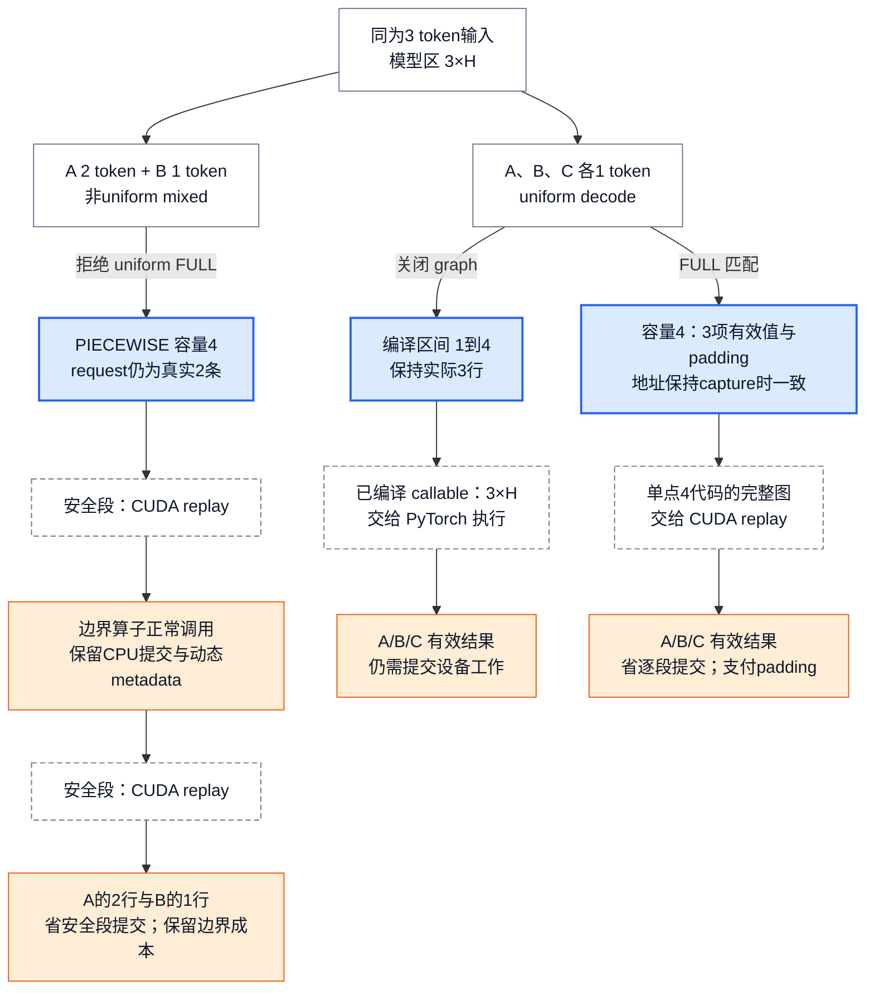

# vLLM 编译与 CUDA Graph：把动态请求收敛为可编译、可捕获、地址稳定的执行区

> **源码基线**：`vllm-project/vllm@199cb9b964822e59ab9b58d88e7be31eb419a2ae`（`main`，2026-09-08）
> **主题**：解释动态请求如何进入有限的编译区间与 CUDA Graph 容量，追踪编译缓存、预热、捕获和重放。随后讨论地址、分段边界、运行期派发与失效条件。
> **适用范围**：本页拥有 compile/graph/cache/shape/地址合同，以 NVIDIA GPU 的 MRV2 为主；具体 IR 变换归21，Kernel计算归20，Runner异步组织归11/12，Attention Backend选择归10。
> **最近更新**：2026-09-08。重核当前源码与测试，补最小 batch 示例、分层回退及诊断限制。

## 1. 三个请求各生成一个 token，为什么还需要两种图？

设普通文本请求 A、B、C 都处于 decode，本步各计算一个 token，下一步 C 结束，只剩 A、B。直接执行模型当然能处理这种变化，但每一步都会再次经过框架调度算子和提交 GPU 工作；小 batch 的计算越短，这些固定开销越可能显眼。vLLM 的选择是把动态 token 数交给有限的编译区间，把可重复的设备 launch 交给按容量捕获的 CUDA Graph，而请求本身仍按步变化。

**编译产物回答“执行什么代码”，CUDA Graph 回答“使用哪些地址重放哪串设备工作”。** `torch.compile` 接收计算图并可能生成融合或 shape 特化的 callable，减少框架执行开销，也可能减少中间访存和 kernel launch；CUDA Graph 在已经确定的 callable 外记录实际 launch，重放时进一步减少 CPU 逐个提交的开销。二者都不消除必须执行的模型数学计算；具体融合收益由 [[20_vllm_fused_ops_and_kernels_analysis|融合算子与 Kernel]] 解释。

### 1.1 同一份三 token 输入的两种收敛

下面是依据源码规则构造的教学例子，**不是默认参数，也不是性能测量**：普通 decoder，无 LoRA、投机或微批拆分；`max_num_batched_tokens=8`、`max_model_len=8`、`max_num_seqs=4`，编译端点为 `[4]`、单点为 `[4]`，capture sizes 为 `[1,2,4]`，resolved mode 为 `FULL_AND_PIECEWISE`，且 attention 支持 uniform decode FULL。

1. **编译域**：启动期准备 `[1,4]`、`[5,8]` 两个 symbolic ranges 和更高优先级的单点 `[4,4]`。不启用 graph 时，3×H 的模型输入命中 `[1,4]`；启用 graph 并 padding 到4时，4×H 输入命中单点4。这是“在哪个代码版本上执行”的选择，单点不会把原 range 挖空。
2. **捕获域**：A、B、C 产生 `num_tokens=3`、`num_reqs=3`、`uniform_token_count=1`。manager 查候选并选容量4的 FULL descriptor；runner 在持久 input buffer 中写入三项有效值，第四项是 padding，request metadata 与 slot mapping 同步表达真实三项边界。capture 时已经为4个 token 建好的 launch 序列可重用。
3. **下一步**：只剩 A、B 时选择已捕获容量2，而不是在容量4图里临时改 launch 形状。各容量的 entry 使用 capture 时对应的持久 storage；值与请求身份可以更新，地址不能随意重分配。
4. **同为三 token 的另一批**：A 做2 token prefill、B 做1 token decode，`uniform_token_count=None`，因此不能误用 uniform decode FULL；它仍可进入容量4的 PIECEWISE。若调度出5 token，超出本例 capture ladder，manager 返回 graph `NONE`，但5×H仍可由 `[5,8]` compiled callable 执行。

这里的 H 是模型隐藏宽度；本页只画模型区的有效行数，输出图中的 A/B/C 指对应 hidden-state 行，后续选取 logits 与采样由 Runner 和 [[14_vllm_sampling_structured_output_analysis|采样页]] 负责。padding 不制造额外用户请求，也不保证没有额外 GPU 计算。

### 1.2 图 1：形状可变，代码区间与捕获容量有限

图规格：采用 Mermaid 变换图。顶端“三 token 输入”按构成分成普通 decode 与2+1 mixed 对照；decode 再分 compile-only 与FULL两路。compile-only 经过区间 `[1,4]` 到 callable；FULL 经过“容量4、同址写值”到单点4代码的完整 launch 重放；mixed 经过“容量4”到“安全段→边界算子→安全段”。末端标记有效结果及各路成本。标有 PyTorch/CUDA 的虚线框是外部执行交接点，内部执行未实跑；蓝色标容量/代码选择，橙色标残余成本，箭头表示转换与执行顺序，不表示按比例计时。

图中分段不是指这三行被分到不同设备，而是同一批输入依次通过的模型算子区域。安全段内部具体如何融合、是否生成不同 kernel 由编译器和 [[21_vllm_ir_and_fusion_passes_analysis|IR 与融合 Pass]] 决定，图没有声称“一段等于一个 kernel”。

早期设计把 full graph 与整图 compilation 绑在一起，导致任一不支持 capture 的 attention 都牵动整条快路径；`docs/design/cuda_graphs.md` 的 Motivation 明确记载这种取舍。当前将代码版本和 capture case 分离：同一 symbolic range 可以覆盖多种 token 数，同一组 compiled pieces 可参与 full 或 piecewise capture。

> [!note] 分析推断与外部依赖边界
> 有限 ranges 与启动预编译把重型编译移出在线请求；padding 用额外行计算换有限 capture cases；piecewise 用残余 CPU 提交换动态边界的可执行性。这些是依据选择规则重建的成本解释，不是吞吐测量。vLLM 代码证明向 PyTorch 传入图、输入、pool与stream并调用 `torch.cuda.graph` / `replay()`，不证明未打开的 PyTorch、Inductor 或 CUDA runtime 内部实现。

## 2. 静态责任：五个 owner 共同建立执行合同

| 责任 owner | 输入 → 输出 | 拥有的状态与不变量 | 明确不拥有 |
|---|---|---|---|
| `CompilationConfig` | 用户优化意图 + platform / attention 能力 → compile mode、splitting ops、shape ranges、graph mode / sizes | 模式求交、静态 shape 预算、合法组合与显式降级 | runtime tensor 地址、graph 实例 |
| compile wrapper / backend | 首次 dummy inputs + traced code → range-keyed callable 与磁盘 cache | dynamic dim 标记、guard policy、op partition、每个 range 的 compiled runnable、cache key | CUDA Graph dispatch key、persistent device buffers |
| generic `CUDAGraphWrapper` | matching runtime mode + descriptor + compiled piece → guard允许时 entry capture 或 replay | descriptor-keyed local entries、capture pool、capture-time pointers；miss 时受 capture guard 约束 | persistent input buffer、manager candidate compatibility |
| MRV2 `CudaGraphManager` | graph mode + capture sizes + decode / LoRA 能力 → capture descriptors、candidate table、graph pool entries | 可捕获 descriptor 集合、共享 pool、capture 完成位、FULL graph table | request admission、输入值生产 |
| MRV2 runner | 当前 `SchedulerOutput` → padded descriptor + stable buffer values → FULL / PIECEWISE / NONE 执行 | 每步 descriptor、persistent input storage、dispatch / DP 一致性、replay 时序 | compile pass 语义、attention backend 内部算法 |

这些 owner 的边界解释了为什么 cache hit 不等于 graph hit：磁盘 cache 可恢复“某段代码在某个 shape range 上怎样执行”，而 graph entry 还绑定当前进程的 storage、pool 与 capture-time metadata，只能由当前进程中的 manager 或 wrapper 建立。

## 3. 模式求交：eager、compile、piecewise 与 full 是两条轴

### 3.1 编译轴与 capture 轴

`CompilationMode` 有 `NONE`、stock `torch.compile`、只 trace 一次并移除 guards、以及带 cache / piecewise / shape specialization 的 `VLLM_COMPILE` 四种选择。`CUDAGraphMode` 则把 runtime mode 定义为 `NONE`、`PIECEWISE`、`FULL`，并用 `FULL_DECODE_ONLY` 与 `FULL_AND_PIECEWISE` 表达 decode / mixed 两条 routine 的组合。

| 用户看到的执行形态 | compile 轴 | CUDA Graph 轴 | 实际含义与边界 |
|---|---|---|---|
| eager | `NONE` | `NONE` | 未启用 torch.compile 的 model forward；`enforce_eager` 会同时关闭 compile 和 CUDA Graph |
| compile-only | stock / trace-once / `VLLM_COMPILE` | `NONE` | 运行 compiled callable，但不记录 launch；适合隔离 compile 正确性与性能 |
| full graph without compile | `NONE` | `FULL` 或 `FULL_DECODE_ONLY` | 只要 backend 能 capture，满足capture约束的完整模型区可在无 compilation 时捕获；full 与 compile 在配置上正交 |
| piecewise | 通常为 `VLLM_COMPILE` | `PIECEWISE` | splitting ops 留在 graph 外，内部 compiled pieces 各自 capture；若启用 breakable CUDA Graph，则可不用 `torch.compile` 做分段 capture |
| full + piecewise | 通常为 `VLLM_COMPILE` | `FULL_AND_PIECEWISE` | uniform decode 优先 full，prefill / mixed 走 piecewise；覆盖最多，也支付最多 capture 时间和 graph memory |

“FULL 比 PIECEWISE 更高，所以一定更好”也是错误心智模型。`FULL` 减少模型捕获区内逐算子的 CPU launch 提交，却要求 attention、metadata、collective 和地址都可捕获；`PIECEWISE` 保留 eager boundary，少消除一些 launch，却能服务更动态的 batch。配置会把请求模式与 attention backend 的最小 graph capability 求交：mixed 不支持 full 时可改为 `FULL_AND_PIECEWISE` 或 `FULL_DECODE_ONLY`，连 decode full 都不支持时再退为 `PIECEWISE` 或 `NONE`；没有合法替代时直接报错。

### 3.2 先解析能力，再建立快路径

不是任何“不兼容”都自动回退。`CompilationConfig.resolve_cudagraph_mode_and_sizes` 对用户请求 mixed FULL、但 backend 的能力是 `NEVER` 时直接抛 `ValueError`；若 backend 只支持 decode，才依据 splitting policy 把 mixed FULL 改为 `FULL_AND_PIECEWISE` 或 `FULL_DECODE_ONLY`。decode FULL 不支持时，则视 piecewise 编译条件降为 `PIECEWISE` 或 `NONE`。能力声明与候选 backend 验证见 [[10_vllm_attention_backends_analysis|Attention Backend]]；这里拥有声明怎样改变 capture 策略。

`enforce_eager=True` 在 `VllmConfig.__post_init__` 中**同时设置** `CompilationMode.NONE` 与 `CUDAGraphMode.NONE`，并输出 warning。它是恢复普通执行的宽开关：如果问题消失，只能缩小到这两类优化及相关交互，不能单凭这个结果认定是 CUDA Graph、编译 pass 或缓存哪一个出错。只隔离 graph 时应保持原 compile 配置而令 `cudagraph_mode=NONE`；只隔离 compilation 则还必须确认 graph mode 的 resolved 结果，因为普通 PIECEWISE 依赖 `VLLM_COMPILE`，配置可能连 graph 一并关闭。`TORCH_COMPILE_DISABLE=1` 只先关闭 compile，后续兼容性规则仍会解析 graph。操作过程见 [[05_vllm_debugging_troubleshooting_guide|调试与排障]]。

GPU worker 的 `compile_or_warm_up_model` 先补齐未被 capture 覆盖的 compile size/range warmup，再做 kernel warmup，随后 `capture_model()`。MRV2 manager 对计划 descriptors 先以 graph `NONE` 预热，按 PIECEWISE 后 FULL 的顺序 capture，全部成功后才标记 `_graphs_captured=True`。默认 piecewise 路径进入模型内的 wrapper；breakable 路径则先初始化 `BreakableCUDAGraphWrapper`，由它串联 graph segments 与 eager breaks。不能把所有 PIECEWISE 都画成 generic wrapper。

`NONE` 在这段启动/派发协议中指**不做 CUDA Graph**，不必然是原始 eager PyTorch：warmup 或运行时 miss 仍可进入已编译模型。是否跳过编译，由 compilation mode 或 forward context 的 `skip_compiled` 独立决定。

## 4. 动态 shape 怎样被压成有限状态

### 4.1 guard policy：只 trace 一次的收益以额外证明义务为代价

被 `support_torch_compile` 标注的 model 会显式标记哪些参数维度是 dynamic；`UNBACKED` 使用 `mark_unbacked`，其他策略使用 `mark_dynamic`。除 stock compile 外，wrapper 默认丢弃 Dynamo guards，使首次调用触发一次 compilation、之后不再因 guard miss 重新 trace。

这不是“所有 shape 自动安全”。`BACKED` 可能产生随后被忽略的 guard，`UNBACKED` 不会被 guard / 0-1 specialize，却可能遇到 data-dependent branch；`BACKED_SIZE_OBLIVIOUS` 只是折中且仍无无-guard 保证。因此 `evaluate_guards` 是诊断开关：保留 shape guards，在后续输入导致 recompile 时失败；它要求 `VLLM_USE_BYTECODE_HOOK=0`，不能和 `UNBACKED` 搭配，BACKED 的 AOT 组合在当前测试中被跳过。测试覆盖普通分支与 0/1 specialization，且明确存在 BACKED 0/1 的例外；诊断通过不能证明所有 shape 与值分支安全。

### 4.2 shape 域分区：range 负责覆盖，single size 负责特化

普通 decoder 的 `compile_ranges_endpoints` 把 `[1, max_num_batched_tokens]` 切成若干闭区间，`compile_sizes` 再插入优先级更高的单点区间。`PiecewiseBackend` 为每个区间建立 `RangeEntry`：单点用 concrete fake inputs 编译，普通 range 保留 symbolic inputs；普通模型的所有 entry 都在 backend 初始化时 compile 或从 cache load。运行时先找 exact size，再找包含它的 range，越过全部计划区间则 assert，而不是在线创建新 runnable。

测试把这层语义固定得很具体：端点 `8, 32` 与 static size `16, 64, 128` 产生三个 dynamic ranges 加三个 single-size compilations；另一个测试证明 single size 已无 symbolic shape，而 range 仍保留 symbolic batch 维。encoder compilation 会把最后一个 range 的上界扩到 int32 最大值，因此不能把 decoder token预算当成所有编译模块的统一上界。更多 static sizes 可能换来更好的 autotune，却增加首次 compile 时间和 cache 体积；它不是免费扩大覆盖面。

### 4.3 op 分区：只决定 capture boundary，不在本页重写 IR 语义

`splitting_ops` 的职责是把 CUDA-Graph-unsafe op 留在 piece 外：默认路径在 Dynamo FX 图上 split；`use_inductor_graph_partition` 则等 passes / fusions 完成后才在 codegen 阶段按规则 partition。后者让 full 与 piecewise 共用一次 compilation：piecewise wrapper 包住各安全 partition，full wrapper 位于整个 call 外并忽略内部 partition。

这个设计胜过“任一 unsafe op 让整图 eager”，代价是 boundary 本身必须正确表达 alias 与副作用。哪些 op 必须 split、donation / functionalization 怎样维护语义属于 [[21_vllm_ir_and_fusion_passes_analysis|IR 与融合 Pass]]；本页只拥有由该结果产生的 compile / capture 区域与生命周期。当前配置还会因 sequence parallelism、attention fusion、KV update 或 DeepEP 兼容性改写 splitting / graph mode，并给出 warning 或关闭 graph。

## 5. Compile lifecycle：cache 是代码状态，失效由 hash 驱动

冷启动时，wrapper 收集 trace 涉及的源文件，backend 把 environment、由 `VllmConfig.compute_hash()` 选入的配置因素、traced code content 与 compiler state 分别 hash，再组合成 cache 目录；rank / DP rank 在目录内继续隔离。默认生成目录时，**参与 hash 的因素**变化会换 key；用户显式给定 `cache_dir` 时不会走同一目录生成分支。动态生成的 `<string>` 源码被跳过，读文件失败会 warning，故不能把它宣传为对任意代码或环境变化的完整失效证明。AOT 路径也把 env 与 config 放入 hash，并在加载时补验 traced source content。

这里的 invalidation 是**选不到旧 key**，不是修改旧文件；`VLLM_DISABLE_COMPILE_CACHE=1` 是隔离缓存复用的诊断手段；重新编译并不会替代 graph 的地址前置条件。compile cache 也不能替代 graph capture：前者可跨进程复用代码 artifact，后者依赖当前进程的地址与 pool，仍必须在真实运行时状态建立后 capture。

## 6. Capture lifecycle：地址、descriptor 与 pool 同时冻结

### 6.1 地址稳定不是值静止

MRV2 在 runner 初始化时一次性分配最大容量的 `input_ids`、`positions`、`is_padding`、`query_start_loc` 与 `seq_lens`。每步不是换 tensor，而是把 prefill token、position、sampled / draft token 和 request metadata 写入这些 buffers，再向 model 传递相同 storage 的切片。所以 replay 可以看到新值，同时仍使用 capture 时记录的地址。

通用 `CUDAGraphWrapper` 明确不拥有 persistent buffers；它把稳定地址责任留给 caller。capture 时 entry 记录 tensor `data_ptr`，DEBUG 模式 replay 会逐项 assert 地址未变。重要边界是：production 不能把这个 debug assert 当成正确性机制；地址稳定必须由 runner 的预分配和 in-place 更新先成立。

### 6.2 descriptor 是 graph identity，不只是 batch size

MRV2 的 `BatchExecutionDescriptor` key 包含 runtime graph mode、token 容量、request 容量、uniform token count、最大 query length、active LoRA case 与 `num_ubatches`。兼容谓词允许较大的 captured token / request 容量服务较小真实 batch，但 uniform query、query-length 上界、LoRA case 和微批个数必须满足约束。

实际 LoRA 数先经 `_resolve_effective_loras` 映射到预捕获 case：正数向上落到可容纳的最小 case，超过最大 case 时当前函数会 clamp，而不是在此拒绝；适配器 admission 上限需要继续核对 LoRA 上游，本页没有认证其完整输入域，不能由这个局部 helper 推出“任意 LoRA 数安全”。

manager 在启动期把 capture sizes 与 decode / mixed mode、dynamic speculative query length、request 上限及 LoRA case 做笛卡尔组合，再分别为 FULL、PIECEWISE 预建按 token count 和 LoRA 索引的 priority candidates。各 mode 独立扩展 candidate 区间，避免 spec decode 向上取整产生的 decode-only token 数使 mixed batch 错失本可使用的 piecewise 图；对应回归测试见读码路线。这比“只按 batch size 查 graph”更贵，却避免同 token 数但不同 request topology、query width 或 LoRA 状态误命中同一 launch 图。`cudagraph_specialize_lora=True` 还明确以更多启动时间和显存换掉无 LoRA 时的额外 adapter 开销。

manager key 与 wrapper key 不是同一个类型。runner 在非 FULL 路径另建 `forward_context.BatchDescriptor`，只放 padded token 数、LoRA 是否启用和 active LoRA 数；generic wrapper 用这个对象索引自己的 local entries。这里是 MRV2 对该类型字段的赋值子集，不代表 `BatchDescriptor` 类型只有三个字段。因此 manager 的 richer descriptor 负责“当前 batch 可选择哪种执行 mode”，wrapper 在该路径的较小 key 负责“这个 compiled piece 对该 padded case 是 capture 还是 replay”；两级 map 的 hit / miss 语义不能合并。

### 6.3 capture pool 是共享地址域，也是生命周期边界

manager 的 FULL graphs 与 piecewise wrappers 默认绑定 platform global graph pool。capture 顺序固定为 PIECEWISE 后 FULL，因为 piecewise activation 更大，后 capture 的 full graph 更可能复用 pool 已分配的 buffers；每个 descriptor 先以 graph `NONE` 做 warmup，FULL 与 breakable PIECEWISE 再重建 fresh attention state capture。

pool 共享不是单纯省显存技巧，它把 entry 的存活、output storage 与后续 capture 绑在一起。wrapper 用 weak references 释放不需要长期强持有的 output，让 pool 可复用其内存。代价是不能随意清掉一组 graph、换 pool 后仍 replay 旧 entry；源码也明确警告未来多 stream 时全局 pool 可能不安全。

启动显存预算不能只考虑权重和 KV。MRV2 `profile_cudagraph_memory` 在真实 KV 分配前建立最小 KV，使用 throwaway pool，完整测量 PIECEWISE/encoder/speculator、对最大的少数 FULL 图抽样并外推其余开销。返回值是容量估计，不能当作全部真实 graphs 的逐项测量。成功或 capture 异常都会执行清理：清空两类 wrapper 的图、恢复计数与 pool、丢弃 profiling managers，并清掉 KV/attention/Mamba 临时状态。模型权重保留；异常继续向上传播，没有“capture失败自动改eager”的通用事务回滚。

通用 wrapper 在 capture 前等待 offloader 既有预取，capture 内 forward 后 join copy stream，replay 前也等待 offloader。调用 `replay()` 返回及拿到引用只说明设备工作已按相应stream提交，不等于 CPU 已经观察到数值完成；Runner 的结果消费与异步边界继续阅读 [[12_vllm_model_runner_v2_analysis|Model Runner V2]]。共享 pool 的单stream TODO 仍存在，不能据此保证任意多stream并发安全。

## 7. Runtime dispatch：manager miss 返回 NONE，wrapper 按 capture guard 填表

真实 step 先计算 request 数、token 数、最大 query length、uniform token count 与 active LoRA 数，再交给 manager dispatch；profile step 或带动态 encoder input 的 encoder-decoder step 会主动设置 graph `need_eager`；其中后者另设 `skip_compiled=True`。manager 只有在 capture 已完成、token 数非零且 candidate key 存在时才搜索兼容 descriptor；没有命中就返回 `cg_mode=NONE`，不自动关闭 compile。这是 manager 的 fallback 合同，不是 generic wrapper 的 miss 合同。

三条执行路径有不同 owner：

1. **FULL**：runner 实际持有 `ModelCudaGraphManager`，已把新值写进 capture-time buffers，因此直接 replay manager 中的 graph，不再把 model inputs 作为调用参数传入；manager replay 前先 `sync_prev_onload()`，使前次 eager/piecewise 的 offloader 预取不会和静态 buffer 的复用冲突。随后 `ModelCudaGraphManager.run_fullgraph` 返回捕获时持久输出的 `[:desc.num_tokens]` 容量切片：末个PP rank为hidden states（按需含aux输出），其他PP rank为 `IntermediateTensors`；有效行由后续Runner按真实请求/logits索引选取。这里返回的是设备tensor引用，不是CPU已同步观察到数值完成。
2. **PIECEWISE**：runner 建立 forward context 后调用 model；Dynamo splitting 会以 `PIECEWISE` generic wrapper 包住 compiled partitions。wrapper mode 不匹配时直接跑 runnable；mode 匹配时，entry hit replay，entry miss 则先检查 `validate_cudagraph_capturing_enabled()`，仅允许 capture 的上下文才创建实际 graph、当场 capture 并返回这次 capture 的输出，unsafe boundary 仍正常调用；guard关闭时抛 `RuntimeError`，不是自动回退。breakable 路径则由另一 wrapper 串联 graph segments 与 eager breaks。
3. **NONE**：runner 调用 `self.model(**model_inputs)`，不做 graph capture/replay；若该模型已被 compile wrapper 装饰，仍可执行 compiled callable。只有全局禁 compile 或 `skip_compiled=True` 等条件，才绕过这层编译。

分布式场景还多一条不变量：DP ranks 必须对 mode 和 padded token capacity 达成一致；任一 rank 要求 graph `NONE` 时所有 rank 都不做 graph，否则 collective 与 graph launch 顺序可能分叉。新基线 `num_ubatches` 也是相容性条件；当前 MRV2 微批路径尚未 capture，DP 各 rank 要一致同意微批拆分并使用 graph `NONE`。这类跨 rank 同步语义由 [[02_engineering/03_infer_frameworks/vllm/18_vllm_distributed_inference_analysis|vLLM 分布式推理]] 展开，本页只保留 dispatch 接缝。

## 8. Invalidation 与 fallback：不要把“还能跑”误写成“graph 仍有效”

| 触发条件 | 系统动作 | 为什么不能继续复用 | 核验入口 |
|---|---|---|---|
| 默认目录中参与 hash 的 env / config / traced code / compiler 变化 | compile cache 换 key并重编译 | 旧 callable 的代码与假设已不是当前基线 | `VllmBackend.__call__` |
| attention capability 不支持请求的 full mode | 初始化时降级到 dual mode、piecewise、none，或显式报错 | capture safety 是 backend contract，不是运行时碰碰运气 | `CompilationConfig.resolve_cudagraph_mode_and_sizes` |
| manager 对当前 batch 没有兼容 descriptor | runtime 返回 `NONE` | manager 没有为该 topology / capacity / LoRA case 建立过计划 case | `CudaGraphManager.dispatch` |
| generic wrapper 收到 matching mode 的新 descriptor | 创建 entry；capture guard允许时本次capture并缓存；后续同key replay；guard关闭则RuntimeError | wrapper 的合同是 runtime cache-fill，不继承 manager 的 miss-to-NONE 策略 | `CUDAGraphWrapper.__call__ + capture guard` |
| profile 或动态 cross-attention cache 更新 | profile禁graph；动态encoder另skip compiled | profile 不是 serving case，单独只禁 graph；encoder output shape / cache side effect 不能偷渡进旧图 | `GPUModelRunner.execute_model` |
| replay 输入地址与 entry 记录不一致 | 违反 replay 前置条件；DEBUG 路径 assert，非 DEBUG 路径没有自动检测或恢复 | CUDA Graph 记录的是 pointer，不是 shape 相同的新 tensor | `CUDAGraphWrapper.__call__` |
| memory profiling capture 完成或异常 | finally 清空 wrapper entries、恢复 counters/pool、丢弃 profiling manager，真实初始化后重 capture | profiling KV pointers / storages 不是 serving 地址；复用会出现 use-after-free | `profile_cudagraph_memory` |

> [!note] 地址变化后的恢复是分析要求，不是现成自动路径
> 本基线没有实现“发现 pointer 改变就自动销毁 owner、重新初始化并 capture”的 transition。源码只提供显式清空 wrapper entries 的接口，runner shutdown 也会释放 manager 与设备状态。因此若 owner 确实重分配了 replay storage，安全恢复在逻辑上必须先停止使用旧 entry，再清理 graph state、重建稳定 buffers 并重新 capture；这是由 pointer 不变量推出的恢复要求，不是源码会自动触发的行为。

诊断时应把 graph `NONE`、原始 eager 和编译缓存 miss 分开。某批回到 PIECEWISE/NONE 只说明该批未执行 FULL，并不证明编译整体失效；单独观察 ITL 上升也不能定位到 Runner 或 Kernel。排查应分别记录 resolved config、预编译 range、manager capture descriptor 集合、runtime mode hit 与 generic wrapper 的 runtime capture 计数；否则 compile cache hit 可能掩盖 manager graph 全 miss，full decode 命中也可能掩盖 mixed batch 的 graph NONE，piecewise 首次在线 capture 也可能被误当成稳定 replay 延迟。

## 9. 文档冲突、失败边界与验证顺序

> [!contradiction] 官方设计文档与当前 MRV2 的适用范围
> `docs/design/cuda_graphs.md` 仍以 `CudagraphDispatcher`、旧 `BatchDescriptor` 和 forward-context dispatch 为中心。该描述仍能解释“full / piecewise / none 显式派发”的设计动机，但在本基线的 MRV2 主路径中，权威 owner 已是 `CudaGraphManager` 与更丰富的 `BatchExecutionDescriptor`。本页按 live code 写运行时机制，不把旧类名当现行架构。

验证不要一上来比较吞吐；应按状态建立顺序隔离问题；本轮仅打开并核对源码与测试，未在 GPU 上执行模型、capture、性能或故障实验：

1. `CompilationMode.NONE + CUDAGraphMode.NONE`（或 `enforce_eager=True`）建立 eager 数值基线，并确认请求语义与 kernel 精度本身正确。
2. 只开 compile，检查 dynamic guard 诊断、compile range 覆盖、首次 / 二次启动和 cache key；不把 graph 变量混进来。
3. 查看 resolved graph mode 是否被 attention、SP、DeepEP、spec decode 或 splitting policy 改写；warning / error 是能力协商结果，不是噪声。
4. 核对 manager capture descriptors、wrapper local entries、pool、persistent input addresses 和 warmup → capture 顺序，再分别测试 full replay、manager miss → `NONE` 与 wrapper miss → runtime capture。
5. 覆盖边界 shape、mixed / uniform decode、LoRA case、DP rank 不均衡、profile 与动态 encoder input；先验证 dispatch key，再定位 IR 页的副作用语义或 Kernel 页的具体计算。

本设计支付三类确定成本：更多 compile ranges / static sizes 增加编译和 cache；更多 capture descriptors / LoRA variants 增加启动时间和 graph memory；更保守的 piecewise / eager 增加 CPU launch。`max_cudagraph_capture_size` 默认会限制在 512，data-center Blackwell 为 1024，正是为了避免小 `max_num_seqs` 场景的 OOM 并约束大 graph 的启动 / 显存成本。

新基线还在真实 capture 前检查 Mamba decode 的 block 数：启用 FULL、存在 Mamba 层且 `max_num_seqs > num_blocks` 时抛 `ValueError`，要求减小请求上限或增加可用显存；profiling 阶段跳过这一检查。它说明“已成功选出 backend”仍不等于 capture 所需状态容量已成立。

旧系统设计页的耦合关系在这里具体落为：[[07_vllm_scheduler_analysis|Scheduler]] 的每步 token 计划先受 [[08_vllm_kv_cache_management_analysis|KV admission]] 限制，Runner 再把该实际计划转为本页的 padded descriptor；异步返回不允许偷换持久 buffer 的使用时序，capture 预算也会挤压可留给 KV 的容量。这是从各接口重建的分析关系，并不是四个机制必须同时打开的配置要求。信号定义由 [[23_vllm_observability_reliability_analysis|可观测性与可靠性]] 负责，单项指标不是根因证明。

## 10. 有锚点的发展方向

> [!note] 分析推断
> 当前代码已提供 Inductor codegen-time partition 与 breakable CUDA Graph 两条“降低 compile 和 capture 耦合”的路径：前者让 pass 看完整图后再切 capture-safe partitions，后者允许 piecewise capture 不依赖 `torch.compile`。这显示演进方向是让 capture boundary 更晚、更正交；但全局 graph pool 仍假设单 stream，源码把多 stream 安全性明确留作未来问题。在这些约束改变前，不应推断“full graph 将统一取代 piecewise”。

## 11. 稳定读码路线与可复查测试

下面均为本页基线实际打开的相对路径与符号。相同文件中的多个符号按“选择→转换→执行→约束”阅读；测试入口描述断言合同，不宣称本机通过。

| 要核对的问题 | 源码与测试入口 |
|---|---|
| 两条轴怎样解析，何时拒绝 | `vllm/config/vllm.py::VllmConfig.__post_init__`；`vllm/config/compilation.py::CompilationMode / CUDAGraphMode / CompilationConfig.resolve_cudagraph_mode_and_sizes / set_splitting_ops_for_v1` |
| 输入动态维与guard诊断 | `vllm/compilation/decorators.py::_support_torch_compile._mark_dynamic_inputs / __call__`；`vllm/compilation/wrapper.py::TorchCompileWithNoGuardsWrapper.__init__`；`tests/compile/test_dynamic_shapes_compilation.py::test_model_specialization_with_evaluate_guards` |
| 区间与单点怎样生成可调用代码 | `vllm/compilation/piecewise_backend.py::PiecewiseBackend.__init__ / compile_all_ranges / _find_range_for_shape / __call__`；`tests/compile/test_compile_ranges.py::test_compile_ranges / test_compile_sizes_produce_static_shapes / test_inductor_cache_compile_ranges` |
| 代码cache怎样命中和失效 | `vllm/compilation/backends.py::VllmBackend.__call__ / wrap_with_cudagraph_if_needed`；`vllm/compilation/caching.py::aot_compile_hash_factors / _compute_code_hash_with_content`；`vllm/compilation/decorators.py::_support_torch_compile.__call__` |
| descriptor从真实数量到容量 | `vllm/v1/worker/gpu/cudagraph_utils.py::BatchExecutionDescriptor / _is_compatible / CudaGraphManager._init_candidates / _resolve_effective_loras / dispatch`；`tests/v1/cudagraph/test_cudagraph_manager.py::test_mixed_batch_at_decode_only_token_count_still_gets_a_graph / test_uniform_decode_beyond_capture_ladder_falls_back` |
| stable storage怎样先填值再执行 | `vllm/v1/worker/gpu/input_batch.py::InputBuffers.__init__`；`vllm/v1/worker/gpu/model_runner.py::GPUModelRunner.prepare_inputs / execute_model`；`vllm/v1/worker/gpu/dp_utils.py::dispatch_cg_and_sync_dp / sync_cudagraph_and_dp_padding` |
| warmup、capture、replay何时发生 | `vllm/v1/worker/gpu_worker.py::Worker.compile_or_warm_up_model`；`vllm/v1/worker/gpu/cudagraph_utils.py::CudaGraphManager.capture / run_fullgraph / run_pw_graph / ModelCudaGraphManager.run_fullgraph`；`tests/v1/cudagraph/test_cudagraph_manager.py::test_full_capture_sets_graph_pool_id_before_cuda_graph` |
| generic与breakable边界、地址检查 | `vllm/compilation/cuda_graph.py::CUDAGraphWrapper.__call__ / clear_all_graphs`；`vllm/compilation/monitor.py::validate_cudagraph_capturing_enabled`；`vllm/compilation/breakable_cudagraph.py::BreakableCUDAGraphCapture.add_eager / replay`；`vllm/forward_context.py::BatchDescriptor` |
| profiling清理、异常与预算 | `vllm/v1/worker/gpu/cudagraph_utils.py::profile_cudagraph_memory / _teardown_profiling_state`；`tests/v1/worker/test_gpu_model_runner_v2_cudagraph_profiling.py::test_profile_cudagraph_memory_tears_down_on_capture_error / test_profile_cudagraph_memory_samples_and_extrapolates` |

先使用 compile-ranges 测试确认区间数量/静态特化，再用 manager 测试确认 mixed 不命中 uniform FULL、超容量返回 NONE，最后在目标 GPU 上运行 capture/replay 与数值对照；mock CPU manager测试不能验证 CUDA 的内存生命周期。图1已给出能手算的最小规则，实际token数据与kernel速度需要运行证据。

## Related Pages

- [[02_engineering/03_infer_frameworks/vllm/11_vllm_model_runner_v1_analysis|Model Runner V1]] / [[02_engineering/03_infer_frameworks/vllm/12_vllm_model_runner_v2_analysis|Model Runner V2]] — 对照多义 dummy/capture 与显式 graph lifecycle；本页拥有两条 runner 之上的 compile / capture 策略。
- [[02_engineering/03_infer_frameworks/vllm/10_vllm_attention_backends_analysis|vLLM Attention Backend]] — 定义 full / piecewise 能力求交所消费的 metadata 与 graph-support 合同。
- [[02_engineering/03_infer_frameworks/vllm/21_vllm_ir_and_fusion_passes_analysis|vLLM IR 与融合 Pass]] — 权威解释 splitting boundary 内 alias、functionalization、donation 与 pass 顺序为何语义正确。
- [[02_engineering/03_infer_frameworks/vllm/20_vllm_fused_ops_and_kernels_analysis|vLLM 融合算子与 Kernel]] — 解释 compiled graph 最终选择或生成的 provider / Kernel 及其 launch、访存收益。
- [[02_engineering/03_infer_frameworks/vllm/16_vllm_speculative_decoding_analysis|vLLM 投机解码]] — 说明 dynamic draft width、verification query length 与 graph descriptor 的一跳合同。
- [[02_engineering/03_infer_frameworks/vllm/18_vllm_distributed_inference_analysis|vLLM 分布式推理]] — 展开 DP / TP ranks 为何必须对 graph mode、padding 与 collective launch 顺序达成一致。
