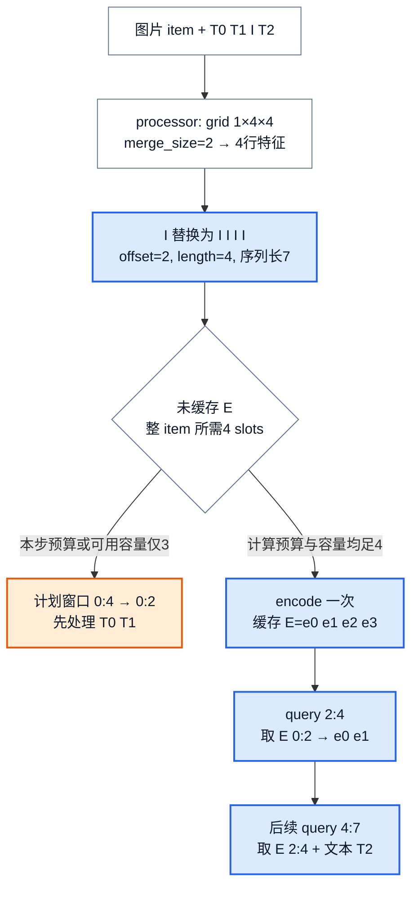
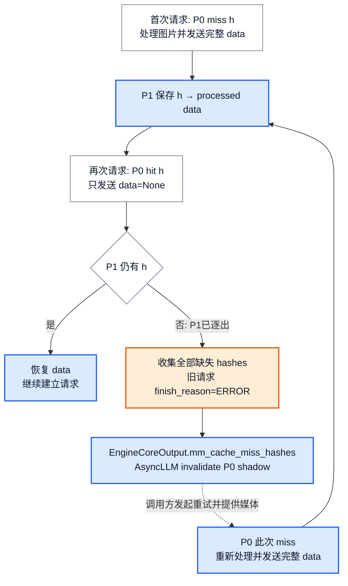
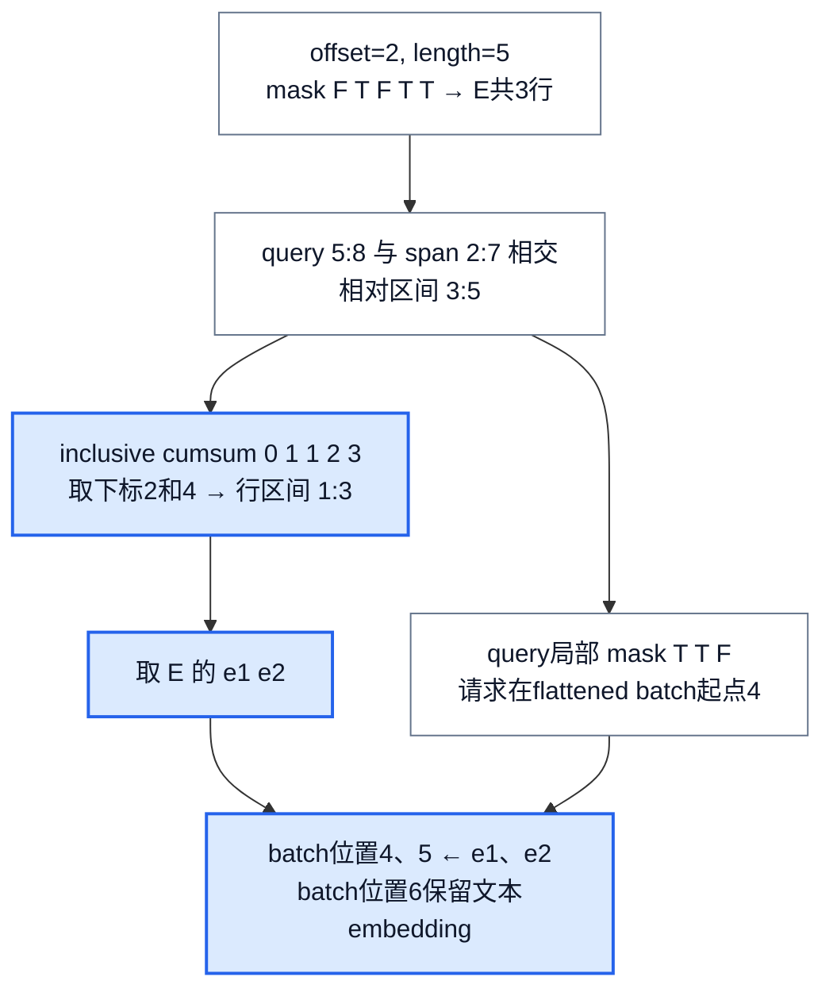
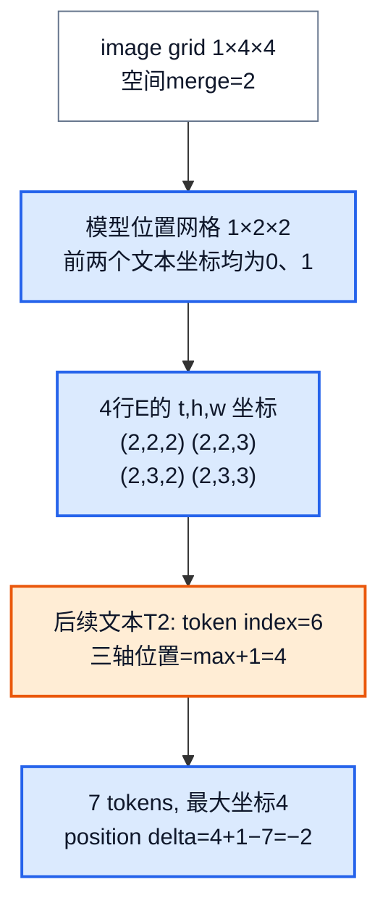

# vLLM 多模态执行：一张图片怎样变成当前 token 的 embedding

> **源码基线**：`vllm-project/vllm@199cb9b964822e59ab9b58d88e7be31eb419a2ae`（`main`，2026-09-07）
> **主题**：用一张图片的占位展开、缓存复用、整 item encoder 准入与分步切片，解释媒体怎样精确替换当前请求的 token embedding，并追踪多模态位置与变体接缝。
> **适用范围**：媒体加载/解析、模型 processor、processor cache、encoder budget/cache、设备侧 encode/gather/merge；协议字段归请求语义页，一般调度归 Scheduler 页，模型构造与 embedding 接口接模型库页，具体 VLM 网络内部不在本页展开。
> **最近更新**：2026-09-08。补可重放的 offset、长度、mask 与位置演算，核对 P0/P1 miss 恢复和当前多模态分支。

## 1. 一张图只出现一次，为什么会有三个“大小”

用户交给服务的是图片字节；processor 交给模型的是像素特征与网格 metadata；语言模型最终消费的是若干行 embedding。媒体字节数、prompt 占位长度、encoder 输出行数描述三个不同阶段。一次 prefill 又可能只覆盖图片的一部分占位，因而本步实际拼入的行数还会更少。

贯穿本页的**教学例子**取 Qwen2-VL 的真实展开规则，但不声称这是某张实测图片的处理结果：HF processor 返回 `image_grid_thw=(1,4,4)`，`merge_size=2`，则视觉占位数为 $1\times4\times4/2^2=4$。简化 token 序列为 `T0,T1,I,T2`，其中 T1/T2 可代表图片周围的 vision-start/end token；本例只跟踪单个 image-pad `I` 的替换，省略聊天模板的其他文本。替换后为 `T0,T1,I,I,I,I,T2`，图片占据零起始半开区间 `[2,6)`，语言模型序列长7。encoder 最终应提供 `E=[e0,e1,e2,e3]`，每行宽度为模型隐藏维度 H。

这里有两个独立动作：**整张图产生4行 E；当前 token 窗口只取所需的行。** 例如 query `[2,4)` 取 `E[0:2]`，下一窗口 `[4,7)` 取 `E[2:4]`，最后一个位置仍使用 T2 的文本 embedding。chunked prefill 切的是语言模型消费窗口，通常不会把有双向注意力的视觉 encoder 切成“先编码半张图”。依据：`vllm/model_executor/models/qwen2_vl.py::Qwen2VLMultiModalProcessor._get_prompt_updates`、`vllm/v1/core/sched/scheduler.py::Scheduler._try_schedule_encoder_inputs`。

<!-- 图1 spec：从教学图像的processor网格与单占位开始，计算4个替换token与offset=2，再比较预算3导致停在图前、预算4准入整图，最后展示两个query各取E的哪两行。拓扑与数值变换图，不表示物理二维张量布局；蓝色强调展开/切片，橙色标准入失败。 -->

**分析推断**：每次请求都重做下载、processor、encoder，虽能得到同样的输入，却会把三种开销都放回关键路径。vLLM 因而分别复用 URL 字节、processed feature 和 encoder embedding；前两者不能证明第三者有效，例如 tower LoRA 改变后，旧像素处理仍可复用，旧 E 却不再适用。以下先算出占位，再解释两级多模态缓存如何保住这个对应关系。

## 2. 从媒体到展开后的 prompt

### 2.1 加载完成，只意味着 processor 可以读它

`MediaConnector` 处理 HTTP、base64 data URL 和显式允许根目录下的 file URL。HTTP 路径检查允许域名并限制最大字节数；file 路径须 resolve 到允许根目录的子路径；不支持的 scheme、非 base64 data 编码及未获允许的路径在这里失败。可选下载缓存以 URL 的 SHA-256 前20个十六进制字符加扩展名寻址，并受容量/TTL 控制；它缓存字节，不以模型或内容变化寻址。相同 URL 并不是相同 processor 输出的证明。依据：`vllm/multimodal/media/connector.py::MediaConnector.load_from_url`、`MediaConnector._media_cache_path`、`MediaConnector._load_data_url`、`MediaConnector._load_file_url`。

`MultiModalDataParser` 再把 PIL、NumPy、Tensor 等对象整理成模型 processor 可接受的 item。image 规范化为 RGB；audio 可按输入采样率重采样并调整声道；video 保留帧与 metadata，模型声明需要 metadata 而调用方未提供时会报错。registry 当前声明 image/audio/video/vision_chunk，未知 modality 直接失败。图片 embedding 与像素图片也走不同 item 类，不能仅凭“都是 Tensor”判定要不要运行 tower。依据：`vllm/multimodal/parse.py::MultiModalDataParser._parse_image_data`、`_parse_audio_data`、`_parse_video_data`、`is_embeddings`、`_get_subparsers`。

### 2.2 processor 同时产出 tensor 参数和 token 更新规则

对例图，模型专用 processor 把规范化图片交给 HF processor，得到像素字段以及 `image_grid_thw`。HF 调用使用什么文本由模型 processor 决定：`_apply_hf_processor_main()` 可先构造模型要求的辅助文本，并把不需要 HF 处理的 passthrough 数据并回结果，不能假设 HF 总在处理完整用户 prompt。

Qwen2-VL 从 tokenizer 的 image/video token 对应 ID 建立匹配目标，用网格乘积除以 `merge_size**2` 得到重复次数。本例不是把 `I` 的 ID 加4，也不是扩大词表；它把**同一个 ID 重复4次**。通用更新器按 match 位置复制原文本、插入 replacement，再以插入时的新序列长度记录 offset。因此后续媒体的 offset 必须在展开后的序列上重新形成，不能继续用原 prompt 的位置。依据：`vllm/multimodal/processing/processor.py::BaseMultiModalProcessor._apply_hf_processor_main`、`vllm/multimodal/processing/processor.py::_apply_token_matches_with_placeholders`、`vllm/model_executor/models/qwen2_vl.py::Qwen2VLMultiModalProcessor._get_prompt_updates`。

processor 最后返回展开后的 token IDs、processed kwargs、hashes 和 `PlaceholderRange`。`_validate_mm_kwargs()`、`_validate_mm_updates()`、`_validate_mm_placeholders()` 检查各 modality 的 item 数等一致性，能及早发现少图片、少更新或少占位；它们不是完整 encoder 输出形状证明。实际 encoder item 数、二维 rank 以及最终待替换位置数还要在设备合并阶段检查。依据：`vllm/multimodal/processing/processor.py::BaseMultiModalProcessor.apply` 及上述三个 validation 方法。

### 2.3 为什么同一张图有两个 key

`ProcessorInputs.get_mm_hashes()` 当前默认把 model id、modality item 与影响处理结果的参数纳入 hash。参数包括媒体加载参数 `media_io_kwargs` 和 HF processor 参数：image/video/audio 分别只取自己的媒体参数、对应 `images_kwargs`/`videos_kwargs`/`audio_kwargs` 及共享平铺参数，避免“只改视频采样配置却让图片失效”。统一 `vision_chunk` 缺少每项来源标签，因此保留全部参数。

提供 UUID 时有一个明确边界：**没有相关参数因子时直接使用 UUID**；有因子时将 UUID 作为媒体身份与 model id、参数重新哈希。直接 UUID 路径不是内容校验，也不会再次把 model id 拼进去；调用方必须保证这个标识真能代表想复用的媒体。若只提供 UUID/空数据且缓存已 miss，processor 无法重建图片，会抛出 data 未提供的错误。依据：`vllm/multimodal/processing/inputs.py::ProcessorInputs.get_mm_hashes`、`vllm/multimodal/processing/processor.py::BaseMultiModalProcessor._get_cache_missing_items`。

Engine 把处理结果展开为按 placeholder offset 排序的 `MultiModalFeatureSpec`。例图形成一个 image feature，其 `mm_position=(2,4)`；下面五个字段共同解释“如何复用”和“放在哪里”。

| 字段 | 本例及消费者 | 不能混淆的语义 |
|---|---|---|
| `data` | processed 像素字段与 grid metadata | IPC 缓存命中可暂为 None，接收端恢复；不是原始 URL |
| `modality` | image；设备侧据此与字段兼容性分组 | 标签不能替代模型支持检查 |
| `mm_hash` | 记作 h；processor 接收缓存以此查找 | 不含 tower LoRA 前缀 |
| `identifier` | 普通为 h；满足 tower/connector LoRA 条件时为 `lora_name:h` | Scheduler 和设备 E 缓存使用这个 key |
| `mm_position` | offset=2、length=4、is_embed=None | 指定展开序列位置；可选 mask 会让 span 长度不同于 E 行数 |

只有存在 LoRA request、LoRA config 且开启 tower/connector LoRA 时，`_get_mm_identifier()` 才加入 LoRA name；普通语言侧 LoRA 不自动改变这一规则。receiver 用 `mm_hash or identifier` 恢复 processed data，以兼容未单独给出 mm_hash 的 feature。依据：`vllm/v1/engine/input_processor.py::InputProcessor.process_inputs`、`InputProcessor._get_mm_identifier`、`vllm/multimodal/inputs.py::MultiModalFeatureSpec`、`vllm/multimodal/cache.py::BaseMultiModalReceiverCache.get_and_update_features`。

## 3. P0 说“有”，接收端却没有时怎么办

### 3.1 正常命中省掉哪一段工作

processor 按 item 缓存，而不是缓存整个 prompt。假设一个请求含图片 A、B，只有 B miss：先只处理 B，再按原 modality/index 把 A 的缓存结果和 B 的新结果合并；缓存的 prompt update 也恢复为本请求 item index，之后才应用到 prompt。合并前会 touch 全部 hash，避免更新列表前部时把后部仍需命中的项逐出。依据：`vllm/multimodal/processing/processor.py::BaseMultiModalProcessor._cached_apply_hf_processor`、`_get_cache_missing_items`、`_merge_mm_kwargs`。

配置决定 P0（processor 所在进程）之后是否还有接收缓存：

| 配置/拓扑 | 保存什么、传什么 | 命中收益与边界 |
|---|---|---|
| 非多模态或 cache 容量≤0 | 不启用 processor cache | 不获得此层复用 |
| 多 API process，或不满足 IPC 条件的 DP | P0-only 保存完整 kwargs 与 prompt update，仍发送完整 data | 省 preprocessing，不省该 payload 的 IPC |
| 可用 IPC + `lru` | P0 sender 保存 metadata shadow/prompt update；Engine P1 保存完整 kwargs | P0 hit 发送 `data=None`，P1 按 h 恢复 |
| 可用 IPC + `shm` | P0 写 object store；worker reader 读取 | 发送 address 与 monotonic id 引用；后者区分地址复用后的对象 |

IPC 条件是单 API process，且 DP size=1 或启用 external load balancer。Engine 只为 lru 建 receiver；worker 为 shm 建 receiver。容量以对象大小计，和后面的 encoder embedding slots 是两种资源。依据：`vllm/multimodal/registry.py::MultiModalRegistry._get_cache_type` 及 cache 工厂、`vllm/multimodal/cache.py::MultiModalProcessorOnlyCache`、`MultiModalProcessorSenderCache`、`ShmObjectStoreSenderCache`、`ShmObjectStoreReceiverCache`。

### 3.2 miss 恢复结束旧请求，再由调用方重试

以 lru 和例图 h 为例：首次 P0 miss，发送完整 processed data，P1 缓存；再次 P0/P1 都 hit，发送 None 即可恢复。如果 P1 已逐出 h 而 P0 shadow 仍保留 h，P1 收到 None 无法恢复。这是两份缓存的漂移，不能据 P0 hit 推断接收端一定有 tensor。

<!-- 图2 spec：同一hash h先填充再命中；独立逐出P1后展示None无法恢复，旧请求以ERROR结束、携带缺失hash回前端并清除shadow；调用方发起的重试是独立箭头，重新提供媒体后P0发送完整data。橙色强调失败和旧请求完成，禁止画后台自动重执行。 -->

真实控制路径是 receiver 汇总本请求**全部缺失 hash**，抛 `MultiModalCacheMissError`；EngineCoreProc 在 ADD 预处理阶段捕获，向原 client index 送出 `EngineCoreOutput`，其中 `new_token_ids=[]`、`finish_reason=ERROR`、`mm_cache_miss_hashes` 为缺失列表，并报告请求 finished。这个请求没有进入正常调度执行。`AsyncLLM._run_output_handler()` 处理回传时逐项 invalidate P0，保证调用方下一次带媒体重试时发送完整数据。**这里没有后台自动重执行原请求，也没有从 None 自动复原图片。** 依据：`vllm/multimodal/cache.py::BaseMultiModalReceiverCache.get_and_update_features`、`vllm/v1/engine/core.py::EngineCoreProc._handle_mm_cache_miss`、`vllm/v1/engine/async_llm.py::AsyncLLM._run_output_handler`。

恢复也不是接收缓存的全请求回滚：一次请求里能恢复或带 data 的项仍可被插入，最后一起报告其余缺失项。单 item 超出 LRU 容量时则选择不插入、照常传递和服务，后续可能重复 preprocessing；SHM 的 oversize、保护中的 store 满等路径也可退回传递原 data，不能把每个缓存失败都等同于上述 lru shadow 漂移协议。依据：`vllm/multimodal/cache.py::BaseMultiModalCache.cache_if_fits`、`MultiModalReceiverCache.get_and_update_item`、`ShmObjectStoreSenderCache.get_and_update_item`；`tests/multimodal/test_cache.py::test_mm_cache_miss_batches_all_drifted_hashes`、`test_oversized_item_is_served_uncached`。

## 4. 只有碰到图片的 token 窗口，才需要 encoder

### 4.1 准入按整 item 的 embedding 行数计

启动时 `MultiModalBudget` 先询问模型 processor 每种 modality 单 item 最大输出量；模型没有直接提供时，利用 dummy input 的 placeholder `get_num_embeds()` 求和。tower modality 与 embedding-only modality 分开：后者可由 `enable_mm_embeds` 配合该 modality 原始输入 limit=0 启用，省 tower profiling/执行，但仍需要缓存空间。共享 placeholder 的 modality 会从独立容量项中过滤，避免把 audio-in-video 一概当作两套独立 span。

compute budget 与 encoder cache size 均至少提升到最大单 item 的 embedding 行数；禁用 chunked MM 而最大单 item 超过 batch token 上限时，启动配置直接失败。输入侧还会拒绝 `get_num_embeds()` 超过预分配 encoder cache size 的单 item。源码一些变量/docstring 称之为 tokens，但实际扣减调用 `get_num_embeds()`，不计 span 中夹杂的 break/text token。因此这里用 **embedding slot** 表述这个代理成本，它不是媒体字节数，也不是实际 tower FLOPs。依据：`vllm/multimodal/encoder_budget.py::MultiModalBudget`、`get_mm_max_toks_per_item`、`vllm/v1/core/encoder_cache_manager.py::compute_mm_encoder_budget`、`vllm/v1/engine/input_processor.py::InputProcessor._validate_model_input`。

Scheduler 对本步窗口和 feature 区间做相交查询，再按以下规则处理：

1. 普通 decoder-only 路径同一 `identifier` 本步只安排一次；已有 encoder cache entry 则加本请求引用并跳过计算。
2. 未命中时，检查整 item 的 compute budget 和 cache capacity，包括本请求刚预留的其他 item。例图需要4 slots，即使本步只触及2个 I，也不能只预留2。
3. 不足时裁到图片起点：从 `[0,4)` 退到 `[0,2)`。若 prefix cache 使 computed 位置已经越过起点，图片却无 E 可用，本步只能排0 token。
4. 有空间后再把相交 token 区间转换为 embedding 行区间；稀疏 span 若本窗口没有真正的 embedding 行，可跳过 encoder。当前代码的容量检查在这一步之前，不应改述成“先排除所有空 mask，再检查预算”。
5. 本地计算项进入 `scheduled_encoder_inputs`，扣减整 item 预算并分配逻辑 cache entry；外部 E 命中走 §7 的 EC 分支。

`disable_chunked_mm_input` 还会把从媒体前方进入、却不能覆盖完整 span 的计划退到媒体之前；具体判断要求 `num_computed_tokens < start_pos`，不是无条件重写一切已经进入 span 的窗口。EAGLE 等路径的 `shift_computed_tokens` 也参与查询和回退，以免多看一个位置却没有 E。依据：`vllm/v1/core/sched/scheduler.py::Scheduler._try_schedule_encoder_inputs`、`Scheduler.schedule`。

### 4.2 逻辑容量不等于 tensor 已经存在

Scheduler 的 `EncoderCacheManager` 持有 `identifier → request 引用集`、每请求的 cached item IDs 与可回收 LRU；`can_allocate()` 不分配 GPU 内存。准入写入计划后，首个 PP rank 才运行 encoder，并把 `identifier → E` 放入设备 `EncoderCache`。因此“feature 已建立”“逻辑4 slots 已分配”“设备 E 已可取”是三个先后成立的事实。

一个请求结束使用图片，只会解除引用；最后一个引用消失后，entry 进入 freeable，仍可能供后续请求复用。有新 allocation 需要容量时才逐出 freeable entry，把 identifier 通过 `free_encoder_mm_hashes` 通知 runner 删除 tensor。新基线还保证两点：同一请求重复出现同一图片，直到最后一个 occurrence 释放才解除 request 引用；同轮逐出后又重新分配的 identifier 不得再出现在释放通知里。权重更新时需清空 Scheduler 逻辑状态与设备 encoder 输出，不能留下旧权重产生的 E。依据：`vllm/v1/core/encoder_cache_manager.py::EncoderCacheManager.free_encoder_input`、`can_allocate`、`get_freed_mm_hashes`、`reset`；`vllm/v1/worker/gpu/mm/encoder_cache.py::EncoderCache`。

设备侧 `req_id → mm_features` 是另一张表。finish/preempt 清除请求局部 feature；这不等于删除仍可复用的 `identifier → E`。Runner 的 `free_states()` 消费逐出通知才做后一种删除。一般 victim 选择、KV 分配失败后的预算回退和异步结果提交由 Scheduler/Runner 页解释；本页只确定媒体导致哪段 token 窗口不可执行。依据：`vllm/v1/worker/gpu/model_runner.py::GPUModelRunner.free_states`、`GPUModelRunner._remove_request`。

## 5. 切哪几行，替换 batch 中哪些位置

### 5.1 encoder 输出先入缓存，再按本步窗口取用

下述以 MRV2 的函数拆分为主。V1 仍是实际可选路径：自动选择 V2 取决于 Triton、平台及 unsupported feature 检查；显式配置也参与选择。V1 同样消费 `scheduled_encoder_inputs`，按 identifier 缓存，并按 mm_position gather。本页的两 key、整 item 准入和按位置合并不依赖“所有请求都走 V2”。依据：`vllm/config/vllm.py::VllmConfig.use_v2_model_runner`、`vllm/v1/worker/gpu_model_runner.py::GPUModelRunner._execute_mm_encoder`、`GPUModelRunner._gather_mm_embeddings`。

MRV2 仅在 first PP rank 建立 `EncoderCache`、准备多模态输入；新请求先登记 feature。`prepare_mm_inputs()` 按 Scheduler 的 item indices 收集 data，跳过已缓存及 `data=None` 项。需要编码的 kwargs 按**连续 modality 组**处理，组内再受字段布局、共享字段等兼容性约束；不是全局重排后任意 zip 回原顺序。可用的 encoder CUDA Graph 路径会接管支持的 modality，其余调用 `model.embed_multimodal()`。输出数必须等于输入 item 数，每项必须是二维 tensor；模型还须保持对应顺序，单靠 rank 检查抓不到“形状一样但图 A/B 对调”。依据：`vllm/v1/worker/gpu/mm/encoder_runner.py::EncoderRunner.prepare_mm_inputs`、`execute_mm_encoder`、`vllm/multimodal/utils.py::group_and_batch_mm_kwargs`、`vllm/v1/worker/utils.py::sanity_check_mm_encoder_outputs`。

`ModelState.execute_mm_encoder()` 先把 outputs 按 identifiers 写入缓存；后续 gather 才读取它。非 realtime 模型在纯 decode 时不再 gather prompt 内的媒体；realtime 分支不采用这个跳过条件。因此也可以只完成 encoder 计算/发布，不立即为某个 LM 窗口拼接 embedding。gather 返回本步需要的媒体行，并附加 modality 标记；`get_inputs_embeds()` 调用模型合并，再复制进预分配 buffer，以满足后续图执行的稳定缓冲区要求。依据：`vllm/v1/worker/gpu/model_states/interface.py::ModelState.execute_mm_encoder`、`vllm/v1/worker/gpu/mm/encoder_runner.py::EncoderRunner.gather_mm_embeddings`、`get_inputs_embeds`。

### 5.2 稀疏 span：先数 true，再切 E

图1是密集占位，即 `is_embed=None`。下面沿用图片起点2，换成 `PlaceholderRange` 源码注释使用的**稀疏教学例子**：`length=5`，`is_embed=[F,T,F,T,T]`。span 占 `[2,7)` 的5个 token，真正的 E 只有3行；假设位置7还有一个文本 token。本步 query `[5,8)` 长3，对 span 的相交区间为 `[5,7)`，减 offset 后为 `[3,5)`。

令 $m_j$ 是相对位置 j 的0/1 mask，定义半开前缀计数 $C(r)=\sum_{0\le j<r}m_j$。则 token 相对区间 $[a,b)$ 对应 E 的 $[C(a),C(b))$。本例 `C(0..5)=[0,0,1,1,2,3]`，所以 `[3,5)` 变成 `E[1:3]`，恰好2行。源码缓存的是 inclusive `embeds_cumsum=[0,1,1,2,3]`，用 `a-1`/`b-1` 索引实现同一计算；不能把两个 prefix 表的下标混用。依据：`vllm/multimodal/inputs.py::PlaceholderRange.embeds_cumsum`、`get_num_embeds`、`get_embeds_indices_in_range`。

<!-- 图3 spec：同一稀疏mask分别导出总缓存3行、相交区间3:5的prefix计数1:3以及当前query局部mask T T F；若该request在flattenedbatch起点4，则写batch4/5，留下batch6文本embedding。表达一维索引转换算法，不画二维内存栅格。 -->

gather 按本请求在 flattened batch 的 token 起点写 `is_mm_embed`：本例若起点为4，则局部 `T,T,F` 对应 batch 的4、5、6，只有4/5被替换。代码在 CPU mask 上使用 OR，保留其他共享 span feature 已标出的 true，支持 audio-in-video 等共享占位情形；但窗口查询使用二分并依赖位置/结束点排序，不能从 OR 推出支持任意嵌套、任意乱序的重叠区间。依据：`vllm/v1/worker/gpu/mm/encoder_runner.py::EncoderRunner.gather_mm_embeddings`、`vllm/multimodal/utils.py::get_mm_features_in_window`。

这也解释了普通 target 的错误边界：query 已覆盖媒体而 identifier 查不到 E，gather 抛 `Encoder cache miss`，不能默默用 I 的文本 embedding 冒充图片。仅 drafter lookahead 恰好跨到已处理窗口之外的边界位置，且满足代码中的 `start_pos + draft_lookahead >= query_end`，才可暂时跳过；测试分别覆盖边界回退、内部缺失和 target 缺失。该特例不把缺失 E 的整个媒体 span 都变成可忽略。依据：`tests/v1/worker/test_encoder_runner.py` 的边界与 cache-miss 用例、`gather_mm_embeddings`。

### 5.3 最后一次替换仍要保留 token 身份与顺序

模型先建立文本 embedding 底座，再将 flatten 后的媒体 E 按 `is_multimodal` mask 写入；稀疏例子的非媒体位置保留原值。`_merge_multimodal_embeddings()` 会转换媒体 tensor 到底座 dtype，并对媒体行数与待替换位置数不一致报告错误。隐藏维度、输出顺序、字段含义仍由模型 ABI 共同保证；“长度对上”不足以证明图像语义对上。

一些模型的多模态 placeholder ID 超出语言模型 embedding table。输入验证允许 tokenizer 与 model 两者定义范围的较大上界，同时拒绝负 ID；不能把 tokenizer 大于 model 的合法 placeholder 一概拒绝。模型若通过 `configure_mm_token_handling()` 标记了这类 OOV placeholder，`_embed_text_input_ids()` 先把已标记媒体位置的临时 lookup ID 换成0，再做文本 lookup 和媒体覆盖，以免查表越界；保留原位置也便于 LoRA mapping。这个机制不是让任意未知文本 ID 都合法。个别模型声明 `requires_raw_input_tokens` 时，runner 在提供 `inputs_embeds` 的同时仍保留原 token IDs 供模型使用。依据：`vllm/v1/engine/input_processor.py::InputProcessor._validate_model_input`、`vllm/model_executor/models/interfaces.py::SupportsMultiModal.configure_mm_token_handling`、`_embed_text_input_ids`、`embed_input_ids`、`vllm/model_executor/models/utils.py::_merge_multimodal_embeddings`、`vllm/v1/worker/gpu/model_runner.py::GPUModelRunner.execute_model`。

## 6. token offset 不等于多模态位置坐标

图1中图片占 token index 2、3、4、5，并不意味着模型把这四行都当作一维位置2、3、4、5。Qwen2-VL 的 M-RoPE 根据 `image_grid_thw` 与空间 merge 得到网格 `(1,2,2)`，三个轴分别编码时间、高、宽；先前两个文本位置在三轴上都是0、1，媒体坐标从2起步。

按源码 flatten 顺序，四行对应 `(2,2,2)`、`(2,2,3)`、`(2,3,2)`、`(2,3,3)`。随后 T2 的三轴坐标都是4，虽然它的绝对 token index 是6。整个7-token 序列最大位置为4，`mrope_position_delta=max+1−len=5−7=−2`。这不是少了两个 token；是不同轴复用坐标，decode 的位置延续需要这个差值。此处坐标与网格均为教学演算，真实图片网格由 processor 决定。依据：`vllm/model_executor/models/qwen2_vl.py::Qwen2VLForConditionalGeneration.iter_mm_grid_thw`、`get_mrope_input_positions`。

<!-- 图4 spec：用与图1相同的grid与token总长，把空间merge、三轴坐标展开、文本续接max+1以及delta=-2组成数值推导。节点给坐标列表而非画二维图像布局，读者可重算结果；蓝色标位置变换，橙色标tokenindex6与坐标4不同。 -->

MRV2 的 `DefaultModelState.add_request()` 用完整 prefill token 与媒体 metadata 初始化位置状态，显式 `prompt_embeds` feature 不当作媒体网格传入；每步 `prepare_inputs()` 再取本窗口对应的位置。支持 EVS 等会改变保留媒体 token 的路径，还在 gather 后重新计算相关位置并 flush staged writes。通用 runner 因而不硬编码所有模型都用一维 arange；具体坐标规则由模型接口提供。依据：`vllm/v1/worker/gpu/model_states/default.py::DefaultModelState.add_request`、`prepare_inputs_embeds`、`prepare_inputs`。

## 7. 变体改变哪一段，而哪些量继续成立

### 7.1 video、audio 与统一 vision chunk

video 不是“把 URL 换成视频 URL 后重复图片路径”。加载器的 num_frames/fps 会改变采帧：请求显式 num_frames 且未给 fps 时会移除默认 fps，显式 fps 时会移除默认 num_frames；未在启动配置的 GPU 视频 backend 不会因请求参数就启用。解码与采样改变后续 grid 和占位长度，这也是媒体加载参数进入 hash 的原因。Qwen2-VL 的 video 仍按 grid 乘积/空间 merge 展开，但 M-RoPE 时间轴还乘 `second_per_grid_ts × tokens_per_second` 并转整数，不能照搬静态图片的 t=1。依据：`vllm/multimodal/media/video.py::VideoMediaIO.merge_kwargs`、`load_bytes`、`vllm/model_executor/models/qwen2_vl.py::Qwen2VLForConditionalGeneration.iter_mm_grid_thw`。

audio 的原始波形与预计算 audio embedding 同样区分；波形重采样/声道处理结束后，长度和占位规则仍由该模型 processor 给出，不能套用图1的网格公式。`vision_chunk` 可统一组织图像/视频块，但当前 parser 明确不支持 vision_chunk embeddings。共享 audio/video placeholder 的模型须提供能共同对齐的 mask，gather 的 OR 保住标记，模型仍须输出与这些标记数量、顺序相符的行。依据：`vllm/multimodal/parse.py::MultiModalDataParser._parse_audio_data`、`_parse_vision_chunk_data`、`vllm/multimodal/encoder_budget.py::MultiModalBudget`。

### 7.2 已有 embedding：省略 tower，不省位置与容量

image/audio/video embedding 输入经专门的 embedding item 路径进入模型，值与必需 metadata 由 `embedding_fields` 区分。EC consumer 允许缺少 embedding values 时，位置 metadata 仍是必需的，不能因为 E 可远程取得就省略 grid/长度。模型 hidden-size 等输入约束也仍有效。依据：`vllm/multimodal/parse.py::MultiModalDataParser.embedding_field_sets` 及 embedding item 类。

`prompt_embeds` 是另一种更直接的入口：`prepare_mm_inputs()` 识别此 modality 后，将已在语言模型空间的 embedding 异步搬到设备并按 identifier 缓存，跳过 `embed_multimodal()`；`DefaultModelState` 还维护显式 prompt embedding 状态，在准备本步输入时应用。它不应误入 image/audio tower，也不能凭“没有 token IDs”推断不占序列长度。状态类若不能消费 `enable_prompt_embeds`，`init_model_state()` 会拒绝配置。依据：`vllm/v1/worker/gpu/mm/encoder_runner.py::EncoderRunner.prepare_mm_inputs`、`vllm/v1/worker/gpu/model_states/default.py::DefaultModelState.prepare_inputs_embeds`、`vllm/v1/worker/gpu/model_states/__init__.py::init_model_state`。

### 7.3 tower/connector LoRA：key 隔离还需设备 mapping

processor h 可以跨 LoRA 共享；encoder identifier 前缀只解决“旧 E 不能误命中”。执行新 E 时，MRV2 还按本步 scheduled items 构造 LoRA mapping：模型给出各 item 的 tower token 数与 connector token 数，前者展开成 tower 的 token mapping；只有 connector mapping 存在且计数均可用时，再建立 connector mapping。若没有 scheduled items、没有首 rank cache 或不支持 tower/connector LoRA，这一步直接返回。依据：`vllm/v1/worker/gpu/mm/lora.py::set_active_mm_loras`。因此不能只改 hash 而漏掉实际 encoder 所用的 adapter。

### 7.4 EC transfer：把 E 的来源换成远端，仍须等它可消费

Scheduler 的 EC connector 可先用 `ensure_cache_available()` 将尚未可用的远端输入留在 waiting。窗口检查中 `has_cache_item(identifier)` 命中时，item 加入 external-load 集合并预留 cache slots，省掉本地 encoder 安排及其预算扣减。**当前 `can_allocate()` 检查在 remote-hit 判断之前**，所以不能宣称远端 E 完全绕过 compute-budget 准入门槛。分配后更新 connector 状态，SchedulerOutput 携带 connector metadata。依据：`vllm/v1/core/sched/scheduler.py::Scheduler.schedule`、`_try_schedule_encoder_inputs`。

首 PP rank 的 `ActiveECConnector.maybe_get_output()` 绑定 metadata；consumer 开始向 encoder cache 加载，随后进入模型输入准备；producer 在正常返回后保存这段期间新出现的 cache keys。`finally` 收集 finished sending/receiving 与 worker metadata，并清理本轮绑定。即使没有 LM forward，`no_forward()` 仍可推进这套收发；回传 `ECConnectorOutput` 由 Scheduler 的 `update_from_output()` 交 connector 更新。仅仅调用 `start_load_caches()` 不能证明网络操作已经全部完成；本步 gather 所需的 E 必须由具体 connector 保证可读，缺失不能跳过 target 检查。当前 MRV2 对无 EC 配置、无首 rank cache或 encoder-decoder 返回 no-op connector。依据：`vllm/v1/worker/gpu/ec_connector.py::ActiveECConnector.maybe_get_output`、`no_forward`、`get_ec_connector`、`vllm/v1/core/sched/scheduler.py::Scheduler.update_from_output`。

### 7.5 encoder-decoder：E 进入 cross-attention，而非替换 decoder I

`EncDecMultiModalProcessor` 分别构造 encoder prompt 与 decoder prompt；后者可单独 tokenize。MRV2 状态选择会识别 CrossAttention 层并采用 `EncoderDecoderModelState`，也允许模型提供自己的状态类。对这类请求，媒体的 start_pos=0 表示“首次 decoder 执行前必须算 encoder”，不是在 decoder token 序列中放入同样长的 E span；已有 decoder computed tokens 后跳过再次编码。当前 `EncoderDecoderCacheManager` 不做普通 decoder-only 那种跨请求 E 复用，并延迟报告可释放输入。依据：`vllm/multimodal/processing/processor.py::EncDecMultiModalProcessor`、`vllm/v1/worker/gpu/model_states/__init__.py::resolve_model_state_cls`、`vllm/v1/core/encoder_cache_manager.py::EncoderDecoderCacheManager`。

`EncoderDecoderModelState` 按当前请求顺序把 encoder outputs 作为 forward kwargs 传入：首步 cross-attention 将其形成 KV，后续 decode 用空 encoder-output 列表复用已有 cross-attention KV；attention metadata 另外给出 encoder sequence lengths。这里没有图3那样的 decoder `is_mm_embed` 替换。当前类拒绝显式 prompt embeddings，并对相关 DBO 情形有不支持断言。不能由默认 decoder-only 路径推断它也支持 E 跨请求缓存、prompt embedding 覆盖或相同的 EC transfer。依据：`vllm/v1/worker/gpu/model_states/encoder_decoder.py::EncoderDecoderModelState`。

## 8. 成本、可验证边界与源码路线

| 需要保住的条件 | 代价或失败后果 |
|---|---|
| hash 覆盖相关处理参数，UUID 代表稳定内容 | hash/预处理有 CPU 成本；错误 UUID 可能复用错误 feature |
| P0 shadow 与接收缓存分别存在 | 正常 hit 省 tensor IPC；漂移时旧请求 ERROR、清 shadow、调用方重试 |
| encoder 准入覆盖整个 item | 即使本步只用2行，也可能为4行支付计算和缓存；大 item 阻止窗口推进 |
| 引用与 freeable/evicted 分开 | 缓存跨请求复用；结束请求不立即释放 GPU E，权重变化需要 reset |
| span、mask、E 行数与输出顺序共同匹配 | 稀疏 mask 省 slot，但多一层 prefix 映射；shape 相同的顺序错误仍危险 |
| 当前窗口有可读 E，位置坐标与所选行一致 | prefix 命中、chunk、lookahead、EC transfer、EVS 都必须接续；普通 target miss 是错误 |

建议按六段读取，先复算本页例子再追变体：

1. 位置与 key：`vllm/multimodal/inputs.py::PlaceholderRange`、`MultiModalFeatureSpec`；`vllm/multimodal/processing/inputs.py::ProcessorInputs.get_mm_hashes`。
2. 缺失 item 的处理和占位展开：`vllm/multimodal/processing/processor.py::BaseMultiModalProcessor._cached_apply_hf_processor`、`_merge_mm_kwargs`、`apply`；`vllm/model_executor/models/qwen2_vl.py::Qwen2VLMultiModalProcessor._get_prompt_updates`。
3. 缓存传输与恢复：`vllm/multimodal/cache.py::MultiModalProcessorSenderCache`、`BaseMultiModalReceiverCache.get_and_update_features`；`vllm/v1/engine/core.py::EngineCoreProc._handle_mm_cache_miss`；`vllm/v1/engine/async_llm.py::AsyncLLM._run_output_handler`。
4. 整 item 预算与引用：`vllm/multimodal/encoder_budget.py::MultiModalBudget`；`vllm/v1/core/encoder_cache_manager.py::EncoderCacheManager`；`vllm/v1/core/sched/scheduler.py::Scheduler._try_schedule_encoder_inputs`。
5. E 的执行、切片与 merge：`vllm/v1/worker/gpu/mm/encoder_runner.py::EncoderRunner.prepare_mm_inputs`、`execute_mm_encoder`、`gather_mm_embeddings`；`vllm/model_executor/models/interfaces.py::SupportsMultiModal.embed_input_ids`；`vllm/model_executor/models/utils.py::_merge_multimodal_embeddings`。
6. 位置与不同消费方式：`vllm/model_executor/models/qwen2_vl.py::Qwen2VLForConditionalGeneration.get_mrope_input_positions`；`vllm/v1/worker/gpu/model_states/default.py::DefaultModelState`、`vllm/v1/worker/gpu/model_states/encoder_decoder.py::EncoderDecoderModelState`；`vllm/v1/worker/gpu/ec_connector.py::ActiveECConnector`。

已阅读的测试进一步固定负向边界：`tests/multimodal/test_processing.py::test_processor_inputs_hashes_scope_kwargs_by_modality` 验证按 modality 分隔参数；`tests/multimodal/test_cache.py::test_mm_cache_miss_raises_and_recovers`、`test_mm_cache_miss_batches_all_drifted_hashes`、`test_processor_cache_shared_across_loras` 验证恢复/汇总/LoRA 共享；`tests/v1/core/test_encoder_cache_manager.py::test_encoder_cache_with_is_embed_mask` 用100长 span、8个 true 证明只扣8 slots，`test_duplicate_mm_hash_stays_referenced_until_last_free` 与 `test_reallocated_hash_is_not_reported_as_freed` 固定释放时序；`tests/v1/worker/test_encoder_runner.py` 覆盖窗口、cache miss、prompt-embeds passthrough 和 encode 后独立缓存。本页只核对源码与测试断言，教学数字可手算，未执行 GPU、模型或第三方传输依赖测试。

## Related Pages

- [[02_engineering/03_infer_frameworks/vllm/04_vllm_request_semantics_analysis|vLLM 请求语义]] — 从 chat/render 与公开任务字段接到本页的 prompt、媒体对象和显式 embedding。
- [[02_engineering/03_infer_frameworks/vllm/11_vllm_scheduler_analysis|vLLM Scheduler]] — 展开一般 admission、KV 容量、preemption 和计划回退；本页提供 encoder 对 token 窗口的限制。
- [[02_engineering/03_infer_frameworks/vllm/13_vllm_model_library_analysis|vLLM 模型库]] — 接续模型注册、构造、权重和 embedding 接口；具体 VLM tower/projector 内部仍在本页范围外。
- [[02_engineering/03_infer_frameworks/vllm/15_vllm_model_runner_v1_analysis|Model Runner V1]] — 对照 compact batch 如何承载相同的媒体缓存与切片规则。
- [[02_engineering/03_infer_frameworks/vllm/16_vllm_model_runner_v2_analysis|Model Runner V2]] — 接续 stable row、ModelState、设备 step 和输出发布。
- [[02_engineering/03_infer_frameworks/vllm/20_vllm_speculative_decoding_analysis|vLLM 投机解码]] — 展开 drafter lookahead 的边界回退及 target 验证，本页只确定媒体 tensor 在何处必须存在。
