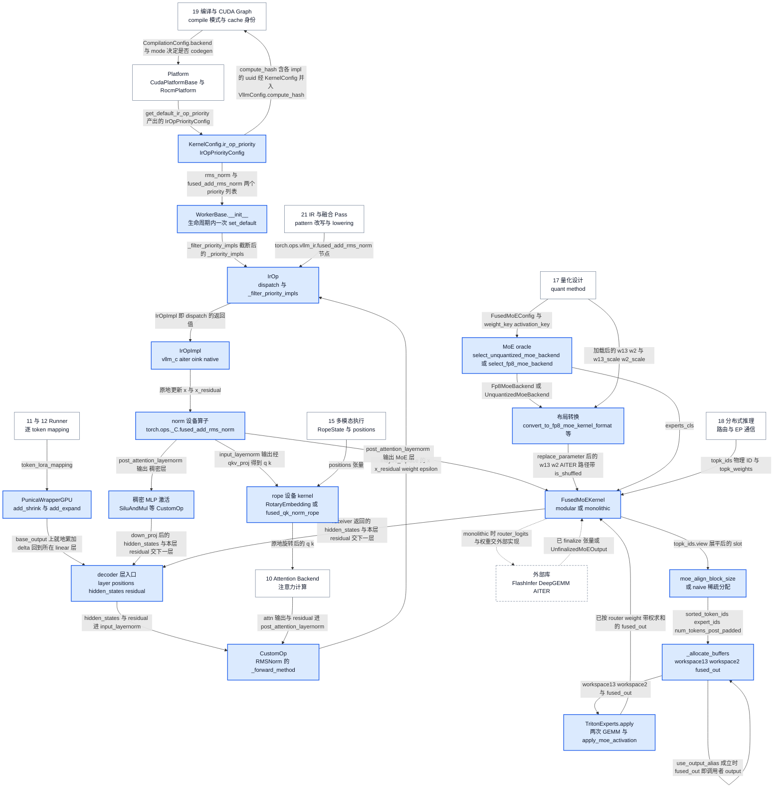
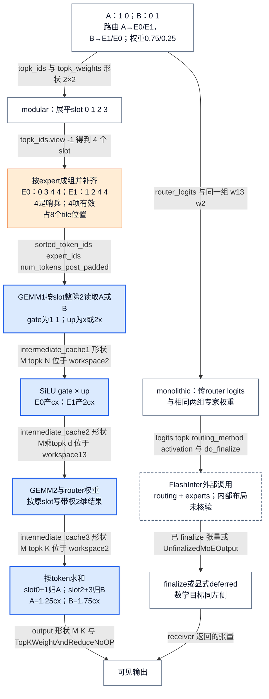

# vLLM 融合算子与 Kernel：用收益账本约束专用化与 fallback

> **源码基线**：`vllm-project/vllm@199cb9b964822e59ab9b58d88e7be31eb419a2ae`（`main`，2026-09-08）
> **主题**：用 residual+RMSNorm+quant、rope、activation、两专家 MoE、Marlin/FP8 权重重排和 multi-LoRA 重建专用 Kernel 改变的数值步骤、数据布局与中间存储。随后解释三层 provider 选择、meta 参数查表、scratch 复用及失败边界。
> **适用范围**：拥有融合收益账本、CustomOp/IrOp/oracle 三层选择、六个代表 Kernel 族的设备算术与 Kernel 内布局、workspace 与 fallback；量化 ABI 归 17、IR 改写归 21、图生命周期归 19、EP 通信与 EPLB 归 18、位置张量归 15、slot mapping 构造归 11/12、采样 kernel 归 14。完整排除清单见 §1 与 §2。
> **最近更新**：2026-09-14。第二轮：图 2 的闭环改为模型层循环里真实存在的 residual 回流并删去不存在的 cache→worker 回边；rope 族补齐 `ApplyRotaryEmb` 与 `DualChunkRotaryEmbedding`，锚点改为 `RotaryEmbedding.forward_*`；qk-norm+rope 融合补上 SM 9.0 自动选择的 N-head shared-memory 变体与 Triton 版 `fused_qk_rmsnorm_rope_gate`；按 `MarlinLinearKernel.can_implement` 与 `marlin_padded_nk` 重写 192/384 的解释；修 SVG 排版与配置契约归属。2026-09-13：兑现 17/15/19 三条落空的入向合同（Marlin warp/tile 布局、FP8 MoE 的 Kernel 内 shuffle 与分支理由、rope 与 qk-norm+rope 融合 kernel）；补收 MoE meta 参数三级选择与 activation family；补齐闭环位置图、核心流程清单、所有权表、配置契约与调用树；纠正 FP32 scratch 的理由与尺寸依据、显式 backend 的静默改写、`workspace_shapes` 参数表、`is_supported_config` 第二项方向与 groupwise guard。

## 1. 定位：本页负责哪个单元，不负责什么

**本页负责的单元是「从一次稳定的语义调用收敛到一次设备 launch，并为这条收敛链记账」**。它拥有四样东西：**融合收益账本**（§1.3、§13）、**三层选择与 fallback**（§3、§11）、**六个代表 Kernel 族的设备算术与 Kernel 内布局**（§4 RMSNorm(+quant)、§5 rope 与 qk-norm+rope、§6 activation、§7 fused MoE、§8 量化权重布局、§9 multi-LoRA）、**workspace / alias / cache-identity 合同**（§7.6、§13）。

**它不是这几样东西**，每条排除都点名真正的 owner：

- 不是 checkpoint 里那些字节怎么形成 pack、scale、zero-point——**归 [[02_engineering/03_infer_frameworks/vllm/17_vllm_quantization_analysis|量化设计]]**。本页从 `process_weights_after_loading` 已经提交的表示接手，只解释 Kernel 内部还要怎么摆。
- 不是 `torch.fx` 图里的 pattern 何时被改写、`maybe_inplace`/donation/functionalization 为何保持语义、pass 顺序——**归 [[02_engineering/03_infer_frameworks/vllm/21_vllm_ir_and_fusion_passes_analysis|IR 与融合 Pass]]**。本页只解释那个产物落到哪个 provider。
- 不是编译区间、capture 与 replay 的生命周期——**归 [[02_engineering/03_infer_frameworks/vllm/19_vllm_compilation_cudagraph_analysis|编译与 CUDA Graph]]**。本页只拥有它「最终选择或生成的那个 Kernel」。
- 不是 collective 的全局语义、EP dispatch/combine 与 EPLB——**归 [[02_engineering/03_infer_frameworks/vllm/18_vllm_distributed_inference_analysis|分布式推理]]**。本页从 `topk_ids`（物理 ID）与 `topk_weights` 接手，止于单卡。
- 不是 attention metadata 与 KV layout 的能力协商——**归 [[02_engineering/03_infer_frameworks/vllm/10_vllm_attention_backends_analysis|Attention Backend]]**。
- 不是 adapter 下载、包装、装入与外部 ID→slot 的分配——**归 [[02_engineering/03_infer_frameworks/vllm/09_vllm_model_library_analysis|模型库与 LoRA 接合]]**。
- 不是逐 token slot mapping 与位置张量的**构造**——mapping 归 [[02_engineering/03_infer_frameworks/vllm/11_vllm_model_runner_v1_analysis|Model Runner V1]] / [[02_engineering/03_infer_frameworks/vllm/12_vllm_model_runner_v2_analysis|Model Runner V2]]，`RopeState`、M-RoPE/XD-RoPE 的坐标归 [[02_engineering/03_infer_frameworks/vllm/15_vllm_multimodal_execution_analysis|多模态执行]]。本页只拥有消费它们的设备 kernel。
- 不是采样与结构化输出的 kernel（`_penalties_kernel`、`_bad_words_kernel`、`_ranks_kernel` 等）——**归 [[02_engineering/03_infer_frameworks/vllm/14_vllm_sampling_structured_output_analysis|采样与结构化输出]]**，本页一个都不收。
- 不是「看到什么症状该改哪个开关」的排障入口——**归 [[02_engineering/03_infer_frameworks/vllm/04_vllm_performance_tuning_guide|性能调优]]**，它的表指到本页，本页提供被指的边界而不重排它的决策树。

### 1.1 一行残差输入：融合究竟省在哪里？

一个 decode token 经过模型子层后，既要把当前输出加到 residual，还要把相加结果归一化；若下个矩阵乘法吃 INT8/FP8，则还要量化。写成三个算子容易理解，却可能多次提交短 kernel 并把临时 tensor 写回显存。**融合有价值的是少付某项执行成本，同时保留更新后的 residual、归一化结果和量化尺度这些可见语义。** 一次调用里仍然可以有多遍读取、多个 kernel 或外部库工作。

设一行隐藏状态 `x=(1,2,3,4)`，旧残差 `r=(1,0,-1,-2)`，权重 `w=(1,2,1,2)`，隐藏宽度 H=4。为方便手算取 `epsilon=0`，各值按 FP32 算术解释；这是教学输入，不是推荐模型 epsilon 或实际测量。没有 `variance_size` override 时，理想实数运算为：

$$
\begin{aligned}
u_j &= x_j+r_j, & v &= \frac{1}{H}\sum_{j=1}^{H}u_j^2, \\
y_j &= u_j\,(v+\epsilon)^{-1/2}\,w_j.
\end{aligned}
$$

本例 `u=(2,2,2,2)`，平方和 16、均方 4、倒数平方根 0.5，故 `y=(1,2,1,2)`。两个结果都必须交付：更新残差 u 供后续子层使用，归一化 y 供当前后继使用。不能只保留 y 而把 residual 副作用删掉。

若继续做对称、无 `scale_ub` 的逐 token INT8 量化，本例 absmax 为 2，scale 为 `2/127`；量化先除 scale 再最近舍入并饱和，理想结果 `q=(64,127,64,127)`。反量化后首/第三项为 `128/127`，而非精确 1。一般 kernel 还对 scale 设正下界；FP8 使用其格式上限与转换规则，不能把 127 和 INT8 舍入搬过去。详细 scale、pack ABI 见 [[17_vllm_quantization_analysis|量化设计]]。

源码中数值顺序比实数公式更具体。IR native 把 x 与 r 转 FP32 后求和与均方，更新残差单独 cast 回输入 dtype；归一化值先 cast 到 weight dtype 再相乘。vLLM C 的 fused-add kernel 先在输入标量类型形成和、写回 residual，再做 FP32 归约与后续归一化。FP16/BF16 的加法/乘法舍入点和归约宽度因此可能不同，测试按容差比对，**不是逐 bit 等价承诺**。该基线已支持 `weight=None` 的无权重路径；Oink 不支持时可走其他 provider，AITER 会构造全 1 权重。

### 1.2 图 1：相同结果，消去的中间态不同

```mermaid
flowchart TB
    I["x：1 2 3 4；r：1 0 -1 -2<br/>w：1 2 1 2；1×4 FP32教学输入"]
    I -->|x 与 residual 两个入参| A["分开执行add<br/>u：2 2 2 2 写入显存"]
    A -->|u 已作为全局张量落地| N["独立norm读取u<br/>y：1 2 1 2 写入显存"]
    N -->|高精度 y 全局张量| Q["独立quant读取y<br/>absmax=2，scale=2/127"]
    I -->|x 与 residual 同址传入 声明 inplace| F["vLLM C add+norm融合<br/>写u；block归约均方4"]
    F -->|residual 已就地更新为 u| FR["同一kernel重读u<br/>写y：1 2 1 2"]
    FR -->|高精度 y 仍写回全局| FQ["后续独立quant<br/>仍读取高精度y"]
    I -->|input residual weight 与 scales 输出缓冲| T["norm+quant融合<br/>阶段1：求RMS倒数0.5"]
    T -->|shared 标量 rms 经 block 归约| S["阶段2：重算norm求absmax<br/>scale=2/127"]
    S -->|shared 标量 token_scale| W["阶段3：重算norm并量化<br/>写q、scale、更新residual"]
    Q -->|q 与 scales| O["理想q：64 127 64 127<br/>更新residual：2 2 2 2"]
    FQ -->|q 与 scales| O
    W -->|out 为 FP8 或 INT8 加 scales 加 residual| O
    classDef neutral fill:#ffffff,stroke:#64748b,color:#0f172a
    classDef acc1 fill:#dbeafe,stroke:#2563eb,color:#0f172a,stroke-width:2px
    classDef acc2 fill:#ffedd5,stroke:#ea580c,color:#0f172a
    class I,Q,FQ,O neutral
    class F,T,S,W acc1
    class A,N,FR acc2
```

<!-- 图 1 spec：Mermaid 分支比较同一 1×4 输入。左路为分开的 add/norm/quant，显示 u、y 都落地；中路为 vLLM C add+norm，明确先写 u、block 归约、重读 u 后写 y，再单独 quant；右路为 norm+quant 融合，显示三个阶段在同一 kernel 内计算 RMS、absmax/scale、重算 norm 并量化，最终只写 q/scale 和残差 u。三路汇入相同理想 q 与 u；蓝色为融合区，橙色为仍需的全局中间态。每条边标注跨越该边界的实际张量真名与其形态。图只表示算法次序，不把框数量当实测 launch 数量。 -->



右路不是把完整 y 永久留在寄存器：`csrc/libtorch_stable/quantization/fused_kernels/layernorm_utils.cuh` 的三个阶段会重读 input/residual，重算需要的 norm 值，并用 block 归约、shared 标量和同步交换 RMS/scale。它直接产出量化 tensor，消掉**高精度 y 作为独立全局 tensor 的写出和下一 kernel 重读**，但没有消掉所有读取与归约。中路则仍落地并重读必须可见的 residual；旧说法“一次 traversal 就完成 add+norm”与当前设备代码不符：`csrc/libtorch_stable/layernorm_kernels.cu::fused_add_rms_norm_kernel` 的两个循环之间夹着一次 `cub::BlockReduce` 与 `__syncthreads()`，第二个循环重读 `residual_v[id]`。padding 与 scratch 是右路要付的成本项，不是它的收益。

对于本例 FP32 y，单独删除一次 1×4 高精度 tensor 写出再重读，逻辑流量是 `2×4×4=32 bytes`；若输入 FP16/BF16 则同尺寸为 16 bytes。这里只算一个指定中间态，不计 cache、重复读取、权重或 scale，因而不是总 HBM 流量或速度提升。完整 kernel 时间需要基准测试。

### 1.3 融合收益账本

直观实现把 `add → RMSNorm → quant` 或 `route → permute → GEMM1 → activation → GEMM2 → unpermute/reduce` 分成独立 Kernel。每个边界都可能增加一次 host launch，并让生产者写出、消费者再读回中间 tensor；融合可以把局部值留在寄存器或 shared memory，也可以直接写入消费者要求的量化/布局格式。源码 benchmark 正是把 RMSNorm 后再 quant 的 unfused 函数与 fused 函数放在同一组 shape 网格中比较，而不是把“融合”当成先验胜者：输入覆盖 token 数 `1..1024`、多种 hidden size、residual 开关、dtype 与 group size，unfused 路径显式先 norm 再 quant，fused 路径则一次调用 norm+quant op。

下面的账本是基于这些实现边界的**分析推断**；源码没有提供统一公式，也没有给出跨硬件通用阈值。

| 账本项 | 融合可能得到的收益 | 同时支付的成本 | 决策时必须带上的证据 |
|---|---|---|---|
| launch | 多个短 Kernel 合并为一个 launch | 更大 Kernel 可能拉长关键路径，削弱并行/重叠机会 | 同一真实 workload 的 launch trace 与端到端时间 |
| 中间态 | 少一次完整 tensor 写回与重读；可原地复用 output/residual | alias、stride 与生命周期变严格；错误复用会破坏语义 | bytes moved、copy event、alias/stride 边界测试 |
| 格式转换 | norm/activation 后直接产出 quantized 或 backend layout | dtype、scale 粒度、block shape 与 pack 进入 Kernel ABI | reference 数值、scale/layout 与边界 shape |
| 专用化 | 针对 token 数、hidden/expert shape 和硬件 tile 调优 | 代码、配置、编译 cache、回归矩阵与维护面扩张 | 覆盖 prefill/decode 与 TP/EP-local shape 的 benchmark |
| workspace | 两阶段计算可重用 scratch，避免反复分配 | 预留显存、capture 地址与异步完成前的存活期 | workspace 上界、复用顺序与峰值显存 |

因此应比较的是**一次完整调用的总成本**，不是源码中 op 的数量。仓库自带的 MoE 默认配置 benchmark 也把 tuned、old default、new default 在相同 `M/E/N/K/topk/dtype/block_shape` 下计时，并明确输出 Kernel 时间与 speedup（被它度量的那三级选择本身见 §7.5）。这支持一个重要边界：配置变化可能改变胜者，仓库里存在 benchmark 驱动的选择依据，但源码没有发布一个可直接外推到任意部署的固定性能结论。

### 1.4 图 2：闭环位置图

<!-- 图 2 spec：Mermaid 位置图。节点是持有状态的 owner，边标注跨越边界的实际对象名而不是“调用/返回”。启动侧：平台默认与用户 priority 汇入 IrOpPriorityConfig，WorkerBase.__init__ 在 worker 生命周期内只安装一次；compute_hash 是流向 19 的单向 cache 身份边，不回流。执行侧沿一个真实的 decoder 层走：input_layernorm 经 CustomOp/IrOp 落到 fused_add_rms_norm，q k 经 rope kernel 交给 10 的 attention，post_attention_layernorm 再次经过同一条 norm 路径，然后分流到稠密 activation 或 FusedMoEKernel；MoE 权重先由 17 的 quant method 调 oracle 选 backend，再经布局转换进入 kernel。闭环是模型代码里真实存在的 for layer: hidden_states, residual = layer(positions, hidden_states, residual)——本层输出与 fused_add_rms_norm 更新后返回的 residual 回到下一层入口（是否原地取决于 provider）；另有 use_output_alias 的自反边。虚线框是本轮未打开内部实现的外部库。 -->



**闭环在哪里。** 回流边是 `ACT → LAY` 与 `MK → LAY`：模型代码里的层循环在 `islice(self.layers, self.start_layer, self.end_layer)` 上逐层执行 `hidden_states, residual = layer(positions, hidden_states, residual)`（例如 `vllm/model_executor/models/qwen3_moe.py::Qwen3MoeModel.forward`），而层内 `input_layernorm(hidden_states, residual)` 与 `post_attention_layernorm(hidden_states, residual)` 都经过同一条 `fused_add_rms_norm` 路径——**更新后返回的那个 `residual` 就是下一层入口读到的那个**。它是不是「原地」更新取决于选中的 provider：`vllm_c` / `oink` 这类 inplace provider 会把结果写回同一块存储；而 CUDA 在 Inductor 编译下默认 priority 是 `["native"]`，native 的 `vllm/ir/ops/layernorm.py::fused_add_rms_norm` 用 `x_residual = x.to(orig_dtype)` 返回新张量。闭环靠的是 `layer()` 的返回值，两种情形都成立。这正是 §1.1 强调「更新残差必须交付」的原因：它不是本层的副产品，而是下一轮循环的输入。

图里另有两条容易画错的边，这里说清方向。其一，**priority 进 compile cache 身份是单向的**：`IrOpPriorityConfig.compute_hash()` 显式把各 impl 的 `uuid()` 塞进 hash factors（IR provider 实现被 Dynamo 隐藏，否则换了 kernel 实现却复用旧 artifact），经 `KernelConfig.compute_hash` 并入 `VllmConfig.compute_hash`，由 19 消费；**并不存在「cache key 变化 → worker 重装 priority」的回路**。`WorkerBase.__init__` 无条件调用一次 `set_default()`，注释原文是 priority 与 torch-wrap 状态「constant for the worker's lifetime」。其二，**oracle 不消费权重**：`select_fp8_moe_backend(config, weight_key, activation_key, …)` 只读 `FusedMoEConfig` 与两个 quant key，在 quant method 构造期就选定 backend；`is_shuffled` 是之后 `_Fp8OnlineMoEBase._setup_kernel` 调 `convert_to_fp8_moe_kernel_format` 时才打上的。alias 是自反边而不是新分配：`use_output_alias` 成立时 `fused_out` 就是调用者传进来的那块 buffer。

### 1.5 本页拥有的核心流程

下表穷尽本页拥有的 20 条流程。**枚举依据**不是主观挑选：① 来自 `CustomOp.dispatch_forward` 的六条平台分支加一条 disabled 分支；②③⑳ 来自 `IrOpPriorityConfig` 的 2 个字段与 `IrOp.register_impl` 的 `supported` / `supports_args` 两个门；④⑤ 来自 `vllm/kernels/vllm_c.py` 注册到这两个 IR op 的 impl 加 `_C` 侧两个 quant 入口；⑥⑦ 来自 `vllm/model_executor/layers/rotary_embedding/` 下的 3 个 `@CustomOp.register`（`rotary_embedding`、`apply_rotary_emb`、`dual_chunk_rotary_embedding`，逐个处理见 §5.2）、`csrc/libtorch_stable/` 下三个 fused qk-norm+rope kernel 文件，以及 `vllm/model_executor/layers/fused_qk_norm_rope.py` 的 Triton 版；⑧⑨ 来自 `activation.py` 的 16 个 `@CustomOp.register` 与 `vllm/model_executor/layers/fused_moe/activation.py::_APPLY_MOE_ACTIVATIONS` 的 11 个枚举值；⑩ 来自 `fused_moe/oracle/` 目录；⑰ 来自 `convert_to_fp8_moe_kernel_format` 与 `convert_to_unquantized_kernel_format` 的分支集合。第四列是一个具体的返回值、字段翻转或原地更新，不是“处理完成”。

| 功能 | 要解决的问题 | 设计与实现入口 | 产出的可观察变化 |
|---|---|---|---|
| ① `CustomOp` 平台绑定 | 模型层要有一个不随硬件改写的调用点 | `vllm/model_executor/custom_op.py::CustomOp.dispatch_forward` | `self._forward_method` 被固定为 `forward_hip/cpu/tpu/xpu/oot/cuda` 之一，或 disabled 时的 `maybe_compile(forward_native)`；`compilation_config.enabled_custom_ops` 增加该类名 |
| ② `IrOp` provider dispatch | 同一语义 op 在不同实参下要选不同实现 | `vllm/ir/op.py::IrOp.dispatch` | 返回第一个 `supports_args` 为真的 `IrOpImpl`；末项不覆盖时抛 `RuntimeError("Priority set incorrectly…")` |
| ③ 静态可用性求值与 priority 过滤 | 进程里根本没装的库不该进候选表 | `IrOp.register_impl(supported=…)`；`IrOp._filter_priority_impls` | 不支持的 provider 从 `_priority_impls` 移除；首个 `supports_all_args` 之后截断；无全覆盖实现时追加 `native` 并 `warning_once` |
| ④ vLLM C add+norm 设备算术 | 一次 launch 同时交付更新残差与归一化输出 | `csrc/libtorch_stable/layernorm_kernels.cu::fused_add_rms_norm` | `x` 与 `x_residual` 两个 tensor 被原地更新并原样返回 |
| ⑤ norm+quant 三阶段 | 高精度 norm 输出不必落全局显存 | 同目录 `csrc/libtorch_stable/quantization/fused_kernels/fused_layernorm_dynamic_per_token_quant.cu::rms_norm_dynamic_per_token_quant` 与 `rms_norm_per_block_quant` | `out`（FP8/INT8）与 `scales` 写满，`residual` 就地更新；guard 不过时是 `_C` 入口的 `STD_TORCH_CHECK` 异常 |
| ⑥ rope 设备 kernel | 同一套 cos/sin 表要覆盖 NEOX 与 GPT-J 两种通道排列 | `vllm/model_executor/layers/rotary_embedding/base.py::RotaryEmbedding.forward_cuda / forward_hip / forward_xpu / forward_cpu`；`csrc/libtorch_stable/pos_encoding_kernels.cu::rotary_embedding`；`vllm/model_executor/layers/rotary_embedding/common.py::ApplyRotaryEmb.forward_cuda / forward_hip` | `RotaryEmbedding`：`query` 与可选 `key` 被原地旋转并原样返回，`key is None` 时 XPU 路径改走 `forward_native`；`ApplyRotaryEmb`：返回新的旋转后张量，输入不变 |
| ⑦ qk-norm + rope 融合 kernel | q/k 的 RMSNorm 与旋转都是逐 head 的，可以合成 warp 内的工作 | `csrc/libtorch_stable/fused_qknorm_rope_kernel.cu::fused_qk_norm_rope`（入口按 SM 与 `num_tokens × (heads_q + heads_k)` 在 1-head 与 N-head 两个 kernel 间自动选择） | 同一个 `qkv` 张量的 Q、K 段被原地归一化并旋转，V 段不动；`head_dim` 不在 {64,128,256} 时抛 `Unsupported head dimension` |
| ⑧ activation family（层级） | 同一激活在不同平台要有不同实现，且不能被静默换成别的函数 | `vllm/model_executor/layers/activation.py` 的 16 个 `@CustomOp.register` | gated 变体返回形状 `x.shape[:-1] + (d,)` 的新张量；其中 `FatreluAndMul`、`SiluAndMulWithClamp`、`MulAndSilu` 三个在特定平台的 `__init__` 里把 `_forward_method` 改成 `forward_native` |
| ⑨ MoE 内部 activation 派发 | expert GEMM 之间的激活不走层级 CustomOp，另有一套 enum 派发 | `vllm/model_executor/layers/fused_moe/activation.py::apply_moe_activation` 与 `_apply_moe_activation_masked` | `output` 就地写满并被返回；masked 变体走 `torch.ops._C.masked_moe_activation` |
| ⑩ MoE oracle 选 family | `moe_backend` 一个字符串不足以决定合法实现 | `vllm/model_executor/layers/fused_moe/oracle/unquantized.py::select_unquantized_moe_backend`；`vllm/model_executor/layers/fused_moe/oracle/fp8.py::_get_priority_backends` | 返回 `(UnquantizedMoeBackend, experts_cls)` 且 `logger.info_once` 打出候选表；全失败抛 `NotImplementedError` |
| ⑪ slot 分组：align 或 naive | 按 expert 成组才能让 tile 内共用同一权重 | `vllm/model_executor/layers/fused_moe/fused_moe.py::_prepare_expert_assignment` → `vllm/model_executor/layers/fused_moe/moe_align_block_size.py::moe_align_block_size` | 返回 `sorted_token_ids` / `expert_ids` / `num_tokens_post_padded` 三元组；naive 分支的第一项为 `None` |
| ⑫ Triton 两次 GEMM 与 grid 逐格决策 | 每个 `(pid_m, pid_n)` 要独立决定早退、置零、gather 与取哪块 scale | `vllm/model_executor/layers/fused_moe/fused_moe.py::fused_moe_kernel` / `invoke_fused_moe_triton_kernel` | `c_ptr` 对应 tile 被写入或被 `write_zeros_to_output` 置零；`pid_m*BLOCK_SIZE_M >= num_tokens_post_padded` 时该 program 直接 `return` |
| ⑬ MoE meta 参数三级选择 | tile/stage 参数随 shape 变，又不能每次现场 autotune | `vllm/model_executor/layers/fused_moe/fused_moe.py::try_get_optimal_moe_config` → `get_moe_configs` / `get_default_config` | 返回含 `BLOCK_SIZE_M/N/K`、`GROUP_SIZE_M`、`SPLIT_K`（可能还有 `num_warps`/`num_stages`）的 dict；命中 tuned 文件时 `logger.info_once` 打出文件路径 |
| ⑭ workspace 分配与 output alias | 两阶段中间态要复用 scratch，又不能越界 | `vllm/model_executor/layers/fused_moe/modular_kernel.py::FusedMoEKernelModularImpl._allocate_buffers / _fused_experts` | `workspace13`、`workspace2`、`fused_out` 三块就位；`use_output_alias` 四条件成立时 `fused_out` 变成调用者的 buffer |
| ⑮ modular prepare/experts/finalize | all-to-all 与 shared experts 要能与 expert 计算重叠 | `vllm/model_executor/layers/fused_moe/modular_kernel.py::FusedMoEKernelModularImpl.apply / _prepare / _finalize` | `_finalize` 的 `receiver()` 返回可见输出张量 |
| ⑯ monolithic apply 与 deferred finalize | router 与 experts 一起消费能少一层中间表示 | `FusedMoEKernelMonolithicImpl.apply`；`vllm/model_executor/layers/fused_moe/experts/trtllm_bf16_moe.py::TrtLlmBf16ExpertsMonolithic.apply` | 返回已 finalize 张量；或返回 `UnfinalizedMoEOutput` 把完成点外移 |
| ⑰ 量化权重的 Kernel 内布局转换 | 同一份 qweight 在不同 Kernel 里的字节顺序不同 | `csrc/libtorch_stable/quantization/marlin/gptq_marlin_repack.cu::gptq_marlin_repack_kernel`；`vllm/model_executor/layers/fused_moe/oracle/fp8.py::convert_to_fp8_moe_kernel_format`；`vllm/model_executor/layers/fused_moe/oracle/unquantized.py::convert_to_unquantized_kernel_format` | `replace_parameter` 后的 `w13_weight`/`w2_weight` 变成新布局，AITER 路径另外挂上 `is_shuffled = True` |
| ⑱ LoRA metadata 分组 | 同一 batch 的 token 可能来自不同 adapter 或不用 LoRA | `vllm/lora/ops/triton_ops/lora_kernel_metadata.py::LoRAKernelMeta.prepare_tensors` | `token_indices_sorted_by_lora_ids`、`active_lora_ids`、`num_tokens_per_lora`、`lora_token_start_loc` 四个数组写定 |
| ⑲ shrink 与 expand | 低秩增量要按 adapter 分组做两阶段 GEMM | `vllm/lora/punica_wrapper/punica_gpu.py::PunicaWrapperGPU.add_lora_linear / add_shrink / add_expand` | `add_expand` 后 `y` 的对应 output slice 被就地累加；`add_inputs=False` 时改由调用者合并 |
| ⑳ priority 的 cache 身份与 worker 安装 | 换了 kernel 实现却复用旧编译产物就是错的 | `vllm/config/kernel.py::IrOpPriorityConfig.compute_hash / set_default`；`vllm/v1/worker/worker_base.py::WorkerBase.__init__` | `factors["_impls"]` 含每个 provider 的 `uuid()`；worker 初始化后各 `IrOp._priority_impls` 非空 |

### 1.6 基础与条件：哪些流程普通路径也会走

“基础”指未量化、无 LoRA、单卡、默认 `moe_backend=auto` 的普通文本推理也会经过；“条件”指启用某项功能或命中某个模型形态才出现。

| 类别 | 流程 | 触发条件 | 本页位置 |
|---|---|---|---|
| 基础 | ①②③ | 恒走（CustomOp 被禁时 ① 走 disabled 分支，②③ 仍在 IR 层生效） | §3.1～§3.4 |
| 基础 | ④ | CUDA/ROCm 且 `variance_size is None`、weight dtype 匹配 | §4.3 |
| 基础 | ⑥ | 除少数无 rope 架构外恒走 | §5.1、§5.2 |
| 基础 | ⑧ | 稠密 MLP 恒走 | §6.1 |
| 基础 | ⑨⑩⑪⑫⑬⑭⑮ | MoE 模型恒走（非 MoE 模型整条不存在） | §6.2、§7.1～§7.7 |
| 基础 | ⑳ | worker 初始化恒走 | §12、§13 |
| 条件 | ⑤ norm+quant | 下游 GEMM 吃 FP8/INT8，且 IR 侧已把 quant 合进 norm | §4.3 |
| 条件 | ⑦ qk-norm+rope 融合 | 模型有 q/k norm 且 `pass_config.enable_qk_norm_rope_fusion` 打开，由 `QKNormRoPEFusionPass` 改写出 `torch.ops._C.fused_qk_norm_rope`（开关取值归 19，pass 归 21）；`fused_qk_norm_rope` 入口再按 SM 9.0 阈值在 1-head 与 N-head kernel 间选择 | §5.3 |
| 条件 | ⑪ 的 naive 分支 | `expert_map is None` 且 `num_tokens × topk × 4 <= global_num_experts`，且排除 WNA16 block 量化 | §7.2 |
| 条件 | ⑦ 的 Triton 版 `fused_qk_rmsnorm_rope_gate` | 模型代码直调，不经 pass：`qwen3_next.py` 的 `use_fused_qk_norm_rope_gate` 五条件（`attn_output_gate`、`is_neox_style`、CUDA、支持的 dtype、纯文本或支持 M-RoPE） | §5.3 |
| 条件 | ⑥ 的 `ApplyRotaryEmb` | `MRotaryEmbedding` / `XDRotaryEmbedding` 调用基类构造的 `self.apply_rotary_emb`；或 15 个模型文件直接构造（如 `qwen2_vl.py`、`qwen2_5_vl.py`、`glm4_1v.py`、`siglip2navit.py` 等多模态/视觉编码器文件） | §5.2 |
| 条件 | `DualChunkRotaryEmbedding` | `get_rope` 收到 `dual_chunk_attention_config`；无设备 kernel，本页只点名 | §5.2 |
| 条件 | ⑬ 的 tuned 分支 | configs 目录或 `VLLM_TUNED_CONFIG_FOLDER` 下存在同名 json；`VLLM_BATCH_INVARIANT` 时强制跳过 | §7.5 |
| 条件 | ⑭ 的 alias | shape/dtype/device/contiguous 四项全等；ROCm 还要 `rocm_aiter_ops.is_fused_moe_enabled()` | §7.6 |
| 条件 | ⑯ monolithic | 选中的 family 提供 monolithic 实现（如 FlashInfer TRT-LLM BF16） | §7.7 |
| 条件 | ⑯ 的 deferred finalize | provider 返回 `UnfinalizedMoEOutput` 且 prepare/finalize 声明支持 | §7.7 |
| 条件 | ⑰ | 量化 checkpoint；具体分支由 `Fp8MoeBackend` / `UnquantizedMoeBackend` 决定 | §8 |
| 条件 | ⑱⑲ | `enable_lora` 且本步至少一个 token 的 slot 不为 `-1` | §9 |
| 条件 | 融合 activation+quant | gated SiLU、FP8 W8A8、`block_shape=[128,128]`、无 LoRA、未用 E8M0 五条件同时成立 | §7.4 |
| 条件 | batch-invariant | `VLLM_BATCH_INVARIANT=1`：④ 固定 1024 线程并关向量分支，⑬ 直接返回固定 tile，⑩ 过滤不支持的 family | §4.3、§7.5 |

## 2. 所有权：谁定义 Kernel 合同

| 责任 owner | 输入 → 输出 | 拥有的状态与不变量 | 明确不拥有 |
|---|---|---|---|
| `CustomOp` 子类 | 稳定 layer 调用 + build platform → native 或平台方法 | 类级语义、`enabled()` 判定、对象构造时固定的平台路径 | 同一对象每步按 shape 动态换 provider（源码明说不支持动态 platform dispatch） |
| `IrOp` / `IrOpImpl` | 语义 op + priority + 当前 tensors → compatible impl | provider 注册表、`supported` 静态门、`supports_args` 动态门、native 兜底、`uuid()` cache 身份 | 图中 pattern 为什么/何时被改写（归 21） |
| `IrOpPriorityConfig` / Platform | 平台与用户意图 → 每个 op 一个 provider 名字列表 | 平台默认的产生与追加、`compute_hash`、worker 安装点 | 编译模式本身（归 19） |
| MoE oracle（`unquantized.py` / `fp8.py`） | `FusedMoEConfig` + quant key + activation format → backend 与 experts 类 | 候选顺序、带注释的重排修补、`is_supported_config` 的 11 项求交结果 | checkpoint 如何形成 pack/scale（归 17）；collective 的全局语义（归 18） |
| `FusedMoEKernel` 与两个 impl | `topk_ids`/`topk_weights` 或 router logits → 可见输出 | modular/monolithic 不可混搭、三段执行顺序、deferred finalize 的双重条件 | 路由算法本身与 EP 通信（归 18） |
| workspace allocator | problem size + provider 报告的三个 shape → 三块 buffer | scratch 上界、复用顺序、alias 四条件、capture 期地址稳定 | workspace 在 CUDA Graph 里怎样被冻结（归 19） |
| 布局转换器（`convert_to_*_kernel_format`、`gptq_marlin_repack`） | 已量化的 `w13/w2` 与 scale → Kernel 内布局 | tile 内字节顺序、`is_shuffled` 标记、padding 与 swap 的执行 | 这些字节代表什么数（归 17） |
| `PunicaWrapperGPU` / `LoRAKernelMeta` | 已备好的逐 token slot mapping → 就地累加的 output slice | 分组数组、FP32 scratch 的形状与生命周期、CUDA Graph 分组计数补齐 | adapter 装载与 slot 分配（归 09）、mapping 构造（归 11/12） |

**与相邻页的交接对象**（方向标出真名，不是“调用/返回”）：

| 相邻页 | 进入本页的对象 | 离开本页的对象 |
|---|---|---|
| [[17_vllm_quantization_analysis\|量化设计]] | `process_weights_after_loading` 之后的 `w13_weight`/`w2_weight` 与 `w13_weight_scale`/`w2_weight_scale`；Marlin 的 `qweight`、`g_idx`、permutation | 本页给出的 Kernel 内 tile/warp 布局与 shuffle 结果，以及 `Fp8MoeBackend` 各分支的性能理由 |
| [[21_vllm_ir_and_fusion_passes_analysis\|IR 与融合 Pass]] | `torch.ops.vllm_ir.fused_add_rms_norm` 等节点、`maybe_inplace` 的 alias 承诺 | `IrOp.dispatch` 选中的 `IrOpImpl` 与其 inplace 声明 |
| [[19_vllm_compilation_cudagraph_analysis\|编译与 CUDA Graph]] | `CompilationConfig.mode` / `backend` 决定的「是否 codegen」，以及 `pass_config` 上那几个融合开关的取值 | 被最终选中或生成的 provider/Kernel；`IrOpPriorityConfig.compute_hash()` 进 compile cache key |
| [[18_vllm_distributed_inference_analysis\|分布式推理]] | `_select_experts` 返回的 `topk_ids`（物理 ID）与 `topk_weights` | 单卡上 token 打包、专家计算与 combine 的结果；`intermediate_size_per_partition` 这类 local shape 作为兼容性输入 |
| [[10_vllm_attention_backends_analysis\|Attention Backend]] | attention backend 已声明的 KV layout 与 metadata 能力 | 具体 op、provider 选择及内部计算与性能边界（含 rope 设备 kernel 这一半） |
| [[15_vllm_multimodal_execution_analysis\|多模态执行]] | `RopeState` 算出的 `positions` 张量（含 M-RoPE 的多行坐标） | 消费该张量的 rope 设备 kernel 的索引规则与融合形态 |
| [[09_vllm_model_library_analysis\|模型库]] | 已激活的 resident slot 与 `lora_a_stacked`/`lora_b_stacked` | Kernel 如何消费 slot mapping（分组、跳过 `-1`、两阶段计算） |
| [[11_vllm_model_runner_v1_analysis\|Model Runner V1]] / [[12_vllm_model_runner_v2_analysis\|Model Runner V2]] | `token_lora_mapping`（逐 token slot） | `LoRAKernelMeta` 的四个分组数组与就地累加后的 output |
| [[04_vllm_performance_tuning_guide\|性能调优]] | 「attention/GEMM/MoE/格式转换占主要计算时间」这条症状 | §13 的风险表与 §12 的配置契约，作为“该看哪个开关”的落点 |

## 3. 三层选择：不是一张名字表

### 3.1 背景与替代方案

若模型层直接调用某个设备扩展，换硬件就要改模型；若只保留 native PyTorch，eager 路径又无法保证得到目标设备的专用布局与实现。vLLM 保留一个稳定语义边界，再让 provider 声明“在哪个平台可注册、哪些实参可执行”；`IrOp` 构造时总是注册 native implementation，并把它作为始终可用的语义实现。

这条结构胜过“一个全局 `if device` 选完所有 Kernel”，因为平台可用性和单次调用兼容性不是同一个问题。provider 注册接口把 `supported` 定义为硬件/库的静态门，把 `supports_args` 定义为 dtype/shape 等动态门，并要求每个实现保持 native 的签名与语义。这里的“为什么胜出”是依据接口分工重建的**分析推断**；源码只自陈最终合同。

### 3.2 三层各拥有什么

| 层 | 输入 → 输出 | 拥有的决策 | 不拥有 |
|---|---|---|---|
| layer / `CustomOp` | 稳定 layer 调用 + build platform → native 或平台方法 | 类级语义、CUDA/HIP/XPU/CPU/TPU/OOT 方法；对象构造时固定平台路径 | 同一对象每步按 shape 动态换 provider |
| `IrOp` provider | 同一个语义 op + priority + 当前 tensors → compatible impl | provider priority、静态可用性、每次调用的 argument predicate、native fallback | 图中 pattern 为什么/何时被改写 |
| Kernel family / oracle | dtype/quant/layout + local shape + hardware + parallel/routing feature → concrete Kernel class/config | tile/layout、workspace、实现能力与 family 内候选顺序 | checkpoint 如何形成 pack/scale；collective 的全局语义 |

`CustomOp` 被禁用时走可选编译的 `forward_native`；启用时按当前 build platform 绑定 `forward_hip/cpu/tpu/xpu/oot/cuda`，源码明确说明这里不支持动态 platform dispatch。其注释还指出：在 opaque custom op 内部编译 native 并不能得到跨 op fusion，所以能展开时仍应展开。这解释了为何“专用 Kernel 边界”和“编译器可见边界”要同时保留，而不能把所有算子都包成 opaque op。

`IrOp` 则在 priority 中逐项检查 `supports_args`；没有显式 priority 时用 native，priority 中没有全参数 provider 时会自动在末尾补 native 并告警。平台默认还会考虑执行上下文：CUDA 在 Inductor 编译时默认 `["native"]`，非 codegen 时默认 `["vllm_c","native"]`，`VLLM_USE_OINK_OPS` 时把 `oink` 插到前面；ROCm 只在 `cudagraph_mode != NONE`、`VLLM_ROCM_USE_AITER`、`VLLM_ROCM_USE_AITER_RMSNORM` 与 `not on_rdna4()` 四条件同时成立时把 AITER RMSNorm 提到默认前面。这是 provider 选择的执行上下文，不是 IR pass 顺序；后者仍由 [[21_vllm_ir_and_fusion_passes_analysis|IR 与融合 Pass]] 拥有。

**一个容易误读的规模事实**：`IrOpPriorityConfig` 当前只有 **2** 个字段（`rms_norm`、`fused_add_rms_norm`）。也就是说，第二层（IR provider priority）今天只覆盖 RMSNorm 一族；rope、activation、MoE 这三族**没有** IR priority，它们分别停在第一层（`CustomOp` 平台绑定）或第三层（oracle）。把“三层”读成“每个算子都有三层”是错的。

### 3.3 `supported` 是怎么被算出来的

`supported` 不是运行期查询，而是**模块导入时求值一次的常量**，因此它只应表达“这台机器上有没有这个库/这代硬件”：

- AITER：`vllm/kernels/aiter_ops.py` 顶层 `AITER_SUPPORTED = is_aiter_found()`，两个 impl 都用它。
- Oink：`vllm/kernels/oink_ops.py` 顶层 `OINK_AVAILABLE = current_platform.has_device_capability(100) and hasattr(torch.ops, "oink")`，再由 `has_oink_op(name)` 逐 op 检查 `hasattr(torch.ops.oink, name)`。vLLM **不依赖** Oink 包；这些 op 由外部 plugin 通过 general_plugins 注册到 `oink::` 命名空间后才存在。
- vLLM C：`supported=GPGPU_DEVICE`。

`register_impl` 的 docstring 把这条分工写死了：`supported` 只查平台/库，`supports_args` 只查实参，**基于全局状态（如环境变量）的自定义启停要通过 priority 表达，不许写进这两个谓词**。`VLLM_USE_OINK_OPS` 正是这样处理的——它不改 `supported`，而是改平台默认 priority；源码还给它挂了 `TODO(Laurawly/luka): remove this env var`。

### 3.4 约束：fallback 的末项必须覆盖全部实参

dispatch 热路径要求 priority 最后一项支持所有实参，否则抛 `RuntimeError("Priority set incorrectly: the last implementation must support all args…")`——注释直接写明这是 internal bug。安装 priority 的 `_filter_priority_impls` 做三件事：跳过 `supported` 为假的项；**遇到第一个 `supports_all_args` 为真的实现就截断**（后面的项永远选不到，留着只会误导）；一路走完仍没有全覆盖实现时追加 `native` 并 `warning_once`。

测试同时固定两种行为：静态 unsupported provider 在设置 priority 时被过滤；只支持偶数 shape 的 provider 对奇数 shape 自动落到 native。所以 fallback 不是捕获任意 Kernel error 后重试；它是在 launch 前依据已声明谓词选择同语义实现。

## 4. 代表族一：residual + RMSNorm（再接 quant）

### 4.1 背景与为什么值得融合

residual add 与 RMSNorm 都逐元素读取同一 token row；若分开执行，add 的完整输出既要落地又要被 norm 重读。当前 vLLM C 实现把 add 与 norm 的 launch 合并，但仍先写残差、归约后重读残差并写 norm output；再把 quant 合入时，还可避免 materialize 高精度 norm output。这里关于带宽收益的因果链是**分析推断**，其执行边界可由 benchmark 的 unfused/fused 对照直接核验。

融合不允许省掉可见语义。native reference 要求 residual 输出等于 `x + residual`，norm 输出等于该和的 RMSNorm；测试跨 token 数、hidden size、FP16/BF16/FP32 核验 shape/dtype/device 与数值。每个 provider 还必须与 native 结果相符，并验证 priority dispatch 与直接调用一致。

### 4.2 provider 选择怎样暴露真实边界

同一个 `fused_add_rms_norm` 不是“检测到 GPU 就调用最快扩展”这么简单：

- vLLM C provider 要求没有 `variance_size` override、存在 weight 时与 activation dtype 匹配，并声明 `inplace=True`；ROCm 遇到非 contiguous 输入时明确调用 native 后再 `copy_` 回输入，而不是把不合法 stride 交给设备 Kernel。
- AITER provider 额外只接受 FP16/BF16 activation，且同样拒绝 `variance_size` override。
- Oink provider 要求可视为二维（`_can_view_as_2d`）、weight contiguous、input/residual shape 与 dtype 相同，必须存在 weight，并满足 256-bit vectorization stride（`_is_oink_stride_compatible_2d`：FP16/BF16 要求 `stride(0) % 16 == 0`，FP32 要求 `% 8 == 0`，其余 dtype 直接判否）；它同样声明 inplace。

这些 guard 展示了融合的代价：为了少一次 launch/中间态，Kernel 把 dtype、stride、shape 与 alias 写入合同。测试不是只测一个 happy path；provider 注册表按平台核对 native/vLLM C/AITER/Oink 的可用性，并要求所有设备 provider 拒绝 `variance_size` override。不满足时应选择 native 或另一个 compatible provider；若调用者强行绕过 `supports_args`，就不再属于安全 fallback 路径。

### 4.3 一次 residual + RMSNorm 怎样落到设备 Kernel

这里有两次不同的 dispatch，不能合并理解：`CustomOp` 决定 model layer 走哪个平台入口，`IrOp` 再为这一组真实实参选择 provider。以已启用 CustomOp、非 batch-invariant、带 residual 的 CUDA 调用为例。

**触发**：模型子层调用 `RMSNorm(x, residual)`。

**分阶段**：

1. **读入 build platform**。`CustomOp.forward()` 调用初始化时绑定的 `_forward_method`；平台 dispatch 在 CUDA 上绑定 `RMSNorm.forward_cuda()`，而该方法在普通路径继续进入 `forward_native()`。这里的“native”是可编译的语义入口，不等于最终一定执行 PyTorch reference。
2. **决定要不要 inplace**。`RMSNorm.forward_native()` 看到 residual 后调用 `ir.ops.fused_add_rms_norm.maybe_inplace(x, residual, weight, eps, variance_size)`，一次返回 normalized output 与更新后的 residual。调用者在这里声明 alias 可接受，但还没有承诺某个 provider 一定能 inplace。
3. **决定 provider**。`IrOpInplaceOverload._inner_call()` 把真实 dtype、shape、stride 和可选参数交给 `IrOp.dispatch()`；dispatcher 按 priority 调 `supports_args`，返回第一个兼容实现，最后没有全覆盖实现则视为内部配置错误。所以 fallback 发生在 launch 前，不是设备 Kernel crash 后重跑 reference。
4. **流向设备**。若命中 vLLM C provider，谓词先确认没有 `variance_size` override 且 weight dtype 兼容；ROCm 非 contiguous 会在 provider 内转 native-copy 路径，高维 ROCm contiguous 输入先 `view` 成 2D、执行后恢复原 shape；其余支持情形才调用 `torch.ops._C.fused_add_rms_norm()`。

**完成点**：`torch.ops._C.fused_add_rms_norm` 返回后，`x` 与 `x_residual` 这两个 tensor 已被**原地**更新并原样返回给调用者——没有第三个输出张量，也没有 copy。

这条链之所以分两层，是因为平台/build 决定“哪些入口存在”，而每次调用的 stride、dtype 与可选参数决定“这次哪个实现合法”。把 capability 检查塞进设备 Kernel 只能更晚失败；把 provider 固定在 model layer 又会失去按实参安全 fallback 的能力。

设备内部还有一层“同 family 内退化”，不是退回 native。`csrc/libtorch_stable/layernorm_kernels.cu::fused_add_rms_norm` 用 `constexpr int vector_width = 8`、`req_alignment_bytes = vector_width * 2 = 16`：hidden size、input stride、residual stride 均整除 8 且 input/residual（有 weight 时还有 weight）指针对齐 16 bytes 时可选向量化；不满足则用 generic 版本。每个 CUDA block 处理一个 token，线程分担 hidden 维的平方和，CUB block reduction 得到均方再同步。`max_block_size` 为 `batch_invariant ? 1024 : (num_tokens < 256 ? 1024 : 256)`；batch-invariant 模式固定 1024 且**显式关闭向量分支**（判定式里带 `!batch_invariant_launch`），以固定求和次序，说明更高 occupancy 和可复现性可能冲突。

norm+quant 有两个 `_C` 入口，共享一组 guard 又各有硬约束。共享部分：输出只接受当前平台 FP8（`is_fp8_ocp()` 决定 `e4m3fn` 还是 `e4m3fnuz`）或 INT8，`out` 须 contiguous，`input.stride(-1) == 1`，`weight.scalar_type() == input.scalar_type()`，`scales` 为 FP32，`residual` 存在时 dtype 与 input 一致且 contiguous，`scale_ub` 只允许 FP8 输出。

groupwise 入口 `rms_norm_per_block_quant` 另有**四条可精确复述的硬 guard**，不是“满足向量化整除条件”这种含糊话：

| guard | 条件 | 违反后果 |
|---|---|---|
| group_size 白名单 | `group_size == 128 \|\| group_size == 64` | `STD_TORCH_CHECK` 抛 `Unsupported group size` |
| scale 转置 | `scales.stride(1) > 1` 时必须 `is_scale_transposed` | 抛 `Outer scale stride must be 1 when scales are not transposed` |
| hidden 整除 | `hidden_size > 0 && hidden_size % group_size == 0` | 抛 `hidden_size must be a positive multiple of group_size` |
| scales 容量下界 | `scales.numel() >= num_tokens * (hidden_size / group_size)` | 抛 `scales buffer too small: need N elements, got M` |

其 dispatch 层再加三条向量化整除检查：`hidden_size % 4`、`input_stride % 4`、`group_size % 4` 都必须为 0。该入口的 `max_block_size` 是 `batch_invariant ? 512 : (num_tokens <= 256 ? 512 : 256)`，与上面 add+norm 的 1024/256 阶梯**不同**，不要互相外推。这里的异常来自 `_C` 入口检查，并不经过前面的 IR provider fallback。

vLLM C 与上述 norm+quant 的 CUDA 源码已打开；CUB 归约原语、PyTorch 执行器，以及 AITER、Oink、FlashInfer/CUTLASS 外部包内部实现未在本轮展开。对外部 provider，本页能证明的是本地 predicate、传入的 tensor/参数和输出合同，不能据此声称它内部使用同一遍数、layout 或 launch 数量。

### 4.4 何时这类融合可能不划算

这是依据账本作出的**分析推断**：token row 很少时，省 launch 往往更重要；tensor 很大时，省 HBM 中间态更重要；但若 native/codegen 能把周边 op 一起优化，固定 opaque provider 反而可能丢掉更大的跨 op 机会。与此相呼应，CUDA 在 Inductor 模式默认 native，而在无 codegen 时优先 vLLM C。最终阈值必须测量：仓库 benchmark 遍历 token、hidden、dtype、residual 与 group-size 组合，并把 fused/unfused 放进同一个 timer，没有源码证据支持“一条 provider priority 对所有 shape 都最优”。

## 5. 代表族二：rope 与 qk-norm+rope 融合

[[15_vllm_multimodal_execution_analysis|多模态执行]] §6 把位置张量算清楚后交出 `positions`，并明写 rope kernel 本身（NEOX/GPT-J 两种通道排列、平台分支与 qk-norm+rope 融合 kernel）归本页、Attention 后端不覆盖；[[19_vllm_compilation_cudagraph_analysis|编译与 CUDA Graph]] 又把「compiled graph 最终选择或生成的 Kernel」交给本页。本节接这两条：**位置怎么算不归本页，位置张量落到设备之后怎么旋转归本页。**

### 5.1 两种 layout，同一个旋转

旋转本身只有一条式子：对一对通道 $(x, y)$ 与位置 $p$ 的 $(\cos\theta_p, \sin\theta_p)$，

$$
\begin{aligned}
x' &= x\cos\theta_p - y\sin\theta_p, \\
y' &= y\cos\theta_p + x\sin\theta_p.
\end{aligned}
$$

分歧只在**哪两个通道配成一对**。`csrc/libtorch_stable/pos_encoding_kernels.cu::apply_token_rotary_embedding` 用一个 `IS_NEOX` 模板参数把两种约定写在同一函数里，设 `embed_dim = rot_dim / 2`、`rot_offset` 为该线程负责的对号：

| 约定 | `x_index` | `y_index` | 读 cos/sin 的下标 | 配对的两个通道 |
|---|---|---|---|---|
| NEOX（`IS_NEOX=true`） | `rot_offset` | `embed_dim + rot_offset` | `x_index` | 前半与后半对应位置，相距 `embed_dim` |
| GPT-J（`IS_NEOX=false`） | `2 * rot_offset` | `2 * rot_offset + 1` | `x_index / 2` | 相邻两个通道 |

取 `rot_dim = 8`（`embed_dim = 4`）、`rot_offset = 1` 手算一遍：NEOX 配 `(ch1, ch5)` 并读 `cos[1]/sin[1]`；GPT-J 配 `(ch2, ch3)` 并读 `cos[1]/sin[1]`（因为 `2/2 = 1`）。同一份 `cos_sin_cache` 服务两种约定，代价是通道对的**内存距离**完全不同——这一点在 §5.3 的融合 kernel 里会直接变成一次 warp shuffle。

`inverse=true` 时唯一的改动是 `sin_f = -sin_f`，即用同一份表做反向旋转。

kernel 组织很简单：`dim3 grid(num_tokens)`、`dim3 block(min(num_heads * rot_dim / 2, 512))`，**一个 block 一个 token**；线程用 `for (i = threadIdx.x; i < nq; i += blockDim.x)` 网格跨步覆盖 `num_heads * embed_dim` 个通道对，`head_idx = i / embed_dim`、`rot_offset = i % embed_dim`。K 段同理但用 `num_kv_heads` 与 `key_stride`，`key == nullptr` 时整段跳过。`head_stride` 按输入维数二选一：`[*, heads, head_size]` 取 `query.stride(-2)`，扁平的 `[*, heads*head_size]` 取 `head_size`。入口另有 `rot_dim + rope_dim_offset <= head_size` 的检查，`rope_dim_offset` 允许只旋转 head 内的一段。

### 5.2 CustomOp 阶梯：rope 族有三个注册，不是一个

rope 这一族的变体集合以 `CustomOp` 注册表为枚举依据，`vllm/model_executor/layers/rotary_embedding/` 下共有 **3** 个 `@CustomOp.register`：

| 注册名 | 类 | 填的协议槽 | 本页处理 |
|---|---|---|---|
| `rotary_embedding` | `vllm/model_executor/layers/rotary_embedding/base.py::RotaryEmbedding`（注册打在基类 `RotaryEmbeddingBase` 上，`forward_*` 定义在子类 `RotaryEmbedding`） | 输入 `positions` + `query`/`key`，**原地**旋转并返回同一对张量；持有 `cos_sin_cache` | 展开（下文） |
| `apply_rotary_emb` | `vllm/model_executor/layers/rotary_embedding/common.py::ApplyRotaryEmb` | 输入已按位置取好的 `x`、`cos`、`sin`，**返回新张量**；不持有 cache、不读 positions | 展开平台阶梯与调用关系（下文） |
| `dual_chunk_rotary_embedding` | `vllm/model_executor/layers/rotary_embedding/dual_chunk_rope.py::DualChunkRotaryEmbedding` | 输入 `positions`、`query`、`key` 与可选 `offsets`，为 Dual Chunk Attention 算分块旋转 | **已点名、未展开**：`vllm/model_executor/layers/rotary_embedding/__init__.py::get_rope` 只在给了 `dual_chunk_attention_config` 时构造它；它的 `forward_cuda` 直接 `return self.forward_native(...)`，没有设备 kernel，因此不属于本页的 kernel 账本 |

三者都只走 §3.2 的**第一层**，没有第二层（`IrOpPriorityConfig` 里没有 rope 字段）。

**`RotaryEmbedding` 的四个平台方法**（方法定义在 `RotaryEmbedding` 上；`use_flashinfer` / `use_aiter` 两个开关在基类 `RotaryEmbeddingBase.__init__` 里设定）：

- `forward_cuda`：`self.use_flashinfer` 为真走 `torch.ops.vllm.flashinfer_rotary_embedding`（该 op 由 `common.py` 用 `direct_register_custom_op` 注册，`mutates_args=["query", "key"]`），否则 `ops.rotary_embedding`。两条都是**原地**更新 `query`/`key` 后把同一对张量返回。`use_flashinfer` 在当前基线被注释掉了（构造函数里的判定式整段是注释，只留 `if not hasattr(self, "use_flashinfer"): self.use_flashinfer = False`），注释给的理由是 FlashInfer 只支持 head_size ∈ {64,128,256,512} 且曾经失败——所以**默认路径就是 `_C`**，子类可以自己设 `use_flashinfer`。
- `forward_hip`：`self.use_aiter`（`rocm_aiter_ops.is_triton_rotary_embed_enabled()`）为真走 AITER Triton op，否则**直接调用 `self.forward_cuda`**。这是同一族内的退化，不是退回 native。
- `forward_xpu`：`key is None` 时退 `forward_native`，否则仍调 `ops.rotary_embedding`。源码在 `forward_static` 里注明 key 可能为 None 的场景之一是 cross-layer KV sharing。
- `forward_cpu`：恒调 `ops.rotary_embedding`。

`RotaryEmbedding.forward_native` → `forward_static` 走 `cos_sin_cache.index_select(0, positions)` 取表，再对 `query_rot` 调 `ApplyRotaryEmb.forward_static`（这里是**静态方法直调**，不经 `ApplyRotaryEmb` 的 CustomOp 派发），最后 `cat` 回 `query_pass`。语义与设备 kernel 相同但会 materialize 拼接结果——这正是设备 kernel 要省掉的那部分。

**完成点**：四条路径都以「`query`（与非 None 的 `key`）被原地旋转，函数返回同一对张量对象」结束；没有任何一条返回新分配的输出。

**`ApplyRotaryEmb` 是另一个协议槽，而且是多模态侧实际大量用到的那一个。** 它不管位置，只做「给定 cos/sin，旋转 x」这一步；`RotaryEmbeddingBase.__init__` 会实例化一个 `self.apply_rotary_emb = ApplyRotaryEmb(is_neox_style=...)`，由 `vllm/model_executor/layers/rotary_embedding/mrope.py` 与 `xdrope.py` 两个子类在自己的 forward 里调用；`vllm/model_executor/models/` 下另有 15 个模型文件直接构造它，名单里以视觉编码器与多模态模型为主（`qwen2_vl.py`、`qwen2_5_vl.py`、`glm4_1v.py`、`ernie45_vl.py`、`siglip2navit.py`、`dots_ocr.py` 等）。它的平台阶梯：

- `forward_native` / `forward_static`：NEOX 用 `torch.chunk(x, 2)` 切两半，GPT-J 用 `x[..., ::2]` / `x[..., 1::2]` 取奇偶；算完 NEOX `cat`、GPT-J `stack(...).flatten(-2)`——与 §5.1 的两种配对规则一一对应。`enable_fp32_compute=True` 时先把 x/cos/sin 升到 FP32 再 cast 回原 dtype。
- `forward_cuda`：调 `vllm.vllm_flash_attn.layers.rotary.apply_rotary_emb`，`interleaved = not self.is_neox_style`；3 维输入先 `unsqueeze(0)` 再还原。
- `forward_hip`：构造时若能导入 `flash_attn.ops.triton.rotary.apply_rotary` 就用它，但先检查 Triton grid：`block_m = 8 if rotary_dim <= 128 else 4`，`cdiv(seq_len, block_m)` 或 batch 超过 HIP 的 `65535` 单维上限就退 `forward_static`（注释：视觉编码器把大量 patch 打进一个 batch 时会触发 `invalid argument`）；导入失败则退 `forward_native`。
- `forward_cpu`：恒退 `forward_native`（源码 `TODO: need to enable fused CPU ROPE here`）；XPU 没有覆写，走 `CustomOp.forward_xpu` 的默认 `forward_native`。

**完成点**：返回一个新的旋转后张量；输入 `x` 不被修改。这与 `RotaryEmbedding` 的原地合同相反，两者不能互换。

### 5.3 融合形态：一个 warp 处理 1 或 N 个 head，NEOX 要多一次 warp shuffle

`csrc/libtorch_stable/fused_qknorm_rope_kernel.cu::fused_qk_norm_rope` 把 q/k 的 RMSNorm 与旋转合成一个 kernel，直接在 `[num_tokens, (num_heads_q + num_heads_k + num_heads_v) * head_dim]` 的合并 QKV 张量上原地工作。**同一个入口背后有两个 kernel**，由入口按 shape 与硬件自动选择；它们与 §5.1 的独立 rope kernel 是三种不同的并行分解：

| | 独立 rope kernel | 融合 1-head kernel `fusedQKNormRopeKernel` | 融合 N-head kernel `fusedQKNormRopeKernelNTokenHeads` |
|---|---|---|---|
| 并行单位 | 一个 block 一个 token，线程跨步覆盖所有 head | 一个 **warp** 一个 `(token, head)`；`globalWarpIdx / total_qk_heads` 得 token，取余得 head | 一个 warp 处理**同一 token** 的 `HEADS_PER_WARP` 个 head（2、4 或 8）；grid 按 `num_tokens × cdiv(heads_q + heads_k, N)` 个 warp 铺 |
| 每线程持有 | 网格跨步的若干通道对 | `head_dim / 32` 个连续元素，一次 `packed_as<uint, vecSize>` 向量读 | 同上，但先从 shared memory 取 |
| 归约与内存 | 无归约 | `warpReduceSum` 求平方和，**不用 shared memory，也不用 `__syncthreads()`** | **用 shared memory**：`extern __shared__ char smem_storage[]`，前段每 warp 一份 cos/sin，后段每 warp `N × 2 × head_dim` 字节的 QKV tile；`cp.async` 分组提交与等待。注释给的理由是 cos/sin 在同一 token 的多个 head 间复用，藏住全局访存延迟、提高大 batch 的 occupancy |
| launch | `grid(num_tokens)`、`block(min(num_heads*rot_dim/2, 512))` | `blockSize = 256`（每 block 8 warp） | `blockSize = 256`，launch 额外带 `smem_bytes = 8 × rotary_dim × cache_elem_size + 8 × N × 2 × head_dim` |
| shape 约束 | `rot_dim + rope_dim_offset <= head_size` | 运行期白名单 `head_dim ∈ {64, 128, 256}`，其余抛 `Unsupported head dimension`；模板内另有 `static_assert(head_dim % 64 == 0)` | 同一白名单；另要求 `rotary_dim × sizeof(cache) % 16 == 0`，否则**退回 1-head kernel 而不报错**（注释：16 字节一块的 `cp.async` 会写出 shared memory 界外） |

**N 怎么选。** 入口参数 `forced_token_heads_per_warp` 为正时直接用它（`STD_TORCH_CHECK` 只接受 1/2/4/8）；`vllm/_custom_ops.py::fused_qk_norm_rope` 的默认值与 `QKNormRoPEFusionPass` 替换时传的值都是 `-1`，即**生产路径是自动选择**。自动选择只在 SM 9.0 上生效（注释：「Auto thresholds are calibrated on SM 9.0 (H100). On other architectures, fall back to token_heads_per_warp=1」），按 `total_qk_units = num_tokens × (num_heads_q + num_heads_k)` 查两张阈值表：

| `head_dim` | `total_qk_units` 区间 → N |
|---|---|
| `>= 256` | `< 4096` → 1；`< 8192` → 2；否则 4 |
| 其余（64、128） | `< 10240` → 1；`< 40960` → 4；否则 8 |

N=1 时 `launchFusedQKNormRopeNTokenHeads` 直接委托给 1-head kernel。所以同一个 `torch.ops._C.fused_qk_norm_rope` 调用，在 Hopper 上随 batch 变大会**从无 shared memory 的 1-head 分解切到有 shared memory 的 N-head 分解**；在其他架构上恒为 1-head。这是 kernel 内部按 shape 与硬件做的实现选择，与 §7.5 的 meta 参数选择同一性质：离线标定的阈值表，不是运行期计时。

融合能成立的关键正是「RMSNorm 的归约域恰好等于一个 head」——归约不跨 head，1-head kernel 就不需要 block 级同步，一个 warp 自带的 `__shfl` 网络就够了；N-head kernel 引入 shared memory 不是为了归约，而是为了在 head 间复用 cos/sin。这是这条融合与 §4 那条 add+norm 融合的结构差别：后者的归约域是整个 hidden，必须 `cub::BlockReduce` + `__syncthreads()`。

代价出现在旋转那一步，而且**恰好由 §5.1 的两种 layout 决定**（下面按 1-head kernel 叙述；入口把 `!is_neox` 作为 `interleave` 模板参数传入）：

- `interleave`（GPT-J）分支：配对的两个通道相邻，都在同一个线程的 `elements[2i]`/`elements[2i+1]` 里，直接算完，无通信。
- 非 interleave（NEOX）分支：配对通道相距 `rotary_dim/2`，落在**别的 lane** 的寄存器里。源码先 `__syncwarp()`，再用 `elements2[i] = __shfl_xor_sync(FINAL_MASK, elements[i], pairOffset)`（`pairOffset = (rotary_dim/2) / numElemsPerThread`）把伙伴半区取过来，`laneId < pairOffset` 的一侧取负，算完再 `__syncwarp()`（注释明写 `__shfl_xor_sync` 不提供 memfence）。

所以「NEOX 还是 GPT-J」不只是一个下标约定：在融合 kernel 里它决定了要不要付两次 warp 同步加一轮 shuffle。另外 `laneId < rotary_lanes`（`rotary_lanes = rotary_dim / numElemsPerThread`）之外的 lane 只做归一化不做旋转，对应 `rotary_dim < head_dim` 的部分旋转模型。

**完成点**：`qkv` 张量的 Q 段与 K 段被原地覆盖为「归一化后再旋转」的值，V 段一个字节不动；kernel 没有输出张量。

qk-norm+rope 的融合实现不止这一个。同目录另有 `fused_deepseek_v4_qnorm_rope_kv_insert_kernel.cu` 与 `fused_minimax_m3_qknorm_rope_kv_insert_kernel.cu` 两个更长的变体，把 KV 写入也并进来；本轮只打开了上面这一个的完整实现，另外两个仅确认存在。还有一个**不在 `_C` 里的 Triton 版**：`vllm/model_executor/layers/fused_qk_norm_rope.py::fused_qk_rmsnorm_rope_gate`（`@triton.jit` 的 `_fused_qk_rmsnorm_rope_gate_kernel`），模块 docstring 说它把 `split -> GemmaRMSNorm -> RoPE -> gate chunk` 收成一次 Triton launch，当前供 Qwen3.5 的 `attn_output_gate` 路径使用，支持 2D M-RoPE 位置（`mrope_section` 必须三段且和为 `rotary_dim // 2`）。它由模型代码直接调用而不经 pass：`vllm/model_executor/models/qwen3_next.py` 在 `use_fused_qk_norm_rope_gate`（`attn_output_gate`、`is_neox_style`、CUDA、支持的 dtype、纯文本或支持 M-RoPE 五条件同时成立）为真时于 `_project_qkv_gate` 里调它。**本页点名它、未展开其 Triton 内部。**

**谁决定要不要用融合形态不归本页，而且是两对不同的 pass/开关，不要混成一对**。`vllm/compilation/passes/pass_manager.py` 里：`pass_config.enable_qk_norm_rope_fusion` 为真时装 `QKNormRoPEFusionPass`，它的目标 op 是 `torch.ops._C.fused_qk_norm_rope.default`——**这才是本节展开的那个 kernel**；`pass_config.fuse_qk_norm_rope_kvcache` 为真时装的是 `QkNormRopeKvCacheFusionPass`，目标 op 是 `torch.ops.vllm.fused_qk_norm_rope_and_unified_kv_cache_update.default`，即把 KV 写入也并进来的那一族（该 pass 自己限定 head_dim ∈ {64,128,256}）。pass 本身归 [[21_vllm_ir_and_fusion_passes_analysis|IR 与融合 Pass]]，开关取值归 [[19_vllm_compilation_cudagraph_analysis|编译与 CUDA Graph]]；本页只拥有被生成/选中的 kernel 本身，并且本轮只核实了不含 KV 写入的那一个。

## 6. 代表族三：activation 有两套派发，不是一套

`activation` 是全页唯一一个**同一关切被两根不同的轴各解决一次**的族。只沿一根轴读会以为另一根不存在，所以两根都必须点名。

### 6.1 第一根轴：层级 `CustomOp` 族

`vllm/model_executor/layers/activation.py` 有 **16** 个 `@CustomOp.register`：`fatrelu_and_mul`、`silu_and_mul`、`situ_and_mul`、`silu_and_mul_with_clamp`、`mul_and_silu`、`gelu_and_mul_sparse`、`gelu`、`gelu_tanh`、`gelu_and_mul`、`swigluoai_and_mul`、`swiglustep_and_mul`、`gelu_new`、`gelu_fast`、`quick_gelu`、`relu2`、`xielu`。这就是变体集合的枚举依据——`CustomOp` 注册表本身。

这一族的平台选择都停在第一层（`CustomOp.dispatch_forward`），但在此之上**有 3 个类在 `__init__` 里再改写一次**：`FatreluAndMul`、`SiluAndMulWithClamp`、`MulAndSilu` 在特定平台上把 `self._forward_method` 直接改成 `forward_native`（`activation.py` 里这句赋值只出现在这三个类中）。以 `SiluAndMulWithClamp` 为例，构造函数按平台三分：ROCm/XPU 改写成 `forward_native`；CUDA-alike 设 `self.op = torch.ops._C.silu_and_mul_with_clamp`；CPU 也退 native。其余 13 个类不做这层改写，而且**并非全都在构造期定死**：`SiluAndMul.forward_cpu` 每次调用都检查 `current_platform.get_cpu_architecture() == CpuArchEnum.POWERPC`，是就走 `forward_cuda`（即 `_C` op），否则走 native。activation 族**没有** `IrOp` priority 这件事是源码事实；「因为它不需要按实参重选」是**分析推断**，源码没有给出理由。

数学上这个 clamp 变体做的是

$$
\begin{aligned}
\tilde g &= \min(g,\ L), \qquad \tilde u = \min\big(\max(u,\ -L),\ L\big), \\
\text{out} &= \tilde g\cdot\sigma(\alpha\,\tilde g)\cdot(\tilde u+\beta),
\end{aligned}
$$

其中 $g = x[\dots,:d]$、$u = x[\dots,d:]$、$d = x.\text{shape}[-1]/2$。`alpha=1.0, beta=0.0` 退化成普通 `silu(gate) * up`；SwiGLU-OAI 系模型传 `alpha`（sigmoid 缩放）与 `beta=1.0`（up 偏置）。注意 gate 只有上界、up 是双边 clamp——这个不对称是源码写死的，不能凭“clamp 一下”想当然。

### 6.2 第二根轴：MoE 内部的 enum 派发

MoE 的 expert GEMM 之间**不走**上面那 16 个 `CustomOp`。`vllm/model_executor/layers/fused_moe/activation.py` 另有一套以 `MoEActivation` 枚举驱动的派发，`apply_moe_activation()` 一个 `if/elif` 链落到 `torch.ops._C.silu_and_mul` / `gelu_and_mul` / `gelu_tanh_and_mul` / `situ_and_mul` / `swigluoai_and_mul` 等。它的变体集合由两个 frozenset 给出：`_APPLY_MOE_ACTIVATIONS` 共 **11** 项（SILU、GELU、GELU_TANH、SITU、SWIGLUOAI、SWIGLUOAI_UNINTERLEAVE、SWIGLUSTEP、SILU_NO_MUL、GELU_NO_MUL、GELU_TANH_NO_MUL、RELU2_NO_MUL），`_MASKED_MOE_ACTIVATION_NAMES` 是同样 11 项到字符串名的映射，供 `torch.ops._C.masked_moe_activation` 使用。

两条子路径值得分清：

- `valid_token_counts is not None` 时走 `_apply_moe_activation_masked`，把「一个计数掩一整块 `[T, D]`」或「每 expert 一个计数掩 padded `[E, T, D]` 的各自前缀」交给 masked op。SWIGLUOAI 在这条路上把 `clamp_limit` 硬编码为 `7.0`、`alpha` 硬编码为 `1.702`；SWIGLUSTEP 硬编码 `clamp_limit = 7.0`；SWIGLUOAI_UNINTERLEAVE 则 `assert config.clamp_limit is not None`。
- 普通路径下 SILU 若带 `clamp_limit`，转到 `silu_and_mul_with_clamp()` 这个模块级函数：XPU 用 PyTorch 三步算；给了 `topk_ids` 与 `expert_map` 时走 `swiglu_limit_func`（带专家掩码的 Triton 版）；其余走 `torch.ops._C.silu_and_mul_with_clamp(output, input, clamp_limit, 1.0, 0.0)`。

`TritonExperts.activation` 在这之上再加一层：`activation == SILU 且 activation_config.clamp_limit is not None` 时直接调 `swiglu_limit_func` 提前返回；`SWIGLUOAI_UNINTERLEAVE` 则先 `assert activation_config.clamp_limit is not None`（注释说明它经 `apply_moe_activation()` 落到 `torch.ops._C.silu_and_mul_with_clamp`），其余交给父类。**这三处 clamp 实现都是已核实的**，也正因为如此，§7.4 那条 contradiction 才只能说“Triton 路径已核实”，不能推广。

## 7. 代表族四：fused MoE 是组合收益，不是单个巨型 Kernel

### 7.1 两个 token 经过两个专家：先复算设备算法

固定单卡、未量化、无 LoRA/shared experts/bias，`apply_router_weight_on_input=False`。输入两行 `A=(1,0)`、`B=(0,1)`，隐藏宽度 K=2，每专家中间宽度 d=2；第一组权重 `w1` 形状为 2×4×2（gate/up 沿输出维拼接），第二组 `w2` 为 2×2×2。

把两个专家的 gate 矩阵都设为全 1 矩阵，up 矩阵分别为 I 与 2I，down 矩阵都为 I。于是每个输入的 gate 均为 `(1,1)`；令 $c=\operatorname{SiLU}(1)=1/(1+e^{-1})$，专家 0 输出为 cx，专家 1 输出为 2cx。这是可以逐步代入的教学权重，**小尺寸用于解释语义，不认证硬件 tile 支持**。

routing 已经给出 `topk_ids=((0,1),(1,0))`，`topk_weights=((0.75,0.25),(0.75,0.25))`。将 token×topk 展平后，slot0=A→E0、slot1=A→E1、slot2=B→E1、slot3=B→E0。四个 slot 不是四个用户 token，而是同一输入参与的四次专家计算。

`moe_align_block_size` 把 slot 按 expert 成组并补齐 tile。为了看清 padding，设示意 `BLOCK_SIZE_M=4`：一种合法索引排列是 `E0:(0,3,4,4)`、`E1:(1,2,4,4)`，其中 4 为 `topk_ids.numel()`，是非法 slot 哨兵（docstring 的 12-slot 例子里同样用 12 作哨兵）；`num_tokens_post_padded=8`，每个 block 的 expert_ids 分别为 0、1。实际 kernel 允许同 expert 内部顺序不同，测试比较分组集合而不强制稳定排序。

本例不满足稀疏分配条件，因此走 align 路径。Triton GEMM1 读取这些索引，以 `offs_token // top_k` 找原始输入行，按 `off_experts * stride_be` 选择 w1；它无需先复制完整 activation 到连续 expert 矩阵。两个投影一起产出 gate/up，SiLU(gate)×up 把 4 维降回 2 维，再由 GEMM2 乘 w2。GEMM2 在 FP32 accumulator 上乘对应 router weight，随后 cast 到输出 dtype，并按原 slot 号写回。最后 `moe_sum` 以 FP32 累加每个 token 的两个 slot 再 cast 回输出 dtype：

$$
\begin{aligned}
y_A &= 0.75\,c(1,0)+0.25\,(2c)(1,0)=1.25\,c(1,0), \\
y_B &= 0.75\,(2c)(0,1)+0.25\,c(0,1)=1.75\,c(0,1).
\end{aligned}
$$

因此“combine”在这条单卡 Triton 路上是把已带权的 slot 按原 token 相加；不是必须先 unpermute 整块 tensor，更不能再乘一次 router weight。Triton 声明 `TopKWeightAndReduceNoOP`，后续 finalize 只需保留/复制已归约输出。其他 family 若把 weight 与 sum 留到 finalize，就必须使用对应 delegate 合同；`apply_router_weight_on_input` 在本地 prepare 中仅允许 topk=1，不能把权重随意移到非线性之前。

### 7.2 图 3：按专家成组，但按原 slot 写回

<!-- 图 3 spec：Mermaid 以相同 A/B 和 routing 开头。左路展开 modular Triton：四 slot → 两 expert block 含哨兵 → GEMM1 gate/up → SiLU 乘法 → GEMM2 带权按 slot 存储 → 每 token 求和。右路为 monolithic 对照：输入对应 router logits 与同一权重，跨虚线框交给 FlashInfer routing+experts，再由 finalize 返回相同数学目标；右路不伪造外部库内部排列。每条边标注跨越该边界的张量真名与形状。橙色标 padding 与 scratch 成本，蓝色标真实算术转换；图无网络箭头，EP 通信由 18 负责。 -->



右路可以用两行 logits `(log 3,0)`、`(0,log 3)` 表示相同 softmax routing 目标（softmax 分别得 0.75/0.25 与 0.25/0.75），前提是 provider 选用对应的 renormalize routing 规则。`TrtLlmBf16ExpertsMonolithic.apply` 把 logits、expert weights、topk、routing method、activation 和 `do_finalize` 传给 `flashinfer.fused_moe.trtllm_bf16_moe`。该 BF16 family 本地能力门要求 Blackwell 及扩展可用；上面的 K=2 示意没有在它上面运行，右路只比较语义交接，不能认为它内部也存在左图的 8-slot 布局。

`_prepare_expert_assignment` 另有稀疏启发式：`expert_map is None` 且 `num_tokens × topk × 4 <= global_num_experts`（并排除 `use_int8_w8a16`/`use_int4_w4a16` 且 `block_shape[1] > 0` 的 WNA16 block 量化）时，**完全跳过 `moe_align_block_size`**，返回 `(None, topk_ids.view(-1), topk_ids.numel() * BLOCK_SIZE_M)`，让 kernel 走 `naive_block_assignment` 分支：每个 slot 独占一个 M tile 的第 0 行（`offs_token = where(offs == 0, pid_m, num_valid_tokens)`），其余行被 `token_mask` 掩掉。保持同样 A/B 路由、把可用专家数增到 16 就会满足该式，仍算这四次专家输出，但用更多 tile 空位换掉 align 工作；这不是本图 E=2 的执行分支。

左路的收益不是减少专家数学工作：topk=2 仍需每 token 做两次 expert MLP。它用按 expert 的 tile 分组复用权重、用索引 gather 省显式大规模 activation 重排、用 gate/up 合并投影以及 GEMM2 epilogue 带权减少额外调用。代价是 padding、索引存取、activation 与两次 GEMM 之间的 scratch。以上为源码执行结构上的成本推断，实际 HBM 命中率、占用率和耗时未测。

**grid 上的逐格决策。** `fused_moe_kernel` 的 program id 先被 `GROUP_SIZE_M` 重排成 `(pid_m, pid_n)`（`num_pid_in_group = GROUP_SIZE_M * num_pid_n`，注释写明这是为 L2 复用做的 grouped ordering），随后每一格独立做五个判断：① `pid_m * BLOCK_SIZE_M >= num_tokens_post_padded` 就直接 `return`（padding 尾块不计算）；② `off_experts = expert_ids[pid_m]` 为 `-1`（该 expert 不在本 EP rank）就 `write_zeros_to_output` 后返回；③ A 从 `offs_token // top_k` 这一行 gather；④ B 从 `b_ptr + off_experts * stride_be` 这块 expert slab 取；⑤ block 量化下 b_scale 取 `offs_bn // group_n` 那一格，a_scale 取 `(offs_token // top_k) * stride_asm`。两根轴都在决策；这里没有像 §8.1 那样单独出图，是因为本页最小算例只有 2 个 M 块，展开成网格只有 2×2 个格，信息量不值得一张外部图，而不是画不出来。

### 7.3 为什么保留 modular 与 monolithic 两条路

MoE 同时包含 routing、token 重排/通信、两次 expert GEMM、activation、router weight 与 combine/reduce。monolithic family 可以把 router 和 experts 一起消费，减少接口与中间态；modular family 则可独立组合 prepare/finalize 与 expert compute，并让 async all-to-all 或 shared experts overlap。源码把 monolithic `apply` 的输入提升为 router logits，并说明该形式用于 fused router+experts；modular 路径在 prepare 支持 async 时启动 async prepare、注册/执行 receive hook，再取得已重排 activation 与 metadata。

“总用 monolithic 以最小化 launch”会把 routing method、all-to-all、quantization、parallel mode 与 shared expert 能力锁进同一实现；“全部拆开”则放弃更深融合。源码没有写出这段备选论证，以上为**分析推断**。现行边界证明它选择兼容两者，但禁止随意混搭：prepare/finalize 与 experts 必须同为 monolithic 或同为 modular，否则构造直接报错。

### 7.4 oracle 不是按名称选，而是对部署谓词求交

MoE Kernel 的通用 `FusedMoEExperts.is_supported_config` 按顺序做 **11** 项检查，任何一项失败都返回 `(False, "kernel does not support …")`：

1. `_supports_current_device()` —— 当前平台与 compute capability。
2. `moe_config.is_act_and_mul or cls._supports_no_act_and_mul()` —— **被测的是「模型非 gated（`act_and_mul=False`，如 Nemotron-Nano）时该 kernel 支不支持非 gated MLP」**，失败理由字符串就是 `no act_and_mul MLP layer`。它不是在检查“gated activation”。
3. `_supports_activation(moe_config.activation)` —— 具体激活枚举。
4. `_supports_quant_scheme(weight_key, activation_key)`。
5. `_supports_parallel_config(moe_config.moe_parallel_config)`。
6. `_supports_routing_method(routing_method, weight_key, activation_key)`。
7. `_supports_router_logits_dtype(router_logits_dtype, routing_method)`。
8. `_supports_shape(moe_config.hidden_dim)`。
9. `activation_format == cls.activation_format()`。
10. `envs.VLLM_BATCH_INVARIANT` 为真时 `_supports_batch_invariance()`。
11. `moe_config.is_lora_enabled` 为真时 `cls.supports_lora()`。

因此决定 provider 的不是一个 `moe_backend` 字符串，而是至少以下状态：

| 决策维度 | 它为什么可能改变最佳或合法 family | 代表证据 |
|---|---|---|
| hardware/library | CUDA、ROCm、XPU、CPU 提供的 family 不同；同一 CUDA 世代也可能重排优先级 | unquantized oracle 在 ROCm 以 AITER 开头，在 CUDA 以 `FLASHINFER_TRTLLM → FLASHINFER_CUTLASS → TRITON → BATCHED_TRITON` 开头，Hopper（`is_device_capability_family(90)`）把两个 FlashInfer 候选都后移，注释写明「FlashInfer unquantized MoE kernels are slower than Triton」 |
| dtype/quant/layout | provider 必须消费既有 weight/activation quant key 与 activation format | FP8 oracle 先构造 14 项 quant-specific priority，再按 DeepEP layout、Hopper TP/EP 与平台重排 |
| local shape | TP 改写 partition 后的 intermediate size 可能触发对齐 guard | `_trtllm_bf16_lora_supported` 要求 `intermediate_size_per_partition % 128 == 0`，注释举了 `768 → 192 at tp=4` 会在运行期崩，因此回 Triton |
| routing/parallel | monolithic router、EP/DP、all-to-all 与 batched activation format 必须一起兼容 | oracle 从 `use_batched_activation_format` 先决定 standard/batched activation format，再逐 class 调 `is_supported_config` |
| feature contract | clamp、LoRA、batch invariance 或 deferred finalize 不能被静默遗漏 | config 注释声称应过滤不支持 SwiGLU clamp 的 backend，但通用实现没有对应字段检查，见下文冲突 |

**auto 分支**依 priority 逐个 backend、逐个 kernel 类调用 `is_supported_config`，返回第一个 compatible candidate 并 `logger.info_once` 打出「Using X … out of potential backends: [...]」；全都失败才抛 `NotImplementedError`。

**显式 backend 分支的语义与 auto 不同，但也不是“完全不改名字”。** `runner_backend not in ["auto", "humming"]` 时，源码先 `map_unquantized_backend` 把用户字符串映射成枚举，然后有一条**无日志的改写**：

> `activation_format == BatchedExperts` 且 `requested_backend == TRITON` 时，`requested_backend` 被就地改成 `BATCHED_TRITON`，再进 `_return_or_raise`。

也就是说，`moe_backend=triton` 在 batched activation format 下**会被静默换成用户没有指定的 `BATCHED_TRITON` family**。可观察后果有两个：其一，若 `BATCHED_TRITON` 也不兼容，抛出的 `ValueError` 里写的是 `BATCHED_TRITON` 而不是用户输入的 `triton`；其二，成功时 `_make_log_backend` 打的也是改写**后**的名字，日志里根本看不到 `TRITON` 这个词。正确的断言应当是：**显式 family 不兼容时不会退到下一个 priority 候选，而是硬失败；唯一的名称改写是 batched activation format 下的 `TRITON → BATCHED_TRITON`。**

除此之外还有三条特例，同样不能用“任何显式名字不兼容都报错”一句话覆盖：LoRA 分支在整个显式/auto 循环**之前**就返回（`_trtllm_bf16_lora_supported` 通过则用 `TrtLlmBf16LoRAExperts`，否则 Triton）；`moe_backend=humming` 对未量化层当作 auto 处理（注释：humming 是 quantization-only，被 `modules_to_not_convert` 排除的层 fall through 到 auto 而不是报错）；`VLLM_ROCM_USE_AITER` 或 `VLLM_ROCM_USE_AITER_MOE` 被显式 set 时，另有一段先于 auto 循环的处理，要么把 AITER 从候选里摘掉，要么直接 `_return_or_raise(AITER)`。

新基线 unquantized oracle 还会因 DP 场景的已知问题后移 FlashInfer CUTLASS（注释：`Qwen3.5 has crash with FLASHINFER_CUTLASS BF16 if DEP`），并把 `activation == SWIGLUOAI` 下两个 FlashInfer 候选都后移（注释：unquantized FlashInfer 把 SWIGLUOAI 别名成普通 Swiglu）；这是带注释的选序修补，不是通用性能定理。测试固定了两种代表 fallback：FlashInfer TRT-LLM monolithic 不支持但 modular 支持时留在同 family 改选 modular；DeepEP high-throughput 与该 BF16 path 不兼容时，auto 退到 Triton。

> [!contradiction] clamp 配置注释与通用能力检查不一致
> `FusedMoEConfig.swiglu_limit` 的注释称「When set, backends that do not implement the clamp are filtered out by `FusedMoEExperts.is_supported_config` so the oracle cannot silently select one and drop the clamp」；但当前通用函数的 11 项检查（device / act_and_mul / activation / quant scheme / parallel config / routing method / router-logits dtype / hidden shape / activation format / batch invariance / LoRA）**没有任何一项读 `moe_config.swiglu_limit`**。已读的 Triton 路径确实在 `TritonExperts.activation` 中实现 clamp（`activation == SILU and clamp_limit is not None` 走 `swiglu_limit_func`，`SWIGLUOAI_UNINTERLEAVE` 另有 `assert clamp_limit is not None`），不能由此推广到所有 provider。另需注意 clamp 的真实来源比这条注释多一个：`vllm/model_executor/layers/fused_moe/activation.py::ApplyMoEActivationConfig.from_configs` 先读 `FusedMoEQuantConfig.gemm1_clamp_limit`，为 `None` 才回落到 `FusedMoEConfig.swiglu_limit`（`gemm1_alpha`/`gemm1_beta` 同理优先于 `swiglu_alpha`/`swiglu_beta`）。旧页将注释写成统一运行时保证，现予纠正：选择特定 clamp 模型时还需核对 provider 的实际激活参数与 reference；本页没有认证外部 family 的全部 clamp 组合。

当前 Triton 实现也包含更窄的融合：gated SiLU、FP8 W8A8、block shape 为 `[128,128]`、无 LoRA 且未用 E8M0 时，将 SiLU+Mul+FP8 block quant 合为 `silu_and_mul_per_block_quant`；其他情况仍分开 activation 与 quant。LoRA 需要高精度 activation 参与低秩增量，正是不能无条件丢弃该中间态的具体原因。Triton family 当前还拒绝按 32 补齐后专家数达到 1024 的配置；拒绝发生在 oracle 能力检查，不必等到 align kernel 出错。

### 7.5 Kernel meta 参数：三级选择，不是 runtime autotune

上面选出的是 **Kernel 类**；Triton 路径还要选一组 **meta 参数**（`BLOCK_SIZE_M/N/K`、`GROUP_SIZE_M`、`SPLIT_K`、`num_warps`、`num_stages`）。这一步在 `TritonExperts.apply` 与 `fused_batched_moe.py` 里每次调用都发生，入口是 `try_get_optimal_moe_config`，三级顺序固定：

1. **`override_config()`**。`fused_moe/__init__.py` 有一个模块级全局 `_config` 与 `@contextmanager override_config(config)`；`get_config()` 非空时直接返回它，**完全跳过后两级**。这是进程级 context manager，供 tuning 脚本与 benchmark 使用，不是用户配置字段。
2. **tuned json 查表 + 取最近 M（不插值）**。`get_moe_configs(E, N, dtype, block_n, block_k)` 带 `@functools.lru_cache`，用 `get_config_file_name` 拼出 `E={E},N={N},device_name={dev}[,dtype=…][,block_shape=…].json`（H200 家族统一折成 `NVIDIA_H200`），先查 `VLLM_TUNED_CONFIG_FOLDER` 再查包内 `configs/` 目录，读到就把 key 转 int 返回（并丢掉 `triton_version` 字段）、`logger.info_once` 打出命中的文件路径；两处都没有则 `logger.warning_once("Using default MoE config. Performance might be sub-optimal!")`。命中后由 `configs[min(configs.keys(), key=lambda x: abs(x - M))]` 做**最近 M 查找**——注意是最近而不是插值，也不是向下取整，`M=100` 在 `{64,128}` 的表里会取 128。`VLLM_BATCH_INVARIANT` 为真时 `get_moe_configs` 直接返回 `None`，整级被绕过。
3. **`get_default_config` 启发式**。四条互斥分支（`VLLM_BATCH_INVARIANT` 先判，其后三条按 dtype/`block_shape` 分）：
   - `VLLM_BATCH_INVARIANT` 固定 `BLOCK_SIZE_M/N/K = 64/64/32`、`GROUP_SIZE_M=8`、`SPLIT_K=1`，不看任何 shape。
   - `dtype == "fp8_w8a8"` 且有 `block_shape`：ROCm 用 `block_n = block_shape[0]`、`num_stages = 2`（注释：num_stages 会在 ROCm 触发 `OutOfResources`）；CUDA 上 `M <= 8` 且 `block_shape[0] % 64 == 0` 时用 `block_n=64`、`num_stages = 4 if M <= 4 else 3`，注释解释「最小 batch 受访存延迟约束，更深流水能藏权重加载；到 M=8 就转成 occupancy/SMEM 约束，多的 stage 反而有害」；其余 `block_n = block_shape[0]`、`num_stages=3`。`BLOCK_SIZE_M = 16 if M <= 64 else 64`，`GROUP_SIZE_M = 1 if M <= 16 else 32`。另有一条重要注释：**`BLOCK_SIZE_N` 不必等于 `block_shape[0]`**，因为 kernel 按 `offs_bn // group_n` 逐 N 元素索引 block scale，任何能整除量化块的 N tile 都合法。
   - `int4_w4a16` / `int8_w8a16` 且有 `block_shape`：只设 `BLOCK_SIZE_M`（`should_moe_wna16_use_cuda` 为真时 `min(16, next_power_of_2(M))`，否则按 `M <= 20 / <= 40 / else` 取 16/32/64），N 与 K tile 稍后由 wna16 kernel 自己设。
   - 其余（BF16/FP16 与 FP8 per-tensor）：`block_m` 按 `M <= 32 / 96 / 512 / else` 取 16/32/64/128；`block_n = 64 if M <= 64 else 128`；`block_k = 128 if dtype == "fp8_w8a8" or M <= 64 else 64`（注释：FP8 元素半宽，大 K tile 总是便宜）；`group_m = 16 if M // max(E,1) > 128 else 1`（注释：专家多时每个专家分到的 token 少，分组无用）；`num_warps = 4 if M <= 128 else 8`；`num_stages` ROCm 恒 2，否则 `4 if M <= 32 else 3`。

**完成点**：`try_get_optimal_moe_config` 返回那个 dict。**但到达 Triton 的值不等于它**——`vllm/model_executor/layers/fused_moe/fused_moe.py::invoke_fused_moe_triton_kernel` 还要做一轮后处理：先 `config = config.copy()`（不污染 `lru_cache` 里的原表），强制 `config["SPLIT_K"] = 1`；把 `BLOCK_SIZE_K` 弹出，有 `block_shape` 时取 `min(BLOCK_SIZE_K, min(block_shape[0], block_shape[1]))`；FP8 W8A8 时 `SWAP_AB = enable_swap_ab(BLOCK_SIZE_M, BLOCK_SIZE_N)`，否则为 False；tensor-descriptor 路径在量化下直接不启用，非量化时若 `K % BLOCK_SIZE_K != 0` 也退回指针算术（注释：该组合在真机上会触发 Triton 的 descriptor + `tl.dot` 误编译）；有 `sorted_token_ids` 且 `A.size(0) < BLOCK_SIZE_M` 时还把 `EM` 缩到 `A.size(0) × top_k × BLOCK_SIZE_M` 以跳过无效块。这之后才算 grid、展开成 Triton 的 constexpr。

这一节纠正一个容易外推的说法。源码确实**没有**实现一个统一的 runtime autotuner——不能声称 vLLM 会为每次调用现场测出全局最快 Kernel。但它做的也不是“什么都不做”：它做的是**离线 tuned 表 + 最近 M 查找 + 带注释的启发式默认**，而且这三级都随 `M` 变化。`benchmarks/kernels/benchmark_moe_defaults.py::benchmark_config` 度量的正是这三级的产物之间的差距。

### 7.6 workspace 与中间态复用：少一次 copy 仍要付显存合同

modular expert interface 要求 provider 报告两块 scratch 与最终 output shape。`workspace_shapes` 的完整签名是 `(M, N, K, topk, global_num_experts, local_num_experts, expert_tokens_meta, activation)`——最后两个参数是 `expert_tokens_meta`（`mk.ExpertTokensMetadata | None`）与 `activation`（`MoEActivation` 枚举，即激活**函数**）。**它不是「activation format」**：`TritonExperts.workspace_shapes` 用 `activation` 只做一件事，`activation_out_dim = self.adjust_N_for_activation(N, activation)`，也就是判断激活是否 gated 从而决定第一块 scratch 的第三维是 `max(activation_out_dim, K)` 还是别的。standard/batched 那根轴（`FusedMoEActivationFormat`）在 §7.4 里由 `activation_format` 单独承担，两者不要混用。

allocator 接口分别接收 chunk/full M 来计算 scratch 与最终 output；当前 `_fused_experts` 调用把二者都传为 M_full。它让 workspace13 与最终 output 共享较大 buffer，workspace2 同时独立存活。

具体 `TritonExperts.apply` 的三次 `_resize_cache` 是：`intermediate_cache1`（GEMM1 的 `M × topk × N`）→ **workspace2**；`intermediate_cache2`（activation 后的 `M·topk × cache2_dim`）→ **workspace13**；`intermediate_cache3`（GEMM2 的 `M × topk × K`）→ **workspace2**。这纠正了按“13”名字推断所有实现都把 GEMM1/3 放同名 buffer 的说法——名字来自抽象接口的第一个返回值位置，不是各 provider 的实际用途。

这能减少分配和峰值，但不是“零中间态”：workspace2 仍必须与 common workspace 同时存活，provider 还必须准确报告上界。output buffer 只有 shape、dtype、device 与 `is_contiguous()` **四项全部相符**才满足 `use_output_alias`；满足后，非 ROCm 直接 `fused_out = output_alias`，ROCm 还必须 `rocm_aiter_ops.is_fused_moe_enabled()` 才 alias。源码注释说明这条路径是为了去掉 `TopKWeightAndReduceNoOP.apply` 下游的冗余 copy，并给了一个具体量级：消除约 94% 的 `__amd_rocclr_copyBuffer` 事件。所以 workspace/alias 优化的失败边界不是性能稍差而已：低估 shape 或过早复用在逻辑上会破坏计算；本页未注入越界故障，不承诺自动恢复，错用 output alias 会改变可见结果。

### 7.7 一次 modular / monolithic MoE 调用怎样闭环

`FusedMoEKernel` 不是一个直接 launch 的巨型 op，而是先在构造期固定 family，再让不同 family 使用各自完整闭环。构造函数只接受 prepare/finalize 与 experts **同时**为 modular 或同时为 monolithic；混搭立即 `ValueError`。这是因为两类路径交付的中间表示不同，不能只替换中间 GEMM。

modular 路径的执行链是：

1. `FusedMoEKernel.apply()` 只允许 modular impl，并把 `topk_ids/topk_weights` 等交给 `FusedMoEKernelModularImpl.apply()`。
2. `_prepare()` 调用同步 `prepare()`，或在支持时启动 `prepare_async()`、处理 receive hook/DBO yield，再取得重排或量化后的 activation、scale 与 expert-token metadata。异步不是省略 prepare，而是显式延后接收完成点以创造 overlap。
3. `_fused_experts()` 根据实际 problem size 分配 workspace，只有 shape/dtype/device/contiguous 全匹配才允许 output alias，然后调用选定 experts provider 的 `apply()` 完成两次 expert GEMM 与 activation。
4. `_finalize()` 再执行同步或异步 combine/reduce；async 路径可在等待期间插入 shared experts，最后必须调用 receiver 完成输出。

**完成点**：顶层 `apply()` 严格按 `_prepare → _fused_experts → _finalize` 执行，最后一步 `_finalize` 的 `receiver()` 返回那个可见 tensor——不是 `_fused_experts` 返回 `fused_out` 的那一刻。

monolithic 路径则由 `apply_monolithic()` 把 router logits 直接交给 monolithic impl；impl 的 `prepare()` 形成输入表示，experts `apply()` 同时消费 routing 与 weights，最后 `finalize()` 提交结果。只有 provider 显式返回 `UnfinalizedMoEOutput` 且 prepare/finalize 声明支持 deferred finalize 时，完成点才允许外移。

因此 modular 的可替换边界是三个显式阶段，换来 all-to-all/shared-expert overlap 与组件组合；monolithic 把 routing/expert 边界收进同一 family，换来更深融合。二者都必须完整拥有 prepare 与 finalize，不能用“中间 Kernel 跑完了”冒充 MoE layer 已完成。

## 8. 代表族五：量化权重在 Kernel 内到底怎么摆

[[17_vllm_quantization_analysis|量化设计]] 负责「这些字节代表什么数」，并在两处明确把「Kernel 内部的 shuffle 布局、backend 选择的性能理由」与「完整 warp/tile 布局」交给本页。本节兑现这两条。

### 8.1 Marlin：repack 之后每条 lane 拿到哪些字节

`gptq_marlin_repack` 不改变任何权重的数值，只改变 1024 个 4-bit 值在显存里的**顺序**。要理解为什么值得这么折腾，得先看 kernel 侧用什么消费它：`marlin_mma.h` 封装的是 `mma.sync.aligned.m16n8k16.row.col.f32.f16.f16.f32` 这类 Tensor Core 指令，operand B 以 16×16 片为单位分散在一个 warp 的 32 条 lane 上。下面三行索引算术就是 repack 为每条 lane 预先摆好的 fragment。**以下因果是分析推断**：若权重仍按原始 `[K/8, N]` 的 GPTQ 打包顺序存放，这次按 lane 的重排就要在每次 GEMM 的加载流水里做；repack 把它挪到加载期一次性完成。

固定参数：`tile_size = 16`，`tile_k_size = 16`，`tile_n_size = tile_k_size * 4 = 64`，`num_bits = 4` 因而 `pack_factor = 8`、`tile_ints = 2`。一个 tile 是 16(K)×64(N) = 1024 个 4-bit 值，压成 `tile_size = 16 * 64 / 8 = 128` 个 `uint32`。kernel 里 `warp_id >= 4` 的 warp 直接 `return`，所以**恰好 4 个 warp 参与，每 warp 负责 16 列**。

lane 的持有规则是三行索引算术：

- `tc_col = th_id / 4`（0..7），`tc_row = (th_id % 4) * 2`（0/2/4/6），`cur_n = warp_id * 16 + tc_col`；
- 每条 lane 取 4 个 k 偏移，`tc_offsets = {0, 1, 8, 9}`，即 `k ∈ {tc_row+0, tc_row+1, tc_row+8, tc_row+9}`；
- 每条 lane 取 2 个 n 列，`cur_n` 与 `cur_n + 8`。

4 × 2 = 8 个值 × 32 lane = 256，恰好铺满一个 warp 的 16×16；4 个 warp 拼出 64 列。下图把这张二维归属表画出来：横轴 n、纵轴 k，**每格只标持有该 4-bit 权重的 lane 号**，warp 由右侧的分带表示；nibble 槽位与输出下标只以 warp 0 / lane 5 为例在网格下方展开。图的前提是 `num_bits=4`、`is_a_8bit=false`、`has_perm=false`（act-order 路径下格内值来自 `perm[k]` 而非 k 本身）。


复演一遍图中网格下方那条 lane：`th_id = 5`、`warp_id = 0` → `tc_col = 1`、`tc_row = 2`、`cur_n = 1`。它持有 `(k,n) ∈ {2,3,10,11} × {1,9}` 这八格。写出时 `res |= vals[pack_idx[i]] << (i*4)`，`pack_idx = {0,2,4,6,1,3,5,7}`，因此八个 nibble 依次装 `(k=2,n=1)`、`(k=10,n=1)`、`(k=2,n=9)`、`(k=10,n=9)`、`(k=3,n=1)`、`(k=11,n=1)`、`(k=3,n=9)`、`(k=11,n=9)`；这个 uint32 写到 `out_ptr[out_offset + th_id*4 + warp_id] = out_offset + 20`，其中 `out_offset = (k_tile_id * n_tiles + n_tile_id) * 128`。`th_id*4 + warp_id` 遍历 0..127 恰好覆盖整个 tile，说明**存储顺序就是「lane 外、warp 内」**——GEMM 侧一条 128-bit 向量读就能把一条 lane 的整份 fragment 取到位。

那个交错的 `pack_idx` 不是随手排的：源码在这一行上方直接给了出处链接（FasterTransformer 的 `interleaved_numeric_conversion.h`）。低 4 个 nibble 装的是两个 n 列在「偶数 k 偏移」`{+0,+8}` 上的值，高 4 个装「奇数 k 偏移」`{+1,+9}`——这样 INT4→FP16 的位运算转换一次能凑出一个 `half2` 对，不必逐元素移位重排。这是「省一次运行期 shuffle」的具体形态，代价是加载期多一趟 repack kernel 以及一份与原 checkpoint 不同的显存副本。

8-bit activation（`is_a_8bit`）把整个 tile 的长宽比翻转：`target_tile_n_size = 32`、`target_tile_k_size = 32`，`tc_row = (th_id % 4) * 4`、`cur_n = (warp_id / 2) * 16 + tc_col`，`cur_elem = tc_row + i`（不用 `tc_offsets`），`pack_idx = {0,4,1,5,2,6,3,7}`。带 `g_idx` 的 act-order 路径（`has_perm`）另走一支：先把该 k-tile 的 permutation 载进 shared memory，再用 `src_k = sh_perm_int_ptr[k_idx]` 间接寻址，并 `static_assert(!is_a_8bit)`。

`csrc/libtorch_stable/quantization/marlin/marlin.cuh` 里的 `repack_stages = 8` 说明 repack 自己也是双缓冲流水（`cp_async_wait<repack_stages - 2>()`）。

### 8.2 两组 scale permutation 与 workspace 的真实用途

`vllm/model_executor/layers/quantization/utils/marlin_utils.py::get_scale_perms()` 返回两组置换，`marlin_permute_scales` 的选择条件是 `group_size < size_k and group_size != -1 and not is_a_8bit`：满足走 64 项的 `scale_perm`（`for i in range(8): [i + 8*j for j in range(8)]`，即 64 列的 8×8 转置），否则走 32 项的 `scale_perm_single`（`for i in range(4): [2*i + j for j in [0,1,8,9,16,17,24,25]]`）。也就是说，`group_size == -1`、`group_size >= size_k`（一组覆盖整个 K）与 8-bit activation 三种情形共用第二组。

**为什么是两组**，源码自己给了理由。`marlin_template.h` 在算 `s_sh_rd` 之前写着：「We use a different scale layout for grouped and column-wise quantization as we scale a `half2` tile in column-major layout in the former and in row-major in the latter case.」紧接着的四条分支正好对应上面的选择条件：

| 情形 | `s_sh_rd` |
|---|---|
| `is_a_8bit` | `4 * ((threadIdx.x / 32) % tb_n_warps) + (threadIdx.x % 4)` |
| `group_blocks != -1`（分组） | `8 * ((threadIdx.x / 32) % tb_n_warps) + (threadIdx.x % 32) / 4` |
| `group_blocks == -1` 且（`m_block_size_8`，或有 zp 且 `!dequant_skip_flop`） | `8 * (…) + (threadIdx.x % 32) / 8` |
| 其余 `group_blocks == -1` | `8 * (…) + (threadIdx.x % 32) % 4` |

lane→scale 槽位的映射在这四种情形下不同（`/4`、`/8`、`%4`），host 侧那两组置换就是为了让每条 lane 读到的槽位落在它需要的那一格。注意 `tb_n_warps = thread_n_blocks / (is_a_8bit ? 2 : 4)` 是 **GEMM kernel 的 tile 配置**，与 §8.1 那个固定 4 warp / 64 列的 repack tile 不是同一层——repack 决定字节顺序，GEMM 决定谁来读。

`marlin_make_workspace_new` 分配的**不是 GEMM 的 scratch**。它的 `size = num_compute_units(device) * max_blocks_per_sm` 个 `int32`，注释写明「we use the num of threadblocks as workspace size」；`marlin.cu` 里 `int* locks = (int*)workspace;`，`marlin_template.h` 用它做 `barrier_acquire(&locks[locks_off], slice_idx)` / `barrier_release(&locks[locks_off], last)`，即 **split-K stripe 之间的跨 threadblock 归约屏障**。入口另有 `STD_TORCH_CHECK(workspace.numel() >= min_workspace_size)`（`min_workspace_size = sms`）。还有一条与 [[19_vllm_compilation_cudagraph_analysis|CUDA Graph]] 相关的约束写在注释里：weight reload 时必须复用已有 storage，否则 capture 到的 workspace 地址失效；device/dtype/numel 任一不符就 `ValueError`。

顺带接住 17 §7 那条谓词：**group 128、全局 K=384、local K=192 会失败，而单纯的 tile 不对齐可以 padding**。源码给的两处依据是：

- `vllm/model_executor/kernels/linear/mixed_precision/marlin.py::MarlinLinearKernel.can_implement` 在无 act-order 时先判 `group_size != -1 and group_size < full_weight_shape[0] and partition_weight_shape[0] % group_size != 0`，命中就拒绝，注释原文「A group straddling TP ranks cannot be fixed by padding.」；不命中则直接 `return True`，注释「Tile misalignment is fixed by zero-padding at weight prep.」。有 `g_idx`（act-order）时另走 `check_marlin_supports_shape` 严格检查，注释「Act-order couples K to the full-model group layout, so tile padding is not supported」。
- `vllm/model_executor/layers/quantization/utils/marlin_utils.py::marlin_padded_nk` 的 docstring：Marlin GEMM 与 repack 要求 `(n % 64, k % 128)` 或 `(n % 128, k % 64)` 两个线程 tile 族之一，都不满足就补零到代价更小的那一族；**补零后的 K 仍保持能被 `group_size` 整除，使补出来的 scale 行数是整数个 group**；补零区域对 GEMM 输出无贡献，因为量化值 0 在 FP4/FP8 下解码为 0.0，在 INT 下被补零的 scale/zero-point 抵消。

算术是：group 128 把全局 384 列分成 `[0,128)`、`[128,256)`、`[256,384)` 三组，local K=192 的一个 rank 拿到的是**一个完整 group 加下一个 group 的前 64 列**；每组 scale 只覆盖它自己的 128 列。可 pad 的对象是上面那个 GEMM/repack 的**线程 tile 族**，不是 §8.1 画的 16×64 repack tile。**以下连接是分析推断**：`marlin_padded_nk` 的无害性依赖「补出来的列要么量化值为 0 且解码为 0，要么配的是整组补零的 scale/zero-point」；当分片边界切在 group 中间时，本 rank 那半个 group 的 scale 是真实非零值，补在它后面的列与真实列共用这个 scale 行，INT 路径下补零列的解码值由这行非零 scale 与 zero-point（含隐式偏置）决定、并不为 0，补零无法保证不改输出——这与源码注释「cannot be fixed by padding」一致，但源码没有写出这段推理。

### 8.3 FP8 MoE：`convert_to_fp8_moe_kernel_format` 的八条分支

`Fp8MoeBackend` 有 **18** 个枚举值，`convert_to_fp8_moe_kernel_format` 按选中的 backend 走**八条**真正改布局的分支，外加一条 else——它不是兜底，而是一份**白名单校验**：只有 `TRITON`、`BATCHED_TRITON`、`VLLM_CUTLASS`、`BATCHED_VLLM_CUTLASS`、`XPU`、`HPC`、`EMULATION`、`TRITON_MXFP8` 这八个「加载期不需要改布局」的 backend 允许落到这里，其余一律 `ValueError(f"Unsupported FP8 MoE backend: …")`。注释还解释了后两个为什么在名单里：EMULATION 运行时才反量化，NATIVE/TRITON_MXFP8 直接吃 MXFP8 权重。

| backend | 做什么 | 产出的布局 |
|---|---|---|
| `DEEPGEMM` / `BATCHED_DEEPGEMM` | `prepare_fp8_moe_layer_for_deepgemm` → 每个权重一次 `deepgemm_post_process_fp8_weight_block` | scale 若已是 `float8_e8m0fnu`/`uint8` 就只上采成 FP32 并**跳过重量化**（权重已是 2 的幂 scale）；否则 `is_deep_gemm_e8m0_used()` 时 `requant_weight_ue8m0_inplace` 原地重量化。scale 最后交给 `transform_sf_into_required_layout(recipe=(1, block_m, block_n))` 排成 DeepGEMM 要的布局 |
| `AITER` | `rocm_aiter_ops.shuffle_weights(w13, w2)`，默认 `layout=(16,16)` | 分块重排成 AITER 的块布局；两个张量各挂 `is_shuffled = True` 标记 |
| `AITER_MXFP8` | `shuffle_mxfp8_moe_weights` | docstring 明写是 AITER 的 FlyDSL 布局：gate/up 交错的权重、w13 的交错 E8M0 scale、w2 的平铺 scale；同样打 `is_shuffled` |
| `HUMMING` | `convert_to_humming_moe_kernel_format(layer, quant_config=…)` | 就地改写 `layer.w13_weight` 等四个属性，函数再把它们读回来 |
| `MARLIN` | `weight_block_size == [1, 32]` 时 `prepare_mxfp8_moe_layer_for_marlin`，否则 `prepare_fp8_moe_layer_for_marlin` | 走 §8.1 那套 tile/warp 布局 |
| `FLASHINFER_CUTLASS` / `FLASHINFER_TRTLLM` | `prepare_fp8_moe_layer_for_fi(..., is_trtllm=…)` | 见下 |
| `XPU` | `prepare_fp8_moe_layer_for_xpu` | XPU 专用（本轮未展开内部） |
| `CPU` | `prepare_fp8_moe_layer_for_cpu` | CPU 的 FP8 W8A16 路径 |

FlashInfer 那条最能说明「布局约束怎样反向改写模型形状」，它内部有五段：

1. **MXFP8 + TRT-LLM**：`is_act_and_mul` 为真时先 `swap_w13_to_w31`（注释：FlashInfer TRT-LLM SwiGLU 要 `[up; gate]`，vLLM 存的是 `[gate; up]`），scale 是 2D 时先 reshape 成 3D 再翻两半再展平；然后 `_shuffle_mxfp8_moe_weights` 并**直接返回**，不再走下面几段。
2. **非 block quant**：`align_moe_weights_for_fi(min_alignment = 16 if is_gated else 128)` 补齐，并把结果**写回 `layer.moe_config.intermediate_size_per_partition`**。随后对除 MXFP8 + TRT-LLM 外的所有路径（MXFP8 + CUTLASS 同样会走到这里），`is_act_and_mul` 为真时统一 `swap_w13_to_w31`（block quant 时 scale 一并翻），注释「FI kernels require W31 layout rather than W13」。与 §7.4 那条 LoRA 专用的 128 门对照：那条门在**选择期**不满足就换 family；这里在**加载期**补齐后改写 local shape。补齐后的权重张量本身变宽，之后 `workspace_shapes` 读到的 N 来自 `moe_problem_size` 对 `w1`/`w2` 张量形状的解析，而不是这个回写的配置字段。
3. **DeepSeek FP8 + TRT-LLM**：`_shuffle_deepseek_fp8_moe_weights` 产出 4D 的 **BlockMajorK** 布局 `(E, K/block_k, Mn, block_k)`，`epilogue_tile_m = 64`、`block_k = 128`。注释解释了为什么用一次 gather 而不是逐 expert 循环：行置换只依赖 `(M, epilogue_tile_m)`，算一次就能对所有 expert 用；顺着 BlockMajorK 视图 gather 还能把 `convert_to_block_layout` 折进同一个 kernel，逐 expert 循环对这么宽的 MoE 要「约 24k 次微小 launch，每次还带一次 host 往返」，耗时以分钟计。
4. **FP8 per-tensor + TRT-LLM**（`is_trtllm and not block_quant`）：先断言两个 input scale 存在，再 `rotate_weights_for_fi_trtllm_fp8_per_tensor_moe(w13, w2, is_gated)`，注释说该 kernel 需要权重重排并注册 alpha scale。
5. **block scale clamp**：`w13_scale.clamp_(min=1e-10)`。注释说明这是绕开一个具体缺陷——某些 FP8 模型的死专家块 scale 约 `1e-23`，Hopper（SM 9.0）上 CUTLASS kernel 会产出 NaN 而不是近零。

未量化侧的对照是 `convert_to_unquantized_kernel_format`，只有三条分支：AITER 走同一个 `shuffle_weights` 并打 `is_shuffled`；FlashInfer CUTLASS 在 gated 时 `swap_w13_to_w31`；FlashInfer TRT-LLM 先 `align_moe_weights_for_fi(min_alignment=128)`（注释：BlockMajorK 用 `block_k=128`）写回 `intermediate_size_per_partition`，再 `convert_moe_weights_to_flashinfer_trtllm_block_layout`；其余走末尾的 `.contiguous()`，**唯一例外**是 `TRITON` + ROCm + `VLLM_ROCM_MOE_PADDING` 时提前原样返回，注释「Skip .contiguous(): it would undo the ROCm MoE weight padding」。

### 8.4 两条带注释的重排理由

`vllm/model_executor/layers/fused_moe/oracle/fp8.py::_get_priority_backends` 的基础顺序是 14 项（AITER、FLASHINFER_TRTLLM、FLASHINFER_CUTLASS、DEEPGEMM、VLLM_CUTLASS、TRITON、MARLIN、HUMMING、BATCHED_DEEPGEMM、BATCHED_VLLM_CUTLASS、BATCHED_TRITON、XPU、CPU、HPC），随后有四条 `_move_to_front`。其中两条带着源码自陈的**性能理由**，正是 17 说的那部分：

1. **Blackwell + DeepEP v2 contiguous layout 下把 TrtLLM 前移**。条件是 `is_cuda()` 且 `is_device_capability_family(100)` 且 `use_deepep_v2_kernels` 且 `activation_key == kFp8Dynamic128Sym` 且 `weight_key == kFp8Static128BlockSym`。注释给的因果是：DeepEP v2 的 contiguous layout（`do_expand=False`）按最坏情况带 padding 分配张量，**TrtLLM 有 tile 级跳过，能不算那些 padding 行，其他 backend 会把所有行都算一遍**。
2. **Hopper block-FP8 下 TP 用 Triton、EP 用 FI CUTLASS**。条件是 `is_device_capability(90)` 加同样两个 quant key；`ep_size > 1` 时把 `FLASHINFER_CUTLASS` 前移，否则把 `TRITON` 前移。注释只有一句「prefer Triton for TP and FI CUTLASS for EP」，没有给数字——**这是一条经验排序，不是可外推的性能定理**。

另两条是平台性的：XPU 与 CPU 各把自己的 backend 前移。

## 9. 代表族六：multi-LoRA 先按 adapter 成组，再走 shrink/expand

基础 linear 已经计算 `base_output = X @ W`；LoRA 增量再按 token 对应的 resident slot 计算 `delta = scale × (X @ A) @ B` 并加回。问题在于同一 batch 的 token 可以来自不同 adapters，甚至完全不使用 LoRA。若为每个 token 单独发起两次小矩阵运算，调度开销和访存形状都很差；若把整个 batch 当成同一个 adapter，又会读错 A/B。

### 9.1 九个 token 怎样变成三个连续分组

假定 runner 已把外部 adapter ID 转成当前 worker 的 resident slot；三个请求贡献的 token mapping 为：

| 请求 | token 数 | resident slot | 展开后的 mapping |
|---|---:|---:|---|
| A | 3 | 0 | `0, 0, 0` |
| B | 2 | 无 LoRA | `-1, -1` |
| C | 4 | 2 | `2, 2, 2, 2` |

原 mapping 是 `[0,0,0,-1,-1,2,2,2,2]`。`LoRAKernelMeta.prepare_tensors()` 对 token indices 做稳定排序，得到索引次序 `[3,4,0,1,2,5,6,7,8]`；对应 slot 依次为 `-1,0,2`，counts 为 `2,3,4`，prefix boundaries 为 `0→2→5→9`。Kernel 因而可以按连续区间选择 A/B 权重；`-1` 区间跳过 LoRA，保留已经算好的 base output。

这里的 0 和 2 是**驻留槽位**，不是用户提交的任意 adapter ID。adapter 下载、包装、装入和外部 ID→slot 的所有权归 [[09_vllm_model_library_analysis|模型库与 LoRA 接合]]；runner 怎样把请求行展开成逐 token mapping 归 [[11_vllm_model_runner_v1_analysis|Model Runner V1]] 与 [[12_vllm_model_runner_v2_analysis|Model Runner V2]]。本页从已准备好的 slot mapping 接手，只解释设备计算。

### 9.2 shrink 与 expand 中间为什么保留 FP32 scratch

`PunicaWrapperGPU.add_lora_linear()` 为每个输出 slice 分配形如 `[num_slices, num_tokens, r]` 的 FP32 buffer，其中 `r = lora_b_stacked[0].size(-1)`。计算分两阶段：

1. `add_shrink()` 按 metadata 分组读取相应 A，计算每个 token 的 `X @ A` 并应用 scale，把低 rank 结果写入 scratch。
2. `add_expand()` 再按同一分组读取 B，计算 scratch 与 B 的乘积，并按 token 原身份加到对应 output slice；需要双流组合时也可先写 LoRA-only 输出（`add_inputs=False`），再由调用者合并。

**FP32 的理由要按源码写，不要按直觉写。** `add_lora_linear` 给 `torch.empty(..., dtype=torch.float32)` 的注释只有两行：`We set the buffer to be float32 by default, refer to: https://github.com/triton-lang/triton/issues/1387`，以及 `Note: buffer is zeroed inside the shrink op`。也就是说，源码自陈的唯一理由是一个 Triton 上游 issue，不是精度论证；而第二行注释是这个 `torch.empty`（不清零分配）不会残留脏值的**唯一**保证——shrink op 内部负责清零。「FP32 有利于低 rank 累加的数值稳定」是合理的**分析推断**，但它不是源码给的理由，不能写成事实。

**scratch 的最后一维不是本轮 adapter 的 rank，而是配置上界。** `lora_b_stacked` 在 `vllm/lora/layers/base_linear.py::create_lora_weights` 里建成 `torch.zeros(max_loras, 1, lora_b_out_size, lora_config.max_lora_rank, …)`，所以 `.size(-1)` 恒为 `lora_config.max_lora_rank`。成本结论要跟着改：**一个 rank=8 的 adapter 在 `max_lora_rank=64` 的引擎上仍占 64 宽的 FP32 scratch**，字节数是 `num_slices × num_tokens × max_lora_rank × 4 B`，与本轮实际 rank 无关。

“shrink/expand”描述的是维度变化，不表示一定各只有一个设备 launch。分 slice 的 QKV 或 merged projection 仍要遵守各自 output offset，metadata 也可能为 CUDA Graph 把本轮分组计数补到捕获上界（`captured_lora_counts` + `bisect_left`）。它不是把 A/B 永久融合进基础权重。

**完成点**：`add_expand()` 返回后，`y` 的各 output slice 已被就地累加；`PunicaWrapperGPU.add_lora_linear` 自身返回 `None`。调用侧 `BaseLinearLayerWithLoRA._apply_lora_to_output` 仍接住返回值 `lora_output`，并在 `current_platform.can_update_inplace()` 为假的平台上用 `output = lora_output` 替换——这是为不能原地更新的平台 wrapper 留的出口，不是 GPU 路径的行为。

### 9.3 完成边界与可验证条件

基础量化 linear 先通过自己的 quant method 产生 base output，Punica 再添加 LoRA 增量；因此 LoRA Kernel 必须接受基础层已经确定的 input/output dtype、切片与 TP-local shape。slot 为 `-1`、batch 中只有一个 adapter、多个 adapters 混排、QKV 多 slice 和空映射都属于不同边界，不能只用“单 adapter 连续 token”验证。

仓库的 Punica 测试分别用 PyTorch reference 对照 shrink 与 expand，并在层测试中先调用 `update_metadata()` 再执行 wrapper。它们支持“分组 metadata 与两阶段数值有 reference”这一结论，不等于当前页面实跑了所有 GPU、量化基础层或 CUDA Graph 组合。multi-LoRA 的收益还取决于 token 分布和 rank；源码没有提供一个普适的 adapter 数阈值。

## 10. 调用树

三条本页拥有的多跳路径。分支条件写在注释里；这是源码阅读索引，不是发布用图。

```text
RMSNorm(x, residual)                                   # 模型子层
`-- CustomOp.forward -> self._forward_method            # dispatch_forward 在 __init__ 固定
    |-- [disabled]   maybe_compile(forward_native)
    |-- [rocm] forward_hip | [cpu] forward_cpu | [tpu] forward_tpu
    |-- [xpu]  forward_xpu | [oot] forward_oot
    `-- [else] RMSNorm.forward_cuda
        |-- [VLLM_BATCH_INVARIANT] rms_norm_batch_invariant(...)   # 不进 IrOp
        `-- forward_native
            `-- ir.ops.fused_add_rms_norm.maybe_inplace(x, residual, weight, eps, variance_size)
                `-- IrOpInplaceOverload._inner_call -> IrOp.dispatch
                    |-- for impl in _priority_impls: if impl.supports_args(...)  # 命中即返回
                    |-- [oink]   oink_ops.fused_add_rms_norm     # has_oink_op 且 stride 兼容
                    |-- [aiter]  aiter_ops.fused_add_rms_norm    # AITER_SUPPORTED 且 16bit
                    |-- [vllm_c] vllm_c.fused_add_rms_norm
                    |   |-- [ROCm 非 contiguous] native + copy_ 回原 tensor
                    |   |-- [ROCm dim>2]  view(-1, H) -> _C -> view(原 shape)
                    |   `-- torch.ops._C.fused_add_rms_norm
                    |       `-- csrc/libtorch_stable/layernorm_kernels.cu::fused_add_rms_norm
                    |           |-- [对齐 16B 且整除 8 且非 batch_invariant] 向量化 kernel
                    |           `-- generic kernel
                    `-- [native] IR reference（末项必须覆盖全实参，否则 RuntimeError）

FusedMoEKernel.apply(hidden_states, topk_weights, topk_ids, ...)
|-- [混搭 modular/monolithic] 构造期即 ValueError
|-- [monolithic] FusedMoEKernelMonolithicImpl.apply(router_logits, ...)
|   `-- experts.apply -> flashinfer.fused_moe.*        # do_finalize=False 时返回 UnfinalizedMoEOutput
`-- [modular] FusedMoEKernelModularImpl.apply
    |-- _prepare
    |   |-- [支持 async] prepare_async -> receive hook / DBO yield
    |   `-- [否则] prepare
    |-- _fused_experts
    |   |-- workspace_shapes(M,N,K,topk,global,local,expert_tokens_meta,activation)
    |   |-- _allocate_buffers -> workspace13 / workspace2 / fused_out
    |   |-- use_output_alias 四条件（ROCm 另需 AITER fused MoE）-> fused_out = output_alias
    |   `-- experts.apply                              # 例：TritonExperts.apply
    |       |-- try_get_optimal_moe_config             # override -> tuned json -> 启发式
    |       |-- _prepare_expert_assignment
    |       |   |-- [稀疏启发式成立] 返回 (None, topk_ids.view(-1), numel*BLOCK_SIZE_M)
    |       |   `-- moe_align_block_size
    |       |-- invoke_fused_moe_triton_kernel(GEMM1)  # fused_moe_kernel 的 (pid_m, pid_n) 网格
    |       |-- activation / swiglu_limit_func / silu_and_mul_per_block_quant
    |       |-- invoke_fused_moe_triton_kernel(GEMM2)  # MUL_ROUTED_WEIGHT=True
    |       `-- moe_sum
    `-- _finalize
        |-- [async] 等待期插入 shared experts
        `-- receiver() -> 可见输出张量                  # 真正的完成点

BaseLinearLayerWithLoRA.apply(x, bias)
`-- _apply_sync
    |-- base_layer.quant_method.apply(...)             # base_output = X @ W
    `-- _apply_lora_to_output
        `-- PunicaWrapperGPU.add_lora_linear(y, x, lora_a_stacked, lora_b_stacked, scale, slices)
            |-- buffer = torch.empty([slices, tokens, max_lora_rank], float32)
            |-- add_shrink(buffer, x, lora_a_stacked, scale)   # 内部先清零 buffer
            `-- add_expand(y, buffer, lora_b_stacked, slices, add_inputs=...)
```

## 11. Selection 与 fallback：从“候选”到“可证明的实现”

### 11.1 推荐的选择顺序

1. **先固定语义**：output、可见 residual、dtype/scale/layout、router/reduce 状态与 alias 必须由 native/reference 或上层合同定义；provider 无权改写。
2. **过滤静态可用性**：平台、compute capability、扩展库与 build 决定 family 是否进入候选；unsupported provider 在 priority 安装时就过滤（§3.3）。
3. **过滤部署能力**：量化 key、parallel/routing、LoRA、batch invariance、activation format 与 hidden shape 共同决定 MoE class 能否实例化（§7.4 那 11 项）。
4. **检查每次调用实参**：普通 `IrOp` 再按 dtype、shape、stride 等 `supports_args` 选择 provider。
5. **在 compatible 集合内比较性能**：用真实 prefill/decode、TP/EP-local shape、CUDA Graph/async 条件测端到端，不用单个名字或单点 microbenchmark 替代部署分布。

第 5 步是本页依据 benchmark 结构给出的**分析建议**：RMSNorm benchmark 显式扫 shape/dtype/residual，MoE benchmark 的配置键显式包含 `M/E/N/K/topk/dtype/block_shape`。这里要避免两个方向的误读。源码**没有**实现一个统一的 runtime autotuner，所以不能声称 vLLM 会为每次调用现场测出全局最快 Kernel；但它也**不是**对 shape 无动于衷——§7.5 那三级（`override_config` → tuned json 最近 M 查表 → 带注释的启发式）就是它实际做的 shape 相关配置选择，只不过发生在离线与查表，不发生在运行期计时。

### 11.2 四种结果必须区分

| 结果 | 正确行为 | 为什么不是同一类“fallback” |
|---|---|---|
| provider 静态不可用 | 从 priority 移除，再看下一项 | 当前进程根本没有可调用实现 |
| 当前实参不兼容 | 调用前选下一 provider，通常最终 native | 同一 op 的 shape/dtype/stride 局部边界 |
| auto MoE family 不兼容 | oracle 尝试下一 compatible family | 部署策略允许自动选择，语义与 quant/layout 合同仍不变 |
| 显式 family 分支不兼容，或 auto 全候选失败 | `ValueError` / `NotImplementedError` | 静默改 family 会违背用户意图；没有同合同实现时不存在安全 fallback。**唯一的例外是 §7.4 那条 `TRITON → BATCHED_TRITON` 的无日志改写** |

fallback 之后仍必须过 reference。融合 RMSNorm 测试以 native 为 oracle，对每个支持 provider 比较两个输出；不兼容参数先 skip，不把 crash 当作选择逻辑。MoE selection 测试则分别覆盖 platform 默认、显式 family、monolithic→modular 和跨 family fallback。

## 12. 配置契约

本页的配置面分四块，逐块给覆盖率。

**第一块，`vllm/config/kernel.py`。** `KernelConfig` 共 **7** 个字段，本页拥有 **3** 个；`IrOpPriorityConfig` 共 **2** 个字段，本页两个都拥有。

| 字段 | 本页拥有的语义 | 出现位置 |
|---|---|---|
| `KernelConfig.ir_op_priority` | 第二层 provider 选择的唯一入口；`set_platform_defaults` 把平台默认**追加**到用户列表尾部（去重、幂等） | §3.2、§3.4 |
| `IrOpPriorityConfig.rms_norm` / `.fused_add_rms_norm` | 当前**仅有的两个** IR op priority 字段；接受逗号分隔字符串，`_to_list_str` 转 list | §3.2 |
| `KernelConfig.moe_backend` | `MoEBackend` 有 21 个取值；`auto` 与 `humming` 走 auto 路径，其余进显式分支 | §7.4 |
| `KernelConfig.linear_backend` | 与 MoE 平行的 linear 侧 family 选择，`LinearBackend` 21 个取值 | 本节（正文未展开，linear 侧的 Marlin 分支见 §8.1/§8.2） |

其余 4 个不展开：`enable_flashinfer_autotune`、`enable_cutedsl_warmup`（已标 Deprecated）、`enable_jit_warmup` 三个属 warmup 编排，**编排时机归 [[19_vllm_compilation_cudagraph_analysis|编译与 CUDA Graph]]**（它拥有 `compile_or_warm_up_model` 这条启动链）；`enable_bf16x3_router_gemm` 是一个实验性 SM100 BF16x3 CuteDSL router GEMM 开关，属路由侧 kernel，本页只登记不展开。

**第二块，`FusedMoEConfig`（31 个字段）中本页拥有语义的 13 个，外加 1 个 property；以及 `FusedMoEQuantConfig`（9 个字段）中的 3 个。**

| 字段 | 本页拥有的语义 | 出现位置 |
|---|---|---|
| `moe_backend` | 从 `KernelConfig` 传下来的字符串，oracle 的第一个读入 | §7.4 |
| `activation` | `MoEActivation` 枚举，进 `_supports_activation` 与 `apply_moe_activation` | §6.2、§7.4 |
| `is_act_and_mul`（**`@property`，不是字段**，返回 `self.activation.is_gated`） | 决定 `is_supported_config` 第 2 项与 `swap_w13_to_w31` 是否执行 | §7.4、§8.3 |
| `swiglu_limit` / `swiglu_alpha` / `swiglu_beta` | 经 `ApplyMoEActivationConfig.from_configs` 进 `clamp_limit` / `alpha` / `beta`，**但只在 `FusedMoEQuantConfig` 对应的 `gemm1_*` 为 `None` 时才生效**；`swiglu_limit` 的注释与实现不一致，见 §7.4 的 contradiction | §6.1、§6.2、§7.4 |
| `activation_situ_beta` / `activation_situ_linear_beta` | 经同一个 `from_configs` 原样进 `ApplyMoEActivationConfig`，供 `apply_moe_activation` 的 SITU 分支使用（masked 与普通两条路径在 SITU 下都断言 `activation_situ_beta is not None`） | §6.2 |
| `routing_method` | 进 `_supports_routing_method`；monolithic family 会覆写该谓词 | §7.4 |
| `router_logits_dtype` | 进 `_supports_router_logits_dtype` | §7.4 |
| `defer_moe_finalize` / `defer_moe_finalize_max_num_tokens` | 完成点能否外移，以及消费方容量（负数为无界） | §7.7 |
| `intermediate_size_per_partition` | LoRA 分支 128 对齐门在选择期读取；FlashInfer 转换在加载期**回写**它 | §7.4、§8.3 |
| `is_lora_enabled` | `is_supported_config` 第 11 项，也是 oracle 的前置分支条件 | §7.4 |
| `FusedMoEQuantConfig.gemm1_clamp_limit` / `gemm1_alpha` / `gemm1_beta` | 在 `from_configs` 里**优先于** `swiglu_*`；clamp 可能来自 quant config 而非模型 config | §7.4 contradiction 块 |

`FusedMoEConfig` 其余 18 个字段本页只作为输入读取、不拥有语义：并行轴（`moe_parallel_config`、`num_local_experts`、`num_logical_experts` 等）归 [[18_vllm_distributed_inference_analysis|分布式推理]]；hidden/intermediate 的 padding 派生量（`hidden_dim_unpadded`、`intermediate_size_per_partition_unpadded`、`intermediate_pad`）归 [[17_vllm_quantization_analysis|量化设计]]；`num_experts`、`experts_per_token`、`hidden_dim`、`intermediate_size`、`device`、`in_dtype`、`max_num_tokens`、`has_bias`、`skip_final_all_reduce` 是层构造输入；`rocm_aiter_fmoe_enabled` / `aiter_fmoe_shared_expert_enabled` 两个 ROCm 开关本轮未追踪其读者。**`max_capture_size` 不归本页**：它由 `vllm/model_executor/layers/fused_moe/layer.py` 从 `compilation_config.max_cudagraph_capture_size` 填入，全仓唯一读者是 `vllm/model_executor/layers/quantization/mxfp4.py` 两处把它拷进 `self.max_capture_size`，本页的 kernel 与 LoRA 补齐都不读它（LoRA 用的是 `LoRAKernelMeta.captured_lora_counts`）。`FusedMoEQuantConfig` 其余 6 个字段（`_a1`、`_a2`、`_w1`、`_w2`、`is_scale_swizzled`、`mx_alignment`）归 17。

**第三块，Triton meta 参数与 tuning。**

| 配置面 | 语义 | 出现位置 |
|---|---|---|
| `fused_moe.override_config()` | 进程级 context manager，命中即跳过后两级 | §7.5 |
| `VLLM_TUNED_CONFIG_FOLDER`（默认 `None`） | 用户 tuned json 目录，**优先于**包内 `configs/` | §7.5 |
| 包内 `fused_moe/configs/E={E},N={N},device_name=….json` | 离线 tuned 表；key 是 M，查表用最近 M | §7.5 |

**第四块，环境变量。**

| 环境变量 | 默认 | 本页拥有的作用 |
|---|---|---|
| `VLLM_USE_OINK_OPS` | False | CUDA 平台默认 priority 前插 `oink`；源码带 `TODO(Laurawly/luka): remove this env var` |
| `VLLM_ROCM_USE_AITER` | False | 与下一项、CUDA Graph 开关、`not on_rdna4()` 共同决定是否前插 `aiter` RMSNorm；被 `envs.is_set()` 显式设置时另触发 MoE oracle 的 AITER 分支 |
| `VLLM_ROCM_USE_AITER_RMSNORM` | True | 同上 |
| `VLLM_ROCM_USE_AITER_MOE` | True | 与上面两项一起决定 unquantized oracle 是摘掉还是直选 AITER |
| `VLLM_BATCH_INVARIANT` | 0 | 三处生效：add+norm 固定 1024 线程并关向量分支；`get_moe_configs` 直接返回 `None`；`is_supported_config` 第 10 项过滤不支持的 family |
| `VLLM_TUNED_CONFIG_FOLDER` | None | 见第三块 |
| `VLLM_ROCM_FP8_PADDING` | True | `_maybe_pad_fp8_weight`：ROCm 上把 `stride(-2)*elem_size % 512 == 0` 的权重错开 256 B，注释说是让张量在显存里离得够远 |
| `VLLM_ROCM_MOE_PADDING` | True | ROCm + `UnquantizedMoeBackend.TRITON` 时让 `convert_to_unquantized_kernel_format` 跳过 `.contiguous()`，以免撤销 MoE 权重 padding |

不属于本页的相邻配置面：`CompilationConfig` 的 36 个字段中，21 个归 [[19_vllm_compilation_cudagraph_analysis|编译与 CUDA Graph]]、9 个是内部/计算字段、6 个（`backend`、`custom_ops`、`ir_enable_torch_wrap`、`inductor_compile_config`、`inductor_passes`、`pass_config`）移交 [[21_vllm_ir_and_fusion_passes_analysis|IR 与融合 Pass]]；`PassConfig` 的 16 个字段全部归 21。本页只在 §5.3 与 §1.6 引用其中两个开关（`enable_qk_norm_rope_fusion`、`fuse_qk_norm_rope_kvcache`）作为端点；`LoRAConfig.max_lora_rank` / `max_loras` / `specialize_active_lora` 的语义归 [[09_vllm_model_library_analysis|模型库]]，本页只消费它们决定的 scratch 尺寸与 capture 上界。

## 13. 约束、逐流程成本账与验收

| 风险 | 必须守住的不变量 | 代价或失败边界 | 验收方式 |
|---|---|---|---|
| 省中间态改变数值 | fused output 与 reference 在该 dtype 容差内等价；可见 residual/reduce 状态不丢 | fusion boundary 可能改变 rounding；不能只看最终文本 | 每 provider reference 对照、边界 dtype/shape |
| inplace/alias | 只有声明并满足 shape/dtype/device/stride/lifetime 才复用 | 不兼容时 out-of-place/native；错误 alias 是 correctness bug | alias 与非 contiguous case、copy trace |
| tile/pack 特化 | TP/EP-local shape、block quant 与 provider layout 匹配 | padding、次级 family 或硬失败 | 不整除、空 token、最小/最大 token 测试 |
| workspace | scratch 上界正确，异步完成前保持存活，capture 时地址稳定 | 多占显存；错误复用会越界或读旧值 | 峰值显存、sanitizer/event、graph replay |
| provider 扩张 | 每个实现都维护语义、predicate、fake/compile/capture 与性能回归 | 新 provider 增加测试/配置/cache invalidation 面 | priority/filter 测试 + reference + 真实 workload benchmark |

**逐流程成本账。** 下表只写能从源码算出或从注释引用的量；**时间与显存量级是结构性分析，本轮没有在 GPU 上测量**。

| 流程 | 主要代价 | 可引用的量化锚点 |
|---|---|---|
| ①②③ 三层选择 | 每次调用一次 `_priority_impls` 线性扫加一次 `supports_args` | 平台默认最长 3 项（oink 或 aiter + vllm_c + native），用户显式 priority 可更长；`_filter_priority_impls` 在首个全覆盖实现处截断 |
| ④ add+norm | 一次 launch，一次 CUB block reduce，residual 一写一读 | 本页 1×4 例子省下的中间态是 32 B（FP32）/ 16 B（FP16/BF16）；block 上限 1024 或 256 |
| ⑤ norm+quant | 三阶段各重读一遍 input/residual，换掉高精度 y 的一次全局写与一次读 | 四条 groupwise 硬 guard 见 §4.3；per-token 入口 block 固定 `min(hidden_size, 1024)`，per-block 入口 block 上限 512 或 256 |
| ⑥ rope | `RotaryEmbedding`：一 block 一 token，`min(num_heads*rot_dim/2, 512)` 线程，无归约、原地；`ApplyRotaryEmb`：外部 flash-attn rotary kernel，多一份输出张量 | 每对通道 4 乘 2 加；`ApplyRotaryEmb` 在 HIP 上 `cdiv(seq_len, block_m)` 或 batch 超过 65535 就退 PyTorch |
| ⑦ qk-norm+rope 融合 | 1-head：一 warp 一 (token, head)，无 shared memory；N-head：一 warp N 个 head，付 `smem_bytes` 的 shared memory 与 `cp.async` 装载，换 cos/sin 在 head 间复用 | 1-head 的 NEOX 分支额外付 2 次 `__syncwarp` + `numElemsPerThread` 次 `__shfl_xor_sync`；`head_dim ∈ {64,128,256}`；SM 9.0 上 `total_qk_units` 跨过 4096/8192 或 10240/40960 时切换 N |
| ⑧⑨ activation | 一次 launch；gated 变体输出宽度减半 | 层级 16 个 CustomOp；MoE 侧 11 个枚举值 |
| ⑩ MoE oracle | 构造期一次，`logger.info_once` | 未量化 CUDA 候选 4 项，FP8 候选 14 项；每项对每个 kernel 类做 11 项检查 |
| ⑪ align | 一次排序 kernel；padding 到 `BLOCK_SIZE_M` 的倍数 | 本页例子：4 个有效 slot 占 8 个 tile 位；哨兵 = `topk_ids.numel()` |
| ⑫ Triton GEMM | 两次 GEMM 的必需算术，加 padding tile 的空转 | grid 大小 = `cdiv(EM, BLOCK_SIZE_M) * cdiv(N, BLOCK_SIZE_N)`；早退与置零两条分支都不做 K 循环 |
| ⑬ meta 参数 | 首次一次 json 读盘（`lru_cache` 之后为字典查找）；命中不了退启发式；每次 launch 前再做一次 dict 拷贝与后处理 | tuned 表按最近 M 取；`get_default_config` 的 tile 台阶与 `invoke_fused_moe_triton_kernel` 的 `SPLIT_K=1` / `BLOCK_SIZE_K` 截断见 §7.5 |
| ⑭ workspace/alias | 预留 workspace13 + workspace2 + output；alias 成立时省一次整块 copy | ROCm 注释给的量级是消除约 94% 的 `__amd_rocclr_copyBuffer` 事件 |
| ⑮⑯ 三段执行 | async prepare 与 shared experts 可重叠；deferred finalize 把完成点外移 | `defer_moe_finalize_max_num_tokens` 为负表示无界 |
| ⑰ 布局转换 | 加载期一次性 kernel，外加一份与 checkpoint 不同的显存副本 | Marlin：1024 个 4-bit → 128 个 uint32/tile；FI DeepSeek FP8 的逐 expert 循环注释估为「约 24k 次微小 launch」而一次 gather 取代之 |
| ⑱⑲ LoRA | scratch = `num_slices × num_tokens × max_lora_rank × 4 B`，**与本轮 adapter 的实际 rank 无关** | `r = lora_b_stacked[0].size(-1) = lora_config.max_lora_rank` |
| ⑳ cache 身份 | 每次配置 hash 多算 `len(priority)` 个 `uuid()` | `IrOpPriorityConfig` 只有 2 个 op，成本可忽略 |

**聚合成本与运行包线。** 这一页的每条流程都在同一本账上：**省 launch 要付更大的 kernel 与更严的合同；省中间态要付 alias 与生命周期约束；省运行期重排（Marlin repack、FP8 shuffle）要付加载时间与一份额外显存副本；省 tuning 要付一张离线表加最近 M 的失配风险。** 这四项不能简单相加——例如 §8.3 的 FlashInfer 对齐把权重张量补宽并回写 `intermediate_size_per_partition`，于是布局约束反过来抬高了 §7.6 workspace 的实际尺寸（`workspace_shapes` 的 N 取自补宽后的 `w1`/`w2` 形状）；又如 §7.6 的 alias 省下的 copy 只在 `TopKWeightAndReduceNoOP` 这条 delegate 下成立，换 family 就不存在。

**运行包线**：本轮只在冻结检出上静态阅读源码与测试，**未运行 GPU kernel、未跑 provider benchmark、未做 CUDA Graph/async/多卡实验、未在 Blackwell 或 Hopper 上验证任何一条选序修补**。四个手算算例与两组索引复演是按源码规则手工重建的，不是硬件性能数据。凡未标注源码常量或注释出处的量级判断，都是结构性推断。

提交前的最小验收顺序应是：

1. native/reference 定义两个实现必须共同保持的数值、shape、dtype、layout 与副作用；
2. provider predicate 覆盖 hardware、dtype、shape、stride、parallel/routing 和 feature flags；
3. fallback 测试证明每个拒绝分支选择下一 compatible 实现或清楚硬失败；
4. workspace/alias 在 eager、compile/CUDA Graph 与 async 条件下验证生命周期；
5. 最后才用真实 workload 对比 launch、HBM/copy、workspace 峰值、Kernel time 与端到端 TPOT。

维护成本也是收益账的一部分。IR provider 实现被 Dynamo 隐藏，因此 priority config 的 hash 还要显式纳入各实现 UUID，避免实现变化却复用旧 compile cache；worker 初始化导入当前平台 IR kernel 并安装 priority。新增 provider 若只交一个快的 Kernel、却不补 argument predicate、reference 测试和 cache identity，就没有完成集成。

## 14. 有源码锚点的发展方向

> [!note] 分析推断
> 这里只从当前 TODO/临时分支外推维护压力，不把它写成已承诺 roadmap。

- unquantized MoE oracle 自陈：当前必须“偷看” prepare/finalize 才能决定 batched/standard activation format（`NOTE(rob)`），等 TP 与 DP/EP selection 统一后可先选 prepare/finalize。这说明选择器正承受组件耦合压力；合理方向是让 format contract 更早成为显式输入，而不是继续在 provider 名单里堆特例。
- CUDA 的 Oink 环境变量被标注为待移除（`TODO(Laurawly/luka)`），用户可直接使用 IR op priority。这指向一个更统一的 provider policy 面：平台提供默认，用户修改 priority，而 capability predicate 仍负责 correctness。
- `IrOpPriorityConfig` 今天只有 2 个字段，而 `activation.py` 有 16 个 `CustomOp`、rope 族有 3 个。若 IR provider 机制要成为通用的第二层，这张表还要长很多；在此之前，「三层选择」对多数算子实际只有两层。
- unquantized oracle 的三条 `_move_to_back` 性质不同，要分开读。DP>1 后移 FlashInfer CUTLASS 与 SWIGLUOAI 后移两个 FlashInfer 候选，两条注释都以 `HACK:` 开头并写明是缺陷规避（Qwen3.5 + DEP 崩溃；unquantized FlashInfer 把 SWIGLUOAI 别名成普通 Swiglu），缺陷修好后顺序应当回退，不能当成性能结论。Hopper 那条则是**性能判断**，注释原文「the FlashInfer unquantized MoE kernels are slower than Triton, so prefer Triton by default」，不是 HACK；但它没有给数字或 shape 范围，属于经验排序。

## 15. 继续读源码与验证

本轮实际打开以下入口及关键分支，未运行 GPU kernel、provider benchmark、CUDA Graph/async/多卡实验。公式与几个小例是手工按规则重建，未作为真实硬件性能数据。

| 机制 | 稳定读码路线与测试 |
|---|---|
| RMSNorm 数值和层入口 | `vllm/ir/ops/layernorm.py::fused_add_rms_norm / rms_norm`；`vllm/model_executor/layers/layernorm.py::RMSNorm.forward_native / forward_cuda`；`tests/kernels/ir/test_layernorm.py::TestFusedAddRMSNorm.test_native_semantics / test_impls` |
| 本地 add+norm 设备算术 | `vllm/kernels/vllm_c.py::fused_add_rms_norm`；`csrc/libtorch_stable/layernorm_kernels.cu::fused_add_rms_norm / fused_add_rms_norm_kernel` |
| norm+quant 两个入口与三阶段 | `csrc/libtorch_stable/quantization/fused_kernels/fused_layernorm_dynamic_per_token_quant.cu::rms_norm_dynamic_per_token_quant / rms_norm_per_block_quant / rms_norm_per_block_quant_dispatch`；同目录 `csrc/libtorch_stable/quantization/fused_kernels/layernorm_utils.cuh::compute_rms / compute_dynamic_per_token_scales / norm_and_quant`；`csrc/libtorch_stable/quantization/fused_kernels/quant_conversions.cuh::float_to_int8_rn / ScaledQuant`；`tests/kernels/core/test_fused_quant_layernorm.py::test_rms_norm` |
| 三层 provider 选择与静态可用性 | `vllm/model_executor/custom_op.py::CustomOp.dispatch_forward / maybe_compile`；`vllm/ir/op.py::IrOp.dispatch / _filter_priority_impls / register_impl / IrOpInplaceOverload._inner_call`；`vllm/kernels/oink_ops.py::has_oink_op / oink_add_rms_supported / _can_view_as_2d / _is_oink_stride_compatible_2d`；`vllm/kernels/aiter_ops.py::rms_add_no_var_16bit_only`；`tests/ir/test_op.py::TestIrOpImplDispatch.test_supports_args_runtime_dispatch_and_warning` |
| 平台默认与 cache 身份 | `vllm/platforms/cuda.py::CudaPlatformBase.get_default_ir_op_priority`；`vllm/platforms/rocm.py::RocmPlatform.get_default_ir_op_priority`；`vllm/config/kernel.py::IrOpPriorityConfig.compute_hash / _iter_op_priorities / set_default`、`KernelConfig.set_platform_defaults / compute_hash`；`vllm/v1/worker/worker_base.py::WorkerBase.__init__`；图 2 的层循环：`vllm/model_executor/models/qwen3_moe.py::Qwen3MoeModel.forward / Qwen3MoeDecoderLayer.forward` |
| rope 设备 kernel 与融合形态 | `vllm/model_executor/layers/rotary_embedding/base.py::RotaryEmbeddingBase.__init__`、`RotaryEmbedding.forward_static / forward_native / forward_cuda / forward_hip / forward_xpu / forward_cpu`；`vllm/model_executor/layers/rotary_embedding/common.py::ApplyRotaryEmb.forward_static / forward_native / forward_cuda / forward_hip / forward_cpu`；`vllm/model_executor/layers/rotary_embedding/dual_chunk_rope.py::DualChunkRotaryEmbedding.forward_cuda`；`vllm/model_executor/layers/rotary_embedding/__init__.py::get_rope`；`csrc/libtorch_stable/pos_encoding_kernels.cu::apply_token_rotary_embedding / apply_rotary_embedding / rotary_embedding_kernel / rotary_embedding`；`csrc/libtorch_stable/fused_qknorm_rope_kernel.cu::fusedQKNormRopeKernel / fusedQKNormRopeKernelNTokenHeads / launchFusedQKNormRope / launchFusedQKNormRopeNTokenHeads / fused_qk_norm_rope`；`vllm/_custom_ops.py::fused_qk_norm_rope`；`vllm/compilation/passes/fusion/qk_norm_rope_fusion.py::QKNormRoPEFusionPass`；`vllm/compilation/passes/fusion/qk_norm_rope_kvcache_fusion.py::QkNormRopeKvCacheFusionPass`；`vllm/model_executor/layers/fused_qk_norm_rope.py::fused_qk_rmsnorm_rope_gate`；`vllm/model_executor/models/qwen3_next.py::Qwen3NextAttention._project_qkv_gate` |
| activation 两根轴 | `vllm/model_executor/layers/activation.py::SiluAndMul / SiluAndMulWithClamp / SwigluOAIAndMul / GeluAndMul`；`vllm/model_executor/layers/fused_moe/activation.py::apply_moe_activation / _apply_moe_activation_masked / silu_and_mul_with_clamp / apply_moe_activation_supported`；`vllm/model_executor/layers/fused_moe/utils.py::swiglu_limit_func`；`vllm/model_executor/layers/fused_moe/activation.py::ApplyMoEActivationConfig.from_configs` |
| MoE 排序与设备算术 | `vllm/model_executor/layers/fused_moe/moe_align_block_size.py::moe_align_block_size`；`vllm/model_executor/layers/fused_moe/experts/triton_moe.py::TritonExperts.apply / activation / workspace_shapes / _supports_quant_scheme / moe_sum`；`vllm/model_executor/layers/fused_moe/fused_moe.py::_prepare_expert_assignment / fused_moe_kernel / fused_moe_kernel_gptq_awq / invoke_fused_moe_triton_kernel / write_zeros_to_output`；`tests/kernels/moe/test_moe_align_block_size.py::torch_moe_align_block_size / _verify_expert_level_sorting`；`tests/kernels/moe/test_moe.py::test_fused_moe / test_moe_sum` |
| MoE meta 参数三级选择 | `vllm/model_executor/layers/fused_moe/fused_moe.py::try_get_optimal_moe_config / get_moe_configs / get_config_file_name / get_default_config`；`vllm/model_executor/layers/fused_moe/__init__.py::override_config / get_config`；`vllm/model_executor/layers/fused_moe/fused_moe.py::invoke_fused_moe_triton_kernel`；`vllm/model_executor/layers/fused_moe/utils.py::enable_swap_ab`；`benchmarks/kernels/benchmark_moe_defaults.py::benchmark_config` |
| modular 组合、scratch 与 finalize | `vllm/model_executor/layers/fused_moe/modular_kernel.py::FusedMoEKernel.__init__ / FusedMoEKernelModularImpl._allocate_buffers / _prepare / _fused_experts / _finalize / FusedMoEExperts.is_supported_config`；`vllm/model_executor/layers/fused_moe/prepare_finalize/no_dp_ep.py::MoEPrepareAndFinalizeNoDPEPModular.prepare / finalize`；`vllm/model_executor/layers/fused_moe/topk_weight_and_reduce.py::TopKWeightAndReduceNoOP.apply / TopKWeightAndReduceContiguous.apply` |
| monolithic 外部边界与 oracle | `vllm/model_executor/layers/fused_moe/experts/trtllm_bf16_moe.py::TrtLlmBf16ExpertsMonolithic.apply`；`vllm/model_executor/layers/fused_moe/modular_kernel.py::FusedMoEKernelMonolithicImpl.apply`；`vllm/model_executor/layers/fused_moe/oracle/unquantized.py::_get_priority_backends / select_unquantized_moe_backend / map_unquantized_backend / _trtllm_bf16_lora_supported / backend_to_kernel_cls / convert_to_unquantized_kernel_format`；`vllm/model_executor/layers/fused_moe/oracle/fp8.py::_get_priority_backends / backend_to_kernel_cls`；`tests/kernels/moe/test_unquantized_backend_selection.py::test_select_cuda_flashinfer_trtllm_modular_backend / test_select_cuda_deepep_ht_falls_back_from_trtllm` |
| Marlin 的 Kernel 内布局 | `csrc/libtorch_stable/quantization/marlin/gptq_marlin_repack.cu::gptq_marlin_repack_kernel`；`csrc/libtorch_stable/quantization/marlin/marlin.cuh`（`tile_size` / `tile_k_size` / `tile_n_size` / `repack_stages`）；`csrc/libtorch_stable/quantization/marlin/marlin_template.h`（`s_sh_rd` 四分支、`barrier_acquire` / `barrier_release`）；`csrc/libtorch_stable/quantization/marlin/marlin.cu`（`locks = (int*)workspace`、`min_workspace_size`）；`vllm/model_executor/layers/quantization/utils/marlin_utils.py::get_scale_perms / marlin_permute_scales / marlin_make_workspace_new / marlin_padded_nk`；`vllm/model_executor/kernels/linear/mixed_precision/marlin.py::MarlinLinearKernel.can_implement` |
| FP8 / 未量化 MoE 的布局转换 | `vllm/model_executor/layers/fused_moe/oracle/fp8.py::convert_to_fp8_moe_kernel_format`；`vllm/model_executor/layers/quantization/utils/fp8_utils.py::prepare_fp8_moe_layer_for_deepgemm / deepgemm_post_process_fp8_weight_block / deepgemm_post_process_weight_scale_block / _maybe_pad_fp8_weight`；`vllm/model_executor/layers/quantization/utils/flashinfer_utils.py::prepare_fp8_moe_layer_for_fi / _shuffle_deepseek_fp8_moe_weights / _shuffle_mxfp8_moe_weights / swap_w13_to_w31 / align_moe_weights_for_fi / rotate_weights_for_fi_trtllm_fp8_per_tensor_moe`；`vllm/model_executor/layers/fused_moe/oracle/fp8.py::select_fp8_moe_backend`；`vllm/model_executor/layers/quantization/online/fp8.py::_Fp8OnlineMoEBase._setup_kernel`；`vllm/_aiter_ops.py::rocm_aiter_ops.shuffle_weights / shuffle_mxfp8_moe_weights` |
| multi-LoRA 分组与两阶段计算 | `vllm/lora/ops/triton_ops/lora_kernel_metadata.py::LoRAKernelMeta.prepare_tensors`；`vllm/lora/punica_wrapper/punica_gpu.py::PunicaWrapperGPU.update_metadata / add_lora_linear / add_shrink / add_expand`；`vllm/lora/layers/base_linear.py::BaseLinearLayerWithLoRA.create_lora_weights / _apply_sync / _apply_lora_to_output`；`tests/lora/test_punica_ops.py::check_lora_shrink_kernel / check_lora_expand_kernel`；`tests/lora/test_layers.py` |
| 成本比较入口 | `benchmarks/fused_kernels/layernorm_rms_benchmarks.py::get_bench_params / unfused_int8_impl / fused_impl`；`benchmarks/kernels/benchmark_moe_defaults.py::benchmark_config` |

陌生读者应能先复算 u/y/q，再从四个 routing slot 重建两个 token 输出，然后按 §8.1 的三行索引算术复演任意一条 lane 的八个格子；实际验证则先跑语义/guard 测试，再测支持 shape 下的 provider 数值、scratch/capture 生命周期与 benchmark。EP 的 dispatch/combine、shared 专家重叠、EPLB 及在线换权布局约束继续到 [[18_vllm_distributed_inference_analysis|分布式推理]] 与 [[25_vllm_weight_transfer_online_update_analysis|在线权重更新]]，不能把单卡算例外推为分布式完成保证。

## Related Pages

- [[02_engineering/03_infer_frameworks/vllm/17_vllm_quantization_analysis|vLLM 量化设计]] — 拥有 weight/scale/zero 与 pack ABI；本页从已提交的表示接手 Kernel family 选择与 Kernel 内布局（§8 兑现它交来的 Marlin warp/tile 与 FP8 shuffle 两条）。
- [[02_engineering/03_infer_frameworks/vllm/21_vllm_ir_and_fusion_passes_analysis|vLLM IR 与融合 Pass]] — 拥有 pattern、alias/functionalization、pass 顺序与 lowering；本页只解释其产物怎样选择 provider。
- [[02_engineering/03_infer_frameworks/vllm/19_vllm_compilation_cudagraph_analysis|vLLM 编译与 CUDA Graph]] — 解释 native/codegen、opaque op、workspace 地址与 capture/replay 的生命周期边界，以及融合开关的取值；本页拥有被它最终选中或生成的那个 Kernel。
- [[02_engineering/03_infer_frameworks/vllm/10_vllm_attention_backends_analysis|vLLM Attention Backend]] — attention metadata/KV layout 的能力协商在此；本页不把 attention backend 重列成 Kernel family，但接下了它与 15 共同指来的 rope 设备 kernel。
- [[02_engineering/03_infer_frameworks/vllm/18_vllm_distributed_inference_analysis|vLLM 分布式推理]] — 拥有 TP/DP/EP 与 collective 顺序；本页从 `topk_ids`/`topk_weights` 接手，只使用 local shape 和 parallel feature 作为 Kernel compatibility 输入。
- [[02_engineering/03_infer_frameworks/vllm/09_vllm_model_library_analysis|vLLM 模型库]] — 拥有 LoRA 层包装、adapter 装入和驻留槽位；本页只消费已准备好的逐 token slot mapping。
- [[02_engineering/03_infer_frameworks/vllm/04_vllm_performance_tuning_guide|vLLM 性能调优]] — 「attention/GEMM/MoE/格式转换占主要计算时间」这条症状指到本页；§12 与 §13 提供它需要的开关与失败边界。
