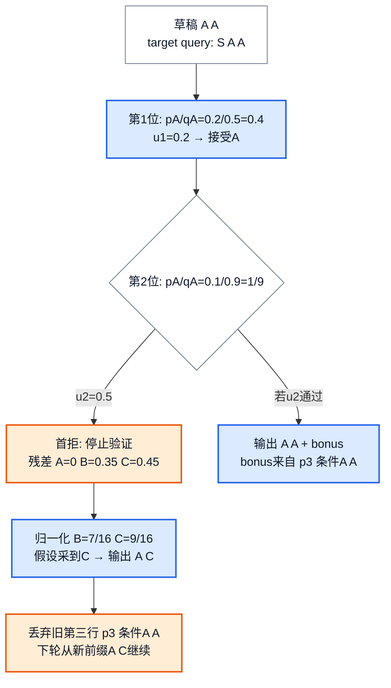
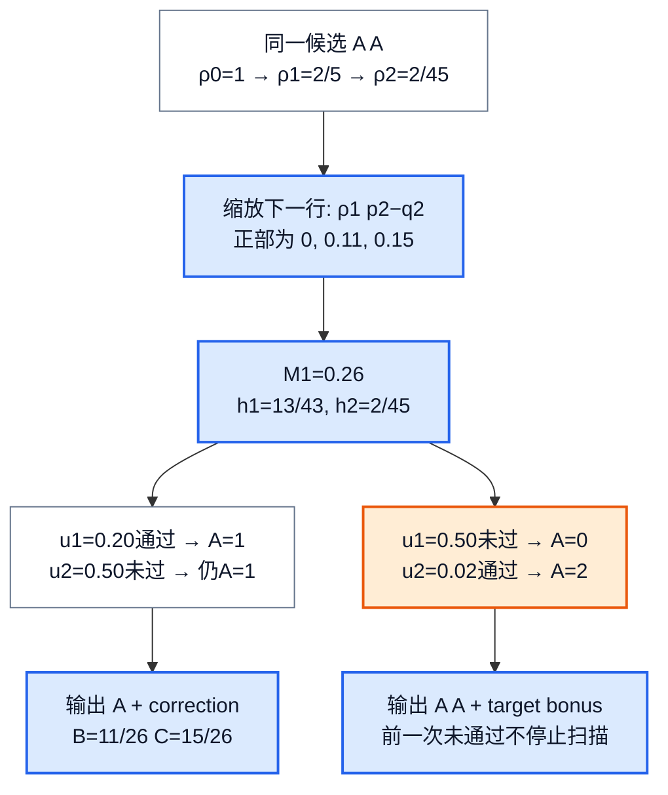
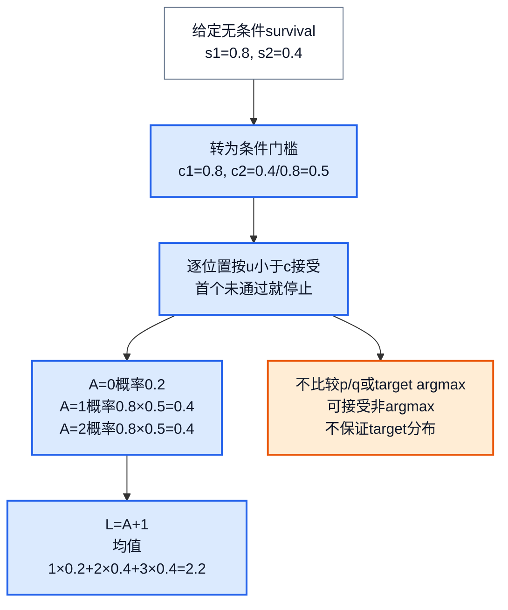
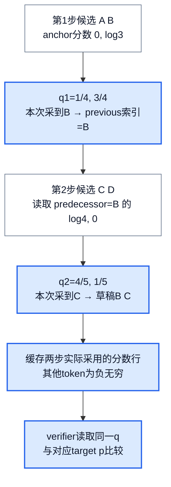
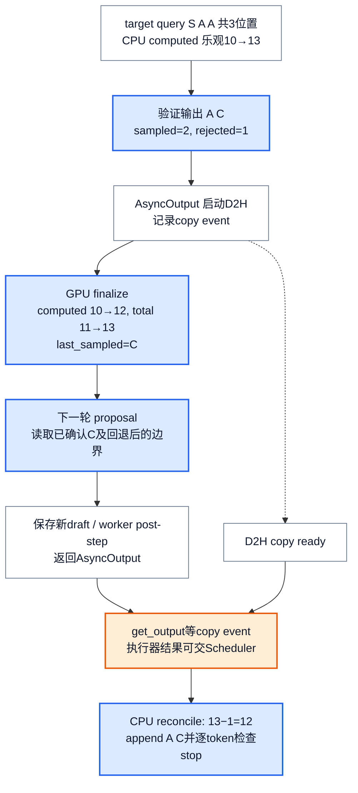
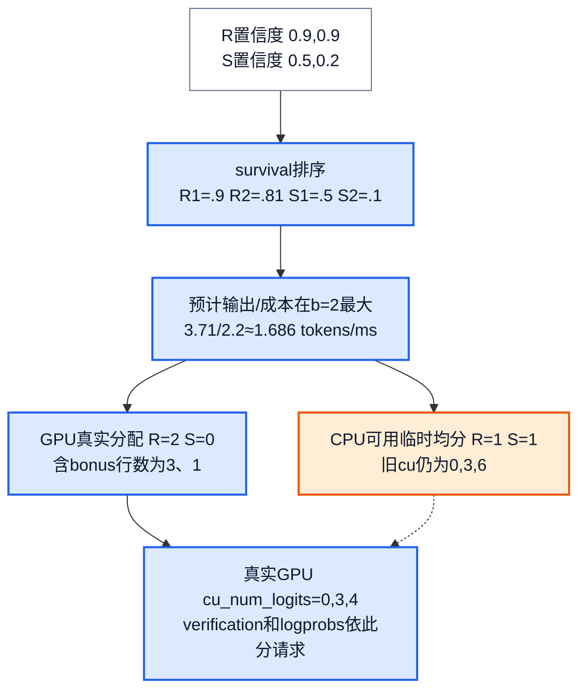

# vLLM 投机解码：怎样验证一串草稿，又只提交正确前缀

> **源码基线**：`vllm-project/vllm@199cb9b964822e59ab9b58d88e7be31eb419a2ae`（`main`，2026-09-07）
> **主题**：从三词表、两步候选推导 standard/block verification 与 correction/bonus，再追踪候选分布、target 打分、GPU 前缀更新和 CPU 结算，解释接受更多 token 何时能省时间。
> **适用范围**：自回归 propose → score → verify → rollback/commit、候选来源的执行接缝与成本；普通采样参数/grammar 归18，通用 KV block 生命周期归12。区分 V1/V2、精确校正与 synthetic 模拟，不把共享 spec 字段的其他任务当作同一算法。
> **最近更新**：2026-09-08。补 block 的阈值与残差演算、实际 proposer/Runner 覆盖、整请求分块及 adaptive GPU 边界。

## 1. 多算几个位置，为什么可能更快

普通 decode 每轮只能得到一个新的、可继续推理的 token。投机解码先让便宜的 proposer 猜出若干 token，再用一次较宽的 target forward 同时评价这些位置；目标是减少生成同样多 token 所需的**串行轮数**，并不是让 target 完全不计算那些位置。

设上轮已经采到 token S，但还没计算 S 的 KV；proposer 从含 S 的前缀猜出两个 token `x1,x2`。target 本轮输入 `S,x1,x2`，在三个位置分别给出分布：`p1` 判断 x1，`p2(·|x1)` 判断 x2，`p3(·|x1,x2)` 提供 bonus。如果只认可 x1，就输出 `x1,correction`，丢弃 x2 分支；如果两者都认可，就输出 `x1,x2,bonus`。这里的“丢弃”首先指不提交那条逻辑分支，物理 KV 回收另有时序。

下文用词表 `A,B,C` 和两行**教学概率**。为便于逐项复算，第二行设为不随第一 token 改变；真实模型必须使用草稿前缀条件下的 p、q。p 是本请求受支持的采样约束处理后的 target 分布，q 是 proposer **实际用来产生候选**的分布。

| 位置 | target p：A、B、C | proposal q：A、B、C | 本轮取到的候选 |
|---|---|---|---|
| 第1位 | `0.20, 0.30, 0.50` | `0.50, 0.25, 0.25` | A |
| 第2位 | `0.10, 0.40, 0.50` | `0.90, 0.05, 0.05` | A |

先把这串 `A,A` 验证清楚，再回看 q 从何而来。若最终接受 A 个草稿，普通自回归轮次在 stop/长度截断前输出 $L=A+1$ 个 token；首拒时的 correction 和全接受后的 bonus 二选一。部分 prefill chunk 尚未完成时例外：不能向用户输出这些采样结果，设备计数会把 `num_sampled` 置0。依据：`vllm/v1/worker/gpu/input_batch.py::_combine_sampled_and_draft_tokens_kernel`、`_get_num_sampled_and_rejected_kernel`、`vllm/v1/worker/gpu/spec_decode/rejection_sampler_utils.py::_insert_resampled_kernel`。

## 2. Standard：少掉的概率质量必须在拒绝时补回来

### 2.1 一行概率的守恒，比“是否猜中”更重要

proposal 按 q 采到 x，standard 以 $\alpha(x)=\min(1,p(x)/q(x))$ 接受；拒绝后从 $r(y)=[p(y)-q(y)]_+/Z$ 采 correction，其中 $[z]_+=\max(z,0)$，$Z=\sum_y[p(y)-q(y)]_+$。

对第1行逐词计算，就能看到为什么不能简单地“拒绝后再从 p 采一次”：

| token | q 提案质量 | 接受概率 α | 被接受而输出的质量 `q×α` | 拒绝后补上的质量 `[p−q]+` | 总输出质量 |
|---|---|---|---|---|---|
| A | 0.50 | 0.40 | 0.20 | 0 | 0.20 |
| B | 0.25 | 1 | 0.25 | 0.05 | 0.30 |
| C | 0.25 | 1 | 0.25 | 0.25 | 0.50 |

总拒绝概率是0.30；correction 在 B/C 间按 `1/6,5/6` 采样。因此对任意 y，$\min(p(y),q(y))+[p(y)-q(y)]_+=p(y)$。如果拒绝时重新采 p，A 会在原有0.20之外又得到 `0.30×0.20=0.06`，立刻产生偏差。这个逐位置守恒在前面候选已被接受的条件下继续成立，才得到目标自回归分布。

### 2.2 两步候选遇到首拒，后面的 target 行不再可用

对 `A,A` 取均匀随机数 `u1=0.20,u2=0.50`。第1位 A 的阈值0.40，接受；第2位 A 的阈值 `0.10/0.90=1/9`，拒绝，验证到此停止。第2行残差为 `0,0.35,0.45`，归一化后 B/C 为 `7/16,9/16`；假定本次 correction 采到 C，输出就是 `A,C`。

目标已经算过的第三行是 `p3(·|A,A)`，不对应现在的前缀 `A,C`，所以本轮不能再把它当 bonus 使用。只有两步全接受，第三行才有正确上下文，直接从中采 bonus。依据：`vllm/v1/worker/gpu/spec_decode/rejection_sampler_utils.py::_rejection_kernel`、`_resample_kernel`。

<!-- 图1 spec：同一AA候选与两行p/q，先比较0.2与0.4，再比较0.5与1/9；展示第二位残差0/.35/.45、归一化7/16和9/16、输出AC及错误上下文第三行被弃用。另给全接受分支到bonus，明确原理而非调用图。 -->

### 2.3 one-hot、greedy target 与数值实现

缺少 full draft logits 时，verifier 将候选视为 one-hot q。若确定性 proposer 总选 A，则第1位接受概率是 p(A)=0.20，拒绝后只删除 A 的 target 质量，B/C 归一化成 `3/8,5/8`；最终仍是 `0.20,0.30,0.50`。这是 n-gram/argmax 等入口采用的校正方式。即使候选来源带随机性，在给定本次候选的条件下按点质量做这套校正、并保持回采随机性独立，仍能得到 p；只是没有利用原提案分布的重叠来提高接受率。例如第1行若候选仍按原 q 抽取，one-hot 校正的平均接受率为 `0.50×0.20+0.25×0.30+0.25×0.50=0.30`，而使用 full q 是0.70。

若 **target** temperature=0，目标策略是 argmax，standard 只接受与 target argmax 相同的连续草稿，首个不同位置直接输出 target argmax。它和“draft 使用 greedy、target 仍随机”是两种情况。默认 `draft_sample_method=greedy` 通常省掉 full q 的持久显存；probabilistic 模式则需要保存实际 q。依据：`vllm/config/speculative.py::SpeculativeConfig.draft_sample_method`、`vllm/v1/worker/gpu/spec_decode/rejection_sampler_utils.py::_rejection_kernel`。

MRV2 在词表块上归约 max/sumexp，再用 `log p(x) > log u + log q(x)` 做 standard 检查。target 已做 temperature，缓存的 draft logits 尚未做，因此读取 q 时还要除 temperature。full q 的 correction 用数值更稳定的 `log r = a + log1p(−exp(b−a))`，仅在 a>b 时保留，其中 a/b 是 target/draft log-prob；词表各块做 Gumbel argmax，再归约到一个 token。V1 则物化 target probabilities，按 `p/q ≥ u` 检查，并预先为各可能拒绝位置做残差/指数竞赛，最后只选首拒位置的结果；它的 bonus 先由普通 Sampler 独立采好。两者算法边际一致不意味着同 seed 逐 token 一致。依据：`vllm/v1/worker/gpu/spec_decode/rejection_sampler_utils.py::_compute_global_logprobs_and_logsumexp`、`_resample_kernel`；`vllm/v1/sample/rejection_sampler.py::RejectionSampler.forward`、`rejection_random_sample_kernel`、`sample_recovered_tokens`、`sample_recovered_tokens_kernel`。

分布保证还有 RNG 前提：proposal 和 residual 不可复用同一噪声向量，否则“某 token 赢得草稿 argmax”已经对其余噪声施加条件，残差采样会偏。MRV2 的 `gumbel_noised_argmax()` 对 drafting 的 position 加 `_DRAFT_NOISE_SALT=1<<30`，使同请求同位置的提案与回采分流。窄词表20万 trial 测试专门覆盖这个问题；不能仅以粗粒度大词表统计不显著来证明无偏。依据：`vllm/v1/worker/gpu/sample/gumbel.py::gumbel_noised_argmax`、`tests/v1/spec_decode/test_rejection_sampler_utils.py::test_gumbel_drafted_rejection_sample_is_unbiased`。

## 3. Block：决定整个前缀长度，而非逐位首拒即停

### 3.1 三个量重新分配“接受哪个前缀”

MRV2 的 `block` verification 仍返回一段连续前缀加一个 correction/bonus，但它**不会因为某次局部 threshold 未通过，就立即结束有效草稿的扫描**。对候选 $x_1,\ldots,x_k$，用与 p 区分的符号 ρ 表示源码 `cumulative_log_p` 所保存的递推比值：

$$
\rho_0=1,\qquad
\rho_i=\min\left(1,\rho_{i-1}\frac{p_i(x_i)}{q_i(x_i)}\right).
$$

对 i<k，再看下一位置分布的残差总质量及阈值：

$$
M_i=\sum_y[\rho_i p_{i+1}(y)-q_{i+1}(y)]_+,\qquad
h_i=\frac{M_i}{M_i+1-\rho_i}.
$$

分母为0时内核取 h=1；最后一个有效候选取 $h_k=\rho_k$。依次比较各位置的独立 u，每当 $u_i\le h_i$ 就把 accepted length 更新为 i，未通过则保留此前的长度。扫描结束的最大成功 i 才是最终 A；若一次都未通过则 A=0。它可能在前面某次未通过之后，仍接受更长的完整前缀；不会输出有洞的候选子集。

A<k 时，correction 改为 $r_A(y)\propto[\rho_Ap_{A+1}(y)-q_{A+1}(y)]_+$；A=0 的 ρ 为1，退化为标准首位置残差。A=k 则直接从 target bonus 行采样。one-hot q 的 $M_i=\rho_i(1-p_{i+1}(x_{i+1}))$；回采只需删掉被拒 token，公共 ρ 因子归一化时消去。依据：`vllm/v1/worker/gpu/spec_decode/rejection_sampler_utils.py::_compute_cumulative_log_p_kernel`、`_compute_local_residual_mass_kernel`、`_compute_global_residual_mass`、`_rejection_kernel`、`_resample_kernel`。

### 3.2 把同一串 A,A 真正算一遍

第1位 `ρ1=0.20/0.50=2/5`；第2位 `ρ2=(2/5)×(0.10/0.90)=2/45`。下一行的缩放残差为 `ρ1×p2−q2=(-0.86,0.11,0.15)`，故 `M1=0.26=13/50`，`h1=0.26/(0.26+0.60)=13/43≈0.3023`；最后 `h2=2/45≈0.0444`。

用原来的 `u1=0.20,u2=0.50`，第1次更新 A=1，第2次不更新，输出第一个 A，再从 `B=11/26,C=15/26` 采 correction。这已经不同于 standard 的 `B=7/16,C=9/16`，不能只替换 acceptance rule 而保留原残差。

再取 `u1=0.50,u2=0.02`：block 第1次未通过，但第2次通过，最终 A=2，输出 `A,A,bonus`；同一组 u 在 standard 中会在第1个 A 就停止。这是 block 延长前缀的机制，不是说它对每一条固定候选、每一次随机数都优于 standard。

<!-- 图2 spec：AA的rho递推与下一行缩放残差导出h1=13/43,h2=2/45；两组u一组得到A1且用11/26与15/26补偿，另一组先失败后成功仍A2。必须把block扫描非首拒停止的差异与残差缩放同时表达。 -->

可以进一步检查本例的概率守恒，而不只看两次随机抽签。给定候选 AA，最终 A=2/1/0 的概率分别为 `2/45`、`(1−2/45)×13/43=13/45`、`2/3`。把所有9种 proposal 链以 `q1(x1)q2(x2)` 加权，对各自的三种 A 使用对应 correction；若只输出一个 token，就让下一轮按 target p2 补到两位。得到下面的完整两-token 联合质量，恰好等于 `p1×p2`：

| 第1个输出 | 第2个为A | 第2个为B | 第2个为C |
|---|---|---|---|
| A | 0.02 | 0.08 | 0.10 |
| B | 0.03 | 0.12 | 0.15 |
| C | 0.05 | 0.20 | 0.25 |

这是本页有限词表的精确枚举，不是一般 block 正确性定理的完整证明，也不把“本轮输出长度至少2”的条件分布偷换成完整生成序列分布。源码测试另外检查固定 p/q 的各 emitted position 边际，并用大量 trial 比较平均 accepted length；这些测试支持实现边界，不证明任意实际 workload 都更快。依据：`tests/v1/spec_decode/test_rejection_sampler_utils.py::test_block_verification_rejection_sample`、`test_block_verification_accepts_at_least_as_many`。

### 3.3 无效草稿与 target greedy 是明确分支

`-1` placeholder 不是词表里的一个 token。standard 遇到它必拒；block 遇到它结束可验证区间，前一个真实 token 改用“最后位置”阈值 ρ，不能再使用 placeholder 那一行的下一步残差。即使 `-1` 后还有看似合法的 token，也不能重新进入验证。回采遇到 placeholder 直接使用 target logits；greedy path 则必须写 target argmax，避免留下未初始化输出槽。依据：`_rejection_kernel`、`_resample_kernel`；`tests/v1/spec_decode/test_rejection_sampler_utils.py::test_block_verification_placeholder_truncates_block`、`test_placeholder_blocks_later_draft_tokens`、`test_greedy_placeholder_emits_target_argmax`。

target greedy 在内核中先于 block 分支选择，执行普通 argmax 前缀匹配；block 与 synthetic rate 张量不可同时传入。另一个实际边界是 **block 算法实现位于 MRV2**。V1 `RejectionSampler.__init__()` 只读取 synthetic 模式，没有 block 分支；本基线配置/Runner 选择也没有因 `rejection_sample_method=block` 就强制 V2 的对应 guard。因此仅看到配置值不能断言当前 V1 请求正在运行 block 算法。依据：`vllm/v1/worker/gpu/spec_decode/rejection_sampler.py::RejectionSampler.__init__`、`vllm/v1/sample/rejection_sampler.py::RejectionSampler.__init__`、`vllm/config/vllm.py::VllmConfig._get_v2_model_runner_unsupported_features`。

## 4. Synthetic：设定接受经济性，不再做 p/q 校正

synthetic 接受条件改成 `u_i < c_i`。用户给的是无条件 survival `s_i=Pr(A≥i)`，内部换成 `c1=s1`、`ci=si/s(i−1)`；若分母已为0，后续条件率置0。本例若设置 `s=[0.8,0.4]`，实际逐步门槛为 `[0.8,0.5]`，而不是把 `[0.8,0.4]` 再连乘成0.32；对应 A=0/1/2 概率 `0.2,0.4,0.4`，平均输出长度 `1+0.8+0.4=2.2`。依据：`vllm/v1/spec_decode/utils.py::unconditional_to_conditional_rates`、两条 Runner 的 rejection kernel。

<!-- 图3 spec：synthetic独立于p/q，给s=.8/.4先转c=.8/.5，再按首个未通过停止得A0/1/2概率.2/.4/.4和L=A+1平均2.2；旁支明示target greedy也可接受非argmax，因此不能提供target分布保证。拓扑数值变换图，不是物理布局。 -->

当前配置也可直接给 `synthetic_acceptance_length`，它与 rates 二选一。比如 k=3、目标平均长度2.6，内部生成无条件 rates `[1,0.6,0]`，使输出长度仅在2和3之间变化；这不是旧文档用语所暗示的普遍“指数衰减接受率”。配置验证 rates 的长度、[0,1]范围和单调不增，以及 length 在 `[1,k+1]`。依据：`vllm/config/speculative.py::SpeculativeConfig._acceptance_length_to_rates`、`_resolve_synthetic_acceptance_rates`、`_verify_args`。

synthetic 仍复用相同的输出/回采骨架，却已失去 §2 的 `q×α=min(p,q)` 条件；即使 target greedy 也能按给定 rate 接受一个不等于 target argmax 的 draft。它用于受控接受长度实验，不能声称生成分布仍等于 target。相关测试的 oracle 是实际 per-position survival 接近配置，和 standard/block 的分布检验不同。依据：`tests/v1/spec_decode/test_rejection_sampler_utils.py::test_synthetic_rejection_sample`、`tests/v1/spec_decode/test_synthetic_rejection_sampler_utils.py::test_acceptance_length_to_rates`。

## 5. q 从哪里来：共同出口不意味着共同提案算法

### 5.1 实际可走的方法与 Runner

配置中的方法集合覆盖独立 draft model、EAGLE/MTP 家族、n-gram、suffix、Medusa、DFlash/DSpark 及 custom class 等。它们在词表、draft TP、KV dtype、attention backend、额外 slot 和采样模式上有各自约束；不能从共用字段推断所有方法在两个 Runner 都实现。

| 路径 | 当前候选来源及有界接缝 | q 的含义 |
|---|---|---|
| MRV2 EAGLE/EAGLE3/MTP | autoregressive speculator 先处理已确认的 target token/hidden，再逐步用上一个 draft 生成下一个；EAGLE3 合并辅助 hidden，Gemma4/多模块 MTP 有专门状态 | probabilistic 时缓存各步实际分布；greedy 时 one-hot |
| MRV2 DFlash | 一次 masked draft forward 产生多位置 hidden，再对各位置采样 | 来自这次并行 hidden 的实际采样 logits；不是额外运行 target |
| MRV2 DSpark、DFlash2 | backbone 可并行，候选采样仍有顺序依赖，见下节 | 必须保存经过 Markov/selector 修正的条件分布 |
| V1 n-gram / ngram_gpu / suffix | 从已生成上下文匹配可延续 token；suffix 用外部 cache 的模式与频率门槛决定可变长度 | 这些入口返回 token IDs，不提供 full q |
| V1 draft_model、Medusa、custom_class 等 | 独立 draft 模型运行；Medusa 从 target hidden 经多个 head 各取 argmax；custom 接口交回候选 | 提供完整 q 才走 full-distribution 校正；只给候选则按 §2.3 的点质量处理 |

V2 当前列出的 spec 方法是 eagle/eagle3/mtp/dflash/dspark/extract_hidden_states；ngram/ngram_gpu、draft_model、suffix、Medusa/custom 等自动选择会落回 V1。parallel EAGLE 也未在 V2 实现；DFlash/DSpark 原生支持自己的并行 drafting。反过来，DSpark/adaptive、DFlash2 和需要多 KV group 的混合 sliding/full DFlash 会阻止 V1。显式 Runner 配置还需通过相应 validation。依据：`vllm/config/vllm.py::VllmConfig._get_v2_model_runner_unsupported_features`、`_get_v1_model_runner_unsupported_features`、`vllm/v1/worker/gpu/spec_decode/__init__.py::init_speculator`、`vllm/v1/worker/gpu_model_runner.py::GPUModelRunner.__init__`。

n-gram 的一个最小例子是历史 `A B C A B`，以末尾 `A B` 查到早先同样的串，接上它后面的 token C。CPU 实现用反转序列和 LPS 匹配寻找允许长度内的最长 suffix；相同长度取原序列较早匹配，并截到 k/模型最大长度。suffix 入口则把新输出写入请求 cache，取最近 max_tree_depth 个 token 作 pattern，按 max_spec_factor/min_token_prob 请求延续；其外部树算法不在本地实现里，不能编造内部选择过程。依据：`vllm/v1/spec_decode/ngram_proposer.py::_find_longest_matched_ngram_and_propose_tokens`、`vllm/v1/spec_decode/suffix_decoding.py::SuffixDecodingProposer.propose`。

### 5.2 并行 hidden 之后，候选仍可能逐步依赖前项

MRV2 `AutoRegressiveSpeculator` 的常规多步循环在每步更新 draft token、hidden、position 与 slot mapping，再生成下一步；为避免 CPU 等 rejected count，它可保留与 target 相同的 padded shape，但以真实 accepted/rejected 数决定有效起点。`DraftModelSpeculator.sample_draft()` 的概率模式缓存 **pre-temperature logits**，draft 侧通常只用 temperature、不应用 target 的 top-k/top-p 等约束；只要保存的是实际 q，q≠p 不影响标准校正，主要影响接受率。依据：`vllm/v1/worker/gpu/spec_decode/autoregressive/speculator.py::AutoRegressiveSpeculator.propose`、`_multi_step_decode`、`_generate_draft`、`vllm/v1/worker/gpu/spec_decode/speculator.py::DraftModelSpeculator.sample_draft`、`_copy_request_inputs`。

DSpark 的 `_sample_sequential()` 先取得所有位置的 base logits，然后以 anchor token 开始，每步加上由上一个已采 draft 的 Markov embedding 产生的 bias，再采样并更新 prev。教学例：某步 B/C base 分数都是0，而 prev=A 时 bias 为 `(0,log 3)`，temperature=1 下实际 q 是 `(1/4,3/4)`，不是 base 的 `(1/2,1/2)`。top-k 变体先选 base 候选，再只修正这些候选、把其余项设为负无穷；rejection 必须使用截断后的 q。缩小 draft vocab 时，概率模式还会将 logits scatter 回 target token ID 空间。依据：`vllm/v1/worker/gpu/spec_decode/dspark/speculator.py::DSparkSpeculator._sample_sequential`、`_sample_sequential_topk`、`_sample_logits`。

DFlash2 则先为每步选 K 个候选，selector 给出“前一候选索引→当前候选”的分数。walk 从 anchor 行开始，采到哪个候选，就用其索引选择下一步的分数行；它不是独立按每列最大分挑 token，也不是在这里穷举后做全局最优路径搜索。用两步各两个候选的教学值即可重放：第一步候选 A/B，anchor 分数 `(0,log 3)`，q 为 `(1/4,3/4)`；本次采到 B，第二步 C/D 必须取 predecessor=B 那行 `(log 4,0)`，q 为 `(4/5,1/5)`。若误用 predecessor=A 那行，便验证了另一个 proposal。

<!-- 图4 spec：DFlash2两步候选链，以anchor对A/B的0/log3分数采到B，再按索引B读取第二步C/D的log4/0行；展示实际q与cache只写realized row，未选词负无穷，接verifier的p/q。独立于网络内部的候选路径算法。 -->

概率 DFlash2 把 walk 实际读取的分数行存成 FP32 draft logits，先清掉旧候选位置，再写新候选；未选词保持负无穷。这里用 FP32 是为了避免 selector walk 与低精度缓存对应的 q 不一致；greedy 模式则不分配这份概率缓存。上述 DSpark/DFlash2 例子说明 exact 校正依赖的是**实现所产生的条件 q**，不依赖某个 proposer 名称听起来是否“并行”。依据：`vllm/v1/worker/gpu/spec_decode/dflash2/speculator.py::_selector_walk_kernel`、`_cache_draft_logits_kernel`、`DFlash2Speculator._generate_draft`、`draft_logits_spec`。

V1 还要按当前 request IDs 重排上轮缓存的 draft probabilities，再截到本步各请求实际草稿数；若找不到某请求的概率行，当前实现会告警并返回 None，进入旧的无 full-q 行为。这个 fallback 改成 §2.3 的点质量校正，不能继续按原 full-q 接受率分析；补偿分布也必须跟着所选分支变化。custom proposer 也被配置明确标为 experimental，构造接口可能变化。依据：`vllm/v1/worker/gpu_model_runner.py::GPUModelRunner._get_spec_decode_draft_probs`、`vllm/config/speculative.py::SpeculativeConfig.__post_init__`。

`extract_hidden_states` 虽走 spec 接口，主要用途是缓存 target 辅助 hidden，并从所选请求的 last_sampled 取一列作为 draft 输出；MRV2 要求 k=1、greedy draft、指定辅助层且使用 padded batch。diffusion 也可复用 draft 字段，但没有自回归 bonus。它们不能因为字段相同就套用本页 A+1 的加速或 p/q 正确性推导。依据：`vllm/v1/worker/gpu/spec_decode/extract_hidden_states.py::ExtractHiddenStatesSpeculator`、`vllm/v1/core/sched/async_scheduler.py::AsyncScheduler._update_after_schedule`。

## 6. Target 分布、执行位置与有效前缀必须一致

Scheduler 从 `num_tokens_with_spec` 与 output placeholders 计算应追赶的长度，受 token/input/model-length budget 限制，再为 target query 与 drafter lookahead 申请 KV slots。被实际选入的候选写进 `scheduled_spec_decode_tokens`，原 request 上的旧 `spec_token_ids` 清空，不能重复消费。词表行数则由本步实际候选数加 bonus 数确定；MRV2 的 cumulative logits offsets 和 `expanded_idx_mapping/local_pos` 把每行对应到正确 request 与候选位置。V1 的 `SpecDecodeMetadata` 分开列出 draft/target/bonus indices。依据：`vllm/v1/core/sched/scheduler.py::Scheduler.schedule`、`vllm/v1/worker/gpu/input_batch.py::combine_sampled_and_draft_tokens`、`vllm/v1/spec_decode/metadata.py::SpecDecodeMetadata`。

p_i 还必须包含假设前面 draft 已成立时的重复惩罚、bad-word 等上下文。V1 显式构造 `outputs`、`outputs+x1` 等逐位置历史；MRV2 将 draft IDs 和 expanded local position 传给普通 sampler 的参数处理。grammar mask 先应用到 target logits，再选普通/rejection sampler。不能拿 raw softmax p 去证明另一套经过约束的目标策略；也不能据共享 sampler 推断所有参数都支持投机，当前请求验证会拒绝 spec 配置下的 min_p/logit_bias 等不支持组合。依据：`vllm/v1/sample/rejection_sampler.py::RejectionSampler._combine_outputs_with_spec_tokens`、`apply_logits_processors`、`apply_sampling_constraints`；`vllm/v1/worker/gpu/model_runner.py::GPUModelRunner.sample`、`vllm/v1/worker/gpu/spec_decode/rejection_sampler.py::RejectionSampler._verify`；`vllm/sampling_params.py::SamplingParams._validate_spec_decode`。

grammar preview 不永久 advance。同步更新可以先截掉不合法草稿；已有 scheduled placeholder 长度的路径则保留可用前缀，用 `-1` 填齐剩余位置，verifier 按 §3.3 处理，统计也区分 grammar-invalidated drafts。部分 prefill 还未结束时，Scheduler 忽略并清空新草稿；多模块 MTP 的 `_reserve_prefill_lookahead()` 要么让 chunk 完成 prefill，要么为下一块留足已知 token，避免 trailing module 用猜测污染自己的 KV。依据：`vllm/v1/core/sched/scheduler.py::Scheduler.update_draft_token_ids`、`update_draft_token_ids_in_output`、`_reserve_prefill_lookahead`；`tests/v1/core/test_scheduler.py::test_no_spec_tokens_scheduled_for_prefill_chunks`。

独立 draft model 默认校验 target/draft vocab size 相等；heterogeneous vocab 仅允许 draft_model+greedy draft，并需对应 ID 映射，不能只关闭检查就把两个 tokenizer 的 ID 当成相同语义。MRV2 full-logit verifier 对已知 padding 差异取 target/draft 词表宽度的较小值，这是 padding 接缝，不是任意异构词表转换。依据：`vllm/config/speculative.py::SpeculativeConfig._verify_args`、`verify_equal_vocab_size_if_draft_model`、`vllm/v1/worker/gpu/spec_decode/rejection_sampler_utils.py::rejection_sample`。

## 7. 已经写过 KV，为什么还要两处结算

### 7.1 用具体长度看 device rollback

回到输出 `A,C` 的例子。轮前 `num_computed_tokens=10`，已确认 token 总长11，最后的 S 位于 index10且尚未计算 KV。target 执行3个 query：S@10、A@11、草稿 A@12；verifier 接受1个 draft、拒绝1个，返回2个 token `A,C`。

MRV2 `_post_update_kernel()` 把 A、C 写入历史 index11、12，total_len 从11变13，last_sampled=C；computed 增量为 `query_len−num_rejected=3−1=2`，所以从10变12。**已确认 token 总长13，但可用 KV 前缀长度12**：C@12 已成为逻辑输出，尚未有正确 KV；旧 A@12 的物理数据可暂存，下一轮从边界12用 C 重写。仅把输出数组改成 A,C 而不调整 computed 边界，会让后续 attention 继续读取错误分支。依据：`vllm/v1/worker/gpu/input_batch.py::_post_update_kernel`；物理位置可留待覆盖是根据逻辑长度消费者作出的分析推断，不等同于立即释放每个 block。

### 7.2 GPU finalize → 下一轮 proposal → worker/copy 合流 → CPU 结算

last PP rank 在 sample 后先创建 `AsyncOutput`，启动 D2H 并记录 copy event；这只是传输启动。随后 `postprocess_sampled()` 更新 device 前缀，再调用下一轮 `speculator.propose()`，让它立即消费新的 last token、num_sampled 与 num_rejected。最后保存新 draft、处理 post-step connector 输出并返回 async_output。CPU 无须先确认本轮输出，proposer 就能用本地已验证前缀继续。

<!-- 图5 spec：明确三种长度与真正顺序。sample输出AC后copy launch分支可与GPUfinalize重叠；主支GPU computed10→12,total11→13→proposal用C→worker完成；copy ready与worker完成合流后Scheduler才把乐观13减1到12并append输出。拓扑依赖图，不是比例时间栅格。 -->

worker 主分支和 copy-ready 支线必须在 Scheduler 消费前合流。`AsyncOutput.get_output()` 等 event 后按 num_sampled 截断有效输出；单进程执行器会物化或包装 async output，多进程 WorkerProc 通过 output queue 等完成后送响应；EngineCore 取执行器结果后才调用 `Scheduler.update_from_output()`。因此不能把“copy 已开始”画成 commit，也不能把下一轮 proposer 放到 CPU output commit 之后。依据：`vllm/v1/worker/gpu/model_runner.py::GPUModelRunner.sample_tokens`、`vllm/v1/worker/gpu/async_utils.py::AsyncOutput.get_output`、`vllm/v1/executor/uniproc_executor.py::UniProcExecutor.collective_rpc`、`vllm/v1/executor/multiproc_executor.py::WorkerProc.enqueue_output`、`vllm/v1/engine/core.py::EngineCore.step`。

Scheduler 在 schedule 结束时已把3加到 computed，并记录 in-flight tokens；回传后以“scheduled drafts−accepted drafts”得 rejected=1，把 CPU computed 从13减为12，async 还修正 output placeholders。之后逐个 append A/C、检查 stop/长度，并裁掉 stop 后尚未对外提交的 token。两处提交各有消费者：GPU finalize 服务下一 proposal/设备执行，CPU 结算服务请求历史、后续调度及用户输出。依据：`vllm/v1/core/sched/scheduler.py::Scheduler._update_after_schedule`、`update_from_output`、`_update_request_with_output`。

### 7.3 V1、抢占和在途结果的边界

V1 不能直接套用图5全部函数顺序：padded GPU drafter 可以直接使用 GPU sampled tensor，在 CPU bookkeeping 完成前 propose；CPU n-gram/suffix 等要等 `_bookkeeping_sync()` 得到有效 token list 后才 propose。输入不适配 drafter 时清掉旧候选，避免下一轮误用；带模型 collectives 的 DP 路径还需 dummy run 保持各 rank 一致。共同要求是只把验证后有效 token 作为新上下文，compact row 与状态发布细节接15。依据：`vllm/v1/worker/gpu_model_runner.py::GPUModelRunner.sample_tokens`、`propose_draft_token_ids`。

抢占释放请求 blocks、重置 computed、清空未验证草稿，但普通 async 在途结果默认仍按序交付，只禁止 stale rejection 修改已重置 counters。新基线还存在明确的 drop-stale 模式，用于 reset-prefix 同步恢复及需要有效 KV 交付的 connector 情形，不能概括成“stale 总丢”或“stale 永不丢”。多模态 E 也要等 confirmed progress（computed 减 output placeholders）再加上 drafter lookahead 确认越过 span 才释放，免得拒绝回退后 gather 读到已逐出的图片。依据：`vllm/v1/core/sched/scheduler.py::Scheduler._preempt_request`、`_free_encoder_inputs`、`vllm/v1/core/sched/async_scheduler.py::AsyncScheduler._update_request_with_output`；`tests/v1/core/test_scheduler.py::test_free_encoder_inputs_respects_unconfirmed_placeholders`。

## 8. k 的收益来自前缀存活，也受宽 query 与显存限制

### 8.1 break-even 必须按每轮实际提交量计算

以下是**分析推断的成本模型**，不是某型号 GPU 的测量：

$$
\mathbb{E}[L]=1+\sum_{i=1}^k\Pr(A\ge i),\qquad
\frac{T_{\mathrm{cycle}}(k,B)}{\mathbb{E}[L]}<T_{\mathrm{target}}(1,B).
$$

cycle 包含关键路径上的 proposal、宽 target score、verification 和 state 成本；存在 proposal/D2H overlap 时，应计重叠后的实测路径，不机械相加。若 survival 为 `[0.8,0.4]`，平均 L=2.2；教学时间中普通单 token 为10ms，投机 cycle 为18ms，则每 token 约8.18ms；cycle 若变25ms，即使接受率相同也要11.36ms，反而更慢。深位置只有在前面全部存活时贡献收益，单看总 accepted/drafted 会掩盖这一点。

| 成本或观察量 | 影响收益的原因 |
|---|---|
| per-position survival / accepted count | 决定多付第 i 个 target 行能换来多少期望输出 |
| drafter 关键路径时间、其自有 KV | 参数小不保证廉价；自回归草稿仍可能串行，collective/graph 也有成本 |
| target 随 query 宽度、batch、graph bucket 的时间 | 扩宽不免费；跨 bucket/piecewise/eager 边界会跳变 |
| verifier/FP32 buffer/词表带宽 | standard 需要归约和回采，block 还需累积比值及下一行 residual mass |
| KV 与 input budget | lookahead 和宽 query 可能挤出其他请求，单请求 TPOT 好不等于吞吐更好 |

额外 drafting slots 也不能统称 k：配置表中普通 EAGLE3/MTP/n-gram 为0，独立 draft model 为1，parallel EAGLE/DSpark 为 k−1，DFlash 与 parallel draft_model 为 k。这些是 Scheduler 已计入每 decode 请求一个 query slot 之外的额外预留。依据：`vllm/config/speculative.py::SpeculativeConfig.max_num_new_slots_for_drafting`、`vllm/v1/core/sched/scheduler.py::Scheduler.schedule`。

### 8.2 1 GiB 是 FP32 分块目标，不是每次验证显存硬上限

MRV2 参数处理会物化 FP32 target logits，`MAX_CHUNK_BYTES=2**30` 给出目标行数 `max(1, floor(2**30/(4×V)))`；例如词表65536时为4096行。`_iter_request_chunks()` 按整个请求打包，不能拆开一个请求的候选/bonus 行。测试中的 cumulative offsets `[0,3,4,11,13]`、目标5行，会得到请求区间 `[0,2)`、`[2,3)`、`[3,4)`，实际分别4、7、2行；单个7行请求会超过目标，而不是被截成5+2。

每 chunk 重建局部 cumulative offsets，target 行及 expanded mapping 随之切片；draft logits 按持久 request-state index 访问，仍保持全局。输出和 logprobs 最后按请求顺序合并。这只减少参数处理临时 buffer 峰值，不限制原始 logits、持久 q 或全部辅助 buffer 的总内存。TODO 提议把 sampling 参数应用融入 rejection kernel，消掉这份临时 buffer 和流量；当前尚未完成。依据：`vllm/v1/worker/gpu/spec_decode/rejection_sampler.py::get_max_chunk_logits`、`_iter_request_chunks`、`RejectionSampler._verify_in_chunks`；`tests/v1/worker/test_gpu_rejection_sampler_chunking.py::test_iter_request_chunks_preserves_request_boundaries`。

### 8.3 静态 batch-size 表与 DSpark adaptive 是两类控制

静态 policy 用配置的 inclusive batch-size 区间选择 k，Scheduler 按本步 scheduled request 数查表；它不观察当前请求难度。DSpark adaptive 则用 confidence 估计每个草稿位置的 survival，按预计输出/成本选**全 batch draft 总预算**，再决定分给哪些请求。它只是 confidence/cost 估计，不替代真正的 verification。

用两个均可提2步的教学请求 R/S：R 的置信度 `(0.9,0.9)` 得 survival `(0.9,0.81)`，S 的 `(0.5,0.2)` 得 `(0.5,0.1)`。从高到低取槽位依次为 R1、R2、S1、S2。假设 b=0…4 的总周期成本为 `2.0,2.1,2.2,3.5,4.0` ms，预计总输出为 `2,2.9,3.71,4.21,4.31`，输出/ms 约 `1,1.381,1.686,1.203,1.078`，故选 b=2，全给 R。比值最高不等于把所有高置信度槽都保留。

<!-- 图6 spec：两个请求置信度cumprod得到四个survival，成本表使总预算选2；GPU将两槽都分给R而CPU临时可均分1/1，实际cu必须用GPU0/3/4而非原CPU0/3/6。展示算法选择及边界影响，不绘制二维batch布局。 -->

实现分两步：CPU `get_num_tokens()` 用异步回传的 stale confidences 选预算，GPU `_assign_draft_token_budget()` 用设备上最新 confidence 的 cumprod 为合法 slots 排序，给出每请求 admitted count。survival 随深度不增；代码最终使用 count 作为各请求前缀长度，不把稀疏获胜槽直接当候选序列。cost table 在已捕获 graph 范围内按向上 padding 的阶梯函数计价，超过 capture limit 后才在相应 profile 点间平滑，不能把跨 eager 边界的成本跳变抹掉。依据：`vllm/v1/worker/gpu/spec_decode/adaptive_verification.py::AdaptiveVerificationManager.get_num_tokens`、`reallocate_drafts`、`_assign_draft_token_budget`、`build_cost_tables_from_curves`。

CPU `compact_batch()` 可以用均分 placeholder 保持总 token 数，真实每请求边界只在 GPU 重算；本例旧 CPU cu 为 `[0,3,6]`，真实 GPU cu 为 `[0,3,4]`，不可用旧表切片 compacted logits。adaptive 预算因此受单 verification chunk 的行数约束；返回 expanded logprobs 时也 clone GPU cu，而非把旧 NumPy offsets 转列表。零预算时 CPU 能重新构造每请求 bonus 行边界，并走无草稿采样路径。依据：`AdaptiveVerificationManager.compact_batch`、`reallocate_drafts`、`vllm/v1/worker/gpu/spec_decode/rejection_sampler.py::RejectionSampler._verify_in_chunks`、`_get_logprobs_tensors`。

这个控制器目前限 DSpark/MRV2；LoRA、PP、完全 eager 被配置拒绝，还要求 target attention backend 支持 GPU query-length 变化和相应 varlen graph 能力。profile 无有效 cost curve 会报错，不能假设系统总能“自动找到最佳 k”。把它推广给其他 proposer，需要可校准 confidence 与成本数据；这是根据当前 guard 和输入要求得出的分析方向，不是项目承诺。依据：`vllm/config/speculative.py::SpeculativeConfig.__post_init__`、`vllm/config/vllm.py::VllmConfig._validate_adaptive_verification`、`vllm/v1/worker/gpu/spec_decode/adaptive_verification.py::maybe_create_adaptive_verification_manager`、`AdaptiveVerificationManager.set_cost_curves`。

## 9. 阅读和验证时分别问什么

1. **算法是否补足目标质量**：先读 `vllm/v1/worker/gpu/spec_decode/rejection_sampler_utils.py::_rejection_kernel`、`_resample_kernel`，用 §2/§3 的概率表复算；block 再补 cumulative ratio/residual mass 两个 kernel。V1 对照 `vllm/v1/sample/rejection_sampler.py::rejection_sample`，不要被类 docstring 中旧的“spec 不支持 top-k/top-p”用语误导，实际 `apply_sampling_constraints()` 已应用这两项。
2. **校正的 q 是否就是实际 q**：读 `vllm/v1/worker/gpu/spec_decode/speculator.py::DraftModelSpeculator.sample_draft`，再按方法看 DSpark/DFlash2 的最终 logits 缓存及 V1 request重排；检验 token ID、temperature、position 和 RNG 分流。
3. **下一个消费者看到哪个前缀**：联读 `vllm/v1/worker/gpu/model_runner.py::GPUModelRunner.sample_tokens`、`vllm/v1/worker/gpu/input_batch.py::_post_update_kernel`、`vllm/v1/worker/gpu/async_utils.py::AsyncOutput.get_output` 与 `vllm/v1/core/sched/scheduler.py::Scheduler.update_from_output`，核对图5的12/13差别。
4. **节省是否覆盖额外开销**：读 `vllm/v1/worker/gpu/spec_decode/rejection_sampler.py::RejectionSampler._verify_in_chunks` 与 `vllm/v1/worker/gpu/spec_decode/adaptive_verification.py::AdaptiveVerificationManager`，同时观察 survival、proposal/target/verifier 时间、graph bucket 和 KV 压力。

已读 tests 分别提供不同 oracle：`tests/v1/spec_decode/test_rejection_sampler_utils.py` 的 stochastic/greedy/block/synthetic/placeholder/noise 用例；`tests/v1/spec_decode/test_dflash2.py::test_selector_edges_match_sequential_reference`、`test_selector_asks_for_fp32_proposal_logits`；`tests/v1/worker/test_gpu_rejection_sampler_chunking.py::test_chunked_scores_match_full_batch`；`tests/v1/spec_decode/test_adaptive_verification.py::test_budget_stops_where_marginal_drafts_stop_paying_for_themselves`、`test_budget_caps_at_one_rejection_sampler_chunk`、`test_zero_budget_rebuilds_cpu_cu_num_logits`。本页用标准算术复算数值并枚举教学 block 分布，未运行 GPU/模型/外部 suffix 依赖或性能 benchmark；测试描述不代表本机实跑结论。

## Related Pages

- [[02_engineering/03_infer_frameworks/vllm/18_vllm_sampling_structured_output_analysis|vLLM 采样与结构化输出]] — 定义 p 的普通采样约束，以及 grammar preview、mask 与实际输出 advance。
- [[02_engineering/03_infer_frameworks/vllm/11_vllm_scheduler_analysis|vLLM Scheduler]] — 展开 token/input budget、抢占和异步在途请求；本页提供候选与拒绝结算规则。
- [[02_engineering/03_infer_frameworks/vllm/12_vllm_kv_cache_management_analysis|vLLM KV Cache 管理]] — 接续逻辑边界之外的物理 block 分配、引用、复用及释放。
- [[02_engineering/03_infer_frameworks/vllm/15_vllm_model_runner_v1_analysis|Model Runner V1]] — 说明 compact batch、CPU/GPU proposer 时序与验证结果发布。
- [[02_engineering/03_infer_frameworks/vllm/16_vllm_model_runner_v2_analysis|Model Runner V2]] — 说明 stable row、GPU finalize、PP 与输出拷贝的设备执行接缝。
- [[02_engineering/03_infer_frameworks/vllm/23_vllm_compilation_cudagraph_analysis|vLLM 编译与 CUDA Graph]] — 接续 draft/target 宽度与 graph bucket、piecewise/eager 的成本跳变。
- [[02_engineering/03_infer_frameworks/vllm/27_vllm_observability_reliability_analysis|vLLM 可观测性与可靠性]] — 把接受长度、各阶段时间与 KV 压力接到诊断信号，避免只用单一接受率判断收益。
