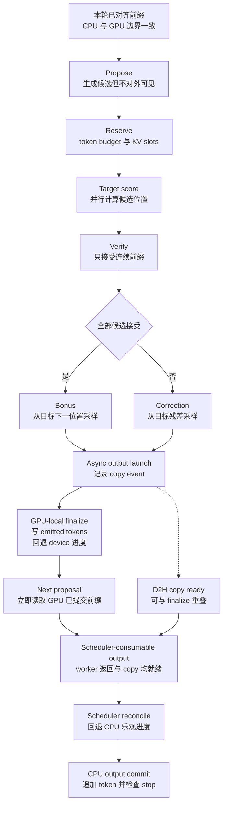

# vLLM 投机解码：让候选、验证与状态提交组成一笔事务

> **读者问题**：什么时候多付一次 drafter 与多位置验证的成本，反而比目标模型逐 token 串行 decode 更便宜；vLLM 又怎样保证草稿被拒绝时，输出分布仍等于目标分布，逻辑 token 与 KV 边界也没有被未确认候选推进？
> **源码基线**：`vllm-project/vllm@6b110badbb22d3f66c7218b71138f13b7a6b3419`（`main`，提交时间 2026-08-29T02:40:53Z）
> **中心命题**：投机解码不是“相信小模型”，而是把一次串行 next-token 决策改成一笔四阶段事务：proposer 只交候选，Scheduler 为 target score 预留 token/KV 位置，verifier 只接受连续前缀并在首个拒绝点补偿采样；验证结果随后跨过两个有先后关系的提交面——MRV2 先就地提交 GPU token/device progress，下一轮 proposer 立即读取它，Scheduler 再根据返回输出回退 CPU 乐观进度并提交请求/output history。速度收益来自“每轮提交 token 的期望数”超过 drafter、宽 target forward、verification 与状态维护的临界路径成本；分布与 KV 正确性则来自候选状态和这两份已提交状态从不混为一谈。
> **所有权边界**：本页拥有 propose → target score → accept/reject → rollback/commit 合同、标准与 block verification 的分布正确性、draft/target/KV 成本模型及 break-even 条件；不拥有普通 logits processor、temperature、top-k/top-p、grammar FSM 的完整机制，也不拥有通用 KV block 生命周期。一般采样由 [[02_engineering/03_infer_frameworks/vllm/17_vllm_sampling_structured_output_analysis|vLLM 采样与结构化输出]] 解释，逻辑/物理 block 所有权由 [[02_engineering/03_infer_frameworks/vllm/12_vllm_kv_cache_management_analysis|vLLM KV Cache 管理]] 解释。
> **最近更新**：2026-08-30。按 `6b110bad` 重建 propose/score/verify/commit 主线，补齐分布证明、双侧 KV 回滚与经济临界点。

## 1. 背景：省掉的不是 target forward 次数，而是串行轮数

普通自回归 decode 每次只能把一个新 token 变成下一轮可用前缀。投机解码先产生最多 $k$ 个候选，再让目标模型用一条宽 query 同时给这些候选位置和一个 bonus 位置打分；MRV2 的 input kernel 把“上轮最后采样 token + draft tokens”写入 target query，并为每个位置建立 logits index（`vllm/v1/worker/gpu/input_batch.py:406-446`）。当本轮接收 $A$ 个 draft 时，通常可提交 $L=A+1$ 个 token：accepted prefix 加首个拒绝位置的补偿 token，或全接收后的 bonus token。输出 buffer 因而按“最大 draft 数 + 1”建立（`vllm/v1/worker/gpu/spec_decode/rejection_sampler_utils.py:1088-1095`）。

以下是**分析推断的临界路径模型**。令 $T_{\mathrm{prop}}(k,B)$、$T_{\mathrm{target}}(k+1,B)$、$T_{\mathrm{verify}}(k,B)$ 和 $T_{\mathrm{state}}(k,B)$ 分别表示 batch $B$ 下 proposal、宽 target score、verification 与状态维护在关键路径上的时间；若 proposal 与输出拷贝重叠，应把重叠后的实测关键路径计入 $T_{\mathrm{cycle}}$，而不是机械相加。投机只在下面条件成立时胜过每 token 一次 target decode：

$$
\frac{T_{\mathrm{cycle}}(k,B)}{\mathbb{E}[L]}
<
T_{\mathrm{target}}(1,B),
\qquad
\mathbb{E}[L]
=
1+\sum_{i=1}^{k}\Pr(A\ge i).
$$

这个式子揭示了“接受率高”仍可能不加速的原因：深位置只有在前缀全部存活时才贡献收益，而 drafter、额外 KV/metadata、$k+1$ 行 target logits 和 verifier 都先支付成本。当前 DSpark adaptive verification 正是把每个候选位置的置信度连乘成 survival probability，并从 profile 得到 drafter/verify cost curve；它最终选择使“预计提交 token 数 / 成本”最大的全 batch draft budget（`vllm/v1/worker/gpu/spec_decode/adaptive_verification.py:36-62`；`vllm/v1/worker/gpu/spec_decode/adaptive_verification.py:197-238`；`vllm/v1/worker/gpu/spec_decode/adaptive_verification.py:296-337`）。这给出了源码内的经济判据，但该自适应实现当前只允许 DSpark（`vllm/config/speculative.py:1456-1457`），不能泛化成所有 proposer 已经自动调优。

## 2. 静态责任：阶段共享合同，提交阶段有两个状态 owner

| 阶段 | 输入 → 输出 | 拥有的状态 | 明确不拥有 | 证据 |
|---|---|---|---|---|
| Propose | 已提交前缀、target hidden state、draft state → 候选序列及可选 draft logits | 可选 proposer 权重、draft KV/metadata、候选置信度 | 用户输出、target 接受结论 | `vllm/v1/worker/gpu/spec_decode/speculator.py:33-70`；`vllm/v1/worker/gpu/model_runner.py:1912-1942` |
| Schedule / reserve | 请求逻辑长度、候选、budget → target query 与物理 slot 承诺 | `spec_token_ids`、scheduled token 数、逻辑 block allocation | 候选概率、accept/reject | `vllm/v1/request.py:181-182`；`vllm/v1/request.py:287-293`；`vllm/v1/core/sched/scheduler.py:585-603` |
| Target score / verify | target processed logits、draft token、可选 draft logits → accepted prefix 与 correction/bonus | 当步 request/position mapping、verification RNG、残差采样 | 跨步请求生命周期 | `vllm/v1/worker/gpu/model_runner.py:1403-1433`；`vllm/v1/worker/gpu/spec_decode/rejection_sampler.py:144-181` |
| Device finalize | emitted tokens、rejected count → GPU-local committed prefix 与 device computed boundary | MRV2 device row | CPU 请求/output history | `vllm/v1/worker/gpu/input_batch.py:565-601`；`vllm/v1/worker/gpu/model_runner.py:1899-1938` |
| Scheduler reconcile / output commit | worker 输出 → 回退后的 CPU computed boundary 与请求/output history | Scheduler CPU 请求状态、stop 状态 | proposer 的下一轮输入 | `vllm/v1/core/sched/scheduler.py:1886-1904`；`vllm/v1/core/sched/scheduler.py:2257-2274` |

这层拆分胜过“每个 proposer 自己完成解码”的直观替代。源码没有给出正式方案对比，以下是**分析推断**：若 draft model、n-gram、suffix 或并行 drafter分别拥有 target commit，Scheduler 就无法用同一 token/KV 事务处理拒绝、抢占和 async in-flight 状态。现行 `BaseSpeculator.propose` 只返回 draft tensor，而 runner 统一保存候选并交给同一个 rejection sampler（`vllm/v1/worker/gpu/spec_decode/speculator.py:43-70`；`vllm/v1/worker/gpu/model_runner.py:1922-1950`）。

## 3. 状态流：候选先占执行位置，验证后才变成前缀

### 3.1 图 1 规格：一轮 draft / verify 的提交边界

图从本轮已对齐的前缀出发。主路径表示数据成为可提交 token 的唯一通路；bonus 与 correction 二选一，二者都先让 runner 启动 AsyncOutput/copy event，再进入 GPU-local finalize。拷贝支线不等待 MRV2 postprocess，可以与 device row 更新重叠；下一轮 proposer 必须等待本地 finalize，而 Scheduler-consumable output 必须同时等到后续 proposal/worker post-step 完成与 copy ready。Scheduler 此后才对齐 CPU computed count 并追加请求/output history。这里没有一个横跨 CPU/GPU 的瞬时“唯一 commit”，copy launch 本身也不是 commit。

图中“Reserve”不是提前认可候选。Scheduler 在 `schedule()` 中让 `num_computed_tokens` 追赶包含 draft 的 `num_tokens_with_spec`，并把每请求的 candidate 数限制在本步 token/input/model-length budget 内（`vllm/v1/core/sched/scheduler.py:501-512`；`vllm/v1/core/sched/scheduler.py:585-603`）。KV manager 随后为 `num_new_tokens` 分配位置，并额外接收 proposer 所需 lookahead（`vllm/v1/core/sched/scheduler.py:655-662`）。verifier 产出 emitted tokens 后，runner 先构造 `AsyncOutput` 并记录 copy event，源码明确把它放在 postprocess 前，使 D2H 不必等待本地状态更新（`vllm/v1/worker/gpu/model_runner.py:1867-1903`）。MRV2 的 `postprocess_sampled` 随后跨过 GPU-local commit 边界，并保证在下一次 `propose` 前更新 device state；函数直到 proposal 与其余 post-step 操作结束后才返回 `async_output`，因此 worker 主分支必须是 GPU finalize → next proposal → Scheduler-consumable output（`vllm/v1/worker/gpu/model_runner.py:1899-1957`；`vllm/v1/worker/gpu/input_batch.py:543-601`）。执行器随后调用 `get_output()`，后者等待 copy event 才物化 `ModelRunnerOutput`；EngineCore 也只在 `future.result()` 之后把输出交给 Scheduler，所以 copy-ready 支线与上述 worker 主分支必须在 Scheduler 消费前合流（`vllm/v1/worker/gpu/async_utils.py:167-206`；`vllm/v1/executor/uniproc_executor.py:102-111`；`vllm/v1/executor/multiproc_executor.py:982-1027`；`vllm/v1/engine/core.py:609-624`）。Scheduler 更晚跨过独立的 CPU/output commit 边界（`vllm/v1/core/sched/scheduler.py:1886-1904`；`vllm/v1/core/sched/scheduler.py:2257-2274`）。

## 4. Propose：候选来源可变，候选身份不可变

### 4.1 为什么 proposer 是策略插件

候选可以来自独立 draft model、EAGLE/MTP 类模块、n-gram、suffix、并行 drafting 或 custom class；配置层把这些方法收束成一个 `SpeculativeMethod` 集合，并分别约束 draft TP、KV dtype、attention backend 与 sampling mode（`vllm/config/speculative.py:63-81`；`vllm/config/speculative.py:392-459`）。这里值得拥有的不是类清单，而是共同合同：proposer 可决定候选怎样产生、是否提供 full draft logits，却不能决定候选是否成为输出。

MRV2 在 target sample 之后先更新本地 committed device state，再调用 `speculator.propose`；调用显式收到本轮 `num_sampled` 与 `num_rejected`，因此 autoregressive/EAGLE/MTP drafter 可以从正确边界继续，而不是从“target 计算过多少位置”继续（`vllm/v1/worker/gpu/model_runner.py:1899-1938`）。普通同步调度再从 worker 取回 draft ids、放进 Scheduler 请求；async scheduling 则让 worker 保持实际 draft，Scheduler 先放 placeholder，以免为等候 D2H 打断流水（`vllm/v1/engine/core.py:629-636`；`vllm/v1/core/sched/async_scheduler.py:19-49`）。

### 4.2 约束：proposal 不能跨越尚未成立的上下文

Scheduler 对仍处于 chunked prefill 的请求忽略并清空 draft；对应 regression test 明确验证第二个 prefill chunk 只能调度剩余 prompt，不能夹带 speculative token（`vllm/v1/core/sched/scheduler.py:2314-2329`；`tests/v1/core/test_scheduler.py:1582-1646`）。多模块 MTP 还要求 prefill chunk 要么直接完成，要么给下一 chunk 留足已知 token；否则 trailing module 会拿 sampled draft 污染其 KV，源码用 `_reserve_prefill_lookahead` 强制这一边界（`vllm/v1/core/sched/scheduler.py:480-499`）。

## 5. Target score：一次宽 forward 必须仍按目标策略打分

### 5.1 候选位置先获得 execution contract

Scheduler 把本轮使用的 draft 截断到可调度数量，写入 `scheduled_spec_decode_tokens` 后清空请求上的旧候选，避免同一 proposal 跨 step 重复消费（`vllm/v1/core/sched/scheduler.py:731-747`）。MRV2 再按每请求 draft 数构造 cumulative logits offsets；普通路径每请求有一行 bonus logits，投机路径额外增加每个 draft 的 logits 行（`vllm/v1/worker/gpu/model_runner.py:1168-1195`）。`combine_sampled_and_draft_tokens` 把这些位置映射进 target query（`vllm/v1/worker/gpu/model_runner.py:1272-1285`），随后同一个 model forward 在 prepared attention metadata 与 slot mapping 上执行（`vllm/v1/worker/gpu/model_runner.py:1640-1651`；`vllm/v1/worker/gpu/model_runner.py:1719-1759`）。

### 5.2 target 分布的定义不能偷换

本页把 $p$ 定义为**目标模型经过本请求全部普通 sampling constraints 后**的分布，而不是 raw softmax。MRV2 先对 target logits 应用 grammar bitmask，再选择普通 sampler 或 rejection sampler；投机分支把 logits 交给 `RejectionSampler`，后者调用同一个 sampler 的 `apply_sampling_params` 后才验证（`vllm/v1/worker/gpu/model_runner.py:1403-1433`；`vllm/v1/worker/gpu/spec_decode/rejection_sampler.py:144-180`）。penalty、temperature、top-k/top-p、grammar 如何定义 $p$ 属于页面 17；本页只拥有“verifier 必须消费同一个 $p$”这一跳合同。

若 structured output 使某个 draft 不合法，Scheduler 的 validation 不永久推进 grammar，而是截断合法前缀并用 `-1` 填满原计划长度；verifier 将 placeholder 视为必拒位置并直接从 target 采样（`vllm/v1/core/sched/scheduler.py:2331-2364`；`vllm/v1/worker/gpu/spec_decode/rejection_sampler_utils.py:557-565`；`vllm/v1/worker/gpu/spec_decode/rejection_sampler_utils.py:766-770`）。grammar 状态何时 preview、rollback 和永久 advance 仍由页面 17 解释。

## 6. Accept / reject：为什么输出边际分布仍是目标分布

### 6.1 标准 rejection sampling 的守恒关系

设 proposal 按 $q$ 采到 $x$，target 的处理后分布为 $p$。标准验证以

$$
\alpha(x)=\min\left(1,\frac{p(x)}{q(x)}\right)
$$

接受 $x$；首次拒绝后，从归一化残差

$$
r(y)
\propto
\max\left(p(y)-q(y),0\right)
$$

采 correction。于是候选被接受并输出 $y$ 的概率质量是 $\min(p(y),q(y))$，拒绝事件乘残差分布贡献 $\max(p(y)-q(y),0)$，两者相加正好是 $p(y)$。每个位置都重复这一守恒关系，直到首拒；若所有 draft 接受，bonus 直接从 target 的下一位置分布采样。

实现用 log-space 检查 $\log p(x) > \log u + \log q(x)$，避免显式做概率比值（`vllm/v1/worker/gpu/spec_decode/rejection_sampler_utils.py:629-665`）。有 full draft logits 时，resample kernel 在 log space 计算 $\max(p-q,0)$；没有 full logits 时把 proposal 视为 one-hot $q$，只把被拒 draft token 的 target 质量置零（`vllm/v1/worker/gpu/spec_decode/rejection_sampler_utils.py:766-823`）。全接收时同一 kernel 识别 bonus position 并直接使用 target logits（`vllm/v1/worker/gpu/spec_decode/rejection_sampler_utils.py:737-770`）。

默认 `draft_sample_method="greedy"` 因而不是“跳过分布校正”：它把 candidate distribution 当成 one-hot，仍走 acceptance/residual 合同；`probabilistic` 才保留 full draft logits 做 $p/q$ 检查，并明确支付额外 GPU memory（`vllm/config/speculative.py:577-583`）。greedy target 则更简单：draft 仅在等于 target argmax 时接受，首个不等处直接输出 target argmax（`vllm/v1/worker/gpu/spec_decode/rejection_sampler_utils.py:570-594`）。

### 6.2 “输出看起来合理”不是正确性证据

统计测试用大量独立 trial 检查标准 rejection sampling 的**每个 emitted position**都匹配 target distribution，并覆盖 FP32/BF16 draft logits（`tests/v1/spec_decode/test_rejection_sampler_utils.py:141-195`）。block verification 会改变接受哪个前缀，但测试同样检查每个 emitted position 的 target 边际，并检查其平均接受长度不劣于 standard 方法（`tests/v1/spec_decode/test_rejection_sampler_utils.py:502-545`；`tests/v1/spec_decode/test_rejection_sampler_utils.py:548-590`）。

`synthetic` 是明确的非标准边界：配置让它按给定的 per-position acceptance rate 接受，而不是按 $p/q$；测试只验证实际接受率接近期望 rate（`vllm/config/speculative.py:506-525`；`tests/v1/spec_decode/test_rejection_sampler_utils.py:247-297`）。由此可得（**分析推断**）：不能用 standard/block 的分布守恒结论替它背书。它适合受控模拟 acceptance economics，不应被描述为精确 target-distribution verification。

## 7. Rollback / commit：不是一个时点，而是有序的双提交

验证结束后，GPU 与 CPU 不在同一函数里原子提交。runner 会先启动 AsyncOutput/copy event；这只是传输启动，不是第三个状态提交面，而且 D2H 可以与随后发生的 MRV2 postprocess 重叠（`vllm/v1/worker/gpu/model_runner.py:1867-1903`）。两个状态提交面的顺序仍是：MRV2 先完成 GPU-local rollback/commit，下一轮 proposer 随即消费这份状态；Scheduler 更晚消费返回输出，对齐自己的乐观进度并提交请求/output history。两处提交共享同一组 emitted tokens 与 rejected count，但各自只拥有自己的状态面。

### 7.1 MRV2 先提交 GPU-local 前缀

MRV2 在当前 GPU 流上立即把 emitted tokens 写入 `all_token_ids`，把最后一个 emitted token 设为 `last_sampled_tokens`，并用 `query_len - num_rejected` 更新 device-side computed count（`vllm/v1/worker/gpu/input_batch.py:543-601`）。runner 随后才把 `num_sampled` 与 `num_rejected` 交给下一轮 proposer（`vllm/v1/worker/gpu/model_runner.py:1899-1938`）；候选生成因此读取“本轮已验证后的 GPU-local 前缀”，无需等待 Scheduler 的 CPU/output commit。

**分析推断**：rejected tail 的物理 KV 内容可以暂时留在已分配 block 内，但下一轮 attention 只看回退后的 device logical length，新的 query 会从该边界重写位置；若 device row 没有先回退，紧随其后的 proposer 及下一轮 positions、seq_lens 与 attention metadata 就会越过错误分支。

### 7.2 Scheduler 随后对齐 CPU 进度并提交输出历史

调度完成时 Scheduler 已把 `num_scheduled_tokens` 乐观加到 `num_computed_tokens`；源码注释明确说 speculative rejection 将在 output 阶段调整（`vllm/v1/core/sched/scheduler.py:1435-1449`）。收到 worker 输出后，Scheduler 以“scheduled drafts − accepted drafts”得到 `num_rejected`，从 CPU-side `num_computed_tokens` 减掉 rejected tail；async path 还同步减少 output placeholders（`vllm/v1/core/sched/scheduler.py:1886-1904`）。随后 verifier 真正返回的 token list 才经 `append_output_token_ids` 进入请求逻辑历史并执行 stop 检查（`vllm/v1/core/sched/scheduler.py:2257-2274`）。

因此 target forward 写过某个 KV 位置，不等于该位置已经提交；MRV2 的 device boundary 与 Scheduler 的 CPU/request boundary 各自在自己的消费者之前完成对齐。任何一侧缺失都不正确，但 Scheduler `update_from_output` 不是候选跨越的唯一 commit 点。

### 7.3 抢占与 async in-flight 不能偷换 commit

抢占会释放请求 blocks、把 Scheduler computed count 重置为零并清空尚未验证的 `spec_token_ids`（`vllm/v1/core/sched/scheduler.py:1392-1415`）。但 async 已在飞行的输出默认仍要按原顺序交付；源码明确说明直接丢弃会扰动 speculative acceptance，所以 stale output 只被禁止修改已重置 counters，而不是无条件丢掉（`vllm/v1/core/sched/scheduler.py:1415-1426`）。另一条 regression test 把“computed count 已乐观越过多模态 placeholder、随后可能因 draft rejection 回退”作为真实故障模型，要求 encoder cache 依据 confirmed progress 延迟释放（`tests/v1/core/test_scheduler.py:5428-5467`）。

## 8. 经济边界：怎样判断 $k$ 是否值得

| 观察量 | 它回答的问题 | 错误解读 |
|---|---|---|
| $\Pr(A\ge i)$ / per-position accepted count | 第 $i$ 个 draft 对 $\mathbb{E}[L]$ 贡献多少 | 只看“总 accepted / 总 drafted”，忽略连续前缀生存 |
| drafter critical-path time | proposal 是否真的廉价或被 overlap 隐藏 | 只按参数量猜成本 |
| target time 对 query 宽度、batch 和 graph bucket 的曲线 | 多算 $k$ 个位置的边际成本是多少 | 假设宽 forward 免费 |
| verifier 与 FP32 buffer traffic | 分布校正是否成为瓶颈 | 把 rejection kernel 当零成本 |
| KV / input budget pressure | speculation 是否挤掉其他请求或触发抢占 | 只看单请求 TPOT |

当前实现提供两种有限的 $k$ 调整，而不是一个万能控制器：

1. Scheduler 可把 batch-size 区间映射到不同 draft 数，并按当步 scheduled request 数查表（`vllm/config/speculative.py:467-473`；`vllm/v1/core/sched/scheduler.py:1306-1311`）。这是静态 policy；它不观测请求难度。
2. DSpark adaptive verification 用上一轮 per-slot confidence、实测 drafter/target timing curve 和 graph padding 成本求 batch budget（`vllm/v1/worker/gpu/spec_decode/adaptive_verification.py:70-113`；`vllm/v1/worker/gpu/spec_decode/adaptive_verification.py:269-337`）。它会把预算给 survival probability 最高的连续槽，但 stale confidence 仍只是估计。

**分析推断的 break-even 操作法**：在目标 workload 的 batch/长度/采样参数上，比较 $T_{\mathrm{cycle}}/\mathbb{E}[L]$ 与普通 $T_{\mathrm{target}}(1,B)$；再分别扫 $k$、proposer、graph mode 和 KV 压力。小 batch、memory-bound target、廉价且高 survival 的 draft 更可能获益；target 已饱和、proposal 重、接受前缀短、宽 query跨 graph bucket 或 KV 紧张时更可能亏损。源码支持“成本曲线、graph bucket、survival 与 KV budget 都参与决策”，但不提供跨模型通用阈值；任何固定“acceptance 超过某百分比就会加速”的说法都没有本基线证据。

## 9. 约束、失败边界与有锚点的发展方向

1. **词表合同。** 独立 draft model 默认要求与 target vocab size 相等；heterogeneous vocab 只允许 draft-model + greedy draft sampling，否则配置阶段报错（`vllm/config/speculative.py:1702-1733`）。token id 空间不一致不是 verifier 能在运行时补救的性能问题。
2. **额外资源不是一个数。** 不同算法需要不同 additional drafting slots：普通 EAGLE3/MTP/n-gram 可为零，draft model、并行 EAGLE/DFlash/DSpark 的需求不同；配置 property 显式编码该表（`vllm/config/speculative.py:1735-1753`）。Scheduler 会把最大额外 slot 从 input budget 中预留（`vllm/v1/core/sched/scheduler.py:521-524`；`vllm/v1/core/sched/scheduler.py:585-594`）。
3. **verification 有显存与带宽成本。** rejection sampler 当前把处理后的 target logits 物化成 FP32 buffer，并以 1 GiB 上限按请求切块；TODO 指向把 sampling-param application 融入 rejection kernel 以消掉缓冲与 traffic（`vllm/v1/worker/gpu/spec_decode/rejection_sampler.py:26-52`）。这是源码锚定的在途压力，不是已完成优化。
4. **custom proposer 不是稳定 ABI。** 配置会对 class-based proposer 打出 experimental、interface may break 的警告（`vllm/config/speculative.py:1135-1148`）。共享 propose/verify 合同稳定，不代表每个 proposer 的构造接口稳定。
5. **测试目标要分层。** 同 seed 下投机与非投机不必逐 token 相等；随机路径应做分布检验，greedy 路径才应逐位置等于 target argmax。源码分别用统计匹配和 argmax assertion 编码这两种 oracle（`tests/v1/spec_decode/test_rejection_sampler_utils.py:141-195`；`tests/v1/spec_decode/test_rejection_sampler_utils.py:198-231`）。

**有锚点的推断**：近期最直接的优化方向是消掉 verifier 的 FP32 target-logits 临时 buffer，并把采样参数下沉进 rejection kernel；唯一源码锚点就是上述 TODO（`vllm/v1/worker/gpu/spec_decode/rejection_sampler.py:26-31`）。此外 adaptive verification 若扩展到更多 proposer，必须先获得可校准的 confidence 与 cost curve；当前 DSpark-only guard 只证明这个缺口存在，不构成项目承诺（`vllm/config/speculative.py:1456-1457`）。

## Related Pages

- [[02_engineering/03_infer_frameworks/vllm/17_vllm_sampling_structured_output_analysis|vLLM 采样与结构化输出]] —— 定义本页 verifier 消费的 processed target distribution，以及 grammar preview/commit 的一跳合同。
- [[02_engineering/03_infer_frameworks/vllm/11_vllm_scheduler_analysis|vLLM Scheduler]] —— 展开 token budget、waiting/running、抢占和 `SchedulerOutput` 的完整 admission 事务。
- [[02_engineering/03_infer_frameworks/vllm/12_vllm_kv_cache_management_analysis|vLLM KV Cache 管理]] —— 解释本页只摘要的逻辑/物理 block allocation、引用与释放所有权。
- [[02_engineering/03_infer_frameworks/vllm/15_vllm_model_runner_v2_analysis|vLLM Model Runner V2]] —— 解释 device row、per-step mapping、staged write 与 async output 的基础设施。
- [[02_engineering/03_infer_frameworks/vllm/23_vllm_compilation_cudagraph_analysis|vLLM 编译与 CUDA Graph]] —— 解释 draft/target query 宽度怎样落入 graph bucket、piecewise 或 eager 执行。
- [[02_engineering/03_infer_frameworks/vllm/27_vllm_observability_reliability_analysis|vLLM 可观测性与可靠性]] —— 将 acceptance、drafter、target、verification 和 KV pressure 还原为生产诊断信号。
