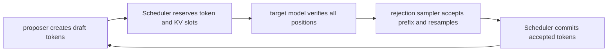

# vLLM 投机解码：用廉价草稿换取目标模型的并行验证

> **源码基线**：`vllm-project/vllm@d66300a1baa7779c68c7dfa4e51eee2502b48017`
> **中心命题**：投机解码的价值不在“少跑目标模型”，而在一次目标 forward 同时验证多个候选 token。vLLM 必须让草稿生成、Scheduler 的 token/KV 预留、目标验证和拒绝采样形成同一提交协议；任何一层把草稿当成已确认输出，都会破坏分布正确性或 KV 状态。
> **叙事顺序**：本页按五拍组织——背景 → 为什么这么设计（含被否掉的替代）→ 实现思路与细节 → 约束 → 发展趋势。
> **最近更新**：2026-08-27。按五拍重排章节顺序，并补齐发展趋势；机制正文与既有引用未改。

## 一、背景：它优化的瓶颈是什么

自回归 decode 每步只得到一个 token，batch 较小或模型受内存带宽限制时，单次 forward 的算力利用不足。若一个更便宜的 proposer 先产生 $k$ 个候选，目标模型可在一次更宽的 query 上计算这 $k$ 个位置和一个 bonus 位置。

设草稿成本为 $C_d(k)$，一次目标验证成本为 $C_t(k+1)$，最终接收 token 数期望为 $E[A]+1$，则每个提交 token 的近似成本是：

$$
\frac{C_d(k)+C_t(k+1)}{E[A]+1}
$$

只有当并行验证增加的目标成本和 drafter 成本小于接受长度带来的收益时，投机才加速。acceptance 低、draft 过重、batch 已饱和或 verification kernel 开销高时，它可能更慢。

## 二、为什么这么设计：替代方案与代价

| 方案 | 优点 | 为什么不是通用答案 |
|---|---|---|
| 普通 decode | 语义和状态最简单 | 小 batch 下目标模型每步利用率低 |
| 固定 $k$ 的 draft model | 配置简单 | batch、请求难度与 acceptance 变化时容易过度投机 |
| n-gram/suffix proposer | 几乎无模型成本 | 只对重复模式有效，覆盖率不稳定 |
| 直接接受 drafter 输出 | 最少验证工作 | 改变目标分布，不再是精确 speculative decoding |
| CPU rejection sampling | 容易实现 | logits D2H 与逐请求循环打断异步流水 |
| 为每个 proposer 定制 Scheduler | 可用特性更自由 | 调度/KV 合同碎片化，组合和测试爆炸 |

投机解码还会增加 draft 权重/KV、lookahead block、target query 宽度与 graph shape 数量。评估时必须同时看 acceptance length、drafter time、target time、verification time、TTFT 和 TPOT，而不是只看“接受率”。

> [!note] 推断
> 这张表是本页依据代码行为重建的设计权衡：每一行的“为什么不适用”都能落到后文引用的 `file:line` 上，但“当初权衡过、并因此否掉了它”这层意思由本页承担——源码通常只陈述最终形态，不陈述被否掉的选项。要引用其中某一行，请回到对应小节的 locator，不要引用本表。

## 三、四个状态所有者

- `SpeculativeConfig` 选择 proposer 方法、最大草稿数、draft TP/quant/backend、dynamic schedule 和 verification 方式；`vllm/config/speculative.py:85-242`。
- proposer 只拥有“候选如何产生”，不拥有最终输出。
- Scheduler 决定候选中有多少能在本步占用 token budget 与 lookahead KV slot。
- rejection sampler 根据目标/草稿分布决定接收前缀和拒绝位置的补偿采样。

## 四、Scheduler 为什么把草稿也算进 token/KV 预算

Scheduler 不单独维护 prefill/decode 阶段，而用 `num_computed_tokens` 追赶包含 prompt、output 和 spec tokens 的逻辑长度；`vllm/v1/core/sched/scheduler.py:477-488`。已有 `spec_token_ids` 被裁剪到本步可调度数量，写入 `scheduled_spec_decode_tokens` 后立即从 request 清空；`vllm/v1/core/sched/scheduler.py:700-721`。

草稿尚未被接受，却必须先拥有用于目标验证的 KV slot。`num_lookahead_tokens` 被传给 KV allocation；`vllm/v1/core/sched/scheduler.py:629-640`。因此有两个不同计数：

- **执行承诺**：本步要为多少目标位置计算并暂存 KV；
- **输出承诺**：验证后真正接受多少 token。

若先把 $k$ 个草稿全部当作输出提交，拒绝后就必须回滚用户可见 token、length、KV 和采样 RNG；vLLM 选择先预留再验证，只提交 accepted prefix。

动态 speculative decoding 可按 batch size 选择不同草稿长度，Scheduler 在初始化时构造 lookup；`vllm/v1/core/sched/scheduler.py:247-270`。这是因为大 batch 的目标 forward 已较饱和，固定 $k$ 会放大验证开销和 KV 压力。

## 五、proposer 是策略插件，验证合同保持稳定

当前代码支持 draft model、EAGLE 系、MTP、n-gram、suffix、custom proposer 等多种候选来源；方法识别和 draft model 构造约束集中在 `SpeculativeConfig`；`vllm/config/speculative.py:704-839`。这些方法的共同输出是每请求的 draft token 序列，runner 再把它写回 request state；`vllm/v1/worker/gpu/model_runner.py:1797-1856`。

设计上不能让不同 proposer 各自修改 Scheduler：

- n-gram/suffix 几乎没有额外模型成本，但命中依赖重复模式；
- draft model 有独立权重、KV、attention backend 和 TP 配置；
- EAGLE/MTP 消费目标 hidden state，可能需要额外 lookahead；
- dynamic/adaptive 方法按请求或 batch 缩减草稿数。

它们共享“候选不是事实”这一合同，所以 target verification 与最终 commit 可以复用。

## 六、目标验证必须保持采样分布

greedy 场景中，草稿 token 只有与目标 argmax 相等才被接受；Triton kernel 在首次不等处写入目标 token并停止前缀接受；`vllm/v1/worker/gpu/spec_decode/rejection_sampler_utils.py:550-593`。

概率采样不能简单比较 token 相等。对草稿分布 $q$ 采到的 token $x$，标准 acceptance test 是：

$$
u < \min\left(1,\frac{p(x)}{q(x)}\right), \quad u\sim U(0,1)
$$

实现使用等价的 log-space 判断 `log_p(x) > log(u) + log_q(x)`；`vllm/v1/worker/gpu/spec_decode/rejection_sampler_utils.py:629-664`。首次拒绝时从残差分布重新采样；full draft logits 存在时使用目标与草稿概率差，否则 one-hot draft 将被拒 token 的目标概率置零；`vllm/v1/worker/gpu/spec_decode/rejection_sampler_utils.py:738-825`。

若全部草稿均接受，还要从目标的 bonus position 采一个 token。输出 buffer 因而是 `num_speculative_steps + 1`；`vllm/v1/worker/gpu/spec_decode/rejection_sampler_utils.py:1088-1094`。

这套拒绝/补偿协议的目的不是提高 acceptance，而是保证最终 token 的边际分布仍等于目标模型。任何“为了更快直接接受 top-k”都改变生成语义，除非用户明确选择非精确 verification 策略。

## 七、runner 如何避免把变长验证退化成 CPU 工作

不同请求可有不同草稿数。MRV2 根据 `scheduled_spec_decode_tokens` 计算每请求 logits 数和 cumulative offsets；`vllm/v1/worker/gpu/model_runner.py:1127-1189`。`combine_sampled_and_draft_tokens()` 把上一步采样 token 与本步 drafts 组装为 target query，并生成 logits index；`vllm/v1/worker/gpu/model_runner.py:1232-1241`。

target forward 后，runner 只有在存在草稿且已构造 rejection sampler 时进入验证；`vllm/v1/worker/gpu/model_runner.py:1354-1370`。这让无投机请求保留普通采样快路径，也允许同一 batch 内按请求自适应草稿预算。

MRV2 还可把多个 autoregressive draft step 捕获到一个 full CUDA Graph，但 attention backend 必须能原地更新派生 draft metadata；`docs/design/model_runner_v2.md:194-200`。否则 graph replay 会使用上一 draft step 的稀疏索引或长度，属于静默正确性错误，因此必须 fallback。

## 八、三个不变量

1. **候选不变量**：draft token 在 target verification 前不得进入用户可见 output。
2. **资源不变量**：目标要计算的每个 draft/bonus position 必须先获得相匹配的 token budget、KV slot 和 attention metadata。
3. **提交不变量**：只提交从第一个候选开始的连续 accepted prefix，再提交拒绝补偿或 bonus token；拒绝后的草稿不得污染下一步状态。

抢占时 Scheduler 清空尚未验证的 `spec_token_ids`；`vllm/v1/core/sched/scheduler.py:1355-1365`。这是第三个不变量在调度故障路径上的体现。

## 九、约束、验证与排查

1. 对照同 seed、同 sampling 参数的非投机结果分布，而非逐 token 强求一致；
2. 检查 Scheduler 调度的 draft 数、runner 实际 logits 数和 rejection sampler offsets 是否一致；
3. 监控每请求 accepted length 分布，不只看全局平均；
4. 区分 drafter 变慢、target verification 变宽、KV lookahead 紧张和 acceptance 下降；
5. 遇到 graph-only 错误时检查 attention metadata update capability；
6. preemption/abort 后确认未验证 drafts 与 lookahead blocks 均被清理。

最小源码阅读顺序：`vllm/config/speculative.py:85-242,704-839` → `vllm/v1/core/sched/scheduler.py:247-270,477-721` → `vllm/v1/worker/gpu/model_runner.py:1127-1370,1797-1856` → `vllm/v1/worker/gpu/spec_decode/rejection_sampler_utils.py:550-825,1088-1094`。

## 十、发展趋势

> [!note]
> 本节离开“源码此刻是什么”，只收录源码自陈的在途改动；每条给出锚点，属于外推的部分单独标注。

1. **验证路径上的临时缓冲会被折进 kernel。** rejection sampler 目前要物化一份 FP32 target-logits 缓冲并按 1GB 分块，注释自陈这是权宜之计：`# TODO(mgoin): Chunking is a workaround. The rejection kernels already upcast per vocab block on load and apply ops like temperature and gumbel, so folding sampling-param application into those kernels would remove this buffer and its traffic entirely.`；见 `vllm/v1/worker/gpu/spec_decode/rejection_sampler.py:26-31`。方向是把采样参数下沉进 rejection kernel，从而消掉这块显存与带宽。

## Related Pages

- [[02_engineering/03_infer_frameworks/vllm/11_vllm_scheduler_analysis|vLLM Scheduler]] — draft token budget、lookahead KV 与抢占回滚。
- [[02_engineering/03_infer_frameworks/vllm/12_vllm_kv_cache_management_analysis|vLLM KV Cache 管理]] — 未接受候选所需的临时 slot 与释放边界。
- [[02_engineering/03_infer_frameworks/vllm/14_vllm_attention_backends_analysis|vLLM Attention Backend]] — multi-token metadata 和 draft update 能力合同。
- [[02_engineering/03_infer_frameworks/vllm/15_vllm_model_runner_v2_analysis|vLLM Model Runner V2]] — GPU-native gather、采样与 fused draft graph。
- [[02_engineering/03_infer_frameworks/vllm/23_vllm_compilation_cudagraph_analysis|vLLM 编译与 CUDA Graph]] — 变长 query 的 graph shape 与 fallback。
- [[02_engineering/03_infer_frameworks/vllm/27_vllm_observability_reliability_analysis|vLLM 可观测性与可靠性]] — acceptance、drafter/target/verification 时延的生产指标。
