# vLLM IR 与融合 Pass：让语义先稳定，再让实现安全落地

> **源码基线**：`vllm-project/vllm@199cb9b964822e59ab9b58d88e7be31eb419a2ae`（`main`，2026-09-06）
> **主题**：解释 vLLM IR 与 torch.compile 的关系，从 add 与 RMSNorm 的双输出计算出发，跟踪 pattern 注册、匹配、替换与实现选择。随后展开输入捐赠、各融合家族、Pass 装配，以及自定义 Pass 的接入和验证。
> **适用范围**：IR 语义、torch-wrap、donation/alias/functionalization、图融合及 `PassConfig` 全部字段；编译与缓存生命周期归 19，provider 与设备 kernel 实现归 20。
> **最近更新**：2026-09-14。

## 1. 为什么图里要先保留算子语义

同一个 residual block 可以由原生 PyTorch、设备 custom op 或包含量化/通信的融合 kernel 完成。如果模型过早固定实现，编译器看见的是不同的低层图，融合规则会随实现数量膨胀；如果只看最终数值，又可能在改写时覆盖 caller 仍要使用的输入。vLLM IR 在 FX 图中保留“计算合同已定、实现尚未定”的算子节点：先对合同做图变换，最后选择实现，并显式处理允许覆盖哪些输入。

收益是 matcher 不必为每个 RMSNorm provider 重写一套规则；代价是增加编译期匹配与 trace，原地实现也可能留下保护性 copy。最重要的约束有两类：数值只要求指定容差内一致，而输入旧值、输出数量、shape、scale 与 KV 副作用必须按照各自合同保留。

这里的 IR 和 Pass 都工作在 PyTorch 编译体系内。**FX Graph 是承载节点与依赖边的图，vLLM IR 是其中保留高层语义的一组算子，Pass 是读取并修改这张图的程序，`torch.compile` 则是启动捕获与后端编译的入口。** 例如一个 FX `call_function` 节点的 target 可以是 `torch.ops.aten.add.Tensor`，也可以是 `torch.ops.vllm_ir.rms_norm.default`；后者仍是 FX 节点，只是其 target 表达完整 RMSNorm，而没有展开成求平方、求均值、开方和乘权重。`docs/design/vllm_ir.md` 因而把它称为 Torch FX 中的一个 dialect。若不熟悉节点的 args、users 与改图 API，可先读 [[02_engineering/01_pytorch/02_compile_stack/03_graph_ir_and_passes/21_fx_graph_editing_primitives_and_invariants_analysis|FX 改图原语与不变量]]，理解替换一个节点为什么还要维护消费者和拓扑顺序。

`VLLM_COMPILE` 模式把 `VllmBackend` 对象传给 `torch.compile`，再由这个 backend 把 vLLM Pass manager 接入 Inductor 的图处理 hook。它负责在高层语义还在时做推理专用变换，之后仍把图交给 PyTorch 编译器。vLLM 的 IR lowering 因而指“把 vLLM 算子换成已选 provider 的实现子图”；Inductor 后续自己的表示、调度和代码生成是另一个阶段。两者都使用 IR、lowering、fusion 这些词，但处理的对象与发生时机不同。入口的具体模式差异见 §3，装配顺序见 §8。

一次模型计算刚得到 branch `x=(1,2,3,4)`，旧 residual 为 `r=(1,0,-1,-2)`，权重 `w=(1,2,1,2)`。先相加得到 `u=(2,2,2,2)`，再沿最后一维做 RMSNorm；用当前 pattern 注册的 `epsilon=1e-6`，FP32 手算得到 `y≈(0.999999875,1.999999750,0.999999875,1.999999750)`。这个 block 必须交给下一层**两个结果 `(y,u)`**：只把 norm 输出保留下来，会丢掉 residual 链。

现在有两个独立问题。图改写能否把 `add → rms_norm` 收敛为一个仍返回 `(y,u)` 的 IR 节点？稍后选到会写输入的 C provider 时，调用者还需要旧的 `x,r` 吗？前者决定 matcher 看见什么，后者决定是否必须复制输入。IR 把这两项决定分开；减少 IR 节点本身不保证少一个 GPU kernel，真正的实现与中间内存成本见 [[02_engineering/03_infer_frameworks/vllm/20_vllm_fused_ops_and_kernels_analysis|融合算子与 Kernel]]。

这里的四元素例子是**根据本地 reference 手算的语义缩影**，不是实际 BF16 pattern trace / GPU 运行记录。`AddRMSNormPattern.get_inputs` 用 BF16 `(5,16)` tracing，测试用 `(2,7,32)`；低精度 add 的舍入点与 fused reference 的 FP32 add 并不完全相同，因此正确性目标是**规定容差内**一致，不能由上面的实数值推出逐 bit 相等（`vllm/ir/ops/layernorm.py::fused_add_rms_norm`；`vllm/compilation/passes/fusion/add_rms_fusion.py::AddRMSNormPattern`）。这个“规定容差”有具体落点：八种 dtype 的默认值在 `vllm/ir/tolerances.py::DEFAULT_TOLERANCES`，单个 op 可用 `vllm/ir/op.py::IrOp.override_tolerance` 收紧或放宽——`rms_norm` 与 `fused_add_rms_norm` 都把 float16 改成 `atol=1e-2, rtol=2e-3`，注释点名“32768×16384 这类大 shape 的累加舍入”（`vllm/ir/ops/layernorm.py::rms_norm`）。**容差的声明属本页，容差的执行（provider 对拍与 benchmark）归 20。**

### 1.1 为什么不在模型 forward 里固定实现

源码没有记录一场完整的方案评审，但被取代的方案不需要虚构——它在仓库里且有文档：`CustomOp`。`docs/design/vllm_ir.md::Migration from CustomOp` 明写 vLLM IR “designed to coexist with and gradually replace CustomOp”，迁移路径是把 `forward_native` 移到 `@register_op`、把方法重载换成 `register_impl`、把 `--compilation-config.custom-ops` 换成 `--ir-op-priority`；旧机制自己的文档仍在 `docs/design/custom_op.md`。

`CustomOp` 的形态是“层自己按平台挑 forward”：模型 forward 直接固定某个实现。它的代价正是官方 `docs/design/vllm_ir.md::Motivation` 列的五条设计原则要修的地方——eager 与 compile 行为一致、kernel 选择可见可控、约定优于配置、in-tree/out-of-tree 都能注册、与普通 torch op 完全互操作。同一节还把“延迟 kernel 选择”的收益写成三条：fusion pass 每个 op 只需一个简单 pattern、OOT 后端可以从更高层表示 lower、编译器将来可以在多个实现间 autotune。

另一个方向的替代是让 pass 从任意低层 ATen 图重新猜回高层意图。它保留 compiler 自由，却把 correctness 依赖于低层图恰好长成某种形式。当前结构选择的是中间点——语义 op 对 Dynamo 保持 opaque，fusion 在 lowering 前消费它，实现直到 fake metadata 已知才被选中（`docs/design/vllm_ir.md::Compilation Pipeline`）。这一段对两个方向的比较是**分析推断**；被取代方案的身份与迁移路径则有文档依据。

## 2. 从两个返回值推导允许的改写

### 2.1 同一组值与两个输出如何跨过 canonicalization

将开篇的 x/r 各复制成两行，并保留一个大小为 1 的前缀维，得到 `(1,2,4)`。模型希望 norm 输出 y 展平成 `(2,4)`，同时把 `(1,2,4)` 的 u 继续传给 residual 链。Add+RMS 可以先合成一个双输出 IR；为了让后续二维 quant pattern 看见它，再把 prefix flatten 移到 norm 之前，并将 u 恢复原 shape。下图的粗箭头表示编译期替换，实线表示各版本自己的数据依赖。

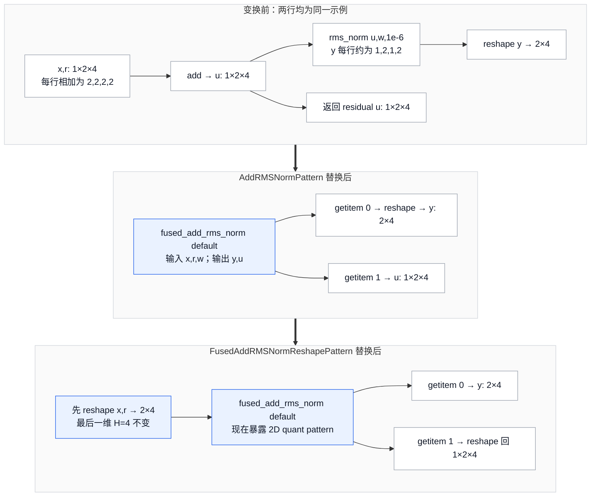

第一步为 `branch+residual` 和 `residual+branch` 各注册 pattern，epsilon 只有 `1e-5`、`1e-6`，因此 `AddRMSNormFusionPass` 一共注册 `2 × 2 = 4` 个 pattern（`vllm/compilation/passes/fusion/add_rms_fusion.py::AddRMSNormFusionPass`）。第二步只合并前缀维度，RMS 的每行 H 个元素和 weight 对齐方式没变，所以可以把 norm 前后的 flatten 对调；fused 版本须显式恢复 residual 的原 shape（`vllm/compilation/passes/fusion/add_rms_fusion.py::FusedAddRMSNormReshapePattern`、`vllm/compilation/passes/fusion/add_rms_fusion.py::RMSNormReshapePattern`，同样是 `2 × 2 = 4` 个，由 `vllm/compilation/passes/fusion/add_rms_fusion.py::RMSNormReshapeFusionPass` 注册）。若把 H 一起展平，例如将 `(1,2,4)` 变成 `(1,8)`，归一化会跨行混合，已不是这项变换。这里只保证值/shape 合同，不承诺 reshape 一定零拷贝；layout 是否需要 materialize 要交给后续实现。

`tests/compile/passes/test_rmsnorm_reshape_fusion.py::test_add_rmsnorm_reshape_fusion` 对两种加法次序运行 eager 与 compiled 对比，并检查 add / RMS 被 fused IR 替换；`tests/compile/passes/test_rmsnorm_reshape_fusion.py::test_rmsnorm_reshape_fusion` 还检查 RMS 的输入确实变成 reshape。它们支持这项具体变换，不是任意数值精度、extra users 或轴变换的一般证明。

**这两个 pass 的装载条件比“Transformers backend”更窄**：`PostGradPassManager.configure` 里的 `enable_transformers_norm_canonicalization` 要求 `fuse_act_padding`、`fuse_allreduce_rms`、`fuse_norm_quant` 三者**至少一个为真**，并且 `model_config is not None and model_config.using_transformers_backend()`。这条本身就是 canonicalization 存在意义的证明：只有下游真有 consumer 时才值得把 backend-specific 展开规范化，否则 canonical 节点无人消费，白付 4+4 个 pattern 的注册成本。

### 2.2 一个 op 的四层合同

要让 `rms_norm` 在选定 kernel 之前就能参与改图，首先得把“它计算什么”与“它怎样被调用”固定下来。`vllm/ir/ops/layernorm.py::rms_norm` 和 `fused_add_rms_norm` 的 native reference 给出数学计算、输出数量与 dtype/shape 行为；`@register_op` 创建的 `IrOp` 再根据函数签名注册 `vllm_ir` 命名空间的 torch op。default overload 使用 `mutates_args=[]` 与 `CompositeExplicitAutograd`，所以图中一个 fused-add 节点承诺返回 norm 和 residual 两个结果，并且不向调用者暴露输入修改。reference 提供正确性基线，不能由此推断性能。

编译阶段需要输出的 shape、dtype、device 等信息，却不需要真正运行这次 RMSNorm。`IrOp` 因而同时提供 fake 实现：默认用 native 在 fake tensor 上推导结果，也允许通过 `register_fake` 单独覆盖。fake 结果随后进入节点 metadata，供模式守卫和 lowering 选择使用。它不携带真实 GPU 数值，因此既不能验证数值容差，也不能证明一次融合更快。当前注册还拒绝 keyword-only 参数，原因是 lowering 的实现不接收 kwargs；这项 `ValueError` 是调用接口对后续阶段的约束（`vllm/ir/op.py::IrOp.__init__`、`vllm/ir/op.py::IrOp.register_fake`）。

有了 reference 与 schema，设备 provider 才能注册同语义实现。`IrOpImpl.__init__` 检查参数名、类型与默认值是否和 native 一致，并核对 `supports_args` 的签名；声明 `inplace=True` 的实现还要求 op 声明 `allow_inplace`。schema 相同只说明调用方式相容，数值是否足够接近仍要单独对拍。`DEFAULT_TOLERANCES` 给出八种 dtype 的默认容差，`override_tolerance` 允许逐 op 覆盖；`vllm/ir/op.py::IrOp.get_tolerance` 对既没有默认值也没有覆盖的 dtype 抛错。`register_input_generator` 则为对拍提供有效输入，缺少注册时 `generate_inputs` 抛 `RuntimeError`。

最后，`vllm/ir/op.py::IrOp.dispatch` 根据 priority 与实参能力谓词选择一个 provider。priority 末尾补 native 并告警、三层选择及 `supported` 和 `supports_args` 的分工在 [[02_engineering/03_infer_frameworks/vllm/20_vllm_fused_ops_and_kernels_analysis|融合算子与 Kernel]] 展开。本页后续 lowering 复用这一套选择，只把真实 tensor 换成节点的 fake tensor。于是四层可以分别回答：reference 定义计算，schema/fake 让计算可被图表示，provider 注册保证接口相容，dispatch 为这次参数选择实现；其中任何一层都不能替代数值测试。

### 2.3 为什么 default overload 必须保持 functional

`IrOp._inner_call` 无论 dispatch 到 functional 还是 inplace provider，都通过 `func_impl_fn` 执行 default overload；若 provider 声明 inplace，后者先 clone 所有 activation 参数，再调用真实实现，所以 default 的输入值在调用后仍可观察（`vllm/ir/op.py::IrOpImpl.func_impl_fn`）。相反，`maybe_inplace` 直接调用 `impl_fn`，不插 clone（`vllm/ir/op.py::IrOpInplaceOverload._inner_call`）。

二者共享 native schema 与 provider 集合，差异在于调用者是否交出 activation 的旧值。当前模型层对 IR `maybe_inplace` 的实际调用只有 `vllm/model_executor/layers/layernorm.py::RMSNorm.forward_native` 的 residual 分支（另一处 `vllm/model_executor/models/step3p5.py::add_and_maybe_inplace_all_reduce` 是同名方法，与 IR overload 无关）。同一文件的 `vllm/model_executor/layers/layernorm.py::GemmaRMSNorm.forward_native` 同样走 residual，却调用**默认 overload**，不捐赠。所有 fusion pass 的 replacement 也一律发射 default overload。

因此是否允许复用 storage 必须落实到每个调用点。两个模型层即使都计算 residual add，也可能对输入旧值作出不同承诺；provider 只能服从这一承诺，不能从计算形态自行推定输入已经无用。

## 3. IR 何时对编译器可见：torch-wrap 层

先看入口选择。`CompilationConfig.init_backend` 在 `STOCK_TORCH_COMPILE` 或 `DYNAMO_TRACE_ONCE` 下返回已注册的 Torch backend 名称或解析后的对象；这条分支不会自动创建 `VllmBackend`、装上 vLLM manager。`VLLM_COMPILE` 则返回 `VllmBackend`，`TorchCompileWrapper.__init__` 仍调用 `torch.compile(..., fullgraph=True, dynamic=False, backend=该对象)`。所以“用了 torch.compile”并不能说明是否经过本页这些 Pass，必须继续看传入的是哪一个 backend。

在 `VllmBackend` 内，`CompilationConfig.backend="inductor"` 还会经 `make_compiler` 选择 `InductorAdaptor` 或可用时的 `InductorStandaloneAdaptor`：分别通过 `compile_fx(..., config_patches=...)` 或 `torch._inductor.standalone_compile` 交给 PyTorch，并传递已经组合好的 hook 配置。若选择内部的 `backend="eager"`，`EagerAdaptor.compile` 直接返回图，没有调用 Inductor；即使前面配置了 manager，也不能据此声称这些 Inductor hook 已经执行。普通 Torch backend 与 vLLM 内部 adaptor 是两个入口层次（`vllm/compilation/compiler_interface.py` 中上述三个 adaptor；`vllm/compilation/backends.py::make_compiler`）。

上述依赖 IR 的 pass 以“FX 图里存在 `vllm_ir` 命名空间的节点”为前提，而这个前提本身是可配置的。`vllm/ir/op.py::IrOp.__call__` 与 `vllm/ir/op.py::IrOpInplaceOverload.__call__` 都是同一个形状：

- 全局 `_ENABLE_TORCH_WRAP` 为真：调用 `self.torch_op`，Dynamo 看到一个 opaque 的 `torch.ops.vllm_ir.<name>` 节点；
- 为假：直接落到 `_inner_call`，即当场 `dispatch` 并执行实现，Dynamo 只能 trace 到被选中的那份实现（`vllm/ir/op.py::IrOp._inner_call`；`vllm/ir/op.py::IrOpInplaceOverload._inner_call`）。

也就是说，torch wrap 关掉时**图里根本没有 IR 节点**：functionalization 无 `maybe_inplace` 可换、所有 IR-level matcher 无 canonical op 可匹配、lowering 无节点可 lower、clone elimination 也不会看到 lowering 插入的保护 clone。这决定 IR 相关优化是否可见，但不会卸载 manager：NoOp、split/scatter、attention/activation custom-op 融合与固定尾部仍可能处理图里的其他节点。

解析链有五跳，全部可核对：声明默认 `None`（`vllm/config/compilation.py::CompilationConfig.ir_enable_torch_wrap`）→ 解析为 `mode == VLLM_COMPILE and backend == "inductor"`（`vllm/config/vllm.py::VllmConfig.__post_init__`）→ CPU 平台在切到自己的 inductor 配置时强制 `False`（`vllm/platforms/cpu.py::CpuPlatform.check_and_update_config`）→ worker 启动时一次性落成全局值（`vllm/v1/worker/worker_base.py::WorkerBase.__init__` 调 `vllm.ir.set_default_torch_wrap`）→ 全局值与临时上下文（`vllm/ir/op.py::set_default_torch_wrap`、`vllm/ir/op.py::enable_torch_wrap`）。

两处测试面固定了它的行为。`tests/ir/test_op.py::test_set_default_torch_wrap` 确认 `set_default_torch_wrap` 是**永久**翻转，而 `enable_torch_wrap` 上下文退出后会还原到当前默认值。`tests/compile/passes/ir/test_lowering.py::test_lowering_rms_norm` 里两处 `with ir.enable_torch_wrap(True)` 带着一句注释 “Compiled function guards on global value, avoid recompilation”——这个全局值是 Dynamo guard 的一部分，所以它同时也是 cache identity 话题的一环（见 §7）。官方调试文档把 `-cc.ir_enable_torch_wrap=False` 列为“关掉 vLLM IR wrapping、观察 eager dispatch 行为”的标准手段（`docs/design/debug_vllm_compile.md`）。

## 4. Donation 与 alias：明确表达，但只在受限范围内证明

### 4.1 `maybe_inplace` 表达的不是“现在一定原地写”

这里的 alias 指不同张量可能共享 storage，mutation 指执行时修改其内容。数据边并不能表达所有读写顺序；[[02_engineering/01_pytorch/02_compile_stack/03_graph_ir_and_passes/12_graph_effects_alias_mutation_and_order_analysis|Effect、Alias、Mutation 与顺序]] 解释为什么没有显式消费者的写入也可能必须保留。

创建 inplace overload 时，IR 先要求 Tensor 输出数等于 activation 数，并限制当前只支持纯 Tensor outputs；随后用 `mutates_args=activations` 推导 mutation schema（`vllm/ir/op.py::IrOpInplaceOverload.__init__`）。实现再用 `inplace=True` 声明自己会复用 activation storage；不支持 inplace 的 op 不允许注册这种实现（`vllm/ir/op.py::IrOpImpl.__init__`）。官方语义说明得更强：`maybe_inplace` 的输出**可能** alias activation，而调用后继续读取被捐赠输入属于 undefined behavior（`docs/design/vllm_ir.md::The maybe_inplace Overload`）。

这里要区分三个层次：

1. mutation schema 告诉 PyTorch 这些 activation 可能被写；
2. donation 告诉 vLLM 调用者不再需要旧值；
3. 某个 provider 的 `inplace=True` 才决定当前实现确实复用 storage。

把三者合成“`maybe_inplace` 一定 alias 第一个输出”会越过源码合同。当前代码只约束 activation 与输出数量相同，没有建立任意 view、storage offset 或跨节点 alias 的一般证明。

### 4.2 pre-grad functionalization 消费并产出什么

pre-grad 与 post-grad 是相对 AOTAutograd 的处理阶段：前者位于其之前，后者处理它交给后端的图；推理仍会经过相关前向编译路径，并不因名称带 grad 就要求执行训练反向。AOT 的 metadata、joint、forward/backward graph 区别见 [[02_engineering/01_pytorch/02_compile_stack/02_aot_autograd/11_aotautograd_joint_forward_backward_graphs_analysis|AOTAutograd 的图与边界]]；两个图改写窗口的开发接口见 [[02_engineering/01_pytorch/02_compile_stack/04_inductor/30_pre_grad_passes_guide|Pre-Grad Passes]] 和 [[02_engineering/01_pytorch/02_compile_stack/04_inductor/32_post_grad_passes_guide|Post-Grad Passes]]。这些页面按各自 PyTorch 基线解释通用机制，下面仍以本页冻结 vLLM 的 hook 配置为准。

下游 matcher 只需要识别 functional 的 default IR，但模型可能发射 `maybe_inplace`。如果直接把后者改名，输入捐赠的信息就会消失；如果把 mutation 一直留在图中，后续融合又必须处理两种 overload。因此 `VllmIRInplaceFunctionalizationPass` 同时做两件事：把图里的调用规范成 default，把允许复用的 graph input 记录到 `PassContext.donated_input_ids`，供 lowering 之后的 clone 回收使用。

它先为图中节点建立拓扑序号，再通过 `get_ir_op(node)` 找到 IR 调用。遇到 `maybe_inplace` 时，逐个取出 activation 对应节点，检查这个输入的所有 users；只要有 user 出现在捐赠调用之后，就抛 `ValueError`，提示改用 default overload 或提前手工 clone。这个判断关心的是旧输入是否仍被读取，而不是输出有没有继续向下传。通过检查后，若 activation 是 graph placeholder，就把其输入索引加入 donation 集合；随后把调用的 `target` 改成 `ir_op.torch_op`。未知 overload 由 assert 拒绝，`self.functionalized_ops` 只记录各 op 的改写数量（`vllm/compilation/passes/ir/inplace_functionalization.py::VllmIRInplaceFunctionalizationPass.__call__`）。

这样，后续图只需处理 default overload，却没有丢失 caller 交出的所有权信息。donation 集合跨过 AOTAutograd、所有 fusion 和 lowering，最后用于区分“可以覆盖的输入”与“图外 caller 仍可能观察的输入”。`test_inplace_functionalization` 检查这个转换，`test_maybe_inplace_reuse_error` 构造捐赠后再次相加的反例，确认编译以 “used again” 失败，而不是静默退回 out-of-place；两者都在 `tests/compile/passes/ir/test_inplace_functionalization.py`。

`VllmBackend.configure_post_pass` 把这个 pass 安装到 `pre_grad_custom_pass`，意图是在 AOTAutograd 之前处理尚未 functional 的图。安装 hook 与它在某条 Torch 版本路径上实际执行仍须区分：standalone adaptor 对旧版本 pre-grad 的开关见 §9.3。设计文档把捐赠后复用概括为 undefined behavior；这项图级检查发生在 pass 被执行的编译路径，eager `IrOpInplaceOverload._inner_call` 仍直接调用实现，没有这项 later-user 检查（`docs/design/vllm_ir.md::The maybe_inplace Overload`）。

### 4.3 clone elimination 不是一般 alias analysis

lowering 对 inplace implementation 调 `func_impl_fn`，所以先得到保护性 clones；`UnsafeCloneEliminationPass` 再决定哪些 clone 可移除（`vllm/compilation/passes/ir/lowering_pass.py::VllmIRLoweringPass.lower_matched_op`；`vllm/ir/op.py::IrOpImpl.func_impl_fn`）。manager 在 lowering 后调用它，逐个检查 `aten.clone.default`，结合 user 的 write schema、`PassContext.donated_input_ids` 与 fake layout 决定能否将 clone 的消费者重新指向原 tensor。具体检查如下：

- clone 不改变 stride 与 storage offset；缺 metadata 或读取 stride/offset 抛异常时**默认视为 layout preserved**，已知 layout 改变则保留（`vllm/compilation/passes/ir/clone_elimination.py::clone_preserves_layout`）；
- clone 被写时，original 在该 write 后不能再有 user（`vllm/compilation/passes/ir/clone_elimination.py::user_writes_to_node`）；
- clone 被写且 original 是 graph input 时，必须出现在 pre-grad 传来的 donated-input set，否则保留 clone；只有 read-only users 的 clone 不要求 donation（`vllm/compilation/passes/ir/clone_elimination.py::UnsafeCloneEliminationPass.__call__`）；
- unknown higher-order op 默认视作可能写，例外只有两种，理由不同（`vllm/compilation/passes/ir/clone_elimination.py::user_writes_to_node`）：`TritonKernelWrapperFunctional` 是真正的 functional HOP；`auto_functionalized` 则**确实会写**该节点，被豁免是因为它保证是该节点的**最后一次使用**（它把张量返回给后续使用），源码注释原话是写入发生但“is a follow-up use we're not interested in”。

检查通过的 clone 用 `replace_all_uses_with(original_node)` 重绑消费者，再由 `erase_node` 删除；`count` 记录删除数量。其余 clone 保留图内 copy 语义，最终是否物化仍由后续编译器决定。

最重要的失败边界写在类注释里：该 pass “unsafe” 正因为**尚未考虑 aliasing**，只服务已知 vLLM 图，simple view alias 仍是 open problem（`vllm/compilation/passes/ir/clone_elimination.py::UnsafeCloneEliminationPass`）。测试把边界固定为可观察行为：donated input 的 mutating clone 会移除，non-donated graph input 的 clone 会保留；两者分别允许与禁止 caller input 被覆盖（`tests/compile/passes/ir/test_clone_cleanup.py::TestCloneCleanupWithDonatedInputs`、`tests/compile/passes/ir/test_clone_cleanup.py::TestCloneCleanup`）。另一个测试确认 materialize compact layout 的 clone 必须保留（`tests/compile/passes/ir/test_clone_cleanup.py::TestCloneCleanup.test_keep_clone_that_changes_layout`）。

所以这里的安全不是“alias 问题已经解决”，而是“在没有一般 alias 证明时，把优化框在 donation、拓扑 user、write schema 与 layout equality 的**交集**里”。遇到 view-rich 新图时，默认做法应是保留 clone 或扩充证明与反例测试，而不是扩大无条件删除范围。

### 4.4 删掉一次 clone 后，究竟谁的内存被改了

图结构取自 `tests/compile/passes/ir/test_clone_cleanup.py::TestCloneCleanupWithDonatedInputs.test_donated_input_clone_removed`：`x_clone = x.clone(); x_clone.add_(1); return x_clone`，`donated_input_ids = {0}`。该测试的实际输入是 `torch.randn(2, 3)`；**下图沿用它的图结构，数值改用一维 `(1,2)` 便于手算，不是测试里的值，也不是它的 shape**。这个 clone 测试只隔离 storage 可观察性，不计算开篇的 RMS；一维 `(1,2)` 用来区分输入旧值和修改后值。左右两路输入值相同，区别只在 placeholder 0 是否捐赠。图中 A/B 是符号化 storage 身份，虚线是编译期证据，实线是运行中的读写，末框同时展示返回值与 caller 的输入状态。

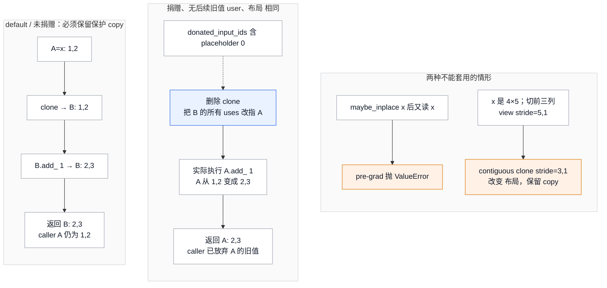

对于第 1 节的 `vllm_c` fused norm，`func_impl_fn` 先 clone 两个 activation，再由 provider 把 norm 和 residual 写回克隆；若两输入合法捐赠且所有局部检查通过，clone elimination 可以让两个输出直接复用原 activation storage。这个结果来自具体 inplace provider；native provider 仍可新建输出，`maybe_inplace` 本身没有承诺固定输出 alias 次序。

读图时还须保留两个不对称边界。第一，没有后续图内 user 并不足以覆盖**未捐赠的 graph input**，因为 caller 在图外仍能观察旧值。第二，`x[:, :3].contiguous()` 即使数值不变也有布局用途：原 `(4,5)` 的前三列 stride 为 `(5,1)`，紧凑输出为 `(3,1)`，删掉 clone 会改变消费者看到的 layout。相反，metadata 缺失或读取 stride/offset 抛异常时，当前 helper 返回 `True`，不会自动保守保留；这和不跟踪隐藏 view alias 一样，是现行实现的限制。

## 5. 规范化怎样为融合准备可匹配的图

### 5.1 Python 写的 pattern 为什么能命中编译后的图

pattern matcher 按节点 target、参数结构和共享关系识别候选子图。[[02_engineering/01_pytorch/02_compile_stack/03_graph_ir_and_passes/22_pattern_expression_and_matcher_engine_analysis|PatternExpr 与 PatternMatcher 引擎]] 解释递归匹配与 capture；这里从 vLLM 实际提供的一条规则展开。

一个融合规则包含两份计算与一组 tracing 输入。`AddRMSNormPattern.pattern` 描述原图：`u = branch + residual`，`y = ir.ops.rms_norm(u, weight, epsilon)`，返回 `(y,u)`；`replacement` 描述替换后的图：调用 `ir.ops.fused_add_rms_norm(branch, residual, weight, epsilon)`，仍返回 `(y,u)`。`get_inputs` 提供 BF16 `(5,16)` 的 branch/residual 与 `(16,)` 的 weight，让 Python 函数可以被 trace 成图。epsilon 和加法次序是对象构造时捕获的常量，所以 `AddRMSNormFusionPass.__init__` 对 `1e-5/1e-6 × 两种次序` 分别注册，共四条规则。

选择 epsilon=1e-6、branch 在前的那一条，将原类返回的闭包简化成两份 Python 函数，就能看到 replacement 必须保留的输出关系；这是规则表达的摘录，不是独立运行器：

```python
import vllm.ir.ops

def pattern(branch, residual, weight):
    u = branch + residual
    y = vllm.ir.ops.rms_norm(u, weight, 1e-6)
    return y, u

def replacement(branch, residual, weight):
    return vllm.ir.ops.fused_add_rms_norm(branch, residual, weight, 1e-6)
```

匹配要求 `rms_norm` 的输入来自同一个 add，并且识别该规则对应的 op target、常量参数、连接与输出关系；不是在模型里搜索“有一个 add，也有一个名字含 RMS 的函数”。因此更换 epsilon、插入未被消除的变换，或让中间值具有规则没有表达的使用关系，都不能仅凭数学意图相似就假定命中。对额外 users 的确切接受规则由 PyTorch matcher 实现，本页只核对 vLLM 给它的 pattern，具体新形态必须加测试。

注册时，`vllm/compilation/passes/vllm_inductor_pass.py::VllmFusionPatternMatcherPass.register` 在 `@enable_fake_mode` 下把 `pattern`、`replacement`、`get_inputs()` 和 `_trace_fn` 交给 `pm.register_replacement`。编译时，该 pass 的 `__call__(graph)` 再执行 `self.pm_pass.apply(graph)`，由 PyTorch 的 `PatternMatcherPass` 在目标 FX 图中完成匹配与替换，并返回这次改图的匹配数。前一步构造规则，后一步处理实际模型图；两步都属于编译准备或编译过程，不会为了决定融合而先运行 GPU、比较一次输出数值。

tracing 输入使规则能够形成，并不把部署输入硬编码成 `(5,16)`。仓库的 `test_add_rmsnorm_reshape_fusion` 实际输入是 BF16 `(2,7,32)`，仍要求 Add 与 Reshape 两个 pass 各命中一次，并检查 fused IR 出现、原 add/RMS 消失以及 eager/compiled 输出接近。不过，这只证明该测试覆盖的形态可以推广，不能推成任何 rank、stride、dtype 都受支持。尤其 epsilon 的两个显式注册值与 shape tracing 示例的作用不同：前者就在规则的计算参数中。

还有一个实际困难：Python tracing 和目标图未必把同一操作表示成同一个节点。`_trace_fn` 先用 `pm.fwd_only` trace，再通过 `_fx_view_to_reshape` 复用 Inductor 的 `view_to_reshape`，最后 `_remove_noop_permutes` 删除维度顺序完全不变的 permute。这样，pattern 中的 view 与目标图的 reshape 才不会因表示差异错过。Python `make_fx` 会记录连续 view/reshape，因此 `fold_consecutive_reshapes` 还会在中间 reshape 只有一个 user 时折叠连续 reshape，但它不在通用 `_trace_fn` 内，只用于 `vllm/compilation/passes/fusion/rocm_aiter_fusion.py` 的局部 tracing；不能把这一项视为所有规则共有的规范化。

不同融合家族也并不统一经过上述 helper。`SequenceParallelismPass`、`RMSNormQuantFusionPass`、`AllReduceFusionPass` 继承 `VllmPatternMatcherPass`，由各 pattern 直接调用 `pm.register_replacement(..., pm.fwd_only, pm_pass)`；例如 `vllm/compilation/passes/fusion/sequence_parallelism.py::MiddleAllReduceRMSNormPattern`。遇到规则未命中时，应先对照实际 FX 图与该家族 trace 后的 pattern，而不是只检查模型 Python 写法。`dump_patterns` 可导出规则，逐 pass 的 graph dump 可观察改写前后；`VllmPatternMatcherPass.match_table` 累计命中数，`vllm/compilation/passes/pass_manager.py::PostGradPassManager.__call__` 最后调用 `log_match_summary()`。`VLLM_PATTERN_MATCH_DEBUG` 设为 FX 节点名时，`vllm/compilation/passes/pass_manager.py::with_pattern_match_debug` 临时启用 Inductor 的 `TORCHINDUCTOR_PATTERN_MATCH_DEBUG`，把日志限定在 vLLM Pass 运行期间。

#### 5.1.1 融合的依据：计算等价、图形态和实现能力各管一层

对 Add+RMS 来说，计算上的依据是原图和 replacement 都先得到同一个 residual sum，再用同一 weight、同一 epsilon 沿最后一维归一化，并交出两个相同含义的结果。这是规则作者必须解释并通过容差测试检查的等价关系。matcher 只负责认出作者描述的子图，既不会从 RMS 的公式自动推导 fused-add 规则，也不会证明 FP32 累加与 BF16 中间舍入逐 bit 相等。

图形态符合之后，设备实现仍可能无法执行。`RMSNormStaticQuantPattern.register` 因此在 `pm.register_replacement` 中额外传入 `_rms_input_weight_dtype_match`：它从 match 的 RMS 节点提取输入与 weight 的 fake dtype，要求二者相同，fused-add 版本的 weight 参数位置也相应变化。普通 RMS 可以表示某些 mixed-dtype 运算，但目标 fused kernel 不支持，所以这项 `extra_check` 把“可以表达的计算”缩到“该实现能替换的计算”。函数在没有发现预期 RMS 节点时返回 `True`，其用法依赖前面的 pattern 已保证节点结构；它不是一个脱离 matcher 的通用类型检查器（`vllm/compilation/passes/fusion/rms_quant_fusion.py::_rms_input_weight_dtype_match`）。

设备能力、workspace 和编译区间则在更外层决定是否注册、装载或执行整组规则。例如 AR+RMS 先检查通信实现与 workspace，再要求 `compile_range.end` 不超过 workspace 容纳的 token 上限；SP 要求 whole graph 和 token 下界。这里的区间判断覆盖一份编译图服务的整个范围，而不是只检验 tracing 样例那一个 batch。pattern 的结构匹配、逐 match 的 dtype 检查、整 pass 的能力与 range 判断合在一起，才构成当前代码的融合选择机制。

最后还要区分正确性与收益。消除一次高精度 norm 中间结果可以减少访存，但额外 workspace、重复计算、通信大小或 kernel 对小 shape 的效率都可能抵消收益。当前这些规则由注册顺序、配置与阈值选择，并没有在每个匹配子图上现场 benchmark 多个融合方案再择优；官方 IR 文档把跨实现 autotune 列为未来可能性。第 6 节因此会逐族说明消掉什么、保留什么与新增什么成本，§11 的百分比也只代表官方 indicative 数字。

### 5.2 为什么“更具体的 pass 先跑”是语义和覆盖问题

pattern replacement 会消费节点。若一个宽 pattern 先吃掉 `fused_add_rms_norm`，更具体的 router-pad 或 all-reduce+RMS pattern 就再也看不到完整链；反过来，先让具体 pattern 消费它，未匹配的剩余节点仍可交给宽 pattern。当前 manager 把这项依赖写成注释和实际 append 顺序：router-pad → all-reduce（AR）+RMS → reshape canonicalization → RMS+quant（`vllm/compilation/passes/pass_manager.py::PostGradPassManager.configure`）。这不是“后一个 pass 总能补救”的优化排序，而是 match coverage 的偏序。

Sequence parallelism 还展示了更强的顺序依赖：matcher 从图尾向前替换时，临时 residual slice 在中间状态可能对已缩小的前层输出语义不成立；源码保证图不会在该状态执行，并由 pass 内部 NoOp cleanup 在 compile 前删掉这些 slice（`vllm/compilation/passes/fusion/sequence_parallelism.py::SequenceParallelismPass`）。因此插入新的中间 pass 时，作者必须证明它不会观察或执行这种过渡态。

### 5.3 前置清理怎样消除表示噪声

`NoOpEliminationPass` 先把连续 reshape 的输入重绑到 base tensor，仅在中间节点没有 users 时删除中间 reshape。随后它比较输入输出的 fake shape：维数不同，或 symbolic 维度等价无法静态证明，就保留节点；只有可证明等价的 reshape、slice 和 slice-scatter 才通过 `replace_all_uses_with` 与 `erase_node` 消除。这使后续 matcher 更容易看见相邻的有效计算，也为 SP 清理替换过程中留下的临时 slice（`vllm/compilation/passes/utility/noop_elimination.py::NoOpEliminationPass.__call__`）。

清理作用于表示，不会把同 shape 的任意操作都当成恒等。shape 相同的 RMSNorm 仍改变数值，clone 还可能改变 layout；后者必须留到 §4.3 的专门检查。`eliminate_noops` 可以关闭，但依赖这些 canonical 形态的融合也可能因此不再命中。

## 6. 从完整输入输出合同推导融合变体

融合家族由 `PostGradPassManager.configure` 的装配分支枚举：norm/activation+quant、all-reduce+norm、QK/RoPE/KV、attention 输出量化、MLA 双 norm，以及 SP/AsyncTP。它们都服从 §5.1.1 的结构、能力与实参条件，但处理的张量角色不同，下面分别跟踪哪些值被替换、哪些仍要交给消费者。

下面以开篇数值为共同起点： `x=(1,2,3,4)`、`r=(1,0,-1,-2)`、`u=(2,2,2,2)`、`w=(1,2,1,2)` 和对应 norm 输出 y。需要更大 hidden 或 head 维时，按四元素顺序重复这些向量；例如 H=128 就重复 32 次，RMS 的平均平方不变，输出也对应重复。token 维默认将同一行复制两次；SP 为展示两 rank 分片扩成四个 token。QKV 和 MLA 需要额外通道与旁路，相关小节会明确这些通道如何接到同一个逐行 norm 例子，而不把不同模型表示当成同一张实际运行图。

未匹配的融合通常保留原 functional 子图。native/未融合实现能否执行仍由 op 合同及 [[02_engineering/03_infer_frameworks/vllm/20_vllm_fused_ops_and_kernels_analysis|融合算子与 Kernel]] 决定，不能从“未匹配”本身推出任意新图都具有安全 fallback。

两个已知窄处决定读者不能把 non-match 一概解释成已证安全的 fallback：

- `vllm/compilation/passes/utility/split_coalescing.py::SplitCoalescingPass.__call__` 的 key 只比较同一 input 和相同 split sizes，**没有比较 split dim**；`tests/compile/passes/test_split_coalescing.py::test_split_coalescing` 的三个 split 全是 `dim=-1`。它服务这种 QKV 图；不同轴的同 size split 并非数学等价，未运行该反例，也没有证据可将此 pass 宣称为通用跨轴 CSE。
- `tests/compile/passes/test_fusion.py::test_fusion_rmsnorm_quant` 对 BF16 + DeepGEMM UE8M0 路径显式 skip：注释记录 B200 packed int32 scale 与当前 FP32-scale pattern / fused output layout 不一致时会有 NaN，TODO 要同时补 packed scale 输出与 pattern。**这是未覆盖路径及已记录风险，不是 runtime 拒绝或自动回退的证明**。scale ABI 继续由 [[02_engineering/03_infer_frameworks/vllm/17_vllm_quantization_analysis|量化设计]] 与 20 管理。

### 6.1 Norm 与 activation：消除的是哪个中间结果

变体必须从注册站点枚举。`RMSNormQuantFusionPass.__init__` 实际注册的是 static FP8、dynamic per-token FP8、64/128 元素 per-group FP8，每种再分有/无 residual；`QUANT_OPS` 虽还含 dynamic-tensor FP8 与 NVFP4，不能据此声称它们也有 RMS+quant replacement。`ActivationQuantFusionPass.__init__` 则另有 static FP8、CUDA NVFP4，以及 CUDA per-group FP8 三支。两者共享量化词汇，却不是同一支持集合。`RMSNormQuantFusionPass.__init__` 对 static、dynamic 和 group 都先注册带 add/residual 的规则，再注册纯 RMS 规则，让较长的子图先获得匹配机会。

沿用两行 `x+r=u` 的例子，令 norm 输出为 `y`。未融合图先写出高精度 `y`，quant 再读取它；融合图让一个 custom op 接收原来的 x/r/w 和量化所需 scale，直接给消费者返回量化结果 `q`。但这只允许消掉无人再需要的 `y`：`u` 是 residual 链的下一状态，dynamic scale 是解释 q 数值所必需的数据，两者都不能跟着 y 一起删。

**RMS 与 static FP8。** `RMSNormStaticQuantPattern` 和 `FusedAddRMSNormStaticQuantPattern` 沿用原图输入的 scale `s`，只把 `norm→quant` 改成直接产出 q 的 fused op。replacement 新建 T×H 的量化输出 buffer，通过 `auto_functionalized` 调用写入该 buffer 的 kernel，再取回结果；带 residual 的版本同时返回 u。因此无 residual 的结果为 q，有 residual 的结果为 `(q,u)`，scale 始终是输入而不是新输出。普通 static 分支在 `auto_functionalized(FUSED_OP)` 中传入 `result,x,w,scale,epsilon`，并以 `at[1]` 取输出（`vllm/compilation/passes/fusion/rms_quant_fusion.py::RMSNormStaticQuantPattern`）。两种 epsilon `1e-5/1e-6` 各自注册，输入与 weight 的 dtype 则由 §5.1.1 的 `extra_check` 核对。

**RMS 与 dynamic per-token FP8。** scale 要由当前行的数值计算出来，因而融合不能只返回 q。`RMSNormDynamicQuantPattern` 返回 `(q,s)`；`FusedAddRMSNormDynamicQuantPattern` 返回 `(q,u,s)`，replacement 从 wrapper 的 `at[1],at[3],at[2]` 显式重排得到这一顺序。对于两行输入，新的 scale 数据也按 token 保留；量化输出和 scale buffer 都必须分配，具体 scale ABI 由 quant matcher 定义。这两条规则同样检查 RMS 输入与 weight dtype。

**RMS 与 group FP8。** `RMSNormGroupQuantPattern` 和 `FusedAddRMSNormGroupQuantPattern` 把一行再按 G=64/128 分组，并接收 scale buffer，输出 q、scale，以及有 residual 时的 u。开篇四元素例子在这里应扩成 H=128，才能表达有效 group；不能把 static 路径的一个 scalar scale 当成组 scale。注册同时枚举 `has_col_major_scales × is_e8m0 × is_tma_aligned`，因为 scale 的表示和布局也参与 pattern，而不是得到 q 以后可以随意更换的附属信息。

**SiLU·Mul 与 static FP8。** `vllm/compilation/passes/fusion/act_quant_fusion.py::SiluMulFp8StaticQuantPattern` 的输入 a 为 T×2H，前半经 SiLU 后与后半逐元素相乘，输出才是 T×H。replacement 因而分配 T×H 的 q，并沿用输入 static scale。若照 RMS 的输入 shape 建 `empty_like(input)`，就会把量化输出错误扩大一倍；这个差别来自 activation 的计算，而不是量化类型。

**SiLU·Mul 与 NVFP4。** `SiluMulNvfp4QuantPattern` 在相同 T×H 激活结果上把两个 FP4 元素打包进一个 uint8，并复用传入的 `result/output_scale`，返回 packed q 与 block scales。global scale 和 block scale 是不同对象，原 pattern 还要求 `is_sf_swizzled_layout=True`。这一分支只在 CUDA 且存在 `silu_and_mul_nvfp4_quant` 时注册；有一个 NVFP4 quant key 并不足以推出设备上能执行这项融合。

**SiLU·Mul 与 group FP8。** `SiluMulBlockQuantPattern` 仍把 T×2H 收缩成 T×H，但一并返回逻辑 shape 为 T×(H/G) 的 per-group scales。CUDA 路径枚举 G=64/128 与三个 layout flags；column-major 分支先建 `(H/G,T)` 再 permute，保留逻辑 shape、改变 stride。下游 kernel 若要求这种 scale 布局，就不能把 replacement 简化成一个同 shape 的 contiguous tensor。

`auto_functionalized` 用显式返回值表达可写 buffer 的更新，便于 functional 图继续传递结果；它与一般 decomposition 的区别见 [[02_engineering/01_pytorch/02_compile_stack/03_graph_ir_and_passes/15_graph_normalization_decomposition_and_functionalization_analysis|图规范化与 Functionalization]]。上述 replacement 的 `auto_functionalized` 是**跨 PyTorch 边界的调用**：vLLM 明确传入哪个可写 buffer，并取出哪个 tuple 项；外部 HOP 怎样复制、做 alias bookkeeping、调 matcher 或 reinplace，本页没有其冻结源码证据。图中只画 vLLM 可直接核对的参数与返回关系。

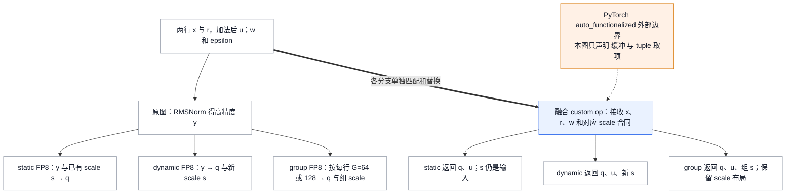

各分支返回 `(q,u,s)` 中自己承诺的结果：static scale 沿用输入，dynamic/group scale 作为输出保留。T=2、H=4 表示 static/per-token 的教学计算，G=64/128 分支按前述重复规则扩大 H。scale 的量化公式与 packed ABI 继续见 [[02_engineering/03_infer_frameworks/vllm/17_vllm_quantization_analysis|量化设计]]。

ROCm 还有独立选择轴。`RocmAiterRMSNormQuantFusionPass` 先注册一个 norm 扇出到两个 group quant 的 `DoubleAiterRMSFp8GroupQuantPattern` 与可容忍 view 的同族，再注册单 group 与 residual group，避免宽 pattern 抢走共同的 norm；其 replacement 对同一 input 运行两次 fused norm+group quant，分别返回两组 q/scale；代价是重复 norm 计算，换取不物化供两个 quant 读取的高精度 y。per-token 分支根据 `quant_fp8` custom op 是否开启选择 AITER/native matcher，避免两条最终 trace 成相同 native 图而重复注册；RDNA 分支不注册这组 per-token pattern。`AiterRMSNormGatedFp8GroupQuantPattern` 另从 `GatedDeltaNetAttention` 发现 head 几何，仅 head_dim=128 且相应 GDN Triton kernel 可用时注册，将逐 head RMS、SiLU gate 与 group quant 合并。这些是真实 sibling families，不能用普通 RMS+quant 的 dtype guard 概括；它们的 kernel 运算证据归 20。

`RocmAiterSiluMulFp8GroupQuantFusionPass` 对同一个 T×2H 的 activation 保留 T×H 的 q 与 group-size=128 的 scale 两输出。`RocmAiterTritonAddRMSNormPadFusionPass` 则没有量化：hard-coded hidden=2880，pad multiple 枚举 128/256，对应尾部补 64/192 个零。原图由 y 分别喂 router GEMM 和 padding；replacement 返回 padded y 与 u，再用 padded y 的前 2880 列算 router logits，最终仍返回三项。**router GEMM 没有被合进 norm kernel**，这项融合省的是独立 padding 路径，不允许 router 误读补零后的更宽维度。


SiLU·Mul 的三个量化分支继续使用两个 token，并把 H 扩为 128：每行 gate 取 x 的 32 次重复，value 取 r 的 32 次重复，拼成 a 的 256 列。这次计算的是 `a_out=SiLU(gate)×value`，与 norm 输出 y 不同；三个 replacement 都量化同一份 a_out，各自保留对应的 scale 对象。

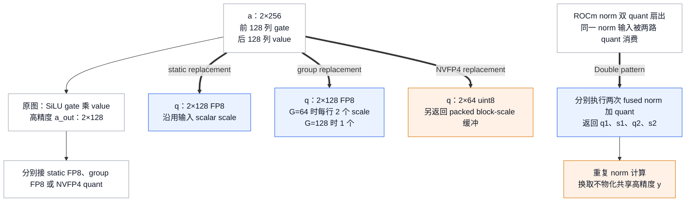

### 6.2 All-reduce + norm：保留完整 residual 的融合

先区分两种通信改写。§6.6 的 SP 改变 residual 的跨 rank 布局；`AllReduceFusionPass` 保留每 rank 的完整 residual，仅把通信与随后逐行计算交给同一个入口。为复用开篇例子，可令两 rank 的 partial x 分别为原 x 的一半，all-reduce 后仍得到 x，再与原 r 相加得到 u、norm 得到 y；融合前后，每 rank 均返回相同 shape 的 `(y,u)`。

CUDA 的枚举来自 `register_patterns`：无 residual、有 residual、Gemma 两种权重形态，另有 quant workspace 支持时的 static FP8 和 capability=100 时的 NVFP4。无 residual 路径为统一的 residual+norm 入口新建全零 residual，并单独分配 norm output；有 residual 路径把 `allreduce_in` 与 residual 作为可写对象，wrapper 的第 1/2 项就是 `(y,u)`。图尾只消费 y 时还有 output-only pattern，这项变化是减少观测输出，不是允许丢掉仍被下一层使用的 u。

Gemma 分支不是普通 mixed-dtype RMS 的放宽：它精确匹配 `weight.float()+1`，把原始 weight 与 `weight_bias=1.0` 交给 FlashInfer wrapper，让 weight+bias 的解释留在实现合同中。普通分支的 dtype check 会拒绝这种 FP32 gamma。static FP8 分支把同一个输入 scale 传成 `scale_factor`，输出 q 替换 y；NVFP4 分支还把 packed int32 scale buffer reinterpret 为 FP8 交给 FlashInfer，回来再 reinterpret 为 int32，返回 `(q,u,scale)`，不能删除这两次 dtype view。

ROCm 根据 `ca_comm.supports_per_group_quant` 选择是否注册 group FP8 融合。若没有该能力，只能先做 AR+RMS，quant 留在图里。DeepSeek indexer 分支更能说明输出为什么决定融合边界：同一个 y 同时喂 FP8 quant 和未量化 indexer GEMM，replacement 必须从 fused op 同时获得 `(q,u,scale,bf16_norm)`，再对 `bf16_norm` 执行原来的 indexer GEMM；最终返回 q、scale、u、indexer 结果和 bf16_norm 五项。它因此先于 quant-only 和 AR+RMS-only patterns 注册。**有额外高精度消费者时，融合不可能凭空消除高精度 norm 结果**。

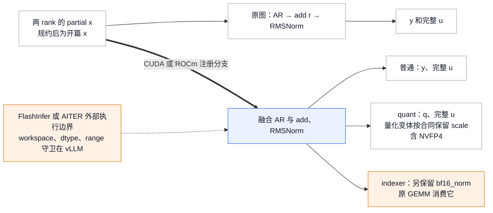

选择这种替换的压力是小 token 场景下通信入口、独立 norm 与访存开销；cap 是 workspace 能覆盖的最大 token 数。CUDA 构造阶段按目标/draft 最宽 hidden 分配 workspace，失败即保持 `disabled=True`；量化 workspace 单独失败只关闭 quant 分支。ROCm 检查 communicator 是否存在、旧 AITER hidden-size 支持，以及 per-group 能力。两边最后都以 `compile_range.end <= max_token_num` 判断**整段 range**，不存在“区间内小 batch 临时改回 fused”的逐次判定；阈值细节保留在 §9.1。FlashInfer/AITER 的通信调度与 CUDA/HIP kernel 内部不在本页的本地源码证明范围，设备实现由 20 接手。

### 6.3 QK-Norm、RoPE 与 KV：数值结果以外还有写入依赖

这组变体从 manager 的三个开关及 `Attention`/`MLAAttention` 两类 layer 枚举，不能视为一个 fused op 的可互换 provider。沿用两个 token，将开篇 u 重复 16 次作为每个 Q/K head 的 64 元素输入，将 w 同样重复作为 norm weight；V 可取重复后的 x，作为不参加归一化的旁路。选 Q heads=2、KV heads=1 后，每行拼成 qkv 的 256 列，split 得 q 的 128 列和 k/v 各 64 列。各 Q/K head 的 norm 输出都是开篇 y 的 16 次重复，随后才由 positions 和 cos/sin cache 做 RoPE。head_dim=64 是此家族支持几何的最小示例，所以这里扩大 hidden 并增加 head 轴，未改变逐 head RMS 的计算。

**QK-Norm 与 RoPE。** `QkNormRopePattern` 先将 q/k reshape 为逐 head 的 `2×2×64`、`2×1×64`，分别 RMSNorm，再 flatten 并旋转。replacement 用 `auto_functionalized(fused_qk_norm_rope)` 写回整块 qkv，再 split 出 flat 的 `(q_rope,k_rope,v)`；V 不参与 norm 与 rotation，也没有 KV cache 写入。它仅支持 FP16/BF16，且已发现的 layer 中任一 head_dim 不在 64/128/256，就使整个 pass 提前 return。这条不带 KV 的 pass 没有 token range 上限。

**RoPE 与 KV 写入。** `RopeReshapeKVCachePattern` 从已经完成前置 norm 的 qkv 开始，把 RoPE 和后面的 KV cache update 合成 `fused_rope_and_unified_kv_cache_update`。replacement 先 split/reshape，再调用融合入口，返回 `(dummy,q_rope,k_rope,v)`，q/k/v 在这里是逐 head shape。它不会隐式补做 Q/K norm；是否注册由各 layer 的 `fused_rope_kvcache_supported()` 判断，应用范围还受 256 token 上限限制。

`RopeStaticQQuantKVCachePattern` 处理 Q 后面另接 static FP8 quant 的形态，但 replacement 仍先融合 RoPE+KV，再对 q_out 调原 quant；返回 `(dummy,q_fp8,k_rope,v)`，沿用 q_scale，注册另依赖 `_supports_static_q_fp8_quant_fusion`。因此这个名称里的 quant 表示规则覆盖了带 quant 的图，不能由此推出 quant 进入同一个 kernel。

**QK-Norm、RoPE 与 KV 写入。** `QkNormRopeKvCachePattern` 才从原始 qkv 连续覆盖这三个阶段。replacement 新建 q_out/k_out，调用 AITER 三合一入口，V 仍来自原 qkv 的 split/view；无 quant 时返回 `(dummy,q_out,k_out,v)`。它逐 layer 检查能力，要求 FP16/BF16、head_dim=64/128/256、head_size_v 等于 head_size，并限定到 256 token。

`quant_query=True` 变体同样在三合一之后另调 AITER per-tensor quant，还返回 `q_scale_out`；Q 保持 flat `2×128`，以跨过 scale 写回形成的 mutation region。本地调用链把 Q 量化放在三合一调用之后，不能把它计入三合一入口。

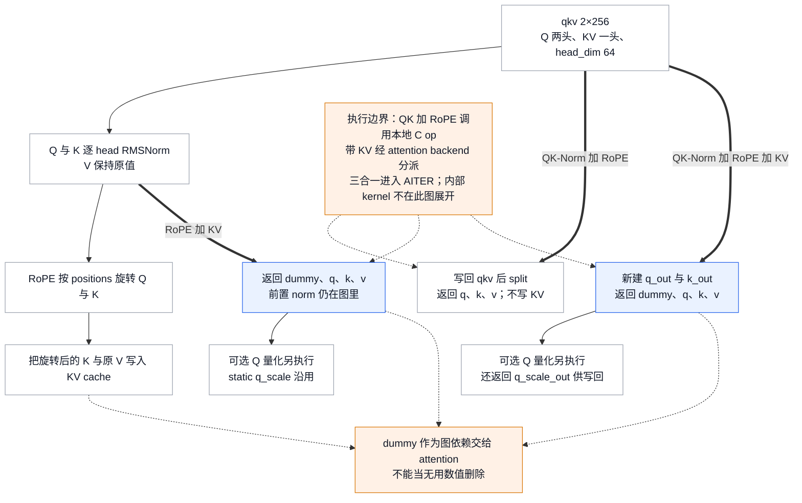

这张图的粗边各代表一项**编译期替换**，不表示一次 forward 重复执行三种方案。普通标准 attention 的通路是 qkv→norm→RoPE→KV 写，三种融合覆盖的是不同长度的连续片段；它们共用数值例子，却有不同的输出 shape 与副作用。更长片段先被消费后，短片段可能已不存在，所以三合一被装在两合一之前。

`SplitCoalescingPass` 与 `ScatterSplitReplacementPass` 正是为了让这条链重新连通：前者把重复 split 汇到一个输入节点，后者让 rotated q/k 的消费者直接取 functionalized 返回值，省去“scatter 回 qkv 再 split”的往返。它们只实现特定 QKV 图的改写。SplitCoalescing 要求 split 的所有 users 都是 getitem，并且同一 input 的 split sizes 相同；有非 getitem 消费者或 sizes 不同就不合并，但它没有比较 split dim。ScatterSplit 要求 query/key 是同一 split 的 getitem，functionalized 返回项的 users 全是 slice_scatter，并继续检查回写后的 split 形态；这些条件不满足时不做对应替换。源码依赖这条特定序列，不能据类名推导任意 view alias 安全。KV dummy 是顺序证据，shape 恰好为零也仍需保留。

MLA 的 sibling 分支 `MLARoPEKVCacheCatPattern` 没有同样的 QKV 三分割。输入改为 q_pe、k_pe 与压缩 latent `kv_c_normed`：原图先把 k_pe 加 head 维、RoPE，再调用 `unified_mla_kv_cache_update`；replacement 交给 `fused_rope_unified_mla_kv_cache_update`，并把返回的 k_pe 重新 unsqueeze，仍返回 `(dummy,q_pe,k_pe)`。注册按 layer、Neox、DeepSeek scaling 与可选 FlashInfer RoPE 组合展开；本 pass 没有覆盖 `is_applicable_for_range`，不能套用标准 RoPE+KV 的 256 门。这里的“cat”属于 KV 表示合同，cache 布局与 attention 读取由 10 号页接手。

### 6.4 Attention 输出量化：同一个 flag 有两类实现边界

普通 `AttnQuantFusionPass` 与 `MLAAttnQuantFusionPass` 都在 `fuse_attn_quant=True` 时安装，但它们分别发现 `Attention` 和 `MLAAttention`；各自调用 `layer.impl.fused_output_quant_supported(quant_key)`。普通分支有 static FP8 与 CUDA NVFP4；NVFP4 还要求 `torch.ops._C.scaled_fp4_quant` 存在，再按 layer 的 `fused_output_quant_supported(kNvfp4Dynamic)` 注册 `AttnNvfp4QuantPattern`，而非只看 SM capability。类注释“currently only static fp8”已窄于这条注册逻辑。MLA 分支还注册 CUDA 64/128 per-group FP8 的 scale-layout 组合。没有发现 layer 时告警并注册零个 pattern；新版 `_USE_LAYERNAME` 把 layer name 当 wildcard 时遇到首个支持 layer 就 break，因此这里的配置能力检查不等同于混合 backend 全图的逐层证明。

继续使用 §6.3 的 T=2、2 个 query head、head_dim=64。attention 计算后的值记为 output，不再等同于 norm 的 y；本节追踪这份相同 output 在各量化分支中的表示。原图得到 2×2×64 高精度 output，再 reshape 成 2×128 并 quant。`vllm/compilation/passes/fusion/attn_quant_fusion.py::AttnFp8StaticQuantPattern` 的 replacement 新建 2×2×64 的 FP8 buffer，传入原 scale 作为 `output_scale`，返回 flat 2×128。

NVFP4 replacement 则新建 2×2×32 的 uint8 buffer，输入 global scale 传给 `output_scale`，block-scale buffer 用 dtype view 交给 `output_block_scale`，返回 flat 2×64 的 packed 值与 scale。两个分支都完整保留 `kv_cache_dummy_dep`；它从 KV 写入到 attention 读取的依赖不能因 quant 融合而中断。

MLA 输入变成 q、kv_c_normed、k_pe，输出宽度按该 layer 定义。static/NVFP4 分支传同类 output buffers，group FP8 分支还把 group size、UE8M0、column-major 与 TMA flags 传入 `unified_mla_attention_with_output` 并返回 `(q,scale)`。**图级合并不等于 MLA 后端直接写量化结果**：冻结仓库的 `docs/design/fusions.md::Attention + Quantization` 明确说明 MLA 当前仍用中间 buffer，再独立量化，尚无 memory round-trip 收益。这里的证据是 replacement 接口与该设计文档声明；各 MLA 后端的内部实现与实际收益由 10/20 号页解释，未验证所有后端的执行行为。


下图把输出宽度记为 O，标准例子 T=2、O=128；MLA 取自身 layer 的 O。图中的 MLA 内部缓冲路径表示官方设计文档的说明。

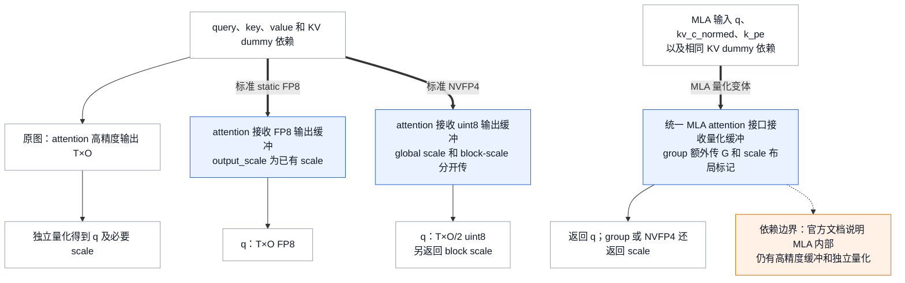

### 6.5 MLA 双 norm：保持两路与旁路输出

`MLADualRMSNormFusionPass` 的两个同级 pattern 说明融合也可以是平行分支合并。沿用源码 plain tracing 的几何，把两个 token 的每行 projected 设为开篇 u 重复两次的 q_c（8 列）、一份 u 的 kv_c（4 列），以及 x 前两项的 k_pe（2 列），合为 T×14；q/kv 两路 weight 分别取 w 的两次重复与一份 w。先 split 成 q_c 与 kv_lora 的 T×6，再从 kv_lora 分出 kv_c 与 k_pe。原图分别 norm q_c 和 kv_c；replacement 仍保留 split，但一个 `fused_mla_dual_rms_norm` 返回两路 normalized tensor，k_pe 原样返回。这个教学值让 q 侧输出等于 y 的两次重复、KV 侧等于 y，k_pe 仍为 `(1,2)`。但一般输入的两路均方值并不相同，不能把 T×12 连起来只做一个 RMS：模型定义的是分别沿 8 和 4 归一化。

FP8 sibling 的输入结构相同，tracing 几何为 q=256、kv=128、k_pe=64；相对于上面的教学值，可把 u/w 分别重复 64 次与 32 次，并把 k_pe 扩成 64 列旁路。前面的 ROCm norm+quant pass 已经把 Q 侧折成 per-token quant，KV 侧仍是普通 RMS；`MLADualRMSPerTokenQuantPattern` 专门匹配这个不对称中间图，合并后返回 `(q_fp8,q_scale,kv_normed,k_pe)`。它要位于 ROCm norm+quant 之后正因为它消费那一步的结果，而不是因为“最宽 pattern 一律最早跑”。两种 pattern 各枚举两个 epsilon，manager 只在相应 flag 与 AITER 启用时装载。省掉的是两路 norm 的分离调用；scale 与 k_pe 旁路不消失，AITER kernel 细节仍由 20 号页拥有。


下图从同一个 projected 的三段身份出发对比普通与 FP8 两种 replacement，分别保留两条归一化轴和 k_pe 旁路。普通例子 Q=8、K=4、P=2；FP8 沿用布局但按该 pattern 示例扩为 256/128/64。两条归一化轴绝不合并。

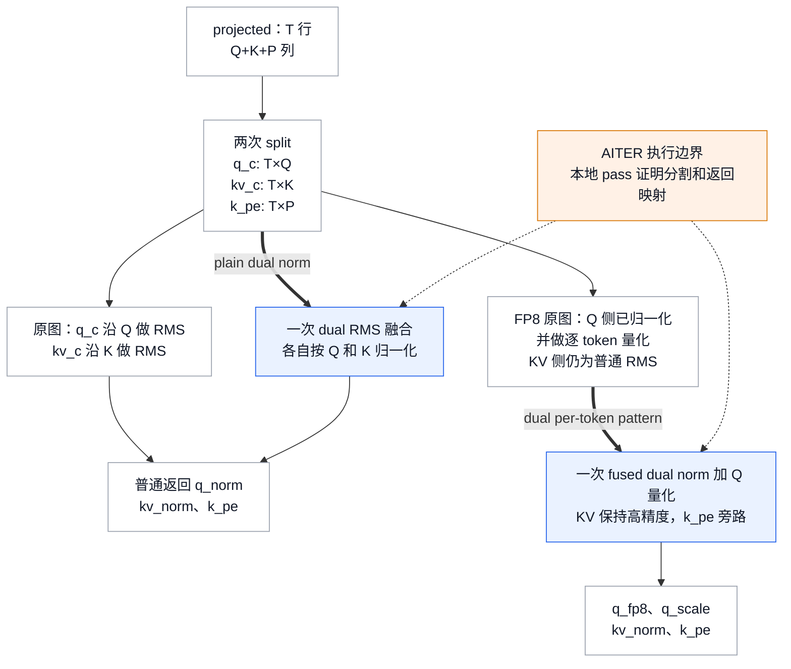

### 6.6 SP 改写为什么必须连 residual 一起改

沿用开篇 H=4、weight `w=(1,2,1,2)` 与 epsilon=1e-6，并把一行计算复制到 token 0–3。为说明两 rank 规约，让 rank 0 的每行 GEMM contribution 取开篇 x 的数值 `(1,2,3,4)`，rank 1 取开篇 r 的数值 `(1,0,-1,-2)`；这里复用的是数值，rank 1 的张量角色已变成规约贡献，而不是预先存在的 residual。两者求和后仍为 `u=(2,2,2,2)`，norm 结果仍为开篇 y，近似 `(1,2,1,2)`。

原图用 all-reduce（AR，求和后每 rank 保留全量）得到四行 u，每 rank 都重复做四行 norm。Sequence Parallelism（SP）把它改成沿 token 维 `dim=0` 的 reduce-scatter（RS，规约后分片）：rank 0 得 token 0–1，rank 1 得 token 2–3。每个 rank 只计算自己的两行 norm，再用 all-gather（AG，按 token 顺序收齐分片）恢复完整 y；作为 residual 返回的 u 则停留在本地分片。H=4 仅用于解释计算，实际设备阈值不会选择这个规模。

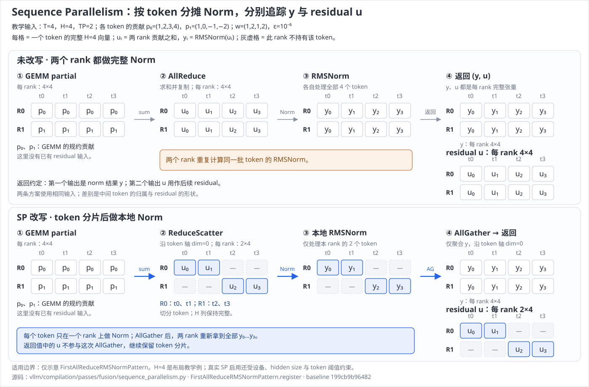

`vllm/compilation/passes/fusion/sequence_parallelism.py::FirstAllReduceRMSNormPattern` 的 `register` 返回值确实从 `(rmsnorm, all_reduce)` 变为 `(all_gather, reduce_scatter)`。逐行 RMS 不依赖其他 token，因而可在 reduce-scatter 后计算；all-gather 按原 token 顺序恢复 norm 输入给下一段 GEMM。每 rank 的 norm 行数从 4 降到 2，但多出显式分片/聚合并不自动保证加速；源码强调它为后续 `AsyncTPPass` 的 GEMM+通信融合准备图形态——官方 Quick Reference 干脆把它的 E2E Speedup 一栏写成 “Prereq for AsyncTP”，没有单列收益数字（`docs/design/fusions.md::Quick Reference`）。collective 的实现与 rank 语义由 [[02_engineering/03_infer_frameworks/vllm/18_vllm_distributed_inference_analysis|分布式推理]] 接手。

这不是可把任意局部子图单独替换的等价式：residual 的内部合同已改变，所以 `vllm/compilation/passes/fusion/sequence_parallelism.py::SequenceParallelismPass.is_applicable_for_range` 对 piecewise splitting 硬 assert，只允许 Inductor partition 或空 `splitting_ops` 的 whole graph；`compile_range.start` 必须达到有效的 `sp_min_token_num`。这个字段的自动值来自 `vllm/compilation/passes/fusion/sequence_parallelism.py::get_sequence_parallelism_threshold`：CUDA 上按 device capability 查 `SP_MIN_HIDDEN_SIZE`（SM90 与 SM100 家族均为 **8192**）与 `SP_MIN_PER_GPU_SIZE_MB`（SM90 为 **8 MiB**，SM100 家族为 **32 MiB**）；XPU 走硬编码的 **4096** 与 **8 MiB**；其它平台或未配置的 capability 返回 `None`。公式是 `min_per_gpu_mb × MiB × tp_size // (hidden_size × element_size)`；hidden_size 低于门槛同样返回 `None`。pass 构造时再把该值 clamp 到 `scheduler_config.max_num_batched_tokens`（`vllm/compilation/passes/fusion/sequence_parallelism.py::SequenceParallelismPass`）。实际是否启用以该配置值和 range 为准，不由玩具图决定。

`tests/compile/passes/distributed/test_sequence_parallelism.py::test_sequence_parallelism_pass` 打开了四处 replacement 与 collective 节点计数验证；该测试的执行断言没有 eager 数值对照，不能把它写成分布式数值等价测试。`tests/compile/passes/distributed/test_sequence_parallelism.py::test_sequence_parallelism_pass_requires_full_graph_compilation` 覆盖 whole-graph 限制。源码还保留从尾向前替换时 residual slice 的临时不合法状态，须在该 pass 内 NoOp cleanup 后才能进入编译；不能在中间阶段执行图来“抽查结果”。

### 6.7 SP 的后续层、量化与 AsyncTP 怎样接起来

上图只把首层的 `(norm, residual)` 合同画全，真实注册还必须覆盖后续层和量化出口。`SequenceParallelismPass.__init__` 的集合是 First/Middle × 普通/static FP8/可选 NVFP4；其中普通与 FP8 的 Middle 另外注册仅返回 norm 输出的版本，供图尾不再消费 residual 时匹配。它们复用同一条逐 token 独立性：norm 与静态量化可以只算 rank 所属 token，传给后续完整 GEMM 的输出才需要 all-gather。

**Middle。** 继续用两 rank、四 token 例子，先对新的 GEMM partial output 做 RS；rank0 拿 0–1 行，rank1 拿 2–3 行。前层若已 SP 化，residual 已经是本 rank 两行；若首个 embedding 不在图里而没有 First 匹配，residual 仍是四行，普通/FP8 Middle 用 `tp_rank * local_len` 切出正确两行。两条路径最终都对本地两行做 add+RMS，再 AG y，返回 local u。

**static FP8。** RS 后做 local norm 与 quant，AG 的是 FP8 q；所有 rank 沿用同一个输入 scale，不额外 AG 静态 scale。local residual 仍保持高精度。量化移动到通信前改变了 AG 的表示与 payload，数值容差仍须由实际测试决定。

**NVFP4。** RS 后 local norm，改用 `scaled_fp4_quant.default` 得到 packed q 与 block scales，然后**分别 AG q 和 scale**，local residual 不 AG。两路通信都必要：只 AG packed 值而留 scale 在本 rank 无法解释其他 rank 的 FP4 数值。它在检测到 out overload 存在时注册，不以 SM100 判定注册；kernel 实际能力归 20。

> [!note] NVFP4 的特定未验证边界
> `MiddleAllReduceRMSNormStaticNVFP4Pattern` 仍用 `residual[0:local_len]`，普通/FP8 Middle 已用 rank-aware 起点。在前层没有 First 匹配、residual 仍完整的例子里，rank1 据代码会取 rank0 的行；这与普通路径专门处理的 `inputs_embeds` 情形有张力。此处是两段源码对照的静态风险推断，未运行 NVFP4 分布式反例，不能把普通/FP8 的修复外推成 NVFP4 已获保证。

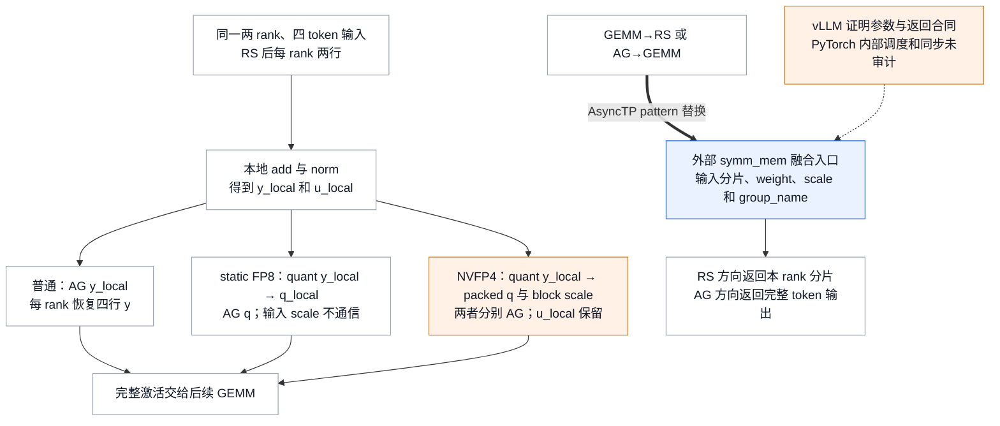

SP 把通信接缝显露出来后，`AsyncTPPass` 有两个方向。GEMM→RS 从每 rank 产生的完整 partial matrix 改成 `symm_mem.fused_matmul_reduce_scatter`，消费者仍拿本 rank 的 token 分片；AG→GEMM 从“先聚齐四行再矩阵乘”改成 `symm_mem.fused_all_gather_matmul`，weight 作为列表、gather_dim=0 和 process-group name 一起传入，replacement 返回该接口的 `mm_outputs`。两个方向都减少独立 GEMM/collective 边界，但不能仅从 vLLM 的调用推出外部 PyTorch 具体以几块、几条 stream 重叠或何处等待。

选择轴还包含 GEMM 表示。plain GEMM 两方向总会注册；BF16 模型额外注册 `_scaled_mm` 与可用的 CUTLASS FP8 分支，保留 scale_a/scale_b 与 output dtype。FlashInfer FP8 入口存在时再注册 bmm_fp8 两方向。NVFP4 只实现 AG→GEMM：`fused_all_gather_flashinfer_fp4_matmul` 断言 dim=0 和 2D 输入，把 packed activation 与 activation-scale 一并交给外部 `_pipelined_multi_all_gather_and_consume`；本地 callback 按 rank 对应 output shard 调用 FP4 GEMM，最后返回完整 output。注册还枚举 cutlass/cudnn/trtllm/cute-dsl 与相应 scale view、8×4 layout 组合，**没有对应的 NVFP4 GEMM→RS pattern**，源码明确要求以后单独实现 FP4 producer。

因此 AsyncTP 的成本不只是“打开 SP”：它启用 TP 组的 symmetric memory；FP4 AG 还需完整 activation/scale 接收 buffer 和 output shards，并通信 scale。其设计目标是在大 batch 时利用足量 GEMM 工作重叠通信，实际调度与收益仍取决于外部实现；硬门仍是 full graph，且受模型 dtype 与外部 operator 存在性限制。SP 有 token 下界；`vllm/compilation/passes/fusion/collective_fusion.py::AsyncTPPass.is_applicable_for_range` 只有 full-graph assert 后返回 True，不自带阈值，能否命中取决于图是否出现前述 AG/RS 形态。


## 7. Lowering 与 cache identity：实现选择必须可重复

经过融合后，一个 `fused_add_rms_norm` 节点仍只承诺计算，并没有指定由 native、C kernel 还是其他 provider 执行。`VllmIRLoweringPass.lower_matched_op` 先把该节点的 FX 参数映射成 `node.meta["val"]` 中的 fake 值，再调用与 eager 相同的 `IrOp.dispatch`。因此 shape、dtype 等信息会影响实现选择，但当前 batch 的真实 tensor 数值不会参与选择。

选中 provider 后，lowering 根据 signature 补齐默认参数，以 `func_impl_fn` 为 replacement trace 实现，并用 `replace_by_example` 把原 IR 节点替换成实现子图。若 provider 会写 activation，`func_impl_fn` 会在 trace 出的图中保留保护 clone，交给下一阶段判断能否回收。这里显式设置 `run_functional_passes=False`，因为被 trace 的实现可能含 mutation，不能让普通 functional DCE 擅自删除它；源码留下改用 `aot_export_module` 获取 functional graph 的 TODO。所有 IR fusion 必须在这一步之前完成，否则 matcher 将只能看见 provider 的展开图。

`selected_impls[op][node.name]` 记录每个节点最终选中的 provider。遍历结束后，pass 再用 `get_ir_op(node)` 检查残留 IR；若仍有未 lowering 的节点，打印 “Failed to lower vLLM IR ops” 并列出它们。这个记录与图 dump 一起能区分两种排障情况：前面的融合根本没有匹配，或者融合已经形成了 IR，但 lowering 选择了不同的实现。

测试用三个 RMSNorm 节点固定这项行为：两个普通节点选请求 provider，带 `variance_size` 的节点因谓词不支持而选 native；测试要求 lowered、unlowered 与重复执行的结果保持一致（`tests/compile/passes/ir/test_lowering.py::test_lowering_rms_norm`）。这里的“一致”用的是 `torch.testing.assert_close` 的 **torch 默认容差**，不是 §2.2 那套 IR 容差系统——两者不能互相顶替。

这段测试也不能推出所有 provider 都支持无 weight：`vllm/kernels/oink_ops.py::oink_rms_supported` 的第一条谓词就是 `variance_size is None and weight is not None`，而测试模型的第二个节点正是 `ops.rms_norm(x3, None, 1e-5)`。所以 Oink 可用并进入测试参数集时，该节点按当前 dispatch 应选 native，与 `assert selected["rms_norm_1"] == rms_provider` 存在张力。该依赖组合未运行验证；实际选择以 `supports_args` 为准，这个入口需要连同谓词阅读。

实现选择也是 cache correctness 的一部分。`vllm/compilation/passes/ir/lowering_pass.py::VllmIRLoweringPass.uuid` 包含每个 IR op 的 priority 与 priority 中每个 provider 的 implementation source UUID；`vllm/compilation/passes/pass_manager.py::PostGradPassManager.uuid` 再包含 `pass_config.compute_hash()`、实际 pass 序列、两次 cleanup、lowering、clone elimination、final functionalization 及 `compile_range`。测试确认只改变 fusion config 或重复添加同一个 pass 都会改变 manager UUID（`tests/compile/passes/test_pass_manager.py::test_pass_manager_uuid`）；同文件的 `test_bad_callable` 固定了 `add()` 只接受 `InductorPass`。OOT implementation 的源码 uuid 走的是同一条路（`vllm/ir/op.py::IrOpImpl.uuid`，注册机制归 20，见 `docs/design/vllm_ir.md::Out-of-Tree Implementations` 与 `tests/ir/test_op.py::test_uuid_and_oot`）。

**但 identity 并不对称，源码自己点出了缺口。** `vllm/compilation/backends.py::VllmBackend.configure_post_pass` 在安装 pre-grad pass 之后立刻做一件事：把 `pre_grad_custom_pass` 追加进 `_cache_config_ignore_prefix`，注释写明“Make sure pre_grad_custom_pass is not pickled as part of AOTAutograd built-in cache key”。也就是说，**建立 donation 证据的那个 pass 被显式排除在 AOTAutograd 的 cache key 之外**，而 `PostGradPassManager.uuid()` 里也没有它。所以“UUID 覆盖了全部改写”这句话是错的：它覆盖的是 post-grad 序列与 lowering policy，不覆盖 pre-grad functionalization 本身。这是一处具体的、源码自陈的不对称，比“不证明任意外部依赖都已纳入 hash”这类泛论更值得记住；同理，`ir_enable_torch_wrap` 作为 Dynamo guard 的全局值也走的是另一条 identity 通道（§3）。

因此“pass 顺序或 provider priority 改了，但复用旧 compiled artifact”不是允许的性能优化。它会让可观察实现与配置不一致；这里的 UUID 将已列举的 policy、pass 类与 implementation 文件内容纳入 identity，不证明任意外部依赖或环境变化都已纳入 hash。whole-model cache 文件如何建立与复用仍归 [[02_engineering/03_infer_frameworks/vllm/19_vllm_compilation_cudagraph_analysis|编译与 CUDA Graph]]，本页只拥有 pass/lowering 对 cache identity 的贡献。

### 7.1 `FixFunctionalizationPass` 的特殊风险

最终 pass 不是一般 reinplacing solver，而是一个目标 allowlist。源码对 rotary embedding 的 direct path 明说“理论上不应盲做，但在 vLLM 实际图中可行”，并把更好的长期方案指向 auto-functionalization v2 与 Inductor builtin reinplacing（`vllm/compilation/passes/utility/fix_functionalization.py::FixFunctionalizationPass`）。这个 TODO 还有另一半在配置里：`vllm/config/compilation.py::CompilationConfig.__post_init__` 仅在键缺失时把 `inductor_compile_config["enable_auto_functionalized_v2"]` 默认设成 `False`，注释写明“Custom passes (fusion) rely on auto-functionalization V1”，并链到 RFC。也就是说 v2 当前默认关闭，用户显式传入的值会被保留；源码注释明确说明这些 fusion 依赖 V1，保留用户值并不证明 V2 组合受支持。

这是本页必须保留的限制：新增 mutating op 不能因为“同样是 auto-functionalized”就自动加入 allowlist；它需要明确 mutated-arg mapping、getitem replacement、no-DCE ordering 与正反例测试。allowlist 内 wrapper 被 inplace custom op 取代之后，类注释明确要求 “After this pass, DCE should never be run”，任何 DCE 都可能删掉看似 dead 的 defunctionalized 节点。

## 8. 系统装配：从模型入口到可交付的 lowered graph

### 8.1 一次编译如何接收并交付这张图

前面各节已分别走完局部变换，现在把它们放回真实编译边界。以下选取启用 torch-wrap、且 pre hook 实际执行的 Inductor 路径；适配器与版本差异见 §3、§9.3。`RMSNorm.forward_native` 发射的 IR 节点和 Transformers backend 产生的 add+norm 先进入 FX；pre-grad 把 donation 变成 default overload 及元数据，AOTAutograd 后的图才交给 post-grad manager。19 号页提供 compile range 并决定何时调用编译器，本页最后交回可供 Inductor 处理的图，后续 codegen/cache/capture 由 19 接手。

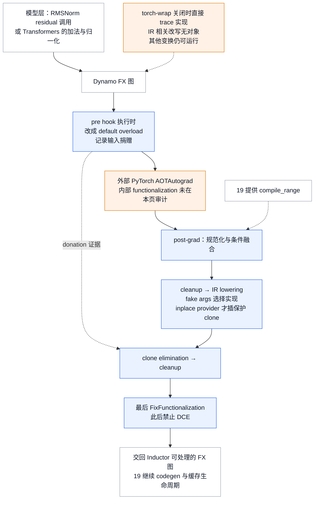

`PostGradPassManager.uuid()` 另将实际 post-grad 序列、range 与 lowering policy 交给 Inductor cache identity；pre-grad 排除项与 torch-wrap 的独立 guard 通道见§7。源码没有授权把“缓存命中”简写成“所有 pre-grad/post-grad 均不执行”：standalone pre-grad 在旧 PyTorch 上的版本边界见§9.3。

### 8.2 Pass 的装载与组成

`VllmBackend.configure_post_pass` 安装一个 pre-grad 类，`PostGradPassManager.configure` 构造 21 个条件类和 4 个固定尾部类，共 26 个内置 Pass 类；其中 `PostCleanupPass` 执行两次。`PassConfig` 的 16 个字段控制配置，用户 Pass 则由 backend 另行追加。官方 `docs/design/fusions.md::Quick Reference` 只列 11 项用户侧融合，未包含全部 utility 与尾部处理，因而不能用它代替源码中的装配集合。§12.2 按源码顺序提供入口导航。

固定主干负责把 IR 安全地交给后端，即使用户关闭全部融合 flag，manager 仍构造并在调用时执行两次 cleanup、IR lowering、clone elimination 与最终 functionalization。pre-grad donation pass 则由 backend 单独安装，其执行还受 §9.3 的适配器版本路径影响。`NoOpEliminationPass` 位于可配置列表中，但 `eliminate_noops` 是 `PassConfig` 唯一字面默认 True 的 bool，通常先替后续 matcher 移除无效 reshape/slice。

其余规则按实际 consumer 装配。SP/AsyncTP 需要 TP 与阈值条件；Transformers norm canonicalization 还要求下游 pad、all-reduce 或 norm+quant 至少一项开启。量化、RoPE 和 MLA 家族各有自己的 flag，平台分支再区分 CUDA 与 AITER 实现。同一个 `fuse_allreduce_rms` 因而只选一条平台路径，而 `fuse_attn_quant` 会分别尝试普通 Attention 与 MLA 的能力。各家族的具体条件见 §6，配置解析见 §9；这里决定的是哪些 pass 进入列表，具体 pattern 仍可能因 layer 或 kernel 能力注册零条。


`SplitCoalescingPass` 在 `configure` 里最多被**实例化三次**（三个 RoPE 家族 flag 各一次），`ScatterSplitReplacementPass` 最多两次。这不是笔误：每个实例都单独进入 `self.passes`、单独参与 range gate、单独把 uuid 贡献给 manager UUID——`tests/compile/passes/test_pass_manager.py::test_pass_manager_uuid` 正是用“同一个 pass 加两次 UUID 必须变”固定这条。

### 8.3 pass pipeline 的实际装配点

```text
VllmBackend.configure_post_pass()                          # vllm/compilation/backends.py
|-- assert pre_grad_custom_pass not in inductor_config     # 不允许被外部预占
|-- inductor_config["pre_grad_custom_pass"] = VllmIRInplaceFunctionalizationPass(vllm_config)
|     `-- (pre hook 被执行时) __call__ -> PassContext.donated_input_ids
|-- inductor_config["_cache_config_ignore_prefix"] += ["pre_grad_custom_pass"]
|     `-- 显式排除出 AOTAutograd 内置 cache key  [identity 不对称，见 §7]
|-- PostGradPassManager.configure(vllm_config)
|     |-- enable_transformers_norm_canonicalization =
|     |     (fuse_act_padding or fuse_allreduce_rms or fuse_norm_quant)
|     |      and model_config is not None and model_config.using_transformers_backend()
|     |-- with set_current_vllm_config(config, check_compile=False):
|     |     `-- self.passes += [...]                       # 按 PassConfig flag 逐条 append
|     `-- self.ir_lowering / clone_elimination / post_cleanup / fix_functionalization
|           = 无条件构造的四个固定尾部
|-- if pass_key in inductor_config:                        # 用户自带 post-grad pass
|     |-- isinstance(..., PostGradPassManager) -> raise ValueError
|     `-- pass_manager.add(inductor_compile_config[pass_key])   # 进 self.passes，参与 UUID
`-- inductor_config["post_grad_custom_post_pass"] = pass_manager
      `-- PostGradPassManager.__call__(graph)
          |-- VllmInductorPass.dump_prefix = 0             # 逐 pass 递增，是顺序的可观察证据
          |-- for pass_ in self.passes:
          |     |-- if pass_.is_applicable_for_range(compile_range): pass_(graph)
          |     `-- else: logger.debug 记 skip                [只有 6 个 pass 重写此方法]
          |-- post_cleanup(graph)                          # lowering 前，避免 lowering dead IR
          |-- ir_lowering(graph)                           # dispatch(fake args) -> replace_by_example
          |-- clone_elimination(graph)
          |-- post_cleanup(graph)
          |-- fix_functionalization(graph)                 # 之后禁止再 DCE
          `-- VllmPatternMatcherPass.log_match_summary()   # 各 pass 命中数
```

树里两处值得单独记住。第一，`is_applicable_for_range` 的**基类实现恒返回 `True`**（`vllm/compilation/passes/inductor_pass.py::InductorPass.is_applicable_for_range`），全树只有 6 个 pass 重写它：`SequenceParallelismPass`、`AsyncTPPass`、`AllReduceFusionPass`、`RocmAiterAllReduceFusionPass`、`RopeKVCacheFusionPass`、`QkNormRopeKvCacheFusionPass`。“range gate”不是一个普遍机制，而是这 6 条的局部约定。第二，`dump_prefix` 与 `dump_patterns` 产出的文件名（`post_grad.{i}.{pass_name}.{before|after}`、`patterns.{pass_name}.{i}.py`）是 pass 顺序与 pattern 集合的直接可观察证据——转储**路径与开关**归 19，这两组产物的语义归本页。

### 8.4 与相邻机制的衔接

图交回 Inductor 后，编译 artifact、partition、CUDA Graph capture/replay 与整个缓存生命周期继续由 [[02_engineering/03_infer_frameworks/vllm/19_vllm_compilation_cudagraph_analysis|编译与 CUDA Graph]] 解释。`compile_range` 与转储目录也来自那里；本页只拥有 range 到达 `is_applicable_for_range` 之后的判定语义：以完整区间判断是否应用当前 Pass；区间如何生成、切分和传入由 19 号页解释，对文件缓存如何建立只追到 pass UUID 的交接。`fast_moe_cold_start` 的消费点是 `vllm/forward_context.py::create_forward_context`，在 `vllm/compilation/` 和 `vllm/ir/` 下没有消费点，也不是 `PassConfig` 或 manager UUID 的直接字段，仍沿 19 号页阅读。

lowering 复用的 `IrOp.dispatch`、`_filter_priority_impls`、`supports_args`、平台 priority、`CustomOp` 与 OOT implementation 注册在 [[02_engineering/03_infer_frameworks/vllm/20_vllm_fused_ops_and_kernels_analysis|融合算子与 Kernel]] 展开；同页继续解释 kernel 计算、workspace、硬件收益与 fallback。本页保留 `register_fake`、`register_input_generator`、`DEFAULT_TOLERANCES` 和 `override_tolerance` 的声明侧，provider 对拍与 benchmark 则检验这些声明是否兑现。 `tests/kernels/ir/test_layernorm.py::TestRMSNorm.test_impls` 生成实参、检查 `supports_args`，再比较 provider 与 native；它调用的 `tests/ir/ir_test_utils.py::assert_close` 通过 `op.get_tolerance(actual.dtype)` 取声明容差，因而是容差执行侧归 20 的具体证据。worker 初始化中相邻的 `ir_op_priority.set_default()` 也沿 provider 选择链阅读。

SP 改写依赖 [[02_engineering/03_infer_frameworks/vllm/18_vllm_distributed_inference_analysis|分布式推理]] 的 collective 与 rank 语义；量化融合须服从 [[02_engineering/03_infer_frameworks/vllm/17_vllm_quantization_analysis|量化设计]] 的 quant key、scale 与 pack ABI；KV 写入与 attention 的 dummy 依赖则连接到 [[02_engineering/03_infer_frameworks/vllm/10_vllm_attention_backends_analysis|Attention Backend]] 的 metadata 和 backend 能力。前文的每项图变换保留这些约束，才能把计算交给对应实现，而不会因图上节点变少就丢失它们。

### 8.5 每一阶段消费与产出的不变量

整个顺序首先围绕“何时仍看得见高层语义”组织。pre-grad 把捐赠调用规范成 default，NoOp 与 split/scatter 清理使 pattern 的节点重新相邻，条件融合再按具体消费者的先后关系改图。SP 先产出分片形态，AsyncTP 才有 GEMM 与 collective 可合；router-pad 先取走特定 fused-add 链，剩余部分再供 AR+RMS 和 norm+quant 使用。

融合之后的第一遍 `PostCleanupPass` 用 `stable_topological_sort` 恢复拓扑序，再 `eliminate_dead_code`，避免 lowering 已经无用的 IR。lowering 固定 provider 并暴露实际保护 clone，此时 donation IDs 才能与这些 clone 对照；回收后再清理一次，去掉失去消费者的实现节点。最后 `FixFunctionalizationPass` 把 allowlist 中的 wrapper 恢复成 inplace op。它在 XPU 直接 return，非 allowlist 项保留；一旦恢复 mutation，后面就不能再按纯 functional 图跑 DCE。

因此新增 Pass 的位置会改变它能看到的图和必须服从的假设。早于 lowering 可以匹配 IR，晚于 lowering 才能看到 provider 子图与 clone，而 final fix 之后已不允许任意清理“无输出用途”的节点。§10.1 的用户入口选择了第一遍 cleanup 之前这个位置；§12.2 只提供源码与正文位置导航；修改顺序时应回到对应机制的条件与输出约束。


## 9. 配置契约

**覆盖率**：本页拥有 `vllm/config/compilation.py::PassConfig` 的 **16/16** 个字段，以及 19 明确移交的 6 个 `CompilationConfig` 字段中属于 IR/pass 的那一面，合计 **22 个字段**。`CompilationConfig` 共 36 个字段，其余 30 个（含 `fast_moe_cold_start` 与 `debug_dump_path`）归 [[02_engineering/03_infer_frameworks/vllm/19_vllm_compilation_cudagraph_analysis|编译与 CUDA Graph]]。

解析链固定为四段，**顺序不能调换**：声明值（多为 `None`）→ `PassConfig.__post_init__` 的平台裁决 → `VllmConfig.__post_init__` 调 `_apply_optimization_level_defaults(OPTIMIZATION_LEVEL_TO_CONFIG[level])` → `VllmConfig.__post_init__` 的 SP/TP 与 splitting 裁决。平台裁决在 `PassConfig` **构造时只运行一次**，早于 level 默认，此后不再重跑——`_set_config_default` 用 `setattr` 直接写字段，不会重建 `PassConfig`。所以平台裁决**只拦得住用户显式给的真值**；由 level 默认函数写入的真值不经过它，默认路径上的平台安全完全取决于该默认函数自己有没有平台判据（第 9 项就没有）。**用户显式给值永远优先于 level 默认**——`_set_config_default` 只在字段仍为 `None` 时写入（`vllm/config/vllm.py::VllmConfig._apply_optimization_level_defaults`），官方文档 `docs/design/fusions.md::Enabling / Disabling Fusions` 也这么写。

### 9.1 `PassConfig` 全 16 字段

| # | 字段 | 声明默认 | O0 / O1 / O2 / O3 解析默认 | 触发什么、还有哪些反向裁决 | 本页小节 |
|---|---|---|---|---|---|
| 1 | `fuse_norm_quant` | `None` | F / `enable_norm_fusion` / 同 / 同 | `RMSNormQuantFusionPass`，ROCm 上另加 `RocmAiterRMSNormQuantFusionPass`；也是 `enable_transformers_norm_canonicalization` 的三个触发之一 | §2.1、§6.1 |
| 2 | `fuse_act_quant` | `None` | F / `enable_act_fusion` / 同 / 同 | `ActivationQuantFusionPass`，ROCm 上另加 `RocmAiterSiluMulFp8GroupQuantFusionPass` | §6.1 |
| 3 | `fuse_attn_quant` | `None` | F / F / `IS_QUANTIZED` / 同 | `AttnQuantFusionPass` + `MLAAttnQuantFusionPass`；非 inductor-partition 时反向改写 `splitting_ops`（后果归 19）。**`IS_QUANTIZED` 在本基线是模块级常量 `False`**，lambda 形式被注释掉并指向 issue 25689，所以四级实际都关 | §6.4 |
| 4 | `eliminate_noops` | **`Field(default=True)`**，唯一字面默认为真的 bool | 恒 True 除非显式关 | `NoOpEliminationPass`；关掉时 `PassConfig.__post_init__` 对 norm/act/attn/allreduce/pad 五种融合逐条 warn “might not work”（仅对用户显式开启的融合——该 warn 同样只在构造时跑一次，level 默认后开启的融合不会触发） | §5.3 |
| 5 | `enable_sp` | `None` | F / F / `IS_DENSE` / 同 | `SequenceParallelismPass`；`fuse_gemm_comms` 为真时强制置 True；TP==1 或阈值启发式返回 `None` 时连同 `fuse_gemm_comms` 一起强制置 False；PP>1 时追加 `+rms_norm`。**`IS_DENSE` 同为常量 `False`** | §6.6 |
| 6 | `fuse_gemm_comms` | `None` | F / F / `IS_DENSE` / 同 | `AsyncTPPass`，紧跟 SP 之后 append；它自己没有 token 阈值 | §6.7 |
| 7 | `fuse_allreduce_rms` | `None` | F / F / `enable_allreduce_rms_fusion` / 同 | CUDA 走 `AllReduceFusionPass`，AITER 走 `RocmAiterAllReduceFusionPass`。判据：`VLLM_BATCH_INVARIANT` 为真直接返回 False；ROCm 需 AITER 且 TP>1；CUDA 需 TP>1、has_flashinfer 且 SM100 家族或 SM90 | §6.2 |
| 8 | `enable_qk_norm_rope_fusion` | `None` | **四级全 False** | `SplitCoalescingPass` + `QKNormRoPEFusionPass`；追加 `+rotary_embedding`；非 CUDA-alike 且非 XPU 时 `__post_init__` 强制关 | §6.3 |
| 9 | `fuse_rope_kvcache_cat_mla` | `None` | F / F / `enable_rope_kvcache_mla_fusion` / 同 | `MLARoPEKVCacheCatFusionPass`；显式设为真时，非 CUDA-alike 由 `PassConfig.__post_init__` 强制关。**但 O2/O3 默认函数 `enable_rope_kvcache_mla_fusion` 只看 `use_inductor_graph_partition` 与 splitting ops，不带平台判据**，level 默认又晚于平台裁决写入，所以默认路径得出的真值不受这条否决约束。第 12、13 项的默认函数都先要求 `rocm_aiter_ops.is_enabled()`，不存在这个缺口 | §6.3 |
| 10 | `fuse_act_padding` | `None` | F / `enable_norm_pad_fusion` / 同 / 同（判据：`fused_add_rms_norm` 的首选 provider 是 aiter 且 hidden==2880） | `RocmAiterTritonAddRMSNormPadFusionPass`，**必须 append 在 AR+RMS 之前**（两者都消费 `fused_add_rms_norm`）；非 ROCm 强制关 | §6.1、§5.2 |
| 11 | `fuse_mla_dual_rms_norm` | `None` | F / `enable_mla_dual_rms_norm_fusion`（AITER 开启）/ 同 / 同 | `MLADualRMSNormFusionPass`；非 ROCm 强制关 | §6.5 |
| 12 | `fuse_rope_kvcache` | `None` | F / F / `enable_rope_kvcache_fusion` / 同 | `SplitCoalescingPass` + `ScatterSplitReplacementPass` + `RopeKVCacheFusionPass`；追加 `+rotary_embedding`；非 ROCm 强制关；`splitting_ops is None` 且未开 inductor partition 时被 `set_splitting_ops_for_v1` **反向关掉** | §6.3 |
| 13 | `fuse_qk_norm_rope_kvcache` | `Field(default=None)` | F / F / `enable_qk_norm_rope_kvcache` / 同 | 同 12 但换 `QkNormRopeKvCacheFusionPass`；docstring 明写对支持的 layer **supersedes** 第 8 与第 12 项；同样的 ROCm 与 splitting 反向裁决 | §6.3 |
| 14 | `rope_kvcache_fusion_max_token_num` | **`256`** | 恒 256 | 第 12、13 项的 `is_applicable_for_range` token 上限（`compile_range.end <= 该值`）；19 §4.2 把它消费成 compile-range 端点 | §6.3 |
| 15 | `fi_allreduce_fusion_max_size_mb` | `None` | `PassConfig.default_fi_allreduce_fusion_max_size_mb()`：按 device capability 与 world size 查 `FI_ALLREDUCE_FUSION_MAX_SIZE_MB` | `PassConfig.flashinfer_max_size(world_size)` 返回字节数（world size 不在 2/4/8/16 内返 `None`）；`AllReduceFusionPass` 再算 `max_size // (workspace_hidden_dim × element_size)` 得 `max_token_num`，并与 `max_num_batched_tokens` 取 min | §6.2、§9.4 |
| 16 | `sp_min_token_num` | `None` | `get_sequence_parallelism_threshold(hidden_size, tp, element_size)`，见 §6.6 | `SequenceParallelismPass.is_applicable_for_range` 的下界；pass 内再 clamp 到 `max_num_batched_tokens` | §6.6 |

**AR+RMS 阈值在两处用了不同的分母，基线里没有调和。** 19 §4.2 把第 7、15 项消费成 compile-range 端点时（`vllm/config/vllm.py::VllmConfig._set_compile_ranges`），用的是 `max_size // (model_config.get_hidden_size() * dtype.itemsize)`，**只看目标模型**；只有它小于 `max_num_batched_tokens` 时才加进端点。CUDA 上的 `vllm/compilation/passes/fusion/allreduce_rms_fusion.py::AllReduceFusionPass` 自己的门却是 `min(max_size // (workspace_hidden_dim * element_size), max_num_batched_tokens)`，其中 `_fused_ar_workspace_hidden_dim` 取**目标与 draft 两者 hidden size 的较大者**——docstring 指向 vLLM #52023：进程全局共享的 FlashInfer workspace 必须装得下更宽的 draft。于是 draft 比目标宽时端点大于门，`is_applicable_for_range` 对以该端点收尾的整段 range 返回 False，**本该被端点圈进融合区的那一段反而全部跳过 AR 融合**。这是静态读码推论，未运行验证。

ROCm 的 `RocmAiterAllReduceFusionPass` 两处都只用目标 hidden size，没有这个分歧，但它有两条 CUDA 路径没有的门：阈值取 `ca_comm.effective_max_size()`（与 19 §4.2 的 ROCm 分支一致）；以及当 `ca_comm.supports_dynamic_hidden_dim` 为假（aiter < 0.1.12）时，hidden size 必须落在 `_AITER_OLD_FUSED_AR_RMS_HIDDEN = (512, 1024, 2048, 4096)` 之内，否则 warn 后直接 return，整条融合不注册任何 pattern。

另有两个方法属于同一契约：`vllm/config/compilation.py::PassConfig.compute_hash` 的结果就是 `PostGradPassManager.uuid()` 里的 `state["pass_config"]`（§7）；`vllm/config/compilation.py::PassConfig.log_enabled_passes` 按 `fuse_` / `enable_` 前缀反射出已启用融合，是运行期核对配置的入口，在 `VllmConfig.__post_init__` 末尾调用。

**字段对账**：`PassConfig` 16 / 16 字段均在上表，另两个方法单独说明；没有字段移交其他页。

### 9.2 19 移交的 6 个 `CompilationConfig` 字段

| 字段 | 声明默认 | 解析默认 | 本页拥有的那一面 | 小节 |
|---|---|---|---|---|
| `backend` | `""` | CUDA-alike 上等价 `"inductor"` | 作为 `ir_enable_torch_wrap` / `custom_ops` 解析条件，并决定是否调用 Inductor hook；与外层 Torch backend 的层次关系见 §3，完整选择生命周期归 19 | §3 |
| `custom_ops` | `[]` | backend=="inductor" 且 mode!=NONE 时追加 `"none"`，否则 `"all"` | **pass 驱动的强制追加归本页**：`enable_qk_norm_rope_fusion` / `fuse_rope_kvcache` / `fuse_qk_norm_rope_kvcache` 任一为真就 `custom_ops.append("+rotary_embedding")`，源码两处 TODO 指向 issue 28042 “support rope native forward match”——即这些 pattern **只认 custom-op 形态的 rotary embedding，不认 native 展开**，是“pattern 命中不是数学证明”的又一实例；`enable_sp` 且 PP>1 时同理追加 `+rms_norm`。`CustomOp` 派发机制归 20 | §6 |
| `ir_enable_torch_wrap` | `None` | `mode == VLLM_COMPILE and backend == "inductor"`；CPU 平台强制 `False` | **全部** | §3 |
| `inductor_compile_config` | `{}` | 见右 | 本页拥有其中以下 IR 相关项：`enable_auto_functionalized_v2 = False`（`CompilationConfig.__post_init__` 在键缺失时设置，见 §7.1）；`_cache_config_ignore_prefix += ["pre_grad_custom_pass"]`（见 §7）；torch≥2.9、非 CPU 且这两个键均未显式设置时，`combo_kernels` / `benchmark_combo_kernel = True`，注释明写用于“fusing qk-norm and qk-rope when query and key have different shapes”。dict 作为通用编译旋钮归 19 | §7.1、§7 |
| `inductor_passes` | `{}` | 按 hook 名将解析对象写进 `inductor_compile_config` | 字符串解析、callable 字段类型/hash 边界见 §10.1；默认 post hook 最终要求 `InductorPass`，manager 对象被 `ValueError` 拒绝。用户对象追加到 `self.passes`，参与 range gate 与 UUID；推荐测试已使用的对象配置入口 | §10.1–10.2、§8.3 |
| `pass_config` | `PassConfig()` | 见 §9.1 | 全部 16 字段 | §9.1 |

**字段对账**：`CompilationConfig` 本页拥有上述 6 / 36 字段的指定面向；其余 30 字段归 19，未在本页重述。

### 9.3 相关环境变量

| 变量 | 默认 | 对本页的作用 |
|---|---|---|
| `VLLM_ENABLE_PREGRAD_PASSES` | `1` | torch < 2.12 且设为 `0` 时，`vllm/compilation/compiler_interface.py::InductorStandaloneAdaptor.compile` 会把 `torch._inductor.compile_fx._recursive_pre_grad_passes` patch 成恒等函数；这会绕过该入口负责的 pre-grad 处理，不能再依靠它将 `maybe_inplace` 改成 default 并填入 donation 证据（`PassContext` 初始化为空集合）。这里核验的是 vLLM 侧 patch，没有审计各 Torch 版本内部的所有 hook 调用路径。`vllm/envs.py` 的注释直接写着 “TODO(luka): maybe_inplace requires this”。torch ≥ 2.12 时该分支恒走 nullcontext，本变量无效。只作用于 standalone compile 路径（patch 写在 `InductorStandaloneAdaptor.compile` 内）。变量存在的理由是源码注释给的冷启动代价：pre-grad passes 在 cache 命中时也会运行，使冷编译多出 O(1s)，上游在 PyTorch 2.12 修复。同一段注释（`vllm/envs.py` 与 `compiler_interface.py`）开头还写着 “Inductor's pre-grad passes don't do anything for vLLM”，**这句已经过时**：同一注释块末尾的 “TODO(luka): maybe_inplace requires this” 与本行上文都表明，不能笼统认为 vLLM 已不需要 pre-grad 处理 |
| `VLLM_PATTERN_MATCH_DEBUG` | `None` | 设为某个 fx 节点名（如 `getitem_34`）时，`with_pattern_match_debug` 只在 vLLM 自己的 pass 执行期间打开 `TORCHINDUCTOR_PATTERN_MATCH_DEBUG`，避免把 Inductor 内建 pattern 的日志一起打出来（§5.1） |
| `VLLM_BATCH_INVARIANT` | `0` | 为真时 `enable_allreduce_rms_fusion` 直接返回 False：融合后的 AR+RMS 路径不是 batch-invariant |
| `VLLM_DEBUG_DUMP_PATH` | `None` | 覆盖 `CompilationConfig.debug_dump_path`，决定 `dump_graph` / `dump_patterns` 产物落到哪里。**路径与开关归 19**；本页只拥有 `post_grad.{i}.{pass_name}.{stage}` 里那个 `{i}` 的语义（§8.3） |

### 9.4 官方支持矩阵，以及它落后源码的两处

`docs/design/fusions.md::Support Matrix` 给出 11 行 × 5 类平台（SM100 / SM90 / SM89 / SM80 / ROCm）的量化方案支持格——11 行对应 10 个不同 flag，`fuse_attn_quant` 按普通 attention 与 MLA 分占两行——是配置这些字段时的第一手参考。它是**文档面**，源码为准的地方有两处必须点破。

> [!contradiction] 官方文档与基线源码不一致的两处
> 其一，`Support Matrix` 的 `†` 脚注称 “`enable_sp`/`fuse_gemm_comms` only autoconfigured for SM90 today”，而 `vllm/compilation/passes/fusion/sequence_parallelism.py::SP_MIN_HIDDEN_SIZE` 与 `SP_MIN_PER_GPU_SIZE_MB` 同时含 90 与 100 两个键（SM100 家族的 per-GPU 门槛是 32 MiB，注释写明“Blackwell 上更保守，让 TP8 更晚启动”）。源码的 SP 阈值启发式已经支持 SM100 家族；但 §9.1 中 `IS_DENSE=False` 仍使 `enable_sp/fuse_gemm_comms` 的各优化级别默认关闭。这里指启用 SP 后可在 SM100 上自动求阈值，不能据阈值表存在反推当前默认已打开 SP/AsyncTP。
> 其二，`vllm/config/compilation.py::PassConfig` 中 `fi_allreduce_fusion_max_size_mb` 的 docstring 抄了一份 `{90: {2:64, 4:2, 8:1}, 100: {2:64, 4:32, 8:1}}`，而真值 `vllm/compilation/passes/fusion/allreduce_rms_fusion.py::FI_ALLREDUCE_FUSION_MAX_SIZE_MB` 是 SM90 `{2:64, 4:2, 8:0.5}`、SM100 `{2:64, 4:32, 8:1, 16:64}`，另有 SM103 与 SM107 两组 docstring 完全没提。以真值为准；docstring 只是注释，不参与查表。

## 10. 自定义 Pass：接入、改写与验证

### 10.1 用户怎样接入自己的 Pass

扩展首先要选对接口。一个编译 backend 通常接收 GraphModule 与 example inputs，返回可执行对象；这里的 `InductorPass` 接收的是 `torch.fx.Graph`，签名为 `__call__(graph) -> None`，直接修改这张图。`PostGradPassManager` 忽略它的返回值，所以返回另一个 Graph 并不会替换当前图。若只是希望观察现有图，最小实现可以先只读节点，确认接入时机和 compile range，再加入具体改写。

下面沿用仓库 `test_compile_ranges` 已采用的配置路径。类应放在真实 `.py` 文件中，默认 `uuid()` 要通过 `inspect.getsource` 读取类源码：

```python
import torch
from vllm.compilation.passes.inductor_pass import InductorPass, get_pass_context
from vllm.config import CompilationConfig, CompilationMode, VllmConfig

class AuditPass(InductorPass):
    def __call__(self, graph: torch.fx.Graph) -> None:
        compile_range = get_pass_context().compile_range
        nodes = [(node.op, str(node.target)) for node in graph.nodes]
        print("AuditPass", compile_range, nodes)

config = VllmConfig(
    compilation_config=CompilationConfig(
        mode=CompilationMode.VLLM_COMPILE,
        backend="inductor",
        inductor_compile_config={
            "post_grad_custom_post_pass": AuditPass(),
        },
    ),
)
```

这段只构造接入配置，本身不触发编译。完整模型仍需要在 `set_current_vllm_config(config)` 下构造，并按模型要求进入 forward context；可沿 `tests/compile/test_compile_ranges.py::TestModel/run_model/test_compile_ranges` 的完整运行器使用。该测试在同一 hook 传入 `PostGradRangeChecker(InductorPass)`，检查六个编译区间和六次调用。`get_pass_context` 只在 vLLM 建立的 compile 作用域中可用，脱离这个运行器单独调用 pass 或裸用 Torch Inductor，不能假设该上下文存在。

接入之后，`VllmBackend.configure_post_pass` 先配置内置 Pass，再把用户对象 `add` 到 `self.passes` 尾部，最后把 hook 改成整个 manager。执行顺序是**条件内置融合 → 用户 Pass → cleanup → IR lowering → clone elimination → cleanup → FixFunctionalization**。这样用户仍有机会处理尚未 lowering 的 IR，并复用固定尾段；但此前内置 Pass 已经消费的子图不会重新出现，用户 Pass 产出的新形态也不会自动送回前面的 norm+quant 再跑一轮。

`PostGradPassManager.add` 只有 append，没有 `before`、`after` 或 index 参数。若新规则必须为某个内置融合准备输入，应在 `configure` 的相应位置加入实现并维护次序依赖，或在平台提供的 manager 类中组织顺序；默认平台通过 `Platform.get_pass_manager_cls` 选择 manager。直接把一个 manager 放入该用户 hook 会被 `ValueError` 拒绝，普通函数则不满足 `InductorPass` 的 assert。函数形式需显式包装成 `CallableInductorPass(audit)`；而 `pre_grad_custom_pass` 已被 vLLM 独占，用户配置同名键会在 `configure_post_pass` 的 assert 失败，不能照 post hook 的方式追加。

还需留意 `inductor_passes` 这个便利字段与上述对象入口的差别。`CompilationConfig.__post_init__` 将其 key 原样写入 `inductor_compile_config`，所以 key 是实际 hook 名，不是用户给规则起的任意名字。它内部有将字符串或 callable 包装成 `CallableInductorPass` 的分支，但字段注解为 `dict[str,str]`，且 `compute_hash` 仍处理原字典：原始普通函数缺少 `uuid` 时会在 `normalize_value` 路径受拒。因而仅凭 docstring 不能把直接传 callable 宣称为完整构造与缓存路径都有效；上面的 `inductor_compile_config + InductorPass` 是仓库测试实际使用的入口。

字符串路径也只是解析对象，不会自动实例化类。当前实现使用 `__import__(module).__dict__[func_name]`，Python 对嵌套模块的 `__import__` 默认返回顶层包，所以 `pkg.sub.my_pass` 还依赖顶层导出，不能无条件当成子模块解析。若使用字符串形式，应让一个顶层模块导出具体 pass 实例或函数，并单独验证配置与 hash；直接传实例的示例避免了这项歧义。

### 10.2 从接入检查发展成一个融合规则

确认 hook 生效后，可以复用 §5.1 的规则组织方式。最接近真实源码的起点是 `AddRMSNormFusionPass`：继承 `VllmFusionPatternMatcherPass`，在构造时调用 `register`，编译时的 `__call__` 就会对当前 Graph 执行 `pm_pass.apply`。`vllm/compilation/passes/vllm_inductor_pass.py::VllmFusionPatternMatcherPass.uuid` 会将 pass 类与已注册的 replacement 类源码一起 hash，让规则实现参与缓存身份。下面复用已有 `AddRMSNormPattern` 展示装配，规则本身的三个组成部分已经在 §5.1 逐步展开：

```python
from vllm.compilation.passes.fusion.add_rms_fusion import AddRMSNormPattern
from vllm.compilation.passes.vllm_inductor_pass import VllmFusionPatternMatcherPass

class MyAddRMSPass(VllmFusionPatternMatcherPass):
    def __init__(self, config):
        super().__init__(config, "my_add_rms_pass")
        for epsilon in (1e-5, 1e-6):
            for residual_first in (True, False):
                self.register(AddRMSNormPattern(epsilon, residual_first))

# 沿用上节 config，在构造模型之前把 AuditPass 替换为融合 Pass。
config.compilation_config.inductor_compile_config[
    "post_grad_custom_post_pass"
] = MyAddRMSPass(config)
```

这是已有规则的装配示例，不会带来一种新的融合；若前面的内置 AddRMS 已执行，它可能零命中。开发自己的规则时，应另建 `VllmPatternReplacement`，分别提供 `pattern`、`replacement` 与 `get_inputs`，先明确所有输出、dtype、shape、scale 和副作用，再用最小输入形成可匹配的图。当前基类把 `pattern/replacement` 定义成返回闭包的 property，以避开源码注释指出的 Torch bound-method tracing 限制；沿现有实现写比只把任意类方法传给 matcher 更稳妥。

如果新融合有条件，例如目标 kernel 不支持 mixed dtype，单纯调用这个 `register` helper 还不够：它没有对外接收 `extra_check` 的参数。应参考 `RMSNormStaticQuantPattern.register`，在所属 `VllmPatternMatcherPass` 中直接调用 `pm.register_replacement` 并传入谓词，同时明确自己使用的 trace 归一化。若需要新增的是设备实现而非新计算关系，则应使用已有 IR 的 `register_impl`；若连高层语义也不存在，才需要补 `@register_op`、reference、fake 与实现。注册 provider 和注册 fusion pattern 是两种扩展，前者由 20 号页展开。

行为变化还必须进入编译缓存身份。`InductorPass.uuid()` 默认 hash 类源码，`CallableInductorPass` 默认 hash callable 源码，也能显式提供 UUID；实例配置、外部 helper 或查表数据不保证被这个默认值完整覆盖。自定义规则若依赖阈值、模式参数或外部实现，应覆写 `uuid`，用 `InductorPass.hash_dict` 把这些行为因素与相关源码 hash 一起纳入；调用次数、日志等诊断状态则不应改变身份。manager 最终还会纳入所有成员 UUID、顺序、PassConfig 与当前 compile range，因此把同一个 pass 追加两次也会改变 hash。

默认 `is_applicable_for_range` 返回 True。只对某些 shape 有效的变换，应按整段闭区间约束它，而不是因为 tracing 样例满足条件就允许整个动态范围。每个 `self.passes` 成员都会经过这项检查，固定尾段则在循环外执行。缓存命中时 `CompilerManager.compile` 可在调用 compiler 前直接返回，因此验证 Pass 是否执行应使用冷编译或测试的禁用缓存 fixture；执行次数按子图与编译区间理解，不是每个 token 或每次 forward 一次。

验证应从隔离规则再走到生产装配。先用 `tests/compile/backend.py::TestBackend` 保存 `graph_pre_pass/graph_post_pass/final_graph`，检查应消失和应出现的 op，并对同一输入比较 eager/compiled 的所有输出；再加入未注册 epsilon、额外 users、mixed dtype、不同 stride、捐赠后复用或阈值外 range 等与该规则相关的反例。最后沿 `test_compile_ranges` 的生产 hook 路径检查区间与调用数，用 `test_pass_manager_uuid` 检查配置和顺序变化是否改变缓存身份。`TestBackend` 接受更宽的 callable 接口且可替换 pre hook，它是隔离测试工具，不能把这些权限当成 `VllmBackend` 的生产注入协议。上述示例未执行 vLLM/CUDA 运行验证。

## 11. 成本账与运行包线

下表把每条流程的收益与代价对上。编译期数量按冻结源码中的注册调用统计；运行期与 E2E 数字来自官方文档，并标为 indicative，未运行 GPU benchmark。

| 机制 | 得到什么 | 直接支付 | 上限或失败边界 |
|---|---|---|---|
| `maybe_inplace` donation | residual block 从**每层 2 次 allocation 降到 0 次**（在 inplace kernel 命中时，`docs/design/vllm_ir.md::Memory Savings Example`） | caller 必须放弃旧值；pre-grad pass 执行时会以 `ValueError` 拒绝后续图内旧值使用，eager 合同则是 undefined behavior | 只在 provider 真的 `inplace=True` 且 clone elimination 全部四条检查通过时兑现 |
| lowering 的保护 clone | inplace provider 可以安全进入 functional 图 | 仅当所选 provider 的 `inplace=True` 时 clone activation；functional provider 直接调用 `impl_fn`，不插这层保护 clone；clone elimination 未回收的 clone 仍代表 copy 语义，最终是否物化由后续 compiler 决定 | 会被写的未捐赠 graph input、layout 变化或写后仍有旧值 user 会保留 clone；unknown HOP 只按 writer 检查，不必然保留 |
| pattern 注册 | 结构相等且可 trace 的 matcher | 注册时把 pattern、replacement 与示例张量交给 PyTorch matcher；实际 trace 次数属于外部实现，未审计。vLLM 注册调用清点：`AddRMSNormFusionPass` 4 个、`RMSNormReshapeFusionPass` 4 个、`RocmAiterTritonAddRMSNormPadFusionPass` 2 epsilon × 2 pad multiple = 4 个、`SequenceParallelismPass` 每 epsilon 有 4～6 个 pattern 类，但 FP8 Middle 与普通 Middle 各另注册 output-only 版本，实际 `register_replacement` 共 **12～16 次** | 这些是 pass 构造/注册期工作；manager 可被多次构造，不能从构造函数推出“每进程仅一次”，也未测其耗时 |
| IR lowering | 实现选择推迟到 fake metadata 已知之后 | `lower_matched_op` 对**每个** IR 节点重新 trace 一次 implementation，源码留有 `TODO(luka): Cache the fx_replacement to avoid re-tracing the same impl` | 节点数越多编译越慢；这是编译期成本，不进运行期 |
| AR+RMS 融合 | 官方 indicative E2E 5–20% | 需要 FlashInfer workspace，且 `max_token_num` 由 workspace 反算 | 超过 `max_token_num` 的 range 直接 skip；world size 不在 2/4/8/16 内返回 `None` 并整体 disabled |
| attention + quant | 官方 indicative 3–7% | 需要 backend 自陈支持 fused output quant；非 inductor-partition 时改写 `splitting_ops`，代价落在 19 | MLA 变体官方标 TBD |
| RoPE + KV / QK-Norm + RoPE | 官方 indicative 2–4% / 2–3% | 强制追加 `+rotary_embedding`，即放弃该 op 的 native 展开 | **两者边界不同**：RoPE + KV（`RopeKVCacheFusionPass`，以及带 KV 的 `QkNormRopeKvCacheFusionPass`）只在 `compile_range.end <= rope_kvcache_fusion_max_token_num`（256）时应用，大 batch prefill 走未融合路径；不带 KV 的 `QKNormRoPEFusionPass` **没有重写 `is_applicable_for_range`**（沿用默认 range 方法，见 §6.3），对所有 range 都应用 |
| AsyncTP | 官方 indicative 7–10% | 必须先做 SP；full-graph 编译，piecewise 不可用 | SP 自身官方标为 “Prereq for AsyncTP”，**未给独立收益数字**——与 §6.6“多出显式分片/聚合并不自动保证加速”互为佐证 |
| norm+quant / act+quant / MLA dual RMS | 官方 indicative 各 1–4% / 1–4% / 1–2% | 每条各自的 pattern 注册与 dtype 检查 | `fuse_act_padding` 与 MLA attn+quant 官方标 TBD |
| UUID 纳入 identity | 配置或实现改变时旧 artifact 自动失效 | manager 计算配置与 pass UUID；implementation 的 `uuid()` 有 `weak_cache`，不是每次重读源码文件 | 不覆盖 pre-grad functionalization 与 torch-wrap 全局值（§7） |

**运行包线**：未运行 vLLM CUDA/ROCm/XPU、分布式 pytest 或 GPU benchmark；上表所有百分比都是官方自陈的 indicative 值，随模型、batch 与硬件大幅变化，官方文档自己也要求逐用例实测。本地 PyTorch/Inductor matcher、functionalization 与外部 FlashInfer/AITER kernel 实现未作完整源码审计。对 copy 与局部 norm 工作量的判断来自图和读写合同，未测端到端加速。

## 12. 验证：按不变量测，而不是只看 match count

| 风险 | 必须验证的正例 | 必须验证的反例 / 边界 | 现有证据 |
|---|---|---|---|
| stable semantics | 每个 dtype 的可接受偏差被显式声明，需要时可逐 op 覆盖 | 未声明容差的 dtype 取值时抛错；provider schema 或 `supports_args` 签名不一致时注册失败 | `vllm/ir/tolerances.py::DEFAULT_TOLERANCES`；`vllm/ir/ops/layernorm.py::rms_norm` 的 `override_tolerance`；`tests/ir/test_op.py::test_bad_impl_registrations` |
| torch wrap | 全局开关翻转后 `IrOp.__call__` 走对分支，上下文退出正确还原 | 关掉后 IR-level matcher 与 lowering 不再看到该调用的 IR 节点；utility 与 custom-op fusion 仍可能作用于其他节点 | `tests/ir/test_op.py::test_set_default_torch_wrap`；`tests/compile/passes/ir/test_lowering.py::test_lowering_rms_norm` 的两处 `enable_torch_wrap(True)` |
| donation | `maybe_inplace` graph input 可把 protective clone 回收 | pre pass 执行时拒绝捐赠后的 later use；default overload 仍保留输入 | `tests/compile/passes/ir/test_inplace_functionalization.py::test_inplace_functionalization`、`tests/compile/passes/ir/test_inplace_functionalization.py::test_maybe_inplace_reuse_error`、`tests/compile/passes/ir/test_inplace_functionalization.py::test_piecewise_compilation_with_donated_buffers` |
| alias / clone | mutating clone：donated input、无 post-write old-value user 且 layout 相同才可消 clone；纯读 clone 不要求 donation | mutating non-donated placeholder、layout-changing clone 保留；unknown HOP 按 writer 分支处理 | `tests/compile/passes/ir/test_clone_cleanup.py::TestCloneCleanupWithDonatedInputs`、`tests/compile/passes/ir/test_clone_cleanup.py::TestCloneCleanup.test_keep_clone_that_changes_layout` |
| fusion | exact pattern、capability、dtype 与 range 满足时 replacement 命中且数值对 reference | 验证额外 users 或近似 pattern 能否匹配并保留全部可观察输出；mixed dtype、unsupported head dim / backend、阈值外 range 应服从各自拒绝条件 | guards 分布在 `vllm/compilation/passes/fusion/rms_quant_fusion.py::_rms_input_weight_dtype_match`、`vllm/compilation/passes/fusion/qk_norm_rope_kvcache_fusion.py::QkNormRopeKvCacheFusionPass` 与各 pass tests；skip 边界见 `tests/compile/passes/test_fusion.py::test_fusion_rmsnorm_quant` |
| ordering | 各 pass 的 match summary 与逐 pass 递增的 dump 序号可读；lowering 后图内不再残留 IR | 交换 specific / broad pass、在 final defunctionalization 后跑 DCE 应被测试禁止 | `vllm/compilation/passes/vllm_inductor_pass.py::VllmPatternMatcherPass.match_table`；`vllm/compilation/passes/vllm_inductor_pass.py::VllmInductorPass.dump_graph`；`vllm/compilation/passes/utility/fix_functionalization.py::FixFunctionalizationPass` |
| cache identity | 相同 config/source/range 生成稳定 UUID | pass 序列、fusion config、provider priority 或 impl source 变化必须失效；pre-grad pass 被显式排除是已知缺口 | `tests/compile/passes/test_pass_manager.py::test_pass_manager_uuid`；`vllm/compilation/passes/ir/lowering_pass.py::VllmIRLoweringPass.uuid`；`vllm/compilation/backends.py::VllmBackend.configure_post_pass` |

### 12.1 从入口到反例的稳定源码路线

下表提供主要实现与测试的阅读入口，路径相对冻结源码 checkout；`::` 后是搜索符号，不依赖易漂移行号。

| 顺序 | 源码入口 | 机制与对应测试 |
|---|---|---|
| 1 | `vllm/ir/ops/layernorm.py::rms_norm`、`vllm/ir/ops/layernorm.py::fused_add_rms_norm` | reference 的 FP32 累加、weight cast、两个输出、float16 容差覆盖；不是 bitwise 等价担保 |
| 2 | `vllm/ir/op.py::IrOp.__init__`、`vllm/ir/op.py::IrOpImpl.func_impl_fn`、`vllm/ir/op.py::IrOpInplaceOverload.__init__` | schema/fake 与 default copy；`tests/ir/test_op.py::test_bad_impl_registrations` |
| 3 | `vllm/ir/op.py::IrOp.__call__`、`vllm/ir/op.py::set_default_torch_wrap`、`vllm/v1/worker/worker_base.py::WorkerBase.__init__` | IR 节点何时进入 FX 图；`tests/ir/test_op.py::test_set_default_torch_wrap` |
| 4 | `vllm/compilation/passes/fusion/add_rms_fusion.py::AddRMSNormPattern`、`vllm/compilation/passes/fusion/add_rms_fusion.py::FusedAddRMSNormReshapePattern` | 两输出和 prefix-flatten；`tests/compile/passes/test_rmsnorm_reshape_fusion.py::test_add_rmsnorm_reshape_fusion` |
| 5 | `vllm/compilation/passes/ir/inplace_functionalization.py::VllmIRInplaceFunctionalizationPass.__call__` | donation set 与 later-use hard fail；`tests/compile/passes/ir/test_inplace_functionalization.py::test_maybe_inplace_reuse_error` |
| 6 | `vllm/compilation/passes/ir/clone_elimination.py::UnsafeCloneEliminationPass.__call__`、`vllm/compilation/passes/ir/clone_elimination.py::clone_preserves_layout` | A/B 的状态与 layout 反例；`tests/compile/passes/ir/test_clone_cleanup.py::TestCloneCleanup` |
| 7 | `vllm/compilation/passes/vllm_inductor_pass.py::VllmFusionPatternMatcherPass._trace_fn`、`vllm/compilation/passes/vllm_inductor_pass.py::fold_consecutive_reshapes` | Python pattern 为何能命中编译后的图，以及归一化覆盖面为何有限 |
| 8 | `vllm/compilation/passes/fusion/sequence_parallelism.py::get_sequence_parallelism_threshold`、`vllm/compilation/passes/fusion/sequence_parallelism.py::FirstAllReduceRMSNormPattern` | residual 分片、阈值公式、临时 slice；`tests/compile/passes/distributed/test_sequence_parallelism.py::test_sequence_parallelism_pass` |
| 9 | `vllm/compilation/passes/fusion/rms_quant_fusion.py::RMSNormStaticQuantPattern`、`vllm/compilation/passes/fusion/attn_quant_fusion.py::AttnQuantFusionPass` | scale / output / KV dependency 与逐 layer 能力门；`tests/compile/passes/test_fusion.py::test_fusion_rmsnorm_quant` 的 packed-scale skip |
| 10 | `vllm/compilation/passes/ir/lowering_pass.py::VllmIRLoweringPass.lower_matched_op`、`vllm/kernels/oink_ops.py::oink_rms_supported` | fake dispatch、保护 clone、UUID 与 Oink 谓词张力；`tests/compile/passes/ir/test_lowering.py::test_lowering_rms_norm` |
| 11 | `vllm/compilation/passes/pass_manager.py::PostGradPassManager.configure`、`vllm/compilation/passes/utility/fix_functionalization.py::FixFunctionalizationPass` | 26 条流程的注册与实际顺序、final mutation；`tests/compile/passes/test_pass_manager.py::test_pass_manager_uuid` |
| 12 | `vllm/config/compilation.py::PassConfig`、`vllm/config/vllm.py::OPTIMIZATION_LEVEL_02`、`vllm/compilation/backends.py::VllmBackend.configure_post_pass` | 16 字段的解析链、level 默认与 cache-key 例外 |
| 13 | `vllm/config/compilation.py::CompilationConfig.init_backend`、`vllm/compilation/wrapper.py::TorchCompileWrapper.__init__`、`vllm/compilation/backends.py::make_compiler` | Torch backend 与 vLLM 内部 adaptor 两层选择；`vllm/compilation/compiler_interface.py` 的三个 adaptor 解释 hook 配置交给哪里 |
| 14 | `vllm/compilation/passes/inductor_pass.py::InductorPass`、`vllm/compilation/passes/inductor_pass.py::CallableInductorPass`、`vllm/compilation/passes/inductor_pass.py::get_pass_context`、`vllm/config/compilation.py::CompilationConfig.__post_init__`、`vllm/config/utils.py::normalize_value` | 对象接入、原地 Graph 协议、UUID 与 callable 配置边界；`tests/compile/test_compile_ranges.py::test_compile_ranges` |

### 12.2 内置 Pass 源码导航

以下只列实现入口和正文位置，按 §8.2 的内置装配集合排列；算法、适用条件和依赖边界以对应正文为准。用户追加的 Pass 见 §10。

| 实现入口 | 正文位置 |
|---|---|
| `vllm/compilation/passes/ir/inplace_functionalization.py::VllmIRInplaceFunctionalizationPass.__call__` | §4.2 |
| `vllm/compilation/passes/utility/noop_elimination.py::NoOpEliminationPass.__call__` | §5.3 |
| `vllm/compilation/passes/fusion/sequence_parallelism.py::SequenceParallelismPass` | §6.6 |
| `vllm/compilation/passes/fusion/collective_fusion.py::AsyncTPPass` | §6.7 |
| `vllm/compilation/passes/fusion/add_rms_fusion.py::AddRMSNormFusionPass` | §2.1 |
| `vllm/compilation/passes/fusion/rocm_aiter_fusion.py::RocmAiterTritonAddRMSNormPadFusionPass` | §6.1 |
| `vllm/compilation/passes/fusion/allreduce_rms_fusion.py::RocmAiterAllReduceFusionPass` | §6.2 |
| `vllm/compilation/passes/fusion/allreduce_rms_fusion.py::AllReduceFusionPass` | §6.2 |
| `vllm/compilation/passes/fusion/add_rms_fusion.py::RMSNormReshapeFusionPass` | §2.1 |
| `vllm/compilation/passes/fusion/rocm_aiter_fusion.py::RocmAiterRMSNormQuantFusionPass` | §6.1 |
| `vllm/compilation/passes/fusion/rms_quant_fusion.py::RMSNormQuantFusionPass` | §6.1 |
| `vllm/compilation/passes/fusion/act_quant_fusion.py::ActivationQuantFusionPass` | §6.1 |
| `vllm/compilation/passes/fusion/rocm_aiter_fusion.py::RocmAiterSiluMulFp8GroupQuantFusionPass` | §6.1 |
| `vllm/compilation/passes/utility/split_coalescing.py::SplitCoalescingPass` | §6.3 |
| `vllm/compilation/passes/utility/scatter_split_replace.py::ScatterSplitReplacementPass` | §6.3 |
| `vllm/compilation/passes/fusion/qk_norm_rope_kvcache_fusion.py::QkNormRopeKvCacheFusionPass` | §6.3 |
| `vllm/compilation/passes/fusion/rocm_aiter_fusion.py::MLADualRMSNormFusionPass` | §6.5 |
| `vllm/compilation/passes/fusion/rope_kvcache_fusion.py::RopeKVCacheFusionPass` | §6.3 |
| `vllm/compilation/passes/fusion/mla_rope_kvcache_cat_fusion.py::MLARoPEKVCacheCatFusionPass` | §6.3 |
| `vllm/compilation/passes/fusion/attn_quant_fusion.py::AttnQuantFusionPass` | §6.4 |
| `vllm/compilation/passes/fusion/mla_attn_quant_fusion.py::MLAAttnQuantFusionPass` | §6.4 |
| `vllm/compilation/passes/fusion/qk_norm_rope_fusion.py::QKNormRoPEFusionPass` | §6.3 |
| `vllm/compilation/passes/utility/post_cleanup.py::PostCleanupPass.__call__` | §8.5 |
| `vllm/compilation/passes/ir/lowering_pass.py::VllmIRLoweringPass.lower_matched_op` | §7 |
| `vllm/compilation/passes/ir/clone_elimination.py::UnsafeCloneEliminationPass.__call__` | §4.3 |
| `vllm/compilation/passes/utility/fix_functionalization.py::FixFunctionalizationPass.__call__` | §7.1 |

## 13. 有源码锚点的发展方向

> [!note] 分析推断
> 以下不是已承诺 roadmap，只从当前 TODO 与显式限制外推维护压力。

- lowering 当前禁止对 replacement 跑 functional passes，并留下改用 `aot_export_module` 得到 functional graph 的 TODO（`vllm/compilation/passes/ir/lowering_pass.py::VllmIRLoweringPass.lower_matched_op`）。若这项完成，protective clone 与后置 defunctionalization 的责任可能收缩；在那之前不能按未来设计删掉现有安全层。同一函数还留着“缓存 fx_replacement 避免重复 trace”的 TODO，那是§11 编译期成本的直接来源。
- clone elimination 自陈 simple views 的 alias 支持仍未解决（`vllm/compilation/passes/ir/clone_elimination.py::UnsafeCloneEliminationPass`）。合理方向是把 view/storage 关系变成可验证元数据，而不是继续扩大“已知 vLLM case”的例外名单。
- final fix pass 指向 auto-functionalization v2 与 builtin reinplacing（`vllm/compilation/passes/utility/fix_functionalization.py::FixFunctionalizationPass`），而 v2 目前被 `CompilationConfig.__post_init__` 默认关闭。这说明当前 allowlist 是过渡性正确性边界；迁移必须先用相同 mutation/alias 反例证明新流程至少同样保守。
- pattern 归一化目前是逐 pass 手工拼的（`_trace_fn` 只做 view→reshape 与 noop permute，`fold_consecutive_reshapes` 只被一个 ROCm pass 使用）。随着 pattern 家族继续增加，“为什么这条没命中”会越来越依赖 `VLLM_PATTERN_MATCH_DEBUG` 与 `dump_patterns` 这类事后手段，而不是一层可证明的统一归一化。

## Related Pages

- [[02_engineering/03_infer_frameworks/vllm/19_vllm_compilation_cudagraph_analysis|vLLM 编译与 CUDA Graph]] — 接手本页产出的 lowered graph，解释 whole-model compile、partition、cache、capture 与 replay 生命周期；`compile_range` 与转储路径由它产生，`fast_moe_cold_start` 与 `debug_dump_path` 也归它。
- [[02_engineering/03_infer_frameworks/vllm/20_vllm_fused_ops_and_kernels_analysis|vLLM 融合算子与 Kernel]] — 拥有 provider / Kernel family 的收益、workspace、硬件能力与 fallback 账本，以及 `IrOp.dispatch` 三层选择、OOT implementation 注册与容差的执行侧对拍。
- [[02_engineering/03_infer_frameworks/vllm/17_vllm_quantization_analysis|vLLM 量化设计]] — 定义 quant key、scale 与 pack ABI；本页只解释这些合同怎样约束 fusion pattern。
- [[02_engineering/03_infer_frameworks/vllm/10_vllm_attention_backends_analysis|vLLM Attention Backend]] — 定义 attention metadata、KV 副作用与 backend capability；本页只保留其 functional dependency 与 fusion guard。
- [[02_engineering/03_infer_frameworks/vllm/18_vllm_distributed_inference_analysis|vLLM 分布式推理]] — 拥有 collective 与 rank 语义；本页只解释 sequence-parallel / async-TP pass 怎样改写其图表示。
