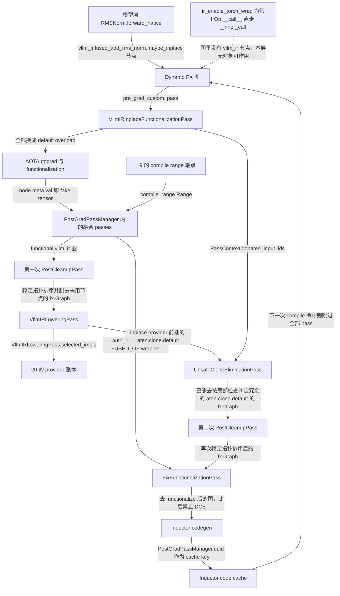
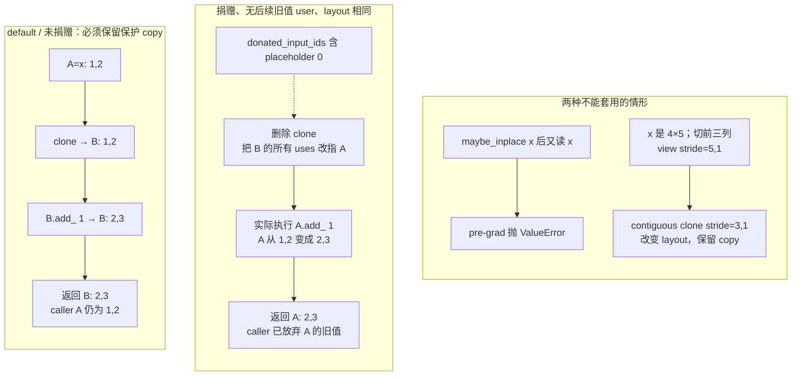
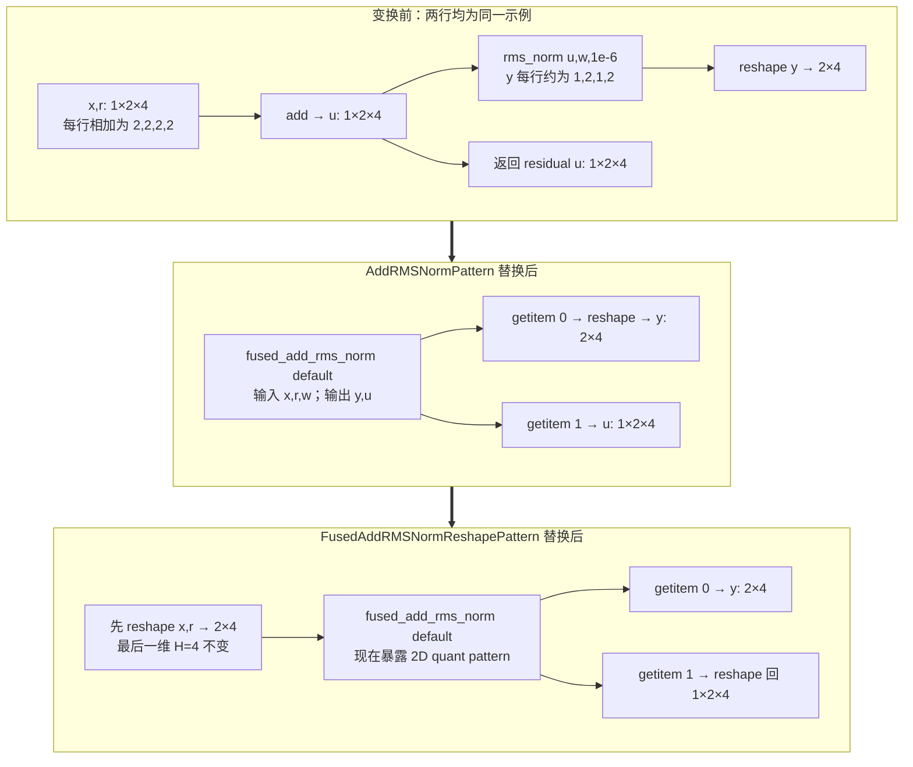
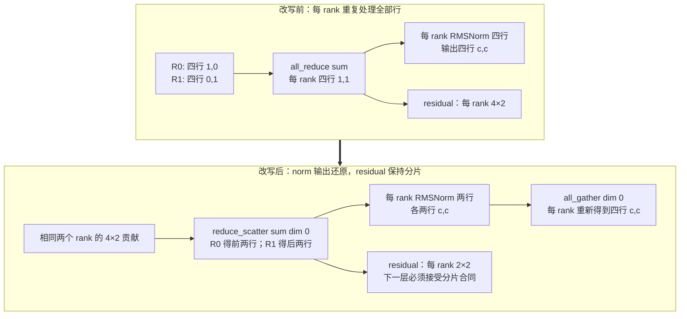

# vLLM IR 与融合 Pass：让语义先稳定，再让实现安全落地

> **读者问题**：同一个 RMSNorm、量化或 attention 片段可能有 native、设备 Kernel 与融合实现；其中一些还会覆盖输入。vLLM 怎样让图改写先看到稳定语义，又怎样约束 donation、alias 与 pass 顺序，哪些安全性仍未获得一般证明？
> **源码基线**：`vllm-project/vllm@199cb9b964822e59ab9b58d88e7be31eb419a2ae`（`main`，2026-09-08）。
> **主题**：IR 图变换、donation 与 lowering 的正确性边界。
> **中心命题**：vLLM IR 不是另造一套脱离 FX 的执行后端，而是在 FX 中保留一层“语义已定、实现未定”的 dialect：native reference、schema、fake result 与 mutation 声明先固定 observable contract；pre-grad pass 把 `maybe_inplace` 收敛为 functional op 并传递 donation 证据；post-grad passes 只在各自的 shape、dtype、能力和 compile-range 前提内改写；最后 lowering 对 inplace provider 先插 clone，再由受限的 clone elimination 回收局部冗余 copy；它尚不是一般 alias 证明。
> **适用范围**：本页拥有 IR stable semantics（含数值容差的**声明**侧）、`ir_enable_torch_wrap` 这个“IR 是否对编译器可见”的开关、donation / alias metadata、functionalization、pattern trace 归一化、canonicalization / fusion / lowering 顺序及其正确性边界，以及 `PassConfig` 全部 16 个字段。whole-model dynamic-shape 分区、compile/cache/capture/replay 生命周期归 [[02_engineering/03_infer_frameworks/vllm/19_vllm_compilation_cudagraph_analysis|vLLM 编译与 CUDA Graph]]；某个 provider、Kernel family 的收益、workspace、硬件选择与 dispatch 机制本身归 [[02_engineering/03_infer_frameworks/vllm/20_vllm_fused_ops_and_kernels_analysis|vLLM 融合算子与 Kernel]]。
> **最近更新**：2026-09-13。补入 torch-wrap 前置条件、26 条流程的穷尽清单与枚举依据、22 字段配置契约、闭环位置图、装配调用树与成本账；按源码订正 donation 调用点、AsyncTP 的 range 门、noop reshape 链改写、NVFP4 注册条件、`AddRMSNormFusionPass` 注册条件与容差证据六处。

## 1. 定位：这一层是什么，不是什么

一次模型计算刚得到 branch `x=(1,2,3,4)`，旧 residual 为 `r=(1,0,-1,-2)`，权重 `w=(1,2,1,2)`。先相加得到 `u=(2,2,2,2)`，再沿最后一维做 RMSNorm；用当前 pattern 注册的 `epsilon=1e-6`，FP32 手算得到 `y≈(0.999999875,1.999999750,0.999999875,1.999999750)`。这个 block 必须交给下一层**两个结果 `(y,u)`**：只把 norm 输出保留下来，会丢掉 residual 链。

现在有两个独立问题。图改写能否把 `add → rms_norm` 收敛为一个仍返回 `(y,u)` 的 IR 节点？稍后选到会写输入的 C provider 时，调用者还需要旧的 `x,r` 吗？前者决定 matcher 看见什么，后者决定是否必须复制输入。IR 把这两项决定分开；减少 IR 节点本身不保证少一个 GPU kernel，真正的实现与中间内存成本见 [[02_engineering/03_infer_frameworks/vllm/20_vllm_fused_ops_and_kernels_analysis|融合算子与 Kernel]]。

这里的四元素例子是**根据本地 reference 手算的语义缩影**，不是实际 BF16 pattern trace / GPU 运行记录。`AddRMSNormPattern.get_inputs` 用 BF16 `(5,16)` tracing，测试用 `(2,7,32)`；低精度 add 的舍入点与 fused reference 的 FP32 add 并不完全相同，因此正确性目标是**规定容差内**一致，不能由上面的实数值推出逐 bit 相等（`vllm/ir/ops/layernorm.py::fused_add_rms_norm`；`vllm/compilation/passes/fusion/add_rms_fusion.py::AddRMSNormPattern`）。这个“规定容差”有具体落点：八种 dtype 的默认值在 `vllm/ir/tolerances.py::DEFAULT_TOLERANCES`，单个 op 可用 `vllm/ir/op.py::IrOp.override_tolerance` 收紧或放宽——`rms_norm` 与 `fused_add_rms_norm` 都把 float16 改成 `atol=1e-2, rtol=2e-3`，注释点名“32768×16384 这类大 shape 的累加舍入”（`vllm/ir/ops/layernorm.py::rms_norm`）。**容差的声明属本页，容差的执行（provider 对拍与 benchmark）归 20。**

### 1.1 它不是什么

- **不是 whole-model 编译与 CUDA Graph 生命周期**：谁触发编译、图怎样分段、artifact 怎样落盘与复用、`compile_range` 从哪来，归 [[02_engineering/03_infer_frameworks/vllm/19_vllm_compilation_cudagraph_analysis|编译与 CUDA Graph]]。本页只拥有 range 到达 `is_applicable_for_range` 之后的判定语义。
- **不是 provider 选择机制**：`IrOp.dispatch`、`_filter_priority_impls`、`supports_args` 谓词、平台默认 priority、`CustomOp` 派发与 OOT implementation 注册，全部归 [[02_engineering/03_infer_frameworks/vllm/20_vllm_fused_ops_and_kernels_analysis|融合算子与 Kernel]]。本页只保留一条后果：lowering **复用同一套 dispatch**，差别仅在实参是 fake tensor。
- **不是 Kernel 内部实现与收益账**：融合后 kernel 怎么算、workspace 多大、哪块硬件更快，归 20。
- **不是 collective 与 rank 语义**：reduce-scatter / all-gather 的实现与拓扑归 [[02_engineering/03_infer_frameworks/vllm/18_vllm_distributed_inference_analysis|分布式推理]]，本页只解释 pass 怎样改写其图表示。
- **不是 quant key、scale 与 pack ABI**：归 [[02_engineering/03_infer_frameworks/vllm/17_vllm_quantization_analysis|量化设计]]，本页只解释这些合同怎样约束 pattern。
- **不是 attention metadata 与 backend 能力声明**：归 [[02_engineering/03_infer_frameworks/vllm/10_vllm_attention_backends_analysis|Attention Backend]]，本页只保留其 functional dependency 与 fusion guard。
- **不是 MoE 冷启动的层序假设**：`fast_moe_cold_start` 在 `vllm/compilation/` 与 `vllm/ir/` 下零命中，不产生 IR 节点、不进任何 pass、不进 `PostGradPassManager.uuid()`；它的消费点是 `vllm/forward_context.py::create_forward_context`，归 [[02_engineering/03_infer_frameworks/vllm/19_vllm_compilation_cudagraph_analysis|编译与 CUDA Graph]]。本页**点名推出**，不沉默处理。

反过来说，**把所有融合 flag 关掉，本页仍有一条主干在跑**：pre-grad functionalization → cleanup → lowering → clone elimination → cleanup → defunctionalization。这六步在 `PostGradPassManager.configure` 末尾与 `__call__` 里无条件构造和执行，也就是第 5、6、8 节讲的那条链。融合是这条主干上的可选装饰，不是它的前提。

### 1.2 被取代的方案有名字：`CustomOp`

源码没有记录一场完整的方案评审，但被取代的方案不需要虚构——它在仓库里且有文档：`CustomOp`。`docs/design/vllm_ir.md::Migration from CustomOp` 明写 vLLM IR “designed to coexist with and gradually replace CustomOp”，迁移路径是把 `forward_native` 移到 `@register_op`、把方法重载换成 `register_impl`、把 `--compilation-config.custom-ops` 换成 `--ir-op-priority`；旧机制自己的文档仍在 `docs/design/custom_op.md`。

`CustomOp` 的形态是“层自己按平台挑 forward”：模型 forward 直接固定某个实现。它的代价正是官方 `docs/design/vllm_ir.md::Motivation` 列的五条设计原则要修的地方——eager 与 compile 行为一致、kernel 选择可见可控、约定优于配置、in-tree/out-of-tree 都能注册、与普通 torch op 完全互操作。同一节还把“延迟 kernel 选择”的收益写成三条：fusion pass 每个 op 只需一个简单 pattern、OOT 后端可以从更高层表示 lower、编译器将来可以在多个实现间 autotune。

另一个方向的替代是让 pass 从任意低层 ATen 图重新猜回高层意图。它保留 compiler 自由，却把 correctness 依赖于低层图恰好长成某种形式。当前结构选择的是中间点——语义 op 对 Dynamo 保持 opaque，fusion 在 lowering 前消费它，实现直到 fake metadata 已知才被选中（`docs/design/vllm_ir.md::Compilation Pipeline`）。这一段对两个方向的比较是**分析推断**；被取代方案的身份与迁移路径则有文档依据。

## 2. 位置、清单与所有权

### 2.1 闭环位置图：状态怎样回流到下一次编译

下图只回答“这一层在系统里的位置”，不画任何一次局部改写（那是图 2～图 4 的事）。每条边标注的是**真正跨越边界的对象**。闭环点是 `PostGradPassManager.uuid()` → Inductor code cache → 下一次 compile 是否复用；另有两条内部回流：pre-grad 建立的 `donated_input_ids` 跨过整个 AOTAutograd 与 fusion 阶段才被 clone elimination 消费，以及 19 反向送来的 `compile_range`。



图里那条虚线是本页最容易被忽略的前置条件：`ir_enable_torch_wrap` 为假时 `IrOp.__call__` 与 `IrOpInplaceOverload.__call__` 直接走 `_inner_call`，`vllm_ir` 命名空间的节点根本不会进入 FX 图，上面的实线链路全部**无对象可作用**。第 3 节展开这条支路。

### 2.2 核心流程清单：26 条，以及枚举依据

**枚举依据（三处，互相印证）**：`vllm/compilation/passes/pass_manager.py::PostGradPassManager.configure` 是**内置** post-grad pass 的唯一注册站点（21 个条件类 + 4 个固定尾部类在此构造；用户放进 `inductor_compile_config` 的自定义 `InductorPass` 另由 `VllmBackend.configure_post_pass` 经 `PostGradPassManager.add` 追加，不计入下面的 26 条），`vllm/compilation/backends.py::VllmBackend.configure_post_pass` 是 pre-grad 的**唯一安装点**（1 个类），`vllm/config/compilation.py::PassConfig` 的 16 个字段是**唯一开关集合**；官方 `docs/design/fusions.md::Quick Reference` 是同一枚举的文档面（只列 11 条面向用户的融合，不含 utility 与固定尾部，所以它比源码短，不能当作全集）。21 + 4 + 1 = **26 条**，下表逐条列出，顺序严格照 `configure` 的 append 序列。

| 功能 | 要解决的问题 | 设计与实现入口 | 产出的可观察变化 |
|---|---|---|---|
| pre-grad donation functionalization | 图里还有 `maybe_inplace` 这种非 functional overload，AOTAutograd 与所有 matcher 都无法处理 | `vllm/compilation/passes/ir/inplace_functionalization.py::VllmIRInplaceFunctionalizationPass.__call__` | 所有 `node.target` 换成 `ir_op.torch_op`；`PassContext.donated_input_ids` 成为一个具体 int 集合；`functionalized_ops` 计数可读 |
| no-op 消除 | reshape 链与恒等 reshape/slice/slice-scatter 让 pattern 匹配不到 | `vllm/compilation/passes/utility/noop_elimination.py::NoOpEliminationPass.__call__` | reshape 链重绑到 base tensor 并删掉无 user 的中间节点；静态可证等价的 reshape/slice/slice-scatter 被 `replace_all_uses_with` + `erase_node` |
| sequence parallelism | TP 下每个 rank 都对全部 token 重复做 norm | `vllm/compilation/passes/fusion/sequence_parallelism.py::SequenceParallelismPass` | all-reduce → RMSNorm 变成 reduce-scatter → 局部 norm → all-gather；residual 变 rank-local |
| GEMM 与 collective 重叠 | 分片后的通信仍与 GEMM 串行 | `vllm/compilation/passes/fusion/collective_fusion.py::AsyncTPPass` | GEMM 与 reduce-scatter / all-gather 融合成异步 TP 形态 |
| Transformers backend norm 规范化 | 该 backend 发出的是 `add` 加 `rms_norm`，下游 pattern 只认 `fused_add_rms_norm` | `vllm/compilation/passes/fusion/add_rms_fusion.py::AddRMSNormFusionPass` | 两种加法次序、两个 epsilon 共 4 个 pattern 收敛为 canonical 双输出 IR 节点 |
| ROCm router-pad 融合 | AITER CK RMSNorm 之后紧跟 pad，两次 kernel | `vllm/compilation/passes/fusion/rocm_aiter_fusion.py::RocmAiterTritonAddRMSNormPadFusionPass` | 替换为 AITER `triton_add_rmsnorm_pad`；必须在 AR+RMS 之前消费 `fused_add_rms_norm` |
| ROCm all-reduce + RMS | AITER 路径上的 all-reduce 与 norm 分离 | `vllm/compilation/passes/fusion/allreduce_rms_fusion.py::RocmAiterAllReduceFusionPass` | TP>1 且 AITER allreduce 可用时融合，否则 `disabled` 且 range 门恒假 |
| CUDA all-reduce + RMS | all-reduce、residual add、RMSNorm、可选 quant 是四次独立通信/访存 | `vllm/compilation/passes/fusion/allreduce_rms_fusion.py::AllReduceFusionPass` | 合成一次 FlashInfer/TRT-LLM 通信 kernel；`max_token_num` 由 workspace 反算并与 batch 上限取 min |
| RMS 输出 reshape 前移 | norm 后的 reshape 挡住 quant pattern | `vllm/compilation/passes/fusion/add_rms_fusion.py::RMSNormReshapeFusionPass` | 2 epsilon × 2 形态共 4 个 pattern；flatten 前移，residual 显式 reshape 回原形 |
| ROCm RMS + quant | AITER norm 与 quant 分两次 | `vllm/compilation/passes/fusion/rocm_aiter_fusion.py::RocmAiterRMSNormQuantFusionPass` | 融合成 `rms_norm_quant`，同时覆盖 `fused_add_rms_norm` |
| RMS + quant | 高精度 norm 输出被物化一次再量化 | `vllm/compilation/passes/fusion/rms_quant_fusion.py::RMSNormQuantFusionPass` | `auto_functionalized(FUSED_OP)` 直接产出 quant dtype `result` 与 scale；fused-add pattern 先于纯 rms 注册 |
| SiLU·Mul + quant | activation 输出被物化一次再量化 | `vllm/compilation/passes/fusion/act_quant_fusion.py::ActivationQuantFusionPass` | 末维由 2d 收缩为 d 的 quant 输出，scale 保留 |
| ROCm SiLU·Mul + FP8 group quant | 同上，AITER 形态 | `vllm/compilation/passes/fusion/rocm_aiter_fusion.py::RocmAiterSiluMulFp8GroupQuantFusionPass` | 融合为 AITER group-quant op |
| split 去重 | 同一 QKV 被 split 多次，pattern 看到的形态不唯一 | `vllm/compilation/passes/utility/split_coalescing.py::SplitCoalescingPass` | 相同 input 与相同 split sizes 的重复 `split_with_sizes` 合并为一个 canonical 节点 |
| slice-scatter 回填消除 | RoPE functionalize 后留下 getitem→slice_scatter→再 split 的往返 | `vllm/compilation/passes/utility/scatter_split_replace.py::ScatterSplitReplacementPass` | 该序列塌缩为单个 getitem，直接暴露 rotated q/k |
| QK-Norm + RoPE + KV 三合一 | 三次 kernel 与两段中间访存 | `vllm/compilation/passes/fusion/qk_norm_rope_kvcache_fusion.py::QkNormRopeKvCacheFusionPass` | 单个 AITER HIP kernel；对支持的 layer **取代**下面两条 |
| MLA 双 RMS 融合 | MLA 的 q / kv 两个 latent norm 分开做 | `vllm/compilation/passes/fusion/rocm_aiter_fusion.py::MLADualRMSNormFusionPass` | 合并为 `fused_mla_dual_rms_norm`，FP8 路径另有 per-token quant 变体 |
| RoPE + KV cache 写入 | rotary embedding 与 KV 写各一次 kernel | `vllm/compilation/passes/fusion/rope_kvcache_fusion.py::RopeKVCacheFusionPass` | 合并为单 kernel；仅当 `compile_range.end <= max_token_num` 才应用 |
| MLA RoPE + KV cat | MLA 的 RoPE 与 KV cache 拼接分离 | `vllm/compilation/passes/fusion/mla_rope_kvcache_cat_fusion.py::MLARoPEKVCacheCatFusionPass` | 按 layer × neox × deepseek-scaling × flashinfer 组合注册后融合 |
| attention 输出 + quant | attention 写高精度输出后再 reshape 并量化 | `vllm/compilation/passes/fusion/attn_quant_fusion.py::AttnQuantFusionPass` | attention 直接写 FP8/NVFP4 输出并接收 `output_scale`；`kv_cache_dummy_dep` 原样带入 |
| MLA attention 输出 + quant | 同上，MLA 形态 | `vllm/compilation/passes/fusion/mla_attn_quant_fusion.py::MLAAttnQuantFusionPass` | 逐 MLA layer 检查能力后注册 |
| QK-Norm + RoPE | q/k 的 RMSNorm 与 rotary 分离 | `vllm/compilation/passes/fusion/qk_norm_rope_fusion.py::QKNormRoPEFusionPass` | 融合为 `fused_qk_norm_rope`；同时注册标准与 AITER 两套形态 |
| pass 间清理（两次） | matcher 不保证拓扑序，且会留下 dead 节点 | `vllm/compilation/passes/utility/post_cleanup.py::PostCleanupPass.__call__` | `stable_topological_sort` + `eliminate_dead_code`；第一次在 lowering 前，避免 lowering dead IR |
| IR lowering | 到此为止图里还是“语义已定、实现未定”的节点 | `vllm/compilation/passes/ir/lowering_pass.py::VllmIRLoweringPass.lower_matched_op` | 每个 IR 节点被实现子图替换；`selected_impls[op][node.name]` 记录 provider；残留 IR 节点触发 “Failed to lower vLLM IR ops” 告警 |
| clone 回收 | inplace provider 一律先插保护 clone | `vllm/compilation/passes/ir/clone_elimination.py::UnsafeCloneEliminationPass.__call__` | `count` 个 `aten.clone.default` 被 `replace_all_uses_with` + `erase_node` |
| 最终 defunctionalization | auto-functionalized wrapper 带来多余拷贝 | `vllm/compilation/passes/utility/fix_functionalization.py::FixFunctionalizationPass.__call__` | allowlist 内的 wrapper 换回 inplace custom op；此后**禁止再跑 DCE** |

本页第 6.3 节保留另一张表回答不同的问题：清单表回答“有哪些”，不变量表回答“为什么必须在这个位置”。

### 2.3 基础还是条件

| 分类 | 条目 | 装载条件 | 本页小节 |
|---|---|---|---|
| 基础（无 flag，恒装） | pre-grad `VllmIRInplaceFunctionalizationPass` | `configure_post_pass` 无条件写入 `pre_grad_custom_pass` | §5.2 |
| 基础 | `PostCleanupPass`（两次）、`VllmIRLoweringPass`、`UnsafeCloneEliminationPass`、`FixFunctionalizationPass` | 在 `configure()` 末尾无条件构造，在 `__call__` 末尾无条件执行 | §5.3、§6.3、§7.1、§8 |
| 准基础 | `NoOpEliminationPass` | `eliminate_noops` 是 `PassConfig` 里**唯一字面默认 `True`** 的 bool 字段，除非显式关掉 | §6.3 |
| 条件（TP 与阈值） | `SequenceParallelismPass`、`AsyncTPPass` | `enable_sp` / `fuse_gemm_comms`，且 TP>1、阈值启发式返回非 `None` | §6.5 |
| 条件（Transformers backend） | `AddRMSNormFusionPass`、`RMSNormReshapeFusionPass` | `fuse_act_padding` / `fuse_allreduce_rms` / `fuse_norm_quant` 三者至少一个为真 **且** `model_config.using_transformers_backend()` | §6.1、§6.3 |
| 条件（平台分叉） | `AllReduceFusionPass` 与 `RocmAiterAllReduceFusionPass` | 同一个 `fuse_allreduce_rms`，按 `rocm_aiter_ops.is_enabled()` 二选一 | §6.3 |
| 条件（quant flag） | `RMSNormQuantFusionPass`、`ActivationQuantFusionPass`、`AttnQuantFusionPass`、`MLAAttnQuantFusionPass` 与两个 ROCm 变体 | `fuse_norm_quant` / `fuse_act_quant` / `fuse_attn_quant` | §7 |
| 条件（RoPE 家族） | `SplitCoalescingPass`、`ScatterSplitReplacementPass`、`QkNormRopeKvCacheFusionPass`、`RopeKVCacheFusionPass`、`QKNormRoPEFusionPass`、`MLARoPEKVCacheCatFusionPass` | `fuse_qk_norm_rope_kvcache` / `fuse_rope_kvcache` / `enable_qk_norm_rope_fusion` / `fuse_rope_kvcache_cat_mla`，前三者还会强制追加 `+rotary_embedding` | §6.3、§9.2 |
| 条件（ROCm 专有） | `RocmAiterTritonAddRMSNormPadFusionPass`、`MLADualRMSNormFusionPass` | `fuse_act_padding` / `fuse_mla_dual_rms_norm`，且 AITER 启用 | §6.3 |

`SplitCoalescingPass` 在 `configure` 里最多被**实例化三次**（三个 RoPE 家族 flag 各一次），`ScatterSplitReplacementPass` 最多两次。这不是笔误：每个实例都单独进入 `self.passes`、单独参与 range gate、单独把 uuid 贡献给 manager UUID——`tests/compile/passes/test_pass_manager.py::test_pass_manager_uuid` 正是用“同一个 pass 加两次 UUID 必须变”固定这条。

### 2.4 pass pipeline 的实际装配点

```text
VllmBackend.configure_post_pass()                          # vllm/compilation/backends.py
|-- assert pre_grad_custom_pass not in inductor_config     # 不允许被外部预占
|-- inductor_config["pre_grad_custom_pass"] = VllmIRInplaceFunctionalizationPass(vllm_config)
|     `-- (AOTAutograd 之前运行) __call__ -> PassContext.donated_input_ids
|-- inductor_config["_cache_config_ignore_prefix"] += ["pre_grad_custom_pass"]
|     `-- 显式排除出 AOTAutograd 内置 cache key  [identity 不对称，见 §8]
|-- PostGradPassManager.configure(vllm_config)
|     |-- enable_transformers_norm_canonicalization =
|     |     (fuse_act_padding or fuse_allreduce_rms or fuse_norm_quant)
|     |      and model_config is not None and model_config.using_transformers_backend()
|     |-- with set_current_vllm_config(config, check_compile=False):
|     |     `-- self.passes += [...]                       # 按 PassConfig flag 逐条 append
|     `-- self.ir_lowering / clone_elimination / post_cleanup / fix_functionalization
|           = 无条件构造的四个固定尾部
|-- if pass_key in inductor_config:                        # 用户自带 post-grad pass
|     |-- isinstance(..., PostGradPassManager) -> raise ValueError
|     `-- pass_manager.add(inductor_compile_config[pass_key])   # 进 self.passes，参与 UUID
`-- inductor_config["post_grad_custom_post_pass"] = pass_manager
      `-- PostGradPassManager.__call__(graph)
          |-- VllmInductorPass.dump_prefix = 0             # 逐 pass 递增，是顺序的可观察证据
          |-- for pass_ in self.passes:
          |     |-- if pass_.is_applicable_for_range(compile_range): pass_(graph)
          |     `-- else: logger.debug 记 skip                [只有 6 个 pass 重写此方法]
          |-- post_cleanup(graph)                          # lowering 前，避免 lowering dead IR
          |-- ir_lowering(graph)                           # dispatch(fake args) -> replace_by_example
          |-- clone_elimination(graph)
          |-- post_cleanup(graph)
          |-- fix_functionalization(graph)                 # 之后禁止再 DCE
          `-- VllmPatternMatcherPass.log_match_summary()   # 各 pass 命中数
```

树里两处值得单独记住。第一，`is_applicable_for_range` 的**基类实现恒返回 `True`**（`vllm/compilation/passes/inductor_pass.py::InductorPass.is_applicable_for_range`），全树只有 6 个 pass 重写它：`SequenceParallelismPass`、`AsyncTPPass`、`AllReduceFusionPass`、`RocmAiterAllReduceFusionPass`、`RopeKVCacheFusionPass`、`QkNormRopeKvCacheFusionPass`。“range gate”不是一个普遍机制，而是这 6 条的局部约定。第二，`dump_prefix` 与 `dump_patterns` 产出的文件名（`post_grad.{i}.{pass_name}.{before|after}`、`patterns.{pass_name}.{i}.py`）是 pass 顺序与 pattern 集合的直接可观察证据——转储**路径与开关**归 19，这两组产物的语义归本页。

### 2.5 所有权

| 本页拥有 | 明确不拥有 | 归谁 |
|---|---|---|
| IR op 四层合同中的第 1、2 层：native reference、schema、fake、mutation 声明；`register_fake` / `register_input_generator`；数值容差的**声明**（`DEFAULT_TOLERANCES`、`override_tolerance`） | 容差的**执行**：provider 对拍与 benchmark | 20（已引 `tests/kernels/ir/test_layernorm.py`） |
| `ir_enable_torch_wrap` 全链：声明、解析、平台强制、worker 落地、`IrOp.__call__` 分支 | `WorkerBase.__init__` 里紧邻的 `ir_op_priority.set_default()` | 20 |
| lowering 复用 dispatch 这一事实，以及 priority 与 impl source uuid 进入 `VllmIRLoweringPass.uuid()` 的 identity 后果 | dispatch 机制与 priority 解析本身（`IrOp.dispatch`、`_filter_priority_impls`、`supports_args`、末尾补 native 并告警）、OOT implementation 注册机制、`CustomOp` 的平台派发 | 20 |
| `maybe_inplace` donation 语义、pre-grad functionalization、`donated_input_ids`、clone elimination 的四条局部检查 | `maybe_inplace` 背后 inplace kernel 的实际内存复用行为与收益 | 20 |
| pass 注册站点、append 顺序的偏序论证、range gate 判定语义、pattern trace 归一化、`match_table` / `dump_prefix` / `dump_patterns` 的语义 | `compile_range` 的产生、splitting/partition 决策、artifact 落盘与复用、`debug_dump_path` 与转储目录、`backend` 选择本身 | 19 |
| `PassConfig` 全 16 字段（含三个阈值的语义）、19 移交的 6 个 `CompilationConfig` 字段中属于 IR/pass 的那一面 | `fast_moe_cold_start`（forward-context 层的 MoE 层序假设，零 IR 命中）、`CompilationConfig` 其余 30 个字段 | 19 |
| pass 怎样改写 collective 的图表示 | collective 实现、rank 语义、通信成本 | 18 |
| quant 合同怎样收窄 pattern | quant key、scale 与 pack ABI | 17 |
| attention 的 functional dependency 与 fusion guard | attention metadata、KV 副作用、backend capability 取值 | 10 |

## 3. IR 何时对编译器可见：torch-wrap 层

上面所有 pass 都以“FX 图里存在 `vllm_ir` 命名空间的节点”为前提，而这个前提本身是可配置的。`vllm/ir/op.py::IrOp.__call__` 与 `vllm/ir/op.py::IrOpInplaceOverload.__call__` 都是同一个形状：

- 全局 `_ENABLE_TORCH_WRAP` 为真：调用 `self.torch_op`，Dynamo 看到一个 opaque 的 `torch.ops.vllm_ir.<name>` 节点；
- 为假：直接落到 `_inner_call`，即当场 `dispatch` 并执行实现，Dynamo 只能 trace 到被选中的那份实现（`vllm/ir/op.py::IrOp._inner_call`；`vllm/ir/op.py::IrOpInplaceOverload._inner_call`）。

也就是说，torch wrap 关掉时**图里根本没有 IR 节点**：functionalization 无 `maybe_inplace` 可换、所有 IR-level matcher 无 canonical op 可匹配、lowering 无节点可 lower、clone elimination 也不会看到 lowering 插入的保护 clone。这比任何一条 fusion 都更根本，属于本页的前置条件而非可选项。

解析链有五跳，全部可核对：声明默认 `None`（`vllm/config/compilation.py::CompilationConfig.ir_enable_torch_wrap`）→ 解析为 `mode == VLLM_COMPILE and backend == "inductor"`（`vllm/config/vllm.py::VllmConfig.__post_init__`）→ CPU 平台在切到自己的 inductor 配置时强制 `False`（`vllm/platforms/cpu.py::CpuPlatform.check_and_update_config`）→ worker 启动时一次性落成全局值（`vllm/v1/worker/worker_base.py::WorkerBase.__init__` 调 `vllm.ir.set_default_torch_wrap`）→ 全局值与临时上下文（`vllm/ir/op.py::set_default_torch_wrap`、`vllm/ir/op.py::enable_torch_wrap`）。

两处测试面固定了它的行为。`tests/ir/test_op.py::test_set_default_torch_wrap` 确认 `set_default_torch_wrap` 是**永久**翻转，而 `enable_torch_wrap` 上下文退出后会还原到当前默认值。`tests/compile/passes/ir/test_lowering.py::test_lowering_rms_norm` 里两处 `with ir.enable_torch_wrap(True)` 带着一句注释 “Compiled function guards on global value, avoid recompilation”——这个全局值是 Dynamo guard 的一部分，所以它同时也是 cache identity 话题的一环（见第 8 节）。官方调试文档把 `-cc.ir_enable_torch_wrap=False` 列为“关掉 vLLM IR wrapping、观察 eager dispatch 行为”的标准手段（`docs/design/debug_vllm_compile.md`）。

## 4. Stable semantics：IR 节点承诺什么，不承诺什么

### 4.1 一个 op 的四层合同

| 合同层 | 输入 → 输出 | 它固定的不变量 | 拒绝或边界 | 承重证据 |
|---|---|---|---|---|
| native reference | Python tensors / scalars → reference tensors | 数学语义、输出数目、dtype/shape 的 reference 行为；`fused_add_rms_norm` 明确返回 norm 与 residual 两个结果 | reference 是正确性基线，不是性能承诺 | `vllm/ir/ops/layernorm.py::rms_norm`、`vllm/ir/ops/layernorm.py::fused_add_rms_norm` |
| torch schema + fake + 容差 | native signature → `vllm_ir` op、fake result 与可接受偏差 | 默认 overload 被注册为 `mutates_args=[]` 的 `CompositeExplicitAutograd` op；fake 默认直达 native，可用 `register_fake` 单独覆盖；每个 dtype 有默认容差，可逐 op 覆盖 | keyword-only 参数因 lowering 不接收 kwargs 而在注册时抛 `ValueError`；未列入 `DEFAULT_TOLERANCES` 且未覆盖的 dtype 在取容差时抛错 | `vllm/ir/op.py::IrOp.__init__`、`vllm/ir/op.py::IrOp.register_fake`、`vllm/ir/op.py::IrOp.get_tolerance`、`vllm/ir/tolerances.py::DEFAULT_TOLERANCES` |
| implementation registration | provider function + capability predicates → 同语义候选 | provider schema 必须与 native 的参数名、类型和默认值完全一致；`inplace=True` 只能挂在 `allow_inplace` 的 op 上 | schema、`supports_args` 签名或 inplace 能力不合同时在注册阶段失败 | `vllm/ir/op.py::IrOpImpl.__init__`、`vllm/ir/op.py::IrOpInplaceOverload.__init__` |
| dispatch policy | priority + 当前实参 → 一个实现 | **机制归 20**：三层选择、`supported` 与 `supports_args` 的分工、priority 末尾补 native 并告警 | 本页只保留一条后果：lowering 复用同一个 `IrOp.dispatch`，差别仅在实参是 `node.meta["val"]` 的 fake tensor | `vllm/ir/op.py::IrOp.dispatch`（机制展开见 [[02_engineering/03_infer_frameworks/vllm/20_vllm_fused_ops_and_kernels_analysis|融合算子与 Kernel]]） |

前三层把“同名”升级成可检查的合同。注册时的 schema 等价只证明调用形状一致，不自动证明数值等价；容差声明给出“允许差多少”，但**声明不等于验证**——真正的对拍在 kernel 层，归 20。`supports_args` 也只决定候选是否合法，不证明它比别的实现更快。

### 4.2 为什么 default overload 必须保持 functional

`IrOp._inner_call` 无论 dispatch 到 functional 还是 inplace provider，都通过 `func_impl_fn` 执行 default overload；若 provider 声明 inplace，后者先 clone 所有 activation 参数，再调用真实实现，所以 default 的输入值在调用后仍可观察（`vllm/ir/op.py::IrOpImpl.func_impl_fn`）。相反，`maybe_inplace` 直接调用 `impl_fn`，不插 clone（`vllm/ir/op.py::IrOpInplaceOverload._inner_call`）。

这不是两个可能返回不同数学结果的 API：二者共享 native schema 与 provider 集合；差异只是调用者是否交出 activation 的旧值。**“走 residual 路径”是必要条件而非充分条件**：`grep -rn "maybe_inplace" vllm/`（排除 `vllm/ir/op.py` 与 `vllm/compilation/passes/`）在整棵源码树里只剩一处真实调用点——`vllm/model_executor/layers/layernorm.py::RMSNorm.forward_native` 的 residual 分支（另一处 `vllm/model_executor/models/step3p5.py::add_and_maybe_inplace_all_reduce` 是同名方法，与 IR overload 无关）。同一文件的 `vllm/model_executor/layers/layernorm.py::GemmaRMSNorm.forward_native` 同样走 residual，却调用**默认 overload**，不捐赠。所有 fusion pass 的 replacement 也一律发射 default overload。

这条订正加强而不是削弱本节的论点：donation 不是 op 的属性，也不是“residual 路径”这个形态的属性，而是**逐调用点**的所有权声明——provider 不能私自猜测“这个 tensor 看起来没用了”，caller 也不能因为写了 residual 就自动获得捐赠资格。

## 5. Donation 与 alias：明确表达，但只在受限范围内证明

### 5.1 `maybe_inplace` 表达的不是“现在一定原地写”

创建 inplace overload 时，IR 先要求 Tensor 输出数等于 activation 数，并限制当前只支持纯 Tensor outputs；随后用 `mutates_args=activations` 推导 mutation schema（`vllm/ir/op.py::IrOpInplaceOverload.__init__`）。实现再用 `inplace=True` 声明自己会复用 activation storage；不支持 inplace 的 op 不允许注册这种实现（`vllm/ir/op.py::IrOpImpl.__init__`）。官方语义说明得更强：`maybe_inplace` 的输出**可能** alias activation，而调用后继续读取被捐赠输入属于 undefined behavior（`docs/design/vllm_ir.md::The maybe_inplace Overload`）。

这里要区分三个层次：

1. mutation schema 告诉 PyTorch 这些 activation 可能被写；
2. donation 告诉 vLLM 调用者不再需要旧值；
3. 某个 provider 的 `inplace=True` 才决定本次实现确实复用 storage。

把三者合成“`maybe_inplace` 一定 alias 第一个输出”会越过源码合同。当前代码只约束 activation 与输出数量相同，没有建立任意 view、storage offset 或跨节点 alias 的一般证明。

### 5.2 pre-grad functionalization 消费并产出什么

**触发**：`VllmBackend.configure_post_pass` 把它写进 `pre_grad_custom_pass`，因此它在 AOTAutograd 之前、对尚未规范化也尚未 functional 的 FX 图运行（`vllm/compilation/backends.py::VllmBackend.configure_post_pass`）。

**读入**：整张 pre-grad 图，逐节点取 `get_ir_op(node)`；overload 名不是 `maybe_inplace` 也不是 `default` 时直接 assert 失败。**决定**：对每个 activation 参数，扫描它的全部 user；只要有 user 的拓扑序号大于当前节点，编译直接抛 `ValueError`，异常文本是 “is used again after the node”，并建议改用 default overload 或先手工 clone。**流向**：通过的 activation 若是 graph placeholder，其索引写入 `PassContext.donated_input_ids`；节点自身的 `target` 换成 `ir_op.torch_op`（`vllm/compilation/passes/ir/inplace_functionalization.py::VllmIRInplaceFunctionalizationPass.__call__`）。

**完成点**：图里不再有任何 `maybe_inplace` overload，`self.functionalized_ops` 是一个逐 op 的计数字典，`PassContext.donated_input_ids` 成为一个**具体的 int 集合**——这个集合是本页唯一真正跨阶段的状态，它要活过整个 AOTAutograd 与全部 fusion，直到 §5.3 的 clone elimination 才被消费。测试构造 `x` 捐赠后再次参与加法的模型，确认异常被 compiler 包装后仍以 “used again” 失败，而不是静默退回 out-of-place（`tests/compile/passes/ir/test_inplace_functionalization.py::test_inplace_functionalization`、`tests/compile/passes/ir/test_inplace_functionalization.py::test_maybe_inplace_reuse_error`）。

> [!note] 代码与设计文档的语境差异
> design doc 把捐赠后复用概括为 undefined behavior（`docs/design/vllm_ir.md::The maybe_inplace Overload`）；冻结源码的 compile path 已把这个边界收紧为 pre-grad 硬拒绝。两者并不等价：eager `maybe_inplace` 仍直调实现，而 compile path 才有这项图级 later-user 检查（`vllm/ir/op.py::IrOpInplaceOverload._inner_call`；`vllm/compilation/passes/ir/inplace_functionalization.py::VllmIRInplaceFunctionalizationPass.__call__`）。

### 5.3 clone elimination 不是一般 alias analysis

lowering 对 inplace implementation 调 `func_impl_fn`，所以先得到保护性 clones；`UnsafeCloneEliminationPass` 再决定哪些 clone 可移除（`vllm/compilation/passes/ir/lowering_pass.py::VllmIRLoweringPass.lower_matched_op`；`vllm/ir/op.py::IrOpImpl.func_impl_fn`）。**触发**是 manager 在 lowering 之后无条件调用它；**读入**是全图的 `aten.clone.default` 节点、每个 user 的 write schema、`PassContext.donated_input_ids` 与 fake layout。**决定**按以下四条局部检查，检查通过不构成一般 alias 证明：

- clone 不改变 stride 与 storage offset；缺 metadata 或读取 stride/offset 抛异常时**默认视为 layout preserved**，已知 layout 改变则保留（`vllm/compilation/passes/ir/clone_elimination.py::clone_preserves_layout`）；
- clone 被写时，original 在该 write 后不能再有 user（`vllm/compilation/passes/ir/clone_elimination.py::user_writes_to_node`）；
- clone 被写且 original 是 graph input 时，必须出现在 pre-grad 传来的 donated-input set，否则保留 clone；只有 read-only users 的 clone 不要求 donation（`vllm/compilation/passes/ir/clone_elimination.py::UnsafeCloneEliminationPass.__call__`）；
- unknown higher-order op 默认视作可能写，例外只有两种，理由不同（`vllm/compilation/passes/ir/clone_elimination.py::user_writes_to_node`）：`TritonKernelWrapperFunctional` 是真正的 functional HOP；`auto_functionalized` 则**确实会写**该节点，被豁免是因为它保证是该节点的**最后一次使用**（它把张量返回给后续使用），源码注释原话是写入发生但“is a follow-up use we're not interested in”。

**完成点**是一个整数：`count` 个 clone 节点被 `replace_all_uses_with(original_node)` 之后 `erase_node`，其余原样留在图里成为真实的 device copy。

最重要的失败边界写在类注释里：该 pass “unsafe” 正因为**尚未考虑 aliasing**，只服务已知 vLLM 图，simple view alias 仍是 open problem（`vllm/compilation/passes/ir/clone_elimination.py::UnsafeCloneEliminationPass`）。测试把边界固定为可观察行为：donated input 的 mutating clone 会移除，non-donated graph input 的 clone 会保留；两者分别允许与禁止 caller input 被覆盖（`tests/compile/passes/ir/test_clone_cleanup.py::TestCloneCleanupWithDonatedInputs`、`tests/compile/passes/ir/test_clone_cleanup.py::TestCloneCleanup`）。另一个测试确认 materialize compact layout 的 clone 必须保留（`tests/compile/passes/ir/test_clone_cleanup.py::TestCloneCleanup.test_keep_clone_that_changes_layout`）。

所以这里的安全不是“alias 问题已经解决”，而是“在没有一般 alias 证明时，把优化框在 donation、拓扑 user、write schema 与 layout equality 的**交集**里”。遇到 view-rich 新图时，默认做法应是保留 clone 或扩充证明与反例测试，而不是扩大无条件删除范围。

### 5.4 图 1 规格：删掉一次 clone 后，究竟谁的内存被改了

图结构取自 `tests/compile/passes/ir/test_clone_cleanup.py::TestCloneCleanupWithDonatedInputs.test_donated_input_clone_removed`：`x_clone = x.clone(); x_clone.add_(1); return x_clone`，`donated_input_ids = {0}`。该测试的实际输入是 `torch.randn(2, 3)`；**下图沿用它的图结构，数值改用一维 `(1,2)` 便于手算，不是测试里的值，也不是它的 shape**。不把它冒充 RMS kernel；这个测试隔离的正是 lowering 之后能否删 copy 的问题。左右两路输入值相同，区别只在 placeholder 0 是否捐赠。图中 A/B 是符号化 storage 身份，虚线是编译期证据，实线是运行中的读写，末框同时展示返回值与 caller 的输入状态。



对于第 1 节的 `vllm_c` fused norm，`func_impl_fn` 先 clone 两个 activation，再由 provider 把 norm 和 residual 写回克隆；若两输入合法捐赠且所有局部检查通过，clone elimination 可以让两个输出直接复用原 activation storage。这个结果来自具体 inplace provider；native provider 仍可新建输出，`maybe_inplace` 本身没有承诺固定输出 alias 次序。

读图时还须保留两个不对称边界。第一，没有后续图内 user 并不足以覆盖**未捐赠的 graph input**，因为 caller 在图外仍能观察旧值。第二，`x[:, :3].contiguous()` 即使数值不变也有布局用途：原 `(4,5)` 的前三列 stride 为 `(5,1)`，紧凑输出为 `(3,1)`，删掉 clone 会改变消费者看到的 layout。相反，metadata 缺失或读取 stride/offset 抛异常时，当前 helper 返回 `True`，不会自动保守保留；这和不跟踪隐藏 view alias 一样，是现行实现的限制。

## 6. Pass pipeline：顺序本身就是正确性协议

### 6.1 图 2 规格：同一组值与两个输出如何跨过 canonicalization

问题是 add 与 reshape 如何改变 matcher 的输入形态。输入固定为两行相同的第 1 节数据，`x,r` 为 `(1,2,4)`；观察 `y` 的最终 `(2,4)` 和 `u` 的最终 `(1,2,4)`。左框保留相加和 norm，中央收敛为一个双输出 IR，右框把 prefix flatten 前移，但把 residual reshape 回原形。实线表示值的消费；粗箭头表示编译期替换，绝不是一次运行依次执行三套计算。判断标准是两输出的值及调用方 shape 都保留。



第一步为 `branch+residual` 和 `residual+branch` 各注册 pattern，epsilon 只有 `1e-5`、`1e-6`，因此 `AddRMSNormFusionPass` 一共注册 `2 × 2 = 4` 个 pattern（`vllm/compilation/passes/fusion/add_rms_fusion.py::AddRMSNormFusionPass`）。第二步只合并前缀维度，RMS 的每行 H 个元素和 weight 对齐方式没变，所以可以把 norm 前后的 flatten 对调；fused 版本须显式恢复 residual 的原 shape（`vllm/compilation/passes/fusion/add_rms_fusion.py::FusedAddRMSNormReshapePattern`、`vllm/compilation/passes/fusion/add_rms_fusion.py::RMSNormReshapePattern`，同样是 `2 × 2 = 4` 个，由 `vllm/compilation/passes/fusion/add_rms_fusion.py::RMSNormReshapeFusionPass` 注册）。若把 H 一起展平，例如将 `(1,2,4)` 变成 `(1,8)`，归一化会跨行混合，已不是这项变换。这里只保证值/shape 合同，不承诺 reshape 一定零拷贝；layout 是否需要 materialize 要交给后续实现。

`tests/compile/passes/test_rmsnorm_reshape_fusion.py::test_add_rmsnorm_reshape_fusion` 对两种加法次序运行 eager 与 compiled 对比，并检查 add / RMS 被 fused IR 替换；`tests/compile/passes/test_rmsnorm_reshape_fusion.py::test_rmsnorm_reshape_fusion` 还检查 RMS 的输入确实变成 reshape。它们支持这项具体变换，不是任意数值精度、extra users 或轴变换的一般证明。

**这两个 pass 的装载条件比“Transformers backend”更窄**：`PostGradPassManager.configure` 里的 `enable_transformers_norm_canonicalization` 要求 `fuse_act_padding`、`fuse_allreduce_rms`、`fuse_norm_quant` 三者**至少一个为真**，并且 `model_config is not None and model_config.using_transformers_backend()`。这条本身就是 canonicalization 存在意义的证明：只有下游真有 consumer 时才值得把 backend-specific 展开规范化，否则 canonical 节点无人消费，白付 4+4 次 pattern trace。

### 6.2 Python 写的 pattern 为什么能命中编译后的图

上一节的 pattern 是用普通 Python 写的（`x.reshape(...)`、`ir.ops.fused_add_rms_norm(...)`），而它要匹配的是 AOTAutograd 之后、Inductor 之前的 ATen 图。两者形态并不天然相同，中间靠一层归一化补上。

`vllm/compilation/passes/vllm_inductor_pass.py::VllmFusionPatternMatcherPass.register` 在 `@enable_fake_mode` 下把 pattern、replacement 与 example inputs 交给 `pm.register_replacement`，并指定自定义 `trace_fn`。`vllm/compilation/passes/vllm_inductor_pass.py::VllmFusionPatternMatcherPass._trace_fn` 做三件事：先 `pm.fwd_only` 得到图，再跑 `_fx_view_to_reshape`（把 view 统一成 reshape，直接复用 Inductor 自己的 `view_to_reshape`），再跑 `_remove_noop_permutes`（删掉恒等 permute）。

同文件的 `vllm/compilation/passes/vllm_inductor_pass.py::fold_consecutive_reshapes` 把这个问题讲得最直白：`make_fx` 会忠实记录 Python 代码执行的每一次 view/reshape，Inductor 自己的优化本来会把它们折叠，但 `pm.register_replacement` 的 `trace_fn` 跑在 Inductor **之前**，所以必须自己折叠，pattern 才能匹配编译后的图。它不在通用 `_trace_fn` 里，只被 `vllm/compilation/passes/fusion/rocm_aiter_fusion.py` 的一个局部 `trace_fn` 使用。

归一化的覆盖面因此是**分层且不均匀的**，这一点决定了排障时该看哪里：走 `VllmFusionPatternMatcherPass.register` 的 pass 拿到 `_trace_fn` 那两步归一化；而 `SequenceParallelismPass`、`RMSNormQuantFusionPass`、`AllReduceFusionPass` 这类 `VllmPatternMatcherPass` 由**每个 pattern 自己**调 `pm.register_replacement(..., pm.fwd_only, pm_pass)`（例如 `vllm/compilation/passes/fusion/sequence_parallelism.py::MiddleAllReduceRMSNormPattern`），用的是**未加工的 `pm.fwd_only`**。也就是说“Python pattern 能命中编译图”不是一条统一保证，而是按 pattern 家族逐个拼出来的。

这一层解释了 §6.1 的 reshape 前移故事的另一半，也是第 7 节“pattern 命中不是数学证明”的机制侧：命中与否取决于两张图被归一化到同一形态，而归一化的覆盖面是有限且手工维护的。配套的可观察手段有三个：`vllm/compilation/passes/vllm_inductor_pass.py::VllmPatternMatcherPass.match_table` 累计每个 pass 的命中数，`vllm/compilation/passes/pass_manager.py::PostGradPassManager.__call__` 末尾调 `log_match_summary()` 打印，以及 `vllm/compilation/passes/pass_manager.py::with_pattern_match_debug` 在 `VLLM_PATTERN_MATCH_DEBUG` 设成某个 fx 节点名时，临时打开 Inductor 的 `TORCHINDUCTOR_PATTERN_MATCH_DEBUG`，只对 vLLM 自己的 pass 生效。

### 6.3 每一阶段消费与产出的不变量

| 阶段 / pass | 消费的不变量 | 产出的不变量 | 拒绝、skip 或范围边界 | 为什么必须在这里 |
|---|---|---|---|---|
| `VllmIRInplaceFunctionalizationPass` | activation 参数能定位为 FX node；`maybe_inplace` caller 已放弃旧值 | default IR overload；placeholder donation IDs | later user 硬失败；未知 overload assert | AOTAutograd 与后续 matcher 只需处理 functional IR（`vllm/compilation/passes/ir/inplace_functionalization.py::VllmIRInplaceFunctionalizationPass.__call__`） |
| `NoOpEliminationPass` | reshape/slice 带 fake shape metadata | 先把 reshape 链**重绑到 base tensor**（并在中间节点无 user 时删掉它），再删除静态可证 shape-equivalent 的 reshape、slice、slice-scatter | rank 不同或 symbolic equality 不可静态证明就不删 | 先移除 pattern noise，且 sequence-parallel replacement 也依赖它清掉中间残片（`vllm/compilation/passes/utility/noop_elimination.py::NoOpEliminationPass.__call__`；`vllm/compilation/passes/fusion/sequence_parallelism.py::SequenceParallelismPass`） |
| `SequenceParallelismPass` | whole graph 中的 all-reduce → RMSNorm / quant 链 | reduce-scatter → local norm / quant → all-gather | full-graph assert；`min_token_num is None` 或 `compile_range.start < min_token_num` 就 skip | 它自己是唯一带 token 下界的那一环（`vllm/compilation/passes/fusion/sequence_parallelism.py::SequenceParallelismPass.is_applicable_for_range`） |
| `AsyncTPPass` | SP 产出的分片形态 | GEMM 与 reduce-scatter / all-gather 的重叠形态 | **只有 full-graph assert，之后无条件 `return True`** | 它不自带 token 阈值；保护来自“被 append 在 SP 之后”加上 `if pass_config.fuse_gemm_comms: pass_config.enable_sp = True`（`vllm/config/vllm.py::VllmConfig.__post_init__`），SP 被阈值挡住时它没有可匹配的分片形态（`vllm/compilation/passes/fusion/collective_fusion.py::AsyncTPPass.is_applicable_for_range`） |
| `AddRMSNormFusionPass` | Transformers backend 发出的 add → `rms_norm`，epsilon 为已注册值 | canonical `fused_add_rms_norm` IR | exact traced pattern 不匹配即保持原图；三个融合 flag 全关或非 Transformers backend 时**根本不装载** | 先把 backend-specific 展开收敛成后续 collective / quant pass 的共同语言（`vllm/compilation/passes/fusion/add_rms_fusion.py::AddRMSNormPattern`；`vllm/compilation/passes/pass_manager.py::PostGradPassManager.configure`） |
| router-pad / all-reduce-RMS / RMS reshape | 更具体的 fused-add consumers 与 collective 链 | 最具体融合先消费；其余 RMS reshape 前移以暴露 quant pattern | platform、workspace、world size、dtype 与 compile-range 不满足则 disabled / skip | manager 明确要求 router-pad 先于 AR+RMS，AR+RMS 又先于 reshape 和 RMS+Quant（`vllm/compilation/passes/pass_manager.py::PostGradPassManager.configure`）；FlashInfer AR 还受 TP、workspace 与最大 token 数约束（`vllm/compilation/passes/fusion/allreduce_rms_fusion.py::AllReduceFusionPass`） |
| RMSNorm+Quant / Activation+Quant | functional IR norm/activation 后接已知 quant contract | auto-functionalized fused custom op，保留显式 result / scale outputs | pattern 只为已注册 quant key 构造；输入与 weight dtype 不同或 traced pattern 不同则不融合 | dtype `extra_check` 防止 mixed-dtype RMS 替换；activation replacement 同样显式保留 functionalized result（`vllm/compilation/passes/fusion/rms_quant_fusion.py::_rms_input_weight_dtype_match`；`vllm/compilation/passes/fusion/act_quant_fusion.py::SiluMulFp8StaticQuantPattern`） |
| split coalescing / scatter-split replacement | 相同 input 与 split sizes；functionalized RoPE 的 getitem/slice-scatter 形状 | canonical split 与直接的 rotated q/k users | non-getitem users、split sizes 不同或目标 user 形态不同则保留 | 这些是 QK-Norm/RoPE/KV patterns 的前置 canonicalization，不是通用 DCE（`vllm/compilation/passes/utility/split_coalescing.py::SplitCoalescingPass.__call__`；`vllm/compilation/passes/utility/scatter_split_replace.py::ScatterSplitReplacementPass`） |
| RoPE/KV、QK-Norm/RoPE/KV、MLA、attention+quant families | canonical functional side-effect graph、layer capability 与 dummy dependency | 合并后的 mutating op，仍携带 KV dependency 与 output buffers | head dim、value dim、backend capability、quant scheme 或 compile-range 不符时不注册/不应用 | manager 只按配置注册这些 specialized families（`vllm/compilation/passes/pass_manager.py::PostGradPassManager.configure`）；attention+quant 显式携带 `kv_cache_dummy_dep` 并只为支持 fused output quant 的 layer 注册（`vllm/compilation/passes/fusion/attn_quant_fusion.py::AttnFp8StaticQuantPattern`）；RoPE/KV 只在 `compile_range.end <= rope_kvcache_fusion_max_token_num` 时应用（`vllm/compilation/passes/fusion/rope_kvcache_fusion.py::RopeKVCacheFusionPass`） |
| first `PostCleanupPass` | fusion matcher 可能留下非拓扑或 dead artifacts | stable topological order、无 dead IR | 此时尚未恢复 final inplace wrappers | dead IR 若先 lowering，会制造无用实现节点；manager 因此在 lowering 前先 cleanup（`vllm/compilation/passes/utility/post_cleanup.py::PostCleanupPass.__call__`） |
| `VllmIRLoweringPass` | 只含 default vLLM IR；每个 node 有 fake `meta val`；无 kwargs | provider implementation graph；inplace impl 外围有保护 clone；`selected_impls` 记录 node → provider | dispatch predicate 无实现时失败；未降低的 IR 节点会被汇总告警 | 所有 IR-level fusion 已完成后才固定实现；replacement 禁止 functional DCE，因为 traced impl 可能 mutation（`vllm/compilation/passes/ir/lowering_pass.py::VllmIRLoweringPass.lower_matched_op`） |
| `UnsafeCloneEliminationPass` | lowering 产生的 clones、write schema、donation IDs 与 fake layout | 只删除局部可证明冗余的 clone | layout 变化或 write 后旧值仍用时保留；会写的 non-donated placeholder clone 保留；unknown HOP 先按 writer 检查 | donation 证据只有此时才能对应到 lowering 实际插入的 copy（`vllm/compilation/passes/ir/clone_elimination.py::UnsafeCloneEliminationPass.__call__`） |
| second cleanup → `FixFunctionalizationPass` | lowered graph 与残余 auto-functionalized wrappers | DCE 删除 dead lowered artifacts；随后目标 allowlist 恢复 inplace custom op | XPU 直接 return；非 allowlist wrapper 保留；defunctionalization 后禁止再 DCE | fix pass 自己声明必须最后运行，因为恢复 mutation 后相关 node 可能看似 dead（`vllm/compilation/passes/utility/fix_functionalization.py::FixFunctionalizationPass`） |

### 6.4 为什么“更具体的 pass 先跑”是语义和覆盖问题

pattern replacement 会消费节点。若一个宽 pattern 先吃掉 `fused_add_rms_norm`，更具体的 router-pad 或 all-reduce+RMS pattern 就再也看不到完整链；反过来，先让具体 pattern 消费它，未匹配的剩余节点仍可交给宽 pattern。当前 manager 把这项依赖写成注释和实际 append 顺序：router-pad → all-reduce+RMS → reshape canonicalization → RMS+quant（`vllm/compilation/passes/pass_manager.py::PostGradPassManager.configure`）。这不是“后一个 pass 总能补救”的优化排序，而是 match coverage 的偏序。

Sequence parallelism 还展示了更强的顺序依赖：matcher 从图尾向前替换时，临时 residual slice 在中间状态可能对已缩小的前层输出语义不成立；源码保证图不会在该状态执行，并由 pass 内部 NoOp cleanup 在 compile 前删掉这些 slice（`vllm/compilation/passes/fusion/sequence_parallelism.py::SequenceParallelismPass`）。因此插入新的中间 pass 时，作者必须证明它不会观察或执行这种过渡态。

### 6.5 图 3 规格：SP 改写为什么必须连 residual 一起改

观察 first-layer pattern，两个 TP rank 各有 `(4,H)` 的局部 GEMM 贡献。用 H=2 的缩小示例：rank 0 四行均为 `(1,0)`，rank 1 四行均为 `(0,1)`，weight 为 `(1,1)`，epsilon 为 `1e-6`。all-reduce 后每行均为 `(1,1)`，norm 后每行均为 `(c,c)`，`c=1/sqrt(1+1e-6)`。图中所有 collectives 都沿 token 维 `dim=0`；实线是执行数据流，粗箭头表示编译期替换。验收对象为两 rank 都得到完整 norm `(4,2)`，同时注意 residual 从完整 `(4,2)` **有意变成 rank-local `(2,2)`**。H=2 仅解释语义；正常设备阈值不会选择这个玩具规模。



`vllm/compilation/passes/fusion/sequence_parallelism.py::FirstAllReduceRMSNormPattern` 的 `register` 返回值确实从 `(rmsnorm, all_reduce)` 变为 `(all_gather, reduce_scatter)`。逐行 RMS 不依赖其他 token，因而可在 reduce-scatter 后计算；all-gather 按原 token 顺序恢复 norm 输入给下一段 GEMM。每 rank 的 norm 行数从 4 降到 2，但多出显式分片/聚合并不自动保证加速；源码强调它为后续 `AsyncTPPass` 的 GEMM+通信融合准备图形态——官方 Quick Reference 干脆把它的 E2E Speedup 一栏写成 “Prereq for AsyncTP”，没有独立收益（`docs/design/fusions.md::Quick Reference`）。collective 的实现与 rank 语义由 [[02_engineering/03_infer_frameworks/vllm/18_vllm_distributed_inference_analysis|分布式推理]] 接手。

这不是可把任意局部子图单独替换的等价式：residual 的内部合同已改变，所以 `SequenceParallelismPass.is_applicable_for_range` 对 piecewise splitting 硬 assert，只允许 Inductor partition 或空 `splitting_ops` 的 whole graph；`compile_range.start` 必须达到有效的 `sp_min_token_num`。这个字段的自动值来自 `vllm/compilation/passes/fusion/sequence_parallelism.py::get_sequence_parallelism_threshold`：CUDA 上按 device capability 查 `SP_MIN_HIDDEN_SIZE`（SM90 与 SM100 家族均为 **8192**）与 `SP_MIN_PER_GPU_SIZE_MB`（SM90 为 **8 MiB**，SM100 家族为 **32 MiB**）；XPU 走硬编码的 **4096** 与 **8 MiB**；其它平台或未配置的 capability 返回 `None`。公式是 `min_per_gpu_mb × MiB × tp_size // (hidden_size × element_size)`；hidden_size 低于门槛同样返回 `None`。pass 构造时再把该值 clamp 到 `scheduler_config.max_num_batched_tokens`（`vllm/compilation/passes/fusion/sequence_parallelism.py::SequenceParallelismPass`）。实际是否启用以该配置值和 range 为准，不由玩具图决定。

`tests/compile/passes/distributed/test_sequence_parallelism.py::test_sequence_parallelism_pass` 打开了四处 replacement 与 collective 节点计数验证；本次读到的执行断言没有 eager 数值对照，不能把它写成分布式数值等价测试。`tests/compile/passes/distributed/test_sequence_parallelism.py::test_sequence_parallelism_pass_requires_full_graph_compilation` 覆盖 whole-graph 限制。源码还保留从尾向前替换时 residual slice 的临时不合法状态，须在该 pass 内 NoOp cleanup 后才能进入编译；不能在中间阶段执行图来“抽查结果”。

## 7. Fusion safety：pattern 命中不是数学证明

vLLM 的通用 `vllm/compilation/passes/vllm_inductor_pass.py::VllmFusionPatternMatcherPass.register` 用 fake mode trace pattern、replacement 与 example inputs，再交给 Inductor pattern matcher；pass UUID 同时包含 pass class 与每个 replacement class（`vllm/compilation/passes/vllm_inductor_pass.py::VllmFusionPatternMatcherPass.uuid`）。这提供了结构相等和可 trace 性，却不自动证明所有实参上的数值与副作用等价。

因此一个 fusion 的安全边界来自三层共同收窄：

1. **结构门**：完整 functional pattern 必须命中；KV dummy dependency、getitem、output buffer 与 mutation wrapper 不能被忽略。attention+quant 就把 `kv_cache_dummy_dep` 从 pattern 原样带进 replacement（`vllm/compilation/passes/fusion/attn_quant_fusion.py::AttnFp8StaticQuantPattern`）。
2. **静态能力门**：只为 backend 自陈支持的 layer / quant scheme 注册 pattern；找不到 attention layer 时只注册零个 pattern 并告警（`vllm/compilation/passes/fusion/attn_quant_fusion.py::AttnQuantFusionPass`）。
3. **实参与 range 门**：extra checks 比较 dtype，pass 的 `is_applicable_for_range` 再按 token interval 决定是否运行；QK-Norm+RoPE+KV 还拒绝 unsupported head dim 与 `head_size_v != head_size`（`vllm/compilation/passes/fusion/rms_quant_fusion.py::_rms_input_weight_dtype_match`；`vllm/compilation/passes/fusion/qk_norm_rope_kvcache_fusion.py::QkNormRopeKvCacheFusionPass`）。

不满足这些门时，正确结果通常是“保持未融合 functional graph”，不是强行选另一个 fused provider。是否有未融合/native execution path 由 op contract 与 [[02_engineering/03_infer_frameworks/vllm/20_vllm_fused_ops_and_kernels_analysis|融合算子与 Kernel]] 负责；本页只要求 pass 的 non-match 不破坏原语义。

同样可以用输出 buffer 重建 quant fusion。`RMSNormStaticQuantPattern` 原图为 `rms_norm(x,w) → quant(y,scale)[0]`；replacement 按 `x.shape` 新建 quant dtype 的 `result`，把 `result,x,w,scale,epsilon` 交给 `auto_functionalized(FUSED_OP)`，取 `at[1]` 作为输出（`vllm/compilation/passes/fusion/rms_quant_fusion.py::RMSNormStaticQuantPattern`）。若 x 为 `(2,4)`，这个结果仍为 `(2,4)`，scale 仍是同一个输入；被消去的是高精度 y 的显式节点/物化机会，具体 kernel 的遍历与舍入见 20。`vllm/compilation/passes/fusion/act_quant_fusion.py::SiluMulFp8StaticQuantPattern` 则把输入末维 2d 变成输出 d，并保留 scale。没有末维收缩或 scale 账本的“只少一个节点”不足以描述这项替换。

attention+static-FP8 的改写是另一种输出合同：原先 attention 写高精度 `output_attn` 后 reshape 并 quant；replacement 新建 FP8 `(T,num_heads,head_size)` output，把同一个 scale 作为 `output_scale` 传入 attention，再 reshape 为 `(T,num_heads*head_size)`。`kv_cache_dummy_dep` 仍从原图流入该 attention 节点，不能因它不参加数值运算就删除，否则 KV 写与读的先后可能失去图依赖。当前 `AttnQuantFusionPass` 除 static FP8 外，还会在 CUDA 且 `torch.ops._C.scaled_fp4_quant` 存在时**逐 attention layer** 按 `layer.impl.fused_output_quant_supported(kNvfp4Dynamic)` 注册 `AttnNvfp4QuantPattern`——门是 backend impl 自陈的能力，**不是 SM device capability**；类注释“currently only static fp8”已经窄于实际注册逻辑。PyTorch 新版的 `_USE_LAYERNAME` wildcard 分支只检查**第一个**支持的 layer 就 `break`、随后 pattern 匹配**全部** layer，不能把静态能力检查的边界从源码推成所有混合 backend layer 都已独立证明。

两个已知窄处决定读者不能把 non-match 一概解释成已证安全的 fallback：

- `vllm/compilation/passes/utility/split_coalescing.py::SplitCoalescingPass.__call__` 的 key 只比较同一 input 和相同 split sizes，**没有比较 split dim**；已读 `tests/compile/passes/test_split_coalescing.py::test_split_coalescing` 的三个 split 全是 `dim=-1`。它服务这种 QKV 图；不同轴的同 size split 并非数学等价，本次未运行反例，也没有证据可将此 pass 宣称为通用跨轴 CSE。
- `tests/compile/passes/test_fusion.py::test_fusion_rmsnorm_quant` 对 BF16 + DeepGEMM UE8M0 路径显式 skip：注释记录 B200 packed int32 scale 与当前 FP32-scale pattern / fused output layout 不一致时会有 NaN，TODO 要同时补 packed scale 输出与 pattern。**这是未覆盖路径及已记录风险，不是 runtime 拒绝或自动回退的证明**。scale ABI 继续由 [[02_engineering/03_infer_frameworks/vllm/17_vllm_quantization_analysis|量化设计]] 与 20 管理。

### 7.1 `FixFunctionalizationPass` 的特殊风险

最终 pass 不是一般 reinplacing solver，而是一个目标 allowlist。源码对 rotary embedding 的 direct path 明说“理论上不应盲做，但在 vLLM 实际图中可行”，并把更好的长期方案指向 auto-functionalization v2 与 Inductor builtin reinplacing（`vllm/compilation/passes/utility/fix_functionalization.py::FixFunctionalizationPass`）。这个 TODO 还有另一半在配置里：`vllm/config/compilation.py::CompilationConfig.__post_init__` 无条件把 `inductor_compile_config["enable_auto_functionalized_v2"]` 设成 `False`，注释写明“Custom passes (fusion) rely on auto-functionalization V1”，并链到 RFC。也就是说 v2 现在是被**主动关掉**的，不是恰好没启用。

这是本页必须保留的限制：新增 mutating op 不能因为“同样是 auto-functionalized”就自动加入 allowlist；它需要明确 mutated-arg mapping、getitem replacement、no-DCE ordering 与正反例测试。**完成点**是可观察的：allowlist 内 wrapper 被 inplace custom op 取代，此后按类注释 “After this pass, DCE should never be run”，任何 DCE 都可能删掉看似 dead 的 defunctionalized 节点。

## 8. Lowering 与 cache identity：实现选择必须可重复

lowering 对每个 IR node 读取 fake args（`node.meta["val"]`），复用 eager 的同一个 `IrOp.dispatch`，补齐 default args，再 trace 所选 implementation replacement（`vllm/compilation/passes/ir/lowering_pass.py::VllmIRLoweringPass.lower_matched_op`）。**完成点**有两个可查的量：`selected_impls[op][node.name]` 对每个节点记下 provider，且遍历结束后图内 `get_ir_op(node)` 对所有节点为 `None`，否则打出 “Failed to lower vLLM IR ops” 告警并列出残留节点。

测试用三个 RMSNorm 节点固定这项行为：两个普通节点选请求 provider，带 `variance_size` 的节点因谓词不支持而选 native；测试要求 lowered、unlowered 与重复执行的结果保持一致（`tests/compile/passes/ir/test_lowering.py::test_lowering_rms_norm`）。这里的“一致”用的是 `torch.testing.assert_close` 的 **torch 默认容差**，不是 §4.1 那套 IR 容差系统——两者不能互相顶替。

这段测试也不能推出所有 provider 都支持无 weight：`vllm/kernels/oink_ops.py::oink_rms_supported` 的第一条谓词就是 `variance_size is None and weight is not None`，而测试模型的第二个节点正是 `ops.rms_norm(x3, None, 1e-5)`。所以 Oink 可用并进入测试参数集时，该节点按当前 dispatch 应选 native，与 `assert selected["rms_norm_1"] == rms_provider` 存在张力。本轮未执行该依赖组合；实际选择以 `supports_args` 为准，这个入口需要连同谓词阅读。

实现选择也是 cache correctness 的一部分。`vllm/compilation/passes/ir/lowering_pass.py::VllmIRLoweringPass.uuid` 包含每个 IR op 的 priority 与 priority 中每个 provider 的 implementation source UUID；`vllm/compilation/passes/pass_manager.py::PostGradPassManager.uuid` 再包含 `pass_config.compute_hash()`、实际 pass 序列、两次 cleanup、lowering、clone elimination、final functionalization 及 `compile_range`。测试确认只改变 fusion config 或重复添加同一个 pass 都会改变 manager UUID（`tests/compile/passes/test_pass_manager.py::test_pass_manager_uuid`）；同文件的 `test_bad_callable` 固定了 `add()` 只接受 `InductorPass`。OOT implementation 的源码 uuid 走的是同一条路（`vllm/ir/op.py::IrOpImpl.uuid`，注册机制归 20，见 `docs/design/vllm_ir.md::Out-of-Tree Implementations` 与 `tests/ir/test_op.py::test_uuid_and_oot`）。

**但 identity 并不对称，源码自己点出了缺口。** `vllm/compilation/backends.py::VllmBackend.configure_post_pass` 在安装 pre-grad pass 之后立刻做一件事：把 `pre_grad_custom_pass` 追加进 `_cache_config_ignore_prefix`，注释写明“Make sure pre_grad_custom_pass is not pickled as part of AOTAutograd built-in cache key”。也就是说，**建立 donation 证据的那个 pass 被显式排除在 AOTAutograd 的 cache key 之外**，而 `PostGradPassManager.uuid()` 里也没有它。所以“UUID 覆盖了全部改写”这句话是错的：它覆盖的是 post-grad 序列与 lowering policy，不覆盖 pre-grad functionalization 本身。这是一处具体的、源码自陈的不对称，比“不证明任意外部依赖都已纳入 hash”这类泛论更值得记住；同理，`ir_enable_torch_wrap` 作为 Dynamo guard 的全局值也走的是另一条 identity 通道（§3）。

因此“pass 顺序或 provider priority 改了，但复用旧 compiled artifact”不是允许的性能优化。它会让可观察实现与配置不一致；这里的 UUID 将已列举的 policy、pass 类与 implementation 文件内容纳入 identity，不证明任意外部依赖或环境变化都已纳入 hash。whole-model cache 文件如何建立与复用仍归 [[02_engineering/03_infer_frameworks/vllm/19_vllm_compilation_cudagraph_analysis|编译与 CUDA Graph]]，本页只拥有 pass/lowering 对 cache identity 的贡献。

## 9. 配置契约

**覆盖率**：本页拥有 `vllm/config/compilation.py::PassConfig` 的 **16/16** 个字段，以及 19 明确移交的 6 个 `CompilationConfig` 字段中属于 IR/pass 的那一面，合计 **22 个字段**。`CompilationConfig` 共 36 个字段，其余 30 个（含 `fast_moe_cold_start` 与 `debug_dump_path`）归 [[02_engineering/03_infer_frameworks/vllm/19_vllm_compilation_cudagraph_analysis|编译与 CUDA Graph]]。

解析链固定为四段，**顺序不能调换**：声明值（多为 `None`）→ `PassConfig.__post_init__` 的平台裁决 → `VllmConfig.__post_init__` 调 `_apply_optimization_level_defaults(OPTIMIZATION_LEVEL_TO_CONFIG[level])` → `VllmConfig.__post_init__` 的 SP/TP 与 splitting 裁决。平台裁决在 `PassConfig` **构造时只运行一次**，早于 level 默认，此后不再重跑——`_set_config_default` 用 `setattr` 直接写字段，不会重建 `PassConfig`。所以平台裁决**只拦得住用户显式给的真值**；由 level 默认函数写入的真值不经过它，默认路径上的平台安全完全取决于该默认函数自己有没有平台判据（第 9 项就没有）。**用户显式给值永远优先于 level 默认**——`_set_config_default` 只在字段仍为 `None` 时写入（`vllm/config/vllm.py::VllmConfig._apply_optimization_level_defaults`），官方文档 `docs/design/fusions.md::Enabling / Disabling Fusions` 也这么写。

### 9.1 `PassConfig` 全 16 字段

| # | 字段 | 声明默认 | O0 / O1 / O2 / O3 解析默认 | 触发什么、还有哪些反向裁决 | 本页小节 |
|---|---|---|---|---|---|
| 1 | `fuse_norm_quant` | `None` | F / `enable_norm_fusion` / 同 / 同 | `RMSNormQuantFusionPass`，ROCm 上另加 `RocmAiterRMSNormQuantFusionPass`；也是 `enable_transformers_norm_canonicalization` 的三个触发之一 | §6.1、§7 |
| 2 | `fuse_act_quant` | `None` | F / `enable_act_fusion` / 同 / 同 | `ActivationQuantFusionPass`，ROCm 上另加 `RocmAiterSiluMulFp8GroupQuantFusionPass` | §7 |
| 3 | `fuse_attn_quant` | `None` | F / F / `IS_QUANTIZED` / 同 | `AttnQuantFusionPass` + `MLAAttnQuantFusionPass`；非 inductor-partition 时反向改写 `splitting_ops`（后果归 19）。**`IS_QUANTIZED` 在本基线是模块级常量 `False`**，lambda 形式被注释掉并指向 issue 25689，所以四级实际都关 | §7 |
| 4 | `eliminate_noops` | **`Field(default=True)`**，唯一字面默认为真的 bool | 恒 True 除非显式关 | `NoOpEliminationPass`；关掉时 `PassConfig.__post_init__` 对 norm/act/attn/allreduce/pad 五种融合逐条 warn “might not work”（仅对用户显式开启的融合——该 warn 同样只在构造时跑一次，level 默认后开启的融合不会触发） | §6.3 |
| 5 | `enable_sp` | `None` | F / F / `IS_DENSE` / 同 | `SequenceParallelismPass`；`fuse_gemm_comms` 为真时强制置 True；TP==1 或阈值启发式返回 `None` 时连同 `fuse_gemm_comms` 一起强制置 False；PP>1 时追加 `+rms_norm`。**`IS_DENSE` 同为常量 `False`** | §6.5 |
| 6 | `fuse_gemm_comms` | `None` | F / F / `IS_DENSE` / 同 | `AsyncTPPass`，紧跟 SP 之后 append；它自己没有 token 阈值 | §6.3、§6.5 |
| 7 | `fuse_allreduce_rms` | `None` | F / F / `enable_allreduce_rms_fusion` / 同 | CUDA 走 `AllReduceFusionPass`，AITER 走 `RocmAiterAllReduceFusionPass`。判据：`VLLM_BATCH_INVARIANT` 为真直接返回 False；ROCm 需 AITER 且 TP>1；CUDA 需 TP>1、has_flashinfer 且 SM100 家族或 SM90 | §6.3 |
| 8 | `enable_qk_norm_rope_fusion` | `None` | **四级全 False** | `SplitCoalescingPass` + `QKNormRoPEFusionPass`；追加 `+rotary_embedding`；非 CUDA-alike 且非 XPU 时 `__post_init__` 强制关 | §6.3 |
| 9 | `fuse_rope_kvcache_cat_mla` | `None` | F / F / `enable_rope_kvcache_mla_fusion` / 同 | `MLARoPEKVCacheCatFusionPass`；显式设为真时，非 CUDA-alike 由 `PassConfig.__post_init__` 强制关。**但 O2/O3 默认函数 `enable_rope_kvcache_mla_fusion` 只看 `use_inductor_graph_partition` 与 splitting ops，不带平台判据**，level 默认又晚于平台裁决写入，所以默认路径得出的真值不受这条否决约束。第 12、13 项的默认函数都先要求 `rocm_aiter_ops.is_enabled()`，不存在这个缺口 | §6.3 |
| 10 | `fuse_act_padding` | `None` | F / `enable_norm_pad_fusion` / 同 / 同（判据：`fused_add_rms_norm` 的首选 provider 是 aiter 且 hidden==2880） | `RocmAiterTritonAddRMSNormPadFusionPass`，**必须 append 在 AR+RMS 之前**（两者都消费 `fused_add_rms_norm`）；非 ROCm 强制关 | §6.3、§6.4 |
| 11 | `fuse_mla_dual_rms_norm` | `None` | F / `enable_mla_dual_rms_norm_fusion`（AITER 开启）/ 同 / 同 | `MLADualRMSNormFusionPass`；非 ROCm 强制关 | §6.3 |
| 12 | `fuse_rope_kvcache` | `None` | F / F / `enable_rope_kvcache_fusion` / 同 | `SplitCoalescingPass` + `ScatterSplitReplacementPass` + `RopeKVCacheFusionPass`；追加 `+rotary_embedding`；非 ROCm 强制关；`splitting_ops is None` 且未开 inductor partition 时被 `set_splitting_ops_for_v1` **反向关掉** | §6.3 |
| 13 | `fuse_qk_norm_rope_kvcache` | `Field(default=None)` | F / F / `enable_qk_norm_rope_kvcache` / 同 | 同 12 但换 `QkNormRopeKvCacheFusionPass`；docstring 明写对支持的 layer **supersedes** 第 8 与第 12 项；同样的 ROCm 与 splitting 反向裁决 | §6.3、§7 |
| 14 | `rope_kvcache_fusion_max_token_num` | **`256`** | 恒 256 | 第 12、13 项的 `is_applicable_for_range` token 上限（`compile_range.end <= 该值`）；19 §4.2 把它消费成 compile-range 端点 | §6.3 |
| 15 | `fi_allreduce_fusion_max_size_mb` | `None` | `PassConfig.default_fi_allreduce_fusion_max_size_mb()`：按 device capability 与 world size 查 `FI_ALLREDUCE_FUSION_MAX_SIZE_MB` | `PassConfig.flashinfer_max_size(world_size)` 返回字节数（world size 不在 2/4/8/16 内返 `None`）；`AllReduceFusionPass` 再算 `max_size // (workspace_hidden_dim × element_size)` 得 `max_token_num`，并与 `max_num_batched_tokens` 取 min | §6.3、§9.4 |
| 16 | `sp_min_token_num` | `None` | `get_sequence_parallelism_threshold(hidden_size, tp, element_size)`，见 §6.5 | `SequenceParallelismPass.is_applicable_for_range` 的下界；pass 内再 clamp 到 `max_num_batched_tokens` | §6.5 |

**AR+RMS 阈值在两处用了不同的分母，基线里没有调和。** 19 §4.2 把第 7、15 项消费成 compile-range 端点时（`vllm/config/vllm.py::VllmConfig._set_compile_ranges`），用的是 `max_size // (model_config.get_hidden_size() * dtype.itemsize)`，**只看目标模型**；只有它小于 `max_num_batched_tokens` 时才加进端点。CUDA 上的 `vllm/compilation/passes/fusion/allreduce_rms_fusion.py::AllReduceFusionPass` 自己的门却是 `min(max_size // (workspace_hidden_dim * element_size), max_num_batched_tokens)`，其中 `_fused_ar_workspace_hidden_dim` 取**目标与 draft 两者 hidden size 的较大者**——docstring 指向 vLLM #52023：进程全局共享的 FlashInfer workspace 必须装得下更宽的 draft。于是 draft 比目标宽时端点大于门，`is_applicable_for_range` 对以该端点收尾的整段 range 返回 False，**本该被端点圈进融合区的那一段反而全部跳过 AR 融合**。这是静态读码推论，本轮未运行验证。

ROCm 的 `RocmAiterAllReduceFusionPass` 两处都只用目标 hidden size，没有这个分歧，但它有两条 CUDA 路径没有的门：阈值取 `ca_comm.effective_max_size()`（与 19 §4.2 的 ROCm 分支一致）；以及当 `ca_comm.supports_dynamic_hidden_dim` 为假（aiter < 0.1.12）时，hidden size 必须落在 `_AITER_OLD_FUSED_AR_RMS_HIDDEN = (512, 1024, 2048, 4096)` 之内，否则 warn 后直接 return，整条融合不注册任何 pattern。

另有两个方法属于同一契约：`vllm/config/compilation.py::PassConfig.compute_hash` 的结果就是 `PostGradPassManager.uuid()` 里的 `state["pass_config"]`（§8）；`vllm/config/compilation.py::PassConfig.log_enabled_passes` 按 `fuse_` / `enable_` 前缀反射出已启用融合，是运行期核对配置的入口，在 `VllmConfig.__post_init__` 末尾调用。

### 9.2 19 移交的 6 个 `CompilationConfig` 字段

| 字段 | 声明默认 | 解析默认 | 本页拥有的那一面 | 小节 |
|---|---|---|---|---|
| `backend` | `""` | CUDA-alike 上等价 `"inductor"` | 只作为 `ir_enable_torch_wrap` 与 `custom_ops` 解析式里的合取项出现；backend 选择本身归 19 | §3 |
| `custom_ops` | `[]` | backend=="inductor" 且 mode!=NONE 时追加 `"none"`，否则 `"all"` | **pass 驱动的强制追加归本页**：`enable_qk_norm_rope_fusion` / `fuse_rope_kvcache` / `fuse_qk_norm_rope_kvcache` 任一为真就 `custom_ops.append("+rotary_embedding")`，源码两处 TODO 指向 issue 28042 “support rope native forward match”——即这些 pattern **只认 custom-op 形态的 rotary embedding，不认 native 展开**，是“pattern 命中不是数学证明”的又一实例；`enable_sp` 且 PP>1 时同理追加 `+rms_norm`。`CustomOp` 派发机制归 20 | §7 |
| `ir_enable_torch_wrap` | `None` | `mode == VLLM_COMPILE and backend == "inductor"`；CPU 平台强制 `False` | **全部** | §3 |
| `inductor_compile_config` | `{}` | 见右 | 本页拥有其中三个 IR 相关键：`enable_auto_functionalized_v2 = False`（`CompilationConfig.__post_init__` 强制，见 §7.1）；`_cache_config_ignore_prefix += ["pre_grad_custom_pass"]`（见 §8）；torch≥2.9 且非 CPU 时 `combo_kernels` / `benchmark_combo_kernel = True`，注释明写用于“fusing qk-norm and qk-rope when query and key have different shapes”。dict 作为通用编译旋钮归 19 | §7.1、§8 |
| `inductor_passes` | `{}` | qualified name 解析成 `CallableInductorPass` 写进 `inductor_compile_config` | 本页拥有其 **pipeline 后果**：key 为 `post_grad_custom_post_pass` 时被 `configure_post_pass` `pass_manager.add(...)`（已是 `PostGradPassManager` 则 `raise ValueError`），于是它进入 `self.passes`、参与 range gate、参与 manager UUID | §2.4、§8 |
| `pass_config` | `PassConfig()` | 见 §9.1 | 全部 16 字段 | §9.1 |

### 9.3 相关环境变量

| 变量 | 默认 | 对本页的作用 |
|---|---|---|
| `VLLM_ENABLE_PREGRAD_PASSES` | `1` | torch < 2.12 且设为 `0` 时，`vllm/compilation/compiler_interface.py::InductorStandaloneAdaptor.compile` 会把 `torch._inductor.compile_fx._recursive_pre_grad_passes` patch 成恒等函数——**pre-grad functionalization 就不会运行**，`maybe_inplace` 留在图里且 `donated_input_ids` 从不建立。`vllm/envs.py` 的注释直接写着 “TODO(luka): maybe_inplace requires this”。torch ≥ 2.12 时该分支恒走 nullcontext，本变量无效。**只作用于 standalone compile 路径**（patch 写在 `InductorStandaloneAdaptor.compile` 内）。变量存在的理由是源码注释给的冷启动代价：pre-grad passes 在 cache 命中时也会运行，使冷编译多出 O(1s)，上游在 PyTorch 2.12 修复。同一段注释（`vllm/envs.py` 与 `compiler_interface.py`）开头还写着 “Inductor's pre-grad passes don't do anything for vLLM”，**这句已经过时**：同一注释块末尾的 “TODO(luka): maybe_inplace requires this” 与本行上文都表明，关掉它会让 vLLM 自己的 pre-grad functionalization 不运行 |
| `VLLM_PATTERN_MATCH_DEBUG` | `None` | 设为某个 fx 节点名（如 `getitem_34`）时，`with_pattern_match_debug` 只在 vLLM 自己的 pass 执行期间打开 `TORCHINDUCTOR_PATTERN_MATCH_DEBUG`，避免把 Inductor 内建 pattern 的日志一起打出来（§6.2） |
| `VLLM_BATCH_INVARIANT` | `0` | 为真时 `enable_allreduce_rms_fusion` 直接返回 False：融合后的 AR+RMS 路径不是 batch-invariant |
| `VLLM_DEBUG_DUMP_PATH` | `None` | 覆盖 `CompilationConfig.debug_dump_path`，决定 `dump_graph` / `dump_patterns` 产物落到哪里。**路径与开关归 19**；本页只拥有 `post_grad.{i}.{pass_name}.{stage}` 里那个 `{i}` 的语义（§2.4） |

### 9.4 官方支持矩阵，以及它落后源码的两处

`docs/design/fusions.md::Support Matrix` 给出 11 行 × 5 类平台（SM100 / SM90 / SM89 / SM80 / ROCm）的量化方案支持格——11 行对应 10 个不同 flag，`fuse_attn_quant` 按普通 attention 与 MLA 分占两行——是配置这些字段时的第一手参考。它是**文档面**，源码为准的地方有两处必须点破。

> [!contradiction] 官方文档与基线源码不一致的两处
> 其一，`Support Matrix` 的 `†` 脚注称 “`enable_sp`/`fuse_gemm_comms` only autoconfigured for SM90 today”，而 `vllm/compilation/passes/fusion/sequence_parallelism.py::SP_MIN_HIDDEN_SIZE` 与 `SP_MIN_PER_GPU_SIZE_MB` 同时含 90 与 100 两个键（SM100 家族的 per-GPU 门槛是 32 MiB，注释写明“Blackwell 上更保守，让 TP8 更晚启动”）。按宪法源码优先：SM100 家族同样会自动配置。
> 其二，`vllm/config/compilation.py::PassConfig` 中 `fi_allreduce_fusion_max_size_mb` 的 docstring 抄了一份 `{90: {2:64, 4:2, 8:1}, 100: {2:64, 4:32, 8:1}}`，而真值 `vllm/compilation/passes/fusion/allreduce_rms_fusion.py::FI_ALLREDUCE_FUSION_MAX_SIZE_MB` 是 SM90 `{2:64, 4:2, 8:0.5}`、SM100 `{2:64, 4:32, 8:1, 16:64}`，另有 SM103 与 SM107 两组 docstring 完全没提。以真值为准；docstring 只是注释，不参与查表。

## 10. 成本账与运行包线

下表把每条流程的收益与代价对上。编译期数字来自本次源码清点，运行期与 E2E 数字来自官方文档并被其自己标为 indicative，本轮**未运行任何验证**。

| 机制 | 得到什么 | 直接支付 | 上限或失败边界 |
|---|---|---|---|
| `maybe_inplace` donation | residual block 从**每层 2 次 allocation 降到 0 次**（在 inplace kernel 命中时，`docs/design/vllm_ir.md::Memory Savings Example`） | caller 必须放弃旧值；违约不是退化而是编译期 `ValueError` | 只在 provider 真的 `inplace=True` 且 clone elimination 全部四条检查通过时兑现 |
| lowering 的保护 clone | inplace provider 可以安全进入 functional 图 | **无条件**先插 `aten.clone.default`；clone elimination 回收不掉的每一个 clone 就是一次真实 device copy | 未捐赠的 graph input、layout 变化、写后仍有旧值 user、unknown HOP —— 四种情形各自留下一次全量拷贝 |
| pattern 注册 | 结构相等且可 trace 的 matcher | 每次注册（`VllmFusionPatternMatcherPass.register`，或 pattern 自带的 `register`）都在 fake mode 下 trace 一次 pattern 加一次 replacement。清点：`AddRMSNormFusionPass` 4 个、`RMSNormReshapeFusionPass` 4 个、`RocmAiterTritonAddRMSNormPadFusionPass` 2 epsilon × 2 pad multiple = 4 个、`SequenceParallelismPass` 每 epsilon 4～6 个（FP8 First/Middle + 可选 NVFP4 First/Middle + 普通 First/Middle），两个 epsilon 合计 8～12 个 | 这些代价在**进程启动时一次性**支付，与 batch 无关；pass 装载得越多冷启动越慢 |
| IR lowering | 实现选择推迟到 fake metadata 已知之后 | `lower_matched_op` 对**每个** IR 节点重新 trace 一次 implementation，源码留有 `TODO(luka): Cache the fx_replacement to avoid re-tracing the same impl` | 节点数越多编译越慢；这是编译期成本，不进运行期 |
| AR+RMS 融合 | 官方 indicative E2E 5–20% | 需要 FlashInfer workspace，且 `max_token_num` 由 workspace 反算 | 超过 `max_token_num` 的 range 直接 skip；world size 不在 2/4/8/16 内返回 `None` 并整体 disabled |
| attention + quant | 官方 indicative 3–7% | 需要 backend 自陈支持 fused output quant；非 inductor-partition 时改写 `splitting_ops`，代价落在 19 | MLA 变体官方标 TBD |
| RoPE + KV / QK-Norm + RoPE | 官方 indicative 2–4% / 2–3% | 强制追加 `+rotary_embedding`，即放弃该 op 的 native 展开 | **两者边界不同**：RoPE + KV（`RopeKVCacheFusionPass`，以及带 KV 的 `QkNormRopeKvCacheFusionPass`）只在 `compile_range.end <= rope_kvcache_fusion_max_token_num`（256）时应用，大 batch prefill 走未融合路径；不带 KV 的 `QKNormRoPEFusionPass` **没有重写 `is_applicable_for_range`**（不在 §2.4 列出的 6 个之内），对所有 range 都应用 |
| AsyncTP | 官方 indicative 7–10% | 必须先做 SP；full-graph 编译，piecewise 不可用 | SP 自身官方标为 “Prereq for AsyncTP”，**无独立收益**——与 §6.5“多出显式分片/聚合并不自动保证加速”互为佐证 |
| norm+quant / act+quant / MLA dual RMS | 官方 indicative 各 1–4% / 1–4% / 1–2% | 每条各自的 pattern 注册与 dtype 检查 | `fuse_act_padding` 与 MLA attn+quant 官方标 TBD |
| UUID 纳入 identity | 配置或实现改变时旧 artifact 自动失效 | 每次编译都要算 `pass_config.compute_hash()` 与全部 pass 的 uuid | 不覆盖 pre-grad functionalization 与 torch-wrap 全局值（§8） |

**运行包线**：本轮为源码/测试阅读、手算与文档图渲染检查，未运行 vLLM CUDA/ROCm/XPU、分布式 pytest 或 GPU benchmark；上表所有百分比都是官方自陈的 indicative 值，随模型、batch 与硬件大幅变化，官方文档自己也要求逐用例实测。本地 PyTorch/Inductor matcher、functionalization 与外部 FlashInfer/AITER kernel 实现未作完整源码审计。对 copy 与局部 norm 工作量的判断来自图和读写合同，未测端到端加速。

## 11. 验收：按不变量测，而不是只看 match count

| 风险 | 必须验证的正例 | 必须验证的反例 / 边界 | 现有证据 |
|---|---|---|---|
| stable semantics | 每个 dtype 的可接受偏差被显式声明，需要时可逐 op 覆盖 | 未声明容差的 dtype 取值时抛错；provider schema 或 `supports_args` 签名不一致时注册失败 | `vllm/ir/tolerances.py::DEFAULT_TOLERANCES`；`vllm/ir/ops/layernorm.py::rms_norm` 的 `override_tolerance`；`tests/ir/test_op.py::test_bad_impl_registrations` |
| torch wrap | 全局开关翻转后 `IrOp.__call__` 走对分支，上下文退出正确还原 | 关掉后图里没有 `vllm_ir` 节点，本页整条流水线无对象可作用 | `tests/ir/test_op.py::test_set_default_torch_wrap`；`tests/compile/passes/ir/test_lowering.py::test_lowering_rms_norm` 的两处 `enable_torch_wrap(True)` |
| donation | `maybe_inplace` graph input 可把 protective clone 回收 | 捐赠后 later use 编译失败；default overload 仍保留输入 | `tests/compile/passes/ir/test_inplace_functionalization.py::test_inplace_functionalization`、`tests/compile/passes/ir/test_inplace_functionalization.py::test_maybe_inplace_reuse_error`、`tests/compile/passes/ir/test_inplace_functionalization.py::test_piecewise_compilation_with_donated_buffers` |
| alias / clone | mutating clone：donated input、无 post-write old-value user 且 layout 相同才可消 clone；纯读 clone 不要求 donation | mutating non-donated placeholder、layout-changing clone 保留；unknown HOP 按 writer 分支处理 | `tests/compile/passes/ir/test_clone_cleanup.py::TestCloneCleanupWithDonatedInputs`、`tests/compile/passes/ir/test_clone_cleanup.py::TestCloneCleanup.test_keep_clone_that_changes_layout` |
| fusion | exact pattern、capability、dtype 与 range 满足时 replacement 命中且数值对 reference | 近似 pattern、多余 user、mixed dtype、unsupported head dim / backend、阈值外 range 不命中 | guards 分布在 `vllm/compilation/passes/fusion/rms_quant_fusion.py::_rms_input_weight_dtype_match`、`vllm/compilation/passes/fusion/qk_norm_rope_kvcache_fusion.py::QkNormRopeKvCacheFusionPass` 与各 pass tests；skip 边界见 `tests/compile/passes/test_fusion.py::test_fusion_rmsnorm_quant` |
| ordering | 各 pass 的 match summary 与逐 pass 递增的 dump 序号可读；lowering 后图内不再残留 IR | 交换 specific / broad pass、在 final defunctionalization 后跑 DCE 应被测试禁止 | `vllm/compilation/passes/vllm_inductor_pass.py::VllmPatternMatcherPass.match_table`；`vllm/compilation/passes/vllm_inductor_pass.py::VllmInductorPass.dump_graph`；`vllm/compilation/passes/utility/fix_functionalization.py::FixFunctionalizationPass` |
| cache identity | 相同 config/source/range 生成稳定 UUID | pass 序列、fusion config、provider priority 或 impl source 变化必须失效；pre-grad pass 被显式排除是已知缺口 | `tests/compile/passes/test_pass_manager.py::test_pass_manager_uuid`；`vllm/compilation/passes/ir/lowering_pass.py::VllmIRLoweringPass.uuid`；`vllm/compilation/backends.py::VllmBackend.configure_post_pass` |

**陌生读者自检**：不用记类名，也应能从图 1 判断返回值相同为什么仍可能非法覆盖 caller 输入，从图 2 写出两个返回值及其 shape，从图 3 发现 residual 已改变合同、解释为什么不能 piecewise 替换，并从 §2.1 的闭环图说出关掉 torch wrap 后哪一整条链失效。如果只能说出 pass 调用顺序，还未重建这些变换的正确性边界。

### 11.1 从入口到反例的稳定源码路线

下表是本轮实际重新打开的承重文件与测试，路径相对冻结源码 checkout；`::` 后是搜索符号，不依赖易漂移行号。

| 顺序 | 源码入口 | 读完应能回答 / 已读测试 |
|---|---|---|
| 1 | `vllm/ir/ops/layernorm.py::rms_norm`、`vllm/ir/ops/layernorm.py::fused_add_rms_norm` | reference 的 FP32 累加、weight cast、两个输出、float16 容差覆盖；不是 bitwise 等价担保 |
| 2 | `vllm/ir/op.py::IrOp.__init__`、`vllm/ir/op.py::IrOpImpl.func_impl_fn`、`vllm/ir/op.py::IrOpInplaceOverload.__init__` | schema/fake 与 default copy；`tests/ir/test_op.py::test_bad_impl_registrations` |
| 3 | `vllm/ir/op.py::IrOp.__call__`、`vllm/ir/op.py::set_default_torch_wrap`、`vllm/v1/worker/worker_base.py::WorkerBase.__init__` | IR 节点何时进入 FX 图；`tests/ir/test_op.py::test_set_default_torch_wrap` |
| 4 | `vllm/compilation/passes/fusion/add_rms_fusion.py::AddRMSNormPattern`、`vllm/compilation/passes/fusion/add_rms_fusion.py::FusedAddRMSNormReshapePattern` | 两输出和 prefix-flatten；`tests/compile/passes/test_rmsnorm_reshape_fusion.py::test_add_rmsnorm_reshape_fusion` |
| 5 | `vllm/compilation/passes/ir/inplace_functionalization.py::VllmIRInplaceFunctionalizationPass.__call__` | donation set 与 later-use hard fail；`tests/compile/passes/ir/test_inplace_functionalization.py::test_maybe_inplace_reuse_error` |
| 6 | `vllm/compilation/passes/ir/clone_elimination.py::UnsafeCloneEliminationPass.__call__`、`vllm/compilation/passes/ir/clone_elimination.py::clone_preserves_layout` | A/B 的状态与 layout 反例；`tests/compile/passes/ir/test_clone_cleanup.py::TestCloneCleanup` |
| 7 | `vllm/compilation/passes/vllm_inductor_pass.py::VllmFusionPatternMatcherPass._trace_fn`、`vllm/compilation/passes/vllm_inductor_pass.py::fold_consecutive_reshapes` | Python pattern 为何能命中编译后的图，以及归一化覆盖面为何有限 |
| 8 | `vllm/compilation/passes/fusion/sequence_parallelism.py::get_sequence_parallelism_threshold`、`vllm/compilation/passes/fusion/sequence_parallelism.py::FirstAllReduceRMSNormPattern` | residual 分片、阈值公式、临时 slice；`tests/compile/passes/distributed/test_sequence_parallelism.py::test_sequence_parallelism_pass` |
| 9 | `vllm/compilation/passes/fusion/rms_quant_fusion.py::RMSNormStaticQuantPattern`、`vllm/compilation/passes/fusion/attn_quant_fusion.py::AttnQuantFusionPass` | scale / output / KV dependency 与逐 layer 能力门；`tests/compile/passes/test_fusion.py::test_fusion_rmsnorm_quant` 的 packed-scale skip |
| 10 | `vllm/compilation/passes/ir/lowering_pass.py::VllmIRLoweringPass.lower_matched_op`、`vllm/kernels/oink_ops.py::oink_rms_supported` | fake dispatch、保护 clone、UUID 与 Oink 谓词张力；`tests/compile/passes/ir/test_lowering.py::test_lowering_rms_norm` |
| 11 | `vllm/compilation/passes/pass_manager.py::PostGradPassManager.configure`、`vllm/compilation/passes/utility/fix_functionalization.py::FixFunctionalizationPass` | 26 条流程的注册与实际顺序、final mutation；`tests/compile/passes/test_pass_manager.py::test_pass_manager_uuid` |
| 12 | `vllm/config/compilation.py::PassConfig`、`vllm/config/vllm.py::OPTIMIZATION_LEVEL_02`、`vllm/compilation/backends.py::VllmBackend.configure_post_pass` | 16 字段的解析链、level 默认与 cache-key 例外 |

## 12. 有源码锚点的发展方向

> [!note] 分析推断
> 以下不是已承诺 roadmap，只从当前 TODO 与显式限制外推维护压力。

- lowering 当前禁止对 replacement 跑 functional passes，并留下改用 `aot_export_module` 得到 functional graph 的 TODO（`vllm/compilation/passes/ir/lowering_pass.py::VllmIRLoweringPass.lower_matched_op`）。若这项完成，protective clone 与后置 defunctionalization 的责任可能收缩；在那之前不能按未来设计删掉现有安全层。同一函数还留着“缓存 fx_replacement 避免重复 trace”的 TODO，那是第 10 节编译期成本的直接来源。
- clone elimination 自陈 simple views 的 alias 支持仍未解决（`vllm/compilation/passes/ir/clone_elimination.py::UnsafeCloneEliminationPass`）。合理方向是把 view/storage 关系变成可验证元数据，而不是继续扩大“已知 vLLM case”的例外名单。
- final fix pass 指向 auto-functionalization v2 与 builtin reinplacing（`vllm/compilation/passes/utility/fix_functionalization.py::FixFunctionalizationPass`），而 v2 目前被 `CompilationConfig.__post_init__` 主动关闭。这说明当前 allowlist 是过渡性正确性边界；迁移必须先用相同 mutation/alias 反例证明新流程至少同样保守。
- pattern 归一化目前是逐 pass 手工拼的（`_trace_fn` 只做 view→reshape 与 noop permute，`fold_consecutive_reshapes` 只被一个 ROCm pass 使用）。随着 pattern 家族继续增加，“为什么这条没命中”会越来越依赖 `VLLM_PATTERN_MATCH_DEBUG` 与 `dump_patterns` 这类事后手段，而不是一层可证明的统一归一化。

## Related Pages

- [[02_engineering/03_infer_frameworks/vllm/19_vllm_compilation_cudagraph_analysis|vLLM 编译与 CUDA Graph]] — 接手本页产出的 lowered graph，解释 whole-model compile、partition、cache、capture 与 replay 生命周期；`compile_range` 与转储路径由它产生，`fast_moe_cold_start` 与 `debug_dump_path` 也归它。
- [[02_engineering/03_infer_frameworks/vllm/20_vllm_fused_ops_and_kernels_analysis|vLLM 融合算子与 Kernel]] — 拥有 provider / Kernel family 的收益、workspace、硬件能力与 fallback 账本，以及 `IrOp.dispatch` 三层选择、OOT implementation 注册与容差的执行侧对拍。
- [[02_engineering/03_infer_frameworks/vllm/17_vllm_quantization_analysis|vLLM 量化设计]] — 定义 quant key、scale 与 pack ABI；本页只解释这些合同怎样约束 fusion pattern。
- [[02_engineering/03_infer_frameworks/vllm/10_vllm_attention_backends_analysis|vLLM Attention Backend]] — 定义 attention metadata、KV 副作用与 backend capability；本页只保留其 functional dependency 与 fusion guard。
- [[02_engineering/03_infer_frameworks/vllm/18_vllm_distributed_inference_analysis|vLLM 分布式推理]] — 拥有 collective 与 rank 语义；本页只解释 sequence-parallel / async-TP pass 怎样改写其图表示。
