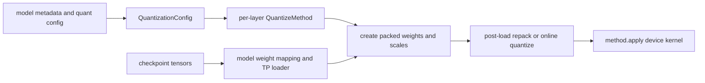

# vLLM 量化设计：把 checkpoint 格式、层级语义与设备 Kernel 对齐

> **源码基线**：`vllm-project/vllm@d66300a1baa7779c68c7dfa4e51eee2502b48017`
> **中心命题**：量化不是在模型加载后统一把 tensor cast 成低精度。vLLM 把它设计成按层派发的 ABI：`QuantizationConfig` 解释 checkpoint 与平台能力，`QuantizeMethodBase` 决定参数布局、post-load 转换和 forward kernel，模型的 packed mapping 负责把外部权重命名映射到实际融合层。

## 一、量化为什么必须进入模型构造期

低精度权重不仅 dtype 不同，还可能有：packed integer layout、group/channel/block scale、zero point、activation scale、额外 shape metadata、转置或 Marlin/Machete 专用重排。若先构造普通 FP16 `Parameter`、完整加载，再整体转换，会同时产生：

- 峰值内存中并存原始权重与量化权重；
- TP shard 已确定后才发现 pack axis 不兼容；
- QKV/gate-up 融合层无法从独立 checkpoint 名称恢复布局；
- kernel 需要的 scale/metadata 没有稳定参数名和生命周期。

因此量化方法在 layer 初始化时就创建最终或中间参数，并成为 layer forward 的一部分。

## 二、两层合同：全局解释与局部执行

### 2.1 `QuantizationConfig`：解释一种格式

`QuantizationConfig` 是格式级合同，负责从 config 读取参数、声明支持的 activation dtype、识别应量化/跳过的 layer，并为具体 layer 返回 quant method；`vllm/model_executor/layers/quantization/base_config.py:87-167`。

全局注册表维护内置方法和外部自定义方法。`register_quantization_config()` 可新增或覆盖方法，`get_quantization_config()` 延迟导入具体实现，避免过早触发 `torch.compile`；`vllm/model_executor/layers/quantization/__init__.py:47-112`。

这里的“不支持”应在构造阶段暴露，而不是执行到第一个 token 才从 kernel 崩溃。平台支持、checkpoint method、用户 override 和 layer type 必须共同确定最终 config。

### 2.2 `QuantizeMethodBase`：定义一个 layer 如何活着

`QuantizeMethodBase` 拥有三类操作：创建参数、加载后处理、执行 apply；`vllm/model_executor/layers/quantization/base_config.py:20-80`。以 linear layer 为例：

- 构造时从 config 取得 method，无量化则使用 `UnquantizedLinearMethod`；`vllm/model_executor/layers/linear.py:258-269`；
- `create_weights()` 接收全局/分片尺寸与 weight loader，建立 pack/scales 等参数；`vllm/model_executor/layers/linear.py:346-365`；
- forward 不关心 GPTQ、AWQ、FP8 等名称，只调用 `quant_method.apply()`；`vllm/model_executor/layers/linear.py:386-395`。

这使 layer 的并行语义保持稳定，格式差异封装在 quant method 中。

## 三、packed mapping 是量化与模型 ABI 的接缝

模型常把 checkpoint 的 `q_proj/k_proj/v_proj` 合成一个 QKV layer，把 `gate_proj/up_proj` 合成 gate-up layer。Llama 声明 `packed_modules_mapping`，把逻辑子模块名映射到融合模块；`vllm/model_executor/models/llama.py:458-466`。

初始化模型时，这张 mapping 通过引用传入 quant config；`vllm/model_executor/model_loader/utils.py:264-281`。量化实现据此判断：

- 哪些 checkpoint tensor 属于同一个 packed parameter；
- 每个 shard 应写入 pack 的哪个 axis/offset；
- exclude rule 应按逻辑层名还是融合层名匹配；
- group size、scale shape 是否仍满足融合后的 kernel。

若 quant config 自己猜模型命名，新增模型会修改所有量化后端；若模型直接硬编码 GPTQ/AWQ 细节，又会让一种格式横向污染模型库。mapping 作为窄 ABI 避免了这两种耦合。

## 四、加载不是一次 copy，而是三阶段提交

### 4.1 建立参数容器

layer 构造时 method 已创建 weight、scale、zero point 或 meta-device placeholder。此时形状包含 TP partition 和 packed layout，尚不一定满足最终 kernel 排列。

### 4.2 checkpoint 写入

默认 loader 调用模型自己的 `load_weights()`，由模型 mapping 和参数级 weight loader 完成 fused/TP shard 写入；`vllm/model_executor/model_loader/default_loader.py:415-449`。因此“成功读取文件”不等于“量化权重已可执行”。

### 4.3 post-load 转换

统一 `process_weights_after_loading()` 遍历 module 的 quant method，在目标设备上下文中执行 repack、online quantization、scale 合并或 kernel-specific 转换；`vllm/model_executor/model_loader/utils.py:96-128`。转换若替换了 `Parameter`，还会重新协调 TP rank/status；`vllm/model_executor/model_loader/utils.py:108-118`。

Base loader 将 post-load 放在常规权重加载和 layerwise online quant 之后；`vllm/model_executor/model_loader/base_loader.py:60-82`。这形成不变量：

> 模型进入 `eval()` 和第一轮 profile/capture 前，每个 quantized layer 的参数布局、scale 与 TP ownership 已符合其 `apply()` kernel 合同。

CPU offload 时，post-load 临时把 module 参数移到 target device，完成转换后恢复；`vllm/model_executor/model_loader/utils.py:149-180`。这避免某些 GPU-only repack 在 CPU tensor 上失效，但会带来峰值显存，必须在容量规划中考虑。

## 五、为什么同一种“位宽”仍需要多后端

“W4A16”或“FP8”只描述数值表示的一部分，不决定最快 kernel。实际派发还依赖：

- GPU 架构与原生数据类型支持；
- matrix 的 M/N/K、group/block shape 和对齐；
- prefill 大矩阵与 decode 小矩阵的形状分布；
- TP 后的局部尺寸；
- dense linear、embedding、LM head 或 MoE experts；
- 权重是离线 packed 还是在线量化。

因此 vLLM 允许 config 内部再选择 Marlin、Machete、CUTLASS、FlashInfer、Triton、ROCm 等 kernel。量化名是 checkpoint/策略入口，不是唯一 kernel 名。

## 六、权重、激活与 KV 量化是三个独立问题

| 对象 | 主要收益 | 额外状态 | 关键风险 |
|---|---|---|---|
| weight | 降低常驻模型内存和权重带宽 | weight scale/zero/pack metadata | kernel/shape 不匹配、精度退化 |
| activation | 降低 GEMM 输入带宽、使用低精度 tensor core | dynamic/static input scale | outlier、校准与量化开销 |
| KV cache | 提高可容纳 token/block 数 | K/V scale 与 backend dtype 合同 | attention backend 支持与长上下文误差 |

`KVCacheSpec` 和 attention backend 共同决定 KV dtype/layout；它不应由某个 linear quant method 暗中修改。将三者分开，才能在“W4A16 + FP8 KV”或“FP8 weight/activation + BF16 KV”等组合中明确验证每条合同。

## 七、三个不变量

1. **格式不变量**：checkpoint 中每个量化 tensor 都必须唯一映射到目标参数及正确 shard/pack offset。
2. **执行不变量**：`apply()` 读取的 weight/scale 布局必须与 post-load 输出完全一致。
3. **并行不变量**：参数被 post-load 替换或重排后，TP rank、partition size 和 reduce/gather 语义不得丢失。

这些不变量比“模型能加载”严格得多。错误 scale axis 可能不崩溃，只产生稳定但错误的 logits。

## 八、替代方案与代价

| 方案 | 看似优势 | 失败原因 |
|---|---|---|
| 全模型加载后统一 cast | 实现最短 | 不支持 packed/group scale，峰值内存高 |
| 模型类硬编码各量化格式 | 映射直接 | 模型数 × 格式数形成组合爆炸 |
| 量化后端自行猜 fused 名称 | 模型代码干净 | 命名与架构特例漂移，silent misload 风险高 |
| 一个 kernel 覆盖所有 shape | 易部署 | decode/prefill、GPU 架构和 TP shape 性能差异大 |
| 只按位宽选方案 | 决策简单 | 忽略校准、kernel 支持、scale 粒度和真实 workload |

量化换来的内存/带宽收益会被 dequant、repack、动态 activation quant 和 fallback kernel 部分抵消。必须在目标 GPU、batch、prompt/decode 比例上实测 TTFT、TPOT、吞吐和质量。

## 九、验证与排查

1. 先确认 checkpoint 声明、CLI override 和最终 `QuantizationConfig` 一致；
2. 检查平台支持与 layer-specific method，不能只看全局 quant 名；
3. 审计 packed mapping、TP shard axis、scale/zero shape；
4. 确认 post-load 已执行且没有遗留 meta tensor 或原始临时权重；
5. 用少量固定输入与高精度基线比较 logits/生成质量；
6. 分开测 prefill 和 decode，记录实际 kernel/fallback；
7. KV quant 另行验证 attention backend、scale 与长上下文误差。

最小源码阅读顺序：`vllm/model_executor/layers/quantization/base_config.py:20-167` → `vllm/model_executor/layers/quantization/__init__.py:47-181` → `vllm/model_executor/layers/linear.py:258-395` → `vllm/model_executor/model_loader/utils.py:96-180,264-281` → 目标 quant config/method。

## Related Pages

- [[02_engineering/03_infer_frameworks/vllm/12_vllm_kv_cache_management_analysis|vLLM KV Cache 管理]] — KV quant 改变的容量与 block layout 约束。
- [[02_engineering/03_infer_frameworks/vllm/13_vllm_model_library_analysis|vLLM 模型与权重 ABI]] — 模型构造、packed mapping 与权重加载所有权。
- [[02_engineering/03_infer_frameworks/vllm/14_vllm_attention_backends_analysis|vLLM Attention Backend]] — KV dtype/scale 与 attention kernel 能力。
- [[02_engineering/03_infer_frameworks/vllm/22_vllm_distributed_inference_analysis|vLLM 分布式推理]] — TP shard 后的量化参数和 collective 语义。
- [[02_engineering/03_infer_frameworks/vllm/24_vllm_fused_ops_and_kernels_analysis|vLLM 融合算子与 Kernel]] — quant method 最终选择的设备执行后端。
- [[02_engineering/03_infer_frameworks/vllm/25_vllm_ir_and_fusion_passes_analysis|vLLM IR 与融合 Pass]] — quantized op 如何进入 compile/fusion 边界。
