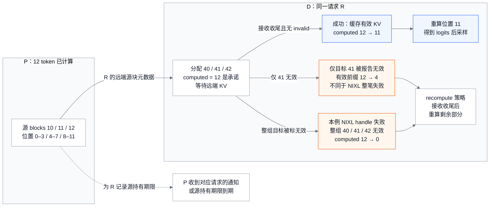
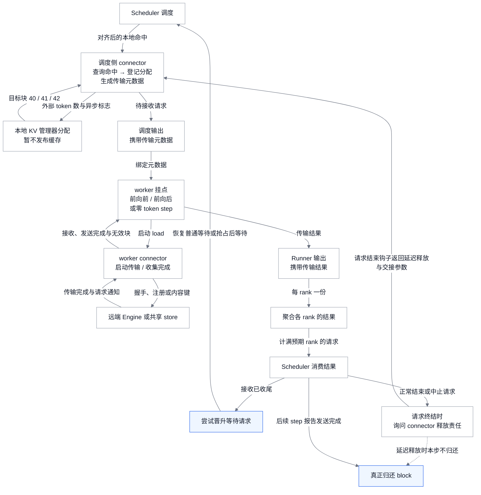
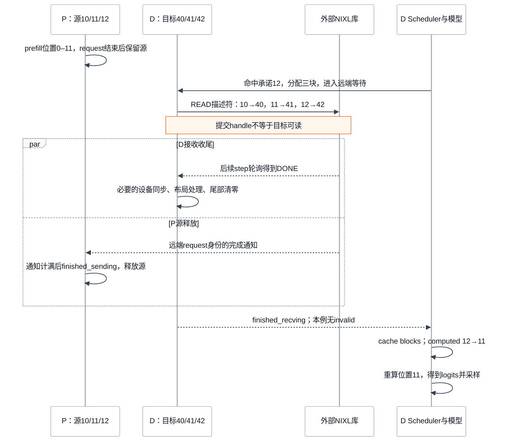
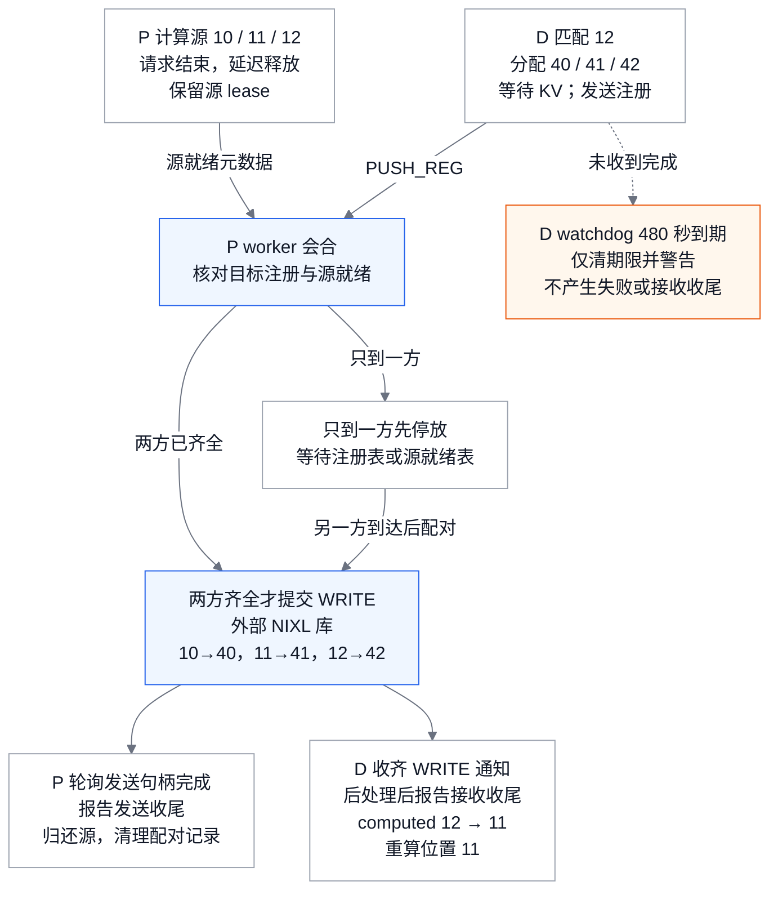
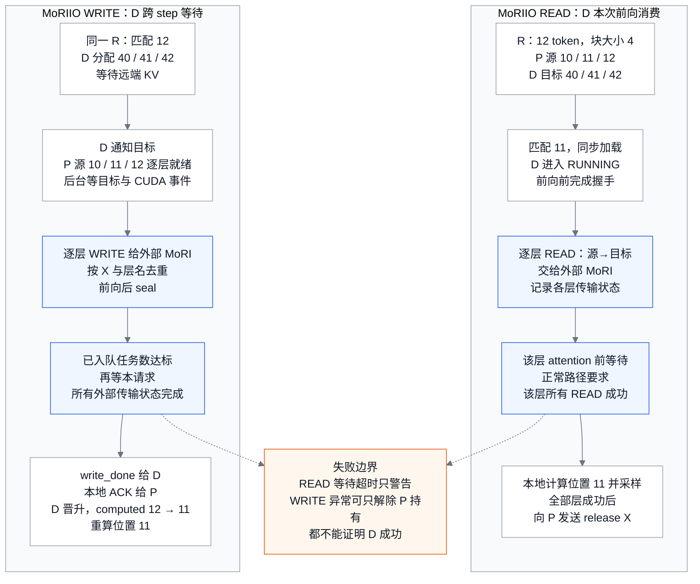
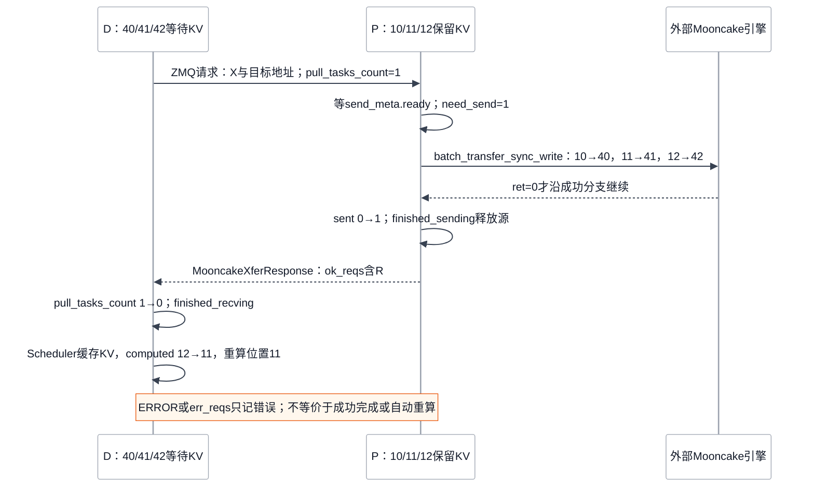
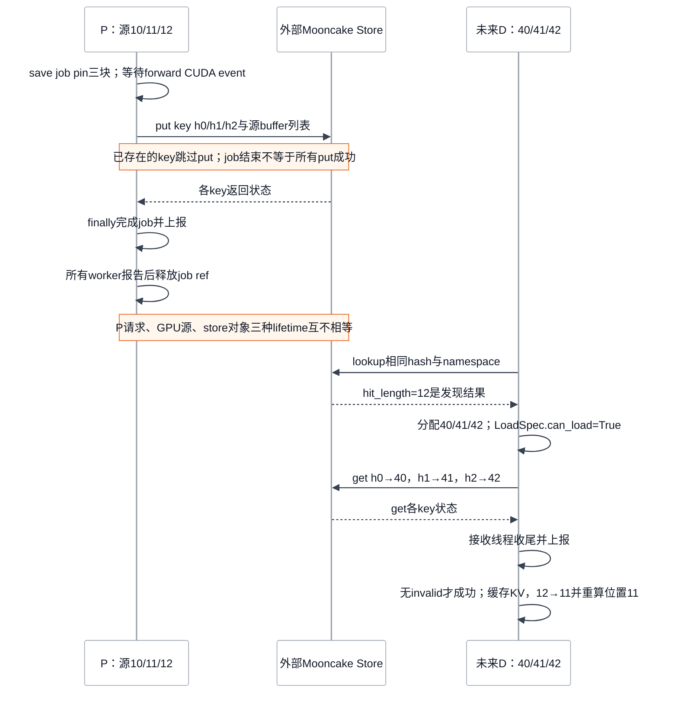
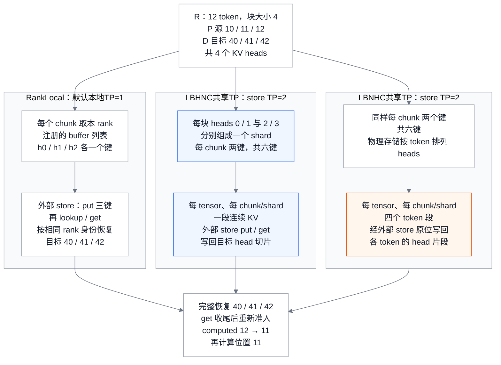
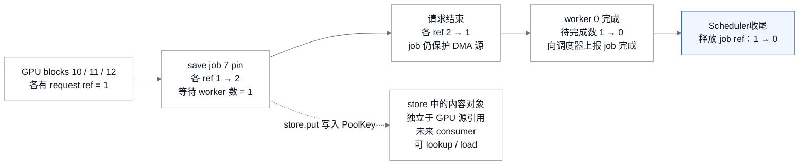
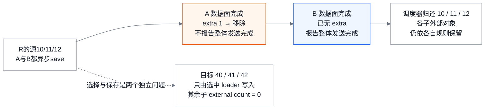

# vLLM 分离式 KV Serving：用跨 Engine 协议交接可计算状态

> **源码基线**：`vllm-project/vllm@199cb9b964822e59ab9b58d88e7be31eb419a2ae`（`main`，2026-09-06）
> **主题**：同一请求的 KV 如何跨 Engine 交接、取得可计算性，并解除源和目标的持有。
> **适用范围**：V1 KV connector 的 Scheduler/worker 合同，NIXL pull/push、MoRIIO、Mooncake 直连与 Mooncake store 的不同实现，以及 `MultiConnector` 的组合语义；源码与测试静态核验，未实跑多机或外部传输服务。
> **最近更新**：2026-09-14。按匹配、地址映射、提交与完成重写机制说明，并保留各数据面的释放与错误边界。

## 1. 十二个 prompt token，搬完三个 block 为什么还要再算一个 token

prefill 要并行处理整段 prompt，decode 则要持续逐 token 响应；二者共享同一组设备和队列时，长 prefill 会干扰 decode 的 token 间延迟。P/D 分离把它们交给不同 Engine 调度与部署，但 D 必须取得 P 已计算的 KV，才能免去重复 prefill。V1 KV connector 用“远端命中承诺→目标分配→传输完成→恢复计算与释放源”的协议，把这次设备间交接接入 Scheduler 与 worker。

请求 R 有 12 个 prompt token。假设普通 full attention、单个 transferable group、同构单 rank、block size 为 4，consumer 本地没有前缀命中。producer P 计算后将源 block `[10,11,12]` 对应的交接信息交给 decode consumer D；D 必须先分配目标 `[40,41,42]`，再等待 KV 进入这些地址。block 编号是便于重放的假设，协议和状态转换来自下面的源码。

在 NIXL 普通 `do_remote_prefill` 分支，远端命中数是 12；D Scheduler 可以把 `num_computed_tokens` 暂记为 12，但同时把 R 放入 `WAITING_FOR_REMOTE_KVS`，这个数此时只是待兑现的承诺。收到成功的 receive 完成、缓存这些 block 后，Scheduler 又将 computed 数改为 11：KV 不含可直接用于下一次采样的最后一个 token 的 logits，因此还要重算最后一个 prompt token。P 的请求结束、D 的目标分配、字节完成和可以采样分别是四件事。

源码依据是 `vllm/distributed/kv_transfer/kv_connector/v1/nixl/pull_scheduler.py::NixlPullConnectorScheduler.get_num_new_matched_tokens` 与 `vllm/v1/core/sched/scheduler.py::Scheduler.schedule/_update_waiting_for_remote_kv`。Mamba 不套用这个完整 12-token 快照：`vllm/distributed/kv_transfer/kv_connector/v1/nixl/base_scheduler.py::NixlBaseConnectorScheduler._get_remote_prefill_token_count/_truncate_mamba_request_for_prefill` 在相应 P/D 路径使用 N−1 边界，使 D 重算末 token 时从正确的 recurrent state 开始。

分离部署希望分别调优 TTFT 与 ITL，隔离 prefill 对尾部 ITL 的影响。`docs/features/disagg_prefill.md` 也明确提醒它不是吞吐提升承诺。本页使用下列**分析模型**判断隔离收益是否覆盖新增成本，未提供性能实测：

$$
T_{\text{request}}=T_{\text{route}}+T_{\text{prefill}}+T_{\text{KV handoff}}+T_{\text{decode queue}}+T_{\text{decode}}.
$$

比 copy 本身更难的是所有权：P 的 block 在远端读取结束前不能被复用，D 的 block 在数据有效前不能进入 attention。两边的请求到达顺序也可能不同，因此需要按身份查找，不能靠 FIFO 配对；仓库 `vllm/distributed/kv_transfer/README.md` 说明了这个动机，其中早期 pipe/lookup 抽象不等同于当前 V1 factory API。

把这次交接拆开看，有三条不会同时结束的时间线：P 的计算请求、以 P/D 设备地址为输入的传输、D 从这些 KV 恢复执行。分离部署增加了网络与内存持有成本，换来两类计算独立排队和部署；没有外传时 D 可以直接重算，有外传时则必须证明“少算的前缀已经落在本地有效地址”。这里的有效性要求相同 token 位置对应相同模型状态，不能仅凭两个 block 编号相同来判断。

| 所需性质 | 最小例子中的实现 | 付出的成本或边界 |
|---|---|---|
| 计算位置不变 | 源 10/11/12 与目标 40/41/42 分别对应位置 0–3、4–7、8–11 | block ID 只是各 Engine 的本地地址索引，跨端要交换映射 |
| 目标不会提前被读 | async load 先分配目标、保留 WAITING_FOR_REMOTE_KVS，再等接收完成 | D 的三块显存在等待网络时已占用；命中数不等于容量预留 |
| 源不会过早被复用 | direct connector 延迟 request free；store 则额外 pin save job | P 的计算已经结束也可能无法马上归还显存 |
| KV 最终转成可采样状态 | async 全命中完成后 computed 12→11，重算位置 11 | KV 不携带该次采样所需 logits；MoRIIO READ 提前只承诺 11 |

先读 §2 确认接入方式，§5 是所有实现接入宿主的共同闭环，§6–8 分别重放直连、共享池与组合器；布局兼容和混合组的前提集中在 §3–4。完整二十条接口流程及相邻页面责任留在 §14，查配置时直接读 §11。这里所有延迟与资源比较均为源码推导，未声称哪一后端在实测中更快。

## 2. 从读取时机选择 connector，再接入 Engine

选择 connector 首先要确定内容要交给谁、何时交付。当前 D 已知且两端都保留请求时，可以直接交接设备上的 KV：NIXL pull 由 D 在分配后发 READ，NIXL push 由 P 等目标注册后发 WRITE，MoRIIO 可以把等待落到 D 的层前或把 WRITE 放到 P 的层后，Mooncake 直连则由 D 发请求、P 的发送线程执行 WRITE。未来读者尚未确定时，Mooncake store 先把内容写成共享对象，D 再按前缀查找；同时希望写入几个后端时，`MultiConnector` 统一选择 loader，并等待每个保存者归还引用。这些区别决定了谁承担排队、网络等待和源持有，§6–8 会逐条展开。

接入时，使用者在 `KVTransferConfig` 中指定 `kv_connector` 与 `kv_role`，把家族参数放入 `kv_connector_extra_config`。`kv_role` 的 producer/consumer 描述 KV 的服务方向；构造时传入的 `KVConnectorRole` 则区分同一 Engine 的 Scheduler 与 worker。二者不能混为一组角色：D 既有负责命中和分配的 scheduler connector，也有负责设备地址与接收的 worker connector，P 同样如此。`KVConnectorFactory.create_connector` 分别构造这些对象，将 `kv_cache_config` 交给实现，并在不支持 HMA 的组合上拒绝启动。

factory 通过注册名延迟导入类；配置了 `kv_connector_module_path` 时，外部模块优先于内建注册表，并要求类接受第三个构造参数 `kv_cache_config`。空模块路径会被拒绝，单纯把类名改成一个未注册名字也不能接入。冻结基线有 16 个注册名、15 个不同类，其中 `NixlConnector` 是 pull 的兼容别名；完整注册名、demo、offload 与第三方接入边界见 §14.5，字段默认值见 §11。

选中家族后仍有下一层选择。MoRIIO 的 `read_mode` 决定 READ/WRITE，Mooncake store 的 `_select_store_layout` 决定 rank-local 或两种 TP-sharded payload；这会改变匹配返回值、等待点或地址分段，不能从 `kv_connector` 一个字符串推导全部行为。EC connector 由独立的 `ec_transfer_config` 选择，见 [[02_engineering/03_infer_frameworks/vllm/15_vllm_multimodal_execution_analysis|多模态执行]]；本地 CPU offload 见 [[02_engineering/03_infer_frameworks/vllm/08_vllm_kv_cache_management_analysis|KV Cache 管理]]。实例发现与将请求送到匹配 P/D 的控制面由 [[02_engineering/03_infer_frameworks/vllm/13_vllm_serving_control_plane_analysis|Serving 控制面]]解释。

## 3. 身份相同、协议兼容、布局可变换是三种检查

跨端拿到同一个 request ID，并不足以安全复制 KV。Engine 身份先把 agent、地址和 heartbeat 指向正确实例；Request / TransferId 再将乱序到达的请求、分配和 ACK 配成同一笔交接；rank 与 transferable group 最后确定这笔交接里的哪份 shard、哪组 block table。三个层次逐步缩小目标，但都不能单独证明字节已经写完：请求配对成功后，还要检查协议与布局，再等待每个必需 rank 的完成。

这种分层也解释了为什么模型名相同仍要握手。Engine 名不证明权重已同步，request 名不证明传输已完成，rank 对应也不证明两个设备采用相同布局。NIXL 将能够提前比较的协议属性放进兼容 hash，把允许异构的几何留给后续映射。

### 3.1 先核对协议，再解码远端地址

NIXL 先解码 `NixlHandshakePayload` 外层兼容 hash，通过检查后再解码 agent metadata。当前 `NIXL_CONNECTOR_VERSION=10`；`vllm/distributed/kv_transfer/kv_connector/v1/nixl/metadata.py::compute_nixl_compatibility_hash` 实际包含 vLLM/connector 版本、model 字符串、dtype、KV head 数、head size、层数、attention backend、cache dtype、HMA 标志、speculative factors 与 transfer mode。EAGLE 分支还纳入相应 draft model/revision 等因子；draft attention backend 留给运行期检查。这里按实际 factors 字典陈述，不能从注释扩大成任意模型属性都被覆盖。

TP size、block size、KV layout 则不进入这个 hash。 它们刻意留给 `vllm/distributed/kv_transfer/kv_connector/v1/nixl/base_worker.py::NixlBaseConnectorWorker._validate_remote_agent_handshake` 与 transfer topology 做异构检查/映射。`NixlAgentMetadata` 带地址、设备、block 长度/stride/layout、block size、SSM 大小、physical/logical block 比、DCP/PCP 等信息；remote TP 则由握手参数传入，这些几何信息分布在握手参数和 metadata 中，并非同一个 hash 的输入。

使用者可以通过配置跳过这次检查：`vllm/distributed/kv_transfer/kv_connector/v1/nixl/base_worker.py::NixlBaseConnectorWorker.__init__` 读 `kv_connector_extra_config` 的 `enforce_handshake_compat`（默认 `True`），置 `False` 后握手完全跳过 hash 比对。不匹配时抛出的 `RuntimeError` 消息里直接印了关闭它的命令行，所以"hash 通过"只在默认配置下代表协议一致。

这个 hash **没有运行期 `weight_version`**。token 一样、握手通过仍不证明两端持有同一轮训练权重；更新版本和缓存清理的接缝见 §10 与 [[02_engineering/03_infer_frameworks/vllm/25_vllm_weight_transfer_online_update_analysis|25：权重传输与在线更新]]。

### 3.2 从几何差异构造可执行的地址映射

兼容模型仍可能用不同数量的 rank、不同 block size 或不同 KV 排列。传输需要的是相同逻辑位置的一组源地址与目标地址，所以运行期检查的判据是“当前组合是否存在已实现的映射”。`_validate_remote_agent_handshake` 核对 block 与布局，`_validate_remote_parallel_config` 核对并行几何；通过后才能按 TP/DCP/group 选出远端 rank 和切片。它们既不要求全部尺寸相等，也不支持任意异构组合，逐项条件见 §14.6。

block size 不同时，同一段 token 会跨越不同数量的本地与远端 block。NIXL 按远端 block 粒度传输，在接收后把本地最后一个 attention block 没有传来的尾部清零；Mamba state page 则仍一对一对应，不继续细分。这个转换要求直接设备路径，host buffer 与异构 block size 的组合会被拒绝。Mamba 若 physical/logical block 比不同且开启 prefix caching，同样不能沿用现有缓存解释，因此报错并提示关闭 prefix caching。

异构 TP 还要在 head 维拆开 KV。head 在物理内存中连续时，可以把所需 heads 编成可复制的地址段；否则单一切片不再代表这些 heads。非 MLA、非 replicated KV 的异构 TP 因而要求 block-contiguous 布局，或启用已实现的 permute。远端为 `LBHNC` 且 `enable_permute_local_kv=True` 时，接收端可以在设备上转换布局，但这条路与 HMA 互斥；其余非 MLA 的 layout 不匹配会被拒绝。

上下文并行也必须能写出切片关系：DCP 大小要求互相整除，PCP 与另一侧 DCP 的混用不受支持。不同 attention backend 的转换仅在本地 `CPU_ATTN` 的对应分支实验性支持，开启 HMA 又会拒绝。这样限制的是具体地址解释与后处理能力；关闭协议 hash 检查并不会替实现增加新的几何转换。

MLA 与 replicated-KV 不在 head 维切分，因此上面几条 head 相关的守卫对它们不生效——这也是"remote TP 由握手参数传入"之外，几何为什么必须留在运行期而不是 hash 里的直接原因。

## 4. 混合 cache 先选择组，再裁剪可复用状态

一个混合模型可以同时保存完整 attention 历史、滑窗尾段与 recurrent state；D 恢复执行时需要的内容并不都是同一段历史。因此，混合模型的 cache 不一定全部可外传。`vllm/v1/kv_cache_interface.py::KVCacheGroupSpec/KVCacheConfig` 以 `enable_kv_transfer` 筛选 `transfer_group_ids`、`transfer_groups` 和 `transfer_group_index_by_layer`。例如本地 group 0 禁用、group 1 启用，则 transfer tuple 的第 0 项代表本地 group 1；混用两种 index 会把合法 block ID 指向错误状态。

`vllm/distributed/kv_transfer/kv_connector/v1/nixl/base_scheduler.py::NixlBaseConnectorScheduler.get_exchange_clipped_blocks` 按可传输组裁剪交换范围：sliding-window 组只留在窗尾段（KV manager 按整段序列分配，出窗 block 要到 `request_finished_all_groups` 之前才清理），SSM 组只留承载状态的槽，尾部投机 scratch 一律去掉。它在**每一个** block-id 交换点被调用，host-buffer 的逐步部分列表传 `clip_ssm=False`。full attention 历史、滑窗尾段与 recurrent 边界不能互换。

裁剪后的每组状态必须仍能支持同一个恢复位置，否则“少算若干 token”就失去依据。factory 的 `KVConnectorFactory.create_connector` 在 HMA 开启而 connector 不支持时直接拒绝；支持 HMA 的实现经 `SupportsHMA.request_finished_all_groups` 接收所有组，再选择自己的 transfer 投影。这让 connector 看到必要的组间关系，同时保留本地 KV manager 对完整分配的管理。

Scheduler 和 worker 各有一份 connector：前者决定哪个请求要哪些 blocks，后者持有设备地址和传输对象。factory 在 engine-core 与 worker 创建相应角色。因此跨 Engine 协议只能延迟释放、增加 job ref 或报告目标失效，不能绕过本地 KV manager 的分配与引用规则。

## 5. 从远端命中到本地可计算状态

一次远端命中要跨过四个边界。scheduler connector 先回答远端可复用多少 token；本地 allocator 再为它分配 `[40,41,42]`；worker 等数据传入并完成必要的设备同步或布局处理；executor 最后把各 rank 的完成与错误交回 Scheduler。发现阶段的 `None` 表示还不知道命中结果，分配成功也只意味着有了地址。只有数据与生命周期两层证据都齐全，R 才能恢复计算，或让 P 解除源持有。

这几步不能合并成“命中后把 computed 加 12”。分配时若立即把目标发布进 prefix cache，另一个请求就可能读到还没写入的内容；传输尚在读取 P 时若归还源 block，allocator 又可能让新请求覆盖它。图中的暂存状态同时保护这两个方向。

<!-- Figure spec: 问题=12-token remote hit 如何从承诺变成可计算且安全回收；类型=状态/数据映射原理图；实体=P三源块、D三目标块、有效前缀计数与失败分支；关系=同一逻辑位置的复制及computed状态提交；图独有信息=allocation不发布cache、仅invalid41的一般恢复截回4而NIXL整组失败截回0、成功仍重算第12token；阅读顺序=左到右；无call graph；证据=Scheduler.schedule/_update_waiting_for_remote_kv/_update_requests_with_invalid_blocks与NixlPullConnectorWorker._read_blocks；数值=声明的单组同构算例；验证=Mermaid渲染和实图检查。 -->


图中失败分支是 **Scheduler 仅收到 `invalid_block_ids` 为 41 时的一般恢复规则示例**，并选择显式 `recompute` 策略；默认 `fail` 会终止请求。它不是当前 NIXL 整笔 handle 失败的重放：`vllm/distributed/kv_transfer/kv_connector/v1/nixl/base_worker.py::NixlBaseConnectorWorker._handle_failed_transfer` 在本例非 HMA、无本地命中的条件下执行 `self._invalid_block_ids.put(set(meta.local_block_ids[0]))`，把该请求整组目标 `[40,41,42]` 标为 invalid，因此 computed 从 12 截回 **0**。一般规则按第一个 invalid block 前的连续有效前缀截断（`request.num_computed_tokens = idx * self.block_size`），不能保留其后的孤立"成功块"。

<!-- Figure spec: 问题=一次跨 Engine KV 交接从哪里出发、经过哪些边界、又从哪两条边回到起点；类型=闭环位置图；实体=Scheduler、scheduler connector、本地 allocator、worker connector、远端 Engine/store、executor 聚合；关系=每条边标注跨越该边界的真实对象名；图独有信息=两条回流边（晋升回 schedule、request_finished 回 scheduler connector）说明这不是单向流水；阅读顺序=自顶向下再回流；证据=Scheduler.schedule / ActiveKVConnector / KVOutputAggregator / Scheduler.update_from_output；验证=Mermaid 渲染。 -->


图中释放侧有先后两个事件，不能合成一条边：**先**是请求终结（`update_from_output` 里 stop/length，或 `finish_requests` 中止）调用 `_free_request` → `_connector_finished` → `request_finished`，connector 在这里返回 `delay_free_blocks=True` 并交出 `kv_transfer_params`，block 暂不归还；**后**是某个后续 step 的 `KVConnectorOutput.finished_sending` 到达，`Scheduler._update_from_kv_xfer_finished` 直接调 `_free_blocks`，不再经过 `_free_request`。

### 5.1 调度先决定可复用前缀，再分配接收空间

Scheduler 首先计算本地可复用前缀，再把 block 对齐后的命中数交给 `get_num_new_matched_tokens`。本例本地为 0、NIXL 返回 12 个外部 token；如果 store 的异步 lookup 还没有返回，结果是 `None`，请求就进入 `skipped_waiting`，下一轮再问。把未知当成 0 会直接触发本地重算，把未知当成命中又会为尚未确认的内容占用目标，因而协议单独保留待决状态。

本地命中还可能带一个未满的 partial tail。外部命中严格超过这个尾部时，Scheduler 撤掉本地 sub-block 尾，采用外部结果；外部只覆盖尾部的一部分或刚好到尾部时，则保留本地尾、取消外部 load。原因是本地 CoW 与外部 load 都可能写这块尚未填满的内存，选择一个写入来源才能避免竞争。混合组若允许 divergent local hits，也要等远端确实能补齐那个更深的恢复点；没有外部 token 时回退各组一致的 Mamba 边界，保证 recurrent state 与恢复位置相符。

确认命中后才申请目标空间。async load 用 `delay_cache_blocks=True` 分配但暂不发布 prefix cache，并通过 `reserved_blocks` 计入其他在途 prefill 尚需的容量，本次不分配 speculative lookahead。若容量不足，`allocate_slots` 返回 `None`，R 本轮仍不能传输。成功后 `update_state_after_alloc` 才把目标 block 和 external count 交给 connector，随后 `build_connector_meta` 将它们装进本步输出；R 在 `WAITING_FOR_REMOTE_KVS` 中等待，而不是拿到命中数就进入模型。

下面把这些分支接到完成与释放回路。worker 挂点以 Model Runner V2 为主，MRv1 的提交差异见 §5.2；其他 runner 仍受 connector ABI 约束，提交时机不能由此类推。

```text
Scheduler.schedule
├─ _get_local_prefix_cache_hit(request)
│   ├─ connector.supports_divergent_local_hybrid_hits  →  get_computed_blocks_for_connector(request)  [返回 hit_diverged]
│   └─ 否则                                            →  get_computed_blocks(request)                [hit_diverged 恒 False]
├─ connector.get_num_new_matched_tokens(request, block_aligned_local)
│   ├─ ext_tokens is None            →  pop_request + skipped_waiting.prepend_request  →  本轮不调度，下轮再问
│   ├─ partial_tail 且 ext > tail    →  truncate_computed_blocks(block_aligned_local)；num_external = ext
│   ├─ partial_tail 且 ext <= tail   →  num_external = 0；load_kv_async = False        [保住本地 sub-block 尾]
│   └─ 无 partial_tail               →  num_external = ext
├─ hit_diverged 且 num_external == 0  →  回退 get_computed_blocks(request)   [各组一致的 Mamba 边界]
├─ allocate_slots(..., delay_cache_blocks=load_kv_async,
│                 reserved_blocks=_inflight_prefill_reserved_blocks())
│   └─ 返回 None  →  本轮不调度（remote hit 不是容量预留）
├─ connector.update_state_after_alloc(request, blocks, num_external)
├─ load_kv_async ? status = WAITING_FOR_REMOTE_KVS + _inflight_prefills.add(request)
│                : 进入 running
└─ connector.build_connector_meta(scheduler_output)  →  SchedulerOutput.kv_connector_metadata

Scheduler.update_from_output
├─ _handle_invalid_blocks(invalid_block_ids)
│   └─ _update_requests_with_invalid_blocks
│       ├─ request.num_computed_tokens = idx * block_size        [第一个 invalid block 处截断]
│       ├─ recompute_kv_load_failures ? 继续 : 整请求以 KV transfer error 结束
│       └─ async 分支  →  failed_recving_kv_req_ids |= async_failed_req_ids
└─ _update_from_kv_xfer_finished(kv_connector_output)
    ├─ connector.update_connector_output(kv_connector_output)
    ├─ finished_recving 且 status == WAITING_FOR_REMOTE_KVS  →  finished_recving_kv_req_ids.add(req_id)
    ├─ finished_recving 且请求已 finished                    →  _free_blocks(request)
    └─ finished_sending                                      →  _free_blocks(request)

Scheduler._free_request(request, delay_free_blocks)   [update_from_output 的 stop/length，或 finish_requests 中止]
├─ _connector_finished(request)
│   ├─ is_kv_producer ? finished_partial_tails = finalize_partial_tail_offloads(request)
│   ├─ remove_skipped_blocks(...)
│   ├─ block_ids = get_block_ids_for_computed_tokens(...)
│   ├─ finished_partial_tails 非空 ? partial_tail_delay = register_finished_partial_tail(request, block_ids, ...)
│   ├─ SupportsHMA ? request_finished_all_groups(request, block_ids)
│   │               : request_finished(request, block_ids[0])
│   └─ 返回 (delay_free or partial_tail_delay, kv_transfer_params)
├─ ec_connector ? connector_delay_free_blocks |= ec_connector.request_finished(request) 的 ec_delay_free
└─ delay_free_blocks |= connector_delay_free_blocks
    ├─ True   →  不 free，等后续 step 的 finished_sending（已终结 consumer 则为 finished_recving）回报该 req_id 再 _free_blocks
    └─ False  →  _free_blocks(request)
```

partial tail 的实现注释用 “so no CoW is needed” 概括其效果：选择远端时先撤掉本地尾，保留本地尾时不再外部写入。`supports_divergent_local_hybrid_hits` 则决定能否通过 `get_computed_blocks_for_connector` 尝试更深的分组命中；最终没有外部补齐时，`hit_diverged` 分支退回 `get_computed_blocks`。这两处都在目标提交之前处理，因为目标一旦被交给 worker，就可能已有传输在写它。

### 5.2 worker 把传输放到实际消费与产出的两侧

worker 收到 metadata 后，先处理抢占，再绑定本步传输计划。必须在本次 forward 消费 KV 的同步 load，由 `has_sync_kv_loads` 把 `start_load_kv` 放到 forward 之前；只为后续 step 准备数据的异步 load，则推到 post-forward，避免占据当前计算的前置路径。这是调度语义上的同步与异步，不等同于底层库调用是否立刻返回，MoRIIO READ 就会提交异步硬件操作、再在层前等待。

模型的层级挂点 `maybe_transfer_kv_layer` 提供更细的顺序：`wait_for_layer_load` 在 attention 消费前等待，`save_kv_layer` 在该层产出后登记保存。实现可以使用这两个位置，也可以完全依靠跨 step 的请求级完成；NIXL 两个方法都是 `pass`，MoRIIO WRITE 才利用逐层保存。因此 hook 的存在表达的是可接入的同步位置，不能据它计算每层必有一次 I/O。

post-forward 收集 receive、send、invalid blocks 和 worker metadata，让计算输出与传输输出一起返回。即使本轮没有 token，`no_forward` 仍执行 pre/post hooks 并生成 connector-only `ModelRunnerOutput`，否则只剩 I/O 的请求再也得不到轮询。输出经过 `KVOutputAggregator` 汇合：默认完成份数来自 `get_finished_count() or world_size`，还可由 worker 的 `expected_finished_count` 改写；一个 rank 完成只偿还自己那份工作，不能代表整个请求。

```text
ActiveKVConnector.pre_forward(scheduler_output)          [vllm/v1/worker/gpu/kv_connector.py]
├─ kv_connector.handle_preemptions(kv_connector_metadata)
├─ kv_connector.bind_connector_metadata(kv_connector_metadata)
└─ scheduler_output.has_sync_kv_loads
    ├─ True   →  _start_load_kv()  →  start_load_kv(forward_context)   [必须先于本步 forward]
    └─ False  →  _pending_load_start = True                            [推到 post_forward，避开关键路径]

模型前向
└─ maybe_transfer_kv_layer                               [vllm/model_executor/layers/attention/kv_transfer_utils.py]
    ├─ wait_for_layer_load(layer_name)
    └─ save_kv_layer(layer_name, kv_layer, attn_metadata)

ActiveKVConnector.post_forward(finished_req_ids, wait_for_save)
├─ _pending_load_start ? _start_load_kv()
├─ wait_for_save ? kv_connector.wait_for_save()
├─ get_finished(finished_req_ids)        →  KVConnectorOutput.finished_sending / finished_recving
├─ get_block_ids_with_load_errors()      →  KVConnectorOutput.invalid_block_ids
├─ get_kv_connector_stats() / get_kv_connector_kv_cache_events()
├─ build_connector_worker_meta()         →  KVConnectorOutput.kv_connector_worker_meta
└─ clear_connector_metadata()

ActiveKVConnector.no_forward(scheduler_output)           [0-token step]
└─ pre_forward + post_forward，返回 connector-only ModelRunnerOutput（0-token step 仍推进 I/O）

Model Runner V1 的另一时机                               [vllm/v1/worker/gpu_model_runner.py]
├─ defer_kv_connector_finalize = self.speculative_config is not None        [GPUModelRunner.execute_model]
├─ maybe_get_kv_connector_output(scheduler_output, defer_finalize=...)      [同一方法内]
│   └─ context 退出（target forward 之后）仍收 finished_sending / finished_recving /
│      invalid_block_ids / kv_connector_worker_meta；defer_finalize=True 时**跳过**
│      wait_for_save() 与 clear_connector_metadata()
└─ drafter 前向之后 finalize_kv_connector()                                 [GPUModelRunner.sample_tokens]
    ├─ kv_connector.wait_for_save()          [draft 层写出的 KV 也进这一次 save]
    └─ kv_connector.clear_connector_metadata()

executor 聚合                    [vllm/distributed/kv_transfer/kv_connector/utils.py]
└─ KVOutputAggregator.from_connector(connector, world_size)
    └─ expected = connector.get_finished_count() or world_size
    └─ aggregate(outputs): 每个 req_id 计数到 0 才计完成；kv_output.expected_finished_count 可动态改写
```

MRv1 的投机解码还需要保存 drafter 写出的 KV。完成集合仍在 target forward 的 context 退出时采集，但 `wait_for_save()` 与 `clear_connector_metadata()` 被延后：绑定的 metadata 一直活到 drafter 跑完，因此 draft 模型写出的 KV 也落在同一次 save 里。`self.kv_connector_output` 在 drafting 期间仍可能被改写，源码在 `vllm/v1/worker/gpu_model_runner.py::GPUModelRunner.sample_tokens` 明确注明了这一点，直到取走它挂到 `ModelRunnerOutput` 上才定型。

### 5.3 接收收尾、重算晋升与请求失败是不同边界

异步接收的完成先解除等待，再决定能保留多少 computed 前缀。`Scheduler._try_promote_blocked_waiting_request` 先查 `finished_recving_kv_req_ids`；该集合由 `_update_from_kv_xfer_finished` 消费 `KVConnectorOutput.finished_recving` 填入，没有 R 就 `return False`。有了收尾信号，`_update_waiting_for_remote_kv` 才检查正常或失败状态，避免接收仍在修改目标时启动本地计算。

正常路径先 `cache_blocks(request, num_computed_tokens)`，将已经有效的三块交给缓存管理。若 `num_computed_tokens == num_tokens`，再把计数改为 `num_tokens - 1`。本例因此从 12 退到 11，重算位置 11 获取 logits；保存了完整 KV 与具备下一次采样的输出是两个不同条件。

选择 `recompute` 的失败路径沿用同一个接收收尾门，但复用的是截断后的前缀。`_update_requests_with_invalid_blocks` 已经把计数改到第一个 invalid block 之前，`failed_recving_kv_req_ids` 标记这次失败。`num_computed_tokens > 0` 时，只缓存那段有效前缀；若 `self.needs_kv_cache_zeroing` 为真，还要 `record_blocks_for_zeroing`，补上失败 load 曾跳过的清零。计数 `== 0` 时，`kv_cache_manager.free(request)` 归还整次分配后重来。两条路径最后都设置 `request.status = PREEMPTED if request.num_preemptions else WAITING`，让 R 重新参加准入。

默认 `fail` 的请求终态不需要等这道门。`Scheduler.update_from_output` 先对 failed IDs 调 `finish_requests(...FINISHED_ERROR)`，将请求移出队列并生成 ERROR 输出，随后才消费本步 transfer 完成；只是目标 block 仍可能延迟到接收收尾后再释放。因此 `finished_recving` 证明的是接收可收尾，成功还需要错误集为空及设备后处理完成。它既不是独立成功标志，也不是所有失败请求进入终态的先决条件。队列与重新准入规则见 [[02_engineering/03_infer_frameworks/vllm/07_vllm_scheduler_analysis|07]]。

### 5.4 `delay_free_blocks`、partial tail 与被拒请求的清理

请求结束后，源 block 仍可能被远端 DMA 读取，目标 block 也可能仍在被写入。宿主因此在终结请求、释放 block 之前，恰好调用一次 `KVConnectorBase_V1.request_finished(request, block_ids) -> (bool, dict | None)`。返回 `True` 就暂缓归还，等待 connector 给出后续完成；`Scheduler._free_request` 先把 EC connector 的 `ec_delay_free` 也 OR 进 `connector_delay_free_blocks`（EC 侧语义归 [[02_engineering/03_infer_frameworks/vllm/15_vllm_multimodal_execution_analysis|15]]，Engine 页讨论的是 KV/EC 两类 connector），再 `delay_free_blocks |= connector_delay_free_blocks`，为真就不 `_free_blocks`，直到 `get_finished()` 回报该 req_id 才释放。producer 角色还多一条并联来源：`register_finished_partial_tail` 也能返回 `True`，`_connector_finished` 的返回是 `delay_free or partial_tail_delay`。这使请求结束与设备内存归还成为两个可以独立完成的事件。

NIXL pull 的具体实现（`vllm/distributed/kv_transfer/kv_connector/v1/nixl/pull_scheduler.py::NixlPullConnectorScheduler.request_finished`）：`delay_free_blocks = any(len(group) > 0 for group in block_ids)`，为真时打上 `self._reqs_need_send[req_id] = time.perf_counter() + request_kv_blocks_ttl`（P 侧取 `kv_lease_duration`，D 侧 turn-2 回读取 `decoder_kv_blocks_ttl`），再 `get_exchange_clipped_blocks` 裁剪后作为 `remote_block_ids` 返回。

返回的第二个元素就是 `kv_transfer_params`，即请求语义层携带并回传的跨服务 transfer metadata。pull 侧产出的键共 13 个：

| 键 | 语义 |
|---|---|
| `do_remote_prefill` / `do_remote_decode` | 这份 params 交给谁：P 产出的置前者，D 产出的置后者 |
| `remote_engine_id` / `remote_request_id` | 对端身份；后者是通知与 lease 的匹配键 |
| `remote_host` / `remote_port` | 对端 side channel 地址，来自 `VLLM_NIXL_SIDE_CHANNEL_HOST/PORT`，**不是** `KVTransferConfig.kv_ip/kv_port` |
| `remote_block_ids` | 已裁剪到可传输组的源 block |
| `tp_size` / `dcp_size` / `pp_size` | KV 平面的 rank 约定，进 `ReqMeta` 与 `HeartbeatInfo` |
| `remote_num_tokens` | 对端已 computed 的 token 数 |
| `remote_blocks_expiry_time` | 仅 D 侧产出，供 turn-2 回读判断远端是否临近过期 |
| `transfer_mode` | pull/push 标识，同时进兼容 hash |

另有三个**不在对外返回字典中、但会被内部读取或置位**的键：`remote_block_size`（`vllm/distributed/kv_transfer/kv_connector/v1/nixl/metadata.py` 的 `ReqMeta` 会读它，供 push 侧异构 block size）、`_p_side_truncated`（Mamba P 侧截断的幂等标记，`vllm/distributed/kv_transfer/kv_connector/v1/nixl/base_scheduler.py::NixlBaseConnectorScheduler._truncate_mamba_request_for_prefill`）、`_remote_blocks_processed`（`vllm/distributed/kv_transfer/kv_connector/v1/nixl/pull_scheduler.py::NixlPullConnectorScheduler.update_state_after_alloc` 每次进入 recv 分支末尾都与 `do_remote_prefill = False` 一起置 True，但只在 bidirectional 的 `do_remote_decode` 条件里被读，用来防止同一请求触发第二次传输）。MoRIIO 与 Mooncake 直连另有各自的键（`transfer_id`、`remote_bootstrap_addr`、DP rank 相关字段）。

**拒绝与 abort 的清理**是同一个函数里的另一支，也是最容易漏掉的一条：若 `request_finished` 时 `params["do_remote_prefill"]` **仍为 True**，说明 `update_state_after_alloc` 从未被调用——请求在被调度前就被中止了，典型情形是 D 侧服务层通过 `abort_immediately` 拒绝了它。此时 pull scheduler 塞一条**空 block 列表**进 `_reqs_need_recv[req_id] = (request, [], ())`，让 worker 仍然发出通知去让 P 释放它的 prefill blocks，否则那批 block 会一直搁浅到 lease 到期。非正常结束状态（不是 `FINISHED_LENGTH_CAPPED` / `FINISHED_STOPPED`）则进 `_reqs_not_processed` 并从 `_reqs_need_save` 里摘掉。push scheduler 与 Mooncake 直连的 `request_finished` 各有一份等价分支。

## 6. 四类直连实现：五条数据路径如何归还完成证据

### 6.1 NIXL pull：D 知道地址后发 READ，P 等读者通知

D 最清楚哪些前缀已在本地命中、哪些目标 block 真正分配成功；将 READ 放在这之后，可以只搬缺失部分。若把“P 已完成”直接等同为可以发送，D 尚未取得显存时就没有合法目标地址。这是从调用顺序重建的设计理由。pull 所受的限制不仅是链路带宽：P 必须在 D 排队、握手和读完前保留源，D 必须容纳尚不可计算的目标。

本例无本地命中，`update_state_after_alloc` 取三个 unhashed 目标块，随 `ReqMeta` 把本地 `[40,41,42]`、远端 `[10,11,12]` 和远端 request/engine 身份交给 worker。同构单 rank 的 `TPMapping` 只选 P rank 0；三个逻辑位置被编成相等长度的 local/remote descriptor 列表，**一个远端 rank 的多个 block/group 进入同一个 handle**。这是地址配对，不会在 D 分配出编号 10/11/12 的 block，也不会把请求重新分词。

block ID 到 descriptor ID 还有一次转换。`vllm/distributed/kv_transfer/kv_connector/v1/nixl/base_worker.py::NixlBaseConnectorWorker._compute_desc_ids` 的全 attention 路径按 region 展开 blocks：若一端每 region 有 B 个可寻址 block，region r 中 block b 的 descriptor 下标就是 `r * B + b`。本例在第 0 个 region 取 P 的 10/11/12 与 D 的 40/41/42，在后续 region 按各自 B 加偏移；两端总容量可以不同，配对依据仍是列表中相同的逻辑位置。`_read_blocks` 分别生成两张下标表并断言长度相等，再将它们与已经准备好的本地/远端 transfer-side handle 交给 NIXL。底层读到的是这些注册 region 的地址，API 接受的并不是跨端通用 block 编号。

<!-- Figure spec: 同构R的READ原理；P计算三个源块，D分配三个目标，NIXL库为外部边界；READ提交后只有DONE与设备后处理才生成receive；P通知只解除源持有，D还需12→11并重算。阅读自上而下，消息标明数据或完成，非比例时序。 -->


`vllm/distributed/kv_transfer/kv_connector/v1/nixl/pull_worker.py::NixlPullConnectorWorker.start_load_kv` 保存接收 metadata，必要时后台握手，再 `_read_blocks_for_req` 按 TP/DCP/group 映射到远端 rank。`_read_blocks` 构造 local/remote descriptors、调用 NIXL `make_prepped_xfer("READ")` 与 `transfer(handle)`，将 handle 留到未来 step 检查。这里开始交给外部 NIXL 库；本仓库证明提交、轮询和后处理的顺序，不证明底层 RDMA 实现或多机时序正确。

`vllm/distributed/kv_transfer/kv_connector/v1/nixl/base_worker.py::NixlBaseConnectorWorker._pop_done_transfers/get_finished` 轮询 DONE/PROC/错误，成功后还可能将 host KV 同步到设备、进行异构 block/layout 转换和尾部清零、同步 Mamba 状态，随后才返回 receive 结果。P 的通知包含 `remote_request_id:expected_consumers`；`vllm/distributed/kv_transfer/kv_connector/v1/nixl/pull_worker.py::NixlPullConnectorWorker._get_new_notifs` 在异构 TP/DCP 下等待所需读者数量（`TPMapping.local_consumers`），不能第一个通知就释放共享源。

即使 D 完整本地命中，没有 block 需要 READ，`update_state_after_alloc` 仍登记空 load，`_read_blocks` 仍通知 P 释放；通知失败则源侧等 timeout。**零字节不等于零生命周期工作。**

反向复用还要比较传输与重算的取舍。`kv_recompute_threshold` 用于这条分支： `vllm/distributed/kv_transfer/kv_connector/v1/nixl/pull_scheduler.py::NixlPullConnectorScheduler.get_num_new_matched_tokens` 仅在 `do_remote_decode` 且提供远端 blocks 的反向复用分支比较阈值（默认 **64**）：例如 remote 已有 8 token、本地 aligned hit 4、阈值 5，则新增 4 小于 5，返回 `(0,False)` 交给本地重算；阈值 4 时可返回 `(4,True)`。普通 `do_remote_prefill` 分支直接按需要的 prompt 数减本地 hit，未做这项阈值比较。

### 6.2 NIXL push：把同一个 R 再走一遍，会合点在 P worker

push 要解决的是源就绪与目标就绪可能以任意顺序到达。P 刚结束 prefill 时，D 可能还在等显存；D 先分配成功时，P 又可能尚未计算完。实现因此把两份消息都送到 P worker：D Scheduler 在 allocation 后保存目标身份和 block IDs，由 D worker 发 registration notification；P Scheduler 在 `request_finished` 后交出源 blocks。先到的一份暂存，另一份到达后才配对并发 WRITE。Scheduler 负责产生生命周期 metadata，worker 负责把它落实为可提交的传输。

用 §1 的同一个 R 重放：D 分配 `[40,41,42]`，P 持有 `[10,11,12]`。

<!-- Figure spec: 同一R的PUSH原理：上方D目标分配和P源就绪两路汇合；中间P worker持有先到方、配对才向外部NIXL提交WRITE；下方P释放与D收齐通知/后处理/12→11分流，橙色支路显示watchdog只warning。 -->


配对必须识别两端属于同一请求的名字：`_pop_matching_registration` 与 `_pop_matching_finished_blocks` 先试精确 key，失败再用 `get_base_request_id` 剥掉随机后缀后比对，两侧都没命中就保持未配对、不发 WRITE。

P 的 `vllm/distributed/kv_transfer/kv_connector/v1/nixl/push_worker.py::NixlPushConnectorWorker.get_finished` 轮询自己持有的 sending handles；D 的 `_get_new_notifs` 收齐预期 WRITE 通知后创建接收收尾记录，再由基类处理设备后处理。这与 pull 的 D 持有 READ handles、P 等读者通知正好分工不同。依据 `vllm/distributed/kv_transfer/kv_connector/v1/nixl/push_scheduler.py::NixlPushConnectorScheduler.update_state_after_alloc/request_finished/build_connector_meta/update_connector_output` 与 `vllm/distributed/kv_transfer/kv_connector/v1/nixl/push_worker.py::NixlPushConnectorWorker._push_writer_loop/_handle_push_reg_notif/get_finished`。D scheduler 有 registration watchdog；`has_pending_push_work` 让尚在发送/注册的请求继续驱动 step。pull/push 不只是同一参数的方向翻转：`transfer_mode` 进入兼容 hash，路由方也要将请求送到匹配模式的实例。

**P 侧持有时限与 pull 相同**：`NixlPushConnectorScheduler.request_finished` 写的是 `_reqs_need_send[R] = time.perf_counter() + self._kv_lease_duration`，即 `kv_lease_duration`（默认 30 秒，由 D 的 heartbeat 按 `_lease_extension` 20 秒续期）；`push_registration_timeout` 只是 D 侧 watchdog 的时限，与 P 源 block 无关。未配对的 P 侧条目由 lease 到期或 WRITE 完成触发 `_evict_finished_inbox` 清除（`NixlPushConnectorWorker.get_finished` 把每个 `done_sending` 放进该队列，写线程在 `_push_writer_loop` 第 3b 步 pop 掉）。这条清理按 req_id 触发，前提是该 req_id 在 P 侧出现过 `done_sending`；若 D 的注册先到而 P 的请求随后被中止（进 `_reqs_not_processed`、从未登记 lease），`_pending_d_registrations` 里那条注册在 `push_worker.py` 中没有找到别的 pop 点；而且第 3b 步按 P 侧 req_id 做精确 `pop(rid, None)`，不做配对时那种 `get_base_request_id` 剥后缀比对。

**增量成本**（相对 pull）：每请求多出「P 侧 agent 数」条 `PUSH_REG` notif（`_do_send_reg_notif` 对 `_remote_agents[engine_id]` 逐个 `send_notif`，每条 msgpack 11 个键），加 D 侧一条 watchdog deadline。它**并不能**让配对摆脱 D 的调度时机：登记只由 D 的 `update_state_after_alloc` 产出，而这个钩子要等 D 分配成功才被调用（`num_external_tokens <= 0` 时直接 return）。push 省下的只是一种顺序：若 D 的登记先到，P 在 `request_finished` 之后的下一次 `build_connector_meta` 送出 `push_finished_blocks` 就能在 worker 里配对并 WRITE，不必再等 D 发起一次 READ；若 P 先结束，它仍要在 30 秒 lease（加 heartbeat 续期）内等 D 分配。

> [!contradiction] watchdog 并不让请求失败
> **模块 docstring 的说法**：`vllm/distributed/kv_transfer/kv_connector/v1/nixl/push_scheduler.py` 顶部写 "A soft per-registration watchdog on the D scheduler fails requests that have been registered but not fulfilled within a configurable timeout."，`NixlPushConnectorScheduler.build_connector_meta` 里 watchdog 注释第一句也说过期注册 "is treated as failed and cleaned up"。
> **代码的实际行为**：同一个 `build_connector_meta` 对每个过期的 rid 只做三件事——`self._push_registration_deadlines.pop(rid, None)`、`self._push_pending_registrations.pop(rid, None)`（该字典在每次 `build_connector_meta` 末尾送出后都已 `clear()`，所以这一步通常是空操作）、`logger.warning(...)`。它不向 `invalid_block_ids` 或 `finished_recving` 写任何东西，也不改请求状态；同段注释后半句承认 "the engine layer will eventually time it out via the lease, but we at least drop the stale registration so we don't keep retrying"。
> **以源码为准**：480 秒是"停止重试注册"的时限，不是请求级失败时限。本轮静态核对还发现，base worker 唯一的 lease 超时分支（`NixlBaseConnectorWorker.get_finished` 末尾对 `_reqs_to_send` 的扫描）只作用于 **P 侧**并只产出 P 本地的 `done_sending`，不通知 D；`engine_ttl` 清理也只释放远端 engine 状态、不产出 `finished_recving`。把 watchdog 到期之后的状态分三层看，都是静态读码，不下 hang 结论：
> - **协议内没有出口**：watchdog 分支不调 `_stop_heartbeat`（该函数只在 `request_finished` 与收到 `finished_recving` 时由 `NixlBaseConnectorScheduler.update_connector_output` 调用），也不产出任何完成证据，所以 D 上的请求不会因 watchdog 离开 `WAITING_FOR_REMOTE_KVS`。
> - **D 未被中止时，两侧 block 都被占住**：D 仍按 `kv_lease_duration // 6`（默认 5 秒）发 `HB:R`，P 的 `_handle_heartbeat` 每次把 lease 续到 `kv_lease_duration * 2 // 3`（默认 20 秒）之后。于是像 `PUSH_REG` 丢失这类情形里，P 侧 lease 到期的前提并不成立，P 的 `[10,11,12]` 一直被占着。
> - **协议外只有外部中止一个出口，且 D 的 block 仍挂着**：`vllm/v1/core/sched/scheduler.py::Scheduler.finish_requests` 能让请求离开等待态，`NixlPushConnectorScheduler.request_finished` 此时会停掉 heartbeat（P 的 lease 随之可以到期，P 侧 block 得以释放）；但对仍在 `WAITING_FOR_REMOTE_KVS` 的请求，`finish_requests` 置 `delay_free_blocks = request_id not in finished_recving_kv_req_ids`（为真），而 D 侧 `request_finished` 因 `do_remote_prefill` 已为假、自身又不是 P 节点而直接 `return False, None`。push 路径之后不会再为 R 产出 `finished_recving`，所以 D 的 `[40,41,42]` 停在延迟释放状态，worker 上的 `_recving_metadata[R]` 也不被清理。
>
> 以上说明的是"基线源码里没有找到让 D 侧回收的路径"，不是"会被 lease 自动失败"的结论；是否构成可观测的泄漏需要实测，可靠性视角见 [[02_engineering/03_infer_frameworks/vllm/23_vllm_observability_reliability_analysis|可观测性与可靠性]]。

### 6.3 MoRIIO：逐层等待 READ，逐层提交 WRITE

MoRIIO 的核心差异是**把层内可读性和请求级完成分开实现**。本页同一个 R 在两种模式下连匹配承诺都不同，不能把 `read_mode` 当成只改变网络箭头的开关。下面路径使用有效 `transfer_id=X`、同构单 rank；实际数据传输和 status 的硬件语义在外部 `mori.io`，本仓库能核对的是登记、等待、通知与引用顺序。

**READ：先承诺 11 token，把最后一次计算留在当前 forward。** `MoRIIOConnectorScheduler.get_num_new_matched_tokens` 对 consumer 返回 `len(prompt)-1-local_hit` 和 `False`，所以本例是 `(11,False)`。D 仍需三个目标 block 承载这 11-token 前缀；通过 `update_state_after_alloc` 交出 `[40,41,42]` 和 P 的 `[10,11,12]`，请求直接进入 RUNNING。`start_load_kv` 先 `_eager_handshake_all_dp_ranks`，再按请求/层调用 `_read_blocks_for_req → _read_blocks → MoRIIOWrapper.read_remote_data`；每层记录独立 status。提前握手的源码注释解释了顺序约束：若某个 TP worker 还在握手、其余已进入 forward collective，会导致参与者进度分叉。

READ 的“同步”是 Scheduler 的语义，底层 READ 本身仍异步。`wait_for_layer_load(layer_name)` 在该层 attention 消费前轮询该层所有在途 READ；正常情况下它们全部 `Succeeded()` 后返回，位置 11 的本地计算才能沿模型完成并采样。D 后续 `_pop_done_transfers` 收齐所有层成功才通知 P `release(X, consumer_tp_size)` 并清掉接收记录；它**不会**向通用 Scheduler 报 `finished_recving`，因为 R 已经 RUNNING。P 的 ACK fan-in 在异构复制 KV 时仍要计数，不能把第一份 release 当成所有读者已结束。

**WRITE：先分配目标，源层算完后才入队。** 本例 D 返回 `(12,True)`，分配 `[40,41,42]` 后由 Scheduler 把 `remote_blocks` 通知送给 P。P 的 metadata 为 X 指定源 `[10,11,12]`；每次 `save_kv_layer` 形成 `WriteTask`，记录本层 CUDA event，后台写线程先等目标的 `RemoteAllocInfo`，再 `event.synchronize()`，然后用源/目标 block offsets 发 WRITE。这两个前置条件分别防止“没有合法目标”和“复制了仍被 attention 更新的源”。未就绪任务进入 deferred 队列，而不是提前发布完成。`wait_for_save` 还遍历已注册层补调 save，按 `(transfer_id, layer_name)` 去重，再 seal；因此逐层 hook 没触发的层不能直接推定不会被保存。

层名还决定应在哪个注册内存会话内解释 offsets。`MoRIIOWriter._prepare_transfer_plan` 用层名与 cache 几何查找或生成 offset 列表，得到成对的 local offsets、remote offsets 和 sizes，再选择该层的 session。`MoRIIOConnectorWorker._compute_block_transfer_offsets` 根据两端 block IDs 和远端 block 数计算这些片段；若多层共用注册区，还要分别加上本地与远端的层偏移。本例的 10→40、11→41、12→42 因而是每层内的一组字节范围配对，`_do_layer_write` 将三张列表交给 `write_remote_data`，返回的 status 再加入 X 的完成集合。源就绪事件、目标分配、地址计划和 status 等待依次解决不同问题，任何一项都不能替代其他三项。

<!-- Figure spec: 同一R的MoRIIO READ与WRITE独立lane；READ为11-token同步承诺与逐层barrier，WRITE为12-token异步承诺、event+目标双门、seal/status双门；都展示10/11/12到40/41/42与最后token计算，外部MoRI边界可见。 -->


使用者通过 `kv_connector_extra_config` 的 `read_mode` 选择模式：`vllm/distributed/kv_transfer/kv_connector/v1/moriio/moriio_common.py::get_moriio_mode` 把它按 `"true"`/`"1"` 解析，默认 `"false"` 即 `MoRIIOMode.WRITE`。`vllm/distributed/kv_transfer/kv_connector/v1/moriio/moriio_common.py::TransferId/RemoteAllocInfo/WriteTask` 等结构显式关联 transfer 身份、目标分配和写任务；下面继续展开 WRITE 的完成计数。

`vllm/distributed/kv_transfer/kv_connector/v1/moriio/moriio_engine.py::MoRIIOWriter.seal_pending_transfers` 在 forward 后冻结实际入队 WRITE 数；hybrid 模型注册的 KV tensors 数可能多于真正触发 save hook 的层数，且结束时还有补调与去重，故只能以实际入队数为准。例如在独立计数规则算例中注册 3 份 tensor、最终只有 2 次有效 layer write 入队，seal 的 expected 就是 2；这不代表当前 `wait_for_save` 会固定跳过第三份 tensor。未 seal 时即使 done=2 也不通知，seal 后仍等待这笔请求的外部 transfer statuses 完成，再向 D 发 `write_done`，并在 P 本地将 `MoRIIOTransferAck(transfer_id)` 加入 `done_req_ids`。WRITE 的 P 释放不需要再等 D 返回一次 ACK。依据同文件 `_mark_write_done/_finalize_if_complete`，不是"提交完两次"就完成。

`vllm/distributed/kv_transfer/kv_connector/v1/moriio/moriio_connector.py::MoRIIOConnector.get_finished` 先解析 transfer→request 映射，尚无映射的完成条目保存在 `_pending_unmapped_acks`，以后每步重试。随后 `update_connector_output` 将早于 producer `request_finished` 的 ACK 停放到 `_pending_sent_acks`，直到 request 进入 deferred-free 集合才向通用 Scheduler 暴露；超时的 deferred send 被回收，过期的孤立 ACK 被丢弃，解除对应 transfer 映射。返回给 router 的 metadata 传播实际 producer global DP rank，端口还按 remote pod 的 local DP rank 计算，不靠另一端重新 hash 请求猜 rank。READ 路径的 consumer 是同步 load，直接进入 RUNNING；worker 轮询传输并向 P 通知，但不向 Scheduler 再报 async `finished_recving`。远端释放 ACK 的 rank fan-in 与旧协议兼容入口见 `tests/v1/kv_connector/unit/test_moriio_tp_ack.py`。

这里的 ACK 是 WRITE 在 P 本地生成的完成条目，"先到"指它早于 P Scheduler 登记 deferred-free，不是 D 额外回传 ACK。若完成条目始终未能交到 Scheduler，deferred deadline 到期走回收分支，并不补造成功的数据证据。MoRI 库负责实际传输 statuses 的语义，本仓库证据止于等待调用和其后的通知顺序。

两张停放表都按 **ReqId** 做键，不按 TransferId：`MoRIIOConnectorScheduler._pending_sent_acks: dict[ReqId, float]`、`_deferred_send_deadlines: dict[ReqId, tuple[float, TransferId | None]]`，TransferId 只作为后者的附带值，用于释放时 `unmap_request_id`。两者的时限都是 extra 键 `defer_timeout`（默认 60 秒，`MoRIIOConstants.DEFAULT_DEFER_TIMEOUT`）：`request_finished` 登记 deferred send 时写 `now + defer_timeout`，到期仍无 ACK 就被当作完成强制释放（打 "Reaped … deferred sends" warning）；停放的 ACK 若在自己的 `now + defer_timeout` 前没等到对应 deferral，就被当作过期重复项丢弃。依据 `vllm/distributed/kv_transfer/kv_connector/v1/moriio/moriio_connector.py::MoRIIOConnectorScheduler.update_connector_output`。

逐层同步把等待位置移近了真正的消费者，也改变了瓶颈。READ 将每层 readiness 等待放到 D 的计算路径，省掉异步等待后再准入的一轮状态转换，但慢 READ 会直接阻塞该层；`_read_blocks` 对 send queue full 做有界退避重投，说明每 QP 队列深度也是瓶颈，不只有总带宽。WRITE 可以按层入队，但支付 CUDA event 同步、后台任务/目标会合队列与完成计数。这里是结构上的取舍，未测量两种模式性能。异构 TP 也有硬限制：`validate_moriio_heterogeneous_tp_kv_heads` 对非 MLA 要求两侧均为 replicated KV heads；TP 尺寸还必须互相整除，不能套用 NIXL 的一般 head 分片映射。

> [!contradiction] READ barrier 的失败退出没有兑现通用 invalid-block 恢复
> `wait_for_layer_load` 遇到 `Failed()` 会停止等该 status，超过 `transfer_timeout` 只 warning 后返回；`FULL` CUDA graph 模式直接跳过 barrier，构造时只 warning 而不强制降级。`_pop_done_transfers` 在 READ 失败时尝试通知 P 释放并删除记录，120 秒环境超时分支也删除记录；这些分支没有写 `invalid_block_ids`，READ 的 `get_finished` 又明确不报告 `finished_recving`。注释说请求会由普通 timeout 中止，但本路径并未提供该中止的 Scheduler 证据。因此不能把“返回了 barrier”写成“KV 一定有效”，也不能声称默认 `fail` 或 `recompute` 已覆盖这条路径。验证运行时正确性需要故障注入，通用错误传播见 [[02_engineering/03_infer_frameworks/vllm/23_vllm_observability_reliability_analysis|可观测性与可靠性]]。

WRITE 失败也需要区分两种结束：`MoRIIOWriter._write_worker_loop/_process_deferred_tasks` 捕获异常或目标分配等待超时后调用 `_mark_request_done`，它生成 P 本地 ACK、清理 transfer 状态，**没有发送成功路径的 `write_done` 给 D**。已提交的部分 WRITE 没有在本仓库中被反向回滚。故 P 源可以解除持有，而 D 仍不能由这个本地 ACK 推导可计算；`completion_notified` 在外部 statuses 等待前就置位，也不能当作已发送通知的观测值。

### 6.4 `MooncakeConnector`：请求面走 ZMQ，数据面走 RDMA WRITE

D 知道需要什么内容，并不意味着必须由 D 的传输引擎执行 READ。Mooncake 直连把需求请求与字节写入分开：D 先发出目标信息，P 等源就绪后向 D 写入。它直接交接两个 Engine 的设备内容；§7 的 `MooncakeDistributedStore` 则先建立可供未来读者查找的共享对象，`vllm/distributed/kv_transfer/kv_connector/v1/mooncake/store/connector.py` 的模块说明也明确区分 direct P2P 与 shared KV cache pool。

为防止某个 producer rank 尚未发送就恢复计算，D 先确定自己需要联系哪些 worker。D 侧 `MooncakeConnectorMetadata.reqs_to_recv` 按 `(engine_id, dp_rank)` 分组挂 `PullReqMeta`（含 `transfer_id`、本地 block、`remote_bootstrap_addr`）；`vllm/distributed/kv_transfer/kv_connector/v1/mooncake/mooncake_connector.py::MooncakeConnectorWorker.receive_kv` 先按 `TransferTopology.handshake_target_ranks` 算出要联系的 remote TP/PP worker 集合，把 `pull_meta.pull_tasks_count` 设为这个数，再对每个 worker 发一条 `MooncakeXferMetadata`（ZMQ）。

P 侧也需要知道同一份源要服务多少接收者。`resolve_need_send` 用 `need_send = len(remote_tp_ranks)` 记账，然后 `_send_blocks` 调 Mooncake 引擎的 `batch_transfer_sync_write` 把字节直接写进 D 的注册内存。D 侧 `process_pulling_result` 收到包含该请求 OK 结果的 `MooncakeXferResponse` 才把 `pull_tasks_count` 减一，**减到 0 才** `finished_recving_reqs.add(d_req_id)`。

因此它的完成门是"所有被联系的 producer worker 都回了 OK"，而不是"收到第一条响应"。请求身份用 `kv_transfer_params["transfer_id"]` 而不是 request_id，`request_finished` 也据此把未处理的请求放进 `_reqs_not_processed`。bootstrap 端口来自 `VLLM_MOONCAKE_BOOTSTRAP_PORT`（默认 8998），各处超时统一取 `VLLM_MOONCAKE_ABORT_REQUEST_TIMEOUT`（默认 480 秒）。它同样覆写 `get_required_kvcache_layout`（与 NIXL 一样，非 MLA 强制 `LBHNC`）。

在 §1 的同构单 rank 算例中，D 与 P 都是 TP=1、PP=1。D 分配 `[40,41,42]` 后，`receive_kv` 算 `handshake_target_ranks(1)`：`tp_ratio = 1`，返回 `[0]`；`worker_addrs` 只有 P 的一个地址，于是 `pull_tasks_count = 1`，D 向它发**一条** `MooncakeXferMetadata`，其中 `req_blocks[R] = (transfer_id, [[40,41,42]])`。

P rank 0 收到后同样算 `handshake_target_ranks(1) = [0]`，`resolve_need_send` 令 `need_send = 1`；P 的 `request_finished` 先记 `_reqs_need_send[R] = (request, [[10,11,12]])`，经 metadata 的 `reqs_to_send[R] = (transfer_id, [[10,11,12]])` 到 worker，`record_send_reqs` 写入 `local_block_ids`、把 `expire_time` 设为 `now + 480` 并置位 `send_meta.ready`；等到之后 `_send_blocks` 用 `batch_transfer_sync_write` 把 `[10,11,12]` 写到 `[40,41,42]`，`sent` 0→1 等于 `need_send`，`finished_sending_reqs.add(R)`，P 的 Scheduler 随后 `_free_blocks` 释放 `[10,11,12]`。

P 回一条 `ok_reqs=[R]` 的 `MooncakeXferResponse`，D 的 `process_pulling_result` 把 `pull_tasks_count` 1→0，`finished_recving_reqs.add(R)`，之后与 §5.3 相同：缓存有效前缀、computed 12→11、晋升回 `WAITING`。

增加 producer rank 会改变需要等待的份数。若 P 为 TP=2、D 仍为 TP=1，D 侧 `tp_ratio = -2`，`handshake_target_ranks(2) = [0, 1]`，`pull_tasks_count` 为 2，依次 2→1→0 才 `finished_recving`；而**每个 P rank 各自**算 `handshake_target_ranks(1)`，`tp_ratio = 2`，得 `[tp_rank // 2] = [0]`，所以两个 P rank 各有 `need_send = 1`、各自 `sent` 0→1 就报本 rank 的 `finished_sending`，再由 §5.2 的 `KVOutputAggregator` 按 world size 2 聚合成 Scheduler 看到的一次完成。

<!-- Figure spec: 同一R的Mooncake direct；D主动请求、P真正WRITE，外部Mooncake是边界，双侧计数与12→11闭环同时可见；失败响应不经过OK计数，不伪造恢复。 -->


请求与写入分开后，这一路径让 D 在分配成功后才提出读需求，同时由 P 的发送线程集中执行 WRITE；相较于依赖共享池，它不需要先把 KV 复制成长期内容对象。代价是 P 的请求 readiness、发送线程池和源持有与当前 D 耦合。`num_workers` 限定 P 的发送线程数（默认 10），一批请求还要等所联系的每个 producer worker，最慢一端决定该请求的完成；这些是源码结构上的容量/时序限制，未提供吞吐比较。

失败响应不会通过正常完成计数来释放 D 的等待。 `send_kv_to_decode` 对非零 WRITE 返回码把本批相关请求放进 `err_reqs`，不增加它们的 `sent`；D 的 `process_pulling_result` 只对 `ok_reqs` 减计数，`err_reqs` 只日志。`receive_kv_from_single_worker` 遇 ERROR、超时或异常也记录失败后返回，没有填目标 invalid blocks 或 `finished_recving`。因此默认通用失败策略不等于此实现已完成自动恢复：某些字节可能已写，P 最终可经自己的过期分支回收，D 本路径缺少失败收尾信号；不能把 ZMQ 任务结束当成 R 退出远端等待。

Mooncake 引擎内部的 segment 选择与 RDMA 实现属于第三方库边界。本仓库证据止于 `batch_transfer_sync_write` 的返回码与随后的响应顺序；前面的会合、计数与释放解释的是 vLLM 如何使用这些结果。

## 7. Mooncake store：远端内容留存，GPU 源引用按 save job 归还

### 7.1 把 R 变成三个内容键，再由未来的 D 恢复

直连要求当前 reader 的身份、地址和源生命周期同时存在；共享 store 处理的压力是“P 现在有内容，未来读者尚未确定”。它把 `[10,11,12]` 上的 KV 写成按内容命名的对象，让 P 的 GPU 源在 put 收尾后释放，未来 D 用同一 token 前缀查对象。相较于重新从某个 P 的活动请求拉取，读取不再绑定那个 P 是否还保留请求；代价是额外一次 put、对象驻留容量、查找和 get，以及 GPU 与存储两套生命周期。

仍取 R 的 12 token，单 rank、单 full-attention group，并令 hash chunk 与物理 block 都为 4。三个累计前缀 hash 记作 `h0/h1/h2`，对应位置 0–3、4–7、8–11；键含 namespace 与 shard 身份，图里用 `key(h0)` 简写，**不是仅把裸 token 字符串当键**。P Scheduler 生成 save job 并 pin `[10,11,12]`，worker 先用 `batch_is_exist` 排除已存在键，再等当前 forward 的 CUDA event，调用 `batch_put_from_multi_buffers`。正常成功后推进该 worker 的 `_saved_offset`；每次 job 无论成功或失败都通过 `finally → finish_store_job` 回报，Scheduler 按所有 worker 的计数释放 job 引用。

未来 D 的 lookup 经 Scheduler→rank 0 admin 通道返回 `hit_length=12`，只表示查询时三个对象可发现；`LoadSpec` 初始 `can_load=False`，本地 `[40,41,42]` 分配成功且外部 token 数核对一致后才改为 `True`。`start_load_kv` 把请求放入接收队列，接收线程按同样 hash/shard 键构造目标地址，调用 `batch_get_into_multi_buffers`，结束后上报 receive 与 invalid 集。只有成功路径回到 Scheduler，才缓存三块、把 computed 从 12 改成 11、重算位置 11 并采样。此时源 P 甚至可以已结束其 request 与 save job，store 对象仍有独立 lifetime。

<!-- Figure spec: 同一12token三块例子，store写出与未来读取两条生命周期；P请求ref和save-job ref分离；store为外部依赖，put→lookup→get和D的12→11计算明确；失败finally仅结束引用。 -->


> [!contradiction] `load_async=False` 不是可用的同步 store 路径
> Scheduler 原样返回该字段，使它看起来可以选择是否进入远端等待；但 `MooncakeStoreWorker.start_load_kv` 在把可 load 请求放入 `recv_request_queue` **之后**执行 `assert self.load_async`。因此仅改配置会先留下入队副作用再抛断言，不能像 MoRIIO READ 那样视为受支持同步变体；capacity-only 早返回是另一适用范围，不构成同步加载。`lookup_async=True` 则是独立且实际实现的选择：未收到查找结果时返回 `(None,False)`，待下一 step 再问。

### 7.2 同一组 token 如何映射为 rank-local、LBHNC 与 LBNHC 对象

内容键既要认出同一 token 前缀，也要说明对象里存的是哪一份 KV。`vllm/distributed/kv_transfer/kv_connector/v1/mooncake/store/data.py::KeyMetadata/PoolKey` 将 model、TP/PCP/DCP/PP rank、group、可选 `cache_prefix` 和 `store_namespace` 与 chunk hash 组合；`ChunkedTokenDatabase` 枚举 token chunk/hash，`StoreLayout` 再把这个逻辑 chunk 变成 payload 地址列表。未来读者不绑定当前 P 的请求，所以远端对象也没有“一次请求读完就删除”的生命周期。

默认 `RankLocalStoreLayout` 按本地 rank 命名内容，并将本地 block ID 转成各 tensor 的地址和长度。这样源和目标按同一 rank 身份解释 payload，接入简单；若希望不同 TP 划分的部署共享对象，就需要把物理 rank 身份改成稳定的 store shard 身份。实现为此提供 `TPShardedStoreLayout` 的两个子类 `LBHNCStoreLayout` 与 `LBNHCStoreLayout`。基类只承载共同逻辑，不是 `_select_store_layout` 直接选择的第四种布局；实际选择集合是默认 rank-local 与这两个子类。

为了重放两种 TP-sharded 路径，在同一个 R 上再固定**4 个 KV heads、本地 TP=1、store TP=2、每层分别看一个 K 或 V tensor**；不改变 token、block ID 或完成规则。`shards_per_rank=2`，每个 store shard 包含 2 个 heads。rank-local 默认路径每个 chunk 一个本地 rank 键；共享 TP 路径则对每个 chunk 构造 shard 0 与 shard 1 两个键，整个 R 一共六个键。D 用相同 shard 键，把每个块的两半 heads 放回自己的 `[40,41,42]`，无需先拼一个临时完整 tensor。

两种共享布局具有同一逻辑 head 切法，却不同物理地址段：`LBHNCStoreLayout._shard_segments` 每个 tensor、每个 chunk/shard 只生成一段连续的两-head KV；`LBNHCStoreLayout._shard_segments` 则逐 token 生成地址段。本例 block size 为 4，因此后者每个 tensor、每个 chunk/shard 是四段，每段只含该 token 的两 heads。payload 的逻辑元素没有变多，descriptor 数变多了；源码因此对 LBNHC 发出 put/get 性能 warning，而不是宣称它不支持。实际 K/V、层数会再放大 buffer 列表，图里的段数只对一个 tensor 计。

<!-- Figure spec: 三条StoreLayout数据变换lane均重放源10/11/12至目标40/41/42；rank-local三个键，LBHNC/LBNHC各六键，分别连续head段与每token段；箭头跨外部store API边界，末端回共同get完成再重算；不是比例内存格图。 -->


使用者用 `store_tp_size` 指定这组稳定 shard 的数量，或用 `enable_store_tp_lcm` 从 `prefill_tp_sizes` 取最小公倍数。两个键都没给时，`vllm/distributed/kv_transfer/kv_connector/v1/mooncake/store/worker.py::MooncakeStoreWorker._select_store_layout` 直接选 `RankLocalStoreLayout`。请求的 store TP 必须不小于本地 TP 且能被本地 TP 整除，本地布局还必须是 `LBHNC` 或 `LBNHC`；`_supports_tp_sharded_store_layout` 进一步要求 PCP、DCP 都为 1，只有一个 full-attention KV cache group，且没有开启 `enable_cross_layers_blocks`。这些条件保证当前实现能够将本地持有的 heads 整齐拆成属于该 rank 的完整 shards。

条件满足且 KV head 数能被 store TP 整除时，才选对应 sharded 子类；KV head 数为 1 时没有可继续拆开的 heads，仍使用 rank-local 实现，只改用 `tp_shared_mqa` 共享 namespace。其他组合 warning 后退回带 `rank_local_tp…` 兼容 namespace 的默认布局。因而配置 store TP 表达的是希望采用的共享方式，最终仍由几何与模型条件决定是否生效。

这是 **vLLM 侧地址列表的构造**，不是对外部 store 内部如何挑 segment、复制或落盘的验证。共享布局的正确性边界由 `TPShardedStoreLayout.register_kv_caches/prepare_values` 落实：cache 必须是受支持的 packed 四维逻辑形状、chunk 必须恰好一个完整 block、shard 必须属于当前 rank；违反时 `ValueError`。默认 rank-local 则按注册 region 的 base 加 block stride 生成每块地址，包含非连续 head region 的分解与去重，不能把每个 key 等同于一个物理连续大对象。

### 7.3 save job 引用、部分失败与容量压力

查找与数据写出并不共享同一个生命周期。`vllm/distributed/kv_transfer/kv_connector/v1/mooncake/store/protocol.py` 单独定义 Scheduler→worker rank 0 的 lookup/reset admin 消息；lookup 返回 hit length 以及可选 group tail-boundary 信息，数据 get/put 另走 store API。lookup hit 只证明查询当时对象可发现，不证明后续 load 已完成或对象不会被移除。

异步 save 可能晚于 P 的请求结束，因此它必须持有自己的源引用。`vllm/distributed/kv_transfer/kv_connector/v1/mooncake/store/scheduler.py::MooncakeStoreScheduler._reference_save_blocks` 为每个 job 分配独立 ID，持有所有可能被该 job 读取的非空 blocks；其中包括 worker 上次成功 save 落后时可能补写的范围，边界状态去重后只加一次引用。有了这份 job ref，`vllm/distributed/kv_transfer/kv_connector/v1/mooncake/store/connector.py::MooncakeStoreConnector.request_finished_all_groups` 就可以直接 `return False, None` 让请求立即结束——GPU 源的保护已经交给 job ref，不必再 defer free。同文件的 `request_finished` 只是把 `(block_ids,)` 转发给它。这条改动的另一半在 `vllm/distributed/kv_transfer/kv_connector/v1/mooncake/store/scheduler.py::MooncakeStoreScheduler.has_pending_push_work` 的 docstring 里："Nothing else keeps it alive now that a finishing request no longer defers its own free."——正因为请求不再 defer，keep-alive 才必须由 `_pinned_saves` 顶上。

<!-- Figure spec: 问题=请求结束为什么不能释放仍被异步save读的GPU源，以及何时可释放；类型=引用计数数值重放；实体=三块GPU、request ref、job7、一个worker完成计数、远端store对象；关系=引用增减与completion fan-in；独有信息=ref 1→2→1→0与remaining 1→0，远端对象独立；假设=无其他共享引用的单worker算例；证据=_reference_save_blocks/update_connector_output/request_finished_all_groups；验证=实际渲染。 -->


图中假设没有其他 request/cache 引用；真实 `pool.free_blocks` 释放的是 job 那份引用，并不保证 block 立即被物理覆盖。`update_connector_output` 从 worker metadata 累减 remaining，只在所有预期 worker 报告后释放。save 失败也必须结束 job：worker 的 save `finally` 调 `finish_store_job`，表示 DMA 持有收尾，不表示成功保存了完整可复用对象。consumer load 的部分 get 失败/异常则记录目标 invalid blocks，再报告该请求接收结束。

save job 失败后的资源归还并不要求删除远端对象：通用 Scheduler 只处理本地失效与引用，store 对象有独立保留/淘汰规则，不能据 save job 结束推导远端删除。源请求 lifetime、异步 save lifetime、远端对象 lifetime 是三条不同时间线。从引用的作用范围看，按 request pin 会过早放掉 DMA 源，按 future consumer lease pin 又可能永不释放；per-job ref 正好约束尚未结束的写出动作。

put 的部分成功不是事务：本例若 `h0/h2` 成功而 `h1` 失败，成功对象没有在本仓库中被删除；本次 `_saved_offset` 不推进，下次从该 worker 上次成功位置补写，先查 existence 去重。`finally` 仍结束本 job，GPU source ref 的归还不能反过来证明三个键完整保存。若只存在 `h0` 的连续有效前缀，未来 lookup 也不能因为 `h2` 孤立存在而跳过中间缺口。

get 同样存在部分副作用：本例单 batch 若 `h1` 返回负值，就标对应目标 41 invalid，先前已写入 40/42 的内容不会被回滚；通用 Scheduler 按第一个 invalid 截到 4 token，后面的孤立成功块不能保留为连续 computed 前缀。异常分支标当前 batch 的全部目标 invalid。启用 disk staging 拆 batch 时，失败分支会 `break`，源码没有把后续未尝试 batch 一并枚举成 invalid；不能扩张为“任何分批异常都完整标记所有未写目标”的保证，应结合实际错误位置和调度恢复做故障注入。

store 受内存 segment 与磁盘 staging 双重容量限制。收到 `MOONCAKE_NO_AVAILABLE_HANDLE` 后，发送线程可暂停该请求后续 save，直到后续某批成功清除压力；load 若总 staging 量过大就拆 batch，若单 key 已超过硬预算则整请求 skip、标全部相关目标 invalid 并收尾。共享池在这里改善 future reuse，却把容量、对象有效性与并发 put/get 的运维责任引入跨 Engine 合同；`preferred_segment`、`enable_group_semantics` 与 store JSON 配置见 §11，删除全部对象的边界见 §10。

## 8. `MultiConnector`：选择一个 loader，等待所有保存者

当部署希望从一个后端加载、同时向几个后端保存时，不能让每个子 connector 都独立决定目标写入与源释放。`vllm/distributed/kv_transfer/kv_connector/v1/multi_connector.py::MultiConnector` 为此统一选择和计数；实际字节仍由子 connector 搬运。子 connector 配置放在 `kv_connector_extra_config["connectors"]`（一个 `KVTransferConfig` 字典列表），`_get_connector_classes_and_configs` 逐个构造，缺省继承父级 `engine_id`。它的规则是：**所有 lookup 都已决议时，load 只用配置顺序第一个报正命中的子 connector；save 发给全部**。查询得到第一个正命中后循环仍会继续，后面的子若返回 `None`，整体仍变为待决。

用同一个 R 重放选择：配置顺序 A、B，A 报 8 token、B 报 12 token 时，整体仍选 A 的 8；本地分配 `[40,41,42]` 后，A 得到真实 external count 8，B 也收到这些真实 blocks、但 external count 为 0。D 只从 A 加载前两个块，剩余位置 8–11 本地计算。若 A 报 12 而 B 报 `None`，即使 A 已命中也要整请求暂缓；它既不是 longest-hit，也不是并发竞速或加载失败后自动切下一后端。这是实现选择，分析上的取舍是确定的优先级与单写入者，避免两个 loader 同时改写目标，却可能多算 token 或被慢查找阻塞。

源侧可再取本例两个子都真正异步保存三块的条件：两者都返回 `delay_free=True`，整体只交一份源 `[10,11,12]` 给 Scheduler 持有，同时 `_extra_async_saves[R]=1`。A 先报告完成只消掉 extra 计数，B 后报告才向 Scheduler 暴露 `finished_sending`，这时才能还三块。若子采用 store job ref 而返回 False，它自己的 job 引用走 worker metadata，**不计入**这笔 extra request-free 计数。

<!-- Figure spec: 同一R三块源的组合完成门；两个子分别提交自己的外部数据面，A先完成不可释放，B后完成才释放；目标只让选中loader填40/41/42，未知查找让整个请求待决。 -->


组合也没有事务回滚：`_aggregate_request_finished` 是依次调用子 hook，后一个返回的 params 若与前一个键冲突才抛 `RuntimeError`，先前子可能已经登记了 lease/job；普通 start/save/reset 循环抛异常也没有取消所有兄弟工作的保证。代价是多份 save 带宽与对象容量、最慢一份异步 save 对源持有的拖延，以及子合同兼容检查，不能把 MultiConnector 称为透明容错层。

组合能否接入当前模型，要先看最弱的子能力。HMA 与 `supports_divergent_local_hybrid_hits` 都以 `all` 要求所有子支持，因为其中任意一个仍可能收到相同组结构或分配信息；HMA 的空列表也算不支持，factory 专门通过 `all_children_support_hma` 判断，而不是只看包装类实现了 `SupportsHMA`。反过来，`requires_piecewise_for_cudagraph` 与 `requires_kv_delivery` 是执行要求，只要一个子需要，整体就必须接受：前者将图模式限制为 `PIECEWISE`，后者在抢占时要求 `drop_stale_output=True`。

多个子共用同一份物理 KV，所以布局与完成份数不能各说各话。`get_required_kvcache_layout` 收集非空要求，出现两种 layout 就抛 `ValueError`；例如 NIXL 的 `LBHNC` 与 `ExampleHiddenStatesConnector` 的 `LBNHC` 不能同组。`get_finished_count` 若有 `None` 就交回宿主默认规则，否则所有子必须给出同一个数，不一致同样 `ValueError`。前者保证共享 buffer 的解释一致，后者保证 executor 用一套可成立的 rank 完成计数。

运行中则采用覆盖所有工作量的合并方式。任一子 `has_pending_push_work` 就继续 step，任一 `register_finished_partial_tail` 接管尾块就继续持有；`get_block_ids_with_load_errors` 取并集，让任一子发现的失效都进入恢复流程。`reset_cache` 要求所有子都没有显式返回 False，`get_handshake_metadata` 只取第一个非空结果。其余 `start_load_kv`、`save_kv_layer`、`on_new_request`、`handle_preemptions`、`take_events` 逐个转发或拼接，13 项折叠规则可在 §14.7 查阅。这些选择只合并子实现给出的证据，并未增加兄弟取消或自动重试语义。

请求结束还需要把多个异步保存者折算成 Scheduler 能接收的一次释放。`_aggregate_request_finished` 逐个调用子 connector，统计有多少个返回 `True`（`async_saves`），并把各自的 `kv_transfer_params` 合并——键冲突直接 `RuntimeError`。若 `async_saves > 1`，多出来的那几笔记在 `self._extra_async_saves[request_id] = async_saves - 1`，随下一次 `build_connector_meta` 通过 `MultiKVConnectorMetadata.extra_async_saves` 送到 worker 侧。worker 侧 `get_finished` 聚合时，某个 req_id 每被一个子 connector 报完成就把这个计数减一，**只有减到没有剩余时才把它并入整体 `finished_sending`**。否则第一个完成的子 connector 就会让 Scheduler 提前 `_free_blocks`，而另一个子 connector 还在读同一批源。worker metadata 则由 `MultiKVConnectorWorkerMetadata.aggregate` 逐子位置对齐后递归聚合（一侧为 `None` 时取另一侧）。

**LMCache 两个 connector 的边界**（与 [[02_engineering/03_infer_frameworks/vllm/08_vllm_kv_cache_management_analysis|KV Cache 管理]]的 native 路径互补，这里展开外部协议槽）：`LMCacheConnectorV1` 在构造时读 `kv_connector_extra_config` 的 `use_native`（默认 `False`）——为真用仓库内 vendored 的 `vllm/distributed/kv_transfer/kv_connector/v1/lmcache_integration/vllm_v1_adapter.py::LMCacheConnectorV1Impl`，为假 `from lmcache.integration.vllm.vllm_v1_adapter import LMCacheConnectorV1Impl`，即外部库。它是典型的 **dependency boundary**：本仓库只能证明调用契约（构造签名、`use_layerwise` 触发 `requires_piecewise_for_cudagraph`、`discard_partial_chunks` / `skip_last_n_tokens` 的读取点），无法证明外部实现的内容语义。`LMCacheMPConnector` 同类，多一个多进程 server 地址面（见 §11.2）；它的 `extract_world_size_and_kv_rank` 名字里带 `kv_rank`，但读的是 `parallel_config`，见 §11.1 的澄清。

## 9. lease 续期、失效上报与超时边界

源 P 无法只凭自己的请求结束判断 D 是否读完，也不能在通知丢失后永久持有 KV。lease 给这份持有一个到期点，heartbeat 则让仍活跃的 D 延长它。这样正常完成可以立即释放，健康但排队的 D 可以继续等待容量，消失的 D 又不需要发送最后一条消息才能让 P 回收源。到期能解除源持有，却不能证明 D 已得到正确内容；consumer 的计算恢复仍要走自己的完成与错误路径。

NIXL 的 `kv_lease_duration` 是 **`kv_connector_extra_config` 的键而不是 `KVTransferConfig` 字段**（`vllm/distributed/kv_transfer/kv_connector/v1/nixl/base_scheduler.py::NixlBaseConnectorScheduler.__init__` 与 `vllm/distributed/kv_transfer/kv_connector/v1/nixl/base_worker.py::NixlBaseConnectorWorker.__init__` 都走 `get_from_extra_config`），默认 30 秒；heartbeat interval 为整数 `duration // 6`，默认 5 秒；worker 侧续期步长 `_lease_extension = kv_lease_duration * 2 // 3`，默认 **20 秒**。`vllm/distributed/kv_transfer/kv_connector/v1/nixl/base_scheduler.py::NixlBaseConnectorScheduler.on_new_request` 在新请求进入等待时就按 remote engine 聚合远端 request IDs，无需等到成功分配 D 的 blocks；因此健康但因本地容量排队的 D 仍可续租。此路径要求 `do_remote_prefill` 和完整远端字段，源码明确不覆盖给 P 的 bidirectional 反向复用请求。

worker 以 `max(old_expiry, now + lease_extension)` 续期。**TTL 重定位不是 pull 独有**：`NixlConnectorMetadata.scheduler_clock` 由 `vllm/distributed/kv_transfer/kv_connector/v1/nixl/base_scheduler.py::NixlBaseConnectorScheduler.build_connector_meta` 统一打上（`meta.scheduler_clock = time.perf_counter()`），字段注释直接写明 "workers must rebase"；pull 与 push 各自的 `start_load_kv`（`vllm/distributed/kv_transfer/kv_connector/v1/nixl/pull_worker.py::NixlPullConnectorWorker.start_load_kv` 与 `vllm/distributed/kv_transfer/kv_connector/v1/nixl/push_worker.py::NixlPushConnectorWorker.start_load_kv`）各做一遍逐行相同的 `expiration_time = now_local + (expiration_time - metadata.scheduler_clock)`，push 的注释还注明"see the equivalent block in pull_worker"。这是 **base 层协议**，理由是 `perf_counter` 的 epoch 跨进程/跨节点不可比，广播延迟只会让 lease 变长（安全方向），而 epoch 差大于 TTL 会让 lease 一到达就过期。

反向 turn-2 回读还要在发起前判断源是否即将失效，这一步由 pull 单独实现：`vllm/distributed/kv_transfer/kv_connector/v1/nixl/pull_worker.py::NixlPullConnectorWorker._is_turn2_read_expired` 用握手测得的 `_engine_clock_offset[engine_id]` 把远端导出的 `blocks_expiry_time` 换算成本地时钟（`deadline = blocks_expiry_time - clock_offset`），再加 `_KV_BLOCKS_EXPIRY_SAFETY_MARGIN = 5.0` 秒余量判断 turn-2 回读是否临近过期。它使用的是远端导出的 block deadline，与 Scheduler→worker 的本地 TTL 重定位处理不同的时钟边界。

| 信号 | 可据此做什么 | 不可据此推导 |
|---|---|---|
| heartbeat | 延长被跟踪的源 lease | 字节已完成、consumer 已可计算 |
| transfer completion/通知 | 按此实现的 group/rank 计数解除具体 I/O 债务 | 任意外部对象已删除、所有请求结束 |
| timeout/lease expiry | 缺少完成证据时回收源持有、终止特定等待 | consumer 收到了正确 KV |

正常完成无需等 TTL；丢通知或 consumer 消失则由 expiry 将请求加入 `done_sending`。**分析**：固定短 timeout 会误伤健康排队者，固定长 timeout 会在失联后长期占容量；heartbeat 加有界 lease 将两者分开，但它依赖 engine 继续推进 hook，而非独立的分布式存储一致性协议。

当 connector 确实上报目标 `invalid_block_ids` 时，宿主失败策略由 `KVTransferConfig.kv_load_failure_policy` 选择，**默认 `fail`**；§6 的 MoRIIO 与 Mooncake 直连缺口不能由这个配置自动补齐。`recompute` 先撤销失败 block 及其后续 computed 前缀，等待接收收尾后重算；`fail` 将受影响请求以 KV transfer error 结束。同步 load 还涉及已发布共享 prefix 的处理；详情由 `Scheduler._handle_invalid_blocks/_update_requests_with_invalid_blocks` 和对应测试约束，不能把异步算例外推到所有共享块。

错误上报本身也受实现范围限制：`vllm/distributed/kv_transfer/kv_connector/v1/nixl/base_worker.py::NixlBaseConnectorWorker._handle_failed_transfer` 对 HMA 仍有 TODO，只有非 HMA 分支向 invalid block 队列填入目标 IDs。首次 multi-read 失败可先报告请求失败，其他 handle 后续继续清理。因此"通用协议需要错误失效"是合同，不能写成"所有 hybrid group 的自动恢复已经完整实现"；也不能把失败 `finished_recving` 泛化为所有底层 handle 都已成功或清空。进程失联与具体故障观测归 [[02_engineering/03_infer_frameworks/vllm/23_vllm_observability_reliability_analysis|23]]。

## 10. 权重更新、后台 job 与真正清空的边界

布局兼容不是权重版本一致。更新同名模型权重后，NIXL compatibility hash 不会自动表达一次新的 runtime epoch；Mooncake 的默认键也不能凭 model 名推导权重更新。调用方需要遵循部署的版本/namespace 与 drain/reset 协议，具体更新链见 [[02_engineering/03_infer_frameworks/vllm/25_vllm_weight_transfer_online_update_analysis|25]]。

`Scheduler.reset_connector_cache` 只把显式 `False` 视为失败；基类 `KVConnectorBase_V1.reset_cache` 不实现清理时返回 `None`，仍会被 Scheduler 视为成功。`EngineCore._reset_caches` 又未消费 `reset_prefix_cache` 的 bool。因此 pause 完成或通用 reset 返回不能证明任意外部 KV 存储已经清空。

Mooncake 是显式实现的例子：`MooncakeStoreConnector.reset_cache` 转到 `MooncakeStoreScheduler.reset_store`，经 rank 0 admin 通道请求 `remove_all(force=True)`，等待 ACK/NACK。它要求调用者事先消除在途 lookup/transfer，并阻止新 put；否则 reset 与旧写入/查询交错仍可重引入陈旧状态。这是该 connector 的实现边界，不是外部 store 的普遍保证。

最后，HTTP 请求集合为空也不能让后台债务停摆。`KVConnectorBase_V1.has_pending_push_work` 的 TODO 是改为更通用的 keep-alive hook；当前 push 依赖它推进收尾，Mooncake store 则在 `_pinned_saves` 非空时返回 true，以便 worker completion 在后续 step 返回 Scheduler。源码并未承诺未来统一全部 completion 驱动。异步 load 的容量预留和 0-token hooks 都属于同一个要求：**等待 I/O 的状态仍需要被执行系统推进**。

## 11. 配置契约

### 11.1 `KVTransferConfig` 的十三个字段

`vllm/config/kv_transfer.py::KVTransferConfig` 的 13 个字段分成入口、角色、设备与失败处理等配置。先用 `kv_connector` 和 `kv_role` 选实现及方向，再按前文的等待与布局要求设置 extra 键；其中 `kv_buffer_size`、`kv_rank`、`kv_parallel_size`、`kv_ip`、`kv_port` 是 V1 未消费的遗留字段，设置它们不会改变这里描述的传输。

| 字段 | 默认 | 语义 | 消费者 |
|---|---|---|---|
| `kv_connector` | `None` | factory 注册名；`None` 即不启用 | `vllm/distributed/kv_transfer/kv_connector/factory.py::KVConnectorFactory.get_connector_class`（枚举见 §2） |
| `engine_id` | `None`，`__post_init__` 生成 `uuid4()` | 跨 Engine 身份，进 `NixlAgentMetadata.engine_id` 与各 connector 的 `self.engine_id` | 全家族 |
| `kv_buffer_device` | `current_platform.device_type` | 为 `"cpu"` 时 NIXL 走 host staging（`use_host_buffer`）；CPU 平台强制 False | `vllm/distributed/kv_transfer/kv_connector/v1/nixl/base_scheduler.py` / `base_worker.py` |
| `kv_buffer_size` | `1e9` | **死字段**：docstring 自称 "The buffer size for TorchDistributedConnector"，V0 遗留 | 全仓 `grep` 只命中声明本身 |
| `kv_role` | `None` | `kv_producer` / `kv_consumer` / `kv_both`；设了 `kv_connector` 却不设它，`__post_init__` 直接 raise | 派生属性与各 connector |
| `kv_rank` | `None` | **死字段**（见下） | 无 |
| `kv_parallel_size` | `1` | **死字段**（见下） | 无 |
| `kv_ip` | `"127.0.0.1"` | **死字段**：全仓 `grep` 只命中声明本身；NIXL 的实际建连地址来自 `VLLM_NIXL_SIDE_CHANNEL_HOST` | 无 |
| `kv_port` | `14579` | **死字段**：同上，NIXL 用 `VLLM_NIXL_SIDE_CHANNEL_PORT + data_parallel_index`（MoRIIO 的 `local_kv_port` 是它自己 config 里的另一个字段） | 无 |
| `kv_connector_extra_config` | `{}` | 每家 connector 的自有键，见 §11.2 | `get_from_extra_config` |
| `kv_connector_module_path` | `None` | 外部类模块路径；空串直接 raise；外部类必须接受第三参 `kv_cache_config` | `vllm/distributed/kv_transfer/kv_connector/factory.py::KVConnectorFactory.get_connector_class` |
| `enable_permute_local_kv` | `False` | 实验：远端 `LBHNC` → 本地 `LBNHC` 的设备侧 permute，与 HMA 互斥 | `vllm/distributed/kv_transfer/kv_connector/v1/nixl/base_worker.py::_validate_remote_agent_handshake` |
| `kv_load_failure_policy` | **`"fail"`** | `recompute` / `fail` | `Scheduler.__init__` 的 `recompute_kv_load_failures` |

**`kv_rank` / `kv_parallel_size` 在基线下没有任何 V1 connector 消费者。** `grep -rn "kv_rank\|kv_parallel_size" vllm/` 只有三处：字段声明本身（`vllm/config/kv_transfer.py::KVTransferConfig` 的两个字段声明）；`vllm/model_executor/models/k2_horizon.py::K2HorizonModel.load_weights` 的同名**局部变量** `kv_rank = tp_rank // num_kv_head_replicas`（与 KV transfer 无关）；以及 `vllm/distributed/kv_transfer/kv_connector/v1/lmcache_mp_connector.py::extract_world_size_and_kv_rank`——它名字里有 `kv_rank`，但函数体只读 `vllm_config.parallel_config` 的 `world_size` / `rank` / `tensor_parallel_size`（MLA 时按 `// tp_size` 折算），**从不读 `KVTransferConfig.kv_rank`**。因此分布式推理页交给本页的 KV 平面 rank 约定必须先澄清：**这两个字段在 V1 下已经是死配置**。

实际的 KV 平面 rank 约定由三样东西承载：

- `kv_transfer_params` 里的 `tp_size` / `dcp_size` / `pp_size`（进 `vllm/distributed/kv_transfer/kv_connector/v1/nixl/metadata.py::ReqMeta` 与 `HeartbeatInfo`，见 §5.4）；
- `NixlAgentMetadata.dcp_size` / `pcp_size`（握手侧，见 §3）；
- `vllm/distributed/kv_transfer/kv_connector/v1/nixl/tp_mapping.py::compute_tp_mapping` 产出的 `TPMapping`（`source_ranks_per_group`、`rank_to_attention_slot`、`rank_offset_factor`、`local_consumers`）与 `vllm/distributed/kv_transfer/kv_connector/utils.py::TransferTopology`，它们是读切片的闭式解。

EC（encoder cache）侧走的是**另一套** `ec_transfer_config` / `ECConnectorOutput`，不复用 KV connector 的 rank 约定，实现与 encoder-only runner 归 [[02_engineering/03_infer_frameworks/vllm/15_vllm_multimodal_execution_analysis|15]]。因此本页拥有的是 **KV 平面**的 rank 约定；EPD 的部署拓扑整体仍是本域的空白登记（见 §14.4 最后两行）。

派生属性 `is_kv_transfer_instance` / `is_kv_producer` / `is_kv_consumer` 各按 `kv_role` 判定；`get_from_extra_config(key, default)` 只是 extra 键的**读法之一**——源码里还有直接 `kv_connector_extra_config.get("k", default)` / `["k"]`，以及先起别名 `extra_config = …kv_connector_extra_config` 再 `.get` / `[]` 的写法，§11.2 的覆盖率按三种读法的并集统计；`has_connector(name)` 会**穿透 `MultiConnector` 的 children**，直接比较 `kv_connector == name` 会漏掉被 `MultiConnector` 包住的子 connector，它是 `KVTransferConfig` 上唯一会穿透 children 的判断。

### 11.2 `kv_connector_extra_config` 的键

extra 键决定的是前文已经展开的机制：NIXL 用 lease、反向复用阈值与 push watchdog 管理请求持有，MoRIIO 用模式、队列与超时控制逐层传输，Mooncake store 用 lookup、共享 TP 与容量参数决定查找和保存。下表列出 38 个“家族—键”配置项：NIXL 9、MoRIIO 13、Mooncake 直连 3、Mooncake store 12、MultiConnector 1；同名 `num_workers` 等按家族分别计数，读取口径见 §14.8。

**NIXL（9 键，全部是读法 a）**

| 键 | 默认 | 读取点 | 语义 |
|---|---|---|---|
| `kv_lease_duration` | `30`（秒） | `vllm/distributed/kv_transfer/kv_connector/v1/nixl/base_scheduler.py::NixlBaseConnectorScheduler.__init__`、`vllm/distributed/kv_transfer/kv_connector/v1/nixl/base_worker.py::NixlBaseConnectorWorker.__init__` | lease 时长；派生 `_heartbeat_interval = // 6`（5s）与 `_lease_extension = * 2 // 3`（20s） |
| `kv_recompute_threshold` | `64` | `NixlBaseConnectorScheduler.__init__` | 仅 `do_remote_decode` 反向复用分支；`count < threshold` → `(0, False)` 本地重算 |
| `bidirectional_kv_xfer` | `False` | `NixlBaseConnectorScheduler.__init__`、`NixlBaseConnectorWorker.__init__`、`vllm/distributed/kv_transfer/kv_connector/v1/nixl/connector.py::NixlBaseConnector.__init__` | D→P 反向 KV 传输；开启后 heartbeat 对该类请求失效（`on_new_request` 只跟 `do_remote_prefill`）；PCP>1 时直接 `NotImplementedError` |
| `decoder_kv_blocks_ttl` | `480`（秒） | `NixlBaseConnectorScheduler.__init__` | D 侧 pin 住的 turn-2 blocks 用的简单超时，不是 lease |
| `push_registration_timeout` | 继承 `decoder_kv_blocks_ttl`（480） | `vllm/distributed/kv_transfer/kv_connector/v1/nixl/push_scheduler.py::NixlPushConnectorScheduler.__init__` | D 侧 registration watchdog；到期只停止重试注册，不让请求失败（§6.2 矛盾块） |
| `enforce_handshake_compat` | `True` | `NixlBaseConnectorWorker.__init__` | 置 `False` 即完全跳过兼容 hash 校验（§3.1） |
| `engine_ttl` | `3600.0`（秒） | `NixlBaseConnectorWorker.__init__` | remote engine 空闲多久后清握手状态；`<= 0` 关闭 |
| `backends` | `["UCX"]` | `NixlBaseConnectorWorker.__init__` | 传给 NIXL agent 的后端列表 |
| `num_threads` | `4` | `NixlBaseConnectorWorker.__init__` | NIXL agent 线程数 |

**MoRIIO（13 键，读法 b 与 c；`get_from_extra_config` 零命中）**

| 键 | 默认 | 读取点 | 语义 |
|---|---|---|---|
| `read_mode` | `"false"` | `vllm/distributed/kv_transfer/kv_connector/v1/moriio/moriio_common.py::get_moriio_mode`（读法 b） | `"true"`/`"1"` 选 `MoRIIOMode.READ`，否则 WRITE——§6.3 两个变体的选择开关 |
| `host_ip` | `get_ip()` | `vllm/distributed/kv_transfer/kv_connector/v1/moriio/moriio_common.py::resolve_host_ip`（读法 c） | 对外公布的传输 IP；Ray 等框架下 `get_ip()` 不可路由时需要显式给 |
| `handshake_port` | **非必填**：`vllm/distributed/kv_transfer/kv_connector/v1/moriio/moriio_connector.py::MoRIIOConnector._set_port_defaults` 在构造时缺省补 `"6301"`，之后才用 `[]` 读 | `vllm/distributed/kv_transfer/kv_connector/v1/moriio/moriio_common.py::MoRIIOConfig.from_vllm_config`、`vllm/distributed/kv_transfer/kv_connector/v1/moriio/moriio_connector.py::MoRIIOConnectorScheduler.__init__`（读法 `[]`） | 握手端口；也拼进 `engine_id` |
| `notify_port` | **非必填**：同上缺省补 `"61005"`，之后才用 `[]` 读 | `MoRIIOConfig.from_vllm_config`、`MoRIIOConnectorScheduler.__init__`（读法 `[]`） | 通知端口基数，实际端口再加 `get_port_offset(dp_rank, tp_rank)` |
| `http_port` | **必填，无默认**（缺失即 `KeyError`） | `MoRIIOConfig.from_vllm_config`（读法 `[]`） | 与 `host_ip` 拼成 `request_address`，worker 向 proxy 注册时作为 `http_address` 上报 |
| `backend` | `"rdma"` | `MoRIIOConfig.from_vllm_config` | 只允许 `rdma` / `xgmi`，其他值 `ValueError` |
| `transfer_timeout` | `30.0`（秒，`MoRIIOConstants.DEFAULT_TRANSFER_TIMEOUT`） | `MoRIIOConfig.from_vllm_config` | `waiting_for_transfer_complete` 抛 `TransferError` 前的等待上限 |
| `defer_timeout` | `60.0`（秒，`MoRIIOConstants.DEFAULT_DEFER_TIMEOUT`） | `MoRIIOConfig.from_vllm_config`、`MoRIIOConnectorScheduler.__init__` | §6.3 的 deferred send 回收时限与停放 ACK 的过期时限 |
| `proxy_ip` | `""` | `MoRIIOConfig.from_vllm_config` | 路由 proxy 地址 |
| `proxy_ping_port` | `0` | `MoRIIOConfig.from_vllm_config` | worker 以 ZMQ DEALER 连 `tcp://proxy_ip:proxy_ping_port` 周期上报 P/D 角色与地址 |
| `qp_per_transfer` | `1` | `MoRIIOConfig.from_vllm_config` | 每次传输的 QP 数（取代已废弃的 `VLLM_MORIIO_QP_PER_TRANSFER`） |
| `post_batch_size` | `-1` | `MoRIIOConfig.from_vllm_config` | `-1` 交给 MoRI 后端决定 |
| `num_workers` | `1` | `MoRIIOConfig.from_vllm_config` | MoRI 引擎后台线程数（与 Mooncake 直连同名但无关） |

**Mooncake 直连（3 键，读法 b）**

| 键 | 默认 | 读取点 | 语义 |
|---|---|---|---|
| `num_workers` | `10` | `vllm/distributed/kv_transfer/kv_connector/v1/mooncake/mooncake_connector.py::MooncakeConnectorWorker.__init__` | P 侧发送线程数；任务数取其 2 倍 |
| `mooncake_protocol` | `"rdma"` | 同上 | Mooncake 传输引擎协议 |
| `device_name` | `""` | 同上 | 传输设备名 |

**Mooncake store（12 键，读法 b 与 c）**

| 键 | 默认 | 读取点 | 语义 |
|---|---|---|---|
| `load_async` | `True` | `vllm/distributed/kv_transfer/kv_connector/v1/mooncake/store/scheduler.py::MooncakeStoreScheduler.__init__`、`vllm/distributed/kv_transfer/kv_connector/v1/mooncake/store/worker.py::MooncakeStoreWorker.__init__` | 作为 `get_num_new_matched_tokens` 的第二个返回值，默认异步 load 进入 `WAITING_FOR_REMOTE_KVS`；设 False 不是可用同步变体，worker 入队后 assert True（见 §7） |
| `lookup_async` | `False` | `MooncakeStoreScheduler.__init__` | lookup 以非阻塞方式发出；未返回时 `get_num_new_matched_tokens` 返回 `None` 待决 |
| `enable_lookup` | `True` | `MooncakeStoreScheduler.__init__`、`vllm/distributed/kv_transfer/kv_connector/v1/mooncake/store/connector.py::MooncakeStoreConnector.__init__`、`MooncakeStoreWorker.__init__` | 置 `False` 跳过 lookup；consumer 且不 save 时进入 capacity-only 模式，只贡献 segment |
| `save_decode_cache` | `False` | 同上三处 | 允许 consumer 也向 store put decode 阶段的 KV |
| `preferred_segment` | 无（再退回 `MOONCAKE_PREFERRED_SEGMENT`） | `vllm/distributed/kv_transfer/kv_connector/v1/mooncake/rdma_utils.py::get_configured_preferred_segment`（由 `MooncakeStoreWorker.__init__` 调用） | 写入 `ReplicateConfig.preferred_segment`；给了但为空串则 `ValueError` |
| `enable_group_semantics` | `"False"` | `MooncakeStoreWorker.__init__` | 用 `ReplicateConfig.group_ids` 批量 put；已装 Mooncake 不支持时打 warning 退回旧路径 |
| `cache_prefix` | `""` | `MooncakeStoreWorker.__init__` | 进 `KeyMetadata`，隔离不同部署的键空间（§7） |
| `store_tp_size` | 无 | `vllm/distributed/kv_transfer/kv_connector/v1/mooncake/store/worker.py::resolve_store_tp_size`、`MooncakeStoreWorker._select_store_layout` | 请求的 store TP；§7 StoreLayout 选择的开关之一 |
| `enable_store_tp_lcm` | 无（只认 `True`） | 同上 | 为真时改用 `prefill_tp_sizes` 的最小公倍数作 store TP |
| `prefill_tp_sizes` | 无 | 同上 | 正整数列表，配合上一键 |
| `enable_cross_layers_blocks` | `"False"` | `MooncakeStoreWorker._supports_tp_sharded_store_layout` | 为真时禁用 TP-sharded store layout |
| `lookup_rpc_port` | `0`（只有键存在时才用 `[]` 读） | `vllm/distributed/kv_transfer/kv_connector/v1/mooncake/store/worker.py::get_zmq_rpc_path_lookup` | 与 `VLLM_RPC_BASE_PATH` 一起拼 lookup 的 ZMQ IPC 路径 |

store 另有**第二层配置**不在 extra 里：`vllm/distributed/kv_transfer/kv_connector/v1/mooncake/store/worker.py::MooncakeStoreConfig.from_file` 从 `MOONCAKE_CONFIG_PATH` 指向的 JSON 读 `metadata_server`（`""`）、`master_server_address`（`""`）、`protocol`（`"rdma"`）、`device_name`（`""`）、`mode`（`"embedded"`，另一合法值 `"standalone-store"`）、`global_segment_size`（4 GiB，`standalone-store` 时必须为 0）、`local_buffer_size`（4 GiB，须 >0）、`enable_offload`（`False`）、`tenant_id`（`"default"`）共 9 个字段。

**MultiConnector（1 键）**

| 键 | 默认 | 读取点 | 语义 |
|---|---|---|---|
| `connectors` | HMA/piecewise 判定处 `.get("connectors", [])`；构造子 connector 时 `.get("connectors")` 后 `assert` 不为 `None`，即实际**必填** | `vllm/distributed/kv_transfer/kv_connector/v1/multi_connector.py::MultiConnector.all_children_support_hma/_get_connector_classes_and_configs/requires_piecewise_for_cudagraph`、`vllm/config/kv_transfer.py::KVTransferConfig.has_connector` | 子 connector 的 `KVTransferConfig` 字典列表；每个子字典自己的 `kv_connector_extra_config` 再按上表对应家族解释（§8） |

**不展开的家族（只点名，不声明覆盖率）**

| 键 | 默认 | 归属 | 说明 |
|---|---|---|---|
| `use_native` / `use_layerwise` | `False` / `False` | LMCache | 前者选 vendored adapter 还是外部 `lmcache` 包；后者为真时 `requires_piecewise_for_cudagraph` 返回 True |
| `discard_partial_chunks` / `skip_last_n_tokens` | `False` / `0` | LMCache（vendored adapter） | 另外 adapter 会把**所有以 `lmcache.` 开头的键**去掉前缀后写进 LMCache 自己的配置，键集合是开放的 |
| `lmcache.mp.host` / `.port` / `.mq_timeout` / `.heartbeat_interval` | `tcp://localhost` / `5555` / `300.0` / `10.0` | LMCacheMP | 多进程 server 地址面 |
| `hf3fs_storage_path` / `hf3fs_metadata_server_url` / `hf3fs_file_size` / `hf3fs_client_numjobs` / `hf3fs_max_device_buffer_count` | `/vllm-workspace/mnt/hf3fs` / `http://localhost:18000` / `1 GiB` / `16` / `128` | HF3FS | 存在即列出 |
| `fill_mean` / `fill_std` | `0.015` / `0.0` | DecodeBench | 假 KV 的分布参数 |
| `shared_storage_path` | `/tmp` | Example* | demo 落盘目录 |
| `num_writer_threads` / `use_synchronization_lock` / `allow_custom_save_path` | `8` / `True` / `False` | ExampleHiddenStates | 最后一个有安全含义，源码自带 warn |
| `blocks_per_chunk` / `block_size` / `canonical_layout` / `self_describing_kv_events`，以及 `OffloadingSpecFactory` 按 spec 解释的键 | 见 `vllm/distributed/kv_transfer/kv_connector/v1/offloading/config.py::build_offloading_config` | Offloading → **08** | spec 决定的键集合是开放的 |
| `cpu_bytes_to_use` / `cpu_bytes_to_use_per_rank` / `lazy_offload` / `kv_offload_backend` / `disk_path` / `disk_capacity_bytes` / `disk_buffer_slots` / `use_page_cache` | 见 `vllm/distributed/kv_transfer/kv_connector/v1/simple_cpu_offload_connector.py::SimpleCPUOffloadConnector.__init__` | SimpleCPUOffload → **08** | 一行指回 |

### 11.3 环境变量

**统计口径**。环境变量有两条读取路径：经 `vllm/envs.py` 注册表读（`envs.X`），或绕过注册表直接 `os.environ` / `os.getenv`。对同样五家目录跑下面两条 grep，得到 **16 个变量：`envs.*` 10 个 + 裸读 6 个（其中 4 个是只为打 warning 而检查的废弃变量），下表全部列出**；表末 4 行是名字相近但不归本页的变量。

```text
grep -rnoE "envs\.[A-Z_0-9]+" $D/nixl $D/moriio $D/mooncake $D/multi_connector.py | awk -F: '{print $NF}' | sort -u
grep -rnE "os\.environ|os\.getenv" $D/nixl $D/moriio $D/mooncake $D/multi_connector.py
```

| 变量 | 默认 | 读取方式与读取点 | 归属 |
|---|---|---|---|
| `VLLM_NIXL_SIDE_CHANNEL_HOST` | `"localhost"` | `envs`；`vllm/distributed/kv_transfer/kv_connector/v1/nixl/base_scheduler.py::NixlBaseConnectorScheduler.__init__` | NIXL |
| `VLLM_NIXL_SIDE_CHANNEL_PORT` | `5600` | `envs`；同上，实际端口 = `+ data_parallel_index` | NIXL |
| `VLLM_MORIIO_TRANSFER_TIMEOUT_S` | `"120"` | **裸 `os.environ.get`，不在 `envs.py` 注册表**；`vllm/distributed/kv_transfer/kv_connector/v1/moriio/moriio_connector.py::MoRIIOConnectorWorker._pop_done_transfers` | MoRIIO：READ 路径接收等待超时 |
| `VLLM_MORIIO_CONNECTOR_READ_MODE` / `VLLM_MORIIO_QP_PER_TRANSFER` / `VLLM_MORIIO_POST_BATCH_SIZE` / `VLLM_MORIIO_NUM_WORKERS` | — | **已废弃且被忽略**：`vllm/distributed/kv_transfer/kv_connector/v1/moriio/moriio_common.py::_warn_deprecated_env_vars` 只检查 `in os.environ` 后打 warning，提示改用 extra 键 `read_mode` / `qp_per_transfer` / `post_batch_size` / `num_workers`；按旧文档设置会静默失效 | MoRIIO |
| `VLLM_MOONCAKE_BOOTSTRAP_PORT` | `8998` | `envs`；`vllm/distributed/kv_transfer/kv_connector/v1/mooncake/mooncake_connector.py` 的 bootstrap server | Mooncake 直连 |
| `VLLM_MOONCAKE_ABORT_REQUEST_TIMEOUT` | `480` | `envs`；同文件四处超时（含 ZMQ `RCVTIMEO` 再加 60 秒、P 侧 `send_meta.expire_time`） | Mooncake 直连 |
| `MOONCAKE_CONFIG_PATH` | **必填，无默认** | **裸 `os.getenv`**；`vllm/distributed/kv_transfer/kv_connector/v1/mooncake/store/worker.py::MooncakeStoreConfig.load_from_config`，未设置直接 `ValueError("The environment variable 'MOONCAKE_CONFIG_PATH' is not set.")`，由 `MooncakeStoreWorker.__init__` 调用 | Mooncake store：指向 §11.2 那份 9 字段 JSON |
| `MOONCAKE_PREFERRED_SEGMENT` | `None` | `envs`；`vllm/distributed/kv_transfer/kv_connector/v1/mooncake/rdma_utils.py::get_configured_preferred_segment`，优先级低于 extra 键 `preferred_segment` | Mooncake store（`rdma_utils.py` 只被 `store/worker.py` 导入）；**无 `VLLM_` 前缀** |
| `MOONCAKE_REQUESTER_LOCAL_HOSTNAME` | `None` | `envs`；`vllm/distributed/kv_transfer/kv_connector/v1/mooncake/rdma_utils.py::get_requester_local_hostname` | Mooncake store；**无 `VLLM_` 前缀** |
| `VLLM_RPC_BASE_PATH` | `tempfile.gettempdir()` | `envs`；`vllm/distributed/kv_transfer/kv_connector/v1/mooncake/store/worker.py::get_zmq_rpc_path_lookup` | Mooncake store：lookup IPC 路径前缀（该变量是 vLLM 通用 RPC 路径，这里只是其中一个消费点） |
| `VLLM_MOONCAKE_LOAD_RECV_THREADS` | `1` | `envs`；`MooncakeStoreWorker` 的接收线程数 | Mooncake store |
| `VLLM_MOONCAKE_DISK_STAGING_USABLE_RATIO` | `0.9` | `envs`；同文件磁盘 staging 预算 | Mooncake store |
| `VLLM_MOONCAKE_STORE_TIER_LOG` | `False` | `envs`；同文件分层日志 | Mooncake store |
| `VLLM_KV_CACHE_LAYOUT` | 见 `envs.py` | `vllm/v1/attention/backends/utils.py`；与 connector 的 `get_required_kvcache_layout` 在 `vllm/distributed/kv_transfer/kv_connector/utils.py::get_kv_connector_cache_layout` 处交互 | 不在五家目录内；本页只拥有 connector 一侧的强制权，落地归 **10** |
| `VLLM_KV_OFFLOAD_MAX_BATCH_DESCRIPTORS` | `0` | `vllm/v1/simple_kv_offload/cuda_mem_ops.py` | → **08** |
| `VLLM_KV_EVENTS_USE_INT_BLOCK_HASHES` | `True` | KV event 发布 | → **23** |
| `VLLM_NIXL_EP_MAX_NUM_RANKS` | `32` | `vllm/distributed/device_communicators/all2all.py`，**是 EP all-to-all 的参数，与 KV connector 无关**，名字里的 NIXL 容易误导 | → **18** |

LMCache 自有的 `LMCACHE_CONFIG_FILE`、`LMCACHE_USE_UPSTREAM_MP`、`LMCACHE_FORCE_SKIP_SAVE` 也是裸 `os.environ` 读取，属于不展开的第三方后端，这里只点名。

## 12. 隔离计算之后，瓶颈转移到哪里

P/D 分离能否改善端到端表现，要看被隔离掉的排队干扰是否大于新增加的交接时间。直连路径少了一份长期对象写入，但源 P 的显存必须覆盖 D 排队、握手与网络传输的持续时间；store 让源在 put 结束后脱离 future consumer，却增加 put、lookup、get 和对象驻留。仅比较 READ/WRITE 的 API 耗时会漏掉这两类容量成本。

等待的位置同样影响瓶颈。MoRIIO READ 把慢传输直接放到层前，异步路径把等待放到请求的重新准入之前；两者都要占用目标，但对当前 forward 的影响不同。Multi 又把源持有延长到最后一个异步保存者结束，即使优先 loader 很快，额外 save 仍可能限制 P 的可用 block 数。NIXL 的异构映射与 store 的 LBNHC 分段还会增加 descriptor 或后处理工作，逻辑 payload 相同并不意味着提交与布局转换成本相同。

完成各条路径的重放后，可将同一个 R 的差异汇总为“谁提出命中承诺”和“谁真正搬字节”。其中 store 仍假设三个完整 chunk 已存在且 `hash_block_size=block_size=4`；MoRIIO 两条路径的前提是 consumer 模式和有效路由 metadata。

| live 数据面 | 本例匹配返回值 | 发起与数据方向 | D 消费边界 |
|---|---|---|---|
| NIXL pull | `(12, True)` | D 提交 READ，P 10/11/12→D 40/41/42 | handle 收尾与后处理后，经 Scheduler 晋升并重算位置 11 |
| NIXL push | `(12, True)` | D 注册 40/41/42；P 源就绪后 WRITE | D 收齐 WRITE 通知并后处理，再晋升与重算 |
| MoRIIO READ | **`(11, False)`** | D 在 forward 前提交分层 READ | 请求直接 RUNNING；各层 attention 前 barrier，计算位置 11 |
| MoRIIO WRITE | `(12, True)` | D 通知目标；P 逐层提交 WRITE，forward 后 seal | 收到 `write_done` 才回 Scheduler 晋升与重算 |
| Mooncake 直连 | `(12, True)` | D 经 ZMQ 请求，P 调同步 WRITE API | 所有 producer worker 返回 OK，再晋升与重算 |
| Mooncake store | `(12, True)` | P put hash 键，未来 D lookup 后 get | 所有本地 get 收尾并上报错误，再晋升或按策略处理 |

下表把前文的时间与容量来源对应到 §14.1 的接口流程。数字来自冻结源码的常量、触发次数或对象数量；本次仅做静态核对，未运行 GPU、多机或外部传输服务，因此它们用于判断瓶颈应落在哪个阶段，不表示实测吞吐或延迟。

| 流程 | 时间 / 通信代价 | 容量代价 | 常量来源 |
|---|---|---|---|
| ③ 握手 | 每个 remote engine 一次 ZMQ 往返 + 两段 msgpack 解码（先 hash，通过后才解 agent metadata） | 每 remote engine 一份 agent 记录与一份 `TPMapping` | `engine_ttl` 默认 `3600.0` 秒内复用，`<= 0` 关闭 |
| ⑰ heartbeat | 每 `_heartbeat_interval`（默认 5 秒）一批 `HB:` notif，**按 remote engine 聚合而不是按请求**，在 `build_connector_meta` 里节流 | 每 remote engine 一个 `HeartbeatInfo`（含 req_id 集合） | `kv_lease_duration // 6` |
| ⑰ lease 持有 | P 侧每请求一条 deadline，worker 续期为 `max(old, now + 20s)` | 整组源 block 被占住，直到 deadline 过期或读者通知收齐 | `_lease_extension = kv_lease_duration * 2 // 3` |
| ⑦ pull READ | 每 (请求, remote source rank) 一次 `_read_blocks`，即一组 descriptor 与**一个** handle——各 group 的 block 折叠进同一组 descriptor，不按 group 另开 handle（`NixlBaseConnectorWorker._handle_failed_transfer` 注释："One handle is created per remote rank"）；跨 step 轮询；成功后可能再做 host→device 同步、异构 block/layout 转换与尾部清零 | D 侧目标 block 已分配但未发布 cache | `vllm/distributed/kv_transfer/kv_connector/v1/nixl/pull_worker.py` |
| ⑧ push rendezvous | 每请求「P 侧 agent 数」条 `PUSH_REG` notif（`_do_send_reg_notif` 对每个 P agent 各发一条，msgpack 11 键）加 D 侧一条 watchdog deadline | P 侧源 block 由 `_reqs_need_send` lease 持有，到期或 WRITE 完成才释放；D 侧目标已分配、等待 WRITE | P 侧：`kv_lease_duration` 默认 30 秒，heartbeat 按 20 秒续期；D 侧 watchdog：`push_registration_timeout` 默认 480 秒，只停止重试注册 |
| ⑨ MoRIIO seal | 每 `TransferId` 一次 seal；未 seal 前完成计数达标也不通知 | 未匹配的 ACK 停放在 `_pending_sent_acks`，超时丢弃 | `moriio_engine.py` |
| ⑩ Mooncake 直连 | 按 remote engine 成批：`receive_kv` 对同一 engine 的一批 `pull_metas`，向 `len(worker_addrs)` 个 producer worker 各发**一条**装着整批请求的 `MooncakeXferMetadata`；每个请求要等全部 worker 回 OK（`pull_tasks_count` 归零）才算完成 | D 侧目标已注册；P 侧源保留到写完 | `VLLM_MOONCAKE_ABORT_REQUEST_TIMEOUT` 480 秒 |
| ⑪ store save job | 每 job 一份 `(block_ids, num_workers)` 引用，每个 worker 报告一次 | GPU 源 block 多持有一份 ref，直到全部 worker 报告 | `store/scheduler.py` |
| ② async load 容量 | — | `reserved_blocks = _inflight_prefill_reserved_blocks()` 把其他在途 prefill 的剩余需求一并计入；**remote hit 不是容量预留**，容量不足时连 receive 都不启动，也不为本次 load 分配 spec lookahead | `Scheduler._inflight_prefill_reserved_blocks` |
| ⑭ 失败恢复 | `recompute`：重算量 = `req_num_computed_tokens − idx * block_size`（第一个 invalid block 之前的对齐前缀之后全部）；`fail`（默认）：整请求作废 | 失败前缀之后的 block 要补回清零要求 | `vllm/v1/core/sched/scheduler.py::Scheduler._update_requests_with_invalid_blocks` |
| ⑬ 完成聚合 | 每步每 rank 一份 `KVConnectorOutput`，按 req_id 计数 | 未计满的 req_id 常驻两张 remaining 字典 | `KVOutputAggregator` |
| ⑱ keep-alive | `has_pending_push_work()` 为真时 engine 继续空转 step（无 token 也走 `no_forward`） | — | `vllm/distributed/kv_transfer/kv_connector/v1/base.py::KVConnectorBase_V1.has_pending_push_work` |

## 13. 按问题回到源码与测试

下表路径相对冻结的 vLLM 仓库，`::` 后是稳定符号或测试名；测试是复核入口，本次未执行 GPU、多机或第三方服务测试。

| 要复核的结论 | 源码/测试入口 |
|---|---|
| connector 变体集合与外部类构造约束 | `vllm/distributed/kv_transfer/kv_connector/factory.py::KVConnectorFactory.register_connector/get_connector_class/supports_hma_config` |
| transferable groups 不等于本地全部组 | `vllm/v1/kv_cache_interface.py::KVCacheConfig`；`tests/v1/core/test_kv_cache_utils.py::test_kv_cache_config_selects_only_transferable_groups` |
| NIXL 协议 hash 与运行期几何分开，且校验可关 | `vllm/distributed/kv_transfer/kv_connector/v1/nixl/metadata.py::compute_nixl_compatibility_hash`；`vllm/distributed/kv_transfer/kv_connector/v1/nixl/base_worker.py::NixlBaseConnectorWorker._nixl_handshake/_validate_remote_agent_handshake`；`tests/v1/kv_connector/unit/test_nixl_connector.py::test_transfer_mode_changes_compatibility_hash` 及 layout mismatch 测试 |
| 远端命中不自动取得容量，full hit 重算最后 token | `vllm/v1/core/sched/scheduler.py::Scheduler.schedule/_update_waiting_for_remote_kv`；`tests/v1/kv_connector/unit/test_remote_prefill_lifecycle.py::test_cannot_recv/test_full_block_prompt/test_async_load_reserves_blocks_for_inflight` |
| 正常或重算晋升要receive结束；默认fail可先终结请求再收尾block | `vllm/v1/core/sched/scheduler.py::Scheduler._try_promote_blocked_waiting_request/_update_from_kv_xfer_finished` |
| `delay_free_blocks` 与被拒请求的清理 | `vllm/distributed/kv_transfer/kv_connector/v1/base.py::KVConnectorBase_V1.request_finished/register_finished_partial_tail`；`vllm/v1/core/sched/scheduler.py::Scheduler._connector_finished/_free_request`；`vllm/distributed/kv_transfer/kv_connector/v1/nixl/pull_scheduler.py::NixlPullConnectorScheduler.request_finished` |
| 0-token 仍处理 metadata/I/O 输出 | `vllm/v1/worker/gpu/kv_connector.py::ActiveKVConnector.no_forward/post_forward` |
| 投机解码时 finalize 被延后 | `vllm/v1/worker/gpu_model_runner.py::GPUModelRunner.execute_model/sample_tokens`；`vllm/v1/worker/kv_connector_model_runner_mixin.py::KVConnectorModelRunnerMixin.maybe_get_kv_connector_output/finalize_kv_connector` |
| 完成要跨 worker 聚合 | `vllm/distributed/kv_transfer/kv_connector/utils.py::KVOutputAggregator.aggregate` |
| pull handle、通知、失效与后处理 | `vllm/distributed/kv_transfer/kv_connector/v1/nixl/pull_worker.py::NixlPullConnectorWorker._read_blocks/_get_new_notifs`；`vllm/distributed/kv_transfer/kv_connector/v1/nixl/base_worker.py::NixlBaseConnectorWorker.get_finished/_handle_failed_transfer` |
| push 注册与源准备的两种到达顺序 | `vllm/distributed/kv_transfer/kv_connector/v1/nixl/push_worker.py::NixlPushConnectorWorker._handle_push_reg_notif/_pop_matching_finished_blocks/_do_start_push_kv`；`tests/v1/kv_connector/unit/test_nixl_push_connector.py` |
| READ逐层barrier与WRITE按实际入队seal、ACK按身份归还 | `vllm/distributed/kv_transfer/kv_connector/v1/moriio/moriio_engine.py::MoRIIOWriter.seal_pending_transfers/_finalize_if_complete`；`vllm/distributed/kv_transfer/kv_connector/v1/moriio/moriio_connector.py::MoRIIOConnectorWorker.start_load_kv/wait_for_layer_load/_pop_done_transfers/wait_for_save`；`tests/v1/kv_connector/unit/test_moriio_kv_layout.py::test_write_scheduler_deduplicates_layers_and_seals_expected_count`；`tests/v1/kv_connector/unit/test_moriio_tp_ack.py` |
| Mooncake 直连的完成门是全部 producer worker 都回 OK | `vllm/distributed/kv_transfer/kv_connector/v1/mooncake/mooncake_connector.py::MooncakeConnectorWorker.receive_kv/process_pulling_result/resolve_need_send`；`tests/v1/kv_connector/unit/test_mooncake_connector.py` |
| store source ref 不随请求结束释放 | `vllm/distributed/kv_transfer/kv_connector/v1/mooncake/store/scheduler.py::MooncakeStoreScheduler._reference_save_blocks/update_connector_output/has_pending_push_work`；`vllm/distributed/kv_transfer/kv_connector/v1/mooncake/store/connector.py::MooncakeStoreConnector.request_finished_all_groups`；`tests/v1/kv_connector/unit/test_mooncake_store_scheduler.py::test_store_job_blocks_are_released_once_every_rank_reports` |
| store三种layout与读写失败副作用 | `vllm/distributed/kv_transfer/kv_connector/v1/mooncake/store/data.py::RankLocalStoreLayout.prepare_values/TPShardedStoreLayout.prepare_values/LBHNCStoreLayout._shard_segments/LBNHCStoreLayout._shard_segments`；`vllm/distributed/kv_transfer/kv_connector/v1/mooncake/store/worker.py::MooncakeStoreWorker._select_store_layout/start_load_kv/KVCacheStoreSendingThread._handle_request/KVCacheStoreRecvingThread._handle_request` |
| 多个子 connector 同时异步 save 时的引用记账 | `vllm/distributed/kv_transfer/kv_connector/v1/multi_connector.py::MultiConnector._aggregate_request_finished/get_finished/build_connector_meta` |
| 默认 30/5 秒 heartbeat 与失败前缀截断 | `tests/v1/kv_connector/unit/test_nixl_heartbeat.py::test_build_connector_meta_heartbeat_throttling`；`tests/v1/kv_connector/unit/test_kv_load_failure_recovery.py::test_async_load_failure/test_sync_load_failure_with_shared_blocks` |

## 14. 接口流程与所有权查阅

**这一页是什么。** 它是 **V1 KV connector 的跨 Engine 协议层**：把「远端有多少可复用 token」变成一次可提交的分配承诺，把 KV 字节的到达变成一条可被 Scheduler 消费的完成证据，并规定源与目标各自何时解除持有。它同时拥有 connector **反向约束宿主**的那几个接口（强制 KV layout、否决 full CUDA graph、声明能否补齐 divergent hybrid 命中、声明 KV 是否必须可靠投递），以及把多个 connector 拼在一起时的记账语义。

**它不是什么。** 它不是本地 block allocator：block 分配、引用计数、prefix cache 与 native CPU offload 默认路径归 [[02_engineering/03_infer_frameworks/vllm/08_vllm_kv_cache_management_analysis|KV Cache 管理]]。不是准入器：`num_computed_tokens` 的调度语义、waiting 队列与重算准入归 [[02_engineering/03_infer_frameworks/vllm/07_vllm_scheduler_analysis|Scheduler]]。不是 attention 实现：`supports_kv_connector` 的 backend 过滤与 layout 落地归 [[02_engineering/03_infer_frameworks/vllm/10_vllm_attention_backends_analysis|Attention Backend]]。不是 P/D 实例路由：`examples/disaggregated/` 下的 proxy/router 参考实现、实例入口与 `transfer_mode` 匹配的路由约定归 [[02_engineering/03_infer_frameworks/vllm/13_vllm_serving_control_plane_analysis|Serving 控制面]]。不是 encoder cache 传输：EC connector 走独立的 `ec_transfer_config` / `ECConnectorOutput`，与 encoder-only runner 一起归 [[02_engineering/03_infer_frameworks/vllm/15_vllm_multimodal_execution_analysis|多模态执行]]。不是并行几何本身：TP/PP/DP/DCP/PCP 的 group 构造归 [[02_engineering/03_infer_frameworks/vllm/18_vllm_distributed_inference_analysis|分布式推理]]，本页只拥有它们在 **KV 平面**上的跨 Engine 约定。不是编译层：`requires_piecewise_for_cudagraph` 被触发之后的编译后果归 [[02_engineering/03_infer_frameworks/vllm/19_vllm_compilation_cudagraph_analysis|编译与 CUDA Graph]]。不是观测面：transfer latency、lease expiry 与 invalid blocks 的信号及观测边界归 [[02_engineering/03_infer_frameworks/vllm/23_vllm_observability_reliability_analysis|可观测性与可靠性]]。不是权重版本协议：`set_weight_version` 与在线更新链归 [[02_engineering/03_infer_frameworks/vllm/25_vllm_weight_transfer_online_update_analysis|权重传输与在线更新]]。

### 14.1 本页拥有的二十条核心流程

**枚举依据**：调度侧与 worker 侧的流程取自 `vllm/distributed/kv_transfer/kv_connector/v1/base.py::KVConnectorBase_V1` 的全部抽象/可覆写钩子加 `SupportsHMA`；变体集合取自 `vllm/distributed/kv_transfer/kv_connector/factory.py::KVConnectorFactory._registry`（16 个注册名）与 `KVTransferConfig.kv_connector_module_path`（外部类），逐家归属见 §14.5。下表穷尽本页拥有的流程，代价见 §12。

| 功能 | 要解决的问题 | 设计与实现入口 | 产出的可观察变化 |
|---|---|---|---|
| ① 远端命中发现 | 远端到底能省下多少 token，以及"还不知道"怎样表达 | `vllm/distributed/kv_transfer/kv_connector/v1/nixl/pull_scheduler.py::NixlPullConnectorScheduler.get_num_new_matched_tokens`；`vllm/distributed/kv_transfer/kv_connector/v1/mooncake/store/scheduler.py::MooncakeStoreScheduler.get_num_new_matched_tokens` | 返回 `(ext_tokens, load_kv_async)`；`ext_tokens is None` 让 `Scheduler.schedule` 把请求放回 `skipped_waiting` 下轮再问，`0` 才是 miss |
| ② 目标分配与承诺登记 | 字节还没到，本地怎样先占住地址而不发布 cache | `Scheduler.schedule` 的 `allocate_slots(..., delay_cache_blocks=load_kv_async, reserved_blocks=_inflight_prefill_reserved_blocks())`；`update_state_after_alloc` | `request.status = WAITING_FOR_REMOTE_KVS`，`_inflight_prefills.add(request)`，`num_computed_tokens` 暂记 12 |
| ③ 握手、兼容 hash 与几何映射 | 两端是不是同一份协议，几何不同能不能映射 | `vllm/distributed/kv_transfer/kv_connector/v1/nixl/base_worker.py::NixlBaseConnectorWorker._nixl_handshake/_validate_remote_agent_handshake/_validate_remote_parallel_config`；`vllm/distributed/kv_transfer/kv_connector/v1/nixl/metadata.py::compute_nixl_compatibility_hash` | `_remote_agents[engine_id]` 与 `tp_mappings[engine_id]` 就位；不兼容时 `RuntimeError` 并打印关闭校验的命令行 |
| ④ 可传输组投影与 block 裁剪 | 混合模型里哪些 group 能外传，交换哪一段 block | `vllm/v1/kv_cache_interface.py::KVCacheConfig.select_transfer_block_ids`；`vllm/distributed/kv_transfer/kv_connector/v1/nixl/base_scheduler.py::NixlBaseConnectorScheduler.get_exchange_clipped_blocks` | 交换用的 block tuple 只含 transferable group，滑窗只留在窗尾段，SSM 去掉投机 scratch 槽 |
| ⑤ metadata 绑定与三个挂点 | connector 在一次 step 的哪些点被调用 | `vllm/v1/worker/gpu/kv_connector.py::ActiveKVConnector.pre_forward/post_forward/no_forward` | `has_sync_kv_loads` 为真时 forward 前 `start_load_kv`，否则推到 post-forward；`clear_connector_metadata()` 结束本步绑定 |
| ⑥ 两代 Runner 的提交时机差异 | 投机解码时 draft 层写出的 KV 归谁保存 | `vllm/v1/worker/gpu_model_runner.py::GPUModelRunner.execute_model` 里的 `defer_kv_connector_finalize`；`vllm/v1/worker/kv_connector_model_runner_mixin.py::KVConnectorModelRunnerMixin.maybe_get_kv_connector_output/finalize_kv_connector` | `defer_finalize=True` 时 target forward 退出仍收完成集合，但 `wait_for_save()` 与 `clear_connector_metadata()` 推迟到 drafter 之后 |
| ⑦ NIXL pull READ | D 知道远端地址后怎样把字节拉过来 | `vllm/distributed/kv_transfer/kv_connector/v1/nixl/pull_worker.py::NixlPullConnectorWorker.start_load_kv/_read_blocks_for_req/_read_blocks` | NIXL `make_prepped_xfer("READ")` 的 handle 进入 `_recving_transfers`，跨 step 轮询 |
| ⑧ NIXL push registration rendezvous | 目标注册与源就绪谁先到都不能提前 WRITE | `vllm/distributed/kv_transfer/kv_connector/v1/nixl/push_worker.py::NixlPushConnectorWorker._handle_push_reg_notif/_pop_matching_finished_blocks/_do_start_push_kv` | 两项齐全才 `make_prepped_xfer("WRITE")`；先到的一项停在 `_pending_d_registrations` 或 `_push_finished_blocks` |
| ⑨ MoRIIO WRITE seal 与 ACK 归还 | 完成目标是"注册了多少"还是"真的入队了多少" | `vllm/distributed/kv_transfer/kv_connector/v1/moriio/moriio_engine.py::MoRIIOWriter.seal_pending_transfers/_mark_write_done/_finalize_if_complete`；`vllm/distributed/kv_transfer/kv_connector/v1/moriio/moriio_connector.py::MoRIIOConnector.get_finished/update_connector_output` | seal 后 expected 冻结为实际入队数；`MoRIIOTransferAck(transfer_id)` 进 `done_req_ids`，向 D 发 `write_done` |
| ⑩ Mooncake 直连 P2P | 不用共享池时，请求面与数据面怎样分开 | `vllm/distributed/kv_transfer/kv_connector/v1/mooncake/mooncake_connector.py::MooncakeConnectorWorker.receive_kv/resolve_need_send/_send_blocks` | D 通过 bootstrap ZMQ 发 `MooncakeXferMetadata`，P 用 `batch_transfer_sync_write` 写回；`PullReqMeta.pull_tasks_count` 归零才计完成 |
| ⑪ Mooncake store put/lookup 与 job ref | future consumer 未知时，GPU 源引用按什么归还 | `vllm/distributed/kv_transfer/kv_connector/v1/mooncake/store/scheduler.py::MooncakeStoreScheduler._reference_save_blocks/update_connector_output`；`vllm/distributed/kv_transfer/kv_connector/v1/mooncake/store/protocol.py` 的 lookup/reset admin 消息 | `_pinned_saves[job] = (block_ids, num_workers)`，全部 worker 报告后 `pool.free_blocks` |
| ⑫ layerwise wait/save | 逐层写出的实现在哪一点同步 | `vllm/model_executor/layers/attention/kv_transfer_utils.py::maybe_transfer_kv_layer` → `wait_for_layer_load` / `save_kv_layer` | 该层 attention 之前 load 已就绪、之后 save 已提交；NIXL 两个方法都是空实现 |
| ⑬ 跨 worker/step 完成聚合 | 一个 req 要几个 rank 都报完成才算完成 | `vllm/distributed/kv_transfer/kv_connector/utils.py::KVOutputAggregator.from_connector/aggregate` | expected 取 `connector.get_finished_count() or world_size`，也可被 `kv_output.expected_finished_count` 动态改写 |
| ⑭ invalid block 截断与失败策略 | 部分字节坏了，哪些 computed 假设必须撤回 | `Scheduler._handle_invalid_blocks/_update_requests_with_invalid_blocks`；`vllm/distributed/kv_transfer/kv_connector/v1/nixl/base_worker.py::NixlBaseConnectorWorker._handle_failed_transfer` | `request.num_computed_tokens = idx * block_size`；`recompute` 继续、`fail`（默认）以 KV transfer error 结束请求 |
| ⑮ 完成 → 晋升或失败收尾 | 成功/重算请求如何恢复准入，失败请求如何归还目标 | `Scheduler._update_from_kv_xfer_finished` → `_try_promote_blocked_waiting_request` → `_update_waiting_for_remote_kv` | `status` 变为 `PREEMPTED if request.num_preemptions else WAITING`；失败分支走 `record_blocks_for_zeroing` 或整体 `free` |
| ⑯ delay-free、partial tail 与拒绝清理 | 终结的请求什么时候可以真的还 block | `KVConnectorBase_V1.request_finished/register_finished_partial_tail`；`Scheduler._connector_finished/_free_request` | `_free_request` 把 connector 的返回值或进 `delay_free_blocks`；为真则 block 留到 `get_finished()` 回报该 req_id 才 `_free_blocks` |
| ⑰ lease、heartbeat 与 expiry | 健康但排队的 D 怎样不让 P 提前释放源 | `vllm/distributed/kv_transfer/kv_connector/v1/nixl/base_scheduler.py::NixlBaseConnectorScheduler.on_new_request/build_connector_meta`；`vllm/distributed/kv_transfer/kv_connector/v1/nixl/base_worker.py::NixlBaseConnectorWorker._send_heartbeats/_handle_heartbeat` | `_reqs_need_send[req_id]` 一条 deadline；worker 以 `max(old_expiry, now + _lease_extension)` 续期 |
| ⑱ keep-alive 空转推进 | HTTP 请求清空后，后台传输债务谁来推 | `vllm/distributed/kv_transfer/kv_connector/v1/base.py::KVConnectorBase_V1.has_pending_push_work`（带改为通用 hook 的 TODO） | 为真时 engine 继续 step，completion 才能在后续 step 回到 Scheduler |
| ⑲ 外部存储清空 | 通用 reset 返回成功能证明什么 | `Scheduler.reset_connector_cache`；`KVConnectorBase_V1.reset_cache`；`vllm/distributed/kv_transfer/kv_connector/v1/mooncake/store/connector.py::MooncakeStoreConnector.reset_cache` → `MooncakeStoreScheduler.reset_store` | 只有显式 `False` 算失败；Mooncake 经 rank 0 admin 通道 `remove_all(force=True)` 并等 ACK/NACK |
| ⑳ connector 反向约束宿主 | connector 能对宿主提出哪些强制要求 | `vllm/distributed/kv_transfer/kv_connector/v1/base.py::KVConnectorBase_V1.get_required_kvcache_layout`、`vllm/distributed/kv_transfer/kv_connector/v1/base.py::KVConnectorBase_V1.requires_piecewise_for_cudagraph`、`vllm/distributed/kv_transfer/kv_connector/v1/base.py::KVConnectorBase_V1.supports_divergent_local_hybrid_hits`、`vllm/distributed/kv_transfer/kv_connector/v1/base.py::KVConnectorBase_V1.requires_kv_delivery` | KV layout 被改写、`cudagraph_mode` 降为 `PIECEWISE`、本地命中查询换成 `get_computed_blocks_for_connector`、抢占时 `drop_stale_output=True` |

### 14.2 哪些是基础路径，哪些要显式启用

"基础"指只要配了任意 connector 就会走；"条件"指要开某个开关或某类模型才走。

| 流程 | 基础 / 条件 | 启用条件 | 本页小节 |
|---|---|---|---|
| ① 远端命中发现 | 基础 | 每个 `num_computed_tokens == 0` 的 waiting 请求都问一次 | §5.1 |
| ② 目标分配与承诺登记 | 条件 | `load_kv_async` 为真（NIXL `do_remote_prefill` 等）；同步 load 不进 `WAITING_FOR_REMOTE_KVS` | §5.1 |
| ③ 握手与兼容 hash | 条件 | 直连家族（NIXL / MoRIIO / Mooncake 直连）；store 与本地 offload 无此步 | §3 |
| ④ 可传输组投影 | 基础 | 每个 block-id 交换点都过一次；HMA 关闭时退化为单组 | §4 |
| ⑤ 三个挂点 | 基础 | 每步 `pre_forward` / `post_forward`；0-token step 走 `no_forward` | §5.2 |
| ⑥ MRv1 延后 finalize | 条件 | `self.speculative_config is not None`（Model Runner V1） | §5.2 |
| ⑦ NIXL pull READ | 条件 | `kv_connector` 为 `NixlPullConnector` 或别名 `NixlConnector` | §6.1 |
| ⑧ NIXL push rendezvous | 条件 | `kv_connector` 为 `NixlPushConnector`；另需 `decode_context_parallel_size == 1` | §6.2 |
| ⑨ MoRIIO seal/ACK | 条件 | `kv_connector` 为 `MoRIIOConnector`；READ 与 WRITE 由 extra 键 `read_mode` 选择（默认 `"false"` 即 WRITE） | §6.3、§11.2 |
| ⑩ Mooncake 直连 | 条件 | `kv_connector` 为 `MooncakeConnector` | §6.4 |
| ⑪ Mooncake store job ref | 条件 | `kv_connector` 为 `MooncakeStoreConnector` | §7 |
| ⑫ layerwise wait/save | 条件 | 实现使用相应层级挂点（LMCache `use_layerwise`；MoRIIO READ 的层前 wait、WRITE 的层后 save）；NIXL 为空实现 | §5.2、§11.2 |
| ⑬ 完成聚合 | 基础 | 每步都做；`get_finished_count()` 返回 `None` 时退化为 world size | §5.2 |
| ⑭ invalid block 截断 | 条件 | worker 上报了非空 `invalid_block_ids` | §5.3、§9 |
| ⑮ 晋升或失败收尾 | 条件 | 请求处于 `WAITING_FOR_REMOTE_KVS`；默认fail终态可先由finish_requests产生 | §5.3 |
| ⑯ delay-free 与拒绝清理 | 基础 | 每个终结请求都调 `request_finished`；是否延迟释放由返回值决定 | §5.4 |
| ⑰ lease 与 heartbeat | 条件 | NIXL 家族且 `params["do_remote_prefill"]` 为真；源码明确不覆盖 bidirectional 反向复用请求 | §9 |
| ⑱ keep-alive | 条件 | 覆写了 `has_pending_push_work` 且当前为真：NIXL push（`_finished_request_blocks` 或 `_push_pending_registrations` 非空）、Mooncake store（`_pinned_saves` 非空）、`MultiConnector`（任一子为真）；另有 `OffloadingConnector` / `SimpleCPUOffloadConnector`（→ 08）。NIXL pull 的 `NixlBaseConnectorScheduler.has_pending_push_work` 恒为 `False` | §10 |
| ⑲ 外部存储清空 | 条件 | 调用方发起 reset 且 connector 实现了 `reset_cache` | §10 |
| ⑳ 反向约束 | 条件 | 各自成立时：**layout**——NIXL 与 `MooncakeConnector` 对非 MLA 强制 `LBHNC`，`OffloadingConnector` 无条件 `LBHNC`，`ExampleHiddenStatesConnector` 强制 `LBNHC`，`MultiConnector` 汇总子结果、不一致即 `ValueError`（`LMCacheMPConnector` 虽覆写但返回 `None`）；**piecewise**——LMCache `use_layerwise` 为真，或 `MultiConnector` 任一子要求；**divergent hits**——NIXL 家族为 `True`，`MultiConnector` 须全部子为真；**kv delivery**——基类默认 `is_kv_producer`（含 `kv_both`），`OffloadingConnector` / `SimpleCPUOffloadConnector` 显式覆写为 `False`，`MultiConnector` 任一子为真 | §14.4、§8、§11 |

### 14.3 每条流程的触发、阶段与完成点

"完成点"一律取一个可观察的事件或返回值。

| 流程 | 触发 | 阶段：读入 → 决定 → 流向 | 完成点（可观察） |
|---|---|---|---|
| ① | `Scheduler.schedule` 扫到 `num_computed_tokens == 0` 的 waiting 请求 | 读 `request.kv_transfer_params` 与 block-aligned 本地命中 → `do_remote_prefill` 走 `actual − num_computed_tokens`，`do_remote_decode` 走阈值比较 → 返回二元组 | 返回 `(count, True)` / `(0, False)` / `(None, _)`；`None` 让请求回到 `skipped_waiting` |
| ② | ① 返回 `ext_tokens > 0` 且 `load_kv_async` | 读在途 prefill 的剩余需求 → `allocate_slots` 带 `delay_cache_blocks=True` 与 `reserved_blocks` → 成功则 `update_state_after_alloc` | `_reqs_need_recv[req_id]` 写入，`status = WAITING_FOR_REMOTE_KVS`；容量不足时 `allocate_slots` 返回 `None`，receive 根本不启动 |
| ③ | worker 第一次遇到某个 `remote_engine_id`，或 heartbeat 提前触发 | 读 `NixlHandshakePayload` 外层 → 比 `compatibility_hash` → 通过才解 `NixlAgentMetadata` → `_validate_remote_parallel_config` 与 `_validate_remote_agent_handshake` → `compute_tp_mapping` | `_remote_agents[engine_id]` 与 `TPMapping` 落地；`engine_ttl`（默认 3600s）内复用 |
| ④ | 任一 block-id 交换点 | 读 `KVCacheConfig.transfer_group_ids` → `select_transfer_block_ids` 投影 → HMA 下再按滑窗/SSM 规则裁剪 | 返回的 tuple 索引已是 transfer-group 索引，不能与本地 group 索引混用 |
| ⑤ | 每个 step 的 forward 前后 | 读 `SchedulerOutput.kv_connector_metadata` → `handle_preemptions` + `bind_connector_metadata` → 按 `has_sync_kv_loads` 决定 load 起点 | `post_forward` 返回 `KVConnectorOutput` 并 `clear_connector_metadata()` |
| ⑥ | MRv1 且 `speculative_config is not None` | 读 `defer_kv_connector_finalize` → context 退出时照常收 `finished_sending` / `finished_recving` / `invalid_block_ids`，但跳过 finalize → drafter 前向 | `finalize_kv_connector()`（`vllm/v1/worker/gpu_model_runner.py::GPUModelRunner.sample_tokens`）返回，`wait_for_save()` 与 `clear_connector_metadata()` 此时才发生 |
| ⑦ | worker 收到 `reqs_to_recv` | 读 `ReqMeta.remote` → 按 `TPMapping` 决定读哪些 remote rank 的哪些切片 → 构造 descriptor 并 `transfer(handle)` | handle 在后续 step 的 `_pop_done_transfers` 里转 DONE，再做设备同步与布局后处理 |
| ⑧ | D 侧 `update_state_after_alloc`；P 侧 `request_finished` | D 读 `params` 的 remote 坐标 → 写 `_push_pending_registrations` → worker 发 `PUSH_REG` notif；P 写 `_newly_finished_push_blocks` → worker 入 `_finished_blocks_inbox` | `_do_start_push_kv` 提交 WRITE；未配对的一方留在 P worker 的 `_pending_d_registrations` 或 `_push_finished_blocks`，由 P 侧 lease 到期或 WRITE 完成后的 `_evict_finished_inbox` 清除。D 侧 watchdog 到期只删 deadline 并打 warning，**不让请求失败**（见 §6.2 的矛盾块） |
| ⑨ | forward 结束后调 `seal_pending_transfers` | 读实际入队 WRITE 数 → 冻结 expected → 等外部 statuses → 通知 | 向 D 发 `write_done` 且 `MoRIIOTransferAck(transfer_id)` 进 `done_req_ids`；未 seal 时 done 计数达标也不通知 |
| ⑩ | D 侧 metadata 里有 `reqs_to_recv` | 读 `PullReqMeta.remote_bootstrap_addr` → 向 P 的每个目标 worker 发 `MooncakeXferMetadata` → P `resolve_need_send` 后 `batch_transfer_sync_write` | `process_pulling_result` 把 `pull_tasks_count` 减到 0，`finished_recving_reqs.add(d_req_id)` |
| ⑪ | worker 开始一次 save | `_reference_save_blocks` 为 job 分配 ID 并 pin 所有可能被读的非空 block（含上次成功 offset 之后的补写范围，边界状态去重只加一次） | `update_connector_output` 把 remaining 减到 0，`pool.free_blocks(reversed(...))` 归还 job 那份引用 |
| ⑫ | 使用该 hook 的 attention 层 | `wait_for_layer_load(layer_name)` → 该层计算 → `save_kv_layer(...)` | 由实现决定；NIXL 两个方法都是 `pass`，不能把每个 hook 都当成必有一次阻塞 I/O |
| ⑬ | 每步 executor 收齐各 rank 的 `ModelRunnerOutput` | 读每个 rank 的完成集合 → 对 req_id 计数 → 计满才并入 rank 0 输出 | 聚合后的 `KVConnectorOutput` 随 rank 0 的 `ModelRunnerOutput` 回到 Scheduler |
| ⑭ | `update_from_output` 收到非空 `invalid_block_ids` | 逐 request 找第一个 invalid block 的 `idx` → `num_computed_tokens = idx * block_size` → 按策略决定继续或作废 | async 分支把 req_id 并入 `failed_recving_kv_req_ids`；sync 分支直接在本步跳过 |
| ⑮ | 下一次 `schedule` 扫到正常或recompute的 blocked waiting 请求 | 检查 `finished_recving_kv_req_ids` → `_update_waiting_for_remote_kv` 缓存有效前缀或整体释放 → 改 status | `status = PREEMPTED if request.num_preemptions else WAITING`，请求重新参加准入 |
| ⑯ | `Scheduler._free_request`（由 `update_from_output` 的 stop/length 或 `finish_requests` 中止触发） | producer 角色先 `finalize_partial_tail_offloads` 收集尾块 → `remove_skipped_blocks` + `get_block_ids_for_computed_tokens` 得 `block_ids` → 有尾块时 `register_finished_partial_tail(request, block_ids, …)` → 按 `SupportsHMA` 选 `request_finished_all_groups` 或 `request_finished`；`_free_request` 再 OR 上 EC connector 的 `ec_delay_free` | 返回 `(delay_free, kv_transfer_params)`；`delay_free` 为真时本步不 `_free_blocks` |
| ⑰ | `on_new_request`（请求进入等待时，不等分配成功） | 读 `remote_engine_id` 等五个必填字段 → 按 remote engine 聚合 req_ids → `build_connector_meta` 按 `_heartbeat_interval` 节流 | worker 发出一批 `HB:` notif；P 侧 `_reqs_need_send[req_id]` 续期到 `max(old, now + _lease_extension)` |
| ⑱ | engine 主循环判断是否还要 step | 读 `has_pending_push_work()` | 为真则继续空转 step，直到 completion 被 `get_finished` 收走 |
| ⑲ | 调用方发起 prefix cache reset | `Scheduler.reset_connector_cache` → `connector.reset_cache()` | 只有显式 `False` 算失败；基类返回 `None` 仍算成功，`EngineCore._reset_caches` 又不消费这个 bool |
| ⑳ | 启动期（layout / cudagraph / kv delivery）或每次调度（divergent hits、抢占） | `get_kv_connector_cache_layout` 查 layout；`VllmConfig.__post_init__` 查 piecewise；`Scheduler.__init__` 读一次 `requires_kv_delivery`；`Scheduler._get_local_prefix_cache_hit` 查 divergent；`Scheduler.schedule` 抢占时把它传给 `_preempt_request` | KV layout 被改成 connector 要求的值（多数为 `LBHNC`）、`cudagraph_mode` 被降为 `PIECEWISE`、命中查询换成 `get_computed_blocks_for_connector`、抢占带 `drop_stale_output=True` |

### 14.4 所有权表：本页拥有的部分与它的邻居

| 对象 | 22 拥有 | 不拥有 → owner |
|---|---|---|
| GPU block 的分配与引用 | 跨 Engine 临时持有：延迟释放、job ref、目标失效上报 | block allocator、prefix cache、引用计数、native CPU offload 默认路径（`OffloadingConnector` / `SimpleCPUOffloadConnector`）→ **08** |
| `num_computed_tokens` | 远端命中怎样写进它、失败怎样撤回它 | 它在准入与 chunk 切分里的调度语义 → **07** |
| KV layout | `get_required_kvcache_layout` 由哪个 connector 定、定成什么 | layout 在 attention kernel 侧的落地与 `supports_kv_connector` 过滤 → **10** |
| P/D 实例拓扑 | 一句约束：路由方必须把请求送到 `transfer_mode` 匹配的实例 | `examples/disaggregated/` 的 proxy/router 参考实现、实例入口与请求生命周期 → **13** |
| encoder cache 传输 | 无 | EC connector、`ec_transfer_config`、`ECConnectorOutput`、`MMEncoderModelRunner` → **15** |
| rank 约定 | **KV 平面**的跨 Engine rank 约定：`kv_transfer_params` 的 `tp_size` / `dcp_size` / `pp_size`、`NixlAgentMetadata.dcp_size` / `pcp_size`、`vllm/distributed/kv_transfer/kv_connector/v1/nixl/tp_mapping.py::compute_tp_mapping` 与 `TransferTopology` | TP/PP/DP/DCP/PCP 本身的 group 构造与 collective → **18** |
| `requires_piecewise_for_cudagraph` | 触发条件（哪个 connector、哪个 extra_config 键） | 被降为 `PIECEWISE` 之后的编译区间与 capture 后果 → **19** |
| transfer 失败 | 失败在协议上怎样表达：invalid-block上报、异步接收收尾与释放；默认fail可先终结请求，MoRIIO READ不使用async receive完成 | transfer latency、lease expiry、invalid blocks 的信号及观测边界与故障注入 → **23** |
| 权重版本 | 兼容 hash **不含**运行期 `weight_version` 这条边界 | `set_weight_version`、在线更新链与 drain 协议 → **25** |
| `request_finished` 的 `delay_free_blocks` | 协议侧：返回 True 即 connector 接管释放责任 | Engine 侧的 deferred free list 与 step fence → **06** |
| `kv_transfer_params` | 它的键集合、谁产生、拒绝后怎样清理 | 请求语义层怎样携带与回传它 → **03** |
| forward 上下文内的绑定与收取 | 协议：三个挂点与 spec 时的延后 finalize | 两代 Runner 各自的批组装与设备执行 → **11 / 12** |
| **EPD/encoder-only 的部署拓扑整体** | 无（只登记） | `mm_processor_device="auto"` 的角色解析、EC connector 工厂角色划分——**本域仍无 owner**，与 `15:§9.4` 的空白登记互指 |
| **`examples/disaggregated/` 的 proxy/router 参考实现** | 无（只登记） | 建议归 **13**；基线下全库 wiki 无人展开 |

### 14.5 注册名与扩展入口

**枚举依据**：`vllm/distributed/kv_transfer/kv_connector/factory.py` 末尾的 `KVConnectorFactory.register_connector` 调用共 **16 个注册名 / 15 个不同类**（`NixlConnector` 是 `NixlPullConnector` 的向后兼容别名，`vllm/distributed/kv_transfer/kv_connector/v1/nixl/connector.py` 末尾 `NixlConnector = NixlPullConnector`），外加 `KVTransferConfig.kv_connector_module_path` 允许的外部类。下表用于按配置名查找实现；各直连与共享池机制分别见 §6–8。

| 注册名 | 实现文件（均相对 `vllm/distributed/kv_transfer/kv_connector/v1/`） | 协议槽 | 本页覆盖 / 归属 |
|---|---|---|---|
| `NixlPullConnector` | `nixl/pull_scheduler.py` + `nixl/pull_worker.py` | 直连 READ，D 发起 | ✅ §6.1 |
| `NixlPushConnector` | `nixl/push_scheduler.py` + `nixl/push_worker.py` | 直连 WRITE，P 发起 | ✅ §6.2 |
| `NixlConnector` | `nixl/connector.py` 末尾的别名 | 同 pull | ✅ 别名一行：它就是 `NixlPullConnector`；`kv_role='kv_both'` 已 deprecated，`NixlBaseConnector.__init__` 会 `warning_once` |
| `MoRIIOConnector` | `moriio/moriio_connector.py` + `moriio/moriio_engine.py` | 直连 READ/WRITE，按 `TransferId` 收债 | ✅ §6.3 |
| `MooncakeConnector` | `mooncake/mooncake_connector.py` + `mooncake/mooncake_utils.py`（bootstrap server）；注意 `mooncake/rdma_utils.py` 只被 store 的 `store/worker.py` 导入，不属于这一家 | 直连 P2P：请求面 ZMQ bootstrap，数据面 RDMA WRITE | ✅ §6.4 |
| `MooncakeStoreConnector` | `mooncake/store/connector.py` | 共享 store，内容按 hash 键留存 | ✅ §7 |
| `MultiConnector` | `multi_connector.py` | 组合器：load 取第一个报命中的子 connector，save 发给全部 | ✅ §8 |
| `LMCacheConnectorV1` | `lmcache_connector.py`（+ `lmcache_integration/`） | 第三方多级缓存 | ⚠️ 接口级一段，见 §8 末尾：[[02_engineering/03_infer_frameworks/vllm/08_vllm_kv_cache_management_analysis|KV Cache 管理]]把非 native 后端协议交给本页，这里只能证明调用契约 |
| `LMCacheMPConnector` | `lmcache_mp_connector.py` | 第三方，多进程 server | ⚠️ 同上并入一段；它是 `kv_rank` 这个名字在 connector 层唯一出现的地方，澄清见 §11.1 |
| `OffloadingConnector` | `offloading_connector.py` + `offloading/` | 本地 CPU/磁盘层 | ❌ 归 **08**（[[02_engineering/03_infer_frameworks/vllm/08_vllm_kv_cache_management_analysis|KV Cache 管理]]展开 native 默认路径） |
| `SimpleCPUOffloadConnector` | `simple_cpu_offload_connector.py` | 本地 CPU/磁盘层，显式环境开关才选 | ❌ 归 **08**（[[02_engineering/03_infer_frameworks/vllm/08_vllm_kv_cache_management_analysis|KV Cache 管理]]的显式 CPU offload 变体） |
| `FlexKVConnectorV1` | `flexkv_connector.py` | 第三方分布式 KV store（CPU/SSD/远端） | ❌ 存在但不展开：实现依赖外部 FlexKV 库，本仓库只有构造与转发；基线下全库 wiki 无人展开，登记为本页脚注 |
| `HF3FSKVConnector` | `hf3fs/hf3fs_connector.py` | 3FS 文件系统 + 自带 metadata server | ❌ 存在但不展开；配置键见 §11.2 |
| `DecodeBenchConnector` | `decode_bench_connector.py` | 用随机值填 KV，模拟 P/D，不做真实传输 | ❌ benchmark 用途；`fill_mean` / `fill_std` 见 §11.2 |
| `ExampleConnector` | `example_connector.py` | 共享文件系统 demo（`shared_storage_path`，默认 `/tmp`） | ❌ demo。**基线下不存在 `SharedStorageConnector`**，按旧文档找该名字会落空，`ExampleConnector` 是它的替代物 |
| `ExampleHiddenStatesConnector` | `example_hidden_states_connector.py` | 存 hidden states 而非 KV 的 demo | ❌ demo；`allow_custom_save_path`（默认 `False`）是有安全含义的开关，源码自己 warn"API clients can write…" |
| （外部） | `kv_connector_module_path` 指定的模块 | 任意 | ⚠️ 只拥有构造约束：`vllm/distributed/kv_transfer/kv_connector/factory.py::KVConnectorFactory.get_connector_class` 用 `supports_kw(connector_cls, "kv_cache_config")` 检查，外部类必须接受第三个参数 `kv_cache_config`，否则直接 raise；空串也 raise |

### 14.6 NIXL 运行期几何守卫

| 本地 vs 远端的几何差异 | 判定 | 守卫 |
|---|---|---|
| DCP 大小不互相整除 | 拒绝 | `assert self.dcp_size % remote_dcp_size == 0 or remote_dcp_size % self.dcp_size == 0`；互相整除正是 pull 侧读切片能写成闭式解的前提 |
| 本地 PCP>1 且远端 DCP>1（或反向） | 拒绝 | `_validate_remote_parallel_config` 抛 `NotImplementedError`；PCP 要求两端 `decode_context_parallel_size=1` |
| 非 MLA、非 Mamba，且 `tp_ratio < 0` 同时远端 KV replicated | 拒绝 | `assert not (tp_ratio < 0 and self.transfer_topo.is_kv_replicated(...))` |
| Mamba，physical/logical block 比不同，且开启 prefix caching | 拒绝 | `raise RuntimeError`，提示 `--no-enable-prefix-caching` |
| block size 不同（`block_size_ratio != 1`）且 `use_host_buffer` | 拒绝 | `assert not self.use_host_buffer` |
| block size 不同且不用 host buffer | 支持 | 按远端 block 粒度传输；本地最后一个 attention block 的未传尾部在接收后处理里清零；mamba state page 1:1 不再细分 |
| 非 MLA 且 layout 不同，远端 `LBHNC` 且 `enable_permute_local_kv=True` | 有条件支持 | 打开设备侧 permute，但 `assert not self._is_hma_required`——与 HMA 互斥 |
| 非 MLA 且 layout 不同，其余情况 | 拒绝 | `raise RuntimeError("Heterogeneous TP expects same kv_cache_layout…")` |
| `abs(tp_ratio) != 1`、非 MLA、非 replicated、layout 非 block-contiguous、未开 permute | 拒绝 | `raise RuntimeError`：异构 TP 的 head 维切分要求 head 连续，提示 prefill 侧用 `LBHNC` |
| 远端 attention backend 不同且本地是 `CPU_ATTN` | 实验性支持 | 打开 `enable_heterogeneous_attn_post_process`；HMA 下改为 `raise RuntimeError` |

### 14.7 MultiConnector 属性与钩子折叠

| 属性 | 折叠规则 | 后果 |
|---|---|---|
| HMA 资格 | `all_children_support_hma`：全部子 connector 支持才算支持；空列表算不支持 | `vllm/distributed/kv_transfer/kv_connector/factory.py::KVConnectorFactory.supports_hma_config` 为 `MultiConnector` 开了特例分支，不走通用的 `supports_hma(cls)` |
| `requires_piecewise_for_cudagraph` | 任一子 connector 要求就要求 | 整体把 `cudagraph_mode` 拉到 `PIECEWISE` |
| `supports_divergent_local_hybrid_hits` | 全部支持才算支持 | 有一个不支持，本地命中查询就退回 `get_computed_blocks` |
| `requires_kv_delivery` | 任一为真即为真 | 抢占时整体带 `drop_stale_output=True` |
| `get_finished_count` | 子结果有 `None` 则整体 `None`；否则必须唯一，否则 `ValueError` | 不允许子 connector 要求不同的 fan-in |
| `get_required_kvcache_layout` | 收集所有子 connector 的非 `None` layout；**多于一种直接 `ValueError("KV cache layout mismatch …")`**，否则取那一种或 `None` | 本页 §1 说的"connector 强制 KV layout"在组合时变成硬约束：NIXL（`LBHNC`）与 `ExampleHiddenStatesConnector`（`LBNHC`）不能同组 |
| `get_num_new_matched_tokens` | 按配置顺序问；**任一子返回 `None` 立即整体返回 `(None, False)`**；否则取第一个 `toks > 0` 的子，并记入 `_requests_to_connector` | 一个慢 lookup 的子 connector 会让整个请求本轮待决 |
| `update_state_after_alloc` | 被选中的子拿真实 `num_external_tokens`；其余子也收到**真实 blocks**，但 `num_external_tokens=0` | 这正是 `KVConnectorBase_V1.update_state_after_alloc` docstring 要求"按 `num_external_tokens` 而非 blocks 是否为空判断"的原因 |
| `has_pending_push_work` | `any` | 任一子有后台债务，engine 就继续 step |
| `register_finished_partial_tail` | 每个子都调用，`any` | 任一子接管尾块，block 就留到 `get_finished` |
| `reset_cache` | `all(c.reset_cache() is not False)` | 与 §10 的 Scheduler 规则一致：只有显式 `False` 算失败 |
| `get_block_ids_with_load_errors` | 并集 | 任一子报告的失效 block 都进 `invalid_block_ids` |
| `get_handshake_metadata` | 取第一个非 `None` | 握手身份只来自一个子 connector |

### 14.8 extra 键的查阅口径

**统计口径**。extra 键在源码里有三种读法：(a) `kv_transfer_config.get_from_extra_config("k", default)`；(b) 直接 `kv_transfer_config.kv_connector_extra_config.get("k", default)` 或 `["k"]`；(c) 先起别名（`extra_config` / `kvc_extra_config`，或作为 `extra_config` 参数传进 helper）再 `.get` / `[]`。对本页展开的五家——`nixl/`、`moriio/`、`mooncake/`（含 `store/` 与 `rdma_utils.py`）、`multi_connector.py`——跑下面两条 grep，再逐行读出键名，得到 **38 个家族—键配置项（同名键按家族分别计数）：NIXL 9、MoRIIO 13、Mooncake 直连 3、Mooncake store 12、MultiConnector 1，下表全部列出**。第三条 grep 用来确认别名只有 `extra_config` 与 `kvc_extra_config` 两个名字，都已被第二条命中；在 `v1/` 之外 grep 同样两个模式，没有读取这五家键的地方（只有 `vllm/config/vllm.py` 为 offload 写入 `cpu_bytes_to_use`，归 08）。

```text
D=vllm/distributed/kv_transfer/kv_connector/v1
grep -rn "get_from_extra_config" $D/nixl $D/moriio $D/mooncake $D/multi_connector.py
grep -rn "kv_connector_extra_config\|extra_config\.get(\|extra_config\[" $D/nixl $D/moriio $D/mooncake $D/multi_connector.py
grep -rnE "^\s*[A-Za-z_][A-Za-z0-9_]*\s*(:[^=]*)?=\s*.*kv_connector_extra_config\s*(or \{\})?\s*$" $D/nixl $D/moriio $D/mooncake $D/multi_connector.py
```

## Related Pages

- [[02_engineering/03_infer_frameworks/vllm/08_vllm_kv_cache_management_analysis|vLLM KV Cache 管理]] — 单 Engine block table、引用与 prefix cache 的权威页，也拥有 native CPU offload 默认路径；本页只拥有跨 Engine 临时持有与非 native 后端的协议槽。
- [[02_engineering/03_infer_frameworks/vllm/07_vllm_scheduler_analysis|vLLM Scheduler]] — external hit 如何进入 admission、waiting 与失败重算。
- [[02_engineering/03_infer_frameworks/vllm/06_vllm_engine_architecture_analysis|vLLM Engine 架构]] — `delay_free_blocks` 的另一半：Engine 侧的 deferred free 与 step fence。
- [[02_engineering/03_infer_frameworks/vllm/10_vllm_attention_backends_analysis|vLLM Attention Backend]] — 目标 KV 被 attention 读取前的 layer/layout 同步边界与 `supports_kv_connector` 过滤。
- [[02_engineering/03_infer_frameworks/vllm/13_vllm_serving_control_plane_analysis|vLLM Serving 控制面]] — P/D 实例路由、进程拓扑与请求生命周期。
- [[02_engineering/03_infer_frameworks/vllm/18_vllm_distributed_inference_analysis|vLLM 分布式推理]] — TP/PP/DP shard 身份与跨 Engine transfer 的正交关系；本页接下 KV 平面的 rank 约定。
- [[02_engineering/03_infer_frameworks/vllm/23_vllm_observability_reliability_analysis|vLLM 可观测性与可靠性]] — transfer latency、lease expiry、invalid blocks 与故障注入的观测面。
