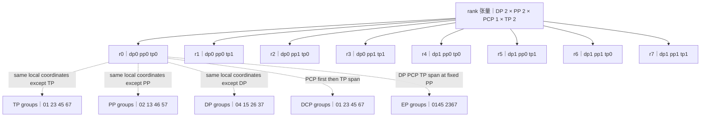
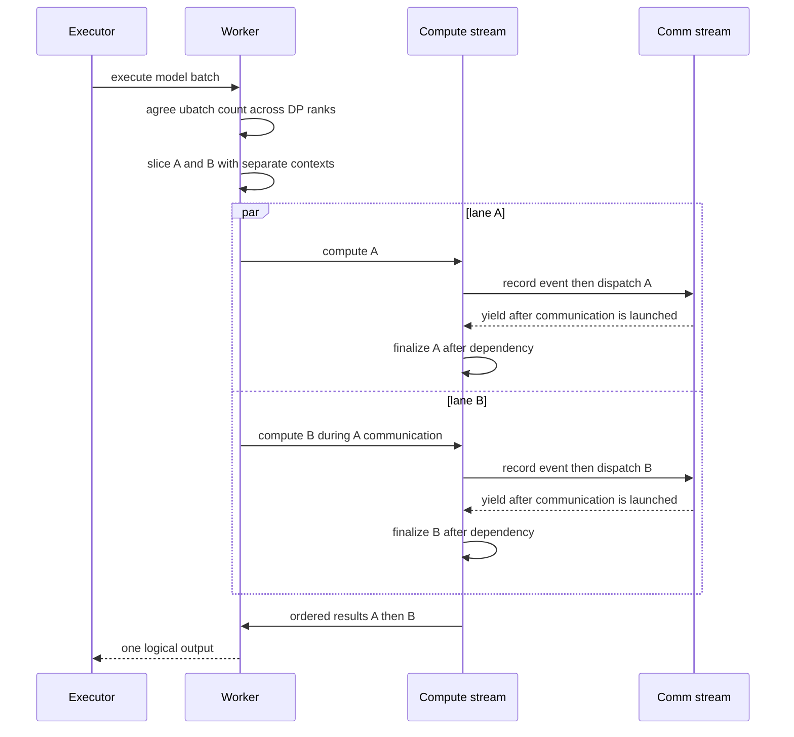

# vLLM 分布式推理：从逻辑并行轴到 rank 状态与 collective 顺序

> [!question] 本页回答什么
> TP、PP、DP、EP、PCP/DCP 分别切什么状态，怎样投影到 rank、process group 与 worker 进程？executor 怎样维持 collective 顺序？DBO 又怎样在不改变模型切分的前提下重叠两个 microbatch？

> **源码基线**：`vllm-project/vllm@6b110badbb22d3f66c7218b71138f13b7a6b3419`
> **中心命题**：并行轴是张量或请求状态的逻辑坐标，进程只是坐标的承载者，process group 才是 collective 的参与集合。vLLM 先把全局 rank reshape 为统一坐标，再为每条轴派生 group；executor 必须让相关 worker 以相同顺序进入这些 group 上的通信。DBO 只把一次执行切成两个时间 lane，不能修复错误的 group 或 collective 次序。
> **所有权边界**：本页拥有逻辑并行轴、rank/group/process 状态、executor fan-out 与 collective 排序、DBO overlap。在线权重更新事务属于 [[02_engineering/03_infer_frameworks/vllm/29_vllm_rlhf_and_online_serving_analysis|RLHF 与在线 Serving]]，不在本页展开。
> **最近更新**：2026-08-30。

## 一、先分开三个问题：切什么、谁持有、何时执行

| 层次 | 问题 | 典型对象 | 不能混为一谈的原因 |
|---|---|---|---|
| 逻辑并行轴 | 哪类状态被切分或复制 | TP 权重通道、PP 层、DP 请求/副本、EP experts、PCP/DCP 序列上下文 | 一条轴可能重排另一条轴的 ranks；轴名不等于进程类型 |
| 进程所有权 | 哪个 worker 保存哪一片本地状态 | local rank、device、model shard、KV cache、communicator | multiprocessing、Ray、external launcher 只是产生与控制 workers 的方式 |
| 时间调度 | 同一个 worker 何时推进哪份工作 | PP stage step、collective 序列、DBO ubatch lane | DBO 增加时间重叠，不增加新的模型切分轴 |

`ParallelConfig` 分别保存 TP、PP、PCP、DP、EP 与 DBO 配置；模型并行总 world size 是 `PP × TP × PCP`，external launcher 场景才再把 DP 乘入进程组；`vllm/config/parallel.py:119-166,218-231,863-874`。因此“8 张卡”本身不能推出拓扑：它可能是 TP=8，也可能是 TP=2、PP=2、DP=2；两者的本地权重、KV 所有权和通信序列完全不同。

> [!important] 分析推论
> executor backend 与并行轴正交但不独立：backend 不定义 tensor shard 语义，却必须创建足够的 workers、给出一致 rank，并保证所有相关 worker 都执行定义该语义的 collective。

## 二、一个 rank 张量派生多组通信合同

模型并行初始化把 ranks reshape 为 `ExternalDP × DP × PP × PCP × TP`；源码同时警告，内部 DP group 的 ranks 必须同步调用 generate，否则 collective 可能死锁；`vllm/distributed/parallel_state.py:1817-1832`。下图以 DP=2、PP=2、PCP=1、TP=2 为例。数字是 global rank；相同八个进程被不同逻辑轴投影成不同 group。

这不是五套进程，而是五种 group membership。代码从同一 rank tensor 依次派生 TP、DCP、PCP、PP、DP 与 EP groups；`vllm/distributed/parallel_state.py:1834-1955`。

| 轴 | 切分/复制的状态 | 是否新增 worker | group 固定什么、改变什么 | forward 中的主要通信 |
|---|---|---|---|---|
| TP | 单层权重与 activation channel | 是，world size 已含 TP | 固定 DP/PP/PCP，改变 TP | row-parallel all-reduce，column-parallel 可 all-gather |
| PP | Transformer layer range | 是，world size 已含 PP | 固定 DP/PCP/TP，改变 PP | stage 间 point-to-point activation |
| DP | 模型副本、请求队列、KV pool | internal DP 是；external DP 可是独立 engine | 固定 PP/PCP/TP，改变 DP | dense 请求可独立；MoE/协调状态需 DP collective |
| EP | experts 的所有权 | 通常不新增；重用 DP×PCP×TP ranks | 固定 PP，改变 DP/PCP/TP 的组合 | token dispatch/combine all-to-all |
| PCP | prefill context 分片 | 是，world size 已含 PCP | 固定 DP/PP/TP，改变 PCP | partial result / KV 交换 |
| DCP | decode context 分片 | 不新增；重用 PCP×TP ranks | 固定 DP/PP，先跨 PCP 再跨 TP | attention LSE/data all-gather 与 reduce-scatter |

TP 的 layer ABI 说明“切轴”落在 layer 内，而不是 executor 末尾统一补通信：column-parallel linear 产生 output shards 并可 gather；row-parallel linear 汇总 partial sums，bias 只由 TP rank 0 加一次；`vllm/model_executor/layers/linear.py:582-600,1737-1758`。PP 则在模型装载时把层区间分给 stage，不能仅按 worker 数理解；`vllm/model_executor/models/utils.py:832-864`。

PCP 与 DCP 也不能合并成“context parallel”一个黑盒。DCP group 按 PCP 后 TP 的顺序展开，并复用已有 ranks；attention 路径对 LSE 和输出执行跨 DCP rank 的 gather/reduce-scatter；`vllm/distributed/parallel_state.py:1851-1867`、`vllm/v1/attention/ops/dcp.py:260-303`。EP 同样重组而非增员：它在固定 PP stage 内跨 `DP × PCP × TP` 建组；EPLB 另建 group，避免统计/重排通信和 forward collective 交错；`vllm/distributed/parallel_state.py:1923-1978`。

### `GroupCoordinator` 把 membership 变成进程内状态

每个 rank 都循环调用 `torch.distributed.new_group` 创建相同的全局 group 列表，只有成员 rank 把对应 CPU/device group 保存到本地 coordinator；`vllm/distributed/parallel_state.py:455-472`。coordinator 同时记录 global rank、local rank、`rank_in_group`，并持有 CPU group、device group 与 device communicator；`vllm/distributed/parallel_state.py:380-407,501-520`。上层 `all_reduce`、`all_gather`、`reduce_scatter` 因而调用“当前 TP/DP/DCP group 上的语义操作”，不是再次推导成员；`vllm/distributed/parallel_state.py:662-748`。

> [!warning] 建组顺序不变量
> `new_group` 是全局顺序协议。所有 ranks 必须以同样顺序创建 groups；forward 时，一个 collective 的成员还必须以同样顺序、兼容 shape 进入同一个 coordinator。任一 rank 提前返回或走入另一 group，表现通常是永久等待而非干净报错。

## 三、executor 创建进程，但 worker 才拥有 rank 状态

`WorkerBase` 保存 `rank`、`local_rank`、`distributed_init_method`、`ParallelConfig` 与 worker role；`vllm/v1/worker/worker_base.py:50-94`。GPU worker 绑定 device 后初始化 distributed environment 和 model-parallel groups；`vllm/v1/worker/gpu_worker.py:407-425,1463-1501`。所以真实所有权链是：

`executor actor/process → worker → global/local rank → group coordinators → local model/KV/ubatch state`。

- `UniProcExecutor` 只在 world size 为 1 时直接持有单 worker；`vllm/v1/executor/uniproc_executor.py:51-88`。
- `MultiprocExecutor` 按 parallel config 计算本地进程数、创建 workers，再以 collective RPC fan-out；`vllm/v1/executor/multiproc_executor.py:125-204,375-448`。
- Ray executor 给 actor 排序并分配 global/local rank，然后调用统一的 distributed 初始化；`vllm/v1/executor/ray_executor.py:206-232,350-380`。

executor 的 `execute_model` 返回顺序也不是“任一 worker 都能作最终输出”。multiprocessing 路径从指定 output rank 收集结果；`vllm/v1/executor/multiproc_executor.py:340-364,541-555`。PP 场景的非末 stage 主要交付 intermediate tensors，末 stage 才拥有 logits/output；Ray compiled DAG 也为 PP 走专门路径；`vllm/v1/executor/ray_executor.py:577-608`。

### internal DP 与 external DP 的边界

internal DP 会把基础 rank 加上 DP-rank offset，并扩大默认 process group；`vllm/distributed/parallel_state.py:1606-1635`。MoE engine cores 需要 coordinated DP；dense 模型可重配为各自 DP=1 后独立前进；`vllm/v1/engine/core.py:1291-1336`。这解释了为什么 DP 既可表现为独立副本，也可能是同一 collective 域：判断依据不是“都叫 DP”，而是它们是否共享 model-parallel process group 以及 forward 是否含 DP/EP collective。

## 四、一次执行的正确性是有向通信序列

PP worker 在复用上一轮异步 handle 前先等待，然后从前一 stage `irecv`，执行本 stage forward，再向后一 stage `isend`；`vllm/v1/worker/gpu_worker.py:1111-1115,1153-1196`。stage 内部又可能进入 TP、DCP 或 EP collectives。因此一次 logical step 的关键顺序是：

1. executor 把同一 step 的输入 fan-out 到相关 workers；
2. 非首 PP stage 接收 shape 一致的 intermediate tensors；
3. stage forward 按模型层顺序进入 TP/DCP/EP collectives；
4. 非末 PP stage 发送 intermediate tensors；末 stage 形成输出；
5. executor 从约定 output rank 汇聚结果，所有 ranks 才能进入下一次相关通信。

这里有三条硬不变量：

- **membership**：每次 collective 的所有预期成员都必须参加；
- **order**：同一 group 上第 N 个 collective 在每个成员处语义相同；
- **shape/lifetime**：tensor shape、dtype 与通信 buffer 生命周期一致，异步 handle 完成前不得复用。

内部 DP 的空闲 rank 也不能随意跳过 step。`DPEngineCore` 在本地没有可执行请求但协调域仍运行时发送 dummy batch，再以 all-reduce 汇总全组是否还有未完成请求，从而维持 collective lockstep；`vllm/v1/engine/core.py:2187-2236`。回归测试展示了反例：一个 DP rank 进入 barrier 而另一个进入 EP dummy all-to-all 会死锁；修复目标正是让 ranks 进入同一序列；`tests/v1/distributed/test_async_llm_dp.py:608-620,686-709`。

## 五、DBO：在同一 ownership 上增加两条时间 lane

DBO 的动机主要是隐藏 MoE dispatch/combine 或其他 collective 的等待：把 batch 切为两个 ubatches，在 ubatch A 的通信窗口推进 ubatch B 的计算。它没有创建新 rank 或 process group。`ParallelConfig` 只在开启 DBO 且 token 数超过 prefill/decode threshold 时使用两个 ubatches；`vllm/config/parallel.py:218-231,580-590`、`vllm/v1/worker/ubatch_utils.py:38-46`。

### 1. 先全组同意是否切分

本地 token 数达到 threshold 仍不够：DP ranks 先同步选择 ubatch mode，并在需要时 padding；若最后一个 microbatch 为空，全组否决切分；`vllm/v1/worker/dp_utils.py:60-77,95-170,205-234`。否则某 rank 执行一个 batch、另一 rank 执行两个 batch，同一 EP/DP group 上的 collective 次数立即分叉。

### 2. yield 是 stream 所有权交接，不是任意线程切换

`UBatchContext` 只允许一个 CPU 线程拥有 context，通过 CUDA events 把 compute/communication stream 的依赖显式交接；`vllm/v1/worker/ubatching.py:20-147`。wrapper 创建两套 contexts 与 streams，用 barrier 同步线程，最后按 ubatch 顺序拼回结果；`vllm/v1/worker/gpu_ubatch_wrapper.py:113-139,305-408,441-537`。DeepEP high-throughput 路径在 capture、yield、dispatch 与 combine 间显式记录/等待事件；`vllm/model_executor/layers/fused_moe/prepare_finalize/deepep_ht.py:119-179,350-409`。

### 3. workspace 必须按 ubatch/lane 隔离

异步通信未完成时复用 tensor 会产生数据竞争。workspace 管理器因此按 ubatch 和 lane 分配、追踪生命周期；`vllm/v1/worker/workspace.py:47-68,152-199`。测试要求双 ubatch 双 lane 得到四个独立 buffers；`tests/v1/worker/test_workspace.py:67-82`。prefix cache reader/writer 还会在不安全状态否决 DBO；`vllm/v1/worker/gpu_model_runner.py:3956-3999`。

> [!warning] 当前兼容边界
> 这份基线中 DBO 不受 Model Runner V2 支持，配置会回退到 V1；PCP 则不受 Model Runner V1 支持。因此 PCP 与 DBO 当前不能组成一条可运行路径；`vllm/config/vllm.py:637-652,2448-2452,2471-2477`。这不是轴代数上的冲突，而是 runner 能力矩阵的实现边界。

## 六、从症状反推哪条合同破了

| 症状 | 优先检查 | 机制解释 |
|---|---|---|
| 初始化阶段 hang | 所有 ranks 的 group 创建顺序、world size、rank offset | `new_group` 列表不一致，尚未进入模型 forward |
| 首个请求 hang | PP recv/send 对端、internal DP 空闲 rank、EP dummy path | membership 或第一个 collective 次序分叉 |
| 只在某些 batch hang | DBO threshold 决策、空 ubatch、动态分支 | ranks 执行的 collective 次数不同 |
| 数值错但不 hang | TP shard axis/bias、DCP LSE 合并、EP combine offsets | membership 一致但张量语义或 shape 错 |
| DBO 偶发污染 | workspace lane、CUDA event、async handle 生命周期 | 下一 ubatch 覆盖仍在通信的 buffer |
| 扩 DP 后吞吐不升 | internal/external DP 模式、路由偏斜、EP all-to-all | 新进程可能加入协调域，而非独立副本 |

最低成本的排查顺序是：先打印每个 worker 的 global/local rank 与 DP/PP/PCP/TP/EP coordinates，再核对 group membership；然后记录每个 group 上 collective 的序号、shape 与 stream/event；最后才比较 Ray、multiprocessing 或 kernel 性能。这样先排除正确性合同，再优化承载合同。

## Related Pages

- [[02_engineering/03_infer_frameworks/vllm/03_vllm_architecture_overview_analysis|架构总览]] — 一次请求如何跨越 EngineCore 与 executor。
- [[02_engineering/03_infer_frameworks/vllm/10_vllm_engine_architecture_analysis|Engine 架构]] — EngineCore、executor 与 worker 的控制边界。
- [[02_engineering/03_infer_frameworks/vllm/13_vllm_model_library_analysis|模型库与模型 ABI]] — PP layer partition 与 TP-compatible layers。
- [[02_engineering/03_infer_frameworks/vllm/14_vllm_attention_backends_analysis|Attention Backend]] — PCP/DCP 所依赖的 attention 状态与 kernel。
- [[02_engineering/03_infer_frameworks/vllm/16_vllm_serving_control_plane_analysis|Serving 控制面]] — external/internal DP 与请求路由。
- [[02_engineering/03_infer_frameworks/vllm/23_vllm_compilation_cudagraph_analysis|Compilation 与 CUDA Graph]] — distributed collective 与 graph capture 的接缝。
- [[02_engineering/03_infer_frameworks/vllm/24_vllm_fused_ops_and_kernels_analysis|融合算子与 Kernel]] — collective 与计算融合的设备实现。
