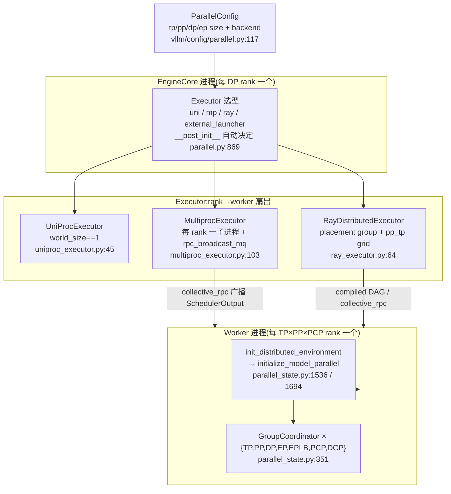
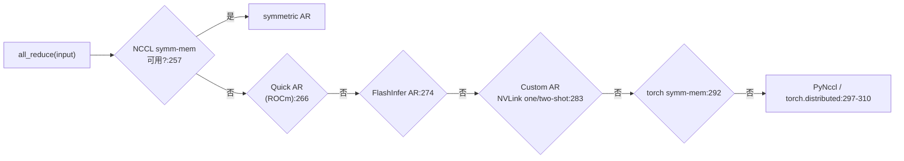
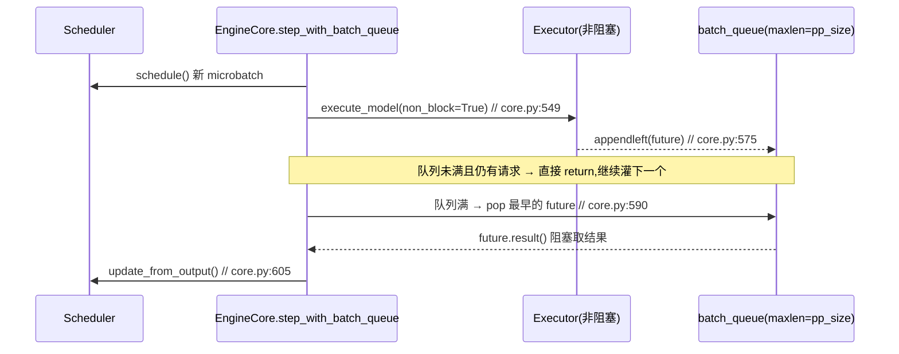
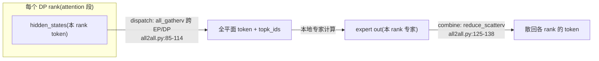

# vLLM 分布式推理 —— TP / PP / EP / DP 与进程组编排

> **代码基准**:vLLM `main` @ `485bbe1c6`(2026-06-21)· V1 引擎
> **最后更新**:2026-06-22 · **系列**:vLLM 推理引擎源码级分析(见 [[vllm/index]])
> **分析维度**:Overview → Quick Start → Deep Dive
>
> 本页回答:vLLM 把一个模型沿 **TP / PP / EP / DP** 四个维度切到多卡多机时,进程组(`parallel_state`)如何按 5 维 rank 张量切出各通信组、executor 如何把 rank 扇出成 worker、以及 PP 流水线 / MoE 的 DP-attention+EP 在 V1 里到底怎么跑。**层内 TP 怎么切权重(Column/Row)归 [[13_vllm_model_library_analysis]]**;**executor 如何把一条请求广播给所有 worker 的整体架构归 [[10_vllm_engine_architecture_analysis]]**;本页只钉死「进程组 + 通信 + PP/DP/EP 机制」这一层。

---

## 一、Overview(总览)

### 1.1 为什么要分布式:两个正交的动机

- **单卡放不下**:模型权重 + KV cache 超过单卡显存 → 必须**切模型**。TP(层内切)、PP(按层切 stage)、EP(MoE 专家切)都属此类。
- **吞吐不够**:模型放得下但单实例打不满集群 → **复制模型 + 切数据**。DP(数据并行)属此类;在 MoE 上 DP 还和 EP 耦合成 "DP-attention + EP" 的特殊形态。

vLLM 把这四维统一在一个 5 维 rank 张量里编排(§3.1),所有跨卡通信都收敛到 `GroupCoordinator`(§3.2)这一个门面类上。

### 1.2 四维并行对照表

| 维度 | 切什么 | 通信模式 | 通信域 / 拓扑 | 解决什么 | 进程组 |
|------|--------|----------|----------------|----------|--------|
| **TP** 张量并行 | 每层权重(Column/Row)切 N 份 | 每层 1~2 次 **all-reduce**(+ SP 下 all-gather/reduce-scatter) | 节点内 NVLink,延迟敏感 | 单层放不下 / 算力扩展 | `_TP` |
| **PP** 流水并行 | 按 layer 切成 stage | stage 间 **P2P send/recv**(IntermediateTensors) | 跨节点亦可,带宽友好 | 整模型放不下、跨机扩展 | `_PP` |
| **EP** 专家并行 | MoE 专家整份分到各 rank | **all-to-all** dispatch / combine | DP×TP 平面(节点内/外) | MoE 专家权重巨大 | `_EP` / `_EPLB` |
| **DP** 数据并行 | 不切权重,切 **请求/token** | DP 内 all-reduce(lockstep)、MoE 下 all-gather/reduce-scatter | 每 DP rank 一份完整模型副本 | 吞吐扩展;MoE 喂满 EP | `_DP`(模型侧 NCCL)+ engine 侧 gloo |

> 还有两个上下文并行维度(`_PCP` prefill-CP、`_DCP` decode-CP)与本页主线正交,见 `vllm/config/parallel.py:124,339`,本页只在 rank 布局里带过。

### 1.3 进程组 / executor / worker 三层映射



**关键事实**:一个 EngineCore 对应一个 DP rank(或 SPMD 下整组),其 Executor 管 `world_size = TP×PP×PCP` 个 worker(`vllm/config/parallel.py:793`);DP 维度跨 EngineCore 进程,由更上层的 `DPCoordinator` 协调(§3.6)。

### 1.4 rank 布局:一切的起点是一个 5 维张量

`initialize_model_parallel` 把全局 rank 排成 `[ExternalDP, DP, PP, PCP, TP]`(TP 在最内、相邻 rank 优先同机),再用 transpose+reshape 切出每个维度的组(`vllm/distributed/parallel_state.py:1760-1896`)。这是理解 "EP 为什么等于 DP×TP" 的钥匙,详见 §3.1。

---

## 二、Quick Start(快速上手)

### 2.1 命令行 flag 一览(`vllm/engine/arg_utils.py`)

| Flag(短) | 全称 | 含义 | 行号 |
|-----------|------|------|------|
| `-tp` | `--tensor-parallel-size` | TP 组大小 | `arg_utils.py:999` |
| `-pp` | `--pipeline-parallel-size` | PP stage 数 | `arg_utils.py:961` |
| `-dp` | `--data-parallel-size` | DP 副本数 | `arg_utils.py:1024` |
| `-ep` | `--enable-expert-parallel` | MoE 用 EP 而非 TP 切专家 | `arg_utils.py:1086` |
| `-dpl` | `--data-parallel-size-local` | 本节点上的 DP 副本数 | `arg_utils.py:1042` |
| `-dpb` | `--data-parallel-backend` | DP 后端 `mp` / `ray` | `arg_utils.py:1060` |
| `-dpe` / `-dph` | `--data-parallel-external-lb` / `-hybrid-lb` | wide-EP 的外部/混合负载均衡 | `arg_utils.py:1072 / 1067` |
| — | `--distributed-executor-backend` | `ray`/`mp`/`uni`/`external_launcher` | `arg_utils.py:956` |
| — | `--all2all-backend` | MoE all-to-all 内核(deepep/mori/…) | `arg_utils.py:1095` |
| — | `--enable-eplb` | 专家负载均衡 | `config/parallel.py:171` |

典型组合:
- 单机 8 卡稠密大模型:`-tp 8`(节点内 NVLink all-reduce)。
- 跨 2 机 70B:`-tp 8 -pp 2 --distributed-executor-backend ray`(机内 TP、机间 PP)。
- DeepSeek 类 MoE wide-EP:`-tp 8 -dp 8 --enable-expert-parallel --all2all-backend deepep_low_latency`(64 卡组成一个 EP=64 平面)。

### 2.2 关键入口锚点

```text
EngineCore 起进程
  └─ Executor._init_executor                      vllm/v1/executor/multiproc_executor.py:110
       └─ WorkerProc.make_worker_process × world_size      :176-192
            └─ Worker.init_device
                 └─ init_distributed_environment   vllm/distributed/parallel_state.py:1536   # 建 WORLD
                 └─ initialize_model_parallel       vllm/distributed/parallel_state.py:1694   # 切 TP/PP/DP/EP/...
每步执行
  └─ Executor.collective_rpc("execute_model", SchedulerOutput)  multiproc_executor.py:340
       └─ rpc_broadcast_mq.enqueue → 各 worker 忙循环 dequeue    multiproc_executor.py:374 / 979
```

`distributed_executor_backend` 不显式给时由 `ParallelConfig.__post_init__` 自动决定:`world_size_across_dp==1`→`uni`;装得下且无 Ray→`mp`;否则报错让你显式选 `ray`(`vllm/config/parallel.py:869-914`)。

---

## 三、Deep Dive(源码级深挖)

### 3.1 进程组编排:5 维 rank 张量的 transpose 切组

`initialize_model_parallel`(`vllm/distributed/parallel_state.py:1694`)是整套并行的"接线盘"。先把全局 rank 排成 5 维张量(`:1769`):

```python
all_ranks = torch.arange(world_size).reshape(
    -1,                                   # ExternalDP(verl 等场景,通常=1)
    data_parallel_size,                   # DP
    pipeline_model_parallel_size,         # PP
    prefill_context_model_parallel_size,  # PCP
    tensor_model_parallel_size,           # TP(最内,相邻 rank 同机)
)
```

各维度的组就是"把该维 transpose 到最后 → reshape 成 2D → 按行 unbind":

| 组 | 切法 | 行号 | 语义 |
|----|------|------|------|
| `_TP` | `view(-1, TP)` | `:1780` | 连续 TP 块,每块一个 TP 组;**唯一带 message-queue broadcaster** 的组(`:1790`) |
| `_PP` | `transpose(2,4).reshape(-1, PP)` | `:1838` | 跨 PP 维抽,组内相邻 rank 差一个 stage |
| `_DP` | `transpose(1,4).reshape(-1, DP)` | `:1855` | 模型侧 DP 组(MoE 集合通信用) |
| `_EP` | `transpose(1,2).reshape(-1, DP*PCP*TP)` | `:1874` | **一个 PP stage 内的整个 DP×PCP×TP 平面**;仅 MoE 模型建(`:1873`) |
| `_EPLB` | 同 `_EP` 的 ranks,独立 PG | `:1904` | 与 `_EP` 同成员但**另开一个进程组**,隔离 EPLB 通信与 MoE forward,避免死锁(`:1898-1901`) |

每个组都经 `init_model_parallel_group`(`:1279`)包成一个 `GroupCoordinator`。最后一行日志把本 rank 在各维度的 `rank_in_group` 打出来(`:1923`),线上排查并行配置的第一手信息就在这。

> **EP = DP × TP 的来历**:`_EP` 由 `transpose(1,2)`(把 DP 换到 PP 位置)后 flatten `DP*PCP*TP`,即**同一 PP stage 内、所有 DP 副本 × 所有 TP rank** 共同组成一个专家平面。这与 MoE 层里 `ep_size = dp*pcp*tp`(§3.7)严格对应。

**一个具体例子**:`TP=2, PP=2, DP=2, PCP=1`(world=8),5 维张量按 `rank = dp*4 + pp*2 + tp` 排布,切出的组为:

| 组 | 成员(rank lists) | 解读 |
|----|--------------------|------|
| `_TP` | `[0,1] [2,3] [4,5] [6,7]` | 相邻 rank 同 TP 组,优先同机 NVLink |
| `_PP` | `[0,2] [1,3] [4,6] [5,7]` | 组内相邻 rank 差一个 stage |
| `_DP` | `[0,4] [2,6] [1,5] [3,7]` | 跨两份模型副本 |
| `_EP` | `[0,1,4,5] [2,3,6,7]` | 2 个 EP 平面(= 2 个 PP stage),每个 = DP×TP = 4 rank |

可见 EP 组 `[0,1,4,5]` 恰是 PP stage 0 上 `{dp0,dp1}×{tp0,tp1}` 的笛卡尔积——这就是 "EP=DP×TP" 的字面含义。

`world` 组本身在更早的 `init_distributed_environment`(`:1536`)里建:DP>1 时它把 rank 偏移成 `dp_rank*world_size + rank`、world 扩成 `world_size_across_dp`(`:1568-1570`),所以到 `initialize_model_parallel` 时 `get_world_size()` 已是含 DP 的全局大小。

### 3.2 GroupCoordinator:一个通信组的门面

`GroupCoordinator`(`vllm/distributed/parallel_state.py:351`)是 PyTorch `ProcessGroup` 的封装,一个对象 = 一个并行维度的组。构造时(`:380`)对每组 ranks **同时建两个 PG**:device 组(NCCL,跑张量)+ CPU 组(gloo,跑元数据/协调)(`:424-439`),并按平台实例化 `device_communicator`(CUDA 下即 `CudaCommunicator`,`:470-479`)。

对外暴露的集合通信都是薄封装,`world_size==1` 直接短路:
- `all_reduce`(`:622`)/ `all_gather`(`:651`)/ `reduce_scatter`(`:682`):走 custom-op 或直接落到 `device_communicator`。
- `send_tensor_dict` / `recv_tensor_dict`(`:941` 起):PP 专用,支持 `all_gather_group`(传 TP 组)做"发切片、收端 all-gather 重建"的带宽优化(`:951-964`)。
- `broadcast_tensor_dict`(`:845`):TP 组内广播,GPU 张量走 device 组、CPU 元数据走 gloo 组。
- `next_rank` / `prev_rank`(`:565/572`):PP 环形邻居,P2P 用。

公开函数 `tensor_model_parallel_all_reduce/all_gather/reduce_scatter`(`vllm/distributed/communication_op.py:12/17/24`)只是 `get_tp_group().xxx` 的转发,模型层(RowParallelLinear 等)调的就是它们,具体切分见 [[13_vllm_model_library_analysis]]。

### 3.3 executor → worker 扇出:collective_rpc 广播

`MultiprocExecutor`(`vllm/v1/executor/multiproc_executor.py:103`)是单机多卡默认路径:
1. `_init_executor`(`:110`)建一个 **`rpc_broadcast_mq`** 共享内存消息队列(`:151`),把 handle 传给每个 worker。
2. 按 `local_world_size` fork 出 worker 子进程(`:176-192`),每个 worker 跑 `worker_busy_loop`(`:979`):`rpc_broadcast_mq.dequeue()` 拿到 `(method, args, kwargs, output_rank)` → `getattr(worker, method)(...)` → 仅当 `output_rank is None or rank==output_rank` 时回写结果(`:994`)。
3. `collective_rpc`(`:340`)把方法名 + 参数 `enqueue` 到广播队列(`:374`),一次扇出到所有 worker;只从 `output_rank` 对应的 response 队列收结果(`:377-396`)。

`output_rank` 默认是 **最后一个 PP stage 的第一个 TP rank**:`world_size - tp_size*pcp_size`(`:495-509`)——只有它产出最终 `ModelRunnerOutput`,其余 rank(尤其前几个 PP stage)产出的是中间张量。

`UniProcExecutor`(`vllm/v1/executor/uniproc_executor.py:45`)是 `world_size==1` 的退化:`collective_rpc` 直接在本进程 `run_method` 调用 driver worker(`:79-95`),无广播开销。其子类 `ExecutorWithExternalLauncher`(`:150`)用于 torchrun:每个 launcher 进程只起一个 worker,靠 `env://` 的 `RANK/LOCAL_RANK` 自洽,适合 SPMD 离线 TP 推理。

### 3.4 TP 通信:all-reduce 的派发阶梯

TP 是延迟最敏感的维度(每层都 all-reduce),vLLM 在 `CudaCommunicator.all_reduce`(`vllm/distributed/device_communicators/cuda_communicator.py:254`)里按"快→慢"逐级尝试:



核心是 **custom all-reduce**(`vllm/distributed/device_communicators/custom_all_reduce.py`):仅支持 world size ∈ `[2,4,6,8]`(`:52`),消息上限默认 8 MB(`:59`),依赖 NVLink **全连接 P2P**(构造时做硬件 + P2P 能力探测,`:147-164`);`should_custom_ar`(`:230`)按张量大小决定是否走它。装不上 NVLink P2P 或超尺寸就回落 pynccl / NCCL。`--disable-custom-all-reduce` 或多机(`nnodes>1`)会强制关掉它(`vllm/config/parallel.py:991`)。

序列并行(SP)下 TP 的 all-reduce 会被拆成 reduce-scatter + all-gather,这部分与 MoE 的 `use_sequence_parallel_moe`(`config/parallel.py:642`)耦合,见 §3.7。

### 3.5 PP 执行(V1):batch_queue 虚拟引擎 + IntermediateTensors P2P

PP 的难点是"让多个 microbatch 在 stage 间流动、把流水线填满"。V1 不再用 V0 的虚拟引擎对象,而是用 **EngineCore 里的 `batch_queue`** 实现:

- 队列大小 = `max_concurrent_batches`,而它**正好等于 `pp_size`**(`vllm/config/vllm.py:495-505`)——填满流水线需要 pp_size 个并发 batch。
- `batch_queue_size>1` 时,`step` 指针切到 `step_with_batch_queue`(`vllm/v1/engine/core.py:222`)。

`step_with_batch_queue`(`core.py:519`)的节奏(`:525-533` 的 docstring 说得很清楚):



跨 stage 的张量搬运在 **worker 层**完成(`vllm/v1/worker/gpu_worker.py`):
- **非首 stage**:执行前 `get_pp_group().irecv_tensor_dict(all_gather_group=get_tp_group())` 收上一 stage 的隐状态,包成 `AsyncIntermediateTensors`(`:881-893`)。
- **非末 stage**:执行后 `get_pp_group().isend_tensor_dict(output.tensors, all_gather_group=get_tp_group())` 非阻塞发给下一 stage(`:918-922`)。
- 用 TP 组做 `all_gather_group` 即 §3.2 的带宽优化:每个 TP rank 只发隐状态的一个切片,收端 all-gather 重建。

layer→stage 的分配由 `get_pp_indices`(`vllm/distributed/utils.py:109`)均分:不整除时把余数摊给中间 stage(首尾 stage 带 embedding/输出 norm,故少分),也可用 `VLLM_PP_LAYER_PARTITION` 手工指定(`:125-136`)。

末 stage 采样出的 token 还要**回灌**给前面 stage(decode 时它们要知道下一个 token):`PPHandler`(`vllm/v1/worker/gpu/pp_utils.py:51`)用一个**专门的 sibling NCCL 组**(`make_sibling_device_group`,`:85`)做 sampled-token broadcast,与隐状态 P2P 走不同 communicator 互不串扰;step T 的 recv 在 step T+pp_size 才被消费(`:54`,FIFO 深度 = pp_size)。

### 3.6 DP:逐步 lockstep + 请求 wave 协调

DP 在 vLLM 有**两层**含义,别混:

1. **Engine 级 DP**(`-dp` 的常态):起 N 个独立 `DPEngineCoreProc`(`vllm/v1/engine/core.py:1743`),每个跑一份完整的 TP×PP 模型副本,前端按负载把请求分给不同 DP rank。
2. **模型级 `_DP` 组**(`parallel_state._DP`,NCCL):MoE 的 token all-gather/reduce-scatter 在它上面跑(§3.7)。

为什么 DP 必须**逐步对齐(lockstep)**?因为 MoE 的 all-to-all(以及 DP-attention 的 all-gather/reduce-scatter)是 **DP 组内的集合通信**,任何一个 DP rank 不发对应的集合调用,其余 rank 全 hang。vLLM 用三个机制保证对齐:

- **空步补偿**:某 rank 本步没有可执行请求、但全局还在跑(`engines_running`),就执行 `execute_dummy_batch()`(`core.py:1953`),发出与别人匹配的 dummy 集合通信。
- **全局未完成同步**:每 32 步做一次 `sync_dp_state` all-reduce(`core.py:1982-1992` → `config/parallel.py:698`),判断是否所有 rank 都空了;全空则本 wave 结束(`current_wave += 1`,`core.py:1977`)、进入 paused。
- **请求 wave 协调**:`DPCoordinator`(`vllm/v1/engine/coordinator.py:23`)是独立进程,记录全局 wave 号与 running/paused 状态;某 rank 在 paused 态收到新请求时,Coordinator 广播 `START_DP_WAVE` 把所有 engine 一起唤醒(`:443-453`,`core.py:1836-1847`)。注意 engine 级 lockstep 用的是 `parallel_config.stateless_init_dp_group()` 建的 **gloo** 组(`core.py:1808`),与模型侧 NCCL `_DP` 是两回事。

此外每步还有一次 **DP padding 协调**:`coordinate_batch_across_dp`(`vllm/v1/worker/dp_utils.py:164`)对各 rank 的 token 数做 all-reduce(`:36 _run_ar`),在开 CUDA graph 或微批(DBO)时把所有 DP rank padding 到同一 token 数(`:152-159`),保证集合通信形状一致。

### 3.7 EP for MoE:DP-attention + 专家 all-to-all

MoE 的并行哲学是:**attention 部分按 DP 跑(各 rank 算自己那批 token,权重靠 TP 复制),专家部分按 EP 切(每 rank 独占一批专家)**。两段之间用 all-to-all 把 token 路由到专家所在 rank、再收回来。

**EP 维度怎么算**:`FusedMoEParallelConfig.make`(`vllm/model_executor/layers/fused_moe/config.py:1108`)在 `enable_expert_parallel` 时:
- 先把 TP 跨 DP/PCP 拍平:`flatten_tp_size = dp*pcp*tp`(`:1097-1105`);
- 然后 **`ep_size = flatten_tp_size`、`tp_size→1`**(`:1220-1223`)——专家不再做张量切分,而是整份分到这 `dp*pcp*tp` 个 rank 上。

docstring 的例子最直观(`config.py:1163-1186`):`TP=2,DP=2,EP=on` → 4 卡 `EP={4,rank}`、`TP={1,0}`,即 4 张卡平分全部专家。每 rank 拿哪些专家由 `determine_expert_map`(`vllm/model_executor/layers/fused_moe/expert_map_manager.py:22`)算:`local_num_experts = global//ep_size`(余数给末位),`linear` 连续切 / `round_robin` 轮转(`:75-87`),返回 `expert_map`(全局→本地索引,非本地填 -1)。

**dispatch / combine** 的默认实现是 `AgRsAll2AllManager`(`vllm/distributed/device_communicators/all2all.py:42`):



- `dispatch`(`:85`)用 `all_gatherv` 把各 DP rank 的 token 按 `dp_metadata.get_chunk_sizes_across_dp_rank()`(`vllm/forward_context.py:112`)聚到一起;
- `combine`(`:125`)用 `reduce_scatterv` 把专家输出散回;
- 通信域:`is_sequence_parallel` 时用 `get_ep_group()`,否则 `get_dp_group()`(`:103,136`)。

高性能后端(DeepEP HT/LL、Mori、NIXL、FlashInfer NVLink)在 `cuda_communicator.py:125-181` 按 `all2all_backend` 选择,用专用 kernel 把 dispatch/combine 做成真正的 all-to-all(`all2all.py:144/198/259/779/881`)。其中 `use_sequence_parallel_moe`(`config/parallel.py:642`)在 TP>1 且 DP>1 时把 MoE 输入做成序列并行,避免 o_proj all-reduce 后 token 被复制导致 all-to-all 重复计算(`config/parallel.py:633-656` 注释)。

DP-attention 的逐步对齐(dummy batch、token padding)正是 §3.6 那套机制在为 EP 的 all-to-all 兜底。

### 3.8 EPLB:专家负载均衡

MoE 路由天然不均(热门专家被打爆),`EplbState`(`vllm/distributed/eplb/eplb_state.py:210`)做动态再均衡:

- **采样**:每步 `step`(`:477`)累积各物理专家的负载到一个滑动窗口(`window_size`,默认 1000),dummy 步不计(`:507-510`)。
- **触发**:每 `step_interval`(默认 3000)步触发一次 `rearrange`(`:662`),按窗口负载用 `DefaultEplbPolicy` 重算 physical→logical 映射,**跨 rank 物理搬运专家权重**(一次重集合通信)。所有 EP rank 必须步调一致,否则 rearrange 在集合调用处 hang(`:240-243`)。
- **隔离**:走独立的 `_EPLB` 进程组(§3.1,`parallel_state.py:1904`),与 `_EP` 同成员但不同 PG,避免 EPLB 通信和 MoE forward 通信交叠死锁。
- **异步**:`use_async`(默认 True)把搬运放后台线程(`eplb_state.py:265`,`async_worker.py`);可配 `num_redundant_experts` 给热门专家加冗余副本(`config/parallel.py:70`)。

开启需 `--enable-expert-parallel` 且 `TP*DP>1`(`config/parallel.py:475-488`);弹性扩缩容场景见 `vllm/distributed/elastic_ep/`(stateless NCCL 组,`enable_elastic_ep`)。

### 3.9 多机:Ray vs 多进程 vs external_launcher

| 后端 | 适用 | 进程/通信模型 | 锚点 |
|------|------|----------------|------|
| `mp` | 单机,或多机但每机一个 leader executor | 每 rank 一子进程,`rpc_broadcast_mq` 广播;多机靠 `node_rank_within_dp` 划分 leader(`multiproc_executor.py:135`) | `multiproc_executor.py:103` |
| `ray` | 跨机大集群 | placement group 占 GPU,`_init_workers_ray` 建 actor 并排序、组 `pp_tp_workers` 网格(`ray_executor.py:143,370-378`),`collective_rpc` 或 compiled DAG 驱动 | `ray_executor.py:64` |
| `uni` | `world_size==1` | 单进程,无扇出 | `uniproc_executor.py:45` |
| `external_launcher` | torchrun SPMD 离线 TP | 每 launcher 一 worker,`env://` 自洽,关 V1 多进程(`config/parallel.py:865`) | `uniproc_executor.py:150` |

后端默认值由 `ParallelConfig.__post_init__`(`config/parallel.py:869-914`)推断:GPU 数 < world_size 且没 Ray 直接报错,提示显式选 ray 或调 `--nnodes`。跨节点 KV / 分离式服务(prefill-decode 分离)走另一条线,见 [[mooncake_analysis]]。

---

## Related Pages
- [[13_vllm_model_library_analysis]] · [[10_vllm_engine_architecture_analysis]] · [[01_vllm_feature_optimizations_guide]] · [[14_vllm_attention_backends_analysis]]
- [[vllm/index]] · [[../index]]

## Cross-Domain Links
- [[12_megatron_tp_analysis]] · [[14_megatron_ep_analysis]] · [[13_megatron_cp_analysis]] —— 训练侧 TP/EP/CP 源码级对照
- [[31_megatron_inference_engine_analysis]] —— 训练框架推理引擎并行对照
- [[mooncake_analysis]] —— 分离式服务 / 跨节点 KV
