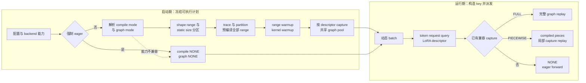

# vLLM 编译与 CUDA Graph：把动态请求收敛为可编译、可捕获、地址稳定的执行区

> **读者问题**：continuous batching 每一步的 token 数、request 数、query length、LoRA 组合都在变化，vLLM 怎样仍然提前得到有限个可编译 shape 区间和可捕获 graph case；运行时又凭什么安全地选择 full replay、piecewise execution 或 eager fallback？
> **源码基线**：`vllm-project/vllm@6b110badbb22d3f66c7218b71138f13b7a6b3419`（`main`，提交时间 2026-08-29T02:40:53Z）
> **中心命题**：vLLM 不试图让“任意动态 batch”直接成为一个万能静态图，而是连续做三次收敛：先用 compile range / static size 把动态 shape 域分区，再用 splitting policy 把 capture-safe 区域从动态图中切出来，最后用地址稳定的 persistent buffers 和有限 `BatchExecutionDescriptor` 集合把 launch 序列固定下来。编译产物回答“执行什么代码”，CUDA Graph entry 回答“以哪些地址重放哪条 launch 序列”；两者生命周期正交，运行时只命中启动期已经证明兼容的 case，其他情况显式回到 eager。
> **所有权边界**：本页拥有 dynamic-shape 分区、compile / cache / warmup / capture / replay 生命周期、地址稳定性、capture pool、dispatch key、invalidation 与 fallback，以及 eager / compile-only / piecewise / full 的组合关系。FX/IR 中 operation、alias、functionalization 与 pass 顺序归 [[02_engineering/03_infer_frameworks/vllm/25_vllm_ir_and_fusion_passes_analysis|vLLM IR 与融合 Pass]]；具体 fusion 收益、provider 与 Kernel 内部实现归 [[02_engineering/03_infer_frameworks/vllm/24_vllm_fused_ops_and_kernels_analysis|vLLM 融合算子与 Kernel]]。本页只引用这些下层语义形成的 capture boundary，不在这里重讲其实现。
> **最近更新**：2026-08-30。按 `6b110bad` 重建 shape → compile → warmup → capture → dispatch / replay 主线，并以 MRV2 live manager 取代旧 dispatcher 心智模型。

## 1. 背景：编译图和 launch 图不是同一份承诺

`torch.compile` 优化 FX/ATen 计算图，可能生成融合或 shape-specialized 的可执行代码；CUDA Graph 记录的是已经发生过的一串设备 launch 及其内存地址。前者可以用一个 symbolic range 覆盖多个 token 数，后者只能重放与 capture descriptor 相容的具体容量；`CompilationConfig` 因此明确把 `compile_sizes` / `compile_ranges_endpoints` 与 `cudagraph_capture_sizes` 分开（`vllm/config/compilation.py:435-443`；`vllm/config/compilation.py:575-592`）。

直观但错误的替代是把两者绑成一个开关：只要模型 compile 成功就 full-capture，或者每遇到新 shape 就现场 compile/capture。前一种做法会让一个不支持 capture 的 attention、collective 或动态 metadata 使整图失效；后一种会把编译和 capture 延迟塞进在线请求。官方编译设计要求所有 compilation 在服务前完成，避免请求触发新编译造成延迟尖峰（`docs/design/torch_compile.md:18-29`）；live backend 也在返回 callable 前编译全部 range 并落盘 cache（`vllm/compilation/backends.py:1218-1228`）。

> [!note] 分析推断
> 源码记录了最终机制，没有列出完整备选方案。由上述约束可重建选择标准：在线热路径优先要**有限状态、可预热、miss 可解释**，因此 vLLM 宁可让未证明的 batch 回到 eager，也不允许请求期悄悄扩张 compile / capture 状态空间。

## 2. 静态责任：四个 owner 共同建立执行合同

| 责任 owner | 输入 → 输出 | 拥有的状态与不变量 | 明确不拥有 | 承重证据 |
|---|---|---|---|---|
| `CompilationConfig` | 用户优化意图 + platform / attention 能力 → compile mode、splitting ops、shape ranges、graph mode / sizes | 模式求交、静态 shape 预算、合法组合与显式降级 | runtime tensor 地址、graph 实例 | `vllm/config/compilation.py:398-443`；`vllm/config/compilation.py:1371-1519` |
| compile wrapper / backend | 首次 dummy inputs + traced code → range-keyed callable 与磁盘 cache | dynamic dim 标记、guard policy、op partition、每个 range 的 compiled runnable、cache key | CUDA Graph dispatch key、persistent device buffers | `vllm/compilation/wrapper.py:47-53`；`vllm/compilation/backends.py:1029-1079`；`vllm/compilation/piecewise_backend.py:137-190` |
| MRV2 `CudaGraphManager` | graph mode + capture sizes + decode / LoRA 能力 → capture descriptors、candidate table、graph pool entries | 可捕获 descriptor 集合、共享 pool、capture 完成位、FULL graph table | request admission、输入值生产 | `vllm/v1/worker/gpu/cudagraph_utils.py:110-159`；`vllm/v1/worker/gpu/cudagraph_utils.py:187-311` |
| MRV2 runner | 当前 `SchedulerOutput` → padded descriptor + stable buffer values → FULL / PIECEWISE / NONE 执行 | 每步 descriptor、persistent input storage、dispatch / DP 一致性、replay 时序 | compile pass 语义、attention backend 内部算法 | `vllm/v1/worker/gpu/model_runner.py:1524-1563`；`vllm/v1/worker/gpu/model_runner.py:1719-1759` |

这四层的边界解释了为什么 cache hit 不等于 graph hit：磁盘 cache 可恢复“某段代码在某个 shape range 上怎样执行”，而 graph entry 还绑定当前进程的 storage、pool 与 capture-time metadata，只能由当前 runner 生命周期建立。

## 3. 模式求交：eager、compile、piecewise 与 full 是两条轴

### 3.1 编译轴与 capture 轴

`CompilationMode` 有 `NONE`、stock `torch.compile`、只 trace 一次并移除 guards、以及带 cache / piecewise / shape specialization 的 `VLLM_COMPILE` 四种选择（`vllm/config/compilation.py:37-50`）。`CUDAGraphMode` 则把 runtime mode 定义为 `NONE`、`PIECEWISE`、`FULL`，并用 `FULL_DECODE_ONLY` 与 `FULL_AND_PIECEWISE` 表达 decode / mixed 两条 routine 的组合（`vllm/config/compilation.py:53-97`）。

| 用户看到的执行形态 | compile 轴 | CUDA Graph 轴 | 实际含义与边界 |
|---|---|---|---|
| eager | `NONE` | `NONE` | 原始 model forward；`enforce_eager` 会同时关闭 compile 和 CUDA Graph（`vllm/config/vllm.py:1321-1327`） |
| compile-only | stock / trace-once / `VLLM_COMPILE` | `NONE` | 运行 compiled callable，但不记录 launch；适合隔离 compile 正确性与性能 |
| full graph without compile | `NONE` | `FULL` 或 `FULL_DECODE_ONLY` | 只要 backend 能 capture，完整 model step 可在无 compilation 时捕获；full 与 compile 在配置上正交（`vllm/config/compilation.py:630-638`） |
| piecewise | 通常为 `VLLM_COMPILE` | `PIECEWISE` | splitting ops 留在 graph 外，内部 compiled pieces 各自 capture；若启用 breakable CUDA Graph，则可不用 `torch.compile` 做分段 capture（`vllm/config/vllm.py:1420-1431`；`vllm/v1/worker/gpu/cudagraph_utils.py:152-157`） |
| full + piecewise | 通常为 `VLLM_COMPILE` | `FULL_AND_PIECEWISE` | uniform decode 优先 full，prefill / mixed 走 piecewise；覆盖最多，也支付最多 capture 时间和 graph memory（`vllm/config/compilation.py:615-638`；`docs/design/cuda_graphs.md:38-50`） |

“FULL 比 PIECEWISE 更高，所以一定更好”也是错误心智模型。`FULL` 消除完整 step 的 CPU launch，却要求 attention、metadata、collective 和地址都可捕获；`PIECEWISE` 保留 eager boundary，少消除一些 launch，却能服务更动态的 batch。配置会把请求模式与 attention backend 的最小 graph capability 求交：mixed 不支持 full 时可改为 `FULL_AND_PIECEWISE` 或 `FULL_DECODE_ONLY`，连 decode full 都不支持时再退为 `PIECEWISE` 或 `NONE`；没有合法替代时直接报错（`vllm/config/compilation.py:1389-1475`）。

### 3.2 图 1 规格：启动期建表，运行期只查表

图中的生命周期顺序来自 GPU worker：它先补齐未被 graph capture 覆盖的 compile size / range warmup，再做 kernel warmup，最后才调用 `capture_model()`（`vllm/v1/worker/gpu_worker.py:748-787`）。运行期则先从真实 batch 构造 descriptor 并完成 DP 同步，再选择三条执行路径（`vllm/v1/worker/gpu/model_runner.py:1524-1563`；`vllm/v1/worker/gpu/model_runner.py:1719-1759`）。

## 4. 动态 shape 怎样被压成有限状态

### 4.1 guard policy：只 trace 一次的收益以额外证明义务为代价

被 `support_torch_compile` 标注的 model 会显式标记哪些参数维度是 dynamic；`UNBACKED` 使用 `mark_unbacked`，其他策略使用 `mark_dynamic`（`vllm/compilation/decorators.py:416-482`）。除 stock compile 外，wrapper 默认丢弃 Dynamo guards，使首次调用触发一次 compilation、之后不再因 guard miss 重新 trace（`vllm/compilation/wrapper.py:47-53`；`vllm/compilation/wrapper.py:103-125`）。

这不是“所有 shape 自动安全”。`BACKED` 可能产生随后被忽略的 guard，`UNBACKED` 不会被 guard / 0-1 specialize，却可能遇到 data-dependent branch；`BACKED_SIZE_OBLIVIOUS` 只是折中且仍无无-guard 保证（`vllm/config/compilation.py:334-365`）。因此 `evaluate_guards` 是诊断开关：保留 shape guards，并在第二个输入导致 recompile 时失败；测试覆盖了普通分支与 0/1 specialization 的边界（`vllm/config/compilation.py:368-377`；`tests/compile/test_dynamic_shapes_compilation.py:169-259`）。

### 4.2 shape 域分区：range 负责覆盖，single size 负责特化

`compile_ranges_endpoints` 把 `[1, max_num_batched_tokens]` 切成若干闭区间，`compile_sizes` 再插入优先级更高的单点区间（`vllm/config/compilation.py:580-592`；`vllm/config/compilation.py:1568-1573`）。`PiecewiseBackend` 为每个区间建立 `RangeEntry`：单点用 concrete fake inputs 编译，普通 range 保留 symbolic inputs；所有 entry 都在初始化时 compile 或从 cache load（`vllm/compilation/piecewise_backend.py:137-190`；`vllm/compilation/piecewise_backend.py:245-277`）。运行时先找 exact size，再找包含它的 range，越过全部计划区间则 assert，而不是在线创建新 runnable（`vllm/compilation/piecewise_backend.py:343-380`）。

测试把这层语义固定得很具体：端点 `8, 32` 与 static size `16, 64, 128` 产生三个 dynamic ranges 加三个 single-size compilations；另一个测试证明 single size 已无 symbolic shape，而 range 仍保留 symbolic batch 维（`tests/compile/test_compile_ranges.py:69-108`；`tests/compile/test_compile_ranges.py:171-209`）。更多 static sizes 可能换来更好的 autotune，却增加首次 compile 时间和 cache 体积；它不是免费扩大覆盖面。

### 4.3 op 分区：只决定 capture boundary，不在本页重写 IR 语义

`splitting_ops` 的职责是把 CUDA-Graph-unsafe op 留在 piece 外：默认路径在 Dynamo FX 图上 split；`use_inductor_graph_partition` 则等 passes / fusions 完成后才在 codegen 阶段按规则 partition（`vllm/config/compilation.py:517-534`）。后者让 full 与 piecewise 共用一次 compilation：piecewise wrapper 包住各安全 partition，full wrapper 位于整个 call 外并忽略内部 partition（`vllm/config/compilation.py:669-687`）。

这个设计胜过“任一 unsafe op 让整图 eager”，代价是 boundary 本身必须正确表达 alias 与副作用。哪些 op 必须 split、donation / functionalization 怎样维护语义属于 page 25；本页只拥有由该结果产生的 compile / capture 区域与生命周期。当前配置还会因 sequence parallelism、attention fusion、KV update 或 DeepEP 兼容性改写 splitting / graph mode，并给出 warning 或关闭 graph（`vllm/config/compilation.py:1146-1251`）。

## 5. Compile lifecycle：cache 是代码状态，失效由 hash 驱动

冷启动时，wrapper 收集 trace 涉及的源文件，backend 把 environment、完整 `VllmConfig`、traced code content 与 compiler state 分别 hash，再组合成 cache 目录；rank / DP rank 在目录内继续隔离（`vllm/compilation/backends.py:1029-1079`）。因此代码、环境、配置或 compiler 任一变化都会自然换 key，而不是在旧 artifact 上“尽量运行”。AOT 路径也把 env 与 config 放入 hash，并在加载时补验 traced source content（`vllm/compilation/caching.py:573-620`；`vllm/compilation/decorators.py:524-544`）。

这里的 invalidation 是**选不到旧 key**，不是修改旧文件；禁用 cache 只会重新 compile，不会改变 graph correctness。compile cache 也不能替代 graph capture：前者可跨进程复用代码 artifact，后者依赖当前进程的地址与 pool，仍必须在真实运行时状态建立后 capture。

## 6. Capture lifecycle：地址、descriptor 与 pool 同时冻结

### 6.1 地址稳定不是值静止

MRV2 在 runner 初始化时一次性分配最大容量的 `input_ids`、`positions`、`is_padding`、`query_start_loc` 与 `seq_lens`（`vllm/v1/worker/gpu/input_batch.py:17-38`）。每步不是换 tensor，而是把 prefill token、position、sampled / draft token 和 request metadata 写入这些 buffers，再向 model 传递相同 storage 的切片（`vllm/v1/worker/gpu/model_runner.py:1220-1285`；`vllm/v1/worker/gpu/model_runner.py:1307-1334`）。所以 replay 可以看到新值，同时仍使用 capture 时记录的地址。

通用 `CUDAGraphWrapper` 明确不拥有 persistent buffers；它把稳定地址责任留给 caller（`vllm/compilation/cuda_graph.py:145-168`）。capture 时 entry 记录 tensor `data_ptr`，DEBUG 模式 replay 会逐项 assert 地址未变（`vllm/compilation/cuda_graph.py:256-283`；`vllm/compilation/cuda_graph.py:346-360`）。重要边界是：production 不能把这个 debug assert 当成正确性机制；地址稳定必须由 runner 的预分配和 in-place 更新先成立。

### 6.2 descriptor 是 graph identity，不只是 batch size

MRV2 的 `BatchExecutionDescriptor` key 包含 runtime graph mode、token 容量、request 容量、uniform token count、最大 query length 与 active LoRA case（`vllm/v1/worker/gpu/cudagraph_utils.py:56-68`）。兼容谓词允许较大的 captured token / request 容量服务较小真实 batch，但 uniform query、query-length 上界和 LoRA case 必须满足约束（`vllm/v1/worker/gpu/cudagraph_utils.py:83-107`）。

manager 在启动期把 capture sizes 与 decode / mixed mode、dynamic speculative query length、request 上限及 LoRA case 做笛卡尔组合，再预建按 token count 和 LoRA 索引的 priority candidates（`vllm/v1/worker/gpu/cudagraph_utils.py:187-308`）。这比“只按 batch size 查 graph”更贵，却避免同 token 数但不同 request topology、query width 或 LoRA 状态误命中同一 launch 图。`cudagraph_specialize_lora=True` 还明确以更多启动时间和显存换掉无 LoRA 时的额外 adapter 开销（`vllm/config/compilation.py:660-666`）。

### 6.3 capture pool 是共享地址域，也是生命周期边界

manager 的 FULL graphs 与 piecewise wrappers 默认绑定 platform global graph pool（`vllm/v1/worker/gpu/cudagraph_utils.py:138-150`；`vllm/compilation/cuda_graph.py:197-207`）。capture 顺序固定为 PIECEWISE 后 FULL，因为 piecewise activation 更大，后 capture 的 full graph 更可能复用 pool 已分配的 buffers；每个 descriptor 先以 `NONE` 做 warmup，再用 fresh attention state capture（`vllm/v1/worker/gpu/cudagraph_utils.py:313-398`）。

pool 共享不是单纯省显存技巧，它把 entry 的存活、output storage 与后续 capture 绑在一起。wrapper 用 weak references 释放不需要长期强持有的 output，让 pool 可复用其内存（`vllm/compilation/cuda_graph.py:312-344`）。代价是不能随意清掉一组 graph、换 pool 后仍 replay 旧 entry；源码也明确警告未来多 stream 时全局 pool 可能不安全（`vllm/compilation/cuda_graph.py:197-200`）。

## 7. Runtime dispatch：命中已经捕获的证明，否则 NONE

真实 step 先计算 request 数、token 数、最大 query length、uniform token count 与 active LoRA 数，再交给 manager dispatch；profile step 或带动态 encoder input 的 encoder-decoder step 会主动设置 `need_eager`（`vllm/v1/worker/gpu/model_runner.py:1524-1563`）。manager 只有在 capture 已完成、token 数非零且 candidate key 存在时才搜索兼容 descriptor；没有命中就返回 `cg_mode=NONE`（`vllm/v1/worker/gpu/cudagraph_utils.py:406-434`）。

三条执行路径有不同 owner：

1. **FULL**：runner 已把新值写进 capture-time buffers，因此直接 replay manager 中的 graph，不再把 model inputs 作为调用参数传入（`vllm/v1/worker/gpu/model_runner.py:1719-1727`）。
2. **PIECEWISE**：runner 建立 forward context 后调用 model；compiled partitions 内的 wrapper 根据同一 runtime mode 与 key capture/replay，unsafe boundary 仍 eager，或由 breakable wrapper 串联 graph segments 与 eager breaks（`vllm/v1/worker/gpu/model_runner.py:1728-1756`；`vllm/compilation/breakable_cudagraph.py:195-215`）。
3. **NONE**：调用 raw model forward；这既可能是全局 eager 配置，也可能只是当前 batch 的安全 fallback（`vllm/v1/worker/gpu/model_runner.py:1757-1759`）。

分布式场景还多一条不变量：DP ranks 必须对 mode 和 padded token capacity 达成一致；任一 rank 要求 `NONE` 时所有 rank 都 eager，否则 collective 与 graph launch 顺序可能分叉（`vllm/v1/worker/gpu/dp_utils.py:38-97`）。这类跨 rank 同步语义由 [[02_engineering/03_infer_frameworks/vllm/22_vllm_distributed_inference_analysis|vLLM 分布式推理]] 展开，本页只保留 dispatch 接缝。

## 8. Invalidation 与 fallback：不要把“还能跑”误写成“graph 仍有效”

| 触发条件 | 系统动作 | 为什么不能继续复用 | 证据 |
|---|---|---|---|
| env / config / traced code / compiler 变化 | compile cache 换 key并重编译 | 旧 callable 的代码与假设已不是当前基线 | `vllm/compilation/backends.py:1029-1070` |
| attention capability 不支持请求的 full mode | 初始化时降级到 dual mode、piecewise、none，或显式报错 | capture safety 是 backend contract，不是运行时碰碰运气 | `vllm/config/compilation.py:1389-1475` |
| 当前 batch 没有兼容 descriptor | runtime 返回 `NONE` | graph 没有为该 topology / capacity / LoRA case 建立过证明 | `vllm/v1/worker/gpu/cudagraph_utils.py:406-434` |
| profile 或动态 cross-attention cache 更新 | 当前 step 强制 eager / skip compiled | profile 不是 serving case；encoder output shape / cache side effect 不能偷渡进旧图 | `vllm/v1/worker/gpu/model_runner.py:1546-1563` |
| 地址变化 | DEBUG 直接 assert；正常设计要求销毁旧 graph owner 并重新初始化 / capture | CUDA Graph 记录的是 pointer，不是 shape 相同的新 tensor | `vllm/compilation/cuda_graph.py:346-355`；`vllm/v1/worker/gpu/model_runner.py:2014-2027` |
| memory profiling capture 完成 | 清空 wrapper entries、丢弃 profiling manager 与 throwaway pool，真实初始化后重 capture | profiling KV pointers / storages 不是 serving 地址；复用会出现 use-after-free | `vllm/v1/worker/gpu/cudagraph_utils.py:714-729`；`vllm/v1/worker/gpu/cudagraph_utils.py:737-817` |

最危险的“静默 fallback”不是 `NONE` 本身，而是观测时把它和计划内 eager 混在一起。排查应分别记录 resolved config、预编译 range、capture descriptor 集合和 runtime mode hit；否则 compile cache hit 可能掩盖 graph 全 miss，full decode 命中也可能掩盖 mixed batch 全部 eager。

## 9. 文档冲突、失败边界与验证顺序

> [!warning] 官方设计文档与 MRV2 live code 的边界
> `docs/design/cuda_graphs.md` 仍以 `CudagraphDispatcher`、旧 `BatchDescriptor` 和 forward-context dispatch 为中心（`docs/design/cuda_graphs.md:64-71`；`docs/design/cuda_graphs.md:81-104`）。该描述仍能解释“full / piecewise / none 显式派发”的设计动机，但在本基线的 MRV2 主路径中，权威 owner 已是 `CudaGraphManager` 与更丰富的 `BatchExecutionDescriptor`（`vllm/v1/worker/gpu/cudagraph_utils.py:56-68`；`vllm/v1/worker/gpu/cudagraph_utils.py:110-159`）。本页按 live code 写运行时机制，不把旧类名当现行架构。

验证不要一上来比较吞吐；应按状态建立顺序隔离问题：

1. `CompilationMode.NONE + CUDAGraphMode.NONE` 建立 eager 数值基线，并确认请求语义与 kernel 精度本身正确。
2. 只开 compile，检查 dynamic guard 诊断、compile range 覆盖、首次 / 二次启动和 cache key；不把 graph 变量混进来。
3. 查看 resolved graph mode 是否被 attention、SP、DeepEP、spec decode 或 splitting policy 改写；warning / error 是能力协商结果，不是噪声。
4. 核对 capture descriptors、pool、persistent input addresses 和 warmup → capture 顺序，再分别测试 full、piecewise 与 NONE miss。
5. 覆盖边界 shape、mixed / uniform decode、LoRA case、DP rank 不均衡、profile 与动态 encoder input；先验证 dispatch key，再定位 page 25 的副作用语义或 page 24 的具体 kernel。

本设计支付三类确定成本：更多 compile ranges / static sizes 增加编译和 cache；更多 capture descriptors / LoRA variants 增加启动时间和 graph memory；更保守的 piecewise / eager 增加 CPU launch。`max_cudagraph_capture_size` 默认会限制在 512，data-center Blackwell 为 1024，正是为了避免小 `max_num_seqs` 场景的 OOM 并约束大 graph 的启动 / 显存成本（`vllm/config/compilation.py:692-706`）。

## 10. 有锚点的发展方向

> [!note] 分析推断
> 当前代码已提供 Inductor codegen-time partition 与 breakable CUDA Graph 两条“降低 compile 和 capture 耦合”的路径：前者让 pass 看完整图后再切 capture-safe partitions，后者允许 piecewise capture 不依赖 `torch.compile`（`vllm/config/compilation.py:669-687`；`vllm/v1/worker/gpu/cudagraph_utils.py:152-157`）。这显示演进方向是让 capture boundary 更晚、更正交；但全局 graph pool 仍假设单 stream，源码把多 stream 安全性明确留作未来问题（`vllm/compilation/cuda_graph.py:197-200`）。在这些约束改变前，不应推断“full graph 将统一取代 piecewise”。

## Related Pages

- [[02_engineering/03_infer_frameworks/vllm/15_vllm_model_runner_v2_analysis|vLLM Model Runner V2]] — 展开本页依赖的 persistent row、staged write 与每步 device-state 提交；本页拥有其上的 compile / capture 策略与生命周期。
- [[02_engineering/03_infer_frameworks/vllm/14_vllm_attention_backends_analysis|vLLM Attention Backend]] — 定义 full / piecewise 能力求交所消费的 metadata 与 graph-support 合同。
- [[02_engineering/03_infer_frameworks/vllm/25_vllm_ir_and_fusion_passes_analysis|vLLM IR 与融合 Pass]] — 权威解释 splitting boundary 内 alias、functionalization、donation 与 pass 顺序为何语义正确。
- [[02_engineering/03_infer_frameworks/vllm/24_vllm_fused_ops_and_kernels_analysis|vLLM 融合算子与 Kernel]] — 解释 compiled graph 最终选择或生成的 provider / Kernel 及其 launch、访存收益。
- [[02_engineering/03_infer_frameworks/vllm/20_vllm_speculative_decoding_analysis|vLLM 投机解码]] — 说明 dynamic draft width、verification query length 与 graph descriptor 的一跳合同。
- [[02_engineering/03_infer_frameworks/vllm/22_vllm_distributed_inference_analysis|vLLM 分布式推理]] — 展开 DP / TP ranks 为何必须对 graph mode、padding 与 collective launch 顺序达成一致。
