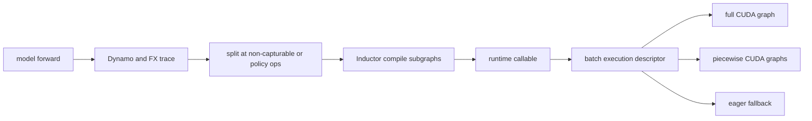

# vLLM 编译与 CUDA Graph：分别优化算子图与 launch 图

> **源码基线**：`vllm-project/vllm@d66300a1baa7779c68c7dfa4e51eee2502b48017`
> **中心命题**：`torch.compile` 与 CUDA Graph 解决两个不同问题：前者重写/融合算子并生成 kernel，后者记录一段已确定的 GPU launch 序列以降低 CPU dispatch。vLLM 用 compile partition、shape policy、full/piecewise graph 能力和 runtime descriptor 把二者组合，而不是把“已编译”误当成“可 replay”。

## 一、两类开销、两套正确性条件

| 机制 | 优化对象 | 主要收益 | 核心约束 |
|---|---|---|---|
| `torch.compile` / Inductor | FX/ATen/custom-op 计算图 | fusion、codegen、减少中间读写 | graph trace、shape guards、副作用可见 |
| CUDA Graph | CUDA launch 序列与内存地址 | 降低 Python/driver launch overhead | 稳定地址、固定拓扑、capture-safe 操作 |

decode 每步算子小且重复，launch overhead 占比高，CUDA Graph 往往重要；prefill shape 大且变化多，Inductor fusion 可能收益更大，但 full graph 的 shape/内存组合数也更昂贵。

## 二、`CompilationConfig` 是能力求交，不是级别数字

`CompilationMode` 区分无编译、stock compile、trace-once 和 vLLM compile；`CUDAGraphMode` 则区分 none、piecewise、full、decode/mixed 的组合；`vllm/config/compilation.py:37-103`。`CompilationConfig` 独立保存 backend、splitting ops、compile sizes、graph mode 和 capture sizes；`vllm/config/compilation.py:398-695`。

最终运行模式由以下能力求交：

- 模型 forward 能否 trace/compile；
- attention/backend/custom op 是否能在 graph 中安全执行；
- batch 是 decode、prefill 还是 mixed；
- token/request/LoRA/speculative shape 是否有对应 capture；
- parallel/sequence/DBO 等组合是否支持；
- 用户允许的 compile/capture budget。

配置解析会在能力冲突时降级 full → piecewise → none，而非硬跑错误模式；`vllm/config/compilation.py:1369-1517`。

## 三、为什么需要 piecewise compilation

完整模型图中 attention、KV update、collective 或某些 custom op 可能包含动态 metadata、副作用或尚不能被 Inductor 接管。若只允许 whole-graph，任一不兼容 op 会让整个模型退回 eager。

vLLM 用 `splitting_ops` 把 FX graph 切成可编译 subgraphs 和显式边界。backend 对 graph 执行 split，再为各 piece 创建 `PiecewiseBackend`；`vllm/compilation/backends.py:690-778,1179-1228`。

piecewise 的设计不变量是：

> 被切出的边界 op 必须完整表达跨 piece 的数据与副作用依赖；不能因为它不返回普通 tensor，就让编译器认为前后的读写可重排。

attention/KV update 是典型边界：KV 写入可能通过 cache tensor alias 产生副作用。如果图中没有可见依赖，Inductor 可能删除或移动写操作。因此 vLLM 的 splitting policy 与 IR functionalization/fusion 必须共同维护依赖。

`set_splitting_ops_for_v1()` 根据 attention fusion、KV update、sequence parallelism 和 graph mode调整边界；`vllm/config/compilation.py:1134-1268`。这不是配置清理，而是防止不兼容图组合。

## 四、shape policy 为什么同时影响启动与稳态

continuous batching 的 token 数不断变化。为每个实际 shape 编译/capture 会造成启动时间、cache 和 graph memory 爆炸；只保留一个最大 shape 又会产生大量 padding。

vLLM 把两类 shape 分开：

- `compile_sizes`：哪些 size/range 要专门编译；
- `cudagraph_capture_sizes`：哪些 size 有 replay graph；
- runtime 把实际 batch 映射到可服务它的 descriptor/capture case，超界或不兼容则 eager。

配置会去重、排序并解析 `compile_sizes="cudagraph_capture_sizes"`；`vllm/config/compilation.py:1110-1132`。MRV2 graph manager 还按 token count、decode query length、LoRA count 等预计算 capture descriptors；`vllm/v1/worker/gpu/cudagraph_utils.py:109-175,175-301`。

shape 选择本质是空间—时间折中：更多 cases 减少 padding 和 eager miss，却增加 warmup、capture 时间和常驻 graph memory。

## 五、full 与 piecewise CUDA Graph 的区别

### 5.1 Full graph

full graph 记录模型 step 的完整 GPU launch 序列，CPU 只需更新固定输入 buffer 后 replay。它最大化 launch 消除，但要求所有 op、collective、metadata update 和内存地址都 capture-safe。

### 5.2 Piecewise graph

piecewise graph 只 capture 可稳定重放的 compiled pieces，attention/动态边界仍由 eager Python 发起。它保留更多动态能力，收益较小但覆盖面更广。

`CUDAGraphWrapper` 为 runtime descriptor 建立 entry/cache，首次 capture、以后 replay，并在 replay 前校验输入地址；`vllm/compilation/cuda_graph.py:128-174,205-360`。地址校验是正确性条件：CUDA Graph 记录的是捕获时的指针，而不是“同 shape 的任意新 tensor”。

MRV2 的 full graph 则由显式 graph manager 管理 capture descriptor 与 replay；`vllm/v1/worker/gpu/cudagraph_utils.py:303-418`。两条路径反映了同一原则：graph lifecycle 必须独立于普通 `dummy_run`。

## 六、静态地址不等于静态值

graph replay 可处理动态 token、position、block table 和 sampling 参数，前提是：

1. tensor storage 地址不变；
2. runtime 在 replay 前把新值写入固定 buffer；
3. shape/stride 与 capture descriptor兼容；
4. 所有派生 metadata 要么也原地更新，要么不进入该 graph。

MRV2 stable row、staged write 和 persistent graph tensor 正是为这组不变量服务。若每步重新 `torch.empty()` 并把新 tensor 传入，shape 相同也不能安全 replay。

## 七、compile cache 必须把代码与环境纳入 key

编译产物依赖模型/config、vLLM 代码、compiler 和环境。backend 将 environment、config、code 与 compiler hash 组合为 cache key；`vllm/compilation/backends.py:1006-1109`。只按模型名缓存会在 driver、torch、kernel flags 或源码变化后复用不兼容产物。

cache 提升的是后续启动，不减少首次 trace/capture；而 CUDA Graph entry 通常还依赖进程内实际地址，不能简单跨进程序列化复用。

## 八、与 custom op、通信和 KV 的边界

编译器必须同时看到“可优化部分”和“不可跨越的语义”：

- custom op 用 fake implementation 提供 shape/dtype 推导；
- mutating op 需要 functionalization 或显式 alias/schema；
- collective 是多 rank 副作用，所有 rank 的 graph mode/shape 必须一致；
- attention backend 声明 full/piecewise graph 能力；
- KV update 的写后读关系必须保留；
- speculative fused draft graph 需要 metadata update hook。

因此 page 25 的 IR/pass 负责“图里语义正确”，本页负责“什么图被编译/捕获、何时派发”。

## 九、替代方案与失败边界

| 方案 | 优点 | 代价/风险 |
|---|---|---|
| 全 eager | 最易调试、动态性最大 | Python/launch overhead 与融合机会损失 |
| 只用 `torch.compile` | 不受固定地址约束 | decode launch 数仍高 |
| 只用 CUDA Graph | 启动 launch 最少 | 算子图未优化，shape/capture 数量高 |
| 强制 full graph | 稳态最快的潜力 | 任一动态/副作用/collective 不兼容即可错误或爆炸 |
| 为所有 shape capture | 几乎无 miss | 启动慢、graph memory 与 cache 膨胀 |
| 静默 fallback | 服务可用 | 性能回归难以察觉，基准不可解释 |

常见失败包括：recompile storm、capture OOM、输入地址变化、不同 rank graph 分支不一致、KV 写被优化掉、LoRA/spec shape 没有 case、eager fallback 比例过高。

## 十、验证顺序

1. 先用 eager 建立数值与功能基线；
2. 单独启用 compile，检查 graph break、recompile count、cache key 与结果；
3. 单独验证目标 graph mode 的 capture/replay 和地址稳定性；
4. 记录每种 batch descriptor 的 full/piecewise/eager 命中率；
5. 比较首启时间、二次 cache 启动、graph memory、TTFT/TPOT；
6. 覆盖 prefill/decode/mixed、LoRA、speculative、TP/DP 与边界 shape；
7. 任何仅 graph 模式出现的数值错，优先查副作用/metadata/地址，而非 kernel 精度。

最小源码阅读顺序：`vllm/config/compilation.py:37-103,398-695,1134-1517` → `vllm/compilation/decorators.py:331-527` → `vllm/compilation/backends.py:690-778,1006-1228` → `vllm/compilation/cuda_graph.py:128-360` → `vllm/v1/worker/gpu/cudagraph_utils.py:109-418`。

## Related Pages

- [[02_engineering/03_infer_frameworks/vllm/14_vllm_attention_backends_analysis|vLLM Attention Backend]] — full/piecewise 能力和动态 metadata 边界。
- [[02_engineering/03_infer_frameworks/vllm/15_vllm_model_runner_v2_analysis|vLLM Model Runner V2]] — persistent buffer、显式 capture 与 replay 生命周期。
- [[02_engineering/03_infer_frameworks/vllm/20_vllm_speculative_decoding_analysis|vLLM 投机解码]] — multi-step draft graph 与变长 verification shape。
- [[02_engineering/03_infer_frameworks/vllm/22_vllm_distributed_inference_analysis|vLLM 分布式推理]] — collective 的 graph 语义与跨 rank 一致性。
- [[02_engineering/03_infer_frameworks/vllm/24_vllm_fused_ops_and_kernels_analysis|vLLM 融合算子与 Kernel]] — compile 最终调用或生成的设备实现。
- [[02_engineering/03_infer_frameworks/vllm/25_vllm_ir_and_fusion_passes_analysis|vLLM IR 与融合 Pass]] — FX/IR 上的副作用修复和 pattern fusion。
