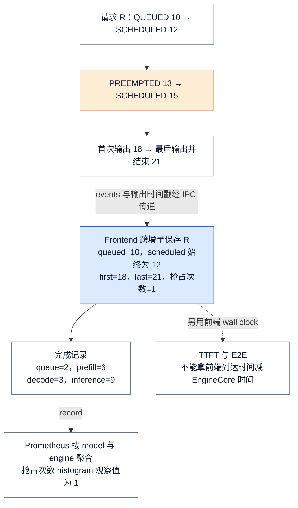
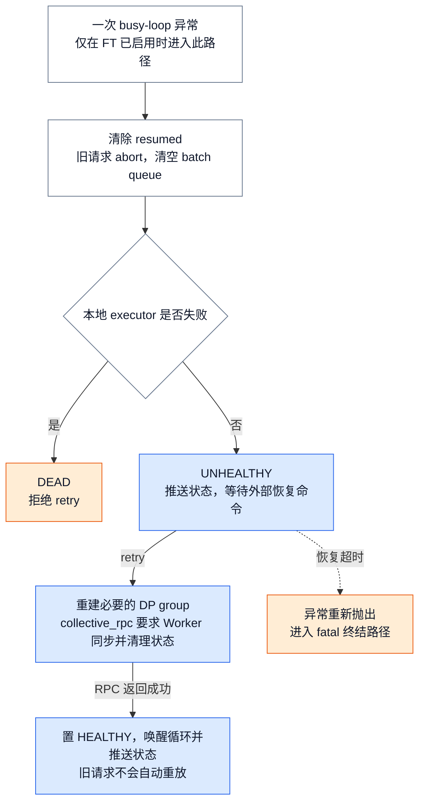

# vLLM 可观测性与可靠性：把 SLO 症状闭环到资源承诺与故障域

> **源码基线**：`vllm-project/vllm@199cb9b964822e59ab9b58d88e7be31eb419a2ae`（`main` 快照，2026-09-07 UTC）
> **主题**：解释调度事件如何变成请求指标，指标与 trace 如何关联，以及引擎和 Worker 故障如何传播、清理和恢复。最后说明时钟、采样、聚合与健康信号的边界。
> **适用范围**：本页拥有指标产生和故障处理机制；采证命令与排障过程见 [[05_vllm_debugging_troubleshooting_guide|调试与排障]]，评测与调优见 [[04_vllm_performance_tuning_guide|性能评测与调优]]，服务路由和拓扑见 [[13_vllm_serving_control_plane_analysis|Serving 控制面]]。
> **最近更新**：2026-09-08。核验新基线，补抢占计数、健康探针与受控恢复边界，分离操作入口。

## 1. 背景：SLO 是症状，资源承诺和故障域才是原因

一次请求的尾延迟既可能来自尚未获得 token/KV/encoder budget，也可能来自已进入设备执行后的 preemption、外部 KV 等待或执行退化；“请求仍未返回”还可能意味着 frontend output handler 或 EngineCore 已经死亡。官方 metrics 设计也把两类信息分开：request-level metrics 是 SRE 追踪的 SLO，而 server-level metrics 用来解释它们。

因此，观测闭环必须同时保留两种状态：**用户症状**回答“坏到什么程度”，**资源承诺与故障状态**回答“哪一个 owner 没能兑现什么”。当前 `SchedulerStats` 不是一个静态指标目录，而是一次调度后对 running、两类 waiting、KV usage、prefix/connector、eviction、spec decode、CUDA Graph 与 perf 的结构化快照。Scheduler 生成快照时直接读取当前队列长度和 KV usage，并排空本轮要上报的 KV eviction 等增量统计。

这条边界有一个关键不变量：**测量值不能反过来成为资源权威**。Prometheus gauge 只是在 frontend 看到的最近一份快照；waiting/running 和 KV block 的真实所有者仍是 Scheduler。否则监控延迟或 exporter 故障会被误当成调度状态变化。

## 2. 为什么是反馈回路，而不是“多打日志”

直觉替代方案是在 EngineCore 热循环里计算所有区间、逐请求打印明细并直接 export。官方设计明确选择相反方向：EngineCore 只发送 `EngineCoreOutputs` 能携带的快照与事件，把 bookkeeping 放到可与 GPU 执行重叠的 AsyncLLM outer loop，以缩短 forward 之间的控制间隔。live path 中，AsyncLLM 的 output handler 拉取输出、分块处理、更新 SchedulerStats，最后调用 logger manager；分块本身就是为了避免长时间阻塞 event loop。

> [!note] 分析推断：被否掉的替代
> 源码没有声称作者逐项比较过“全量 request label”“每 token 日志”或“只做 health probe”。但当前边界显示了决定标准：热路径成本、跨进程时钟正确性、聚合基数和故障可终结性。把高频细节全部塞进一个 sink，会同时破坏这四个标准。

这种分工把资源状态留在 Scheduler，把区间计算放到 frontend；日志、metrics 和 trace 是观测结果，不能替代真实队列与 KV 状态。下面用同一条请求说明信息怎样保留下来。

## 3. 实现思路与细节：五段反馈如何闭合

### 3.1 Commitment → measurement：在状态所有者处打时间戳，在 frontend 算区间

在 `log_stats` 启用的观测路径中，Scheduler 才为 QUEUED、每次实际 SCHEDULED 和 PREEMPTED 记录 typed event；三类 emit 都受这个开关保护。事件使用 EngineCore 进程的 monotonic timestamp，并明确禁止与其他进程的 monotonic timestamp 直接比较。开关启用后，新请求首次调度与 PREEMPTED 请求恢复调度都会走同一个分支并 emit SCHEDULED，共享本次 schedule 开始的时间戳；preemption 则在释放资源并把请求放回 waiting 时 emit。

Frontend 必须跨 delta 保存请求状态，而且它对收到的事件流做有意聚合：每个收到的 SCHEDULED event 都会把 LoRA request state 转成 running，但只有 `scheduled_ts` 仍为零时才保存时间戳，所以恢复调度事件不会重置区间基点。`RequestStateStats` 把 frontend wall-clock arrival 与 EngineCore monotonic 的 queued/scheduled/first/last-token 时间明确分栏。`IterationStats` 用 wall-clock arrival 计算 frontend 观察到的 TTFT/e2e，用同一 EngineCore 时间域内的事件计算 queue、prefill、decode 与 ITL，并在完成时一次性形成 finished-request observation。

为什么不让 frontend 根据“收到消息的时刻”倒推排队时间？它看不到请求真正进入 Scheduler 与首次获得资源的时刻，IPC 排队还会污染区间。事件把**源时间**带过进程边界，frontend 只做同域相减；这正是官方设计强调的约束。

#### 一个被抢占的请求，怎样形成一份延迟记录？

下面是按源码规则构造的教学事件序列，时间单位为秒，均属于同一个 EngineCore；并非实测。请求 R 在首次输出前被抢占一次。恢复后的 SCHEDULED 更新运行状态，但不覆盖已经保存的首次调度时间。

<!-- Figure spec: top-to-bottom R events in EngineCore, then cross-process transfer into frontend state and finished observation. No proportional time axis. Blue highlights first-scheduled retention; orange highlights preemption cost. Output queue=2, prefill=6, decode=3, inference=9, preemptions=1; wall-clock TTFT is explicitly outside this subtraction. -->

图中的 queue 是 12 减 10，prefill 是 18 减 12；恢复等待与重算包含在 prefill 的 6 秒里，而不会因为 15 秒重新调度就缩成 3 秒。若抢占发生在首 token 之后，成本进入 decode/inference 区间。事件随输出传递，图不表示每次事件都立即发一条 IPC 消息。

新基线的 `RequestStateStats.num_preemptions` 每消费一次 PREEMPTED 加一，完成时拷入 `FinishedRequestStats`，再观测到 `vllm:request_num_preemptions` histogram。它与按事件累计的 `vllm:num_preemptions_total` 用途不同：前者反映完成请求各自被抢占多少次，后者反映当前窗口发生了多少次抢占。尚未完成的慢请求不会立即进入完成请求 histogram。

### 3.2 Measurement → correlation：聚合信号解释规模，高基数信号解释个例

Prometheus logger 的基础 labels 是 `model_name` 与 `engine`，waiting reason 等额外维度来自有限枚举。它把 Scheduler 快照写成 gauges/counters，在输出处理时记录 TTFT、ITL，在请求完成时记录 queue/prefill/decode/e2e histograms。**分析推断**：这个边界使看板先回答“哪个 engine、哪种承诺一起恶化”，而不会为每个请求创建一条时序。

单请求关联交给 trace。请求完成时，OutputProcessor 从传回的 trace headers 恢复 parent context，把 external request ID、token 用量和相同的延迟分解写入 `llm_request` span。OTel provider 给进程附加 pid，worker 可从环境继承 exporter endpoint，request span 则从 headers 恢复 parent；export 使用 `BatchSpanProcessor`，因此进程身份和请求上下文有各自的关联载体，但对外可见不是同步提交。同基线测试因此轮询最多 15 秒等待 batched `llm_request` span，并核验 request ID 与 queue/TTFT/e2e attributes。

> [!note] 分析推断：cardinality 分工
> 代码没有注释说“request ID 因 cardinality 被排除出 Prometheus labels”，但边界是可验证的：核心请求与资源指标使用 `model_name`、`engine` 和有限 reason/source；LoRA 专用指标还有 adapter 维度及下文列出的聚合限制，request ID 位于 trace attribute。把 request ID 或 prompt 放进 metrics，会把 series 数量变成请求数；正确做法是 metrics 触发告警、trace 下钻个例，而不是把两者合并。

### 3.3 Correlation → fault classification：同一个症状必须能落到不同 owner

| SLO 症状 | 先验证的承诺/状态 | 关联证据 | 故障分类边界 |
|---|---|---|---|
| TTFT 尾部上升 | waiting reason、KV usage、QUEUED→首次 SCHEDULED、prefill 区间 | engine/model 聚合后，用 request span 验证个例 | queue 上升指向 admission/capacity；queue 稳定而 prefill 上升才转向执行或数据装载；waiting reason 的 `capacity` 与 `deferred` 由 logger 明确分开 |
| TPOT/ITL 上升 | PREEMPTED 事件、decode/ITL、spec/connector/perf stats | 同一 engine 时间窗对齐请求 histogram 与 Scheduler 快照 | preemption/资源压力与设备执行退化是不同 owner；事件消费与区间更新发生在同一 request state |
| 输出错误但进程存活 | per-request NaN 检测与 corrupted completion count | 关联 model revision、backend/runner trace 或变更窗口 | 数据损坏不是 liveness 故障；检测只在显式开关启用时计算 |
| 请求挂起或批量失败 | output handler task、engine-dead flag、FT status | trace 最后 span 与 status/error 到达时间 | frontend handler、EngineCore process、worker/executor 是不同故障域，不能用一个 HTTP 进程存活信号代替 |

这里的原则是先从 SLO 进入，再沿同一时间窗回溯承诺。单看高 KV usage 不能推出容量故障；单看 HTTP 进程存活也不能推出 EngineCore 健康。

### 3.4 Fault classification → mitigation/visibility：异常必须变成终态或受控恢复

故障容忍开启时，`EngineCoreSentinel` 把 busy-loop 异常变成状态机：先停止继续执行，abort Scheduler 中的请求并清空 batch queue；executor 已失败则标记 DEAD，否则标记 UNHEALTHY，然后把状态推给 client。只有 UNHEALTHY 接受 recovery command；retry 会重建必要的 DP group、向 workers 广播清理命令，再置回 HEALTHY。Worker 侧清掉 execute state、persistent request rows 或旧 input batch/KV connector state，避免恢复后复用故障前的隐藏状态。

这是比“捕获异常后继续 loop”更强的恢复合同。**分析推断**：若不先清理，Scheduler、device rows 与 collective epoch 可能继续携带故障前的不同状态；先 abort/clear，再从干净状态恢复，等于把旧承诺明确作废。E2E tests 验证了两种分类：通信故障两侧都可进入 UNHEALTHY 并 retry 回 HEALTHY；worker 被杀时幸存 rank 是 UNHEALTHY、worker 所属 engine 是 DEAD，DEAD 必须拒绝 retry。

未被可恢复 wrapper 吸收的 fatal error 走另一条终结路径：EngineCore 把 `ENGINE_CORE_DEAD` byte sentinel 放入 output queue，并最多等待五秒让 output thread 发出。client 收到 sentinel 后设置共享 `engine_dead` 并抛 `EngineDeadError`；独立的 process-liveness monitor 是第二条检测通道。**分析推断**：双通道避免把可靠性建立在“濒死进程仍能成功发出最后一条消息”这一假设上。

最后，错误必须抵达所有等待者。AsyncLLM output handler 失败时会向未完成请求传播异常；其 `errored` 同时包含 engine-dead 与 handler-task 已结束。`/health` 只把 `EngineDeadError` 映射为 503；这是一条**可见性合同**，至于流量如何迁走仍属于 Serving 控制面。

但 `/health` 不会提交一个新推理请求。`AsyncLLM.check_health()` 只检查 `errored`，并未逐个查询 FT sentinel 的 UNHEALTHY 状态；render-only 前端没有 engine 时直接返回 200。因此 FT 状态、HTTP 健康和真实请求完成是三种不同证据，不能互相替代。操作上的组合验证见 [[05_vllm_debugging_troubleshooting_guide|调试与排障]]。

<!-- Figure spec: one busy-loop exception aborts old requests, then splits on local executor failure into DEAD or UNHEALTHY. Only UNHEALTHY receives external retry; worker cleanup and RPC completion precede HEALTHY publication. Timeout exits to fatal path. These are logical states, not a duration chart. -->

这条恢复通道默认关闭：`ParallelConfig.enable_fault_tolerance=False`。配置拒绝多 API 进程；`WorkerSentinel.__init__` 还要求 `deepep_low_latency` 或 `nixl_ep` all-to-all backend，否则抛 `ValueError`。所以它不是任意模型、任意部署都可开启的通用重试。Worker 的设备同步、通信库清理与 group 重建涉及外部运行库；这里只核验 vLLM 的调用与本仓测试，不能据此保证所有设备故障都可恢复。

`retry()` 先重建 group，再执行 collective RPC；中途失败不会回滚已发生的局部清理或重建。异常由 `handle_command` 转成失败结果，不能把 HTTP 层收到操作请求当成恢复成功。旧请求已被 abort，恢复后重放由调用方决定，vLLM 此路径不提供请求级自动重放或 exactly-once 保证。

数值损坏提供“计数”与“终止”两种策略：开 `VLLM_COMPUTE_NANS_IN_LOGITS` 时完成请求进入 corrupted counter；开更强的 `VLLM_RAISE_ON_LOGIT_NANS` 会同时启用计数，并把非零 per-request NaN map 转成异常。已核验的 MRV1 同步路径为此执行 opt-in D2H，异步路径在 `AsyncGPUModelRunnerOutput.get_output()` 物化计数时检查；这两处都属于诊断成本，不能外推为所有 Runner 和后端的相同实现。

## 4. 约束、成本与失败边界

### 4.1 Cardinality：维度越细，聚合面越可能先失效

Prometheus 的安全边界不是“label 越多越好”，而是只保留可枚举、可聚合且能指向 owner 的维度。当前基础 labels 固定为 model/engine，request ID 进入 trace。**分析推断**：adapter/request/prompt 级细节会让 series 随工作负载身份增长，不应继续扩散到常驻时序面。

### 4.2 Sampling：降低热路径成本，也放弃逐对象完备性

KV residency metrics 默认关闭；启用后默认只采 1% blocks，并限制每个 sampled block 的 access history 最多四项。采样 block 被 eviction 时才产生 lifetime/idle/reuse-gap event，未采样 block 没有记录。

> [!note] 分析推断：如何读采样结果
> 这些 histogram 适合判断 residency 分布和趋势，不是精确 block 总数。稀有 tail 可能漏样，短窗口也可能有较大方差；要提高置信度只能延长窗口或临时提高 sample rate，同时接受更多状态与事件成本。trace 的详细模块开关则是另一种成本门：配置明确警告 per-request detailed timing 可能昂贵，并要求先有 OTLP endpoint。

### 4.3 Stale signal：最后一份值不等于当前真相

Prometheus gauges 只在 logger 收到 `SchedulerStats` 时被 `set`；trace 又经 batch exporter 延迟可见。因此“数值存在”不能证明 observation pipeline 仍在前进。**分析推断**：生产告警必须为 scrape/iteration/span 设置 freshness 条件，并把 output-handler/engine health 作为旁路；否则故障前最后一份“healthy”快照会成为 stale signal。

当前实现也承认不完整聚合比没有聚合更危险：`api_server_count > 1` 时默认 text stats logging 被禁用，以避免 incomplete stats。这不是说 Prometheus 永不陈旧，而是提醒每个 sink 都必须声明自己覆盖哪些进程和更新时间。

进程聚合错误还有更具体的失败边界：多 engine 时 `vllm:lora_requests_info` 被源码直接警告为可能错误或误导。此时继续展示一条“最近值”会掩盖覆盖缺口，而不是增加可观测性。

### 4.4 Process boundary：源时间、传输时间和观察时间不能混算

EngineCore monotonic event 只能与同一进程的 event 相减；frontend arrival/e2e 使用 frontend wall clock。`EngineCoreEvent` 的类型注释和 `RequestStateStats` 的字段分区都把这个不变量写进了源码。IPC/OTLP 延迟影响“什么时候看见”，不应污染“事件何时发生”。

这个分离有成本：events 和 stats 要随 `EngineCoreOutputs` 过边界；该结构同时携带 outputs、SchedulerStats 与 EngineCore monotonic timestamp。logger 仍在 AsyncLLM output handler 内同步 record，源码留有“Prometheus overhead 变得显著后移到后台线程”的 TODO。fatal sentinel 本身也可能发不出去，因而才需要五秒 join guard 与独立 liveness monitor 两条检测通道。

## 5. 机制怎样被验证，怎样接到操作入口

- 时间区间：按上图 R 事件序列逐次执行 `IterationStats.update_from_events` 和完成统计，应保留首次 SCHEDULED；对照源代码中的 queue/prefill/decode 注释检查抢占成本归属。
- Trace：`tests/v1/tracing/test_tracing.py::test_traces` 等待 batched span 出现，再核验 request ID、token 用量及 queue/TTFT/E2E 属性；它不是“请求返回时 exporter 已同步提交”的保证。
- 恢复：`tests/v1/fault_tolerance/test_fault_tolerance_e2e.py::test_injected_fault_retry_recovers_all_ranks` 注入异常后要求两 rank 都变成 UNHEALTHY，再分别发 retry，最后以 HEALTHY 和新请求成功共同验证。
- 终结：同文件的 `test_worker_kill_survivor_unhealthy_and_dead_rejects_retry` 验证幸存方 UNHEALTHY、死亡 Worker 所属 engine 为 DEAD，以及 HTTP 202 后 engine 仍可拒绝 retry。

以上是已阅读的测试合同和静态推演，本轮没有运行 GPU、OTLP 服务或多卡故障注入。实际采证、日志与 profiler 命令，以及“处置后必须看见新结果”的操作案例统一放在 [[05_vllm_debugging_troubleshooting_guide|调试与排障]]；SLO、goodput 与回滚评估统一放在 [[04_vllm_performance_tuning_guide|性能评测与调优]]。

## 6. 源码—文档冲突与有锚点的演进

> [!contradiction] 同基线 design doc 与 live code 的区间语义冲突
> `docs/design/metrics.md` 把 queue/prefill/decode/inference 都描述为相对“最近一次 SCHEDULED”。但 live code 在第一次 SCHEDULED 后不再覆盖 `scheduled_ts`，完成统计也明确按“first QUEUED → first SCHEDULED”计算 queue。本页以 live code 为准：preemption 被包含在后续 prefill/decode/inference 区间，而不是重置基点。

指标名也不是永久 ABI。`show_hidden_metrics_for_version` 只是迁移旧 dashboard 的临时 escape hatch，注释明确说 hidden metric 很可能在后续 release 完全移除。**分析推断**：可靠性闭环还必须版本化 recording rule 与 dashboard；否则升级本身会制造“信号消失”，并被误判为服务恢复或流量归零。

## 7. 源码阅读路线

以下路径相对固定基线的 vLLM 仓库；同一行的符号按数据生成、消费、对外可见顺序阅读。

| 核验问题 | 已打开的源码入口 |
|---|---|
| 谁产生状态和事件？ | `vllm/v1/core/sched/scheduler.py::Scheduler.add_request / schedule / _preempt_request / make_stats`；`vllm/v1/engine/__init__.py::EngineCoreEvent / EngineCoreOutputs` |
| 抢占怎样进入区间和计数？ | `vllm/v1/metrics/stats.py::RequestStateStats / IterationStats.update_from_output / update_from_events / update_from_finished_request` |
| 怎样交给 exporter？ | `vllm/v1/engine/async_llm.py::AsyncLLM._run_output_handler` → `vllm/v1/engine/output_processor.py::OutputProcessor.process_outputs` → `vllm/v1/metrics/loggers.py::StatLoggerManager.record / PrometheusStatLogger.record` |
| Trace 怎样关联与导出？ | `vllm/v1/engine/output_processor.py::OutputProcessor.do_tracing` → `vllm/tracing/otel.py::extract_trace_context / init_otel_tracer / init_otel_worker_tracer`；`tests/v1/tracing/test_tracing.py::test_traces` |
| 哪些配置改变观测成本？ | `vllm/config/observability.py::ObservabilityConfig`；`vllm/v1/core/kv_cache_metrics.py::BlockMetricsState / KVCacheMetricsCollector`；`vllm/v1/metrics/loggers.py::PrometheusStatLogger.__init__ / StatLoggerManager.__init__` |
| 可恢复路径何时生效？ | `vllm/config/parallel.py::ParallelConfig`；`vllm/v1/fault_tolerance/engine_core_sentinel.py::fault_tolerant_wrapper / EngineCoreSentinel.on_fault / handle_command / retry` → `vllm/v1/worker/sentinel/gpu_worker_sentinel.py::WorkerSentinel.retry / _clean_worker_state` |
| Fatal 怎样终结等待？ | `vllm/v1/engine/core.py::EngineCoreProc.run_engine_core / _send_engine_dead` → `vllm/v1/engine/core_client.py::BackgroundResources.validate_alive / MPClient.start_engine_core_monitor` → `vllm/v1/engine/async_llm.py::AsyncLLM._run_output_handler / errored / check_health` → `vllm/entrypoints/serve/instrumentator/health.py::health` |
| NaN 计数与异常在哪发生？ | `vllm/envs.py::VLLM_COMPUTE_NANS_IN_LOGITS / VLLM_RAISE_ON_LOGIT_NANS`；`vllm/v1/worker/gpu_model_runner.py::GPUModelRunner._get_nans_in_logits / AsyncGPUModelRunnerOutput.get_output` |

## Related Pages

- [[05_vllm_debugging_troubleshooting_guide|调试与排障]] — 把本页的指标、trace 和健康边界用于一次实际采证与恢复验证。
- [[04_vllm_performance_tuning_guide|性能评测与调优]] — 解释如何用这些观测检验 SLO、性能假设与回滚。
- [[07_vllm_scheduler_analysis|Scheduler]] — 解释 waiting、token budget 和 preemption 所对应的真实调度状态。
- [[08_vllm_kv_cache_management_analysis|KV Cache 管理]] — 解释 KV usage、eviction 和 residency 对应的 block 生命周期。
- [[13_vllm_serving_control_plane_analysis|Serving 控制面]] — 接续健康和故障可见性之后的进程管理与流量路由。
- [[18_vllm_distributed_inference_analysis|分布式推理]] — 解释 rank 与 collective 故障域为何产生不同 sentinel 状态。
- [[22_vllm_disaggregated_kv_serving_analysis|分离式 KV Serving]] — 解释外部 KV 等待、connector failure 和 lease cleanup 的来源。
