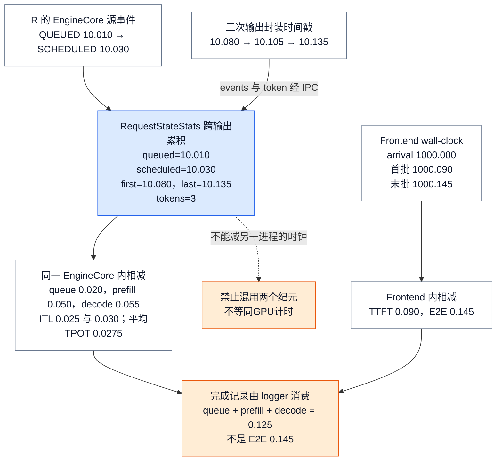
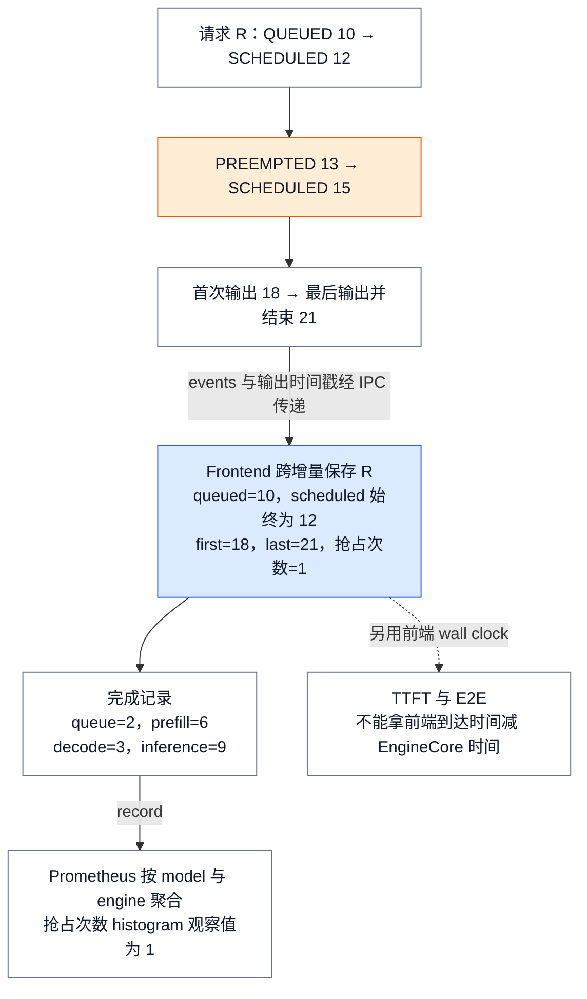
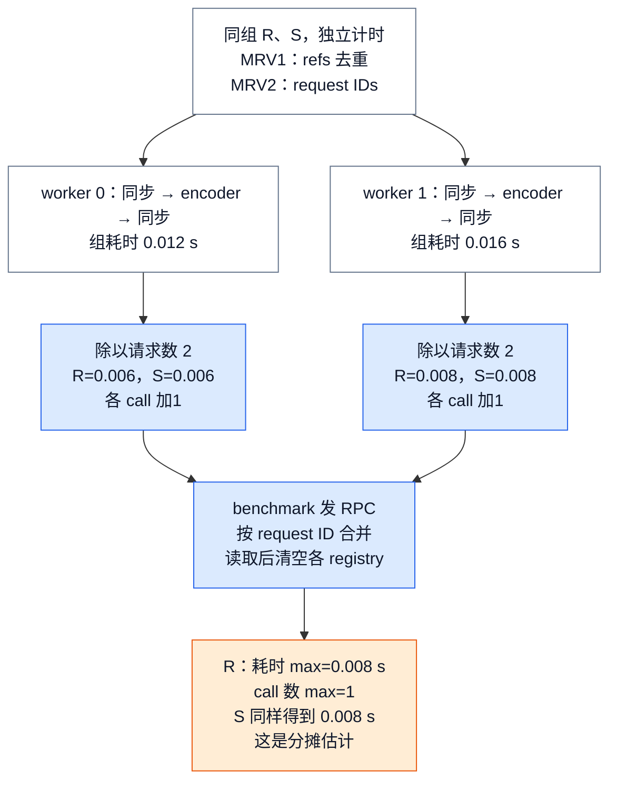
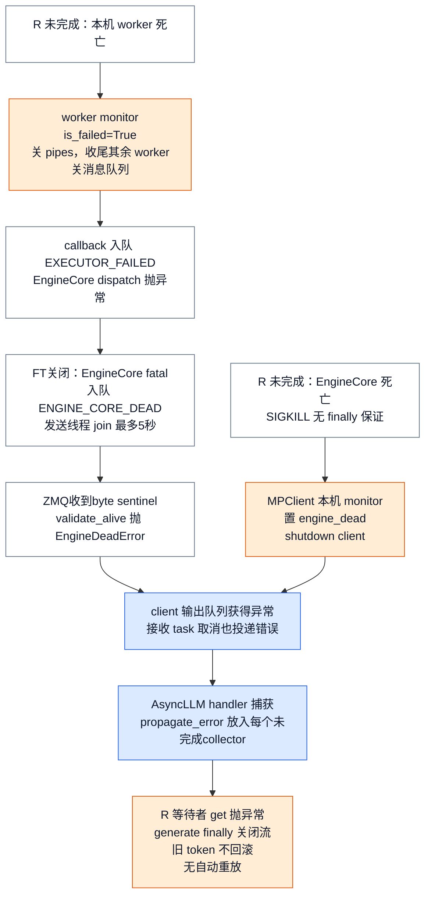
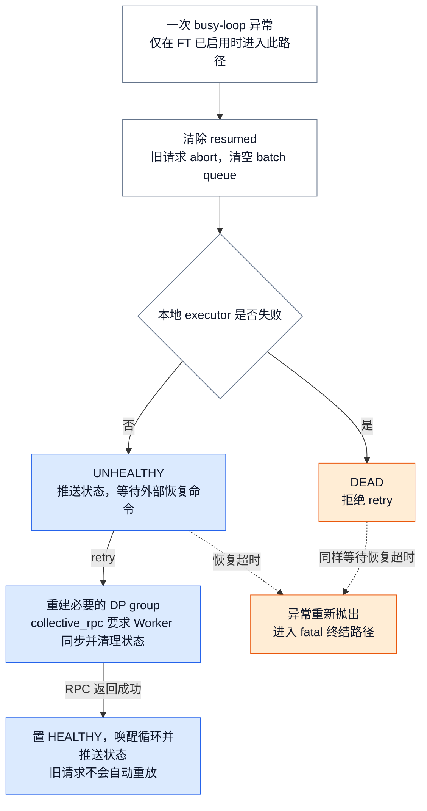

# vLLM 可观测性与可靠性：把 SLO 症状闭环到资源承诺与故障域

> **源码基线**：`vllm-project/vllm@199cb9b964822e59ab9b58d88e7be31eb419a2ae`（`main`，2026-09-06）
> **主题**：解释调度事件如何变成请求指标，指标与 trace 如何关联，以及引擎和 Worker 故障如何传播、清理和恢复。最后说明时钟、采样、聚合与健康信号的边界。
> **适用范围**：本页拥有指标产生和故障处理机制；采证命令与排障过程见 [[05_vllm_debugging_troubleshooting_guide|调试与排障]]，评测与调优见 [[04_vllm_performance_tuning_guide|性能评测与调优]]，服务路由和拓扑见 [[13_vllm_serving_control_plane_analysis|Serving 控制面]]。
> **最近更新**：2026-09-14。补全普通请求的统计计算、消费端选择、多模态与传输观测，以及故障终结和受控恢复。

## 1. 背景：SLO 是症状，资源承诺和故障域才是原因

一次请求的尾延迟可能来自进入 GPU 之前的排队，也可能来自执行期间的抢占、外部 KV 等待或计算退化。如果请求始终没有返回，还要区分它正在等待资源，还是负责执行的 worker、EngineCore 或前端输出任务已经退出。单独记录总耗时只能发现症状，无法区分这些过程；因此 vLLM 同时记录请求经历的事件、调度器当前的资源状态，以及各执行进程的故障状态。

请求事件由实际改变状态的 Scheduler 产生，前端根据这些事件计算 queue、prefill 和 decode 区间，再用自己的到达与接收时刻计算 TTFT、E2E。Scheduler 还产生 `SchedulerStats`，包含 running、两类 waiting、KV usage，以及 prefix/connector、eviction、spec decode、CUDA Graph 和 perf 统计。这样，同一时间窗中既能看到请求慢了多少，也能检查当时有多少请求等待、多少 KV block 被占用。官方 metrics 设计所区分的 request-level SLO 与 server-level metrics，正对应这两种观察尺度。

这些统计不会转移资源的控制权。Prometheus gauge 保存的是前端最近收到的 Scheduler 快照，真实 waiting/running 队列和 KV block 仍由 Scheduler 管理；exporter 延迟会让快照变旧，却不会改变请求实际获得的资源。判断请求是否还能完成，也必须继续检查输出任务和 EngineCore 的存活状态，不能从一份仍可读取的旧快照推出引擎健康。

## 2. 为什么在 EngineCore 记录事件，在前端计算指标

如果把所有区间计算、逐请求日志和 exporter 更新都放入 EngineCore，每次 forward 之间就要等待这些 CPU 工作完成。官方设计因此把两类工作分开：EngineCore 在调度状态改变时记录源时间，把事件和统计快照附到 `EngineCoreOutputs`；AsyncLLM 的输出任务在 GPU 可以继续执行下一步时消费它们。这里传出的不只是“请求排队了”这样的状态名，还包括该动作真正发生的时间，前端不必用 IPC 消息到达时间猜测调度过程。

前端仍有自己的串行成本。输出任务先取回一个 EngineCore 输出批次，再按 `VLLM_V1_OUTPUT_PROC_CHUNK_SIZE` 分块处理，块之间让出 event loop，最后同步调用 logger manager。分块让其他请求协程有机会运行，但不会减少这批输出的总统计工作；如果某个 logger 更新很慢，它仍然会拖延后续输出处理。把 bookkeeping 移出 EngineCore 缩短的是设备步骤之间的控制间隔，不意味着指标采集没有成本。

由此可以推导出日志、metrics 和 trace 的分工：有限维度的 metrics 适合长期聚合，request ID 等细节适合放进单请求 trace，而健康检查负责揭示执行链是否已经终止。这是从热路径成本、聚合基数和故障传播方式得到的设计解释；源码没有记录作者逐项比较过“全量 request label”“每 token 日志”或“只做 health probe”。几种观察相互补充，才能把一个慢请求接回它经历的实际执行过程。

| 直接收益 | 必付成本或约束 |
|---|---|
| 源事件区分排队与执行区间 | 传输 events、前端逐输出累积；同域相减，不能跨进程混钟 |
| 聚合指标定位 engine，trace 关联单个请求 | histogram/label 更新及批量导出；scrape/span 可延迟或缺失 |
| 错误到达所有等待者，避免无限等待 | fatal 会终结未完成请求；已发出的流式输出无法回滚 |
| 特定 DP+EP 场景可以清理后恢复 | 默认关闭；需匹配 all-to-all backend、外部协调命令，旧请求不自动重放 |

## 3. 从一条普通请求计算延迟

### 3.1 最小算例：三个输出 token，两个时钟域

设普通文本请求 R：`n=1`、4 个 prompt token、依次生成 3 个 token；无缓存命中、抢占、投机解码或 stop string 提前终止，启用 `log_stats`。下列时间为按源码构造的教学输入，单位秒，不是性能测量。前端 wall-clock 用示意纪元 1000，EngineCore monotonic 用独立纪元 10；两列只用于各自同域相减。

| 动作与实际观测点 | Frontend wall-clock | EngineCore monotonic | 状态或本次增量 |
|---|---:|---:|---|
| InputProcessor 记录 arrival，建立 RequestState | 1000.000 | — | `arrival_time=1000.000`；跨 delta 统计归 OutputProcessor 所有 |
| Scheduler 接受 R 并 emit QUEUED | — | 10.010 | 进入 waiting；事件存于 Request，尚不等于发往前端 |
| 首次获调度并 emit SCHEDULED | — | 10.030 | 保存首次调度基点 |
| 首 token 的 EngineCoreOutputs 建立；前端随后创建 IterationStats | 1000.090 | 10.080 | `first_token_ts=last_token_ts=10.080`；TTFT observation 为 0.090 |
| 第二 token 同样经过输出封装、前端消费 | 1000.115 | 10.105 | ITL observation 为 0.025；`last_token_ts=10.105` |
| 第三 token 带 finish_reason；前端消费并终结 R | 1000.145 | 10.135 | ITL 为 0.030；累计 generation=3，并形成 FinishedRequestStats |

**先保留跨输出的请求状态。** R 建立时，前端 `RequestStateStats` 保存 arrival=1000.000，queued、scheduled、first-token 和 last-token 初始为零。EngineCore 中的 Request 则另存一个事件列表：入队时追加 QUEUED=10.010，首次调度时追加 SCHEDULED=10.030；Scheduler 生成请求输出时用 `Request.take_events` 取走列表，并把原列表换成空列表。事件因此可以随首输出一起到达，又不会在后续输出中被重复计算。

**首输出建立时间基点。** 前端在 1000.090 收到首批输出，创建本批的 `IterationStats`。`update_from_output` 看到 R 的 `is_prefilling=True`，先把 4 个 prompt token 的 PrefillStats 计入本次 prompt 统计，再把 1000.090 减 arrival 得到 TTFT=0.090；随后消费 QUEUED、SCHEDULED 事件，将两个源时间写入 R 的持久状态。最后用输出封装的时间 10.080 同时设置 first-token 和 last-token，并将生成 token 数从 0 加到 1。OutputProcessor 完成这次统计更新后才把 `is_prefilling` 改成 False，后续 delta 不会再次登记 prompt token 或 TTFT。

**后续输出只推进末端。** 第二批在前端 1000.115 到达时，会创建新的 IterationStats，但继续使用同一个 R 状态。因为此时已不是 prefill，统计代码用本批 EngineCore 时间 10.105 减旧 last-token=10.080，形成 ITL=0.025，然后才把 last-token 更新为 10.105，并将生成数加到 2。第三批同样先得到 ITL=10.135−10.105=0.030，再把末端推进到 10.135、生成数加到 3。first-token=10.080 始终保留，所以不需要保存所有输出时间，也能在结束时计算完整 decode 区间。

**完成时才结算整条请求。** 第三批携带 finish_reason，OutputProcessor 生成最后的 RequestOutput、移除请求登记，再用仍持有的 req_state 调用 `update_from_finished_request`。该调用从保存的基点计算 queue、prefill、decode、inference 与平均 TPOT，并以当前 iteration 的前端时间计算 E2E，将结果追加到本批 `finished_requests`。因此 TTFT 和 ITL 可以随输出立即进入 logger，完整请求区间则只在结束后登记一次；一个始终未完成的慢请求不会提前进入完成请求 histogram。计算结果汇总如下：

| 统计量 | 本例计算 | 何时交给 logger；含义 |
|---|---|---|
| TTFT | 1000.090 减 1000.000 = **0.090 s** | 首输出被前端处理的 iteration；包含 arrival 后前端/IPC/排队/执行等等待 |
| Queue | 10.030 减 10.010 = **0.020 s** | 结束时；首次 QUEUED 到首次 SCHEDULED |
| Prefill | 10.080 减 10.030 = **0.050 s** | 结束时；首次调度到首输出封装，不是纯 GPU prefill kernel 时间 |
| 两次 ITL | 10.105 减 10.080 = **0.025 s**；10.135 减 10.105 = **0.030 s** | 每个后续 EngineCoreOutput 各产生一个 observation |
| Decode | 10.135 减 10.080 = **0.055 s** | 结束时；首输出到最后输出 |
| Inference | 10.135 减 10.030 = **0.105 s** | 结束时；Prefill + Decode |
| 每请求平均 TPOT | 0.055 除以 2 = **0.0275 s/token** | 结束时；分母为 generation token 数减 1，只有一个 token 时返回 0 |
| E2E | 1000.145 减 1000.000 = **0.145 s** | 结束 iteration；尚未包含此后的 HTTP flush、网络与客户端读取 |

`EngineCoreOutputs.__post_init__` 为整个输出封装取一个 monotonic timestamp；这不是每个 token 单独的设备完成时间。前端也是每个收到的输出批次创建一个 `IterationStats`，其 wall-clock 在分块处理前固定。因此本页 TTFT/E2E 是前端实现所见的请求延迟，不等同于压测客户端测得的 TTFT/E2E；客户端边界见 [[04_vllm_performance_tuning_guide|性能评测与调优]]。

<!-- Figure spec: non-proportional event-to-record transformation for request R. EngineCore event box and frontend arrival box feed separate calculations; three outputs carry timestamps 10.080/10.105/10.135. Output record lists same-domain intervals and demonstrates queue+prefill+decode is not frontend E2E. Blue means accumulation, orange means forbidden cross-clock subtraction. -->


只有同一请求、同一个 EngineCore 时间域中的区间满足 Prefill + Decode = Inference。Queue + Inference 是 0.125 s，不能硬凑成 E2E 的 0.145 s，更不能把 TTFT、Prefill、Inference 再相加，后者有重叠。即便对每个请求成立，也不能把几个 histogram 的 p99 相加当成 E2E p99，因为各自分位点未必来自同一请求。

这条算例还限定了 **ITL 与平均 TPOT 的相等条件**：本例每个后续输出恰好带一个 token，所以 ITL 均值等于 0.0275。投机验证若一次输出携带多个 token，live code 仍只记录一个输出间隔 ITL，却按 `len(new_token_ids)` 增加生成 token 数；每请求 TPOT 的分母因此不同。前端 `stream_interval` 与 detokenization 又可合并可见文本，不会把内部输出时间戳变成用户收到每段文本的时间。

### 3.2 抢占怎样改变同一个状态累加器

在 `log_stats` 启用的观测路径中，Scheduler 才为 QUEUED、每次实际 SCHEDULED 和 PREEMPTED 记录 typed event；三类 emit 都受这个开关保护。事件使用 EngineCore 进程的 monotonic timestamp，并明确禁止与其他进程的 monotonic timestamp 直接比较。开关启用后，新请求首次调度与 PREEMPTED 请求恢复调度都会走同一个分支并 emit SCHEDULED，共享本次 schedule 开始的时间戳；preemption 则在释放资源并把请求放回 waiting 时 emit。

Frontend 必须跨 delta 保存请求状态，而且它对收到的事件流做有意聚合：每个收到的 SCHEDULED event 都会把 LoRA request state 转成 running，但只有 `scheduled_ts` 仍为零时才保存时间戳，所以恢复调度事件不会重置区间基点。`RequestStateStats` 把 frontend wall-clock arrival 与 EngineCore monotonic 的 queued/scheduled/first/last-token 时间明确分栏。`IterationStats` 用 wall-clock arrival 计算 frontend 观察到的 TTFT/e2e，用同一 EngineCore 时间域内的事件计算 queue、prefill、decode 与 ITL，并在完成时一次性形成 finished-request observation。

为什么不让 frontend 根据“收到消息的时刻”倒推排队时间？它看不到请求真正进入 Scheduler 与首次获得资源的时刻，IPC 排队还会污染区间。事件把**源时间**带过进程边界，frontend 只做同域相减；这正是官方设计强调的约束。

#### 一个被抢占的请求，怎样形成一份延迟记录？

下面是按源码规则构造的教学事件序列，时间单位为秒，均属于同一个 EngineCore；并非实测。请求 R 在首次输出前被抢占一次。恢复后的 SCHEDULED 更新运行状态，但不覆盖已经保存的首次调度时间。

<!-- Figure spec: top-to-bottom R events in EngineCore, then cross-process transfer into frontend state and finished observation. No proportional time axis. Blue highlights first-scheduled retention; orange highlights preemption cost. Output queue=2, prefill=6, decode=3, inference=9, preemptions=1; wall-clock TTFT is explicitly outside this subtraction. -->


图中的 queue 是 12 减 10，prefill 是 18 减 12；恢复等待与重算包含在 prefill 的 6 秒里，而不会因为 15 秒重新调度就缩成 3 秒。若抢占发生在首 token 之后，成本进入 decode/inference 区间。事件随输出传递，图不表示每次事件都立即发一条 IPC 消息。

新基线的 `RequestStateStats.num_preemptions` 每消费一次 PREEMPTED 加一，完成时拷入 `FinishedRequestStats`，再观测到 `vllm:request_num_preemptions` histogram。它与按事件累计的 `vllm:num_preemptions_total` 用途不同：前者反映完成请求各自被抢占多少次，后者表示累计收到的抢占事件数，窗口内的抢占数量需从该 Counter 另行计算增量。尚未完成的慢请求不会立即进入完成请求 histogram。

## 4. 事件经过哪些所有者，在哪里变成可见指标

### 4.1 所有权与真实调用路径

**从调度器取出统计。** `Scheduler.update_from_output` 消费执行结果后，一面把 Request 的事件附到各自的 `EngineCoreOutput`，一面调用 `make_stats`。后者直接读取队列长度和 KV usage，同时取走 prefix-cache、connector 和 KV eviction 的本轮增量；快照描述“现在有多少”，增量描述“自上次取走后发生了多少”，二者不能用同一种加法处理。事件和快照随同一输出批次跨进程传输，能把请求的时间变化与当时资源状态对应起来。

**跨进程后按身份归并。** EngineCore 主循环把输出放入 output_queue，由独立 socket 线程序列化并发送；AsyncMPClient 的接收任务先检查 fatal sentinel，再反序列化，将普通输出放入前端 outputs_queue。AsyncLLM 等待这个队列，逐个请求更新 OutputProcessor 状态，再把统计交给 manager。`request_id` 决定 delta 归入哪个 RequestState，`engine_index` 决定统计归入哪个 engine label，external request ID 则留给用户输出和 trace。排入发送队列、完成 IPC 发送、前端完成消费是三个不同的时刻，只有最后一步才会更新可供查询的 collector。

**一次更新有两类消费者。** OutputProcessor 处理 token 时也做 detokenization，并把 RequestOutput 放进请求自己的 collector，唤醒等待生成结果的协程；logger manager 则消费同批的 IterationStats 和 SchedulerStats。请求结果与观测来自同一次处理，却有不同的最终出口：用户要等响应读取，Prometheus 要等 scrape，trace 要等批量导出。各对象持有的状态和出口如下：

| 对象与执行位置 | 权威状态及输入 → 输出 | 完成边界与付出的成本 |
|---|---|---|
| EngineCore 中的 Scheduler / Request | running、waiting、KV 使用率；调度动作 → typed events / SchedulerStats | 事件和增量由源 owner 生成；关闭 stats 时不生成这些观测 |
| EngineCoreOutputs 与 output socket 线程 | `outputs`、`timestamp`、`engine_index`、可选 `scheduler_stats`；结构体 → Msgpack / ZMQ | queue.put 是提交，socket 发送才跨 IPC；两者都不代表前端已消费 |
| AsyncMPClient 后台接收 task | 帧校验、反序列化；普通输出入 outputs_queue，utility/FT 状态另行分发 | `get_output_async` 等待队列并 materialize 输出或异常 |
| Frontend OutputProcessor / RequestStateStats | 每个 internal request 的到达、首/末 token、首次 schedule、计数 | 输出先更新状态再 detokenize；完成时移除 request state、形成 finished observation |
| StatLoggerManager 与各 sink | 同一份 SchedulerStats / IterationStats → record；text 按窗口 log，Prometheus 更新 collector | `record` 在 output handler 内同步；collector 更新不代表已被 scrape |
| OTel provider / 外部 collector | 完成请求 → llm_request span；请求 parent 来自 trace headers | BatchSpanProcessor 异步 export；远端收到才是导出可见，外部存储内部不在本仓证据内 |

核心资源只在第一行有调度权。其他行是带身份的传输、累积或观测副本；例如 `engine_index` 把多个 EngineCore 输出交回正确的 logger label，`request_id` 把 delta 交回正确的 RequestState，external request ID 则用于 span 和用户关联。

下面是非 batch-queue 的普通请求主路径。缩进表示直接调用；`[异步边界]` 表示不是嵌套调用，不能把 IPC 两端写成一条同步栈。batch-queue 的完成队列由 [[06_vllm_engine_architecture_analysis|Engine 架构]] 拥有，设备执行细节见 [[11_vllm_model_runner_v1_analysis|ModelRunner V1]] 和 [[12_vllm_model_runner_v2_analysis|ModelRunner V2]]，但完成后仍经 `Scheduler.update_from_output` 汇入同一观测出口。

```text
EngineCoreProc.run_busy_loop
`-- _process_engine_step
    +-- step_fn = EngineCore.step
    |   +-- Scheduler.schedule
    |   |   |-- Request.record_event = SCHEDULED
    |   |   `-- Scheduler._preempt_request
    |   |       `-- Request.record_event = PREEMPTED
    |   +-- model_executor.execute_model(non_block=True) --> future
    |   +-- future.result() [等待输出]
    |   +-- [model_output is None] model_executor.sample_tokens
    |   `-- Scheduler.update_from_output
    |       +-- Request.take_events --> EngineCoreOutput.events
    |       +-- EngineCoreOutputs.__post_init__ --> timestamp
    |       `-- Scheduler.make_stats --> SchedulerStats
    `-- output_queue.put_nowait

[异步边界：EngineCore output socket 线程]
EngineCoreProc.process_output_sockets
`-- MsgpackEncoder.encode_into / _send_msg_tracking_payload --> ZMQ

[异步边界：AsyncMPClient 接收 task]
AsyncMPClient._ensure_output_queue_task.process_outputs_socket
+-- BackgroundResources.validate_alive
+-- MsgpackDecoder.decode
`-- outputs_queue.put_nowait

[异步边界：AsyncLLM output handler task]
AsyncLLM._run_output_handler.output_handler
+-- AsyncMPClient.get_output_async [等待]
+-- IterationStats()
+-- OutputProcessor.process_outputs
|   +-- _update_stats_from_output --> IterationStats.update_from_output
|   |   `-- update_from_events
|   +-- detokenizer.update / RequestState.make_request_output
|   +-- RequestOutputCollector.put --> generate 的等待者
|   `-- [finished] _finish_request / _update_stats_from_finished / do_tracing
|       +-- IterationStats.update_from_finished_request
|       `-- instrument_manual --> manual_instrument_otel --> span.end
+-- OutputProcessor.update_scheduler_stats
`-- StatLoggerManager.record --> 各logger.record
    `-- PrometheusStatLogger.record --> Gauge.set / Counter.inc / Histogram.observe

[独立的读取入口]
metrics.attach_router --> get_prometheus_registry / make_asgi_app --> /metrics scrape
AsyncLLM.do_log_stats --> StatLoggerManager.log --> text窗口汇总
```

构造时 `AsyncLLM.__init__` 把同一个有效 `self.log_stats` 传给 EngineCore client 和 OutputProcessor，避免只有前端累积却没有源事件。`Scheduler.update_from_output` 将同一步 SchedulerStats **只附给一个 frontend**，甚至无 token 输出时也会造空 envelope 来带 stats；这是避免资源快照重复计账的另一边界。Request 的完成记录分别跟随拥有该请求的 frontend；多 API 进程不能假设每一个前端都看见全量请求。

### 4.2 Logger 不是一个开关：选择集合来自两个分支

**先决定是否产生统计。** `AsyncLLM.__init__` 先收集调用方传入的 `stat_loggers`，再加载 `vllm.stat_logger_plugins` entry-point group 中的插件，把两者合成 custom logger factories。只要原始 `log_stats` 为 True，或这个列表非空，有效 `self.log_stats` 就为 True，并同时传给 EngineCore client 与 OutputProcessor；两处因而要么都准备事件和统计状态，要么都关闭这条路径。若 `log_stats=False` 且没有 custom/plugin logger，请求仍正常生成，只是不创建 manager，也不做前述 IterationStats 计算。

**再按 logger 的聚合范围构造对象。** manager 对每个 factory 检查它是否是 `AggregateStatLoggerBase` 子类。如果是，就传入全部 `engine_indexes`，构造一份接收多个 engine 记录的对象；否则创建 `PerEngineStatLoggerAdapter`，为每个 engine 分别调用 factory，得到各自的 logger。后续 `record(engine_idx=...)` 要么直接交给 aggregate logger，由它解释跨 engine 的关系，要么由 adapter 按 engine_idx 路由到对应对象。这样 AsyncLLM 无需知道某个 sink 使用一份还是多份实例，同一个 R 仍会落到正确的 engine 统计中。

**默认 text 与默认 Prometheus 分开加入。** 当原始 log_stats 开启、日志等级允许 INFO、且 client_count=1 时，manager 才加入默认 text logger；`aggregate_engine_logging=False` 选择每 engine 的 `LoggingStatLogger`，True 选择 `AggregatedLoggingStatLogger`。Prometheus 则在 factories 都实例化之后检查：只有已构造的 aggregate logger 实例属于 `PrometheusStatLogger`，才省去默认 Prometheus，否则仍补上一份。这解释了禁用默认 logging 后传入 DummyStatLogger 为何仍得到两个 logger，也解释了 `RayPrometheusStatLogger` 如何替换默认实例；Ray sink 的外部实现并不改变这段选择过程。

**接入自定义 sink。** 直接使用 API 时，可以把实现 `StatLoggerBase` 契约的 logger factory 放进 `AsyncLLM.from_engine_args(..., stat_loggers=[...])`；作为插件分发时，则将 logger 类注册到 `vllm.stat_logger_plugins`。插件加载器要求目标必须是 `StatLoggerBase` 子类，否则抛 TypeError。对象至少实现构造、`record` 和 `log_engine_initialized`，需要按窗口输出时再实现 `log`；本仓 DummyStatLogger 测试便保存每次收到的 stats，并检查初始化与 log 调用。`SchedulerStats` 和 `IterationStats` 明确不是稳定接口，升级时要随字段变化调整插件，不能仅凭 entry-point 能加载就认为统计含义兼容。

**record 累积，log 结算。** 以 R 为例，text logger 的三次 `record` 先后增加 generation token 计数，首批还增加 4 个实际计算的 prompt token；它保留最近的 SchedulerStats，并把 cache/spec/connector 等记录交给各自累加器。调用 `AsyncLLM.do_log_stats` 时，manager 才逐一调用 `log`：`LoggingStatLogger._update_stats` 取自己的 monotonic 当前时间，用窗口内 token 数除以上次 log 以来的秒数，保存本次吞吐，再清零该窗口 token 计数。下一次 log 因而只包含新工作，不会把 R 的三个 token 重复计入；缓存命中或远端传来的 prompt token 不计入 text 的本地 prefill 吞吐。

吞吐窗口清零不等于把所有统计清零。最近的 SchedulerStats 会保留，cache hit rate 则由 `CachingMetrics` 维护另一种窗口：收到非空请求批次后累加 requests/queries/hits，超过默认最近 1000 个请求时逐批淘汰最旧记录，始终保留最新一批；cache reset 才显式清空这个累加器。因此日志中的 throughput、当前 running/KV usage 和 cache hit rate 分别是时间窗口、最近快照和最近请求窗口，不能把同一行文本理解成全部量都在同一窗口重算。

当前 text 还有一个必须按执行顺序理解的限制：`_update_stats` 调用 `_reset` 时，也把 `num_preemptions` 和 `num_corrupted_reqs` 清零，而 `log` 随后才读取这两个字段。冻结实现因此不能正确展示它原本累积的这两项窗口计数；这不是 Prometheus 没有事件，Prometheus 的 `record` 已在清零 text 状态之前独立消费相应增量。是否发生抢占或数值损坏，应检查对应 Prometheus counter 与完成请求统计，不能从 text 缺少该值推出没有发生。

**跨 engine 聚合保留各自最近快照。** `AggregatedLoggingStatLogger` 为每个 engine 存一份 last_scheduler_stats，log 时将 running/waiting 相加，将 KV usage 做算术平均。它不能把不同 engine 在不同时刻产生的快照同步化，也不会按各自 KV block 容量加权；per-GPU perf stats 更不能直接求和，所以 aggregate text 禁止这项累加。当 client_count>1 时，每个 API 进程只看见部分请求，默认 text 直接禁用，避免用局部吞吐冒充全部吞吐。

**Prometheus 按观测类型更新 collector。** 对 SchedulerStats，running、waiting 和 KV usage 用 `Gauge.set` 覆盖旧值，prefix/connector cache 查询与命中用 `Counter.inc` 累加本轮增量；对 IterationStats，token 与抢占次数直接增加 counter，TTFT/ITL 列表逐个 `Histogram.observe`，finished_requests 则每个只观测一次完整区间。R 因而产生一份 TTFT、两份 ITL、三个 generation token 和一组完成请求区间。counter/histogram 不随 text log 窗口清零，它们记录的是 collector 自身累积的结果。

Prometheus 的基础 label 是 `model_name` / `engine`。waiting reason 固定为 `capacity`、`deferred`，prompt token source 由 `PromptTokenStats.ALL_SOURCES` 固定为 `local_compute`、`local_cache_hit`、`external_kv_transfer`；R 的4个 prompt token 全进 local_compute，有缓存时只是分量变化，三者之和仍为 prompt total。`request_success` 则按整个 FinishReason 枚举创建 label 并对完成记录加一，所以查询时必须区分终止原因，不能从名字中的 success 推出业务成功。

**scrape 读取已经更新的结果。** `/metrics` 的 `attach_router` 选择 registry 并挂接 ASGI app：若设置 `PROMETHEUS_MULTIPROC_DIR`，就用 `MultiProcessCollector` 汇集多进程数据，否则使用当前进程的 REGISTRY。Engine gauges 配成 mostrecent，避免把各前端持有的同一 engine 快照当成独立资源求和；counter/histogram 的跨进程读取交给 prometheus_client。vLLM 自建目录随运行清理，用户自设目录则必须在不同运行间清空，否则新进程会读到旧运行留下的数据。这里的 collector 更新先于 scrape，故一次成功 scrape 仍可能读到故障前最后一份值。

### 4.3 Metrics 与 trace 怎样关联

聚合histogram会保留分布，却不保留“这一次0.090秒TTFT属于R”的对应关系。要沿某个请求继续追踪，OutputProcessor在R完成时读取传回的trace headers，恢复parent context，再用同一RequestStateStats建立llm_request span：arrival作为span起点，external request ID作为关联属性，prompt/completion token数和queue、prefill、decode、inference、TTFT、E2E作为属性写入。这样可从按engine聚合的异常下钻到具体请求，同时避免为每个request ID建立一条常驻Prometheus时序。

进程身份与请求身份走不同载体。初始化OTel provider时，vLLM把pid、instrumenting module等写进Resource，并把endpoint放入环境供子进程继承；请求span的parent则从本次trace headers恢复。span.end之后，BatchSpanProcessor会先缓存再批量交给OTLP exporter，结束请求并不等于远端collector已经收到span。`test_traces`因此在生成完成后继续轮询，最多等待15秒，再核验llm_request的request ID、token数和queue/TTFT/E2E属性。批量发送减少频繁导出的开销，但增加可见延迟，进程异常退出时也可能来不及送出最后一批。

OTLP 传输由 `get_span_exporter` 的实际分支限定为默认 `grpc` 或 `http/protobuf`，其他值抛 ValueError。`collect_detailed_traces` 的枚举是 `model`、`worker`、`all`，配置会要求 endpoint；但本基线 `collect_model_forward_time` / `collect_model_execute_time` 仅定义为派生属性，未找到 v1 消费点。因此不能仅凭配置说明承诺逐请求 GPU forward/execute timing span 已启用。普通 `llm_request` 由上面的 OutputProcessor 完成分支产生；它断言 request/iteration stats 存在，单设 endpoint 不会让 AsyncLLM 自动打开 `self.log_stats`，使用本页链路必须保持有效 stats 采集。

核心请求与资源metrics使用model、engine和有限reason/source，LoRA专用指标另带adapter维度，request ID位于trace attribute。由这个分工可以推导：把request ID或prompt加入常驻metrics label，会让时序数量随请求身份增长，而不是只随部署规模增长。让metrics触发告警、trace解释个例，可以同时保留长期聚合和单请求关联；这一cardinality理由是分析推断，并非源码对排除request ID的历史说明。

## 5. 旁路信号怎样接回同一条消费链

### 5.1 多模态：调度数量、耗时分摊与缓存命中是三种观测

多模态请求把“输入有多大”“encoder 算了多久”和“预处理缓存命中了多少”分成了三条统计路径。它们分别跟随调度批次、请求计时 registry 和 renderer cache，因此即便描述同一请求，也不能用一个字段替代另外两个。模型执行过程见 [[15_vllm_multimodal_execution_analysis|多模态模型执行]]，这里从 R 增加图像输入后的观测变化继续展开。

**调度数量跟随实际被选中的输入。** 若本次给 R 调度两个输入，总共对应392个 embeddings，`_make_scheduled_encoder_input_stats` 遍历 scheduled_encoder_inputs，对每个 input 增加 num_inputs，并把 `mm_position.get_num_embeds()` 加到 output_tokens。得到的2/392经 SchedulerOutput 进入 `compute_iteration_details`，再由 EngineCore 的 `capture_iteration_details` 加入本轮 CPU elapsed，最终附到 SchedulerStats。text logger 的 `_log_iteration_details` 据此打印 encoder inputs 和 output embeddings，所以读者能把批次耗时与输入规模对应起来；但这只是调度数量，既不是 encoder 实测耗时，也没有对应的专用 Prometheus collector。为避免每轮额外遍历，该链要求 log_stats 和 enable_logging_iteration_details 同时开启。

**encoder 耗时跟随参与计算的请求。** 只有 `enable_mm_processor_stats=True`，内部 benchmark 才启用 frontend 预处理 timing registry 与 worker encoder registry；普通服务默认关闭，也没有对应的 CLI 参数。MRV1 从当前 encoder group 的 item refs 去重出请求 ID，MRV2 接收 request ID collection，然后都在 encoder 操作前后执行 `torch.accelerator.synchronize()`，用本地 perf_counter 相减取得 elapsed。前一次同步排除此前尚未完成的设备工作，后一次同步等待本次操作结束，使 stopwatch 真正包住已完成的设备工作；代价是原本可以重叠的执行被同步点截开。

一个 encoder group 可以同时处理多个请求，因此该 stopwatch 不能天然分辨每个请求的独占时间。实现选择把 elapsed 平分给参与请求，并给每个请求的 num_encoder_calls 加一：R、S 同组运行0.012秒，各记0.006秒和1 call。若另一个 worker 对相同 R、S 测得0.016秒，它们在该 worker 各记0.008秒。这里的字段是按请求分摊的估计，不能解释为 R 真正在 GPU 上独占了6或8毫秒。

**benchmark 跨 worker 合并同一请求。** `get_timing_stats_from_engine` 先读取 frontend 预处理 registry，再用 `collective_rpc("get_encoder_timing_stats")` 拉取各 worker 数据，按 request ID 合并。对重复的 R，encoder_forward_secs 取各 worker 的 max，num_encoder_calls 也取 max；本例 R、S 最终各得到0.008秒、1 call。这样不会把多个 worker 同时做的工作时间相加为更长的请求时间，但得到的仍是分摊值，而不是端到端延迟。`encoder_forward_secs` 最终进入 benchmark 返回的统计字典，并未注册成同名 Prometheus histogram。

<!-- Figure spec: two worker lanes time the same R/S group. Synchronize brackets measured operations; 12ms/16ms are divided equally by 2 local request IDs, then R entries merge by max into 8ms. Both MRV1 and MRV2 use this arithmetic, while acquisition interfaces differ. Registry read drains state; output is benchmark dictionary, not Prometheus. -->


取 stats 会在锁内复制并清空 worker registry；第二次读取没有新操作就返回空。MRV2 `test_encoder_timing_stats_registry` 明确检查同一请求两次调用的 call=2 与第二次读取为空。两次设备同步使计时覆盖已提交设备工作并破坏部分异步重叠；这是为内部 benchmark 支付的显式成本。预处理 registry 与 encoder registry 分属 frontend/worker，数字可按 ID 汇合，跨进程 stopwatch 原点仍不能相减。

**缓存命中跟随多模态 item 查询。** renderer 的 `stat_mm_cache` 返回 MultiModalCacheStats，AsyncLLM 在输出处理后将它作为 mm_cache_stats 交给 manager：text 更新自己的 cache 窗口，Prometheus 增加 MM cache queries/hits counters。这里每次查询的单位是多模态 data item，prefix-cache 的查询单位则是 token；同样的命中率不能直接比较节省了多少工作，更不能换算为 encoder_forward_secs。数量、耗时、命中各保留自己的单位，才不会把“少执行了一个 encoder 输入”误写成“减少了一次 token prefill”。

### 5.2 KV 传输：通用搬运 stats，connector 决定实际指标

**先运输，再由 connector 解释。** 不同 KV connector 可以报告不同 telemetry，因此 Scheduler 不把 transfer 字段写死在统一统计结构中。`update_from_output` 先取得 worker 的 KVConnectorOutput.kv_connector_stats，再与 scheduler-side connector stats 聚合，`make_stats` 调用 to_dict 把结果变成可序列化 payload。前端 text logger 经 connector factory 的 build_kv_connector_stats 还原具体对象，Prometheus 则通过同一个 connector class 的 build_prom_metrics 构造专有 collector。前者未实现时 text warning 后跳过，后者返回 None 时 Prometheus observe 直接返回；配置了 KV transfer 并不自动意味着存在一套统一传输延迟指标。

**成功传输保留单次样本。** 以 [[22_vllm_disaggregated_kv_serving_analysis|分离式 KV Serving]] 使用的 NIXL 为例，`NixlKVConnectorStats` 保留七组数组。`record_transfer` 将库返回的 xferDuration、postDuration 从微秒换成秒，同时追加 totalBytes 和 descCount；跨 worker 或跨步聚合时，aggregate 按 key extend，保留每一次传输的样本。NixlPromMetrics 再逐样本 observe 到 `vllm:nixl_xfer_time_seconds`、`vllm:nixl_post_time_seconds`、`vllm:nixl_bytes_transferred` 和 `vllm:nixl_num_descriptors`。这样 histogram 能保留传输规模和时延分布，但时间起止点来自 NIXL 库 telemetry，不是请求从 waiting 到恢复执行的整个区间，字节数也不是业务有效 token 数。

**失败独立计数，不能混入成功时延。** 传输失败和通知失败分别调用 record_failed_transfer、record_failed_notification，在各自数组中追加1，再由 Prometheus 对 `vllm:nixl_num_failed_transfers`、`vllm:nixl_num_failed_notifications` 增加 Counter，exposition 使用 `_total` 后缀。即使窗口内没有成功传输，is_empty 仍检查失败数组，防止这批故障统计被丢弃。一个多 read 请求可能创建多个 handle，失败会逐操作记录，因此这些 counter 不能当作失败请求数；只看成功传输 histogram，也会遗漏失败请求已经等待的时间。

**lease 过期与 invalid blocks 分属统计和控制两条出口。** worker 的 get_finished 发现 send lease 已过期时，先调用 record_kv_expired_req，再释放追踪状态并把请求放入 done_sending，最终增加 `vllm:nixl_num_kv_expired_reqs`；双向 pull 拒绝过期 read 时也调用这个记录函数。注册说明将它标为 P instance 信号，它只覆盖这些实际调用点，并不囊括全部 TTL/deadline 分支。相对地，invalid block IDs 和 failed request IDs 通过 worker queue、connector output 送给 Scheduler._handle_invalid_blocks，用于决定重算还是失败，并在日志中报告 affected requests/tokens；NIXL七项和通用 logger 都没有专用 invalid-block histogram 或 counter。资源释放与重算/fail 策略仍沿22的机制继续，观测端不能凭一个虚构指标替代这条控制数据。

**text 输出压缩一个传输窗口。** KVConnectorLogging.observe 会把收到的具体 stats 对象聚合到 transfer_stats_accumulator，log 时调用 reduce 生成成功数量、平均/P90 transfer与post时间、平均MiB、平均descriptor和throughput，然后清空 accumulator，下一窗口重新累积。NIXL reduce 只总结成功传输；若只有失败，text 显示成功数及成功性能为零，失败详情仍从 Prometheus counter 读取。throughput 的计算是总MiB除以各成功transfer duration之和，并非窗口总字节除以墙钟时间；并发传输时，几个duration可以重叠，因此这个值不能当作链路的实际总带宽。

## 6. 从故障发生到所有等待者终结

### 6.1 先区分故障域

**先区分等待与执行变慢。** TTFT 尾部升高时，用同一个 engine、同一时间窗中的 queue 与 prefill 分解寻找增量：queue 上升说明首次调度前等待增长，随后应对照 capacity/deferred waiting reason 和 KV usage；queue 稳定而 prefill 上升，才继续检查已调度阶段的执行或数据装载。单看高KV usage 不能推出容量故障，因为它没有说明 R 是否正在等待这些 block；request span 则可以验证聚合趋势是否也发生在某个具体请求上。

**首 token 之后用输出间隔追踪中断。** ITL或TPOT上升时，PREEMPTED事件和decode区间共享同一个 RequestStateStats，可以先检查长间隔是否包含抢占，再结合spec、connector和perf stats区分恢复等待、外部传输与设备执行退化。若输出出现NaN但进程仍存活，问题已经是数值损坏，应关联corrupted completion count、model revision和backend/runner trace；只有显式开启NaN检测才会计算这些记录，进程存活不能替代数值正确性。

**没有输出时检查执行链。** 当请求挂起或批量失败，首先要知道前端output handler是否还在运行、engine_dead是否置位、FT sentinel处于什么状态，再结合最后出现的span与错误时间定位中断的进程。HTTP进程仍存活只说明它还能接收连接，不能保证等待中的请求仍有执行者。以下从相同的未完成R出发，展开worker死亡和EngineCore死亡两条路径。

### 6.2 默认多进程路径：worker 死和 EngineCore 死如何闭合

**本机 worker 死亡先终止整个 executor。** `MultiprocExecutor.start_worker_monitor` 等待各worker的process sentinel，发现一个意外退出后先置is_failed=True，再调用shutdown。shutdown关闭所有death pipe，让其余worker退出，随后收尾worker响应队列和RPC broadcast队列；不能只丢掉死亡worker后继续调度，因为剩余worker仍可能等待它参与同一次执行或通信。清理完成后，failure callback向EngineCore input_queue放入EXECUTOR_FAILED，busy loop dispatch据此抛RuntimeError；正在等待的RPC也可能更早因队列关闭而报错。这条路径限定本机MultiprocExecutor，Ray和外部launcher的监督拓扑见 [[18_vllm_distributed_inference_analysis|分布式推理]] 与 [[13_vllm_serving_control_plane_analysis|Serving 控制面]]。

**EngineCore用两条通道通知前端。** 默认FT关闭时，上述异常离开busy loop，进入run_engine_core的fatal处理：EngineCore把ENGINE_CORE_DEAD byte sentinel放入output_queue，最多等待output thread五秒发送，再进入shutdown。AsyncMPClient收到这一特殊帧时，validate_alive设置engine_dead并抛EngineDeadError。如果EngineCore被SIGKILL直接结束，它没有机会发送sentinel或执行finally，本机MPClient的process monitor会独立发现进程退出，设置同一个engine_dead并shutdown client。双通道的作用是让故障传播不只依赖濒死进程成功发出最后一条消息；这一理由由两条检测路径的关系推导，直接死亡后的收尾仍依赖进程和父子pipe的监督清理。

**把进程错误转换为请求队列中的异常。** AsyncMPClient的接收task捕获异常后，将它放入outputs_queue；该task被取消时也投递EngineDeadError，避免AsyncLLM继续等一个永远不会有新输出的队列。AsyncLLM的output handler取到错误后，调用OutputProcessor.propagate_error，把同一个异常送进所有尚未完成请求的collector。R的get/get_nowait看到队列项是Exception便重新抛出，generate最终关闭collector，等待者因此得到明确终态。此前已经发送的流式token不会回滚，已经正常完成的其他请求也不会被追溯撤销。

默认路径在这里结束，不会原地重建executor或自动重放R。外部监督需要重新建立可服务的进程，并以新请求完成验证恢复；路由摘除、重启和新请求验证见 [[13_vllm_serving_control_plane_analysis|Serving 控制面]] 与 [[05_vllm_debugging_troubleshooting_guide|调试与排障]]。下面把worker死亡先进入EngineCore fatal、以及EngineCore直接死亡的分支放在同一张图中：

<!-- Figure spec: default FT-disabled local MultiprocExecutor failure paths. Worker death first tears down peer workers and notifies core; caught engine error emits byte sentinel. Abrupt core death enters independent process monitor; both reach client exception, frontend broadcast and R waiter throws. No automatic request replay or worker respawn. -->


“通知已提交”与“请求已终结”之间还有等待：worker monitor 在 executor shutdown 之后才调 failure callback；关 pipe、worker 退出和队列清理各有完成点，因此进程死亡不会在同一时刻变成所有 HTTP 请求的异常。源码的 `_ensure_worker_termination` 先等 `VLLM_WORKER_SHUTDOWN_TIMEOUT_SECONDS`，再给 SIGTERM 4 秒，最后对仍存活者 kill；这里核验 vLLM 发信号和关资源的顺序，不把操作系统实际回收时延说成有界性能承诺。队列与 RPC 内部收尾详见 [[26_vllm_multiproc_executor_rpc_deepdive|MultiprocExecutor 专题]]。

`OutputProcessor.propagate_error` 本身只是给每个 collector `put(e)`，并不直接清空 request_states。`generate` 对 EngineDeadError 直接传播，避免再向死亡 engine abort；其他非预期异常尝试 abort，再包成 EngineGenerateError；无论哪条最后都关闭 collector。因此 fatal 并不保证为每个未完成请求产生正常 FinishedRequestStats 或 llm_request span，完成请求 histogram 会遗漏这些终止前未能正常消费的样本。

**健康探针只读取错误状态。** AsyncLLM.errored检查engine_core.resources.engine_dead，或output handler是否已经结束；check_health在errored为真时抛EngineDeadError，HTTP `/health`再把它映射为503。它不会创建新推理请求，也不逐一查询FT sentinel是否UNHEALTHY；render-only前端根本没有engine，直接返回200。因此探针可以证明这两个致命错误标记尚未触发，却不能证明当前设备执行一定有进展。FT状态描述能否继续执行或接受恢复命令，新请求成功才证明恢复后的执行链重新走通，三者回答的是不同问题。

### 6.3 受控恢复：只恢复可恢复的执行环境

**先作废旧请求，再决定能否恢复。** `enable_fault_tolerance=True`时，fault_tolerant_wrapper捕获busy-loop异常，不立即退出进程，而是交给EngineCoreSentinel.on_fault。sentinel先清除resumed事件，让执行循环停在恢复等待点；接着调用Scheduler.finish_requests，将旧请求统一标为FINISHED_ABORTED并把abort输出送回前端，再清空batch_queue中的未消费批次。这样前端等待者不会被留在“旧请求还可能继续”的状态，后续恢复也不需要接着消费故障发生前的执行结果。

**故障分类看本地executor是否还活着。** 如果model_executor.is_failed已经置位，sentinel标记DEAD；否则标记UNHEALTHY，并通过带FT_STATUS_CALL_ID的utility output推送到client状态缓存。通信异常可以让本地executor仍存活，所以存在清理后恢复的机会；worker已经死亡时，原executor已被整体shutdown，retry没有重建进程的能力，因此DEAD必须拒绝命令。多卡E2E测试正好覆盖这个差别：通信故障两侧可先后进入UNHEALTHY，杀掉一侧worker则让本地engine变DEAD、幸存engine因对端失联变UNHEALTHY。

**retry重建通信并清理worker状态。** handle_command只在UNHEALTHY时派发retry。EngineCore先在需要时重建DP group、推进重建epoch并重置step_counter，再通过collective_rpc把handle_ft_command广播给workers。WorkerSentinel先同步设备，清除execute_model_state；MRV2逐个移除persistent request rows，MRV1则清除kv_connector_output、requests和prompt-logprob记录，从input_batch移除旧请求并整理metadata、清除prompt embeddings。DP大小大于1时还要清理all-to-all buffers、重建worker CPU group。先清理再恢复的理由是这些隐藏状态可能与已经abort的Scheduler请求不再一致；这是从各层状态关系推导出的正确性约束，直接捕获异常后继续loop无法消除这种不一致。

只有collective RPC返回成功，EngineCore才把状态改成HEALTHY、设置resumed并推送新状态；等待中的wrapper被唤醒后重新进入busy loop。旧请求已经结束，恢复验证必须提交新请求，不能等待R从断点续跑。两种状态在没有恢复时都会受engine_recovery_timeout_sec约束，超时便重新抛出原异常，进入前述fatal路径；DEAD虽然也等待这个超时，却不能通过retry重新变成HEALTHY。

<!-- Figure spec: one busy-loop exception aborts old requests, then splits on local executor failure into DEAD or UNHEALTHY. Only UNHEALTHY receives external retry; worker cleanup and RPC completion precede HEALTHY publication. Timeout exits to fatal path. These are logical states, not a duration chart. -->


这条恢复通道默认关闭：`ParallelConfig.enable_fault_tolerance=False`。配置拒绝多 API 进程；`WorkerSentinel.__init__` 还要求 `deepep_low_latency` 或 `nixl_ep` all-to-all backend，否则抛 `ValueError`。所以它不是任意模型、任意部署都可开启的通用重试。Worker 的设备同步、通信库清理与 group 重建涉及外部运行库；这里只核验 vLLM 的调用与本仓测试，不能据此保证所有设备故障都可恢复。

`retry()` 先重建 group，再执行 collective RPC；中途失败不会回滚已发生的局部清理或重建。异常由 `handle_command` 转成失败结果，不能把 HTTP 层收到操作请求当成恢复成功。旧请求已被 abort，恢复后重放由调用方决定，vLLM 此路径不提供请求级自动重放或 exactly-once 保证。

`DPEngineCoreProc.reinitialize_distributed` 是另一套 **Elastic EP 扩缩容** 协议：输入 ReconfigureDistributedRequest，创建 ElasticEPScalingState，并返回 ready key；已有 scaling state 时直接拒绝重入。它不是这里的 FT retry，也不是 worker/EngineCore 死亡后的通用恢复 API，扩缩容后续步骤属于 [[18_vllm_distributed_inference_analysis|分布式推理]]。

数值损坏提供“计数”与“终止”两种策略：开 `VLLM_COMPUTE_NANS_IN_LOGITS` 时完成请求进入 corrupted counter；开更强的 `VLLM_RAISE_ON_LOGIT_NANS` 会同时启用计数，并把非零 per-request NaN map 转成异常。已核验的 MRV1 同步路径为此执行 opt-in D2H，异步路径在 `AsyncGPUModelRunnerOutput.get_output()` 物化计数时检查；这两处都属于诊断成本，不能外推为所有 Runner 和后端的相同实现。

## 7. 配置、成本与信号边界

### 7.1 配置契约与实际开销

#### `ObservabilityConfig`

| 字段 | 类型与默认 | 契约、成本与后续 owner |
|---|---|---|
| `show_hidden_metrics_for_version` | `str / None`，None | 版本解析后，只对前一个 minor 的 hidden metrics 生效；临时迁移出口，不保证已删除指标复活 |
| `otlp_traces_endpoint` | `str / None`，None | 非空先检查 OTel 可用性；创建 provider/BatchSpanProcessor，缺依赖则 ValueError |
| `collect_detailed_traces` | `list[model/worker/all] / None`，None | 要求 endpoint；可能昂贵/阻塞是配置契约，v1 派生计时属性未找到消费者，见 §4.3 |
| `per_request_spec_decode_metrics` | `none/summary/detailed`，none | 单序列响应的实验字段；summary 为 histogram，detailed 再保存逐步数组；独立于 disable-log-stats。机制见 [[16_vllm_speculative_decoding_analysis|投机解码]] |
| `kv_cache_metrics` | bool，False | 与有效 log_stats 配合，启用 residency 采样；eviction 才发布样本 |
| `kv_cache_metrics_sample` | float，0.01 | Field 要求大于 0 且不超过 1；collector 同样 assert；提高比例增加每 block 状态/事件 |
| `cudagraph_metrics` | bool，False | 采集 padding、dispatch mode 与频率，由 text logging 窗口消费；执行选择见 [[19_vllm_compilation_cudagraph_analysis|编译与 CUDA Graph]] |
| `enable_layerwise_nvtx_tracing` | bool，False | 逐层/模块 range 与 shape，配置明确不兼容 CUDA Graph；采证操作见 05 |
| `enable_mfu_metrics` | bool，False | 开启 MFU/perf 估算与 logger；跨 engine text 聚合不加总 per-GPU perf，评估方法见 04 |
| `enable_mm_processor_stats` | bool，False | 内部多模态 benchmark 计时；两次设备同步、按请求分摊，见 §5.1 |
| `enable_logging_iteration_details` | bool，False | 有效 stats 开启后生成本轮 CPU elapsed/请求/token/encoder 数量；text 每次 record 打印 |
| `jit_monitor_mode` | `warn/error`，warn | worker warmup 后 activate JIT monitor；发现受监控编译事件时 warning 或 RuntimeError，不是请求超时策略 |
| `jit_monitor_verbose` | bool，False | False 用 warning_once；True 逐事件记录细节，可增加日志成本 |

本类 **13 个声明字段，本表覆盖 13 个**；cached properties 不是额外配置字段。本域没有逐字段 coverage YAML，本表就是该类的页内覆盖账；投机、CUDA Graph 和评测/操作的机制 owner 已在对应行标明，没有隐去字段。

#### `ParallelConfig` 与 `FaultToleranceConfig`

| 所属类与字段 | 默认 | 生效边界 |
|---|---|---|
| `ParallelConfig.enable_fault_tolerance` | False | True 才启用 busy-loop wrapper 恢复；`_api_process_count>1` 时配置校验拒绝 |
| `ParallelConfig.fault_tolerance_config` | 新建 FaultToleranceConfig | 将恢复等待参数交给 sentinel；不是重启管理器 |
| `FaultToleranceConfig.engine_recovery_timeout_sec` | 120 | 异常后等待 resumed 的秒数；未恢复则重新抛出原异常，进入 fatal 路径 |

按 class 顶层带类型声明计数，ParallelConfig 共 **61 字段，本表覆盖 2 个**；其余 59 的并行/拓扑边界由 [[18_vllm_distributed_inference_analysis|分布式推理]]、服务 API 进程布局由 [[13_vllm_serving_control_plane_analysis|Serving 控制面]] 记录，本页只额外引用 `_api_process_count` 和 `all2all_backend` 作为 FT guard。FaultToleranceConfig 共 **1 字段，本表覆盖 1 个**。

#### 构造参数与环境开关

`log_stats`、`stat_loggers`、`aggregate_engine_logging`、`client_count` 属于 AsyncLLM/manager 构造控制，不是 ObservabilityConfig 字段，实际组合见 §4.2。`PROMETHEUS_MULTIPROC_DIR` 选择 registry/数据目录；`OTEL_EXPORTER_OTLP_TRACES_PROTOCOL` 选择 grpc 或 http/protobuf。`VLLM_COMPUTE_NANS_IN_LOGITS`、`VLLM_RAISE_ON_LOGIT_NANS` 默认均为 0，后者隐含前者；数值诊断与 fatal 边界见 §6.3。`VLLM_V1_OUTPUT_PROC_CHUNK_SIZE` 只控制前端每次连续处理的输出数量，不会改变输出源时间戳。

| 成本项 | 增量与聚合后的限制 |
|---|---|
| 热循环 bookkeeping | Scheduler 产事件/快照并排空增量；每个输出携带数据，frontend 仍逐输出维护 request state |
| 日志与 metrics | 默认 Prometheus 在 handler 内同步更新；text 聚合减少日志量，但详细 iteration logging 会每次输出；插件慢或抛异常也位于此 handler 路径 |
| 常驻状态 | 每个未完成请求保存统计状态；完成 histograms 只保留聚合；KV sampling 保留有限 block history；detailed spec arrays 随 verify step 增长 |
| tracing | span 属性与批量缓冲、网络导出；request 返回不等于 collector 收到，进程异常退出可丢最后一批 |
| 诊断精度 | MM timing 加设备同步，NaN 同步路径增加 D2H；这些开关会改变被测时延，不能据静态源码给出统一百分比开销 |
| 失败收尾与恢复 | 释放旧请求、worker/queue 清理及 DP group 重建有等待；没有通用 rollback，恢复收益以新请求可完成为边界 |

这里可证的是操作次数、持有的对象与同步边界；未做对应硬件负载测量，不给出吞吐损失或恢复耗时数值。聚合看板、单请求 trace、独立健康状态需要同时解释：其中任何一个 sink 停止更新，都不能改变 Scheduler 的资源真相。

### 7.2 Cardinality：维度越细，聚合面越可能先失效

Prometheus 的安全边界不是“label 越多越好”，而是只保留可枚举、可聚合且能指向 owner 的维度。当前基础 labels 固定为 model/engine，request ID 进入 trace。**分析推断**：adapter/request/prompt 级细节会让 series 随工作负载身份增长，不应继续扩散到常驻时序面。

### 7.3 Sampling：降低热路径成本，也放弃逐对象完备性

KV residency要观察一个block在缓存中停留多久、最后一次访问后空闲多久，以及相邻访问间隔。若为所有block永久保存完整访问历史，频繁命中的block会持续增加状态，因此collector在block分配时按sample_rate随机决定是否跟踪；默认关闭，启用后默认采1%。被选中的block保存birth_time、last_access以及最多四项access_history，每次访问只推进末次时间和这个有界队列，未选中的block不做这些记录。

block被evict时，collector才用同一monotonic时钟计算lifetime、idle和保留下来的相邻reuse gaps，把它们组成KVCacheEvictionEvent并移除该block的跟踪状态。Scheduler.make_stats调用drain_events取走这批样本，collector将内部事件列表换成空列表；前端Prometheus分别observe到相应histogram，下一轮不会重复计数。cache reset则清空仍跟踪的block与待发事件。因此这些histogram描述的是被采样且已经evict的block，既不是所有block数量，也不是尚驻留block的完整分布。

> [!note] 分析推断：如何读采样结果
> 这些 histogram 适合判断 residency 分布和趋势，不是精确 block 总数。稀有 tail 可能漏样，短窗口也可能有较大方差；要提高置信度只能延长窗口或临时提高 sample rate，同时接受更多状态与事件成本。trace 的详细模块开关则是另一种成本门：配置明确警告 per-request detailed timing 可能昂贵，并要求先有 OTLP endpoint。

### 7.4 Stale signal：最后一份值不等于当前真相

Prometheus gauges 只在 logger 收到 `SchedulerStats` 时被 `set`；trace 又经 batch exporter 延迟可见。因此“数值存在”不能证明 observation pipeline 仍在前进。**分析推断**：生产告警必须为 scrape/iteration/span 设置 freshness 条件，并把 output-handler/engine health 作为旁路；否则故障前最后一份“healthy”快照会成为 stale signal。

当前实现也承认不完整聚合比没有聚合更危险：`api_server_count > 1` 时默认 text stats logging 被禁用，以避免 incomplete stats。这不是说 Prometheus 永不陈旧，而是提醒每个 sink 都必须声明自己覆盖哪些进程和更新时间。

进程聚合错误还有更具体的失败边界：多 engine 时 `vllm:lora_requests_info` 被源码直接警告为可能错误或误导。此时继续展示一条“最近值”会掩盖覆盖缺口，而不是增加可观测性。

### 7.5 Process boundary：源时间、传输时间和观察时间不能混算

EngineCore monotonic event 只能与同一进程的 event 相减；frontend arrival/e2e 使用 frontend wall clock。`EngineCoreEvent` 的类型注释和 `RequestStateStats` 的字段分区都把这个不变量写进了源码。IPC/OTLP 延迟影响“什么时候看见”，不应污染“事件何时发生”。

Frontend 的 `_time_since` 直接用 `time.time()` 差值，没有 monotonic 替代或负值钳制；wall-clock 被校正时区间可能受影响。这是从计算式推导的时钟边界，本轮没有注入系统时钟跳变。跨节点 NIXL lease 的时间域规则属于 [[22_vllm_disaggregated_kv_serving_analysis|分离式 KV Serving]]，不能借本页同进程区间规则推断其所有 deadline 都使用同一种时钟。

这个分离有成本：events 和 stats 要随 `EngineCoreOutputs` 过边界；该结构同时携带 outputs、SchedulerStats 与 EngineCore monotonic timestamp。logger 仍在 AsyncLLM output handler 内同步 record，源码留有“Prometheus overhead 变得显著后移到后台线程”的 TODO。fatal sentinel 本身也可能发不出去，因而才需要五秒 join guard 与独立 liveness monitor 两条检测通道。

## 8. 验证入口与已知冲突

- 时间区间：本轮已提取固定基线的 `RequestStateStats` / `IterationStats` 等原始 class AST，以合成时间和空 LoRA 回调执行普通三 token 与抢占算例，分别核对全部区间和首次 SCHEDULED 保留规则；这是局部统计逻辑执行验证，不是 GPU/IPC 集成测试。
- 日志窗口：本轮提取 `LoggingStatLogger._update_stats / _reset / _get_throughput` 的原始方法，以固定monotonic时间执行，确认先保存吞吐、后清零token/preemption/corruption计数；结合log调用顺序核对§4.2的text显示限制。这是局部方法执行，不是完整logger集成测试。
- 多模态：`tests/v1/metrics/test_stats.py::test_scheduler_iteration_details_serialization / test_compute_iteration_details_includes_encoder_stats` 核验数量随结构体序列化；`tests/v1/worker/test_encoder_runner.py::test_encoder_timing_stats_registry` 核验 call 累计与读取后清空。本轮亲读，未运行。
- Logger：`tests/v1/metrics/test_engine_logger_apis.py` 两个测试分别锁定 custom logger 仍激活统计与 Prometheus 替换分支。本轮亲读，未启动模型。
- Trace：`tests/v1/tracing/test_tracing.py::test_traces` 等待 batched span 出现，再核验 request ID、token 用量及 queue/TTFT/E2E 属性；它不是“请求返回时 exporter 已同步提交”的保证。
- 恢复：`tests/v1/fault_tolerance/test_fault_tolerance_e2e.py::test_injected_fault_retry_recovers_all_ranks` 注入异常后要求两 rank 都变成 UNHEALTHY，再分别发 retry，最后以 HEALTHY 和新请求成功共同验证。
- 终结：同文件的 `test_worker_kill_survivor_unhealthy_and_dead_rejects_retry` 验证幸存方 UNHEALTHY、死亡 Worker 所属 engine 为 DEAD，以及 HTTP 202 后 engine 仍可拒绝 retry。

除明确标出的局部统计逻辑执行验证外，以上为已阅读的测试合同与静态核验；本轮没有运行 vLLM 的 GPU、OTLP 服务、多卡故障注入或完整框架测试。实际采证、日志与 profiler 命令，以及“处置后必须看见新结果”的操作案例统一放在 [[05_vllm_debugging_troubleshooting_guide|调试与排障]]；SLO、goodput 与回滚评估统一放在 [[04_vllm_performance_tuning_guide|性能评测与调优]]。

### 源码—文档冲突与有锚点的演进

> [!contradiction] 同基线 design doc 与 live code 的区间语义冲突
> `docs/design/metrics.md` 把 queue/prefill/decode/inference 都描述为相对“最近一次 SCHEDULED”。但 live code 在第一次 SCHEDULED 后不再覆盖 `scheduled_ts`，完成统计也明确按“first QUEUED → first SCHEDULED”计算 queue。本页以 live code 为准：preemption 被包含在后续 prefill/decode/inference 区间，而不是重置基点。

指标名也不是永久 ABI。`show_hidden_metrics_for_version` 只是迁移旧 dashboard 的临时 escape hatch，注释明确说 hidden metric 很可能在后续 release 完全移除。**分析推断**：可靠性闭环还必须版本化 recording rule 与 dashboard；否则升级本身会制造“信号消失”，并被误判为服务恢复或流量归零。

## 9. 源码阅读路线

以下路径相对固定基线的 vLLM 仓库；同一行的符号按数据生成、消费、对外可见顺序阅读。

| 核验问题 | 已打开的源码入口 |
|---|---|
| 谁产生状态和事件？ | `vllm/v1/core/sched/scheduler.py::Scheduler.add_request / schedule / _preempt_request / make_stats`；`vllm/v1/engine/__init__.py::EngineCoreEvent / EngineCoreOutputs` |
| 抢占怎样进入区间和计数？ | `vllm/v1/metrics/stats.py::RequestStateStats / IterationStats.update_from_output / update_from_events / update_from_finished_request` |
| 怎样交给 exporter？ | `vllm/v1/engine/async_llm.py::AsyncLLM._run_output_handler` → `vllm/v1/engine/output_processor.py::OutputProcessor.process_outputs` → `vllm/v1/metrics/loggers.py::StatLoggerManager.record / PrometheusStatLogger.record / LoggingStatLogger._track_iteration_stats / _update_stats / _reset / log` |
| Trace 怎样关联与导出？ | `vllm/v1/engine/output_processor.py::OutputProcessor.do_tracing` → `vllm/tracing/otel.py::extract_trace_context / init_otel_tracer / init_otel_worker_tracer`；`tests/v1/tracing/test_tracing.py::test_traces` |
| 哪些配置改变观测成本？ | `vllm/config/observability.py::ObservabilityConfig`；`vllm/v1/core/kv_cache_metrics.py::BlockMetricsState / KVCacheMetricsCollector`；`vllm/v1/metrics/loggers.py::PrometheusStatLogger.__init__ / StatLoggerManager.__init__` |
| 可恢复路径何时生效？ | `vllm/config/parallel.py::ParallelConfig`；`vllm/v1/fault_tolerance/engine_core_sentinel.py::fault_tolerant_wrapper / EngineCoreSentinel.on_fault / handle_command / retry` → `vllm/v1/worker/sentinel/gpu_worker_sentinel.py::WorkerSentinel.retry / _clean_worker_state` |
| Fatal 怎样终结等待？ | `vllm/v1/engine/core.py::EngineCoreProc.run_engine_core / _send_engine_dead` → `vllm/v1/engine/core_client.py::BackgroundResources.validate_alive / MPClient.start_engine_core_monitor` → `vllm/v1/engine/async_llm.py::AsyncLLM._run_output_handler / errored / check_health` → `vllm/entrypoints/serve/instrumentator/health.py::health` |
| 多模态两条计量链怎样区分？ | `vllm/v1/core/sched/scheduler.py::Scheduler._make_scheduled_encoder_input_stats` → `vllm/v1/engine/core.py::EngineCore.capture_iteration_details` → `vllm/v1/metrics/loggers.py::LoggingStatLogger._log_iteration_details`；`vllm/v1/worker/gpu_model_runner.py::GPUModelRunner.timed_encoder_operation` / `vllm/v1/worker/gpu/mm/encoder_runner.py::EncoderRunner.timed_encoder_operation` → `vllm/benchmarks/mm_processor.py::get_timing_stats_from_engine` |
| NIXL 哪些信号被 export？ | `vllm/distributed/kv_transfer/kv_connector/v1/metrics.py::KVConnectorLogging / KVConnectorProm`；`vllm/distributed/kv_transfer/kv_connector/v1/nixl/stats.py::NixlKVConnectorStats / NixlPromMetrics`；`vllm/distributed/kv_transfer/kv_connector/v1/nixl/base_worker.py::NixlBaseConnectorWorker.get_finished / _handle_failed_transfer`；`vllm/v1/core/sched/scheduler.py::Scheduler._handle_invalid_blocks` |
| 默认多进程故障如何清理？ | `vllm/v1/executor/multiproc_executor.py::MultiprocExecutor.start_worker_monitor / shutdown / _ensure_worker_termination`；`vllm/v1/engine/core.py::EngineCoreProc._handle_client_request`；`vllm/v1/engine/output_processor.py::OutputProcessor.propagate_error / RequestOutputCollector.get`；`vllm/v1/engine/async_llm.py::AsyncLLM.generate` |
| Logger 选择与 scrape 由谁负责？ | `tests/v1/metrics/test_engine_logger_apis.py::test_async_llm_add_to_default_loggers / test_async_llm_replace_default_loggers`；`vllm/v1/metrics/prometheus.py::get_prometheus_registry / setup_multiprocess_prometheus`；`vllm/entrypoints/serve/instrumentator/metrics.py::attach_router`；`vllm/utils/jit_monitor.py::activate / _handle_jit_event` |
| NaN 计数与异常在哪发生？ | `vllm/envs.py::VLLM_COMPUTE_NANS_IN_LOGITS / VLLM_RAISE_ON_LOGIT_NANS`；`vllm/v1/worker/gpu_model_runner.py::GPUModelRunner._get_nans_in_logits / AsyncGPUModelRunnerOutput.get_output` |

## Related Pages

- [[05_vllm_debugging_troubleshooting_guide|调试与排障]] — 把本页的指标、trace 和健康边界用于一次实际采证与恢复验证。
- [[04_vllm_performance_tuning_guide|性能评测与调优]] — 解释如何用这些观测检验 SLO、性能假设与回滚。
- [[07_vllm_scheduler_analysis|Scheduler]] — 解释 waiting、token budget 和 preemption 所对应的真实调度状态。
- [[08_vllm_kv_cache_management_analysis|KV Cache 管理]] — 解释 KV usage、eviction 和 residency 对应的 block 生命周期。
- [[13_vllm_serving_control_plane_analysis|Serving 控制面]] — 接续健康和故障可见性之后的进程管理与流量路由；本机 worker 的 ready、failure response 与强制收尾见 [[26_vllm_multiproc_executor_rpc_deepdive|MultiprocExecutor 专题]]。
- [[18_vllm_distributed_inference_analysis|分布式推理]] — 解释 rank 与 collective 故障域为何产生不同 sentinel 状态。
- [[22_vllm_disaggregated_kv_serving_analysis|分离式 KV Serving]] — 解释外部 KV 等待、connector failure 和 lease cleanup 的来源。
