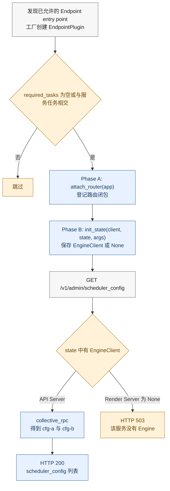
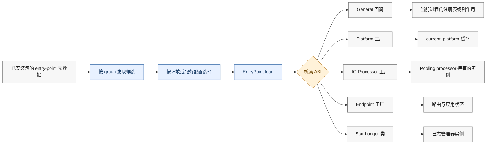
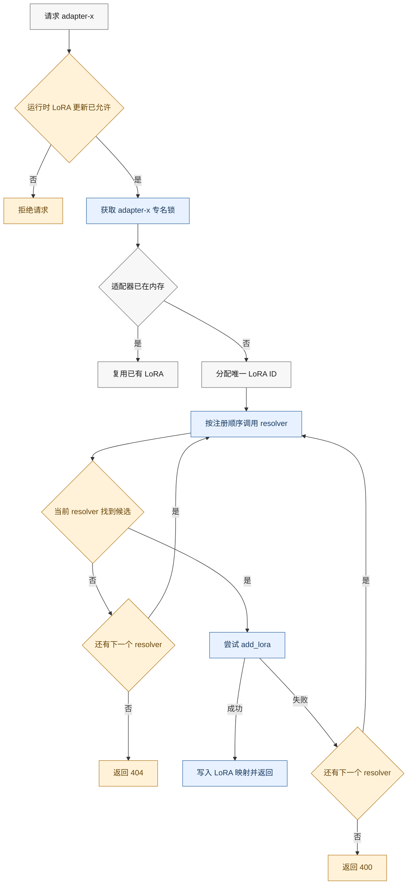

# vLLM 扩展插件系统：同一套入口发现，为什么要拆成不同生命周期

> **源码基线**：`vllm-project/vllm@199cb9b964822e59ab9b58d88e7be31eb419a2ae`（`main`，2026-09-07）
> **主题**：vLLM 扩展插件系统（机制分析）
> **适用范围**：通用插件、平台插件、IO Processor、Endpoint、Stat Logger 与运行时 LoRA Resolver
> **最近更新**：2026-09-14

---

## 1. 核心问题：扩展代码应在什么时候获得系统能力

在[[02_engineering/03_infer_frameworks/vllm/23_vllm_observability_reliability_analysis|可观测性与可靠性]]中，指标、日志和故障传播都发生在 vLLM 已经启动之后。插件机制要解决的是更早一层的问题：第三方代码怎样进入启动流程、由谁选择、何时实例化，以及它能否安全地接触路由、平台、请求或运行时模型状态。

如果所有插件都在进程启动时一次性导入，平台探测会过早冻结，Endpoint 拿不到应用状态，IO Processor 会为未使用的模型白白初始化，运行时 LoRA 也无法按请求延迟解析。从这些调用位置可以重建出一项设计选择（**分析推断**）：vLLM 只统一了 `entry_points` 的“发现入口”，没有统一插件的“生效时刻”：

1. **发现**：按 entry-point group 枚举候选项；
2. **选择**：结合环境变量、显式名称、平台探测或任务集合缩小候选；
3. **导入**：调用 `EntryPoint.load()`，把安装元数据变成 Python 对象；
4. **初始化或调用**：由所属子系统决定是立即执行、延迟构造，还是分两阶段注入状态。

这种拆分的收益是按需加载、允许第三方扩展且不必修改核心仓库；代价是生命周期不再统一，部署者必须同时理解“插件已安装”“插件已导入”和“插件已生效”三个不同状态。

| 设计目标 | vLLM 的选择 | 直接代价 |
|---|---|---|
| 不修改核心代码即可扩展 | 使用 Python entry-point group | 已安装包进入进程信任边界 |
| 避免无关插件初始化 | 各子系统独立选择和延迟构造 | 不同插件的启用规则不同 |
| 保留启动顺序约束 | 路由、应用状态、平台和模型各自分阶段 | 生命周期错误常表现为启动期或首请求故障 |
| 控制运行时下载和状态变更 | Endpoint、远程 LoRA 默认关闭 | 需要显式部署配置 |

本文把插件系统作为“接口—注册—生命周期”机制分析。管理接口是最小的 Endpoint 示例，LoRA Resolver 是运行时状态扩展示例；二者用来说明同一发现底座如何服务不同生命周期，而不是把插件系统等同于某一个具体功能。

## 2. 最小示例：一个管理 Endpoint 为什么需要两阶段初始化

仓库测试包给出了一个可复现的最小插件 `DummyAdminEndpointPlugin`：它注册 `/v1/admin/scheduler_config`，处理函数通过 `EngineClient.collective_rpc("get_scheduler_config")` 读取 Worker 配置。路由必须在应用对外服务前完成注册，但处理函数又需要稍后注入的 `EngineClient`；这正好要求“先登记闭包、再填入状态”的两阶段生命周期。

vLLM 将 Endpoint 插件拆成 Phase A 和 Phase B：



Phase A 由 `attach_endpoint_plugins` 调用 `EndpointPlugin.attach_router(app)`，核心 API 路由先注册，插件路由随后注册。Phase B 由 `init_endpoint_plugins_state` 调用 `EndpointPlugin.init_state(engine_client, state, args)`；API Server 的 `engine_client` 是独立参数，而 Render Server 明确传入 `None`。

对应测试把这个边界钉得很具体：假客户端返回 `["cfg-a", "cfg-b"]` 时，API 路由返回 HTTP 200 和 `{"scheduler_config":["cfg-a","cfg-b"]}`；Render 路径因没有 EngineClient 返回 HTTP 503。换言之，“路由已经存在”不等于“该部署形态具备完成路由动作所需的能力”。

这里有一个容易误读的源码—文档边界：

> [!contradiction]
> `docs/design/endpoint_plugins.md` 将 Phase A 概括为“引擎尚不存在”，但当前 `build_and_serve` 在 `build_app` 之前已经能通过 `engine_client.get_supported_tasks()` 查询任务。更准确的代码事实是：Phase A 时客户端**尚未注入插件闭包**，而不是客户端对象在整个进程里尚未创建。

任务过滤也发生在 Phase A 之前。插件工厂返回对象后，`required_tasks=None` 的插件直接具备任务资格；非空集合则必须与服务的 `supported_tasks` 相交，无交集时连路由都不会注册。Phase B 通过 `getattr(state, "endpoint_plugins", [])` 取 Phase A 的结果，所以 `run_batch.py` 一类绕过 `build_app()`、只创建 bare `State` 的调用会安全 no-op，而不是凭 allowlist 重新构造插件。由此，Endpoint 的生命周期契约是“显式启用 → 工厂构造 → 任务门控 → 路由登记 → 状态注入”，不是一次普通的 import。

## 3. 统一底座：发现、选择、导入不等于生效

整体流程如下。蓝色节点是 vLLM 的公共底座，右侧各分支才决定插件最终归谁所有、在何时生效。



读图时要区分左侧的公共发现动作与右侧的状态归属：`EntryPoint.load()` 只得到 ABI 对象；真正的完成点分别是进程副作用、平台缓存、服务 processor 实例、路由/应用状态或日志管理器实例。

### 3.1 五类 ABI 共享入口，不共享调用契约

| 类型 | entry-point group | 加载后对象 | 谁决定最终生效 | 生命周期 |
|---|---|---|---|---|
| General | `vllm.general_plugins` | 无参回调 | `load_general_plugins` 与 `VLLM_PLUGINS` | 每进程至多尝试一次 |
| Platform | `vllm.platform_plugins` | 返回平台类路径的工厂 | 平台探测器 | 首次访问时探测并缓存 |
| IO Processor | `vllm.io_processor_plugins` | 返回处理器类的工厂 | 模型配置或显式插件名 | Pooling frontend processor 构造时按名创建并持有 |
| Endpoint | `vllm.endpoint_plugins` | 返回 `EndpointPlugin` 的工厂 | 显式 allowlist 与任务交集 | 路由、状态两阶段 |
| Stat Logger | `vllm.stat_logger_plugins` | `StatLoggerBase` 子类 | `AsyncLLM` 初始化 | 引擎生命周期内常驻 |

运行时 LoRA Resolver 不是第六个 entry-point group。vLLM 自带的 filesystem/Hugging Face resolver 先以 **General 插件**注册到 `LoRAResolverRegistry`，然后由前端模型服务把注册表快照成有序 resolver 列表。这一层间接关系解释了为什么“通用插件已经执行”和“某次请求已经解析 LoRA”之间仍隔着前端实例化与请求门控。

### 3.2 General 插件：一次性的是尝试，不是成功

`load_general_plugins()` 在当前进程首次调用时先把 `plugins_loaded` 置为真，再逐个导入并执行回调。因此其精确语义是：

- entry point 导入失败时，`load_plugins_by_group` 记录异常并继续其他候选；
- 回调本身抛错时，异常会向调用者传播；
- 即使回调失败，本进程也不会自动重试该批 General 插件；
- `VLLM_PLUGINS` 未设置时默认加载该组全部候选，设置后按 entry-point 名称过滤。

vLLM 在参数初始化、引擎核心、Worker 包装器和模型注册子进程等多个入口调用它。每个 OS 进程各有一份 `plugins_loaded`，所以“至多一次”是**每进程**语义，不是整个集群一次。

调用时机不只影响运行期。`AsyncEngineArgs.add_cli_args()` 在构造命令行选项前就调用 General loader，使插件有机会先扩展量化方法或设备候选；后续 `EngineArgs`、EngineCore 和 Worker 的调用则确保各自地址空间在首次消费注册状态前完成加载。

官方插件接口同时要求 General 回调具备可重入性：同一插件可能在不同进程中分别加载。模块级门闩只能避免单个进程重复尝试，不能替插件消除跨进程副作用；注册表写入、临时文件和外部服务初始化仍要由插件自行设计成进程安全或幂等。

### 3.3 Platform 与 IO Processor：一个按硬件探测，一个按服务配置

Platform 插件解决“当前进程运行在哪种设备后端”。`current_platform` 首次访问时执行内置平台与 OOT 插件探测：`VLLM_TARGET_DEVICE=cpu` 会直接选择 CPU；否则先拒绝两个及以上 OOT 命中，恰好一个 OOT 时直接优先选择它，不再因多个内置命中而报错；没有 OOT 命中时，才要求内置平台至多命中一个。探测时每个 factory 已调用一次，选中的 factory 还会再次调用以取得类路径，所以它必须能承受重复调用。最终结果被缓存，后续访问不会重新探测。这里的延迟初始化既避免导入环，也防止插件尚未加载时过早冻结平台。

IO Processor 的粒度更细。服务配置没有选择 IO Processor 时不加载；选择后，显式插件名优先于模型的 Hugging Face 配置。`PluginWithIOProcessorPlugins` 在 Pooling frontend processor 构造时发现插件、按名称解析类，再用模型配置和 renderer 创建实例；该实例由 serving processor 常驻持有，在 online/offline 请求路径复用其 parse、pre-process 与 post-process，既不是每个 HTTP 请求重建，也不是 Worker 侧能力。配置了不存在的名称会直接抛出 `ValueError`，因为此时无法安全退化为“什么都不做”。

### 3.4 Stat Logger：类型契约早校验，统计开关随之改变

Stat Logger 加载器要求 entry point 导出的对象是 `StatLoggerBase` 子类，否则抛出 `TypeError`。`AsyncLLM` 把显式传入的 logger factory 和插件 factory 合并，再交给 `StatLoggerManager`：`AggregateStatLoggerBase` 子类只构造一次并接收 `engine_indexes` 列表；普通 per-engine factory 则由 adapter 以 `(vllm_config, engine_index)` 为每个 EngineCore 分别构造。只要存在自定义 logger，即使内置统计原本关闭，也会令 `log_stats` 生效。插件因此不只是“多一个输出端”，还会改变实例数与引擎是否采集统计的运行条件。

## 4. 运行时第二阶段：LoRA Resolver 的有序解析与单飞锁

General 插件先完成 resolver 注册，`OpenAIServingModels` 再把当前注册表按顺序实例化为 `lora_resolvers`。同名 resolver 再注册时，`LoRAResolverRegistry` 会告警并覆盖注册表中的旧工厂；但 `OpenAIServingModels` 在构造函数里已经把当时的注册表快照成实例列表，因此后续注册或覆盖不会追溯改变一个既存 serving 实例。请求一个尚未加载的适配器 `adapter-x` 时，流程如下：



专名锁只串行化同一个 LoRA 名称：不同名称仍可并发，同名并发则由第一个请求完成解析和加载，后续请求在锁内命中已有映射。错误也分层：

- `resolver.resolve_lora()` 自身异常不在回退保护内，会直接向上冒泡；
- 找到候选但 `add_lora` 失败时，服务会尝试下一个 resolver；
- 所有 resolver 都找不到是 404；至少找到过但全部加载失败是 400。

锁和映射都属于单个 `OpenAIServingModels` 实例，不提供多个 API replica 之间的分布式去重。有序 fallback 把“当前来源找到了文件”与“Engine 已接受适配器”分开：只有 `add_lora` 成功才提交映射，失败候选才能让位给下一来源；若无专名锁，同一 frontend 内的并发请求可能重复解析、下载或提交同名适配器（**分析推断**）。

filesystem resolver 只有配置了 `VLLM_LORA_RESOLVER_CACHE_DIR` 才注册；目录不存在或不是目录会在 General 注册回调阶段抛出 `ValueError`。Hugging Face resolver 可能触发远程下载，因此必须在 `VLLM_PLUGINS` 中显式列出其 entry-point 名称；这比 General 插件的默认全加载策略多一层安全门。

## 5. 代码协作关系：谁发现，谁拥有，谁调用

### 5.1 所有权不是集中式 PluginManager

| 责任 | 主要符号 | 持有的状态 |
|---|---|---|
| 通用发现与导入 | `load_plugins_by_group` | entry-point 候选与导入结果 |
| General 一次性门闩 | `load_general_plugins` | 进程内 `plugins_loaded` |
| Endpoint 生命周期 | `attach_endpoint_plugins`、`init_endpoint_plugins_state` | 已附着插件列表与应用状态 |
| 平台选择 | `resolve_current_platform_cls_qualname`、`current_platform` | 选中的平台类 |
| IO Processor 解析 | `PluginWithIOProcessorPlugins` | Pooling serving processor 构造并常驻持有的处理器实例 |
| LoRA 动态解析 | `LoRAResolverRegistry`、`OpenAIServingModels` | resolver 顺序、适配器映射与专名锁 |
| 自定义统计 | `load_stat_logger_plugin_factories`、`AsyncLLM` | logger factory 与 `log_stats` |

没有一个全局对象统一管理这些状态。entry-point group 是共享协议，实际所有权仍属于平台层、服务层、模型层或统计层。

### 5.2 关键调用树

General 插件会从多个进程入口触发，同一门闩在各进程独立生效：

```text
AsyncEngineArgs.add_cli_args
`-- load_general_plugins
    `-- 插件可先扩展 quantization/device CLI 候选

EngineArgs.__post_init__
`-- load_general_plugins
    `-- load_plugins_by_group("vllm.general_plugins")
        `-- plugin()

EngineCore.__init__
`-- load_general_plugins

WorkerWrapperBase.init_worker
`-- load_general_plugins

registry._run
`-- load_general_plugins
```

Endpoint 的两阶段调用由服务启动顺序固定：

```text
build_and_serve
+-- engine_client.get_supported_tasks
+-- build_app
|   +-- register_api_routers
|   `-- attach_endpoint_plugins
|       `-- EndpointPlugin.attach_router
`-- init_app_state
    `-- init_endpoint_plugins_state
        `-- EndpointPlugin.init_state
```

运行时 LoRA 则从模型校验进入前端解析器：

```text
BaseServing._check_model
`-- OpenAIServingModels.resolve_lora
    +-- LoRAResolver.resolve_lora
    `-- engine_client.add_lora
```

### 5.3 稳定源码路线

| 阅读目标 | 稳定源码锚点 |
|---|---|
| group 常量、发现器与 General/Endpoint 加载器 | `vllm.plugins.load_plugins_by_group`、`load_general_plugins`、`load_endpoint_plugins` |
| General 插件在 CLI/config 前的首次消费点 | `vllm.engine.arg_utils.AsyncEngineArgs.add_cli_args`、`EngineArgs.__post_init__` |
| Endpoint ABI 与两阶段辅助函数 | `vllm.plugins.endpoint_plugins.interface.EndpointPlugin`、`attach_endpoint_plugins`、`init_endpoint_plugins_state` |
| API/Render 启动时序 | `vllm.entrypoints.launchers.api_server.entry.build_and_serve`、`vllm.entrypoints.launchers.app.build_app` |
| 平台探测与缓存 | `vllm.platforms.resolve_current_platform_cls_qualname`、`vllm.platforms.current_platform` |
| IO Processor 按名解析 | `vllm.entrypoints.pooling.pooling.io_processor.PluginWithIOProcessorPlugins` |
| LoRA 请求门控、注册表与解析 | `vllm.entrypoints.serve.engine.serving.BaseServing._check_model`、`vllm.lora.resolver.LoRAResolverRegistry`、`vllm.entrypoints.openai.models.serving.OpenAIServingModels.resolve_lora` |
| Stat Logger 类型校验与接入 | `vllm.v1.metrics.loggers.load_stat_logger_plugin_factories`、`vllm.v1.engine.async_llm.AsyncLLM` |
| 环境变量定义 | `vllm.envs.VLLM_PLUGINS`、`VLLM_TARGET_DEVICE`、`VLLM_ALLOW_RUNTIME_LORA_UPDATING` |
| Endpoint 的门控、两阶段与 Render 行为测试 | `tests/plugins_tests/test_endpoint_plugins.py` |
| Platform、IO 与 Stat Logger 回归测试 | `tests/plugins_tests/test_platform_plugins.py`、`test_io_processor_plugins.py`、`test_stats_logger_plugins.py` |
| filesystem / Hugging Face LoRA Resolver 测试 | `tests/plugins_tests/lora_resolvers/test_filesystem_resolver.py`、`test_hf_hub_resolver.py` |

## 6. 失败边界、部署控制与适用方式

### 6.1 失败发生在哪一阶段，决定能否隔离

| 失败点 | 当前行为 | 影响范围 |
|---|---|---|
| `EntryPoint.load()` 失败 | 记录异常，继续其他候选 | 单个候选被隔离 |
| General 回调失败 | 异常向上，且本进程不自动重试 | 当前调用路径可能启动失败 |
| Platform factory 探测失败 | debug 记录并视为未命中 | 继续判断其余平台候选 |
| 两个及以上 OOT，或无 OOT 时两个及以上内置平台命中 | 拒绝选择 | 平台初始化失败 |
| IO Processor factory 失败或名称不存在 | factory 失败时记录并跳过；最终找不到请求名称则 `ValueError` | 对应模型/请求初始化失败 |
| Endpoint 工厂失败 | 记录并跳过该插件 | 该插件路由缺失 |
| Endpoint `attach_router` / `init_state` 失败 | 辅助函数不捕获，异常向启动调用者传播 | 当前服务启动失败，或无法完成应用状态初始化 |
| Endpoint 任务不匹配 | 静默跳过注册 | 当前服务不暴露该路由 |
| Stat Logger 类型错误 | `TypeError` | 引擎初始化失败 |
| LoRA resolver 抛错 | 异常向上，不自动换下一个 | 当前请求失败 |
| LoRA 候选加载失败 | 尝试后续 resolver | 最终为 400 或成功 |

另一个接口漂移需要单独记录：

> [!contradiction]
> `EndpointPlugin.name` 的 docstring 声称该字段用于 `VLLM_PLUGINS` allowlist；实际 `load_endpoint_plugins()` 比较的是 Python entry point 元数据的 `plugin.name`，对象字段不参与筛选。部署配置应以已安装 entry-point 名称为准。

### 6.2 配置门控

| 配置 | 默认值 | 控制对象 | 运维含义 |
|---|---:|---|---|
| `VLLM_PLUGINS` | 未设置 | General 与 Endpoint 共用的 entry-point 名称过滤 | General 未设置时加载该组全部候选；Endpoint 未设置时整组不加载；空字符串解析为只含空名称的列表 |
| `VLLM_TARGET_DEVICE` | `cuda` | 平台快速选择 | 设为 `cpu` 时跳过常规探测 |
| `VLLM_ALLOW_RUNTIME_LORA_UPDATING` | `False` | 运行时 LoRA 加载 | 开启后请求可改变模型适配器状态 |
| `VLLM_LORA_RESOLVER_CACHE_DIR` | 未设置 | filesystem resolver | 未配置目录时不注册 |
| `VLLM_LORA_RESOLVER_HF_REPO_LIST` | 未设置 | Hugging Face resolver 范围 | 与显式插件启用共同约束远程来源 |

Endpoint 插件属于服务进程内的可信代码：它能添加任意路由，vLLM 不检查路径冲突，API key 中间件也只覆盖既定前缀。源码能证明核心路由先登记、插件路由后登记，以及 vLLM 没有额外的冲突检查；同路径最终由哪条规则匹配则属于 FastAPI/Starlette 的外部语义边界，不能只从 vLLM 调用顺序推广。生产环境至少要把插件包版本、entry-point 名称、启用环境变量和允许的路由清单作为同一部署单元审核。

这些插件类型也没有共同的 teardown 或事务式 rollback。若一个回调已经修改注册表、一个 Endpoint 已登记部分路由，随后另一步启动失败，vLLM 不会沿统一插件栈反向撤销副作用；恢复依赖进程退出、子系统自己的清理逻辑，或部署者重建服务。

### 6.3 机制结论

vLLM 插件系统的关键不是 `entry_points` 本身，而是把扩展点放到各自能获得正确依赖、又不会过早冻结状态的位置。判断一个插件是否“可用”，要沿着“已安装 → 被选择 → 导入成功 → ABI 校验 → 所属子系统初始化”逐层验证。

本页停在扩展代码进入系统的边界。插件通常只改变启动期注册表或前端能力；当系统要在运行中真正替换模型权重时，还需要暂停调度、跨 Worker 传输、提交版本并恢复服务。下一页[[02_engineering/03_infer_frameworks/vllm/25_vllm_weight_transfer_online_update_analysis|在线权重更新]]继续分析这条状态变更协议。

## Related Pages

- [[02_engineering/03_infer_frameworks/vllm/02_vllm_architecture_overview_analysis|vLLM 软件架构]] —— 给出插件扩展点所在的进程与模块边界。
- [[02_engineering/03_infer_frameworks/vllm/03_vllm_request_semantics_analysis|vLLM 请求语义]] —— 说明 Endpoint 与 IO Processor 最终接入的请求解析、校验和返回边界。
- [[02_engineering/03_infer_frameworks/vllm/09_vllm_model_library_analysis|vLLM 模型与权重 ABI]] —— 承接模型注册、加载和 LoRA 所依赖的模型侧接口。
- [[02_engineering/03_infer_frameworks/vllm/13_vllm_serving_control_plane_analysis|vLLM Serving 控制面]] —— 展开 Endpoint 路由、应用状态与服务启停顺序。
- [[02_engineering/03_infer_frameworks/vllm/18_vllm_distributed_inference_analysis|vLLM 分布式推理]] —— 补充 General 插件跨进程执行时所处的 rank 与进程拓扑。
- [[02_engineering/03_infer_frameworks/vllm/23_vllm_observability_reliability_analysis|vLLM 可观测性与可靠性]] —— 解释 Stat Logger 消费以及插件故障如何进入生产观测。
- [[02_engineering/03_infer_frameworks/vllm/25_vllm_weight_transfer_online_update_analysis|vLLM 在线权重更新]] —— 从启动期扩展转入运行时模型状态变更协议。
