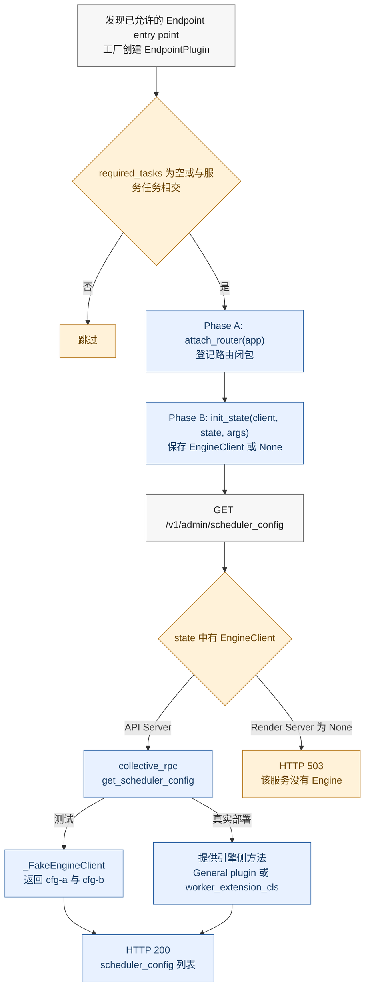
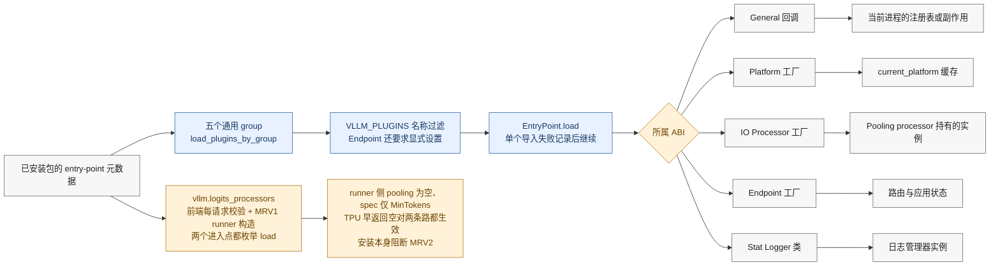
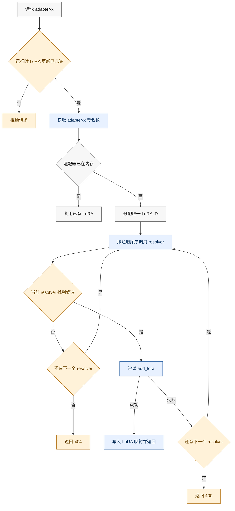

# vLLM 扩展插件系统：同一套入口发现，为什么要拆成不同生命周期

> **源码基线**：`vllm-project/vllm@199cb9b964822e59ab9b58d88e7be31eb419a2ae`（`main` 快照，2026-09-07 UTC）
> **主题**：六类 entry-point 插件各自在什么时刻被发现、导入并获得系统能力，以及为什么它们不共享一个加载器；运行时 LoRA Resolver 为什么不是第七组。核心代码在 `vllm/plugins/`、`vllm/entrypoints/` 与 `vllm/lora/resolver.py`。
> **适用范围**：通用插件、平台插件、IO Processor、Endpoint、Stat Logger、Logits Processor 与运行时 LoRA Resolver 的发现与生效边界；插件内部实现、被它们注册的模型/量化/设备语义分别归 09、17、20，gRPC 与 Rust frontend 本域暂无 owner。
> **最近更新**：2026-09-16。补齐 `vllm.logits_processors` 第六个 entry-point 组与早返回边界、全组 allowlist 作用域，以及 Endpoint 与引擎侧扩展的配对合同。

---

## 1. 核心问题：扩展代码应在什么时候获得系统能力

本页的阅读前序按 [[02_engineering/03_infer_frameworks/vllm/index|vLLM 知识地图]] 是「请求语义、模型库与 Serving」，[[02_engineering/03_infer_frameworks/vllm/23_vllm_observability_reliability_analysis|可观测性与可靠性]] 是后续而非前序。借它作对照仍然有用：那一页的指标、日志和故障传播都发生在 vLLM 已经启动之后。插件机制要解决的是更早一层的问题：第三方代码怎样进入启动流程、由谁选择、何时实例化，以及它能否安全地接触路由、平台、请求或运行时模型状态。

如果所有插件都在进程启动时一次性导入，平台探测会过早冻结，Endpoint 拿不到应用状态，IO Processor 会为未使用的模型白白初始化，运行时 LoRA 也无法按请求延迟解析。从这些调用位置可以重建出一项设计选择（**分析推断**）：vLLM 只统一了 `entry_points` 的“发现入口”，没有统一插件的“生效时刻”：

1. **发现**：按 entry-point group 枚举候选项；
2. **选择**：结合环境变量、显式名称、平台探测或任务集合缩小候选；
3. **导入**：调用 `EntryPoint.load()`，把安装元数据变成 Python 对象；
4. **初始化或调用**：由所属子系统决定是立即执行、延迟构造，还是分两阶段注入状态。

这种拆分的收益是按需加载、允许第三方扩展且不必修改核心仓库；代价是生命周期不再统一，部署者必须同时理解“插件已安装”“插件已导入”和“插件已生效”三个不同状态。

| 设计目标 | vLLM 的选择 | 直接代价 |
|---|---|---|
| 不修改核心代码即可扩展 | 使用 Python entry-point group | 已安装包进入进程信任边界 |
| 避免无关插件初始化 | 各子系统独立选择和延迟构造 | 不同插件的启用规则不同 |
| 保留启动顺序约束 | 路由、应用状态、平台和模型各自分阶段 | 生命周期错误常表现为启动期或首请求故障 |
| 控制运行时下载和状态变更 | Endpoint、远程 LoRA 默认关闭 | 需要显式部署配置 |

本文把插件系统作为“接口—注册—生命周期”机制分析。管理接口是最小的 Endpoint 示例，LoRA Resolver 是运行时状态扩展示例；二者用来说明同一发现底座如何服务不同生命周期，而不是把插件系统等同于某一个具体功能。

## 2. 最小示例：一个管理 Endpoint 为什么需要两阶段初始化

仓库测试包给出了一个可复现的最小插件 `DummyAdminEndpointPlugin`：它注册 `/v1/admin/scheduler_config`，处理函数通过 `EngineClient.collective_rpc("get_scheduler_config")` 读取 Worker 配置。路由必须在应用对外服务前完成注册，但处理函数又需要稍后注入的 `EngineClient`；这正好要求“先登记闭包、再填入状态”的两阶段生命周期。这个例子的端到端测试使用 `_FakeEngineClient` 返回 `cfg-a/cfg-b`；真实 vLLM Worker 树内没有 `get_scheduler_config` 方法，部署同一接口还必须提供相应的引擎侧实现，例如用 `vllm.general_plugins` 回调注册能力，或用 `worker_extension_cls` 把方法动态加入 Worker。Endpoint 只拥有 HTTP 面，不会因为能拿到 EngineClient 就自动创造新的 Worker RPC 方法。

vLLM 将 Endpoint 插件拆成 Phase A 和 Phase B；下图同时标出测试替身与真实部署的配对边界：

<!-- Figure spec: lifecycle and dependency graph for DummyAdminEndpointPlugin. Endpoint discovery leads to Phase A route registration and Phase B state injection. A request with an EngineClient calls collective_rpc; the test branch is satisfied by _FakeEngineClient, while a real deployment must provide the Worker method through a General plugin or worker_extension_cls. Render without an Engine returns 503. Blue marks successful lifecycle stages; orange marks gates and missing-engine/dependency boundaries. -->

```mermaid
flowchart TB
    A["发现已允许的 Endpoint entry point<br/>工厂创建 EndpointPlugin"] --> C{"required_tasks 为空或与服务任务相交"}
    C -->|否| X["跳过"]
    C -->|是| D["Phase A: attach_router(app)<br/>登记路由闭包"]
    D --> G["Phase B: init_state(client, state, args)<br/>保存 EngineClient 或 None"]
    G --> H["GET /v1/admin/scheduler_config"]
    H --> I{"state 中有 EngineClient"}
    I -->|API Server| Q["collective_rpc<br/>get_scheduler_config"]
    Q -->|测试| J["_FakeEngineClient<br/>返回 cfg-a 与 cfg-b"]
    Q -->|真实部署| W["提供引擎侧方法<br/>General plugin 或 worker_extension_cls"]
    J --> K["HTTP 200<br/>scheduler_config 列表"]
    W --> K
    I -->|Render Server 为 None| R["HTTP 503<br/>该服务没有 Engine"]

    classDef default fill:#f7f7f7,stroke:#707070,color:#202020
    classDef acc1 fill:#e8f1ff,stroke:#3569a8,color:#173a63
    classDef acc2 fill:#fff2d9,stroke:#b7791f,color:#6b4300
    class D,G,Q,J,W,K acc1
    class C,X,I,R acc2
```

Phase A 由 `attach_endpoint_plugins` 调用 `EndpointPlugin.attach_router(app)`，核心 API 路由先注册，插件路由随后注册。Phase B 由 `init_endpoint_plugins_state` 调用 `EndpointPlugin.init_state(engine_client, state, args)`；API Server 的 `engine_client` 是独立参数，而 Render Server 明确传入 `None`。

对应测试把这个边界钉得很具体：假客户端返回 `["cfg-a", "cfg-b"]` 时，API 路由返回 HTTP 200 和 `{"scheduler_config":["cfg-a","cfg-b"]}`；Render 路径因没有 EngineClient 返回 HTTP 503。它验证的是两阶段注入和路由输出，不是树内 Worker 天生具有该方法。`vllm/v1/serial_utils.py::run_method` 最终用 `getattr(worker, method)` 解析字符串；若 General 回调与 `WorkerWrapperBase.init_worker` 的 `worker_extension_cls` 注入都没有提供该方法，`AttributeError` 会被就地吞掉并改抛 `NotImplementedError(f"Method {method!r} is not implemented.")`——排错时按后者的消息找。因此真实部署要把 Endpoint 与其采用的引擎侧扩展机制作为同一合同审核；使用 General entry point 时，还要遵守它自己的加载进程和 allowlist。换言之，“路由已经存在”不等于“该部署形态具备完成路由动作所需的能力”。

这里有一个容易误读的源码—文档边界：

> [!contradiction]
> `docs/design/endpoint_plugins.md` 将 Phase A 概括为“引擎尚不存在”，但当前 `build_and_serve` 在 `build_app` 之前已经能通过 `engine_client.get_supported_tasks()` 查询任务。更准确的代码事实是：Phase A 时客户端**尚未注入插件闭包**，而不是客户端对象在整个进程里尚未创建。

任务过滤也发生在 Phase A 之前。插件工厂返回对象后，`required_tasks=None` 的插件直接具备任务资格；非空集合则必须与服务的 `supported_tasks` 相交，无交集时连路由都不会注册。Phase B 通过 `getattr(state, "endpoint_plugins", [])` 取 Phase A 的结果，所以 `run_batch.py` 一类绕过 `build_app()`、只创建 bare `State` 的调用会安全 no-op，而不是凭 allowlist 重新构造插件。由此，Endpoint 的生命周期契约是“显式启用 → 工厂构造 → 任务门控 → 路由登记 → 状态注入”，不是一次普通的 import。

## 3. 统一底座：发现、选择、导入不等于生效

整体流程如下。五个通用组经过 `load_plugins_by_group`，所以共享 `VLLM_PLUGINS` 过滤与“单个 entry point 导入失败后继续”的行为；Logits Processor 组绕过该 loader，直接从 `importlib.metadata.entry_points` 枚举。**这一组有两个互相独立的进入点，不是 MRV1 runner 独占**：前端每收到一份 `SamplingParams` 就在参数校验里走一次，引擎侧 MRV1 runner 构造时再走一次，两条路都落到同一个 `_load_custom_logitsprocs`。`build_logitsprocs` 的 pooling / speculative 早返回只挡住 runner 那一条；TPU 的早返回在 `_load_custom_logitsprocs` 内部，两条路都挡。右侧各分支才决定插件最终归谁所有、在何时生效。

<!-- Figure spec: plugin discovery split by loader semantics. Five standard groups share load_plugins_by_group and VLLM_PLUGINS filtering before branching into General, Platform, IO, Endpoint and Stat Logger owners. The vllm.logits_processors group bypasses that loader and is reached by two independent callers: per-request frontend validation (SamplingParams.verify) and MRV1 runner construction (build_logitsprocs). The pooling/speculative early returns guard only the runner path; the TPU early return guards both. Actual load failure is fatal; independently, merely installing a plugin in this group blocks MRV2 during config validation. Blue marks the shared loader; orange marks the independent logits-processor path and ABI branching. -->

```mermaid
flowchart LR
    A["已安装包的 entry-point 元数据"] --> B["五个通用 group<br/>load_plugins_by_group"]
    B --> C["VLLM_PLUGINS 名称过滤<br/>Endpoint 还要求显式设置"]
    C --> D["EntryPoint.load<br/>单个导入失败记录后继续"]
    D --> E{"所属 ABI"}
    E --> G["General 回调"]
    E --> P["Platform 工厂"]
    E --> O["IO Processor 工厂"]
    E --> N["Endpoint 工厂"]
    E --> S["Stat Logger 类"]
    G --> GR["当前进程的注册表或副作用"]
    P --> PR["current_platform 缓存"]
    O --> OR["Pooling processor 持有的实例"]
    N --> NR["路由与应用状态"]
    S --> SR["日志管理器实例"]
    A --> L["vllm.logits_processors<br/>前端每请求校验 + MRV1 runner 构造<br/>两个进入点都枚举 load"]
    L --> LR["runner 侧 pooling 为空、spec 仅 MinTokens<br/>TPU 早返回空对两条路都生效<br/>安装本身阻断 MRV2"]

    classDef default fill:#f7f7f7,stroke:#707070,color:#202020
    classDef acc1 fill:#e8f1ff,stroke:#3569a8,color:#173a63
    classDef acc2 fill:#fff2d9,stroke:#b7791f,color:#6b4300
    class B,C,D acc1
    class E,L,LR acc2
```

读图时要区分左侧的公共发现动作与右侧的状态归属：`EntryPoint.load()` 只得到 ABI 对象；真正的完成点分别是进程副作用、平台缓存、服务 processor 实例、路由/应用状态或日志管理器实例。

### 3.1 六类 entry-point ABI，不共享加载器或调用契约

| 类型 | entry-point group | 加载后对象 | 谁决定最终生效 | 生命周期 |
|---|---|---|---|---|
| General | `vllm.general_plugins` | 无参回调 | `load_general_plugins` 与 `VLLM_PLUGINS` | 每进程至多尝试一次。典型用途是在回调里调 `ModelRegistry.register_model(arch, target)` 注册 OOT 模型架构（官方 `docs/design/plugin_system.md` 的示例即此），也用于注册量化方法或设备候选——分别接 [[02_engineering/03_infer_frameworks/vllm/09_vllm_model_library_analysis|模型库]]、[[02_engineering/03_infer_frameworks/vllm/17_vllm_quantization_analysis|量化]]、[[02_engineering/03_infer_frameworks/vllm/20_vllm_fused_ops_and_kernels_analysis|融合算子]] |
| Platform | `vllm.platform_plugins` | 返回平台类路径的工厂 | 平台探测器 | 首次访问时探测并缓存 |
| IO Processor | `vllm.io_processor_plugins` | 返回处理器类的工厂 | 模型配置或显式插件名 | Pooling frontend processor 构造时按名创建并持有 |
| Endpoint | `vllm.endpoint_plugins` | 返回 `EndpointPlugin` 的工厂 | 显式 allowlist 与任务交集 | 路由、状态两阶段 |
| Stat Logger | `vllm.stat_logger_plugins` | `StatLoggerBase` 子类 | `AsyncLLM` 初始化 | 引擎生命周期内常驻 |
| Logits Processor | `vllm.logits_processors` | `LogitsProcessor` 子类 | 两个进入点：前端 `SamplingParams.verify` 的每请求校验，与 MRV1 `build_logitsprocs`；都加载已安装 entry points 并合并 `--logits-processors` FQCN/类。pooling/speculative 早返回只在 runner 侧，TPU 早返回两侧都生效 | 校验期只取类做参数检查、不留实例；MRV1 runner 的 `LogitsProcessors` 才持有。不论是否走到实际 load，安装任一该组插件都会成为 MRV2 blocker |

Logits Processor 没有经过 `load_plugins_by_group`：`_load_logitsprocs_plugins` 直接枚举并逐个 `EntryPoint.load()`，不读取 `VLLM_PLUGINS`，任一加载异常包装成 `RuntimeError` 抛出，而不是隔离该候选。

**谁会走到它，决定这个 `RuntimeError` 长什么样。** 有两条独立的调用链，各自在不同进程、不同时刻触发：

| 进入点 | 触发时机 | 门控 | 失败表现 |
|---|---|---|---|
| `InputProcessor._validate_params` → `SamplingParams.verify` → `_validate_logits_processors` → `validate_logits_processors_parameters` | 前端进程，每收到一份 `SamplingParams` | 只有 TPU 早返回；与 runner 版本无关，speculative 也走 | `RuntimeError` 不被捕获（该函数只把 `validate_params` 抛出的 `ValueError` 转成 `VLLMValidationError`），表现为请求校验期错误 |
| `GPUModelRunner.__init__` → `build_logitsprocs` | 引擎侧 worker 进程，runner 构造时 | **无显式 `--logits-processors` 时**：pooling 返回空集合、speculative 只保留 `MinTokensLogitsProcessor`；配了显式项则这两支各自 `raise ValueError` 而不是早返回。TPU 返回空集合 | `RuntimeError` 中断 runner / 引擎初始化 |

两条路共用 `cached_load_custom_logitsprocs = lru_cache(_load_custom_logitsprocs)`，所以同一进程内按 `logits_processors` 元组只枚举一次；但前端与 worker 是不同进程，各自付一次。**因此“普通 MRV1 generation 才加载”是错的**：`build_logitsprocs` 的 pooling / speculative 早返回只挡住 runner 那一条路，前端校验仍会枚举并 `EntryPoint.load()`。举个这两条路结论不同的部署：MRV1 + 投机解码——runner 侧 `build_logitsprocs` 只保留 `MinTokensLogitsProcessor`、不碰 entry point，但前端第一份 `SamplingParams` 仍会触发加载，一个导入失败的插件就在**请求校验期**炸出来，而不是启动期。**注意这里不能拿 MRV2 举例**：装了该组 entry point（或给了 `--logits-processors`）本身就是 MRV2 的 blocker——`_get_v2_model_runner_unsupported_features` 会加入 `"custom logits processors"`，自动选择因此回落 MRV1，强制 `VLLM_USE_V2_MODEL_RUNNER=1` 则在配置校验期直接 `ValueError`。所以“装了插件的 MRV2 部署”这个组合不存在。源码没有解释为什么它采用独立 loader；**分析推断**：它需要返回一组强类型、逐 batch 持有状态的 processor classes，而不是通用工厂字典，但这不是已声明的设计理由。采样处理顺序与扩展接口归 [[14_vllm_sampling_structured_output_analysis#4.3 logits processor 的变体集合从哪里枚举出来|采样与结构化输出 §4.3]]。

运行时 LoRA Resolver 不是第七个 entry-point group。vLLM 自带的 filesystem/Hugging Face resolver 先以 **General 插件**注册到 `LoRAResolverRegistry`，然后由前端模型服务把注册表快照成有序 resolver 列表。这一层间接关系解释了为什么“通用插件已经执行”和“某次请求已经解析 LoRA”之间仍隔着前端实例化与请求门控。

### 3.2 General 插件：一次性的是尝试，不是成功

`load_general_plugins()` 在当前进程首次调用时先把 `plugins_loaded` 置为真，再逐个导入并执行回调。因此其精确语义是：

- entry point 导入失败时，`load_plugins_by_group` 记录异常并继续其他候选；
- 回调本身抛错时，异常会向调用者传播；
- 即使回调失败，本进程也不会自动重试该批 General 插件；
- `VLLM_PLUGINS` 未设置时默认加载该组全部候选，设置后按 entry-point 名称过滤。

vLLM 在参数初始化、引擎核心、Worker 包装器和模型注册子进程等多个入口调用它。每个 OS 进程各有一份 `plugins_loaded`，所以“至多一次”是**每进程**语义，不是整个集群一次。

调用时机不只影响运行期。`AsyncEngineArgs.add_cli_args()` 在构造命令行选项前就调用 General loader，使插件有机会先扩展量化方法或设备候选；后续 `EngineArgs`、EngineCore 和 Worker 的调用则确保各自地址空间在首次消费注册状态前完成加载。

官方插件接口同时要求 General 回调具备可重入性：同一插件可能在不同进程中分别加载。模块级门闩只能避免单个进程重复尝试，不能替插件消除跨进程副作用；注册表写入、临时文件和外部服务初始化仍要由插件自行设计成进程安全或幂等。

### 3.3 Platform 与 IO Processor：一个按硬件探测，一个按服务配置

Platform 插件解决“当前进程运行在哪种设备后端”。`current_platform` 首次访问时执行内置平台与 OOT 插件探测：`VLLM_TARGET_DEVICE=cpu` 会直接选择 CPU；否则先拒绝两个及以上 OOT 命中，恰好一个 OOT 时直接优先选择它，不再因多个内置命中而报错；没有 OOT 命中时，才要求内置平台至多命中一个。探测时每个 factory 已调用一次，选中的 factory 还会再次调用以取得类路径，所以它必须能承受重复调用。最终结果被缓存，后续访问不会重新探测。这里的延迟初始化既避免导入环，也防止插件尚未加载时过早冻结平台。

**用两个候选把规则走一遍。** 设进程里装了一个 OOT 平台插件 `acme`，同时 CUDA 内置平台也认为自己命中：

| 步骤 | 发生什么 |
|---|---|
| 1 | `VLLM_TARGET_DEVICE` 不是 `cpu`，进入正常探测 |
| 2 | 逐个调用各 factory 一次；`acme` 与内置 CUDA 都返回非 None |
| 3 | OOT 命中数为 1（不是 ≥2），**直接选 `acme`**——内置 CUDA 也命中这件事在此被忽略，不构成“多个命中”错误 |
| 4 | 对选中的 `acme` factory **再调用一次**取类路径，因此它必须幂等、可承受重复调用 |
| 5 | 结果写入缓存；本进程后续访问 `current_platform` 直接拿它，`acme` 插件即使之后被卸载也不会重新探测 |

把第 3 步换成两个 OOT 都命中，则直接拒绝；换成零个 OOT 而 CUDA 与另一内置平台同时命中，才落到“内置至多命中一个”的那条错误上。

IO Processor 的粒度更细。服务配置没有选择 IO Processor 时不加载；选择后，显式插件名优先于模型的 Hugging Face 配置。`PluginWithIOProcessorPlugins` 在 Pooling frontend processor 构造时发现插件、按名称解析类，再用模型配置和 renderer 创建实例；该实例由 serving processor 常驻持有，在 online/offline 请求路径复用其 parse、pre-process 与 post-process，既不是每个 HTTP 请求重建，也不是 Worker 侧能力。配置了不存在的名称会直接抛出 `ValueError`，因为此时无法安全退化为“什么都不做”。

### 3.4 Stat Logger：类型契约早校验，统计开关随之改变

Stat Logger 加载器要求 entry point 导出的对象是 `StatLoggerBase` 子类，否则抛出 `TypeError`。`AsyncLLM` 把显式传入的 logger factory 和插件 factory 合并，再交给 `StatLoggerManager`：`AggregateStatLoggerBase` 子类只构造一次并接收 `engine_indexes` 列表；普通 per-engine factory 则由 adapter 以 `(vllm_config, engine_index)` 为每个 EngineCore 分别构造。只要存在自定义 logger，即使内置统计原本关闭，也会令 `log_stats` 生效。插件因此不只是“多一个输出端”，还会改变实例数与引擎是否采集统计的运行条件。

## 4. 运行时第二阶段：LoRA Resolver 的有序解析与单飞锁

General 插件先完成 resolver 注册——注意 `_LoRAResolverRegistry.register_resolver(resolver_name, resolver: LoRAResolver)` 收的是**实例**，注册表里存的也是实例，不是工厂；`OpenAIServingModels` 随后只是 `get_resolver` 取引用、按顺序排成 `lora_resolvers` 列表，并没有“实例化”动作。同名 resolver 再注册时告警原文是 “overwritten by the new resolver instance”，覆盖的是注册表里的旧**实例**。但 `OpenAIServingModels` 在构造函数里已经把当时的注册表快照成列表，因此后续注册或覆盖不会追溯改变一个既存 serving 实例。请求一个尚未加载的适配器 `adapter-x` 时，流程如下：


```mermaid
flowchart TB
    A["请求 adapter-x"] --> B{"运行时 LoRA 更新已允许"}
    B -->|否| X["拒绝请求"]
    B -->|是| C["获取 adapter-x 专名锁"]
    C --> D{"适配器已在内存"}
    D -->|是| Y["复用已有 LoRA"]
    D -->|否| E["分配唯一 LoRA ID"]
    E --> F["按注册顺序调用 resolver"]
    F --> G{"当前 resolver 找到候选"}
    G -->|否| H{"还有下一个 resolver"}
    H -->|是| F
    H -->|否| N["返回 404"]
    G -->|是| I["尝试 add_lora"]
    I -->|成功| J["写入 LoRA 映射并返回"]
    I -->|失败| K{"还有下一个 resolver"}
    K -->|是| F
    K -->|否| R["返回 400"]

    classDef default fill:#f7f7f7,stroke:#707070,color:#202020
    classDef acc1 fill:#e8f1ff,stroke:#3569a8,color:#173a63
    classDef acc2 fill:#fff2d9,stroke:#b7791f,color:#6b4300
    class C,F,I,J acc1
    class B,G,H,K,X,N,R acc2
```

专名锁只串行化同一个 LoRA 名称：不同名称仍可并发，同名并发则由第一个请求完成解析和加载，后续请求在锁内命中已有映射。错误也分层：

- `resolver.resolve_lora()` 自身异常不在回退保护内，会直接向上冒泡；
- 找到候选但 `add_lora` 失败时，服务会尝试下一个 resolver；
- 所有 resolver 都找不到是 404；至少找到过但全部加载失败是 400。

锁和映射都属于单个 `OpenAIServingModels` 实例，不提供多个 API replica 之间的分布式去重。有序 fallback 把“当前来源找到了文件”与“Engine 已接受适配器”分开：只有 `add_lora` 成功才提交映射，失败候选才能让位给下一来源；若无专名锁，同一 frontend 内的并发请求可能重复解析、下载或提交同名适配器（**分析推断**）。

filesystem resolver 只有配置了 `VLLM_LORA_RESOLVER_CACHE_DIR` 才注册；目录不存在或不是目录会在 General 注册回调阶段抛出 `ValueError`。Hugging Face resolver 可能触发远程下载，因此必须在 `VLLM_PLUGINS` 中显式列出其 entry-point 名称；这比 General 插件的默认全加载策略多一层安全门。

## 5. 代码协作关系：谁发现，谁拥有，谁调用

### 5.1 所有权不是集中式 PluginManager

| 责任 | 主要符号 | 持有的状态 |
|---|---|---|
| 通用发现与导入 | `load_plugins_by_group` | entry-point 候选与导入结果 |
| General 一次性门闩 | `load_general_plugins` | 进程内 `plugins_loaded` |
| Endpoint 生命周期 | `attach_endpoint_plugins`、`init_endpoint_plugins_state` | 已附着插件列表与应用状态 |
| 平台选择 | `resolve_current_platform_cls_qualname`、`current_platform` | 选中的平台类 |
| IO Processor 解析 | `PluginWithIOProcessorPlugins` | Pooling serving processor 构造并常驻持有的处理器实例 |
| LoRA 动态解析 | `LoRAResolverRegistry`、`OpenAIServingModels` | resolver 顺序、适配器映射与专名锁 |
| 自定义统计 | `load_stat_logger_plugin_factories`、`AsyncLLM` | logger factory 与 `log_stats` |
| 自定义 logits 处理 | `_load_logitsprocs_plugins`、`cached_load_custom_logitsprocs`、`build_logitsprocs` | 加载的 entry-point classes 与显式 FQCN/classes（前端校验与 MRV1 runner 两个进入点共用 `lru_cache`，按进程各一份）；pooling/speculative/TPU 的早返回结果；只有 MRV1 `LogitsProcessors` 持有实例及 per-request state |

没有一个全局对象统一管理这些状态。entry-point group 是共享协议，实际所有权仍属于平台层、服务层、模型层或统计层。

### 5.2 关键调用树

General 插件会从多个进程入口触发，同一门闩在各进程独立生效：

```text
AsyncEngineArgs.add_cli_args
`-- load_general_plugins
    `-- 插件可先扩展 quantization/device CLI 候选

EngineArgs.__post_init__
`-- load_general_plugins
    `-- load_plugins_by_group("vllm.general_plugins")
        `-- plugin()

EngineCore.__init__
`-- load_general_plugins

WorkerWrapperBase.init_worker
`-- load_general_plugins

registry._run
`-- load_general_plugins
```

Endpoint 的两阶段调用由服务启动顺序固定：

```text
build_and_serve
+-- engine_client.get_supported_tasks
+-- build_app
|   +-- register_api_routers
|   `-- attach_endpoint_plugins
|       `-- EndpointPlugin.attach_router
`-- init_app_state
    `-- init_endpoint_plugins_state
        `-- EndpointPlugin.init_state
```

Logits Processor 走独立 loader，不经过上面的 General 门闩，并且有两个进入点汇到同一个被 `lru_cache` 包住的加载函数：

```text
InputProcessor._validate_params                              [前端进程，每请求]
`-- SamplingParams.verify
    `-- SamplingParams._validate_logits_processors
        `-- validate_logits_processors_parameters
            `-- cached_load_custom_logitsprocs ----.
                                                   |
GPUModelRunner.__init__                      [MRV1，worker 进程]
`-- build_logitsprocs                              |
    |-- pooling -> 空；spec -> 仅 MinTokens  [早返回，仅此路]
    `-- ordinary generation --------------------->-+
                                                   |
                    lru_cache(_load_custom_logitsprocs)
                        |-- TPU -> []                        [早返回，两路共享]
                        `-- non-TPU
                            +-- _load_logitsprocs_plugins
                            |   `-- entry_points(group="vllm.logits_processors") -> EntryPoint.load
                            `-- _load_logitsprocs_by_fqcns   [显式 --logits-processors]
```

运行时 LoRA 则从模型校验进入前端解析器：

```text
BaseServing._check_model
`-- OpenAIServingModels.resolve_lora
    +-- LoRAResolver.resolve_lora
    `-- engine_client.add_lora
```

### 5.3 稳定源码路线

| 阅读目标 | 稳定源码锚点 |
|---|---|
| group 常量、发现器与 General/Endpoint 加载器 | `vllm/plugins/__init__.py::load_plugins_by_group / load_general_plugins / load_endpoint_plugins` |
| General 插件在 CLI/config 前的首次消费点 | `vllm/engine/arg_utils.py::AsyncEngineArgs.add_cli_args / EngineArgs.__post_init__` |
| Endpoint ABI 与两阶段辅助函数 | `vllm/plugins/endpoint_plugins/interface.py::EndpointPlugin / attach_endpoint_plugins / init_endpoint_plugins_state` |
| API/Render 启动时序 | `vllm/entrypoints/launchers/api_server/entry.py::build_and_serve`；`vllm/entrypoints/launchers/app.py::build_app`；`vllm/entrypoints/launchers/render/entry.py::build_and_serve_renderer` |
| 平台探测与缓存 | `vllm/platforms/__init__.py::resolve_current_platform_cls_qualname / __getattr__`（`current_platform`） |
| IO Processor 按名解析 | `vllm/entrypoints/pooling/pooling/io_processor.py::PluginWithIOProcessorPlugins` |
| LoRA 请求门控、注册表与解析 | `vllm/entrypoints/serve/engine/serving.py::BaseServing._check_model`；`vllm/lora/resolver.py::_LoRAResolverRegistry / LoRAResolverRegistry`；`vllm/entrypoints/openai/models/serving.py::OpenAIServingModels.resolve_lora` |
| Stat Logger 类型校验与接入 | `vllm/v1/metrics/loggers.py::load_stat_logger_plugin_factories`；`vllm/v1/engine/async_llm.py::AsyncLLM.__init__` |
| Logits Processor 的独立发现（前端校验 + MRV1 持有两个进入点） | `vllm/v1/sample/logits_processor/__init__.py::LOGITSPROCS_GROUP / _load_logitsprocs_plugins / _load_custom_logitsprocs / cached_load_custom_logitsprocs / validate_logits_processors_parameters / build_logitsprocs`；`vllm/v1/engine/input_processor.py::InputProcessor._validate_params`；`vllm/sampling_params.py::SamplingParams.verify / SamplingParams._validate_logits_processors`；`vllm/v1/worker/gpu_model_runner.py::GPUModelRunner.__init__`；`vllm/config/vllm.py::VllmConfig._get_v2_model_runner_unsupported_features` |
| 环境变量定义 | `vllm/envs.py::VLLM_PLUGINS / VLLM_TARGET_DEVICE / VLLM_ALLOW_RUNTIME_LORA_UPDATING` |
| Endpoint 的门控、两阶段与 Render 行为测试 | `tests/plugins_tests/test_endpoint_plugins.py::test_plugin_loaded_when_allowlisted_and_task_matches / test_render_server_attaches_endpoint_plugins_with_no_engine_client / test_endpoint_plugin_end_to_end` |
| Platform、IO 与 Stat Logger 回归测试 | `tests/plugins_tests/test_platform_plugins.py::test_platform_plugins`；`tests/plugins_tests/test_io_processor_plugins.py::test_loading_plugin`；`tests/plugins_tests/test_stats_logger_plugins.py::test_stat_logger_plugin_integration_with_engine` |
| filesystem / Hugging Face LoRA Resolver 测试 | `tests/plugins_tests/lora_resolvers/test_filesystem_resolver.py::test_filesystem_resolver`；`tests/plugins_tests/lora_resolvers/test_hf_hub_resolver.py::test_hf_resolver_with_multiple_repos` |

## 6. 失败边界、部署控制与适用方式

### 6.1 失败发生在哪一阶段，决定能否隔离

| 失败点 | 当前行为 | 影响范围 |
|---|---|---|
| `EntryPoint.load()` 失败 | 记录异常，继续其他候选 | 单个候选被隔离 |
| General 回调失败 | 异常向上，且本进程不自动重试 | 当前调用路径可能启动失败 |
| Platform factory 探测失败 | debug 记录并视为未命中 | 继续判断其余平台候选 |
| 两个及以上 OOT，或无 OOT 时两个及以上内置平台命中 | 拒绝选择 | 平台初始化失败 |
| IO Processor factory 失败或名称不存在 | factory 失败时记录并跳过；最终找不到请求名称则 `ValueError` | 对应模型/请求初始化失败 |
| Endpoint 工厂失败 | 记录并跳过该插件 | 该插件路由缺失 |
| Endpoint `attach_router` / `init_state` 失败 | 辅助函数不捕获，异常向启动调用者传播 | 当前服务启动失败，或无法完成应用状态初始化 |
| Endpoint 任务不匹配 | 静默跳过注册 | 当前服务不暴露该路由 |
| Stat Logger 类型错误 | `TypeError` | 引擎初始化失败 |
| Logits Processor entry point 导入失败（前端每请求校验路径） | 记录目标后抛 `RuntimeError`；调用方只转换 `ValueError`，不捕获它 | 该请求在参数校验期失败。它与 runner 侧那条路彼此独立：即使 `build_logitsprocs` 因 pooling/speculative 早返回而没碰过 entry point，这一条仍会触发（此时进程必定是 MRV1——装了该组插件就阻断 MRV2） |
| Logits Processor entry point 导入失败（MRV1 runner 构造路径） | 同上抛 `RuntimeError`；不继续加载其余类 | MRV1 runner / 引擎初始化失败；pooling/speculative 的早返回不进入此分支 |
| pooling 或 speculative 模型配了显式 `--logits-processors` | `build_logitsprocs` 直接 `raise ValueError`（两条各有自己的消息常量），根本不进入加载 | runner 构造失败，属启动硬失败；这也是“早返回”只在无显式项时成立的原因 |
| LoRA resolver 抛错 | 异常向上，不自动换下一个 | 当前请求失败 |
| LoRA 候选加载失败 | 尝试后续 resolver | 最终为 400 或成功 |

另一个接口漂移需要单独记录：

> [!contradiction]
> `EndpointPlugin.name` 的 docstring 声称该字段用于 `VLLM_PLUGINS` allowlist；实际 `load_endpoint_plugins()` 比较的是 Python entry point 元数据的 `plugin.name`，对象字段不参与筛选。部署配置应以已安装 entry-point 名称为准。

### 6.2 配置门控

| 配置 | 默认值 | 控制对象 | 运维含义 |
|---|---:|---|---|
| `VLLM_PLUGINS` | 未设置 | 所有经过 `load_plugins_by_group` 的 General、Platform、IO Processor、Stat Logger、Endpoint 候选 | 未设置时前四组加载全部候选，Endpoint 整组不加载；设置后五组都只保留列出的 entry-point 名称；空字符串解析为只含空名称的列表 |
| `vllm.logits_processors` entry points / `--logits-processors` | 安装发现结果 / 未设置 | custom logits processor 类集合（前端校验读它做参数检查，MRV1 runner 读它建实例） | 非 TPU 即尝试加载，且不受 `VLLM_PLUGINS` 过滤；显式项另按 class/FQCN 合并；pooling/speculative 的早返回只挡 runner 侧；存在任一已安装插件或显式项仍会阻断 MRV2 |
| `VLLM_TARGET_DEVICE` | `cuda` | 平台快速选择 | 设为 `cpu` 时跳过常规探测 |
| `VLLM_ALLOW_RUNTIME_LORA_UPDATING` | `False` | 运行时 LoRA 加载 | 开启后请求可改变模型适配器状态 |
| `VLLM_LORA_RESOLVER_CACHE_DIR` | 未设置 | filesystem resolver | 未配置目录时不注册 |
| `VLLM_LORA_RESOLVER_HF_REPO_LIST` | 未设置 | Hugging Face resolver 范围 | 与显式插件启用共同约束远程来源 |

`VLLM_PLUGINS` 是跨组的名称 allowlist，不是“只打开某个 Endpoint”的局部开关。为了启用 Endpoint 或 Hugging Face LoRA resolver 而设置它时，必须同时列出该进程仍需要的 OOT platform、IO processor、stat logger 和 General 插件名；漏列会让这些候选在各自加载点被静默过滤。反过来，把 logits-processor entry point 名称写进这个变量也不会过滤或启用该独立组。

Endpoint 插件属于服务进程内的可信代码：它能添加任意路由，vLLM 不检查路径冲突，API key 中间件也只覆盖既定前缀。源码能证明核心路由先登记、插件路由后登记，以及 vLLM 没有额外的冲突检查。**官方文档比源码更进一步**：`docs/design/endpoint_plugins.md::Path-prefix convention` 明说「There is currently no route conflict enforcement…A plugin's `attach_router` can register a path that collides with a core route and routes attached later win」，并建议把插件路由收在 `/plugins/<plugin-name>/...` 这类独立前缀下，只有确实想覆盖既有行为时才用核心前缀且需向运维明示。这是**文档主张**——同路径最终由哪条规则匹配仍属 FastAPI/Starlette 的语义边界，源码这一侧只能证明登记顺序，不能由调用顺序独立推出“后注册者胜”。两者方向一致，但证据等级不同，部署审核时按文档的前缀约定执行更稳妥。生产环境至少要把插件包版本、entry-point 名称、启用环境变量和允许的路由清单作为同一部署单元审核。

这些插件类型也没有共同的 teardown 或事务式 rollback。若一个回调已经修改注册表、一个 Endpoint 已登记部分路由，随后另一步启动失败，vLLM 不会沿统一插件栈反向撤销副作用；恢复依赖进程退出、子系统自己的清理逻辑，或部署者重建服务。

### 6.3 机制结论

vLLM 插件系统的关键不是 `entry_points` 本身，而是把扩展点放到各自能获得正确依赖、又不会过早冻结状态的位置。判断一个插件是否“可用”，要沿着“已安装 → 被选择 → 导入成功 → ABI 校验 → 所属子系统初始化”逐层验证。

本页停在扩展代码进入系统的边界。插件通常只改变启动期注册表或前端能力；当系统要在运行中真正替换模型权重时，还需要暂停调度、跨 Worker 传输、提交版本并恢复服务。下一页[[02_engineering/03_infer_frameworks/vllm/25_vllm_weight_transfer_online_update_analysis|在线权重更新]]继续分析这条状态变更协议。

## Related Pages

- [[02_engineering/03_infer_frameworks/vllm/02_vllm_architecture_overview_analysis|vLLM 软件架构]] —— 给出插件扩展点所在的进程与模块边界。
- [[02_engineering/03_infer_frameworks/vllm/03_vllm_request_semantics_analysis|vLLM 请求语义]] —— 说明 Endpoint 与 IO Processor 最终接入的请求解析、校验和返回边界。
- [[02_engineering/03_infer_frameworks/vllm/09_vllm_model_library_analysis|vLLM 模型库与权重加载]] —— 承接模型注册、加载和 LoRA 所依赖的模型侧接口。
- [[02_engineering/03_infer_frameworks/vllm/14_vllm_sampling_structured_output_analysis|vLLM 采样与结构化输出]] —— 展开 `vllm.logits_processors` 加载后的 batch state、参数处理顺序与 MRV1 限制。
- [[02_engineering/03_infer_frameworks/vllm/13_vllm_serving_control_plane_analysis|vLLM Serving 控制面]] —— 展开 Endpoint 路由、应用状态与服务启停顺序。
- [[02_engineering/03_infer_frameworks/vllm/18_vllm_distributed_inference_analysis|vLLM 分布式推理]] —— 补充 General 插件跨进程执行时所处的 rank 与进程拓扑。
- [[02_engineering/03_infer_frameworks/vllm/23_vllm_observability_reliability_analysis|vLLM 可观测性与可靠性]] —— 解释 Stat Logger 消费以及插件故障如何进入生产观测。
- [[02_engineering/03_infer_frameworks/vllm/25_vllm_weight_transfer_online_update_analysis|vLLM 在线权重更新]] —— 从启动期扩展转入运行时模型状态变更协议。
