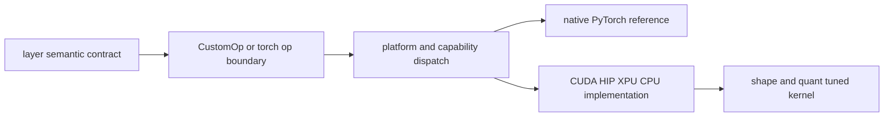

# vLLM 融合算子与 Kernel：在稳定语义下选择设备实现

> **源码基线**：`vllm-project/vllm@d66300a1baa7779c68c7dfa4e51eee2502b48017`
> **中心命题**：vLLM 的 kernel 层不是一组越多越好的 CUDA 扩展。上层先定义 layer/custom-op 语义与 shape/副作用合同，再按平台、dtype、量化、并行和 workload 选择 native、Triton、CUTLASS、FlashInfer、DeepGEMM、ROCm 等实现；融合只有在减少 launch/中间带宽且不破坏这些合同时才成立。

## 一、为什么不能让模型直接调用某个 kernel

同一个 RMSNorm、RoPE、linear、attention 或 MoE，在不同部署上可能需要不同实现：

- NVIDIA CUDA、AMD ROCm、Intel XPU、CPU/TPU 或 out-of-tree accelerator；
- BF16/FP16/FP8/INT8/INT4 与不同 scale 粒度；
- prefill 大矩阵、decode 小矩阵、变长 token 数；
- TP/EP/DBO、CUDA Graph 和 `torch.compile`；
- 原生 PyTorch fallback、测试 reference 与专用 kernel。

若模型类绑定具体 extension，新平台会复制模型；若 kernel 自己决定高层路由/并行语义，替换 kernel 会改变结果。vLLM 用三层分工：

## 二、`CustomOp` 同时服务 eager、compile 与平台派发

`CustomOp` 定义 `forward_native()` 作为可测试/可编译语义实现，并允许 `forward_cuda/hip/xpu/cpu/oot()` 提供设备实现；`vllm/model_executor/custom_op.py:103-172`。构造时 `dispatch_forward()` 根据平台和 custom-op enable policy 固定选择路径；`vllm/model_executor/custom_op.py:174-207`。

它的关键设计不是少写一个 `if cuda`，而是保持两个视图：

- **语义视图**：native 实现供 correctness test、fallback 和 compiler 展开；
- **执行视图**：opaque/custom kernel 供目标平台高性能运行。

当 custom op 被禁用时，vLLM 可编译 native 实现；但注释明确指出 opaque op 会阻断跨 op fusion，能展开时仍应展开；`vllm/model_executor/custom_op.py:191-216`。这解释了为什么“注册 custom op”不一定提升 compile 性能。

out-of-tree registry 允许同名 layer/op 被平台插件替换；`vllm/model_executor/custom_op.py:68-100,313-360`。替换必须保持相同语义合同，不能要求模型知道平台特例。

## 三、直接注册 torch op 时必须声明图语义

部分低层函数通过 `direct_register_custom_op()` 注册到 `torch.library`。它从函数签名推导 schema，并显式接收 `mutates_args` 与 fake implementation；`vllm/utils/torch_utils.py:1026-1064`。

这两个字段分别解决：

- **副作用**：哪些输入会被原地写，functionalization/编译器不得错误重排；
- **抽象执行**：无真实数据时如何推导输出 shape/dtype/device。

fake implementation 只描述元数据，不验证真实 kernel 数值；native reference 只描述结果，不自动表达 alias。二者都需要，custom op 才能安全进入 compile、AOT 与 CUDA Graph 体系。

## 四、融合优化的真实收益模型

两个 op 融合的收益通常来自：

1. 少一次 kernel launch；
2. 中间 tensor 留在寄存器/shared memory，少一次 HBM 写回和读入；
3. 合并量化/dequant、bias、activation 或 reduce；
4. 在已知 layout 下减少 transpose/pack。

代价则包括寄存器压力、occupancy 下降、更多 shape specialization、编译/capture 复杂度和 fallback 覆盖下降。对大 GEMM，单独 kernel 已近饱和，融合收益可能小；对 decode 的 norm+quant、RoPE+KV update 等带宽/launch 密集路径，收益更明显。

因此融合的基本判据不是“op 数减少”，而是目标 workload 上总时间下降且中间状态没有其他消费者。

## 五、MoE 是 kernel 组合设计的代表

MoE 一层包含 router/top-k、token dispatch、两次 expert GEMM、activation、router weight、combine/reduce，且可能跨 EP ranks。把它看成一个 monolithic kernel 会同时耦合通信 backend、expert GEMM、量化和 shared expert。

vLLM 的 modular MoE 把它拆成：

1. `prepare_finalize.prepare`：按 top-k/EP 组织和传输 token，必要时量化 activation；
2. `fused_experts.apply`：执行本地专家计算；
3. `prepare_finalize.finalize`：combine、router weight、reduce/return。

`FusedMoEKernelModularImpl` 显式持有 prepare/finalize 与 expert 两个组件；`vllm/model_executor/layers/fused_moe/modular_kernel.py:1096-1105`。prepare 同时支持同步与 async 路径，并与 DBO yield hook 连接；`vllm/model_executor/layers/fused_moe/modular_kernel.py:1189-1270`。finalize 同样可异步，在接收期间重叠 shared experts；`vllm/model_executor/layers/fused_moe/modular_kernel.py:1362-1422`。

`maybe_make_prepare_finalize()` 根据 EP/DP、all-to-all backend、平台与接口能力选择 DeepEP、NIXL、FlashInfer、Mori 或朴素路径；`vllm/model_executor/layers/fused_moe/all2all_utils.py:165-388`。expert 计算再独立选择 Triton/CUTLASS/DeepGEMM 等。

其设计原因是通信与计算的最佳实现并不总是一一对应：同一 DeepGEMM expert 可搭配不同 all-to-all；同一 DeepEP prepare/finalize 可搭配不同量化 experts。模块化减少组合爆炸。

## 六、monolithic 与 modular 都要保留

monolithic 实现可跨 routing、GEMM、activation 和 reduce 做更激进融合，减少接口与中间 buffer；modular 实现更易组合异步通信、EP backend 和新量化格式。`FusedMoEKernel` 要求 prepare/finalize 与 experts 同为 monolithic 或同为 modular，防止 activation format 不匹配；`vllm/model_executor/layers/fused_moe/modular_kernel.py:1588-1618`。

选择取决于能力合同：

- 输入 activation format 与 top-k metadata；
- weight/scale layout；
- 是否需要 async prepare/finalize；
- output 是否已经 reduce；
- router weight 在输入、expert 内还是 finalize 应用；
- shared experts、LoRA、DBO、graph capture 支持。

`FusedMoEConfig` 集中保存 backend、并行和 deferred finalize 等语义；`vllm/model_executor/layers/fused_moe/config.py:1278-1448`。后端若不支持某个 clamp/activation，不能静默丢弃功能。

## 七、kernel 选择为什么必须看 shape 与阶段

prefill 的 token M 大，decode 的 M 小；TP/EP 会进一步改变 local M/N/K。一个在大 M 上吞吐最优的 kernel，可能在小 M 上被 launch/setup 吞没。量化 pack block 若不能整除 local K/N，还可能触发 fallback 或 padding。

可靠选择需要至少包含：平台架构、dtype/quant desc、M/N/K、expert 数/top-k、TP/EP、block shape、activation 和 graph/async 能力。仅按 GPU 型号或量化名称固定 kernel 很容易在另一 workload 退化。

## 八、五个不变量

1. **数值语义**：device kernel 与 native/reference 在约定精度内一致。
2. **布局语义**：weight、scale、activation 和 output layout 与 quant/parallel合同一致。
3. **副作用语义**：KV/cache/in-place 写入在 op schema 和 compile graph 中可见。
4. **通信语义**：prepare/finalize 对 token ownership、offset 与 reduce 状态达成一致。
5. **生命周期语义**：async/DBO/CUDA Graph 使用的 workspace 在完成前不被复用，捕获地址稳定。

## 九、替代方案与边界

| 方案 | 优点 | 局限 |
|---|---|---|
| 全 PyTorch native | 可读、可测、compiler 可能融合 | 不一定生成专用 layout/communication kernel |
| 每个功能一个 opaque op | 派发简单 | 阻断跨 op fusion，fake/alias 合同维护重 |
| 单一 monolithic kernel | launch 和中间带宽最少 | 组合能力差、特性矩阵爆炸 |
| 只用自动编译 | 开发成本低 | 难覆盖特定量化、MoE routing、通信与动态 metadata |
| 只按 microbenchmark 选 kernel | 比较快速 | 脱离真实 prefill/decode/并行 shape 与 overlap |

## 十、验证顺序

1. 对每个设备实现保留 native/reference 对照和边界 shape；
2. 覆盖 dtype、量化 scale、非对齐 M/N/K、空 token 与最大 token；
3. 分 eager、compile、CUDA Graph 验证 alias/fake/capture；
4. 多 rank 检查 token dispatch/combine 与 collective 顺序；
5. DBO/async 下用 event 或 sanitizer 检查 workspace 生命周期；
6. 在真实 prefill/decode 分布比较 kernel time、launch 数、HBM 流量和端到端 TPOT。

最小源码阅读顺序：`vllm/model_executor/custom_op.py:68-216,313-360` → `vllm/utils/torch_utils.py:1026-1064` → 目标 layer 的 native/device 实现 → MoE 时读 `vllm/model_executor/layers/fused_moe/config.py:1278-1448`、`vllm/model_executor/layers/fused_moe/all2all_utils.py:165-388`、`vllm/model_executor/layers/fused_moe/modular_kernel.py:1096-1618`。

## Related Pages

- [[02_engineering/03_infer_frameworks/vllm/14_vllm_attention_backends_analysis|vLLM Attention Backend]] — attention 的 backend/metadata/kernel 合同。
- [[02_engineering/03_infer_frameworks/vllm/21_vllm_quantization_analysis|vLLM 量化设计]] — kernel 消费的 packed weight 与 scale ABI。
- [[02_engineering/03_infer_frameworks/vllm/22_vllm_distributed_inference_analysis|vLLM 分布式推理]] — TP/EP collective、all-to-all 与 DBO。
- [[02_engineering/03_infer_frameworks/vllm/23_vllm_compilation_cudagraph_analysis|vLLM 编译与 CUDA Graph]] — opaque op、capture-safe 与 runtime 派发。
- [[02_engineering/03_infer_frameworks/vllm/25_vllm_ir_and_fusion_passes_analysis|vLLM IR 与融合 Pass]] — 如何在图中识别并替换可融合 pattern。
- [[02_engineering/03_infer_frameworks/vllm/28_vllm_extension_plugin_system_analysis|vLLM 扩展与插件系统]] — out-of-tree layer/op/backend 的注册和生命周期。
