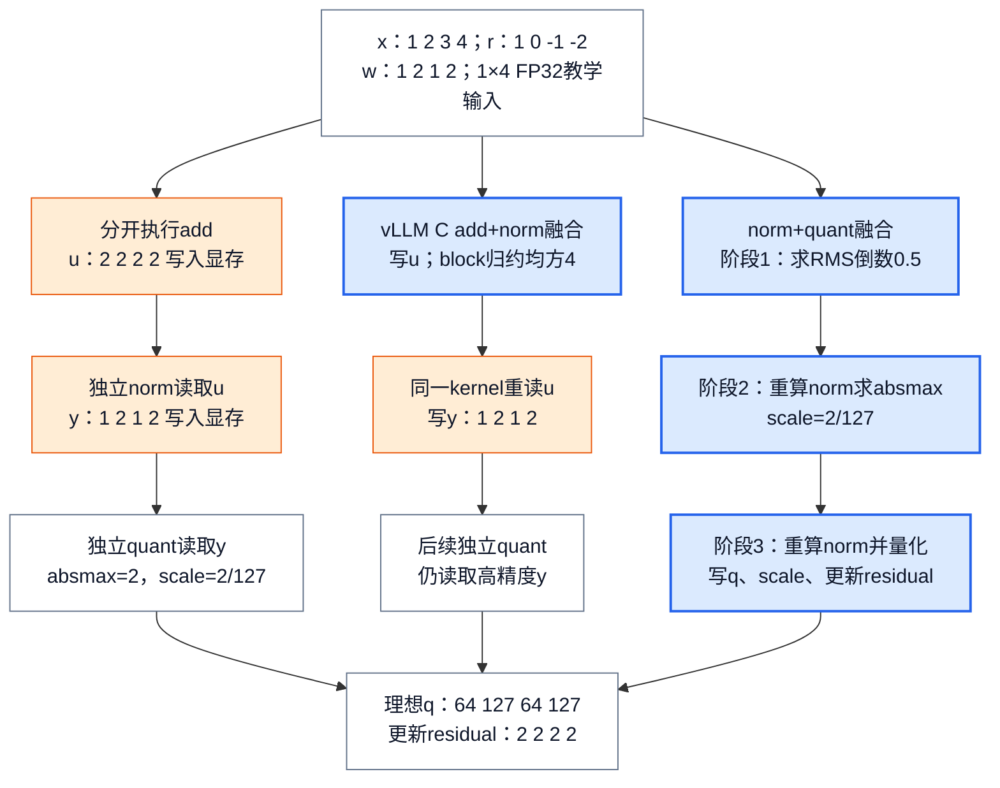
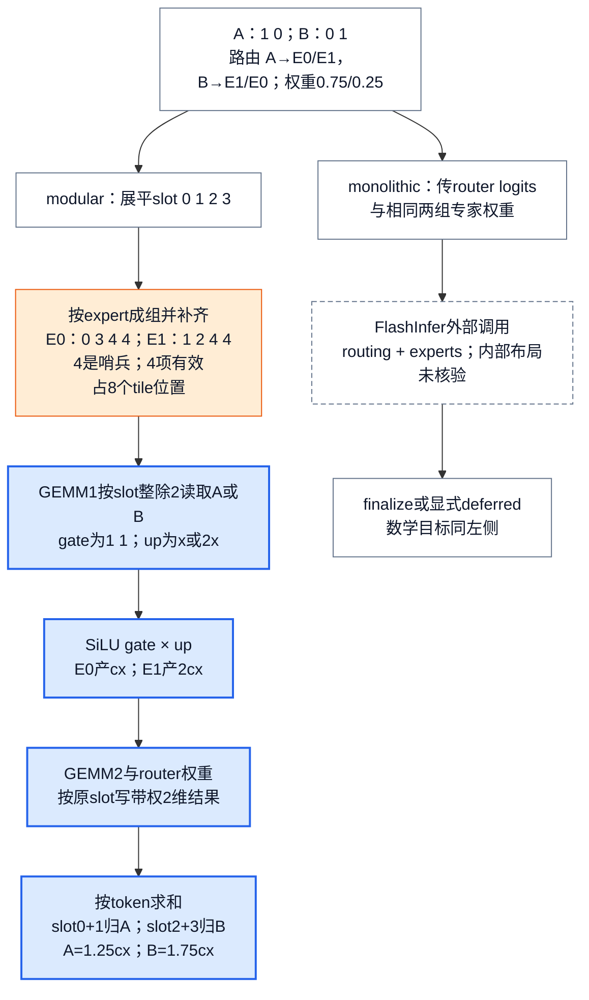

# vLLM 融合算子与 Kernel：用收益账本约束专用化与 fallback

> **源码基线**：`vllm-project/vllm@199cb9b964822e59ab9b58d88e7be31eb419a2ae`（`main`，2026-09-08）
> **主题**：用 residual+RMSNorm+quant 和两专家 MoE 重建融合改变的数值步骤、数据布局与中间存储。随后解释 provider 选择、scratch复用及失败边界。
> **适用范围**：拥有融合收益、provider/Kernel family、workspace与fallback；量化ABI归21、IR改写归25、图生命周期归23，EP通信与EPLB归22。
> **最近更新**：2026-09-08。重新核验本地kernel与选择器，补算例并纠正一次遍历、scratch命名和clamp过滤的旧结论。

## 1. 一行残差输入：融合究竟省在哪里？

一个 decode token 经过模型子层后，既要把当前输出加到 residual，还要把相加结果归一化；若下个矩阵乘法吃 INT8/FP8，则还要量化。写成三个算子容易理解，却可能多次提交短kernel并把临时tensor写回显存。**融合有价值的是少付某项执行成本，同时保留更新后的residual、归一化结果和量化尺度这些可见语义。** 一次调用里仍然可以有多遍读取、多个kernel或外部库工作。

### 1.1 先手算，再看存储

设一行隐藏状态 `x=(1,2,3,4)`，旧残差 `r=(1,0,-1,-2)`，权重 `w=(1,2,1,2)`，隐藏宽度H=4。为方便手算取 `epsilon=0`，各值按FP32算术解释；这是教学输入，不是推荐模型epsilon或实际测量。没有 `variance_size` override 时，理想实数运算为：

$$
\begin{aligned}
u_j &= x_j+r_j, & v &= \frac{1}{H}\sum_{j=1}^{H}u_j^2, \\
y_j &= u_j\,(v+\epsilon)^{-1/2}\,w_j.
\end{aligned}
$$

本例 `u=(2,2,2,2)`，平方和16、均方4、倒数平方根0.5，故 `y=(1,2,1,2)`。两个结果都必须交付：更新残差u供后续子层使用，归一化y供当前后继使用。不能只保留y而把residual副作用删掉。

若继续做对称、无 `scale_ub` 的逐token INT8量化，本例absmax为2，scale为 `2/127`；量化先除scale再最近舍入并饱和，理想结果 `q=(64,127,64,127)`。反量化后首/第三项为 `128/127`，而非精确1。一般kernel还对scale设正下界；FP8使用其格式上限与转换规则，不能把127和INT8舍入搬过去。详细scale、pack ABI见 [[21_vllm_quantization_analysis|量化设计]]。

源码中数值顺序比实数公式更具体。IR native把x与r转FP32后求和与均方，更新残差单独cast回输入dtype；归一化值先cast到weight dtype再相乘。vLLM C的 fused-add kernel先在输入标量类型形成和、写回residual，再做FP32归约与后续归一化。FP16/BF16的加法/乘法舍入点和归约宽度因此可能不同，测试按容差比对，**不是逐bit等价承诺**。该基线已支持 `weight=None` 的无权重路径；Oink不支持时可走其他provider，AITER会构造全1权重。

### 1.2 图1：相同结果，消去的中间态不同

图规格：Mermaid分支比较同一1×4输入。左路为分开的add/norm/quant，显示u、y都落地；中路为vLLM C add+norm，明确先写u、block归约、重读u后写y，再单独quant；右路为norm+quant融合，显示三个阶段在同一kernel内计算RMS、absmax/scale、重算norm并量化，最终只写q/scale和残差u。三路汇入相同理想q与u；蓝色为融合区，橙色为仍需的全局中间态。图只表示算法次序，不把框数量当实测launch数量。

右路不是把完整y永久留在寄存器：`layernorm_utils.cuh` 的三个阶段会重读input/residual，重算需要的norm值，并用block归约、shared标量和同步交换RMS/scale。它直接产出量化tensor，消掉**高精度y作为独立全局tensor的写出和下一kernel重读**，但没有消掉所有读取与归约。中路则仍落地并重读必须可见的residual；旧说法“一次traversal就完成add+norm”与当前设备代码不符。

对于本例FP32 y，单独删除一次1×4高精度tensor写出再重读，逻辑流量是 `2×4×4=32 bytes`；若输入FP16/BF16则同尺寸为16 bytes。这里只算一个指定中间态，不计cache、重复读取、权重或scale，因而不是总HBM流量或速度提升。完整kernel时间需要基准测试。

直观实现把 `add → RMSNorm → quant` 或 `route → permute → GEMM1 → activation → GEMM2 → unpermute/reduce` 分成独立 Kernel。每个边界都可能增加一次 host launch，并让生产者写出、消费者再读回中间 tensor；融合可以把局部值留在寄存器或 shared memory，也可以直接写入消费者要求的量化/布局格式。源码 benchmark 正是把 RMSNorm 后再 quant 的 unfused 函数与 fused 函数放在同一组 shape 网格中比较，而不是把“融合”当成先验胜者：输入覆盖 token 数 `1..1024`、多种 hidden size、residual 开关、dtype 与 group size，unfused 路径显式先 norm 再 quant，fused 路径则一次调用 norm+quant op。

下面的账本是基于这些实现边界的**分析推断**；源码没有提供统一公式，也没有给出跨硬件通用阈值。

| 账本项 | 融合可能得到的收益 | 同时支付的成本 | 决策时必须带上的证据 |
|---|---|---|---|
| launch | 多个短 Kernel 合并为一个 launch | 更大 Kernel 可能拉长关键路径，削弱并行/重叠机会 | 同一真实 workload 的 launch trace 与端到端时间 |
| 中间态 | 少一次完整 tensor 写回与重读；可原地复用 output/residual | alias、stride 与生命周期变严格；错误复用会破坏语义 | bytes moved、copy event、alias/stride 边界测试 |
| 格式转换 | norm/activation 后直接产出 quantized 或 backend layout | dtype、scale 粒度、block shape 与 pack 进入 Kernel ABI | reference 数值、scale/layout 与边界 shape |
| 专用化 | 针对 token 数、hidden/expert shape 和硬件 tile 调优 | 代码、配置、编译 cache、回归矩阵与维护面扩张 | 覆盖 prefill/decode 与 TP/EP-local shape 的 benchmark |
| workspace | 两阶段计算可重用 scratch，避免反复分配 | 预留显存、capture 地址与异步完成前的存活期 | workspace 上界、复用顺序与峰值显存 |

因此应比较的是**一次完整调用的总成本**，不是源码中 op 的数量。仓库自带的 MoE 默认配置 benchmark 也把 tuned、old default、new default 在相同 `M/E/N/K/topk/dtype/block_shape` 下计时，并明确输出 Kernel 时间与 speedup。这支持一个重要边界：配置变化可能改变胜者，仓库里存在 benchmark 驱动的选择依据，但源码没有发布一个可直接外推到任意部署的固定性能结论。

## 2. 为什么还要选择provider，而不总用融合kernel？

### 2.1 背景与替代方案

若模型层直接调用某个设备扩展，换硬件就要改模型；若只保留 native PyTorch，eager 路径又无法保证得到目标设备的专用布局与实现。vLLM 保留一个稳定语义边界，再让 provider 声明“在哪个平台可注册、哪些实参可执行”；`IrOp` 构造时总是注册 native implementation，并把它作为始终可用的语义实现。

这条结构胜过“一个全局 `if device` 选完所有 Kernel”，因为平台可用性和单次调用兼容性不是同一个问题。provider 注册接口把 `supported` 定义为硬件/库的静态门，把 `supports_args` 定义为 dtype/shape 等动态门，并要求每个实现保持 native 的签名与语义。这里的“为什么胜出”是依据接口分工重建的**分析推断**；源码只自陈最终合同。

### 2.2 实现机制：三层选择，不是一张名字表

| 层 | 输入 → 输出 | 拥有的决策 | 不拥有 |
|---|---|---|---|
| layer / `CustomOp` | 稳定 layer 调用 + build platform → native 或平台方法 | 类级语义、CUDA/HIP/XPU/CPU/TPU/OOT 方法；对象构造时固定平台路径 | 同一对象每步按 shape 动态换 provider |
| `IrOp` provider | 同一个语义 op + priority + 当前 tensors → compatible impl | provider priority、静态可用性、每次调用的 argument predicate、native fallback | 图中 pattern 为什么/何时被改写 |
| Kernel family / oracle | dtype/quant/layout + local shape + hardware + parallel/routing feature → concrete Kernel class/config | tile/layout、workspace、实现能力与 family 内候选顺序 | checkpoint 如何形成 pack/scale；collective 的全局语义 |

`CustomOp` 被禁用时走可选编译的 `forward_native`；启用时按当前 build platform 绑定 `forward_hip/cpu/tpu/xpu/oot/cuda`，源码明确说明这里不支持动态 platform dispatch。其注释还指出：在 opaque custom op 内部编译 native 并不能得到跨 op fusion，所以能展开时仍应展开。这解释了为何“专用 Kernel 边界”和“编译器可见边界”要同时保留，而不能把所有算子都包成 opaque op。

`IrOp` 则在 priority 中逐项检查 `supports_args`；没有显式 priority 时用 native，priority 中没有全参数 provider 时会自动在末尾补 native 并告警。平台默认还会考虑执行上下文：CUDA 在 Inductor 编译时默认 native，非 codegen 时默认 `vllm_c → native`，可选 Oink 再插到前面；ROCm 只在 CUDA Graph、AITER flags 与设备条件同时成立时把 AITER RMSNorm 提到默认前面。这是 provider 选择的执行上下文，不是 IR pass 顺序；后者仍由 [[25_vllm_ir_and_fusion_passes_analysis|IR与融合Pass]] 拥有。

### 2.3 约束：fallback 的末项必须覆盖全部实参

dispatch 热路径要求 priority 最后一项支持所有实参，否则抛出 internal-bug 异常。测试同时固定两种行为：静态 unsupported provider 在设置 priority 时被过滤；只支持偶数 shape 的 provider 对奇数 shape 自动落到 native。所以 fallback 不是捕获任意 Kernel error 后重试；它是在 launch 前依据已声明谓词选择同语义实现。

## 3. 代表族一：residual + RMSNorm（再接 quant）

### 3.1 背景与为什么值得融合

residual add 与 RMSNorm 都逐元素读取同一 token row；若分开执行，add 的完整输出既要落地又要被 norm 重读。当前vLLM C实现把add与norm的launch合并，但仍先写残差、归约后重读残差并写norm output；再把 quant 合入时，还可避免materialize高精度norm output。这里关于带宽收益的因果链是**分析推断**，其执行边界可由 benchmark 的 unfused/fused 对照直接核验。

融合不允许省掉可见语义。native reference 要求 residual 输出等于 `x + residual`，norm 输出等于该和的 RMSNorm；测试跨 token 数、hidden size、FP16/BF16/FP32 核验 shape/dtype/device 与数值。每个 provider 还必须与 native 结果相符，并验证 priority dispatch 与直接调用一致。

### 3.2 provider 选择怎样暴露真实边界

同一个 `fused_add_rms_norm` 不是“检测到 GPU 就调用最快扩展”这么简单：

- vLLM C provider 要求没有 `variance_size` override、存在weight时与activation dtype匹配，并声明 inplace；ROCm 遇到非 contiguous 输入时明确调用 native 后再 copy 回输入，而不是把不合法 stride 交给设备 Kernel。
- AITER provider 额外只接受 FP16/BF16 activation，且同样拒绝 `variance_size` override。
- Oink provider 要求可视为二维、weight contiguous、input/residual shape 与 dtype 相同，必须存在weight，并满足256-bit vectorization stride；它同样声明 inplace。

这些 guard 展示了融合的代价：为了少一次 launch/中间态，Kernel 把 dtype、stride、shape 与 alias 写入合同。测试不是只测一个 happy path；provider 注册表按平台核对 native/vLLM C/AITER/Oink 的可用性，并要求所有设备 provider 拒绝 `variance_size` override。不满足时应选择 native 或另一个 compatible provider；若调用者强行绕过 `supports_args`，就不再属于安全 fallback 路径。

### 3.3 一次 residual + RMSNorm 怎样落到设备 Kernel

这里有两次不同的 dispatch，不能合并理解：`CustomOp` 决定 model layer 走哪个平台入口，`IrOp` 再为这一组真实实参选择 provider。以已启用 CustomOp、非 batch-invariant、带 residual 的 CUDA 调用为例：

1. `CustomOp.forward()` 调用初始化时绑定的 `_forward_method`；平台 dispatch 在 CUDA 上绑定 `RMSNorm.forward_cuda()`，而该方法在普通路径继续进入 `forward_native()`。这里的“native”是可编译的语义入口，不等于最终一定执行 PyTorch reference。
2. `RMSNorm.forward_native()` 看到 residual 后调用 `ir.ops.fused_add_rms_norm.maybe_inplace(x, residual, weight, eps, variance_size)`，一次返回 normalized output 与更新后的 residual。调用者在这里声明 alias 可接受，但还没有承诺某个 provider 一定能 inplace。
3. `IrOpInplaceOverload._inner_call()` 把真实 dtype、shape、stride 和可选参数交给 `IrOp.dispatch()`；dispatcher 按 priority 调 `supports_args`，返回第一个兼容实现，最后没有全覆盖实现则视为内部配置错误。所以 fallback 发生在 launch 前，不是设备 Kernel crash 后重跑 reference。
4. 若命中 vLLM C provider，谓词先确认没有 `variance_size` override 且 weight dtype 兼容；ROCm 非 contiguous 还会在 provider 内转 native-copy 路径，高维ROCm contiguous输入先view成2D，执行后恢复原shape；其余支持情形才调用 `torch.ops._C.fused_add_rms_norm()` 并返回被原地更新的两个 tensor。

这条链之所以分两层，是因为平台/build 决定“哪些入口存在”，而每次调用的 stride、dtype 与可选参数决定“这次哪个实现合法”。把 capability 检查塞进设备 Kernel 只能更晚失败；把 provider 固定在 model layer 又会失去按实参安全 fallback 的能力。

设备内部还有一层“同family内退化”，不是退回native。`csrc/libtorch_stable/layernorm_kernels.cu::fused_add_rms_norm` 在hidden size、行stride均整除8且指针对齐16 bytes时可选向量化；不满足则用generic版本。每个CUDA block处理一个token，线程分担hidden维的平方和，CUB block reduction得到均方再同步。通常token数跨256时会把最大block线程数从1024改为256；batch-invariant模式固定1024且关闭这条向量分支，以固定求和次序，说明更高occupancy和可复现性可能冲突。

norm+quant入口另有明确guard：输出只接受当前平台FP8或INT8，output须contiguous，input末维stride=1，weight/input/residual dtype一致，scale为FP32，residual须contiguous；`scale_ub`只允许FP8。groupwise路径还要求hidden/stride/group_size满足向量化整除条件，并可转置scale存储。这里的异常来自 `_C` 入口检查，并不经过前面的IR provider fallback。

vLLM C与上述norm+quant的CUDA源码已打开；CUB归约原语、PyTorch执行器，以及AITER、Oink、FlashInfer/CUTLASS外部包内部实现未在本轮展开。对外部provider，本页能证明的是本地predicate、传入的tensor/参数和输出合同，不能据此声称它内部使用同一遍数、layout或launch数量。

### 3.4 何时这类融合可能不划算

这是依据账本作出的**分析推断**：token row 很少时，省 launch 往往更重要；tensor 很大时，省 HBM 中间态更重要；但若 native/codegen 能把周边 op 一起优化，固定 opaque provider 反而可能丢掉更大的跨 op 机会。与此相呼应，CUDA 在 Inductor 模式默认 native，而在无 codegen 时优先 vLLM C。最终阈值必须测量：仓库 benchmark 遍历 token、hidden、dtype、residual 与 group-size 组合，并把 fused/unfused 放进同一个 timer，没有源码证据支持“一条 provider priority 对所有 shape 都最优”。

## 4. 代表族二：fused MoE 是组合收益，不是单个巨型 Kernel

### 4.1 两个token经过两个专家：先复算设备算法

固定单卡、未量化、无LoRA/shared experts/bias，`apply_router_weight_on_input=False`。输入两行 `A=(1,0)`、`B=(0,1)`，隐藏宽度K=2，每专家中间宽度d=2；第一组权重 `w1` 形状为2×4×2（gate/up沿输出维拼接），第二组 `w2` 为2×2×2。

把两个专家的gate矩阵都设为全1矩阵，up矩阵分别为I与2I，down矩阵都为I。于是每个输入的gate均为 `(1,1)`；令 $c=\operatorname{SiLU}(1)=1/(1+e^{-1})$，专家0输出为cx，专家1输出为2cx。这是可以逐步代入的教学权重，**小尺寸用于解释语义，不认证硬件tile支持**。

routing已经给出 `topk_ids=((0,1),(1,0))`，`topk_weights=((0.75,0.25),(0.75,0.25))`。将token×topk展平后，slot0=A→E0、slot1=A→E1、slot2=B→E1、slot3=B→E0。四个slot不是四个用户token，而是同一输入参与的四次专家计算。

`moe_align_block_size` 把slot按expert成组并补齐tile。为了看清padding，设示意 `BLOCK_SIZE_M=4`：一种合法索引排列是 `E0:(0,3,4,4)`、`E1:(1,2,4,4)`，其中4为 `topk_ids.numel()`，是非法slot哨兵；`num_tokens_post_padded=8`，每个block的expert_ids分别为0、1。实际kernel允许同expert内部顺序不同，测试比较分组集合而不强制稳定排序。

本例不满足稀疏分配条件，因此走align路径。Triton GEMM1读取这些索引，以 `slot//topk` 找原始输入行，按expert选择w1；它无需先复制完整activation到连续expert矩阵。两个投影一起产出gate/up，SiLU(gate)×up把4维降回2维，再由GEMM2乘w2。GEMM2在FP32 accumulator上乘对应router weight，随后cast到输出dtype，并按原slot号写回。最后 `moe_sum` 以FP32累加每个token的两个slot再cast回输出dtype：

$$
\begin{aligned}
y_A &= 0.75\,c(1,0)+0.25\,(2c)(1,0)=1.25\,c(1,0), \\
y_B &= 0.75\,(2c)(0,1)+0.25\,c(0,1)=1.75\,c(0,1).
\end{aligned}
$$

因此“combine”在这条单卡Triton路上是把已带权的slot按原token相加；不是必须先unpermute整块tensor，更不能再乘一次router weight。Triton声明 `TopKWeightAndReduceNoOP`，后续finalize只需保留/复制已归约输出。其他family若把weight与sum留到finalize，就必须使用对应delegate合同；`apply_router_weight_on_input`在本地prepare中仅允许topk=1，不能把权重随意移到非线性之前。

### 4.2 图2：按专家成组，但按原slot写回

图规格：Mermaid以相同A/B和routing开头。左路展开modular Triton：四slot→两expert block含哨兵→GEMM1 gate/up→SiLU乘法→GEMM2带权按slot存储→每token求和。右路为monolithic对照：输入对应router logits与同一权重，跨虚线框交给FlashInfer routing+experts，再由finalize返回相同数学目标；右路不伪造外部库内部排列。橙色标padding与scratch成本，蓝色标真实算术转换；图无网络箭头，EP通信由22负责。

右路可以用两行logits `(log 3,0)`、`(0,log 3)` 表示相同softmax routing目标，前提是provider选用对应的renormalize routing规则。`TrtLlmBf16ExpertsMonolithic.apply` 把logits、expert weights、topk、routing method、activation和 `do_finalize` 传给 `flashinfer.fused_moe.trtllm_bf16_moe`。该BF16 family本地能力门要求Blackwell及扩展可用；上面的K=2示意没有在它上面运行，右路只比较语义交接，不能认为它内部也存在左图的8-slot布局。

`_prepare_expert_assignment`另有稀疏启发式：无expert_map且 `num_tokens×topk×4 <= global_num_experts`（并排除特定WNA16 block量化）时，跳过排序，每个slot独占一个M tile，其余行被mask。保持同样A/B路由、把可用专家数增到16就会满足该式，仍算这四次专家输出，但用更多tile空位换掉align工作；这不是本图E=2的执行分支。

左路的收益不是减少专家数学工作：topk=2仍需每token做两次expert MLP。它用按expert的tile分组复用权重、用索引gather省显式大规模activation重排、用gate/up合并投影以及GEMM2 epilogue带权减少额外调用。代价是padding、索引存取、activation与两次GEMM之间的scratch。以上为源码执行结构上的成本推断，实际HBM命中率、占用率和耗时未测。

### 4.3 为什么保留modular与monolithic两条路

MoE 同时包含 routing、token 重排/通信、两次 expert GEMM、activation、router weight 与 combine/reduce。monolithic family 可以把 router 和 experts 一起消费，减少接口与中间态；modular family 则可独立组合 prepare/finalize 与 expert compute，并让 async all-to-all 或 shared experts overlap。源码把 monolithic `apply` 的输入提升为 router logits，并说明该形式用于 fused router+experts；modular 路径在 prepare 支持 async 时启动 async prepare、注册/执行 receive hook，再取得已重排 activation 与 metadata。

“总用 monolithic 以最小化 launch”会把 routing method、all-to-all、quantization、parallel mode 与 shared expert 能力锁进同一实现；“全部拆开”则放弃更深融合。源码没有写出这段备选论证，以上为**分析推断**。现行边界证明它选择兼容两者，但禁止随意混搭：prepare/finalize 与 experts 必须同为 monolithic 或同为 modular，否则构造直接报错。

### 4.4 oracle 不是按名称选，而是对部署谓词求交

MoE Kernel 的通用 `is_supported_config` 依次检查当前设备、gated activation、具体 activation、weight/activation quant scheme、parallel config、routing method、router-logits dtype、hidden shape、activation format、batch invariance 与 LoRA。因此决定 provider 的不是一个 `moe_backend` 字符串，而是至少以下状态：

| 决策维度 | 它为什么可能改变最佳或合法 family | 代表证据 |
|---|---|---|
| hardware/library | CUDA、ROCm、XPU、CPU 提供的 family 不同；同一 CUDA 世代也可能重排优先级 | unquantized oracle 在 ROCm 以 AITER 开头，在 CUDA 以 FlashInfer/Triton family 候选开头，且 Hopper 默认把两个 FlashInfer BF16 候选后移 |
| dtype/quant/layout | provider 必须消费既有 weight/activation quant key 与 activation format | FP8 oracle 先构造 quant-specific family priority，再按 DeepEP layout、Hopper TP/EP 与平台重排 |
| local shape | TP 改写 partition 后的 intermediate size 可能触发对齐 guard | BF16 TRT-LLM LoRA 要求 per-partition intermediate size 为 128 的倍数，否则回 Triton |
| routing/parallel | monolithic router、EP/DP、all-to-all 与 batched activation format 必须一起兼容 | oracle 从 parallel config 先决定 standard/batched activation format，再逐 class 调 `is_supported_config` |
| feature contract | clamp、LoRA、batch invariance 或 deferred finalize 不能被静默遗漏 | config注释声称应过滤不支持SwiGLU clamp的backend，但通用实现没有对应字段检查，见下文冲突 |

普通auto分支依priority逐个检查class，返回第一个 compatible candidate；全都失败才抛 `NotImplementedError`。普通非LoRA选择循环中，显式指定backend的语义不同：指定family不兼容时立即 `ValueError`，不会悄悄换成用户未指定的 family。测试固定了两种代表 fallback：FlashInfer TRT-LLM monolithic 不支持但 modular 支持时留在同 family 改选 modular；DeepEP high-throughput 与该 BF16 path 不兼容时，auto退到Triton。

新基线unquantized oracle还会因DP场景的已知问题后移FlashInfer CUTLASS，并把SWIGLUOAI下两个FlashInfer候选后移；这是带注释的选序修补，不是通用性能定理。LoRA分支在普通显式family循环之前返回，另有128对齐门；`moe_backend=humming`对未量化层当作auto处理。因此不能把“任何显式名字不兼容都报错”外推到这些特例。

> [!contradiction] clamp配置注释与通用能力检查不一致
> `FusedMoEConfig.swiglu_limit`注释称不支持clamp的backend会被 `FusedMoEExperts.is_supported_config` 过滤；当前通用函数检查activation枚举等条件，却没有读取该clamp字段。已读的Triton路径在 `activation` 中实现clamp，不能由此推广到所有provider。旧页将注释写成统一运行时保证，现予纠正：选择特定clamp模型时还需核对provider的实际激活参数与reference；本页没有认证外部family的全部clamp组合。

当前Triton实现也包含更窄的融合：gated SiLU、FP8 W8A8、block shape为 `[128,128]`、无LoRA且未用E8M0时，将SiLU+Mul+FP8 block quant合为 `silu_and_mul_per_block_quant`；其他情况仍分开activation与quant。LoRA需要高精度activation参与低秩增量，正是不能无条件丢弃该中间态的具体原因。Triton family当前还拒绝按32补齐后专家数达到1024的配置；拒绝发生在oracle能力检查，不必等到align kernel出错。

### 4.5 workspace 与中间态复用：少一次 copy 仍要付显存合同

modular expert interface 要求 provider 根据 `M/N/K/topk/global/local experts/activation format` 报告两块 scratch 与最终 output shape；第一和第三阶段中间态不同时存活，允许复用scratch，但具体哪块叫workspace13由provider决定。allocator接口分别接收chunk/full M来计算scratch与最终output；当前 `_fused_experts` 调用把二者都传为M_full。它让workspace13与最终output共享较大buffer，workspace2同时独立存活。

具体 `TritonExperts.apply` 把GEMM1的 M×topk×2d 和GEMM2的 M×topk×K 都view到workspace2，而activation的 M·topk×d 放workspace13，最后输出可复用common workspace。这纠正了按“13”名字推断所有实现都把GEMM1/3放同名buffer的说法。

这能减少分配和峰值，但不是“零中间态”：workspace2 仍必须与 common workspace 同时存活，provider 还必须准确报告上界。output buffer 只有 shape、dtype、device 与 contiguous 全部相符才满足 `use_output_alias`；满足后，非 ROCm 直接 alias，ROCm 还必须启用 AITER fused MoE 才 alias。源码注释说明这条路径用于去掉下游冗余 copy。所以 workspace/alias 优化的失败边界不是性能稍差而已：低估shape或过早复用在逻辑上会破坏计算；本页未注入越界故障，不承诺自动恢复，错用 output alias 会改变可见结果。

### 4.6 一次 modular / monolithic MoE 调用怎样闭环

`FusedMoEKernel` 不是一个直接 launch 的巨型 op，而是先在构造期固定 family，再让不同 family 使用各自完整闭环。构造函数只接受 prepare/finalize 与 experts **同时**为 modular 或同时为 monolithic；混搭立即失败。这是因为两类路径交付的中间表示不同，不能只替换中间 GEMM。

modular 路径的执行链是：

1. `FusedMoEKernel.apply()` 只允许 modular impl，并把 `topk_ids/topk_weights` 等交给 `FusedMoEKernelModularImpl.apply()`。
2. `_prepare()` 调用同步 `prepare()`，或在支持时启动 `prepare_async()`、处理 receive hook/DBO yield，再取得重排或量化后的 activation、scale 与 expert-token metadata。异步不是省略 prepare，而是显式延后接收完成点以创造 overlap。
3. `_fused_experts()` 根据实际 problem size 分配 workspace，只有 shape/dtype/device/contiguous 全匹配才允许 output alias，然后调用选定 experts provider 的 `apply()` 完成两次 expert GEMM 与 activation。
4. `_finalize()` 再执行同步或异步 combine/reduce；async 路径可在等待期间插入 shared experts，最后必须调用 receiver 完成输出。顶层 `apply()` 严格按 `_prepare → _fused_experts → _finalize` 返回可见 tensor。

monolithic 路径则由 `apply_monolithic()` 把 router logits 直接交给 monolithic impl；impl 的 `prepare()` 形成输入表示，experts `apply()` 同时消费 routing 与 weights，最后 `finalize()` 提交结果。只有 provider 显式返回 `UnfinalizedMoEOutput` 且 prepare/finalize 声明支持 deferred finalize 时，完成点才允许外移。

因此 modular 的可替换边界是三个显式阶段，换来 all-to-all/shared-expert overlap 与组件组合；monolithic 把 routing/expert 边界收进同一 family，换来更深融合。二者都必须完整拥有 prepare 与 finalize，不能用“中间 Kernel 跑完了”冒充 MoE layer 已完成。

## 5. Selection 与 fallback：从“候选”到“可证明的实现”

### 5.1 推荐的选择顺序

1. **先固定语义**：output、可见 residual、dtype/scale/layout、router/reduce 状态与 alias 必须由 native/reference 或上层合同定义；provider 无权改写。
2. **过滤静态可用性**：平台、compute capability、扩展库与 build 决定 family 是否进入候选；unsupported provider 在 priority 安装时就过滤。
3. **过滤部署能力**：量化 key、parallel/routing、LoRA、batch invariance、activation format 与 hidden shape 共同决定 MoE class 能否实例化。
4. **检查每次调用实参**：普通 `IrOp` 再按 dtype、shape、stride 等 `supports_args` 选择 provider。
5. **在 compatible 集合内比较性能**：用真实 prefill/decode、TP/EP-local shape、CUDA Graph/async 条件测端到端，不用单个名字或单点 microbenchmark 替代部署分布。

第 5 步是本页依据 benchmark 结构给出的**分析建议**：RMSNorm benchmark 显式扫 shape/dtype/residual，MoE benchmark 的配置键显式包含 `M/E/N/K/topk/dtype/block_shape`。源码未实现一个统一 runtime autotuner，因此不能声称 vLLM 会为每次调用现场测出全局最快 Kernel。

### 5.2 四种结果必须区分

| 结果 | 正确行为 | 为什么不是同一类“fallback” |
|---|---|---|
| provider 静态不可用 | 从 priority 移除，再看下一项 | 当前进程根本没有可调用实现 |
| 当前实参不兼容 | 调用前选下一 provider，通常最终 native | 同一 op 的 shape/dtype/stride 局部边界 |
| auto MoE family 不兼容 | oracle 尝试下一 compatible family | 部署策略允许自动选择，语义与 quant/layout 合同仍不变 |
| 普通显式family分支不兼容或auto全候选失败 | `ValueError` / `NotImplementedError` | 静默改 family 会违背用户意图；没有同合同实现时不存在安全 fallback |

fallback 之后仍必须过 reference。融合 RMSNorm 测试以 native 为 oracle，对每个支持 provider 比较两个输出；不兼容参数先 skip，不把 crash 当作选择逻辑。MoE selection 测试则分别覆盖 platform 默认、显式 family、monolithic→modular 和跨 family fallback。

## 6. 约束、维护成本与验收

| 风险 | 必须守住的不变量 | 代价或失败边界 | 验收方式 |
|---|---|---|---|
| 省中间态改变数值 | fused output 与 reference 在该 dtype 容差内等价；可见 residual/reduce 状态不丢 | fusion boundary 可能改变 rounding；不能只看最终文本 | 每 provider reference 对照、边界 dtype/shape |
| inplace/alias | 只有声明并满足 shape/dtype/device/stride/lifetime 才复用 | 不兼容时 out-of-place/native；错误 alias 是 correctness bug | alias 与非 contiguous case、copy trace |
| tile/pack 特化 | TP/EP-local shape、block quant 与 provider layout 匹配 | padding、次级 family 或硬失败 | 不整除、空 token、最小/最大 token 测试 |
| workspace | scratch 上界正确，异步完成前保持存活，capture 时地址稳定 | 多占显存；错误复用会越界或读旧值 | 峰值显存、sanitizer/event、graph replay |
| provider 扩张 | 每个实现都维护语义、predicate、fake/compile/capture 与性能回归 | 新 provider 增加测试/配置/cache invalidation 面 | priority/filter 测试 + reference + 真实 workload benchmark |

维护成本也是收益账的一部分。IR provider 实现被 Dynamo 隐藏，因此 priority config 的 hash 还要显式纳入各实现 UUID，避免实现变化却复用旧 compile cache；worker初始化导入当前平台IR kernel并安装priority。新增 provider 若只交一个快的 Kernel、却不补 argument predicate、reference 测试和 cache identity，就没有完成集成。

提交前的最小验收顺序应是：

1. native/reference 定义两个实现必须共同保持的数值、shape、dtype、layout 与副作用；
2. provider predicate 覆盖 hardware、dtype、shape、stride、parallel/routing 和 feature flags；
3. fallback 测试证明每个拒绝分支选择下一 compatible 实现或清楚硬失败；
4. workspace/alias 在 eager、compile/CUDA Graph 与 async 条件下验证生命周期；
5. 最后才用真实 workload 对比 launch、HBM/copy、workspace 峰值、Kernel time 与端到端 TPOT。

## 7. 有源码锚点的发展方向

> [!note] 分析推断
> 这里只从当前 TODO/临时分支外推维护压力，不把它写成已承诺 roadmap。

- unquantized MoE oracle 自陈：当前必须“偷看” prepare/finalize 才能决定 batched/standard activation format，等 TP 与 DP/EP selection 统一后可先选 prepare/finalize。这说明选择器正承受组件耦合压力；合理方向是让 format contract 更早成为显式输入，而不是继续在 provider 名单里堆特例。
- CUDA 的 Oink 环境变量被标注为待移除，用户可直接使用 IR op priority。这指向一个更统一的 provider policy 面：平台提供默认，用户修改 priority，而 capability predicate 仍负责 correctness。

## 8. 继续读源码与验证

本轮实际打开以下入口及关键分支，未运行GPU kernel、provider benchmark、CUDA Graph/async/多卡实验。公式与两个小例是手工按规则重建，未作为真实硬件性能数据。

| 机制 | 稳定读码路线与测试 |
|---|---|
| RMSNorm数值和层入口 | `vllm/ir/ops/layernorm.py::fused_add_rms_norm / rms_norm`；`vllm/model_executor/layers/layernorm.py::RMSNorm.forward_native / forward_cuda`；`tests/kernels/ir/test_layernorm.py::TestFusedAddRMSNorm.test_native_semantics / test_impls` |
| 本地add+norm设备算术 | `vllm/kernels/vllm_c.py::fused_add_rms_norm`；`csrc/libtorch_stable/layernorm_kernels.cu::fused_add_rms_norm / fused_add_rms_norm_kernel` |
| norm+quant三阶段 | `csrc/libtorch_stable/quantization/fused_kernels/fused_layernorm_dynamic_per_token_quant.cu::rms_norm_dynamic_per_token_quant_kernel / rms_norm_dynamic_per_token_quant`；`csrc/libtorch_stable/quantization/fused_kernels/layernorm_utils.cuh::compute_rms / compute_dynamic_per_token_scales / norm_and_quant`；同目录 `quant_conversions.cuh::float_to_int8_rn / ScaledQuant`；`tests/kernels/core/test_fused_quant_layernorm.py::test_rms_norm` |
| 三层provider选择 | `vllm/model_executor/custom_op.py::CustomOp.dispatch_forward`；`vllm/ir/op.py::IrOp.dispatch / _filter_priority_impls / IrOpInplaceOverload._inner_call`；`vllm/kernels/oink_ops.py::oink_add_rms_supported`；`vllm/kernels/aiter_ops.py::rms_add_no_var_16bit_only`；`tests/ir/test_op.py::TestIrOpImplDispatch.test_supports_args_runtime_dispatch_and_warning` |
| 平台默认与cache身份 | `vllm/platforms/cuda.py::CudaPlatformBase.get_default_ir_op_priority`；`vllm/platforms/rocm.py::RocmPlatform.get_default_ir_op_priority`；`vllm/config/kernel.py::IrOpPriorityConfig.compute_hash / _iter_op_priorities`；`vllm/v1/worker/worker_base.py::WorkerBase.__init__` |
| MoE排序与设备算术 | `vllm/model_executor/layers/fused_moe/moe_align_block_size.py::moe_align_block_size`；`vllm/model_executor/layers/fused_moe/experts/triton_moe.py::TritonExperts.apply / workspace_shapes / moe_sum`；`vllm/model_executor/layers/fused_moe/fused_moe.py::_prepare_expert_assignment / fused_moe_kernel / invoke_fused_moe_triton_kernel`；`tests/kernels/moe/test_moe_align_block_size.py::torch_moe_align_block_size / _verify_expert_level_sorting`；`tests/kernels/moe/test_moe.py::test_fused_moe / test_moe_sum` |
| modular组合、scratch与finalize | `vllm/model_executor/layers/fused_moe/modular_kernel.py::FusedMoEKernel.__init__ / FusedMoEKernelModularImpl._allocate_buffers / _prepare / _fused_experts / _finalize`；`vllm/model_executor/layers/fused_moe/prepare_finalize/no_dp_ep.py::MoEPrepareAndFinalizeNoDPEPModular.prepare / finalize`；`vllm/model_executor/layers/fused_moe/topk_weight_and_reduce.py::TopKWeightAndReduceNoOP.apply / TopKWeightAndReduceContiguous.apply` |
| monolithic外部边界与选择 | `vllm/model_executor/layers/fused_moe/experts/trtllm_bf16_moe.py::TrtLlmBf16ExpertsMonolithic.apply`；`vllm/model_executor/layers/fused_moe/modular_kernel.py::FusedMoEKernelMonolithicImpl.apply / FusedMoEExperts.is_supported_config`；`vllm/model_executor/layers/fused_moe/oracle/unquantized.py::_get_priority_backends / select_unquantized_moe_backend`；`vllm/model_executor/layers/fused_moe/oracle/fp8.py::_get_priority_backends`；`tests/kernels/moe/test_unquantized_backend_selection.py::test_select_cuda_flashinfer_trtllm_modular_backend / test_select_cuda_deepep_ht_falls_back_from_trtllm` |
| 成本比较入口 | `benchmarks/fused_kernels/layernorm_rms_benchmarks.py::get_bench_params / unfused_int8_impl / fused_impl`；`benchmarks/kernels/benchmark_moe_defaults.py::benchmark_config` |

陌生读者应能先复算u/y/q，再从四个routing slot重建两个token输出；实际验证则先跑语义/guard测试，再测支持shape下的provider数值、scratch/capture生命周期与benchmark。EP的dispatch/combine、shared专家重叠、EPLB及在线换权布局约束继续到 [[22_vllm_distributed_inference_analysis|分布式推理]] 与 [[29_vllm_weight_transfer_online_update_analysis|在线权重更新]]，不能把单卡算例外推为分布式完成保证。

## Related Pages

- [[02_engineering/03_infer_frameworks/vllm/21_vllm_quantization_analysis|vLLM 量化设计]] — 拥有 weight/scale/zero 与 pack ABI；本页从已提交的表示接手 Kernel family 选择。
- [[02_engineering/03_infer_frameworks/vllm/25_vllm_ir_and_fusion_passes_analysis|vLLM IR 与融合 Pass]] — 拥有 pattern、alias/functionalization、pass 顺序与 lowering；本页只解释其产物怎样选择 provider。
- [[02_engineering/03_infer_frameworks/vllm/23_vllm_compilation_cudagraph_analysis|vLLM 编译与 CUDA Graph]] — 解释 native/codegen、opaque op、workspace 地址与 capture/replay 的生命周期边界。
- [[02_engineering/03_infer_frameworks/vllm/14_vllm_attention_backends_analysis|vLLM Attention Backend]] — attention metadata/KV layout 的能力协商在此；本页不把 attention backend 重列成 Kernel family。
- [[02_engineering/03_infer_frameworks/vllm/22_vllm_distributed_inference_analysis|vLLM 分布式推理]] — 拥有 TP/DP/EP 与 collective 顺序；本页只使用 local shape 和 parallel feature 作为 Kernel compatibility 输入。
