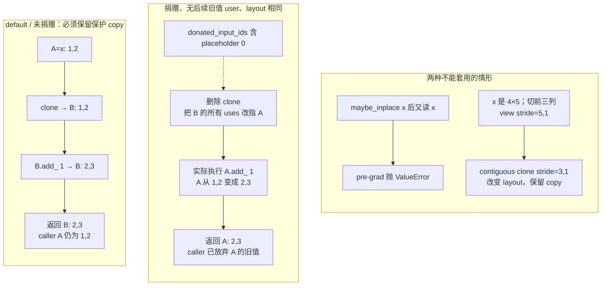
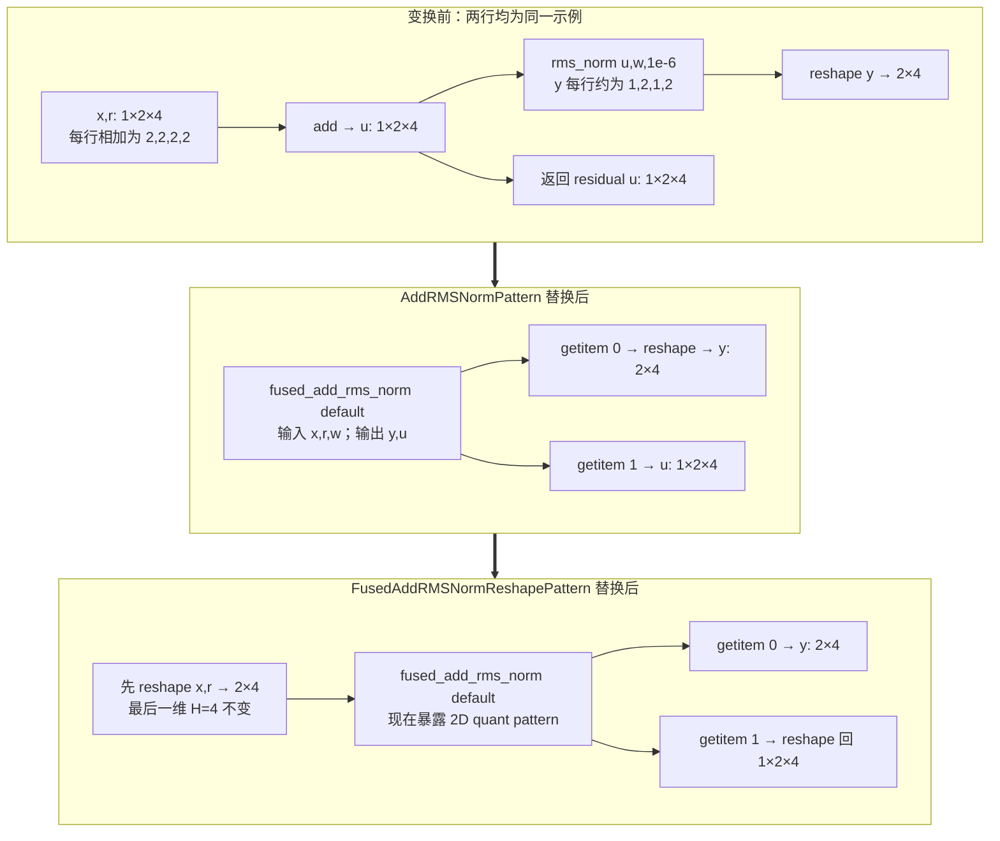
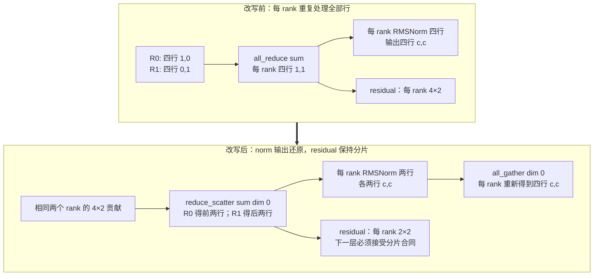

# vLLM IR 与融合 Pass：让语义先稳定，再让实现安全落地

> **读者问题**：同一个 RMSNorm、量化或 attention 片段可能有 native、设备 Kernel 与融合实现；其中一些还会覆盖输入。vLLM 怎样让图改写先看到稳定语义，又怎样约束 donation、alias 与 pass 顺序，哪些安全性仍未获得一般证明？
> **源码基线**：`vllm-project/vllm@199cb9b964822e59ab9b58d88e7be31eb419a2ae`（`main`，2026-09-08）。
> **主题**：IR 图变换、donation 与 lowering 的正确性边界。
> **中心命题**：vLLM IR 不是另造一套脱离 FX 的执行后端，而是在 FX 中保留一层“语义已定、实现未定”的 dialect：native reference、schema、fake result 与 mutation 声明先固定 observable contract；pre-grad pass 把 `maybe_inplace` 收敛为 functional op 并传递 donation 证据；post-grad passes 只在各自的 shape、dtype、能力和 compile-range 前提内改写；最后 lowering 对 inplace provider 先插 clone，再由受限的 clone elimination 回收局部冗余 copy；它尚不是一般 alias 证明。
> **适用范围**：本页拥有 IR stable semantics、donation / alias metadata、functionalization、canonicalization / fusion / lowering 顺序及其正确性边界。whole-model dynamic-shape 分区、compile/cache/capture/replay 生命周期归 [[02_engineering/03_infer_frameworks/vllm/23_vllm_compilation_cudagraph_analysis|vLLM 编译与 CUDA Graph]]；某个 provider、Kernel family 的收益、workspace 与硬件选择归 [[02_engineering/03_infer_frameworks/vllm/24_vllm_fused_ops_and_kernels_analysis|vLLM 融合算子与 Kernel]]。
> **最近更新**：2026-09-08。重新核对源码与测试；补入双输出图变换、buffer 状态重放、SP 的 shape 改写与未解决的 alias / scale 边界。

## 1. 从一个 residual block 看为什么要延迟选择实现

一次模型计算刚得到 branch `x=(1,2,3,4)`，旧 residual 为 `r=(1,0,-1,-2)`，权重 `w=(1,2,1,2)`。先相加得到 `u=(2,2,2,2)`，再沿最后一维做 RMSNorm；用当前 pattern 注册的 `epsilon=1e-6`，FP32 手算得到 `y≈(0.999999875,1.999999750,0.999999875,1.999999750)`。这个 block 必须交给下一层**两个结果 `(y,u)`**：只把 norm 输出保留下来，会丢掉 residual 链。

现在有两个独立问题。图改写能否把 `add → rms_norm` 收敛为一个仍返回 `(y,u)` 的 IR 节点？稍后选到会写输入的 C provider 时，调用者还需要旧的 `x,r` 吗？前者决定 matcher 看见什么，后者决定是否必须复制输入。IR 把这两项决定分开；减少 IR 节点本身不保证少一个 GPU kernel，真正的实现与中间内存成本见 [[02_engineering/03_infer_frameworks/vllm/24_vllm_fused_ops_and_kernels_analysis|融合算子与 Kernel]]。

这里的四元素例子是**根据本地 reference 手算的语义缩影**，不是实际 BF16 pattern trace / GPU 运行记录。`AddRMSNormPattern.get_inputs` 用 BF16 `(5,16)` tracing，测试用 `(2,7,32)`；低精度 add 的舍入点与 fused reference 的 FP32 add 并不完全相同，因此正确性目标是规定容差内一致，不能由下面的实数值推出逐 bit 相等（`vllm/ir/ops/layernorm.py::fused_add_rms_norm`；`vllm/compilation/passes/fusion/add_rms_fusion.py::AddRMSNormPattern`）。

### 1.1 先选 Kernel 会让图失去共同语言

模型层需要表达“这是 RMSNorm”“这个 activation 可以交出旧值”“attention 的 KV 副作用仍然存在”；设备层却需要按 dtype、shape、平台和扩展库选择实现。如果模型 forward 直接固定某个 opaque Kernel，后续 fusion 要为每个 provider 重写 pattern；如果只留下低层 ATen 展开，vLLM 特有的语义边界和可选 mutation 又容易在 trace 形式变化中消失。官方设计因此把 vLLM IR 定义为 FX 内可与普通 torch/custom op 共存的 functional dialect，并把“延迟 Kernel 选择”列为让 fusion 只匹配一个高层 op 的主要理由（`docs/design/vllm_ir.md::Motivation / Compilation Pipeline / The maybe_inplace Overload`）。

直观替代有两个：一是模型直接选择设备实现，二是让 pass 从任意低层图重新猜回高层意图。源码没有记录一场完整的方案评审；以下判断是**分析推断**：前者减少一次抽象，却把平台选择提前并扩大 fusion pattern 数；后者保留 compiler 自由，却把 correctness 依赖于低层图恰好长成某种形式。当前结构选择的是中间点——语义 op 对 Dynamo 保持 opaque，fusion 在 lowering 前消费它，而实现直到 fake metadata 已知才被选中（`docs/design/vllm_ir.md::Motivation / Compilation Pipeline / The maybe_inplace Overload`）。

## 2. Stable semantics：IR 节点承诺什么，不承诺什么

### 2.1 一个 op 的四层合同

| 合同层 | 输入 → 输出 | 它固定的不变量 | 拒绝或边界 | 承重证据 |
|---|---|---|---|---|
| native reference | Python tensors / scalars → reference tensors | 数学语义、输出数目、dtype/shape 的 reference 行为；`fused_add_rms_norm` 明确返回 norm 与 residual 两个结果 | reference 是正确性基线，不是性能承诺 | `vllm/ir/ops/layernorm.py::rms_norm / fused_add_rms_norm` |
| torch schema + fake | native signature → `vllm_ir` op 与 fake result | 默认 overload 被注册为无 mutation 的 `CompositeExplicitAutograd` op；fake 默认直达 native，也可单独覆盖 | keyword-only 参数因 lowering 不接收 kwargs 而在注册时拒绝 | `vllm/ir/op.py::IrOp / IrOpImpl / IrOpInplaceOverload` |
| implementation registration | provider function + capability predicates → 同语义候选 | provider schema 必须与 native 的参数名、类型和默认值完全一致；`inplace=True` 只能挂在允许 inplace 的 op 上 | schema、`supports_args` 签名或 inplace 能力不合同时在注册阶段失败 | `vllm/ir/op.py::IrOp / IrOpImpl / IrOpInplaceOverload` |
| dispatch policy | priority + 当前实参 → 一个实现 | priority 顺序是 policy；`supported` 是静态可用性，`supports_args` 是当前实参兼容性 | priority 末尾没有覆盖全部实参的实现时抛错；设置 priority 时则过滤静态 unsupported 并在需要时补 native | `vllm/ir/op.py::IrOp / IrOpImpl / IrOpInplaceOverload` |

这四层把“同名”升级成可检查的合同。注册时的 schema 等价只证明调用形状一致，不自动证明数值等价；`supports_args` 也只决定候选是否合法，不证明它比别的实现更快。数值、layout 与 provider 性能验证属于 reference tests 和 page 24 的 Kernel 选择账本，本页只拥有这些证据何时进入 IR/lowering。

### 2.2 为什么 default overload 必须保持 functional

`IrOp._inner_call` 无论 dispatch 到 functional 还是 inplace provider，都通过 `func_impl_fn` 执行 default overload；若 provider 声明 inplace，后者先 clone 所有 activation 参数，再调用真实实现，所以 default 的输入值在调用后仍可观察（`vllm/ir/op.py::IrOp / IrOpImpl / IrOpInplaceOverload`）。相反，`maybe_inplace` 直接调用实现，不插 clone（`vllm/ir/op.py::IrOp / IrOpImpl / IrOpInplaceOverload`）。

这不是两个可能返回不同数学结果的 API：二者共享 native schema 与 provider 集合；差异只是调用者是否交出 activation 的旧值。layer 只有在 residual 路径上显式调用 `maybe_inplace`，无 residual 路径仍使用 default op（`vllm/model_executor/layers/layernorm.py::RMSNorm.forward_native`）。因此 donation 是调用点的所有权声明，不是 provider 私自猜测“这个 tensor 看起来没用了”。

## 3. Donation 与 alias：明确表达，但只在受限范围内证明

### 3.1 `maybe_inplace` 表达的不是“现在一定原地写”

创建 inplace overload 时，IR 先要求 Tensor 输出数等于 activation 数，并限制当前只支持纯 Tensor outputs；随后用 `mutates_args=activations` 推导 mutation schema（`vllm/ir/op.py::IrOp / IrOpImpl / IrOpInplaceOverload`）。实现再用 `inplace=True` 声明自己会复用 activation storage；不支持 inplace 的 op 不允许注册这种实现（`vllm/ir/op.py::IrOp / IrOpImpl / IrOpInplaceOverload`）。官方语义说明得更强：`maybe_inplace` 的输出**可能** alias activation，而调用后继续读取被捐赠输入属于 undefined behavior（`docs/design/vllm_ir.md::Motivation / Compilation Pipeline / The maybe_inplace Overload`）。

这里要区分三个层次：

1. mutation schema 告诉 PyTorch 这些 activation 可能被写；
2. donation 告诉 vLLM 调用者不再需要旧值；
3. 某个 provider 的 `inplace=True` 才决定本次实现确实复用 storage。

把三者合成“`maybe_inplace` 一定 alias 第一个输出”会越过源码合同。当前代码只约束 activation 与输出数量相同，没有建立任意 view、storage offset 或跨节点 alias 的一般证明。

### 3.2 pre-grad functionalization 消费并产出什么

`VllmIRInplaceFunctionalizationPass` 在 AOTAutograd 前运行，消费含 `maybe_inplace` 的非规范 FX 图，产出只含 default IR overload 的 functional 图，同时把被捐赠的 graph placeholder 索引写入 `PassContext.donated_input_ids`（`vllm/compilation/passes/ir/inplace_functionalization.py::VllmIRInplaceFunctionalizationPass.__call__`）。backend 把它安装到 `pre_grad_custom_pass`，post-grad manager 另走 Inductor 的 post-pass hook，因此 donation 证据能先于 AOTAutograd 建立（`vllm/compilation/backends.py::VllmBackend.configure_post_pass`）。

它的拒绝条件是拓扑化且明确的：对每个 activation 参数，若任何 user 位于 `maybe_inplace` 节点之后，编译直接抛 `ValueError`，并要求改用 default overload 或先 clone（`vllm/compilation/passes/ir/inplace_functionalization.py::VllmIRInplaceFunctionalizationPass.__call__`）。测试构造 `x` 捐赠后再次参与加法的模型，确认异常被 compiler 包装后仍以 “used again” 失败，而不是静默退回 out-of-place（`tests/compile/passes/ir/test_inplace_functionalization.py::test_inplace_functionalization / test_maybe_inplace_reuse_error`）。

> [!note] 代码与设计文档的语境差异
> design doc 把捐赠后复用概括为 undefined behavior（`docs/design/vllm_ir.md::Motivation / Compilation Pipeline / The maybe_inplace Overload`）；冻结源码的 compile path 已把这个边界收紧为 pre-grad 硬拒绝。两者并不等价：eager `maybe_inplace` 仍直调实现，而 compile path 才有这项图级 later-user 检查（`vllm/ir/op.py::IrOp / IrOpImpl / IrOpInplaceOverload`；`vllm/compilation/passes/ir/inplace_functionalization.py::VllmIRInplaceFunctionalizationPass.__call__`）。

### 3.3 clone elimination 不是一般 alias analysis

lowering 对 inplace implementation 调 `func_impl_fn`，所以先得到保护性 clones；`UnsafeCloneEliminationPass` 再决定哪些 clone 可移除（`vllm/compilation/passes/ir/lowering_pass.py::VllmIRLoweringPass`；`vllm/ir/op.py::IrOp / IrOpImpl / IrOpInplaceOverload`）。它按以下局部检查回收 copy；检查通过不构成一般 alias 证明：

- clone 不改变 stride 与 storage offset；缺 metadata 时默认视为 layout preserved，已知 layout 改变则保留（`vllm/compilation/passes/ir/clone_elimination.py::clone_preserves_layout / user_writes_to_node / UnsafeCloneEliminationPass`）；
- clone 被写时，original 在该 write 后不能再有 user（`vllm/compilation/passes/ir/clone_elimination.py::clone_preserves_layout / user_writes_to_node / UnsafeCloneEliminationPass`）；
- clone 被写且 original 是 graph input 时，必须出现在 pre-grad 传来的 donated-input set，否则保留 clone；只有 read-only users 的 clone 不要求 donation（`vllm/compilation/passes/ir/clone_elimination.py::clone_preserves_layout / user_writes_to_node / UnsafeCloneEliminationPass`）；
- unknown higher-order op 默认视作可能写，只有已知 functional wrapper 例外（`vllm/compilation/passes/ir/clone_elimination.py::clone_preserves_layout / user_writes_to_node / UnsafeCloneEliminationPass`）。

最重要的失败边界写在类注释里：该 pass “unsafe” 正因为**尚未考虑 aliasing**，只服务已知 vLLM 图，simple view alias 仍是 open problem（`vllm/compilation/passes/ir/clone_elimination.py::clone_preserves_layout / user_writes_to_node / UnsafeCloneEliminationPass`）。测试把边界固定为可观察行为：donated input 的 mutating clone 会移除，non-donated graph input 的 clone 会保留；两者分别允许与禁止 caller input 被覆盖（`tests/compile/passes/ir/test_clone_cleanup.py::TestCloneCleanup / TestCloneCleanupWithDonatedInputs`）。另一个测试确认 materialize compact layout 的 clone 必须保留（`tests/compile/passes/ir/test_clone_cleanup.py::TestCloneCleanup / TestCloneCleanupWithDonatedInputs`）。

所以这里的安全不是“alias 问题已经解决”，而是“在没有一般 alias 证明时，把优化框在 donation、拓扑 user、write schema 与 layout equality 的交集里”。遇到 view-rich 新图时，默认做法应是保留 clone 或扩充证明与反例测试，而不是扩大无条件删除范围。

### 3.4 图 1 规格：删掉一次 clone 后，究竟谁的内存被改了

用 `test_donated_input_clone_removed` 的最小图重放状态：`x=(1,2)` 存在 buffer A，clone 产生独立 B，随后 `B.add_(1)` 返回 `(2,3)`。不把它冒充 RMS kernel；这个测试隔离的正是 lowering 之后能否删 copy 的问题。左右两路输入值相同，区别只在 placeholder 0 是否捐赠。图中 A/B 是符号化 storage 身份，虚线是编译期证据，实线是运行中的读写，末框同时展示返回值与 caller 的输入状态。

对于 §1 的 `vllm_c` fused norm，`func_impl_fn` 先 clone 两个 activation，再由 provider 把 norm 和 residual 写回克隆；若两输入合法捐赠且所有局部检查通过，clone elimination 可以让两个输出直接复用原 activation storage。这个结果来自具体 inplace provider；native provider仍可新建输出，`maybe_inplace` 本身没有承诺固定输出 alias 次序。

读图时还须保留两个不对称边界。第一，没有后续图内 user 并不足以覆盖**未捐赠的 graph input**，因为 caller 在图外仍能观察旧值。第二，`x[:, :3].contiguous()` 即使数值不变也有布局用途：原 `(4,5)` 的前三列 stride 为 `(5,1)`，紧凑输出为 `(3,1)`，删掉 clone 会改变消费者看到的 layout。相反，metadata 缺失或读取 stride/offset 抛异常时，当前 helper 返回 `True`，不会自动保守保留；这和不跟踪隐藏 view alias 一样，是现行实现的限制。

## 4. Pass pipeline：顺序本身就是正确性协议

### 4.1 图 2 规格：同一组值与两个输出如何跨过 canonicalization

问题是 add 与 reshape 如何改变 matcher 的输入形态。输入固定为两行相同的 §1 数据，`x,r` 为 `(1,2,4)`；观察 `y` 的最终 `(2,4)` 和 `u` 的最终 `(1,2,4)`。左框保留相加和 norm，中央收敛为一个双输出 IR，右框把 prefix flatten 前移，但把 residual reshape 回原形。实线表示值的消费；粗箭头表示编译期替换，绝不是一次运行依次执行三套计算。判断标准是两输出的值及调用方 shape 都保留。

第一步为 `branch+residual` 和 `residual+branch` 各注册 pattern，epsilon 只有 `1e-5`、`1e-6`。第二步只合并前缀维度，RMS 的每行 H 个元素和 weight 对齐方式没变，所以可以把 norm 前后的 flatten 对调；fused 版本须显式恢复 residual 的原 shape。若把 H 一起展平，例如将 `(1,2,4)` 变成 `(1,8)`，归一化会跨行混合，已不是这项变换。这里只保证值/shape 合同，不承诺 reshape 一定零拷贝；layout 是否需要 materialize 要交给后续实现。

`test_add_rmsnorm_reshape_fusion` 对两种加法次序运行 eager 与 compiled 对比，并检查 add / RMS 被 fused IR 替换；`test_rmsnorm_reshape_fusion` 还检查 RMS 的输入确实变成 reshape。它们支持这项具体变换，不是任意数值精度、extra users 或轴变换的一般证明。

这里的图只是 post-grad 中的一段。`VllmBackend.configure_post_pass` 先安装 pre-grad donation functionalization；`PostGradPassManager.__call__` 的实际顺序是执行已配置 passes → cleanup → IR lowering → clone elimination → cleanup → final defunctionalization。前者建立可传递的 donation 证据，后者在所有 IR-level matcher 结束后才固定 provider。

### 4.2 每一阶段消费与产出的不变量

| 阶段 / pass | 消费的不变量 | 产出的不变量 | 拒绝、skip 或范围边界 | 为什么必须在这里 |
|---|---|---|---|---|
| `VllmIRInplaceFunctionalizationPass` | activation 参数能定位为 FX node；`maybe_inplace` caller 已放弃旧值 | default IR overload；placeholder donation IDs | later user 硬失败；未知 overload assert | AOTAutograd 与后续 matcher 只需处理 functional IR（`vllm/compilation/passes/ir/inplace_functionalization.py::VllmIRInplaceFunctionalizationPass.__call__`） |
| `NoOpEliminationPass` | reshape/slice 带 fake shape metadata | 只删除静态可证 shape-equivalent 的 reshape、slice、slice-scatter | rank 不同或 symbolic equality 不可静态证明就不删 | 先移除 pattern noise，且 sequence-parallel replacement 也依赖它清掉中间残片（`vllm/compilation/passes/utility/noop_elimination.py::NoOpEliminationPass`；`vllm/compilation/passes/fusion/sequence_parallelism.py::SequenceParallelismPass`） |
| `SequenceParallelismPass` → `AsyncTPPass` | whole graph 中的 all-reduce → RMSNorm / quant 链；compile range 足够大 | reduce-scatter → local norm / quant → all-gather，再暴露 GEMM 通信融合机会 | piecewise mode assert；threshold 未建立或 range 太小就 skip | `AsyncTPPass` 明确建立在 SP 之后且同样要求 full graph（`vllm/compilation/passes/fusion/sequence_parallelism.py::SequenceParallelismPass`；`vllm/compilation/passes/fusion/collective_fusion.py::AsyncTPPass.is_applicable_for_range`） |
| `AddRMSNormFusionPass` | Transformers backend 发出的 add → `rms_norm`，epsilon 为已注册值 | canonical `fused_add_rms_norm` IR | exact traced pattern 不匹配即保持原图 | 先把 backend-specific 展开收敛成后续 collective / quant pass 的共同语言（`vllm/compilation/passes/fusion/add_rms_fusion.py::AddRMSNormPattern / AddRMSNormFusionPass`） |
| router-pad / all-reduce-RMS / RMS reshape | 更具体的 fused-add consumers 与 collective 链 | 最具体融合先消费；其余 RMS reshape 前移以暴露 quant pattern | platform、workspace、world size、dtype 与 compile-range 不满足则 disabled / skip | manager 明确要求 router-pad 先于 AR+RMS，AR+RMS 又先于 reshape 和 RMS+Quant（`vllm/compilation/passes/pass_manager.py::PostGradPassManager`）；FlashInfer AR 还受 TP、workspace 与最大 token 数约束（`vllm/compilation/passes/fusion/allreduce_rms_fusion.py::AllReduceFusionPass`） |
| RMSNorm+Quant / Activation+Quant | functional IR norm/activation 后接已知 quant contract | auto-functionalized fused custom op，保留显式 result / scale outputs | pattern 只为已注册 quant key 构造；输入与 weight dtype 不同或 traced pattern 不同则不融合 | dtype `extra_check` 防止 mixed-dtype RMS 替换；activation replacement 同样显式保留 functionalized result（`vllm/compilation/passes/fusion/rms_quant_fusion.py::_rms_input_weight_dtype_match / RMSNormStaticQuantPattern`；`vllm/compilation/passes/fusion/act_quant_fusion.py::SiluMulFp8StaticQuantPattern`） |
| split coalescing / scatter-split replacement | 相同 input 与 split sizes；functionalized RoPE 的 getitem/slice-scatter 形状 | canonical split 与直接的 rotated q/k users | non-getitem users、split sizes 不同或目标 user 形态不同则保留 | 这些是 QK-Norm/RoPE/KV patterns 的前置 canonicalization，不是通用 DCE（`vllm/compilation/passes/utility/split_coalescing.py::SplitCoalescingPass`；`vllm/compilation/passes/utility/scatter_split_replace.py::ScatterSplitReplacementPass`） |
| RoPE/KV、QK-Norm/RoPE/KV、MLA、attention+quant families | canonical functional side-effect graph、layer capability 与 dummy dependency | 合并后的 mutating op，仍携带 KV dependency 与 output buffers | head dim、value dim、backend capability、quant scheme 或 compile-range 不符时不注册/不应用 | manager 只按配置注册这些 specialized families（`vllm/compilation/passes/pass_manager.py::PostGradPassManager`）；attention+quant 显式携带 `kv_cache_dummy_dep` 并只为支持 fused output quant 的 layer 注册（`vllm/compilation/passes/fusion/attn_quant_fusion.py::AttnFp8StaticQuantPattern / AttnQuantFusionPass`）；RoPE/KV 只在小 batch range 应用（`vllm/compilation/passes/fusion/rope_kvcache_fusion.py::RopeKVCacheFusionPass`） |
| first `PostCleanupPass` | fusion matcher 可能留下非拓扑或 dead artifacts | stable topological order、无 dead IR | 此时尚未恢复 final inplace wrappers | dead IR 若先 lowering，会制造无用实现节点；manager 因此在 lowering 前先 cleanup（`vllm/compilation/passes/utility/post_cleanup.py::PostCleanupPass.__call__`；`vllm/compilation/passes/pass_manager.py::PostGradPassManager`） |
| `VllmIRLoweringPass` | 只含 default vLLM IR；每个 node 有 fake `meta val`；无 kwargs | provider implementation graph；inplace impl 外围有保护 clone；记录 node → provider | dispatch predicate 无实现时失败；未降低的 IR 节点会被汇总告警 | 所有 IR-level fusion 已完成后才固定实现；replacement 禁止 functional DCE，因为 traced impl 可能 mutation（`vllm/compilation/passes/ir/lowering_pass.py::VllmIRLoweringPass`） |
| `UnsafeCloneEliminationPass` | lowering 产生的 clones、write schema、donation IDs 与 fake layout | 只删除局部可证明冗余的 clone | layout 变化或 write 后旧值仍用时保留；会写的 non-donated placeholder clone 保留；unknown HOP 先按 writer 检查 | donation 证据只有此时才能对应到 lowering 实际插入的 copy（`vllm/compilation/passes/ir/clone_elimination.py::clone_preserves_layout / user_writes_to_node / UnsafeCloneEliminationPass`） |
| second cleanup → `FixFunctionalizationPass` | lowered graph 与残余 auto-functionalized wrappers | DCE 删除 dead lowered artifacts；随后目标 allowlist 恢复 inplace custom op | XPU skip；非 allowlist wrapper保留；defunctionalization 后禁止再 DCE | fix pass 自己声明必须最后运行，因为恢复 mutation 后相关 node 可能看似 dead；manager按此固定顺序（`vllm/compilation/passes/utility/fix_functionalization.py::FixFunctionalizationPass`；`vllm/compilation/passes/pass_manager.py::PostGradPassManager`） |

### 4.3 为什么“更具体的 pass 先跑”是语义和覆盖问题

pattern replacement 会消费节点。若一个宽 pattern 先吃掉 `fused_add_rms_norm`，更具体的 router-pad 或 all-reduce+RMS pattern 就再也看不到完整链；反过来，先让具体 pattern 消费它，未匹配的剩余节点仍可交给宽 pattern。当前 manager 把这项依赖写成注释和实际 append 顺序：router-pad → all-reduce+RMS → reshape canonicalization → RMS+quant（`vllm/compilation/passes/pass_manager.py::PostGradPassManager`）。这不是“后一个 pass 总能补救”的优化排序，而是 match coverage 的偏序。

Sequence parallelism 还展示了更强的顺序依赖：matcher 从图尾向前替换时，临时 residual slice 在中间状态可能对已缩小的前层输出语义不成立；源码保证图不会在该状态执行，并由 pass 内部 NoOp cleanup 在 compile 前删掉这些 slice（`vllm/compilation/passes/fusion/sequence_parallelism.py::SequenceParallelismPass`）。因此插入新的中间 pass 时，作者必须证明它不会观察或执行这种过渡态。

### 4.4 图 3 规格：SP 改写为什么必须连 residual 一起改

观察 first-layer pattern，两个 TP rank 各有 `(4,H)` 的局部 GEMM 贡献。用 H=2 的缩小示例：rank 0 四行均为 `(1,0)`，rank 1 四行均为 `(0,1)`，weight 为 `(1,1)`，epsilon 为 `1e-6`。all-reduce 后每行均为 `(1,1)`，norm 后每行均为 `(c,c)`，`c=1/sqrt(1+1e-6)`。图中所有 collectives 都沿 token 维 `dim=0`；实线是执行数据流，粗箭头表示编译期替换。验收对象为两 rank 都得到完整 norm `(4,2)`，同时注意 residual 从完整 `(4,2)` **有意变成 rank-local `(2,2)`**。H=2 仅解释语义；正常设备阈值不会选择这个玩具规模。

`FirstAllReduceRMSNormPattern.register` 的返回值确实从 `(rmsnorm, all_reduce)` 变为 `(all_gather, reduce_scatter)`。逐行 RMS 不依赖其他 token，因而可在 reduce-scatter 后计算；all-gather 按原 token 顺序恢复 norm 输入给下一段 GEMM。每 rank 的 norm 行数从 4 降到 2，但多出显式分片/聚合并不自动保证加速；源码强调它为后续 `AsyncTPPass` 的 GEMM+通信融合准备图形态。collective 的实现与 rank 语义由 [[02_engineering/03_infer_frameworks/vllm/22_vllm_distributed_inference_analysis|分布式推理]] 接手。

这不是可把任意局部子图单独替换的等价式：residual 的内部合同已改变，所以 `SequenceParallelismPass.is_applicable_for_range` 对 piecewise splitting 硬 assert，只允许 Inductor partition 或空 `splitting_ops` 的 whole graph；range.start 必须达到有效 `sp_min_token_num`。当前自动阈值在 H100/Blackwell 要 hidden size 至少 8192，per-GPU 数据阈值分别为 8/32 MiB；XPU 使用 4096 和 8 MiB，其他能力可能返回 `None`。pass 还把 token 阈值钳到 scheduler 的 max batch tokens。实际是否启用以该配置值和 range 为准，不由玩具图决定。

`test_sequence_parallelism_pass` 打开了四处 replacement 与 collective 节点计数验证；本次读到的执行断言没有 eager 数值对照，不能把它写成分布式数值等价测试。`test_sequence_parallelism_pass_requires_full_graph_compilation` 覆盖 whole-graph 限制。源码还保留从尾向前替换时 residual slice 的临时不合法状态，须在该 pass 内 NoOp cleanup 后才能进入编译；不能在中间阶段执行图来“抽查结果”。

## 5. Fusion safety：pattern 命中不是数学证明

vLLM 的通用 `VllmFusionPatternMatcherPass.register` 用 fake mode trace pattern、replacement 与 example inputs，再交给 Inductor pattern matcher；pass UUID 同时包含 pass class 与每个 replacement class（`vllm/compilation/passes/vllm_inductor_pass.py::VllmFusionPatternMatcherPass.register`）。这提供了结构相等和可 trace 性，却不自动证明所有实参上的数值与副作用等价。

因此一个 fusion 的安全边界来自三层共同收窄：

1. **结构门**：完整 functional pattern 必须命中；KV dummy dependency、getitem、output buffer 与 mutation wrapper不能被忽略。attention+quant 就把 `kv_cache_dummy_dep` 从 pattern 原样带进 replacement（`vllm/compilation/passes/fusion/attn_quant_fusion.py::AttnFp8StaticQuantPattern / AttnQuantFusionPass`）。
2. **静态能力门**：只为 backend 自陈支持的 layer / quant scheme 注册 pattern；找不到 attention layer 时只注册零个 pattern并告警（`vllm/compilation/passes/fusion/attn_quant_fusion.py::AttnFp8StaticQuantPattern / AttnQuantFusionPass`）。
3. **实参与 range 门**：extra checks 比较 dtype，pass 的 `is_applicable_for_range` 再按 token interval决定是否运行；QK-Norm+RoPE+KV 还拒绝 unsupported head dim 与 `head_size_v != head_size`（`vllm/compilation/passes/fusion/rms_quant_fusion.py::_rms_input_weight_dtype_match / RMSNormStaticQuantPattern`；`vllm/compilation/passes/fusion/qk_norm_rope_kvcache_fusion.py::QkNormRopeKvCacheFusionPass`）。

不满足这些门时，正确结果通常是“保持未融合 functional graph”，不是强行选另一个 fused provider。是否有未融合/native execution path由 op contract与 page 24 负责；本页只要求 pass 的 non-match 不破坏原语义。

同样可以用输出 buffer 重建 quant fusion。`RMSNormStaticQuantPattern` 原图为 `rms_norm(x,w) → quant(y,scale)[0]`；replacement 按 `x.shape` 新建 quant dtype 的 `result`，把 `result,x,w,scale,epsilon` 交给 `auto_functionalized(FUSED_OP)`，取 `at[1]` 作为输出。若 x 为 `(2,4)`，这个结果仍为 `(2,4)`，scale 仍是同一个输入；被消去的是高精度 y 的显式节点/物化机会，具体 kernel 的遍历与舍入见 page 24。`SiluMulFp8StaticQuantPattern` 则把输入末维 2d 变成输出 d，并保留 scale。没有末维收缩或 scale 账本的“只少一个节点”不足以描述这项替换。

attention+static-FP8 的改写是另一种输出合同：原先 attention 写高精度 `output_attn` 后 reshape 并 quant；replacement 新建 FP8 `(T,num_heads,head_size)` output，把同一个 scale 作为 `output_scale` 传入 attention，再 reshape 为 `(T,num_heads*head_size)`。`kv_cache_dummy_dep` 仍从原图流入该 attention 节点，不能因它不参加数值运算就删除，否则 KV 写与读的先后可能失去图依赖。当前 `AttnQuantFusionPass` 除 static FP8 外，还会在 CUDA 且 `_C.scaled_fp4_quant` 存在时按 capability 注册 NVFP4 pattern；类注释“currently only static fp8”已经窄于实际注册逻辑。PyTorch 新版的 layer-name wildcard 分支只为匹配结构注册一次，不能把静态能力检查的边界从源码推成所有混合 backend layer 都已独立证明。

两个已知窄处决定读者不能把 non-match 一概解释成已证安全的 fallback：

- `SplitCoalescingPass.__call__` 的 key 只比较同一 input 和相同 split sizes，**没有比较 split dim**；已读 `test_split_coalescing` 的三个 split 全是 `dim=-1`。它服务这种 QKV 图；不同轴的同 size split 并非数学等价，本次未运行反例，也没有证据可将此 pass 宣称为通用跨轴 CSE。
- `test_fusion_rmsnorm_quant` 对 BF16 + DeepGEMM UE8M0 路径显式 skip：注释记录 B200 packed int32 scale 与当前 FP32-scale pattern / fused output layout 不一致时会有 NaN，TODO 要同时补 packed scale 输出与 pattern。**这是未覆盖路径及已记录风险，不是 runtime 拒绝或自动回退的证明**。scale ABI 继续由 [[02_engineering/03_infer_frameworks/vllm/21_vllm_quantization_analysis|量化设计]] 与 page 24 管理。

### 5.1 `FixFunctionalizationPass` 的特殊风险

最终 pass 不是一般 reinplacing solver，而是一个目标 allowlist。源码对 rotary embedding 的 direct path 明说“理论上不应盲做，但在 vLLM 实际图中可行”，并把更好的长期方案指向 auto-functionalization v2 与 Inductor builtin reinplacing（`vllm/compilation/passes/utility/fix_functionalization.py::FixFunctionalizationPass`）。这是本页必须保留的限制：新增 mutating op 不能因为“同样是 auto-functionalized”就自动加入；它需要明确 mutated-arg mapping、getitem replacement、no-DCE ordering 与正反例测试。

## 6. Lowering 与 cache identity：实现选择必须可重复

lowering 对每个 IR node 读取 fake args，复用 eager dispatch 的 priority / `supports_args` 逻辑，补齐 default args，再 trace 所选 implementation replacement（`vllm/compilation/passes/ir/lowering_pass.py::VllmIRLoweringPass`）。测试用三个 RMSNorm 节点固定这项行为：两个普通节点选请求 provider，带 `variance_size` 的节点因谓词不支持而选 native；测试要求 lowered、unlowered 与重复执行的结果保持一致（`tests/compile/passes/ir/test_lowering.py::test_lowering_rms_norm`）。

这段测试不能推出所有 provider 都支持无 weight：`vllm/kernels/oink_ops.py::oink_rms_supported` 明确要求 `weight is not None`，所以 Oink 可用并进入测试参数集时，第二个节点按当前 dispatch 应选 native，与测试统一期望请求 provider 的断言存在张力。本轮未执行该依赖组合；实际选择以 `supports_args` 为准，这个入口需要连同谓词阅读。

实现选择也是 cache correctness 的一部分。lowering UUID 包含每个 IR op 的 priority 与 priority 中 implementation source UUID；post-grad manager UUID 再包含 pass config、实际 pass 序列、两次 cleanup、lowering、clone elimination、final functionalization 及 compile range（`vllm/compilation/passes/ir/lowering_pass.py::VllmIRLoweringPass`；`vllm/compilation/passes/pass_manager.py::PostGradPassManager`）。测试确认只改变 fusion config 或重复添加同一个 pass 都会改变 manager UUID（`tests/compile/passes/test_pass_manager.py::test_pass_manager_uuid`）。

因此“pass 顺序或 provider priority 改了，但复用旧 compiled artifact”不是允许的性能优化。它会让可观察实现与配置不一致；这里的 UUID 将已列举的 policy、pass 类与 implementation 文件内容纳入 identity；它不证明任意外部依赖或环境变化都已纳入 hash。whole-model cache 文件如何建立与复用仍归 page 23，本页只拥有 pass/lowering 对 cache identity 的贡献。

## 7. 验收：按不变量测，而不是只看 match count

| 风险 | 必须验证的正例 | 必须验证的反例 / 边界 | 现有证据 |
|---|---|---|---|
| stable semantics | eager/default、unlowered/lowered 在容差内一致 | provider schema、`supports_args` 签名不一致时注册失败 | `tests/ir/test_op.py::test_bad_impl_registrations`；`tests/compile/passes/ir/test_lowering.py::test_lowering_rms_norm` |
| donation | `maybe_inplace` graph input 可把 protective clone 回收 | 捐赠后 later use 编译失败；default overload 仍保留输入 | `tests/compile/passes/ir/test_inplace_functionalization.py::test_inplace_functionalization / test_maybe_inplace_reuse_error` |
| alias / clone | mutating clone：donated input、无 post-write old-value user 且 layout 相同才可消 clone；纯读 clone 不要求 donation | mutating non-donated placeholder、layout-changing clone 保留；unknown HOP 按 writer 分支处理 | `tests/compile/passes/ir/test_clone_cleanup.py::TestCloneCleanup / TestCloneCleanupWithDonatedInputs` |
| fusion | exact pattern、capability、dtype 与 range 满足时 replacement 命中且数值对 reference | 近似 pattern、多余 user、mixed dtype、unsupported head dim / backend、阈值外 range不命中 | guards 分布在 `vllm/compilation/passes/fusion/rms_quant_fusion.py::_rms_input_weight_dtype_match / RMSNormStaticQuantPattern`、`vllm/compilation/passes/fusion/qk_norm_rope_kvcache_fusion.py::QkNormRopeKvCacheFusionPass` 与各 pass tests |
| ordering | 记录各 pass match summary，并检查 lowering 前后图不再残留 IR | 交换 specific / broad pass、在 final defunctionalization 后跑 DCE 应被测试禁止 | `vllm/compilation/passes/pass_manager.py::PostGradPassManager`；`vllm/compilation/passes/utility/fix_functionalization.py::FixFunctionalizationPass` |
| cache identity | 相同 config/source/range 生成稳定 UUID | pass 序列、fusion config、provider priority 或 impl source变化必须失效 | `tests/compile/passes/test_pass_manager.py::test_pass_manager_uuid`；`vllm/compilation/passes/ir/lowering_pass.py::VllmIRLoweringPass` |

**陌生读者自检**：不用记类名，也应能从图 1 判断返回值相同为什么仍可能非法覆盖 caller 输入，从图 2 写出两个返回值及其 shape，从图 3 发现 residual 已改变合同、解释为什么不能 piecewise 替换。如果只能说出 pass 调用顺序，还未重建这些变换的正确性边界。

### 7.1 从入口到反例的稳定源码路线

下表是本轮实际重新打开的承重文件与测试，路径相对冻结源码 checkout；`::` 后是搜索符号，不依赖易漂移行号。

| 顺序 | 源码入口 | 读完应能回答 / 已读测试 |
|---|---|---|
| 1 | `vllm/ir/ops/layernorm.py::rms_norm`、`fused_add_rms_norm` | reference 的 FP32 累加、weight cast、两个输出；不是 bitwise 等价担保 |
| 2 | `vllm/ir/op.py::IrOp.__init__`、`IrOpImpl.func_impl_fn`、`IrOpInplaceOverload` | schema/fake 与 default copy；`tests/ir/test_op.py::test_bad_impl_registrations` |
| 3 | `vllm/compilation/passes/fusion/add_rms_fusion.py::AddRMSNormPattern`、`FusedAddRMSNormReshapePattern` | 两输出和 prefix-flatten；`tests/compile/passes/test_rmsnorm_reshape_fusion.py::test_add_rmsnorm_reshape_fusion` |
| 4 | `vllm/compilation/passes/ir/inplace_functionalization.py::VllmIRInplaceFunctionalizationPass.__call__` | donation set 与 later-use hard fail；`tests/compile/passes/ir/test_inplace_functionalization.py::test_maybe_inplace_reuse_error`、`test_piecewise_compilation_with_donated_buffers` |
| 5 | `vllm/compilation/passes/ir/clone_elimination.py::UnsafeCloneEliminationPass`、`clone_preserves_layout` | A/B 的状态与 layout 反例；`tests/compile/passes/ir/test_clone_cleanup.py::TestCloneCleanup`、`TestCloneCleanupWithDonatedInputs` |
| 6 | `vllm/compilation/passes/fusion/sequence_parallelism.py::FirstAllReduceRMSNormPattern`、`SequenceParallelismPass` | residual 分片、阈值、临时 slice；`tests/compile/passes/distributed/test_sequence_parallelism.py::test_sequence_parallelism_pass` |
| 7 | `vllm/compilation/passes/fusion/rms_quant_fusion.py::RMSNormStaticQuantPattern`、`vllm/compilation/passes/fusion/attn_quant_fusion.py::AttnFp8StaticQuantPattern` | scale / output / KV dependency；`tests/compile/passes/test_fusion.py::test_fusion_rmsnorm_quant` 的 packed-scale skip |
| 8 | `vllm/compilation/passes/ir/lowering_pass.py::VllmIRLoweringPass` | fake dispatch、保护 clone、UUID；`tests/compile/passes/ir/test_lowering.py::test_lowering_rms_norm` |
| 9 | `vllm/compilation/passes/pass_manager.py::PostGradPassManager`、`vllm/compilation/passes/utility/fix_functionalization.py::FixFunctionalizationPass` | 实际顺序和 final mutation；`tests/compile/passes/test_pass_manager.py::test_pass_manager_uuid` |

**验证范围**：本轮为源码/测试阅读、手算与文档图渲染检查，未运行 vLLM CUDA/ROCm/XPU、分布式 pytest 或 GPU benchmark。表中的测试入口是后续复现实验的起点，不是本轮 pass 记录；本地 PyTorch/Inductor matcher、functionalization 与外部 FlashInfer/AITER kernel 实现未作完整源码审计。对 copy/局部 norm 工作量的成本判断来自图和读写合同，未测端到端加速。

## 8. 有源码锚点的发展方向

> [!note] 分析推断
> 以下不是已承诺 roadmap，只从当前 TODO 与显式限制外推维护压力。

- lowering 当前禁止对 replacement 跑 functional passes，并留下改用 `aot_export_module` 得到 functional graph 的 TODO（`vllm/compilation/passes/ir/lowering_pass.py::VllmIRLoweringPass`）。若这项完成，protective clone 与后置 defunctionalization 的责任可能收缩；在那之前不能按未来设计删掉现有安全层。
- clone elimination 自陈 simple views 的 alias 支持仍未解决（`vllm/compilation/passes/ir/clone_elimination.py::clone_preserves_layout / user_writes_to_node / UnsafeCloneEliminationPass`）。合理方向是把 view/storage 关系变成可验证元数据，而不是继续扩大“已知 vLLM case”的例外名单。
- final fix pass 指向 auto-functionalization v2 与 builtin reinplacing（`vllm/compilation/passes/utility/fix_functionalization.py::FixFunctionalizationPass`）。这说明当前 allowlist 是过渡性正确性边界；迁移必须先用相同 mutation/alias 反例证明新流程至少同样保守。

## Related Pages

- [[02_engineering/03_infer_frameworks/vllm/23_vllm_compilation_cudagraph_analysis|vLLM 编译与 CUDA Graph]] — 接手本页产出的 lowered graph，解释 whole-model compile、partition、cache、capture 与 replay 生命周期。
- [[02_engineering/03_infer_frameworks/vllm/24_vllm_fused_ops_and_kernels_analysis|vLLM 融合算子与 Kernel]] — 拥有 provider / Kernel family 的收益、workspace、硬件能力与 fallback 账本。
- [[02_engineering/03_infer_frameworks/vllm/21_vllm_quantization_analysis|vLLM 量化设计]] — 定义 quant key、scale 与 pack ABI；本页只解释这些合同怎样约束 fusion pattern。
- [[02_engineering/03_infer_frameworks/vllm/14_vllm_attention_backends_analysis|vLLM Attention Backend]] — 定义 attention metadata、KV 副作用与 backend capability；本页只保留其 functional dependency 与 fusion guard。
- [[02_engineering/03_infer_frameworks/vllm/22_vllm_distributed_inference_analysis|vLLM 分布式推理]] — 拥有 collective 与 rank 语义；本页只解释 sequence-parallel / async-TP pass 怎样改写其图表示。
