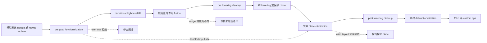

# vLLM IR 与融合 Pass：让语义先稳定，再让实现安全落地

> **读者问题**：同一个 RMSNorm、量化或 attention 片段可能有 native、设备 Kernel 与融合实现；其中一些还会覆盖输入。vLLM 怎样让图改写先看到稳定语义，又证明 donation、alias 与 pass 顺序没有把正确结果换成偶然可跑的结果？
> **源码基线**：`vllm-project/vllm@6b110badbb22d3f66c7218b71138f13b7a6b3419`（冻结的 detached checkout，提交时间 2026-08-29T02:40:53Z）。
> **中心命题**：vLLM IR 不是另造一套脱离 FX 的执行后端，而是在 FX 中保留一层“语义已定、实现未定”的 dialect：native reference、schema、fake result 与 mutation 声明先固定 observable contract；pre-grad pass 把 `maybe_inplace` 收敛为 functional op 并传递 donation 证据；post-grad passes 只在各自的 shape、dtype、能力和 compile-range 前提内改写；最后 lowering 先保守插 clone，再由受限的 clone elimination 回收已经证明可捐赠的 copy。
> **所有权边界**：本页拥有 IR stable semantics、donation / alias metadata、functionalization、canonicalization / fusion / lowering 顺序及其正确性边界。whole-model dynamic-shape 分区、compile/cache/capture/replay 生命周期归 [[02_engineering/03_infer_frameworks/vllm/23_vllm_compilation_cudagraph_analysis|vLLM 编译与 CUDA Graph]]；某个 provider、Kernel family 的收益、workspace 与硬件选择归 [[02_engineering/03_infer_frameworks/vllm/24_vllm_fused_ops_and_kernels_analysis|vLLM 融合算子与 Kernel]]。
> **最近更新**：2026-08-30。按 `6b110bad` 重建 IR、donation、functionalization、pass ordering 与 lowering safety 主线。

## 1. 背景：先选 Kernel 会让图失去共同语言

模型层需要表达“这是 RMSNorm”“这个 activation 可以交出旧值”“attention 的 KV 副作用仍然存在”；设备层却需要按 dtype、shape、平台和扩展库选择实现。如果模型 forward 直接固定某个 opaque Kernel，后续 fusion 要为每个 provider 重写 pattern；如果只留下低层 ATen 展开，vLLM 特有的语义边界和可选 mutation 又容易在 trace 形式变化中消失。官方设计因此把 vLLM IR 定义为 FX 内可与普通 torch/custom op 共存的 functional dialect，并把“延迟 Kernel 选择”列为让 fusion 只匹配一个高层 op 的主要理由（`docs/design/vllm_ir.md:5-11`；`docs/design/vllm_ir.md:22-31`）。

直观替代有两个：一是模型直接选择设备实现，二是让 pass 从任意低层图重新猜回高层意图。源码没有记录一场完整的方案评审；以下判断是**分析推断**：前者减少一次抽象，却把平台选择提前并扩大 fusion pattern 数；后者保留 compiler 自由，却把 correctness 依赖于低层图恰好长成某种形式。当前结构选择的是中间点——语义 op 对 Dynamo 保持 opaque，fusion 在 lowering 前消费它，而实现直到 fake metadata 已知才被选中（`docs/design/vllm_ir.md:200-220`；`docs/design/vllm_ir.md:233-258`）。

## 2. Stable semantics：IR 节点承诺什么，不承诺什么

### 2.1 一个 op 的四层合同

| 合同层 | 输入 → 输出 | 它固定的不变量 | 拒绝或边界 | 承重证据 |
|---|---|---|---|---|
| native reference | Python tensors / scalars → reference tensors | 数学语义、输出数目、dtype/shape 的 reference 行为；`fused_add_rms_norm` 明确返回 norm 与 residual 两个结果 | reference 是正确性基线，不是性能承诺 | `vllm/ir/ops/layernorm.py:9-21`；`vllm/ir/ops/layernorm.py:43-62` |
| torch schema + fake | native signature → `vllm_ir` op 与 fake result | 默认 overload 被注册为无 mutation 的 `CompositeExplicitAutograd` op；fake 默认直达 native，也可单独覆盖 | keyword-only 参数因 lowering 不接收 kwargs 而在注册时拒绝 | `vllm/ir/op.py:169-177`；`vllm/ir/op.py:198-226`；`vllm/ir/op.py:228-242` |
| implementation registration | provider function + capability predicates → 同语义候选 | provider schema 必须与 native 的参数名、类型和默认值完全一致；`inplace=True` 只能挂在允许 inplace 的 op 上 | schema、`supports_args` 签名或 inplace 能力不合同时在注册阶段失败 | `vllm/ir/op.py:561-616` |
| dispatch policy | priority + 当前实参 → 一个实现 | priority 顺序是 policy；`supported` 是静态可用性，`supports_args` 是当前实参兼容性 | priority 末尾没有覆盖全部实参的实现时抛错；设置 priority 时则过滤静态 unsupported 并在需要时补 native | `vllm/ir/op.py:327-366`；`vllm/ir/op.py:389-413` |

这四层把“同名”升级成可检查的合同。注册时的 schema 等价只证明调用形状一致，不自动证明数值等价；`supports_args` 也只决定候选是否合法，不证明它比别的实现更快。数值、layout 与 provider 性能验证属于 reference tests 和 page 24 的 Kernel 选择账本，本页只拥有这些证据何时进入 IR/lowering。

### 2.2 为什么 default overload 必须保持 functional

`IrOp._inner_call` 无论 dispatch 到 functional 还是 inplace provider，都通过 `func_impl_fn` 执行 default overload；若 provider 声明 inplace，后者先 clone 所有 activation 参数，再调用真实实现，所以 default 的输入值在调用后仍可观察（`vllm/ir/op.py:304-313`；`vllm/ir/op.py:650-664`）。相反，`maybe_inplace` 直接调用实现，不插 clone（`vllm/ir/op.py:530-539`）。

这不是两个可能返回不同数学结果的 API：二者共享 native schema 与 provider 集合；差异只是调用者是否交出 activation 的旧值。layer 只有在 residual 路径上显式调用 `maybe_inplace`，无 residual 路径仍使用 default op（`vllm/model_executor/layers/layernorm.py:74-94`）。因此 donation 是调用点的所有权声明，不是 provider 私自猜测“这个 tensor 看起来没用了”。

## 3. Donation 与 alias：明确表达，但只在受限范围内证明

### 3.1 `maybe_inplace` 表达的不是“现在一定原地写”

创建 inplace overload 时，IR 先要求 Tensor 输出数等于 activation 数，并限制当前只支持纯 Tensor outputs；随后用 `mutates_args=activations` 推导 mutation schema（`vllm/ir/op.py:500-517`）。实现再用 `inplace=True` 声明自己会复用 activation storage；不支持 inplace 的 op 不允许注册这种实现（`vllm/ir/op.py:612-623`）。官方语义说明得更强：`maybe_inplace` 的输出**可能** alias activation，而调用后继续读取被捐赠输入属于 undefined behavior（`docs/design/vllm_ir.md:370-395`）。

这里要区分三个层次：

1. mutation schema 告诉 PyTorch 这些 activation 可能被写；
2. donation 告诉 vLLM 调用者不再需要旧值；
3. 某个 provider 的 `inplace=True` 才决定本次实现确实复用 storage。

把三者合成“`maybe_inplace` 一定 alias 第一个输出”会越过源码合同。当前代码只约束 activation 与输出数量相同，没有建立任意 view、storage offset 或跨节点 alias 的一般证明。

### 3.2 pre-grad functionalization 消费并产出什么

`VllmIRInplaceFunctionalizationPass` 在 AOTAutograd 前运行，消费含 `maybe_inplace` 的非规范 FX 图，产出只含 default IR overload 的 functional 图，同时把被捐赠的 graph placeholder 索引写入 `PassContext.donated_input_ids`（`vllm/compilation/passes/ir/inplace_functionalization.py:21-49`；`vllm/compilation/passes/ir/inplace_functionalization.py:83-91`）。backend 把它安装到 `pre_grad_custom_pass`，post-grad manager 另走 Inductor 的 post-pass hook，因此 donation 证据能先于 AOTAutograd 建立（`vllm/compilation/backends.py:934-953`）。

它的拒绝条件是拓扑化且明确的：对每个 activation 参数，若任何 user 位于 `maybe_inplace` 节点之后，编译直接抛 `ValueError`，并要求改用 default overload 或先 clone（`vllm/compilation/passes/ir/inplace_functionalization.py:67-81`）。测试构造 `x` 捐赠后再次参与加法的模型，确认异常被 compiler 包装后仍以 “used again” 失败，而不是静默退回 out-of-place（`tests/compile/passes/ir/test_inplace_functionalization.py:289-325`）。

> [!note] 代码与设计文档的语境差异
> design doc 把捐赠后复用概括为 undefined behavior（`docs/design/vllm_ir.md:383-395`）；冻结源码的 compile path 已把这个边界收紧为 pre-grad 硬拒绝。两者并不等价：eager `maybe_inplace` 仍直调实现，而 compile path 才有这项图级 later-user 检查（`vllm/ir/op.py:536-539`；`vllm/compilation/passes/ir/inplace_functionalization.py:67-81`）。

### 3.3 clone elimination 不是一般 alias analysis

lowering 对 inplace implementation 调 `func_impl_fn`，所以先得到保护性 clones；`UnsafeCloneEliminationPass` 再决定哪些 clone 可移除（`vllm/compilation/passes/ir/lowering_pass.py:52-69`；`vllm/ir/op.py:650-664`）。它只在以下证明同时成立时回收 copy：

- clone 不改变 stride 与 storage offset；缺 metadata 时默认视为 layout preserved，已知 layout 改变则保留（`vllm/compilation/passes/ir/clone_elimination.py:19-36`；`vllm/compilation/passes/ir/clone_elimination.py:95-109`）；
- clone 被写时，original 在该 write 后不能再有 user（`vllm/compilation/passes/ir/clone_elimination.py:111-133`）；
- original 若是 graph input，必须出现在 pre-grad 传来的 donated-input set，否则保留 clone（`vllm/compilation/passes/ir/clone_elimination.py:135-144`）；
- unknown higher-order op 默认视作可能写，只有已知 functional wrapper 例外（`vllm/compilation/passes/ir/clone_elimination.py:39-69`）。

最重要的失败边界写在类注释里：该 pass “unsafe” 正因为**尚未考虑 aliasing**，只服务已知 vLLM 图，simple view alias 仍是 open problem（`vllm/compilation/passes/ir/clone_elimination.py:72-82`）。测试把边界固定为可观察行为：donated input 的 mutating clone 会移除，non-donated graph input 的 clone 会保留；两者分别允许与禁止 caller input 被覆盖（`tests/compile/passes/ir/test_clone_cleanup.py:336-384`）。另一个测试确认 materialize compact layout 的 clone 必须保留（`tests/compile/passes/ir/test_clone_cleanup.py:135-152`）。

所以这里的安全不是“alias 问题已经解决”，而是“在没有一般 alias 证明时，把优化框在 donation、拓扑 user、write schema 与 layout equality 的交集里”。遇到 view-rich 新图时，默认做法应是保留 clone 或扩充证明与反例测试，而不是扩大无条件删除范围。

## 4. Pass pipeline：顺序本身就是正确性协议

### 4.1 图 1 规格：语义主线与 donation 侧通道

图中的 main path 由两个 hook 共同建立：pre-grad pass 先消除 `maybe_inplace`，post-grad manager 再执行配置 passes、两次 cleanup、IR lowering、clone elimination，并强制最后才做 `FixFunctionalizationPass`（`vllm/compilation/backends.py:934-953`；`vllm/compilation/passes/pass_manager.py:109-141`）。

### 4.2 每一阶段消费与产出的不变量

| 阶段 / pass | 消费的不变量 | 产出的不变量 | 拒绝、skip 或范围边界 | 为什么必须在这里 |
|---|---|---|---|---|
| `VllmIRInplaceFunctionalizationPass` | activation 参数能定位为 FX node；`maybe_inplace` caller 已放弃旧值 | default IR overload；placeholder donation IDs | later user 硬失败；未知 overload assert | AOTAutograd 与后续 matcher 只需处理 functional IR（`vllm/compilation/passes/ir/inplace_functionalization.py:51-91`） |
| `NoOpEliminationPass` | reshape/slice 带 fake shape metadata | 只删除静态可证 shape-equivalent 的 reshape、slice、slice-scatter | rank 不同或 symbolic equality 不可静态证明就不删 | 先移除 pattern noise，且 sequence-parallel replacement 也依赖它清掉中间残片（`vllm/compilation/passes/utility/noop_elimination.py:67-105`；`vllm/compilation/passes/fusion/sequence_parallelism.py:517-531`） |
| `SequenceParallelismPass` → `AsyncTPPass` | whole graph 中的 all-reduce → RMSNorm / quant 链；compile range 足够大 | reduce-scatter → local norm / quant → all-gather，再暴露 GEMM 通信融合机会 | piecewise mode assert；threshold 未建立或 range 太小就 skip | `AsyncTPPass` 明确建立在 SP 之后且同样要求 full graph（`vllm/compilation/passes/fusion/sequence_parallelism.py:498-521`；`vllm/compilation/passes/fusion/sequence_parallelism.py:592-616`；`vllm/compilation/passes/fusion/collective_fusion.py:976-983`） |
| `AddRMSNormFusionPass` | Transformers backend 发出的 add → `rms_norm`，epsilon 为已注册值 | canonical `fused_add_rms_norm` IR | exact traced pattern 不匹配即保持原图 | 先把 backend-specific 展开收敛成后续 collective / quant pass 的共同语言（`vllm/compilation/passes/fusion/add_rms_fusion.py:17-48`；`vllm/compilation/passes/fusion/add_rms_fusion.py:140-149`） |
| router-pad / all-reduce-RMS / RMS reshape | 更具体的 fused-add consumers 与 collective 链 | 最具体融合先消费；其余 RMS reshape 前移以暴露 quant pattern | platform、workspace、world size、dtype 与 compile-range 不满足则 disabled / skip | manager 明确要求 router-pad 先于 AR+RMS，AR+RMS 又先于 reshape 和 RMS+Quant（`vllm/compilation/passes/pass_manager.py:169-195`）；FlashInfer AR 还受 TP、workspace 与最大 token 数约束（`vllm/compilation/passes/fusion/allreduce_rms_fusion.py:1009-1053`；`vllm/compilation/passes/fusion/allreduce_rms_fusion.py:1153-1157`） |
| RMSNorm+Quant / Activation+Quant | functional IR norm/activation 后接已知 quant contract | auto-functionalized fused custom op，保留显式 result / scale outputs | pattern 只为已注册 quant key 构造；输入与 weight dtype 不同或 traced pattern 不同则不融合 | dtype `extra_check` 防止 mixed-dtype RMS 替换；activation replacement 同样显式保留 functionalized result（`vllm/compilation/passes/fusion/rms_quant_fusion.py:41-60`；`vllm/compilation/passes/fusion/rms_quant_fusion.py:178-218`；`vllm/compilation/passes/fusion/act_quant_fusion.py:81-125`） |
| split coalescing / scatter-split replacement | 相同 input 与 split sizes；functionalized RoPE 的 getitem/slice-scatter 形状 | canonical split 与直接的 rotated q/k users | non-getitem users、split sizes 不同或目标 user 形态不同则保留 | 这些是 QK-Norm/RoPE/KV patterns 的前置 canonicalization，不是通用 DCE（`vllm/compilation/passes/utility/split_coalescing.py:31-68`；`vllm/compilation/passes/utility/scatter_split_replace.py:67-115`） |
| RoPE/KV、QK-Norm/RoPE/KV、MLA、attention+quant families | canonical functional side-effect graph、layer capability 与 dummy dependency | 合并后的 mutating op，仍携带 KV dependency 与 output buffers | head dim、value dim、backend capability、quant scheme 或 compile-range 不符时不注册/不应用 | manager 只按配置注册这些 specialized families（`vllm/compilation/passes/pass_manager.py:205-227`）；attention+quant 显式携带 `kv_cache_dummy_dep` 并只为支持 fused output quant 的 layer 注册（`vllm/compilation/passes/fusion/attn_quant_fusion.py:38-46`；`vllm/compilation/passes/fusion/attn_quant_fusion.py:63-101`；`vllm/compilation/passes/fusion/attn_quant_fusion.py:375-401`）；RoPE/KV 只在小 batch range 应用（`vllm/compilation/passes/fusion/rope_kvcache_fusion.py:431-465`） |
| first `PostCleanupPass` | fusion matcher 可能留下非拓扑或 dead artifacts | stable topological order、无 dead IR | 此时尚未恢复 final inplace wrappers | dead IR 若先 lowering，会制造无用实现节点；manager 因此在 lowering 前先 cleanup（`vllm/compilation/passes/utility/post_cleanup.py:8-21`；`vllm/compilation/passes/pass_manager.py:121-128`） |
| `VllmIRLoweringPass` | 只含 default vLLM IR；每个 node 有 fake `meta val`；无 kwargs | provider implementation graph；inplace impl 外围有保护 clone；记录 node → provider | dispatch predicate 无实现时失败；未降低的 IR 节点会被汇总告警 | 所有 IR-level fusion 已完成后才固定实现；replacement 禁止 functional DCE，因为 traced impl 可能 mutation（`vllm/compilation/passes/ir/lowering_pass.py:43-69`；`vllm/compilation/passes/ir/lowering_pass.py:101-113`） |
| `UnsafeCloneEliminationPass` | lowering 产生的 clones、write schema、donation IDs 与 fake layout | 只删除局部可证明冗余的 clone | layout 变化、write 后旧值仍用、non-donated placeholder、unknown writer 均保留 | donation 证据只有此时才能对应到 lowering 实际插入的 copy（`vllm/compilation/passes/ir/clone_elimination.py:88-152`） |
| second cleanup → `FixFunctionalizationPass` | lowered graph 与残余 auto-functionalized wrappers | DCE 删除 dead lowered artifacts；随后目标 allowlist 恢复 inplace custom op | XPU skip；非 allowlist wrapper保留；defunctionalization 后禁止再 DCE | fix pass 自己声明必须最后运行，因为恢复 mutation 后相关 node 可能看似 dead；manager按此固定顺序（`vllm/compilation/passes/utility/fix_functionalization.py:19-35`；`vllm/compilation/passes/pass_manager.py:133-139`） |

### 4.3 为什么“更具体的 pass 先跑”是语义和覆盖问题

pattern replacement 会消费节点。若一个宽 pattern 先吃掉 `fused_add_rms_norm`，更具体的 router-pad 或 all-reduce+RMS pattern 就再也看不到完整链；反过来，先让具体 pattern 消费它，未匹配的剩余节点仍可交给宽 pattern。当前 manager 把这项依赖写成注释和实际 append 顺序：router-pad → all-reduce+RMS → reshape canonicalization → RMS+quant（`vllm/compilation/passes/pass_manager.py:169-195`）。这不是“后一个 pass 总能补救”的优化排序，而是 match coverage 的偏序。

Sequence parallelism 还展示了更强的顺序依赖：matcher 从图尾向前替换时，临时 residual slice 在中间状态可能对已缩小的前层输出语义不成立；源码保证图不会在该状态执行，并由 pass 内部 NoOp cleanup 在 compile 前删掉这些 slice（`vllm/compilation/passes/fusion/sequence_parallelism.py:523-531`；`vllm/compilation/passes/fusion/sequence_parallelism.py:618-623`）。因此插入新的中间 pass 时，作者必须证明它不会观察或执行这种过渡态。

## 5. Fusion safety：pattern 命中不是数学证明

vLLM 的通用 `VllmFusionPatternMatcherPass.register` 用 fake mode trace pattern、replacement 与 example inputs，再交给 Inductor pattern matcher；pass UUID 同时包含 pass class 与每个 replacement class（`vllm/compilation/passes/vllm_inductor_pass.py:296-330`）。这提供了结构相等和可 trace 性，却不自动证明所有实参上的数值与副作用等价。

因此一个 fusion 的安全边界来自三层共同收窄：

1. **结构门**：完整 functional pattern 必须命中；KV dummy dependency、getitem、output buffer 与 mutation wrapper不能被忽略。attention+quant 就把 `kv_cache_dummy_dep` 从 pattern 原样带进 replacement（`vllm/compilation/passes/fusion/attn_quant_fusion.py:63-101`；`vllm/compilation/passes/fusion/attn_quant_fusion.py:106-153`）。
2. **静态能力门**：只为 backend 自陈支持的 layer / quant scheme 注册 pattern；找不到 attention layer 时只注册零个 pattern并告警（`vllm/compilation/passes/fusion/attn_quant_fusion.py:375-401`）。
3. **实参与 range 门**：extra checks 比较 dtype，pass 的 `is_applicable_for_range` 再按 token interval决定是否运行；QK-Norm+RoPE+KV 还拒绝 unsupported head dim 与 `head_size_v != head_size`（`vllm/compilation/passes/fusion/rms_quant_fusion.py:45-60`；`vllm/compilation/passes/fusion/qk_norm_rope_kvcache_fusion.py:451-489`）。

不满足这些门时，正确结果通常是“保持未融合 functional graph”，不是强行选另一个 fused provider。是否有未融合/native execution path由 op contract与 page 24 负责；本页只要求 pass 的 non-match 不破坏原语义。

### 5.1 `FixFunctionalizationPass` 的特殊风险

最终 pass 不是一般 reinplacing solver，而是一个目标 allowlist。源码对 rotary embedding 的 direct path 明说“理论上不应盲做，但在 vLLM 实际图中可行”，并把更好的长期方案指向 auto-functionalization v2 与 Inductor builtin reinplacing（`vllm/compilation/passes/utility/fix_functionalization.py:89-101`）。这是本页必须保留的限制：新增 mutating op 不能因为“同样是 auto-functionalized”就自动加入；它需要明确 mutated-arg mapping、getitem replacement、no-DCE ordering 与正反例测试。

## 6. Lowering 与 cache identity：实现选择必须可重复

lowering 对每个 IR node 读取 fake args，复用 eager dispatch 的 priority / `supports_args` 逻辑，补齐 default args，再 trace 所选 implementation replacement（`vllm/compilation/passes/ir/lowering_pass.py:43-69`）。测试用三个 RMSNorm 节点固定这项行为：两个普通节点选请求 provider，带 `variance_size` 的节点因谓词不支持而选 native；lowered、unlowered 与重复执行的结果保持一致（`tests/compile/passes/ir/test_lowering.py:25-34`；`tests/compile/passes/ir/test_lowering.py:37-69`）。

实现选择也是 cache correctness 的一部分。lowering UUID 包含每个 IR op 的 priority 与 priority 中 implementation source UUID；post-grad manager UUID 再包含 pass config、实际 pass 序列、两次 cleanup、lowering、clone elimination、final functionalization 及 compile range（`vllm/compilation/passes/ir/lowering_pass.py:115-131`；`vllm/compilation/passes/pass_manager.py:238-260`）。测试确认只改变 fusion config 或重复添加同一个 pass 都会改变 manager UUID（`tests/compile/passes/test_pass_manager.py:49-83`）。

因此“pass 顺序或 provider priority 改了，但复用旧 compiled artifact”不是允许的性能优化。它会让可观察实现与配置不一致；hash 必须随所有影响图产物的 policy 和 source 改变。whole-model cache 文件如何建立与复用仍归 page 23，本页只拥有 pass/lowering 对 cache identity 的贡献。

## 7. 验收：按不变量测，而不是只看 match count

| 风险 | 必须验证的正例 | 必须验证的反例 / 边界 | 现有证据 |
|---|---|---|---|
| stable semantics | eager/default、unlowered/lowered 在容差内一致 | provider schema、`supports_args` 签名不一致时注册失败 | `tests/ir/test_op.py:463-532`；`tests/compile/passes/ir/test_lowering.py:37-69` |
| donation | `maybe_inplace` graph input 可把 protective clone 回收 | 捐赠后 later use 编译失败；default overload 仍保留输入 | `tests/compile/passes/ir/test_inplace_functionalization.py:167-245`；`tests/compile/passes/ir/test_inplace_functionalization.py:289-325` |
| alias / clone | donated input、无 post-write old-value user 且 layout 相同才消 clone | non-donated placeholder、layout-changing clone、unknown HOP writer 保留 | `tests/compile/passes/ir/test_clone_cleanup.py:135-152`；`tests/compile/passes/ir/test_clone_cleanup.py:321-384` |
| fusion | exact pattern、capability、dtype 与 range 满足时 replacement 命中且数值对 reference | 近似 pattern、多余 user、mixed dtype、unsupported head dim / backend、阈值外 range不命中 | guards 分布在 `vllm/compilation/passes/fusion/rms_quant_fusion.py:45-60`、`vllm/compilation/passes/fusion/qk_norm_rope_kvcache_fusion.py:451-489` 与各 pass tests |
| ordering | 记录各 pass match summary，并检查 lowering 前后图不再残留 IR | 交换 specific / broad pass、在 final defunctionalization 后跑 DCE 应被测试禁止 | `vllm/compilation/passes/pass_manager.py:121-141`；`vllm/compilation/passes/utility/fix_functionalization.py:19-25` |
| cache identity | 相同 config/source/range 生成稳定 UUID | pass 序列、fusion config、provider priority 或 impl source变化必须失效 | `tests/compile/passes/test_pass_manager.py:49-83`；`vllm/compilation/passes/ir/lowering_pass.py:115-131` |

**删除测试**：本页没有用实现代码块承载论证；移除唯一的 pipeline 图后，正文与阶段表仍能回答为什么需要 stable IR、donation 如何传递、每个 pass 消费/产出什么、哪些边界会 hard-fail / skip / keep-clone，以及为何 lowering 和 final defunctionalization不能换序。

## 8. 有源码锚点的发展方向

> [!note] 分析推断
> 以下不是已承诺 roadmap，只从当前 TODO 与显式限制外推维护压力。

- lowering 当前禁止对 replacement 跑 functional passes，并留下改用 `aot_export_module` 得到 functional graph 的 TODO（`vllm/compilation/passes/ir/lowering_pass.py:57-68`）。若这项完成，protective clone 与后置 defunctionalization 的责任可能收缩；在那之前不能按未来设计删掉现有安全层。
- clone elimination 自陈 simple views 的 alias 支持仍未解决（`vllm/compilation/passes/ir/clone_elimination.py:72-82`）。合理方向是把 view/storage 关系变成可验证元数据，而不是继续扩大“已知 vLLM case”的例外名单。
- final fix pass 指向 auto-functionalization v2 与 builtin reinplacing（`vllm/compilation/passes/utility/fix_functionalization.py:89-101`）。这说明当前 allowlist 是过渡性正确性边界；迁移必须先用相同 mutation/alias 反例证明新流程至少同样保守。

## Related Pages

- [[02_engineering/03_infer_frameworks/vllm/23_vllm_compilation_cudagraph_analysis|vLLM 编译与 CUDA Graph]] — 接手本页产出的 lowered graph，解释 whole-model compile、partition、cache、capture 与 replay 生命周期。
- [[02_engineering/03_infer_frameworks/vllm/24_vllm_fused_ops_and_kernels_analysis|vLLM 融合算子与 Kernel]] — 拥有 provider / Kernel family 的收益、workspace、硬件能力与 fallback 账本。
- [[02_engineering/03_infer_frameworks/vllm/21_vllm_quantization_analysis|vLLM 量化设计]] — 定义 quant key、scale 与 pack ABI；本页只解释这些合同怎样约束 fusion pattern。
- [[02_engineering/03_infer_frameworks/vllm/14_vllm_attention_backends_analysis|vLLM Attention Backend]] — 定义 attention metadata、KV 副作用与 backend capability；本页只保留其 functional dependency 与 fusion guard。
- [[02_engineering/03_infer_frameworks/vllm/22_vllm_distributed_inference_analysis|vLLM 分布式推理]] — 拥有 collective 与 rank 语义；本页只解释 sequence-parallel / async-TP pass 怎样改写其图表示。
