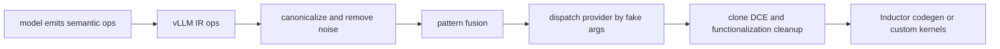

# vLLM IR 与融合 Pass：延迟实现选择，先保留可优化语义

> **源码基线**：`vllm-project/vllm@d66300a1baa7779c68c7dfa4e51eee2502b48017`
> **中心命题**：如果模型 forward 过早调用某个 opaque kernel，编译器看不到跨算子的优化机会；如果只保留普通 ATen 图，又难以表达 vLLM 特有的量化、通信和可选 in-place 语义。vLLM IR 用稳定语义 op 暂存意图，融合 pass 在图级组合意图，最后 lowering 再按平台与参数选择具体 provider。

## 一、为什么需要介于模型与 kernel 之间的 IR

以 residual add + RMSNorm + activation quant 为例：

- 模型层面知道 residual、norm 和 quant 的数学含义；
- kernel 层面可能有 native、Triton、AITER 或 fused provider；
- 是否能 in-place 取决于该 activation 后面还有没有消费者；
- 是否值得融合取决于图 pattern、dtype、shape、平台和配置。

若模型直接选择 AITER kernel，其他 provider 与图融合被封死；若 compiler 从任意 Python/ATen 形状猜意图，pattern 易被 view、clone、functionalization 形式变化破坏。

## 二、`IrOp` 把语义与 provider 分开

`register_op()` 建立带 schema/fake/可选 in-place 能力的 `IrOp` 并放入全局 registry；`vllm/ir/op.py:83-146`。一个 IR op 可注册多个 provider implementation，每个实现声明全局支持条件、参数级 `supports_args` 与是否 in-place；`vllm/ir/op.py:244-295`。

dispatch 遍历当前 provider priority，跳过不支持当前 fake args 的实现；若显式 priority 中的 provider 在平台上完全不支持则报错；`vllm/ir/op.py:327-409`。平台和 `KernelConfig` 可设置默认 priority；`vllm/config/kernel.py:92-104,289-310`。

这形成两个阶段：

1. 模型调用 `ir.ops.rms_norm` 等语义 op，不承诺设备实现；
2. compile lowering 看到实际 shape/dtype/fake metadata 后选择 provider。

相比 eager 中每次动态 dispatch，lowering 把选择固化进编译产物；相比模型构造时选择，它又能利用具体 graph/shape 信息。

## 三、`maybe_inplace` 是内存所有权声明

in-place kernel 可以省 allocation 和 HBM 写回，但只有输入的旧值不再被任何节点使用时才安全。支持 in-place 的 IR op 暴露 `maybe_inplace` overload；`vllm/ir/op.py:481-537`。

pre-grad functionalization pass 检查被捐赠 activation 是否还有后续 user，之后把 overload 规范化为 functional IR 形式；`vllm/compilation/passes/ir/inplace_functionalization.py:21-97`。它表达的是：

> 模型允许覆盖这个 activation，但最终是否采用 in-place provider，要在已验证数据流所有权后决定。

模型直接写 `x.add_()` 无法保留这种选择；一律 out-of-place 又错失显存和带宽收益。

## 四、Pass 顺序是正确性协议

`PostGradPassManager` 按配置运行 no-op elimination、sequence parallelism、norm/quant/collective/RoPE/KV 等 fusion，然后执行：

1. post cleanup；
2. IR lowering；
3. unsafe clone elimination；
4. 再 cleanup；
5. 最后 fix functionalization。

实际顺序见 `vllm/compilation/passes/pass_manager.py:91-139`，具体 fusion pass 按能力配置加入；`vllm/compilation/passes/pass_manager.py:143-232`。

顺序不能任意交换：

- 先清理 dead fusion artifact，避免 lowering 无用 IR；
- lowering 后实现图可能暴露 clone/DCE 机会；
- functionalization 修复放最后，确保前面 pattern 看到预期形式；
- 更具体 fusion 应先于会消费相同节点的宽泛 pattern。

例如代码明确让更具体的 RMSNorm+router-pad 先于 all-reduce+RMS，让 all-reduce+RMS 先于 RMS+quant；`vllm/compilation/passes/pass_manager.py:169-198`。

## 五、fusion 不是字符串替换

vLLM fusion pass 用 Inductor pattern matcher 注册 pattern/replacement，并按 fake tensor、dtype、config、backend capability 限制匹配。典型类别包括：

- add + RMSNorm、RMSNorm + quant、activation + quant；
- all-reduce + RMSNorm/quant；
- QK norm + RoPE + KV cache update；
- attention output + quant；
- sequence parallelism 与 async TP。

以 attention + quant 为例，pattern 显式使用 `auto_functionalized` 表达 mutating attention 和输出量化，并保留 KV dummy dependency；`vllm/compilation/passes/fusion/attn_quant_fusion.py:43-153`。这说明正确 pattern 必须匹配数据依赖和副作用，不能只看相邻 op 名。

QKNorm+RoPE+KV fusion 为动态 `SymInt` 预构建 search pattern，并显式处理 FP8 quant 输出；`vllm/compilation/passes/fusion/qk_norm_rope_kvcache_fusion.py:172-377`。其复杂性来自“数学等价”之外的 shape、mutation 与 compiler 表示稳定性。

## 六、Lowering 如何选择实现

`VllmIRLoweringPass` 为 registry 中每个 IR op 注册单节点 pattern。匹配后从 node 的 fake args 调用 `ir_op.dispatch()`，记录 provider，再 trace provider implementation 替换 IR node；`vllm/compilation/passes/ir/lowering_pass.py:25-77`。

fake args 让 dispatch 能看 dtype、shape 和 device，却不运行真实 kernel。选中的 implementation 必须与 IR schema 等价；lowering 不会替实现修复错误 alias 或数值语义。

provider priority 与 implementation 源码会进入 lowering pass UUID，从而影响 compile cache；`vllm/compilation/passes/ir/lowering_pass.py:110-129`。否则调整 kernel priority 后可能错误复用旧产物。

## 七、PassManager 为什么也要可哈希

compile cache 的结果取决于 pass 开关、顺序、源码和 compile range。`PostGradPassManager.uuid()` 汇总 pass config、每个 pass UUID 与动态 compile range；`vllm/compilation/passes/pass_manager.py:238-260`。

这不是优化细节，而是缓存正确性：同一模型/shape 在 `fuse_norm_quant=true` 与 false 下应得到不同 code；provider priority 或 pass 源码变化也必须失效。

## 八、IR、CustomOp 与 ATen 的分工

| 表示 | 适合 | 不适合 |
|---|---|---|
| 普通 ATen | compiler 已理解、易自动融合的纯函数 | vLLM 特有 provider priority/可选 in-place |
| `CustomOp` | 明确的平台实现、语义 reference 与图边界 | 需要跨边界 pattern fusion 的细粒度计算 |
| vLLM IR | 多 provider、希望延迟 lowering/参与融合的语义 | 永久保留到 runtime 的动态业务状态 |

IR 最终必须 lowering；它不是执行 backend。Custom op 可以成为 lowering 结果，也可以是 split boundary。三者组合的目标是让 compiler 看到足够语义，同时不要求它理解所有手写 kernel 内部。

## 九、三个不变量

1. **等价不变量**：fusion replacement 与原 pattern 对所有支持输入在约定精度/副作用上等价。
2. **所有权不变量**：in-place/clone elimination 只能在没有后续旧值消费者时发生。
3. **派发不变量**：provider 的 support predicate、schema、fake output 和真实实现一致；cache key包含改变选择的所有因素。

违反第一条产生 silent wrong logits，违反第二条产生数据相关 corruption，违反第三条常表现为只在特定 shape/platform 出错。

## 十、替代方案与验证

| 方案 | 优点 | 局限 |
|---|---|---|
| 模型直接调最佳 kernel | eager 路径短 | 平台耦合、无延迟派发、阻断 fusion |
| 全交给 Inductor | 系统简单 | vLLM 特有 mutation/通信/量化语义难表达 |
| 所有东西注册 opaque custom op | 容易控制 kernel | 图碎片化，跨 op 优化消失 |
| 不做可选 in-place | 最稳妥 | 额外 allocation 和内存流量 |
| pass 无版本 hash | cache 命中高 | 代码/配置变化后复用错误产物 |

验证顺序：

1. 分别测试 IR native 和每个 provider 的数值/shape/fake 实现；
2. 对每个 fusion 做正例、近似但不应匹配的反例、动态 shape 与 mutation 用例；
3. 比较 pass 前后 FX graph、match count 和 provider selection；
4. 用 eager/unfused 输出做端到端基线；
5. 覆盖 in-place 有/无后续 user、compile range 与 cache invalidation；
6. 最后测 launch、HBM 和端到端收益，避免“成功匹配但更慢”。

最小源码阅读顺序：`vllm/ir/op.py:83-146,155-445,481-619` → `vllm/compilation/passes/ir/inplace_functionalization.py:21-97` → `vllm/compilation/passes/pass_manager.py:91-260` → 目标 fusion pass → `vllm/compilation/passes/ir/lowering_pass.py:25-129`。

## Related Pages

- [[02_engineering/03_infer_frameworks/vllm/14_vllm_attention_backends_analysis|vLLM Attention Backend]] — attention/KV 副作用与 backend capability。
- [[02_engineering/03_infer_frameworks/vllm/21_vllm_quantization_analysis|vLLM 量化设计]] — norm/activation/attention quant fusion 的参数合同。
- [[02_engineering/03_infer_frameworks/vllm/22_vllm_distributed_inference_analysis|vLLM 分布式推理]] — collective 与 sequence-parallel pass 的语义。
- [[02_engineering/03_infer_frameworks/vllm/23_vllm_compilation_cudagraph_analysis|vLLM 编译与 CUDA Graph]] — pass 所处的 compile/partition/cache 生命周期。
- [[02_engineering/03_infer_frameworks/vllm/24_vllm_fused_ops_and_kernels_analysis|vLLM 融合算子与 Kernel]] — lowering provider 的设备实现和性能边界。
- [[02_engineering/03_infer_frameworks/vllm/28_vllm_extension_plugin_system_analysis|vLLM 扩展与插件系统]] — out-of-tree IR provider/custom op 的扩展治理。
