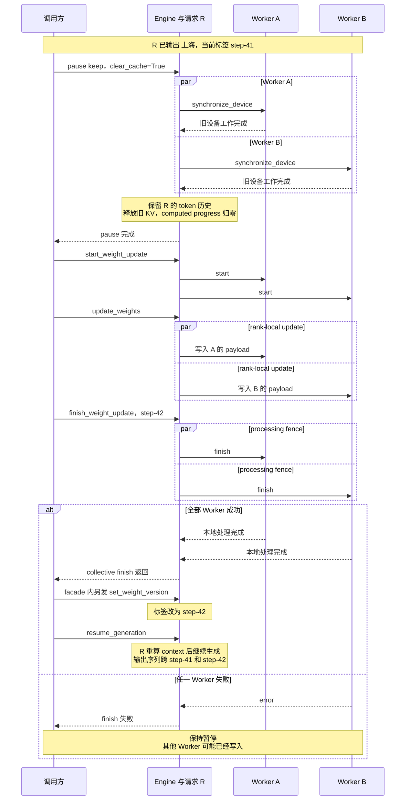
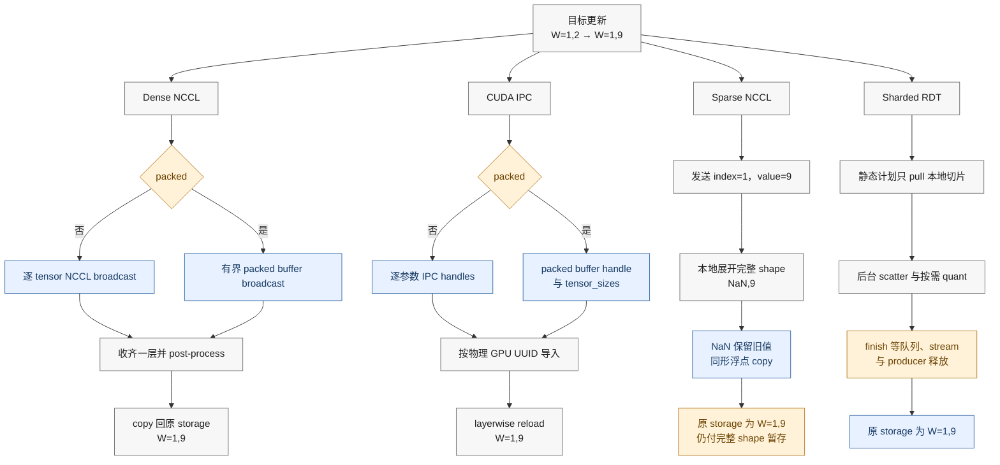
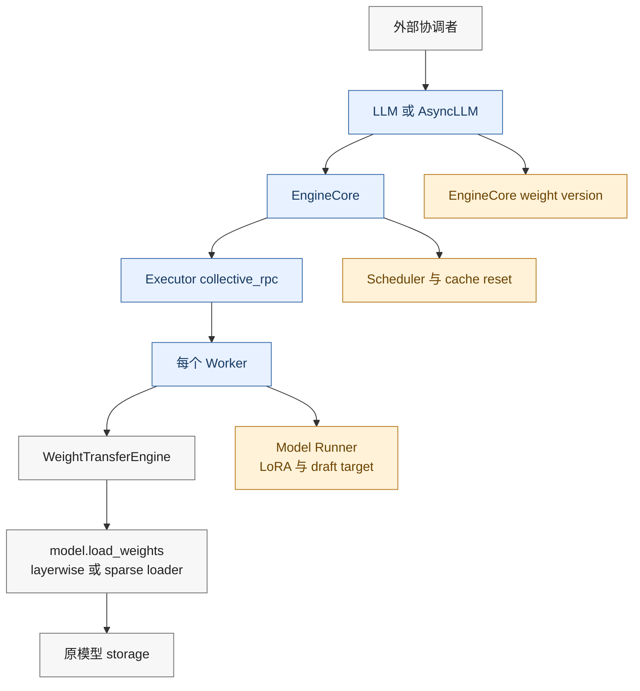

# vLLM 在线权重更新：受暂停窗口保护的版本可见性协议

> **源码基线**：`vllm-project/vllm@199cb9b964822e59ab9b58d88e7be31eb419a2ae`（`main`，2026-09-07）
> **主题**：vLLM 在线权重更新（功能分析）
> **适用范围**：V1 Engine 的 pause、WeightTransfer session、四类内置后端、版本发布与派生状态失效
> **最近更新**：2026-09-14

---

## 1. 特性概览

### 1.1 要解决的问题

[[02_engineering/03_infer_frameworks/vllm/24_vllm_extension_plugin_system_analysis|插件系统]]允许扩展代码进入进程，但插件注册本身不会安全地改变一个正在推理的模型。在线 RL 或持续训练场景需要在服务进程存活、请求可能仍在队列中时，把 inference policy 从 `step-41` 更新到 `step-42`。

真正的难点不是“把 bytes 搬到 GPU”，而是建立清晰的可见性边界：

- 旧 forward 必须在参数覆写前离开设备；
- 所有 Worker 必须按一致的 session 顺序接收各自 payload；
- 量化、repack 或后台 scatter 等后处理必须完成；
- KV、encoder、multimodal、draft 与 LoRA 等旧派生状态必须按需失效；
- 只有上述步骤成功后，控制面才能发布新版本并恢复调度。

如果只提供一个 `reload` RPC，调用方无法区分“数据已收到”“参数已原位写入”“本地后处理已结束”和“所有 rank 已完成”。vLLM 因此把特性拆成：

```text
pause -> start session -> update one or more chunks -> finish
      -> publish optional version -> resume
```

这是一条由调用方编排的协议，不是整模型双缓冲，也不是跨 Worker 的原子事务。

### 1.2 特性的收益、成本与硬边界

| 维度 | 得到什么 | 付出什么 |
|---|---|---|
| 服务连续性 | Engine 进程和请求对象可以保留 | 更新窗口内停止调度；`keep` 请求可能跨版本 |
| 显存占用 | layerwise reload 避免常驻第二份完整模型 | 仍有按层、完整 shape 或后端 buffer 的暂存 |
| 多数据通路 | dense NCCL、IPC、sparse NCCL、sharded RDT 共用 session ABI | 不同后端的 `update` 完成语义不同 |
| CUDA Graph 兼容 | 处理后的权重 copy 回原 storage，尽量保持地址 | 已写入参数没有通用 rollback |
| 可观测性 | 可选版本字符串在 finish 后发布 | 标签不是 checksum，也不绑定请求快照 |

本页使用一个最小例子贯穿全文：请求 R 在 `step-41` 下已经输出“上海”，目标参数 `W` 的旧值为 `(1, 2)`；训练端要把它更新为 `(1, 9)` 并发布 `step-42`。这是依据源码规则构造的教学例子，不代表执行过真实 NCCL、IPC 或 RDT 集成测试。

本页拥有 Trainer—Inference 两侧共同遵守的在线替换协议，并重点展开 inference 侧可见性。Trainer 优化算法、`WeightSource` 如何从优化器状态导出训练参数、外部传输库内部容错不在本页；并行组与跨实例 KV 协议分别交给分布式和分离式 Serving 页面。

### 1.3 四个状态所有者

| 所有者 | 持有状态 | 它能证明的“完成” |
|---|---|---|
| Trainer factory / `LLM` / `AsyncLLM` / 外部协调者 | 后端选择、调用顺序、目标版本、恢复策略 | trainer 发送轮次或公开控制调用已返回 |
| `EngineCore` / Executor | scheduler pause、Worker fan-out、`_weight_version` | 设备同步已收齐，或 collective 成功路径已收到全部回复 |
| Worker | 当前 update target、`_weight_update_active`、rank-local payload | 本 Worker 的 start/update/finish 顺序合法 |
| `WeightTransferEngine` / model loader | communicator、传输元数据、原位加载与 deferred work | 本后端定义的本地处理已结束 |

版本字符串和参数内容由不同对象持有；cache 又属于 Scheduler、connector 与 Model Runner。理解这一所有权拆分，是判断“何时可以 resume”的前提。

## 2. 具体例子：请求 R 怎样从 `step-41` 跨到 `step-42`

### 2.1 第一步：pause 建立正确性窗口

`AsyncLLM.pause_generation` 在需要时先清前端 multimodal cache，再把 mode 与 `clear_cache` 交给 EngineCore。返回前的 20 ms sleep 只是改善最终 output event 的直觉顺序，注释明确说明它不是正确性屏障。真正的 barrier 在 core：所有 Worker 先执行 `synchronize_device`，之后才开始 cache reset。

| mode | 在途请求 | 新请求 | 版本边界 |
|---|---|---|---|
| `abort` | 终止并发送 abort output | 等到 resume | 最清晰：旧请求不跨版本 |
| `wait` | 继续生成直至 drain | 暂停 admission | 完整请求只看旧版；只支持 background EngineCore，in-process core 明确拒绝 |
| `keep` | token budget 归零，请求冻结 | 等到 resume | 请求历史跨版本；是否重算 context 取决于 cache clear |

默认 `clear_cache=True` 不只清 prefix hash。Core 会重置 prefix/KV、multimodal 与 encoder cache，并请求 connector 清内部状态。对请求 R，Scheduler 释放 blocks、把 computed progress 归零、清空 `spec_token_ids`，再让请求回到 waiting；在途的异步输出位置被标为 stale，resume 后不能重复提交。逻辑 token 历史仍保留，因此新权重会重新计算上下文，但已发给用户的“上海”不会撤回。

### 2.2 第二步：session 传输、finish 与版本发布

完整时序如下。蓝色阶段由 pause/finish 提供屏障；失败支路故意停在“保持暂停”，因为源码没有反向恢复旧参数的动作。



时序中有四种不同的“完成”：

1. `update_weights` 返回：同步后端已写入本地参数；deferred 后端可能只把工作排队；
2. Worker 的 `finish_weight_update` 返回：该后端的本地 post-process fence 已越过；
3. Executor 的 collective 成功返回：成功路径收齐所有目标 Worker 回复；
4. facade 随后的 `set_weight_version("step-42")` 返回：控制面标签已经更新。

若 `finish_weight_update` 没有传 `version`，成功 finish 也不会生成新标签。`update_weight_version` 还可以在不改参数时单独调用，所以 `step-42` 只是 caller-supplied opaque string，不是参数 checksum、单调 epoch 或 request snapshot。

### 2.3 第三步：resume 延续请求，不抹掉版本历史

`keep` 模式下，R 恢复后以新权重重算 context 并继续生成，但“上海”仍来自 `step-41`。因此同一输出序列可以跨 policy version。若 rollout 必须属于单一版本，应使用 `abort`、`wait` 或在更上层切分样本；读取 `get_weight_version()` 不能反向证明请求此前使用的版本。

### 2.4 sleep 是资源门，不是 session 的隐式步骤

`sleep(level=0)` 只暂停调度；level 1 还 offload weights 并丢弃 KV，level 2 丢弃全部 GPU allocation。Core 总是先完成 pause，才把 level 1/2 交给 Executor。level 2 会把 model 与 draft buffer 克隆到 CPU，wake 时按 tag 恢复。

start/update/finish 不会自动 wake，也没有“在 sleeping allocation 上更新”的专用 guard。深睡测试给出的恢复顺序是先 wake `weights`、再 reload，最后 wake `kv_cache`。通用 `resume_generation` 不验证 allocation residency；只有 `wake_up` 专属路径会在 Executor 不再 sleeping 后自动 resume。因而 sleep 适合 colocated trainer 腾显存，但资源恢复顺序仍由调用方负责。

## 3. 四类后端：同一 session ABI，不同数据与完成语义

### 3.1 后端集合来自注册表

源码维护两套按相同名称约定配对、但互不共享实例的注册表：Worker 侧 `WeightTransferEngineFactory` 从 `WeightTransferConfig.backend` 选择接收引擎；Trainer 侧 `WeightTransferTrainerFactory` 从 backend-specific `init_info.backend` 选择发送引擎，并调用其 `trainer_init(client, source)` 建立控制面和数据面。两侧都注册四类内置实现：

1. `nccl`：dense NCCL；
2. `ipc`：CUDA IPC；
3. `sparse_nccl`：稀疏 patch 经 NCCL 传输；
4. `sharded_rdt`：按 Worker 切片直传并异步处理。

Worker 在 model 已加载后才创建 transfer engine，因为后端直接持有目标 model 引用。Trainer 每个 rank 都构造自己的 trainer engine，再由具体实现确定谁是 sender；两套 factory 以 backend 名称和 typed init info 为 wire contract，但不会互相实例化对方的类。`init_weight_transfer_engine` 解析 typed init info 并建立长期通道；每次版本更新再进入 start/update/finish session。未配置后端时调用 session API 会明确失败。

初始化成本也因后端而异：dense NCCL 记录 trainer wire 参数并创建 process group；IPC 不做同类 data-plane rendezvous，只记录 `packed` wire 参数；sharded RDT 则要配置 ring、绑定 producer、dry-run bake、预注册 buffer 并启动处理线程。这些都属于显式 init phase，不是每次 version 的 finish。

start 拒绝嵌套 session，后端成功启动后才把 `_weight_update_active` 设为真。draft 是独立 target：只有后端声明支持、runner 确有 draft model 且 speculative config 存在时才可选择；`sparse_nccl` 和 `sharded_rdt` 明确不支持 draft target。

### 3.2 后端完成边界

| 后端 | `update` 的数据路径 | `finish` 补齐什么 | 主要成本或限制 |
|---|---|---|---|
| dense NCCL | update info 只校验 `names`、`dtype_names`、`shapes` 等长；unpacked 逐 tensor broadcast，packed 复用有界 buffer 广播 | finalize attention、padding 与 post-load process | 传输完整 tensor；按层暂存而非整模型 shadow copy |
| IPC | unpacked 携带逐参数 handle，packed 携带共享 packed buffer handle 与 `tensor_sizes`；Worker 按物理 GPU UUID 导入 | 释放 importer 引用并完成后处理 | handle 数校验属于 IPC；依赖同主机句柄可导入与设备身份匹配 |
| sparse NCCL | 传索引和值，本地展开成含 NaN 的完整 checkpoint shape，再走原生 loader | start/finish 是 no-op | 网络随非零更新量变化，本地仍付完整 shape 暂存 |
| sharded RDT | 按 baked plan 只 pull 本 Worker slice；scatter/quant 可在后台线程执行 | `drain_pending` 等队列、CUDA stream 与 producer 释放信号 | update 可提前返回；要求静态 loader 计划，拒绝 EPLB |

普通 base engine 在 `receive_weights` 后执行 device synchronize，使下一 step 看见写入；声明 `defers_processing` 的后端把这份保证推迟到 finish。对 sharded RDT 而言，“Python 队列已空”仍不够：`drain_pending()` 还等待 scatter、quant、两条 CUDA stream 和发往 producer 的 free-group RPC，防止上一轮释放信号被下一轮误用。

RDT 初始化还要做版本检查、dry-run bake、buffer 预注册并构建 static call plan。`enable_eplb=True` 会直接报错，因为 [[02_engineering/03_infer_frameworks/vllm/18_vllm_distributed_inference_analysis|EPLB]] 会改变专家槽位，使初始化时记录的目标位置失效。Ray、NIXL 和可记录 loader 都是该路径的前提，不应把 RDT 视作任意模型 loader 的通用加速。

### 3.3 最小参数 `W=(1,2) -> (1,9)` 的四条路径

下面把四类数据通路放到同一数值例子中。终点都写回原 storage，橙色节点标出容易被低估的本地暂存或完成成本；dense NCCL 与 IPC 都支持 packed/unpacked，但前者传输 tensor 数据，后者传递可导入的显存句柄。



读图时应能从相同目标值推出四种不同的中间状态：dense NCCL 在 communicator 中广播完整 tensor 数据；IPC 的控制 payload 携带 handle，Worker 映射 Trainer 导出的显存；sparse 只省网络却在本地恢复完整 shape；RDT 只 pull 本地切片，但把后台处理的完成点推迟到 finish。packed 只改变 dense/IPC 的 staging 与分块方式，不把两种传输机制变成同一条数据路径。

Sparse 路径用 NaN 表示“这个位置保持旧值”，所以新值本身不能含 NaN，索引必须在界内且默认不得重复。临时替换 `torch.Tensor.copy_` 的逻辑会在 `finally` 恢复函数，但不会恢复此前已经写入的参数；最终只支持同 shape 浮点 copy。一个调用不能混合 dense 与 sparse patch，同名连续 patch 会拆成顺序 loader 调用，`max_chunk_bytes` 只是分批目标而非单 tensor 硬上限。

### 3.4 为什么原位写入既是优势也是风险

layerwise reload 保存当前 kernel tensors，把 live layer 临时恢复为 meta 形态，收齐一层后 materialize、加载、量化或 repack，再 `copy_` 回原 tensor storage。稳定地址能保留 CUDA Graph 和 kernel 对参数 storage 的引用，并限制整模型双份驻留；但一层完成后旧值已经被覆盖，即使 version 尚未发布。

因此安全性来自 **pause window**，不是 staging isolation。这里也不能从“地址稳定”推广出所有 loader 都无需 graph recapture：具体 kernel 的辅助 workspace、sort index 和捕获条件仍属于[[02_engineering/03_infer_frameworks/vllm/19_vllm_compilation_cudagraph_analysis|编译与 CUDA Graph]]的合同。

## 4. 代码实现：控制面、数据面与模型加载器怎样衔接

### 4.1 组件关系



这不是单一 transaction manager：Facade 排调用顺序，Core 持调度与标签，Worker 持 session，Backend 持数据通路，Loader 才真正改参数。任何“已完成”结论都必须指明落在哪一层。

### 4.2 公开调用链

以 Async 接口为例，pause 和权重 session 是两条相邻但独立的链：

```text
AsyncLLM.pause_generation
+-- frontend multimodal cache clear
`-- EngineCoreClient.pause_scheduler_async
    `-- EngineCoreProc.pause_scheduler
        `-- EngineCore._finish_pause
            +-- Executor.collective_rpc("synchronize_device")
            `-- EngineCore._reset_caches

AsyncLLM.start_weight_update
`-- AsyncLLM.collective_rpc
    `-- EngineCoreClient.collective_rpc_async
        `-- EngineCore.collective_rpc
            `-- Executor.collective_rpc("start_weight_update")
                `-- Worker.start_weight_update
                    `-- Worker._start_weight_update

AsyncLLM.update_weights
`-- AsyncLLM.collective_rpc
    `-- EngineCoreClient.collective_rpc_async
        `-- EngineCore.collective_rpc
            `-- Executor.collective_rpc("update_weights")
                `-- Worker.update_weights
                    `-- WeightTransferEngine.update_weights

AsyncLLM.finish_weight_update
+-- AsyncLLM.collective_rpc
|   `-- EngineCoreClient.collective_rpc_async
|       `-- EngineCore.collective_rpc
|           `-- Executor.collective_rpc("finish_weight_update")
|               `-- Worker.finish_weight_update
|                   `-- WeightTransferEngine.finish_weight_update
`-- AsyncLLM.update_weight_version
    `-- EngineCoreClient.set_weight_version_async
        `-- EngineCore.set_weight_version
```

当 payload 是 list 时，Worker 用 `data_parallel_rank * world_size + rank` 选择本地项。该索引合同把外部 payload 排列与 DP、local world size、Worker rank 绑定；并行组本身由[[02_engineering/03_infer_frameworks/vllm/18_vllm_distributed_inference_analysis|分布式推理]]负责。

### 4.3 后端实现入口

```text
Worker.load_model
`-- WeightTransferEngineFactory.create_engine
    +-- NCCLWeightTransferEngine
    +-- IPCWeightTransferEngine
    +-- SparseNCCLWeightTransferEngine
    `-- ShardedRDTWeightTransferEngine

WeightTransferTrainerFactory.trainer_init
`-- init_info.backend 选择发送端实现
    +-- NCCLTrainerWeightTransferEngine
    +-- IPCTrainerWeightTransferEngine
    +-- SparseNCCLTrainerWeightTransferEngine
    `-- ShardedRDTTrainerWeightTransferEngine

NCCL or IPC receive_weights
`-- model.load_weights
    `-- layerwise reload
        +-- materialize and post-process layer
        `-- copy back original kernel tensors

SparseNCCLWeightTransferEngine.receive_weights
`-- load_checkpoint_weight_patches
    `-- _load_nan_masked_weights
        `-- model.load_weights
```

### 4.4 稳定源码路线

| 阅读目标 | 稳定源码锚点 |
|---|---|
| 唯一配置字段与双侧后端注册表 | `vllm.config.weight_transfer.WeightTransferConfig`、`vllm.distributed.weight_transfer.factory.WeightTransferEngineFactory`、`WeightTransferTrainerFactory` |
| Facade 调用顺序与版本后置 | `vllm.entrypoints.llm.LLM.finish_weight_update`、`vllm.v1.engine.async_llm.AsyncLLM.finish_weight_update` |
| pause、cache 与 sleep | `vllm.v1.engine.core.EngineCoreProc.pause_scheduler`、`EngineCore._finish_pause`、`EngineCore._reset_caches`、`EngineCore.sleep`、`EngineCore.wake_up` |
| Worker session 与 rank payload | `vllm.v1.worker.gpu_worker.Worker._start_weight_update`、`update_weights`、`finish_weight_update` |
| Backend 公共完成语义 | `vllm.distributed.weight_transfer.base.WeightTransferEngine` |
| Dense 与 IPC 的 Worker/Trainer 实现 | `vllm.distributed.weight_transfer.nccl_engine.NCCLWeightTransferEngine`、`NCCLTrainerWeightTransferEngine`、`vllm.distributed.weight_transfer.ipc_engine.IPCWeightTransferEngine`、`IPCTrainerWeightTransferEngine` |
| Sparse 展开与原位写 | `vllm.distributed.weight_transfer.sparse_nccl_engine.SparseNCCLWeightTransferEngine`、`vllm.model_executor.model_loader.checkpoint_weight_patch._load_nan_masked_weights` |
| RDT 静态计划与 drain | `vllm.distributed.weight_transfer.sharded_rdt_engine.ShardedRDTWeightTransferEngine` |
| 稳定 storage | `vllm.model_executor.model_loader.reload.layerwise.initialize_layerwise_reload`、`_copy_and_restore_kernel_tensors` |
| DP pause 共识 | `vllm.v1.engine.core.DPEngineCoreProc` |
| Facade 顺序与版本标签测试 | `tests/entrypoints/weight_transfer/test_weight_transfer_llm.py::test_full_weight_transfer_flow` |
| Worker session、rank payload、draft 与失败测试 | `tests/v1/worker/test_gpu_worker_weight_transfer.py` |
| Sparse patch 与稳定 storage 测试 | `tests/model_executor/model_loader/test_checkpoint_weight_patch.py`、`tests/model_executor/model_loader/test_reload.py` |
| pause 的设备同步、cache reset 与 DP 共识测试 | `tests/v1/engine/test_engine_core.py`、`tests/v1/core/test_async_scheduler.py` |

## 5. 配套机制：哪些派生状态必须随权重边界处理

### 5.1 KV、prefix、multimodal 与 encoder cache

`keep + clear_cache=True` 令运行中请求回到 waiting、computed progress 归零，并在新权重下重算 context。`clear_cache=False` 会保留旧 KV；官方 async-RL 文档明确承认这可能让 context 继续反映旧权重。源码没有根据“本次改了哪些参数”自动判断某类 cache 是否安全，局部更新能否保留 cache 属于 caller policy。

> [!contradiction]
> pause 成功不等于外部 KV store 已经清空。`KVConnectorBase_V1.reset_cache()` 默认只记录日志并返回 `None`；`Scheduler.reset_connector_cache()` 只把显式 `False` 视为失败，而 `EngineCore._reset_caches()` 又不检查 prefix reset 的布尔结果。代码能证明设备同步和清理调用顺序，不能证明任意外部存储完成失效。反过来，若强制 preempt 后仍有远程传输持有 KV block，本地 `reset_prefix_cache()` 还会抛出 `RuntimeError`，所以清理也不是无条件成功路径。

在[[02_engineering/03_infer_frameworks/vllm/22_vllm_disaggregated_kv_serving_analysis|分离式 KV Serving]]中，producer 和 consumer 还必须处于兼容权重状态。版本字符串不会进入 connector 的兼容协议，也不会清理远端实例；外部协调者要暂停相关实例、核验各 connector 的失效能力，再共同开放流量。

### 5.2 speculative draft、LoRA 与 Model Runner

target 和 draft 是两个独立 update target；更新一个不会自动更新另一个。`clear_cache=True` 强制 preempt 时，Scheduler 会清空 `spec_token_ids`。若 `keep + clear_cache=False`，旧 proposal 或 proposer 辅助状态对所有 speculative 模式是否安全，当前在线更新测试没有端到端证明，应视为 unknown。

这条边界要和[[02_engineering/03_infer_frameworks/vllm/16_vllm_speculative_decoding_analysis|投机解码]]一起读：target/draft 的接受关系并不会因主模型标签变化自动重建；真正执行权重写入与 buffer 恢复的位置则属于[[02_engineering/03_infer_frameworks/vllm/12_vllm_model_runner_v2_analysis|Model Runner V2]]。

主模型 session finish 会 reset runner 的 LoRA state，draft finish 刻意不清 LoRA，测试覆盖了这一差异。Weight-transfer finish 没有复用 `GPUModelRunner.reload_weights()` 的完整尾部，因此不会自动继承普通 reload 对 encoder/MM cache 的 reset；这些动作依赖前面的 pause clear 路径。

### 5.3 多 DP Engine 的暂停共识

`DPEngineCoreProc` 不是只改本地 pause flag。它先记录本地 `pending_pause` 并继续 stepping，在 `sync_dp_state` 中等所有 rank 达成暂停共识，再设置 `ignore_start_dp_wave`，防止迟到 wave 把调度重新唤醒。resume 还拒绝尚未完成的 pause。

独立服务实例和外部负载均衡器不自动加入这个 DP 共识。多副本更新必须由更上层协调；服务拓扑边界见[[02_engineering/03_infer_frameworks/vllm/13_vllm_serving_control_plane_analysis|Serving 控制面]]。

## 6. 失败、配置与使用边界

### 6.1 session cleanup 不是参数 rollback

Worker 的 update 失败会关闭 `_weight_update_active`、恢复默认 target 并重新抛错，使下一次 start 可以重新开始；它不会保存或恢复旧参数。start 失败同样只恢复 target。finish 若在后端内部失败，清理 active flag 的尾部甚至可能尚未执行。

多进程 Executor 在等待回复前已经广播命令。成功路径会依次收齐目标 response queues；遇到第一个失败回复则立即抛错，不再等待或消费余下回复。未消费不代表其他 Worker 未执行。如果 rank A 已原位写入而 rank B 失败，Facade 不发布 version，但 rank A 不会自动回滚。这里没有 prepare vote、commit record 或补偿事务。

Ray Executor 的收集方式不同：它为所有 Worker 建立 object refs，再以 `ray.get(refs, timeout=...)` 等待整组结果，因此没有 MultiprocExecutor “遇到首个失败后留下后续本地响应队列未 drain”的同一实现问题。但 Ray 路径同样先把调用发给各 Worker，也没有参数级事务回滚；某个远端 task 失败仍不能证明其他 rank 没有写入。

安全恢复策略是保持 pause，把所有 ranks 重建到同一份已知版本，必要时重启 Engine，再清理派生 cache、发布版本并恢复流量。源码没有 `rollback_weight_update`，所以具体恢复流程属于部署 policy。

### 6.2 完整配置合同

`WeightTransferConfig` 在当前基线只有一个字段：

| 字段 | 类型 | 默认值 | 约束 |
|---|---|---|---|
| `backend` | `Literal["nccl", "ipc", "sparse_nccl", "sharded_rdt"] \| str` | `"nccl"` | Engine 创建时必须能在 `WeightTransferEngineFactory` registry 中解析；字符串允许外部注册后端 |

配置为 `None` 表示 Worker 不创建 transfer engine；此时 start/update/finish 都会由 `_check_weight_transfer_engine` 拒绝。后端专属 communicator、wire metadata 和 trainer 参数不在这个静态配置对象中，而由 init/update request 传入。

IPC 还有一条独立安全门：HTTP client 会把 handle 以 pickle+base64 放入 `ipc_handles_pickled`，Worker 只有在 `VLLM_ALLOW_INSECURE_SERIALIZATION=1` 时才允许反序列化；默认值为 `False`。raw `ipc_handles` 与 pickled 字段互斥。该开关等于允许可信调用方提交 Python pickle，不能作为面向不可信网络的普通数据格式。

| 操作参数 | 关键取值 | 默认或边界 |
|---|---|---|
| `pause_generation(mode, clear_cache)` | `abort`、`wait`、`keep` | `mode="abort"`、`clear_cache=True`；`wait` 不支持 in-process core |
| `sleep(level)` | 0、1、2 | 不属于 weight session；深睡要先恢复 allocation |
| `start_weight_update()` / `start_draft_weight_update()` | 主模型 / draft 两个公开入口 | 不允许 session 嵌套；后端可能拒绝 draft |
| `update_weights(request)` | backend-specific typed payload；dict 或 rank-local list | deferred 后端的返回不代表处理完成 |
| `finish_weight_update(version)` | 可选字符串 | 先 collective finish，成功后再独立发布标签 |
| `VLLM_ALLOW_INSECURE_SERIALIZATION` | `0` / `1` | 默认 `0`；仅控制 pickled IPC handles 的反序列化，不影响 raw in-process handles |

### 6.3 选择与操作准则

适合使用该特性的前提是：调用方可信、能覆盖所有目标 ranks/实例、允许一个明确的暂停窗口，并能在失败后重建一致状态。后端选择取决于部署拓扑和更新稀疏度：

- 同机且 CUDA IPC 身份可控时，可减少显式传输；
- 全量参数、已有 NCCL 通道时，dense 路径合同最直接；
- 更新值稀疏且 loader 满足同形浮点 copy 限制时，sparse 可节省网络，但不节省完整 shape 本地暂存；
- 大规模切片传输且能满足 Ray/NIXL/静态计划约束时，RDT 才有价值。

无论选择哪条路径，都要守住三条不变量：

1. 先 pause 并越过 device idle，再原位改权重；
2. 所有 Worker 使用一致 session 次序和正确 rank-local payload；
3. finish 全部成功后才发布 version，确认 cache 与 allocation 前提后才 resume。

在线权重更新的控制命令最终都要从 Executor 扇出到每个 Worker。下一页[[02_engineering/03_infer_frameworks/vllm/26_vllm_multiproc_executor_rpc_deepdive|MultiprocExecutor RPC]]继续解释本地多进程下广播、回复配对、共享内存背压和失败传播怎样支撑这条 collective 路径。

## Related Pages

- [[02_engineering/03_infer_frameworks/vllm/06_vllm_engine_architecture_analysis|vLLM Engine 架构]] —— 解释 pause、utility call 与 Scheduler/Executor 的主控制闭环。
- [[02_engineering/03_infer_frameworks/vllm/08_vllm_kv_cache_management_analysis|vLLM KV Cache 管理]] —— 展开 prefix、block、preempt 与 reset 的内部机制。
- [[02_engineering/03_infer_frameworks/vllm/09_vllm_model_library_analysis|vLLM 模型与权重 ABI]] —— 拥有 `model.load_weights`、名称映射与并行参数加载合同。
- [[02_engineering/03_infer_frameworks/vllm/18_vllm_distributed_inference_analysis|vLLM 分布式推理]] —— 解释 rank、并行组和 payload 次序所依赖的拓扑。
- [[02_engineering/03_infer_frameworks/vllm/22_vllm_disaggregated_kv_serving_analysis|vLLM 分离式 KV Serving]] —— 放大外部 KV store 和跨实例权重兼容边界。
- [[02_engineering/03_infer_frameworks/vllm/23_vllm_observability_reliability_analysis|vLLM 可观测性与可靠性]] —— 承接版本标签、暂停延迟与 partial-rank failure 的观测和恢复。
- [[02_engineering/03_infer_frameworks/vllm/26_vllm_multiproc_executor_rpc_deepdive|vLLM MultiprocExecutor RPC]] —— 解释本地 Worker fan-out、回复收集与失败传播。
