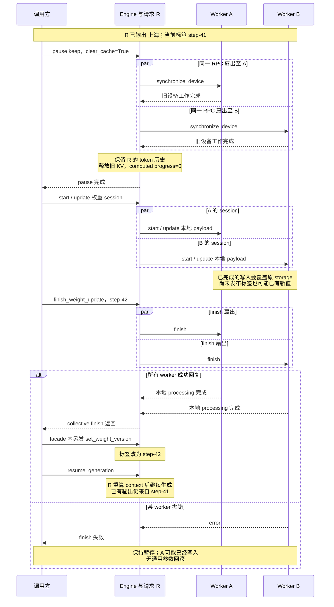
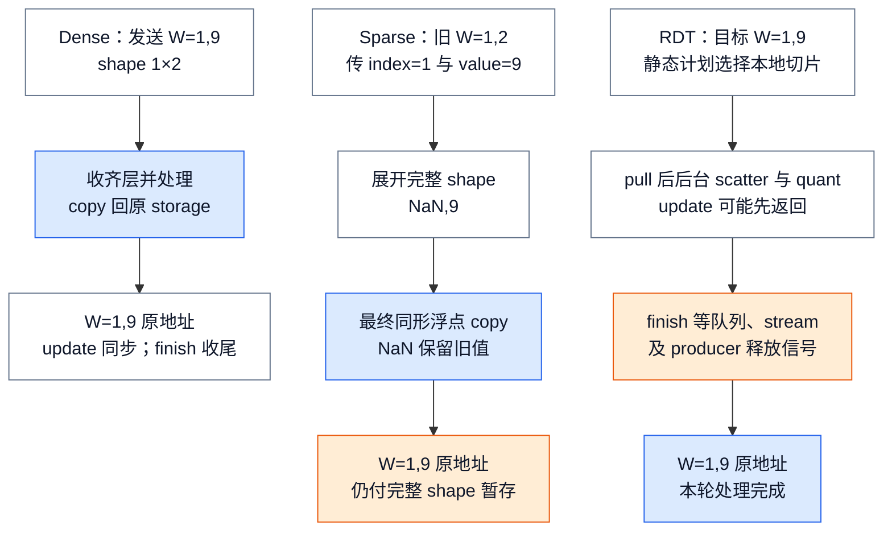

# vLLM 在线权重更新：受暂停保护的版本可见性协议

> **源码基线**：`vllm-project/vllm@199cb9b964822e59ab9b58d88e7be31eb419a2ae`（本地冻结 HEAD，2026-09-08）
> **主题**：用一次保留请求的在线换权重说明 pause、传输 session、原位写入、完成屏障和版本标签。再区分各数据通路的代价，以及缓存、draft、LoRA 和失败恢复的边界。
> **适用范围**：vLLM 侧在线权重替换；trainer 优化算法不在本页，并行组归分布式页，跨实例 KV 协议归分离式 serving 页。
> **最近更新**：2026-09-08。重新核验新基线，补具体换版过程、稀疏暂存成本与跨实例一致性限制。

## 1. 背景：真正的问题是可见性，不是把 bytes 搬到 GPU

假设请求 R 已在 `step-41` 下输出“上海”，训练端此时送来 `step-42`。部署希望保留 R，继续生成后续文字；它同时希望新 token 的 KV 都由新权重重算。所需操作是等待 `pause_generation(mode="keep", clear_cache=True)` 完成，执行一轮权重 session，等待 `finish_weight_update("step-42")` 成功，再恢复调度。已发送给用户的“上海”不会撤回，因此**同一请求可以跨版本，重新计算 KV 也不会使它变成单一策略版本的样本**。

这是按源码推演的教学场景，没有在本机运行 trainer 或 GPU。它先假定单个 Engine、已配置传输后端且没有外部 KV store；多副本与外部 KV 的额外条件见§7。在线更新的核心是调用方建立有序的暂停窗口；vLLM 没有提供整模型快照交换或跨 worker 原子提交。

在线 RL 会在 inference 请求仍可能存在时改变 policy 权重。若把“收到一个 tensor”直接等同于“新版本已提交”，一次 forward 可能跨过覆写窗口，某些 ranks 已换新而另一些仍旧，prefix/encoder cache 还可能继续复用旧权重的派生结果。官方 async-RL 文档因此把 pause/resume 定义为 weight synchronization 的 clean window，并明确 `keep` 模式会让同一请求在 pause 前后分别产生旧、新权重 token；`clear_cache=False` 还会保留 stale KV。

**为什么不采用“一个 reload RPC 就够了”的直观方案（分析推断）。** 权重传输同时跨越 control plane、backend data plane、多个 worker、本地模型 ABI、在线量化/post-process 与 cache/runner 派生状态。把这些动作压进一个不分阶段的 RPC，会让调用方无法区分“传输已排队”“每 rank 已写入”“post-process 已结束”和“版本标签已发布”。当前设计把它拆成 pause、session、finish、version、resume；代价是调用方仍要负责一致性编排，不能从这组 API 获得原子性保证。

## 2. 静态责任：四个 owner，四种不同的“完成”

| owner | 持有的状态 | 它能证明的完成 | 它不能证明的完成 |
|---|---|---|---|
| `LLM` / `AsyncLLM` / trusted control route | 更新调用顺序、可选 version 参数 | 前一个公开调用返回；同步或 async facade 已收到结果 | 请求已绑定该 version、cache 一定安全 |
| EngineCore / Executor | scheduler pause、worker fan-out、单个 `_weight_version` 字符串 | pause 完成时设备 idle；collective RPC 成功路径收齐 worker 回复、失败路径可在首个 error 早退；version 字符串已改 | workers 具有可回滚的共同快照 |
| Worker | 当前 target model、`_weight_update_active`、每 rank payload 选择 | 本 worker 的 start/update/finish 顺序合法 | 其他 worker 已完成，或失败前写入已撤销 |
| WeightTransferEngine / model loader | communicator、wire metadata、layerwise 或 sparse 写入、deferred work | backend-specific finish 已完成本地 post-process | EngineCore version 已发布、KV/encoder/spec state 已失效 |

因此至少要分开三件事：`update_weights` 返回可能只表示某个 chunk 已同步写入，deferred backend 甚至只表示工作已排队；`finish_weight_update` 才建立本 worker 的 processing-complete fence；version 则是所有 worker finish 调用返回后由 facade 单独更新的 control-plane label。

## 3. Preparation：pause 是正确性门，sleep 是可选的资源门

### 3.1 pause 的三种请求策略

`AsyncLLM.pause_generation` 先按需清 frontend multimodal cache，再把 mode 与 `clear_cache` 送入 EngineCore；返回前的 20 ms sleep 只改善最终 output event 的直觉顺序，注释明确说它不承担正确性。真正的 barrier 在 core：pause 完成时先对 workers 执行 `synchronize_device`，再按需清 cache，所以调用方拿到完成信号时，旧 forward 与 cache reset 都已越过设备边界。

| mode | in-flight request 后果 | 新请求后果 | 适合的版本边界 |
|---|---|---|---|
| `abort` | 全部请求终止并发送 abort outputs | 排队到 resume | 最清楚：旧请求不跨版本 |
| `wait` | 继续 step 直至 drain | 暂不 admission | 完整请求各自只看旧版；只在 background EngineCore path 支持，in-process core 明确拒绝 |
| `keep` | `PAUSED_ALL` 令 token budget 归零，请求冻结 | 排队到 resume | 请求逻辑 history 跨版本；是否重算旧 context 取决于 cache clear |

默认 `clear_cache=True` 不只是清 prefix hash 表。core 依次 reset prefix/KV、multimodal 与 encoder caches，并请求 connector 清理内部 cache；这一调用不证明外部存储已同步失效，详见§7.2。对 running 请求，prefix reset 会强制 preempt、释放 blocks、把 computed progress 归零、清空 `spec_token_ids`，再让请求回 waiting；reset 路径把在途 token 份额记录为 `num_stale_output_tokens` 并设置 `drop_stale_output=True`，同时归零 placeholders，避免同一位置在 resume 后重复提交。普通容量抢占可以保留旧 token 的交付，不能把本处的丢弃策略推广到所有抢占。这条路径把旧 token history 保留为新的输入，却让其 KV、encoder feature 与 draft tail 在新权重下重建。

### 3.2 sleep 不是 weight transaction 的隐式步骤

`sleep(level=0)` 只 pause scheduling；level 1 还 offload weights 并丢弃 KV；level 2 丢弃全部 GPU allocation。core 总是先完成 pause，才把 level 1/2 交给 executor。worker 在 suspend 前后同步设备；level 2 还把 model 与 draft buffers 克隆到 CPU，wake 时按 `weights` tag 恢复。

**边界**：start/update/finish API 没有自动 wake，也没有“在 sleeping allocation 上更新”的专用 guard。测试给出的深睡恢复顺序是先 wake `weights`、再 reload，最后 wake `kv_cache`。因此，sleep 可为 colocated trainer 腾显存，但它是调用方必须管理的额外 resource state。基类 `EngineCore.resume_scheduler` 只把 pause state 设为 `UNPAUSED`，`AsyncLLM.resume_generation` 经 client 调用对应 Core 方法，不验证 allocation residency；DP 子类还包含§7.5的组同步；只有经 `wake_up` 恢复 sleep 的专属路径，才在 executor 不再 sleeping 后自动 resume。

## 4. 请求 R 跨过更新窗口时，哪些状态真的改变

**图 1 规格**：固定请求 R 与两个 inference workers A/B，R 在 `step-41` 已有输出。沿序列图依次展示 pause 的 idle fence、R 的逻辑历史保留而 KV 归零、两个 rank 各自 start/update/finish，以及成功后另发 `step-42` 标签与 resume。失败支线停在“保持暂停、参数可能部分已变”，不画伪造的逆向回滚。

这张图把 facade 的两个调用展开显示：`finish_weight_update(version)` 内先等待 collective finish，再调用独立版本接口。worker RPC 实际先广播再收回复；图中的箭头只说明依赖，不声明 ranks 串行计算。若 API 没有传 version，成功 finish 也不会自行生成新标签。陌生读者应能指出：R 的历史、参数内容、版本字符串是三件不同的状态，只有最后两个不会因为名字相同就自动绑定。

## 5. Staging 与 validation：隔离 metadata，不隔离第二份模型

### 5.1 init 与 start 只建立通道和 session

weight-transfer engine 只有在 worker model 已加载后才创建，因为它直接持有目标 model 引用；未配置 backend 时任何 session 操作都显式失败。`init_weight_transfer_engine` 先把 dict 解析为 backend typed dataclass，再 dispatch 到 backend init。具体动作并不相同：dense NCCL 记录 trainer wire params 并创建 process group；IPC 不做 data-plane rendezvous，只记录 `packed` wire param；sharded RDT 则配置 ring、绑定 producers、dry-run bake、构建 static call plan、预注册 buffers 并启动 processing worker。这些都是显式 init phase，不是每个 version 的 finish/commit。

start 的 worker guard 拒绝 session 嵌套；成功后才设置 `_weight_update_active`。若 start 本身失败，worker 只恢复默认 target 并重新抛错。draft 更新另有 target：只有 backend 声明支持、runner 暴露实际 draft model 且 speculative config 存在时才可选；sparse NCCL 与 sharded RDT 明确不支持 draft target。

### 5.2 update 的“staging”因 backend 而异

| backend family | update 时发生什么 | finish 时补什么 | visibility / cost |
|---|---|---|---|
| dense NCCL / IPC | typed metadata 先核对 names、dtype_names、shapes 列表长度与 handle 数；这些检查不是权重内容一致性的证明；checkpoint weights 经 `model.load_weights` 逐层进入 reload pipeline | finalize deferred attention、padding 与 post-load process；IPC 另释放 importer 引用 | 每层完成后即 copy 回原 kernel storage，不存在整模型 shadow copy；IPC按目标设备 UUID重建句柄 |
| sparse NCCL | 校验 patch metadata 后，构造 NaN 占位的完整 checkpoint tensor，再经 native loader 原位修改已初始化 tensor | start/finish 都是 no-op | 网络只发送索引和值，但本地仍有完整 checkpoint shape 暂存；没有 rollback 隔离 |
| sharded RDT | 按 baked plan 只 pull 本 worker slice；GPU post-process 可在 background thread 与下一 chunk overlap | `drain_pending` 后才 finalize layerwise reload | `update_weights` 返回可只表示 queued，finish 才是 processing fence |

RDT 的静态计划还有显式组合限制：`init_transfer_engine` 遇到 `enable_eplb=True` 直接 `RuntimeError`，因为 [[18_vllm_distributed_inference_analysis|EPLB]] 会改变专家槽位，初始化时录下的目标位置不再有效。其类约定要求 Ray executor、NIXL 传输和可记录的 loader 操作；初始化执行版本检查、dry-run bake、buffer 预注册，不能把这项能力当成任意 loader 的通用加速。`drain_pending()` 依次等待 scatter 队列、quant 队列和两条 CUDA stream，最后等待已发往 producer 的 free-group RPC，防止上一轮释放信号误计入下一轮；它比“Python队列已空”更强。

普通 base engine 在 `receive_weights` 后执行 device synchronize，保证下一 step 看见写入；声明 `defers_processing` 的 backend 则必须把这份保证推迟到 `finish_weight_update`。这就是为什么“bytes 已到”“post-process 已结束”必须分开。

layerwise reload 也不是先构造完整新模型再交换指针。它记录原 kernel tensors，把 live layer 临时恢复成 meta 形态，收齐一层后 materialize、load、quantize/repack，再把结果 `copy_` 回原 tensor storage，以保住 CUDA Graph 引用。**分析推断**：稳定地址可避免因参数地址变化而全面 graph recapture，却也意味着完成的 layer 在 version label 发布前已经覆盖旧值；安全性依赖 pause window，而不是 staging isolation。

### 5.3 同一个目标值，三种路径付出不同代价

取一个支持本地同形浮点 copy 的教学参数 W，shape 为 `1×2`，旧值为 `(1, 2)`，目标为 `(1, 9)`。这不是某个真实模型的参数名或通用兼容认证，而是重放各后端已读规则的最小例子。

- Dense NCCL/IPC 给出完整目标 `(1, 9)`，沿 layerwise reload 收齐该层、materialize、按需量化/repack，再 copy 回原 kernel storage。临时按层处理可限制整模型双份驻留，但不消除接收与处理的临时内存。
- Sparse NCCL 只传 checkpoint 平坦索引 `1` 和新值 `9`。本地构造 `(NaN, 9)`，模型原生 loader 仍负责名称和 TP 映射；最终 `copy_non_nan_` 用 `torch.where` 保留 NaN 对应的旧值，得到 `(1, 9)`。它减少了网络 payload，**并没有把本地暂存缩成一个元素**。
- Sharded RDT 按初始化计划 pull 本 worker 所需切片，再经后台 scatter/quant 恢复原 storage。本例把 W 当作该 worker 的全部切片；更新返回可能仍有后台处理，finish/drain 后才能把 `(1, 9)` 视作处理完成的本地状态。

**图 2 规格**：三条自上而下的独立路径复用 W 的旧值与目标值，分别显示完整传输、稀疏 NaN 展开、RDT 后台完成；终点均标注原地址。橙色框标记暂存或同步成本，不画比例时间与实际张量网格。

Sparse 的 NaN 是“保持原值”标记，所以输入新值不得含 NaN，索引必须在界内且默认不得重复；校验发生在加载前。`_load_nan_masked_weights` 临时替换 `torch.Tensor.copy_`，在 `finally` 恢复函数，但不恢复已经写入的参数。它只支持最终同形浮点 copy；复合、多阶段、其他写法的 loader 不属于支持合同，不能靠一次形状检查认证。`max_chunk_bytes` 是分批目标而非单 tensor 硬上限：一个完整 tensor 可以超过它。同一调用不能混用 dense/sparse；同名连续 patch 会拆成顺序 loader 调用。这些约束解释了为何节省传输量不等于稀疏加载全面适用。

陌生读者检查：能从 `index=1/value=9` 推回 NaN 暂存与结果 `(1,9)`，且不会把 RDT 的 update 返回误认成 finish；图只解释本地数值与完成边界，不宣称外部 NCCL、CUDA IPC 或 Ray/NIXL 内部已被审计。

## 6. Finish、version commit 与 post-commit work

### 6.1 finish 是 processing fence

Worker 只有 active session 才允许 finish。backend finish 返回后，它恢复默认 update target、关闭 session；主模型更新还会 reset runner 的 LoRA state，draft session 则刻意不动 LoRA。这里的“commit”只表示该 worker 不再有本 session 的 deferred processing。

多 worker facade 用 `collective_rpc` fan-out。multiprocessing executor 先把命令放入 broadcast queue；成功路径依次消费全部目标 response queues，但遇到首个 non-`SUCCESS` reply 就立即抛错，不再消费剩余 queues。Ray executor 则对全部 worker refs 做 `ray.get`。因此，只有成功返回才构成 all-replies barrier；失败时只能确认命令已 fan-out，facade 可能早退，并且两条 executor path 都没有 prepare vote、commit record 或补偿动作。

### 6.2 version 是后置标签，不是数据提交协议

同步和 async facade 都先等待 worker `finish_weight_update`，然后才在可选参数存在时另发 `set_weight_version`；测试验证 update 完成后 version 仍为 `default`，带 version 的 finish 返回后才变为 `step-42`。EngineCore 只保存一个 caller-supplied opaque string，并允许 `update_weight_version` 在完全不改权重时独立改写。

因此 version 可用于 control-plane observability，却不是：

1. request 绑定的 immutable snapshot；
2. workers 验证参数内容一致的 checksum；
3. 一笔跨 workers 原子提交的 epoch；
4. 防重复、单调递增或 compare-and-swap token。

后四点是依据上述存储与调用顺序得到的**源码边界分析**。尤其是公开 API 可以单独改 label，说明 label 与实际 parameter bytes 之间没有强制不变量。

### 6.3 cache 与 runner work 并不都在 commit 之后

一个容易误判的地方是把 finish 想成“统一 invalidation hook”。实际上 weight-transfer finish 明确绕过 `GPUModelRunner.reload_weights()`，只为主 target reset LoRA state。普通 runner reload 会在末尾同时 reset LoRA、encoder 与 MM cache；这段 tail 不会被 weight-transfer 自动继承。prefix/KV、MM、encoder 的本地失效，以及对 connector 的清理请求，因此位于 **pause preparation** 的 `clear_cache=True` 路径，不是 version commit 后。

这条安排胜过 finish 后才清 cache 的原因是**分析推断**：cache reset 需要先证明 device idle，还可能强制 preempt running requests；把它放在 pause barrier 内，可以在任何参数原位覆盖前先处理旧派生状态。但代价是调用方若跳过 pause，或显式 `clear_cache=False`，finish/version API 不会替它补救。

## 7. 可见性审计：request、KV、spec draft 与 runner

### 7.1 in-flight request

- `abort` 与 `wait` 给出最清晰的 per-request version boundary：请求要么被终止，要么在旧权重下完成，再开始更新。
- `keep` 保留逻辑请求与已输出 token；resume 后同一 request 继续。因此它天然允许一个输出序列跨版本，官方文档也明确把 pause 前后标成 old/new weights。
- 没有 request-level version 字段参与 Scheduler admission；EngineCore 的 version 只是独立查询字符串。由此可知（**分析推断**），调用方若需要 rollout 只来自单一 policy version，应使用 abort/wait 或在更上层分段，而不能仅依赖 `get_weight_version()`。

### 7.2 KV、prefix、multimodal 与 encoder cache

`keep + clear_cache=True` 会把 running request 退回 waiting、computed progress 归零并重算 context；async regression test要求 reset 时丢弃在途 stale positions，随后 resume 不得重复或乱序。`clear_cache=False` 则保留 KV；文档明确承认 context 中可能仍反映旧权重。此外 encoder cache 注释直接要求权重更新时失效旧 vision embeddings，且 core 同时清逻辑 manager 与物理 runner cache。

这证明 cache safety 不是由 version label 推导出来的。若调用方更新了会影响 text KV、multimodal encoder 或 connector state 的参数，源码提供的统一调用入口是 pause 时 `clear_cache=True`；具体 connector 的清理能力仍须另外证明；局部更新是否允许保留某类 cache，本基线没有按 parameter dependency 自动判定，属于 **unknown / caller policy**。

> [!contradiction] 清理接口返回不等于外部 KV 已消失
> Core 注释希望 connector 与本地 cache 一起清理，但 `KVConnectorBase_V1.reset_cache()` 默认只记日志并返回 `None`；`Scheduler.reset_connector_cache()` 只把显式 `False` 当失败，且 `EngineCore._reset_caches()` 不检查 `reset_prefix_cache()` 返回的布尔值。因此 pause 成功可以证明设备同步和清理调用顺序，不能证明任意外部 store 已完成失效。若仍有远程传输持有 block，强制抢占后的本地 KV reset 还可能抛 `RuntimeError`；这也不是无条件成功路径。

分离式部署的 producer/consumer 必须在相容权重状态下交接 KV。`set_weight_version` 不会把标签写入 connector 兼容协议或清理远端实例；外部协调者需要暂停相关实例、核验各后端失效/隔离能力并确认所有实例更新完成，再开放流量。这是由接口边界推得的部署前提，具体 NIXL 身份与完成规则见 [[22_vllm_disaggregated_kv_serving_analysis|跨实例 KV 交接]]。本页不声称存在自动版本化的 KV namespace。

### 7.3 speculative draft

target model 与 draft model 是两个独立 update targets；`start_draft_weight_update` 只是把当前 session retarget 到真实 draft model，结束后恢复 default target。更新 target 不会自动更新 draft，反之亦然。

当 `clear_cache=True` 强制 preempt 时，Scheduler 明确清空 request 的 `spec_token_ids`。若 `keep + clear_cache=False`，pause 只令 token budget 为零，没有对应的 draft-state invalidation；旧 proposal 是否在 resume 后被新 target 验证、概率型 proposer 还持有哪些旧分布辅助状态，本页所查 online-update tests 没有端到端 oracle。保守结论是 **unknown**：源码证明了 clear 路径会丢弃 draft tail，却没有证明 retain 路径对所有 proposer 和 draft-weight update 都安全。

### 7.4 model runner、CUDA Graph 与 LoRA

layerwise reload 把处理后的值 copy 回原 storage，目的就是保留 kernel/CUDA Graph references；相关 Marlin 回归测试还核对 workspace 与 sort-index 地址保持不变，说明参数以外的辅助 storage 也必须遵守图引用合同；不能仅由 weight version 变化推出必须 recapture，或反过来保证所有 loader 都可复用图，具体捕获约束见 [[19_vllm_compilation_cudagraph_analysis|编译与 CUDA Graph]]。主模型 finish 显式 reset LoRA state，draft finish 不做这一步；测试验证 draft finish 不清 LoRA；源码没有进一步解释这项差异的设计理由。除此之外，weight-transfer tail 没有调用 runner 的 encoder/MM reset；它依赖 pause cache path。

### 7.5 多 DP engine 的暂停共识

对 `DPEngineCoreProc` 路径，pause 先设本地 `pending_pause` 并推动 stepping，在 `sync_dp_state` 中等所有 rank 达成暂停共识；随后设置 `ignore_start_dp_wave`，防止迟到的 wave 消息重新唤醒。resume 还拒绝 pause 未完成的情况，并在重新 stepping 前做 DP 同步。因此不能把基类的本地 pause flag 当成完整分布式屏障。独立进程实例背后的外部负载均衡器也不自动加入这个组，调用方必须覆盖每个目标实例；服务拓扑继续读 [[13_vllm_serving_control_plane_analysis|Serving 控制面]]。

## 8. Failure / rollback：session cleanup 不等于参数回滚

Worker 的 update 异常会把 `_weight_update_active` 置为 false、恢复默认 target 并重新抛错；测试只断言 session 已关闭、下一次 start 可重新开始。代码没有保存整模型旧 snapshot，也没有把先前 chunk、已经完成的 layer 或 sparse patch 写回旧值。start 失败同样只 reset target；finish 失败甚至发生在 worker 清 active flag 之前。

**跨 worker 失败边界（分析推断）**：命令在等待回复前已经 fan-out；各 worker 随后各自执行原位 mutation。multiprocessing facade 可在消费到首个失败 reply 时早退，剩余 reply 未被消费不等于对应 worker 未执行；如果 rank A finish 成功而 rank B 抛错，facade 不会继续写 version，但 rank A 的新参数不会自动撤销。这里没有 two-phase commit。最安全的恢复不是盲目 resume，而是保持 pause，重建所有 ranks 的一致状态——例如重新推送一份完整已知版本，必要时重启 Engine——然后清理派生 cache，再由外部 coordinator 重新发布 version。源码没有提供通用 `rollback_weight_update`，所以具体恢复方案属于部署 policy，而非 vLLM 保证。

最后还有三条操作不变量：

1. **先 pause idle，再改原位 storage**；否则稳定地址只防 graph 失效，不防 concurrent forward 读到混合层。
2. **每 rank 必须走同一 session 次序和匹配 payload**；list payload 由 `DP rank × local world size + worker rank` 选择本地项。并行组与 collective 顺序的内部机制由分布式推理 owner 解释。
3. **finish 成功后才发布 version；resume 前由调用方建立 cache/resource precondition**。代码保证 facade 内 finish 先于 version，但 generic resume 不检查 residency；只有走 sleep 的 `wake_up` path 才以 `is_sleeping` guard 自动 resume，cache 与 wake 的整体排序仍由调用方负责。

## 9. 核验与源码阅读路线

本批静态核验源码和测试，没有实际执行 GPU 更新、NCCL rendezvous、IPC 传输、Ray/NIXL 或故障注入。fake backend 测试只证明 API 顺序/参数透传；不能据此宣称真实传输、量化精度或多机恢复已验收。

| 从哪里进入 | 决定性操作与测试 |
|---|---|
| backend 的实际选择 | `vllm/v1/worker/gpu_worker.py::Worker.load_model / _check_weight_transfer_engine` → `vllm/distributed/weight_transfer/factory.py::WeightTransferEngineFactory.create_engine` |
| pause、cache 与资源窗口 | `vllm/v1/engine/async_llm.py::AsyncLLM.pause_generation / resume_generation` → `vllm/v1/engine/core.py::EngineCoreProc.pause_scheduler / EngineCore._finish_pause / _reset_caches / sleep / wake_up`；`tests/v1/engine/test_engine_core.py::test_pause_synchronizes_device_before_cache_reset`；`tests/basic_correctness/test_mem.py::test_deep_sleep` |
| 请求回退与远程清理限制 | `vllm/v1/core/sched/scheduler.py::Scheduler.reset_prefix_cache / _preempt_request / reset_connector_cache`；`vllm/distributed/kv_transfer/kv_connector/v1/base.py::KVConnectorBase_V1.reset_cache`；`tests/v1/core/test_async_scheduler.py::test_reset_prefix_cache_with_inflight_output_under_kv_pressure` |
| session 与版本发布 | `vllm/entrypoints/llm.py::LLM.finish_weight_update`、`vllm/v1/engine/async_llm.py::AsyncLLM.finish_weight_update` → `vllm/v1/worker/gpu_worker.py::Worker._start_weight_update / update_weights / finish_weight_update` → `vllm/v1/engine/core.py::EngineCore.set_weight_version`；`tests/entrypoints/weight_transfer/test_weight_transfer_llm.py::test_full_weight_transfer_flow` |
| rank payload、失败与 draft | `tests/v1/worker/test_gpu_worker_weight_transfer.py::test_rank_local_update_includes_data_parallel_rank / test_update_resets_active_on_error / test_finish_draft_session_keeps_lora_state`；`vllm/v1/executor/multiproc_executor.py::MultiprocExecutor.collective_rpc`；`vllm/v1/executor/ray_executor.py::RayDistributedExecutor.collective_rpc` |
| dense 与 IPC | `vllm/distributed/weight_transfer/base.py::WeightTransferEngine.update_weights`；`vllm/distributed/weight_transfer/nccl_engine.py::NCCLWeightTransferUpdateInfo / NCCLWeightTransferEngine`；`vllm/distributed/weight_transfer/ipc_engine.py::IPCWeightTransferUpdateInfo / IPCWeightTransferEngine` |
| sparse 的展开、校验和原位写 | `vllm/distributed/weight_transfer/sparse_nccl_engine.py::SparseNCCLWeightTransferEngine.receive_weights` → `vllm/model_executor/model_loader/checkpoint_weight_patch.py::load_checkpoint_weight_patches / _load_nan_masked_weights`；`tests/model_executor/model_loader/test_checkpoint_weight_patch.py::test_dense_and_sparse_patches_follow_packed_tp_loader` |
| RDT 静态计划、拒绝 EPLB、最终完成 | `vllm/distributed/weight_transfer/sharded_rdt_engine.py::ShardedRDTWeightTransferEngine.init_transfer_engine / _build_static_plan / update_weights / drain_pending / finish_weight_update` |
| 稳定 storage 与普通 reload 的不同收尾 | `vllm/model_executor/model_loader/reload/layerwise.py::initialize_layerwise_reload / _layerwise_process / _copy_and_restore_kernel_tensors`；`vllm/v1/worker/gpu_model_runner.py::GPUModelRunner.reload_weights`；`tests/model_executor/model_loader/test_reload.py::test_marlin_post_load_preserves_runtime_tensor_addresses` |
| DP 暂停与恢复 | `vllm/v1/engine/core.py::DPEngineCoreProc._pause_complete / _has_global_unfinished_reqs / resume_scheduler`；`tests/v1/engine/test_engine_core.py::test_dp_sync_interval_idle_pause_consensus_on_first_step` |

同一源码树的 `docs/training/async_rl.md` 明确解释 keep 的跨版本输出和 stale KV；其中用某个 backend 名称简写 internal/external DP 的描述，不能替代本基线的具体 client 与 DP group 选择。外部 transport 的内部容错、依赖库 CUDA tensor 重建与 trainer 的版本编排均越过本页证据边界。

## Related Pages

- [[02_engineering/03_infer_frameworks/vllm/06_vllm_engine_architecture_analysis|vLLM Engine 架构]] —— 解释 utility call、EngineCore 与 Executor/Worker 的进程和 failure boundary；本页只使用该接缝承载更新控制消息。
- [[02_engineering/03_infer_frameworks/vllm/08_vllm_kv_cache_management_analysis|vLLM KV Cache 管理]] —— 拥有本页只审计的 block、prefix、refcount、preempt 与 reset 内部机制。
- [[02_engineering/03_infer_frameworks/vllm/09_vllm_model_library_analysis|vLLM 模型与权重 ABI]] —— 展开 `model.load_weights`、并行参数映射与 LoRA attachment；本页拥有其在线替换事务。
- [[02_engineering/03_infer_frameworks/vllm/12_vllm_model_runner_v2_analysis|vLLM Model Runner V2]] —— 解释 persistent request rows、device state 与 graph 生命周期，帮助判断 pause/reset 对 runner 镜像的影响。
- [[02_engineering/03_infer_frameworks/vllm/16_vllm_speculative_decoding_analysis|vLLM 投机解码]] —— 拥有 draft propose/verify/accept 与 device/CPU rollback；本页只审计换权重时 draft state 是否被失效。
- [[02_engineering/03_infer_frameworks/vllm/18_vllm_distributed_inference_analysis|vLLM 分布式推理]] —— 拥有 rank/group/collective 顺序；本页只说明 weight-update control fan-out 和 rank-local payload 边界。
- [[02_engineering/03_infer_frameworks/vllm/23_vllm_observability_reliability_analysis|vLLM 可观测性与可靠性]] —— 承接 version label、partial-rank failure、pause latency 与 recovery 的生产观测和故障归因。
