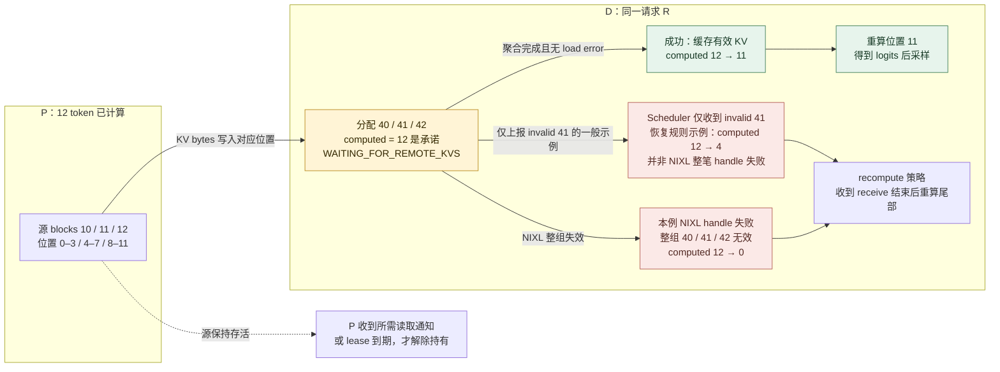
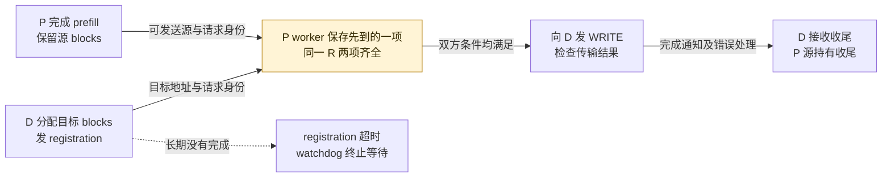
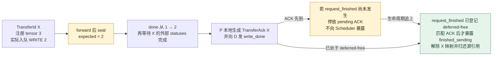
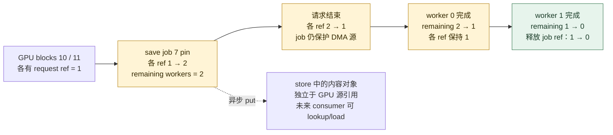

# vLLM 分离式 KV Serving：用跨 Engine 协议交接可计算状态

> **源码基线**：`vllm-project/vllm@199cb9b964822e59ab9b58d88e7be31eb419a2ae`。
> **主题**：同一请求的 KV 如何跨 Engine 交接、取得可计算性，并解除源和目标的持有。
> **适用范围**：V1 KV connector 的 Scheduler/worker 合同，NIXL pull/push、MoRIIO 和 Mooncake store 的不同实现；源码与测试静态核验，未实跑多机或外部传输服务。
> **最近更新**：2026-09-08。

## 1. 十二个 prompt token，搬完三个 block 为什么还要再算一个 token

请求 R 有 12 个 prompt token。假设普通 full attention、单个 transferable group、同构单 rank、block size 为 4，consumer 本地没有前缀命中。producer P 计算后将源 block `[10,11,12]` 对应的交接信息交给 decode consumer D；D 必须先分配目标 `[40,41,42]`，再等待 KV 进入这些地址。block 编号是便于重放的假设，协议和状态转换来自下面的源码。

在 NIXL 普通 `do_remote_prefill` 分支，远端命中数是 12；D Scheduler 可以把 `num_computed_tokens` 暂记为 12，但同时把 R 放入 `WAITING_FOR_REMOTE_KVS`，这个数此时只是待兑现的承诺。收到成功的 receive 完成、缓存这些 block 后，Scheduler 又将 computed 数改为 11：KV 不含可直接用于下一次采样的最后一个 token 的 logits，因此还要重算最后一个 prompt token。P 的请求结束、D 的目标分配、字节完成和可以采样分别是四件事。

源码依据是 `vllm/distributed/kv_transfer/kv_connector/v1/nixl/pull_scheduler.py::get_num_new_matched_tokens` 与 `vllm/v1/core/sched/scheduler.py::schedule/_update_waiting_for_remote_kv`。Mamba 不套用这个完整 12-token 快照：`nixl/base_scheduler.py::_get_remote_prefill_token_count/_truncate_mamba_request_for_prefill` 在相应 P/D 路径使用 N−1 边界，使 D 重算末 token 时从正确的 recurrent state 开始。

分离部署希望分别调优 TTFT 与 ITL，隔离 prefill 对尾部 ITL 的影响。`docs/features/disagg_prefill.md` 也明确提醒它不是吞吐提升承诺。本页使用下列**分析模型**判断隔离收益是否覆盖新增成本，未提供性能实测：

$$
T_{\text{request}}=T_{\text{route}}+T_{\text{prefill}}+T_{\text{KV handoff}}+T_{\text{decode queue}}+T_{\text{decode}}.
$$

比 copy 本身更难的是所有权：P 的 block 在远端读取结束前不能被复用，D 的 block 在数据有效前不能进入 attention。两边的请求到达顺序也可能不同，因此需要按身份查找，不能靠 FIFO 配对；仓库 `vllm/distributed/kv_transfer/README.md` 说明了这个动机，其中早期 pipe/lookup 抽象不等同于当前 V1 factory API。

本页拥有跨 Engine 身份、transfer groups、数据与控制交接、完成和回收。单 Engine block allocator 与 prefix cache 归 [[02_engineering/03_infer_frameworks/vllm/12_vllm_kv_cache_management_analysis|12]]，实例入口和路由归 [[02_engineering/03_infer_frameworks/vllm/17_vllm_serving_control_plane_analysis|17]]。

## 2. 身份相同、协议兼容、布局可变换是三种检查

`vllm/config/kv_transfer.py::KVTransferConfig` 声明 connector 名称、`engine_id`、buffer device/size、`kv_role`、`kv_rank`、`kv_parallel_size`、IP/port 与 extra config。未指定 engine ID 时生成 UUID；角色可为 producer、consumer 或 both。buffer/rank 字段在不同实现中的含义要看 connector，不能将其注释里的典型 1P1D 用法当作全部后端的限制。`kv_connector_module_path` 支持外部类，`enable_permute_local_kv` 是实验性布局转换开关。

| 身份层 | 它解决的错误 | 仍不能证明什么 |
|---|---|---|
| Engine | 远端 agent、地址、heartbeat 发错实例 | 同名模型权重已经同步 |
| Request / TransferId | 两侧乱序、复用 request ID、ACK 串到另一笔交接 | 所有目标字节已写完 |
| rank / transferable group | shard、层组和 block table 对错位置 | 布局一定相同，或所有 rank 已完成 |

NIXL 先解码 `NixlHandshakePayload` 外层兼容 hash，通过检查后再解码 agent metadata。当前 `NIXL_CONNECTOR_VERSION=10`；`compute_nixl_compatibility_hash` 实际包含 vLLM/connector 版本、model 字符串、dtype、KV head 数、head size、层数、attention backend、cache dtype、HMA 标志、speculative factors 与 transfer mode。EAGLE 分支还纳入相应 draft model/revision 等因子；draft attention backend 留给运行期检查。这里按实际 factors 字典陈述，不能从注释扩大成任意模型属性都被覆盖。

**纠正：TP size、block size、KV layout 不进入这个 hash。** 它们刻意留给 `nixl/base_worker.py::_validate_remote_agent_handshake` 与 transfer topology 做异构检查/映射。`NixlAgentMetadata` 带地址、设备、block 长度/stride/layout、block size、SSM 大小、physical/logical block 比、DCP/PCP 等信息；remote TP 则由握手参数传入，并非旧稿所称全部几何字段都在同一个 metadata 对象或 hash 内。

运行期检查也不是“任意异构均可”：DCP 大小必须互相整除；异构 block size 不支持 host buffer；部分 TP 与 KV replication 组合不支持；非 MLA 的 layout 通常须相同，实验性 LBHNC 到本地布局转换还受 HMA 限制；Mamba 的 physical/logical 比异构且启用 prefix caching 会拒绝。正确条件是**此模型/后端组合存在被实现的映射**，而非全部尺寸逐项相等。源码入口：`nixl/metadata.py::compute_nixl_compatibility_hash/NixlAgentMetadata`、`nixl/base_worker.py::_nixl_handshake/_validate_remote_agent_handshake`，均位于 `vllm/distributed/kv_transfer/kv_connector/v1/`。

这个 hash **没有运行期 `weight_version`**。token 一样、握手通过仍不证明两端持有同一轮训练权重；更新版本和缓存清理的接缝见 §8 与 [[02_engineering/03_infer_frameworks/vllm/29_vllm_weight_transfer_online_update_analysis|29：权重传输与在线更新]]。

## 3. 只交接可传输组，并把本地 ownership 投影给 connector

混合模型的 cache 不一定全部可外传。`vllm/v1/kv_cache_interface.py::KVCacheGroupSpec/KVCacheConfig` 以 `enable_kv_transfer` 筛选 `transfer_group_ids`、`transfer_groups` 和 `transfer_group_index_by_layer`。例如本地 group 0 禁用、group 1 启用，则 transfer tuple 的第 0 项代表本地 group 1；混用两种 index 会把合法 block ID 指向错误状态。

`nixl/base_scheduler.py::get_exchange_clipped_blocks` 按可传输组裁剪交换范围；初始化为 sliding-window 计算所需尾部范围，为 SSM 处理 speculative slots。full attention 历史、滑窗尾段与 recurrent 边界不能互换。factory 的 `KVConnectorFactory.create_connector` 在 HMA 开启而 connector 不支持时直接拒绝；支持 HMA 的实现经 `SupportsHMA.request_finished_all_groups` 接收所有组，再选择自己的 transfer 投影。

Scheduler 和 worker 各有一份 connector：前者决定哪个请求要哪些 blocks，后者持有设备地址和传输对象。factory 在 engine-core 与 worker 创建相应角色。因此跨 Engine 协议只能延迟释放、增加 job ref 或报告目标失效，不能绕过本地 KV manager 的分配与引用规则。

## 4. 沿 R 走完四个 ready，再把结果交还 Scheduler

| 边界 | R 的状态/证据 | 承担者 |
|---|---|---|
| 发现 | 远端可复用 token 数已经决议；`None` 是待决，不是 miss | scheduler connector |
| 目标 | `[40,41,42]` 已由本地 allocator 分配 | Scheduler → `update_state_after_alloc` |
| 数据 | 所需 transfer 完成，并做完本实现必要的设备同步/布局处理 | worker connector |
| 生命周期 | 完成与错误返回 Scheduler，允许晋升 R 或解除 P 持有 | executor 聚合 → Scheduler |

<!-- Figure spec: 问题=12-token remote hit 如何从承诺变成可计算且安全回收；类型=状态/数据映射原理图；实体=P三源块、D三目标块、有效前缀计数与失败分支；关系=同一逻辑位置的复制及computed状态提交；图独有信息=allocation不发布cache、仅invalid41的一般恢复截回4而NIXL整组失败截回0、成功仍重算第12token；阅读顺序=左到右；无call graph；证据=Scheduler.schedule/_update_waiting_for_remote_kv/_update_requests_with_invalid_blocks与NixlPull._read_blocks；数值=声明的单组同构算例；验证=Mermaid渲染和实图检查。 -->

图中失败分支是 **Scheduler 仅收到 `invalid_block_ids={41}` 时的一般恢复规则示例**，并选择显式 `recompute` 策略；默认 `fail` 会终止请求。它不是当前 NIXL 整笔 handle 失败的重放：`nixl/base_worker.py::_handle_failed_transfer` 在本例非 HMA、无本地命中的条件下，会把该请求整组目标 `[40,41,42]` 标为 invalid，因此 computed 从 12 截回 **0**。一般规则按第一个 invalid block 前的连续有效前缀截断，不能保留其后的孤立“成功块”。

完整闭环的源码路线如下。此处展开的是 **Model Runner V2** hook 路径；其他 runner 仍受 connector ABI 约束，但不据此假设提交时机相同。

1. `vllm/v1/core/sched/scheduler.py::schedule` 先取得本地 prefix，把 block-aligned local hit 交给 `get_num_new_matched_tokens`。远端结果未决就跳过本轮；远端严格超过本地 partial tail 时撤掉该 tail，避免外部 load 与本地 CoW 竞争。
2. async load 先做 `allocate_slots(..., delay_cache_blocks=True)`，计入其他在途 prefill 的预留，不提前发布 cache，也不在本次 load 分配 speculative lookahead。成功后调用 `update_state_after_alloc` 并进入 remote waiting；没有本地容量就连 receive 都不启动。remote hit 不是容量预留。
3. metadata 随 `SchedulerOutput` 到 `vllm/v1/worker/gpu/kv_connector.py::ActiveKVConnector.pre_forward`：先处理 preemption、绑定 metadata，sync load 立即启动，async load 延后到 post-forward。`no_forward` 仍跑 pre/post，并返回 connector-only output；0-token step 可以推进 I/O。
4. `vllm/model_executor/layers/attention/kv_transfer_utils.py::maybe_transfer_kv_layer` 在使用该 hook 的 attention 前调用 `wait_for_layer_load`，之后 `save_kv_layer`。这是 connector 的同步位置；NIXL async 路径主要靠跨 step 等待，MoRIIO WRITE 可利用逐层 save，不能把每个 hook 都当成每个实现里必有一次阻塞 I/O。
5. `ActiveKVConnector.post_forward` 启动尚未提交的 async load，按需 `wait_for_save`，收集 `get_finished`、invalid blocks、统计及 worker metadata，清除本步绑定；`ModelRunnerOutput` 将它们带回 executor。
6. `vllm/distributed/kv_transfer/kv_connector/utils.py::KVOutputAggregator` 按 expected finished count 跨 worker/step 聚合 send/receive 完成，并合并错误。默认 count 来自 connector 或 world size，也可由 worker 输出更新；不是固定“收到 rank 0 就算全部完成”。
7. `Scheduler.update_from_output` 先 `_handle_invalid_blocks` 撤销失败区间的 computed 假设，末段 `_update_from_kv_xfer_finished` 接收完成集合；下步 `_try_promote_blocked_waiting_request` 才将 consumer 晋升。producer 的 `finished_sending` 则调用 `_free_blocks`。已经结束的 consumer 仍要等接收结束才释放被 I/O 持有的目标。

所以 `finished_recving` 是**这笔接收可进入收尾**，不是单独的成功证明：失败也需要这个信号才能让 waiting 请求退出。正常成功还要求错误集为空且各实现的数据后处理完成。一般 block 生命周期详见 [[02_engineering/03_infer_frameworks/vllm/12_vllm_kv_cache_management_analysis|12]]，调度规则详见 [[02_engineering/03_infer_frameworks/vllm/11_vllm_scheduler_analysis|11]]。

## 5. 直连的三条路径：谁发起数据，谁归还完成证据

### 5.1 NIXL pull：D 知道地址后发 READ，P 等读者通知

`nixl/pull_worker.py::start_load_kv` 保存接收 metadata，必要时后台握手，再 `_read_blocks_for_req` 按 TP/DCP/group 映射到远端 rank。`_read_blocks` 构造 local/remote descriptors、调用 NIXL `make_prepped_xfer("READ")` 与 `transfer(handle)`，将 handle 留到未来 step 检查。这里开始交给外部 NIXL 库；本仓库证明提交、轮询和后处理的顺序，不证明底层 RDMA 实现或多机时序正确。

`nixl/base_worker.py::_pop_done_transfers/get_finished` 轮询 DONE/PROC/错误，成功后还可能将 host KV 同步到设备、进行异构 block/layout 转换和尾部清零、同步 Mamba 状态，随后才返回 receive 结果。P 的通知包含 `remote_request_id:expected_consumers`；`pull_worker.py::_get_new_notifs` 在异构 TP/DCP 下等待所需读者数量，不能第一个通知就释放共享源。

即使 D 完整本地命中，没有 block 需要 READ，`update_state_after_alloc` 仍登记空 load，`_read_blocks` 仍通知 P 释放；通知失败则源侧等 timeout。**零字节不等于零生命周期工作。**

旧稿还把 `kv_recompute_threshold` 泛化为普通 P→D handoff 规则。当前 `pull_scheduler.py::get_num_new_matched_tokens` 仅在 `do_remote_decode` 且提供远端 blocks 的反向复用分支比较阈值：例如 remote 已有 8 token、本地 aligned hit 4、阈值 5，则新增 4 小于 5，返回 `(0,False)` 交给本地重算；阈值 4 时可返回 `(4,True)`。普通 `do_remote_prefill` 分支直接按需要的 prompt 数减本地 hit，未做这项阈值比较。

### 5.2 NIXL push：D 注册目标与 P 完成 prefill 在 worker 会合

push 的 D Scheduler 在 allocation 后保存目标身份和 block IDs，D worker 发 registration notification；P Scheduler 在 `request_finished` 后提供源 blocks，P worker 将它与已到达的 registration 匹配，才发 WRITE。因此旧稿把会合位置写成 scheduler 过泛：Scheduler 维护生命周期 metadata，真正匹配跨端 registration/可发送数据在 worker。

<!-- Figure spec: 问题=同一R的目标注册与源就绪谁先来都不能提前WRITE；类型=双前置条件会合图；实体=D allocation/registration、P prefill/源持有、P worker双条件、WRITE结果；关系=控制消息和数据依赖，箭头标识；图独有信息=两到达顺序对称，完成不是注册ACK；阅读顺序=左到右；证据=nixl/push_scheduler.py模块合同与push_worker.py；验证=实际渲染。 -->

P 的 `push_worker.py::get_finished` 轮询自己持有的 sending handles；D 的 `_get_new_notifs` 收齐预期 WRITE 通知后创建接收收尾记录，再由基类处理设备后处理。这与 pull 的 D 持有 READ handles、P 等读者通知正好分工不同。依据 `nixl/push_scheduler.py::update_state_after_alloc/request_finished/build_connector_meta/update_connector_output` 与 `nixl/push_worker.py::_push_writer_loop/_handle_push_reg_notif/get_finished`。D scheduler 有 registration watchdog；`has_pending_push_work` 让尚在发送/注册的请求继续驱动 step。pull/push 不只是同一参数的方向翻转：`transfer_mode` 进入兼容 hash，路由方也要将请求送到匹配模式的实例。

### 5.3 MoRIIO：按实际入队的 WRITE 与精确 TransferId 收债

MoRIIO 支持 READ/WRITE，不能把它等同 NIXL push。`moriio/moriio_common.py::TransferId/RemoteAllocInfo/WriteTask` 等结构显式关联 transfer 身份、目标分配和写任务；这里用 WRITE 展示它不同的完成计数。

`moriio/moriio_engine.py::seal_pending_transfers` 在 forward 后冻结实际入队 WRITE 数；hybrid 模型注册的 KV tensors 数可能多于真正触发 save hook 的层数，故不能拿注册数量当完成目标。例如注册 3 份 tensor，只有 2 次有效 layer write 入队，seal 的 expected 就是 2；未 seal 时即使 done=2 也不通知，seal 后仍等待这笔请求的外部 transfer statuses 完成，再向 D 发 `write_done`，并在 P 本地将 `MoRIIOTransferAck(transfer_id)` 加入 `done_req_ids`。WRITE 的 P 释放不需要再等 D 返回一次 ACK。依据同文件 `_mark_write_done/_finalize_if_complete`，不是“提交完两次”就完成。

`moriio/moriio_connector.py::get_finished` 先解析 transfer→request 映射，尚无映射的完成条目保存在 `_pending_unmapped_acks`，以后每步重试。随后 `update_connector_output` 将早于 producer `request_finished` 的 ACK 停放到 `_pending_sent_acks`，直到 request 进入 deferred-free 集合才向通用 Scheduler 暴露；超时的 deferred send 被回收，过期的孤立 ACK 被丢弃，解除对应 transfer 映射。返回给 router 的 metadata 传播实际 producer global DP rank，端口还按 remote pod 的 local DP rank 计算，不靠另一端重新 hash 请求猜 rank。READ 路径的 consumer 是同步 load，直接进入 RUNNING；worker 轮询传输并向 P 通知，但不向 Scheduler 再报 async `finished_recving`。远端释放 ACK 的 rank fan-in 与旧协议兼容入口见 `tests/v1/kv_connector/unit/test_moriio_tp_ack.py`。

<!-- Figure spec: 问题=TransferId X 的 WRITE 何时算完成，以及早到ACK为何仍不释放源；类型=计数与生命周期双门原理图；实体=registered3/queued2、seal expected2、done与外部statuses、ACK、deferred-free；关系=计数门和释放门各自独立；独有信息=注册数不是expected，ACK早于request_finished必须停放；阅读顺序=左到右；证据=moriio_engine.seal_pending_transfers/_finalize_if_complete与moriio_connector.update_connector_output；数值=假设TransferId X且两次实际WRITE；验证=实际渲染。 -->

图中 ACK 是 WRITE 在 P 本地生成的完成条目，“先到”指它早于 P Scheduler 登记 deferred-free，不是 D 额外回传 ACK。若完成条目始终未能交到 Scheduler，deferred deadline 到期走回收分支，并不补造成功的数据证据。MoRI 库负责实际传输 statuses 的语义，本仓库证据止于等待调用和其后的通知顺序。

## 6. Mooncake store：远端内容留存，GPU 源引用按 save job 归还

store 的 future consumer 可以不是当前已知的 D，因此它没有一条“一次请求的远端读完就删除对象”的规则。`mooncake/store/data.py::KeyMetadata/PoolKey` 用 model、TP/PCP/DCP/PP rank、group、可选 `cache_prefix` 和 `store_namespace` 再接 chunk hash 构造键。`ChunkedTokenDatabase` 枚举 token chunk/hash，当前委托 `StoreLayout` 处理 payload；默认 `RankLocalStoreLayout` 才把本地 block 转成各 tensor 地址和长度。不能将默认 rank-local 地址模型当作所有可选 store layout 的固定格式。

`mooncake/store/protocol.py` 单独定义 Scheduler→worker rank 0 的 lookup/reset admin 消息；lookup 返回 hit length 以及可选 group tail-boundary 信息，数据 get/put 另走 store API。lookup hit 只证明查询当时对象可发现，不证明后续 load 已完成或对象不会被移除。

`mooncake/store/scheduler.py::_reference_save_blocks` 为每个 job 分配独立 ID，持有所有可能被该 job 读取的非空 blocks；其中包括 worker 上次成功 save 落后时可能补写的范围，边界状态去重后只加一次引用。`request_finished_all_groups` 可以立即结束请求，因为 GPU 源的保护已交给 job ref。

<!-- Figure spec: 问题=请求结束为什么不能释放仍被异步save读的GPU源，以及何时可释放；类型=引用计数数值重放；实体=两块GPU、request ref、job7、两个worker完成计数、远端store对象；关系=引用增减与completion fan-in；独有信息=ref 1→2→1→0与remaining 2→1→0，远端对象独立；假设=无其他共享引用的两worker算例；证据=_reference_save_blocks/update_connector_output/request_finished_all_groups；验证=实际渲染。 -->

图中假设没有其他 request/cache 引用；真实 `pool.free_blocks` 释放的是 job 那份引用，并不保证 block 立即被物理覆盖。`update_connector_output` 从 worker metadata 累减 remaining，只在所有预期 worker 报告后释放。save 失败也必须结束 job：worker 的 save `finally` 调 `finish_store_job`，表示 DMA 持有收尾，不表示成功保存了完整可复用对象。consumer load 的部分 get 失败/异常则记录目标 invalid blocks，再报告该请求接收结束。

这也纠正旧稿的“失败必须删除远端对象”：通用 Scheduler 只处理本地失效与引用，store 对象有独立保留/淘汰规则，不能据 save job 结束推导远端删除。源请求 lifetime、异步 save lifetime、远端对象 lifetime 是三条不同时间线。**分析**：按 request pin 会过早放掉 DMA 源，按 future consumer lease pin 又可能永不释放；per-job ref 正好约束尚未结束的写出动作。

## 7. lease 证明还在等，失败与超时负责退出等待

NIXL 的 `kv_lease_duration` 默认 30 秒，heartbeat interval 为整数 `duration // 6`，默认 5 秒。`nixl/base_scheduler.py::on_new_request` 在新请求进入等待时就按 remote engine 聚合远端 request IDs，无需等到成功分配 D 的 blocks；因此健康但因本地容量排队的 D 仍可续租。此路径要求 `do_remote_prefill` 和完整远端字段，源码明确不覆盖给 P 的 bidirectional 反向复用请求。

worker 以 `max(old_expiry, now + lease_extension)` 续期；pull 路径还将 Scheduler 的 perf-counter 剩余 TTL 重定位到 worker 时钟，避免跨节点时钟 epoch 不同导致 lease 到达即过期。另有握手测得的 engine clock offset 用于远端过期检查。依据 `nixl/base_worker.py::_nixl_handshake/_handle_heartbeat/_send_heartbeats/get_finished` 与 `nixl/pull_worker.py::start_load_kv/_is_turn2_read_expired`。

| 信号 | 可据此做什么 | 不可据此推导 |
|---|---|---|
| heartbeat | 延长被跟踪的源 lease | 字节已完成、consumer 已可计算 |
| transfer completion/通知 | 按此实现的 group/rank 计数解除具体 I/O 债务 | 任意外部对象已删除、所有请求结束 |
| timeout/lease expiry | 缺少完成证据时回收源持有、终止特定等待 | consumer 收到了正确 KV |

正常完成无需等 TTL；丢通知或 consumer 消失则由 expiry 将请求加入 `done_sending`。**分析**：固定短 timeout 会误伤健康排队者，固定长 timeout 会在失联后长期占容量；heartbeat 加有界 lease 将两者分开，但它依赖 engine 继续推进 hook，而非独立的分布式存储一致性协议。

失败策略由 `KVTransferConfig.kv_load_failure_policy` 选择，**默认 `fail`**。`recompute` 先撤销失败 block 及其后续 computed 前缀，等待接收收尾后重算；`fail` 将受影响请求以 KV transfer error 结束。同步 load 还涉及已发布共享 prefix 的处理；详情由 `Scheduler._handle_invalid_blocks/_update_requests_with_invalid_blocks` 和对应测试约束，不能把异步算例外推到所有共享块。

当前支持边界必须保留：`nixl/base_worker.py::_handle_failed_transfer` 对 HMA 仍有 TODO，只有非 HMA 分支向 invalid block 队列填入目标 IDs。首次 multi-read 失败可先报告请求失败，其他 handle 后续继续清理。因此“通用协议需要错误失效”是合同，不能写成“所有 hybrid group 的自动恢复已经完整实现”；也不能把失败 `finished_recving` 泛化为所有底层 handle 都已成功或清空。进程失联与具体故障观测归 [[02_engineering/03_infer_frameworks/vllm/27_vllm_observability_reliability_analysis|27]]。

## 8. 权重更新、后台 job 与真正清空的边界

布局兼容不是权重版本一致。更新同名模型权重后，NIXL compatibility hash 不会自动表达一次新的 runtime epoch；Mooncake 的默认键也不能凭 model 名推导权重更新。调用方需要遵循部署的版本/namespace 与 drain/reset 协议，具体更新链见 [[02_engineering/03_infer_frameworks/vllm/29_vllm_weight_transfer_online_update_analysis|29]]。

`Scheduler.reset_connector_cache` 只把显式 `False` 视为失败；基类 `KVConnectorBase_V1.reset_cache` 不实现清理时返回 `None`，仍会被 Scheduler 视为成功。`EngineCore._reset_caches` 又未消费 `reset_prefix_cache` 的 bool。因此 pause 完成或通用 reset 返回不能证明任意外部 KV 存储已经清空。

Mooncake 是显式实现的例子：`MooncakeStoreConnector.reset_cache` 转到 `MooncakeStoreScheduler.reset_store`，经 rank 0 admin 通道请求 `remove_all(force=True)`，等待 ACK/NACK。它要求调用者事先消除在途 lookup/transfer，并阻止新 put；否则 reset 与旧写入/查询交错仍可重引入陈旧状态。这是该 connector 的实现边界，不是外部 store 的普遍保证。

最后，HTTP 请求集合为空也不能让后台债务停摆。`KVConnectorBase_V1.has_pending_push_work` 的 TODO 是改为更通用的 keep-alive hook；当前 push 依赖它推进收尾，Mooncake store 则在 `_pinned_saves` 非空时返回 true，以便 worker completion 在后续 step 返回 Scheduler。源码并未承诺未来统一全部 completion 驱动。异步 load 的容量预留和 0-token hooks 都属于同一个要求：**等待 I/O 的状态仍需要被执行系统推进**。

## 9. 按问题回到源码与测试

下表路径相对冻结的 vLLM 仓库，`::` 后是稳定符号或测试名；测试是复核入口，本次未执行 GPU、多机或第三方服务测试。

| 要复核的结论 | 源码/测试入口 |
|---|---|
| transferable groups 不等于本地全部组 | `vllm/v1/kv_cache_interface.py::KVCacheConfig`；`tests/v1/core/test_kv_cache_utils.py` 的 transfer group 投影测试 |
| NIXL 协议 hash 与运行期几何分开 | `vllm/distributed/kv_transfer/kv_connector/v1/nixl/metadata.py::compute_nixl_compatibility_hash`；`tests/v1/kv_connector/unit/test_nixl_connector.py::test_transfer_mode_changes_compatibility_hash` 及 layout mismatch 测试 |
| 远端命中不自动取得容量，full hit 重算最后 token | `vllm/v1/core/sched/scheduler.py::schedule/_update_waiting_for_remote_kv`；`tests/v1/kv_connector/unit/test_remote_prefill_lifecycle.py::test_cannot_recv/test_full_block_prompt/test_async_load_reserves_blocks_for_inflight` |
| 0-token 仍处理 metadata/I/O 输出 | `vllm/v1/worker/gpu/kv_connector.py::ActiveKVConnector.no_forward/post_forward` |
| 完成要跨 worker 聚合 | `vllm/distributed/kv_transfer/kv_connector/utils.py::KVOutputAggregator.aggregate` |
| pull handle、通知、失效与后处理 | `vllm/distributed/kv_transfer/kv_connector/v1/nixl/pull_worker.py::_read_blocks`；`nixl/base_worker.py::get_finished/_handle_failed_transfer` |
| push 注册与源准备的两种到达顺序 | `vllm/distributed/kv_transfer/kv_connector/v1/nixl/push_worker.py`；`tests/v1/kv_connector/unit/test_nixl_push_connector.py` |
| WRITE 按真正入队次数 seal，ACK 按身份归还 | `vllm/distributed/kv_transfer/kv_connector/v1/moriio/moriio_engine.py::seal_pending_transfers/_finalize_if_complete`；`tests/v1/kv_connector/unit/test_moriio_kv_layout.py::test_write_scheduler_deduplicates_layers_and_seals_expected_count` |
| store source ref 不随请求结束释放 | `vllm/distributed/kv_transfer/kv_connector/v1/mooncake/store/scheduler.py::_reference_save_blocks/update_connector_output`；`tests/v1/kv_connector/unit/test_mooncake_store_scheduler.py::test_store_job_blocks_are_released_once_every_rank_reports` |
| 默认 30/5 秒 heartbeat 与失败前缀截断 | `tests/v1/kv_connector/unit/test_nixl_heartbeat.py::test_build_connector_meta_heartbeat_throttling`；`tests/v1/kv_connector/unit/test_kv_load_failure_recovery.py::test_async_load_failure/test_sync_load_failure_with_shared_blocks` |

## Related Pages

- [[02_engineering/03_infer_frameworks/vllm/12_vllm_kv_cache_management_analysis|vLLM KV Cache 管理]] — 单 Engine block table、引用与 prefix cache 的权威页；本页只拥有跨 Engine 临时持有。
- [[02_engineering/03_infer_frameworks/vllm/11_vllm_scheduler_analysis|vLLM Scheduler]] — external hit 如何进入 admission、waiting 与失败重算。
- [[02_engineering/03_infer_frameworks/vllm/14_vllm_attention_backends_analysis|vLLM Attention Backend]] — 目标 KV 被 attention 读取前的 layer/layout 同步边界。
- [[02_engineering/03_infer_frameworks/vllm/17_vllm_serving_control_plane_analysis|vLLM Serving 控制面]] — P/D 实例路由、进程拓扑与请求生命周期。
- [[02_engineering/03_infer_frameworks/vllm/22_vllm_distributed_inference_analysis|vLLM 分布式推理]] — TP/PP/DP shard 身份与跨 Engine transfer 的正交关系。
- [[02_engineering/03_infer_frameworks/vllm/27_vllm_observability_reliability_analysis|vLLM 可观测性与可靠性]] — transfer latency、lease expiry、invalid blocks 与故障注入的观测面。
