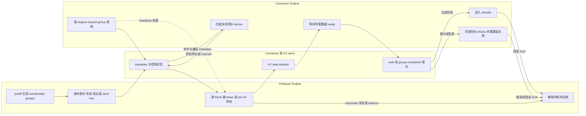

# vLLM 分离式 KV Serving：用跨 Engine 协议交接可计算状态

> [!question] 读者问题
> prefill Engine 算出的 KV 怎样被另一个 decode Engine 安全地接走？谁证明数据可读、谁保住源 block、consumer 何时可执行；而当网络、进程或某个并行 rank 失败时，系统又如何回收并回退？

> **源码基线**：`vllm-project/vllm@6b110badbb22d3f66c7218b71138f13b7a6b3419`（2026-08-29 冻结）。
> **中心命题**：分离式 KV serving 传递的不是一袋匿名 tensor，而是一个带身份、布局、完成条件和生存期的**跨 Engine 可计算状态**。connector/store 必须把控制面上的“哪个 producer 的哪些 transferable groups 可用”与数据面上的“字节已写入 consumer 的哪些目标 block”闭环；lease、完成聚合和失败失效则决定源/目标状态何时可回收。
> **本文拥有**：跨 Engine producer/consumer 身份、transferable groups、connector/store 协议、metadata/control 与 data path、readiness/completion、lease/timeout/failure cleanup/fallback。
> **本页不拥有**：单 Engine 内 block 分配、引用计数、prefix cache 与 eviction 的一般生命周期；这些属于 [[02_engineering/03_infer_frameworks/vllm/12_vllm_kv_cache_management_analysis|KV Cache 管理]]。本页只讨论它们在跨 Engine 交接边界上的投影。

## 1. 分离带来的新问题不是 copy，而是所有权

prefill 侧优化 TTFT，decode 侧优化逐 token 延迟；官方文档也明确把两类实例独立部署视为减少相互干扰、分别调优的手段，同时指出它不自动提高吞吐，网络还会新增 KV 传输开销，见 `docs/features/disagg_prefill.md:8-16`。因此分离是否值得，取决于隔离收益能否覆盖路由、远端排队和传输：

$$
T_{\text{request}}
=T_{\text{route}}+T_{\text{prefill}}+T_{\text{KV handoff}}
+T_{\text{decode queue}}+T_{\text{decode}}.
$$

但性能不是最难的部分。单 Engine 中“请求结束即可释放”只需本地证明；跨 Engine 后，producer 已结束不等于 consumer 已读完，consumer 收到 metadata 也不等于所有并行 rank 都已把 KV 搬入目标地址。vLLM 因而把 connector 分成 Scheduler 侧和 worker 侧：factory 分别在 engine-core 进程与 worker 进程创建对应角色，避免让逻辑调度直接持有设备传输对象，见 `vllm/distributed/kv_transfer/kv_connector/factory.py:43-75`。

这也解释了为什么普通 FIFO 消息不够：远端节点必须按请求身份查找 KV，而不是假定两边到达顺序一致；仓库内的 KV transfer 说明直接点出这一点，见 `vllm/distributed/kv_transfer/README.md:9-21`。

## 2. 身份、角色与兼容性：先回答“谁的、什么形状”

`KVTransferConfig` 把 connector 名称、唯一 `engine_id`、buffer device/size、`kv_role`、rank、并行规模和额外配置放进同一个静态契约；角色可为 producer、consumer 或 both，见 `vllm/config/kv_transfer.py:22-72`。这些字段不是便利标签：跨 Engine 协议必须同时区分三个层次。

| 身份层 | 回答的问题 | 协议后果 |
|---|---|---|
| Engine | 哪个实例生产/消费 | heartbeat、side channel 与远端地址不能串线 |
| Request | 哪次逻辑 handoff | 同一 token 前缀在不同请求中不能只靠到达次序匹配 |
| Parallel rank 与 KV group | 哪个 shard、哪类状态 | completion 必须聚合；metadata 必须携带 group/layout 映射 |

NIXL 的握手 metadata 包含 engine ID、agent metadata、设备 ID、TP size、DP rank、block size、KV cache shape、dtype 与协议版本；兼容 hash 又把这些几何条件压成可比较身份，见 `vllm/distributed/kv_transfer/kv_connector/v1/nixl/metadata.py:28-85,131-188`。因此“token IDs 相同”只是语义键的一部分；如果 block size、dtype、TP 切分或 group layout 不兼容，即使 RDMA 成功写完字节，也不能把结果宣告为可计算 KV。

## 3. Transferable groups：跨 Engine 状态不是默认等于全部本地 cache

混合模型可能有多个 `KVCacheGroupSpec`，每组共享同一 block table；`enable_kv_transfer` 决定该组是否参与外部传输。`KVCacheConfig.transfer_group_ids`、`transfer_groups` 和按 layer 反查的 `transfer_group_index_by_layer` 只投影这些组，见 `vllm/v1/kv_cache_interface.py:1136-1195`。测试进一步验证禁用组会从三种投影中一致消失，见 `tests/v1/core/test_kv_cache_utils.py:143-164`。

这条边界比“把所有 layer KV 都复制”更重要：

- scheduler 与 connector 讨论的 group index 必须是 **transfer-group tuple index**，不能误用完整本地 group ID；
- full attention、sliding-window、Mamba/SSM 等组可能有不同可迁移范围和附加边界状态；NIXL scheduler 对 transferable groups 分别计算 sliding-window clipping 和 SSM speculative slots，见 `vllm/distributed/kv_transfer/kv_connector/v1/nixl/base_scheduler.py:128-155`；
- hybrid memory allocator 模式下，connector 必须按组表达 block table。基类把 `request_finished` 的所有组 block IDs 暴露给支持 HMA 的实现，再由 connector 只处理 transfer groups，见 `vllm/distributed/kv_transfer/kv_connector/v1/base.py:85-114`。

> [!important] 跨页不变量
> 单 Engine block 如何分配与复用由 KV manager 决定；跨 Engine 层只拥有一个投影：哪些 group、哪些 block、在哪个请求身份下被远端协议临时持有。不能用 transfer completion 反向取代本地 block allocator。

## 4. 四个 readiness 不能折叠成一个布尔值

一个 consumer 能进入 attention，至少经过四个不同的“ready”：

1. **发现 ready**：远端匹配已决议；`get_num_new_matched_tokens()` 可返回 `None` 表示尚待判断，而不是 cache miss，见 `vllm/distributed/kv_transfer/kv_connector/v1/base.py:449-489`。
2. **目标 ready**：consumer 本地 block 已分配，`update_state_after_alloc()` 才把 request 与目标 block IDs 交给 connector，见 `vllm/distributed/kv_transfer/kv_connector/v1/base.py:491-523`。
3. **数据 ready**：worker 已完成所需组/层/并行 rank 的传输；`start_load_kv()`、逐层 wait/save 与最终 wait 构成数据面的同步 ABI，见 `vllm/distributed/kv_transfer/kv_connector/v1/base.py:264-351`。
4. **生命周期 complete**：worker 报告 finished receiving/sending 后，scheduler 才能推进请求或解除远端持有；错误 block 必须与 receive completion 同步上报，见 `vllm/distributed/kv_transfer/kv_connector/v1/base.py:353-389`。

下面的图把**控制面的身份与状态**画在实线消息上，把**数据面**单独画成 KV bytes；最关键的是 lease 从“等待/可读”开始保护源状态，并由成功、失败或过期三条路径闭环。

Scheduler 正是按这个顺序编排：先问 connector 远端命中，再做本地 allocation，随后把 allocation 结果交回 connector；外部 load 完成前，请求被放进等待 remote KV 的集合而不是提前执行，见 `vllm/v1/core/sched/scheduler.py:847-866,1088-1133`。worker 输出再被 connector 归并成 finished receiving/sending 与 load errors，见 `vllm/v1/core/sched/scheduler.py:2745-2780,2805-2861`。

## 5. 直连 connector：NIXL 与 MoRIIO 展示两种闭环

### 5.1 NIXL：side channel 管控制，RDMA 管数据

NIXL 的 request metadata 包含远端 engine/request、block IDs 与传输状态；heartbeat 与 `RemoteMetadata`/`NixlReqMetadata` 属于控制面对象，见 `vllm/distributed/kv_transfer/kv_connector/v1/nixl/metadata.py:204-299`。在 pull 路径上，consumer scheduler 先把远端匹配量与本地重算阈值比较：传输太少时宁可本地算，避免固定握手/网络成本；达到阈值后才分配、登记 receive metadata，见 `vllm/distributed/kv_transfer/kv_connector/v1/nixl/pull_scheduler.py:50-176`。

data path 则由 worker 启动实际传输。pull worker 先校正跨 Engine 时钟并启动数据任务，最后把各层/组的完成汇总成 request completion，见 `vllm/distributed/kv_transfer/kv_connector/v1/nixl/pull_worker.py:43-116,351-404`。这说明 metadata 到达只代表“知道从哪里读”，而 transfer handle 完成才代表“目标可读”。

push 的因果顺序更棘手：consumer 注册目标内存与 producer 生成完成可以任一先到。push scheduler 因而保存两侧状态，匹配后才创建发送工作，并用 watchdog/timeout 清理永远配不齐的条目，见 `vllm/distributed/kv_transfer/kv_connector/v1/nixl/push_scheduler.py:91-205,250-356`。一个 FIFO 或单一 `ready=true` 无法表达这种双向会合。

### 5.2 MoRIIO：ACK 是精确 TransferId 的债务清单

MoRIIO 用 `TransferId`、角色、remote allocation、transfer task 与 ACK 显式描述一笔传输，见 `vllm/distributed/kv_transfer/kv_connector/v1/moriio/moriio_common.py:41-118`。producer 不能只依据原计划的 block 数释放：engine seal 时以**实际排入队列的 writes**形成完成计数，若尚未完成则把 release 推迟到 timeout/ACK 闭环，见 `vllm/distributed/kv_transfer/kv_connector/v1/moriio/moriio_engine.py:145-245`。

connector 还处理 ACK 早于本地映射到达的乱序：先停放 early ACK，映射建立后再消费；成功时按实际 DP rank 和计数解除延迟释放，超时则取消映射并清理，见 `vllm/distributed/kv_transfer/kv_connector/v1/moriio/moriio_connector.py:898-1069,1895-1937`。这是同一原则的另一实现：ACK 证明的是某个 `TransferId` 的数据债务已偿还，而不是“请求大概结束了”。

## 6. 外部 store：Mooncake 把源 block lease 改造成 save-job 引用

直连模式的 key 是 producer/request/address；store 模式必须产生可复用、可查询的内容键。Mooncake 的 `BlockMeta`/key 把 model、rank、group、block hash 等编码进身份，地址又描述 chunk 与偏移；尾部查询支持寻找连续可复用前缀，见 `vllm/distributed/kv_transfer/kv_connector/v1/mooncake/store/data.py:100-344`。admin 协议将 lookup 的请求/结果与 transfer data 分开，见 `vllm/distributed/kv_transfer/kv_connector/v1/mooncake/store/protocol.py:3-30,53-81`。

store 的 producer 所有权也与直连 lease 不同。scheduler 为每个 save job 分配唯一 ID，并给该 job 可能读取的每个 GPU block 增加引用；因为各 worker rank 异步 DMA，只有全部 rank 的 completion count 归零后才释放这些引用，见 `vllm/distributed/kv_transfer/kv_connector/v1/mooncake/store/scheduler.py:429-471,527-559`。所以 store connector 的 `request_finished()` 可以让原请求立即结束：真正持有源 block 的已经不是 request，而是 job ref，见 `vllm/distributed/kv_transfer/kv_connector/v1/mooncake/store/connector.py:216-230`。

consumer 侧同样不能把 lookup hit 当成 load success。worker 在 load/store 的 `finally` 路径清除 job 状态，并把失败 load 对应为 invalid blocks；完成/错误随后通过 worker metadata 返回 scheduler，见 `vllm/distributed/kv_transfer/kv_connector/v1/mooncake/store/worker.py:896-940,1168-1195,1234-1265,1872-1906`。

> [!note] 分析：为什么 store 不能复用直连 request lease
> 直连 handoff 的 consumer 通常是已知且短命的一次读取；store save 完成后，原 producer request 与未来 consumer 已解耦。把保存任务绑定到 request lifetime 会过早释放 DMA 源，绑定到未来 consumer lease 又会让无人读取的写入永不结束。Mooncake 的 per-job block ref 正好把“数据尚在被写出”从两端请求生命周期中分离出来；这是依据上述代码重建的设计理由，而非源码原文。

## 7. Lease、heartbeat 与 timeout：活性证明不是完成证明

NIXL scheduler 为待发送请求记录过期时间，并按 remote engine 聚合 heartbeat；lease duration 默认 30 秒，heartbeat interval 是它的六分之一，见 `vllm/distributed/kv_transfer/kv_connector/v1/nixl/base_scheduler.py:60-126`。关键细节是 heartbeat 从新请求进入等待时就开始，而不是等第一次执行：consumer 可能在本地 capacity queue 中停留，producer 却已经需要保住源 KV，见 `vllm/distributed/kv_transfer/kv_connector/v1/nixl/base_scheduler.py:194-241`。

这形成三种不同证据：

- **heartbeat**：consumer 仍存活且仍有兴趣，只延长 lease；
- **transfer completion/ACK**：指定 group/rank 的实际数据动作结束，可立即解锁对应债务；
- **timeout/lease expiry**：缺少完成证据时的最终清道夫，不证明数据成功。

worker 接收 heartbeat 后续期，周期性发送聚合 heartbeat；lease 到期则把请求加入 `done_sending`，让 scheduler 最终释放源侧占用，见 `vllm/distributed/kv_transfer/kv_connector/v1/nixl/base_worker.py:2026-2146,2171-2190,2257-2287`。测试覆盖了等待期间持续 heartbeat、远端 request ID 映射和停止跟踪后的清理，见 `tests/v1/kv_connector/unit/test_nixl_heartbeat.py:41-70,98-164`。

固定短 timeout 会误杀健康但排队的 consumer；固定长 timeout 会在 consumer crash 后长期泄漏 producer capacity。heartbeat + 有界 lease 把“正常慢”和“永久失联”分开，而成功 completion 又避免每笔传输都等 TTL。

## 8. 失败边界：先失效，再重算；不能把部分数据伪装成命中

完成是一个 fan-in 条件：所有需要的 transferable groups、layers 与并行 ranks 都成功，才可把 external tokens 视为 computed。任一块失败时，connector 必须在 receive completion 对应 step 报告 block IDs；scheduler 会将相关外部块标成 invalid，再依据策略处理，见 `vllm/v1/core/sched/scheduler.py:2882-2995`。

`KVTransferConfig.kv_load_failure_policy` 声明两个策略值：`recompute` 或 `fail`，见 `vllm/config/kv_transfer.py:69-72`；scheduler 初始化时把前者映射为运行时的 recompute 开关，见 `vllm/v1/core/sched/scheduler.py:136-169`。两者的运行时语义是：

- `recompute`：撤销 external-computed 假设，把失败范围退回本地计算路径；
- `fail`：以 KV transfer error 终止请求，避免 attention 读取半写、陈旧或 rank 不一致的状态。

对应分支见 `vllm/v1/core/sched/scheduler.py:2911-2995,3014-3070`；测试分别验证 load failure 后释放 connector 状态并走恢复，见 `tests/v1/kv_connector/unit/test_kv_load_failure_recovery.py:45-111`。

故障清理必须覆盖两侧：consumer 释放或失效目标 block；producer 清掉 lease、pending registration/ACK 与源 block 持有；store 则清掉 job、远端对象和 per-job ref。只做 consumer fallback 会让 producer 泄漏，反过来只回收 producer 又可能让 consumer 把残缺 KV 当成有效缓存。

## 9. 设计约束与源码支持的走向

这套协议有三条不能靠 connector 名称掩盖的约束：

1. **布局兼容先于带宽。** model、dtype、block geometry、TP/DP rank 与 transfer groups 必须握手一致；否则数据面“成功”也没有语义。
2. **容量在握手前后都可能阻塞。** remote hit 不保留 consumer block；测试专门覆盖 consumer 无 receive capacity 时保持 waiting、容量释放后才启动 receive，见 `tests/v1/kv_connector/unit/test_remote_prefill_lifecycle.py:396-500`。
3. **Engine 必须为后台债务继续 step。** 基类当前用 `has_pending_push_work()` 暴露未完成 push，而注释明确计划改成更通用的 connector keep-alive hook，见 `vllm/distributed/kv_transfer/kv_connector/v1/base.py:573-583`。Mooncake store 也依赖它让 completion 有机会回到 scheduler，否则 job refs 会永久持有，见 `vllm/distributed/kv_transfer/kv_connector/v1/mooncake/store/scheduler.py:551-559`。

最后一点是源码直接暴露的演进方向：push/store 已经证明“请求集合为空”不等于“Engine 没有协议债务”。更一般的 keep-alive/completion 驱动将来应能统一这些后台状态；但在当前基线上，它仍是 connector 专用 hook，而不是完整的通用生命周期接口。

## Related Pages

- [[02_engineering/03_infer_frameworks/vllm/12_vllm_kv_cache_management_analysis|vLLM KV Cache 管理]] — 单 Engine block table、引用与 prefix cache 的权威页；本页只拥有跨 Engine 临时持有。
- [[02_engineering/03_infer_frameworks/vllm/11_vllm_scheduler_analysis|vLLM Scheduler]] — external hit 如何进入 admission、waiting 与失败重算。
- [[02_engineering/03_infer_frameworks/vllm/14_vllm_attention_backends_analysis|vLLM Attention Backend]] — 目标 KV 被 attention 读取前的 layer/layout 同步边界。
- [[02_engineering/03_infer_frameworks/vllm/16_vllm_serving_control_plane_analysis|vLLM Serving 控制面]] — P/D 实例路由、进程拓扑与请求生命周期。
- [[02_engineering/03_infer_frameworks/vllm/22_vllm_distributed_inference_analysis|vLLM 分布式推理]] — TP/PP/DP shard 身份与跨 Engine transfer 的正交关系。
- [[02_engineering/03_infer_frameworks/vllm/27_vllm_observability_reliability_analysis|vLLM 可观测性与可靠性]] — transfer latency、lease expiry、invalid blocks 与故障注入的观测面。
