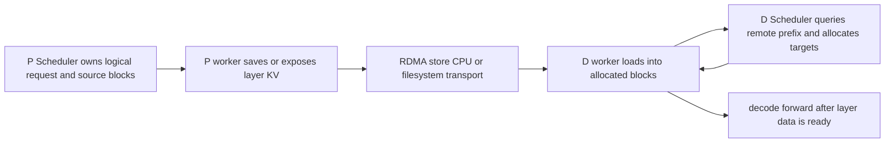

# vLLM 分离式 KV Serving：跨 Engine 转移计算结果与块所有权

> **源码基线**：`vllm-project/vllm@d66300a1baa7779c68c7dfa4e51eee2502b48017`
> **中心命题**：prefill/decode 分离不是“把 KV tensor 复制过去”这么简单。producer、consumer、Scheduler 和 worker 必须对远端命中、目标 block 预分配、逐层传输、完成通知、失败重算以及源 block 何时可释放建立同一协议；KV connector 正是把这个协议接入本地 paged KV 生命周期的边界。
> **叙事顺序**：本页按五拍组织——背景 → 为什么这么设计（含被否掉的替代）→ 实现思路与细节 → 约束 → 发展趋势。
> **最近更新**：2026-08-27。按五拍重排章节顺序，并补齐发展趋势；机制正文与既有引用未改。

## 一、背景：为什么要分离 prefill 与 decode

prefill 通常是大矩阵、compute-heavy，影响 TTFT；decode 是逐 token、memory/launch-heavy，影响 TPOT。把二者放在同一实例上会互相干扰：长 prompt 占满算力时 decode 尾延迟上升，decode batch 又可能打碎 prefill 吞吐。

P/D 分离让两类资源独立扩缩和调度，但增加一项原本不存在的成本：prefill 生成的每层 KV 必须在 decode 开始前可见于 D 的 paged KV block。

粗略判据是：

$$
T_{\mathrm{P/D}}=T_{\mathrm{route}}+T_{\mathrm{prefill}}+T_{\mathrm{KV\ transfer}}+T_{\mathrm{decode\ queue}}
$$

只有当资源隔离与独立批处理收益大于路由、传输和等待成本时，分离才改善端到端 SLO。

## 二、为什么这么设计：替代方案与代价

| 方案 | 优点 | 局限 |
|---|---|---|
| 同实例 prefill+decode | 无 transfer/lease | 两类 workload 干扰，难独立扩缩 |
| 重算 prompt | 协议简单 | 浪费 P 计算，TTFT/成本上升 |
| 同机 host offload | 可扩大 cache | PCIe copy，不能天然跨实例 |
| 远端 KV connector | P/D 独立扩缩 | 网络、metadata、lease、失败恢复复杂 |
| 只靠固定 TTL | 实现简单 | 无法同时处理 crash 与长等待 |

> [!note] 推断
> 这张表是本页依据代码行为重建的设计权衡：每一行的“为什么不适用”都能落到后文引用的 `file:line` 上，但“当初权衡过、并因此否掉了它”这层意思由本页承担——源码通常只陈述最终形态，不陈述被否掉的选项。要引用其中某一行，请回到对应小节的 locator，不要引用本表。

## 三、Connector 有 Scheduler 面与 Worker 面

`KVConnectorBase_V1` 明确分为两套原语：Scheduler 侧查询远端 matched tokens、在 block allocation 后记录状态、构造 step metadata、处理完成；worker 侧注册 cache、开始 load、逐层 wait/save、上报异步完成；`vllm/distributed/kv_transfer/kv_connector/v1/base.py:1-41`。

两面分离的原因是：Scheduler 拥有逻辑请求与 block ID，worker 才拥有真实 KV tensor 和传输 stream。让 Scheduler 直接操作设备地址会破坏 executor/TP 抽象；让 worker 自己决定 admission 又会绕过本地容量与抢占策略。

## 四、consumer 的 admission 是两阶段的

D 收到请求后不能因为远端“声称有 KV”就直接 decode。Scheduler 先调用 `get_num_new_matched_tokens()` 查询当前真正可加载的最长 prompt prefix；返回 `None` 表示 connector 尚未完成判定，应稍后重试，返回值还说明是否异步加载；`vllm/distributed/kv_transfer/kv_connector/v1/base.py:474-507`。

随后本地 KV manager 为 external tokens 分配目标 blocks，再调用 `update_state_after_alloc()` 把 request、blocks 与 external token 数交给 connector；`vllm/distributed/kv_transfer/kv_connector/v1/base.py:509-533`。因此不变量是：

> 远端 token 只有同时满足“源数据此刻可得”和“consumer 已预留可写的本地 block”时，才能计入 computed prefix。

Scheduler 在 waiting admission 中查询 connector、限制异步 load 时的 speculative lookahead，并把 allocation/meta 交给 worker；`vllm/v1/core/sched/scheduler.py:807-919,1006-1093`。异步加载期间请求不能提前执行依赖这些 KV 的 attention。

## 五、逐层 pipeline 为什么要插在 attention 边界

worker 的 `start_load_kv()` 可提前发起所有 load；每个 attention layer 在读取自身 cache 前调用 `wait_for_layer_load(layer_name)`；`vllm/distributed/kv_transfer/kv_connector/v1/base.py:313-343`。producer 则在各 layer 的 KV 产生后调用 `save_kv_layer()`，forward 退出时 `wait_for_save()` 防止本地 paged buffer 被覆盖；`vllm/distributed/kv_transfer/kv_connector/v1/base.py:345-376`。

这样 transfer layer i+1 可与 layer i 的计算重叠，而不用等完整模型所有层传完。但同步点必须精确：

- wait 太早，异步传输退化为串行；
- wait 太晚，attention 读取未完成/部分写入的 block；
- save 完成前释放/复用 source block，会把新请求 KV 发给远端。

逐层 Python wait/save 不能安全装入 full CUDA Graph；connector 可声明需要 piecewise mode，基类解释了 replay 跳过 Python 同步会产生 data race；`vllm/distributed/kv_transfer/kv_connector/v1/base.py:629-649`。

## 六、producer 完成不等于 block 可以释放

本地请求完成时，Scheduler 通常立即 decref/free blocks。但 producer 还可能被 consumer RDMA READ，或正在异步 PUSH/写入外部 cache。`request_finished()` 在 block 释放前恰好调用一次；connector 返回 `True` 即接管延迟释放责任，直到 worker `get_finished()` 上报 sending 完成；`vllm/distributed/kv_transfer/kv_connector/v1/base.py:568-587,378-394`。

这形成 block ownership 转移：

1. 运行中：Scheduler/KV manager 拥有 block；
2. 请求完成且需 handoff：connector lease/ref 持有 block；
3. transfer 完成或超时：connector通知 Scheduler，最后释放。

仅跟踪 request finished 而不跟踪 transfer finished，会产生 use-after-free；为避免风险永不释放，则 producer 的 KV capacity 会持续泄漏。

## 七、pull、push 与外部 store 的差异

| 模式 | 数据发起方 | 目标内存何时确定 | 主要优点 | 主要风险 |
|---|---|---|---|---|
| pull | D 从 P 读 | D admission 后 | P 控制简单、D 按需读取 | P 必须一直保留源 block |
| push | P 向 D 写 | D 先注册目标 block | P 完成后主动推进、可缩短等待 | registration 与 finished-block 两边到达顺序 |
| external cache/store | P 保存，D 查询/加载 | D 命中后 | 跨实例复用、容量层级化 | 一致性、eviction、额外 hop |

NIXL 默认是 D 发起 READ 的 pull；push 模式让 D 预分配并注册内存，P 在 prefill 完成后 WRITE；`docs/design/nixl_kv_push_connector.md:1-14`。push writer 用两张表匹配“先到的 registration”和“先到的 finished blocks”，两种顺序都要成立；`docs/design/nixl_kv_push_connector.md:128-147`。

Transport/connector 可以是 NIXL、LMCache、Mooncake、HF3FS、FlexKV、offloading 等，但它们必须实现相同的 local block 与完成合同，而不是让 Scheduler 为每种存储写分支。

## 八、Lease 解决 crash 与排队的矛盾

固定长 timeout 能容忍 D 排队，却在 D crash 后长时间占住 P blocks；固定短 timeout 能快速回收，却可能在 D 仍健康但排队时提前释放。

NIXL lease 采用短初始租约，D 从进入 Scheduler waiting 开始周期性 heartbeat，P 收到后续租；D crash 停止 heartbeat 后 P 很快回收；`docs/design/nixl_kv_cache_lease.md:5-37`。heartbeat 必须从 request admission 而不是首次执行开始，因为 waiting 时间无上界。

租约不证明 transfer 成功，只证明 consumer 仍对这些 blocks 有兴趣且活跃。成功 completion 应立即释放；无 heartbeat 则最终过期；`docs/design/nixl_kv_cache_lease.md:21-31`。

P 不预先知道请求最终路由到哪个 D，因此 lease 按 request 而非 instance 建立，D 再按 remote engine batching heartbeat；`docs/design/nixl_kv_cache_lease.md:106-116`。

## 九、错误不能伪装成 cache miss

connector load 失败可能意味着：源被 eviction、网络失败、部分 TP rank 失败或目标 block 写入不完整。`get_block_ids_with_load_errors()` 要求最迟在对应 request 被报告 finished receiving 的同一步返回失败 blocks；`vllm/distributed/kv_transfer/kv_connector/v1/base.py:396-414`。

`KVTransferConfig.kv_load_failure_policy` 明确选择 `recompute` 或 `fail`；`vllm/config/kv_transfer.py:69-72`。两者语义不同：

- recompute：使失败 blocks 无效，将请求退回本地计算路径，增加延迟但保服务；
- fail：停止请求，避免在不完整 KV 上继续生成。

绝不能把部分成功当完整 prefix，否则 attention 会混合正确与陈旧 KV，通常不会立刻崩溃，只会输出错误 token。

## 十、配置与布局是握手的一部分

`KVTransferConfig` 声明 connector、engine ID、buffer device/size、producer/consumer/both role、rank/parallel size、地址和扩展配置；`vllm/config/kv_transfer.py:23-64`。worker 可注册逐层 KV tensor，或在 connector 偏好时注册跨层连续 layout；`vllm/distributed/kv_transfer/kv_connector/v1/base.py:272-297`。

P/D 的模型、layer 数、KV dtype、block size、head layout、TP mapping 与 connector physical/logical block mapping 必须兼容。只校验 token IDs 而忽略 layout，RDMA 会成功写字节却写到错误的 head/layer/offset。

## 十一、约束、生产验证与源码阅读顺序

生产验证顺序：

1. 先核对 P/D model、tokenizer、KV spec、TP mapping 与 block layout；
2. 逐请求记录 remote hit tokens、本地目标 blocks、transfer bytes/latency；
3. 验证 D 在 load complete 前不会 forward，P 在 send complete/lease expiry 前不会 free；
4. 注入 D 排队、D crash、网络失败、partial rank failure 与 eviction；
5. 检查 recompute/fail 策略、invalid block 和 completion aggregation；
6. 比较联合部署与分离部署的 TTFT、TPOT、goodput、KV 命中和尾延迟。

最小源码阅读顺序：`vllm/config/kv_transfer.py:23-120` → `vllm/distributed/kv_transfer/kv_connector/v1/base.py:1-41,171-220,272-420,450-649` → `vllm/v1/core/sched/scheduler.py:807-1093,2063-2097,2398-2508,2669-2830` → 目标 connector → 对应设计文档。

## 十二、发展趋势

> [!note]
> 本节离开“源码此刻是什么”，只收录源码自陈的在途改动；每条给出锚点，属于外推的部分单独标注。

1. **connector 的保活钩子会被一般化。** 目前 `has_pending_push_work()` 是为 push 模式单开的口子，接口侧与调度侧各挂一条同向 TODO：`# TODO: replace with a more general connector hook for keeping the scheduler alive (e.g. extend has_unfinished_requests).`（`vllm/distributed/kv_transfer/kv_connector/v1/base.py:603-608`）、`# TODO: replace with a more general mechanism for connectors to keep the scheduler alive.`（`vllm/v1/core/sched/scheduler.py:2500-2508`）。
2. **offload 指标正在向扁平命名迁移。** 旧的一批带 `transfer_type` label 的指标被显式标为 `# Deprecated legacy transfer metrics, kept during the migration to the flat metric names above.`，见 `vllm/distributed/kv_transfer/kv_connector/v1/offloading/metrics.py:134-139`。接监控的话按新扁平名接。
3. **HMA 是 connector 的准入门槛。** 非 `SupportsHMA` 的 connector 仍走单 KV group 旧分支，调度侧写着 `# NOTE(Kuntai): We should deprecate this code path after we enforce all connectors to support HMA.`，见 `vllm/v1/core/sched/scheduler.py:2696-2702`。

## Related Pages

- [[02_engineering/03_infer_frameworks/vllm/11_vllm_scheduler_analysis|vLLM Scheduler]] — remote prefix admission、延迟 block 释放和 recompute。
- [[02_engineering/03_infer_frameworks/vllm/12_vllm_kv_cache_management_analysis|vLLM KV Cache 管理]] — connector 接管前后的物理 block ownership。
- [[02_engineering/03_infer_frameworks/vllm/14_vllm_attention_backends_analysis|vLLM Attention Backend]] — KV layout 与逐层 load/save 同步边界。
- [[02_engineering/03_infer_frameworks/vllm/16_vllm_serving_control_plane_analysis|vLLM Serving 控制面]] — P/D 路由、进程拓扑与生命周期。
- [[02_engineering/03_infer_frameworks/vllm/22_vllm_distributed_inference_analysis|vLLM 分布式推理]] — P/D 分离与 TP/PP/DP 的正交关系。
- [[02_engineering/03_infer_frameworks/vllm/27_vllm_observability_reliability_analysis|vLLM 可观测性与可靠性]] — transfer/lease/error 指标和故障注入。
