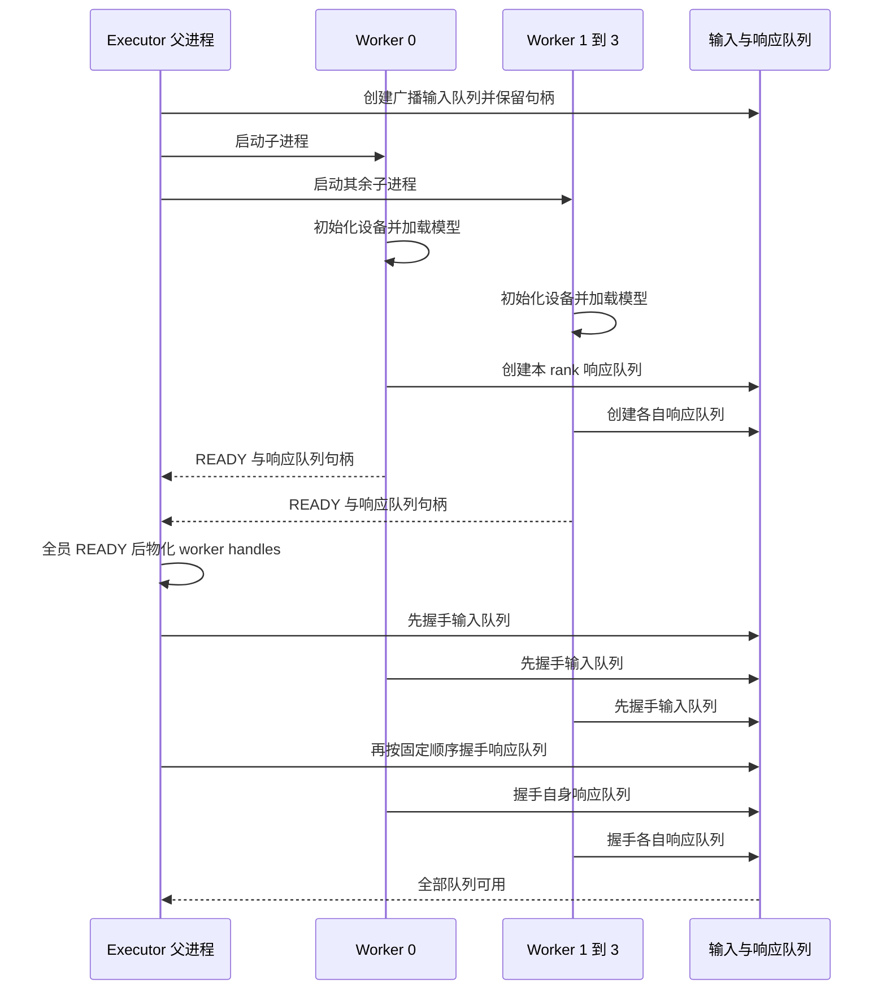
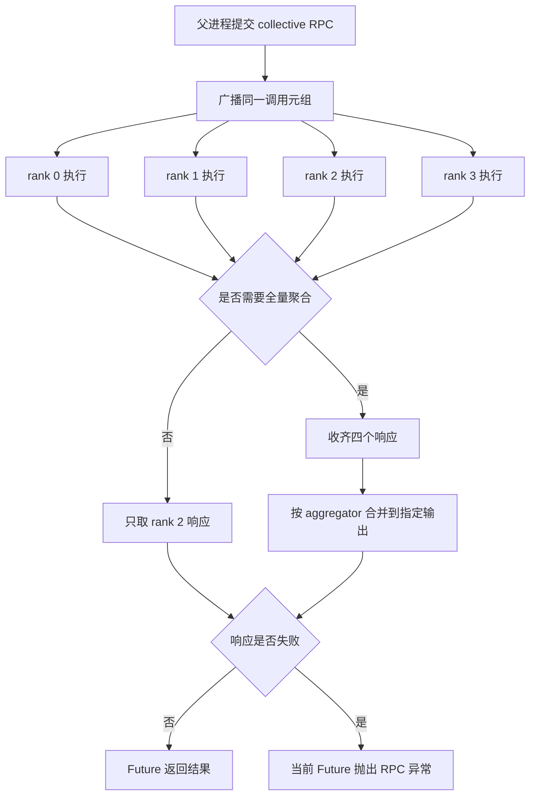

# vLLM MultiprocExecutor：广播 RPC、共享内存队列与进程收尾

> **源码基线**：`vllm-project/vllm@199cb9b964822e59ab9b58d88e7be31eb419a2ae`（`main` 快照，2026-09-07 UTC）。
> **主题**：一个 executor 父进程怎样启动本机 workers、把同一条方法调用广播给所有 rank、只收所需响应，并在共享内存背压或进程失败时完成收尾。
> **适用范围**：V1 `MultiprocExecutor`、本机 `WorkerProc`、`MessageQueue`、异步响应和 shutdown；模型怎样切分及设备 collective 归 18，Engine step 事务归 06，多节点服务路由归 13。
> **最近更新**：2026-09-08。基于当前基线新增专题页；外部分析笔记只作为问题线索，正文结论重新回到源码与测试核验。

## 1. 它不是把四份任务分给四个空闲进程

`MultiprocExecutor` 面对的是一组共同完成同一次模型执行的 ranks，不是通用进程池。父进程广播 `execute_model` 时，每个 worker 都要取到同一条命令并调用同名方法；TP rank 计算不同 shard，PP stage 计算不同层段。若某个 rank 漏掉或越过一次 collective，其他 rank 可能等待另一条通信序列，而不是由“空闲 worker”补做。

因此需要先分开三种责任：

| 责任 | 持有者 | 完成条件 |
|---|---|---|
| 启停与 RPC 编排 | 持有 `MultiprocExecutor` 的父进程 | 所需 workers 已就绪；本次目标响应已返回或失败 |
| 模型与设备状态 | 每个 `WorkerProc` 内的 worker wrapper | 本 rank 的方法执行结束；设备异步资源仍按各自合同保活 |
| TP/PP 等设备通信 | worker 内建立的 model-parallel groups | 对应 collective 或 P2P 的设备工作真正完成 |

控制队列只传“所有 rank 这一步要调用什么”，不承载 PP hidden states、TP all-reduce 等设备数据。后两者走 worker 已建立的设备通信组。把这两条平面混在一起，会误以为父进程需要汇总每层 tensor，或误把 RPC 返回当成所有设备通信上的全局 barrier。

## 2. 固定一个 TP=2、PP=2 的四 worker 例子

以下例子设 `PCP=1`，四个 worker 都在本机；rank 到 stage 的映射只用于说明当前公式和调用次序：

| rank | PP stage | TP lane | 当步职责 |
|---:|---:|---:|---|
| 0 | 0 | 0 | 前半模型的 TP shard 0；把中间状态发往 rank 2 |
| 1 | 0 | 1 | 前半模型的 TP shard 1；把中间状态发往 rank 3 |
| 2 | 1 | 0 | 后半模型的 TP shard 0；普通执行结果的回复 rank |
| 3 | 1 | 1 | 后半模型的 TP shard 1；参与末 stage 的 TP 计算 |

`world_size = TP × PP × PCP = 4`。`_get_output_rank()` 选择最后一个 PP stage 的第一个 TP/PCP worker，当前公式是 `world_size - TP × PCP`，所以本例得到 rank 2，而不是“最后一个全局 rank”3。

这只决定普通 RPC 应从哪个响应队列取结果。计算面仍是两条 PP lane：0→2、1→3；每个 stage 内还有 TP collective。若启用了 KV/EC connector 一类 aggregator，executor 会取消唯一回复 rank，收齐所有 worker 响应后再把聚合结果放到指定输出上，此时“只等 rank 2”不成立。

## 3. 启动协议为何要先构造全员，再等待 READY

父进程先计算本机进程数、准备广播输入队列句柄和 worker 环境，再通过 `make_worker_process()` 启动子进程。启动阶段返回的 `UnreadyWorkerProcHandle` 只足以观察进程、READY pipe 和父进程存活管道；收到 READY 后才转换为带响应队列的 `WorkerProcHandle`。

每个子进程在报告 READY 前依次建立 worker wrapper、初始化设备和分布式环境、加载模型，并创建自己的响应 `MessageQueue`。父进程必须先把所有本机子进程都创建出来，再逐个等待 READY；源码明确把这条顺序与 `init_device` 内可能发生的跨 rank 同步联系起来。若启动一个就阻塞等一个，后续 rank 还没出现，前面的 rank 可能永远等不到通信同伴。

READY 还不是队列已可安全收发。父子随后对广播输入队列和响应队列执行订阅握手；两端必须按相同固定顺序等待，否则两边可能分别卡在不同队列。下面只画进程可见的先后，不把设备组内部初始化伪装成父进程调用。

启动期要区分两类失败：子进程构造过程中报错，会通过 ready pipe 让父进程知道“从未 READY”；READY 后主循环失败则走运行期响应和进程监控。只等一个普通 RPC timeout 不能覆盖前一种情况。

## 4. 四类通道分别交付什么

| 通道 | 方向 | 负载 | 为什么不能互换 |
|---|---|---|---|
| READY pipe | worker→父进程 | 启动成功或构造异常、响应队列句柄 | 只属于启动握手，不承担持续 RPC |
| 父进程存活管道 | 父进程→worker 的持有关系 | 父端句柄是否仍存在 | 父进程退出时 worker 读到 EOF，可触发本地 shutdown |
| 广播 `MessageQueue` | 父进程→所有 workers | 方法名或 callable、args、kwargs、目标回复 rank | 每个 reader 都必须消费同一槽位；不是负载均衡队列 |
| 每 worker 响应 `MessageQueue` | worker→父进程 | 返回值或失败包装 | 普通调用可只等一个 rank，聚合调用则需要全部 ranks |

`collective_rpc()` 实际广播的是 `(method, args, kwargs, output_rank)`。worker busy loop 每次都从广播队列取一条消息并执行 `_execute_worker_rpc()`；`output_rank` 只决定谁把返回值送回父进程，不决定谁执行。由此可以得出一个**分析推断**：共享命令流的核心收益不是节省 Python 调用次数，而是让所有 model-parallel ranks 观察相同调用顺序，从控制面降低 collective 次序分叉的机会。它仍不能替代各设备通信路径自己的顺序检查。

## 5. 一次 RPC 怎样从广播走到唯一回复或全量聚合

普通 `execute_model()` 和 `sample_tokens()` 都把工作交给 `collective_rpc()`。调用链可拆成以下步骤：

1. 父进程确认自己是 leader 且 executor 未进入失败状态。
2. 父进程把调用元组写入广播队列；四个 workers 都会取到并执行。
3. 普通路径指定 rank 2 为 `unique_reply_rank`，父进程只为 rank 2 建立本次等待。
4. rank 0、1、3 仍完成本地方法，只是不向父进程返回普通结果；rank 2 将结果放入自己的响应队列。
5. 若传入 aggregators，executor 改为等待全部四个响应，再把分 rank 结果合并到约定输出；任何一个 worker 的失败响应都会使调用失败。
6. `non_block=True` 返回 `FutureWrapper`；同步调用则立即执行同一个 future 的 `result()`。

异步模型输出还有一层生命周期要求：若 worker 返回 `AsyncModelRunnerOutput`，可选响应线程会在 worker 侧调用 `get_output()` 完成物化，再把可传输结果写入响应队列。否则 runner 复用的设备或 host buffer 可能在父进程真正读取前已改变。这里的“RPC 已排队”“设备执行完成”“Python 结果已物化”是三个不同完成点。

## 6. MessageQueue 的共享内存快路不是无限邮箱

本机 `MessageQueue` 的小数据路径建立在 `ShmRingBuffer` 上：单写者、多读者，默认 10 个槽，每槽最多 24 MiB。每个槽有 written 状态和按 reader 分开的 read 状态；writer 只有确认**所有 readers** 都释放当前槽后才能绕回重用。写入和读取状态之间使用内存栅栏维持发布顺序。

这使背压成为合同的一部分：四个 workers 中只要一个长期不 dequeue，writer 最多推进有限槽位便会等待。worker 正常读取时，即便反序列化或消费过程抛异常，`acquire_read()` 的 `finally` 也会标记该 reader 已释放槽位；进程死亡则需要 executor 的故障与 shutdown 路径打断等待，不能指望 ring 自动忘掉读者。

消息先 pickle，并可把较大的对象拆成 out-of-band buffers。若本机序列化结果放不进一个 ring slot，writer 在共享内存里写 overflow 标记，再通过本机 socket 发送完整负载；远端 reader 本来就走 socket。这里的 overflow 是**单条消息太大时的旁路**，不是 ring 满时把排队压力无界转移到 socket。

因此遇到“第若干步才卡住”时，可以先区分三件事：

- 所有 workers 是否仍在按同一 RPC 序列 dequeue；
- 是否有单条 payload 越过共享内存槽上限，改走 overflow socket；
- 是否已有 worker 失败，而父进程仍在等待它释放 ring 槽或返回响应。

## 7. Future 保证提交顺序，不保证任意乱序取结果

父进程维护待完成 `FutureWrapper` 队列。新 future 从一端加入；调用某个 future 的 `result()` 时，会从最旧端依次读取响应并完成前面的 futures，直到轮到目标对象。因此先提交 A、再提交 B，却先等待 B，并不会绕过 A 直接从同一响应流中取“下一条就是 B”；它先对账 A，再返回 B。

这是响应队列没有为每条普通 RPC 携带独立请求 ID 时的重要配对规则。回归测试覆盖了“等待后提交 future 时先 drain 前序 future”和陈旧 deadline 的约束。`FutureWrapper.result()` 当前不支持调用者传入普通 `timeout` 参数；executor 的故障监控与内部等待期限不能被描述成完整的 per-call deadline API。

这也说明并发提交的安全边界：只要同一响应队列保持 FIFO、所有 workers 观察相同命令顺序，父进程可以延期 materialize；如果某条路径私自多发或少发一个 response，后续结果可能整体错位，而不仅是当前 future 超时。

## 8. 失败和 shutdown 要同时解除进程、队列与设备等待

运行期 worker 方法异常会包装成失败响应，父进程读取后让当前 future 抛出 RPC 异常；它本身不等价于 worker 进程已经死亡。独立的进程监控线程观察各子进程 sentinel：任一 worker 意外退出时，才把 executor 标为 failed、执行 shutdown，并调用注册的 failure callback，让上层终止仍在等待的 Engine 工作。worker 还监控父进程存活管道：父进程关闭自己持有的 writer 或意外退出时，子进程读到 EOF，设置 shutdown 并关闭消息队列，避免成为孤儿 busy loop。

父进程正常 `shutdown()` 的关键顺序是：先关闭 death writers 通知 workers，再关闭本地队列，并等待进程退出；超过宽限期后升级到 `SIGTERM`，仍不退出再到 `SIGKILL`。这不是优雅停止所有 GPU collective 的数学证明，而是进程级最后收口。若 worker 卡在外部通信库内部，最终仍可能依赖强制终止。

需要保留的三个故障不变量是：

| 不变量 | 破坏后的典型表现 | 先查入口 |
|---|---|---|
| 全员 READY 后再进入队列握手 | 启动 hang，部分 rank 从未完成设备初始化 | ready pipe 状态、worker 构造异常、握手顺序 |
| 所有 workers 消费相同 RPC 序列 | 特定 batch 或特定方法后 collective hang | 广播 dequeue、方法分支、各 rank 日志序号 |
| response 与 future 保持 FIFO 对账 | 后续 future 返回错位或永久等待 | 每 rank 响应数、前序 future 是否已 drain |

## 9. 从症状回到稳定源码入口

以下路径相对固定基线；表内使用 `path::symbol`，不继承外部笔记里的易漂移行号：

| 核验问题 | 源码与测试入口 |
|---|---|
| executor 怎样建立 workers 与 queues | `vllm/v1/executor/multiproc_executor.py::MultiprocExecutor._init_executor`、`WorkerProc.make_worker_process`、`WorkerProc.wait_for_ready`、`WorkerProc._init_message_queues`；`tests/distributed/test_multiproc_executor.py::test_multiproc_executor_counts_all_local_dp_workers` |
| 哪个 rank 回复，聚合何时收全员 | `vllm/v1/executor/multiproc_executor.py::MultiprocExecutor._get_output_rank`、`collective_rpc`；`tests/distributed/test_multiproc_executor.py::test_multiproc_executor_pp` |
| worker 怎样执行并物化输出 | `vllm/v1/executor/multiproc_executor.py::WorkerProc.worker_busy_loop`、`_execute_worker_rpc`、`handle_output`、`enqueue_output`；`tests/v1/executor/test_multiproc_executor.py` |
| 共享内存 ring 怎样产生背压 | `vllm/distributed/device_communicators/shm_broadcast.py::ShmRingBuffer`、`MessageQueue.acquire_write`、`acquire_read`、`enqueue`、`dequeue`；`tests/distributed/test_shm_broadcast.py` |
| Future 怎样维持响应顺序 | `vllm/v1/executor/multiproc_executor.py::FutureWrapper.result`、`_wait_for_response`；`tests/v1/executor/test_multiproc_executor_timeout.py` |
| 父子进程怎样发现死亡并收尾 | `vllm/v1/executor/multiproc_executor.py::WorkerProc.monitor_death_pipe`、`MultiprocExecutor.shutdown`、`_ensure_worker_termination`；`tests/v1/shutdown/test_startup_error.py`、`tests/v1/shutdown/test_forward_error.py` |

本页完成的是源码与测试合同核验，没有运行多进程 GPU 推理、多节点传输或故障注入；默认槽数、单槽上限和 output-rank 公式是当前基线事实，不应直接推广到未来版本或 Ray executor。

## Related Pages

- [[06_vllm_engine_architecture_analysis|Engine 运行]] — 解释谁提交 executor future，以及结果返回后怎样与 Scheduler snapshot 对账。
- [[13_vllm_serving_control_plane_analysis|Serving 控制面]] — 放大到 launcher、EngineCore、路由、ready 与服务级 shutdown。
- [[18_vllm_distributed_inference_analysis|分布式推理]] — 接续 worker 内部 TP/PP/DP/EP 的成员、shape 与通信顺序。
- [[12_vllm_model_runner_v2_analysis|Model Runner V2]] — 解释 worker 方法内部的设备状态、异步输出和 buffer 生命周期。
- [[23_vllm_observability_reliability_analysis|可观测性与可靠性]] — 将 worker 失败、Engine dead 与用户可见健康状态连起来。
