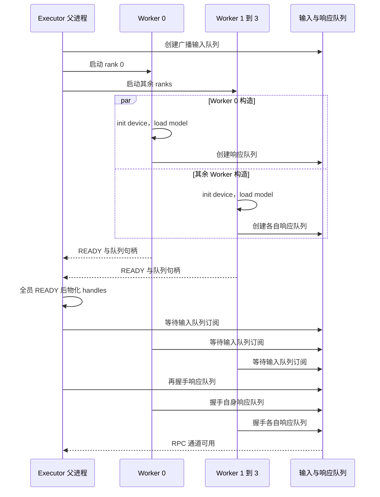
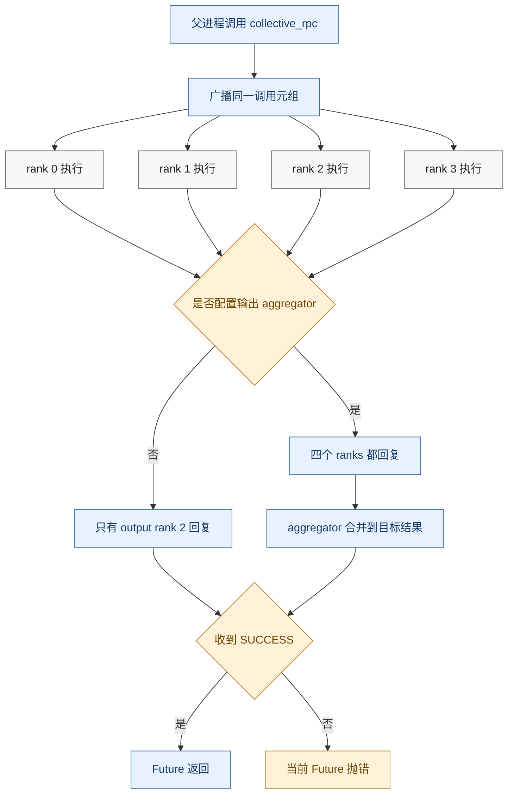
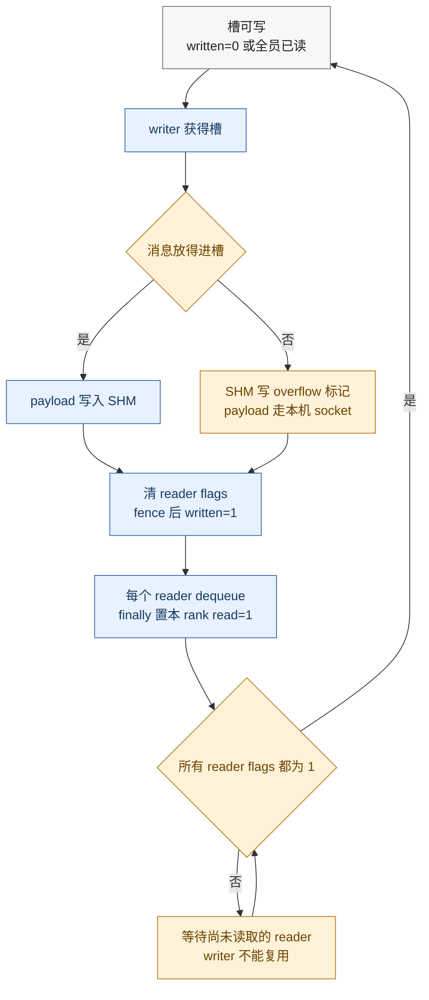
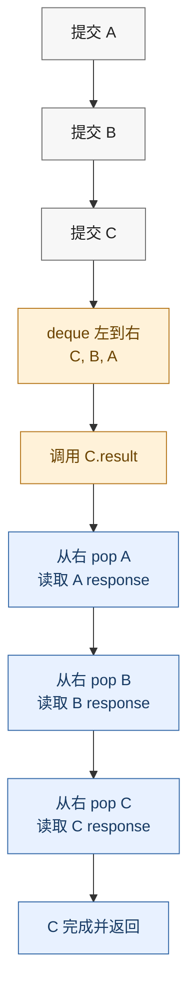

# vLLM MultiprocExecutor RPC：锁步广播、有限队列与进程收尾

> **源码基线**：`vllm-project/vllm@199cb9b964822e59ab9b58d88e7be31eb419a2ae`（`main` 快照，2026-09-07 UTC）
> **主题**：EngineCore 进程怎样把一次调用广播给多个 Worker 进程，响应在没有请求 ID 的情况下靠什么保持配对，以及首错或超时留下陈旧回复时 FIFO 不变量如何被破坏。核心代码在 `vllm/v1/executor/multiproc_executor.py` 与 `vllm/distributed/device_communicators/shm_broadcast.py`。
> **适用范围**：`MultiprocExecutor` 的本机 leader 与多节点 follower、`RayExecutorV2` 复用的 MQ 控制面，以及 `WorkerProc` / `RayWorkerProc`、`MessageQueue`、Future 配对、异步输出与 shutdown；并行 group 的拓扑构造归 18，Ray V1 / UniProc / external launcher 不属本页且本域暂无 owner。
> **最近更新**：2026-09-16。补齐执行器选择与多节点/Ray V2 变体，并闭合首错或超时留下陈旧回复后破坏 FIFO 的边界。

---

## 1. 核心问题：模型并行 Worker 不是通用进程池

[[02_engineering/03_infer_frameworks/vllm/25_vllm_weight_transfer_online_update_analysis|在线权重更新]]中的 start、update 和 finish 最终都要由 Executor 扇出到每个 Worker。普通推理的 `execute_model` 也遵循同一控制方式：所有 model-parallel ranks 必须看到同一条方法调用，并按同一顺序进入设备通信。

这与“把四份独立任务分给四个空闲进程”完全不同。TP rank 计算不同 shard，PP stage 计算不同层段；若某个 rank 少取一条命令或走入不同分支，其他 rank 可能卡在下一次 collective，而不是由空闲 Worker 补做。

从广播与响应对象的组合可以重建出一项设计选择（**分析推断**）：MultiprocExecutor 使用“一个广播命令流 + 每 Worker 独立响应流”：

- 父进程统一启动、广播和等待；
- 每个 Worker 都 dequeue 并执行同一 RPC；
- `output_rank` 只控制谁回复，不控制谁执行；
- KV/EC aggregator 需要分 rank 状态时，父进程改为收齐全员；
- 有限共享内存 ring 用背压阻止命令无限领先。

| 机制收益 | 对应代价 |
|---|---|
| 所有 rank 观察一致控制顺序 | 一个慢 reader 会阻塞广播 ring 的复用 |
| 普通执行只回传一个最终结果 | 非回复 rank 的方法异常不会直接进入本次普通 RPC 响应 |
| 本机小消息走共享内存 | 预分配 `/dev/shm`，容量与槽宽必须规划 |
| Future 可延迟取结果 | 同一响应流必须严格 FIFO 对账 |
| 进程监控统一收口 | 设备通信库内部卡死最终仍可能依赖信号终止 |

本页分析控制平面。PP hidden states、TP all-reduce 等模型数据仍走 Worker 内已经建立的设备通信组；父进程不会汇总每层 tensor，RPC 返回也不是所有设备异步工作的通用全局 barrier。

### 1.1 哪些执行器实际使用这套控制面

选择入口是 `Executor.get_class`，而不是“用了多卡就一定是 MultiprocExecutor”。`ParallelConfig.__post_init__` 先形成 backend 默认值，入口再把它映射到具体类：

| 配置/环境 | 具体执行器 | 与本页控制面的关系 |
|---|---|---|
| backend=`mp`；CUDA 跨节点 `nnodes>1` 的默认也为 `mp` | `MultiprocExecutor` | 完整使用本页 MQ、Future 与回复队列；多节点时只有 DP 内 leader 的 executor 广播/收回复 |
| backend=`ray`，`VLLM_USE_RAY_V2_EXECUTOR_BACKEND=0` | `RayDistributedExecutor` | 走 Ray object refs，不复用本页回复 FIFO |
| backend=`ray`，`VLLM_USE_RAY_V2_EXECUTOR_BACKEND=1`（**这是默认**：`envs.py` 运行期读的是 `int(os.getenv(..., "1"))`，同文件顶部的类型标注 `: bool = False` 只是 stub，按它读会得到相反结论） | `RayExecutorV2(MultiprocExecutor)` | Ray actor 负责放置，但复用 MQ 广播、Future 与回复控制面；同机 reader 用 SHM，远端 reader 用 TCP。也就是说 `backend=ray` **默认**仍落在本页的控制面上，除非运维显式设 0 |
| backend=`uni`；TPU 且 `VLLM_XLA_USE_SPMD` 时这是默认解析的**第一条**分支（先于所有 CUDA 分支）；或前面的跨 DP 默认解析仍未选中 backend、且 `world_size==1` 时落这里 | `UniProcExecutor` | 不使用本页多进程广播；例如 `world_size_across_dp>1` 的普通 CUDA 部署会先选 mp/ray，不因单副本 `world_size==1` 而走 uni |
| backend=`external_launcher` | `ExecutorWithExternalLauncher` | 由外部进程拓扑驱动，不使用 MultiprocExecutor 父进程协议 |
| backend 是 `Executor` 子类或可解析的 qualname | 用户执行器 | 只有继承/复用这些对象时才适用，不能由字符串配置外推 |

默认选择还有两个容易误读的边界：单机 CUDA 的 `world_size` 超过本机 device count 会直接报错并要求显式选择 Ray 或正确设置 `--nnodes`，不会自动切 Ray；已经处于 Ray placement group 或 `data_parallel_backend="ray"` 时，才会把未指定 backend 选为 Ray。

`MultiprocExecutor` 自身也有 leader/follower 两态。`node_rank_within_dp==0` 的 leader 建立 `rpc_broadcast_mq` 并汇总本地 `worker_response_mq` 与远端 `peer_worker_response_mqs`；follower executor 只创建本机 Workers，不建立可供自己调用的广播队列，`collective_rpc` 的非空断言限定它不能作为调用端。跨节点 Worker 通过 inner-DP group 创建 broadcaster 和 single-reader response MQ，远端消息走 TCP；**这里的分支键是部署拓扑，不是“reader 是否远端”**：`WorkerProc._init_message_queues` 判的是 `parallel_config.nnodes_within_dp == 1`。单节点 DP 组走本页 §5.1 的 16/24 MiB SHM ring；**多节点 DP 组下所有 Worker（包括与 leader 同机的那些）** 一律改走 `create_mq_broadcaster(...)` 与 `create_single_reader_mq_broadcasters(reader_rank_in_group=0)`，两者都固定 `1 << 22` bytes、6 槽。`MessageQueue.create_from_process_group_single_reader` 对 `same_node` 只是把 `n_local_reader` 设为 1（仍是 SHM），槽宽仍是 4 MiB×6。所以 §5.1 的容量算式只对单节点成立，“本机最慢 reader”背压也只在那一支里是完整图景。

## 2. 具体例子：TP=2、PP=2 时谁执行、谁回复

设 `PCP=1`，四个 Worker 都在本机：

| global rank | PP stage | TP lane | 当步职责 |
|---:|---:|---:|---|
| 0 | 0 | 0 | 前半模型 TP shard 0，把中间状态发往 rank 2 |
| 1 | 0 | 1 | 前半模型 TP shard 1，把中间状态发往 rank 3 |
| 2 | 1 | 0 | 后半模型 TP shard 0，普通执行的回复 rank |
| 3 | 1 | 1 | 后半模型 TP shard 1，参与末 stage TP 计算 |

`world_size = TP * PP * PCP = 4`。`_get_output_rank()` 使用：

```text
output_rank = world_size - TP * PCP
            = 4 - 2 * 1
            = 2
```

所以普通 `execute_model` 从 rank 2 的响应队列取结果，而不是从最后一个 global rank 3 取。计算面仍是 0→2、1→3 两条 PP lane，并且每个 stage 内仍有 TP collective。

当 KV 或 EC connector 配置了 aggregator，`collective_rpc` 会把广播中的 `output_rank` 改为 `None`，令四个 Worker 都回复，再把各 rank 输出聚合到原定 output rank 的结果上。由此，“所有 rank 都执行”始终成立，“只等 rank 2”只属于无 aggregator 的普通路径。

## 3. 启动协议：为什么先创建全员，再等待 READY

### 3.1 READY 前 Worker 已完成哪些工作

这里的“父进程”就是 **EngineCore 进程**（`EngineCoreProc`）——`MultiprocExecutor` 是它构造并持有的对象，不是另一个独立进程，下文凡称父进程均指它。父进程先创建广播输入 `MessageQueue`（**仅 leader executor 如此**，即 `node_rank_within_dp == 0`；follower executor 不建可供自己调用的广播队列，见 §1.1），再连续启动所有本机子进程。每个 `WorkerProc` 在发出 READY 前已经：

1. 创建并初始化 `WorkerWrapperBase`；
2. 执行 `init_device()`，建立设备与分布式环境；
3. 执行 `load_model()`；
4. 按需启动异步输出线程；
5. 创建自己的响应 `MessageQueue`；
6. 导出响应队列句柄。

父进程不能“启动 rank 0，等它 READY，再启动 rank 1”。`init_device()` 可能在 ranks 之间同步；若后续 rank 还未创建，先启动者可能永远等不到通信同伴。`WorkerProc.wait_for_ready` 因而用 `multiprocessing.connection.wait` 同时观察所有 ready pipes，谁先准备好就先读取谁，而不是按 rank 串行等待。

### 3.2 READY 后仍要按固定顺序握手队列

READY 表示 Worker 构造完成并交出了响应队列句柄，不表示发布—订阅队列已经完成订阅。父子两侧随后都先等待广播输入队列，再按一致顺序等待各响应队列；源码明确警告重排会死锁。


```mermaid
sequenceDiagram
    participant E as Executor 父进程
    participant W0 as Worker 0
    participant WX as Worker 1 到 3
    participant Q as 输入与响应队列
    E->>Q: 创建广播输入队列
    E->>W0: 启动 rank 0
    E->>WX: 启动其余 ranks
    par Worker 0 构造
        W0->>W0: init device，load model
        W0->>Q: 创建响应队列
    and 其余 Worker 构造
        WX->>WX: init device，load model
        WX->>Q: 创建各自响应队列
    end
    W0-->>E: READY 与队列句柄
    WX-->>E: READY 与队列句柄
    E->>E: 全员 READY 后物化 handles
    E->>Q: 等待输入队列订阅
    W0->>Q: 等待输入队列订阅
    WX->>Q: 等待输入队列订阅
    E->>Q: 再握手响应队列
    W0->>Q: 握手自身响应队列
    WX->>Q: 握手各自响应队列
    Q-->>E: RPC 通道可用
```

构造期异常通过 ready pipe 告诉父进程“从未 READY”；READY 后 busy loop 的异常则通过响应队列或进程监控暴露。这两个阶段不能只靠普通 RPC timeout 混为一谈。

## 4. RPC 协议：广播决定执行顺序，响应决定返回语义

### 4.1 四类通道

| 通道 | 方向 | 负载 | 生命周期 |
|---|---|---|---|
| READY pipe | Worker → 父进程 | READY/构造失败、响应队列句柄 | 只用于启动 |
| death pipe | 父进程持有 writer，Worker 监控 reader | 父端是否仍存活 | 父退出或关闭时触发 Worker 收尾 |
| 广播 `MessageQueue` | 父进程 → 所有 Workers | method/callable、args、kwargs、`output_rank` | 每个 reader 必须消费每个槽 |
| 每 Worker 响应 `MessageQueue` | Worker → 父进程 | `SUCCESS`/`FAILURE` 与结果 | 只由需要回复的 rank 写入 |

`collective_rpc()` 广播的元组是 `(method, args, kwargs, output_rank)`。method 可以是字符串，也可以是 cloudpickle 后的 callable。每个 Worker 的 busy loop 都调用 `_execute_worker_rpc()`；`output_rank` 只在执行后决定是否调用 `handle_output()`。

### 4.2 一次 RPC 的普通与聚合路径


```mermaid
flowchart TB
    A["父进程调用 collective_rpc"] --> B["广播同一调用元组"]
    B --> C0["rank 0 执行"]
    B --> C1["rank 1 执行"]
    B --> C2["rank 2 执行"]
    B --> C3["rank 3 执行"]
    C0 --> D{"是否配置输出 aggregator"}
    C1 --> D
    C2 --> D
    C3 --> D
    D -->|否| E["只有 output rank 2 回复"]
    D -->|是| F["四个 ranks 都回复"]
    F --> G["aggregator 合并到目标结果"]
    E --> H{"收到 SUCCESS"}
    G --> H
    H -->|是| I["Future 返回"]
    H -->|否| J["当前 Future 抛错"]

    classDef default fill:#f7f7f7,stroke:#707070,color:#202020
    classDef acc1 fill:#e8f1ff,stroke:#3569a8,color:#173a63
    classDef acc2 fill:#fff2d9,stroke:#b7791f,color:#6b4300
    class A,B,E,F,G,I acc1
    class D,H,J acc2
```

普通路径只创建 rank 2 的本次等待；rank 0、1、3 仍执行，但不发送结果。聚合路径则令 `output_rank=None`，依次读取全部 response queues，再由一个或多个 aggregator 合并。

“全员回复”只在成功路径上构成 all-replies barrier。父进程按响应队列顺序读取，遇到第一个 `FAILURE` 就立即抛错，不再消费其后的队列；因此失败返回只能证明命令已经广播且至少一个错误已被观察，不能证明其余回复已经 drain。

这不只是“本次少看了几个结果”，还会破坏后续 RPC 的配对。响应帧没有 call ID；若全员回复调用 A 在 rank 1 的 `FAILURE` 处退出，rank 2 已到达或稍后到达的 A 回复仍留在 rank 2 队列。下一次调用 B 再按队首读取时，可能把这条 A 回复当成 B 的 rank 2 结果。超时也一样：超时后的迟到回复会成为下一次读到的陈旧帧。这个因果链在 §6 展开。

这里有一个重要的错误可见性边界：`_execute_worker_rpc` 只在“本 rank 应回复”时把异常包装成 `FAILURE`。因此普通 unique-reply RPC 中，非 output rank 的 Python 方法异常会被该进程记录，但不会直接成为父进程本次响应；只有该异常进一步导致进程退出、collective 失败、回复 rank 报错或超时，父进程才会从其他机制观察到它。需要逐 rank 证明成功的控制操作应使用全员回复，而不能复用唯一回复语义。

### 4.3 异步输出要先物化再跨进程

若 Worker 返回 `AsyncModelRunnerOutput`，响应线程会先在 Worker 侧执行 `get_output()`，再把可传输结果入队。该线程显式设置 Worker 设备，避免在设备 0 隐式创建额外 CUDA context。**这条响应线程只在 `scheduler_config.async_scheduling` 为真时存在**：`WorkerProc.__init__` 据此才建 `async_output_queue` 并启动 `WorkerAsyncOutputCopy` 线程；同步路径没有这个线程，`get_output()` 在 busy loop 线程内直接做完后 `enqueue_output`。

这一步保证被 Model Runner 复用的 device/host buffer 在父进程读取前已经物化。因此至少要区分“RPC 已广播”“设备执行已产生异步句柄”和“Python 结果已物化入响应队列”三个完成点。

## 5. MessageQueue：共享内存快路怎样产生背压

### 5.1 广播输入与响应队列的容量并不相同

当前基线的本机快路使用 `ShmRingBuffer`，默认槽数都是 10，但槽宽有两套来源：

| 队列 | 构造方式 | 默认槽数 | 当前默认槽宽 | 近似 payload 区 |
|---|---|---:|---:|---:|
| Executor 广播输入 | 显式传入 `VLLM_MQ_MAX_CHUNK_BYTES_MB` | 10 | 16 MiB | 160 MiB |
| 每 Worker 响应 | `MessageQueue(1, 1)` | 10 | 24 MiB | 每 Worker 240 MiB |
| 多节点 DP 分支：广播输入与每 Worker 响应 | `create_mq_broadcaster` / `create_single_reader_mq_broadcasters` | 6 | 4 MiB（`1 << 22`） | 每队列 24 MiB |

以上还未计每槽元数据，实际共享内存段略大。对本页四 Worker 示例，仅 payload 区就约为 `160 + 4 * 240 = 1120 MiB`——**这个数只对 `nnodes_within_dp == 1` 的单节点四 Worker 成立**；多节点 DP 下按上表最后一行的 4 MiB×6 重算，两套数不能混用（§1.1）。

**它也不是该进程 `/dev/shm` 占用的全部。** 上表只算 executor 这一层的两类队列；`GroupCoordinator.__init__` 另会在 `use_message_queue_broadcaster=True` **且 `world_size > 1`** 的 group 上各建一条 `MessageQueue.create_from_process_group(cpu_group, 1 << 22, 6)`，即每组 4 MiB×6 ≈ 24 MiB。本基线里带这个标志的是 `_TP`、`_DCP` 与 `_INNER_DP_WORLD` 三个 group。所以 TP=2 之类的部署要在 1120 MiB 之上再加这些组的份额；容量规划按“executor 两类队列 + 每个开启广播且 world>1 的 group 一条 24 MiB”合计，不要只按本表估。**旧稿把所有队列概括为 10×24 MiB，本次按构造点复核后更正**：16 MiB 是 Executor 输入广播队列的环境变量默认值；24 MiB 是 `MessageQueue` 类默认值，当前用于每 Worker 响应队列。创建前 `check_shm_free_space()` 会核对 `/dev/shm` 可用空间，容器部署需据 Worker 数量预留。

### 5.2 一个槽何时可以复用

每个广播槽含一个 written flag 和每个本地 reader 各自的 read flag。writer 发布数据前后用 memory fence 约束可见性；只有所有 readers 都把当前槽标为已读，writer 才能绕回覆盖它。


```mermaid
flowchart TB
    A["槽可写<br/>written=0 或全员已读"] --> B["writer 获得槽"]
    B --> C{"消息放得进槽"}
    C -->|是| D["payload 写入 SHM"]
    C -->|否| O["SHM 写 overflow 标记<br/>payload 走本机 socket"]
    D --> P["清 reader flags<br/>fence 后 written=1"]
    O --> P
    P --> R["每个 reader dequeue<br/>finally 置本 rank read=1"]
    R --> G{"所有 reader flags 都为 1"}
    G -->|否| W["等待尚未读取的 reader<br/>writer 不能复用"]
    W --> G
    G -->|是| A

    classDef default fill:#f7f7f7,stroke:#707070,color:#202020
    classDef acc1 fill:#e8f1ff,stroke:#3569a8,color:#173a63
    classDef acc2 fill:#fff2d9,stroke:#b7791f,color:#6b4300
    class B,D,P,R acc1
    class C,O,G,W acc2
```

图中的闭环暴露了复用不变量：大消息虽然改走 socket，仍要先占用 ring 槽发布 overflow 标记；任一 reader 没有完成该槽的 read flag，writer 就不能进入下一轮复用。

因此背压不是异常，而是协议：

- 一个 Worker 长期不 dequeue，整个广播 writer 最多领先 10 个槽；
- `acquire_read()` 在 `finally` 中标记释放，即使反序列化抛错，也不会永久占住当前槽；消费者代码发生在 `dequeue()` 返回之后，不属于这项保证；
- 进程直接死亡时，ring 不会自动删除 reader。shutdown 能取消 reader 的 `SpinCondition` 等待并最终终止 Worker，但 `acquire_write()` 没有对应的 shutdown 检查；当前 collective RPC deadline 只传给响应 `dequeue()`，广播 `enqueue()` 没有传 timeout，Worker monitor 触发的 queue shutdown 也不能证明会解除一个已经卡住的 writer wait。此路径只有更上层终止/重建父进程才能界定；若其他调用方显式给 `enqueue` timeout，则属于另一份调用合同；
- reader 空闲后以通知唤醒，同时每 5000 ms 重新检查权威 SHM flag，以限制丢通知后的恢复时间。

`VLLM_RINGBUFFER_WARNING_INTERVAL` 只控制 writer 长时间找不到空槽时的告警间隔，不扩大队列，也不解除背压。

### 5.3 大消息旁路不是“队列满了就走 socket”

对象先 pickle；大于等于 1 MiB 的可缓冲对象可以作为 out-of-band buffer 分离。若主 pickle 与这些 buffers 的总大小放不进一个 ring slot，writer 先在共享内存槽写 overflow 标记，再通过本机 ZeroMQ socket 发送完整 multipart；远端 reader 本来就走 socket。

overflow 的触发条件是**单条消息超过槽宽**，不是 ring 已满。队列满时 writer 等最慢 reader；不会把排队压力无限转移到 socket。诊断“运行若干步后卡住”时，应分别检查：

1. 是否有 rank 少 dequeue 了一条 RPC；
2. 是否单条 payload 超过 16/24 MiB，改走 overflow socket；
3. 是否 Worker 已失败，而父进程仍在等它释放槽或返回。

## 6. Future：响应没有请求 ID 时怎样保持配对

`FutureWrapper` 把新 Future 从 deque 左侧加入。调用某个 Future 的 `result()` 时，从右侧取最老对象并执行 `_wait_for_response()`，直到目标 Future 完成。若先提交 A、再提交 B，却先等待 B，代码会先读取 A 的响应，再读取 B。


```mermaid
flowchart TB
    SA["提交 A"] --> SB["提交 B"] --> SC["提交 C"]
    SC --> D["deque 左到右<br/>C, B, A"]
    D --> WC["调用 C.result"]
    WC --> PA["从右 pop A<br/>读取 A response"]
    PA --> PB["从右 pop B<br/>读取 B response"]
    PB --> PC["从右 pop C<br/>读取 C response"]
    PC --> RC["C 完成并返回"]

    classDef default fill:#f7f7f7,stroke:#707070,color:#202020
    classDef acc1 fill:#e8f1ff,stroke:#3569a8,color:#173a63
    classDef acc2 fill:#fff2d9,stroke:#b7791f,color:#6b4300
    class D,WC acc2
    class PA,PB,PC,RC acc1
```

这条 FIFO drain 规则替代了普通响应消息中的 request ID。只要同一响应队列与广播命令顺序一致，父进程可以延迟取结果；某条路径若私自多发或少发一个 response，后续 Future 都可能错位。

**分析推断：本实现自己的首错/超时路径就能破坏此前提。** 设全员回复调用 A 依次读取 rank 0、1、2：rank 0 成功，rank 1 返回 `FAILURE` 后 `get_response` 立即抛错，rank 2 的 A 回复没有被 drain。随后广播调用 B；读取 rank 2 队列时，队首仍可能是 A 的旧回复，于是 B 的结果集合混入上一代调用。若 A 在 rank 1 超时，rank 1 后到的 A 回复也会先于 B 回复被取走。`FutureWrapper` 的 oldest-first drain 只能保证“仍在 deque 中的 Future 按提交顺序触发 `get_response`”，不能为一个已经因异常中止的 `get_response` 补齐剩余队列，也没有 request ID 可重新同步。

源码未提供对所有 response queues 的错误后 resync/drain 协议。部分失败或 timeout 后，除非调用方能从外部证明各队列已经清到同一代际，否则安全边界是重建 executor/Engine，而不是在同一 MQ 控制面继续下一次 RPC。这个结论由 `MultiprocExecutor.collective_rpc` 内 `get_response` 的 early raise 与无 request ID 的 FIFO 关系静态推出；本轮没有故障注入测试证明某个特定时间排列必然发生错配。

`FutureWrapper.result(timeout=...)` 当前明确拒绝非 `None` 参数。`collective_rpc(timeout=...)` 计算的是内部 deadline，并在依次读取 response queues 时传递剩余时间；`execute_model` 和 `sample_tokens` 使用 `VLLM_EXECUTE_MODEL_TIMEOUT_SECONDS`。这不能描述为通用 Future per-call timeout API。

## 7. 代码协作与调用路径

### 7.1 谁拥有哪一段状态

| 责任 | 主要对象 | 持有状态 |
|---|---|---|
| 进程与广播编排 | `MultiprocExecutor` | Worker handles、广播队列、响应队列、Future deque、failure callback |
| 单 rank 生命周期 | `WorkerProc` | Worker wrapper、响应队列、异步输出线程、death-pipe monitor |
| 有限传输通道 | `MessageQueue` / `ShmRingBuffer` | 槽、读写 flags、通知 socket、overflow socket |
| 模型与设备工作 | `WorkerWrapperBase` 及具体 Worker | 本 rank 模型、设备与分布式组 |
| 输出聚合 | `KVOutputAggregator` / `ECOutputAggregator` | 分 rank connector 输出的合并规则 |

### 7.2 启动调用树

```text
MultiprocExecutor._init_executor
+-- MessageQueue for rpc broadcast
+-- WorkerProc.make_worker_process for every local rank
+-- WorkerProc.wait_for_ready
|   `-- multiprocessing.connection.wait on all ready pipes
+-- rpc_broadcast_mq.wait_until_ready
`-- each worker_response_mq.wait_until_ready

WorkerProc.worker_main
+-- WorkerProc.__init__
|   +-- WorkerWrapperBase.init_worker
|   +-- init_device
|   +-- load_model
|   `-- WorkerProc._init_message_queues
+-- send READY
+-- wait_until_ready in fixed queue order
`-- WorkerProc.worker_busy_loop
```

### 7.3 RPC 调用树

```text
MultiprocExecutor.execute_model
`-- MultiprocExecutor.collective_rpc
    +-- rpc_broadcast_mq.enqueue
    +-- FutureWrapper
    `-- FutureWrapper.result
        `-- get_response from one or all response queues

WorkerProc.worker_busy_loop
`-- rpc_broadcast_mq.dequeue
    `-- WorkerProc._execute_worker_rpc
        +-- WorkerWrapperBase method
        `-- WorkerProc.handle_output
            `-- WorkerProc.enqueue_output
                `-- worker_response_mq.enqueue
```

### 7.4 稳定源码路线

| 核验问题 | 稳定源码锚点 |
|---|---|
| 执行器选择与 backend 默认 | `vllm/v1/executor/abstract.py::Executor.get_class`；`vllm/config/parallel.py::ParallelConfig.__post_init__`；`vllm/envs.py::VLLM_USE_RAY_V2_EXECUTOR_BACKEND` |
| Worker 创建、全员 READY 与队列握手 | `vllm/v1/executor/multiproc_executor.py::MultiprocExecutor._init_executor / WorkerProc.make_worker_process / WorkerProc.wait_for_ready` |
| 多节点 leader/follower 与远端 MQ | `vllm/config/parallel.py::ParallelConfig.node_rank_within_dp / nnodes_within_dp`；`vllm/v1/executor/multiproc_executor.py::MultiprocExecutor._init_executor / WorkerProc._init_message_queues`；`vllm/distributed/parallel_state.py::GroupCoordinator.create_mq_broadcaster / create_single_reader_mq_broadcasters` |
| Ray V2 如何复用 MQ | `vllm/v1/executor/ray_executor_v2.py::RayExecutorV2 / RayWorkerProc`；对照 `vllm/v1/executor/ray_executor.py::RayDistributedExecutor.collective_rpc` |
| output rank 与聚合回复 | `vllm/v1/executor/multiproc_executor.py::MultiprocExecutor._get_output_rank / collective_rpc` |
| Worker 执行与异常包装 | `vllm/v1/executor/multiproc_executor.py::WorkerProc.worker_busy_loop / _execute_worker_rpc / enqueue_output` |
| 异步输出物化 | `vllm/v1/executor/multiproc_executor.py::WorkerProc.handle_output / async_output_busy_loop` |
| ring flags、背压与 overflow | `vllm/distributed/device_communicators/shm_broadcast.py::ShmRingBuffer / MessageQueue.acquire_write / acquire_read / enqueue / dequeue` |
| Future FIFO 对账与 early raise | `vllm/v1/executor/multiproc_executor.py::MultiprocExecutor.collective_rpc`（`get_response`）/ `FutureWrapper.result / _wait_for_response` |
| 父子死亡检测与收尾 | `vllm/v1/executor/multiproc_executor.py::MultiprocExecutor.start_worker_monitor / shutdown / WorkerProc.monitor_death_pipe` |
| PP output rank、Worker 方法与异步输出测试 | `tests/distributed/test_multiproc_executor.py`、`tests/v1/executor/test_multiproc_executor.py` |
| Future deadline 与前序 drain 测试 | `tests/v1/executor/test_multiproc_executor_timeout.py` |
| ring 释放、容量和 overflow 测试 | `tests/distributed/test_shm_broadcast.py` |
| 构造/运行期故障测试 | `tests/v1/shutdown/test_startup_error.py`、`tests/v1/shutdown/test_forward_error.py` |

## 8. 失败、收尾与运行边界

### 8.1 方法失败与进程死亡是两条路径

回复 rank 的方法异常会包装成 `FAILURE`，父进程读取后令当前 Future 抛 `RuntimeError`；进程可以继续存活。非回复 rank 的异常只有日志，不直接入普通 unique-reply response。

独立 Worker monitor 观察所有子进程 sentinel。任一 Worker 意外退出时，Executor 标记 `is_failed`、进入 shutdown 并调用一次 failure callback，使 EngineCore 能停止仍在等待的工作。反方向上，Worker 监控 death pipe：父进程退出或关闭 writer 时，reader 收到 EOF，设置 shutdown event 并取消队列等待，避免遗留孤儿 busy loop。

### 8.2 shutdown 的升级顺序

父进程正常 shutdown 时先关闭各 death writer，让 Worker 有机会自行退出；然后等待 `VLLM_WORKER_SHUTDOWN_TIMEOUT_SECONDS`。仍存活则发送 `SIGTERM`，再等固定 4 秒，最后对残余进程发送 kill。响应队列和广播队列随后关闭。

这是一套进程级收口，不是“任意 GPU collective 都可优雅取消”的证明。若 Worker 卡在外部通信库内部，最终仍可能依赖强制终止。

### 8.3 配置合同

| 配置 | 默认值 | 作用范围 | 边界 |
|---|---:|---|---|
| `VLLM_MQ_MAX_CHUNK_BYTES_MB` | 16 | Executor 广播输入队列单槽宽 | 不改变每 Worker 响应队列的 24 MiB 类默认值 |
| `VLLM_EXECUTE_MODEL_TIMEOUT_SECONDS` | 300 | multiprocessing `execute_model` / `sample_tokens` RPC | **代码无条件传它**（两处调用点都直接 `timeout=envs.VLLM_EXECUTE_MODEL_TIMEOUT_SECONDS`），源码注释里“TP>1”的限定与实现不符，按实现读；它也不是 `Future.result(timeout)` 实现 |
| `VLLM_WORKER_SHUTDOWN_TIMEOUT_SECONDS` | 5 | 发信号前的优雅退出宽限 | SIGTERM 后另有固定 4 秒等待 |
| `VLLM_RINGBUFFER_WARNING_INTERVAL` | 60 | writer 等空槽的告警间隔 | 不解除阻塞 |
| `MessageQueue.max_chunks` | 10 | 当前构造默认槽数 | 不是环境变量 |
| `SHM_READER_RECHECK_INTERVAL_MS` | 5000 | reader 空闲时重查 SHM flag | 模块常量，不是用户配置 |

### 8.4 三条运行不变量

| 不变量 | 破坏后的表现 | 优先检查 |
|---|---|---|
| 全员进程先创建，再等待 READY，随后按相同顺序握手 | 启动 hang，部分 rank 从未完成设备初始化 | ready pipe、构造异常、握手顺序 |
| 所有 Workers 消费同一 RPC 序列 | 特定调用后 collective hang 或 ring 很快写满 | 各 rank dequeue/方法序号、最慢 reader |
| response 与 Future 保持 FIFO 对账 | 后续结果错位或永久等待 | 每 rank 响应数、前序 Future 是否 drain |

这三条不变量覆盖 `MultiprocExecutor` leader 与 `RayExecutorV2` 复用的 MQ 控制面；多节点 follower 只负责让本机 Workers 接入 leader 的 inner-DP 广播，不能独立发 collective RPC。Ray V1、UniProc 与 external launcher 不是这套 Future/FIFO 协议。此控制面不拥有 TP/PP collective 的张量合同。向上看，[[02_engineering/03_infer_frameworks/vllm/06_vllm_engine_architecture_analysis|Engine 架构]]决定何时提交 Future 和消费结果；向内看，[[02_engineering/03_infer_frameworks/vllm/12_vllm_model_runner_v2_analysis|Model Runner V2]]拥有设备状态与 buffer 生命周期；出现进程或队列故障后，[[02_engineering/03_infer_frameworks/vllm/23_vllm_observability_reliability_analysis|可观测性与可靠性]]把这些内部状态转换成服务健康信号。

## Related Pages

- [[02_engineering/03_infer_frameworks/vllm/06_vllm_engine_architecture_analysis|vLLM Engine 架构]] —— 解释谁提交 Executor Future，以及结果怎样回到 Engine step。
- [[02_engineering/03_infer_frameworks/vllm/12_vllm_model_runner_v2_analysis|vLLM Model Runner V2]] —— 展开 Worker 方法内部的设备状态与异步输出 buffer 生命周期。
- [[02_engineering/03_infer_frameworks/vllm/13_vllm_serving_control_plane_analysis|vLLM Serving 控制面]] —— 把 READY、进程死亡和 shutdown 接到服务级生命周期。
- [[02_engineering/03_infer_frameworks/vllm/18_vllm_distributed_inference_analysis|vLLM 分布式推理]] —— 拥有 Worker 内 TP/PP/DP/EP 的设备通信与顺序合同。
- [[02_engineering/03_infer_frameworks/vllm/23_vllm_observability_reliability_analysis|vLLM 可观测性与可靠性]] —— 将 Worker/Engine 故障转成对用户可见的健康状态。
- [[02_engineering/03_infer_frameworks/vllm/25_vllm_weight_transfer_online_update_analysis|vLLM 在线权重更新]] —— 给出全员回复 RPC 的一个运行时状态变更用例。
