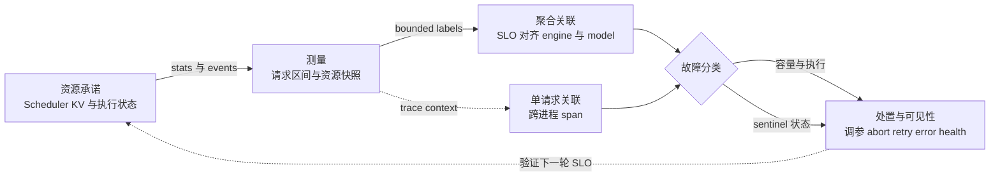

# vLLM 可观测性与可靠性：把 SLO 症状闭环到资源承诺与故障域

> **读者问题**：当 TTFT、TPOT、错误率或请求挂起越过 SLO 时，怎样用 metrics、EngineCore events、traces 与 sentinels 判断这是资源承诺、执行退化、数据损坏，还是某个进程故障，并确认处置已经生效？
>
> **中心命题**：vLLM 的可观测性不是一张指标清单，而是一条有状态的反馈回路。Scheduler 在状态所有者一侧导出资源承诺快照和单调时钟事件；frontend 把增量恢复成请求区间并聚合为低基数 metrics；trace 承担高基数的单请求关联；sentinel 再把异常分类为可恢复、不可恢复或数据损坏，并把分类转成 abort、retry gate、健康状态或显式错误。任何一环失去时间域、进程身份或新鲜度，SLO 症状就不能可靠地映射回故障域。
>
> **本文拥有**：观测/故障反馈；Scheduler 承诺如何变成 measurements；metrics、events、traces 的关联边界；EngineCore/Worker/fatal sentinels 的故障分类与可见性；cardinality、sampling、stale-signal、process-boundary 成本。
>
> **本文排除**：API server、DP coordinator 与负载均衡的服务路由机制由 [[02_engineering/03_infer_frameworks/vllm/16_vllm_serving_control_plane_analysis|Serving 控制面]] 拥有；Scheduler admission、单 Engine KV、跨 Engine KV 与 rank/collective 的内部证明分别由 `11`、`12`、`26`、`22` 页拥有。本页只解释这些 owner 暴露的信号怎样进入反馈回路。
>
> **源码基线**：`vllm-project/vllm@6b110badbb22d3f66c7218b71138f13b7a6b3419`（`origin/main`，提交日期 2026-08-29）
>
> **最近核验**：2026-08-30

## 1. 背景：SLO 是症状，资源承诺和故障域才是原因

一次请求的尾延迟既可能来自尚未获得 token/KV/encoder budget，也可能来自已进入设备执行后的 preemption、外部 KV 等待或执行退化；“请求仍未返回”还可能意味着 frontend output handler 或 EngineCore 已经死亡。官方 metrics 设计也把两类信息分开：request-level metrics 是 SRE 追踪的 SLO，而 server-level metrics 用来解释它们；`docs/design/metrics.md:12-18`。

因此，观测闭环必须同时保留两种状态：**用户症状**回答“坏到什么程度”，**资源承诺与故障状态**回答“哪一个 owner 没能兑现什么”。当前 `SchedulerStats` 不是一个静态指标目录，而是一次调度后对 running、两类 waiting、KV usage、prefix/connector、eviction、spec decode、CUDA Graph 与 perf 的结构化快照；`vllm/v1/metrics/stats.py:185-214`。Scheduler 生成快照时直接读取当前队列长度和 KV usage，并排空本轮要上报的 KV eviction 等增量统计；`vllm/v1/core/sched/scheduler.py:2663-2699`。

这条边界有一个关键不变量：**测量值不能反过来成为资源权威**。Prometheus gauge 只是在 frontend 看到的最近一份快照；waiting/running 和 KV block 的真实所有者仍是 Scheduler。否则监控延迟或 exporter 故障会被误当成调度状态变化。

## 2. 为什么是反馈回路，而不是“多打日志”

直觉替代方案是在 EngineCore 热循环里计算所有区间、逐请求打印明细并直接 export。官方设计明确选择相反方向：EngineCore 只发送 `EngineCoreOutputs` 能携带的快照与事件，把 bookkeeping 放到可与 GPU 执行重叠的 AsyncLLM outer loop，以缩短 forward 之间的控制间隔；`docs/design/metrics.md:134-150`。live path 中，AsyncLLM 的 output handler 拉取输出、分块处理、更新 SchedulerStats，最后调用 logger manager；分块本身就是为了避免长时间阻塞 event loop；`vllm/v1/engine/async_llm.py:687-743`。

> [!note] 分析推断：被否掉的替代
> 源码没有声称作者逐项比较过“全量 request label”“每 token 日志”或“只做 health probe”。但当前边界显示了决定标准：热路径成本、跨进程时钟正确性、聚合基数和故障可终结性。把高频细节全部塞进一个 sink，会同时破坏这四个标准。

**Figure Specification — 反馈环与状态所有权**：从左到右画五个阶段。资源承诺节点只拥有 Scheduler/KV/runner 的当前状态；测量节点只携带快照与事件；关联节点用有限 labels 汇总，用 trace context 下钻单请求；故障分类节点把容量、执行、数据和进程故障分开；处置与可见性节点执行 abort/retry gate/error/health，并用一条虚线回到下一轮 SLO 验证。主线上同时标出 metrics、events、traces、sentinels 各自承担的接口，图中不出现服务路由。

这张图不是调用链：它强调每个信号只携带足够的证据，把决定权留在原状态 owner；处置后的下一轮测量才证明闭环完成。

## 3. 实现思路与细节：五段反馈如何闭合

### 3.1 Commitment → measurement：在状态所有者处打时间戳，在 frontend 算区间

Scheduler 对 QUEUED、首次 SCHEDULED 和 PREEMPTED 记录 typed event：事件使用 EngineCore 进程的 monotonic timestamp，并明确禁止与其他进程的 monotonic timestamp 直接比较；`vllm/v1/engine/__init__.py:169-193`。SCHEDULED 共享本次 schedule 开始的时间戳，preemption 则在释放资源并把请求放回 waiting 时记录；`vllm/v1/core/sched/scheduler.py:539-542`、`vllm/v1/core/sched/scheduler.py:1147-1158`、`vllm/v1/core/sched/scheduler.py:1405-1432`。

Frontend 必须跨 delta 保存请求状态。`RequestStateStats` 把 frontend wall-clock arrival 与 EngineCore monotonic 的 queued/scheduled/first/last-token 时间明确分栏；`vllm/v1/metrics/stats.py:217-236`。`IterationStats` 用 wall-clock arrival 计算 frontend 观察到的 TTFT/e2e，用同一 EngineCore 时间域内的事件计算 queue、prefill、decode 与 ITL，并在完成时一次性形成 finished-request observation；`vllm/v1/metrics/stats.py:425-502`、`vllm/v1/metrics/stats.py:528-580`。

为什么不让 frontend 根据“收到消息的时刻”倒推排队时间？它看不到请求真正进入 Scheduler 与首次获得资源的时刻，IPC 排队还会污染区间。事件把**源时间**带过进程边界，frontend 只做同域相减；这正是官方设计强调的约束；`docs/design/metrics.md:152-178`。

### 3.2 Measurement → correlation：聚合信号解释规模，高基数信号解释个例

Prometheus logger 的基础 labels 是 `model_name` 与 `engine`，waiting reason 等额外维度来自有限枚举；`vllm/v1/metrics/loggers.py:443-530`。它把 Scheduler 快照写成 gauges/counters，把完成请求的 TTFT、ITL、queue/prefill/decode/e2e 写入 histograms；`vllm/v1/metrics/loggers.py:1100-1165`、`vllm/v1/metrics/loggers.py:1185-1255`。**分析推断**：这个边界使看板先回答“哪个 engine、哪种承诺一起恶化”，而不会为每个请求创建一条时序。

单请求关联交给 trace。请求完成时，OutputProcessor 从传回的 trace headers 恢复 parent context，把 external request ID、token 用量和相同的延迟分解写入 `llm_request` span；`vllm/v1/engine/output_processor.py:755-815`。OTel provider 给进程附加 pid，worker 可从环境继承 exporter endpoint，request span 则从 headers 恢复 parent；export 使用 `BatchSpanProcessor`，因此进程身份和请求上下文有各自的关联载体，但对外可见不是同步提交；`vllm/tracing/otel.py:60-130`。同基线测试因此轮询最多 15 秒等待 batched `llm_request` span，并核验 request ID 与 queue/TTFT/e2e attributes；`tests/v1/tracing/test_tracing.py:51-100`。

> [!note] 分析推断：cardinality 分工
> 代码没有注释说“request ID 因 cardinality 被排除出 Prometheus labels”，但边界是可验证的：聚合面只用 `model_name`、`engine` 和有限 reason/source，request ID 位于 trace attribute。把 request ID 或 prompt 放进 metrics，会把 series 数量变成请求数；正确做法是 metrics 触发告警、trace 下钻个例，而不是把两者合并。

### 3.3 Correlation → fault classification：同一个症状必须能落到不同 owner

| SLO 症状 | 先验证的承诺/状态 | 关联证据 | 故障分类边界 |
|---|---|---|---|
| TTFT 尾部上升 | waiting reason、KV usage、QUEUED→首次 SCHEDULED、prefill 区间 | engine/model 聚合后，用 request span 验证个例 | queue 上升指向 admission/capacity；queue 稳定而 prefill 上升才转向执行或数据装载；waiting reason 的 `capacity` 与 `deferred` 由 logger 明确分开；`vllm/v1/metrics/loggers.py:503-530` |
| TPOT/ITL 上升 | PREEMPTED 事件、decode/ITL、spec/connector/perf stats | 同一 engine 时间窗对齐请求 histogram 与 Scheduler 快照 | preemption/资源压力与设备执行退化是不同 owner；事件消费与区间更新发生在同一 request state；`vllm/v1/metrics/stats.py:484-526` |
| 输出错误但进程存活 | per-request NaN 检测与 corrupted completion count | 关联 model revision、backend/runner trace 或变更窗口 | 数据损坏不是 liveness 故障；检测只在显式开关启用时计算；`vllm/envs.py:1792-1803`、`vllm/v1/metrics/stats.py:475-482` |
| 请求挂起或批量失败 | output handler task、engine-dead flag、FT status | trace 最后 span 与 status/error 到达时间 | frontend handler、EngineCore process、worker/executor 是不同故障域，不能用一个 HTTP 进程存活信号代替；`vllm/v1/engine/async_llm.py:1106-1121` |

这里的原则是先从 SLO 进入，再沿同一时间窗回溯承诺。单看高 KV usage 不能推出容量故障；单看 HTTP 进程存活也不能推出 EngineCore 健康。

### 3.4 Fault classification → mitigation/visibility：异常必须变成终态或受控恢复

故障容忍开启时，`EngineCoreSentinel` 把 busy-loop 异常变成状态机：先停止继续执行，abort Scheduler 中的请求并清空 batch queue；executor 已失败则标记 DEAD，否则标记 UNHEALTHY，然后把状态推给 client；`vllm/v1/fault_tolerance/engine_core_sentinel.py:80-120`。只有 UNHEALTHY 接受 recovery command；retry 会重建必要的 DP group、向 workers 广播清理命令，再置回 HEALTHY；`vllm/v1/fault_tolerance/engine_core_sentinel.py:51-78`、`vllm/v1/fault_tolerance/engine_core_sentinel.py:122-170`。Worker 侧清掉 execute state、persistent request rows 或旧 input batch/KV connector state，避免恢复后复用故障前的隐藏状态；`vllm/v1/worker/sentinel/gpu_worker_sentinel.py:47-89`。

这是比“捕获异常后继续 loop”更强的恢复合同。**分析推断**：若不先清理，Scheduler、device rows 与 collective epoch 可能继续携带故障前的不同状态；先 abort/clear，再从干净状态恢复，等于把旧承诺明确作废。E2E tests 验证了两种分类：通信故障两侧都可进入 UNHEALTHY 并 retry 回 HEALTHY；worker 被杀时幸存 rank 是 UNHEALTHY、worker 所属 engine 是 DEAD，DEAD 必须拒绝 retry；`tests/v1/fault_tolerance/test_fault_tolerance_e2e.py:270-315`、`tests/v1/fault_tolerance/test_fault_tolerance_e2e.py:320-378`。

未被可恢复 wrapper 吸收的 fatal error 走另一条终结路径：EngineCore 把 `ENGINE_CORE_DEAD` byte sentinel 放入 output queue，并最多等待五秒让 output thread 发出；`vllm/v1/engine/core.py:1372-1378`、`vllm/v1/engine/core.py:1638-1649`。client 收到 sentinel 后设置共享 `engine_dead` 并抛 `EngineDeadError`；独立的 process-liveness monitor 是第二条检测通道；`vllm/v1/engine/core_client.py:424-493`、`vllm/v1/engine/core_client.py:711-738`。**分析推断**：双通道避免把可靠性建立在“濒死进程仍能成功发出最后一条消息”这一假设上。

最后，错误必须抵达所有等待者。AsyncLLM output handler 失败时会向未完成请求传播异常；其 `errored` 同时包含 engine-dead 与 handler-task 已结束；`vllm/v1/engine/async_llm.py:687-748`、`vllm/v1/engine/async_llm.py:1106-1121`。`/health` 只把 `EngineDeadError` 映射为 503；这是一条**可见性合同**，至于流量如何迁走仍属于 Serving 控制面；`vllm/entrypoints/serve/instrumentator/health.py:22-33`。

数值损坏提供“计数”与“终止”两种策略：开 `VLLM_COMPUTE_NANS_IN_LOGITS` 时完成请求进入 corrupted counter；开更强的 `VLLM_RAISE_ON_LOGIT_NANS` 会把 per-request NaN map 直接转成异常。同步 runner 为此执行 opt-in D2H，源码明确把它视为诊断成本；`vllm/v1/worker/gpu_model_runner.py:5784-5800`。

## 4. 约束、成本与失败边界

### 4.1 Cardinality：维度越细，聚合面越可能先失效

Prometheus 的安全边界不是“label 越多越好”，而是只保留可枚举、可聚合且能指向 owner 的维度。当前基础 labels 固定为 model/engine，request ID 进入 trace；`vllm/v1/metrics/loggers.py:468-475`、`vllm/v1/engine/output_processor.py:778-813`。**分析推断**：adapter/request/prompt 级细节会让 series 随工作负载身份增长，不应继续扩散到常驻时序面。

### 4.2 Sampling：降低热路径成本，也放弃逐对象完备性

KV residency metrics 默认只采 1% blocks，并限制每个 sampled block 的 access history 最多四项；`vllm/config/observability.py:60-66`、`vllm/v1/core/kv_cache_metrics.py:16-64`。采样 block 被 eviction 时才产生 lifetime/idle/reuse-gap event，未采样 block 没有记录；`vllm/v1/core/kv_cache_metrics.py:66-96`。

> [!note] 分析推断：如何读采样结果
> 这些 histogram 适合判断 residency 分布和趋势，不是精确 block 总数。稀有 tail 可能漏样，短窗口也可能有较大方差；要提高置信度只能延长窗口或临时提高 sample rate，同时接受更多状态与事件成本。trace 的详细模块开关则是另一种成本门：配置明确警告 per-request detailed timing 可能昂贵，并要求先有 OTLP endpoint；`vllm/config/observability.py:36-46`、`vllm/config/observability.py:165-170`。

### 4.3 Stale signal：最后一份值不等于当前真相

Prometheus gauges 只在 logger 收到 `SchedulerStats` 时被 `set`；trace 又经 batch exporter 延迟可见。因此“数值存在”不能证明 observation pipeline 仍在前进；`vllm/v1/metrics/loggers.py:1100-1123`、`vllm/tracing/otel.py:83-88`。**分析推断**：生产告警必须为 scrape/iteration/span 设置 freshness 条件，并把 output-handler/engine health 作为旁路；否则故障前最后一份“healthy”快照会成为 stale signal。

当前实现也承认不完整聚合比没有聚合更危险：`api_server_count > 1` 时默认 text stats logging 被禁用，以避免 incomplete stats；`vllm/v1/metrics/loggers.py:1338-1350`。这不是说 Prometheus 永不陈旧，而是提醒每个 sink 都必须声明自己覆盖哪些进程和更新时间。

进程聚合错误还有更具体的失败边界：多 engine 时 `vllm:lora_requests_info` 被源码直接警告为可能错误或误导；`vllm/v1/metrics/loggers.py:1052-1074`。此时继续展示一条“最近值”会掩盖覆盖缺口，而不是增加可观测性。

### 4.4 Process boundary：源时间、传输时间和观察时间不能混算

EngineCore monotonic event 只能与同一进程的 event 相减；frontend arrival/e2e 使用 frontend wall clock。`EngineCoreEvent` 的类型注释和 `RequestStateStats` 的字段分区都把这个不变量写进了源码；`vllm/v1/engine/__init__.py:177-193`、`vllm/v1/metrics/stats.py:217-236`。IPC/OTLP 延迟影响“什么时候看见”，不应污染“事件何时发生”。

这个分离有成本：events 和 stats 要随 `EngineCoreOutputs` 过边界；该结构同时携带 outputs、SchedulerStats 与 EngineCore monotonic timestamp；`vllm/v1/engine/__init__.py:253-281`。logger 仍在 AsyncLLM output handler 内同步 record，源码留有“Prometheus overhead 变得显著后移到后台线程”的 TODO；`vllm/v1/engine/async_llm.py:732-743`。fatal sentinel 本身也可能发不出去，因而才需要五秒 join guard 与独立 liveness monitor 两条检测通道；`vllm/v1/engine/core.py:1638-1649`、`vllm/v1/engine/core_client.py:720-738`。

## 5. 验证闭环：一次告警怎样结束

一次可操作的处置应按以下顺序闭合，而不是从任意 mechanism metric 直接触发重启：

1. **确认症状**：用 request-level distribution 定位 TTFT、TPOT/e2e 或 error 的 engine/model/time window。
2. **回溯承诺**：在同一窗口读取 waiting reason、KV usage 与 typed events，判断问题发生在 admission 前还是执行后。
3. **关联个例**：用 request trace 检查 queue/prefill/decode 分解和最后可见进程；不要把 request ID 加回 Prometheus。
4. **分类故障**：容量/执行退化留给对应 owner；corruption 走 count/raise；UNHEALTHY 才允许受控 retry；DEAD 或 output-handler death 必须 fail fast。
5. **确认可见性与新鲜度**：处置后必须看到新的 SchedulerStats/trace/status，而不是仅看到旧 gauge 或 HTTP 进程仍存活。

删除所有源码引用和 Mermaid 后，这五步仍给出完整因果链：**SLO 症状 → 资源承诺 → 单请求关联 → 故障状态 → 处置后的新观测**。源码 locator 的作用是证明边界，不是代替边界。

## 6. 源码—文档冲突与有锚点的演进

> [!contradiction] 同基线 design doc 与 live code 的区间语义冲突
> `docs/design/metrics.md` 把 queue/prefill/decode/inference 都描述为相对“最近一次 SCHEDULED”；`docs/design/metrics.md:193-201`。但 live code 在第一次 SCHEDULED 后不再覆盖 `scheduled_ts`，完成统计也明确按“first QUEUED → first SCHEDULED”计算 queue；`vllm/v1/metrics/stats.py:516-526`、`vllm/v1/metrics/stats.py:537-552`。本页以 live code 为准：preemption 被包含在后续 prefill/decode/inference 区间，而不是重置基点。

指标名也不是永久 ABI。`show_hidden_metrics_for_version` 只是迁移旧 dashboard 的临时 escape hatch，注释明确说 hidden metric 很可能在后续 release 完全移除；`vllm/config/observability.py:21-34`。**分析推断**：可靠性闭环还必须版本化 recording rule 与 dashboard；否则升级本身会制造“信号消失”，并被误判为服务恢复或流量归零。

## Related Pages

- [[02_engineering/03_infer_frameworks/vllm/10_vllm_engine_architecture_analysis|vLLM Engine 所有权]] — 解释 Client、EngineCore、Executor 的进程边界，本页只拥有跨边界信号与错误反馈。
- [[02_engineering/03_infer_frameworks/vllm/11_vllm_scheduler_analysis|vLLM Scheduler 事务]] — waiting、token/KV budget、preemption 的权威资源承诺，本页消费其观测结果。
- [[02_engineering/03_infer_frameworks/vllm/12_vllm_kv_cache_management_analysis|vLLM KV Cache 所有权]] — KV usage、eviction 与 residency 信号所代表的真实 block 状态。
- [[02_engineering/03_infer_frameworks/vllm/16_vllm_serving_control_plane_analysis|vLLM Serving 控制面]] — 接管 health/readiness 之后的进程生命周期与服务路由；本页不复述路由机制。
- [[02_engineering/03_infer_frameworks/vllm/22_vllm_distributed_inference_analysis|vLLM 分布式推理]] — 解释 rank/group/collective 故障域为何能在 survivor 与 victim 上产生不同 sentinel 状态。
- [[02_engineering/03_infer_frameworks/vllm/26_vllm_disaggregated_kv_serving_analysis|vLLM 分离式 KV Serving]] — external KV transfer、connector failure 与 lease cleanup 的 owner，本页只解释它们怎样参与 SLO 归因。
