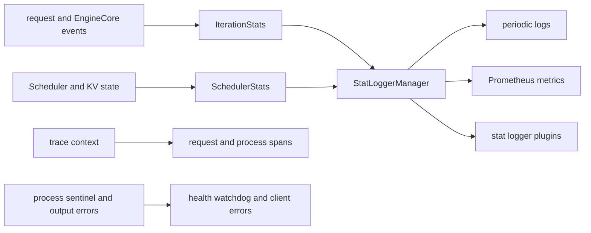

# vLLM 可观测性与可靠性：从请求 SLO 追溯到资源承诺与故障域

> **源码基线**：`vllm-project/vllm@d66300a1baa7779c68c7dfa4e51eee2502b48017`
> **中心命题**：推理服务的“慢”不是一个指标。vLLM 在请求、Scheduler、KV/connector、spec decode、CUDA Graph 和进程故障层生成不同统计，再由 logger/Prometheus/trace 组合观测。可靠性设计则要求 engine death、数据 corruption、disconnect 和 transfer failure 都变成显式终态，不能让服务端口继续健康但请求永远挂起。

## 一、观测模型先于指标名字

端到端延迟至少可分为：

$$
T_{\mathrm{e2e}}=T_{\mathrm{queue}}+T_{\mathrm{prefill}}+T_{\mathrm{decode}}+T_{\mathrm{frontend/output}}
$$

而常用用户体验指标是：

$$
TTFT=T_{\mathrm{queue}}+T_{\mathrm{prefill}}+T_{\mathrm{first\ output}}
$$

$$
TPOT\approx\frac{T_{\mathrm{decode}}}{N_{\mathrm{output}}-1}
$$

TTFT 上升可能来自 waiting queue、remote KV load 或 prefill compute；TPOT 上升可能来自 decode batch、KV pressure、collective、graph miss 或 draft verification。只看 e2e 或 GPU utilization 不能区分这些机制。

## 二、Scheduler stats 解释“系统此刻为什么堵”

`SchedulerStats` 包含 running/waiting/skipped waiting、KV usage、local/external prefix cache、eviction、spec decode、connector、LoRA、CUDA Graph 和 perf stats；`vllm/v1/metrics/stats.py:186-214`。

这组字段的设计价值是关联资源承诺：

- waiting 上升 + KV usage 高：可能是 block admission/preemption；
- skipped waiting 上升：队首请求不可满足但调度器继续扫描；
- prefix cache queries/hits：解释本地实际 prefill compute；
- external cache hits + connector latency/failure：解释 P/D 或 offload 路径；
- spec acceptance/drafter time：解释投机是收益还是负担；
- graph mode/hit：解释 launch overhead 是否回归 eager。

这些是机制指标，不应直接替代用户 SLO。KV usage 高可能是良好利用，也可能正逼近 preemption cliff，必须结合 waiting、preemptions 与 TPOT。

## 三、请求级统计必须跨 delta 保存状态

EngineCore 每步只返回增量输出，TTFT/queue/e2e 需要跨 step 保存 arrival、queued、scheduled、first/last token 时间。`RequestStateStats` 持有这些 timestamp 与 generation count；`vllm/v1/metrics/stats.py:218-236`。

`IterationStats` 接收 EngineCore output：首次 token 记录 TTFT，后续 token 记录 ITL，并消费 QUEUED、SCHEDULED、PREEMPTED 事件；`vllm/v1/metrics/stats.py:349-450`。请求完成时再计算 queued、prefill、decode、inference、e2e 和 mean TPOT；`vllm/v1/metrics/stats.py:452-500`。

这里有两个时间域：frontend arrival 使用 wall clock，EngineCore events 使用 monotonic timestamp；`vllm/v1/metrics/stats.py:223-230`。跨进程统计必须在定义好的边界组合，不能随意相减两个机器/进程未校准的时钟。

请求 ID 可出现在日志和 trace 中，但不适合作为 Prometheus label：无界 cardinality 会让时序库本身成为故障源。聚合指标按 engine/model/finish reason 等有限维度，单请求诊断交给 trace/log。

## 四、`StatLoggerManager` 隔离 DP 聚合细节

DP 场景中一个 `AsyncLLM` 可能对应多个 EngineCore。local logger 可按 engine 各建实例，Prometheus 更适合单 logger 加有限 `engine` label。`StatLoggerManager` 正是把这种差异隐藏在统一 record/log 接口后；`vllm/v1/metrics/loggers.py:1311-1402`。

内置 logger 包括周期文本日志与 Prometheus；stat logger plugin 可通过 plugin group 加载；`vllm/v1/metrics/loggers.py:74-90`。Prometheus 注册 KV usage、prefix/external cache queries/hits、TTFT、TPOT、e2e 等；`vllm/v1/metrics/loggers.py:443-628,796-919`。

分层的原因是：

- 热路径只生成结构化 stats，不执行网络 export；
- logger 决定聚合窗口、bucket 和输出后端；
- 插件可以新增 sink，而不修改 Scheduler/runner。

## 五、Metrics、Logs、Traces 各自回答不同问题

| 信号 | 适合 | 不适合 |
|---|---|---|
| metrics | SLO、容量、趋势、告警与维度聚合 | 单请求精确因果链 |
| structured logs | 稀有事件、配置、fallback、错误上下文 | 高频每 token 详情 |
| distributed trace | 一次请求跨 frontend/core/worker 的时间链 | 全量高吞吐长期保留 |
| profiler/kernel trace | CPU/GPU micro bottleneck | 常驻生产观测 |

`ObservabilityConfig` 控制 OTLP endpoint 与 model/worker detailed trace，并校验 detailed trace 必须有 endpoint；`vllm/config/observability.py:18-39,89-157`。tracing facade 在 OTel 可用时初始化 frontend/worker tracer，`instrument` 不可用时退化为原函数；`vllm/tracing/__init__.py:66-145`。

request trace context 从入口 headers 传入内部 request，完成时 `OutputProcessor` 用明确 start/end timestamps 建立 `llm_request` span；`vllm/v1/engine/output_processor.py:754-808`。因此 trace 应贯穿同一 request ID/context，而不是在每个进程重新建无关 root span。

## 六、可靠性首先要求故障可见

EngineCoreProc 异常退出会向 output queue 发送 `ENGINE_CORE_DEAD` sentinel；`vllm/v1/engine/core.py:1618-1623`。core client 收到后设置共享 `engine_dead`；`vllm/v1/engine/core_client.py:426-492`。`AsyncLLM.errored` 同时检查 engine dead 与 output handler 是否存活；`vllm/v1/engine/async_llm.py:1105-1120`。

这条路径的目标是 fail-fast：

1. 新请求不再进入已死 engine；
2. output handler 向所有未完成 collector 传播错误；`vllm/v1/engine/async_llm.py:686-747`；
3. `/health` 调用 client `check_health()`，不只检查 HTTP event loop；`vllm/entrypoints/serve/instrumentator/health.py:22-31`；
4. API watchdog 在 engine error 且停止运行时触发 server exit；`vllm/entrypoints/launchers/launcher.py:180-202`。

只返回 500 而保持 readiness 会让 load balancer继续送流量；只杀 HTTP server 而不传播未完成请求又会留下长时间 hang。

## 七、数值 corruption 也是可靠性故障

设备/kernel/量化错误不一定 crash，NaN logits 可能继续被采样。启用相应检测时，`IterationStats` 在请求第一次出现 NaN 时标记 corrupted，并在完成时计数；`vllm/v1/metrics/stats.py:399-406,502-504`。

这类信号应与 kernel/backend、dtype、graph mode、model revision 关联。只监控进程存活会把“稳定地产生错误结果”判断为健康。

数值检查本身有开销，不一定适合全量常开；可在 canary、升级窗口或抽样请求中启用，并保留固定 prompts/logits 基线。

## 八、生产告警应沿因果链设计

推荐把告警分层：

1. **用户层**：TTFT/TPOT/e2e/error/abort 的 p50/p95/p99 与 goodput；
2. **排队层**：running/waiting/skipped、queue time、preemption；
3. **容量层**：KV usage/eviction、prefix hit、external hit/transfer、GPU memory；
4. **执行层**：tokens/s、graph hit/eager fallback、spec acceptance 与阶段 time、collective/kernel；
5. **可靠性层**：engine dead、output handler failure、NaN/corruption、connector failure、shutdown timeout。

告警从用户层触发，机制层用于归因。单独对“GPU 90%”报警往往没有意义；对“TPOT p99 超 SLO 且 KV usage/等待/graph miss 同步变化”才可操作。

## 九、替代方案与常见陷阱

| 做法 | 问题 |
|---|---|
| 只看平均 tokens/s | 掩盖 TTFT/TPOT 尾延迟与失败请求 |
| Prometheus 添加 request ID/prompt | 高 cardinality、隐私与成本风险 |
| 每 token 打 info 日志 | I/O 干扰 event loop/CPU 热路径 |
| 只检查 HTTP 200 health | backend 可已死亡或 output handler 已停止 |
| engine death 后继续接请求 | 无限失败/排队，根因被二次错误淹没 |
| 只在 crash 时验证数值 | silent NaN/错误 logits 无法发现 |
| 优化命中不埋点 | fallback 后服务仍可用但性能回归不可解释 |

## 十、验证与演练

1. 用固定负载验证 TTFT、ITL、TPOT、queue/prefill/decode 分解能闭合；
2. 确认 DP 多 engine 指标不会重复计数或混淆 label；
3. 模拟 prefix hit、preemption、spec on/off、graph fallback、KV connector hit/fail；
4. 杀死一个 EngineCore，确认 sentinel → collector error → health fail → process exit；
5. 断开 streaming client，确认 abort 到 Scheduler/KV；
6. 注入 NaN/transfer error，确认显式 corruption/fail/recompute 指标；
7. 检查 shutdown drain/abort、指标 flush 和总 deadline。

最小源码阅读顺序：`vllm/v1/metrics/stats.py:186-280,349-505` → `vllm/v1/metrics/loggers.py:74-90,443-919,1311-1402` → `vllm/tracing/__init__.py:66-145` → `vllm/v1/engine/output_processor.py:754-808` → engine dead/health/watchdog 路径。

## Related Pages

- [[02_engineering/03_infer_frameworks/vllm/11_vllm_scheduler_analysis|vLLM Scheduler]] — running/waiting/preemption 与资源 admission 指标来源。
- [[02_engineering/03_infer_frameworks/vllm/12_vllm_kv_cache_management_analysis|vLLM KV Cache 管理]] — KV usage、prefix hit 和 eviction 的物理含义。
- [[02_engineering/03_infer_frameworks/vllm/16_vllm_serving_control_plane_analysis|vLLM Serving 控制面]] — health、watchdog、abort 与 graceful shutdown。
- [[02_engineering/03_infer_frameworks/vllm/20_vllm_speculative_decoding_analysis|vLLM 投机解码]] — acceptance 与 drafter/target/verification 归因。
- [[02_engineering/03_infer_frameworks/vllm/23_vllm_compilation_cudagraph_analysis|vLLM 编译与 CUDA Graph]] — graph hit/fallback、recompile 与 capture 指标。
- [[02_engineering/03_infer_frameworks/vllm/26_vllm_disaggregated_kv_serving_analysis|vLLM 分离式 KV Serving]] — transfer、lease、external cache 与恢复信号。
