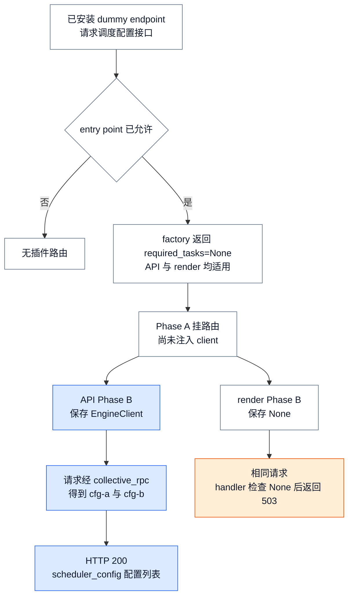
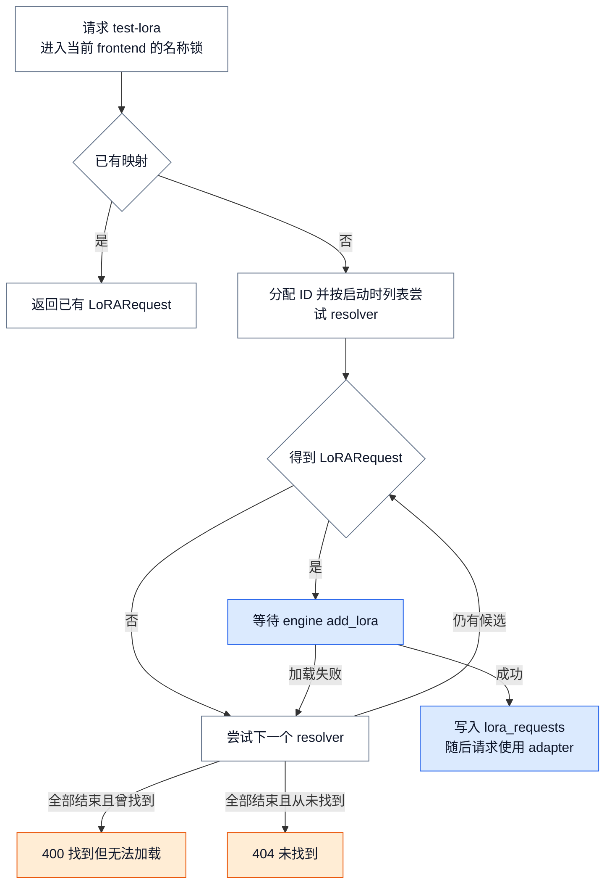

# vLLM 扩展与插件系统：把全局变更约束在显式生命周期内

> **源码基线**：`vllm-project/vllm@199cb9b964822e59ab9b58d88e7be31eb419a2ae`（本地冻结 HEAD，2026-09-08）
> **主题**：从增加一个管理接口的例子，解释 entry point 的发现与选择、各类插件的初始化时机，以及 LoRA resolver 的请求提交过程。
> **适用范围**：general、platform、IO、endpoint、stat logger 与 LoRA resolver 的接入边界；模型构造归模型库页，设备侧 LoRA 执行归 Runner 页。
> **最近更新**：2026-09-08。核验当前源码，补齐具体接入实例、异常范围与依赖边界。

## 1. 背景：安装一个包，不等于扩展已经安全生效

假设要增加 `GET /v1/admin/scheduler_config`，返回 engine 的调度配置。安装插件包后，这个 URL 不一定存在：服务还要允许加载它、挂上路由，再把已建立的 `EngineClient` 交给 handler。若同一插件被装到只做 CPU 渲染的服务中，那里没有 engine，路由仍可能存在，却不能查询配置。这正是仓库 dummy endpoint 插件与测试中的普通例子。

本页的核心判断是：**插件是否可用，取决于选择与初始化是否发生在正确进程、正确时机。** 把所有能力塞进一个 import 时执行的注册函数，会混淆尚未建立的依赖和已经冻结的状态；通用插件接口也没有事务回滚替这种混淆兜底。

vLLM 要同时吸收设备平台、engine-side 注册、Pooling I/O、HTTP route 和按需 LoRA 来源等扩展；这些能力的状态所有者并不相同。general 插件需要覆盖 process 0、EngineCore 和 worker，IO 插件只在 process 0 使用，platform 在各进程首次解析 `current_platform` 时确定，而 endpoint 只属于 API frontend。源码把这些作用域直接写进 group 定义，说明“插件加载一次”不是一个全系统语义，而只能是某个地址空间或 app 的局部语义。

标准 Python entry point 只提供“哪个已安装发行包声明了哪个名字与可加载对象”的目录。vLLM 先枚举 group，再按 `VLLM_PLUGINS` 过滤，最后才调用 `EntryPoint.load()` 导入对象；导入不是 discovery 的同义词。官方设计文档也把 entry-point group、entry-point name 和 value 分成三个部分。

**分析推断：为什么这胜过 import-time 自动注册。** 如果第三方包只要被 Python 间接 import 就立即改 registry、平台或 routes，那么选择发生在副作用之后：未选插件也能改变当前进程，父进程的 import 顺序还能与 spawn 出来的 worker 不同，失败后又没有统一撤销入口。先发现元数据、再选择、再导入不能让插件代码变安全，却把“哪段不受信代码何时开始执行”变成可审计的启动配置。endpoint 因为新增网络暴露面，进一步采用默认不加载的反向策略；该安全理由由 loader 与安全文档明确给出。

## 2. 为什么要分阶段：同一个 hook 无法表达所有冻结点

直观方案是提供一个 `register()`，在服务启动时统一执行。但 platform 必须在配置修正、worker class 和 backend 选择前冻结；general 注册必须在 CLI/config、EngineCore、worker 和模型 inspect 首次消费前可见；endpoint 的 Phase A 只挂 route，尚未向插件注入 EngineClient，Phase B 才初始化 route state。把它们压成一个时刻，会迫使扩展过早触碰尚未就绪的依赖，或过晚修改已经缓存的选择。

**图 1 规格**：沿同一个管理接口，在两个服务上重放“允许加载→挂路由→注入 client→查询”的顺序。API 分支保留 client 并返回配置；render 分支保留 `None` 并返回 503。箭头表示依赖先后，不表示比例时间；只强调 client 可用性与失败结果。

这里的 `cfg-a/cfg-b` 来自测试的 fake client，证明 HTTP handler 到 client 接口的接线；它不证明真实 worker 通信成功。陌生读者应能只看图就解释：route 存在不等于 engine 可用，第二阶段的对象决定同一 URL 的结果。

| 扩展 ABI | 选择与冻结点 | 初始化作用域与拥有状态 | 明确边界 |
|---|---|---|---|
| general | `VLLM_PLUGINS` 过滤后执行零参数回调；单进程首次调用后 guard 冻结 | process 0、EngineCore、worker、模型 inspect 子进程各自修改本地语义状态 | 回调必须可重入；group 不定义返回值、rollback 或 teardown |
| platform | 各进程首次访问 `current_platform` 时探测 factory，选中后缓存实例 | 当前进程的平台对象，随后影响 config、worker/backend 等选择 | 多个 OOT platform 同时激活直接失败；惰性解析用于避免插件继承 `Platform` 时的 import 环和过早冻结 |
| IO processor | EngineArgs 名称优先于模型 `hf_config`；解析类名后构造实例 | process 0 的 Pooling I/O processor 对象 | 未请求则不加载；请求名不可用显式报错 |
| endpoint | entry-point allowlist 与 `required_tasks` 共同选择；route attach 后、app state init 后分别冻结 | API 或 render frontend 的 FastAPI routes、`app.state` 与可选 EngineClient 引用 | 默认不加载；render 没有 EngineClient；文档提示重复路由风险，详见§3.4 |
| LoRA resolver | 作为 general plugin 注册 resolver；`OpenAIServingModels` 构造时把 registry 复制为有序实例列表 | frontend 的 resolver 列表、per-LoRA lock 和已加载 adapter 映射 | 构造完成后的新 registry 项不会自动进入既有列表；同名注册覆盖 |

## 3. 实现机制：发现、注册与初始化各自改变什么状态

### 3.1 Discover 与 select：先确定候选集，再执行代码

`load_plugins_by_group()` 的状态转换是：读取当前进程可见的 entry-point metadata，得到候选；读取 `VLLM_PLUGINS`，按 **entry-point name** 缩小候选；对留下的候选执行 `EntryPoint.load()`，得到 callable 字典。环境变量未设置时普通 group 加载全部候选；设置为空字符串时解析成只含空字符串的列表，因而一个也匹配不到。

这一步只隔离了**导入失败**：单个 `EntryPoint.load()` 抛错会被记录并从结果中省略，其他插件继续；它没有验证所有 group 的 callable 是否满足后续 ABI，也没有把多个回调包成事务。因此 selection 的不变量是“每个相关进程看见兼容的包元数据和 allowlist”，而不是“process 0 成功就代表全系统成功”。官方文档明确要求多进程 vLLM 中每个进程加载插件。

endpoint 另加一个 trust gate：`VLLM_PLUGINS` 未设置时，即使发现候选也只告警并返回空列表；设置后才实例化 factory，再按 `required_tasks` 与服务能力的交集筛选。测试覆盖了未设置、空字符串、任务不匹配和 factory 抛错仍继续加载其他项。

> [!contradiction] Allowlist 到底匹配哪个名字
> 实际 loader 在 `EntryPoint.load()` 前比较 `plugin.name`，这里的 `plugin` 是 Python entry point；endpoint 设计文档也明确说 entry-point name 与实例的 `name` 字段独立，allowlist 匹配前者。但 `EndpointPlugin.name` 的接口注释称该实例字段用于 `VLLM_PLUGINS` allowlisting。在本基线上应以 loader 行为为准；部署配置不要把对象字段名误当 entry-point name。

### 3.2 Import 与 register：general 的 once 只是 per-process

general loader 先把模块级 `plugins_loaded` 置为 `True`，再导入并逐个执行回调；同一进程后续调用直接返回。这提供的是 **at-most-once attempt per address space**，不是整个部署 exactly-once，也不是成功后才提交的事务。

vLLM 在多个首次消费点主动重复调用它：EngineArgs 初始化阶段在模型路径等后续解析前加载，EngineCore 构造时再次确保 scheduler/core 进程可见，worker 在解析 `worker_cls` 前加载，模型 inspect 子进程也在执行传入函数前加载。CLI 还在构造参数选项时提前加载，使插件能先扩展 quantization/device 候选。

由此得到两个不变量：

1. 任何会读取插件所改状态的进程，都要在首次读取前调用 loader；process 0 的注册不会自动传播到另一个 OS 进程。
2. 回调要能在多个地址空间执行，并对同一地址空间的重复/部分执行安全。官方指南直接要求 entry-point function 可重入。

这也是 eager global mutation 最危险的地方：如果插件在普通 import 中注册，vLLM 无法保证 mutation 发生在上述消费点之前；如果回调先改 A 再在 B 抛错，guard 已经冻结为 loaded，当前进程没有自动重试或撤销 A 的路径。

### 3.3 Platform 与 IO：先选择实现，再构造拥有者

显式 `VLLM_TARGET_DEVICE=cpu` 会先走 CPU 平台并直接返回，跳过后续 builtin/OOT 共同探测；这防止 CPU 作业复用加速器 wheel 时又激活宿主加速器。除此分支之外，platform factory 的 ABI 是“当前环境不适用则返回 `None`，适用则返回 platform class 的全限定名”，设计文档把它与 `check_and_update_config`、worker/backend 选择关联。运行时代码把 builtin 与 OOT factory 一起探测，拒绝两个以上 OOT 激活，再解析并缓存唯一 platform 实例。同一 factory 在探测和最终取 class name 时可能被调用两次，所以 platform factory 尤其应接近纯函数；把不可重复的全局 mutation 塞进探测函数，会把环境检测变成副作用执行器。这一设计理由是依据调用顺序的**分析推断**。

惰性 `current_platform` 不是性能微优化。源码说明 OOT platform 自身要从 `vllm.platforms` 导入基类，模块 import 时立即解析会形成循环；同时，过早读取会在插件加载前冻结错误平台，测试会报告首次初始化栈。

IO processor 则先从显式 EngineArgs 或模型配置选一个名字，显式参数优先；只有确实请求了插件才发现 group、运行 factory、解析类名并用 `VllmConfig` 与 renderer 构造实例。实例由 Pooling frontend 的 processor 持有，并在请求路径做 parse/pre-process/post-process；不是 worker 全局能力。loader 测试沿完整的 entry point → load → factory → qualname → constructor 链核验成功与缺失错误。

### 3.4 Endpoint：route 与 engine-dependent state 必须分两阶段

`build_app()` 先挂 core routers，再 attach endpoint plugin routes；此时尚未向插件注入 EngineClient；正常 API 路径的 `build_and_serve()` 实际已经持有 client。API app 的 core state 建立完毕后才调用 `init_endpoint_plugins_state()`，render app 则明确传入 `None`。

Phase A 把已实例化 plugin 存入 `app.state.endpoint_plugins`，Phase B 从同一 state 取出对象并调用 `init_state()`；绕过 `build_app()` 的 bare-state 路径把缺失列表当作空集。这个边界让 route 构造不依赖尚未注入插件的 engine client，又让 handler 通过既有 EngineClient 接缝访问 engine，而不是暗建另一条跨进程通道。endpoint 与 engine-side general entry point 独立加载，任何一方都不暗示另一方存在。

代价是 route conflict 也在插件边界内：vLLM 证明的是 plugin hook 在 core routers 之后调用，且没有强制冲突检查。接口注释与安全文档称插件可以 shadow core route；这是上游宣告的风险，不应进一步推导为“后注册必然覆盖前注册”。具体匹配由外部 FastAPI/Starlette 及插件如何修改 `app.routes` 决定，本页未审计其内部实现。部署应按文档核对命名空间、鉴权与最终 routes。端到端测试用 ASGI 请求与 fake EngineClient 验证正常接线路径；render 测试则验证 `None` client 时由插件自己降级为 503。

### 3.5 LoRA resolver：启动时注册，按请求选择，成功后才对 frontend 可见

vLLM 自带的 filesystem 与 Hugging Face resolver 也通过 `vllm.general_plugins` entry point 注册，而不是由 serving code 写死。注册回调读取各自配置后把 resolver 实例写入进程内 registry；filesystem 路径无效会在注册阶段抛错，远端下载 resolver 还要求自己的 entry-point name 被显式 allowlist。

frontend 构造 `OpenAIServingModels` 时把 registry 当前顺序复制到 `self.lora_resolvers`。请求到来后，它以 LoRA 名称加锁，先查已加载映射，再逐个 resolver 尝试；只有 `engine_client.add_lora()` 成功才把结果提交到 `lora_requests`。找到但全部加载失败返回 400，全都找不到返回 404。因此 registry mutation 的可见性有明确截止点：在 serving 对象构造后再注册 resolver，并不会自动更新既有实例列表。

把请求名固定为 `test-lora`：第一次请求进入这个 frontend 的名称锁，遍历 resolver，拿到 `LoRARequest`（名称、路径、内部整数 ID），等待 `add_lora`，然后才写入前端映射。第二个同名请求在锁后直接复用映射。这样避免的是**同一 frontend 内**重复解析和提交，不是所有 API 副本间的分布式去重。上游 serving 测试检查 `add_lora` 后 `generate` 获得同一个 adapter 请求；按需入口还受 `VLLM_ALLOW_RUNTIME_LORA_UPDATING` 控制。

**图 2 规格**：从同一个 `test-lora` 请求出发，画出已有映射、未找到、找到但引擎拒绝、成功提交四个结果；状态变化重点是成功后才登记，不画设备上的低秩矩阵计算。

这个有序尝试的理由是**分析推断**：同一名称可能在本地和远端各有一份，仅“找到文件”不足以证明 engine 可加载；把成功提交放在等待 engine 接受之后，才让后续请求复用可用项。代价是同名锁内串行尝试、失败加载可能增加延迟，而且不会刷新已经缓存的同名 adapter。

图中失败继续只覆盖 `add_lora` 的捕获分支；`resolver.resolve_lora()` 自身在 `try` 外，若下载或解析直接抛错，就会传播，不能概括为所有 resolver 错误都会尝试下一家。图也不保证失败的 engine 加载没有局部副作用；前端映射尚未写入不等于设备自动回滚。陌生读者检查：能区分“发现 adapter 文件”和“engine 接受 adapter”两个时刻，并解释 400 与 404 的不同。

resolver registry 对同名项采用“告警并覆盖”，不是拒绝重复；测试也把后注册实例视为最终值。这使注册天然可重复，但结果依赖顺序；插件作者应使用稳定唯一名称，测试应清理全局 registry，正如 serving 测试 fixture 显式删除 mock resolver。

### 3.6 Stat logger：接收类工厂，不是 general 的零参回调

自定义指标出口使用 `vllm.stat_logger_plugins`。`load_stat_logger_plugin_factories()` 要求 entry point 导入的是 `StatLoggerBase` 子类，不合要求直接 `TypeError`；`AsyncLLM` 将它与显式传入的工厂合并，再由 `StatLoggerManager` 构造 logger。逐 engine 与跨 engine 聚合 logger 接收的 engine 索引参数不同。即使 `disable_log_stats=True` 关闭内置 logger，自定义 logger 仍可以启用统计路径；对应集成测试检查了这个组合。指标的事件、时钟和聚合原理继续读 [[27_vllm_observability_reliability_analysis|可观测性机制]]，本节只拥有注册、类型与构造边界。

## 4. 约束与失败边界：没有通用事务，也没有通用 teardown

| 阶段 | 源码行为 | 对插件作者/部署者的含义 |
|---|---|---|
| entry-point import | `EntryPoint.load()` 异常被记录并跳过，其他候选继续 | group 可能得到部分候选集；必须从日志核对实际加载结果 |
| general callback | guard 在回调前置位，回调异常没有捕获 | 失败可留下部分 mutation，且本进程后续不会自动重试；回调应先验证、后做幂等提交 |
| platform probe | 探测异常被忽略；多个 OOT 命中则启动失败 | factory 要无副作用、结果稳定；不要把“未激活”与“探测抛错”都当成可接受成功 |
| IO selection | 单个 factory 异常只告警，但请求的名字最终不可用会抛 `ValueError` | 配置要求的 I/O 语义不能静默降级，否则请求类型会被误解释 |
| endpoint | factory 实例化异常被跳过；`attach_router` 与 `init_state` 循环本身不捕获插件异常 | factory 失败可局部隔离，两个初始化 hook 失败则进入 app 启动失败边界；hook 应能清理自己已创建的资源 |
| LoRA request | 单个 resolver 找到但 engine load 失败会继续下一个；全部失败才返回错误 | resolver 的“找到”不是提交点；只有 engine 接受并写入 frontend 映射才对请求可见 |

在这个基线上，general ABI 只有执行回调，`EndpointPlugin` 只有 `attach_router` 与 `init_state`，LoRA registry 只有 register/get；没有与之配对的统一 rollback、unregister 或 shutdown hook。因此清理责任落回各状态所有者：endpoint 资源应绑定 FastAPI/app lifespan，IO 实例绑定 serving object，resolver 与 general 注册默认活到进程结束。后一句是依据 ABI 缺口的**分析推断**，不是源码承诺。

部署验收不能止于“process 0 import 成功”。至少应验证：

1. 固定同一插件包版本和 `VLLM_PLUGINS`，分别在 frontend、EngineCore、worker 与 inspect 路径触发首次消费；
2. 重复执行注册回调，确认结果幂等且不会重复启动线程、连接或后台任务；
3. 注入 import failure、callback 中途失败、重复名称、多个 platform、IO 名称缺失、endpoint task 不匹配和 render 无 EngineClient；
4. 对 endpoint 审计最终 `app.routes`、鉴权与 route prefix，对 LoRA resolver 区分“未找到”和“找到但 engine 拒绝”；
5. 在进程 shutdown 后检查插件自行持有的线程、文件、socket 与临时目录，因为通用 ABI 不会替它们收尾。

这些检查对应的核心思想是：插件系统只规定**何时允许第三方代码进入哪个状态域**，不替第三方代码提供事务性。能否避免隐式全局污染，最终取决于插件是否遵守选择冻结点、per-process 幂等和状态所有者边界。

## 5. 从实例继续读源码与测试

下列入口均在页头提交实际打开。测试合同已静态阅读，本批没有安装 dummy 插件、启动 GPU 服务或执行远端 adapter 下载。

| 问题 | 稳定源码与验证入口 |
|---|---|
| 允许加载谁、失败在哪一层隔离 | `vllm/plugins/__init__.py::load_plugins_by_group / load_general_plugins / load_endpoint_plugins`；`vllm/envs.py::environment_variables[VLLM_PLUGINS]` |
| 首次消费前加载 general | `vllm/engine/arg_utils.py::EngineArgs.__post_init__ / AsyncEngineArgs.add_cli_args`；`vllm/v1/engine/core.py::EngineCore.__init__`；`vllm/v1/worker/worker_base.py::WorkerWrapperBase.init_worker`；`vllm/model_executor/models/registry.py::_run` |
| 平台的提前返回与惰性冻结 | `vllm/platforms/__init__.py::resolve_current_platform_cls_qualname / __getattr__`；`tests/plugins_tests/test_platform_plugins.py::test_platform_plugins` |
| IO 名称→类→实例→请求预处理 | `vllm/plugins/io_processors/__init__.py::get_io_processor`；`vllm/entrypoints/pooling/pooling/io_processor.py::PluginWithIOProcessorPlugins`；`tests/plugins_tests/test_io_processor_plugins.py::test_loading_plugin / test_loading_missing_plugin` |
| endpoint 从建 app 到可调用 | `vllm/entrypoints/launchers/api_server/entry.py::build_and_serve`；`vllm/entrypoints/launchers/app.py::build_app`；`vllm/plugins/endpoint_plugins/interface.py::attach_endpoint_plugins / init_endpoint_plugins_state`；`vllm/entrypoints/launchers/api_server/app_state.py::init_app_state`；`vllm/entrypoints/launchers/render/app_state.py::init_render_app_state` |
| 图1的返回值与无 client 分支 | `tests/plugins/vllm_add_dummy_endpoint_plugin/vllm_add_dummy_endpoint_plugin/__init__.py::DummyAdminEndpointPlugin`；`tests/plugins_tests/test_endpoint_plugins.py::test_endpoint_plugin_end_to_end / test_render_server_attaches_endpoint_plugins_with_no_engine_client`；同文件 `test_factory_raising_is_logged_and_skipped` |
| LoRA 插件注册与顺序 | `pyproject.toml` 的 `vllm.general_plugins`；`vllm/plugins/lora_resolvers/filesystem_resolver.py::register_filesystem_resolver`；`vllm/plugins/lora_resolvers/hf_hub_resolver.py::register_hf_hub_resolver`；`vllm/lora/resolver.py::_LoRAResolverRegistry` |
| 图2的等待、提交与错误 | `vllm/entrypoints/serve/engine/serving.py::BaseServing._check_model`；`vllm/entrypoints/openai/models/serving.py::OpenAIServingModels.__init__ / resolve_lora`；`tests/entrypoints/openai/completion/test_lora_resolvers.py::test_serving_completion_with_lora_resolver / test_serving_completion_resolver_add_lora_fails / test_serving_completion_resolver_not_found`；`tests/lora/test_resolver.py::test_resolver_registry_duplicate_registration` |
| 自定义统计出口 | `vllm/v1/metrics/loggers.py::load_stat_logger_plugin_factories / StatLoggerManager`；`vllm/v1/engine/async_llm.py::AsyncLLM.__init__`；`tests/plugins_tests/test_stats_logger_plugins.py::test_invalid_stat_logger_plugin_raises / test_stat_logger_plugin_integration_with_engine` |

设计文档证据为同一源码树的 `docs/design/plugin_system.md`（How Plugins Work / Guidelines）、`docs/design/endpoint_plugins.md`（Registering / Gating）与 `docs/usage/security.md`（Endpoint Plugins）。关于可重入、route 暴露和第三方下载的说明是这些文档的约定；Python 包发现、FastAPI 路由匹配和 Hugging Face 下载内部不在本页的源码核验范围。

## Related Pages

- [[02_engineering/03_infer_frameworks/vllm/13_vllm_model_library_analysis|vLLM 模型与权重 ABI]] — 承接 OOT model 注册之后的模型解析、构造和权重提交；本页不展开内置 registry。
- [[02_engineering/03_infer_frameworks/vllm/17_vllm_serving_control_plane_analysis|vLLM Serving 控制面]] — 解释 API、EngineCore 与 worker 的进程拓扑，以及插件初始化必须对齐的 ready/failure 边界。
- [[02_engineering/03_infer_frameworks/vllm/04_vllm_request_semantics_analysis|vLLM 请求语义]] — 拥有 endpoint 与 IO plugin 所接入的协议、render、input/output 转换语义。
- [[02_engineering/03_infer_frameworks/vllm/22_vllm_distributed_inference_analysis|vLLM 分布式推理]] — 给出 rank、worker 与 executor 的真实进程范围，用于审计 general plugin 的可见性。
- [[02_engineering/03_infer_frameworks/vllm/27_vllm_observability_reliability_analysis|vLLM 可观测性与可靠性]] — 承接 plugin import/init 失败、进程分叉和 endpoint 暴露面的生产信号与故障归因。
