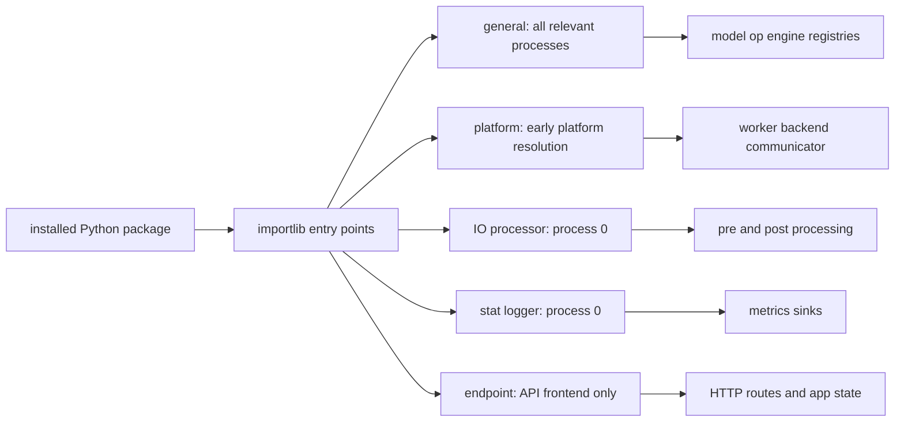

# vLLM 扩展与插件系统：加载阶段、进程覆盖与语义注册表

> **源码基线**：`vllm-project/vllm@d66300a1baa7779c68c7dfa4e51eee2502b48017`
> **中心命题**：vLLM 插件不是一个万能 hook，而是“Python 包发现机制 + 按职责分组的加载生命周期 + 子系统语义注册表”。正确性不只取决于插件函数写了什么，更取决于它在配置、模型构造和路由初始化之前被哪些进程加载；把这三个问题混在一起，最容易产生主进程可见、worker 不可见的静默分叉。
> **叙事顺序**：本页按五拍组织——背景 → 为什么这么设计（含被否掉的替代）→ 实现思路与细节 → 约束 → 发展趋势（本页无可锚定的在途改动，第 5 拍略）。
> **最近更新**：2026-08-27。按五拍重排章节顺序；机制正文与既有引用未改。

## 一、背景：为什么不能只有一个通用插件入口

扩展 vLLM 至少有五种不同的状态所有者：

- 模型、算子和 engine 行为属于每个执行进程；
- platform 决定 worker、attention backend、communicator 和配置修正，必须在平台解析早期确定；
- IO processor 只改 process 0 的输入/输出语义；
- stat logger 消费 process 0 聚合后的结构化统计；
- endpoint plugin 只拥有 API frontend 的 HTTP 路由与 app state。

如果统一成一个“启动后调用一次”的 hook，扩展要么在 worker fork/spawn 前丢失，要么把 HTTP、设备选择和模型注册都耦合进同一生命周期。vLLM 因而按 entry-point group 显式编码进程覆盖范围；常量及其注释位于 `vllm/plugins/__init__.py:16-30`。

## 二、为什么这么设计：替代方案及其代价

| 方案 | 表面优势 | 失败模式 |
|---|---|---|
| 在 API 主进程 import 一次插件 | 实现最简单 | spawn worker/inspect 子进程看不到 registry mutation |
| 所有插件在所有进程执行 | 生命周期统一 | HTTP/sink 依赖污染 worker，副作用和攻击面扩大 |
| 单一万能 hook | API 少 | 无法表达 platform early-load、route late-attach 等阶段约束 |
| 直接 monkey patch 内部类 | 可快速实验 | import order、版本升级和多进程一致性不可控 |
| endpoint 默认加载所有已安装项 | 零配置 | 安装即暴露网络路由，信任边界失守 |
| 静默选择多个 platform 中第一个 | 服务可能启动 | 环境探测顺序决定设备语义，结果不可复现 |

> [!note] 推断
> 这张表是本页依据代码行为重建的设计权衡：每一行的“为什么不适用”都能落到后文引用的 `file:line` 上，但“当初权衡过、并因此否掉了它”这层意思由本页承担——源码通常只陈述最终形态，不陈述被否掉的选项。要引用其中某一行，请回到对应小节的 locator，不要引用本表。

## 三、发现、加载和注册是三个不同阶段

标准 Python `entry_points` 只解决“已安装包声明了哪些可调用对象”。`load_plugins_by_group()` 用 group 查询 entry points，再按 `VLLM_PLUGINS` 的名称 allowlist 过滤并执行 `EntryPoint.load()`；`vllm/plugins/__init__.py:36-74`。

插件函数随后做的事情才是语义扩展。例如 general plugin 可以调用 `ModelRegistry.register_model()`，后者把架构名映射到类或延迟导入字符串；延迟字符串避免在 fork 子进程前导入模型并过早初始化 CUDA，见 `vllm/model_executor/models/registry.py:1092-1128`。

因此两类对象不能混为一谈：

| 对象 | 解决的问题 | 生命周期 |
|---|---|---|
| Python entry point | 如何发现和分发第三方代码 | 包安装、进程启动与 group load |
| vLLM registry | 某个架构、op、loader 或 backend 名称对应什么实现 | 子系统初始化和运行时派发 |

一个 general plugin 可以写多个 registry；一个 registry 也可由内置代码、配置 override 或 plugin 修改。plugin 是分发与加载边界，registry 才是执行语义边界。

## 四、进程覆盖是正确性合同

general group 被设计为在 process 0、EngineCore 和 worker 中加载，且单进程内用 `plugins_loaded` 防止重复执行；插件函数本身仍必须支持跨进程、多次调用，见 `vllm/plugins/__init__.py:77-90`。参数构造阶段会加载 general plugins；`vllm/engine/arg_utils.py:798-807`。worker 初始化在解析 worker class 前再次加载；`vllm/v1/worker/worker_base.py:241-257`。模型 inspect 子进程也显式加载；`vllm/model_executor/models/registry.py:1526-1533`。

可把一致性条件写成：

$$
\forall p \in P_R,\quad R_p(name)=implementation
$$

其中 $P_R$ 是会读取某个注册表 $R$ 的全部进程。如果 frontend 把 `MyModel` 注册成功，而模型检查或 worker 的 $R_p$ 中没有同一映射，请求会在更晚阶段以“不支持架构”、无法反序列化或实现不一致的形式失败。

这也解释了 re-entrant 要求：进程隔离使模块级 `plugins_loaded` 不能提供全局 exactly-once；插件应采用幂等注册或先检查现有项，而不应假设全系统只执行一次。项目设计文档明确要求 entry-point function 可重入；`docs/design/plugin_system.md:58-60`。

## 五、五个 group 对应五种生命周期

| group | 加载位置 | 返回/执行合同 | 设计原因 |
|---|---|---|---|
| `vllm.general_plugins` | process 0、core、worker、inspect 子进程 | 加载函数并执行 | 修改执行语义的所有读者必须看到同一注册 |
| `vllm.platform_plugins` | `current_platform` 首次解析时 | 返回 platform 类全限定名或 `None` | platform 必须先于 config 修正、worker/backend 选择确定 |
| `vllm.io_processor_plugins` | process 0 | 返回 `IOProcessor` 类全限定名 | pre/post processing 属于 frontend I/O 语义，不应进入设备进程 |
| `vllm.stat_logger_plugins` | async serving 的 process 0 | entry point 本身是 `StatLoggerBase` 子类 | 统计已在 process 0 汇聚，sink 不应污染执行热路径 |
| `vllm.endpoint_plugins` | API frontend | factory 返回 `EndpointPlugin` | HTTP 暴露面与 engine 扩展必须独立治理 |

platform resolver 会同时探测内置和 OOT factories，只允许一个 OOT platform 激活；多个命中直接报错，避免设备所有权含糊，见 `vllm/platforms/__init__.py:219-253`。IO processor 先由模型配置或显式参数选名字，再从 group 中解析并实例化对应类；缺失和名称不匹配都显式失败，见 `vllm/plugins/io_processors/__init__.py:15-29,32-88`。stat logger loader 则校验插件必须是 `StatLoggerBase` 子类；`vllm/v1/metrics/loggers.py:74-88`。

## 六、Endpoint plugin 为什么采用更严格的安全默认值

一般 `load_plugins_by_group()` 在未设置 `VLLM_PLUGINS` 时加载 group 内全部已安装插件；`vllm/plugins/__init__.py:52-70`。endpoint plugin 会直接新增网络路由，所以反过来要求显式 allowlist：环境变量未设置时即使发现插件也只告警、不加载；随后还按 `required_tasks` 与 server supported tasks 的交集过滤，见 `vllm/plugins/__init__.py:93-156`。

这不是普通兼容性差异，而是 trust boundary：已安装 Python 包中的 entry point 是会被进程执行的代码，HTTP plugin 还会扩大远程攻击面。部署应把 `VLLM_PLUGINS` 当成可审计的启动配置，而不是便利开关。

Endpoint 生命周期分两阶段：

1. `build_app()` 先注册内置 routers，再 attach plugin routes；`vllm/entrypoints/launchers/app.py:34-54`；
2. core app state 建好后调用 plugin `init_state()`；`vllm/plugins/endpoint_plugins/interface.py:91-123`。

分阶段的原因是路由构造不应依赖尚未建立的 EngineClient，而 state 初始化需要现成 client。当前插件路由最后注册，且源码明确指出它可 shadow 同路径 core route、没有冲突强制检查；`vllm/plugins/endpoint_plugins/interface.py:63-69`。这使扩展灵活，也要求部署侧主动检查 OpenAPI/route 冲突。

## 七、HTTP 扩展与 engine 扩展必须配对但不互相暗示

`EndpointPlugin` 的职责是 HTTP surface。若路由需要 worker RPC、新统计或模型行为，应另建 general plugin 安装 engine 侧能力，再由 endpoint plugin 经既有 `EngineClient` 路径调用；两者独立注册、独立加载，见 `vllm/plugins/endpoint_plugins/interface.py:3-20`。

这样分离维护了两个不变量：

- frontend plugin 不绕过 EngineClient 打开新的跨进程通道；
- engine-side mutation 在所有需要它的进程中加载，而不是只存在于 API server。

render server 没有 EngineClient，但符合 `render` task 的 endpoint 仍可 attach；它的 `init_state()` 会收到 `None`，插件必须排除任务或显式降级，见 `vllm/plugins/endpoint_plugins/interface.py:22-28,72-86`。

## 八、OOT 扩展为何仍有版本耦合

文档承诺的是已公开的注册入口可用，例如 `ModelRegistry.register_model`；具体模型、worker、attention backend 和内部模块接口仍可能随版本演进，兼容责任在插件作者，见 `docs/design/plugin_system.md:148-152`。

这是合理边界：稳定所有内部 Python 类会阻止 engine 重构。可移植插件应尽量：

- 通过公开 registry 和 Protocol/ABC 接口接入；
- 用字符串延迟导入重型模型或设备实现；
- 在包元数据中约束兼容的 vLLM 版本；
- 为每个目标 commit/发行版运行启动、模型 inspect、worker 执行和 shutdown 测试；
- 把内部 monkey patch 视为显式版本 fork，而不是稳定插件 ABI。

OOT custom op 还有自己的覆盖注册表。`CustomOp.register_oot()` 将替换类写入独立 `op_registry_oot`，并拒绝重复名称；`vllm/model_executor/custom_op.py:329-357`。它解决“替换哪个 layer 实现”，但仍需 general plugin 在正确进程、正确时间导入注册代码。

## 九、约束、实现与部署检查清单

1. 写清扩展修改的状态所有者：frontend、core、worker、platform 还是 logger；
2. 选择对应 group，不以“代码放在哪里方便”为标准；
3. 列出会读取目标 registry 的全部进程，验证每个进程都在首次读取前加载；
4. 确保 entry-point function 幂等、无未受控全局副作用；
5. 对模型和设备类使用延迟导入，检查 fork/spawn 与 CUDA 初始化；
6. endpoint 显式配置 `VLLM_PLUGINS`、任务范围、鉴权和 route collision；
7. 测试未安装、未 allowlist、重复名称、多个 platform、版本不兼容与 engine dead；
8. 固定 vLLM commit 跑一条 frontend → core → worker 的真实请求，不只做 import 测试。

最小源码阅读顺序：`vllm/plugins/__init__.py:16-156` → 目标 group loader → 目标 registry → 各进程的 load site → `docs/design/plugin_system.md:5-60,148-152`。调用顺序用于证明生命周期；设计主线始终是“谁拥有状态、哪些进程必须一致、在何时冻结选择”。

## Related Pages

- [[02_engineering/03_infer_frameworks/vllm/13_vllm_model_library_analysis|vLLM 模型与权重 ABI]] — OOT model、loader 与延迟导入的语义注册表。
- [[02_engineering/03_infer_frameworks/vllm/14_vllm_attention_backends_analysis|vLLM Attention Backend 契约]] — platform/backend extension 必须满足的 metadata 与执行合同。
- [[02_engineering/03_infer_frameworks/vllm/16_vllm_serving_control_plane_analysis|vLLM Serving 控制面]] — API frontend、EngineClient 与 worker 的进程边界。
- [[02_engineering/03_infer_frameworks/vllm/21_vllm_quantization_analysis|vLLM 量化派发设计]] — quant registry、格式和硬件能力的联合选择。
- [[02_engineering/03_infer_frameworks/vllm/24_vllm_fused_ops_and_kernels_analysis|vLLM 融合算子与专用 Kernel]] — OOT custom op 的派发、fallback 与性能验证。
- [[02_engineering/03_infer_frameworks/vllm/27_vllm_observability_reliability_analysis|vLLM 可观测性与可靠性]] — plugin load failure、版本漂移和执行故障的生产信号。
