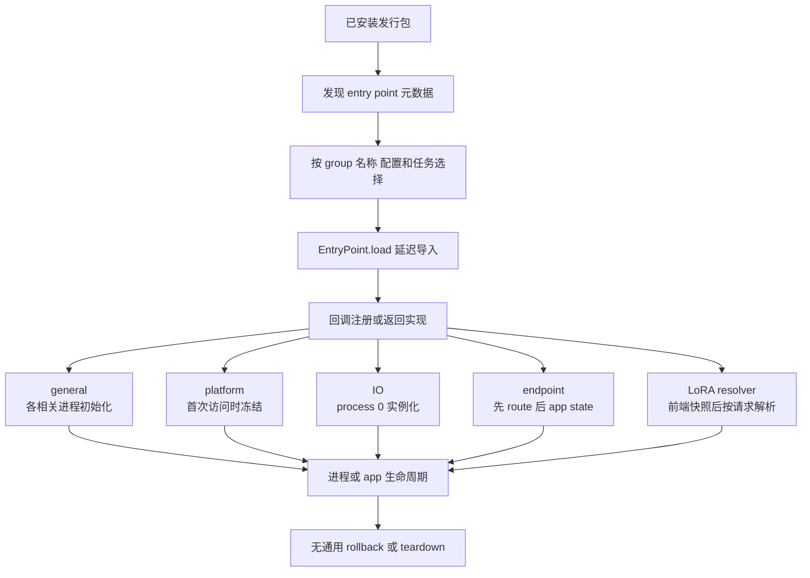

# vLLM 扩展与插件系统：把全局变更约束在显式生命周期内

> **读者问题**：第三方包怎样被发现、选择、导入并在正确进程中初始化；当插件失败或进程退出时，哪些状态会留下、哪些状态根本没有通用回滚？
>
> **中心命题**：vLLM 并没有消灭 Python 全局状态，而是把扩展拆成“元数据发现 → 配置选择 → 延迟导入/注册 → 按进程或 app 初始化”四道显式边界。正确性取决于两条不变量：所有会读取某项扩展状态的进程都必须在首次读取前得到兼容注册；插件回调必须幂等并把副作用限制在目标状态所有者内。通用 ABI 没有事务回滚或 teardown，因此越早、越隐式的全局 mutation 越危险。
>
> **本文拥有**：Python entry-point discovery、`VLLM_PLUGINS` 选择语义、general/platform/IO/endpoint/LoRA resolver 的 ABI 与加载阶段、进程可见性、幂等性、失败与清理边界。
>
> **明确排除**：内置 model registry 的模型构造与权重 ABI（见 [[02_engineering/03_infer_frameworks/vllm/13_vllm_model_library_analysis|vLLM 模型与权重 ABI]]），以及 OpenAI/Pooling 等协议的字段转换与响应实现（见 [[02_engineering/03_infer_frameworks/vllm/04_vllm_request_semantics_analysis|vLLM 请求语义]]）。
>
> **源码基线**：`vllm-project/vllm@6b110badbb22d3f66c7218b71138f13b7a6b3419`
>
> **最近更新**：2026-08-30。

## 1. 背景：安装一个包，不等于扩展已经安全生效

vLLM 要同时吸收设备平台、engine-side 注册、Pooling I/O、HTTP route 和按需 LoRA 来源等扩展；这些能力的状态所有者并不相同。general 插件需要覆盖 process 0、EngineCore 和 worker，IO 插件只在 process 0 使用，platform 在各进程首次解析 `current_platform` 时确定，而 endpoint 只属于 API frontend。源码把这些作用域直接写进 group 定义，说明“插件加载一次”不是一个全系统语义，而只能是某个地址空间或 app 的局部语义：`vllm/plugins/__init__.py:16-30`。

标准 Python entry point 只提供“哪个已安装发行包声明了哪个名字与可加载对象”的目录。vLLM 先枚举 group，再按 `VLLM_PLUGINS` 过滤，最后才调用 `EntryPoint.load()` 导入对象；导入不是 discovery 的同义词：`vllm/plugins/__init__.py:36-74`。官方设计文档也把 entry-point group、entry-point name 和 value 分成三个部分：`docs/design/plugin_system.md:9-44`。

**分析推断：为什么这胜过 import-time 自动注册。** 如果第三方包只要被 Python 间接 import 就立即改 registry、平台或 routes，那么选择发生在副作用之后：未选插件也能改变当前进程，父进程的 import 顺序还能与 spawn 出来的 worker 不同，失败后又没有统一撤销入口。先发现元数据、再选择、再导入不能让插件代码变安全，却把“哪段不受信代码何时开始执行”变成可审计的启动配置。endpoint 因为新增网络暴露面，进一步采用默认不加载的反向策略；该安全理由由 loader 与安全文档明确给出：`vllm/plugins/__init__.py:93-130`、`docs/usage/security.md:335-345`。

## 2. 为什么要分阶段：同一个 hook 无法表达所有冻结点

直观方案是提供一个 `register()`，在服务启动时统一执行。但 platform 必须在配置修正、worker class 和 backend 选择前冻结；general 注册必须在 CLI/config、EngineCore、worker 和模型 inspect 首次消费前可见；endpoint 的 route 构造发生在 EngineClient 建立前，而 route state 只能在 client 建立后初始化。把它们压成一个时刻，会迫使扩展过早触碰尚未就绪的依赖，或过晚修改已经缓存的选择。

**图 1 规格（plugin 生命周期）**：从已安装发行包开始，主路径依次画出“只读发现、配置选择、延迟导入、语义注册、局部初始化”；在初始化处按 general、platform、IO、endpoint、LoRA resolver 分支，标出各自状态所有者。终点明确写出“进程或 app 生命周期结束”，并用代价节点指出通用 ABI 没有 rollback/teardown。图只表达阶段和所有权，不展开任何子系统内部协议。

图中的关键不是 group 数量，而是**选择冻结点**：过了冻结点再改模块全局变量，不保证已经构造的对象重新读取它。

| 扩展 ABI | 选择与冻结点 | 初始化作用域与拥有状态 | 明确边界 |
|---|---|---|---|
| general | `VLLM_PLUGINS` 过滤后执行零参数回调；单进程首次调用后 guard 冻结 | process 0、EngineCore、worker、模型 inspect 子进程各自修改本地语义状态 | 回调必须可重入；group 不定义返回值、rollback 或 teardown，`vllm/plugins/__init__.py:77-90` |
| platform | 各进程首次访问 `current_platform` 时探测 factory，选中后缓存实例 | 当前进程的平台对象，随后影响 config、worker/backend 等选择 | 多个 OOT platform 同时激活直接失败；惰性解析用于避免插件继承 `Platform` 时的 import 环和过早冻结，`vllm/platforms/__init__.py:219-268`、`vllm/platforms/__init__.py:278-297` |
| IO processor | EngineArgs 名称优先于模型 `hf_config`；解析类名后构造实例 | process 0 的 Pooling I/O processor 对象 | 未请求则不加载；请求名不可用显式报错，`vllm/plugins/io_processors/__init__.py:15-29`、`vllm/plugins/io_processors/__init__.py:42-88` |
| endpoint | entry-point allowlist 与 `required_tasks` 共同选择；route attach 后、app state init 后分别冻结 | API 或 render frontend 的 FastAPI routes、`app.state` 与可选 EngineClient 引用 | 默认不加载；render 没有 EngineClient；可 shadow core route，`vllm/plugins/__init__.py:121-158`、`vllm/plugins/endpoint_plugins/interface.py:63-86` |
| LoRA resolver | 作为 general plugin 注册 resolver；`OpenAIServingModels` 构造时把 registry 复制为有序实例列表 | frontend 的 resolver 列表、per-LoRA lock 和已加载 adapter 映射 | 构造完成后的新 registry 项不会自动进入既有列表；同名注册覆盖，`pyproject.toml:46-48`、`vllm/lora/resolver.py:43-69`、`vllm/entrypoints/openai/models/serving.py:100-118` |

## 3. 实现机制：发现、注册与初始化各自改变什么状态

### 3.1 Discover 与 select：先确定候选集，再执行代码

`load_plugins_by_group()` 的状态转换是：读取当前进程可见的 entry-point metadata，得到候选；读取 `VLLM_PLUGINS`，按 **entry-point name** 缩小候选；对留下的候选执行 `EntryPoint.load()`，得到 callable 字典。环境变量未设置时普通 group 加载全部候选；设置为空字符串时解析成只含空字符串的列表，因而一个也匹配不到：`vllm/envs.py:1140-1147`、`vllm/plugins/__init__.py:40-70`。

这一步只隔离了**导入失败**：单个 `EntryPoint.load()` 抛错会被记录并从结果中省略，其他插件继续；它没有验证所有 group 的 callable 是否满足后续 ABI，也没有把多个回调包成事务：`vllm/plugins/__init__.py:62-74`。因此 selection 的不变量是“每个相关进程看见兼容的包元数据和 allowlist”，而不是“process 0 成功就代表全系统成功”。官方文档明确要求多进程 vLLM 中每个进程加载插件：`docs/design/plugin_system.md:5-7`。

endpoint 另加一个 trust gate：`VLLM_PLUGINS` 未设置时，即使发现候选也只告警并返回空列表；设置后才实例化 factory，再按 `required_tasks` 与服务能力的交集筛选：`vllm/plugins/__init__.py:93-158`。测试覆盖了未设置、空字符串、任务不匹配和 factory 抛错仍继续加载其他项：`tests/plugins_tests/test_endpoint_plugins.py:73-153`。

> [!contradiction] Allowlist 到底匹配哪个名字
> 实际 loader 在 `EntryPoint.load()` 前比较 `plugin.name`，这里的 `plugin` 是 Python entry point；endpoint 设计文档也明确说 entry-point name 与实例的 `name` 字段独立，allowlist 匹配前者：`vllm/plugins/__init__.py:62-70`、`docs/design/endpoint_plugins.md:79-108`。但 `EndpointPlugin.name` 的接口注释称该实例字段用于 `VLLM_PLUGINS` allowlisting：`vllm/plugins/endpoint_plugins/interface.py:43-60`。在本基线上应以 loader 行为为准；部署配置不要把对象字段名误当 entry-point name。

### 3.2 Import 与 register：general 的 once 只是 per-process

general loader 先把模块级 `plugins_loaded` 置为 `True`，再导入并逐个执行回调；同一进程后续调用直接返回：`vllm/plugins/__init__.py:77-90`。这提供的是 **at-most-once attempt per address space**，不是整个部署 exactly-once，也不是成功后才提交的事务。

vLLM 在多个首次消费点主动重复调用它：EngineArgs 初始化阶段在模型路径等后续解析前加载，EngineCore 构造时再次确保 scheduler/core 进程可见，worker 在解析 `worker_cls` 前加载，模型 inspect 子进程也在执行传入函数前加载：`vllm/engine/arg_utils.py:805-825`、`vllm/v1/engine/core.py:105-121`、`vllm/v1/worker/worker_base.py:253-277`、`vllm/model_executor/models/registry.py:1521-1532`。CLI 还在构造参数选项时提前加载，使插件能先扩展 quantization/device 候选：`vllm/engine/arg_utils.py:2889-2909`。

由此得到两个不变量：

1. 任何会读取插件所改状态的进程，都要在首次读取前调用 loader；process 0 的注册不会自动传播到另一个 OS 进程。
2. 回调要能在多个地址空间执行，并对同一地址空间的重复/部分执行安全。官方指南直接要求 entry-point function 可重入：`docs/design/plugin_system.md:58-60`。

这也是 eager global mutation 最危险的地方：如果插件在普通 import 中注册，vLLM 无法保证 mutation 发生在上述消费点之前；如果回调先改 A 再在 B 抛错，guard 已经冻结为 loaded，当前进程没有自动重试或撤销 A 的路径。

### 3.3 Platform 与 IO：先选择实现，再构造拥有者

platform factory 的 ABI 是“当前环境不适用则返回 `None`，适用则返回 platform class 的全限定名”，设计文档把它与 `check_and_update_config`、worker/backend 选择关联：`docs/design/plugin_system.md:46-56`、`docs/design/plugin_system.md:93-107`。运行时代码把 builtin 与 OOT factory 一起探测，拒绝两个以上 OOT 激活，再解析并缓存唯一 platform 实例：`vllm/platforms/__init__.py:229-268`。同一 factory 在探测和最终取 class name 时可能被调用两次，所以 platform factory 尤其应接近纯函数；把不可重复的全局 mutation 塞进探测函数，会把环境检测变成副作用执行器。这一设计理由是依据调用顺序的**分析推断**。

惰性 `current_platform` 不是性能微优化。源码说明 OOT platform 自身要从 `vllm.platforms` 导入基类，模块 import 时立即解析会形成循环；同时，过早读取会在插件加载前冻结错误平台，测试会报告首次初始化栈：`vllm/platforms/__init__.py:278-297`、`tests/plugins_tests/test_platform_plugins.py:10-31`。

IO processor 则先从显式 EngineArgs 或模型配置选一个名字，显式参数优先；只有确实请求了插件才发现 group、运行 factory、解析类名并用 `VllmConfig` 与 renderer 构造实例：`vllm/plugins/io_processors/__init__.py:15-29`、`vllm/plugins/io_processors/__init__.py:32-88`。实例由 Pooling frontend 的 processor 持有，并在请求路径做 parse/pre-process/post-process；不是 worker 全局能力：`vllm/entrypoints/pooling/pooling/io_processor.py:45-84`。loader 测试沿完整的 entry point → load → factory → qualname → constructor 链核验成功与缺失错误：`tests/plugins_tests/test_io_processor_plugins.py:36-69`、`tests/plugins_tests/test_io_processor_plugins.py:72-98`。

### 3.4 Endpoint：route 与 engine-dependent state 必须分两阶段

`build_app()` 先挂 core routers，再 attach endpoint plugin routes；此时 EngineClient 尚不可用。API app 的 core state 建立完毕后才调用 `init_endpoint_plugins_state()`，render app 则明确传入 `None`：`vllm/entrypoints/launchers/app.py:34-56`、`vllm/entrypoints/launchers/api_server/app_state.py:141-148`、`vllm/entrypoints/launchers/render/app_state.py:92-104`。

Phase A 把已实例化 plugin 存入 `app.state.endpoint_plugins`，Phase B 从同一 state 取出对象并调用 `init_state()`；绕过 `build_app()` 的 bare-state 路径把缺失列表当作空集：`vllm/plugins/endpoint_plugins/interface.py:91-123`。这个边界让 route 构造不依赖尚未就绪的 engine，又让 handler 通过既有 EngineClient 接缝访问 engine，而不是暗建另一条跨进程通道。endpoint 与 engine-side general entry point 独立加载，任何一方都不暗示另一方存在：`vllm/plugins/endpoint_plugins/interface.py:3-28`。

代价是 route conflict 也在插件边界内：plugin route 最后注册且可 shadow core route，当前没有强制冲突检查；安全文档要求命名空间、鉴权和部署审计：`vllm/plugins/endpoint_plugins/interface.py:63-69`、`docs/usage/security.md:341-345`。端到端测试验证正常 EngineClient 路径；render 测试则验证 `None` client 时由插件自己降级为 503：`tests/plugins_tests/test_endpoint_plugins.py:180-235`。

### 3.5 LoRA resolver：启动时注册，按请求选择，成功后才对 frontend 可见

vLLM 自带的 filesystem 与 Hugging Face resolver 也通过 `vllm.general_plugins` entry point 注册，而不是由 serving code 写死：`pyproject.toml:43-48`。注册回调读取各自配置后把 resolver 实例写入进程内 registry；filesystem 路径无效会在注册阶段抛错，远端下载 resolver 还要求自己的 entry-point name 被显式 allowlist：`vllm/plugins/lora_resolvers/filesystem_resolver.py:49-60`、`vllm/plugins/lora_resolvers/hf_hub_resolver.py:126-143`。

frontend 构造 `OpenAIServingModels` 时把 registry 当前顺序复制到 `self.lora_resolvers`。请求到来后，它以 LoRA 名称加锁，先查已加载映射，再逐个 resolver 尝试；只有 `engine_client.add_lora()` 成功才把结果提交到 `lora_requests`。找到但全部加载失败返回 400，全都找不到返回 404：`vllm/entrypoints/openai/models/serving.py:109-118`、`vllm/entrypoints/openai/models/serving.py:282-344`。因此 registry mutation 的可见性有明确截止点：在 serving 对象构造后再注册 resolver，并不会自动更新既有实例列表。

resolver registry 对同名项采用“告警并覆盖”，不是拒绝重复；测试也把后注册实例视为最终值：`vllm/lora/resolver.py:51-69`、`tests/lora/test_resolver.py:26-57`。这使注册天然可重复，但结果依赖顺序；插件作者应使用稳定唯一名称，测试应清理全局 registry，正如 serving 测试 fixture 显式删除 mock resolver：`tests/entrypoints/openai/completion/test_lora_resolvers.py:93-101`。

## 4. 约束与失败边界：没有通用事务，也没有通用 teardown

| 阶段 | 源码行为 | 对插件作者/部署者的含义 |
|---|---|---|
| entry-point import | `EntryPoint.load()` 异常被记录并跳过，其他候选继续，`vllm/plugins/__init__.py:62-74` | group 可能得到部分候选集；必须从日志核对实际加载结果 |
| general callback | guard 在回调前置位，回调异常没有捕获，`vllm/plugins/__init__.py:77-90` | 失败可留下部分 mutation，且本进程后续不会自动重试；回调应先验证、后做幂等提交 |
| platform probe | 探测异常被忽略；多个 OOT 命中则启动失败，`vllm/platforms/__init__.py:229-253` | factory 要无副作用、结果稳定；不要把“未激活”与“探测抛错”都当成可接受成功 |
| IO selection | 单个 factory 异常只告警，但请求的名字最终不可用会抛 `ValueError`，`vllm/plugins/io_processors/__init__.py:58-88` | 配置要求的 I/O 语义不能静默降级，否则请求类型会被误解释 |
| endpoint | factory 实例化异常被跳过；`attach_router` 与 `init_state` 循环本身不捕获插件异常，`vllm/plugins/__init__.py:132-158`、`vllm/plugins/endpoint_plugins/interface.py:91-123` | factory 失败可局部隔离，两个初始化 hook 失败则进入 app 启动失败边界；hook 应能清理自己已创建的资源 |
| LoRA request | 单个 resolver 找到但 engine load 失败会继续下一个；全部失败才返回错误，`vllm/entrypoints/openai/models/serving.py:293-344` | resolver 的“找到”不是提交点；只有 engine 接受并写入 frontend 映射才对请求可见 |

在这个基线上，general ABI 只有执行回调，`EndpointPlugin` 只有 `attach_router` 与 `init_state`，LoRA registry 只有 register/get；没有与之配对的统一 rollback、unregister 或 shutdown hook：`vllm/plugins/__init__.py:77-90`、`vllm/plugins/endpoint_plugins/interface.py:43-88`、`vllm/lora/resolver.py:43-88`。因此清理责任落回各状态所有者：endpoint 资源应绑定 FastAPI/app lifespan，IO 实例绑定 serving object，resolver 与 general 注册默认活到进程结束。后一句是依据 ABI 缺口的**分析推断**，不是源码承诺。

部署验收不能止于“process 0 import 成功”。至少应验证：

1. 固定同一插件包版本和 `VLLM_PLUGINS`，分别在 frontend、EngineCore、worker 与 inspect 路径触发首次消费；
2. 重复执行注册回调，确认结果幂等且不会重复启动线程、连接或后台任务；
3. 注入 import failure、callback 中途失败、重复名称、多个 platform、IO 名称缺失、endpoint task 不匹配和 render 无 EngineClient；
4. 对 endpoint 审计最终 `app.routes`、鉴权与 route prefix，对 LoRA resolver 区分“未找到”和“找到但 engine 拒绝”；
5. 在进程 shutdown 后检查插件自行持有的线程、文件、socket 与临时目录，因为通用 ABI 不会替它们收尾。

这些检查对应的核心思想是：插件系统只规定**何时允许第三方代码进入哪个状态域**，不替第三方代码提供事务性。能否避免隐式全局污染，最终取决于插件是否遵守选择冻结点、per-process 幂等和状态所有者边界。

## Related Pages

- [[02_engineering/03_infer_frameworks/vllm/13_vllm_model_library_analysis|vLLM 模型与权重 ABI]] — 承接 OOT model 注册之后的模型解析、构造和权重提交；本页不展开内置 registry。
- [[02_engineering/03_infer_frameworks/vllm/17_vllm_serving_control_plane_analysis|vLLM Serving 控制面]] — 解释 API、EngineCore 与 worker 的进程拓扑，以及插件初始化必须对齐的 ready/failure 边界。
- [[02_engineering/03_infer_frameworks/vllm/04_vllm_request_semantics_analysis|vLLM 请求语义]] — 拥有 endpoint 与 IO plugin 所接入的协议、render、input/output 转换语义。
- [[02_engineering/03_infer_frameworks/vllm/22_vllm_distributed_inference_analysis|vLLM 分布式推理]] — 给出 rank、worker 与 executor 的真实进程范围，用于审计 general plugin 的可见性。
- [[02_engineering/03_infer_frameworks/vllm/27_vllm_observability_reliability_analysis|vLLM 可观测性与可靠性]] — 承接 plugin import/init 失败、进程分叉和 endpoint 暴露面的生产信号与故障归因。
