# vLLM 在线权重更新：受暂停保护的版本可见性协议

> [!question] 读者问题
> vLLM 怎样让一组 inference workers 接收新权重，并在什么时点把新版本暴露给后续请求？`pause`、`sleep`、`start/update/finish`、cache 清理和 resume 各自保证什么；失败时又有哪些状态无法回滚？
>
> **中心命题**：本基线的在线更新是一个由调用方编排、受 scheduler pause 保护的**有序协议**，不是原子换版。pause 建立无设备工作窗口并可提前失效 cache；worker session 约束 start → 一到多次 update → finish；backend 把收到的权重原位写入稳定 kernel storage，finish 完成 deferred processing；最后 EngineCore 才单独改一个版本标签。这个顺序能避免“边 forward 边覆写”，却没有隔离的 shadow model、request-version pin、跨 worker two-phase commit 或把已写参数恢复为旧值的通用 rollback。
>
> **本文拥有**：vLLM 侧 pause/sleep 准备、weight-transfer control/data boundary、worker/model target、staging/validation/finish、weight-version 可见性、cache/runner post-work、resume 与失败边界。
>
> **明确排除**：trainer 的优化算法、rollout 编排和何时产生新 policy；TP/PP/DP/EP collective 的一般语义；Scheduler admission、单 Engine KV block 生命周期、speculative verify/accept 和跨 Engine KV lease 的内部机制。
>
> **源码基线**：`vllm-project/vllm@6b110badbb22d3f66c7218b71138f13b7a6b3419`（冻结的 detached checkout，提交时间 2026-08-29T02:40:53Z）。
>
> **最近更新**：2026-08-30。

## 1. 背景：真正的问题是可见性，不是把 bytes 搬到 GPU

在线 RL 会在 inference 请求仍可能存在时改变 policy 权重。若把“收到一个 tensor”直接等同于“新版本已提交”，一次 forward 可能跨过覆写窗口，某些 ranks 已换新而另一些仍旧，prefix/encoder cache 还可能继续复用旧权重的派生结果。官方 async-RL 文档因此把 pause/resume 定义为 weight synchronization 的 clean window，并明确 `keep` 模式会让同一请求在 pause 前后分别产生旧、新权重 token；`clear_cache=False` 还会保留 stale KV（`docs/training/async_rl.md:11-22`；`docs/training/async_rl.md:52-63`）。

**为什么不采用“一个 reload RPC 就够了”的直观方案（分析推断）。** 权重传输同时跨越 control plane、backend data plane、多个 worker、本地模型 ABI、在线量化/post-process 与 cache/runner 派生状态。把这些动作压进一个不分阶段的 RPC，会让调用方无法区分“传输已排队”“每 rank 已写入”“post-process 已结束”和“版本标签已发布”。当前设计把它拆成 pause、session、finish、version、resume；代价是原子性仍由外部编排承担。

## 2. 静态责任：四个 owner，四种不同的“完成”

| owner | 持有的状态 | 它能证明的完成 | 它不能证明的完成 | 证据 |
|---|---|---|---|---|
| `LLM` / `AsyncLLM` / trusted control route | 更新调用顺序、可选 version 参数 | 前一个公开调用返回；同步或 async facade 已收到结果 | 请求已绑定该 version、cache 一定安全 | `vllm/entrypoints/llm.py:855-907`；`vllm/v1/engine/async_llm.py:1123-1167` |
| EngineCore / Executor | scheduler pause、worker fan-out、单个 `_weight_version` 字符串 | pause 完成时设备 idle；collective RPC 成功路径收齐 worker 回复、失败路径可在首个 error 早退；version 字符串已改 | workers 具有可回滚的共同快照 | `vllm/v1/engine/core.py:827-885`；`vllm/v1/executor/multiproc_executor.py:416-442`；`vllm/v1/engine/core.py:981-986` |
| Worker | 当前 target model、`_weight_update_active`、每 rank payload 选择 | 本 worker 的 start/update/finish 顺序合法 | 其他 worker 已完成，或失败前写入已撤销 | `vllm/v1/worker/gpu_worker.py:1307-1428` |
| WeightTransferEngine / model loader | communicator、wire metadata、layerwise 或 sparse 写入、deferred work | backend-specific finish 已完成本地 post-process | EngineCore version 已发布、KV/encoder/spec state 已失效 | `vllm/distributed/weight_transfer/base.py:331-379`；`vllm/distributed/weight_transfer/base.py:461-515` |

因此至少要分开三件事：`update_weights` 返回可能只表示某个 chunk 已同步写入，deferred backend 甚至只表示工作已排队；`finish_weight_update` 才建立本 worker 的 processing-complete fence；version 则是所有 worker finish 调用返回后由 facade 单独更新的 control-plane label（`vllm/distributed/weight_transfer/base.py:357-379`；`vllm/entrypoints/llm.py:895-903`）。

## 3. Preparation：pause 是正确性门，sleep 是可选的资源门

### 3.1 pause 的三种请求策略

`AsyncLLM.pause_generation` 先按需清 frontend multimodal cache，再把 mode 与 `clear_cache` 送入 EngineCore；返回前的 20 ms sleep 只改善最终 output event 的直觉顺序，注释明确说它不承担正确性（`vllm/v1/engine/async_llm.py:791-834`）。真正的 barrier 在 core：pause 完成时先对 workers 执行 `synchronize_device`，再按需清 cache，所以调用方拿到完成信号时，旧 forward 与 cache reset 都已越过设备边界（`vllm/v1/engine/core.py:827-847`；`tests/v1/engine/test_engine_core.py:625-644`）。

| mode | in-flight request 后果 | 新请求后果 | 适合的版本边界 |
|---|---|---|---|
| `abort` | 全部请求终止并发送 abort outputs | 排队到 resume | 最清楚：旧请求不跨版本；`vllm/v1/engine/core.py:1926-1964` |
| `wait` | 继续 step 直至 drain | 暂不 admission | 完整请求各自只看旧版；只在 background EngineCore path 支持，in-process core 明确拒绝；`vllm/v1/engine/core.py:849-877`；`vllm/v1/engine/core.py:1926-1971` |
| `keep` | `PAUSED_ALL` 令 token budget 归零，请求冻结 | 排队到 resume | 请求逻辑 history 跨版本；是否重算旧 context 取决于 cache clear；`vllm/v1/core/sched/scheduler.py:501-527` |

默认 `clear_cache=True` 不只是清 prefix hash 表。core 依次 reset prefix/KV、multimodal 与 encoder caches，并要求 connector cache 同步失效（`vllm/v1/engine/core.py:807-840`）。对 running 请求，prefix reset 会强制 preempt、释放 blocks、把 computed progress 归零、清空 `spec_token_ids`，再让请求回 waiting；已有 async output 被标为 drop-stale，避免同一位置在 resume 后重复提交（`vllm/v1/core/sched/scheduler.py:1392-1433`；`vllm/v1/core/sched/scheduler.py:2591-2631`）。这条路径把旧 token history 保留为新的输入，却让其 KV、encoder feature 与 draft tail 在新权重下重建。

### 3.2 sleep 不是 weight transaction 的隐式步骤

`sleep(level=0)` 只 pause scheduling；level 1 还 offload weights 并丢弃 KV；level 2 丢弃全部 GPU allocation。core 总是先完成 pause，才把 level 1/2 交给 executor（`vllm/v1/engine/core.py:887-923`）。worker 在 suspend 前后同步设备；level 2 还把 model 与 draft buffers 克隆到 CPU，wake 时按 `weights` tag 恢复（`vllm/v1/worker/gpu_worker.py:236-291`）。

**边界**：start/update/finish API 没有自动 wake，也没有“在 sleeping allocation 上更新”的专用 guard。测试给出的深睡恢复顺序是先 wake `weights`、再 reload，最后 wake `kv_cache`（`tests/basic_correctness/test_mem.py:255-282`）。因此，sleep 可为 colocated trainer 腾显存，但它是调用方必须管理的额外 resource state。通用 `resume_scheduler` 只把 pause state 设为 `UNPAUSED`，`AsyncLLM.resume_generation` 直接调用它，并不验证 allocation residency（`vllm/v1/engine/core.py:879-882`；`vllm/v1/engine/async_llm.py:836-839`）；只有经 `wake_up` 恢复 sleep 的专属路径，才在 executor 不再 sleeping 后自动 resume（`vllm/v1/engine/core.py:925-941`）。

## 4. 在线 weight-version transaction：有序 fence，不是原子提交

**Figure Specification（图 1）**：图按从左到右的版本可见性画出三个状态域。控制面先冻结 admission/step，并在 `clear_cache` 分支把 running request 退回 waiting、失效 KV/MM/encoder/spec state；随后 executor 将 start/update/finish fan-out 到各 worker。worker/backend 区域区分 metadata validation、chunk 原位写入、deferred processing drain 与稳定 tensor storage，并把 main finish 的 LoRA reset 与 draft finish 的无 reset 分开；两条分支都可进入独立的 version 消息。version/cache/request 区域把 generic resume 的 caller-managed cache/resource precondition 与 sleep 专属 `wake_up` residency check 分开。橙色失败路径明确落到“partial writes / rank split，无通用 rollback”，而不是画成成功路径的逆操作。

```mermaid
flowchart LR
  subgraph CP["控制面"]
    A["运行中<br/>version N"] --> P["Pause<br/>abort wait keep"]
    P --> Idle["设备 idle fence"]
    Idle --> Cache{"clear cache"}
    Cache -->|是| Inv["preempt running<br/>失效 KV MM encoder spec"]
    Cache -->|否| Keep["保留旧派生状态"]
  end

  subgraph WK["Worker 与 model runner"]
    Inv --> Start["Start session<br/>选择 main 或 draft target"]
    Keep --> Start
    Start --> Update["Update chunks<br/>校验 metadata 与 rank payload"]
    Update --> Write["写入稳定参数 storage<br/>或原位 sparse patch"]
    Write --> Finish["Finish<br/>drain 与 post process"]
    Finish --> Target{"更新 target"}
    Target -->|main| Lora["reset LoRA state"]
    Target -->|draft| DraftDone["不 reset LoRA"]
  end

  subgraph VIS["版本 缓存 请求可见性"]
    Lora --> Ver["独立写 version N plus 1"]
    DraftDone --> Ver
    Ver --> Gate{"调用方确认 cache policy<br/>与运行所需资源"}
    Gate -->|通用 resume| Resume["解除 scheduler pause<br/>无内建 residency check"]
    Gate -->|曾 sleep| Wake["wake_up path<br/>检查 is_sleeping"]
    Wake -->|executor 不再 sleeping| Resume
    Resume --> New["后续 step 读取新权重"]
    Gate -->|尚未满足| Hold["保持 paused"]
  end

  Update -.-> Fail["异常<br/>session 关闭并 reset target"]
  Finish -.-> Split["某 rank 失败<br/>其他 rank 可能已完成"]
  Fail --> Partial["partial writes 无通用 rollback"]
  Split --> Partial
  Keep -.-> Stale["旧 KV 或 draft state 可继续存在"]

  classDef neutral fill:#ffffff,stroke:#64748b,color:#0f172a
  classDef acc1 fill:#dbeafe,stroke:#2563eb,color:#0f172a,stroke-width:2px
  classDef acc2 fill:#ffedd5,stroke:#ea580c,color:#0f172a,stroke-width:2px
  classDef ghost fill:#f8fafc,stroke:#94a3b8,color:#475569,stroke-dasharray:4 3
  class A,P,Idle,Cache,Inv,Keep,Start,Update,Write,Finish,Target,Lora,DraftDone,Gate,Wake,Resume,New neutral
  class Idle,Finish,Ver,Resume acc1
  class Fail,Split,Partial,Stale acc2
  class Hold ghost
```

## 5. Staging 与 validation：隔离 metadata，不隔离第二份模型

### 5.1 init 与 start 只建立通道和 session

weight-transfer engine 只有在 worker model 已加载后才创建，因为它直接持有目标 model 引用；未配置 backend 时任何 session 操作都显式失败（`vllm/v1/worker/gpu_worker.py:487-502`；`vllm/v1/worker/gpu_worker.py:1307-1326`）。`init_weight_transfer_engine` 先把 dict 解析为 backend typed dataclass，再 dispatch 到 backend init（`vllm/distributed/weight_transfer/base.py:421-470`）。具体动作并不相同：dense NCCL 记录 trainer wire params 并创建 process group（`vllm/distributed/weight_transfer/nccl_engine.py:136-151`）；IPC 不做 data-plane rendezvous，只记录 `packed` wire param（`vllm/distributed/weight_transfer/ipc_engine.py:151-160`）；sharded RDT 则配置 ring、绑定 producers、dry-run bake、构建 static call plan、预注册 buffers 并启动 processing worker（`vllm/distributed/weight_transfer/sharded_rdt_engine.py:386-423`；`vllm/distributed/weight_transfer/sharded_rdt_engine.py:561-577`）。这些都是显式 init phase，不是每个 version 的 finish/commit。

start 的 worker guard 拒绝 session 嵌套；成功后才设置 `_weight_update_active`。若 start 本身失败，worker 只恢复默认 target 并重新抛错（`vllm/v1/worker/gpu_worker.py:1347-1371`）。draft 更新另有 target：只有 backend 声明支持、runner 暴露实际 draft model 且 speculative config 存在时才可选；sparse NCCL 与 sharded RDT 明确不支持 draft target（`vllm/v1/worker/gpu_worker.py:941-972`；`vllm/distributed/weight_transfer/sparse_nccl_engine.py:112-125`；`vllm/distributed/weight_transfer/sharded_rdt_engine.py:286-295`）。

### 5.2 update 的“staging”因 backend 而异

| backend family | update 时发生什么 | finish 时补什么 | visibility / cost |
|---|---|---|---|
| dense NCCL / IPC | typed metadata 先检查 names、dtype、shape 与 handle 数；checkpoint weights 经 `model.load_weights` 逐层进入 reload pipeline | finalize deferred attention、padding 与 post-load process；IPC 另释放 importer 引用 | 每层完成后即 copy 回原 kernel storage，不存在整模型 shadow copy；`vllm/distributed/weight_transfer/nccl_engine.py:76-102`；`vllm/distributed/weight_transfer/ipc_engine.py:63-118`；`vllm/distributed/weight_transfer/nccl_engine.py:153-221` |
| sparse NCCL | 校验 patch metadata 后，通过 native loader 直接原位修改已初始化 tensor | start/finish 都是 no-op | 最早可见、最少 buffering，也最没有 rollback 隔离；`vllm/distributed/weight_transfer/sparse_nccl_engine.py:79-109`；`vllm/distributed/weight_transfer/sparse_nccl_engine.py:112-186` |
| sharded RDT | 按 baked plan 只 pull 本 worker slice；GPU post-process 可在 background thread 与下一 chunk overlap | `drain_pending` 后才 finalize layerwise reload | `update_weights` 返回可只表示 queued，finish 才是 processing fence；`vllm/distributed/weight_transfer/sharded_rdt_engine.py:254-295`；`vllm/distributed/weight_transfer/sharded_rdt_engine.py:647-704` |

普通 base engine 在 `receive_weights` 后执行 device synchronize，保证下一 step 看见写入；声明 `defers_processing` 的 backend 则必须把这份保证推迟到 `finish_weight_update`（`vllm/distributed/weight_transfer/base.py:357-379`；`vllm/distributed/weight_transfer/base.py:493-504`）。这就是为什么“bytes 已到”“post-process 已结束”必须分开。

layerwise reload 也不是先构造完整新模型再交换指针。它记录原 kernel tensors，把 live layer 临时恢复成 meta 形态，收齐一层后 materialize、load、quantize/repack，再把结果 `copy_` 回原 tensor storage，以保住 CUDA Graph 引用（`vllm/model_executor/model_loader/reload/layerwise.py:70-119`；`vllm/model_executor/model_loader/reload/layerwise.py:332-375`；`vllm/model_executor/model_loader/reload/layerwise.py:392-421`）。**分析推断**：稳定地址避免了全面 graph recapture，却也意味着完成的 layer 在 version label 发布前已经覆盖旧值；安全性依赖 pause window，而不是 staging isolation。

## 6. Finish、version commit 与 post-commit work

### 6.1 finish 是 processing fence

Worker 只有 active session 才允许 finish。backend finish 返回后，它恢复默认 update target、关闭 session；主模型更新还会 reset runner 的 LoRA state，draft session 则刻意不动 LoRA（`vllm/v1/worker/gpu_worker.py:1410-1428`；`tests/v1/worker/test_gpu_worker_weight_transfer.py:101-118`；`tests/v1/worker/test_gpu_worker_weight_transfer.py:161-170`）。这里的“commit”只表示该 worker 不再有本 session 的 deferred processing。

多 worker facade 用 `collective_rpc` fan-out。multiprocessing executor 先把命令放入 broadcast queue；成功路径依次消费全部目标 response queues，但遇到首个 non-`SUCCESS` reply 就立即抛错，不再消费剩余 queues（`vllm/v1/executor/multiproc_executor.py:375-442`）。Ray executor 则对全部 worker refs 做 `ray.get`（`vllm/v1/executor/ray_executor.py:487-512`）。因此，只有成功返回才构成 all-replies barrier；失败时只能确认命令已 fan-out，facade 可能早退，并且两条 executor path 都没有 prepare vote、commit record 或补偿动作。

### 6.2 version 是后置标签，不是数据提交协议

同步和 async facade 都先等待 worker `finish_weight_update`，然后才在可选参数存在时另发 `set_weight_version`；测试验证 update 完成后 version 仍为 `default`，带 version 的 finish 返回后才变为 `step-42`（`vllm/entrypoints/llm.py:895-907`；`vllm/v1/engine/async_llm.py:1155-1167`；`tests/entrypoints/weight_transfer/test_weight_transfer_llm.py:266-295`）。EngineCore 只保存一个 caller-supplied opaque string，并允许 `update_weight_version` 在完全不改权重时独立改写（`vllm/v1/engine/core.py:129-134`；`vllm/v1/engine/core.py:981-986`）。

因此 version 可用于 control-plane observability，却不是：

1. request 绑定的 immutable snapshot；
2. workers 验证参数内容一致的 checksum；
3. 一笔跨 workers 原子提交的 epoch；
4. 防重复、单调递增或 compare-and-swap token。

后四点是依据上述存储与调用顺序得到的**源码边界分析**。尤其是公开 API 可以单独改 label，说明 label 与实际 parameter bytes 之间没有强制不变量。

### 6.3 cache 与 runner work 并不都在 commit 之后

一个容易误判的地方是把 finish 想成“统一 invalidation hook”。实际上 weight-transfer finish 明确绕过 `GPUModelRunner.reload_weights()`，只为主 target reset LoRA state（`vllm/v1/worker/gpu_worker.py:1425-1428`）。普通 runner reload 会在末尾同时 reset LoRA、encoder 与 MM cache；这段 tail 不会被 weight-transfer 自动继承（`vllm/v1/worker/gpu_model_runner.py:5635-5673`）。prefix/KV、MM、encoder 与 connector 的一致失效因此位于 **pause preparation** 的 `clear_cache=True` 路径，不是 version commit 后。

这条安排胜过 finish 后才清 cache 的原因是**分析推断**：cache reset 需要先证明 device idle，还可能强制 preempt running requests；把它放在 pause barrier 内，可以在任何参数原位覆盖前先处理旧派生状态。但代价是调用方若跳过 pause，或显式 `clear_cache=False`，finish/version API 不会替它补救。

## 7. 可见性审计：request、KV、spec draft 与 runner

### 7.1 in-flight request

- `abort` 与 `wait` 给出最清晰的 per-request version boundary：请求要么被终止，要么在旧权重下完成，再开始更新（`vllm/v1/engine/core.py:1926-1971`）。
- `keep` 保留逻辑请求与已输出 token；resume 后同一 request 继续。因此它天然允许一个输出序列跨版本，官方文档也明确把 pause 前后标成 old/new weights（`docs/training/async_rl.md:52-63`）。
- 没有 request-level version 字段参与 Scheduler admission；EngineCore 的 version 只是独立查询字符串。由此可知（**分析推断**），调用方若需要 rollout 只来自单一 policy version，应使用 abort/wait 或在更上层分段，而不能仅依赖 `get_weight_version()`。

### 7.2 KV、prefix、multimodal 与 encoder cache

`keep + clear_cache=True` 会把 running request 退回 waiting、computed progress 归零并重算 context；async regression test要求 reset 时丢弃在途 stale positions，随后 resume 不得重复或乱序（`tests/v1/core/test_async_scheduler.py:617-680`）。`clear_cache=False` 则保留 KV；文档明确承认 context 中可能仍反映旧权重（`docs/training/async_rl.md:57-63`）。此外 encoder cache 注释直接要求权重更新时失效旧 vision embeddings，且 core 同时清逻辑 manager 与物理 runner cache（`vllm/v1/engine/core.py:807-825`）。

这证明 cache safety 不是由 version label 推导出来的。若调用方更新了会影响 text KV、multimodal encoder 或 connector state 的参数，唯一源码提供的统一路径是 pause 时 `clear_cache=True`；局部更新是否允许保留某类 cache，本基线没有按 parameter dependency 自动判定，属于 **unknown / caller policy**。

### 7.3 speculative draft

target model 与 draft model 是两个独立 update targets；`start_draft_weight_update` 只是把当前 session retarget 到真实 draft model，结束后恢复 default target（`vllm/v1/worker/gpu_worker.py:954-972`；`vllm/v1/worker/gpu_worker.py:1339-1371`）。更新 target 不会自动更新 draft，反之亦然。

当 `clear_cache=True` 强制 preempt 时，Scheduler 明确清空 request 的 `spec_token_ids`（`vllm/v1/core/sched/scheduler.py:1392-1426`）。若 `keep + clear_cache=False`，pause 只令 token budget 为零，没有对应的 draft-state invalidation；旧 proposal 是否在 resume 后被新 target 验证、概率型 proposer 还持有哪些旧分布辅助状态，本页所查 online-update tests 没有端到端 oracle。保守结论是 **unknown**：源码证明了 clear 路径会丢弃 draft tail，却没有证明 retain 路径对所有 proposer 和 draft-weight update 都安全。

### 7.4 model runner、CUDA Graph 与 LoRA

layerwise reload 把处理后的值 copy 回原 storage，目的就是保留 kernel/CUDA Graph references（`vllm/model_executor/model_loader/reload/layerwise.py:370-421`）；所以一般不存在“每次 weight version 都必然 recapture graph”的源码依据。主模型 finish 显式 reset LoRA state，draft finish 不做这一步；源码没有进一步解释这项差异的设计理由（`vllm/v1/worker/gpu_worker.py:1425-1428`）。除此之外，weight-transfer tail 没有调用 runner 的 encoder/MM reset；它依赖 pause cache path。

## 8. Failure / rollback：session cleanup 不等于参数回滚

Worker 的 update 异常会把 `_weight_update_active` 置为 false、恢复默认 target 并重新抛错；测试只断言 session 已关闭、下一次 start 可重新开始（`vllm/v1/worker/gpu_worker.py:1389-1408`；`tests/v1/worker/test_gpu_worker_weight_transfer.py:192-202`）。代码没有保存整模型旧 snapshot，也没有把先前 chunk、已经完成的 layer 或 sparse patch 写回旧值。start 失败同样只 reset target；finish 失败甚至发生在 worker 清 active flag 之前（`vllm/v1/worker/gpu_worker.py:1363-1371`；`vllm/v1/worker/gpu_worker.py:1410-1428`）。

**跨 worker 失败边界（分析推断）**：命令在等待回复前已经 fan-out；各 worker 随后各自执行原位 mutation。multiprocessing facade 可在消费到首个失败 reply 时早退，剩余 reply 未被消费不等于对应 worker 未执行；如果 rank A finish 成功而 rank B 抛错，facade 不会继续写 version，但 rank A 的新参数不会自动撤销（`vllm/v1/executor/multiproc_executor.py:416-442`）。这里没有 two-phase commit。最安全的恢复不是盲目 resume，而是保持 pause，重建所有 ranks 的一致状态——例如重新推送一份完整已知版本，必要时重启 Engine——然后清理派生 cache，再由外部 coordinator 重新发布 version。源码没有提供通用 `rollback_weight_update`，所以具体恢复方案属于部署 policy，而非 vLLM 保证。

最后还有三条操作不变量：

1. **先 pause idle，再改原位 storage**；否则稳定地址只防 graph 失效，不防 concurrent forward 读到混合层。
2. **每 rank 必须走同一 session 次序和匹配 payload**；list payload 由 `DP rank × local world size + worker rank` 选择本地项（`vllm/v1/worker/gpu_worker.py:1394-1404`）。并行组与 collective 顺序的内部机制由分布式推理 owner 解释。
3. **finish 成功后才发布 version；resume 前由调用方建立 cache/resource precondition**。代码保证 facade 内 finish 先于 version，但 generic resume 不检查 residency；只有走 sleep 的 `wake_up` path 才以 `is_sleeping` guard 自动 resume，cache 与 wake 的整体排序仍由调用方负责（`vllm/v1/engine/core.py:879-882`；`vllm/v1/engine/core.py:925-941`）。

## Related Pages

- [[02_engineering/03_infer_frameworks/vllm/10_vllm_engine_architecture_analysis|vLLM Engine 架构]] —— 解释 utility call、EngineCore 与 Executor/Worker 的进程和 failure boundary；本页只使用该接缝承载更新控制消息。
- [[02_engineering/03_infer_frameworks/vllm/12_vllm_kv_cache_management_analysis|vLLM KV Cache 管理]] —— 拥有本页只审计的 block、prefix、refcount、preempt 与 reset 内部机制。
- [[02_engineering/03_infer_frameworks/vllm/13_vllm_model_library_analysis|vLLM 模型与权重 ABI]] —— 展开 `model.load_weights`、并行参数映射与 LoRA attachment；本页拥有其在线替换事务。
- [[02_engineering/03_infer_frameworks/vllm/16_vllm_model_runner_v2_analysis|vLLM Model Runner V2]] —— 解释 persistent request rows、device state 与 graph 生命周期，帮助判断 pause/reset 对 runner 镜像的影响。
- [[02_engineering/03_infer_frameworks/vllm/20_vllm_speculative_decoding_analysis|vLLM 投机解码]] —— 拥有 draft propose/verify/accept 与 device/CPU rollback；本页只审计换权重时 draft state 是否被失效。
- [[02_engineering/03_infer_frameworks/vllm/22_vllm_distributed_inference_analysis|vLLM 分布式推理]] —— 拥有 rank/group/collective 顺序；本页只说明 weight-update control fan-out 和 rank-local payload 边界。
- [[02_engineering/03_infer_frameworks/vllm/27_vllm_observability_reliability_analysis|vLLM 可观测性与可靠性]] —— 承接 version label、partial-rank failure、pause latency 与 recovery 的生产观测和故障归因。
