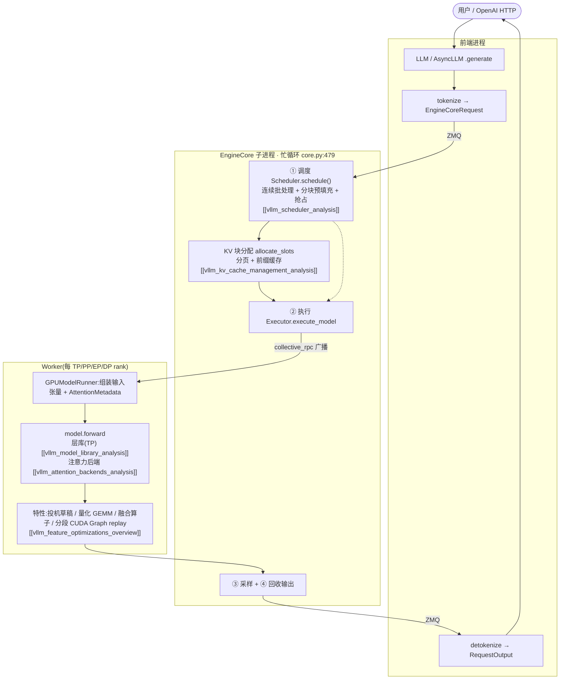

# vLLM 推理引擎 — 知识地图

> **代码基准**:vLLM `main` @ `485bbe1c6`(2026-06-21)· **V1 引擎**(V0 独立引擎已移除)
> **最后更新**:2026-06-22(新建:12 篇源码级分析 + 本索引)
> 一套 12 篇 vLLM V1 推理引擎源码级分析,按用户视角的 **调度 → 模型库 → 特性优化** 三支柱组织,每篇以 **Overview → Quick Start → Deep Dive** 三个维度由浅入深展开。所有非平凡论断均带 `file.py:line` 出处(基准 `485bbe1c6`)。范式对标训练框架 [[torchtitan/index]] / [[megatron-lm/index]]:从"系统怎么搭、机制怎么实现、性能怎么压"逐层拆解。

---

## 设计哲学:四个正交的吞吐支点

vLLM 不是"一个快 kernel",而是**四件正交武器叠加**。一句话纲领:

> **把「调度 / 输出处理」与「模型执行」拆成两个进程(ZMQ 相连),中间是一个永不停歇的忙循环;显存用 OS 式分页管理 KV;批次在 token 粒度连续重组;前向计算用算子融合 + 分段 CUDA Graph 录制下发。**

| 支点 | 解决的瓶颈 | 核心机制 | 主页 |
|------|-----------|---------|------|
| **解耦双进程 + 忙循环** | Python GIL 下 CPU 开销阻塞 GPU | EngineCore 子进程跑 `schedule→execute→sample→update`,前后端 ZMQ + IO 线程重叠 | [[vllm_engine_architecture_analysis]] |
| **连续批处理** | 静态批处理的尾部气泡 | token 级动态组 batch,prefill/decode 混批,分块预填充 | [[vllm_scheduler_analysis]] |
| **分页 KV(PagedAttention)** | KV cache 显存碎片 | OS 式分页块 + BlockPool + 前缀缓存复用 | [[vllm_kv_cache_management_analysis]] |
| **算子融合 + 分段 CUDA Graph** | decode 阶段 CPU 下发瓶颈、小算子开销 | CustomOp 多实现 + torch.compile 融合 Pass + 注意力切出、其余录图 replay | [[vllm_fused_ops_and_kernels_analysis]] · [[vllm_ir_and_fusion_passes_analysis]] · [[vllm_compilation_cudagraph_analysis]] |

这四点贯穿全部 12 篇:调度支柱讲前两点的"机制",模型库支柱讲第三点的"计算侧",特性优化支柱把第四点与投机/量化/并行/融合一起展开。

---

## 三支柱与文档系列(12 篇)

### 支柱一 · 调度(Scheduling)—— 请求怎么进、怎么排、怎么落地

| 页面 | 维度重心 | 核心机制 |
|------|---------|---------|
| [[vllm_engine_architecture_analysis]] | **脊梁篇** | 双进程流水线、`EngineCore.step()`(`core.py:479`)四段忙循环、ZMQ IPC、Executor→Worker→ModelRunner 扇出、请求端到端生命周期 |
| [[vllm_scheduler_analysis]] | 调度算法 | 连续批处理(token 级)、`schedule()`(`scheduler.py:388`)先 running 后 waiting、token 预算"追赶"模型、分块预填充、抢占/重算、优先级、**prefill/decode 统一 vs PD 分离**(§3.12) |
| [[vllm_kv_cache_management_analysis]] | 显存内存侧 | 分页块、`BlockPool` 引用计数与 LRU 驱逐、`allocate_slots`(`kv_cache_manager.py:244`)、块哈希前缀缓存、混合 KV(full/SWA/mamba)、显存 profiling 定块数 |

### 支柱二 · 模型库(Model Library)—— 模型怎么定义、加载、算注意力

| 页面 | 维度重心 | 核心机制 |
|------|---------|---------|
| [[vllm_model_library_analysis]] | 主页 | 模型定义约定(`*ForCausalLM`)、懒注册表(`registry.py`)、权重惰性流式加载与 `packed_modules_mapping` 合并、TP 感知层库(Column/Row/QKV)、如何新增模型 |
| [[vllm_attention_backends_analysis]] | 注意力深挖 | `Attention` 层"写 KV + 调后端"两步走(`layers/attention/attention.py:192`)、`AttentionMetadata` 桥、PagedAttention 间接寻址、统一变长注意力、FA/FlashInfer/Triton/MLA 后端 |

### 支柱三 · 特性优化(Feature Optimization)—— 把吞吐再压一截

| 页面 | 维度重心 | 核心机制 |
|------|---------|---------|
| [[vllm_feature_optimizations_overview]] | **全景导航** | 特性总表(问题→flag→代码→深挖页)+ 按瓶颈选优化;深挖无独立页的特性:结构化输出、LoRA、分离式 KV 连接器、KV 卸载 |
| [[vllm_speculative_decoding_analysis]] | 投机解码 | draft+verify、提议器家族(n-gram/EAGLE/Medusa/MTP/draft model)、拒绝采样无偏性、与调度的 lookahead/回退配合 |
| [[vllm_quantization_analysis]] | 量化 | `QuantizationConfig`+`QuantizeMethodBase` 插件框架、FP8/AWQ/GPTQ/compressed-tensors/FP4、加载期 Marlin repack、KV cache 量化 |
| [[vllm_distributed_inference_analysis]] | 分布式 | 5 维 rank 张量切 TP/PP/EP/DP、`GroupCoordinator` 通信门面、PP `batch_queue` 虚拟流水线、MoE 的 DP-attention+EP+EPLB |
| [[vllm_compilation_cudagraph_analysis]] | 编译&图捕获 | `@support_torch_compile`→`VllmBackend`(Inductor)、**分段 CUDA Graph**(注意力切出)、`cudagraph_mode` 五态、运行时按形状 dispatch replay |
| [[vllm_fused_ops_and_kernels_analysis]] | 算子融合 | **CustomOp** 多实现派发(native/cuda/triton + 开关)、**torch.compile 融合 Pass**(RMS+quant / SiluMul+quant / AllReduce+RMSNorm / attention+quant)、**fused_moe** grouped GEMM 与 Triton autotune config |
| [[vllm_ir_and_fusion_passes_analysis]] | 图改写机制(深挖伴篇) | **vllm_ir IR 层**(torch.library 自建命名空间 / CompositeExplicitAutograd 不分解 / 为何不挂 aten)、`PostGradPassManager` Pass 流水线、挂进 Inductor `post_grad_custom_post_pass` 生效、**RMSNorm+quant 融合全程走查**(模型代码→eager 双 kernel→融合 kernel) |

---

## 架构全景图:一条请求穿过三支柱

调度(蓝色 ①)决定"这一步算谁、算多少 token";模型库(WK 内 model)决定"怎么把这些 token 算成 logits";特性优化(feats)在每个环节榨吞吐。三支柱在忙循环里每步咬合一次。

---

## 关键设计速览

**连续批处理 vs 静态批处理**(详见 [[vllm_scheduler_analysis]]):V1 把 prefill 与 decode 统一成"让 `num_computed_tokens` 追赶 `num_tokens_with_spec`"的单一过程,每步产出 `{req_id: num_tokens}` 字典——分块预填充只是 `num_new_tokens = min(剩余 prompt, token 预算)` 的自然结果,无独立代码路径。单实例混批 vs 集群级 PD 分离的对照见 [[vllm_scheduler_analysis]] §3.12。

**分页 KV 的三层所有权**(详见 [[vllm_kv_cache_management_analysis]]):`BlockPool` 是物理块唯一所有者(手写双向链表 O(1) 摘除)→ 前缀缓存靠"块内容+父块哈希"链做命中复用,`ref_cnt` 是共享安全的唯一闸门 → `allocate_slots` 是调度器唯一分配入口,需求超供给即返回 `None` 让该请求本步不调度。

**算子融合的三件事**(详见 [[vllm_fused_ops_and_kernels_analysis]] / 机制深挖 [[vllm_ir_and_fusion_passes_analysis]]):`CustomOp`/`vllm_ir` 给一个算子稳定的可匹配节点(`CompositeExplicitAutograd` 不分解)→ `PostGradPassManager` 把一组 pattern-match 融合 pass 挂进 Inductor `post_grad_custom_post_pass`,把相邻 op 塌成单个手写融合 kernel → `fused_moe` 用 grouped GEMM 避免逐专家小 GEMM,块大小由 autotune config 决定。

**分段 CUDA Graph 的招牌取舍**(详见 [[vllm_compilation_cudagraph_analysis]]):注意力因变长 + 动态 `block_table` + 每步重建 metadata 无法录入静态图,故按 `splitting_ops` 切出走 varlen kernel,其余静态算子录入 CUDA Graph;默认 `FULL_AND_PIECEWISE` 让均匀 decode 批走全图、prefill/mixed 走分段。

**四维并行的统一编码**(详见 [[vllm_distributed_inference_analysis]]):一个 5 维 rank 张量 `[ExternalDP,DP,PP,PCP,TP]` 经 transpose+reshape 一次切出 TP/PP/DP/EP 各组,全部收敛到 `GroupCoordinator`;MoE 走 "DP-attention + EP(=DP×TP)" 形态,各 DP rank 靠 dummy-batch 严格 lockstep。

---

## 阅读路径建议(按 Overview → Quick Start → Deep Dive)

- **想先建立全局观**:[[vllm_engine_architecture_analysis]] 的 §一 Overview → 各页 §一,横向扫一遍三支柱的"定位"。
- **想动手起服务**:各页 §二 Quick Start 的 flag 速查,先看 [[vllm_feature_optimizations_overview]] §二的"推荐起步配置"。
- **想读懂源码**:从脊梁篇 [[vllm_engine_architecture_analysis]] §三 的 `EngineCore.step()`(`core.py:479`)入,再按忙循环每段跳到 [[vllm_scheduler_analysis]] / [[vllm_kv_cache_management_analysis]] / [[vllm_attention_backends_analysis]] 的 §三 Deep Dive。
- **想读懂"为什么快"**:[[vllm_fused_ops_and_kernels_analysis]] + [[vllm_ir_and_fusion_passes_analysis]] + [[vllm_compilation_cudagraph_analysis]] 一起看(算子怎么拼大、图怎么改写、下发怎么录图)。

---

## Cross-Domain Links

- [[megatron_inference_engine_analysis]] —— Megatron-LM **内置**推理引擎(连续批处理 / 块级 paged KV / 分块预填充)对照:训练框架自带推理 vs 专用推理引擎
- [[mooncake_analysis]] —— Mooncake 分离式推理(P/D 分离、中心化 KV Cache),与 vLLM 的 KV 连接器 / 分离式 prefill 互为实现与架构对照
- [[megatron_tp_analysis]] · [[megatron_ep_analysis]] · [[megatron_cp_analysis]] —— 训练侧 TP/EP/CP 源码级分析,与 [[vllm_distributed_inference_analysis]] 的推理侧并行对照
- [[megatron_fusion_operators_analysis]] · [[torchtitan_compute_memory_optimizations_analysis]] —— 训练侧融合算子目录,与 [[vllm_fused_ops_and_kernels_analysis]] / [[vllm_ir_and_fusion_passes_analysis]] 的推理侧融合对照
- [[PyTorch_CUDA_Graphs_Complete_Guide]] · [[torch_compile_architecture]] · [[02_compile_stack/04_inductor/index]] · [[02_compile_stack/01_dynamo/index]] —— [[vllm_compilation_cudagraph_analysis]] / [[vllm_ir_and_fusion_passes_analysis]] 依赖的底层编译/图捕获/Pattern-Match 栈
- [[deepseek_v3_analysis]] —— MLA / MTP 模型侧原理,被 [[vllm_attention_backends_analysis]](MLA 后端)与 [[vllm_speculative_decoding_analysis]](MTP)实现
- [[low_precision_training_analysis]] · [[transformer_engine_analysis]] · [[deepseek_v4_fp4_qat_analysis]] —— FP8/FP4 低精度原理,对照 [[vllm_quantization_analysis]] 的推理量化
- [[gpu_kernel_guide]] —— FlashAttention / Tensor Core / Triton kernel 链路,支撑 [[vllm_attention_backends_analysis]] 与 [[vllm_fused_ops_and_kernels_analysis]]
- [[pin_memory_and_memory_semantics_analysis]] —— KV Cache 内存语义(本库已含 vLLM KV 段),关联 [[vllm_kv_cache_management_analysis]]

## Related Pages

- 调度:[[vllm_engine_architecture_analysis]] · [[vllm_scheduler_analysis]] · [[vllm_kv_cache_management_analysis]]
- 模型库:[[vllm_model_library_analysis]] · [[vllm_attention_backends_analysis]]
- 特性优化:[[vllm_feature_optimizations_overview]] · [[vllm_speculative_decoding_analysis]] · [[vllm_quantization_analysis]] · [[vllm_distributed_inference_analysis]] · [[vllm_compilation_cudagraph_analysis]] · [[vllm_fused_ops_and_kernels_analysis]] · [[vllm_ir_and_fusion_passes_analysis]]
- [[../index]] —— 推理框架目录索引 · [[mooncake_analysis]] —— 姊妹页(分离式服务)
