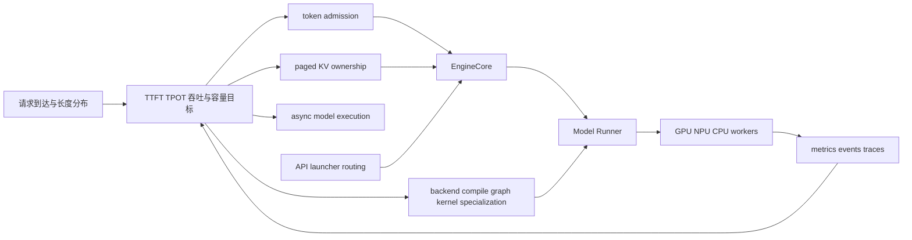

# vLLM 推理引擎：从约束到实现的知识地图

> **基线迁移状态**：Wave 1 中，[[02_engineering/03_infer_frameworks/vllm/03_vllm_architecture_overview_analysis|vLLM 架构概览]] 已按 `vllm-project/vllm@6b110bad` 核验；其余页面保留各自既有基线，待后续获批 wave 完成后再收敛。本域当前是混合基线迁移，不宣称已全域重定基线。
> **覆盖范围**：19 篇内容页 + 本索引
> **叙事顺序**：内容页统一按五拍组织——背景 → 为什么这么设计（含被否掉的替代）→ 实现思路与细节 → 约束 → 发展趋势（可选，须锚定源码自陈的在途改动并标注为推断）。例外一篇：[[02_vllm_system_design_principles_analysis]] 是「问题 → 约束 → 支点」的推导体，第 2 拍本身就是它的第二、三节。
> **阅读原则**：先理解瓶颈、状态所有权和不变量，再沿最小调用链验证实现。

vLLM 不是“一个更快的 Transformer forward”。它是一套在线资源操作系统：Scheduler 按 token 分配本轮算力，KV 管理器分配长期显存，Model Runner 把动态请求变成可复用的设备输入，attention/quantization/compile/kernel 子系统协商当前 batch 能走的最快路径，serving 与分布式层再把这些对象扩展到多进程和多设备。

## 一、先建立总模型

完整约束模型见 [[02_engineering/03_infer_frameworks/vllm/02_vllm_system_design_principles_analysis|vLLM 系统设计原则与性能模型]]。如果只沿 `API → EngineCore → Scheduler → Worker` 阅读，会看到执行顺序，却看不到三个更重要的问题：谁拥有可变状态、每一步必须维护什么不变量、为什么不能采用更直接的实现。

## 二、按设计问题选择页面

### 2.1 入口与统一心智模型

| 页面 | 先回答的问题 | 再验证的实现 |
|---|---|---|
| [[02_engineering/03_infer_frameworks/vllm/01_vllm_feature_optimizations_guide|vLLM 快速使用与优化指南]] | 怎样可靠跑通、测量并根据瓶颈选配置？ | CLI、OpenAI server、离线 `LLM`、benchmark 与调优开关 |
| [[02_engineering/03_infer_frameworks/vllm/02_vllm_system_design_principles_analysis|vLLM 系统设计原则与性能模型]] | 动态请求为什么需要连续调度、分页 KV、异步执行和专用化？ | 四个系统平面及其关键接口 |
| [[02_engineering/03_infer_frameworks/vllm/03_vllm_architecture_overview_analysis|vLLM 架构概览]] | 静态责任层、状态边界与一条代表性在线请求如何共同定义系统？ | 先建立全系统边界与层间合同，再沿一次请求生命周期验证状态移交 |

### 2.2 核心引擎

| 页面 | 唯一设计命题 |
|---|---|
| [[02_engineering/03_infer_frameworks/vllm/10_vllm_engine_architecture_analysis|vLLM 引擎架构与请求生命周期]] | 为什么前端语义、EngineCore 控制和设备执行必须分层？ |
| [[02_engineering/03_infer_frameworks/vllm/11_vllm_scheduler_analysis|vLLM Scheduler 设计分析]] | token-level admission 如何统一 continuous batching、chunked prefill、decode 与抢占？ |
| [[02_engineering/03_infer_frameworks/vllm/12_vllm_kv_cache_management_analysis|vLLM KV Cache 管理设计]] | 如何把不可预测的序列增长变成可共享、可驱逐且正确的物理块所有权？ |
| [[02_engineering/03_infer_frameworks/vllm/13_vllm_model_library_analysis|vLLM 模型与权重 ABI]] | 为什么兼容 Hugging Face 仍需要 vLLM 自己的模型、权重和并行层契约？ |
| [[02_engineering/03_infer_frameworks/vllm/14_vllm_attention_backends_analysis|vLLM Attention Backend 契约]] | 为什么 attention 必须通过 metadata/layout/capture 能力合同与调度器解耦？ |
| [[02_engineering/03_infer_frameworks/vllm/15_vllm_model_runner_v2_analysis|vLLM Model Runner V2 设计]] | async-first runner 如何消除逐 token CPU 重建与 CPU/GPU 数据竞争？ |
| [[02_engineering/03_infer_frameworks/vllm/16_vllm_serving_control_plane_analysis|vLLM Serving 控制面]] | launcher、API server、AsyncLLM、DP supervisor 和 EngineCore 如何共同管理生命周期与背压？ |

### 2.3 专项优化与生产能力

| 页面 | 唯一设计命题 |
|---|---|
| [[02_engineering/03_infer_frameworks/vllm/20_vllm_speculative_decoding_analysis|vLLM 投机解码]] | 何时值得用 draft 额外计算换 target 串行步数？ |
| [[02_engineering/03_infer_frameworks/vllm/21_vllm_quantization_analysis|vLLM 量化派发设计]] | 量化为何是格式、加载、scale、kernel 与硬件能力的联合决策？ |
| [[02_engineering/03_infer_frameworks/vllm/22_vllm_distributed_inference_analysis|vLLM 分布式推理]] | TP、PP、DP、EP、CP 与 DBO 如何映射到 rank 所有权和 collective 顺序？ |
| [[02_engineering/03_infer_frameworks/vllm/23_vllm_compilation_cudagraph_analysis|vLLM 编译与 CUDA Graph]] | 动态请求系统如何提取可编译、可捕获、地址稳定的执行区域？ |
| [[02_engineering/03_infer_frameworks/vllm/24_vllm_fused_ops_and_kernels_analysis|vLLM 融合算子与专用 Kernel]] | 何时用融合减少 launch/访存成本，何时必须回退？ |
| [[02_engineering/03_infer_frameworks/vllm/25_vllm_ir_and_fusion_passes_analysis|vLLM IR 与融合 Pass]] | 如何在 eager 与 compile 之间保留稳定算子语义并安全改写图？ |
| [[02_engineering/03_infer_frameworks/vllm/26_vllm_disaggregated_kv_serving_analysis|vLLM 分离式 KV Serving]] | 跨实例 KV 的 producer/consumer/lease 如何把 prefill、decode 与存储解耦？ |
| [[02_engineering/03_infer_frameworks/vllm/27_vllm_observability_reliability_analysis|vLLM 可观测性与可靠性]] | metrics、events、trace 与进程故障域如何形成运行反馈闭环？ |
| [[02_engineering/03_infer_frameworks/vllm/28_vllm_extension_plugin_system_analysis|vLLM 插件与扩展边界]] | plugin discovery、进程覆盖与两阶段生命周期如何扩展核心而不隐式污染状态？ |

## 三、按症状阅读

| 症状或目标 | 第一阅读页 | 接着验证 |
|---|---|---|
| TTFT 高、长 prompt 阻塞 decode | `11` Scheduler | `12` KV、`16` serving、`26` 分离式 KV |
| TPOT 高、小 batch GPU 吃不满 | `15` MRV2 | `20` 投机、`23` graph、`24` kernel |
| 吞吐低、CPU 成为瓶颈 | `02` 性能模型 | `10` engine、`15` MRV2、`23` compile |
| 显存不足或容量抖动 | `12` KV | `21` 量化、`22` 并行、`26` offload |
| 某模型/后端组合不工作 | `13` 模型 ABI | `14` attention、`21` quant、`28` plugins |
| 多 GPU 空转或 collective hang | `22` 分布式 | `10` process ownership、`27` fault domain |
| 线上偶发延迟或难以定位 | `27` observability | `16` serving、`11` scheduler metrics |

## 四、三条推荐阅读路径

1. **系统设计路径**：`02 → 10 → 11 → 12 → 15 → 23`。先获得资源与状态模型，再看关键路径优化。
2. **部署调优路径**：`01 → 16 → 27`，根据观测到的瓶颈跳转 `11/12/20/21/22/23`。
3. **源码贡献路径**：`10 →` 目标机制页 `→ 25 → 28`。先确认状态所有权，再判断改动属于核心、pass 还是 extension point。

## 五、证据口径

- 每页固定到页头声明的 commit；正文中的 `file:line` 均以仓库根为起点。Wave 1 的架构概览为 `6b110bad`，其余页面仍保留既有基线。
- 当前行为由源码和测试决定；同 commit 的 `docs/design/` 用于说明项目公开的设计意图。
- 若设计文档与实现冲突，页面分别写清两者。例如 `docs/design/arch_overview.md:67-93` 给出 V1 进程概念图，但实际 worker 是否独立成进程仍由 executor backend 决定。
- “这意味着”“可以理解为”“由此推断”表示知识库作者的机制分析，不冒充代码注释。

## 六、版本与迁移边界

本域正处于 Wave 1 混合基线迁移：[[02_engineering/03_infer_frameworks/vllm/03_vllm_architecture_overview_analysis|vLLM 架构概览]] 固定到 2026-08-29 的 `6b110bad`，其余页面仍以页头既有基线为准。后续 wave 须在 exemplar 获用户接受后才推进其余页面；在此之前，不能把本域读成同一时刻的全域重定基线。MRV2、endpoint plugins、NIXL/EPD、hybrid KV 和 launcher 仍在快速演进；部署具体版本时应重新核验配置默认值和支持矩阵。

## Related Pages

- [[02_engineering/03_infer_frameworks/index|推理框架目录]] — vLLM 在整体推理框架技术栈中的位置。
- [[02_engineering/03_infer_frameworks/01_llm_inference_technology_stack_analysis|大模型推理技术栈全景]] — 与 SGLang、TensorRT-LLM、llama.cpp 等方案比较。
- [[02_engineering/03_infer_frameworks/sglang/index|SGLang 推理框架]] — 对照调度、radix cache 与编译路径。
- [[02_engineering/03_infer_frameworks/speculative_decoding/index|投机推理专题]] — 深入 draft/verify 算法族。
- [[02_engineering/03_infer_frameworks/mooncake_analysis|Mooncake 分离式推理]] — 对照独立分布式 KV 数据平面。
