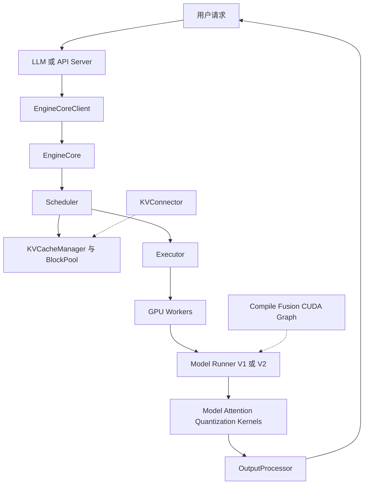

# vLLM 推理引擎 —— 知识地图

> **当前架构基准**：vLLM `main@f4b161d7fca438bfe29509984759be1943a5aa88`（2026-08-18，`v0.27.2rc0-189-gf4b161d7fc`）
> **覆盖范围**：12 篇源码分析 + 本索引；架构和使用入口已更新到当前基准，其他专题保留各页顶部声明的固定基线。
> **一句话定位**：vLLM 是把请求连续调度、分页 KV、模型并行执行、图编译/专用 kernel 和 OpenAI-compatible serving 组合起来的通用推理引擎，不只是 PagedAttention 实现。

---

## 一、先看全局结论

vLLM 当前设计可以概括为五个相互咬合的支点：

1. **前端与 EngineCore 解耦**：tokenization、HTTP、detokenization 与后端 token step 分开；在线走异步多进程，离线当前也默认同步多进程，但可切 in-process。
2. **token 粒度连续调度**：Scheduler 每一步重新决定每个请求计算多少 token，prefill/decode 共享统一预算，chunked prefill 是预算截断的自然结果。
3. **paged KV 所有权系统**：BlockPool 统一拥有物理块，KVCacheManager 完成 prefix hit、slot 分配、引用计数、驱逐与多 KV group 协调。
4. **Executor → Worker → Model Runner**：EngineCore 只发统一 `SchedulerOutput`，具体 TP/PP/DP/EP、设备通信、runner 与 kernel 由执行层派发。
5. **CPU/GPU 与控制/数据重叠**：batch queue、Model Runner V2、IO threads、compile/fusion/CUDA Graph 一起削减逐 token CPU 和 launch 开销。



## 二、在线、离线与多 GPU 拓扑

| 场景 | EngineCore client | 典型进程关系 | 证据入口 |
|---|---|---|---|
| 离线 `LLM` | 默认 `SyncMPClient` | 前端 + EngineCore；单设备 worker 可折叠在 EngineCore | `vllm/v1/engine/llm_engine.py:161-186`、`vllm/envs.py:1391-1394` |
| 离线显式关 MP | `InprocClient` | 前端直接持有 EngineCore，无 busy-loop IPC | `vllm/v1/engine/core_client.py:78-112,306-322` |
| 在线 `vllm serve` | `AsyncMPClient` | API server + 每 DP rank 一个 EngineCore + 分布式 worker | `vllm/v1/engine/async_llm.py:72-156` |
| 在线 DP | DP async client | API servers、DP EngineCores、可选 coordinator、workers | `vllm/v1/engine/core_client.py:114-139` |

官方在线逻辑进程公式是 $A+\mathrm{DP}+N$，$\mathrm{DP}>1$ 时再加 coordinator，其中 $N=\mathrm{DP}\times\mathrm{PP}\times\mathrm{TP}$；`docs/design/arch_overview.md:117-139`。但单卡 `UniProcExecutor` 会把 worker 实现在 EngineCore 进程内，所以实际 OS 进程数还要结合 executor backend。

## 三、页面导航

### 3.1 当前入口与架构

| 页面 | 回答的问题 | 基准 |
|---|---|---|
| [[02_engineering/03_infer_frameworks/01_llm_inference_technology_stack_analysis|大模型推理技术栈全景]] | 推理栈有哪些层，vLLM/SGLang/TensorRT-LLM/llama.cpp 如何选 | 2026-08-18 生态快照 |
| [[02_engineering/03_infer_frameworks/vllm/01_vllm_feature_optimizations_guide|vLLM 快速使用与优化指南]] | 怎样安装、起服务、理解默认优化并按 TTFT/TPOT/吞吐/显存调优 | `f4b161d7fc` |
| [[02_engineering/03_infer_frameworks/vllm/10_vllm_engine_architecture_analysis|vLLM 引擎架构与请求生命周期]] | 离线/在线如何汇入 EngineCore，一步怎样走到 Worker/Runner | `f4b161d7fc` |

### 3.2 调度与内存

| 页面 | 核心机制 | 页面固定基准 |
|---|---|---|
| [[02_engineering/03_infer_frameworks/vllm/11_vllm_scheduler_analysis|vLLM Scheduler 源码分析]] | continuous batching、统一 token budget、chunked prefill、preemption | `485bbe1c6` |
| [[02_engineering/03_infer_frameworks/vllm/12_vllm_kv_cache_management_analysis|vLLM KV Cache 管理]] | BlockPool、Paged KV、prefix cache、hybrid KV | `485bbe1c6` |

### 3.3 模型与注意力

| 页面 | 核心机制 | 页面固定基准 |
|---|---|---|
| [[02_engineering/03_infer_frameworks/vllm/13_vllm_model_library_analysis|vLLM 模型库]] | 模型注册、层库、权重加载、TP-aware modules | `485bbe1c6` |
| [[02_engineering/03_infer_frameworks/vllm/14_vllm_attention_backends_analysis|vLLM 注意力后端]] | Attention 层、metadata、PagedAttention、FA/FlashInfer/Triton/MLA | `485bbe1c6` |

### 3.4 高级优化与分布式

| 页面 | 核心机制 | 页面固定基准 |
|---|---|---|
| [[02_engineering/03_infer_frameworks/vllm/20_vllm_speculative_decoding_analysis|vLLM 投机解码]] | draft/verify、n-gram、EAGLE、Medusa、MTP | `485bbe1c6` |
| [[02_engineering/03_infer_frameworks/vllm/21_vllm_quantization_analysis|vLLM 量化]] | FP8、AWQ、GPTQ、compressed tensors、KV quant | `485bbe1c6` |
| [[02_engineering/03_infer_frameworks/vllm/22_vllm_distributed_inference_analysis|vLLM 分布式推理]] | TP/PP/DP/EP、GroupCoordinator、MoE lockstep | `485bbe1c6` |
| [[02_engineering/03_infer_frameworks/vllm/23_vllm_compilation_cudagraph_analysis|vLLM 编译与 CUDA Graph]] | `VLLM_COMPILE`、Inductor、piecewise/full graph | `485bbe1c6` |
| [[02_engineering/03_infer_frameworks/vllm/24_vllm_fused_ops_and_kernels_analysis|vLLM 融合算子与内核]] | CustomOp、Triton、fused MoE、融合 pass | `485bbe1c6` |
| [[02_engineering/03_infer_frameworks/vllm/25_vllm_ir_and_fusion_passes_analysis|vLLM IR 与融合 Pass]] | `vllm_ir`、post-grad pass、pattern matching | `485bbe1c6` |

> [!warning] 混合基线的阅读方式
> 当前入口页与架构页已重验到 `f4b161d7fc`。其余专题仍固定在 `485bbe1c6`，机制脉络仍有价值，但类名、默认值、选择条件和行号不能直接当作 2026-08-18 主分支事实。使用具体 flag 或排查当前代码时，优先以本索引、快速指南和目标版本源码为准。

## 四、最快跑通

```bash
uv venv --python 3.12 --seed
source .venv/bin/activate
uv pip install vllm --torch-backend=auto
vllm serve Qwen/Qwen2.5-1.5B-Instruct
```

```bash
curl http://localhost:8000/v1/chat/completions \
  -H 'Content-Type: application/json' \
  -d '{"model":"Qwen/Qwen2.5-1.5B-Instruct","messages":[{"role":"user","content":"你好"}]}'
```

离线入口：

```python
from vllm import LLM, SamplingParams

llm = LLM(model="Qwen/Qwen2.5-1.5B-Instruct")
outputs = llm.chat(
    [[{"role": "user", "content": "解释 PagedAttention"}]],
    SamplingParams(max_tokens=128),
)
print(outputs[0].outputs[0].text)
```

完整注意事项见 [[02_engineering/03_infer_frameworks/vllm/01_vllm_feature_optimizations_guide|vLLM 快速使用与优化指南]]，尤其是 chat template、`generation_config.json`、optimization level 与 benchmark 复现。

## 五、按目标阅读

- **先理解架构**：从 [[02_engineering/03_infer_frameworks/vllm/10_vllm_engine_architecture_analysis|引擎架构]] 的 `EngineCore.step` 开始，再进入 Scheduler 和 KV。
- **先部署服务**：读 [[02_engineering/03_infer_frameworks/vllm/01_vllm_feature_optimizations_guide|快速使用与优化指南]]，用默认 `-O2 + balanced` 建基线。
- **解决 TTFT**：读 Scheduler、KV cache 和 [[02_engineering/03_infer_frameworks/mooncake_analysis|Mooncake 分离式推理]]。
- **解决 TPOT**：读 speculative decoding、attention backend、compilation/CUDA Graph 和 fused kernels。
- **解决容量**：读 quantization、KV cache、distributed inference 与 KV connector。
- **理解新执行路径**：架构页的 Model Runner V2 章节说明为什么 V2 不是所有模型统一启用。

## 六、当前版本最容易误判的四件事

1. **不是所有离线调用都 in-process**：当前环境变量默认开启 V1 multiprocessing。
2. **不是所有 GPU worker 都必然是额外 OS 进程**：单设备 `UniProcExecutor` 会折叠执行对象。
3. **Model Runner V2 不是全覆盖**：选择还受模型架构、Triton 和功能兼容性限制。
4. **“默认开启”不等于“必然命中或受益”**：prefix cache、chunked prefill、async scheduling 都有工作负载或兼容性边界。

## Related Pages

- [[02_engineering/03_infer_frameworks/index|推理框架目录索引]]
- [[02_engineering/03_infer_frameworks/01_llm_inference_technology_stack_analysis|大模型推理技术栈全景]]
- [[02_engineering/03_infer_frameworks/sglang/index|SGLang 推理框架]]
- [[02_engineering/03_infer_frameworks/speculative_decoding/index|投机推理专题]]
- [[02_engineering/03_infer_frameworks/mooncake_analysis|Mooncake 分离式推理]]
