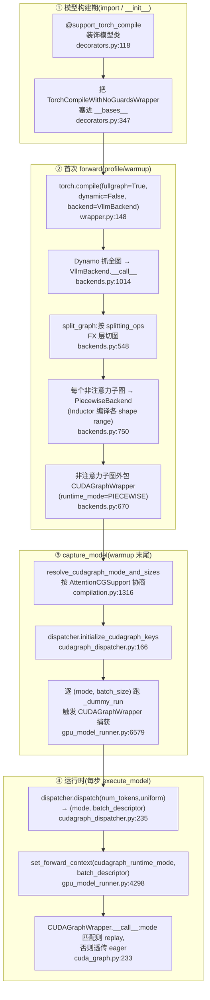

# vLLM 编译与 CUDA Graph —— torch.compile 集成与分段 CUDA Graph

> **代码基准**:vLLM `main` @ `485bbe1c6`(2026-06-21)· V1 引擎
> **最后更新**:2026-06-22 · **系列**:vLLM 推理引擎源码级分析(见 [[vllm/index]])
> **分析维度**:Overview → Quick Start → Deep Dive
>
> 本页回答:vLLM 为什么要把模型 `torch.compile` 一遍、再把整段前向录成 CUDA Graph;`@support_torch_compile` → `VllmBackend` → 分段切图 → 捕获 → 运行时分发这条链路怎么搭;以及 vLLM 的招牌设计——**分段 CUDA Graph(piecewise)**:为什么注意力必须被切出静态图、其余算子如何录进图里 replay。注意力本身"为什么录不进静态图"的后端级证据(`AttentionCGSupport`、varlen/分页 block_table)归 [[vllm_attention_backends_analysis]];本页只讲**编译 + 图捕获**框架,把注意力当作"切点"来看待。

---

## 一、Overview(总览)

### 1.1 为什么要编译 + CUDA Graph:CPU 下发瓶颈

LLM 推理的 decode 阶段,每步只算 1 个 token,GPU 上的算子又小又多(几百个 kernel),**真正的瓶颈不在 GPU 算力,而在 CPU 把这几百个 kernel 一个个 launch 出去的开销**。Python 解释、PyTorch dispatcher、CUDA launch 三层叠加,单步 decode 的 CPU 下发可达数毫秒,远超 kernel 本身的执行时间——GPU 在"等下发"。

vLLM 用两件正交的武器对付它:

| 武器 | 解决什么 | 机制 |
|------|----------|------|
| **torch.compile**(Inductor) | 算子数量太多、未融合 | Dynamo 抓全图 → Inductor 生成融合后的 Triton kernel,减少 kernel 数 + 去掉 Python 层 |
| **CUDA Graph** | 即便 kernel 少,逐个 launch 仍有 CPU 开销 | 把"一整段下发序列"录制(capture)成一张图,之后用一次 `replay()` 把整段重放,CPU 几乎零参与 |

两者关系是**正交但协同**(`config/compilation.py:616`):CUDA Graph 逻辑独立于编译逻辑,但**分段 CUDA Graph 依赖分段编译**(必须 `mode=VLLM_COMPILE` 且 `splitting_ops` 非空),而全图 CUDA Graph(FULL)可在有/无编译时都使用。

### 1.2 主流程:装饰器 → 后端 → 分段 → 捕获 → 分发



### 1.3 cudagraph_mode 五态一览

`CUDAGraphMode`(`config/compilation.py:53`)有 5 个取值,其中 `NONE/PIECEWISE/FULL` 同时是运行时分发的"具体模式":

| 模式 | 含义 | 注意力是否进图 | 典型场景 |
|------|------|----------------|----------|
| `NONE` | 不捕获 | — | `enforce_eager`、调试、不兼容场景 |
| `PIECEWISE` | 仅分段图:把注意力等切出图外走 eager,其余分段录图 | 否 | 任意后端都能用的安全默认(`-O1`) |
| `FULL` | 全图:整段前向(含注意力)录一张图 | 是 | 小模型/小 prompt;要求后端 `AttentionCGSupport.ALWAYS` |
| `FULL_DECODE_ONLY` | 仅 decode 批走 FULL,prefill/mixed 走 eager | decode 进图 | P/D 分离里的 decode 实例,省显存 |
| `FULL_AND_PIECEWISE` | **decode 批走 FULL,prefill/mixed 批走 PIECEWISE** | decode 进图 | **V1 默认(`-O2`),综合最快** |

`FULL_DECODE_ONLY`/`FULL_AND_PIECEWISE` 是"复合模式"(`value` 是元组,`separate_routine()==True`,`:89`),`decode_mode()`/`mixed_mode()` 分别取元组两端(`:65-69`)——这就是"decode 一套图、mixed 一套图"的来源。

---

## 二、Quick Start(快速上手)

### 2.1 命令行开关

| 开关 | 作用 | 落到哪 |
|------|------|--------|
| `-O0 / -O1 / -O2 / -O3` | 优化级别(`-O` 是 `--optimization-level` 的简写,`argparse_utils.py:322`) | `OptimizationLevel`,默认 **O2**(`vllm.py:364`) |
| `--enforce-eager` | 关掉编译 + CUDA Graph | `mode=NONE`、`cudagraph_mode=NONE`(`vllm.py:1061,1287`) |
| `-cc '{...}'` / `--compilation-config` | 细粒度配置(JSON) | `CompilationConfig`(`arg_utils.py:1518`) |
| `-cc.cudagraph_mode=FULL` | 单独指定图模式(支持点号路径) | `cudagraph_mode` |
| `-cc.mode=none` | 单独指定编译模式 | `mode` |
| `-cc.splitting_ops='[]'` | 清空切点(配合 FULL 全图) | `splitting_ops` |

各 `-O` 级别的默认编译/图模式(`vllm.py:196-279`):

| 级别 | `mode` | `cudagraph_mode` | 说明 |
|------|--------|------------------|------|
| `-O0` | `NONE` | `NONE` | 纯 eager,秒级启动(`vllm.py:1138`) |
| `-O1` | `VLLM_COMPILE` | `PIECEWISE` | Dynamo+Inductor + 分段图 |
| `-O2`(默认) | `VLLM_COMPILE` | `FULL_AND_PIECEWISE` | 全套优化 |
| `-O3` | `VLLM_COMPILE` | `FULL_AND_PIECEWISE` | 当前同 `-O2` |

> 注:`mode`/`cudagraph_mode` 若用户没显式给(默认 `None`),在 `VllmConfig.__post_init__` 里按 `optimization_level` 填默认(`vllm.py:1135-1139` 填 `mode`,`_apply_optimization_level_defaults` 填 `cudagraph_mode`,`vllm.py:1162`)。

### 2.2 关键入口(带行号)

| 想看什么 | 入口 |
|----------|------|
| 装饰器如何接管模型 | `compilation/decorators.py:118` `support_torch_compile` |
| 真正触发 `torch.compile` | `compilation/wrapper.py:148` `TorchCompileWithNoGuardsWrapper.__init__` |
| vLLM 自定义后端总入口 | `compilation/backends.py:1014` `VllmBackend.__call__` |
| FX 层分段切图 | `compilation/backends.py:548` `split_graph` |
| 单段编译 + 缓存 | `compilation/piecewise_backend.py:86` `PiecewiseBackend` |
| CUDA Graph 捕获/replay | `compilation/cuda_graph.py:233` `CUDAGraphWrapper.__call__` |
| 模式协商(看注意力支持) | `config/compilation.py:1316` `resolve_cudagraph_mode_and_sizes` |
| 运行时选图 | `v1/cudagraph_dispatcher.py:235` `CudagraphDispatcher.dispatch` |
| warmup 期批量捕获 | `v1/worker/gpu_model_runner.py:6579` `capture_model` |

---

## 三、Deep Dive(源码级深挖)

### 3.1 两套正交枚举:CompilationMode × CUDAGraphMode

vLLM 把"用哪种编译"和"用哪种图捕获"拆成两个独立枚举,这是理解全局的前提。

`CompilationMode`(`config/compilation.py:37`):

```
NONE = 0                  # 纯 eager
STOCK_TORCH_COMPILE = 1   # 原生 torch.compile 全权接管(model.compile)
DYNAMO_TRACE_ONCE = 2     # 只 Dynamo trace 一次、去 guard
VLLM_COMPILE = 3          # vLLM 自定义 Inductor 后端:缓存 + 分段 + shape 特化 + 自定义 pass
```

`CUDAGraphMode`(`:53`)见 §1.3。两者的耦合点只有一条铁律(`cudagraph_dispatcher.py:49-61` 的断言、`vllm.py:1408-1416` 的校验):

> **分段 CUDA Graph(`PIECEWISE` / `FULL_AND_PIECEWISE` 的 piecewise 部分)必须 `mode==VLLM_COMPILE` 且 `splitting_ops` 含注意力**(或启用 Inductor graph partition、或 breakable cudagraph)。

原因:分段图的"段边界"就是 Dynamo FX 图被 `splitting_ops` 切开的位置,没有 vLLM 编译就没有这些段。而 FULL 全图不依赖分段,只要后端支持把注意力录进图即可(§3.6)。

### 3.2 `@support_torch_compile`:装饰器如何接管 forward

模型类(如 `LlamaModel`,`model_executor/models/llama.py:337`)被这样装饰:

```python
@support_torch_compile(
    dynamic_arg_dims={"input_ids": {0: "b"}, "positions": {0: "b"}, ...})
class LlamaModel(nn.Module, EagleModelMixin): ...
```

`dynamic_arg_dims` 标注哪些输入张量的哪一维是动态的(batch/token 维),供 Dynamo 标记动态 shape。`support_torch_compile`(`decorators.py:118`)做三件事:

1. **推断动态维**(`:201-245`):若没给 `dynamic_arg_dims`,从 `forward` 的类型注解里把所有 `torch.Tensor`/`IntermediateTensors` 参数的第 0 维当动态维。
2. **改继承链**(`_support_torch_compile`,`:331`):把 `TorchCompileWithNoGuardsWrapper` 注入 `cls.__bases__`(`:347`),并替换 `__init__`/`__call__`。
3. **判定是否真编译**(`:390-396`):

```python
self.do_not_compile = (
    self.compilation_config.mode in [CompilationMode.NONE, CompilationMode.STOCK_TORCH_COMPILE]
    or _should_ignore_torch_compile(self.__class__)
    or not enable_compile)
```

`NONE`/`STOCK_TORCH_COMPILE` 都不走 vLLM 自定义路径(前者纯 eager,后者由 model runner 直接 `model.compile`,见 `gpu_model_runner.py:5277`)。

运行时,被替换的 `__call__`(`decorators.py:502`)在**首次调用**时:
- 调 `_mark_dynamic_inputs`(`:585`)对输入张量打 `mark_dynamic`/`mark_unbacked`(`:417-446`);
- 收集 Dynamo 内联过的所有源文件(`:610-615` 劫持 `InliningInstructionTranslator.inline_call_`),用于编译缓存的失效判断;
- 进入 `TorchCompileWithNoGuardsWrapper.__call__`(`:678`)触发实际编译;此后 `self.compiled=True`,后续调用直接走已编译路径(`:576-581`)。

`TorchCompileWithNoGuardsWrapper.__init__`(`wrapper.py:148`)是真正调 `torch.compile` 的地方:

```python
self._compiled_callable = torch.compile(
    self.forward, fullgraph=True, dynamic=False,
    backend=backend, options=options)   # backend = VllmBackend 实例
```

关键点:
- **`fullgraph=True`**:要求整段 forward 编成一张图,有 graph break 就报错——vLLM 的模型代码是按"可全图 trace"写的。
- **`dynamic=False` + 手动 `mark_dynamic`**:vLLM 自己控制哪维动态,不让 Dynamo 自动推断。
- **去掉所有 guard**(`wrapper.py:120-125`):非 `STOCK_TORCH_COMPILE` 模式下用 `skip_all_guards_unsafe` 把 guard 全删。因为 vLLM 保证输入结构稳定,删 guard 后**永不重编译**,省掉 guard 检查开销(类名 `WithNoGuards` 由此而来)。

> 与原生 `torch.compile` 的关系:vLLM 并没有另造一套编译器,它仍然调标准 `torch.compile`,只是把 `backend` 换成自己的 `VllmBackend`,从而在 Dynamo 抓到 FX 图之后接管"图怎么切、怎么编、怎么包 CUDA Graph"。Dynamo / Inductor 栈本身见 [[02_compile_stack/01_dynamo/index]] / [[02_compile_stack/04_inductor/index]]。

### 3.3 VllmBackend:从 Dynamo FX 全图到分段

`VllmBackend.__call__(graph, example_inputs)`(`backends.py:1014`)在 Dynamo 把 forward 转成单张 FX `GraphModule` 后被调用,核心步骤:

1. **算缓存 key**(`:1024-1066`):综合环境因子、`VllmConfig.compute_hash()`、被 trace 的源码内容 hash、编译器 hash,定位 `~/.cache/vllm/torch_compile_cache/<hash>/rank_i_j/<prefix>/`(§3.8)。
2. **装 post-grad pass**(`configure_post_pass`,`:929`):把 vLLM 的融合 pass(RMSNorm+quant、SiluMul+quant、注意力+quant 等,**详见 [[vllm_fused_ops_and_kernels_analysis]]**)挂进 Inductor 的 `post_grad_custom_post_pass`。
3. **切图**(`:1165-1171`):

```python
if self.compilation_config.use_inductor_graph_partition:
    fx_split_ops = []                                  # 交给 Inductor 切(§3.9)
else:
    fx_split_ops = self.compilation_config.splitting_ops or []
self.split_gm, self.piecewise_graphs = split_graph(graph, fx_split_ops)
```

4. **逐段编译**(`PiecewiseCompileInterpreter`,`:1214`):对每个**非切点**子图建一个 `PiecewiseBackend` 并(若需要)外包 CUDA Graph wrapper。
5. **缝合**(`generate_execution_code`,`:1271`):生成一段 `call` 代码,把所有子图按原顺序串起来,返回可序列化的 `VllmSerializableFunction`(`:1287`/`:1320`)。

### 3.4 分段切图(piecewise)核心:为什么注意力要切出去

这是 vLLM 的招牌设计,务必看透。

**切点是谁**:默认的 `splitting_ops` 就是注意力/状态空间类算子(`config/compilation.py:745` `_attention_ops`):

```python
_attention_ops = [
    "vllm::unified_attention_with_output",
    "vllm::unified_mla_attention_with_output",
    "vllm::mamba_mixer2", "vllm::mamba_mixer", "vllm::short_conv",
    "vllm::linear_attention", ... ]
```

当 `splitting_ops is None` 时,`set_splitting_ops_for_v1`(`:1097`)把它填成 `_attention_ops` 的拷贝(`:1119`),再追加 `unified_kv_cache_update` 等(`:1137`)。

**怎么切**:`split_graph`(`backends.py:548`)遍历 FX 节点,`should_split`(`partition_rules.py:14`)判断节点 target 的限定名是否在 `splitting_ops` 里;命中就把 `subgraph_id` 自增,使该算子单独成段(`:573-584`)。结果是交替的子图序列:`[非注意力段0] → [注意力段1] → [非注意力段2] → [注意力段3] → …`。`SplitItem.is_splitting_graph`(`:407`)标记哪些段是"切点段(含注意力)"。

**关键:只有非切点段被编译 + 录图**。`VllmBackend.__call__` 里(`:1194-1198`):

```python
submod_names_to_compile = [
    item.submod_name for item in self.piecewise_graphs
    if not item.is_splitting_graph]      # ← 注意力段被排除!
```

注意力段保持为普通 FX 子模块,**运行时走 eager**;其余段各自变成 `PiecewiseBackend` 并被 `CUDAGraphWrapper` 包住(§3.5)。

**为什么注意力录不进静态 CUDA Graph**(本页框架视角,后端证据见 [[vllm_attention_backends_analysis]]):

1. **变长(varlen)**:prefill 时每个请求的 query 长度不同,batch 内 token 总数随请求而变;注意力 kernel 的循环边界 / launch 配置依赖运行时 `seq_lens`、`query_start_loc`,无法在录制时定死。
2. **动态 block_table**:PagedAttention 的 KV 分页存储,每步新 token 写进新物理块,`block_table` 指向的块号每步都变;CUDA Graph 录制会把指针/形状固定,而注意力 kernel 必须读运行时 block_table。
3. **每步重建的 metadata**:`slot_mapping`、`seq_lens` 等每步重算,FULL 图要求这些 buffer 地址固定且 kernel 对形状不敏感——只有少数后端(如 FA3,`AttentionCGSupport.ALWAYS`)能满足。

而**非注意力段**(QKV/O 投影、RMSNorm、MLP、MoE、AllReduce 等)对固定 batch size 而言计算图完全静态,天然适合录图。于是 vLLM 的取舍是:**把变长/动态的注意力留在图外走 varlen kernel,把静态的大头算子录进 CUDA Graph**——既拿到 CUDA Graph 消除 CPU 下发的收益,又不被注意力的动态性卡住。

> 代价:每段图之间有"出图/入图"的衔接,段越多衔接开销越大。`CUDAGraphOptions`(`cuda_graph.py:138`)用 `gc_disable`(非首段禁 gc,`:286-301`)和 `weak_ref_output`(仅末段弱引用输出释放显存,`:325-336`)把多段捕获的开销压下来。

### 3.5 PiecewiseBackend:按 shape range 编译 + CUDAGraphWrapper 捕获/replay

**编译侧**:`PiecewiseCompileInterpreter.call_module`(`backends.py:725`)对每个待编译子图建 `PiecewiseBackend`(`:750`),并调 `wrap_with_cudagraph_if_needed`(`:761`/`:628`)把它包进平台的静态图 wrapper(GPU 上是 `CUDAGraphWrapper`),**固定 `runtime_mode=CUDAGraphMode.PIECEWISE`**(`:673`)。

`PiecewiseBackend.__init__`(`piecewise_backend.py:86`)不止编一个 shape:它按 `compile_ranges`(`:137`)和 `compile_sizes` 给**多个 shape 区间**各编一份(`compile_all_ranges`,`:245`)。单一具体 size 用 `create_concrete_args` 造定形输入(`:259`),区间用符号 shape(`get_fake_args_from_graph`,`:264`)。运行时 `__call__`(`:358`)按实际 `runtime_shape` 找到对应区间的已编译可调用并执行(`_find_range_for_shape`,`:343`)。

> 编译 size 与捕获 size 为何分开?`compilation.py:416-424` 解释:Inductor 编一份"通用 shape"图就能服务多个 size(够用即可,只对少数小 batch 单独特化);而 CUDA Graph **一个图只能服务一个 size**,所以要为每个 capture size 各录一张(§3.7)。

**捕获/replay 侧**:`CUDAGraphWrapper.__call__`(`cuda_graph.py:233`)是"盲信分发"的执行体:

```python
forward_context = get_forward_context()
batch_descriptor       = forward_context.batch_descriptor
cudagraph_runtime_mode = forward_context.cudagraph_runtime_mode

if cudagraph_runtime_mode == NONE or cudagraph_runtime_mode != self.runtime_mode:
    return self.runnable(*args, **kwargs)        # 模式不匹配 → 直接 eager(:244-254)

entry = self.concrete_cudagraph_entries[batch_descriptor]
if entry.cudagraph is None:                       # 首次见此 key → 捕获(:265)
    with torch.cuda.graph(cudagraph, pool=self.graph_pool, stream=current_stream()):
        output = self.runnable(*args, **kwargs)   # 录制(:313-319)
    entry.cudagraph = cudagraph
    ...
else:
    entry.cudagraph.replay()                       # 命中 → 一次重放(:360)
    return entry.output
```

要点:
- **按 `batch_descriptor` 建 entry**(`:257-263`):同一个 wrapper 为不同 batch size 各存一张图。
- **模式不匹配就透传**(`:244-254`):这让多层 wrapper 嵌套时能"各认各的模式"——`PIECEWISE` 段在 FULL 运行时会透传(不嵌套捕获),让外层 FULL wrapper 录整段(§3.6)。
- **不拷贝输入**(类注释 `:161-167`):wrapper 不持久化输入 buffer,假定上层(model runner)始终复用同一组输入 buffer;`VLLM_LOGGING_LEVEL=DEBUG` 时会校验 replay 时输入地址与录制时一致(`:346-355`)。需要拷贝时由 `cudagraph_copy_inputs`(`config:633`)走 `make_copy_and_call`(`backends.py:59`)。

### 3.6 cudagraph_mode 协商:看注意力后端的 AttentionCGSupport

用户给的 `cudagraph_mode` 不一定能用——得看**所有注意力后端能不能把注意力录进图**。每个后端的 builder 声明一个支持级别 `AttentionCGSupport`(`v1/attention/backend.py:548`,详见 [[vllm_attention_backends_analysis]]):

```
ALWAYS = 3                       # 任意批(含 mixed prefill-decode)都能进图
UNIFORM_BATCH = 2                # 仅 query_len 一致的批(spec-decode 的 1+k)
UNIFORM_SINGLE_TOKEN_DECODE = 1  # 仅 query_len==1 的纯 decode
NEVER = 0                        # 完全不支持
```

启动时 `_check_and_update_cudagraph_mode`(`gpu_model_runner.py:6872`)取所有后端的**最小**支持级别(`:6884-6898`),传给 `resolve_cudagraph_mode_and_sizes`(`config/compilation.py:1316`)做自动降级:

| 请求模式 | 后端支持 | 协商结果(`:1334-1419`) |
|----------|----------|--------------------------|
| `FULL`(mixed 也要全图) | 非 `ALWAYS` | 若 splitting 含注意力→`FULL_AND_PIECEWISE`,否则→`FULL_DECODE_ONLY`(`:1352-1357`) |
| decode 想 FULL | `NEVER` | 注意力已分段→`PIECEWISE`,否则→`NONE`(`:1370-1384`) |
| spec-decode + decode FULL | < `UNIFORM_BATCH` | 含注意力切点→`PIECEWISE`,否则→`NONE`(`:1389-1405`) |
| 仍要 FULL | `NEVER` | 直接报错,提示改 `PIECEWISE`(`:1409-1419`) |

这解释了为何 `FULL_AND_PIECEWISE` 是稳妥默认:**decode 批均匀(`uniform`,query_len 固定)→ 多数后端能把注意力录进 FULL 图;prefill/mixed 批变长 → 退回 PIECEWISE 把注意力留在图外**。两条路线在一次部署里并存。

模型整体的 FULL 包装在加载期完成(`gpu_model_runner.py:5300`):若 `cudagraph_mode.has_full_cudagraphs()`,把整个 `self.model` 再包一层 `CUDAGraphWrapper(runtime_mode=FULL)`。于是 GPU 上可能有两层 wrapper:外层 FULL(整模型)、内层若干 PIECEWISE(各段);运行时靠 §3.5 的"模式匹配才动手"避免重复捕获。

### 3.7 捕获(warmup)与运行时分发

**捕获键的初始化**:`CudagraphDispatcher.initialize_cudagraph_keys`(`cudagraph_dispatcher.py:166`)按协商后的 mode 生成所有要捕获的 `BatchDescriptor`:
- mixed 部分(`:189-203`):对每个 `cudagraph_capture_sizes` 建键;PIECEWISE 时把 `num_reqs/uniform` 放宽成 `None/False`(`:201-202`),即"一张 piecewise 图服务任意请求数"。
- decode-FULL 部分(`:207-231`):仅对 `≤ max_num_seqs*query_len` 的 size 建 `uniform=True` 的 FULL 键。

**批量捕获**:`capture_model`(`gpu_model_runner.py:6579`)在 warmup 末尾,从 `get_capture_descs()`(`cudagraph_dispatcher.py:326`,PIECEWISE 在前 FULL 在后、size 从大到小)拿到捕获清单,逐 `(mode, batch_descs)` 调 `_capture_cudagraphs`(`:6681`)→ `_warmup_and_capture`(`:6646`):先跑 `cudagraph_num_of_warmups` 次 eager 预热,再用 `is_graph_capturing=True` 的 `_dummy_run` 触发 `CUDAGraphWrapper` 实际录制。**大 size 先录**以便小 size 复用同一显存池(`:6595-6596`)。捕获期间 `set_cudagraph_capturing_enabled(True/False)`(`:6597`/`:6626`)+ `validate_cudagraph_capturing_enabled`(`monitor.py:90`)守卫"只能在此时捕获",运行时若再触发捕获就报错。

**运行时选图**:每步 `execute_model` 里(`gpu_model_runner.py:3850`):

```python
cudagraph_mode, batch_descriptor = dispatcher.dispatch(
    num_tokens=num_tokens_padded, uniform_decode=uniform_decode, ...)
```

`dispatch`(`cudagraph_dispatcher.py:235`)逻辑:
1. 把 `num_tokens` **pad 到最近的捕获 size**(`_bs_to_padded_graph_size`,`:72-91`);超过 `max_cudagraph_capture_size` 直接返回 `NONE`(`:274-281`)——大 batch 不用图。
2. 先查 FULL 键(精确 `batch_descriptor`,`:307-311`),再查 PIECEWISE 的放宽键(`num_reqs=None`,`:313-318`),都没有则 `NONE`(`:320-324`)。

选出的 `(mode, batch_descriptor)` 通过 `set_forward_context(cudagraph_runtime_mode=..., batch_descriptor=...)`(`gpu_model_runner.py:4298-4304`)塞进 `ForwardContext`(`forward_context.py:145-146`)。模型前向时,每个 `CUDAGraphWrapper` 读这两个值决定 capture/replay/透传(§3.5)。**这就是"分发器选键 → forward context 传键 → wrapper 盲信键"的闭环**。

`BatchDescriptor`(`forward_context.py:29`)是图的唯一身份:`num_tokens`(必填)+ `num_reqs`/`uniform`/`has_lora`/`num_active_loras`。padding 把"任意 token 数"归一到有限的几张图上,是 CUDA Graph"一图一形状"硬约束下的必然选择。

### 3.8 编译缓存:Inductor 产物落盘 + 启动加速

编译很慢(单模型几十秒到几分钟),vLLM 做了**两级缓存**:

1. **vLLM 编译缓存目录**(`backends.py:1053-1096`):key = 环境因子 + 配置 hash + 源码 hash + 编译器 hash,目录形如 `VLLM_CACHE_ROOT/torch_compile_cache/<hash>/rank_i_j/<prefix>/`。`CompilerManager`(`backends.py:124`)把 `(compile_range, graph_index, compiler_name) → 产物句柄` 的映射用 `pprint` 存成可读的 `vllm_compile_cache.py`(`:215-221`),`ast.literal_eval` 安全回读(`:185-209`)。命中则 `CompilerManager.load`(`:223`)直接拿回已编译图,跳过 Inductor。
2. **Inductor / Triton 自带缓存**(`compiler_interface.py:463-480`):`InductorAdaptor`(`:449`)在 `initialize_cache` 里把 `TORCHINDUCTOR_CACHE_DIR`、`TRITON_CACHE_DIR` 重定向到同一目录树下,实际编译走 `compile_fx`(`:482-492`,计数 `num_inductor_compiles`)。这样整个 `<hash>/` 目录可整体拷到另一台机复用。

后端选择由 `make_compiler`(`backends.py:96`)按 `backend` 字段决定:`inductor`→`InductorAdaptor`(或 `VLLM_USE_STANDALONE_COMPILE` 时 `InductorStandaloneAdaptor`),`eager`→`EagerAdaptor`(`:768`,只 deepcopy 图不优化,用于隔离 CUDA Graph 收益)。还有更激进的 **AOT 编译**(`decorators.py:284-328` 加载、`:656-667` 保存),把编译产物连同 guard 一起序列化,启动时直接 `load_compiled_function`。

缓存可被 `VLLM_DISABLE_COMPILE_CACHE` 关闭;`is_compile_cache_enabled`(`backends.py:369`/`:1077`)也会因 `mode==NONE` 等自动关。

### 3.9 两条 piecewise 路线 + breakable cudagraph

vLLM 实现"分段图"其实有**两条**互斥路线,由 `use_inductor_graph_partition`(`config:650`)切换:

| | Dynamo FX 切图(默认) | Inductor graph partition |
|--|------------------------|---------------------------|
| 切在哪 | Dynamo 抓图后、Inductor 前(`split_graph`) | Inductor codegen 时,所有 pass/fusion 之后 |
| `splitting_ops` 用途 | FX 节点切点 | 注册 Inductor 分区规则(`custom_should_partition_ops`,`partition_rules.py:41-75`) |
| 谁包 CUDA Graph | `wrap_with_cudagraph_if_needed` 包每个非切点子图(`backends.py:670`) | `maybe_use_cudagraph_partition_wrapper` 给每个 Inductor 分区装 wrapper(`decorators.py:724-772`) |
| 优势 | 简单、稳定 | pass/fusion 在**全图**上跑(不被切点打断),更利于 SP/async-TP/RoPE-KV 融合 |

要求 `torch>=2.9`(`config:967`)。两条路线产出的运行时结构一致:cudagraph-safe 段被 wrapper 录图,cudagraph-unsafe 段(注意力)留在外面。

**breakable cudagraph**(`compilation/breakable_cudagraph.py:1-21`)是第三条路:不预先切 FX 图,而是在**单次 stream 捕获**里,于 dispatcher 层拦截注意力/KV custom op,**临时结束捕获 → eager 跑该 op → 恢复捕获**(灵感来自 sglang)。它给没有 `@support_torch_compile` 的模型(如 DeepseekV4、MiniMaxM3)提供 PIECEWISE 能力,由 `VLLM_USE_BREAKABLE_CUDAGRAPH` 开启(`:52`),开启时 `mode` 退回 `NONE`(`vllm.py:1099-1104`),改用 `BreakableCUDAGraphWrapper` 包模型(`gpu_model_runner.py:5290`)。

---

## 小结

vLLM 的编译 + CUDA Graph 是两件正交武器协同对付 decode 的 CPU 下发瓶颈:`torch.compile`(经 `VllmBackend` 接管 Inductor)减少 kernel 数与 Python 开销,CUDA Graph 把整段下发录成一次 replay。招牌的**分段 CUDA Graph** 把变长/动态 block_table 的注意力切出静态图走 varlen kernel,其余静态算子录入 CUDA Graph;`FULL_AND_PIECEWISE` 默认让均匀 decode 批走全图、prefill/mixed 走分段。运行时由 `CudagraphDispatcher` 按 padding 后的形状选图、经 `ForwardContext` 下发、`CUDAGraphWrapper` 盲信键 capture/replay。注意力"为什么进不了静态图"的后端级判据(`AttentionCGSupport`)见 [[vllm_attention_backends_analysis]]。

## Related Pages
- [[vllm_attention_backends_analysis]] · [[vllm_engine_architecture_analysis]] · [[vllm_feature_optimizations_overview]] · [[vllm_speculative_decoding_analysis]]
- [[vllm/index]] · [[../index]]

## Cross-Domain Links
- [[10_pytorch_cuda_graphs_complete_guide]] —— CUDA Graph 原理与捕获/replay
- [[02_compile_stack/04_inductor/index]] · [[02_compile_stack/01_dynamo/index]] —— torch.compile 栈
- [[11_torch_compile_npugraphs_deep_dive]] —— NPU 图捕获对照
