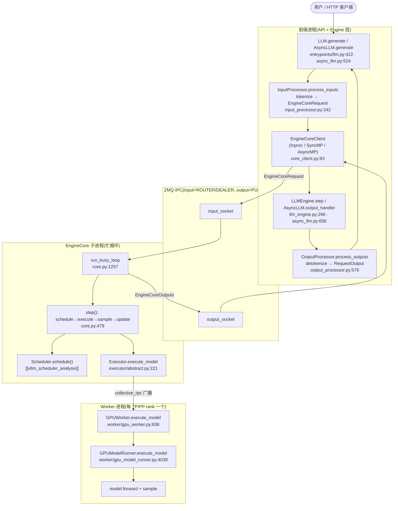
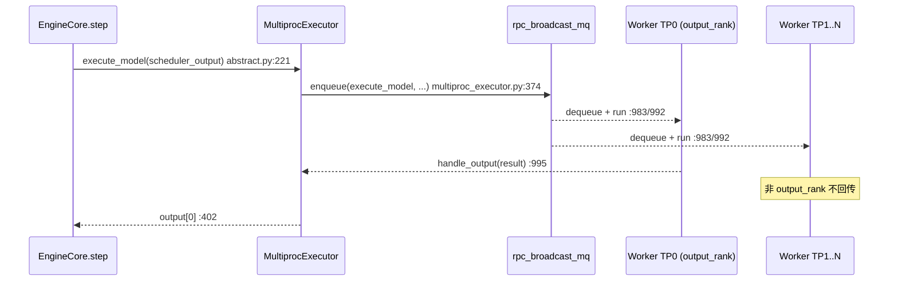
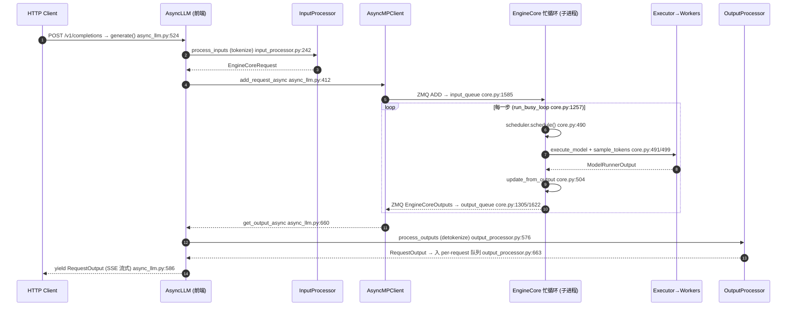

# vLLM 引擎架构与请求生命周期 —— 从 LLM API 到 EngineCore 忙循环

> **代码基准**:vLLM `main` @ `485bbe1c6`(2026-06-21)· V1 引擎
> **最后更新**:2026-06-22 · **系列**:vLLM 推理引擎源码级分析(见 [[vllm/index]])
> **分析维度**:Overview → Quick Start → Deep Dive
>
> 本页是 vLLM 系列的脊梁篇:它回答"一条请求从 `LLM.generate()` / HTTP 进来,到 `RequestOutput` 出去,中间穿过了哪些层、跨过了哪个进程边界、在哪个忙循环里被一步步推进"。它把整张架构图钉死,各兄弟页(调度 [[vllm_scheduler_analysis]]、KV 管理 [[vllm_kv_cache_management_analysis]]、注意力后端 [[vllm_attention_backends_analysis]] 等)都是这张图上某个组件的放大镜。

---

## 一、Overview(总览)

### 1.1 定位:一个"解耦的双进程流水线"

vLLM V1 的核心思想可以一句话概括:**把"调度/输出处理"和"模型执行"拆成两个进程,用 ZMQ 连起来,中间是一个永不停歇的忙循环**。

- 前端进程(你的 Python 进程):做 tokenize、输出 detokenize、把 `RequestOutput` 交还给用户。它持有一个 `EngineCoreClient`,只负责"发请求 / 收输出"。
- 后端进程(`EngineCore` 子进程):跑忙循环 `run_busy_loop()`,每一轮 `schedule → execute_model → update`,是真正调度并驱动 GPU 的地方。

这套"解耦"是 V1 区别于 V0 的根本结构变化(见 §1.4)。

### 1.2 分层架构与数据流



数据沿两个方向流动:**请求**从上往下(`EngineCoreRequest` 经 ZMQ 注入子进程的 `input_queue`),**输出**从下往上(`EngineCoreOutputs` 经 ZMQ 回到前端的 `outputs_queue`)。两条路在前端和后端各由一对**后台 IO 线程**搬运,从而把 ZMQ 序列化/反序列化与 GPU 前向重叠起来。

### 1.3 关键组件表

| 组件 | 类 / 文件 | 进程 | 职责 |
|------|-----------|------|------|
| 离线 API | `LLM` · `entrypoints/llm.py:66` | 前端 | `.generate()` 批量推理,内部驱动同步循环 |
| 在线 API | `AsyncLLM` · `v1/engine/async_llm.py:70` | 前端 | OpenAI/HTTP 服务,异步流式 |
| 同步引擎 | `LLMEngine` · `v1/engine/llm_engine.py:48` | 前端 | `add_request` + `step` 的兼容外壳 |
| 输入处理 | `InputProcessor` · `input_processor.py:36` | 前端 | tokenize、多模态、参数校验 → `EngineCoreRequest` |
| 输出处理 | `OutputProcessor` · `output_processor.py:417` | 前端 | detokenize、停止符检查 → `RequestOutput` |
| detokenizer | `IncrementalDetokenizer` · `detokenizer.py:30` | 前端 | 增量解码 token→text |
| IPC 客户端 | `EngineCoreClient` · `core_client.py:71` | 前端 | 三种形态(见 §3.4)桥接前后端 |
| **引擎核心** | `EngineCore` / `EngineCoreProc` · `core.py:96 / 894` | **后端** | **忙循环:调度 + 执行 + 输出** |
| 调度器 | `Scheduler` · `v1/core/sched/scheduler.py` | 后端 | 每步组 batch,详见 [[vllm_scheduler_analysis]] |
| 执行器 | `Executor` · `executor/abstract.py:37` | 后端 | 向 worker 扇出 `execute_model` |
| Worker | `Worker` · `worker/gpu_worker.py` | worker | 持有设备、KV cache、ModelRunner |
| ModelRunner | `GPUModelRunner` · `worker/gpu_model_runner.py` | worker | 组装输入张量、跑前向、采样 |
| 顶层配置 | `VllmConfig` · `config/vllm.py:290` | 全部 | 聚合所有子配置,贯穿所有层 |

### 1.4 V0 → V1 的关键变化

V1 是当前默认引擎。**V0 的独立 `LLMEngine` 已被移除**——`vllm/engine/llm_engine.py:6` 现在只是一行别名 `LLMEngine = V1LLMEngine`,而 V1 的 `LLMEngine` 自我描述为 "Legacy LLMEngine for backwards compatibility"(`v1/engine/llm_engine.py:48-49`)。也就是说,今天即使你写 `from vllm import LLMEngine`,拿到的也是 V1 的兼容外壳,底层跑的是 V1 `EngineCore`。

| 维度 | V0(历史) | V1(当前) | 代码证据 |
|------|-----------|-----------|----------|
| 引擎位置 | 与前端同进程,`step()` 在主线程同步跑 | **`EngineCore` 跑在独立子进程** | `core.py:1152` `run_engine_core` 作为 `Process` target |
| 进程通信 | 无(同进程函数调用) | **ZMQ IPC**(msgpack 序列化) | `core.py:1482/1587` 输入/输出 socket 线程 |
| 调度 vs 执行 | 耦合在一次 `step` 内 | **解耦**:调度在 EngineCore,执行在 worker,经 `collective_rpc` 扇出 | `executor/abstract.py:221` |
| 单步形态 | schedule+execute+detokenize 混在一起 | **`schedule→execute→sample→update` 四段**,detokenize 移到前端 | `core.py:490-504` |
| IO 重叠 | 串行 | 输入/输出各一后台线程,与 GPU 前向重叠 | `core.py:972-999` |
| 多进程开关 | — | `VLLM_ENABLE_V1_MULTIPROCESSING` | `llm_engine.py:157` |

> [!note] 为什么要拆进程?
> Python GIL 下,若 tokenize/detokenize、ZMQ 序列化与 GPU 前向跑在同一进程同一线程,它们会互相阻塞。V1 把执行核心隔离到子进程,前端只做轻量的输入/输出处理,再用后台 IO 线程(线程在 socket 阻塞时释放 GIL)把通信与计算重叠,从而把 CPU 开销从前向关键路径上挪开。

---

## 二、Quick Start(快速上手)

### 2.1 最小离线用法

```python
from vllm import LLM, SamplingParams

llm = LLM(model="Qwen/Qwen2.5-7B-Instruct")          # 构造即拉起 EngineCore 子进程
out = llm.generate(["你好,介绍一下你自己"],
                   SamplingParams(temperature=0.7, max_tokens=128))
print(out[0].outputs[0].text)
```

`LLM(...)` 在 `entrypoints/llm.py:349` 处经 `LLMEngine.from_engine_args` 建好整条流水线;`.generate()`(`llm.py:422`)把 prompt 转成请求灌进引擎,再阻塞驱动忙循环直到全部完成。

### 2.2 最小在线用法

```bash
vllm serve Qwen/Qwen2.5-7B-Instruct --port 8000
# 另开终端
curl http://localhost:8000/v1/completions -H 'Content-Type: application/json' \
  -d '{"model":"Qwen/Qwen2.5-7B-Instruct","prompt":"你好","max_tokens":64}'
```

`vllm serve` 最终落到 `entrypoints/openai/api_server.py`:`build_async_engine_client_from_engine_args`(:108)里用 `AsyncLLM.from_vllm_config`(:135)建异步引擎,再由 `launcher.py:26` 的 `serve_http` 用 uvicorn 把 FastAPI 应用跑起来。每个 HTTP 请求最终调用 `AsyncLLM.generate()`(`async_llm.py:524`)。

### 2.3 从哪里开始读源码

**直接从忙循环读起,其余都是它的输入输出适配。** 推荐路径:

1. `EngineCore.step()` — `core.py:479`。**整本书的中心**,9 行讲清一步推理。
2. `EngineCoreProc.run_busy_loop()` — `core.py:1257`。`step()` 外面套的 while。
3. 往上一层:`InprocClient.get_output` — `core_client.py:289`(看同进程时 step 怎么被调),或 `SyncMPClient.get_output` — `core_client.py:849`(看跨进程时输出怎么从队列里拿)。
4. 往下一层:`Executor.execute_model` — `executor/abstract.py:221`(看一步前向怎么扇出到 worker)。

### 2.4 一条最小可跟踪调用链(离线,TP=1)

```
LLM.generate                         entrypoints/llm.py:422
└─ _run_completion                   offline_utils.py:326
   ├─ _add_completion_requests       → LLMEngine.add_request   llm_engine.py:218
   │   ├─ InputProcessor.process_inputs   input_processor.py:242   (tokenize)
   │   ├─ OutputProcessor.add_request     output_processor.py:512
   │   └─ EngineCoreClient.add_request    core_client.py:297/886
   └─ _run_engine (while 有未完成请求)   offline_utils.py:594
      └─ LLMEngine.step              llm_engine.py:296
         ├─ engine_core.get_output   → 触发 EngineCore.step()   core.py:479
         │     schedule → execute_model → sample_tokens → update_from_output
         └─ OutputProcessor.process_outputs  output_processor.py:576  (detokenize)
            → RequestOutput
```

`TP=1` 默认走 `UniProcExecutor`,worker 与 EngineCore 同进程(`uniproc_executor.py:92` 直接 `run_method`);但**前端进程与 EngineCore 是否同进程**取决于 `VLLM_ENABLE_V1_MULTIPROCESSING`(默认开,即跨进程)。

---

## 三、Deep Dive(源码级深挖)

### 3.1 配置入口:VllmConfig 与 Executor 选型

一切从 `VllmConfig`(`config/vllm.py:290`)开始——它是一个把 `model_config / cache_config / parallel_config / scheduler_config / compilation_config …` 全部聚合在一起的 dataclass(字段见 :297-336),被每一层透传。`EngineArgs.create_engine_config()` 负责从命令行/构造参数生成它。

执行器类型在 `Executor.get_class()`(`executor/abstract.py:47`)按 `parallel_config.distributed_executor_backend` 决定:`"uni"→UniProcExecutor`、`"mp"→MultiprocExecutor`、`"ray"→Ray*`、`"external_launcher"→ExecutorWithExternalLauncher`(:69-80)。

一个贯穿 PP/异步调度的关键派生量是 `max_concurrent_batches`(`config/vllm.py:494`):它等于 `pipeline_parallel_size`(异步调度再 +1),直接决定 EngineCore 里 **batch_queue 的大小**(§3.7)。

### 3.2 离线同步路径:LLMEngine

`LLMEngine.__init__`(`llm_engine.py:51`)装配三件套:`InputProcessor`(:94)、`OutputProcessor`(:97)、以及 `EngineCoreClient.make_client(...)`(:105)。注意它默认 `asyncio_mode=False`。

**加请求** `LLMEngine.add_request`(:218):
- `InputProcessor.process_inputs`(:250)把 prompt tokenize 成 `EngineCoreRequest`;
- `OutputProcessor.add_request`(:274)在前端登记一个 `RequestState`(用于后续 detokenize);
- `engine_core.add_request`(:276)把请求送进引擎核心;
- 若 `n>1`(并行采样),在 :279-292 扇出 n 个子请求,共用一个 `ParentRequest`。

**驱动** `LLMEngine.step`(:296):
1. `engine_core.get_output()`(:304)拿一批 `EngineCoreOutputs`;
2. `output_processor.process_outputs(...)`(:309)做 detokenize + 停止符检查,产出 `RequestOutput`;
3. `engine_core.abort_requests(...)`(:318)把因停止字符串而结束、但 EngineCore 尚不知情的请求中止。

外层的 `_run_engine`(`offline_utils.py:573`)就是经典的同步驱动:`while self.llm_engine.has_unfinished_requests(): step_outputs = self.llm_engine.step()`(:594-595),收集 `finished` 的输出并按 request_id 排序返回。注意离线场景在 `_add_request`(:561)把 `output_kind` 设为 `FINAL_ONLY`,即只在请求结束时产出一个完整 `RequestOutput`,而非每 token 流式。

### 3.3 在线异步路径:AsyncLLM

`AsyncLLM.__init__`(`async_llm.py:73`)同样装配 `InputProcessor`(:135)、`OutputProcessor`(:138),但 `engine_core` 走的是 `make_async_mp_client`(:146,见 §3.4),且会启动一个**后台输出处理协程** `output_handler`。

**加请求 + 取流** `AsyncLLM.generate`(:524)是 HTTP 端最常调用的入口:
- `add_request`(:559 → :280)内部:tokenize(`process_inputs` :349)→ 懒启动 `_run_output_handler`(:373)→ 建一个 `RequestOutputCollector` 队列(:376)→ `_add_request`(:382)同时登记到 `OutputProcessor`(:409)并 `await engine_core.add_request_async`(:412);
- 然后在 :576-586 的 `while not finished` 里,`out = q.get_nowait() or await q.get()`,把每一片 `RequestOutput` `yield` 给调用方(SSE 流式)。

**输出泵** `_run_output_handler`(:637)创建一个常驻 asyncio task,循环体(`output_handler` :656):
1. `await engine_core.get_output_async()`(:660)从 ZMQ 拉 `EngineCoreOutputs`;
2. 切块后 `output_processor.process_outputs(...)`(:675)——它会把每个 `RequestOutput` `put` 进对应请求的 `RequestOutputCollector`(即上面 `generate` 在等的那个队列);
3. 若产生 `reqs_to_abort` 则 `await engine_core.abort_requests_async(...)`(:687)。

> 关键对比:**同步路径**里 `step()` 是用户线程**拉**(pull)输出;**异步路径**里有一个独立 `output_handler` 协程持续**泵**(push)到 per-request 队列,`generate()` 只管从队列消费。两者共用同一个 `OutputProcessor.process_outputs`,差别只在"输出去哪"(`output_processor.py:661-666`:有 `queue` 就 put,没有就 append 进返回列表)。

### 3.4 进程拆分与 IPC:EngineCoreClient 的三种形态

`EngineCoreClient.make_client`(`core_client.py:83`)按 `(multiprocess_mode, asyncio_mode)` 分派(:97-105):

| 形态 | 类 | 场景 | 与 EngineCore 关系 |
|------|----|------|--------------------|
| In-proc | `InprocClient` · :276 | 同进程调试 / 关掉多进程 | **直接持有 `EngineCore` 对象**,`get_output` 就是直接 `step_fn()`(:289-292) |
| 同步多进程 | `SyncMPClient` · :779 | `LLM(...)` 默认 | ZMQ + 后台输出线程 → `outputs_queue` |
| 异步多进程 | `AsyncMPClient` · :950(及 DP 变体 `DPAsyncMPClient`/`DPLBAsyncMPClient`,:126-131) | `vllm serve` | ZMQ + asyncio 输出任务 |

**InprocClient** 是理解全局的最简模型:没有忙循环、没有 ZMQ,`add_request` 直接塞进 scheduler,`get_output` 直接 `self.engine_core.step_fn()`(:290)。它正是"V0 风格"的同进程 step 在 V1 里的残留。

**MPClient**(:467,SyncMP/AsyncMP 的共同基类)的 `__init__`(:480)负责拉起真正的双进程拓扑:
- 前端建 `input_socket`(ROUTER,bind,:553)与 `output_socket`(PULL,:560);
- `launch_core_engines(...)`(:573)派生 EngineCore 子进程(见下);
- 在 :615-633 阻塞等待每个 engine 在 input socket 上回发的 ready 消息,握手完成。

**子进程是怎么起来的?** `launch_core_engines`(`v1/engine/utils.py:1072`)经 `CoreEngineProcManager` 用 multiprocessing 起进程,target 是 `EngineCoreProc.run_engine_core`(`v1/engine/utils.py:164-171`)。`run_engine_core`(`core.py:1152`)在子进程里:按是否 MoE-DP 选择实例化 `DPEngineCoreProc`(:1190)或 `EngineCoreProc`(:1198),注册 `SIGTERM/SIGINT` 处理器,然后调用 `engine_core.run_busy_loop()`(:1222)。

**SyncMPClient** 的输出怎么回来:构造时起一个 `process_outputs_socket` 线程(:808),从 output socket 收、msgpack 解码、塞进 `self.outputs_queue`(:830);`get_output()`(:849)就是 `self.outputs_queue.get()`。发送侧 `_send_input`(:861)把 `(identity, request_type, *encoded)` 经 input socket 发出;`add_request`(:886)即 `_send_input(ADD, request)`。请求类型是一组 hex 字节枚举 `EngineCoreRequestType`(`v1/engine/__init__.py:251`:`ADD=\x00, ABORT=\x01, UTILITY=\x03, EXECUTOR_FAILED=\x04, WAKEUP=\x05`),省去额外编码。

### 3.5 EngineCore 忙循环(核心)

`EngineCore.__init__`(`core.py:99`)在子进程里建起整个后端:`model_executor = executor_class(vllm_config)`(:123)→ `_initialize_kv_caches`(:133,profiling 出可用显存并切 KV blocks)→ 实例化 `Scheduler`(:150)。两个关键开关:
- **batch_queue**(:196-202):当 `max_concurrent_batches > 1`(即 PP>1 或异步调度)时建一个 deque,用于流水线(§3.7);
- **step_fn**(:221-223):据此在 `self.step` 与 `self.step_with_batch_queue` 之间二选一,忙循环只认 `step_fn`。

`EngineCoreProc`(:894)是它的 ZMQ 包装版。`__init__`(:901)建两个**线程安全队列** `input_queue` / `output_queue`(:913-914),并起两个后台 IO 线程(:978-999):
- `process_input_sockets`(:1482):DEALER socket(:1501)`recv_multipart`(:1557)→ 解码(:1568)→ `input_queue.put`(:1585)。ADD 请求在这里就地做 `preprocess_add_request`(:1570,把 `EngineCoreRequest` 转成内部 `Request`);ABORT 同时塞进 `aborts_queue`(:1582)以便在一步执行中途也能尽早中止。
- `process_output_sockets`(:1587):PUSH socket(:1606),`output_queue.get`(:1622)→ msgpack 编码 → `send_multipart`(:1643-1644,零拷贝)。

忙循环本体 `run_busy_loop`(:1257)极其简洁:

```python
while self._handle_shutdown():
    self._process_input_queue()   # 1) 没活就阻塞等输入   core.py:1261
    self._process_engine_step()   # 2) 推进一步并产出输出 core.py:1263
```

- `_process_input_queue`(:1267):`while not self.has_work()` 时阻塞在 `input_queue.get`(:1283),来一条 `_handle_client_request`(:1284)处理一条;有活后再非阻塞地把剩余请求清空(:1294-1296)。`has_work`(:1245)= 有运行中的 engine / scheduler 有请求 / batch_queue 非空。
- `_handle_client_request`(:1370)分派:`ADD→add_request`(:1377-1381)、`ABORT→abort_requests`(:1382)、`UTILITY→` 反射调用工具方法(:1384-1397)、`EXECUTOR_FAILED→` 抛错(:1398)。
- `_process_engine_step`(:1298):调 `self.step_fn()`(:1302),把每个 `EngineCoreOutputs` `output_queue.put_nowait`(:1305),再 `post_step`(:1307,投机解码下取草稿 token)。

### 3.6 单步 step():schedule → execute → sample → update

`EngineCore.step()`(`core.py:479`)是整个系统的心跳,核心 9 行(:488-508):

```python
if not self.scheduler.has_requests():           # core.py:488
    return {}, False
scheduler_output = self.scheduler.schedule(...)               # :490  组 batch(本步算哪些 token)
future = self.model_executor.execute_model(scheduler_output,  # :491  非阻塞发起前向
                                           non_block=True)
grammar_output = self.scheduler.get_grammar_bitmask(...)      # :492  结构化输出的 bitmask
model_output = future.result()                                # :497  等前向结果
if model_output is None:
    model_output = self.model_executor.sample_tokens(grammar_output)  # :499  采样
self._process_aborts_queue()                                  # :503  处理中途到达的 abort
engine_core_outputs = self.scheduler.update_from_output(      # :504  回收输出、推进状态
    scheduler_output, model_output)
return engine_core_outputs, scheduler_output.total_num_scheduled_tokens > 0
```

注意 V1 把"前向"和"采样"拆成 `execute_model` + `sample_tokens` 两次调用(:491/:499):前向先算 logits(非阻塞返回 future),拿到 grammar bitmask 后再采样。这让结构化输出(grammar)的 bitmask 计算能与前向重叠。`schedule()` 的内部(连续批处理、分块预填充、抢占)是 [[vllm_scheduler_analysis]] 的主题;`update_from_output` 如何回收 KV、判定完成,见 [[vllm_kv_cache_management_analysis]]。

### 3.7 PP 流水线:step_with_batch_queue 与 batch_queue

当 PP>1 或异步调度开启时,`step_fn` 切到 `step_with_batch_queue`(`core.py:519`)。它的目标是**消除流水线气泡**:用一个深度 `batch_queue_size`(= `max_concurrent_batches`)的 deque 暂存"已发起但未取回"的批次。

逻辑(:536-632):
1. 若 batch_queue 未满,就**先调度并发起新批次**(`schedule` :547 + `execute_model(non_block=True)` :549),把 `(future, scheduler_output, exec_future)` `appendleft` 进队列(:575);只要队列没满且还有活,就直接返回不阻塞(:576-581)——即"填满流水线优先于取结果"。
2. 否则从队尾 `pop` 一个最老的批次,`future.result()` 阻塞取回(:590-595),`update_from_output`(:605)。
3. 结构化输出需要等上一步 token 时,采样会被推迟(`deferred_scheduler_output`,:559-571 / :612-630),保证 grammar bitmask 用到的是已确定的 token。

`batch_queue` 在 `__init__:200-202` 据 `batch_queue_size>1` 建立,而该 size 源自 `VllmConfig.max_concurrent_batches`(`config/vllm.py:494`)。

### 3.8 Executor → Worker 扇出

`Executor.execute_model`(`executor/abstract.py:221`)本身只是一层薄封装:它调 `collective_rpc("execute_model", args=(scheduler_output,), non_block=...)`(:224),取 `output[0]` 返回(:227)。`sample_tokens`(:241)同理。真正的"扇出"在各 `collective_rpc` 实现里:

- **UniProcExecutor**(`uniproc_executor.py:46`):只有一个 `driver_worker`(`WorkerWrapperBase`,:48)。`collective_rpc`(:79)就是在本进程 `run_method(self.driver_worker, method, ...)`(:92)。所以 **TP=1/PP=1 时,worker 与 EngineCore 同进程**,没有第二跳。
- **MultiprocExecutor**(`multiproc_executor.py:103`):`_init_executor`(:110)为每个 local rank `WorkerProc.make_worker_process`(:182)派生 worker 子进程,并建一个广播用的 `rpc_broadcast_mq`(:151)。`execute_model`(:307)调 `collective_rpc(..., unique_reply_rank=self.output_rank)`(:313),即"广播给所有 worker,但只收 output_rank(末个 PP rank)那一份结果"。`collective_rpc`(:340)把 `(method, args, kwargs, output_rank)` `enqueue` 进广播队列(:374),再从 `response_mqs` 收回(:376-396)。

worker 侧 `WorkerProc.worker_busy_loop`(`multiproc_executor.py:979`)是另一个忙循环:`rpc_broadcast_mq.dequeue`(:983)→ 反射 `getattr(self.worker, method)` 执行(:988-992)→ 仅当 `output_rank is None or self.rank == output_rank` 时 `handle_output` 把结果发回(:994-995)。这样 TP 内非输出 rank 不回传冗余结果。



### 3.9 Worker → ModelRunner 脊梁

`GPUWorker.execute_model`(`worker/gpu_worker.py:836`)负责 PP 边界的张量通信,然后把活交给 ModelRunner:
- 非首个 PP rank:先 `irecv_tensor_dict` 收上一段的 `intermediate_tensors`(:881-893);
- 核心一行:`output = self.model_runner.execute_model(scheduler_output, intermediate_tensors)`(:896);
- 非末个 PP rank:`isend_tensor_dict` 把中间张量发给下一段并返回 None(:918-924)。

`GPUModelRunner.execute_model`(`worker/gpu_model_runner.py:4039`)与 `sample_tokens`(:4418)才是真正组装输入张量、跑 attention/MLP、采样的地方——这些细节(注意力后端、CUDA Graph、量化)分别属于 [[vllm_attention_backends_analysis]]、[[vllm_compilation_cudagraph_analysis]]、[[vllm_quantization_analysis]],本页只钉住调用链的入口锚点。

### 3.10 请求生命周期端到端

把前面所有环节串成一条命的旅程(以异步在线、跨进程、TP>1 为例):



三个阶段对应三处代码:**tokenize** 在前端 `InputProcessor.process_inputs`(:242,产出 `EngineCoreRequest`);**调度执行** 在子进程忙循环 `EngineCore.step`(:479);**detokenize** 在前端 `OutputProcessor.process_outputs`(:576),其内部 `req_state.detokenizer.update(...)`(:639)调用增量解码器 `IncrementalDetokenizer.update`(`detokenizer.py:95`,Fast/Slow 两种实现 :167/:250),并做停止字符串检查,最后 `make_request_output`(:651)产出 `RequestOutput`。

### 3.11 DP 协调(简述)

数据并行(DP)下,每个 DP rank 有独立的 EngineCore 子进程,由 `DPEngineCoreProc`(`core.py:1743`)承载,其 `run_busy_loop`(:1923)在普通忙循环之外要处理"全局是否还有未完成请求"的同步——即使本 rank 空闲,只要别的 rank 有活,也要跑 dummy batch 以参与集合通信。前端侧由 `DPLBAsyncMPClient` / `DPAsyncMPClient`(`core_client.py:126-131`)在多个 EngineCore 间做负载均衡,`Coordinator`(`coordinator.py`)负责 wave 计数与统计聚合。DP/TP/PP 的完整分布式语义见 [[vllm_distributed_inference_analysis]]。

---

## Related Pages
- [[vllm_scheduler_analysis]] · [[vllm_kv_cache_management_analysis]] · [[vllm_model_library_analysis]] · [[vllm_attention_backends_analysis]] · [[vllm_feature_optimizations_overview]]
- [[vllm_distributed_inference_analysis]] · [[vllm_compilation_cudagraph_analysis]] · [[vllm_speculative_decoding_analysis]] · [[vllm_quantization_analysis]]
- [[vllm/index]] · [[../index]]

## Cross-Domain Links
- [[megatron_inference_engine_analysis]] —— Megatron-LM 推理引擎(连续批处理 / 分页 KV)对照,看另一套训练框架内建的推理路径
- [[mooncake_analysis]] —— 分离式(prefill/decode 分离)推理服务架构,与本页的"单引擎双进程"形成规模化对照
