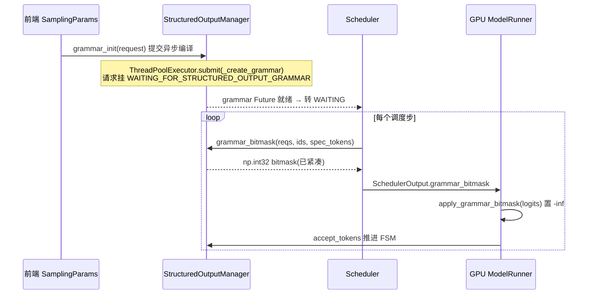
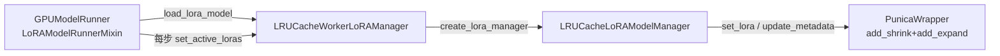

# vLLM 特性优化全景 —— 从前缀缓存到投机解码的优化地图

> **代码基准**:vLLM `main` @ `485bbe1c6`(2026-06-21)· V1 引擎
> **最后更新**:2026-06-22 · **系列**:vLLM 推理引擎源码级分析(见 [[vllm/index]])
> **分析维度**:Overview → Quick Start → Deep Dive
>
> 本页是 vLLM「特性优化」支柱的**导航主页**:统览引擎能挂载的全部优化特性,给出"开什么 flag、改哪段代码、去哪页深挖"的对照表。对**四大特性**(投机解码 / 量化 / 分布式 / 编译&CUDA Graph)只做 overview 并指向各自的深挖兄弟页;对**没有独立页的特性**(结构化输出 / LoRA / 分离式 KV / KV 卸载)在 §三 做真正的源码级深挖。

---

## 一、Overview(总览)

vLLM 的"优化"分布在四个层面:**调度层**(前缀缓存、分块预填充)、**采样层**(结构化输出、投机解码)、**权重/算子层**(量化、LoRA、编译&CUDA Graph、算子融合&Triton——见 [[vllm_fused_ops_and_kernels_analysis]])、**内存/集群层**(分布式、分离式 KV、KV 卸载)。所有特性最终都收口到 `VllmConfig` 的子配置对象(`vllm/config/__init__.py` 聚合),由 `EngineArgs`(`vllm/engine/arg_utils.py`)从命令行解析。

### 1.1 特性总表

| 特性 | 解决什么问题 | 开启 flag(CLI) | 代码位置(相对 `vllm/`) | 深挖页 |
|------|-------------|-----------------|--------------------------|--------|
| **前缀缓存** Prefix Caching | 复用相同前缀的 KV,省重复 prefill | `--enable-prefix-caching`(**默认开**) | `config/cache.py:92`;`v1/core/block_pool.py` | [[vllm_kv_cache_management_analysis]] |
| **分块预填充** Chunked Prefill | 长 prompt 拆块,与 decode 同批,降 TTFT 抖动 | `--enable-chunked-prefill`(**默认开**) | `config/scheduler.py:84`,`:80` | [[vllm_scheduler_analysis]] |
| **结构化/受限解码** | 强制输出符合 JSON/regex/grammar | `--structured-outputs-config '{"backend":"auto"}'` | `v1/structured_output/`;`config/structured_outputs.py` | **本页 §3.2** |
| **LoRA / 多 LoRA 服务** | 单基座同时服务多个 LoRA 适配器 | `--enable-lora --max-loras N` | `lora/`;`config/lora.py`;`v1/worker/lora_model_runner_mixin.py` | **本页 §3.3** |
| **分离式推理 / KV 连接器** | P/D 分离、跨实例 KV 复用 | `--kv-transfer-config '{...}'` | `distributed/kv_transfer/`;`config/kv_transfer.py` | **本页 §3.4** |
| **KV cache 卸载** | KV 溢出到 CPU/分层存储,扩展可缓存上下文 | `--kv-transfer-config '{"kv_connector":"OffloadingConnector",...}'` | `v1/kv_offload/`;`...v1/offloading_connector.py` | **本页 §3.5** |
| **权重卸载** Weight Offload | 模型权重溢出到 CPU(UVA/prefetch),省显存 | `--cpu-offload-gb N` | `config/offload.py` | 本页 §3.1 |
| **投机解码** Speculative | draft+verify,降单步延迟 | `--speculative-config '{"method":..,"num_speculative_tokens":N}'` | `config/speculative.py:75` | [[vllm_speculative_decoding_analysis]] |
| **量化** Quantization | 低比特权重/激活/KV,省显存提吞吐 | `--quantization <method>`(`-q`) | `config/quantization.py`;`config/model.py:197` | [[vllm_quantization_analysis]] |
| **编译 & CUDA Graph** | torch.compile + 图捕获,削 Python/启动开销 | `--compilation-config '{...}'`(`-cc`) | `config/compilation.py:379` | [[vllm_compilation_cudagraph_analysis]] |
| **分布式** TP/PP/DP/EP | 模型/数据切分到多卡多机 | `-tp/-pp/-dp`,`--enable-expert-parallel` | `config/parallel.py` | [[vllm_distributed_inference_analysis]] |
| **多模态** Multimodal | 图/音/视频输入与 MM 缓存 | `--limit-mm-per-prompt '{...}'` | `config/multimodal.py` | 本页 §3.1 |
| **异步调度** Async Scheduling | 调度与 GPU 执行重叠,削 CPU 空泡 | `--async-scheduling` | `config/scheduler.py:158` | [[vllm_scheduler_analysis]] |

> [!note] flag 默认值
> 前缀缓存与分块预填充在 V1 **默认开启**(`enable_prefix_caching: bool = True`,`enable_chunked_prefill: bool = True`),无需手动加 flag;其余特性默认关闭、按需开启。

### 1.2 按瓶颈选优化(速查)

| 你的瓶颈 / 目标 | 首选优化 | 次选 |
|----------------|---------|------|
| **TTFT 高**(首 token 慢) | 前缀缓存、分块预填充 | 分离式 P/D、投机(短)|
| **TPOT 高**(每 token 慢) | 投机解码、CUDA Graph(FULL)、量化 | 编译 VLLM_COMPILE |
| **显存不够装模型** | 量化、权重卸载(`--cpu-offload-gb`)、TP/PP | EP(MoE)|
| **KV 显存不够 / 上下文短** | 前缀缓存、KV 卸载(CPU/分层) | 分离式 KV 复用 |
| **要严格 JSON/格式输出** | 结构化输出(xgrammar) | guidance / outlines |
| **多租户多适配器** | LoRA / 多 LoRA | default_mm_loras(多模态)|
| **集群级 prefill/decode 解耦** | 分离式推理(NIXL/Mooncake/LMCache) | KV 卸载 + 连接器 |
| **吞吐打满多卡** | TP + DP,EP(MoE)| PP(跨机)|

---

## 二、Quick Start(快速上手)

### 2.1 flag 速查

```bash
# 调度层(V1 默认已开,显式写出仅作说明)
--enable-prefix-caching            # 前缀缓存
--enable-chunked-prefill           # 分块预填充
--max-num-batched-tokens 8192      # 单步 token 预算(config/scheduler.py:49)
--max-num-seqs 256                 # 单批最大序列数(:63)

# 结构化输出
--structured-outputs-config '{"backend":"auto"}'      # auto/xgrammar/guidance/outlines/lm-format-enforcer

# LoRA
--enable-lora --max-loras 4 --max-lora-rank 16        # config/lora.py:34-36

# 量化 / 编译 / 投机(深挖见兄弟页)
-q fp8                                                 # 量化方法
-cc '{"cudagraph_mode":"FULL_AND_PIECEWISE"}'          # 编译&CUDA Graph
-sc '{"method":"ngram","num_speculative_tokens":5}'    # 投机解码

# 分布式
-tp 8 -pp 2 --enable-expert-parallel                   # TP/PP/EP

# 分离式 KV / KV 卸载(同走 --kv-transfer-config)
--kv-transfer-config '{"kv_connector":"NixlConnector","kv_role":"kv_both"}'
--kv-transfer-config '{"kv_connector":"OffloadingConnector","kv_role":"kv_both","kv_connector_extra_config":{"spec_name":"CPUOffloadingSpec"}}'
```

### 2.2 推荐起步配置(单机 8 卡 · 吞吐优先)

```bash
vllm serve <model> \
  -tp 8 \
  --enable-prefix-caching \
  --enable-chunked-prefill \
  --max-num-batched-tokens 8192 \
  --max-num-seqs 256 \
  -cc '{"cudagraph_mode":"FULL_AND_PIECEWISE"}' \
  -q fp8
```

在此基础上按需叠加:要 JSON 加 `--structured-outputs-config`,要多适配器加 `--enable-lora`,要 P/D 分离加 `--kv-transfer-config`。

### 2.3 各特性最小开启方式

- **结构化输出**:请求级 `SamplingParams(structured_outputs=StructuredOutputsParams(json=<schema>))`;引擎级默认 `backend="auto"`,会自动挑选后端(见 §3.2)。
- **LoRA**:引擎 `--enable-lora`,请求带 `LoRARequest(lora_name, lora_int_id, lora_path)`(`lora/request.py`)。
- **分离式 / KV 卸载**:都只需一个 `--kv-transfer-config`,区别在 `kv_connector` 取值。
- **权重卸载**:`--cpu-offload-gb 10`(把 10 GiB 权重放 CPU,`config/offload.py:23`)。

---

## 三、Deep Dive(源码级深挖)

### 3.0 四大特性 —— 仅 Overview + 指向深挖页

这四个特性各有独立兄弟页,本页**不展开**,只给 1 行定位与配置入口:

| 特性 | 配置对象 / 行号 | 核心枚举 / 字段 | 深挖页 |
|------|----------------|----------------|--------|
| 投机解码 | `config/speculative.py:75` `SpeculativeConfig` | `num_speculative_tokens:81`、`method:87`(ngram/eagle/medusa/draft model) | [[vllm_speculative_decoding_analysis]] |
| 量化 | `config/quantization.py` + `config/model.py:197` | `quantization` 方法名(fp8/awq/gptq/…) | [[vllm_quantization_analysis]] |
| 编译&CUDA Graph | `config/compilation.py:379` `CompilationConfig` | `CompilationMode`(`:37` NONE/STOCK/DYNAMO_TRACE_ONCE/**VLLM_COMPILE**)、`CUDAGraphMode`(`:53` NONE/PIECEWISE/FULL/FULL_AND_PIECEWISE) | [[vllm_compilation_cudagraph_analysis]] |
| 分布式 | `config/parallel.py` | `tensor_parallel_size:122`、`pipeline_parallel_size:120`、`data_parallel_size:126`、`enable_expert_parallel:162` | [[vllm_distributed_inference_analysis]] |

### 3.1 小特性回顾(无独立页,本页只占 1 段)

- **前缀缓存**:`enable_prefix_caching`(`config/cache.py:92`,默认 `True`),哈希算法 `prefix_caching_hash_algo`(`:94`,默认 `sha256`)。块级前缀命中由 KV cache 管理器完成,详见 [[vllm_kv_cache_management_analysis]]。
- **分块预填充**:`enable_chunked_prefill`(`config/scheduler.py:84`,默认 `True`);超过 `long_prefill_token_threshold`(`:80`,默认 `max_model_len*0.04`,见 `:258-259`)的 prompt 被拆块,与 decode token 混入同一 `max_num_batched_tokens` 预算并发执行。详见 [[vllm_scheduler_analysis]]。
- **权重卸载**:`config/offload.py` 提供两种后端——`UVAOffloadConfig`(`:16`,零拷贝 `cpu_offload_gb`)与 `PrefetchOffloadConfig`(`:48`,按层分组异步 H2D 预取);`offload_backend="auto"`(`:83`)依非默认字段自动二选一。注意这是**模型权重**卸载,与 §3.5 的 **KV cache** 卸载是两套独立机制。
- **多模态**:`config/multimodal.py`,`--limit-mm-per-prompt` 限制每 prompt 的各模态数量;LoRA 还支持 `default_mm_loras`(`config/lora.py:52`)按模态绑定适配器。

---

### 3.2 结构化 / 受限解码(Structured Output)

**目标**:让生成的 token 严格满足 JSON Schema / 正则 / EBNF / choice / 结构化标签。机制是在**每步采样前**用一个"哪些 token 合法"的 bitmask 把非法 token 的 logits 置 `-inf`。

#### 3.2.1 配置与后端

`StructuredOutputsConfig`(`config/structured_outputs.py:18`)字段:`backend`(`:21`,`Literal["auto","xgrammar","guidance","outlines","lm-format-enforcer"]`,`:12-14`)、`disable_any_whitespace`(`:26`,仅 xgrammar/guidance)、`reasoning_parser`(`:35`)、`enable_in_reasoning`(`:41`,是否在 reasoning 段也约束)。

**"auto" 后端自动决议**在前端的 `SamplingParams._validate_structured_outputs`(`sampling_params.py:862-1005`):先试 `validate_xgrammar_grammar` 成功就用 **xgrammar**(`:974-975`);若 schema 含 xgrammar 不支持的特性(`backend_xgrammar.py:225` `has_xgrammar_unsupported_json_features`)则回退——非 tekken Mistral 或 guidance 也不支持的 schema 走 **outlines**(`:995-996`),否则默认 **guidance**(`:998-1003`)。决议结果写入 `_backend`,V1 不支持 per-request 切后端(`v1/structured_output/__init__.py:127-128`)。

#### 3.2.2 抽象与后端实现

- `StructuredOutputOptions`(`backend_types.py:19`):JSON / JSON_OBJECT / REGEX / GRAMMAR / CHOICE / STRUCTURAL_TAG。
- `StructuredOutputBackend` ABC(`backend_types.py:98`):`compile_grammar`(`:106`)、`allocate_token_bitmask`(`:122`)、`destroy`(`:132`)。
- `StructuredOutputGrammar` ABC(`backend_types.py:31`):`accept_tokens`(`:34`,推进 FSM)、`validate_tokens`(`:48`,投机时校验不推进)、`rollback`(`:62`)、`fill_bitmask`(`:72`)。
- **XgrammarBackend**(`backend_xgrammar.py:36`):`compile_grammar`(`:78`)按类型编译 JSON/grammar/regex/结构化标签;`XgrammarGrammar.fill_bitmask`(`:195`)直接调 `matcher.fill_next_token_bitmask`;`GrammarMatcher` 的 `max_rollback_tokens` 取投机 token 数(`:120-123`)以支持投机解码回滚。guidance / outlines / lm-format-enforcer 后端为同构兄弟实现(`backend_guidance.py` / `backend_outlines.py` / `backend_lm_format_enforcer.py`)。

#### 3.2.3 引擎内全链路



- **异步编译**:`StructuredOutputManager.grammar_init`(`__init__.py:115`)首次按 `_backend` 懒建后端(`:130-165`),把 `_create_grammar`(`:173`)提交线程池(`:167-171`);`external_launcher` 模式因多 TP rank 调度器会死锁,故关掉异步编译(`:53-56`)。请求在 grammar 就绪前挂 `WAITING_FOR_STRUCTURED_OUTPUT_GRAMMAR`(`v1/request.py:112,327`),Future 完成后转 `WAITING`(`request.py:42-53`)。
- **生成 bitmask**:每步 `Scheduler.get_grammar_bitmask`(`core/sched/scheduler.py:1440`)→ `manager.grammar_bitmask`(`__init__.py:204`)。首次按 `max_batch_size*(1+num_spec_tokens)` 分配 bitmask(`:217-226`);大 batch(>128)且非投机走线程池并行填充(`:236-262`),否则串行,且对投机 token 逐个 `accept_tokens` + 末尾 `rollback`(`:263-294`)。reasoning 门控由 `should_fill_bitmask`(`:305`)/`should_advance`(`:325`)决定是否在思考段也约束。
- **应用 bitmask**:`v1/structured_output/utils.py:apply_grammar_bitmask`(`:85`)把紧凑 bitmask 按 batch 顺序重排(`:124-140`),再调 `xgr.apply_token_bitmask_inplace`(`:160`,CPU 路径 `:170/174`)就地改 logits;由 `gpu_model_runner.py:4449`(import `:196`)在采样前调用。

> [!tip] 与投机解码的耦合
> bitmask 为每个请求预留 `1 + num_speculative_tokens` 行(`__init__.py:221-226`),draft token 用 `validate_tokens` 校验(不推进 FSM),被接受后再统一 `accept_tokens`/`rollback`——这是结构化输出能与投机解码共存的关键。

---

### 3.3 LoRA / 多 LoRA 服务

**目标**:单基座权重 + 一批小 LoRA 适配器,在**同一个 batch 内**为不同请求挂不同适配器(multi-tenant serving),零额外基座副本。算子层基于 Punica 的 BGMV/SGMV 分组 GEMM。

#### 3.3.1 配置

`LoRAConfig`(`config/lora.py:31`):`max_lora_rank`(`:34`,默认 16)、`max_loras`(`:36`,单批最大适配器数)、`fully_sharded_loras`(`:38`,TP 全分片)、`max_cpu_loras`(`:43`,CPU 缓存容量)、`lora_dtype`(`:46`)、`target_modules`(`:48`,限定挂 LoRA 的模块后缀)、`default_mm_loras`(`:52`,按模态绑定)。

#### 3.3.2 三层管理器



- **Worker 侧 mixin**(`v1/worker/lora_model_runner_mixin.py:30`):`load_lora_model`(`:31`)建 `LRUCacheWorkerLoRAManager`;每步 `set_active_loras`(`:73`)从 `InputBatch.make_lora_inputs` 拿到 `token_lora_mapping` / `prompt_lora_mapping`,封 `LoRAMapping` 后调 `set_active_adapters`(`:48-67`)。`maybe_setup_dummy_loras`(`:93`)与 `maybe_select_dummy_loras`(`:132`)在 warmup / CUDA Graph 捕获时造哑适配器(配 `specialize_active_lora` 按活跃数捕获多张图,`config/lora.py:67`)。
- **Worker 管理器**(`lora/worker_manager.py`):`set_active_adapters`(`:183`)= `_apply_adapters` + `set_adapter_mapping`;`WorkerLoRAManager._apply_adapters`(`:194`)按"请求集 − 已加载集"差集 add/remove;`LRUCacheWorkerLoRAManager`(`:231`)改为按请求 add 并由 LRU 淘汰(`:258-271`)。`add_adapter`(`:213`)= 从磁盘 `_load_adapter` + `activate_adapter`。
- **模型管理器**(`lora/model_manager.py`):`LoRAModelManager`(`:64`)维护 `lora_index_to_id` 槽位;`activate_adapter`(`:285`)找空闲槽、对每个挂 LoRA 的 module 调 `module.set_lora(index, lora_a, lora_b)`(`:318-322`);`_set_adapter_mapping`(`:344`)把映射推给 Punica:`punica_wrapper.update_metadata(mapping, lora_index_to_id, lora_slots+1, vocab_size)`(`:362-367`)。`LRUCacheLoRAModelManager`(`:1163`)在 `activate_adapter`(`:1208`)槽满时淘汰最旧适配器。

#### 3.3.3 Punica 算子

`PunicaWrapperABC`(`lora/punica_wrapper/punica_base.py:22`,论文引用 `:4-7`)抽象出三个核心:`update_metadata`(`:27`,根据 token→lora 映射构建分组元数据)、`add_shrink`(`:41`,`x → r` 按 `lora_a` 分组 GEMM)、`add_expand`(`:56`,`r → out` 按 `lora_b` 分组 GEMM 并加回基座输出)。即 `out = base(x) + lora_b @ (lora_a @ x) * scale`,shrink/expand 两段批量分组 GEMM 让不同请求用不同适配器仍能在一个 kernel 内算完。`get_punica_wrapper`(`punica_selector.py:13`)按平台选实现(CUDA `punica_gpu` / CPU `punica_cpu` / XPU `punica_xpu`)。挂 LoRA 的层在 `lora/layers/`(column/row/replicated/vocab parallel linear、logits processor、fused MoE)。

底层 Triton kernel 在 `lora/ops/triton_ops/`:`lora_shrink_op.py` / `lora_expand_op.py` 是 shrink/expand 主体,`fused_moe_lora_op.py` 为 MoE LoRA 融合,均带 fp8 变体(`lora_shrink_fp8_op.py` 等);`enable_mixed_moe_lora_format`(`config/lora.py:74`)强制走通用 2D MoE LoRA 包装,使 2D/3D 格式适配器可在同一部署混服。

---

### 3.4 分离式推理 / KV 连接器(Disaggregated KV)

**目标**:把 KV cache 在**实例之间**搬运——典型是 Prefill/Decode 分离(P 算完 KV 推给 D),以及跨实例 KV 复用、外部 KV 存储。统一抽象是 **KV Connector**。

#### 3.4.1 配置与工厂

`KVTransferConfig`(`config/kv_transfer.py:23`):`kv_connector`(`:26`,连接器名)、`kv_role`(`:41`,`kv_producer`/`kv_consumer`/`kv_both`)、`kv_rank`(`:45`,P=0/D=1)、`kv_connector_extra_config`(`:59`,连接器私有配置)、`kv_connector_module_path`(`:62`,外部连接器动态加载)。`is_kv_producer`/`is_kv_consumer`(`:113-118`)派生角色。

`KVConnectorFactory`(`kv_connector/factory.py:27`)用懒加载注册表(`register_connector`,`:30`)登记了一长串内置连接器(`:152-242`):**NixlConnector**(RDMA P/D)、**LMCacheConnectorV1**、**Mooncake / MooncakeStore**、**OffloadingConnector**(→ §3.5)、**MultiConnector**(组合多连接器)、HF3FS、MoRIIO、SimpleCPUOffload 等。`create_connector`(`:42`)按 `role` 分别在调度器进程与 worker 进程各建一个实例,强制 scheduler/worker 职责分离(`:67-75`)。

#### 3.4.2 双角色 API

`KVConnectorBase_V1`(`kv_connector/v1/base.py:171`)按 `KVConnectorRole`(`:124`,SCHEDULER=0 / WORKER=1)分两组接口:

| 角色 | 方法 | 行号 | 职责 |
|------|------|------|------|
| Scheduler | `get_num_new_matched_tokens` | `:454` | 外部命中多少 token(决定少算多少 prefill)|
| Scheduler | `update_state_after_alloc` | `:489` | 分配块后登记 |
| Scheduler | `build_connector_meta` | `:510` | 打包发给 worker 的元数据 |
| Scheduler | `request_finished` | `:542` | 请求完成时收尾(异步发送)|
| Worker | `register_kv_caches` | `:251` | 注册 KV 张量地址 |
| Worker | `start_load_kv` | `:293` | 异步拉取(D 侧 recv)|
| Worker | `wait_for_layer_load` / `save_kv_layer` | `:311` / `:325` | 逐层等加载 / 存 KV |
| Worker | `wait_for_save` / `get_finished` | `:347` / `:357` | 等保存完 / 上报已完成收发 |

#### 3.4.3 worker 侧编排

`KVConnectorModelRunnerMixin._get_kv_connector_output`(`v1/worker/kv_connector_model_runner_mixin.py:78`)把连接器生命周期包进 `execute_model`:`bind_connector_metadata`(`:89`)→ `start_load_kv`(`:95`,后台异步搬运,可与无关请求 disjoint)→ `yield` 跑模型 forward(层内触发 `save_kv_layer`/`wait_for_layer_load`)→ `wait_for_save`(`:100`)→ `get_finished`(`:103`)产出 `finished_sending/finished_recving` 供 P/D 协调。即便本步无计算也要走收发(`kv_connector_no_forward`,`:36`)。`prefer_cross_layer_blocks`(`base.py:177`)为 True 的连接器可用统一跨层 KV 布局(`use_uniform_kv_cache`,`:114`)加速整块传输。

> [!note] 与 Mooncake 对照
> NIXL/Mooncake/LMCache 都是这套 Connector 抽象的具体后端;集群级 P/D 分离与 KV 池化的系统设计见 [[mooncake_analysis]]。

---

### 3.5 KV cache 卸载(KV Offload)

**目标**:GPU KV 块满了不必丢弃,而是异步**卸载到 CPU 内存或分层存储(本地盘/对象存储)**,后续命中再拉回——等价于"软件多级 KV 缓存",扩展可缓存上下文总量。它**复用 §3.4 的 Connector 框架**接入引擎。

#### 3.5.1 接入路径(经 OffloadingConnector 桥接)

KV 卸载不是独立子系统,而是注册为名为 `OffloadingConnector` 的 KV 连接器(`factory.py:206-210`)。`OffloadingConnector`(`kv_connector/v1/offloading_connector.py:46`)在构造时 `OffloadingSpecFactory.create_spec`(`:59`),并按角色拆出 `OffloadingConnectorScheduler` / `OffloadingConnectorWorker`(`:63-66`);它声明 `prefer_cross_layer_blocks=True`(`:48`)以整块搬运。

`OffloadingSpecFactory`(`v1/kv_offload/factory.py:17`)默认 `spec_name="CPUOffloadingSpec"`(`:37`),注册了 **CPUOffloadingSpec**(`:66`)与 **TieringOffloadingSpec**(`:69`,分层:CPU→盘/对象存储)。开启即:
```bash
--kv-transfer-config '{"kv_connector":"OffloadingConnector","kv_role":"kv_both",
  "kv_connector_extra_config":{"spec_name":"CPUOffloadingSpec","block_size":...}}'
```

#### 3.5.2 调度器侧:OffloadingManager

`OffloadingSpec`(`v1/kv_offload/base.py:425`)产出两类对象:`get_manager`(`:498`,调度器侧块追踪)与 `get_handlers`(`:507`,worker 侧数据搬运)。`OffloadingManager` ABC(`:150`)定义块生命周期原语:`lookup`(`:152`,块是否已卸载就绪)、`prepare_load`/`complete_load`(`:169`/`:201`,加载并防淘汰)、`prepare_store`/`complete_store`(`:212`/`:234`,卸载)、`touch`(`:190`,LRU 续命)、`on_new_request`(`:254`)。`OffloadPolicy`(`:57`)区分 BLOCK_LEVEL(只卸新块)与 REQUEST_LEVEL(整请求卸)。

`CPUOffloadingManager`(`v1/kv_offload/cpu/manager.py:35`)是默认实现,核心是**可插拔淘汰策略**:`_CACHE_POLICIES = {"lru": LRUCachePolicy, "arc": ARCCachePolicy}`(`:29-32`),构造时按 `cache_policy` 选(`:58-64`)。卸载块大小可为 GPU 块的整数倍(`base.py:481-496` `block_size_factor`),减少元数据/搬运次数。

#### 3.5.3 worker 侧:OffloadingWorker / Handler

`OffloadingWorker`(`v1/kv_offload/worker/worker.py:77`)驱动一组 `OffloadingHandler`(`:26`):`transfer_async`(`:40`,发起异步 H2D/D2H 拷贝,返回 job 是否提交)、`get_finished`(`:55`,收割完成的搬运)。这与 Connector 的 `start_load_kv`/`get_finished` 节奏对齐——卸载/回载都在 forward 旁路异步进行,不阻塞主计算。CPU 后端的实际拷贝在 `cpu/gpu_worker.py` 与 `cpu/swap_blocks_triton.py`。

**分层卸载**(`TieringOffloadingSpec`,`v1/kv_offload/tiering/`)再下沉一级:`tiering/fs/`(本地文件系统,`io.py`+`thread_pool.py`)与 `tiering/obj/`(对象存储,`config.py`+`manager.py`)作为 CPU 之下的二级介质,`tiering/async_lookup.py` 做异步命中查询,使 KV 可缓存量从"GPU+CPU"扩展到"GPU+CPU+盘/对象存储"三级。

> [!tip] 卸载 vs 分离式 vs 前缀缓存
> 三者都在"省重复 KV 计算":前缀缓存是**同实例 GPU 内**复用(§3.1);KV 卸载是**同实例下沉到 CPU/盘**(本节);分离式是**跨实例**搬运(§3.4)。三者可叠加,且都经 KV 连接器或块管理器统一调度。

---

### 3.6 特性间的约束与组合(源码佐证)

特性叠加并非自由组合,源码中有若干硬约束,排障时常踩到:

- **结构化输出 × 分块预填充**:prefill 分块进行中的请求**不填 bitmask**——`Scheduler.get_grammar_bitmask` 收集请求时显式 `req.use_structured_output and not req.is_prefill_chunk`(`v1/core/sched/scheduler.py:1452`),只有 prefill 全部算完进入 decode 才开始施加语法约束。
- **结构化输出 × 投机解码**:bitmask 为每请求预留 `1+num_speculative_tokens` 行(`v1/structured_output/__init__.py:221-226`),draft token 用 `validate_tokens` 校验、`max_rollback_tokens` 支持回滚(`backend_xgrammar.py:120-123`)。
- **结构化输出 × external_launcher**:多 TP rank 各有调度器,异步 grammar 编译会破坏确定性导致死锁,故该模式下强制同步编译(`__init__.py:53-56`)。
- **KV 连接器 × HMA(混合 KV cache 管理)**:连接器不支持 HMA 时,工厂直接报错要求 `--disable-hybrid-kv-cache-manager`(`kv_connector/factory.py:54-60`);`MultiConnector` 需所有子连接器都支持才算支持(`:138-145`)。
- **LoRA × CUDA Graph**:`specialize_active_lora`(`config/lora.py:67`)开启后按活跃适配器数(2 的幂,≤`max_loras`)分别捕获多张图,变长 LoRA 负载更快但启动更慢、占显存更多。
- **多连接器组合**:`MultiConnector`(`factory.py:194`)可把"分离式传输 + KV 卸载"串起来(例如 NIXL + Offloading),实现"先查 CPU/盘,未命中再跨实例拉"的级联。

---

## Related Pages
- [[vllm_speculative_decoding_analysis]] · [[vllm_quantization_analysis]] · [[vllm_distributed_inference_analysis]] · [[vllm_compilation_cudagraph_analysis]]
- [[vllm_scheduler_analysis]] · [[vllm_kv_cache_management_analysis]] · [[vllm_engine_architecture_analysis]]
- [[vllm/index]] · [[../index]]

## Cross-Domain Links
- [[31_megatron_inference_engine_analysis]] —— 训练框架内置推理引擎的优化对照
- [[mooncake_analysis]] —— 分离式推理(P/D 分离、KV 复用)
