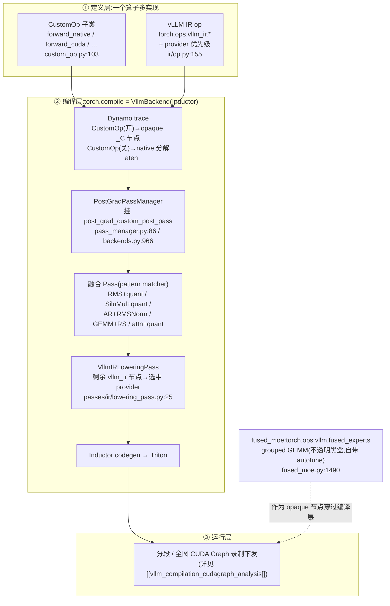

# vLLM 算子融合与 Triton Kernel —— CustomOp 派发、torch.compile 融合 Pass 与 fused_moe

> **代码基准**:vLLM `main` @ `485bbe1c6`(2026-06-21)· V1 引擎
> **最后更新**:2026-06-22 · **系列**:vLLM 推理引擎源码级分析(见 [[vllm/index]])
> **分析维度**:Overview → Quick Start → Deep Dive
>
> 本页回答:vLLM 的"算子层"如何把一个数学算子做成多份实现按平台/开关选择(**CustomOp / vLLM IR op**)、如何在 `torch.compile` 的 **post-grad 阶段**用 pattern matcher 把"逐元素+量化""通信+norm"等融成单 kernel(**融合 Pass**)、以及 MoE 为何要专门的 **fused_moe** grouped GEMM。它是 [[vllm_compilation_cudagraph_analysis]](图怎么捕获)只"点名"的融合 pass 的展开页;量化 GEMM 本身(`scaled_mm`/CUTLASS)见 [[vllm_quantization_analysis]],Triton **注意力**后端见 [[vllm_attention_backends_analysis]],本页只点名链过去,重心是 CustomOp 派发 / 融合 Pass / fused_moe。

---

## 一、Overview(总览)

vLLM 的"算子层"干三件事,层层向下:

1. **一个算子多实现,按平台/开关选**——`CustomOp` 基类给每个算子提供 `forward_native`(纯 PyTorch)/ `forward_cuda` / `forward_hip` / `forward_xpu` … 多份实现,实例化时由 `dispatch_forward` 锁定一份(`custom_op.py:174`)。新机制 **vLLM IR op**(`vllm/ir/`)进一步把算子做成一个稳定的 `torch.ops.vllm_ir.*` 不透明节点 + 一张"provider 优先级表",作为**融合的锚点**。
2. **编译期融合**——`torch.compile`(`CompilationMode.VLLM_COMPILE`)用 Inductor 后端;vLLM 把自己的一组 pattern-match 融合 pass 挂进 Inductor 的 `post_grad_custom_post_pass` 钩子(`backends.py:929` / `pass_manager.py:138`),在 **post-grad、functionalized 的 FX 图**上把"RMSNorm+量化""SiluMul+量化""AllReduce+RMSNorm"等子图替换成单个融合 C++/Triton kernel。
3. **fused_moe**——MoE 若逐专家做小 GEMM 会被 kernel 启动开销与碎片化拖死;vLLM 用一个 **grouped GEMM** Triton kernel(`fused_moe.py:292`)把所有专家的权重堆成 `(E,N,K)` 一张张量,靠 `moe_align_block_size` 把 token 按专家排序分块,一次 launch 算完;后端在 Triton / CUTLASS / DeepGEMM / FlashInfer 间派发,块大小由 autotune `configs/*.json` 选取。



**关键概念表**

| 概念 | 是什么 | 入口 file:line |
|------|--------|----------------|
| `CustomOp` | 算子多实现基类 + 平台派发 | `model_executor/custom_op.py:103` |
| `custom_ops` 配置 | 逐 op `+name`/`-name` 开关;Inductor 下默认 `none` | `config/compilation.py:476` |
| vLLM IR op | `torch.ops.vllm_ir.*` 不透明节点 + provider 优先级,融合锚点 | `ir/op.py:155` |
| `PostGradPassManager` | post-grad 融合 pass 的编排器 | `compilation/passes/pass_manager.py:86` |
| `PassConfig` | 逐融合开关(`fuse_norm_quant` 等) | `config/compilation.py:107` |
| 融合 Pass | pattern→replacement 子图替换 | `compilation/passes/fusion/*.py` |
| `fused_moe_kernel` | MoE grouped GEMM Triton kernel | `fused_moe/fused_moe.py:292` |
| MoE 后端 oracle | Triton/CUTLASS/DeepGEMM/FlashInfer 派发 | `fused_moe/oracle/unquantized.py:152` |

---

## 二、Quick Start(快速上手)

### 2.1 相关 flag

**优化级 `-O`(`OptimizationLevel`,默认 `-O2`,`config/vllm.py:80` / `:367`)** 是融合的总闸,它把各融合开关一次性铺好(`config/vllm.py:196-279`):

| 级别 | norm+quant / act+quant 融合 | allreduce+rms / attn+quant / SP+asyncTP | cudagraph_mode |
|------|------|------|------|
| `-O0` | 全关 | 全关 | `NONE` |
| `-O1` | 条件开(`enable_norm_fusion`/`enable_act_fusion`) | 关 | `PIECEWISE` |
| `-O2`(默认) | 条件开 | allreduce_rms / `IS_QUANTIZED` 时 attn / `IS_DENSE` 时 SP+asyncTP | `FULL_AND_PIECEWISE` |
| `-O3` | 同 O2 | 同 O2 | `FULL_AND_PIECEWISE` |

细粒度覆盖(`--compilation-config` JSON 或 `-O '{...}'`):

- **`custom_ops`**:`['none']` / `['all']` / `['none','+rms_norm']` / `['all','-silu_and_mul']`。**Inductor 后端默认 `none`**(让 Inductor 自己生成融合 Triton),非 Inductor 默认 `all`(`config/compilation.py:291` `default_on`)。
- **`pass_config.*`**:`fuse_norm_quant` / `fuse_act_quant` / `fuse_attn_quant` / `fuse_allreduce_rms` / `enable_sp` / `fuse_gemm_comms`(async TP)/ `enable_qk_norm_rope_fusion` / `fuse_rope_kvcache`(ROCm)等(`config/compilation.py:121-148`)。
- **`enforce_eager=True`**(`config/model.py:209`):`mode=NONE`,**关掉一切 torch.compile 融合与 CUDA Graph**,所有 CustomOp 走平台 eager 实现——调试基线。
- **`kernel_config.moe_backend`**(`config/kernel.py:173`):`auto`/`triton`/`deep_gemm`/`cutlass`/`flashinfer_trtllm`/`flashinfer_cutlass`/`aiter`/…,强制 MoE 专家后端。
- **环境变量**:`VLLM_TUNED_CONFIG_FOLDER`(自定义 MoE autotune JSON 目录)、`VLLM_MOE_USE_DEEP_GEMM`(默认 True,`envs.py:179`)、`VLLM_ROCM_USE_AITER*`(ROCm AITER 融合)、`VLLM_USE_TRITON_AWQ`、`VLLM_BATCH_INVARIANT`(确定性 Triton 算子,`envs.py:88`)、`VLLM_PATTERN_MATCH_DEBUG`(打印 Inductor pattern 匹配,`envs.py:248`)。

### 2.2 关键入口 file:line

| 你要看 | 去哪 |
|--------|------|
| CustomOp 派发逻辑 | `custom_op.py:174` `dispatch_forward` / `:271` `enabled` |
| RMSNorm / SiluAndMul 范例 | `layers/layernorm.py:36` / `layers/activation.py:117` |
| 融合 pass 编排(开关→pass) | `passes/pass_manager.py:138` `configure` |
| 融合 pass 挂进 Inductor | `compilation/backends.py:929` `configure_post_pass` |
| RMS+quant 融合 | `passes/fusion/rms_quant_fusion.py:618` |
| SiluMul+quant 融合 | `passes/fusion/act_quant_fusion.py:283` |
| fused_moe 层入口 | `fused_moe/layer.py:103` `FusedMoE` |
| MoE grouped GEMM kernel | `fused_moe/fused_moe.py:292` |
| MoE 后端选择 | `fused_moe/oracle/unquantized.py:152` |

### 2.3 如何看"某算子走了哪条实现"

1. **看 CustomOp 开关生效**:`set_current_vllm_config` 结束时打 `enabled custom ops` / `disabled custom ops`(`config/compilation.py:1263` `custom_op_log_check`);实例化时每个算子把自己记进 `enabled_custom_ops` / `disabled_custom_ops` Counter(`custom_op.py:187-189`)。
2. **看融合命中几个**:每个 pattern-match pass `__call__` 后把命中数累加进全局 `VllmPatternMatcherPass.match_table`(`vllm_inductor_pass.py:101`/`:332`),pass 管理器收尾打印 `fusion pass matches`(`:118`);设 `VLLM_PATTERN_MATCH_DEBUG=1` 看每条 pattern 是否匹配。
3. **看 IR op 选了哪个 provider**:`VllmIRLoweringPass` 把每个 `vllm_ir` 节点选中的 provider 记进 `selected_impls` 并 debug 打印 `Selected implementations: rms_norm=...`(`passes/ir/lowering_pass.py:55`/`:91`)。
4. **看融合后的图**:`debug_dump_path` 下每个 pass 前后 dump FX 图(`vllm_inductor_pass.py:71` `dump_graph`),配合 `tlparse`/`depyf` 直接读生成的 Triton。

---

## 三、Deep Dive(源码级深挖)

### 3.1 CustomOp 派发机制

`CustomOp`(`custom_op.py:103`)是 `nn.Module` 子类,核心是"**实例化时一次性锁定 forward**":`__init__` 调 `dispatch_forward` 把 `self._forward_method` 绑定到某个具体实现,`forward` 只是转发(`:130-136`)。

```python
# custom_op.py:174  dispatch_forward
enabled = self._enforce_enable or self.enabled()
if not enabled:
    # 关:返回 native(可能 torch.compile 以避免 eager 开销)
    return self.maybe_compile(self.forward_native, enable=compile_native)
if current_platform.is_rocm():  return self.forward_hip      # :196
elif current_platform.is_cpu(): return self.forward_cpu
elif current_platform.is_tpu(): return self.forward_tpu
elif current_platform.is_xpu(): return self.forward_xpu
elif current_platform.is_out_of_tree(): return self.forward_oot
else:                            return self.forward_cuda     # :207
```

几个要点:

- **逐 op 开关**:`enabled()`(`:271`)读 `compilation_config.custom_ops`,`+name` 强开、`-name` 强关,基线由 `default_on()`(`:291`)决定——**用 Inductor 时默认 `none`(全关)**。"关"不是不算,而是走 `forward_native` 纯 PyTorch 分解,**交给 Inductor 自动融合生成 Triton**;"开"则走 `torch.ops._C.*` 手写 CUDA kernel。
- **注册**:`@CustomOp.register("rms_norm")` 把类记入 `op_registry` 并赋 `name`(`:307`);`register_oot` 允许插件用同名类替换在树实现(`:331`,`__new__` 在 `op_registry_oot` 命中时换类,`:119-128`)。`PluggableLayer`(`:32`)是不做平台派发、只支持整层 OOT 替换的姊妹基类。
- **opaque op vs inline**:开启时 `forward_cuda` 调用的是注册进 PyTorch dispatcher 的 C++ 算子(如 `torch.ops._C.silu_and_mul`),它在 FX 图里是**不透明节点**——Inductor 不会越过它做融合,但**融合 pass 能 pattern-match 它**;关闭时 `forward_native` 被 Dynamo 追踪成 aten 算子串,Inductor 可自由融合。
- **`maybe_compile`**(`:209`):当一个 CustomOp 被藏在另一个 opaque torch op 内部(如 `fused_moe`、`unified_attention`)、模型级 `torch.compile` 看不到它时,可单独把其 `forward_native` 编译一遍以消除 eager 开销(`SiluAndMul(compile_native=True)`,`activation.py:130`)——注意这**不跨 op 融合**。

**范例对照**:

| 算子 | native | cuda(开启时) | file:line |
|------|--------|--------------|-----------|
| `RMSNorm` | `ir.ops.rms_norm` / `ir.ops.fused_add_rms_norm.maybe_inplace` | 同 native(经 IR op 派发),`VLLM_BATCH_INVARIANT` 时走确定性 kernel | `layernorm.py:74` / `:96` |
| `SiluAndMul` | `F.silu(x[:d])*x[d:]` | `torch.ops._C.silu_and_mul` | `activation.py:138` / `:143` |
| `UnquantizedFusedMoEMethod` | `moe_kernel.apply(...)`(模块化 grouped GEMM) | 同 native | `unquantized_fused_moe_method.py:313` / `:337` |

> 注意 `RMSNorm` 已不直接写 `_custom_ops`,而是统一走下面的 **IR op** 层——这是正在进行的迁移。

### 3.2 vLLM IR op:融合的稳定锚点

`vllm/ir/`(`op.py:155` `IrOp`)是比 CustomOp 更"编译友好"的一层。`@register_op` 装饰一个 native 实现(`ir/ops/layernorm.py:9` 的 `rms_norm`、`:39` 的 `fused_add_rms_norm`),它会:

1. 用 `torch.library` 在 `vllm_ir` 命名空间 `define` 一个 schema、注册 `CompositeExplicitAutograd` 实现与 fake(`op.py:218-226`),于是有了稳定的 `torch.ops.vllm_ir.rms_norm.default`;
2. 维护一张 provider 表 `impls`(native + 各平台/库实现,经 `register_impl` 加入)与一条优先级 `_priority_impls`(`set_default`,`:415`)。

调用 `ir.ops.rms_norm(...)` 时(`op.py:368` `__call__`):若 `_ENABLE_TORCH_WRAP`(vllm-compile 下默认开,对应 `compilation_config.ir_enable_torch_wrap`,`config/compilation.py:490`)则发出 **opaque 的 `torch.ops.vllm_ir.rms_norm` 节点**;否则直接 `dispatch` 到选中实现(`:327`,eager 省去 dispatch 开销)。

**为什么要这一层**:融合 pass 想匹配"RMSNorm 后接量化",但 RMSNorm 既可能是手写 CUDA 也可能是 native 分解,形态不稳定。IR op 让图里**永远是同一个 `vllm_ir.rms_norm` 锚点**,无论最终选哪个 provider。于是:

- 融合 pass 在 `vllm_ir.rms_norm` 节点上 pattern-match(见 3.3);
- 融合跑完后,`VllmIRLoweringPass`(`passes/ir/lowering_pass.py:25`)把**没被融掉的** `vllm_ir` 节点按优先级 `dispatch` 选 provider、`replace_by_example` 替换成该实现的子图(`:43-69`),再交给 Inductor lowering。这样"融合发生在 IR 层、剩余 IR op 才落到具体 kernel"。

> 截至 `485bbe1c6`,`vllm/ir/ops/` 只有 `layernorm.py`(rms_norm / fused_add_rms_norm)迁移到了 IR op;`silu_and_mul` 等仍在 3.1 的经典 CustomOp 路径。两套机制并存。

### 3.3 融合 Pass 系统

#### 3.3.1 怎么挂进 Inductor

`CompilationMode.VLLM_COMPILE` 下 `torch.compile` 的后端是 `VllmBackend`(`backends.py:800`)。它在 `__init__` 建一个 `PostGradPassManager`(`backends.py:846`,经平台 `get_pass_manager_cls`),并在编译前调 `configure_post_pass`(`backends.py:929`,由 `:1163` 触发):

```python
# backends.py:947  把(名义上 post-grad 的)pass 管理器配置好并挂进 inductor
self.pass_manager.configure(self.vllm_config)            # 按开关装 pass
...
self.inductor_config[self.pass_key] = self.pass_manager  # :966
# pass_key == "post_grad_custom_post_pass"(platforms/interface.py:177)
```

于是 Inductor 在 post-grad 阶段会回调这个 `PostGradPassManager.__call__`(`pass_manager.py:104`),它按固定顺序跑:① 构造期装入的融合 pass → ② `post_cleanup` → ③ `VllmIRLoweringPass`(IR 下沉)→ ④ clone 消除 → ⑤ 再 cleanup → ⑥ `fix_functionalization` 收尾(保证整张图 functionalized)。`PostGradPassManager.uuid()`(`:206`)把所有 pass 与 `pass_config` 的哈希并入 Inductor 编译缓存 key,改一个融合开关就会触发重编译。

`configure`(`pass_manager.py:138`)是**开关→pass 的总表**:

```python
if self.pass_config.enable_sp:        self.passes += [SequenceParallelismPass(config)]   # :146
    if self.pass_config.fuse_gemm_comms: self.passes += [AsyncTPPass(config)]            # :148
if self.pass_config.fuse_allreduce_rms:  self.passes += [AllReduceFusionPass(config)]    # :156
if self.pass_config.fuse_norm_quant:     self.passes += [RMSNormQuantFusionPass(config)] # :162
if self.pass_config.fuse_act_quant:      self.passes += [ActivationQuantFusionPass(config)] # :169
if self.pass_config.fuse_attn_quant:     self.passes += [AttnQuantFusionPass(config), MLAAttnQuantFusionPass(config)] # :189
if self.pass_config.enable_qk_norm_rope_fusion: self.passes += [..., QKNormRoPEFusionPass(config)] # :193
```

#### 3.3.2 pattern matcher 怎么融

每个融合 pass 继承 `VllmPatternMatcherPass`(`vllm_inductor_pass.py:92`)或更高层的 `VllmFusionPatternMatcherPass`(`:293`)。后者用 `VllmPatternReplacement`(`:194`)抽象一对 `pattern`(要找的子图)/`replacement`(替换成的子图)/`get_inputs`(示例张量用于 trace),`register` 时调 `torch._inductor.pattern_matcher.register_replacement` 把它编入 Inductor pattern matcher(`:305`)。`__call__` 时 `pm_pass.apply(graph)` 在全图找所有匹配并替换(`:329`)。

以 **RMSNorm+量化**(`rms_quant_fusion.py`)为例,`pattern` 是"`vllm_ir.rms_norm` → fp8 量化",`replacement` 是单个融合 C++ op(经 `auto_functionalized` 保持 functional 语义):

```python
# rms_quant_fusion.py:185  RMSNormStaticQuantPattern
def pattern(input, weight, scale):
    result_rms = vllm.ir.ops.rms_norm(input, weight, self.epsilon)   # 锚点
    return self.quant_matcher(result_rms, scale)[0]                  # +静态 fp8 量化
def replacement(input, weight, scale):
    at = auto_functionalized(self.FUSED_OP, ...)  # rms_norm_static_fp8_quant
    return at[1]
```

`FUSED_OPS` 表(`:118`)给出 (是否带 residual-add) × (量化方案) → 融合 C++ op 的映射:`rms_norm_static_fp8_quant` / `fused_add_rms_norm_static_fp8_quant` / `rms_norm_dynamic_per_token_quant` / `rms_norm_per_block_quant`。一个关键工程细节:**matcher 自适应 custom op 开关**——`MatcherCustomOp`(`matcher_utils.py:52`)在算子启用时匹配 opaque `_C` op、未启用时匹配 native 分解(`MatcherSiluAndMul.forward_custom/forward_native`,`:468`/`:478`),所以无论你 `custom_ops` 开没开,融合 pass 都能命中正确形态。

#### 3.3.3 融合模式表

| 模式(pattern) | 融成什么 | Pass 类 | 文件:行 | 开关 |
|------|------|------|------|------|
| RMSNorm / fused_add_rms_norm + fp8(静态/动态-per-token/per-block/nvfp4) | `rms_norm_*_fp8_quant` 单 kernel | `RMSNormQuantFusionPass` | `fusion/rms_quant_fusion.py:618` | `fuse_norm_quant` |
| SiluAndMul + fp8(静态/per-block/nvfp4) | `silu_and_mul_quant` / `_per_block_quant` / `_nvfp4_quant` | `ActivationQuantFusionPass` | `fusion/act_quant_fusion.py:283` | `fuse_act_quant` |
| AllReduce + RMSNorm(+量化) | flashinfer `flashinfer_trtllm_fused_allreduce_norm` 单 kernel | `AllReduceFusionPass` | `fusion/allreduce_rms_fusion.py:930` | `fuse_allreduce_rms` |
| AllReduce + RMSNorm → 序列并行三段 | `reduce_scatter`+RMSNorm(局部)+`all_gather` | `SequenceParallelismPass` | `fusion/sequence_parallelism.py:498` | `enable_sp` |
| GEMM+ReduceScatter / AllGather+GEMM(async TP,含 scaled/cutlass/flashinfer 变体) | `symm_mem.fused_matmul_reduce_scatter` / `fused_all_gather_matmul` | `AsyncTPPass` | `fusion/collective_fusion.py:900` | `fuse_gemm_comms` |
| Attention 输出 + fp8/nvfp4 量化 | 注意力 epilogue 内联量化 | `AttnQuantFusionPass` / `MLAAttnQuantFusionPass` | `fusion/attn_quant_fusion.py:362` / `mla_attn_quant_fusion.py:574` | `fuse_attn_quant` |
| Q/K RMSNorm + RoPE(+gate) | `fused_qk_norm_rope` 单 Triton kernel | `QKNormRoPEFusionPass` | `fusion/qk_norm_rope_fusion.py:188` | `enable_qk_norm_rope_fusion` |
| RoPE + KV cache 写入(ROCm/MLA) | AITER 融合 kernel | `RopeKVCacheFusionPass` / `MLARoPEKVCacheCatFusionPass` | `fusion/rope_kvcache_fusion.py:412` | `fuse_rope_kvcache(_cat_mla)` |

序列并行(SP)与 async TP 的算法侧:把 `all_reduce` 拆成 `reduce_scatter` + 局部计算 + `all_gather`,让 RMSNorm/GEMM 只在本 rank 的序列分片上做,通信与计算重叠(`sequence_parallelism.py:153` `FirstAllReduceRMSNormPattern`、`:186` `MiddleAllReduceRMSNormPattern`)。分布式语义见 [[vllm_distributed_inference_analysis]]。量化算子(`scaled_mm`/CUTLASS/nvfp4)本身见 [[vllm_quantization_analysis]],本表只讲"如何把量化与相邻算子融在一起"。

### 3.4 fused_moe:为什么 MoE 要专门的融合 kernel

**问题**:MoE 每个 token 只激活 top-k 个专家,若朴素实现就是对 E 个专家各做一次"被选中 token 子集"的小 GEMM——E 通常 64~256,小 GEMM 既无法打满 SM 又付 E 次 kernel 启动开销。

**grouped GEMM 思路**(`fused_moe.py:292` `fused_moe_kernel`):

1. 把全部专家权重堆成一张 `B:(E, N, K)` 张量;
2. `moe_align_block_size`(`moe_align_block_size.py:11`)把 `topk_ids` 展平、**按专家号排序**并把每个专家的 token 数 **pad 到 `BLOCK_SIZE_M` 的整数倍**,产出 `sorted_token_ids` / `expert_ids`(每个 M-block 一个专家号)/ `num_tokens_post_padded`;
3. Triton kernel 每个 program 算一块 `[BLOCK_SIZE_M, BLOCK_SIZE_N]` 输出,用 `expert_ids[pid]` 取对应专家的权重切片做 GEMM(`fused_moe.py:414`);`expert_id == -1`(不在本 EP rank 的专家)直接写零跳过(`:415-419`);pid 按 `GROUP_SIZE_M` 分组以提升 L2 复用(`:376-387`)。

一次 MoE 前向是**两段** grouped GEMM:`w13`(gate_up,列并行,形状 `(E, 2·I, H)`)→ 激活 SwiGLU → `w2`(down,行并行,`(E, H, I)`),权重在 `create_weights` 里就堆成 `(E, …)`(`unquantized_fused_moe_method.py:88`)。整段 `fused_experts` 被注册成 **opaque 的 `torch.ops.vllm.fused_experts`**(`fused_moe.py:1490`),对 `torch.compile` 是黑盒(不被 Inductor 拆/融),内部自带 autotune。

#### 3.4.1 模块化 kernel 与后端派发

`FusedMoE`(`layer.py:103`)已是**工厂函数**,返回一条 `Router → RoutedExperts → MoERunner` 流水线。专家计算的"量化方法"是个 CustomOp:`UnquantizedFusedMoEMethod(FusedMoEMethodBase, CustomOp)`(`unquantized_fused_moe_method.py:45`),其 `forward_cuda/native` 调 `moe_kernel.apply`(`:313`)。`moe_kernel` 是一个 **`FusedMoEModularKernel`**,按 `modular_kernel.py:46-79` 的设计拆成四段、可自由组合:

```
[Router] → [Quantize-Dispatch(Prepare)] → [Permute-Experts-Unpermute] → [Combine(Finalize)]
```

- `FusedMoEPrepareAndFinalize`(`modular_kernel.py:180`):量化 + 跨 DP/EP 分发(prepare)与最终归约(finalize),不同通信后端(all-gather、DeepEP HT/LL、mori、nixl…见 `prepare_finalize/`)在此切换;
- `FusedMoEExpertsModular`(`modular_kernel.py:762`):真正的 matmul+act+matmul,即上面的 grouped GEMM;
- 这样"通信机制 × 专家 kernel"可任意搭配而不必组合爆炸。

专家后端由 **oracle** 选(`oracle/unquantized.py:152` `select_unquantized_moe_backend`):枚举 `UnquantizedMoeBackend`(`:31`)= `FLASHINFER_TRTLLM / FLASHINFER_CUTLASS / AITER / TRITON / BATCHED_TRITON / CPU / XPU`,按平台与设备能力排优先级(`:43` `_get_priority_backends`,如 Hopper 上把 FlashInfer 排到 Triton 之后),`moe_backend` 配置可强制(`map_unquantized_backend`,`:136`);`backend_to_kernel_cls`(`:89`)映射到具体 experts 类:

| 后端 | experts 类 | 文件:行 |
|------|-----------|---------|
| Triton(默认通用) | `TritonExperts` | `experts/triton_moe.py:54` |
| Triton+DeepGEMM 回退 | `TritonOrDeepGemmExperts` | `experts/triton_deep_gemm_moe.py:24` |
| DeepGEMM(fp8 block) | `DeepGemmExperts` | `experts/deep_gemm_moe.py:124` |
| CUTLASS(fp8) | `CutlassExpertsFp8` | `experts/cutlass_moe.py:403` |
| Batched Triton(EP/DP) | `BatchedTritonExperts` | `experts/fused_batched_moe.py:717` |

#### 3.4.2 autotune config:`E=*,N=*,device_name=*.json` 的含义

Triton grouped GEMM 的块大小/warp/stage 对 shape 极敏感,vLLM 预置了 326 个调优文件在 `fused_moe/configs/`。命名 `get_config_file_name`(`fused_moe.py:999`)= `E={专家数},N={专家输出维},device_name={GPU},dtype={量化},block_shape={块量化}.json`。选取链:

```python
# fused_moe.py:1303  try_get_optimal_moe_config
configs = get_moe_configs(E, N, dtype, block_n, block_k)   # :1015,lru_cache,读 JSON
if configs:
    config = configs[min(configs.keys(), key=lambda x: abs(x - M))]  # 取最接近当前 batch M 的档
else:
    config = get_default_config(M, E, N, ...)              # :1203,启发式兜底
```

- JSON 内容是 `{M档: {BLOCK_SIZE_M/N/K, GROUP_SIZE_M, num_warps, num_stages}}`,运行时按当前 token 数 M 取最近档;
- `get_moe_configs`(`:1015`)优先读 `VLLM_TUNED_CONFIG_FOLDER` 下用户自调的 JSON,再读内置 `configs/`,都没有就 `get_default_config`(`:1203`,按 M/E/dtype 分支给经验块大小,并打印"性能可能次优"警告);
- `device_name` 由 `current_platform.get_device_name()` 取,H200 系列归一到 `NVIDIA_H200`(`:1004`)。

MoE 算法侧(路由、共享专家、grouped top-k)见 [[deepseek_moe_analysis]];EP/DP-attention 并行见 [[vllm_distributed_inference_analysis]]。

### 3.5 其它融合层算子

- **`fused_qk_norm_rope.py`**:`_fused_qk_rmsnorm_rope_gate_kernel`(`:16`,Triton)把 Qwen3.5 注意力的"split → GemmaRMSNorm → 部分 RoPE → gate 拷贝"塌成一次 launch;由 3.3 的 `QKNormRoPEFusionPass` 在图里识别并替换。
- **`fused_allreduce_gemma_rms_norm.py`**:用 flashinfer 把注意力输出的"all-reduce + GemmaRMSNorm(加残差并归一)"融成一次通信(TP>1、flashinfer/NVSwitch 可用时);与 `allreduce_rms_fusion` 注册的 `flashinfer_trtllm_fused_allreduce_norm` 共用底座。
- **`layers/fusion/quant_activation.py`**:`QuantizedActivation`(`:19`)+ `as_quantized_activation`(`:55`)是把"激活输出直接产出量化结果"暴露给融合的辅助壳(`expose_input_quant_key`,`:38`),供 act+quant 融合对接量化方法。
- **`layers/batch_invariant.py`**:一组**确定性 Triton 算子**(`matmul_persistent:132`、`bmm:209`、`log_softmax:404`、`mean_dim:498`、`rms_norm_batch_invariant:825`),`enable_batch_invariant_mode`(`:897`)用 `torch.library` 覆盖 `mm/bmm/addmm/softmax/mean` 等,保证不同 batch 切分下逐位一致;由 `VLLM_BATCH_INVARIANT` 开,RMSNorm 的 `forward_cuda` 会走它(`layernorm.py:101`)。这是"为复现性牺牲一点性能"的旁路,不是吞吐优化。

### 3.6 Triton 全景清单(为什么用 Triton)

vLLM 大量用 Triton 而非纯手写 CUDA,原因有二:**可移植**(同一 kernel 在 NV/AMD/XPU 经 Triton 后端落地)+ **autotune**(块大小可调、配合上面的 config 选优)。本页相关的 Triton 落点:

| 位置 | 内容 | 备注 |
|------|------|------|
| `fused_moe/fused_moe.py:292` | MoE grouped GEMM 主 kernel | 本页 3.4 |
| `fused_moe/configs/*.json` | 326 个 autotune 档 | 本页 3.4.2 |
| `model_executor/layers/fused_qk_norm_rope.py` | QK-Norm+RoPE 融合 kernel | 本页 3.5 |
| `model_executor/layers/activation.py:26` | `_swiglustep_and_mul_kernel`(SwiGLU clamp) | CustomOp 内联 Triton |
| `model_executor/layers/batch_invariant.py` | 确定性 matmul/bmm/softmax/rmsnorm | 本页 3.5 |
| `v1/sample/ops/topk_topp_triton.py` | 采样 top-k/top-p | 采样路径 |
| `lora/ops/triton_ops/` | LoRA shrink/expand + fused_moe_lora | LoRA 路径 |
| `kernels/triton/qkv_padded_fp8_quant.py` | QKV padded fp8 量化 | 量化路径 |
| `triton_utils/`(`importing.py` 等) | 惰性导入守卫、JIT 监控、配置强制 | Triton 基础设施 |
| `v1/attention/ops/triton_*.py`、`backends/triton_attn.py` | **Triton 注意力**(prefill/decode/MLA/merge states) | **详见 [[vllm_attention_backends_analysis]],本页不展开** |

### 3.7 协同:谁拼大、谁录图、量化怎么融

把四件事串起来,一条算子从定义到下发经过:

1. **拼大(算子层)**:CustomOp/IR op 决定每个算子用手写 kernel 还是 native 分解;融合 Pass 在 post-grad FX 图上把相邻算子(norm+quant、act+quant、AR+norm、GEMM+comm)pattern-match 成单 kernel;fused_moe 把 E 个小 GEMM 拼成一个 grouped GEMM。**目标:减少 kernel 数与中间张量的内存往返。**
2. **录图(运行层)**:融合后的图交 Inductor codegen 出 Triton,再由分段/全图 **CUDA Graph** 录制下发,消除 decode 的 CPU 启动开销——录图机制与 `splitting_ops`/`cudagraph_mode` 见 [[vllm_compilation_cudagraph_analysis]]。注意:注意力、`fused_experts` 等 opaque op 是 CUDA Graph 切分点的来源之一。
3. **量化怎么融**:量化 GEMM 的 kernel(`scaled_mm`/CUTLASS/Marlin/nvfp4)与加载期 repack 属 [[vllm_quantization_analysis]];本页的 norm+quant / act+quant / attn+quant 融合 pass 负责把**量化算子与它前面的逐元素算子拼进同一 kernel**,省掉一次"写 bf16 中间结果再读回量化"的内存往返。两页是"kernel 实现"与"kernel 融合"的分工。

一句话:**算子层把小算子拼成大 kernel,编译&图捕获层把大 kernel 录成可 replay 的图,量化层提供低精度 kernel——三者在 `VllmBackend` 的一次编译里依次咬合。**

---

## Related Pages
- [[vllm_ir_and_fusion_passes_analysis]] —— **机制深挖伴篇**(vllm_ir IR 层注册 / Pass 流水线如何挂进 Inductor / RMSNorm+quant 融合全程走查)
- [[vllm_compilation_cudagraph_analysis]] · [[vllm_quantization_analysis]] · [[vllm_attention_backends_analysis]] · [[vllm_model_library_analysis]] · [[vllm_feature_optimizations_overview]]
- [[vllm/index]] · [[../index]]

## Cross-Domain Links
- [[megatron_fusion_operators_analysis]] —— Megatron-LM 融合算子全目录(训练侧直接对照)
- [[torchtitan_compute_memory_optimizations_analysis]] —— torchtitan 融合算子(FusedSwiGLU/grouped GEMM)
- [[32_post_grad_passes_guide]] · [[02_compile_stack/04_inductor/index]] —— Inductor pattern matcher / post-grad pass
- [[gpu_kernel_guide]] —— Triton / Tensor Core kernel 链路
- [[deepseek_moe_analysis]] —— MoE 结构(fused_moe 的算法侧)
