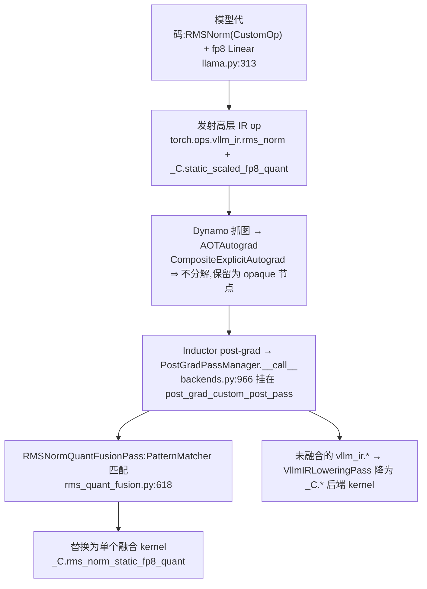

# vLLM 图模式算子融合机制 —— vllm_ir IR 层、Pass 流水线与 RMSNorm+quant 全程走查

> **代码基准**:vLLM `main` @ `485bbe1c6`(2026-06-21)· V1 引擎
> **最后更新**:2026-06-22 · **系列**:vLLM 推理引擎源码级分析(见 [[vllm/index]])
> **分析维度**:Overview → Quick Start → Deep Dive
>
> 本页是 [[vllm_fused_ops_and_kernels_analysis]] 的**机制深挖伴篇**,把"图模式下算子怎么被融合"讲到底:① vLLM 自己的算子 IR 层 `vllm_ir`(`torch.library` 注册、为何不挂 `aten`、如何被 Dynamo 保留);② 融合 Pass 流水线 `PostGradPassManager`;③ 它如何挂进 Inductor 生效;④ 以 **RMSNorm + FP8 量化** 为例,从用户模型代码 → eager 双 kernel → 融合 kernel 的完整替换走查。与 [[vllm_compilation_cudagraph_analysis]](图捕获/CUDA Graph)分工:本页讲"改写计算图、合并算子",那页讲"把下发录成 replay"。

---

## 一、Overview(总览)

### 1.1 定位:三层命名空间,一条改写链

vLLM 在图模式下的"算子融合"本质是 **Inductor post-grad 阶段的自定义图改写**:把模型里相邻的几个算子节点,用 PatternMatcher 替换成一个预先手写好的融合 kernel。要看懂它,先分清 vLLM 的三层算子命名空间——**自定义算子都不在 `aten` 里**:

| 命名空间 | 谁 | 例子 | 角色 |
|---------|-----|------|------|
| `aten` | PyTorch 内置 | `aten.mul` | vLLM 自定义算子**不**放这里 |
| `_C` | vLLM C++/CUDA 扩展 | `_C.rms_norm`、`_C.static_scaled_fp8_quant`、`_C.rms_norm_static_fp8_quant` | **底层真 kernel**(`csrc/.../torch_bindings.cpp` 注册) |
| `vllm_ir` | vLLM IR 层 | `vllm_ir.rms_norm`、`vllm_ir.fused_add_rms_norm` | **高层 IR op**:可被融合匹配、可选后端、可 lowering(`vllm/ir/op.py`) |

### 1.2 端到端流程



一句话:**模型用 `vllm_ir` 高层 op 表达 → 因为注册成"不分解"的自定义算子,它以完整节点活到 Inductor post-grad → vLLM 自己的 Pass 在这层做模式匹配,能融的换成 `_C` 融合 kernel,融不掉的再 lower 成 `_C` 独立 kernel**。

---

## 二、Quick Start(快速上手)

### 2.1 开关(`-O` 档 + PassConfig)

融合 pass 是 **VLLM_COMPILE(`-O2`/`-O3` 默认)** 下才跑;`-O0` 一条不跑(纯 eager)。逐项开关在 `PassConfig`(`vllm/config/compilation.py:107`),默认值按优化档解析(`vllm/config/vllm.py:196-279`):

```bash
-cc '{"pass_config":{"fuse_norm_quant":true,"fuse_act_quant":true}}'   # 显式控制单个融合
--enforce-eager                                                         # 关编译 → 所有 pass 不跑
```

### 2.2 怎么"看见"它生效

| 手段 | 作用 |
|------|------|
| `VLLM_PATTERN_MATCH_DEBUG` | 打开 Inductor pattern-match 调试日志(`pass_manager.py:68-83`) |
| `compile_debug_dump_path` | dump 出每个 pass 的 patterns 与前/后 FX 图(`vllm_inductor_pass.py:122` `dump_patterns` / `:71` `dump_graph`) |
| `match_table` 日志 | 每个 pass 命中多少次,`VllmPatternMatcherPass.log_match_summary`(`vllm_inductor_pass.py:117`) |
| TORCH_TRACE / tlparse | `vllm_compilation_config` artifact 列出实际启用的 pass(`backends.py:968`) |

### 2.3 从哪里开始读源码

- IR op 注册:`vllm/ir/op.py:155`(`IrOp`)、`:21`(`Library("vllm_ir")`)
- Pass 编排:`vllm/compilation/passes/pass_manager.py:138`(`configure`)、`:105`(`__call__`)
- 一条规则:`vllm/compilation/passes/fusion/rms_quant_fusion.py:183`(`register`)、`:618`(`RMSNormQuantFusionPass`)
- 生效挂载点:`vllm/compilation/backends.py:929`(`configure_post_pass`)、`:966`

---

## 三、Deep Dive(源码级深挖)

### 3.1 vLLM IR 算子层(`vllm_ir`):torch.library 注册 + 为何不挂 aten

#### 3.1.1 怎么注册

每个 IR op 由 `IrOp`(`vllm/ir/op.py:155`)管理。注册的核心三步在 `IrOp.__init__`(`:217-226`),用的是 PyTorch 标准的 `torch.library.Library`,但开在**自建命名空间** `vllm_ir`(`:21`):

```python
vllm_ir_torch_lib = Library("vllm_ir", "FRAGMENT")          # op.py:21  自建命名空间,非 aten
...
lib.define(self.name + self._schema_str)                    # ① 声明 schema(与 aten 同机制)
# CompositeExplicitAutograd is not decomposed
# by ATen IR normalization in AOTAutograd                   # ← 关键注释(op.py:220-221)
lib.impl(self.name, self._inner_call,
         dispatch_key="CompositeExplicitAutograd")          # ② 真实实现(不被分解)
lib._register_fake(self.name, self._fake_call)              # ③ fake/meta 实现(tracing 形状推导)
self.torch_op = getattr(torch.ops.vllm_ir, name).default    # → torch.ops.vllm_ir.rms_norm.default
```

- `ir.ops.rms_norm` 定义在 `vllm/ir/ops/layernorm.py`(经 `@register_op` 装饰,`op.py:106`),最终对应 `torch.ops.vllm_ir.rms_norm`。
- `__call__`(`op.py:368-372`):`_ENABLE_TORCH_WRAP=True`(编译路径)时走 `self.torch_op(...)`,即发射可被 trace 的 `vllm_ir` 节点;`enable_torch_wrap(False)` 则绕过 torch op 层直接跑实现(纯 eager 省 dispatch 开销)。

#### 3.1.2 为什么是 `CompositeExplicitAutograd` + fake(这才让 Dynamo 能匹配)

两件事决定了"能被 Dynamo 发现 → 活到 pattern 匹配":

1. **`CompositeExplicitAutograd` ⇒ 不分解**。PyTorch 里 `CompositeImplicitAutograd` 算子在 AOTAutograd 会被**拆成一堆 aten 小算子**(节点消失);`CompositeExplicitAutograd` **不拆**,以单个 opaque 节点保留。vLLM 故意选后者(`op.py:220-222` 注释),所以 `vllm_ir.rms_norm` 一路活到 Inductor post-grad 图,fusion pass 才匹配得到(`rms_quant_fusion.py:41` `_RMS_NORM_OP = torch.ops.vllm_ir.rms_norm.default`)。**反例**:若它被注册成会分解的算子,RMSNorm 就碎成 `pow/mean/rsqrt/mul...`,pattern 无从匹配。
2. **fake 实现**(`_register_fake`)。Dynamo/AOTAutograd 用 FakeTensor 推导形状/dtype 时不跑真 kernel,而调 fake——这是自定义算子"可编译"的必要条件。

#### 3.1.3 provider / 优先级 / lowering(为何要多一层 IR)

`IrOp` 不止是 op 壳,它挂多个实现 `impls`(`op.py:190`):`native`(纯 PyTorch 参考,`:203`)+ 各后端经 `register_impl` 注册(`:244`)。运行期由 `set_default(priority)` / `set_priority` 选(`:415`/`:428`),`dispatch()` 在热路径按优先级挑(`:327`)。编译期则把 `vllm_ir.*` 节点留给 **`VllmIRLoweringPass`** 在融合之后 lower 成具体 `_C.*` kernel。多这一层的意义:**把"模型表达的算子"和"实际跑的 kernel"解耦**——给融合一个稳定单节点、给后端选择一个统一入口、且 fusion 跑在未 lower 的高层形态上(简单 robust)。

#### 3.1.4 为什么不直接注册到 `aten`

| 原因 | 说明 |
|------|------|
| **命名空间归属/冲突** | `aten` 由 PyTorch 拥有,out-of-tree 加 op 不被支持;且会撞车——PyTorch 自己现已有 `torch.ops.aten.rms_norm`,vLLM 再定义就 schema 冲突或被 PyTorch 那份接管 |
| **语义控制** | 要的是"不分解 / 无 autograd / 推理专用"的 opaque 节点;`aten` 算子背着 decomp 表、求导公式、meta、functionalization、全设备覆盖等一整套期望,放进去反而会被 PyTorch 体系处理掉 |
| **所有权** | `vllm_ir` 是 vLLM **自己的 IR**:schema/fake/provider 优先级/lowering/编译缓存 uuid/数值容差/测试 monkeypatch(`op.py:21` 注释)都要自己掌控 |
| **可识别可枚举** | 融合 pattern、match_table、pattern dump 全 key 在 `torch.ops.vllm_ir.*`,干净可遍历;混进 aten 就分不清谁是谁 |

> [!note] `CustomOp`(nn.Module)≠ `IrOp`(算子)
> 别混两个"custom op":`CustomOp`(`model_executor/custom_op.py`)是 **nn.Module 层** 封装(`RMSNorm` 类,管 `forward_native/forward_cuda` 派发,`layernorm.py:36`);`IrOp`(`vllm/ir/op.py`)是 **算子层** 封装(`torch.library` 注册的 `vllm_ir.rms_norm`)。关系:`RMSNorm.forward_native` **调用** `ir.ops.rms_norm`(`layernorm.py:81`)→ 发射 `vllm_ir` 节点。

### 3.2 Pass 流水线:`PostGradPassManager`

`PostGradPassManager`(`pass_manager.py:86`)是个 `CustomGraphPass`。`configure()`(`:138`)按 `PassConfig` 开关拼出 pass 列表:

| Pass | 作用 | 开关 | 平台 |
|------|------|------|------|
| `NoOpEliminationPass` | 消 reshape/no-op(**fp8 融合前提**) | `eliminate_noops`(默认 True) | 全平台 |
| `SequenceParallelismPass` | AllReduce 拆 SP | `enable_sp` | cuda/xpu,需 TP>1 |
| `AsyncTPPass` | GEMM+通信重叠 | `fuse_gemm_comms` | cuda |
| `AllReduceFusionPass` | AllReduce+RMSNorm 融合 | `fuse_allreduce_rms` | cuda |
| **`RMSNormQuantFusionPass`** | **RMSNorm+量化融合(§3.4)** | `fuse_norm_quant` | cuda/xpu |
| `ActivationQuantFusionPass` | SiluMul+量化融合 | `fuse_act_quant` | cuda/xpu |
| `RopeKVCacheFusionPass` | RoPE+写 KV 融合 | `fuse_rope_kvcache` | cuda |
| `AttnQuantFusionPass` / `MLAAttnQuantFusionPass` | 注意力输出+量化融合 | `fuse_attn_quant` | cuda |
| `QKNormRoPEFusionPass` | Q/K RMSNorm+RoPE 融合 | `enable_qk_norm_rope_fusion` | cuda |

`__call__`(`:105`)的执行顺序写死(`:109-134`):**先依次跑上面的 pass → `PostCleanupPass` → `VllmIRLoweringPass`(IR 下沉)→ `UnsafeCloneEliminationPass` → `PostCleanupPass` → `FixFunctionalizationPass`(最后还原 in-place)**。融合在 lowering **之前**——这正是"能融先融、融不掉再落地成独立 kernel"的保证。

默认按 `-O` 档(`config/vllm.py:196-279`):`-O0` 全关、`-O1` 开 norm/act+quant(PIECEWISE)、`-O2`/`-O3` 再加 attn_quant(量化模型 `IS_QUANTIZED`)/ SP+async-TP(稠密 `IS_DENSE`)/ rope 系列(FULL_AND_PIECEWISE)。

### 3.3 如何挂进 Inductor 生效

`VllmBackend`(torch.compile 后端)编译时调 `configure_post_pass()`(`backends.py:929`):

```python
self.pass_manager.configure(self.vllm_config)            # backends.py:948  按 -O 档拼 pass 列表
...
self.inductor_config[self.pass_key] = self.pass_manager   # :966  self.pass_key == "post_grad_custom_post_pass"
```

于是 Inductor 在 post-grad 阶段(图已 functionalize)回调 `PostGradPassManager.__call__(graph)`。每个融合 pass 自己是个 `VllmPatternMatcherPass`(`vllm_inductor_pass.py:92`),其 `__call__` 就是 `self.pm_pass.apply(graph)`(`:330-331`);pattern 在 pass 的 `__init__` 里经 `pm.register_replacement(...)` 注册(`:306-313`)。`PostGradPassManager.uuid()`(`pass_manager.py:206`)把所有 pass 的 hash + `pass_config` 纳入 Inductor 编译缓存 key——改配置才重编。

### 3.4 一条规则的完整走查:RMSNorm + FP8 静态量化

#### 3.4.1 用户模型代码(零融合代码)

`LlamaDecoderLayer.forward`(`llama.py:313`)就是普通的 norm→attn:

```python
def forward(self, positions, hidden_states, residual):
    if residual is None:
        residual = hidden_states
        hidden_states = self.input_layernorm(hidden_states)          # RMSNorm(CustomOp)
    else:
        hidden_states, residual = self.input_layernorm(hidden_states, residual)
    hidden_states = self.self_attn(positions=positions, hidden_states=hidden_states)  # qkv_proj 是 fp8 Linear
    ...
```

- `input_layernorm` 是 `RMSNorm`(`llama.py:308`),`forward` 发射 `vllm_ir.rms_norm`(§3.1)。
- `qkv_proj` 是 fp8 Linear,其 `apply`(`w8a8_utils.py` 的 `apply_fp8_linear`)对输入做 static per-tensor fp8 量化,发射 `_C.static_scaled_fp8_quant`。
- `LlamaModel` 挂 `@support_torch_compile`(`llama.py:337`)——编译触发点。
- **用户没写任何融合代码**,RMSNorm 输出紧接着下一层的量化,在图里就是相邻的可融合对。

#### 3.4.2 规则本体(pattern → replacement → register)

`RMSNormStaticQuantPattern.register`(`rms_quant_fusion.py:183-223`):

```python
def pattern(input, weight, scale):                                   # 要匹配的子图(两个 op)
    result_rms = vllm.ir.ops.rms_norm(input, weight, self.epsilon)   # vllm_ir.rms_norm
    return self.quant_matcher(result_rms, scale)[0]                  # static_scaled_fp8_quant

def replacement(input, weight, scale):                               # 替换成的子图(一个 op)
    result = torch.empty(input.shape, device=input.device, dtype=self.quant_dtype)
    at = auto_functionalized(self.FUSED_OP,                          # = _C.rms_norm_static_fp8_quant
            result=result, input=input, weight=weight, scale=scale, epsilon=self.epsilon)
    return at[1]

pm.register_replacement(pattern, replacement, inputs, pm.fwd_only, pm_pass,
                        extra_check=_rms_input_weight_dtype_match)   # 守卫:input/weight 同 dtype 才融
```

- 融合目标由 `FUSED_OPS` 表决定(`:118-143`):`(static fp8, 无 residual) → _C.rms_norm_static_fp8_quant`、`(…, 带 residual) → _C.fused_add_rms_norm_static_fp8_quant` 等。
- `RMSNormQuantFusionPass.__init__`(`:618-649`)对 `epsilon×{static/dynamic/per-block}×{带/不带 add}` 批量注册十几条 pattern。

#### 3.4.3 eager(`-O0`)vs 融合(`-O2`)的 kernel

**eager**:两个独立 CUDA kernel,中间整块 bf16 激活走一趟 HBM:

```
① rms_norm(hidden[bf16]) ─► tmp[bf16]            # 写整块 bf16 到 HBM
② static_scaled_fp8_quant(tmp[bf16], scale) ─► x_fp8   # 从 HBM 读回,×1/scale,cast fp8
```

**融合后**:单个手写 CUDA kernel `_C.rms_norm_static_fp8_quant`(`csrc/libtorch_stable/layernorm_quant_kernels.cu:23`),一个 block 处理一个 token,在寄存器/shared 里算完 variance→归一化→×weight→×scale_inv→cast fp8,**只写 fp8 out,中间 bf16 不落 HBM**(`:151` `out = scaled_fp8_conversion(convert(x*s_variance*wf), scale_inv)`)。算子契约/注册见 `torch_bindings.cpp:382`(schema)/`:679`(impl)。

> ⚠️ 这个融合 kernel **不是 Inductor 现场生成的 Triton**,而是 vLLM **预先手写的 CUDA kernel**;pass 干的事是"把图里两个 op 节点换成这一个已有的 op",不是 codegen 新 kernel。

#### 3.4.4 替换链路(前后 FX 图)

```
# 匹配前(post-grad 图)
%rms      = vllm_ir.rms_norm(%hidden, %w, eps)            # RMSNorm CustomOp 发射(opaque)
%x_fp8,%s = static_scaled_fp8_quant(%rms, %scale)         # fp8 Linear 发射(opaque)
%out      = cutlass_scaled_mm(%x_fp8, %w_fp8, %scale, ...)

# NoOpEliminationPass 清 reshape → RMSNormQuantFusionPass.apply 命中 → 替换后
%x_fp8 = _C.rms_norm_static_fp8_quant(%hidden, %w, %scale, eps)   # 一个 op!
%out   = cutlass_scaled_mm(%x_fp8, %w_fp8, %scale, ...)
```

未被融合的 `vllm_ir.rms_norm` 才由 `VllmIRLoweringPass` 降为 `_C.rms_norm`;`eliminate_noops` 默认 True 且关掉会告警(`config/compilation.py:244-249`),因为量化前后的 reshape 不消除会打断 pattern。

---

## 3.5 Pass 全家福 与 三大融合维度（当前基线 `97a98006b0` 复核补全）

> [!note] 基线更新
> 本页 §1–§3.4 的 IR 层 / PassManager / RMSNorm+FP8 走查在 `97a98006b0` 上仍成立（仅 `backends.py` 行号漂移到 `configure_post_pass@934/953/971`）。本节补上此前未系统记录的**完整 pass 目录、挂载机制与三大融合维度**——回答「vLLM 到底有没有大量 pass」：**有，约 23 个**。

**总量**：`compilation/passes/fusion/` 下 **16 个融合 pass 类**（11 条 CUDA/通用 + 5 个 ROCm/AITER），外加 IR/utility 支撑 pass 6 个（`NoOpElimination`、`SplitCoalescing`、`ScatterSplitReplacement`、`PostCleanup`、`VllmIRLowering`、`UnsafeCloneElimination`、`FixFunctionalization`）+ 1 个 **pre-grad** 的 `VllmIRInplaceFunctionalization`。

**建在 torch 的 `pattern_matcher` 上**：所有融合 pass 都用 `torch._inductor.pattern_matcher`（`PatternMatcherPass`/`register_replacement`/`fx_to_pattern`），vLLM 只在外面包 `VllmInductorPass` 家族做**计时 / uuid（源码 hash）/ match 计数 / pattern dump**（`vllm_inductor_pass.py:334` `self.matched_count = self.pm_pass.apply(graph)`）。手工 `graph.find_nodes` 遍历只出现在**图归一化的 utility pass**（noop/scatter-split/split-coalescing/fix-functionalization），不用于融合本身。上游引擎机制见 [[pattern_expression_and_matcher_engine_analysis]]。

**挂载机制（现有页 §3.3 的补全）**：`backends.py:configure_post_pass` 同时挂**两个钩子**——pre-grad 的 `inductor_config["pre_grad_custom_pass"] = VllmIRInplaceFunctionalizationPass(...)`（`:939`，并加进 `_cache_config_ignore_prefix`）+ post-grad 的 `inductor_config[self.pass_key] = self.pass_manager`（`:971`，`pass_key` = `"post_grad_custom_post_pass"`，`platforms/interface.py:177-179`）。**运行期尺寸门控** `is_applicable_for_range(compile_range)` 让重通信/KV 类融合只在小 batch decode 的 token 区间触发。pattern 注册有**三种形态**：①现代 `VllmPatternReplacement` ABC + `VllmFusionPatternMatcherPass.register()`；②直接 `pm.register_replacement` + 手写 pattern 类；③`fx_to_pattern(ignore_types=(int,SymInt))` 预构 `search_fn_pattern` 处理动态 shape。外加 `MatcherCustomOp.forward = custom if enabled else native` 让 pattern 对 `custom_ops` 开关鲁棒。

**三大融合维度（上游 Inductor 没有的）**——这是 vLLM pass 的价值所在，全部**朝厂商/手写 kernel 融合**（非 codegen Triton）：

| 维度 | 代表 pass | 融合成什么（vendor kernel） |
|---|---|---|
| **集合通信** | `AllReduceFusionPass`、`SequenceParallelismPass`、`AsyncTPPass` | `flashinfer_trtllm_fused_allreduce_norm`；`reduce_scatter`+本地 norm+`all_gather`；`symm_mem.fused_matmul_reduce_scatter` / `fused_all_gather_matmul`（GEMM↔通信重叠） |
| **量化** | `RMSNormQuantFusionPass`、`ActivationQuantFusionPass`、`AttnQuantFusionPass` | `_C.rms_norm_static_fp8_quant`、`silu_and_mul_nvfp4_quant`；attn 系列**重写 `unified_attention_with_output`** 让 attention 直接吐量化结果（省一趟 bf16 HBM 往返） |
| **KV-cache 写入** | `QkNormRopeKvCacheFusionPass`、`RopeKVCacheFusionPass`、`MLARoPEKVCacheCatFusionPass` | `fused_qk_norm_rope_and_unified_kv_cache_update`（AITER）、`fused_rope_and_unified_kv_cache_update`（RoPE+cache 写一核） |
| ROCm/AITER 家族（5） | `RocmAiter{AllReduce,RMSNormQuant,SiluMulFp8GroupQuant,TritonAddRMSNormPad}`、`MLADualRMSNorm` | 各自 `rocm_aiter_ops.get_*_op()` 的 AITER HIP kernel，门控 `rocm_aiter_ops.is_enabled()` |

方法论层面（为什么推理框架比 upstream 多出这三维）见 [[graph_pass_pipeline_ordering_and_fixpoint_analysis]] §14；与「fork 骨架却不写融合」的 SGLang 反例对照见 [[sglang_compilation_passes_analysis]]。

---

## Related Pages
- [[pattern_expression_and_matcher_engine_analysis]] —— 上游 Inductor PatternMatcher 机制(vLLM 复用的引擎基座)
- [[graph_pass_pipeline_ordering_and_fixpoint_analysis]] —— 四家(upstream/npu/vLLM/sglang)pass 开发方法论归纳(§14)
- [[sglang_compilation_passes_analysis]] —— SGLang:fork vLLM 骨架却抽空融合的反例
- [[vllm_fused_ops_and_kernels_analysis]] —— 本页的"目录"母篇(CustomOp 派发 / 融合 Pass 全表 / fused_moe / Triton 全景)
- [[vllm_compilation_cudagraph_analysis]] —— torch.compile→Inductor 链路与分段 CUDA Graph(图捕获侧)
- [[vllm_quantization_analysis]] · [[vllm_attention_backends_analysis]] · [[vllm_model_library_analysis]]
- [[vllm/index]] · [[../index]]

## Cross-Domain Links
- [[post_grad_passes_guide]] —— Inductor pattern matcher / post-grad pass 原生机制
- [[torch_compile_architecture]] · [[02_compile_stack/01_dynamo/index]] —— Dynamo 抓图 / AOTAutograd 分解与否
- [[megatron_fusion_operators_analysis]] · [[torchtitan_compute_memory_optimizations_analysis]] —— 训练侧融合算子对照
- [[npu_inductor_splittiling_backend_analysis]] —— Inductor 自定义后端的 IR lowering 对照(NPU)
