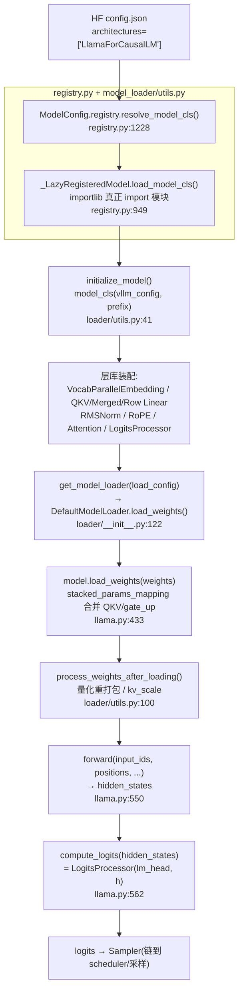
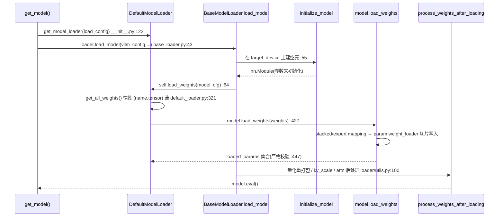

# vLLM 模型库 —— 模型注册、定义约定、权重加载与层库

> **代码基准**:vLLM `main` @ `485bbe1c6`(2026-06-21)· V1 引擎
> **最后更新**:2026-06-22 · **系列**:vLLM 推理引擎源码级分析(见 [[vllm/index]])
> **分析维度**:Overview → Quick Start → Deep Dive
>
> 本页回答:一个 HuggingFace checkpoint 如何被 vLLM 识别成某个 `*ForCausalLM` 类、权重如何从磁盘流式映射进 vLLM 参数、以及 vLLM 的层库如何把张量并行(TP)切分**内建**进每一个 `Linear`。
> 分工:KV cache 写入与 attention kernel 细节链到 [[vllm_attention_backends_analysis]];量化感知加载的算子侧链到 [[vllm_quantization_analysis]];TP/PP/EP 的**集合通信与进程组**整体留给 [[vllm_distributed_inference_analysis]],本页只讲"层内权重怎么切、前向插哪个通信原语"。

---

## 一、Overview(总览)

vLLM 的「模型库」(`vllm/model_executor/`)是连接 **HF 权重** 与 **推理执行** 的中间层,由互相解耦的**四件套**构成:

| 件套 | 职责 | 主要目录 |
|------|------|----------|
| **模型定义** | 用 vLLM 的 TP 感知层重写 `*ForCausalLM`,约定统一的 `forward` / `compute_logits` / `load_weights` 签名 | `model_executor/models/*.py`(200+ 个) |
| **模型注册表** | 把 HF `config.architectures` 字符串懒映射到实现类 | `model_executor/models/registry.py` |
| **权重加载** | 按 load format 选 loader,流式读盘 → 调用模型自带的 `load_weights` | `model_executor/model_loader/` |
| **层库** | TP 感知的 `Linear` / `Embedding` / `LogitsProcessor` / `RMSNorm` / RoPE 等可复用积木 | `model_executor/layers/` |

四件套的关键约定:**模型实现只描述"结构"和"HF 权重名 → vLLM 参数名"的映射,所有 TP 切分逻辑下沉到层库**。因此 200+ 个模型文件中几乎看不到 `tp_rank` / `all_reduce`——它们藏在 `ColumnParallelLinear` / `RowParallelLinear` 内部。

### 从权重到 logits 的一次组装



### 关键概念表

| 概念 | 一句话 | 锚点 |
|------|--------|------|
| `VllmModel` Protocol | 所有模型必须满足:`__init__(vllm_config, prefix)` + `embed_input_ids` + `forward(input_ids, positions)` | `interfaces_base.py:47` |
| `_LazyRegisteredModel` | 架构名 → `(module, class)` 字符串,首次用到才 `importlib` | `registry.py:835` |
| `packed_modules_mapping` | 类属性:声明 `qkv_proj=[q,k,v]`、`gate_up_proj=[gate,up]` 的合并关系(供 LoRA / 量化用) | `llama.py:489` |
| `stacked_params_mapping` | `load_weights` 内的列表:把 HF 的 `q_proj/k_proj/v_proj` 写进同一个 `qkv_proj` 参数 | `llama.py:434` |
| `ColumnParallelLinear` | 权重按**输出维**切,前向可选 all-gather(`Y=XA_i`) | `linear.py:394` |
| `RowParallelLinear` | 权重按**输入维**切,前向 all-reduce(`Y=ΣX_iA_i`) | `linear.py:1493` |
| `QKVParallelLinear` | 按 attention head 切;KV head 不足 TP 时复制 | `linear.py:914` |
| `default_loader` | `load_format=auto/hf/safetensors` 的默认加载器,流式 yield `(name, tensor)` | `default_loader.py:43` |
| `forward_context` | V1 中模型 `forward` 不再传 `kv_caches`/`attn_metadata`,Attention 层从全局上下文取 | 见 [[vllm_attention_backends_analysis]] |

---

## 二、Quick Start(快速上手)

### 「如何新增/接入一个模型」最小步骤

以一个新解码器模型 `FooForCausalLM` 为例:

1. **实现 `nn.Module` 结构**(放进 `model_executor/models/foo.py`),用层库而非 `torch.nn.Linear`:
   - `__init__(self, *, vllm_config: VllmConfig, prefix: str = "")` —— 这是 vLLM 唯一认可的构造签名(`initialize_model` 用 `inspect.signature` 校验,见 `loader/utils.py:57`)。
   - `FooModel.forward(input_ids, positions, intermediate_tensors, inputs_embeds)` → `hidden_states`(对接 PP)。
   - `FooForCausalLM.forward(...)` 转发到 `self.model(...)`;`compute_logits(hidden_states)` 用 `LogitsProcessor`。
   - QKV 用 `QKVParallelLinear`、gate/up 用 `MergedColumnParallelLinear`、o_proj/down_proj 用 `RowParallelLinear`、词表用 `VocabParallelEmbedding`/`ParallelLMHead`。

2. **声明合并映射**(类属性):
   ```python
   class FooForCausalLM(nn.Module, SupportsPP, SupportsLoRA):
       packed_modules_mapping = {
           "qkv_proj": ["q_proj", "k_proj", "v_proj"],
           "gate_up_proj": ["gate_proj", "up_proj"],
       }
   ```

3. **写 `load_weights`**:用 `stacked_params_mapping` 把 HF 的分离权重塞进合并参数(范例 `llama.py:433`),或直接复用 `AutoWeightsLoader`(`llama.py:569`)。

4. **注册架构**(两种):
   - **树内**:在 `registry.py:71` 的 `_TEXT_GENERATION_MODELS` 字典加一行 `"FooForCausalLM": ("foo", "FooForCausalLM")`。
   - **树外(插件,不改 vLLM 源码)**:
     ```python
     from vllm import ModelRegistry
     ModelRegistry.register_model(
         "FooForCausalLM", "my_pkg.foo:FooForCausalLM")  # registry.py:989
     ```
     字符串形式 `<module>:<class>` 走 `_LazyRegisteredModel`,**避免 import 时初始化 CUDA**。

### 关键入口(带行号)

| 入口 | 文件:行号 | 作用 |
|------|-----------|------|
| `ModelRegistry.register_model` | `registry.py:989` | 树外注册 |
| `ModelRegistry.resolve_model_cls` | `registry.py:1228` | 架构名 → 实现类(多级回退) |
| `get_model_architecture` | `loader/utils.py:218` | 解析+缓存架构类 |
| `initialize_model` | `loader/utils.py:41` | 在 meta/目标 device 上实例化模型 |
| `get_model` / `get_model_loader` | `loader/__init__.py:130 / 122` | 选 loader 并执行全流程 |
| `DefaultModelLoader.load_weights` | `default_loader.py:415` | 流式读权重 → `model.load_weights` |
| `LlamaForCausalLM.load_weights` | `llama.py:569` | 范例:HF → vLLM 参数映射 |

---

## 三、Deep Dive(源码级深挖)

### 3.1 模型定义约定(以 `llama.py` 为范例)

vLLM 模型是一个**四层嵌套**的标准结构(`llama.py`):

```
LlamaForCausalLM (486)        # 顶层:挂 lm_head + LogitsProcessor,实现 compute_logits/load_weights
└── LlamaModel (347)          # 主干:embed_tokens + N×DecoderLayer + 末层 norm
    └── LlamaDecoderLayer (251)
        ├── self_attn: LlamaAttention (125)
        └── mlp:       LlamaMLP (82)
```

**(a) 接口契约**。`interfaces_base.py:47` 用 `Protocol` 定义了所有模型的最小契约 `VllmModel`:必须有 `__init__(vllm_config, prefix)`、`embed_input_ids(input_ids)`、`forward(input_ids, positions)`。生成类再叠加 `VllmModelForTextGeneration`(`interfaces_base.py:113`),要求 `compute_logits(hidden_states) -> Tensor | None`(TP rank>0 返回 `None`)。注册时 `is_vllm_model`(`:103`)用 `supports_kw` 反射检查 `forward` 是否含 `input_ids`/`positions` 关键字(`_check_vllm_model_forward`,`:76`)。能力标签(`SupportsPP`/`SupportsLoRA`/`SupportsMultiModal`/`SupportsQuant`)是另一组 `Protocol`,通过 `ClassVar` 标志位被注册表自省(见 §3.2):

| 能力标签 | `ClassVar` 标志 / 关键属性 | 自省函数 | 锚点 |
|---------|--------------------------|----------|------|
| `SupportsPP` | `supports_pp=True` + `make_empty_intermediate_tensors` | `supports_pp()` | `interfaces.py:616` / `:684` |
| `SupportsLoRA` | `supports_lora=True` + `packed_modules_mapping` + `embedding_modules` | `supports_lora()` | `:538` / `:577` |
| `SupportsMultiModal` | `supports_multimodal=True` | `supports_multimodal()` | `:95` / `:459` |
| `SupportsQuant` | `packed_modules_mapping` → 注入 `quant_config` | (mixin,`__new__`) | `:997` |
| `SupportsEagle` / `SupportsEagle3` | 投机解码草稿接口 | — | `:1340` / `:1370` |

这些标志位被 `_ModelInfo.from_model_cls`(`registry.py:770`)一次性固化进 dataclass 并落盘缓存,因此注册表能"零 import"知道一个架构支不支持 PP / 是否多模态(见 §3.2c)。`LlamaForCausalLM`(`:486`)即混入了 `LocalArgmaxMixin, SupportsLoRA, SupportsPP, SupportsEagle, SupportsEagle3`。

**(b) MLP / Attention 如何用层库**(`llama.py:82` / `:125`):
- `LlamaMLP`:`gate_up_proj = MergedColumnParallelLinear(hidden, [inter]*2)`(`:95`,把 gate 和 up 两个投影合并成一个 GEMM),`down_proj = RowParallelLinear`(`:103`),激活 `SiluAndMul()`(`activation.py:118`,前一半 SiLU 乘后一半)。
- `LlamaAttention`:`qkv_proj = QKVParallelLinear(...)`(`:165`),`o_proj = RowParallelLinear`(`:175`),RoPE 用 `get_rope(...)`(`:243` → `rotary_embedding/__init__.py:33`)。注意 `num_heads`/`num_kv_heads` 在构造时已经**除以 tp_size**(`:146`/`:156`),所以每个 rank 只持有自己那份 head。

**(c) `forward` 签名与 attention 对接**(关键)。`LlamaAttention.forward(positions, hidden_states)`(`:224`):
```python
qkv, _ = self.qkv_proj(hidden_states)                       # :229 一次 GEMM 出 q|k|v
q, k, v = qkv.split([q_size, kv_size, kv_size], dim=-1)      # :230 按本 rank 的 head 切回
q, k = self.rotary_emb(positions, q, k)                      # :231
attn_output = self.attn(q, k, v)                             # :232 ← KV cache 写入+attention
output, _ = self.o_proj(attn_output)                         # :233 RowParallel,内部 all-reduce
```
`self.attn` 是 `layers.attention.Attention`。**V1 引擎的关键简化**:模型的 `forward` 不再接收 `kv_caches` / `attn_metadata` 参数——`LlamaForCausalLM.forward` 的签名只有 `(input_ids, positions, intermediate_tensors, inputs_embeds)`(`:550`)。KV cache 张量与 attention 元数据由**全局 `forward_context`** 在每一步执行前注入,`Attention` 层在内部按当前 backend 取用并完成 KV 写入。这部分(分页 KV、backend dispatch)详见 [[vllm_attention_backends_analysis]] 与 [[vllm_kv_cache_management_analysis]]。

**(d) 残差与 RMSNorm 融合**。`LlamaDecoderLayer.forward(positions, hidden_states, residual)`(`:313`)采用 **fused add+norm** 风格:首层 `residual=None` 时取 `input_layernorm(hidden_states)`(`:322`),其后调用 `self.post_attention_layernorm(hidden_states, residual)`(`:328`)同时返回归一化结果与更新后的残差。`RMSNorm.forward_native`(`layernorm.py:74`)在带 residual 时走 `fused_add_rms_norm`(`:88`),把"加残差 + RMSNorm"合成一个算子。

**(e) `compute_logits`**(`llama.py:562`):
```python
def compute_logits(self, hidden_states):
    return self.logits_processor(self.lm_head, hidden_states)  # LogitsProcessor.forward
```
它**只产 logits 不做采样**;采样由 runner 侧的 Sampler 完成。`lm_head` 是 `ParallelLMHead`(`:519`),当 `tie_word_embeddings` 时与 `embed_tokens` 共享权重(`tie_weights`,`:526`)。

**(f) PP 切分**。`LlamaModel` 用 `make_layers`(`utils.py:640`)按 `get_pp_indices` 只实例化本 PP stage 的层,其余位置填 `PPMissingLayer`;非首 rank 的 embedding、非末 rank 的 norm/lm_head 同样被替换为占位层(`:374`/`:383`/`:533`)。`@support_torch_compile`(`:337`)装饰 `LlamaModel`,声明 `input_ids`/`positions` 的动态维供编译(链 [[vllm_compilation_cudagraph_analysis]])。

**(g) MoE 模型的层接法**(瞥一眼 `qwen3_moe.py`)。稀疏块 `Qwen3MoeSparseMoeBlock`(`:137`)把所有专家收进**单个** `FusedMoE` 层(`:211`),`forward` 直接 `self.experts(hidden_states, router_logits)`(`:239`)。权重加载多一张 `expert_params_mapping`(`:553`,由 `fused_moe_make_expert_params_mapping` 生成,`:519`),在 `load_weights` 的 `for...else` 分支里把每个 `experts.{i}.{gate,up,down}_proj` 路由到融合后的专家参数(`:597`)。EP(专家并行)的 rank 切分与本页无关,见 [[vllm_distributed_inference_analysis]]。

### 3.2 模型注册表(`registry.py`)

**(a) 支持架构表**。`registry.py:71` 起是一组按任务分类的纯字符串字典(`_TEXT_GENERATION_MODELS` / `_EMBEDDING_MODELS` / `_MULTIMODAL_MODELS` / …),值为 `(模块相对名, 类名)`,在 `:699` 合并成 `_VLLM_MODELS`。模块级单例 `ModelRegistry = _ModelRegistry({...})`(`:1380`)把每一项包成 `_LazyRegisteredModel`。

**(b) 懒注册**。`_LazyRegisteredModel`(`:835`)只存 `module_name` / `class_name` 两个字符串;`load_model_cls()`(`:949`)在**真正需要时**才 `importlib.import_module` + `getattr`。这避免了启动时 import 200+ 个模型文件(很多依赖各种可选库)、也避免在 fork 子进程里过早初始化 CUDA。

**(c) 自省与磁盘缓存**。注册表常常只想知道"这个架构支不支持 PP / 是不是多模态",而不想真的 import。`_ModelInfo.from_model_cls`(`:770`)把一组能力探针(`is_text_generation_model`、`supports_pp`、`supports_multimodal`、`is_hybrid` …)固化成一个 dataclass。`_LazyRegisteredModel.inspect_model_cls`(`:901`)先按**模型文件内容哈希**查 `~/.cache/vllm/modelinfos/*.json`(`:851`),命中则零 import 返回;未命中才在**子进程**里(`_run_in_subprocess`,`:1393`,避免污染主进程 CUDA)真正加载并把结果回填缓存。`_try_load_model_cls`/`_try_inspect_model_cls` 还套了 `@lru_cache`(`:954`/`:969`)。

**(d) 架构名 → 实现类的多级回退**。`resolve_model_cls(architectures, model_config)`(`:1228`)的解析顺序:
1. `model_impl == "transformers"/"terratorch"` 时强制走对应后端;
2. 全部架构都未注册且 `model_impl=="auto"` 时,回退到 **Transformers backend**(`_try_resolve_transformers`),让 vLLM 能跑任意 HF 模型(功能/性能受限);
3. 否则逐个 `_normalize_arch`(`:1150`)后 `_try_load_model_cls`;`_normalize_arch` 会用 `try_match_architecture_defaults` 把诸如 `*ForSequenceClassification` 的派生架构归一到基座架构;
4. 全失败 → `_raise_for_unsupported`(`:1035`),若命中 `_PREVIOUSLY_SUPPORTED_MODELS`(`:718`,记录被移除架构及最后支持版本)或 `_OOT_SUPPORTED_MODELS`(`:740`,指向外部插件仓)则给出精确指引。

入口侧:`ModelConfig.registry` 属性直接返回该单例(`config/model.py:807`);`get_model_architecture`(`loader/utils.py:218`)按 `(model, convert_type, runner_type, …)` 做 `hash` 缓存(`_MODEL_ARCH_BY_HASH`,`:179`),并在 `_get_model_architecture`(`:183`)里根据 `convert_type` 用 `as_embedding_model`/`as_seq_cls_model`(`adapters.py`)动态把生成模型**改造**成嵌入/分类模型。

**(e) 树外注册**。`register_model(model_arch, model_cls)`(`:989`):`model_cls` 是 `str`(`<module>:<class>`)则建 `_LazyRegisteredModel`,是 `nn.Module` 子类则建 `_RegisteredModel`(`:812`,立即自省);重复架构名会被覆盖并打 debug 日志。这是插件生态接入新模型的标准方式,无需改动 vLLM 源码。

### 3.3 权重加载协议(`model_loader/`)



**(a) loader 选择**。`get_model`(`loader/__init__.py:130`)→ `get_model_loader(load_config)`(`:122`),按 `load_format` 在 `_LOAD_FORMAT_TO_MODEL_LOADER`(`:50`)里选具体 loader:`auto/hf/safetensors/pt/...` → `DefaultModelLoader`,`sharded_state`/`runai_streamer_sharded` → `ShardedStateLoader`,还有 BitsAndBytes / Tensorizer / ModelExpress / Dummy 等。`register_model_loader(load_format)`(`:69`)支持注册自定义 loader。

**(b) 统一执行骨架**。所有 loader 继承 `BaseModelLoader`(`base_loader.py:25`),`load_model`(`:43`)是模板方法:
```
set_default_torch_dtype(dtype):
  with target_device:
      model = initialize_model(...)        # :55 在目标 device 上建空壳
  self.load_weights(model, model_config)   # :64 子类实现,真正灌权重
  process_weights_after_loading(...)       # :80 量化重打包 / attention 后处理
return model.eval()
```
`initialize_model`(`loader/utils.py:41`)用 `inspect.signature` 校验模型类必须接受 `vllm_config` + `prefix`(否则按 DeprecationWarning 走旧式兼容路径),并在 `set_current_vllm_config` 上下文里构造,使层库能在构造期读到全局配置。

**(c) `DefaultModelLoader` 的流式读权重**。`load_weights`(`default_loader.py:415`)核心一行:
```python
loaded_weights = model.load_weights(self.get_all_weights(model_config, model))  # :427
```
`get_all_weights`(`:321`)是个生成器,把主权重 + `secondary_weights` 串成 `(name, tensor)` 流;`_get_weights_iterator`(`:244`)按格式选底层迭代器(`safetensors_weights_iterator` / `pt_weights_iterator` / 多线程版本 / np cache),`_prepare_weights`(`:128`)负责下载(`download_weights_from_hf`)、过滤 index、`auto` 格式探测 mistral。**权重以惰性流的形式进入模型,边读边写,不在 host 上凑齐整个 state_dict**。加载完成后,非量化模型默认开 `track_weights_loading`(`:447`)做严格校验:对比 `named_parameters()` 与已加载集合,缺权重直接抛错(在线量化 / kv_scale 等可缺参数会被豁免)。

**(d) 模型自带的 `load_weights`:HF 名 → vLLM 参数名**。这是"协议"的核心,合并算子(QKV / gate_up)在此对接。`LlamaModel.load_weights`(`llama.py:433`):
```python
stacked_params_mapping = [               # (vLLM 合并名, HF 子名, shard_id)
    (".qkv_proj", ".q_proj", "q"),
    (".qkv_proj", ".k_proj", "k"),
    (".qkv_proj", ".v_proj", "v"),
    (".gate_up_proj", ".gate_proj", 0),
    (".gate_up_proj", ".up_proj", 1),
]
for name, loaded_weight in weights:
    for (param_name, weight_name, shard_id) in stacked_params_mapping:
        if weight_name in name:
            name = name.replace(weight_name, param_name)
            param = params_dict[name]
            param.weight_loader(param, loaded_weight, shard_id)   # 见 §3.4 合并加载
            break
    else:  # 普通 1:1 权重
        weight_loader = getattr(param, "weight_loader", default_weight_loader)
        weight_loader(param, loaded_weight)
```
一个解码器层的完整名映射(`load_format=auto`,Llama)如下:

| HF checkpoint 名 | vLLM 参数名 | 经由 | 承载层 |
|-----------------|------------|------|--------|
| `...self_attn.q_proj.weight` | `...self_attn.qkv_proj.weight`(q 段) | stacked, `shard_id="q"` | `QKVParallelLinear` |
| `...self_attn.k_proj.weight` | `...self_attn.qkv_proj.weight`(k 段) | stacked, `shard_id="k"` | `QKVParallelLinear` |
| `...self_attn.v_proj.weight` | `...self_attn.qkv_proj.weight`(v 段) | stacked, `shard_id="v"` | `QKVParallelLinear` |
| `...self_attn.o_proj.weight` | 同名 | 1:1 `default_weight_loader` | `RowParallelLinear` |
| `...mlp.gate_proj.weight` | `...mlp.gate_up_proj.weight`(前半) | stacked, `shard_id=0` | `MergedColumnParallelLinear` |
| `...mlp.up_proj.weight` | `...mlp.gate_up_proj.weight`(后半) | stacked, `shard_id=1` | `MergedColumnParallelLinear` |
| `...mlp.down_proj.weight` | 同名 | 1:1 `default_weight_loader` | `RowParallelLinear` |
| `...input_layernorm.weight` | 同名 | 1:1(各 rank 复制) | `RMSNorm` |
| `model.embed_tokens.weight` | 同名 | `VocabParallelEmbedding.weight_loader` | `VocabParallelEmbedding` |
| `lm_head.weight` | 同名(`tie_word_embeddings` 时被 `skip_prefixes` 跳过) | — | `ParallelLMHead` |

要点:① 通过 `name.replace` 把 HF 的 `...q_proj.weight` 重定向到 vLLM 的 `...qkv_proj.weight`,再带 `shard_id="q"` 调用层自带的合并 `weight_loader`,由后者负责写进合并张量的正确偏移并完成 TP 切片;② `rotary_emb.inv_freq` 等派生张量被跳过(`:445`);③ `scale`/`zero_point` 走 `maybe_remap_kv_scale_name`(`weight_utils.py:1341`)做 FP8 kv-scale 名重映射;④ PP 缺失层用 `is_pp_missing_parameter`(`utils.py:697`)跳过。`LlamaForCausalLM.load_weights`(`:569`)则直接委托给 `AutoWeightsLoader`(`utils.py:124`),它递归遍历子模块、按子模块自己的 `load_weights` 分发,并支持 `skip_prefixes`(tie 时跳过 `lm_head.`)与 `WeightsMapper` 前缀重写(`:349`)。

**(e) `default_weight_loader`**(`weight_utils.py:1198`):最朴素的"形状相同则 `copy_`"加载器,标量特判;`row_parallel_weight_loader`(`:1219`)/`sharded_weight_loader`(`:1237`)是给非 `LinearBase` 参数(如某些 norm / bias)用的轻量切分器。

**(f) 分片加载 `ShardedStateLoader`**(`sharded_state_loader.py:29`):为超大 TP 模型提供快路径——每个 worker 只读**自己 rank 的预切分文件** `model-rank-{rank}-part-{part}.safetensors`(`:118`),直接 `param_data.copy_(tensor)`(`:154`),省去重新切分;`_filter_subtensors`(`:56`)处理共享存储的张量;`save_model`(`:178`)用来离线生成这种分片 checkpoint。

**(g) 量化感知**。两处钩子:① 加载前,`initialize_model` 调 `configure_quant_config`,且模型若混入 `SupportsQuant`(`interfaces.py:997`),其 `packed_modules_mapping` 会被 `update` 进 `quant_config`(`:1036`),让量化方法知道哪些权重是合并的;层库在 `LinearBase.__init__`(`linear.py:269`)据 `quant_config` 选 `quant_method`,并在 `create_weights` 时按 `WEIGHT_LOADER_V2_SUPPORTED` 决定用 `weight_loader` 还是 `weight_loader_v2`(`:461`)。② 加载后,`process_weights_after_loading`(`loader/utils.py:100`)遍历模块调用各 `quant_method.process_weights_after_loading`(`:112`,做权重重打包 / Marlin repack / 量化),并对 `Attention`/`MLA` 模块做后处理(`:119`)。算子级细节见 [[vllm_quantization_analysis]]。

### 3.4 TP 感知层库(`model_executor/layers/`)—— 层内怎么切

所有并行 `Linear` 继承 `LinearBase`(`linear.py:228`),它在构造时按 `quant_config` 绑定 `quant_method`(`:269`)、记录 `tp_rank/tp_size`(`:277`,`disable_tp=True` 则恒为 0/1)。前向计算统一委托 `self.quant_method.apply(self, x, bias)`,**TP 通信原语在 `apply` 前后插入**。

**(a) `ColumnParallelLinear`**(`:394`)—— 按**输出维**切。`Y = X·A`,`A=[A_1,…,A_p]` 沿第二维切;`output_size_per_partition = output_size / tp_size`(`:438`)。
- `weight_loader`(`:517`):`output_dim` 维上 `narrow(output_dim, tp_rank*shard, shard)`(`:527-530`)只取本 rank 的列。
- `forward`(`:548`):算完 `output_parallel` 后,若 `gather_output` 才 all-gather(`:559`);通常 `gather_output=False`,输出保持切分态直接喂给下游 `RowParallel`,**省一次通信**。

**(b) `RowParallelLinear`**(`:1493`)—— 按**输入维**切。`A` 沿第一维切、`X` 沿第二维切;`input_size_per_partition = input_size / tp_size`(`:1546`)。
- `weight_loader`(`:1597`):在 `input_dim` 维 `narrow`(`:1606-1609`)。
- `forward`(`:1628`):`output_parallel = quant_method.apply(...)` 后,若 `reduce_results` 则 **all-reduce**(`:1647`)把各 rank 的部分和累加为完整结果;bias 只在 rank 0 加(`:1643`,避免重复)。

> **Column→Row 配对**是 vLLM(及 Megatron)TP 的标准范式:Attention 里 `qkv_proj`(Column,无 gather)→ `o_proj`(Row,all-reduce);MLP 里 `gate_up_proj`(Column)→ `down_proj`(Row,all-reduce)。整个 block 每 TP rank 只在末端通信一次。训练侧对照见 [[megatron_tp_analysis]]。

**(c) `MergedColumnParallelLinear`**(`:577`)—— 多个 Column 投影拼一个 GEMM(如 gate+up)。`output_sizes=[inter, inter]`(`llama.py:97`),`weight_loader(param, w, loaded_shard_id)`(`:662`)按 `loaded_shard_id` 算出该子块在合并张量里的 `shard_offset/shard_size`(再各自除以 tp_size,`:747-750`),把 HF 的 `gate_proj`/`up_proj` 分别写入合并参数的前半 / 后半。

**(d) `QKVParallelLinear`**(`:914`)—— 按 attention head 切的特化 Column。关键在 GQA/MQA 处理:当 `tp_size >= total_num_kv_heads` 时 `num_kv_heads=1` 且 `num_kv_head_replicas = tp_size / total_num_kv_heads`(`:968-970`),即 **KV head 不够分时跨 rank 复制**;`output_sizes=[q, k, v]` 三段(`:980`)。`weight_loader`(`:1125`)按 `shard_id ∈ {q,k,v}` 把对应 HF 权重写进合并 QKV 参数的相应 head 区间。

**(e) `VocabParallelEmbedding`**(`vocab_parallel_embedding.py:198`)—— 词表维切分。`forward`(`:472`):TP>1 时先 `get_masked_input_and_mask`(`:475`)把不属于本 rank 词表段的 token 置 0,查表后再 `masked_fill_`(`:489`),最后 **all-reduce**(`:491`)汇总各 rank 的嵌入。`weight_loader`(`:430`)按 `shard_indices` 切词表并对 padding 区填 0。`ParallelLMHead`(`:505`)是其子类,作 lm_head 输出投影。

**(f) `LogitsProcessor`**(`logits_processor.py:19`)。`forward`(`:54`)→ `_get_logits`(`:89`):`lm_head.quant_method.apply` 算出本 rank 的局部 logits(`:96`)→ TP gather/all-gather(`:99`)拼回完整词表 → 切掉 padding 到 `org_vocab_size`(`:103`)→ 按 `scale`/`soft_cap` 缩放。另有 `get_top_tokens`(`:106`)做**词表并行 argmax**:各 rank 算局部 argmax,只 all-gather `(value, index)` 对,通信量从 `O(batch·vocab)` 降到 `O(batch·tp_size)`(对应 `LocalArgmaxMixin`)。

**(g) 其余积木**。`RMSNorm`(`layernorm.py:37`,带 residual 时融合 add+norm,`:88`);`SiluAndMul` 等门控激活(`activation.py:118`);RoPE 工厂 `get_rope`(`rotary_embedding/__init__.py:33`),按 `rope_parameters` 缓存并分派到 `linear_scaling` / `yarn` / `llama3` / `mrope` 等十余种实现(`rotary_embedding/` 目录)。这些层多为 `CustomOp`/`PluggableLayer`,可被编译后端替换(链 [[vllm_compilation_cudagraph_analysis]])。

**TP 切分速查**:

| 层 | 权重切分维 | 每 rank 权重形状 | 前向通信原语 | 锚点 |
|----|-----------|-----------------|-------------|------|
| `ColumnParallelLinear` | 输出维(weight dim0) | `[out/tp, in]` | 可选 all-gather(默认无) | `linear.py:438` / `:559` |
| `RowParallelLinear` | 输入维(weight dim1) | `[out, in/tp]` | **all-reduce** | `:1546` / `:1647` |
| `QKVParallelLinear` | head 维(Column 特化) | q/kv head ÷ tp(KV 不足则复制) | 无(下游 o_proj 统一 reduce) | `:967` / `:970` |
| `MergedColumnParallelLinear` | 输出维(逐子块) | `[Σout_i/tp, in]` | 同 Column | `:617` / `:662` |
| `VocabParallelEmbedding` | 词表维 | `[vocab/tp, hidden]` | **all-reduce** | `vocab_parallel_embedding.py:430` / `:491` |
| `LogitsProcessor`(走 `lm_head`) | (词表维) | — | gather / all-gather | `logits_processor.py:99` |

可见 vLLM 把"权重切哪一维 + 前向插哪个通信原语"完全封进层库:模型实现侧只是选用了正确的层类型,Column→Row 的成对出现保证了每个 Transformer block 仅在 Attention 末端和 MLP 末端各 all-reduce 一次。

---

## Related Pages
- [[vllm_attention_backends_analysis]] · [[vllm_quantization_analysis]] · [[vllm_distributed_inference_analysis]] · [[vllm_engine_architecture_analysis]]
- [[vllm/index]] · [[../index]]

## Cross-Domain Links
- [[megatron_tp_analysis]] —— 张量并行(Column/Row 切分)训练侧对照
- [[deepseek_v3_analysis]] / [[deepseek_moe_analysis]] —— MLA/MoE 模型结构(被 vLLM 实现)
